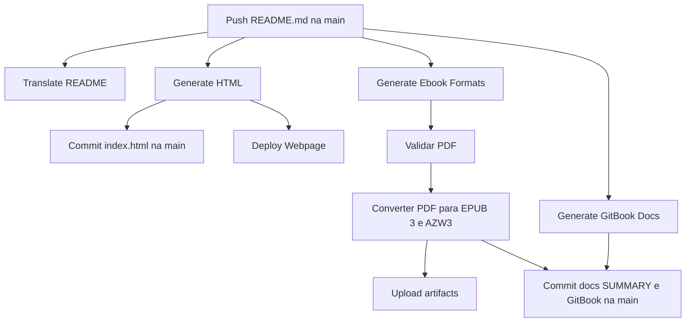

# Fluxo das GitHub Actions

Este documento descreve a ordem e a finalidade dos workflows do projeto.

## Fluxo principal

Quando `README.md` é alterado na branch `main`, os workflows de documentação são executados de forma independente:

A traducao nao bloqueia a documentacao em ingles. Se o Crowdin falhar, o HTML, o ebook e o GitBook em ingles continuam podendo ser gerados.

## Workflows

### `Translate README`

Arquivo: `workflows/translate.yml`

Executa quando:

- `README.md` muda na `main`;
- e acionado manualmente.

Responsabilidades:

- envia o README para o Crowdin;
- executa a pre-traducao;
- baixa a traducao `pt-BR`;
- publica a atualizacao da traducao.

Esse workflow nao e dependencia dos geradores em ingles.

### `Generate HTML`

Arquivo: `workflows/generate-html.yml`

Executa quando mudam:

- `README.md`;
- arquivos em `images/`;
- ou manualmente.

Gera `index.html` usando o conversor de Markdown e publica o arquivo na `main`.

### `Generate Ebook Formats`

Arquivo: `workflows/generate-ebook.yml`

Executa quando mudam:

- `README.md`;
- arquivos em `images/`;
- scripts em `scripts/node/`;
- ou manualmente na `main`.

Ordem interna:

1. Instala Node.js, Markdown-It e Playwright.
2. Instala o Chromium.
3. Remove elementos exclusivos do GitHub do README.
4. Converte blocos Mermaid em diagramas SVG reais.
5. Gera HTML com capa, sumario e CSS de impressao.
6. Renderiza o PDF em formato A4 com outline, marcadores de navegacao e estrutura tagged.
7. Valida o PDF.
8. Converte o HTML semantico para EPUB 3 usando Pandoc.
9. Inclui capa formal, metadados, identificador unico e CSS especifico para EPUB.
10. Divide o EPUB por capitulos e valida sua estrutura com EPUBCheck.
11. Converte o EPUB validado para AZW3 usando Calibre com perfil Kindle Paperwhite.
12. Publica os formatos como artifacts por 30 dias.
13. Publica PDF, EPUB e AZW3 na raiz da `main`.

O PDF permanente fica disponivel diretamente no repositorio.

### `Generate GitBook Docs`

Arquivo: `workflows/generate-docs.yml`

Executa quando mudam:

- `README.md`;
- `scripts/powershell/generate-readmes-gitbook.ps1`;
- ou manualmente.

Gera e publica:

- `docs/`;
- `SUMMARY.md`;
- `.gitbook.yaml`.

### `Deploy Webpage`

Arquivo: `workflows/deploy-webpage.yml`

Executa depois que `Generate HTML` termina com sucesso ou manualmente.

Publica o site no GitHub Pages. O job `deploy` depende do job `build` por meio de `needs: build`.

### `PSScriptAnalyzer`

Arquivo: `workflows/powershell.yml`

Executa em pushes e pull requests para `main`, alem de uma agenda semanal. Analisa os scripts PowerShell e publica os resultados SARIF.

### `Slack Notification`

Arquivo: `workflows/slack.yml`

Executa em pushes, pull requests para `main` ou manualmente. Envia o resultado para o Slack.

### `Create Release`

Arquivo: `workflows/release.yml`

Executa quando uma tag no formato `v*` e criada. Cria uma GitHub Release.

## Concorrencia e commits automaticos

Os geradores de HTML, ebook e GitBook usam grupos de concorrencia separados. Assim, uma execucao nao cancela outra antes que ela tenha oportunidade de terminar.

Como mais de um workflow pode atualizar a `main`, os commits automaticos usam `git pull --rebase` e tentativas de push para reduzir conflitos.

Os commits gerados usam `[skip ci]` e nao alteram `README.md`; por isso, nao iniciam novamente os geradores baseados no README.

## Destinos dos arquivos

| Arquivo ou resultado | Destino |
| --- | --- |
| `index.html` | Branch `main` |
| `learning-lpic-3-305-300.pdf` | Branch `main` |
| `learning-lpic-3-305-300.epub` | Branch `main`; formato recomendado para Kindle moderno e leitores EPUB |
| `learning-lpic-3-305-300.azw3` | Branch `main`; formato Kindle para dispositivos compatíveis |
| Ebook temporario | Artifact do GitHub Actions |
| `docs/`, `SUMMARY.md`, `.gitbook.yaml` | Branch `main` |
| Site | GitHub Pages |
| Traducao portuguesa | Crowdin e arquivos de traducao |

## Observacao sobre o PDF e os formatos digitais

O PDF do ebook nao e gerado a partir do `index.html` nem da pagina visualizada no GitHub. Ele e criado diretamente a partir do `README.md`, usando HTML e CSS proprios. Isso evita badges, menus, cantos do GitHub, widgets e demais elementos da interface do repositorio.

O EPUB nao e convertido diretamente do PDF. Ele usa o HTML semantico gerado para o ebook, com imagens incorporadas, permitindo texto refluivel em Kindle, Kobo, Apple Books e outros leitores. O EPUB possui capa, metadados e identificador proprio e e validado com EPUBCheck. O AZW3 e derivado do EPUB validado.
