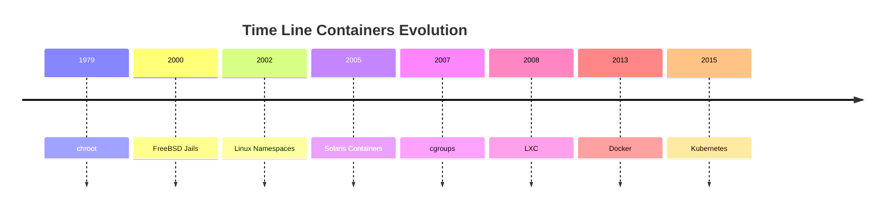

<h1><a name="readme-top"></a></h1>

[](https://github.com/marcossilvestrini/learning-lpic-3-305-300/actions/workflows/release.yml)[](https://github.com/marcossilvestrini/learning-lpic-3-305-300/actions/workflows/translate.yml)[](https://github.com/marcossilvestrini/learning-lpic-3-305-300/actions/workflows/generate-html.yml)[](https://github.com/marcossilvestrini/learning-lpic-3-305-300/actions/workflows/deploy-webpage.yml)[](https://github.com/marcossilvestrini/learning-lpic-3-305-300/actions/workflows/powershell.yml)[](https://github.com/marcossilvestrini/learning-lpic-3-305-300/actions/workflows/slack.yml)

* * *

[![MIT License][license-shield]][license-url][![Forks][forks-shield]][forks-url][![Stargazers][stars-shield]][stars-url][![Contributors][contributors-shield]][contributors-url][![Issues][issues-shield]][issues-url][![LinkedIn][linkedin-shield]][linkedin-url]

* * *

# تعلم LPIC-3 305-300


<p align="center">
<strong>Explore the docs »</strong></a>
    <br />
    <a href="https://marcossilvestrini.github.io/learning-lpic-3-305-300/">Web Site</a>
    -
    <a href="https://github.com/marcossilvestrini/learning-lpic-3-305-300">Code Page</a>
    -
    <a href="https://github.com/marcossilvestrini/learning-lpic-3-305-300/issues">Report Bug</a>
    -
    <a href="https://github.com/marcossilvestrini/learning-lpic-3-305-300/issues">Request Feature</a>
</p>

* * *

## ملخص

<details>
  <summary><b>TABLE OF CONTENT</b></summary>
  <ol>
    <li>
      <a href="#about-the-project">About The Project</a>
    </li>
    <li>
      <a href="#getting-started">Getting Started</a>
      <ul>
        <li><a href="#prerequisites">Prerequisites</a></li>
        <li><a href="#installation">installation</a></li>
      </ul>
    </li>
    <li><a href="#usage">Usage</a></li>
    <li><a href="#roadmap">Roadmap</a></li>
    <li><a href="#freedoms">Four Essential Freedoms</a></li>
    <li>
      <a href="#topic-351">Topic 351: Full Virtualization</a>
      <ul>
        <li><a href="#topic-351.1">351.1 Virtualization Concepts and Theory </a></li>
        <li><a href="#topic-351.2">351.2 Xen</a></li>
        <li><a href="#topic-351.3">351.3 QEMU</a></li>
        <li><a href="#topic-351.4">351.4 Libvirt Virtual Machine</a></li>
        <li><a href="#topic-351.5">351.5 Virtual Machine Disk Image Management</a></li>
      </ul>
    </li>
    <li>
      <a href="#topic-352">Topic 352: Container Virtualization</a>
      <ul>
        <li><a href="#topic-352.1">352.1 Container Virtualization Concepts</a></li>
        <li><a href="#topic-352.2">352.2 LXC</a></li>
        <li><a href="#topic-352.3">352.3 Docker</a></li>
        <li><a href="#topic-352.4">352.4 Container Orchestration Platforms</a></li>
      </ul>
    </li>
    <li>
      <a href="#topic-353">Topic 353: VM Deployment and Provisioning</a>
      <ul>
        <li><a href="#topic-353.1">353.1 Cloud Management Tools</a></li>
        <li><a href="#topic-353.2">353.2 Packer</a></li>
        <li><a href="#topic-353.3">353.3 cloud-init</a></li>
        <li><a href="#topic-353.4">353.4 Vagrant</a></li>
      </ul>
    </li>
    <li><a href="#license">License</a></li>
    <li><a href="#contact">Contact</a></li>
    <li><a href="#acknowledgments">Acknowledgments</a></li>
  </ol>
</details><br>

* * *

<a name="about-the-project"></a>

## حول المشروع

> يهدف هذا المشروع إلى مساعدة الطلاب أو المهنيين على تعلم المفاهيم الرئيسية لـ Gnulinux
> وبرامج مجانية \\
> سيتم تغطية بعض توزيعات Gnulinux مثل Debian و RPM \\
> سيتم أيضًا تغطية تركيب وتكوين بعض الحزم \\
> من خلال القيام بذلك ، يمكنك منح المجتمع بأكمله فرصة للاستفادة من تغييراتك. \\
> الوصول إلى الكود المصدر هو شرط مسبق لهذا. \\
> استخدم Vagrant لآلات UP وتنفيذ المختبرات وممارسة المحتوى في هذه المقالة. \\
> لقد نشرت في مجلد Vagrant a Vagrantfile مع ما هو ضروري \\
> لكي لتحميل بيئة للدراسات

* * *

<p align="right">(<a href="#readme-top">back to top</a>)</p>

<a name="getting-started"></a>

## ابدء

لبدء التعلم ، راجع الوثائق أعلاه.

<a name="prerequisites"></a>

### المتطلبات الأساسية

-   [غيت](https://git-scm.com/book/en/v2/Getting-Started-Installing-Git)
-   [محطة عمل VMware](https://blogs.vmware.com/workstation/2024/05/vmware-workstation-pro-now-available-free-for-personal-use.html)
-   [Vagrant VMware الأداة المساعدة](https://developer.hashicorp.com/vagrant/install/vmware)
-   [المتشرد](https://developer.hashicorp.com/vagrant/install)

<a name="installation"></a>

### تثبيت

استنساخ الريبو

```sh
git clone https://github.com/marcossilvestrini/learning-lpic-3-305-300.git
cd learning-lpic-3-305-300
```

تخصيص قالب_Vagrantfile-topic-xxx_. يحتوي هذا الملف على تكوين VMS للمختبرات. مثال:

-   ملف[Vagrantfile-topic-351](./vagrant/Vagrantfile-topic-351)
    -   vm.clone_directory = "&lt;your_driver_letter>:\\<folder>\\&lt;to_machine>\\#{vm_name} -instance-1 "
        مثال: vm.clone_directory = "E:\\الخوادم\\VMware\\#{vm_name} -instance-1 "
    -   VM.VMX["memsize"]= ""
    -   VM.VMX["numvcpus"]= ""
    -   VM.VMX["CPUID.CORRESPERSOCOUT"]= ""

تخصيص تكوين الشبكة في الملفات[التكوينات/الشبكة](configs/network/).

* * *

<a name="usage"></a>

## الاستخدام

استخدم هذا المستودع للحصول على التعرف على امتحان LPIC-3 305-300

### لأعلى ولأسفل

التبديل أ_Vagrantfile-topic-xxx_قالب ونسخ ملف جديد بالاسم_Vagrantfile_

```sh
cd vagrant && vagrant up
cd vagrant && vagrant destroy -f
```

### لإعادة تشغيل VMs

```sh
cd vagrant && vagrant reload
```

**مهم:**_إذا قمت بإعادة تشغيل VMs بدون Vagrant ، فلا يتم تركيب المجلد المشترك بعد التمهيد._

### استخدم PowerShell لأعلى ولأسفل

إذا كنت تستخدم منصة Windows ، فأنا أقوم بإنشاء برنامج نصي PowerShell لأعلى ولأسفل.

```powershell
vagrant/up.ps1
vagrant/destroy.ps1
```

### موضوع مخطط البنية التحتية 351


<p align="right">(<a href="#readme-top">back to top</a>)</p>

* * *

<a name="roadmap"></a>

## خريطة الطريق

-   [x] إنشاء مستودع
-   [x] إنشاء برامج نصية لتوفير مختبرات
-   [x] إنشاء أمثلة حول الموضوع 351
-   [ ] إنشاء أمثلة حول الموضوع 352
-   [ ] إنشاء أمثلة حول الموضوع 353
-   [ ] تحميل محاكاة itexam

* * *

<a name="freedoms"></a>

## أربع حريات أساسية

> 0\. حرية تشغيل البرنامج كما يحلو لك ، لأي غرض (الحرية 0). \\
> 1\. حرية دراسة كيفية عمل البرنامج ، وتغييره بحيث يفعل \\
> الحوسبة الخاصة بك كما يحلو لك (الحرية 1). \\
> الوصول إلى الكود المصدر هو شرط مسبق لهذا. \\
> 2\. حرية إعادة توزيع النسخ حتى تتمكن من مساعدة الآخرين (الحرية 2). \\
> 3\. Freedom لتوزيع نسخ من إصداراتك المعدلة للآخرين (الحرية 3).

* * *

## فحص الأوامر

```sh
type COMMAND
apropos COMMAND
whatis COMMAND --long
whereis COMMAND
COMMAND --help, --h
man COMMAND
```

<p align="right">(<a href="#readme-top">back to top</a>)</p>

* * *

<a name="topic-351"></a>

## الموضوع 351: المحاكاة الافتراضية الكاملة


* * *

<a name="topic-351.1"></a>

### 351.1 مفاهيم ونظرية المحاكاة الافتراضية

**وزن:**6

**وصف:**يجب أن يعرف المرشحون وفهم المفاهيم العامة والنظرية والمصطلحات الافتراضية. وهذا يشمل مصطلحات Xen و Qemu و Libvirt.

**مجالات المعرفة الرئيسية:**

-   🖥 فهم مصطلحات المحاكاة الافتراضية
-   ⚖ فهم إيجابيات وسلبيات المحاكاة الافتراضية
-   🛠 فهم الاختلافات المختلفة في Vypervisors وشاشات الجهاز الظاهري
-   🔄 فهم الجوانب الرئيسية لترحيل الأجهزة المادية إلى الافتراضية
-   🚀 فهم الجوانب الرئيسية لترحيل الأجهزة الافتراضية بين الأنظمة المضيفة
-   📸 فهم ميزات وآثار المحاكاة الافتراضية للجهاز الظاهري ، مثل حدود الرائحة ، والتوقف ، والاستنساخ ، وحدود الموارد
-   🌐 الوعي بالفرن ، البروكسموكس ، المصنوع من النظام و VirtualBox
-   🔗 الوعي بـ Vswitch المفتوح

#### 351.1 الكائنات المذكورة

```sh
Hypervisor
Hardware Virtual Machine (HVM)
Paravirtualization (PV)
Emulation and Simulation
CPU flags
/proc/cpuinfo
Migration (P2V, V2V)
```

#### Hypervisors

##### نوع 1 hypervisor (Hypervisor المعادن)

###### نوع 1 تعريف

يعمل مباشرة على الأجهزة المادية للمضيف ، مما يوفر طبقة أساسية لإدارة VMs دون الحاجة إلى نظام تشغيل مضيف.

###### خصائص النوع 1

-   ⚡ الأداء العالي والكفاءة.
-   ⏱ انخفاض الكمون والنفقات العامة.
-   🏢 غالبًا ما يستخدم في بيئات المؤسسات ومراكز البيانات.

###### النوع 1 أمثلة

-   VMware ESXI: Hypervisor قوي ومستخدم على نطاق واسع في إعدادات المؤسسة.
-   Microsoft Hyper-V: مدمجة مع Windows Server ، مما يوفر ميزات قوية للأداء والإدارة.
-   Xen: Hypervisor مفتوح المصدر يستخدمه العديد من مقدمي الخدمات السحابية.
-   KVM (الجهاز الظاهري المستند إلى kernel): مدمج في kernel Linux ، مما يوفر أداءً عاليًا للأنظمة المستندة إلى Linux.

##### النوع 2 Hypervisor (Hypervisor المستضافة)

###### نوع 2 تعريف

يعمل فوق نظام التشغيل التقليدي ، بالاعتماد على نظام التشغيل المضيف لإدارة الموارد ودعم الأجهزة.

###### خصائص النوع 2

-   🛠 أسهل في الإعداد والاستخدام ، وخاصة على أجهزة الكمبيوتر الشخصية.
-   🔧 أكثر مرونة للتطوير ، والاختبار ، والنشر الأصغر على نطاق.
-   🐢 عادةً أقل كفاءة من Vyricsors من النوع 1 بسبب النفقات العامة الإضافية من نظام التشغيل المضيف.

###### أمثلة من النوع 2

-   محطة عمل VMware: Hypervisor قوي لتشغيل أنظمة تشغيل متعددة على سطح مكتب واحد.
-   Oracle VirtualBox: Hypervisor مفتوح المصدر معروف بمرونته وسهولة الاستخدام.
-   Parallels Desktop: مصمم لمستخدمي Mac لتشغيل Windows وأنظمة التشغيل الأخرى إلى جانب MacOS.
-   QEMU (محاكي سريع): محاكي مفتوح المصدر وظاهري ، غالبًا ما يستخدم بالتزامن مع KVM.

##### الاختلافات الرئيسية بين النوع 1 والنوع 2 Hypervisors

-   بيئة النشر:
    -   عادة ما يتم نشر Hypervisors من النوع 1 في مراكز البيانات وبيئات المؤسسات بسبب تفاعلها المباشر مع الأجهزة والأداء العالي.
    -   يعد Hypervisors من النوع 2 أكثر ملاءمة للاستخدام الشخصي والتطوير والاختبار ومهام المحاكاة الافتراضية الصغيرة.
-   أداء:
    -   تقدم Type 1 Hypervisors بشكل عام أداء أفضل وأقل زمن انتقال لأنها لا تعتمد على نظام التشغيل المضيف.
    -   قد يعاني Hypervisors Type 2 من تدهور الأداء بسبب النفقات العامة للتشغيل فوق نظام التشغيل المضيف.
-   الإدارة وسهولة الاستخدام:
    -   تتطلب Hypervisors من النوع 1 إعداد وإدارة أكثر تعقيدًا ولكنها توفر ميزات متقدمة وقابلية للتوسع للنشر على نطاق واسع.
    -   من الأسهل تثبيت الاستخدام والاستخدام من النوع 2 ، مما يجعلها مثالية للمستخدمين الأفراد والمشاريع الأصغر.

##### أنواع الهجرة

في سياق Hypervisors ، والتي هي تقنيات تستخدم لإنشاء وإدارة الأجهزة الافتراضية ، فإن المصطلحات P2V والترحيل V2V شائعة في بيئات المحاكاة الافتراضية.  
أنها تشير إلى عمليات أنظمة ترحيل بين أنواع مختلفة من المنصات.

##### P2V - المادية للهجرة الافتراضية

تشير ترحيل P2V إلى عملية ترحيل الخادم الفعلي إلى جهاز افتراضي.  
بمعنى آخر ، يتم "تحويل" نظام التشغيل وتطبيقاته ، الذي يعمل على الأجهزة المادية المخصصة ، ونقله إلى جهاز افتراضي يعمل على Hypervisor (مثل VMware ، Hyper-V ، KVM ، إلخ).

-   مثال: لديك خادم فعلي يقوم بتشغيل نظام Windows أو Linux ، وتريد نقله إلى بيئة افتراضية ، مثل البنية التحتية السحابية أو خادم المحاكاة الافتراضية الداخلية.  
    تتضمن العملية نسخ حالة النظام بأكملها ، بما في ذلك نظام التشغيل والبرامج تشغيل وبيانات ، لإنشاء جهاز افتراضي مكافئ يمكن أن يعمل كما لو كان على الأجهزة الفعلية.

##### V2V - افتراضي للهجرة الافتراضية

تشير ترحيل V2V إلى عملية ترحيل الجهاز الظاهري من فرط إلى آخر.  
في هذه الحالة ، لديك بالفعل جهاز افتراضي يعمل في بيئة افتراضية (مثل VMware) ، وتريد نقله إلى بيئة افتراضية أخرى (على سبيل المثال ، إلى Hyper-V أو إلى خادم VMware جديد).

-   على سبيل المثال: لديك جهاز افتراضي يعمل على خادم VMware Virtualization ، لكنك تقرر ترحيله إلى منصة Hyper-V. في هذه الحالة ، تقوم ترحيل V2V بتحويل الجهاز الظاهري من تنسيق أو Hypervisor إلى آخر ، مما يضمن أن يتمكن من الاستمرار في التشغيل بشكل صحيح.

#### HVM و paravirtualization

##### المحاكاة الافتراضية بمساعدة الأجهزة (HVM)

###### تعريف HVM

تقوم HVM بتعزيز ملحقات الأجهزة التي توفرها وحدات المعالجة المركزية الحديثة لتحديد الأجهزة الافتراضية ، مما يتيح إنشاء وإدارة VMs بأقل قدر من الأداء.

###### خصائص HVM الرئيسية

-   🖥️**دعم الأجهزة**: يتطلب دعم وحدة المعالجة المركزية لملحقات المحاكاة الافتراضية مثل Intel VT-X أو AMD-V.
-   🛠️**المحاكاة الافتراضية الكاملة:**يمكن لـ VMS تشغيل أنظمة تشغيل ضيوف غير معدلة ، حيث يوفر Hypervisor محاكاة كاملة لبيئة الأجهزة.
-   ⚡**أداء:**يوفر عادة الأداء شبه الأصلي بسبب التنفيذ المباشر لرمز الضيف على وحدة المعالجة المركزية.
-   🔒**عزل:**يوفر عزلًا قويًا بين VMs لأن كل VM يعمل كما لو كان لديه أجهزة مخصصة خاصة به.

###### مثال HVM

VMware ESXI ، Microsoft Hyper-V ، KVM (الجهاز الظاهري القائم على kernel).

###### مزايا HVM

-   ✅**التوافق:**يمكن تشغيل أي نظام تشغيل دون تعديل.
-   ⚡**أداء:**أداء عالي بسبب دعم الأجهزة.
-   🔒**حماية:**تعزيز العزلة والميزات الأمنية التي توفرها الأجهزة.

###### HVM عيوب

-   🛠️**تبعية الأجهزة:**يتطلب ميزات أجهزة محددة ، مما يحد من التوافق مع الأنظمة القديمة.
-   🔧**تعقيد:**قد تتضمن تكوين وإدارة أكثر تعقيدًا.

##### paravirtualization

###### تعريف paravirtualization

يتضمن التضاريف البارافير تعديل نظام تشغيل الضيوف ليكون على دراية بالبيئة الافتراضية ، مما يسمح له بالتفاعل بشكل أكثر كفاءة مع Hypervisor.

###### خصائص المفاتيح

-   🛠️**تعديل الضيف:**يتطلب تغييرات على نظام تشغيل الضيف للتواصل مباشرة مع Hypervisor باستخدام HyperCalls.
-   ⚡**أداء:**يمكن أن تكون أكثر كفاءة من المحاكاة الافتراضية التقليدية الكاملة لأنها تقلل من النفقات العامة المرتبطة بمحاكاة الأجهزة.
-   🔗**التوافق:**يقتصر على أنظمة التشغيل التي تم تعديلها من أجل تعديل paravirtualization.

###### أمثلة paravirtualization

Xen مع ضيوف paravirtualized ، وأدوات VMware في تكوينات معينة ، وبعض تكوينات KVM.

###### مزايا paravirtualization

-   ⚡**كفاءة:**يقلل من النفقات العامة للأجهزة الافتراضية ، مما قد يقدم أداء أفضل لبعض أعباء العمل.
-   ✅**استخدام الموارد:**استخدام أكثر كفاءة لموارد النظام بسبب التواصل المباشر بين نظام التشغيل الضيف و Hypervisor.

###### العيوب

-   🛠️**تعديل نظام التشغيل الضيف:**يتطلب تعديلات على نظام التشغيل الضيف ، مما يحد من التوافق مع أنظمة التشغيل المدعومة.
-   🔧**تعقيد:**يتطلب تعقيد إضافي في نظام التشغيل الضيف لتطبيقات HyperCall.

##### الاختلافات الرئيسية

###### متطلبات نظام التشغيل الضيف

-   **HVM:**يمكن تشغيل أنظمة تشغيل الضيوف غير المعدلة.
-   **paravirtualization:**يتطلب تعديل أنظمة تشغيل الضيوف للعمل مع Hypervisor.

###### أداء

-   **HVM:**يوفر عادة الأداء شبه الأصلي بسبب التنفيذ بمساعدة الأجهزة.
-   **paravirtualization:**يمكن أن تقدم أداءً فعالاً عن طريق تقليل النفقات العامة لمضاهاة الأجهزة ، ولكنه يعتمد على نظام التشغيل الضيف المعدل.

###### تبعية الأجهزة

-   **HVM:**يتطلب ميزات وحدة المعالجة المركزية محددة (Intel VT-X ، AMD-V).
-   **paravirtualization:**لا يتطلب ميزات وحدة المعالجة المركزية محددة ولكنها تحتاج إلى نظام تشغيل ضيف معدّل.

###### عزل

-   **HVM:**يوفر عزلة قوية باستخدام ميزات الأجهزة.
-   **paravirtualization:**يعتمد على العزلة القائمة على البرمجيات ، والتي قد لا تكون قوية مثل العزلة القائمة على الأجهزة.

###### تعقيد

-   **HVM:**بشكل عام أكثر وضوحًا للنشر لأنه يدعم نظام التشغيل غير المعدل.
-   **paravirtualization:**يتطلب إعداد وتعديلات إضافية لنظام التشغيل الضيف ، مما يزيد من التعقيد.

#### NUMA (الوصول إلى الذاكرة غير موحدة)

NUMA (الوصول إلى الذاكرة غير الموحدة) هي بنية ذاكرة تستخدم في الأنظمة متعددة المعالجات لتحسين الوصول إلى الذاكرة بواسطة المعالجات.  
في نظام NUMA ، يتم توزيع الذاكرة بشكل غير متساوٍ بين المعالجات ، مما يعني أن كل معالج لديه وصول أسرع إلى جزء من الذاكرة ("ذاكرته المحلية") من الذاكرة التي تبعد جسديًا (يشار إليها باسم "الذاكرة البعيدة") وترتبط بالمعالجات الأخرى.

##### الميزات الرئيسية لعمارة NUMA

1.  **ذاكرة محلية ونائية**: كل ​​معالج لديه ذاكرته المحلية الخاصة ، والتي يمكن أن يصل بسرعة أكبر. ومع ذلك ، يمكن أيضًا الوصول إلى ذكرى المعالجات الأخرى ، على الرغم من أن هذا يستغرق وقتًا أطول.
2.  **الكمون المتمايز**: يختلف زمن الوصول للوصول إلى الذاكرة اعتمادًا على ما إذا كان المعالج يصل إلى ذاكرته المحلية أو ذاكرة عقدة أخرى. يكون الوصول إلى الذاكرة المحلي أسرع ، في حين أن الوصول إلى ذاكرة عقدة أخرى (Remote) أبطأ.
3.  **قابلية التوسع**: تم تصميم Architecture NUMA لتحسين قابلية التوسع في الأنظمة مع العديد من المعالجات. مع إضافة المزيد من المعالجات ، يتم توزيع الذاكرة أيضًا ، وتجنب عنق الزجاجة الذي سيحدث في بنية الوصول الموحد للذاكرة (UMA).

##### مزايا NUMA

-   ⚡ أداء أفضل في الأنظمة الكبيرة: نظرًا لأن كل معالج لديه ذاكرة محلية ، يمكن أن يعمل بشكل أكثر كفاءة دون التنافس مع المعالجات الأخرى للوصول إلى الذاكرة.
-   📈 قابلية التوسع: يسمح NUMA الأنظمة التي تحتوي على العديد من المعالجات وكميات كبيرة من الذاكرة لتوسيع نطاقها بشكل أكثر فعالية مقارنة ببنية UMA.

##### عيوب

-   🛠 تعقيد البرمجة: يجب أن يكون المبرمجون على دراية بمناطق الذاكرة محلية أو عن بعد ، مما يحسن استخدام الذاكرة المحلية لتحقيق أداء أفضل.
-   🐢 عقوبات الأداء المحتملة: إذا وصل المعالج بشكل متكرر إلى الذاكرة البعيدة ، فقد يعاني الأداء بسبب زمن انتقال أعلى.
    تعتبر هذه البنية شائعة في الأنظمة متعددة المعالجات عالي الأداء ، مثل الخوادم والأجهزة الكمبيوتر الفائقة ، حيث تكون قابلية التوسع وتحسين الذاكرة أمرًا بالغ الأهمية.

#### OpenSource Solutions

-   🌐 الفرن:<https://www.ovirt.org/>

-   🌐 proxmox:<https://www.proxmox.com/en/proxmox-virtual-environment/overview>

-   🌐 Oracle VirtualBox:<https://www.virtualbox.org/>

-   🌐 افتح vswitch:<https://www.openvswitch.org/>

#### أنواع المحاكاة الافتراضية

##### المحاكاة الافتراضية للأجهزة (المحاكاة الافتراضية للخادم)

###### تعريف HV

تجريد الأجهزة المادية لإنشاء الأجهزة الظاهرية (VMS) التي تعمل على أنظمة وتطبيقات تشغيل منفصلة.

###### حالات استخدام HV

مراكز البيانات ، الحوسبة السحابية ، توحيد الخادم.

###### أمثلة HV

VMware ESXI ، Microsoft Hyper-V ، KVM.

##### المحاكاة الافتراضية لنظام التشغيل (الحاوية)

###### تعريف الحاوية

يسمح بعدة مثيلات معزولة للمستخدم (الحاويات) بالتشغيل على kernel OS واحد.

###### حالات استخدام الحاويات

بنية الخدمات الدقيقة ، بيئات التطوير والاختبار.

###### أمثلة على الحاويات

Docker ، Kubernetes ، LXC.

##### الشبكة الافتراضية

###### تعريف الشبكة الافتراضية

يجمع بين موارد شبكة الأجهزة والبرامج في كيان إداري واحد يعتمد على البرمجيات.

###### حالات استخدام المحاكاة الافتراضية للشبكة

الشبكات المعرفة من قبل البرامج (SDN) ، وظيفة الشبكة الافتراضية (NFV).

###### أمثلة على الشبكة الافتراضية

VMware NSX ، Cisco ACI ، OpenStack Neutron.

##### التخزين الافتراضي

###### التعريف الافتراضي للتخزين

تجمع التخزين الفعلي من أجهزة متعددة إلى وحدة تخزين افتراضية واحدة يمكن إدارتها مركزيًا.

###### تخزين الحالات الافتراضية استخدام حالات استخدام الحالات

إدارة البيانات ، تحسين التخزين ، التعافي من الكوارث.

###### أمثلة تعريف المحاكاة الافتراضية للتخزين

IBM SAN Volume Controller ، VMware VSAN ، NetApp ontap.

##### المحاكاة الافتراضية لسطح المكتب

###### التعريف الافتراضي لسطح المكتب

يسمح لنظام تشغيل سطح المكتب بالتشغيل على جهاز افتراضي مستضاف على خادم.

###### حالات استخدام تعريف سطح المكتب حالات استخدام الحالات الافتراضية

البنية التحتية الافتراضية لسطح المكتب (VDI) ، حلول العمل عن بُعد.

###### أمثلة تعريف المحاكاة الافتراضية لسطح المكتب

تطبيقات Citrix الافتراضية وأجهزة سطح المكتب ، Horizon VMware ، خدمات سطح المكتب عن بعد Microsoft.

##### التطبيق الافتراضي

###### تعريف التطبيق الافتراضي

يفصل التطبيقات عن الأجهزة الأساسية ونظام التشغيل ، مما يسمح لها بالتشغيل في بيئات معزولة.

###### تطبيقات استخدام التعريف الافتراضي للتطبيق

تبسيط نشر التطبيق ، اختبار التوافق.

###### أمثلة تعريف الحاكة الافتراضية للتطبيق

VMware ThinApp ، Microsoft App-V ، Citrix XenApp.

##### البيانات الافتراضية

###### تعريف البيانات الافتراضية

يدمج البيانات من مصادر مختلفة دون توحيدها جسديًا ، مما يوفر رؤية موحدة للتحليل والإبلاغ.

###### حالات استخدام التعريف الافتراضي للبيانات

ذكاء الأعمال ، تكامل البيانات في الوقت الفعلي.

###### أمثلة تعريف المحاكاة الافتراضية للبيانات

Denodo ، Red Hat Jboss Data Virtualization ، IBM Infosphere.

##### فوائد المحاكاة الافتراضية

-   ⚡ كفاءة الموارد: استخدام أفضل للموارد المادية.
-   💰 توفير التكلفة: تخفيض الأجهزة والتكاليف التشغيلية.
-   📈 قابلية التوسع: من السهل توسيع نطاق أو لأسفل وفقًا للطلب.
-   🔧 المرونة: تدعم مجموعة متنوعة من أعباء العمل والتطبيقات.
-   🔄 التعافي من الكوارث: عمليات النسخ الاحتياطي والاسترداد المبسطة.
-   🔒 العزلة: تحسين الأمان من خلال عزل البيئات.

#### مضاهاة

تتضمن المحاكاة محاكاة سلوك الأجهزة أو البرامج على نظام أساسي مختلف عن المقصود في الأصل.

تتيح هذه العملية البرمجيات المصممة لنظام واحد للتشغيل على نظام آخر قد يكون له بنية أو بيئة تشغيل مختلفة.

بينما توفر المحاكاة تنوعًا من خلال تمكين تنفيذ أنظمة أو تطبيقات تشغيل الضيوف غير المعدلة ، فإنها غالبًا ما تأتي مع الأداء.

ينشأ هذا النفقات العامة لأن النظام المحاكاة يحتاج إلى تفسير وترجمة الإرشادات المخصصة للنظام الأصلي إلى تعليمات متوافقة مع النظام المضيف. نتيجة لذلك ، يمكن أن تكون المحاكاة أبطأ من التنفيذ الأصلي ، مما يجعله أقل كفاءة في المهام كثيفة الموارد.

على الرغم من هذا العيب ، تظل المحاكاة ذات قيمة لتشغيل البرمجيات القديمة ، واختبار التطبيقات عبر منصات مختلفة ، وتسهيل تطوير المنصات عبر المنصات.

#### نظام النظام

يتم تخصيص خدمة SystemD المخصصة لإدارة الأجهزة والحاويات الافتراضية داخل النظام البيئي للنظام.
 يوفر وظائف أساسية للسيطرة على مثيلات افتراضية ومراقبتها وصيانتها ، مما يوفر تكاملًا قويًا وكفاءة داخل بيئات Linux.

<p align="right">(<a href="#topic-351.1">back to sub Topic 351.1</a>)</p>
<p align="right">(<a href="#topic-351">back to Topic 351</a>)</p>
<p align="right">(<a href="#readme-top">back to top</a>)</p>

* * *

<a name="topic-351.2"></a>

### 351.2 بالتناوب


**وزن:**3

**وصف:**يجب أن يكون المرشحون قادرين على تثبيت عمليات تثبيت Xen وتكوينها وصيانتها وترحيلها واستكشافها. ينصب التركيز على Xen الإصدار 4.x.

**مجالات المعرفة الرئيسية:**

-   فهم بنية Xen ، بما في ذلك الشبكات والتخزين
-   التكوين الأساسي للعقد والمجالات XEN
-   الإدارة الأساسية للعقد والمجالات XEN
-   استكشاف الأخطاء وإصلاحها الأساسية لتركيبات XEN
-   أفارينز قبالة حبوب منع الحمل
-   وعي Xenstore
-   وعي معلمات التمهيد Xen
-   الوعي بأداة XM

#### البديل


Xen عبارة عن فرط من النوع الأول من النوع 1 (العاري المعدن) ، والذي يسمح للأنظمة التشغيلية المتعددة بالتشغيل بشكل متزامن على نفس الأجهزة المادية.  
يوفر Xen طبقة بين الأجهزة المادية والأجهزة الظاهرية (VMS) ، مما يتيح مشاركة الموارد الفعالة والعزل.

-   **بنيان:**يعمل Xen مع نظام من مستويين حيث يكون المجال 0 (DOM0) هو المجال المميز مع الوصول المباشر للأجهزة ويدير Hypervisor. تقوم الأجهزة الافتراضية الأخرى ، والتي تسمى Domain U (DOMU) ، بتشغيل أنظمة تشغيل الضيف ويتم إدارتها بواسطة DOM0.
-   **أنواع المحاكاة الافتراضية:**يدعم Xen كلا من التضليل (PV) ، والذي يتطلب نظام التشغيل الضيف المعدل ، والمحاكاة الافتراضية بمساعدة الأجهزة (HVM) ، والذي يستخدم ملحقات الأجهزة (على سبيل المثال ، Intel VT-X أو AMD-V) لتشغيل أنظمة تشغيل ضيوف غير معتمدة.
    يستخدم Xen على نطاق واسع في البيئات السحابية ، لا سيما بواسطة Amazon Web Services (AWS) وغيرهم من مقدمي الخدمات السحابية على نطاق واسع.

#### Xensource

كانت Xensource هي الشركة التي أسسها المطورون الأصليون لـ Xen Hypervisor في جامعة كامبريدج لتسويق Xen.  
قدمت الشركة حلول المؤسسات بناءً على Xen وقدمت أدوات ودعمًا إضافيين لتعزيز قدرات Xen لاستخدام المؤسسات.

-   **الاستحواذ من قبل Citrix**: في عام 2007 ، تم الحصول على Xensource بواسطة Citrix Systems ، Inc. استخدمت Citrix Technology كأساس لمنتج Citrix XenServer الخاص بها ، والذي أصبح منصة افتراضية شهيرة على مستوى المؤسسة على أساس Xen.
-   **انتقال**: بعد الاستحواذ ، استمر مشروع Xen كمشروع مفتوح المصدر ، بينما ركز Citrix على العروض التجارية مثل XenServer ، والاستفادة من تقنية XenSource.

#### مشروع Xen

يشير مشروع Xen إلى مجتمع المصدر المفتوح والمبادرة المسؤولة عن تطوير وصيانة Xen Hypervisor بعد تسويقه.  
يعمل مشروع Xen في إطار مؤسسة Linux ، مع التركيز على بناء Xen ، ودعمه ، ودعمه كجهد تعاوني يعتمد على المجتمع.

-   **الأهداف:**يهدف مشروع XEN إلى تقدم Hypervisor من خلال تحسين أدائه وأمانه وميزاته لمجموعة واسعة من حالات الاستخدام ، بما في ذلك الحوسبة السحابية ، والمحاكاة الافتراضية التي تركز على الأمان (على سبيل المثال ، QBES OS) ، والأنظمة المدمجة.
-   **المساهمين:**يضم المشروع مساهمين من مختلف المؤسسات ، بما في ذلك مقدمي الخدمات السحابية الرئيسية وبائعي الأجهزة والمطورين المستقلين.
-   **حبوب منع الحمل والهيدول:**يتضمن مشروع XEN أيضًا أدوات مثل XAPI (Xenapi) ، والتي تستخدم لإدارة عمليات تثبيت Xen Hypervisor ، ومختلف الأدوات المساعدة لإدارة النظام وتحسينها.

#### Xenstore

يعد Xen Store مكونًا مهمًا في Xen Hypervisor.  
في الأساس ، يعد Xen Store قاعدة بيانات موزعة قيمة مفتاحية تستخدم للاتصال ومشاركة المعلومات بين Xen Hypervisor والأجهزة الظاهرية (المعروفة أيضًا باسم المجالات) التي تديرها.

فيما يلي بعض الجوانب الرئيسية لمتجر Xen:

-   **التواصل بين المجالات:**يتيح Xen Store الاتصال بين المجالات ، مثل DOM0 (المجال المميز الذي يتحكم في موارد الأجهزة) والمجال (مجالات المستخدم ، وهي VMS). يتم ذلك من خلال إدخالات القيمة الرئيسية ، حيث يمكن لكل مجال قراءة أو كتابة المعلومات.

-   **إدارة التكوين:**يتم استخدامه لتخزين معلومات التكوين والوصول إليه ، مثل الأجهزة الافتراضية والشبكات ومعلمات التمهيد. هذا يسهل الإدارة الديناميكية وتكوين VMS.

-   **الأحداث والإشعارات:**يدعم متجر Xen أيضًا إشعارات الأحداث. عند تعديل مفتاح أو قيمة معينة في متجر Xen ، يمكن إخطار المجالات المهتمة للرد على هذه التغييرات. هذا مفيد لمراقبة وإدارة الموارد.

-   API Simple: يوفر Xen Store واجهة برمجة تطبيقات بسيطة لقراءة وكتابة البيانات ، مما يجعل من السهل على المطورين دمج تطبيقاتهم مع نظام المحاكاة الافتراضية Xen.

#### حبة

XAPI ، أو Xenapi ، هي واجهة برمجة التطبيقات (API) المستخدمة لإدارة Xen Hypervisor وأجهزةه الافتراضية (VMS).  
يعد XAPI مكونًا رئيسيًا لـ XenServer (المعروف الآن باسم Citrix Hypervisor) ويوفر طريقة موحدة للتفاعل مع Xen Hypervisor لأداء عمليات مثل إنشاء وتكوين ومراقبة ومراقبة VMs.

فيما يلي بعض الجوانب المهمة لـ XAPI:

-   **إدارة VM:**يسمح XAPI للمسؤولين بإنشاء الأجهزة الظاهرية وحذفها وبدءها ووقفها برمجيًا.

-   **الأتمتة:**مع XAPI ، من الممكن أتمتة إدارة الموارد الافتراضية ، بما في ذلك الشبكات والتخزين والحوسبة ، وهو أمر بالغ الأهمية للبيئات السحابية الكبيرة.

-   **اندماج:**يمكن دمج XAPI مع الأدوات والبرامج النصية الأخرى لتوفير إدارة أكثر كفاءة وتخصيصًا لبيئة Xen.

-   **التحكم في الوصول:**يوفر XAPI أيضًا آليات التحكم في الوصول لضمان أن المستخدمين المعتمدين فقط يمكنهم إجراء عمليات محددة في البيئة الافتراضية.

XAPI هي الواجهة التي تتيح التحكم في أجهزة Xen Hypervisor وأتمتة ، مما يجعل من السهل إدارة البيئات الافتراضية.

#### ملخص Xen

-   **intercroping:**تقنية Hypervisor الأساسية التي تتيح الأجهزة الافتراضية لتشغيلها على الأجهزة المادية.
-   **Xensource:**الشركة التي قامت بتسويق Xen ، التي اكتسبتها لاحقًا Citrix ، مما أدى إلى تطوير Citrix Xenserver.
-   **مشروع Xen:**المبادرة المفتوحة المصدر والمجتمع التي تواصل تطوير والحفاظ على Xen Hypervisor تحت مؤسسة Linux.
-   **Xenstore:**يعمل متجر Xen كوسيط للاتصال والتكوين بين Xen Hypervisor و VMs ، مما يؤدي إلى تبسيط تشغيل وإدارة البيئات الظاهرية.
-   **حبة**هي الواجهة التي تتيح التحكم في أجهزة Xen Hypervisor وأتمتة ، مما يجعل من السهل إدارة البيئات الافتراضية.

#### DOMAIN0 (DOM0)

Domain0 ، أو DOM0 ، هو مجال التحكم في بنية XEN. يدير المجالات الأخرى (DOMUS) ولديه وصول مباشر إلى الأجهزة.  
يقوم DOM0 بتشغيل برامج تشغيل الأجهزة ، مما يسمح لـ DOMUS ، والتي تفتقر إلى الوصول المباشر للأجهزة ، للتواصل مع الأجهزة. عادةً ما يكون مثيلًا كاملاً لنظام التشغيل ، مثل Linux ، وهو ضروري لتشغيل Xen Hypervisor.

#### المجال (البيت)

DOMUS هي مجالات غير محددة تعمل على تشغيل الأجهزة الظاهرية.  
تتم إدارتها بواسطة DOM0 وليس لديهم وصول مباشر إلى الأجهزة. يمكن تكوين DOMUS لتشغيل أنظمة تشغيل مختلفة وتستخدم لأغراض مختلفة ، مثل خوادم التطبيق وبيئات التطوير. أنها تعتمد على DOM0 لتفاعل الأجهزة.

#### Peewee-DOM (Domina paravardiyed)

PV-DOMUs استخدام تقنية تسمى paravirtualization. في هذا النموذج ، تم تعديل نظام تشغيل DOMU ليدرك أنه يعمل في بيئة افتراضية ، مما يسمح له بالتواصل مباشرة مع Hypervisor للأداء المحسن.  
ينتج عن هذا انخفاض النفقات العامة وكفاءة أفضل مقارنة بالمحاكاة الافتراضية الكاملة.

#### HVM-DOMU (الأجهزة الافتراضية المجال)

HVM-DOMUs هي أجهزة افتراضية تستخدم المحاكاة الافتراضية الكاملة ، مما يتيح تشغيل أنظمة التشغيل غير المعدلة. يوفر Xen Hypervisor مضاهاة للأجهزة لهذه DOMU ، مما يتيح لهم تشغيل أي نظام تشغيل يدعم بنية الأجهزة الأساسية.  
على الرغم من أن هذا يوفر مرونة أكبر ، إلا أنه يمكن أن يؤدي إلى ارتفاع النفقات العامة مقارنة بـ PV-DOMUs.

#### شبكة Xen

أجهزة الشبكة paravirtuled

سد

#### 351.2 الكائنات المذكورة

```sh
Domain0 (Dom0), DomainU (DomU)
PV-DomU, HVM-DomU
/etc/xen/
xl
xl.cfg 
xl.conf # Xen global configurations
xentop
oxenstored # Xenstore configurations
```

#### 351.2 ملاحظات

```sh

# Xen Settings
/etc/xen/
/etc/xen/xl.conf - Main general configuration file for Xen
/etc/xen/oxenstored.conf - Xenstore configurations

# VM Configurations
/etc/xen/xlexample.pvlinux
/etc/xen/xlexample.hvm

# Service Configurations
/etc/default/xen
/etc/default/xendomains

# xen-tools configurations
/etc/xen-tools/
/usr/share/xen-tools/

# docs
xl(1)
xl.conf(5)
xlcpupool.cfg(5)
xl-disk-configuration(5)
xl-network-configuration(5)
xen-tscmode(7)

# initialized domains auto
/etc/default/xendomains
   XENDOMAINS_AUTO=/etc/xen/auto

/etc/xen/auto/


# set domain for up after xen reboot
## create folder auto
cd /etc/xen && mkdir -p auto && cd auto

# create simbolic link
ln -s /etc/xen/lpic3-pv-guest /etc/xen/auto/lpic3-pv-guest
```

#### 351.2 أوامر مهمة

##### صورة Xen-Create-Image

```sh
# create a pv image
xen-create-image \
  --hostname=lpic3-pv-guest \
  --memory=1gb \
  --vcpus=2 \
  --lvm=vg_xen \
  --bridge=xenbr0 \
  --dhcp \
  --pygrub \
  --password=vagrant \
  --dist=bookworm
```

##### Xen-List-Ismages

```sh
# list image
xen-list-image
```

##### Xen-delete-disage

```sh
# delete a pv image
xen-delete-image lpic3-pv-guest --lvm=vg_xen
```

##### Xenstore-LS

```sh
# list xenstore infos
xenstore-ls
```

##### XL

```sh
# view xen information
xl infos

# list Domains
xl list
xl list lpic3-hvm-guest
xl list lpic3-hvm-guest -l

# uptime Domains
xl uptime

# pause Domain
xl pause 2
xl pause lpic3-hvm-guest

# save state Domains
xl -v save lpic3-hvm-guest ~root/image-lpic3-hvm-guest.save

# restore Domain
xl restore /root/image-lpic3-hvm-guest.save

# get Domain name
xl domname 2

# view dmesg information
xl dmesg

# monitoring domain
xl top
xentop
xen top

# Limit mem Dom0
xl mem-set 0 2048

# Limite cpu (not permanent after boot)
xl vcpu-set 0 2

# create DomainU - virtual machine
xl create /etc/xen/lpic3-pv-guest.cfg

# create DomainU virtual machine and connect to guest
xl create -c /etc/xen/lpic3-pv-guest.cfg

##----------------------------------------------
# create DomainU virtual machine HVM

## create logical volume
lvcreate -l +20%FREE -n lpic3-hvm-guest-disk  vg_xen

## create a ssh tunel for vnc
ssh -l vagrant -L 5900:localhost:5900  192.168.0.130

## configure /etc/xen/lpic3-hvm-guest.cfg
## set boot for cdrom: boot = "d"

## create domain hvm
xl create /etc/xen/lpic3-hvm-guest.cfg

## open vcn conection in your vnc client with localhost
## for view install details

## after installation finished, destroy domain: xl destroy <id_or_name>

## set /etc/xen/lpic3-hvm-guest.cfg: boot for hard disc: boot = "c"

## create domain hvm
xl create /etc/xen/lpic3-hvm-guest.cfg

## access domain hvm
xl console <id_or_name>
##----------------------------------------------

# connect in domain guest
xl console <id>|<name> (press enter)
xl console 1
xl console lpic3-pv-guest

#How do I exit domU "xl console" session
#Press ctrl+] or if you're using Putty press ctrl+5.

# Poweroff domain
xl shutdown lpic3-pv-guest

# destroy domain
xl destroy lpic3-pv-guest

# reboot domain
xl reboot lpic3-pv-guest

# list block devices
xl block-list 1
xl block-list lpic3-pv-guest

# detach block devices
xl block-detach lpic3-hvm-guest hdc
xl block-detach 2 xvdc

# attach block devices

## hard disk devices
xl block-attach lpic3-hvm-guest-ubuntu 'phy:/dev/vg_xen/lpic3-hvm-guest-disk2,xvde,w'

## cdrom
xl block-attach lpic3-hvm-guest 'file:/home/vagrant/isos/ubuntu/seed.iso,xvdc:cdrom,r'
xl block-attach 2 'file:/home/vagrant/isos/ubuntu/seed.iso,xvdc:cdrom,r'

# insert and eject cdrom devices
xl cd-insert lpic3-hvm-guest-ubuntu xvdb  /home/vagrant/isos/ubuntu/ubuntu-24.04.1-live-server-amd64.iso
xl cd-eject lpic3-hvm-guest-ubuntu xvdb
```

#### 251.2 ملاحظات

##### vif

في Xen ، تعني "VIF" واجهة افتراضية ويستخدم لتكوين الشبكات للأجهزة الافتراضية (المجالات).

من خلال تحديد توجيهات "VIF" في ملفات تكوين المجال ، يمكن للمسؤولين تحديد واجهات الشبكة ، وتعيين عناوين IP ، وإعداد VLAN ، وتكوين معلمات الشبكات الأخرى للأجهزة الافتراضية التي تعمل على مضيفي Xen. على سبيل المثال: VIF =[‘Bridge = xenbr0 ]، في هذه الحالة ، يربط واجهة شبكة VM بجسر Xen المسمى "Xenbr0".

````sh

<p align="right">(<a href="#topic-351.2">back to sub Topic 351.2</a>)</p>
<p align="right">(<a href="#topic-351">back to Topic 351</a>)</p>
<p align="right">(<a href="#readme-top">back to top</a>)</p>

---

<a name="topic-351.3"></a>

### 351.3 QEMU


**Weight:** 4

**Description:** Candidates should be able to install, configure, maintain, migrate and troubleshoot QEMU installations.

**Key Knowledge Areas:**

* Understand the architecture of QEMU, including KVM, networking and storage
* Start QEMU instances from the command line
* Manage snapshots using the QEMU monitor
* Install the QEMU Guest Agent and VirtIO device drivers
* Troubleshoot QEMU installations, including networking and storage
* Awareness of important QEMU configuration parameters

#### 351.3 Cited Objects

```sh
Kernel modules: kvm, kvm-intel and kvm-amd
/dev/kvm
QEMU monitor
qemu
qemu-system-x86_64
ip
brctl
tunctl
````

#### 351.3 أوامر مهمة

##### 351.3 أوامر أخرى

##### تحقق من وحدة KVM

```sh
# check if kvm is enabled
egrep -o '(vmx|svm)' /proc/cpuinfo
lscpu |grep Virtualization
lsmod|grep kvm
ls -l /dev/kvm
hostnamectl
systemd-detect-virt
```

```sh
# check if kvm is enabled
egrep -o '(vmx|svm)' /proc/cpuinfo
lscpu |grep Virtualization
lsmod|grep kvm
ls -l /dev/kvm

# check kernel infos
uname -a

# check root device
findmnt /

# mount a qcow2 image
## Example 1:
mkdir -p /mnt/qemu
guestmount -a os-images/Debian_12.0.0_VMM/Debian_12.0.0.qcow2 -i /mnt/qemu/

## Example 2:
sudo guestfish --rw -a os-images/Debian_12.0.0_VMM/Debian_12.0.0.qcow2
run
list-filesystems

# run commands in qcow2 images
## Example 1:
virt-customize -a  os-images/Debian_12.0.0_VMM/Debian_12.0.0.qcow2  --run-command 'echo hello >/root/hello.txt'
## Example 2:
sudo virt-customize -a os-images/Debian_12.0.0_VMM/Debian_12.0.0.qcow2 \
  --run-command 'echo -e "auto ens3\niface ens3 inet dhcp" > /etc/network/interfaces.d/ens3.cfg'

# generate mac 
printf 'DE:AD:BE:EF:%02X:%02X\n' $((RANDOM%256)) $((RANDOM%256))
```

##### IP

```sh
# list links
ip link show

# create bridge
ip link add br0 type bridge
```

##### BRCTL

```sh
# list links
ip link show

# create bridge
ip link add br0 type bridge
```

##### Qemu-IMG

```sh
# create image
qemu-img create -f qcow2 vm-disk-debian-12.qcow2 20G

# convert vmdk to qcow2 image
qemu-img convert \
  -f vmdk \
  -O qcow2 os-images/Debian_12.0.0_VMM/Debian_12.0.0_VMM_LinuxVMImages.COM.vmdk os-images/Debian_12.0.0_VMM/Debian_12.0.0.qcow2 \
  -p \
  -m16

# check image
qemu-img info os-images/Debian_12.0.0_VMM/Debian_12.0.0.qcow2
```

##### Qemu-System-X86_64

```sh
# create vm with ISO
qemu-system-x86_64 \
  -name lpic3-debian-12 \
  -enable-kvm -hda vm-disk-debian-12.qcow2 \
  -cdrom /home/vagrant/isos/debian/debian-12.8.0-amd64-DVD-1.iso  \
  -boot d \
  -m 2048 \
  -smp cpus=2 \
  -k pt-br

# create vm with ISO using vnc in no gui servers \ ssh connections

## create ssh tunel in host
 ssh -l vagrant -L 5902:localhost:5902  192.168.0.131

## create vm 
qemu-system-x86_64 \
  -name lpic3-debian-12 \
  -enable-kvm \
  -m 2048 \
  -smp cpus=2 \
  -k pt-br \
  -vnc :2 \
  -device qemu-xhci \
  -device usb-tablet \
  -device ide-cd,bus=ide.1,drive=cdrom,bootindex=1 \
  -drive id=cdrom,media=cdrom,if=none,file=/home/vagrant/isos/debian/debian-12.8.0-amd64-DVD-1.iso \
  -hda vm-disk-debian-12.qcow2 \
  -boot order=d \
  -vga std \
  -display none \
  -monitor stdio

# create vm with OS Image - qcow2

## create vm
qemu-system-x86_64 \
  -name lpic3-debian-12 \
  -enable-kvm \
  -m 2048 \
  -smp cpus=2 \
  -k pt-br \
  -vnc :2 \
  -hda os-images/Debian_12.0.0_VMM/Debian_12.0.0.qcow2

## create vm with custom kernel params
qemu-system-x86_64 \
  -name lpic3-debian-12 \
  -kernel /vmlinuz \
  -initrd /initrd.img \
  -append "root=/dev/mapper/debian--vg-root ro fastboot console=ttyS0" \
  -enable-kvm \
  -m 2048 \
  -smp cpus=2 \
  -k pt-br \
  -vnc :2 \
  -hda os-images/Debian_12.0.0_VMM/Debian_12.0.0.qcow2

## create vm with and attach disk
qemu-system-x86_64 \
  -name lpic3-debian-12 \
  -enable-kvm \
  -m 2048 \
  -smp cpus=2 \
  -vnc :2 \
  -hda os-images/Debian_12.0.0_VMM/Debian_12.0.0.qcow2 \
  -hdb vmdisk-debian12.qcow2 \
  -drive file=vmdisk-extra-debian12.qcow2,index=2,media=disk,if=ide \
  -netdev bridge,id=net0,br=qemubr0 \
  -device virtio-net-pci,netdev=net0
  
## create vm network netdev user
qemu-system-x86_64 \
  -name lpic3-debian-12 \
  -enable-kvm \
  -m 2048 \
  -smp cpus=2 \
  -vnc :2 \
  -hda os-images/Debian_12.0.0_VMM/Debian_12.0.0.qcow2 \
  -netdev user,id=mynet0,net=192.168.0.150/24,dhcpstart=192.168.0.155,hostfwd=tcp::2222-:22 \
  -device virtio-net-pci,netdev=mynet0

## create vm network netdev tap (Private Network)
ip link add br0 type bridge ; ifconfig br0 up
qemu-system-x86_64 \
  -name lpic3-debian-12 \
  -enable-kvm \
  -m 2048 \
  -smp cpus=2 \
  -vnc :2 \
  -hda os-images/Debian_12.0.0_VMM/Debian_12.0.0.qcow2 \
  -netdev tap,id=br0 \
  -device e1000,netdev=br0,mac=DE:AD:BE:EF:1A:24

## create vm with public bridge
#create a public bridge : https://www.linux-kvm.org/page/Networking

qemu-system-x86_64 \
  -name lpic3-debian-12 \
  -enable-kvm \
  -m 2048 \
  -smp cpus=2 \
  -hda os-images/Debian_12.0.0_VMM/Debian_12.0.0.qcow2 \
  -k pt-br \
  -vnc :2 \
  -device qemu-xhci \
  -device usb-tablet \
  -vga std \
  -display none \
  -netdev bridge,id=net0,br=qemubr0 \
  -device virtio-net-pci,netdev=net0

## get a ipv4 ip - open ssh in vm and:
dhcpclient ens4
```

#### مراقب QEMU

لبدء شاشة QEMU في استخدام سطر الأوامر**-أمستور ستيديو**بارام في**Qemu-System-X86_64**

```sh
qemu-system-x86_64 -monitor stdio
```

الخروج من Qemu-Monitor:

```sh
ctrl+alt+2
```

```sh
# Managment
info status # vm info
info cpus # cpu information
info network # network informations
stop # pause vm
cont # start vm in status pause
system_powerdown # poweroff vm
system_reset # restart monitor


# Blocks
info block # block info
boot_set d # force boot iso
change ide1-cd0  /home/vagrant/isos/debian/debian-12.8.0-amd64-DVD-1.iso  # attach cdrom
eject ide1-cd0 # detach cdrom

# Snapshots
info snapshots # list snapshots
savevm snapshot-01  # create snapshot
loadvm snapshot-01 # restore snapshot
delvm snapshot-01
```

#### وكيل الضيف

لتمكين ، استخدم:

```sh
qemu-system-x86_x64
 -chardev socket,path=/tmp/qga.sock,server=on,wait=off,id=qga0 \
 -device virtio-serial \
 -device virtserialport,chardev=qga0,name=org.qemu.guest_agent.0
```

<p align="right">(<a href="#topic-351.3">back to sub Topic 351.3</a>)</p>
<p align="right">(<a href="#topic-351">back to Topic 351</a>)</p>
<p align="right">(<a href="#readme-top">back to top</a>)</p>

* * *

<a name="topic-351.4"></a>

### 351.4 Libvirt Management Virtual Machine


**وزن:**9

**وصف:**يجب أن يكون المرشحون قادرين على إدارة مضيفي المحاكاة الافتراضية والأجهزة الافتراضية ("مجالات libvirt") باستخدام libvirt والأدوات ذات الصلة.

**مجالات المعرفة الرئيسية:**

-   فهم بنية libvirt
-   إدارة اتصالات وعقد libvirt
-   إنشاء وإدارة مجالات QEMU و XEN ، بما في ذلك اللقطات
-   إدارة وتحليل استهلاك الموارد من المجالات
-   قم بإنشاء وإدارة حمامات التخزين والمجلدات
-   إنشاء وإدارة الشبكات الافتراضية
-   ترحيل المجالات بين العقد
-   فهم كيف يتفاعل libvirt مع Xen و Qemu
-   فهم كيف يتفاعل libvirt مع خدمات الشبكة مثل DNSMASQ و RADVD
-   فهم ملفات تكوين Libvirt XML
-   وعي VIRTLOGD و VIRTLOCKD

#### 351.4 الكائنات المذكورة

```sh
libvirtd
/etc/libvirt/
/var/lib/libvirt
/var/log/libvirt
virsh (including relevant subcommands) 
```

#### 351.4 أوامر مهمة

##### فيرش

```sh
# using env variable for set virsh uri (local or remotly)
export LIBVIRT_DEFAULT_URI=qemu:///system
export LIBVIRT_DEFAULT_URI=xen+ssh://vagrant@192.168.0.130
export LIBVIRT_DEFAULT_URI='xen+ssh://vagrant@192.168.0.130?keyfile=/home/vagrant/.ssh/skynet-key-ecdsa'

# COMMONS

# get helps
virsh help
virsh help pool-create

# view version
virsh version

# view system info
sudo virsh sysinfo

# view node info
virsh nodeinfo

# hostname
virsh hostname

# check vcn allocated port
virsh vncdisplay <domain_id>
virsh vncdisplay <domain_name>
virsh vncdisplay rocky9-server01 

# HYPERVISIONER

# view libvirt hypervisioner connection
virsh uri

# list valid hypervisioners
virt-host-validate
virt-host-validate qemu

# test connetion uri(vm test)
virsh -c test:///default list

# connect remotly
virsh -c xen+ssh://vagrant@192.168.0.130
virsh -c xen+ssh://vagrant@192.168.0.130 list
virsh -c qemu+ssh://vagrant@192.168.0.130/system list

# connect remotly without enter password
virsh -c 'xen+ssh://vagrant@192.168.0.130?keyfile=/home/vagrant/.ssh/skynet-key-ecdsa'

# STORAGE

# list storage pools
virsh pool-list --details

# list all storage pool
virsh pool-list --all --details

# get a pool configuration
virsh pool-dumpxml default

# get pool info
virsh pool-info default

# create a storage pool
virsh pool-define-as --name default --type dir --target /var/lib/libvirt/images

# create a storage pool with dumpxml
virsh pool-create --overwrite --file configs/kvm/libvirt/pool.xml

# start storage pool
virsh pool-start default

# set storage pool for autostart
virsh pool-autostart default

# stop storage pool
virsh pool-destroy linux

# delete xml storage pool file
virsh pool-undefine linux

# edit storage pool
virsh pool-edit linux

# list volumes
virsh vol-list linux

# get volume infos
virsh vol-info Debian_12.0.0.qcow2 os-images
virsh vol-info --pool os-images Debian_12.0.0.qcow2 

# get volume xml
virsh vol-dumpxml rocky9-disk1 default

# create volume
virsh vol-create-as default --format qcow2 disk1 10G

# delete volume
virsh vol-delete  disk1 default

# DOMAINS \ INSTANCES \ VIRTUAL MACHINES

# list domain\instance\vm
virsh list
virsh list --all

# create domain\instance\vm
virsh create configs/kvm/libvirt/rocky9-server03.xml

# view domain\instance\vm info
virsh dominfo rocky9-server01

# view domain\instance\vm xml
virsh dumpxml rocky9-server01

# edit domain\instance\vm xml
virsh edit rocky9-server01

# stop domain\instance\vm
virsh shutdown rocky9-server01 # gracefully
virsh destroy 1
virsh destroy rocky9-server01

# suspend domain\instance\vm
virsh suspend rocky9-server01

# resume domain\instance\vm
virsh resume rocky9-server01

# start domain\instance\vm
virsh start rocky9-server01

# remove domain\instance\vm
virsh undefine rocky9-server01

# remove domain\instance\vm and storage volumes
virsh undefine rocky9-server01 --remove-all-storage

# save domain\instance\vm
virsh save rocky9-server01 rocky9-server01.qcow2

# restore domain\instance\vm
virsh restore rocky9-server01.qcow2

# list snapshots
virsh snapshot-list rocky9-server01

# create snapshot
virsh snapshot-create rocky9-server01

# restore snapshot
virsh snapshot-revert rocky9-server01 1748983520

# view snapshot xml
virsh snapshot-info rocky9-server01 1748983520

# dumpxml snapshot
virsh snapshot-dumpxml rocky9-server01 1748983520

# xml snapshot path
/var/lib/libvirt/qemu/snapshot/rocky9-server01/

# view snapshot info
virsh snapshot-info rocky9-server01 1748983671

# edit snapshot
virsh snapshot-edit rocky9-server01 1748983520

# delete snapshot
virsh snapshot-delete rocky9-server01 1748983520

# DEVICES

# list block devices
virsh domblklist rocky9-server01 --details

# add cdrom media 
virsh change-media rocky9-server01 sda /home/vagrant/isos/rocky/Rocky-9.5-x86_64-minimal.iso
virsh attach-disk rocky9-server01 /home/vagrant/isos/rocky/Rocky-9.5-x86_64-minimal.iso sda --type cdrom --mode readonly

# remove cdrom media
virsh change-media rocky9-server01 sda --eject

# add new disk
virsh attach-disk rocky9-server01  /var/lib/libvirt/images/rocky9-disk2  vdb --persistent

# remove disk
virsh detach-disk rocky9-server01 vdb --persistent

# RESOURCES (CPU and Memory)

# get cpu infos
virsh vcpuinfo rocky9-server01 --pretty
virsh dominfo rocky9-server01 | grep 'CPU'

# get vcpu count
virsh vcpucount rocky9-server01

# set vcpus maximum config
virsh setvcpus rocky9-server01 --count 4 --maximum --config
virsh shutdown rocky9-server01
virsh start rocky9-server01

# set vcpu current config
virsh setvcpus rocky9-server01 --count 4 --config

# set vcpu current live
virsh setvcpus rocky9-server01 --count 3 --current
virsh setvcpus rocky9-server01 --count 3 --live

# configure vcpu afinity config
virsh vcpupin rocky9-server01 0 7 --config
virsh vcpupin rocky9-server01 1 5-6 --config

# configure vcpu afinity current
virsh vcpupin rocky9-server01 0 7
virsh vcpupin rocky9-server01 1 5-6

# set maximum memory config
virsh setmaxmem rocky9-server01 3000000 --config
virsh shutdown rocky9-server01
virsh start rocky9-server01

# set current memory config
virsh setmem rocky9-server01 2500000 --current

# NETWORK

# get netwwork bridges
brctl show

# get iptables rules for libvirt
sudo iptables -L -n -t  nat

# list network
virsh net-list --all

# set default network
virsh net-define /etc/libvirt/qemu/networks/default.xml

# get network infos
virsh net-info default

# get xml network
virsh net-dumpxml default

# xml file
cat /etc/libvirt/qemu/networks/default.xml

# dhcp config
sudo cat /etc/libvirt/qemu/networks/default.xml | grep -A 10 dhcp
sudo cat /var/lib/libvirt/dnsmasq/default.conf

# get domain ipp address
virsh net-dhcp-leases default
virsh net-dhcp-leases default --mac 52\:54\:00\:89\:19\:86

# edit network
virsh net-edit default

# get domain network detais
virsh domiflist debian-server01

# path for network filter files
/etc/libvirt/nwfilter/

# list network filters
virsh nwfilter-list

# create network filter - block icmp traffic
virsh nwfilter-define block-icmp.xml
# virsh edit Debian-Server
    #  <interface type='network'>
    #        ...
    #        <filterref filter='block-icmp'/>
    #        ...
    # </interface>
# virsh destroy debian-server01
# virsh start debian-server01

# delete network filter
virsh nwfilter-undefine block-icmp

# get xml network filter
virsh nwfilter-dumpxml block-icmp
```

###### فضيلة

```sh
# list os variants
virt-install --os-variant list
osinfo-query os

# create domain\instance\vm with iso file
virsh vol-create-as default --format qcow2 rocky9-disk1 20G
virt-install --name rocky9-server01 \
--vcpus 2 \
--cpu host \
--memory 2048 \
--disk vol=default/rocky9-disk1 \
--cdrom /home/vagrant/isos/rocky/Rocky-9.5-x86_64-minimal.iso \
--os-variant=rocky9 \
--graphics vnc,listen=0.0.0.0,port=5905

# create debian domain\instance\vm with qcow2 file
virt-install --name debian-server01 \
--vcpus 2 \
--ram 2048 \
--disk vol=os-images/Debian_12.0.0.qcow2 \
--import \
--osinfo detect=on \
--graphics vnc,listen=0.0.0.0,port=5906 \
--network network=default \
--noautoconsole

# create rocky9 domain\instance\vm with qcow2 file
virt-install --name rocky9-server02 \
--vcpus 2 \
--ram 2048 \
--disk path=os-images/RockyLinux_9.4_VMG/RockyLinux_9.4.qcow2,format=qcow2,bus=virtio \
--import \
--osinfo detect=on \
--graphics vnc,listen=0.0.0.0,port=5907 \
--network bridge=qemubr0,model=virtio \
--noautoconsole

# open domain\instance\vm gui console
virt-viewer debian-server01

# check metadata domain\instance\vm file (if uri is qemu:////system)
less /etc/libvirt/qemu/debian-server01.xml
```

<p align="right">(<a href="#topic-351.4">back to sub Topic 351.4</a>)</p>
<p align="right">(<a href="#topic-351">back to Topic 351</a>)</p>
<p align="right">(<a href="#readme-top">back to top</a>)</p>

* * *

<a name="topic-351.5"></a>

### 351.5 إدارة صور قرص الجهاز الظاهري


**وزن:**3

**وصف:**يجب أن يكون المرشحون قادرين على إدارة صور قرص الأجهزة الافتراضية. يتضمن ذلك تحويل صور القرص بين التنسيقات المختلفة وفرط فيسور والوصول إلى البيانات المخزنة داخل الصورة.

**مجالات المعرفة الرئيسية:**

-   فهم ميزات مختلفة من تنسيقات صور القرص الظاهري ، مثل الصور الخام و QCOW2 و VMDK
-   إدارة صور قرص الجهاز الظاهري باستخدام QEMU-IMG
-   أقسام التثبيت وملفات الوصول الموجودة في صور قرص الجهاز الظاهري باستخدام libguestfish
-   نسخ محتوى القرص الفعلي إلى صورة قرص الجهاز الظاهري
-   ترحيل محتوى القرص بين تنسيقات صور قرص الجهاز الظاهري المختلفة
-   وعي بتنسيق المحاكاة الافتراضية المفتوحة (OVF)

#### 351.5 الكائنات المذكورة

```sh
qemu-img
guestfish (including relevant subcommands)
guestmount
guestumount
virt-cat
virt-copy-in
virt-copy-out
virt-diff
virt-inspector
virt-filesystems
virt-rescue
virt-df
virt-sparsify
virt-p2v
virt-p2v-make-disk
virt-v2v
```

#### 351.5 أوامر مهمة

##### 351.5.1 QEMU-IMG

```sh
# Display detailed information about a disk image
qemu-img info UbuntuServer_24.04.qcow2

# Create a new 22G raw disk image (default format is raw)
qemu-img create new-disk 22G

# Create a new 22G disk image in qcow2 format
qemu-img create -f qcow2 new-disk2 22G

# Convert a VDI image to raw format using 5 threads and show progress
qemu-img convert -f vdi -O raw Ubuntu-Server.vdk new-Ubuntu.raw -m5 -p

# Convert vmdk to qcow2 image
qemu-img convert \
-f vmdk \
-O qcow2 os-images/UbuntuServer_24.04_VM/UbuntuServer_24.04_VM_LinuxVMImages.COM.vmdk \
os-images/UbuntuServer_24.04_VM/UbuntuServer_24.04.qcow2 \
-p \
-m16

# Resize a raw image to 30G
qemu-img resize -f raw new-disk 30G

# Resize a qcow2 image to 15G(actual size 30Gdisk 30G)
qemu-img resize -f raw --shrink new-disk 15G

# Snapshots

# List all snapshots in the image
qemu-img snapshot -l new-disk2.qcow2

# Create a snapshot named SNAP1
qemu-img snapshot -c SNAP1 disk

# Apply a snapshot by ID or name
qemu-img snapshot -a 123456789 disk

# Delete the snapshot named SNAP1
qemu-img snapshot -d SNAP1 disk
```

##### سمك الضيوف

```sh
# set enviroment variables for guestfish
export LIBGUESTFS_BACKEND_SETTINGS=force_tcg

# Launch guestfish with a disk image
guestfish -a UbuntuServer_24.04.qcow2
#run
#list-partitions

# Run the commands in a script file
guestfish -a UbuntuServer_24.04.qcow2 -m /dev/sda -i < script.ssh

# Interactively run commands
guestfish --rw -a UbuntuServer_24.04.qcow2 <<'EOF'
run
list-filesystems
EOF

# Copy a file from the guest image to the host
export LIBGUESTFS_BACKEND_SETTINGS=force_tcg
sudo guestfish --rw -a UbuntuServer_24.04.qcow2 -i <<'EOF'
copy-out /etc/hostname /tmp/
EOF

# Copy a file from the host into the guest image
echo "new-hostname" > /tmp/hostname
export LIBGUESTFS_BACKEND_SETTINGS=force_tcg
sudo guestfish --rw -a UbuntuServer_24.04.qcow2 -i <<'EOF'
copy-in /tmp/hostname /etc/
EOF

# View contents of a file in the guest image
guestfish --ro -a UbuntuServer_24.04.qcow2 -i <<'EOF'
cat /etc/hostname
EOF

# List files in the guest image
export LIBGUESTFS_BACKEND_SETTINGS=force_tcg
guestfish --rw -a UbuntuServer_24.04.qcow2 -i <<'EOF'
ls /home/ubuntu
EOF

# Edit a file in the guest image
export LIBGUESTFS_BACKEND_SETTINGS=force_tcg
guestfish --rw -a UbuntuServer_24.04.qcow2 -i <<'EOF'
edit /etc/hosts
EOF
```

###### الضيوف

```sh
# Mount a disk image to a directory
guestmount -a UbuntuServer_24.04.qcow2 -m /dev/ubuntu-vg/ubuntu-lv /mnt/ubuntu
# domain
guestmount -d rocky9-server02 -m /dev/ubuntu-vg/ubuntu-lv /mnt/ubuntu 

# Mount a specific partition from a disk image
guestmount -a UbuntuServer_24.04.qcow2 -m /dev/sda2 /mnt/ubuntu
# domain
guestmount -d debian-server01 --ro -m  /dev/debian-vg/root /mnt/debian
```

###### Guestumount

```sh
# Umount a disk image to a directory
sudo guestunmount /mnt/ubuntu
```

##### Virt-DF

```sh
# Show free and used space on virtual machine filesystems
virt-df UbuntuServer_24.04.qcow2 -h
virt-df -d rocky9-server02 -h
```

##### فضيحة الأنظمة

```sh
# List filesystems, partitions, and logical volumes in a VM disk image (disk image)
virt-filesystems -a UbuntuServer_24.04.qcow2 --all --long -h

# List filesystems, partitions, and logical volumes in a VM disk image (domain)
virt-filesystems -d debian-server01 --all --long -h
```

##### الفضيلة

```sh
# Inspect and report on the operating system in a VM disk image
virt-inspector -a UbuntuServer_24.04.qcow2 #(disk)
virt-inspector -d debian-server01 #(domain) 
```

##### فضيلة

```sh
# Display the contents of a file inside a VM disk image
virt-cat -a UbuntuServer_24.04.qcow2 /etc/hosts
virt-cat -d debian-server01 /etc/hosts #(domain)
```

##### الفضيلة

```sh
# Show differences between two VM disk images
virt-diff -a UbuntuServer_24.04.qcow2 -A Rocky-Linux.qcow2
```

##### Virt-sparsify

```sh
# Make a VM disk image smaller by removing unused space
virt-sparsify UbuntuServer_24.04.qcow2 UbuntuServer_24.04-sparse.qcow2
```

##### فضيلة

```sh
# Resize a VM disk image or its partitions
virt-filesystems -a UbuntuServer_24.04.qcow2 --all --long -h #(check size of partitions)
qemu-img create -f qcow2 UbuntuServer_24.04-expanded.qcow2 100G #(create new disk image with 100G)
virt-resize --expand /dev/ubuntu-vg/ubuntu-lv \
UbuntuServer_24.04.qcow2 UbuntuServer_24.04-expanded.qcow2

```

##### الفضيلة في

```sh
# Copy files from the host into a VM disk image

virt-copy-in -a UbuntuServer_24.04.qcow2 ~vagrant/test-virt-copy-in.txt /home/ubuntu
```

##### الفضيلة

```sh
# Copy files from a VM disk image to the host
virt-copy-out -a UbuntuServer_24.04.qcow2 /home/ubuntu/.bashrc /tmp
```

##### VIRT-LS

```sh
# List files and directories inside a VM disk image
virt-ls -a UbuntuServer_24.04.qcow2 /home/ubuntu
```

##### فضيلة الإنقاذ

```sh
# Launch a rescue shell on a VM disk image for recovery
virt-rescue -a UbuntuServer_24.04.qcow2
```

##### الفضيلة

```sh
# Prepare a VM disk image for cloning by removing system-specific data
virt-sysprep -a UbuntuServer_24.04.qcow2
```

##### VIRT-V2V

```sh
# Convert a VM from a foreign hypervisor to run on KVM
virt-v2v -i disk input-disk.img -o local -os /var/tmp
```

##### VIRT-P2V

```sh
# Convert a physical machine to use KVM
```

##### VIRT-P2V-MAKE-DISK

```sh
# Create a bootable disk image for physical to virtual conversion
sudo virt-p2v-make-disk -o output.img
```

#### 351.5 ملاحظات

##### OVF: فتح تنسيق المحاكاة الافتراضية

OVF: تنسيق مفتوح يحدد معيارًا لتعبئة الأجهزة الافتراضية وتوزيعها عبر بيئات مختلفة.

تحتوي الحزمة التي تم إنشاؤها على ملحق .ova ويحتوي على الملفات التالية:

-   .ovf: ملف XML مع البيانات الوصفية التي تحدد بيئة الجهاز الظاهري
-   ملفات الصور: .vmdk ، .vhd ، .vhdx ، .qcow2 ، .Raw
-   ملفات إضافية: بيانات التعريف ، لقطات ، تكوين ، تجزئة

<p align="right">(<a href="#topic-351.5">back to sub Topic 351.5</a>)</p>
<p align="right">(<a href="#topic-351">back to Topic 351</a>)</p>
<p align="right">(<a href="#readme-top">back to top</a>)</p>

* * *

<a name="topic-352"></a>

## الموضوع 352: الحاوية الافتراضية

* * *

<a name="topic-352.1"></a>

### 352.1 مفاهيم المحاكاة الافتراضية للحاوية




* * *

**وزن:**7

**وصف:**يجب أن يفهم المرشحون مفهوم المحاكاة الافتراضية للحاويات. ويشمل ذلك فهم مكونات Linux المستخدمة لتنفيذ المحاكاة الافتراضية للحاوية وكذلك استخدام أدوات Linux القياسية لاستكشاف هذه المكونات.

**مجالات المعرفة الرئيسية:**

-   فهم مفاهيم النظام وحاوية التطبيق
-   فهم وتحليل مساحات أسماء النواة
-   فهم وتحليل مجموعات التحكم
-   فهم القدرات وتحليلها
-   فهم دور SecComp و Selinux و Apparmor للمحاكاة الافتراضية للحاوية
-   افهم كيف يستفيد LXC و Docker من مساحات الأسماء ، Cgroups ، القدرات ، SecComp و Mac
-   فهم مبدأ Runc
-   فهم مبدأ CRI-O و CONTERD
-   وعي بوقت تشغيل OCI ومواصفات الصور
-   الوعي بواجهة وقت تشغيل حاوية Kubernetes (CRI)
-   إدراك بودمان ، بوتا و scopeo
-   إدراك نهج المحاكاة الافتراضية الأخرى للحاويات في Linux وأنظمة التشغيل الحرة الأخرى ، مثل السجون RKT أو OpenVZ أو Systemd-Nspawn أو BSD

* * *

#### 352.1 الكائنات المذكورة

```sh
nsenter
unshare
ip (including relevant subcommands)
capsh
/sys/fs/cgroups
/proc/[0-9]+/ns
/proc/[0-9]+/status
```

* * *

#### chroot - تغيير دليل الجذر في UNIX/Linux


##### ما هو chroot؟

CHRoot (اختصار لتغيير جذر) هو استدعاء النظام وأمر على أنظمة التشغيل التي تشبه UNIX التي تغير دليل الجذر الظاهر (/) لعملية التشغيل الحالية وأطفالها. هذا يخلق بيئة معزولة ، يشار إليها عادة باسم سجن chroot.

##### 🧱 الحالات الغرض والاستخدام

-   🔒 عزل طلبات الأمن (السجن).
-   🧪 إنشاء بيئات اختبار دون التأثير على بقية النظام.
-   🛠 استرداد النظام (على سبيل المثال ، التمهيد في livecd و chroot في نظام مثبت).
-   📦 بناء حزم برامج في بيئة خاضعة للرقابة.

##### 📁 الحد الأدنى للهيكل المطلوب

يجب أن يكون للبيئة chroot ملفاتها الأساسية والهيكل الأساسي:

```sh
/mnt/myenv/
├── bin/
│   └── bash
├── etc/
├── lib/
├── lib64/
├── usr/
├── dev/
├── proc/
└── tmp/
```

استخدم LDD لتحديد المكتبات المطلوبة:

```sh
ldd /bin/bash
```

##### 🚨 القيود واعتبارات الأمن

-   chroot ليس حدود أمنية مثل الحاويات أو VMs.
-   يمكن للمستخدم المميز (الجذر) داخل السجن أن يندلع.
-   لا عزل مساحات أسماء العملية أو الأجهزة أو الموارد على مستوى النواة.

لعزلة أقوى ، فكر في بدائل مثل:

-   حاويات Linux (LXC ، Docker)
-   الأجهزة الافتراضية (KVM ، QEMU)
-   مساحات أسماء kernel و cgroups

##### 🧪 مثال: إعداد بيئة chroot الأساسية

استخدم هذا البرنامج النصي لإعداد بيئة CHRoot الحد الأدنى:

[**chroot.sh**](scripts/container/chroot.sh)

##### 🧪 اختبار chroot مع debootstrap

```sh
# download debain files
sudo debootstrap stable ~vagrant/debian http://deb.debian.org/debian
sudo chroot ~vagrant/debian bash
```

#### 🔍 فهم الحاويات


الحاويات هي تقنية للمحاكاة الافتراضية خفيفة الوزن تقوم بتعبئة التطبيقات جنبًا إلى جنب مع تبعياتها المطلوبة - الكود ، والمكتبات ، ومتغيرات البيئة ، وملفات التكوين - إلى وحدات معزولة ومحمولة وقابلة للتكرار.

> بعبارات بسيطة: الحاوية عبارة عن صندوق مستقل ذاتي يدير تطبيقك بنفس الطريقة ، في أي مكان.

##### 💡 ما هي الحاوية؟

على عكس الأجهزة الافتراضية (VMS) ، فإن الحاويات لا تضعف الأجهزة. بدلاً من ذلك ، فإنهم يظهرون نظام التشغيل. تشترك الحاويات في نفس نواة Linux مع المضيف ، لكن كل واحدة تعمل في مساحة مستخدم معزولة بالكامل.

📌 الحاويات مقابل الأجهزة الافتراضية:

| ميزة            | الحاويات                      | الأجهزة الافتراضية             |
| --------------- | ----------------------------- | ------------------------------ |
| OS kernel       | مشاركة مع المضيف              | كل VM له نظام التشغيل الخاص به |
| وقت بدء التشغيل | سريع (ثوان أو أقل)            | بطيء (دقائق)                   |
| حجم الصورة      | خفيفة الوزن (MBS)             | ثقيلة (GBS)                    |
| كفاءة الموارد   | عالي                          | أدنى                           |
| آلية العزلة     | ميزات kernel (مساحات الأسماء) | Hypervisor                     |

##### 🔑 الخصائص الرئيسية للحاويات

🔹**خفيف الوزن**: مشاركة مضيف OS kernel ، تقليل النفقات العامة وتمكين بدء التشغيل السريع.

🔹**محمول**: تشغيل باستمرار عبر بيئات مختلفة (DEV ، التدريج ، prod ، السحابة ، on-prem).

🔹**معزول**: استخدام مساحات الأسماء للعملية والشبكة وعزل نظام الملفات.

🔹**فعال**: تمكين كثافة أعلى واستخدام الموارد الأفضل من VMs التقليدية.

🔹**قابل للتطوير**: مثالية لخدمات الخدمات الصغيرة والهندسة المعمارية السحابية.

##### 🧱 أنواع الحاويات

1.  حاويات النظام
    -   مصممة لتشغيل نظام التشغيل بأكمله ، يشبه الأجهزة الافتراضية.
    -   دعم عمليات متعددة وخدمات النظام (init ، syslog).
    -   مثالية للتطبيقات القديمة أو المتجانسة.
    -   مثال: LXC ، libvirt-lxc.

2.  حاويات التطبيق
    -   مصممة لتشغيل عملية واحدة.
    -   عديمة الجنسية ، سريعة الزوال ، وقابلة للتطوير أفقيا.
    -   تستخدم على نطاق واسع في بيئات DevOps الحديثة و kubernetes.
    -   مثال: Docker ، حاوية ، CRI-O.

##### 🚀 أوقات تشغيل الحاويات الشائعة

| وقت التشغيل    | وصف                                                             |
| -------------- | --------------------------------------------------------------- |
| **عامل ميناء** | الأكثر تبنيًا على نطاق واسع CLI/Daemon لبناء الحاويات وتشغيلها. |
| **حاوية**      | وقت تشغيل خفيف الوزن يعمل Docker و Kubernetes.                  |
| **انتقدها**    | وقت التشغيل في Kubernetes للحاويات OCI.                         |
| **LXC**        | حاويات نظام Linux التقليدية ، أقرب إلى نظام التشغيل الكامل.     |
| **RKT**        | وقت التشغيل الذي يركز على الأمن (تم إهماله).                    |

##### 🔐 الحاويات الداخلية والعناصر الأمنية

| عنصر                   | دور                                                                      |
| ---------------------- | ------------------------------------------------------------------------ |
| **مساحات الأسماء**     | عزل العمليات ، المستخدمين ، حوامل ، شبكات.                               |
| **cgroups**            | التحكم والحد من استخدام الموارد (وحدة المعالجة المركزية ، الذاكرة ، IO). |
| **القدرات**            | التحكم في الامتياز الدقيق داخل الحاويات.                                 |
| **Seccomp**            | يقيد SYSCALLS يسمح للحد من سطح الهجوم.                                   |
| **apparmor / selinux** | إنفاذ التحكم في الوصول الإلزامي على مستوى kernel.                        |

* * *

#### 🧠 فهم مساحات أسماء Linux


مساحات الأسماء هي ميزة Kernel الأساسية Linux تتيح العزلة على مستوى العملية. يقومون بإنشاء "طرق عرض" منفصلة لموارد النظام العالمية - مثل معرفات العمليات والشبكات وأنظمة الملفات والمستخدمين - بحيث تعتقد كل مجموعة عملية أنها تعمل في نظامها الخاص.

> بعبارات بسيطة: تخدع مساحات الأسماء عملية في التفكير في أنها تمتلك الجهاز ، على الرغم من أنها تشاركها فقط.

هذا هو الأساس لعزل الحاوية.

##### 🔍 ماذا تعزل مساحات الأسماء؟

كل نوع مساحة الاسم يعزل مورد نظام معين. معا ، يشكلون صندوق الرمل الذي تعمل فيه الحاوية في:

| مساحة الاسم     | العزلات ...               | مثال في العالم الحقيقي                                                       |
| --------------- | ------------------------- | ---------------------------------------------------------------------------- |
| **بيد**         | معرفات العملية            | العمليات داخل حاوية انظر مساحة PID مختلفة                                    |
| **جبل**         | نقاط التثبيت نظام الملفات | ترى كل حاوية نظام ملفات الجذر الخاص بها                                      |
| **شبكة**        | مكدس الشبكة               | تحتوي الحاويات على IPS وواجهات وطرق معزولة                                   |
| **UTS**         | اسم المضيف واسم المجال    | تقوم كل حاوية بتعيين اسم المضيف الخاص بها                                    |
| **IPC**         | الذاكرة المشتركة والرملة  | يمنع التواصل بين العمليات بين الحاويات                                       |
| **مستخدم**      | معرفات المستخدم والمجموعة | يتيح الجذر المزيف (UID 0) داخل الحاوية                                       |
| **Cgroup (V2)** | عضوية المجموعة الضابطة    | العلاقات في عناصر التحكم في الموارد مثل وحدة المعالجة المركزية وحدود الذاكرة |

##### 🧪 القياس البصري


تخيل مبنى مكاتب مشترك:

-   يشترك جميع المستأجرين في نفس الأساس (Linux kernel).
-   كل شركة لديها مكتب خاص بها (مساحة الاسم): أقفال مختلفة وأثاث وخطوط الهاتف واسم الشركة.
-   لكل مستأجر ، يبدو وكأنه مبنى خاص بهم.

هذه هي بالضبط الطريقة التي تواجه بها الحاويات النظام - معزولة ، ولكنها فعالة.

##### 🔧 كيف تستخدم الحاويات مساحات الأسماء

عندما تقوم بتشغيل حاوية (على سبيل المثال ، مع Docker أو Podman) ، يقوم وقت التشغيل بإنشاء مجموعة جديدة من مساحات الأسماء:

```bash
docker run -it --rm alpine sh
```

هذا الأمر يعطي العملية:

-   مساحة اسم PID جديدة → إنها عملية 1 داخل الحاوية.
-   مساحة اسم شبكة جديدة → Ethernet الافتراضية الخاصة بها.
-   مساحة اسم جبل → نظام ملفات جذر خاص بالحاوية.
-   مساحات أسماء أخرى اعتمادًا على التكوين (المستخدم ، IPC ، إلخ)

The result: a lightweight, isolated runtime environment that behaves like a separate system.

##### ⚙ ميزات النواة التكميلية

مساحات الأسماء تخفي الموارد من الحاويات. ولكن للتحكم في مقدار ما يمكنهم استخدامه وما يمكنهم فعله ، نحتاج إلى آليات إضافية:

##### cgroups (مجموعات التحكم)

تسمح مجموعات CGROUPS للنواة بتقييد استخدام الموارد وتحديد أولوياتها ومراقبتها عبر مجموعات العمليات.

| الموارد                | استخدم أمثلة الحالة                          |
| ---------------------- | -------------------------------------------- |
| وحدة المعالجة المركزية | الحد من وقت وحدة المعالجة المركزية لكل حاوية |
| ذاكرة                  | استخدام كب رام                               |
| القرص i/o              | خانق القراءة/الكتابة العمليات                |
| الشبكة (V2)            | قيود النطاق الترددي                          |

🛡 يمنع مشكلة "الجار الصاخب" عن طريق منع حاوية واحدة من استهلاك جميع موارد النظام.

##### القدرات

يستخدم Linux التقليدي نموذج امتياز ثنائي: يمكن للجذر (UID 0) فعل كل شيء ، كل شخص آخر محدود.

| القدرة                 | يسمح ...                                         |
| ---------------------- | ------------------------------------------------ |
| `CAP_NET_BIND_SERVICE` | ملزمة للمنافذ المميزة (على سبيل المثال 80 ، 443) |
| `CAP_SYS_ADMIN`        | إحدى جميع أنحاء مهام مسؤول النظام                |
| `CAP_KILL`             | إرسال إشارات إلى العمليات التعسفية               |

عن طريق إسقاط القدرات غير الضرورية ، يمكن أن تعمل الحاويات فقط بما يحتاجون إليه - مما يقلل من المخاطر.

##### 🔐 آليات الأمن

تستخدم بالاقتران مع مساحات الأسماء ومجموعات cgroups لقفل ما يمكن أن تفعله عملية الحاويات:

| ميزة         | وصف                                                   |
| ------------ | ----------------------------------------------------- |
| **Seccomp**  | مكالمات نظام Linux للأبيض أو Block (Syscalls)         |
| **apparmor** | تطبيق ملفات تعريف أمنية لكل تطبيق                     |
| **Selinux**  | فرض التحكم الإلزامي في الوصول مع سياسات النظام الضيقة |

##### 🧠 ملخص للمبتدئين

> ✅ مساحات الأسماء تعزل ما يمكن أن تراه الحاوية  
> ✅ Cgroups تتحكم في ما يمكن أن تستخدمه  
> ✅ القدرات والوحدات الأمنية تحدد ما يمكن أن تفعله

معا ، تشكل ميزات kernel العمود الفقري الفني لعزل الحاويات-مما يتيح نشر تطبيقات عالية الكثافة وآمنة وفعالة دون VMs كاملة.

##### 🧠 فهم مجموعات cgroups (مجموعات التحكم)

````sh
Verificar os Cgroups do sistema
# systemctl status
# systemd-cgls

Ferramentas de manipulação dos Cgroups
# apt-get install cgroup-tools

# cgcreate -g memory,cpu:lsf
# cgclassify -g memory,cpu:lsf <PID>
---

#### 352.1 Important Commands

##### unshare

```sh
# create a new namespaces and run a command in it
unshare --mount --uts --ipc --user --pid --net  --map-root-user --mount-proc --fork chroot ~vagrant/debian bash
# mount /proc for test
#mount -t proc proc /proc
#ps -aux
#ip addr show
#umount /proc
````

##### LSNS

```sh
# show all namespaces
lsns

# show only pid namespace
lsns -s <pid>
lsns -p 3669

ls -l /proc/<pid>/ns
ls -l /proc/3669/ns

ps -o pid,pidns,netns,ipcns,utsns,userns,args -p <PID>
ps -o pid,pidns,netns,ipcns,utsns,userns,args -p 3669
```

##### nsenter

```sh
# execute a command in namespace
sudo nsenter -t <PID> -n  ip link show
sudo nsenter -t 3669 -n ip link show
```

##### 252.1 IP

```sh
# create a new network namespace
sudo ip netns add lxc1

# list network list
ip netns list

# exec command in network namespace
sudo ip netns exec lxc1 ip addr show
```

* * *

<p align="right">(<a href="#topic-352.1">back to sub topic 352.1</a>)</p>
<p align="right">(<a href="#topic-352">back to topic 352</a>)</p>
<p align="right">(<a href="#readme-top">back to top</a>)</p>

* * *

<a name="topic-352.2"></a>

### 352.2 LXC

**وزن:**6

**وصف:**يجب أن يكون المرشحون قادرين على استخدام حاويات النظام باستخدام LXC و LXD. إصدار LXC المغطى هو 3.0 أو أعلى.

**مجالات المعرفة الرئيسية:**

-   فهم بنية LXC و LXD
-   إدارة حاويات LXC استنادًا إلى الصور الموجودة باستخدام LXD ، بما في ذلك الشبكات والتخزين
-   تكوين خصائص حاوية LXC
-   الحد من استخدام موارد حاوية LXC
-   استخدم ملفات تعريف LXD
-   فهم صور LXC
-   الوعي بأدوات LXC التقليدية

#### 352.2 الكائنات المذكورة

```sh
lxd
lxc (including relevant subcommands)
```

#### 352.2 أوامر مهمة

##### فو

```sh
foo
```

<p align="right">(<a href="#topic-352.2">back to sub topic 352.2</a>)</p>
<p align="right">(<a href="#topic-352">back to topic 352</a>)</p>
<p align="right">(<a href="#readme-top">back to top</a>)</p>

* * *

<a name="topic-352.3"></a>

### 352.3 Docker

**وزن:**9

**وصف:**يجب أن يكون المرشح قادرًا على إدارة العقد العقد وحاويات Docker. ويشمل ذلك فهم بنية Docker بالإضافة إلى فهم كيفية تفاعل Docker مع نظام Linux للعقدة.

**مجالات المعرفة الرئيسية:**

-   فهم الهندسة المعمارية ومكونات Docker
-   إدارة حاويات Docker باستخدام الصور من سجل Docker
-   فهم وإدارة الصور والمجلدات لحاويات Docker
-   فهم وإدارة تسجيل حاويات Docker
-   فهم وإدارة الشبكات من أجل Docker
-   استخدم Dockerfiles لإنشاء صور الحاوية
-   قم بتشغيل سجل Docker باستخدام صورة Docker Registry

#### 352.3 الكائنات المذكورة

```sh
dockerd
/etc/docker/daemon.json
/var/lib/docker/
docker
Dockerfile
```

#### 352.3 أوامر مهمة

##### عامل ميناء

```sh
# Examples of docker
```

<p align="right">(<a href="#topic-352.3">back to sub topic 352.3</a>)</p>
<p align="right">(<a href="#topic-352">back to topic 352</a>)</p>
<p align="right">(<a href="#readme-top">back to top</a>)</p>

* * *

<a name="topic-352.4"></a>

### 352.4 منصات تزامن الحاويات

**وزن:**3

**وصف:**يجب أن يفهم المرشحون أهمية تزامن الحاويات والمفاهيم الرئيسية التي توفرها Docker Swarm و Kubernetes لتنفيذ تزامن الحاويات.

**مجالات المعرفة الرئيسية:**

-   فهم أهمية تزامن الحاويات
-   Understand the key concepts of Docker Compose and Docker Swarm
-   فهم المفاهيم الرئيسية لـ Kubernetes و Helm
-   وعي OpenShift و Rancher و Mesosphere DC/OS

<p align="right">(<a href="#topic-352.4">back to sub topic 352.4</a>)</p>
<p align="right">(<a href="#topic-352">back to topic 352</a>)</p>
<p align="right">(<a href="#readme-top">back to top</a>)</p>

* * *

<a name="topic-353"></a>

## الموضوع 353: نشر VM وتوفيره

* * *

<a name="topic-353.1"></a>

### 353.1 أدوات إدارة السحابة

**وزن:**2

**وصف:**يجب أن يفهم المرشحون العروض الشائعة في السحب العامة ولديهم معرفة أساسية بأدوات إدارة السحابة المتاحة بشكل شائع.

**مجالات المعرفة الرئيسية:**

-   فهم العروض الشائعة في السحب العامة
-   معرفة الميزة الأساسية من OpenStack
-   معرفة الميزة الأساسية من terraform
-   الوعي بـ Cloudstack و Eucalyptus و OpenNebula

#### 353.1 الكائنات المذكورة

```sh
IaaS, PaaS, SaaS
OpenStack
Terraform
```

#### 353.1 أوامر مهمة

##### فو

```sh
# examples
```

<p align="right">(<a href="#topic-353.1">back to sub topic 353.1</a>)</p>
<p align="right">(<a href="#topic-353">back to topic 353</a>)</p>
<p align="right">(<a href="#readme-top">back to top</a>)</p>

* * *

<a name="topic-353.2"></a>

### 353.2 باكر

**وزن:**2

**وصف:**يجب أن يكون المرشحون قادرين على استخدام Packer لإنشاء صور النظام. ويشمل ذلك تشغيل Packer في بيئات سحابية عامة وخاصة خاصة بالإضافة إلى بناء صور الحاويات لـ LXC/LXD.

**مجالات المعرفة الرئيسية:**

-   فهم وظائف وميزات باكر
-   إنشاء ملفات القالب والحفاظ عليها
-   قم ببناء الصور من ملفات القالب باستخدام بناة مختلفة

#### 353.2 الكائنات المذكورة

```sh
packer
```

#### 353.2 أوامر مهمة

##### باكر

```sh
# examples
```

<p align="right">(<a href="#topic-353.2">back to sub topic 353.2</a>)</p>
<p align="right">(<a href="#topic 353">back to topic 353</a>)</p>
<p align="right">(<a href="#readme-top">back to top</a>)</p>

* * *

<a name="topic-353.3"></a>

### 353.3 السحابة

**وزن:**3

**وصف:**يجب أن يتمكن المرشحون من استخدام السحابة لتكوين الأجهزة الافتراضية التي تم إنشاؤها من صور موحدة. يتضمن ذلك ضبط الأجهزة الافتراضية لمطابقة موارد الأجهزة المتاحة الخاصة بهم ، وتحديداً مساحة القرص والمجلدات.  
بالإضافة إلى ذلك ، يجب أن يكون المرشحون قادرين على تكوين مثيلات للسماح بتأمين تسجيلات تسجيلات SSH وتثبيت مجموعة محددة من حزم البرامج.  
علاوة على ذلك ، يجب أن يكون المرشحون قادرين على إنشاء صور نظام جديدة بدعم من السحابة.

**مجالات المعرفة الرئيسية:**

-   فهم ميزات ومفاهيم السحابة ، بما في ذلك بيانات المستخدم ، وتهيئة وتكوين السحابة
-   استخدم Cloud-Init لإنشاء أنظمة الملفات وتغيير حجمها وتثبيتها وتكوين حسابات المستخدمين ، بما في ذلك بيانات اعتماد تسجيل الدخول مثل مفاتيح SSH وتثبيت حزم البرامج من مستودع التوزيع
-   دمج السحابة في صور النظام
-   استخدم Config Drive DataSource للاختبار

#### 353.3 الكائنات المذكورة

```sh
cloud-init
user-data
/var/lib/cloud/
```

#### 353.3 أوامر مهمة

##### فو

```sh
# examples
```

<p align="right">(<a href="#topic-353.3">back to sub topic 353.3</a>)</p>
<p align="right">(<a href="#topic 353">back to topic 353</a>)</p>
<p align="right">(<a href="#readme-top">back to top</a>)</p>

* * *

<a name="topic-353.4"></a>

### 353.4 المتشرد

**وزن:**3

**وصف:**يجب أن يكون المرشح قادرًا على استخدام Vagrant لإدارة الأجهزة الافتراضية ، بما في ذلك توفير الجهاز الظاهري.

**مجالات المعرفة الرئيسية:**

-   فهم بنية ومفاهيم المتشرد ، بما في ذلك التخزين والشبكات
-   استرداد واستخدام الصناديق من أطلس
-   إنشاء وتشغيل Vagrantfiles
-   الوصول إلى الأجهزة الافتراضية المتشردة
-   مشاركة المجلد ومزامنته بين جهاز افتراضي متشرد ونظام المضيف
-   فهم توفير المتشرد ، أي مزودي الملفات والقذائف
-   فهم الإعداد متعدد الآلات

#### 353.4 الكائنات المذكورة

```sh
vagrant
Vagrantfile
```

#### 353.4 أوامر مهمة

##### المتشرد

```sh
# examples
```

<p align="right">(<a href="#topic-353.4">back to sub topic 353.4</a>)</p>
<p align="right">(<a href="#topic 353">back to topic 353</a>)</p>
<p align="right">(<a href="#readme-top">back to top</a>)</p>

* * *

## المساهمة

المساهمات هي التي تجعل مجتمع المصدر المفتوح مكانًا رائعًا
تعلم ، إلهام ، وخلق. أي مساهمات تقدمها**موضع تقدير كبير**.

إذا كان لديك اقتراح من شأنه أن يجعل هذا أفضل ، فيرجى توتر ريبو و
إنشاء طلب سحب. يمكنك أيضًا فتح مشكلة مع علامة "تحسين".
لا تنسى إعطاء المشروع نجمًا! شكرًا لك مرة أخرى!

1.  شوكة المشروع
2.  قم بإنشاء فرع الميزات الخاص بك (`git checkout -b feature/AmazingFeature`)
3.  ارتكاب تغييراتك (`git commit -m 'Add some AmazingFeature'`)
4.  ادفع إلى الفرع (`git push origin feature/AmazingFeature`)
5.  افتح طلب سحب

* * *

## رخصة

-   تم ترخيص هذا المشروع بموجب ترخيص معهد ماساتشوستس للتكنولوجيا \* راجع ملف الترخيص.

* * *

## اتصال

ماركوس سيلفيستريني -[marcos.silvestrini@gmail.com](mailto:marcos.silvestrini@gmail.com)\\[](https://twitter.com/mrsilvestrini)

رابط المشروع:<https://github.com/marcossilvestrini/learning-lpic-3-305-300>

<p align="right">(<a href="#readme-top">back to top</a>)</p>

* * *

## شكر وتقدير

-   [ريتشارد ستالمان](http://www.stallman.org/)
-   [جنو](<>)
    -   [الأسئلة الشائعة في GNU/Linux بواسطة ريتشارد ستالمان](https://www.gnu.org/gnu/gnu-linux-faq.html)
    -   [جنو](https://www.gnu.org/)
    -   [نظام التشغيل GNU](https://www.gnu.org/gnu/thegnuproject.html)
    -   [برنامج التحويل البرمجي](https://gcc.gnu.org/wiki/History)
    -   [قطران GNU](https://www.gnu.org/software/tar/)
    -   [جعل GNU](https://www.gnu.org/software/make/)
    -   [GNU emacs](https://en.wikipedia.org/wiki/Emacs)
    -   [حزم GNU](https://www.gnu.org/software/)
    -   [مجموعة GNU/Linux](https://directory.fsf.org/wiki/Collection:GNU/Linux)
    -   [Gnu Grub Bootloader](https://www.gnu.org/software/grub/)
    -   [جنو هيرد](https://www.gnu.org/software/hurd/hurd/what_is_the_gnu_hurd.html)
-   [نواة](<>)
    -   [نواة](https://www.kernel.org/)
    -   [صفحات رجل Kernel Linux](https://www.kernel.org/doc/man-pages/)
    -   [تجميع نواةك](https://wiki.linuxquestions.org/wiki/How_to_build_and_install_your_own_Linux_kernel)
-   [قاعدة Linux القياسية](<>)
    -   [قاعدة Linux القياسية](https://en.wikipedia.org/wiki/Linux_Standard_Base)
    -   [معيار التسلسل الهرمي لنظام الملفات](https://en.wikipedia.org/wiki/Filesystem_Hierarchy_Standard)
    -   [بنية التسلسل الهرمي](https://refspecs.linuxfoundation.org/FHS_3.0/fhs-3.0.pdf)
-   [برنامج مجاني](<>)
    -   [FSF](https://www.fsf.org)
    -   [دليل برامج مجاني](https://directory.fsf.org/wiki/Free_Software_Directory:Free_software_replacements)
-   [رخصة](<>)
    -   [برنامج مجاني](https://www.gnu.org/philosophy/free-sw.html)
    -   [Lopitleft](https://www.gnu.org/licenses/copyleft.en.html)
    -   [GPL](https://www.gnu.org/licenses/quick-guide-gplv3.html)
    -   [رخصة عامة عامة في GNU](https://www.gnu.org/licenses/lgpl-3.0.html)
    -   [BSD](https://opensource.org/licenses/BSD-3-Clause)
    -   [مبادرة المصدر المفتوح](https://opensource.org/)
    -   [المشاعات الإبداعية](https://creativecommons.org/)
    -   [ترخيص LTS](https://en.wikipedia.org/wiki/Long-term_support)
-   [توزيع](<>)
    -   [إرشادات البرمجيات المجانية Debian](https://www.debian.org/social_contract#guidelines)
    -   [قائمة التوزيع Linux](https://en.wikipedia.org/wiki/List_of_Linux_distributions)
    -   [DivOwatch](https://distrowatch.com/)
    -   [مقارنة توزيعات Linux](https://en.wikipedia.org/wiki/Comparison_of_Linux_distributions)
-   [بيئات سطح المكتب](<>)
    -   [x11 org](https://www.x.org/wiki/)
    -   [وايلاند](https://wayland.freedesktop.org/)
    -   [جنو جنوم](https://www.gnu.org/press/gnome-1.0.html)
    -   [جنوم](https://www.gnome.org/)
    -   [XFCE](https://xfce.org/)
    -   [حيث البلازما](https://kde.org/plasma-desktop/)
    -   [انسجام](https://en.wikipedia.org/wiki/Harmony_(toolkit))
-   [بروتوكولات](<>)
    -   [http](<>)
        -   [W3Techs](https://w3techs.com/)
        -   [أباتشي](https://www.apache.org/)
        -   [توجيهات أباتشي][def]
        -   [رموز حالة HTTP](https://en.wikipedia.org/wiki/List_of_HTTP_status_codes)
        -   [الأصفار القوية لأباش ، nginx و lighttpd](https://cipherlist.eu/)
        -   [دروس SSL](https://www.golinuxcloud.com/blog/)
        -   [SSL Config Mozilla](https://ssl-config.mozilla.org/)
    -   [XRDP](https://bytexd.com/xrdp-centos/)
    -   [NTP](https://www.ntppool.org/en/)
-   [DNS](<>)
    -   [ربط](https://www.isc.org/bind/)
    -   [ربط التسجيل](https://www.zytrax.com/books/dns/ch7/logging.html)
    -   [قائمة أنواع سجلات DNS](https://en.wikipedia.org/wiki/List_of_DNS_record_types)
    -   [قائمة أنواع سجلات DNS](https://en.wikipedia.org/wiki/List_of_DNS_record_types)
-   [مدير الحزمة](<>)
    -   [تنزيل الحزم](https://pkgs.org/)
    -   [تثبيت الحزم](https://installati.one/)
    -   [دليل تثبيت الحزم](https://installati.one/)
-   [نص شل](<>)
    -   [بورن مرة أخرى شل](https://www.gnu.org/software/bash/manual/)
    -   [كوخ](https://bash.cyberciti.biz/guide/Shebang)
    -   [متغيرات البيئة](https://linuxize.com/post/how-to-set-and-list-environment-variables-in-linux/)
    -   [Gnu Globbing](https://man7.org/linux/man-pages/man7/glob.7.html)
    -   [غرباء](https://linuxhint.com/bash_globbing_tutorial/)
    -   [اقتباس](https://www.gnu.org/software/bash/manual/html_node/Quoting.html)
    -   [تعبيرات منتظمة](https://www.gnu.org/software/grep/manual/html_node/Regular-Expressions.html)
    -   [الأمر غير موجود](https://command-not-found.com/)
    -   [مولد موجه باش](https://bash-prompt-generator.org/)
    -   [شرح](https://explainshell.com/)
    -   [VIM البرنامج التعليمي](https://www.openvim.com/)
    -   [برنامج البرمجة البرمجة البرمجية Linux Shell](https://bash.cyberciti.biz/guide/Main_Page)
    -   [أمثلة الأوامر](https://www.geeksforgeeks.org/)
-   [أدوات أخرى](<>)
    -   [بوجزيلا](https://bugzilla.kernel.org/)
    -   [شارات جيثب](https://github.com/alexandresanlim/Badges4-README.md-Profile)
-   [تعريفات المحاكاة الافتراضية](<>)
    -   [قبعة ريد](https://www.redhat.com/pt-br/topics/virtualization/what-is-virtualization/)
    -   [AWS](https://aws.amazon.com/pt/what-is/virtualization/)
    -   [IBM](https://www.ibm.com/topics/virtualization)
    -   [OpenSource.com](https://opensource.com/resources/virtualization)
-   [البديل](<>)
    -   [XenServer](https://www.xenserver.com/)
    -   [ويكي xenproject](https://wiki.xenproject.org/wiki/Main_Page)
    -   [واجهات الشبكة](https://wiki.xenproject.org/wiki/Xen_Networking#Virtual_Network_Interfaces)
    -   [أدوات Xen](https://xen-tools.org/software/)
    -   [مدونة LPI: المحاكاة الافتراضية Xen والحوسبة السحابية #01: مقدمة](https://www.lpi.org/pt-br/blog/2020/10/01/xen-virtualization-and-cloud-computing-01-introduction/)
    -   [مدونة LPI: المحاكاة الافتراضية Xen والحوسبة السحابية #02: كيف تقوم Xen بالمهمة](https://www.lpi.org/blog/2020/10/08/xen-virtualization-and-cloud-computing-02-how-xen-does-job/)
    -   [مدونة LPI: المحاكاة الافتراضية Xen والحوسبة السحابية #04: الحاويات ، OpenStack ، ومنصات أخرى ذات صلة](https://www.lpi.org/pt-br/blog/2020/10/22/xen-virtualization-and-cloud-computing-04-containers-openstack-and-other-related/)
    -   [المحاكاة الافتراضية Xen والحوسبة السحابية #05: مشروع Xen ، Unikernels ، والمستقبل](https://www.lpi.org/pt-br/blog/2020/10/29/xen-virtualization-and-cloud-computing-05-xen-project-unikernels-and-future/)
    -   [دليل المبتدئين في مشروع Xen](https://wiki.xenproject.org/wiki/Xen_Project_Beginners_Guide#Installing_the_Xen_Project_Software)
    -   [كتاب مجنون](https://wiki.xenproject.org/wiki/Book/HelloXenProject/0-Contents)
-   [Unicernel](https://www.lpi.org/blog/2020/10/29/xen-virtualization-and-cloud-computing-05-xen-project-unikernels-and-future/)
    -   [قوة فريدة](https://github.com/unikraft/unikraft)
    -   [mirageos](https://mirage.io/docs/hello-world)
    -   [سيء](https://galois.com/project/halvm/)
    -   [فريد](https://github.com/solo-io/unik/blob/master/docs/providers/virtualbox.md)
-   [KVM](<>)
    -   [موظف الضابط](https://linux-kvm.org/page/Main_Page)
    -   [kvm (kernel virtual machines by redhat)](https://www.redhat.com/pt-br/topics/virtualization/what-is-KVM)
    -   [أدوات إدارة KVM](https://www.linux-kvm.org/page/Management_Tools)
    -   [شبكة KVM](https://www.linux-kvm.org/page/Networking)
-   [Qemu](<>)
    -   [موظف الضابط](https://www.qemu.org/)
    -   [قم بتنزيل الصور osboxes](https://www.osboxes.org/)
    -   [قم بتنزيل الصور linuximages](https://www.linuxvmimages.com/)
    -   [حضري](https://en.wikibooks.org/wiki/QEMU/Devices/Virtio)
    -   [وكيل الضيف](https://wiki.qemu.org/Features/GuestAgent)
-   [libvirt](<>)
    -   [موظف الضابط](https://libvirt.org/)
    -   [تنشيط مقبس النظام](https://libvirt.org/manpages/libvirtd.html#system-socket-activation)
    -   [الاتصالات](https://libvirt.org/uri.html)
    -   [تخزين](https://libvirt.org/storage.html)
    -   [شبكة](https://wiki.libvirt.org/Networking.html)
    -   [VirtualNetwork](https://wiki.libvirt.org/VirtualNetworking.html)
    -   [Virtogd](https://libvirt.org/manpages/virtlogd.html)
    -   [Virtlockd](https://libvirt.org/manpages/virtlockd.html)
    -   [مبلغ فضيلة](https://virt-manager.org/)
-   [إدارة القرص](<>)
    -   [صور القرص](https://qemu-project.gitlab.io/qemu/system/images.html)
    -   [نسخ على write](https://sempreupdate.com.br/linux/tutoriais/sistema-de-arquivos-copy-on-write-saiba-o-que-e-e-quais-as-vantagens-e-desvantagens/)
    -   [RAM X QCOW2](https://docs.redhat.com/en/documentation/red_hat_virtualization/4.3/html/technical_reference/qcow2)
    -   [libguestfs](https://libguestfs.org/)
-   [المحاكاة الافتراضية والحاوية](<>)
    -   [حاويات DOC AWS](https://aws.amazon.com/pt/containers/)
    -   [حاويات GCP DOC](https://cloud.google.com/learn/what-are-containers?hl=pt-br)
    -   [حاوية IBM DOC](https://www.ibm.com/br-pt/topics/containers)
    -   [حاويات Red Hat Docs](https://www.redhat.com/en/topics/containers/whats-a-linux-container)
    -   [مساحات الأسماء](https://manpages.ubuntu.com/manpages/noble/man7/namespaces.7.html)
    -   [أهم مساحات الأسماء](https://www.redhat.com/en/blog/7-linux-namespaces)
    -   [فصول Cgroups](https://docs.redhat.com/en/documentation/red_hat_enterprise_linux/6/html/resource_management_guide/ch01)
    -   [رجل cgroups](https://manpages.ubuntu.com/manpages/noble/man7/cgroups.7.html)
-   [مستندات OpenStack](<>)
    -   [ريدهات](https://www.redhat.com/pt-br/topics/openstack)
-   [فتح vswitch](<>)
    -   [OVS DOC 4LINUX](https://blog.4linux.com.br/open-vswitch-o-que-e-o-que-come-onde-vive)
-   [LPIC-3 305-300 امتحان](<>)
    -   [أهداف LPIC-3 305-300](https://www.lpi.org/our-certifications/exam-305-objectives/)
    -   [LPIC-3 305-300 ويكي](https://wiki.lpi.org/wiki/LPIC-305_Objectives_V3.0)
    -   [LPIC-3 305-300 مادة تعليمية](https://cursos.linuxsemfronteiras.com.br/courses/preparatorio-para-certificacao-lpic-3-305/)
    -   [اختبار محاكاة LPIC-3 305-300 بواسطة itexams](https://www.itexams.com/info/305-300)

<p align="right">(<a href="#readme-top">back to top</a>)</p>

* * *

<!-- MARKDOWN LINKS & IMAGES-->

<!-- https://www.markdownguide.org/basic-syntax/#reference-style-links -->

[contributors-shield]: https://img.shields.io/github/contributors/marcossilvestrini/learning-lpic-3-305-300.svg?style=for-the-badge

[contributors-url]: https://github.com/marcossilvestrini/learning-lpic-3-305-300/graphs/contributors

[forks-shield]: https://img.shields.io/github/forks/marcossilvestrini/learning-lpic-3-305-300.svg?style=for-the-badge

[forks-url]: https://github.com/marcossilvestrini/learning-lpic-3-305-300/network/members

[stars-shield]: https://img.shields.io/github/stars/marcossilvestrini/learning-lpic-3-305-300.svg?style=for-the-badge

[stars-url]: https://github.com/marcossilvestrini/learning-lpic-3-305-300/stargazers

[issues-shield]: https://img.shields.io/github/issues/marcossilvestrini/learning-lpic-3-305-300.svg?style=for-the-badge

[issues-url]: https://github.com/marcossilvestrini/learning-lpic-3-305-300/issues

[license-shield]: https://img.shields.io/github/license/marcossilvestrini/learning-lpic-3-305-300.svg?style=for-the-badge

[license-url]: https://github.com/marcossilvestrini/learning-lpic-3-305-300/blob/master/LICENSE

[linkedin-shield]: https://img.shields.io/badge/-LinkedIn-black.svg?style=for-the-badge&logo=linkedin&colorB=555

[linkedin-url]: https://linkedin.com/in/marcossilvestrini

[def]: https://httpd.apache.org/docs/2.4/mod/directives.html
