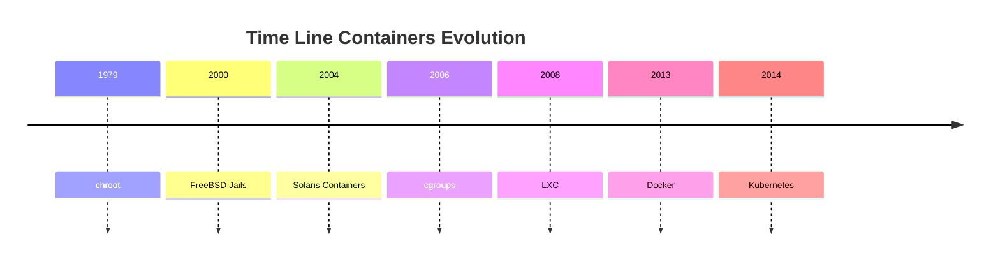

<h1><a name="readme-top"></a></h1>

[](https://github.com/marcossilvestrini/learning-lpic-3-305-300/actions/workflows/release.yml)[](https://github.com/marcossilvestrini/learning-lpic-3-305-300/actions/workflows/translate.yml)[](https://github.com/marcossilvestrini/learning-lpic-3-305-300/actions/workflows/jekyll-gh-pages.yml)[](https://github.com/marcossilvestrini/learning-lpic-3-305-300/actions/workflows/generate-html.yml)[](https://github.com/marcossilvestrini/learning-lpic-3-305-300/actions/workflows/powershell.yml)[](https://github.com/marcossilvestrini/learning-lpic-3-305-300/actions/workflows/slack.yml)

* * *

[![MIT License][license-shield]][license-url][![Forks][forks-shield]][forks-url][![Stargazers][stars-shield]][stars-url][![Contributors][contributors-shield]][contributors-url][![Issues][issues-shield]][issues-url][![LinkedIn][linkedin-shield]][linkedin-url]

* * *

# تعلم LPIC-3 305-300


<p align="center">
<strong>Explore the docs »</strong></a>
    <br />
    <a href="">Web Site</a>
    -
    <a href="https://github.com/marcossilvestrini/learning-lpic-3-305-300">Code Page</a>
    -
    <a href="https://github.com/marcossilvestrini/learning-lpic-3-305-300/issues">Report Bug</a>
    -
    <a href="https://github.com/marcossilvestrini/learning-lpic-3-305-300/issues">Request Feature</a>
</p>

* * *

## ملخص

<details>
  <summary><b>TABLE OF CONTENT</b></summary>
  <ol>
    <li>
      <a href="#about-the-project">About The Project</a>
    </li>
    <li>
      <a href="#getting-started">Getting Started</a>
      <ul>
        <li><a href="#prerequisites">Prerequisites</a></li>
        <li><a href="#installation">installation</a></li>
      </ul>
    </li>
    <li><a href="#usage">Usage</a></li>
    <li><a href="#roadmap">Roadmap</a></li>
    <li><a href="#freedoms">Four Essential Freedoms</a></li>
    <li>
      <a href="#topic-351">Topic 351: Full Virtualization</a>
      <ul>
        <li><a href="#topic-351.1">351.1 Virtualization Concepts and Theory </a></li>
        <li><a href="#topic-351.2">351.2 Xen</a></li>
        <li><a href="#topic-351.3">351.3 QEMU</a></li>
        <li><a href="#topic-351.4">351.4 Libvirt Virtual Machine</a></li>
        <li><a href="#topic-351.5">351.5 Virtual Machine Disk Image Management</a></li>
      </ul>
    </li>
    <li>
      <a href="#topic-352">Topic 352: Container Virtualization</a>
      <ul>
        <li><a href="#topic-352.1">352.1 Container Virtualization Concepts</a></li>
        <li><a href="#topic-352.2">352.2 LXC</a></li>
        <li><a href="#topic-352.3">352.3 Docker</a></li>
        <li><a href="#topic-352.4">352.4 Container Orchestration Platforms</a></li>
      </ul>
    </li>
    <li>
      <a href="#topic-353">Topic 353: VM Deployment and Provisioning</a>
      <ul>
        <li><a href="#topic-353.1">353.1 Cloud Management Tools</a></li>
        <li><a href="#topic-353.2">353.2 Packer</a></li>
        <li><a href="#topic-353.3">353.3 cloud-init</a></li>
        <li><a href="#topic-353.4">353.4 Vagrant</a></li>
      </ul>
    </li>
    <li><a href="#license">License</a></li>
    <li><a href="#contact">Contact</a></li>
    <li><a href="#acknowledgments">Acknowledgments</a></li>
  </ol>
</details><br>

* * *

<a name="about-the-project"></a>

## حول المشروع

> يهدف هذا المشروع إلى مساعدة الطلاب أو المحترفين على تعلم المفاهيم الأساسية لـ GNULinux
> والبرمجيات الحرة\\
> سيتم تغطية بعض توزيعات GNULinux مثل Debian وRPM.
> سيتم أيضًا تناول تثبيت وتكوين بعض الحزم\\
> ومن خلال القيام بذلك، يمكنك منح المجتمع بأكمله فرصة للاستفادة من تغييراتك.\\
> يعد الوصول إلى الكود المصدري شرطًا مسبقًا لذلك.\\
> استخدم vagrant for up devices وقم بتنفيذ الدروس المعملية والتمرين على المحتوى في هذه المقالة.\\
> لقد نشرت في مجلد Vagrant ملف Vagrantfile مع ما هو ضروري\\
> بالنسبة لك لتحميل بيئة للدراسات

* * *

<p align="right">(<a href="#readme-top">back to top</a>)</p>

<a name="getting-started"></a>

## ابدء

لبدء التعلم، راجع الوثائق أعلاه.

<a name="prerequisites"></a>

### المتطلبات الأساسية

-   [بوابة](https://git-scm.com/book/en/v2/Getting-Started-Installing-Git)
-   [محطة عمل إم وير](https://blogs.vmware.com/workstation/2024/05/vmware-workstation-pro-now-available-free-for-personal-use.html)
-   [الأداة المساعدة VMWare المتشردة](https://developer.hashicorp.com/vagrant/install/vmware)
-   [المتشرد](https://developer.hashicorp.com/vagrant/install)

<a name="installation"></a>

### تثبيت

استنساخ الريبو

```sh
git clone https://github.com/marcossilvestrini/learning-lpic-3-305-300.git
cd learning-lpic-3-305-300
```

تخصيص القالب_Vagrantfile-topic-XXX_. يحتوي هذا الملف على تكوين vms للمختبرات. مثال:

-   ملف[Vagrantfile-الموضوع-351](./vagrant/Vagrantfile-topic-351)
    -   vm.clone_directory = "&lt;your_driver_letter>:\\<folder>\\&lt;to_machine>\\#{VM_NAME}-مثيل-1"
        مثال: vm.clone_directory = "E:\\الخوادم\\برنامج إم وير\\#{VM_NAME}-مثيل-1"
    -   vm.vmx["حجم الذاكرة"]= ""
    -   vm.vmx["نومفكبوس"]= ""
    -   vm.vmx["cpuid.coresPerSocket"]= ""

تخصيص تكوين الشبكة في الملفات[التكوينات/الشبكة](configs/network/).

* * *

<a name="usage"></a>

## الاستخدام

استخدم هذا المستودع للتعرف على اختبار LPIC-3 305-300

### لأعلى ولأسفل

التبديل أ_Vagrantfile-الموضوع-xxx_قالب ونسخ لملف جديد بالاسم_Vagrantfile_

```sh
cd vagrant && vagrant up
cd vagrant && vagrant destroy -f
```

### لإعادة تشغيل vms

```sh
cd vagrant && vagrant reload
```

**مهم:**_إذا قمت بإعادة تشغيل جهاز vms بدون vagrant، فلن يتم تحميل المجلد المشترك بعد التمهيد._

### استخدم بوويرشيل لأعلى ولأسفل

إذا كنت تستخدم نظام التشغيل Windows، فسوف أقوم بإنشاء برنامج Powershell النصي لـ up and down vms.

```powershell
vagrant/up.ps1
vagrant/destroy.ps1
```

<p align="right">(<a href="#readme-top">back to top</a>)</p>

* * *

<a name="roadmap"></a>

## خريطة الطريق

-   [x] إنشاء مستودع
-   [x] إنشاء البرامج النصية لتزويد المعامل
-   [x] إنشاء أمثلة حول الموضوع 351
-   [ ] إنشاء أمثلة حول الموضوع 352
-   [ ] إنشاء أمثلة حول الموضوع 353
-   [ ] تحميل itexam محاكاة

* * *

<a name="freedoms"></a>

## أربع حريات أساسية

> 0.حرية تشغيل البرنامج كما يحلو لك ولأي غرض (حرية 0).\\
> 1.حرية دراسة آلية عمل البرنامج وتغييره حتى يعمل\\
> الكمبيوتر الخاص بك كما يحلو لك (الحرية 1).\\
> يعد الوصول إلى الكود المصدري شرطًا مسبقًا لذلك.\\
> 2.حرية إعادة توزيع النسخ حتى تتمكن من مساعدة الآخرين (حرية 2).\\
> 3.حرية توزيع نسخ من نسختك المعدلة على الآخرين (الحرية 3).

* * *

## فحص الأوامر

```sh
type COMMAND
apropos COMMAND
whatis COMMAND --long
whereis COMMAND
COMMAND --help, --h
man COMMAND
```

<p align="right">(<a href="#readme-top">back to top</a>)</p>

* * *

<a name="topic-351"></a>

## موضوع 351: المحاكاة الافتراضية الكاملة


* * *

<a name="topic-351.1"></a>

### 351.1 مفاهيم ونظرية المحاكاة الافتراضية

**وزن:**6

**وصف:**يجب على المرشحين معرفة وفهم المفاهيم العامة ونظرية ومصطلحات المحاكاة الافتراضية. يتضمن ذلك مصطلحات Xen وQEMU وlibvirt.

**مجالات المعرفة الرئيسية:**

-   فهم مصطلحات المحاكاة الافتراضية
-   فهم إيجابيات وسلبيات المحاكاة الافتراضية
-   افهم الأشكال المختلفة لبرامج Hypervisor وشاشات الأجهزة الافتراضية
-   فهم الجوانب الرئيسية للانتقال الفعلي إلى الأجهزة الافتراضية
-   فهم الجوانب الرئيسية لترحيل الأجهزة الافتراضية بين الأنظمة المضيفة
-   فهم ميزات المحاكاة الافتراضية وآثارها على الأجهزة الافتراضية، مثل التقاط الصور والإيقاف المؤقت والاستنساخ وحدود الموارد
-   الوعي بـ oVirt وProxmox وsystemd-machined وVirtualBox
-   الوعي بـ Open vSwitch

#### 351.1 الكائنات المستشهد بها

```sh
Hypervisor
Hardware Virtual Machine (HVM)
Paravirtualization (PV)
Emulation and Simulation
CPU flags
/proc/cpuinfo
Migration (P2V, V2V)
```

#### مراقبو الأجهزة الافتراضية

##### مراقب الأجهزة الافتراضية من النوع الأول (مراقب الأجهزة المعدنية العارية)

###### تعريف النوع 1

يتم تشغيله مباشرة على الأجهزة المادية للمضيف، مما يوفر طبقة أساسية لإدارة الأجهزة الافتراضية دون الحاجة إلى نظام تشغيل مضيف.

###### خصائص النوع 1

-   الأداء والكفاءة العالية.
-   انخفاض الكمون والنفقات العامة.
-   غالبًا ما يستخدم في بيئات المؤسسات ومراكز البيانات.

###### أمثلة من النوع 1

-   VMware ESXi: برنامج Hypervisor قوي ومستخدم على نطاق واسع في إعدادات المؤسسة.
-   Microsoft Hyper-V: متكامل مع Windows Server، ويقدم أداءً قويًا وميزات إدارة.
-   Xen: برنامج Hypervisor مفتوح المصدر يستخدمه العديد من موفري الخدمات السحابية.
-   KVM (الجهاز الظاهري القائم على Kernel): مدمج في Linux kernel، مما يوفر أداءً عاليًا للأنظمة المستندة إلى Linux.

##### مراقب الأجهزة الافتراضية من النوع 2 (مراقب الأجهزة الافتراضية المستضاف)

###### تعريف النوع 2

يعمل فوق نظام تشغيل تقليدي، ويعتمد على نظام التشغيل المضيف لإدارة الموارد ودعم الجهاز.

###### خصائص النوع 2

-   أسهل في الإعداد والاستخدام، خاصة على أجهزة الكمبيوتر الشخصية.
-   أكثر مرونة للتطوير والاختبار وعمليات النشر على نطاق أصغر.
-   عادةً ما تكون أقل كفاءة من برامج Hypervisor من النوع 1 بسبب الحمل الإضافي من نظام التشغيل المضيف.

###### أمثلة من النوع 2

-   VMware Workstation: برنامج Hypervisor قوي لتشغيل أنظمة تشغيل متعددة على سطح مكتب واحد.
-   Oracle VirtualBox: برنامج Hypervisor مفتوح المصدر معروف بمرونته وسهولة استخدامه.
-   Parallels Desktop: مصمم لمستخدمي Mac لتشغيل Windows وأنظمة التشغيل الأخرى جنبًا إلى جنب مع macOS.
-   QEMU (Quick EMUlator): محاكي وأداة افتراضية مفتوحة المصدر، تُستخدم غالبًا مع KVM.

##### الاختلافات الرئيسية بين النوع 1 والنوع 2 من برامج Hypervisor

-   بيئة النشر:
    -   يتم نشر برامج Hypervisor من النوع الأول بشكل شائع في مراكز البيانات وبيئات المؤسسات نظرًا لتفاعلها المباشر مع الأجهزة والأداء العالي.
    -   تعد برامج Hypervisor من النوع 2 أكثر ملاءمة للاستخدام الشخصي والتطوير والاختبار ومهام المحاكاة الافتراضية صغيرة الحجم.
-   أداء:
    -   تقدم برامج Hypervisor من النوع الأول عمومًا أداءً أفضل وزمن وصول أقل لأنها لا تعتمد على نظام تشغيل مضيف.
    -   قد تواجه برامج Hypervisor من النوع 2 بعض التدهور في الأداء بسبب الحمل الزائد للتشغيل على نظام التشغيل المضيف.
-   الإدارة وسهولة الاستخدام:
    -   تتطلب برامج Hypervisor من النوع 1 إعدادًا وإدارة أكثر تعقيدًا ولكنها توفر ميزات متقدمة وقابلية للتوسع لعمليات النشر واسعة النطاق.
    -   تعد برامج Hypervisor من النوع 2 أسهل في التثبيت والاستخدام، مما يجعلها مثالية للمستخدمين الفرديين والمشروعات الصغيرة.

##### أنواع الهجرة

في سياق برامج Hypervisor، وهي تقنيات تُستخدم لإنشاء الأجهزة الافتراضية وإدارتها، فإن مصطلحات ترحيل P2V وV2V شائعة في بيئات المحاكاة الافتراضية.  
وهي تشير إلى عمليات ترحيل الأنظمة بين أنواع مختلفة من الأنظمة الأساسية.

##### P2V - الهجرة المادية إلى الافتراضية

يشير ترحيل P2V إلى عملية ترحيل الخادم الفعلي إلى جهاز افتراضي.  
بمعنى آخر، يتم "تحويل" نظام التشغيل وتطبيقاته، التي تعمل على أجهزة مادية مخصصة، ونقلها إلى جهاز افتراضي يعمل على برنامج Hypervisor (مثل VMware وHyper-V وKVM وما إلى ذلك).

-   على سبيل المثال: لديك خادم فعلي يعمل بنظام Windows أو Linux، وتريد نقله إلى بيئة افتراضية، مثل البنية التحتية السحابية أو خادم المحاكاة الافتراضية الداخلي.  
    تتضمن العملية نسخ حالة النظام بالكامل، بما في ذلك نظام التشغيل وبرامج التشغيل والبيانات، لإنشاء جهاز ظاهري مكافئ يمكن تشغيله كما لو كان على الأجهزة الفعلية.

##### V2V - الهجرة الافتراضية إلى الافتراضية

يشير ترحيل V2V إلى عملية ترحيل جهاز افتراضي من أحد برامج Hypervisor إلى آخر.  
في هذه الحالة، لديك بالفعل جهاز ظاهري يعمل في بيئة افتراضية (مثل VMware)، وتريد نقله إلى بيئة افتراضية أخرى (على سبيل المثال، إلى Hyper-V أو إلى خادم VMware جديد).

-   مثال: لديك جهاز ظاهري يعمل على خادم ظاهري VMware، لكنك قررت ترحيله إلى نظام Hyper-V الأساسي. في هذه الحالة، يقوم ترحيل V2V بتحويل الجهاز الظاهري من تنسيق أو برنامج Hypervisor إلى آخر، مما يضمن استمرار تشغيله بشكل صحيح.

#### HVM و Paravirtualization

##### المحاكاة الافتراضية بمساعدة الأجهزة (HVM)

###### تعريف HVM

تستفيد HVM من امتدادات الأجهزة التي توفرها وحدات المعالجة المركزية (CPUs) الحديثة لإضفاء الطابع الافتراضي على الأجهزة، مما يتيح إنشاء الأجهزة الافتراضية وإدارتها بأقل قدر من الأداء.

###### الخصائص الرئيسية لـ HVM

-   **دعم الأجهزة**: يتطلب دعم وحدة المعالجة المركزية لملحقات المحاكاة الافتراضية مثل Intel VT-x أو AMD-V.
-   **المحاكاة الافتراضية الكاملة:**يمكن للأجهزة الافتراضية تشغيل أنظمة تشغيل ضيف غير معدلة، حيث يوفر برنامج Hypervisor محاكاة كاملة لبيئة الأجهزة.
-   **أداء:**يقدم عادةً أداءً شبه أصلي بسبب التنفيذ المباشر لتعليمات برمجية الضيف على وحدة المعالجة المركزية.
-   **عزل:**يوفر عزلًا قويًا بين الأجهزة الافتراضية نظرًا لأن كل جهاز افتراضي يعمل كما لو كان لديه أجهزة مخصصة خاصة به.

###### أمثلة على HVM

VMware ESXi، Microsoft Hyper-V، KVM (الجهاز الظاهري القائم على Kernel).

###### مزايا HVM

-   **التوافق:**يمكن تشغيل أي نظام تشغيل دون تعديل.
-   **أداء:**الأداء العالي بسبب دعم الأجهزة.
-   **حماية:**ميزات العزل والأمان المحسنة التي توفرها الأجهزة.

###### عيوب HVM

-   **تبعية الأجهزة:**يتطلب ميزات أجهزة محددة، مما يحد من التوافق مع الأنظمة الأقدم.
-   **تعقيد:**قد يتضمن تكوينًا وإدارة أكثر تعقيدًا.

##### المحاكاة الافتراضية

###### تعريف المحاكاة الافتراضية

تتضمن المحاكاة الافتراضية تعديل نظام التشغيل الضيف ليكون على دراية بالبيئة الافتراضية، مما يسمح له بالتفاعل بشكل أكثر كفاءة مع برنامج Hypervisor.

###### الخصائص الرئيسية للمحاكاة الافتراضية

-   **تعديل الضيف:**يتطلب إجراء تغييرات على نظام التشغيل الضيف للتواصل مباشرة مع برنامج Hypervisor باستخدام المكالمات الفائقة.
-   **أداء:**يمكن أن تكون أكثر كفاءة من المحاكاة الافتراضية الكاملة التقليدية لأنها تقلل من الحمل المرتبط بمحاكاة الأجهزة.
-   **التوافق:**يقتصر على أنظمة التشغيل التي تم تعديلها من أجل المحاكاة الافتراضية.

###### أمثلة على المحاكاة الافتراضية

Xen مع ضيوف افتراضيين، وأدوات VMware في تكوينات معينة، وبعض تكوينات KVM.

###### مزايا المحاكاة الافتراضية

-   **كفاءة:**يقلل من الحمل الزائد لأجهزة المحاكاة الافتراضية، مما قد يوفر أداءً أفضل لأحمال عمل معينة.
-   **استخدام الموارد:**استخدام أكثر كفاءة لموارد النظام بسبب الاتصال المباشر بين نظام التشغيل الضيف وبرنامج Hypervisor.

###### عيوب المحاكاة الافتراضية

-   **تعديل نظام التشغيل الضيف:**يتطلب تعديلات على نظام التشغيل الضيف، مما يحد من التوافق مع أنظمة التشغيل المدعومة.
-   **تعقيد:**يتطلب تعقيدًا إضافيًا في نظام التشغيل الضيف لتطبيقات Hypercall.

##### الاختلافات الرئيسية

###### متطلبات نظام التشغيل الضيف

-   **هفم:**يمكن تشغيل أنظمة تشغيل الضيف غير المعدلة.
-   **المحاكاة الافتراضية:**يتطلب تعديل أنظمة التشغيل الضيف للعمل مع برنامج Hypervisor.

###### أداء

-   **هفم:**يوفر عادةً أداءً شبه أصلي بسبب التنفيذ بمساعدة الأجهزة.
-   **المحاكاة الافتراضية:**يمكن أن يقدم أداءً فعالاً عن طريق تقليل الحمل الزائد لمحاكاة الأجهزة، ولكنه يعتمد على نظام التشغيل الضيف المعدل.

###### تبعية الأجهزة

-   **هفم:**يتطلب ميزات محددة لوحدة المعالجة المركزية (Intel VT-x، وAMD-V).
-   **المحاكاة الافتراضية:**لا يتطلب ميزات محددة لوحدة المعالجة المركزية ولكنه يحتاج إلى نظام تشغيل ضيف معدل.

###### عزل

-   **هفم:**يوفر عزلًا قويًا باستخدام ميزات الأجهزة.
-   **المحاكاة الافتراضية:**يعتمد على العزل المعتمد على البرمجيات، والذي قد لا يكون بقوة العزل المعتمد على الأجهزة.

###### تعقيد

-   **هفم:**بشكل عام، يكون النشر أكثر وضوحًا نظرًا لأنه يدعم نظام التشغيل غير المعدل.
-   **المحاكاة الافتراضية:**يتطلب إعدادًا وتعديلات إضافية على نظام التشغيل الضيف، مما يزيد من التعقيد.

#### NUMA (الوصول إلى الذاكرة غير الموحدة)

NUMA (الوصول إلى الذاكرة غير الموحدة) هي بنية ذاكرة تستخدم في الأنظمة متعددة المعالجات لتحسين وصول المعالجات إلى الذاكرة.  
في نظام NUMA، يتم توزيع الذاكرة بشكل غير متساو بين المعالجات، مما يعني أن كل معالج لديه وصول أسرع إلى جزء من الذاكرة ("الذاكرة المحلية") مقارنة بالذاكرة البعيدة ماديًا (يشار إليها باسم "الذاكرة البعيدة") والذاكرة المرتبطة بها. مع المعالجات الأخرى.

##### الميزات الرئيسية لهندسة NUMA

1.  **الذاكرة المحلية والبعيدة**: لكل معالج ذاكرته المحلية الخاصة، والتي يمكنه الوصول إليها بسرعة أكبر. ومع ذلك، يمكنه أيضًا الوصول إلى ذاكرة المعالجات الأخرى، على الرغم من أن ذلك يستغرق وقتًا أطول.
2.  **الكمون متباينة**: يختلف زمن وصول الوصول إلى الذاكرة اعتمادًا على ما إذا كان المعالج يصل إلى ذاكرته المحلية أو ذاكرة عقدة أخرى. يكون الوصول إلى الذاكرة المحلية أسرع، بينما يكون الوصول إلى ذاكرة عقدة أخرى (عن بعد) أبطأ.
3.  **قابلية التوسع**: تم تصميم بنية NUMA لتحسين قابلية التوسع في الأنظمة التي تحتوي على العديد من المعالجات. ومع إضافة المزيد من المعالجات، يتم أيضًا توزيع الذاكرة، مما يؤدي إلى تجنب الاختناق الذي قد يحدث في بنية الوصول إلى الذاكرة الموحدة (UMA).

##### مزايا نوما

-   أداء أفضل في الأنظمة الكبيرة: بما أن كل معالج لديه ذاكرة محلية، فيمكنه العمل بكفاءة أكبر دون التنافس مع المعالجات الأخرى للوصول إلى الذاكرة.
-   قابلية التوسع: تسمح NUMA للأنظمة التي تحتوي على العديد من المعالجات وكميات كبيرة من الذاكرة بالتوسع بشكل أكثر فعالية مقارنةً ببنية UMA.

##### العيوب

-   تعقيد البرمجة: يجب أن يكون المبرمجون على دراية بمناطق الذاكرة المحلية أو البعيدة، وتحسين استخدام الذاكرة المحلية لتحقيق أداء أفضل.
-   عقوبات الأداء المحتملة: إذا كان المعالج يصل بشكل متكرر إلى الذاكرة البعيدة، فقد يتأثر الأداء بسبب الكمون العالي.
    هذه البنية شائعة في الأنظمة متعددة المعالجات عالية الأداء، مثل الخوادم وأجهزة الكمبيوتر العملاقة، حيث تعد قابلية التوسع وتحسين الذاكرة أمرًا بالغ الأهمية.

#### حلول مفتوحة المصدر

-   أوفيرت:<https://www.ovirt.org/>

-   بروكسموكس:<https://www.proxmox.com/en/proxmox-virtual-environment/overview>

-   أوراكل فيرتثلبوإكس:<https://www.virtualbox.org/>

-   افتح في سويتش:<https://www.openvswitch.org/>

#### أنواع المحاكاة الافتراضية

##### المحاكاة الافتراضية للأجهزة (المحاكاة الافتراضية للخادم)

###### تعريف الجهد العالي

يلخص الأجهزة المادية لإنشاء أجهزة افتراضية (VMs) تعمل على تشغيل أنظمة تشغيل وتطبيقات منفصلة.

###### حالات استخدام الجهد العالي

مراكز البيانات، الحوسبة السحابية، توحيد الخوادم.

###### أمثلة الجهد العالي

إم وير إي إس إكس آي، ومايكروسوفت هايبر- في، وكيه في إم.

##### المحاكاة الافتراضية لنظام التشغيل (الحاويات)

###### تعريف الحاويات

يسمح بتشغيل مثيلات مساحة المستخدم المعزولة المتعددة (الحاويات) على نواة نظام تشغيل واحدة.

###### حالات استخدام الحاويات

بنية الخدمات المصغرة وبيئات التطوير والاختبار.

###### أمثلة على الحاويات

دوكر، كوبيرنيتيس، LXC.

##### المحاكاة الافتراضية للشبكة

###### تعريف المحاكاة الافتراضية للشبكة

يجمع موارد شبكة الأجهزة والبرامج في كيان إداري واحد قائم على البرامج.

###### حالات استخدام المحاكاة الافتراضية للشبكة

الشبكات المعرفة بالبرمجيات (SDN)، والمحاكاة الافتراضية لوظيفة الشبكة (NFV).

###### أمثلة على المحاكاة الافتراضية للشبكة

VMware NSX، Cisco ACI، OpenStack Neutron.

##### المحاكاة الافتراضية للتخزين

###### تعريف المحاكاة الافتراضية للتخزين

يجمع التخزين الفعلي من أجهزة متعددة في وحدة تخزين افتراضية واحدة يمكن إدارتها مركزيًا.

###### حالات استخدام تعريف المحاكاة الافتراضية للتخزين

إدارة البيانات، وتحسين التخزين، والتعافي من الكوارث.

###### أمثلة على تعريف المحاكاة الافتراضية للتخزين

وحدة تحكم حجم IBM SAN، VMware vSAN، NetApp ONTAP.

##### المحاكاة الافتراضية لسطح المكتب

###### تعريف المحاكاة الافتراضية لسطح المكتب

يسمح لنظام تشغيل سطح المكتب بالعمل على جهاز افتراضي مستضاف على خادم.

###### حالات استخدام تعريف المحاكاة الافتراضية لسطح المكتب

البنية التحتية لسطح المكتب الافتراضي (VDI)، وحلول العمل عن بعد.

###### أمثلة على تعريف المحاكاة الافتراضية لسطح المكتب

تطبيقات وأجهزة سطح المكتب الافتراضية من Citrix، وVMware Horizon، وخدمات Microsoft Remote Desktop.

##### المحاكاة الافتراضية للتطبيق

###### تعريف المحاكاة الافتراضية للتطبيق

يفصل التطبيقات عن الأجهزة الأساسية ونظام التشغيل، مما يسمح لها بالعمل في بيئات معزولة.

###### حالات استخدام تعريف المحاكاة الافتراضية للتطبيق

نشر التطبيق المبسط واختبار التوافق.

###### أمثلة على تعريف المحاكاة الافتراضية للتطبيق

VMware ThinApp، Microsoft App-V، Citrix XenApp.

##### المحاكاة الافتراضية للبيانات

###### تعريف المحاكاة الافتراضية للبيانات

يدمج البيانات من مصادر مختلفة دون دمجها فعليًا، مما يوفر رؤية موحدة للتحليل وإعداد التقارير.

###### حالات استخدام تعريف المحاكاة الافتراضية للبيانات

ذكاء الأعمال، وتكامل البيانات في الوقت الحقيقي.

###### أمثلة على تعريف المحاكاة الافتراضية للبيانات

دينودو، ريد هات JBoss البيانات الافتراضية، آي بي إم إنفوسفير.

##### فوائد المحاكاة الافتراضية

-   كفاءة الموارد: الاستخدام الأفضل للموارد المادية.
-   وفورات في التكاليف: انخفاض تكاليف الأجهزة والتشغيل.
-   قابلية التوسع: سهولة التوسع أو التخفيض حسب الطلب.
-   المرونة: يدعم مجموعة متنوعة من أعباء العمل والتطبيقات.
-   التعافي من الكوارث: عمليات النسخ الاحتياطي والاسترداد المبسطة.
-   العزل: تحسين الأمان من خلال عزل البيئات.

<p align="right">(<a href="#topic-351.1">back to sub Topic 351.1</a>)</p>
<p align="right">(<a href="#topic-351">back to Topic 351</a>)</p>
<p align="right">(<a href="#readme-top">back to top</a>)</p>

* * *

<a name="topic-351.2"></a>

### 351.2 زين


**وزن:**3

**وصف:**يجب أن يكون المرشحون قادرين على تثبيت وتكوين وصيانة وترحيل واستكشاف أخطاء تثبيتات Xen وإصلاحها. يتم التركيز على إصدار Xen 4.x.

**مجالات المعرفة الرئيسية:**

-   فهم بنية Xen، بما في ذلك الشبكات والتخزين
-   التكوين الأساسي لعقد ومجالات Xen
-   الإدارة الأساسية لعقد ومجالات Xen
-   استكشاف الأخطاء وإصلاحها الأساسية لعمليات تثبيت Xen
-   جشع الحبوب
-   الوعي بـ XenStore
-   الوعي بمعلمات التمهيد Xen
-   الوعي بأداة xm

#### زين


Xen هو برنامج Hypervisor مفتوح المصدر من النوع 1 (المعدني)، والذي يسمح بتشغيل أنظمة تشغيل متعددة بشكل متزامن على نفس الأجهزة المادية.  
يوفر Xen طبقة بين الأجهزة المادية والأجهزة الافتراضية (VMs)، مما يتيح مشاركة الموارد وعزلها بكفاءة.

-   **بنيان:**يعمل Xen بنظام من مستويين حيث المجال 0 (Dom0) هو المجال المميز مع الوصول المباشر إلى الأجهزة ويدير برنامج Hypervisor. تعمل الأجهزة الافتراضية الأخرى، التي تسمى Domain U (DomU)، على تشغيل أنظمة التشغيل الضيف وتتم إدارتها بواسطة Dom0.
-   **أنواع المحاكاة الافتراضية:**يدعم Xen كلاً من المحاكاة الافتراضية (PV)، والتي تتطلب نظام تشغيل ضيف معدّل، والمحاكاة الافتراضية بمساعدة الأجهزة (HVM)، والتي تستخدم امتدادات الأجهزة (على سبيل المثال، Intel VT-x أو AMD-V) لتشغيل أنظمة تشغيل ضيف غير معدلة.
    يُستخدم Xen على نطاق واسع في البيئات السحابية، ولا سيما بواسطة Amazon Web Services (AWS) وموفري الخدمات السحابية الآخرين على نطاق واسع.

#### زين سورس

XenSource هي الشركة التي أسسها المطورون الأصليون لبرنامج Xen Hypervisor في جامعة كامبريدج لتسويق Xen.  
قدمت الشركة حلولاً مؤسسية تعتمد على Xen وقدمت أدوات ودعمًا إضافيًا لتعزيز قدرات Xen للاستخدام المؤسسي.

-   **الاستحواذ من قبل سيتريكس**: في عام 2007، استحوذت شركة Citrix Systems, Inc على XenSource. استخدمت شركة Citrix تقنية Xen كأساس لمنتج Citrix XenServer الخاص بها، والذي أصبح منصة ظاهرية شهيرة على مستوى المؤسسات تعتمد على Xen.
-   **انتقال**: بعد الاستحواذ، استمر مشروع Xen كمشروع مفتوح المصدر، بينما ركزت Citrix على العروض التجارية مثل XenServer، مع الاستفادة من تقنية XenSource.

#### مشروع زين

يشير مشروع Xen إلى مجتمع المصدر المفتوح والمبادرة المسؤولة عن تطوير وصيانة برنامج Xen Hypervisor بعد تسويقه.  
يعمل مشروع Xen ضمن مؤسسة Linux، مع التركيز على بناء Xen وتحسينه ودعمه كجهد تعاوني يقوده المجتمع.

-   **الأهداف:**يهدف مشروع Xen إلى تطوير برنامج Hypervisor من خلال تحسين أدائه وأمانه ومجموعة ميزاته لمجموعة واسعة من حالات الاستخدام، بما في ذلك الحوسبة السحابية والمحاكاة الافتراضية التي تركز على الأمان (على سبيل المثال، Qubes OS) والأنظمة المدمجة.
-   **المساهمين:**يتضمن المشروع مساهمين من مؤسسات مختلفة، بما في ذلك موفري الخدمات السحابية الرئيسيين وبائعي الأجهزة والمطورين المستقلين.
-   **الحبوب والهانتولز:**يتضمن مشروع Xen أيضًا أدوات مثل XAPI (XenAPI)، والتي تُستخدم لإدارة عمليات تثبيت برنامج Xen Hypervisor، والعديد من الأدوات المساعدة الأخرى لإدارة النظام وتحسينه.

#### متجر زين

يعد Xen Store مكونًا مهمًا في Xen Hypervisor.  
في الأساس، Xen Store عبارة عن قاعدة بيانات موزعة ذات قيمة أساسية تُستخدم للاتصال ومشاركة المعلومات بين برنامج Xen Hypervisor والأجهزة الافتراضية (المعروفة أيضًا باسم المجالات) التي يديرها.

فيما يلي بعض الجوانب الرئيسية لمتجر Xen:

-   **التواصل بين المجالات:**يتيح Xen Store الاتصال بين المجالات، مثل Dom0 (المجال المميز الذي يتحكم في موارد الأجهزة) وDomUs (نطاقات المستخدم، وهي الأجهزة الافتراضية). ويتم ذلك من خلال إدخالات القيمة الرئيسية، حيث يمكن لكل مجال قراءة المعلومات أو كتابتها.

-   **إدارة التكوين:**يتم استخدامه لتخزين معلومات التكوين والوصول إليها، مثل الأجهزة الافتراضية والشبكات ومعلمات التمهيد. وهذا يسهل الإدارة الديناميكية وتكوين الأجهزة الافتراضية.

-   **الأحداث والإخطارات:**يدعم Xen Store أيضًا إشعارات الأحداث. عندما يتم تعديل مفتاح أو قيمة معينة في متجر Xen، يمكن إخطار المجالات المهتمة للتفاعل مع هذه التغييرات. وهذا مفيد لرصد وإدارة الموارد.

-   واجهة برمجة تطبيقات بسيطة: يوفر متجر Xen واجهة برمجة تطبيقات بسيطة لقراءة البيانات وكتابتها، مما يسهل على المطورين دمج تطبيقاتهم مع نظام المحاكاة الافتراضية Xen.

#### حبة

XAPI، أو XenAPI، هي واجهة برمجة التطبيقات (API) المستخدمة لإدارة Xen Hypervisor وأجهزته الافتراضية (VMs).  
يعد XAPI مكونًا رئيسيًا في XenServer (المعروف الآن باسم Citrix Hypervisor) ويوفر طريقة موحدة للتفاعل مع برنامج Xen Hypervisor لتنفيذ عمليات مثل إنشاء الأجهزة الافتراضية وتكوينها ومراقبتها والتحكم فيها.

فيما يلي بعض الجوانب المهمة لـ XAPI:

-   **إدارة الأجهزة الافتراضية:**يسمح XAPI للمسؤولين بإنشاء الأجهزة الافتراضية وحذفها وتشغيلها وإيقافها برمجيًا.

-   **الأتمتة:**باستخدام XAPI، من الممكن أتمتة إدارة الموارد الافتراضية، بما في ذلك الشبكات والتخزين والحوسبة، وهو أمر بالغ الأهمية للبيئات السحابية الكبيرة.

-   **اندماج:**يمكن دمج XAPI مع الأدوات والبرامج النصية الأخرى لتوفير إدارة أكثر كفاءة وتخصيصًا لبيئة Xen.

-   **التحكم في الوصول:**يوفر XAPI أيضًا آليات للتحكم في الوصول للتأكد من أن المستخدمين المصرح لهم فقط هم من يمكنهم إجراء عمليات محددة في البيئة الافتراضية.

XAPI هي الواجهة التي تتيح التحكم والأتمتة في Xen Hypervisor، مما يسهل إدارة البيئات الافتراضية.

#### ملخص زين

-   **زين:**تقنية برنامج Hypervisor الأساسية التي تمكن الأجهزة الافتراضية من العمل على الأجهزة المادية.
-   **زين سورس:**الشركة التي قامت بتسويق Xen، استحوذت عليها Citrix لاحقًا، مما أدى إلى تطوير Citrix XenServer.
-   **مشروع زين:**المبادرة والمجتمع مفتوح المصدر الذي يواصل تطوير وصيانة برنامج Xen Hypervisor ضمن مؤسسة Linux.
-   **متجر زين:**يعمل Xen Store كوسيط اتصال وتكوين بين برنامج Hypervisor Xen والأجهزة الافتراضية، مما يعمل على تبسيط تشغيل وإدارة البيئات الافتراضية.
-   **حبة**هي الواجهة التي تتيح التحكم في Xen Hypervisor وأتمتته، مما يسهل إدارة البيئات الافتراضية.

#### المجال0 (Dom0)

Domain0، أو Dom0، هو مجال التحكم في بنية Xen. وهو يدير المجالات الأخرى (DomUs) ولديه إمكانية الوصول المباشر إلى الأجهزة.  
يقوم Dom0 بتشغيل برامج تشغيل الأجهزة، مما يسمح لـ DomUs، التي تفتقر إلى الوصول المباشر إلى الأجهزة، بالاتصال بالأجهزة. عادةً ما يكون هذا بمثابة نسخة كاملة من نظام التشغيل، مثل Linux، وهو ضروري لتشغيل برنامج Xen Hypervisor.

#### دومينيو (دومو)

DomUs هي مجالات غير مميزة تقوم بتشغيل الأجهزة الافتراضية.  
تتم إدارتها بواسطة Dom0 وليس لديهم إمكانية الوصول المباشر إلى الأجهزة. يمكن تكوين DomUs لتشغيل أنظمة تشغيل مختلفة ويتم استخدامها لأغراض مختلفة، مثل خوادم التطبيقات وبيئات التطوير. إنهم يعتمدون على Dom0 للتفاعل مع الأجهزة.

#### PV-DOMU (المجال غير الطبيعي)

تستخدم PV-DomUs تقنية تسمى المحاكاة الافتراضية. في هذا النموذج، تم تعديل نظام التشغيل DomU ليدرك أنه يعمل في بيئة افتراضية، مما يسمح له بالاتصال مباشرة مع برنامج Hypervisor للحصول على الأداء الأمثل.  
ويؤدي هذا إلى انخفاض الحمل وكفاءة أفضل مقارنة بالمحاكاة الافتراضية الكاملة.

#### HVM-DomU (مجال الجهاز الظاهري للأجهزة)

أجهزة HVM-DomUs عبارة عن أجهزة افتراضية تستخدم المحاكاة الافتراضية الكاملة، مما يسمح بتشغيل أنظمة التشغيل غير المعدلة. يوفر برنامج Xen Hypervisor محاكاة الأجهزة لوحدات DomUs هذه، مما يمكّنها من تشغيل أي نظام تشغيل يدعم بنية الأجهزة الأساسية.  
وفي حين أن هذا يوفر قدرًا أكبر من المرونة، إلا أنه يمكن أن يؤدي إلى زيادة في الحمل مقارنة بوحدات PV-DomUs.

#### 351.2 الكائنات المستشهد بها

```sh
Domain0 (Dom0), DomainU (DomU)
PV-DomU, HVM-DomU
/etc/xen/
xl
xl.cfg 
xl.conf # Xen global configurations
xentop
oxenstored # Xenstore configurations
```

#### 351.2 ملاحظات

```sh

# Xen Settings
/etc/xen/
/etc/xen/xl.conf - Main general configuration file for Xen
/etc/xen/oxenstored.conf - Xenstore configurations

# VM Configurations
/etc/xen/xlexample.pvlinux
/etc/xen/xlexample.hvm

# Service Configurations
/etc/default/xen
/etc/default/xendomains
```

#### 351.2 الأوامر الهامة

##### XL

```sh
# view xen information
xl infos

# list Domains
xl list

# view dmesg information
xl dmesg

# monitoring domain
xl top

# Limit mem Dom0
xl mem-set 0 2048

# Limite cpu (not permanent after boot)
xl vcpu-set 0 2

# manual conf
man xl.conf

# manual cfg - about guest configuration
man xl.cfg
```

##### brctl

```sh
# list bridges linked
brctl show
```

<p align="right">(<a href="#topic-351.2">back to sub Topic 351.2</a>)</p>
<p align="right">(<a href="#topic-351">back to Topic 351</a>)</p>
<p align="right">(<a href="#readme-top">back to top</a>)</p>

* * *

<a name="topic-351.3"></a>

### 351.3 كيمو

**وزن:**4

**وصف:**يجب أن يكون المرشحون قادرين على تثبيت وتكوين وصيانة وترحيل واستكشاف أخطاء تثبيت QEMU وإصلاحها.

**مجالات المعرفة الرئيسية:**

-   فهم بنية QEMU، بما في ذلك KVM والشبكات والتخزين
-   بدء تشغيل مثيلات QEMU من سطر الأوامر
-   إدارة اللقطات باستخدام شاشة QEMU
-   قم بتثبيت برامج تشغيل الأجهزة QEMU Guest Agent وVirtIO
-   استكشاف أخطاء عمليات تثبيت QEMU وإصلاحها، بما في ذلك الشبكات والتخزين
-   الوعي بمعلمات تكوين QEMU الهامة

#### 351.3 الكائنات المذكورة

```sh
Kernel modules: kvm, kvm-intel and kvm-amd
/dev/kvm
QEMU monitor
qemu
qemu-system-x86_64
ip
brctl
tunctl
```

#### 351.3 الأوامر الهامة

##### الملكية الفكرية

```sh
# list links
ip link show
```

<p align="right">(<a href="#topic-351.3">back to sub Topic 351.3</a>)</p>
<p align="right">(<a href="#topic-351">back to Topic 351</a>)</p>
<p align="right">(<a href="#readme-top">back to top</a>)</p>

* * *

<a name="topic-351.4"></a>

### 351.4 إدارة الآلة الافتراضية Libvirt

**وزن:**9

**وصف:**يجب أن يكون المرشحون قادرين على إدارة مضيفي المحاكاة الافتراضية والأجهزة الافتراضية ("نطاقات libvirt") باستخدام libvirt والأدوات ذات الصلة.

**مجالات المعرفة الرئيسية:**

-   فهم بنية libvirt
-   إدارة اتصالات وعقد libvirt
-   إنشاء وإدارة مجالات QEMU وXen، بما في ذلك اللقطات
-   إدارة وتحليل استهلاك الموارد للمجالات
-   إنشاء وإدارة مجموعات التخزين ووحدات التخزين
-   إنشاء وإدارة الشبكات الافتراضية
-   ترحيل المجالات بين العقد
-   فهم كيفية تفاعل libvirt مع Xen وQEMU
-   فهم كيفية تفاعل libvirt مع خدمات الشبكة مثل dnsmasq وradvd
-   فهم ملفات تكوين libvirt XML
-   الوعي بـvirtlogd وvirtlockd

#### 351.4 الكائنات المذكورة

```sh
libvirtd
/etc/libvirt/
virsh (including relevant subcommands)
```

#### 351.4 الأوامر الهامة

##### foo

```sh
foo
```

<p align="right">(<a href="#topic-351.4">back to sub Topic 351.4</a>)</p>
<p align="right">(<a href="#topic-351">back to Topic 351</a>)</p>
<p align="right">(<a href="#readme-top">back to top</a>)</p>

* * *

<a name="topic-351.5"></a>

### 351.5 إدارة صور قرص الجهاز الظاهري

**وزن:**3

**وصف:**يجب أن يكون المرشحون قادرين على إدارة صور قرص الأجهزة الافتراضية. يتضمن ذلك تحويل صور القرص بين التنسيقات المختلفة وبرامج Hypervisor والوصول إلى البيانات المخزنة داخل الصورة.

**مجالات المعرفة الرئيسية:**

-   فهم ميزات تنسيقات صور القرص الافتراضية المختلفة، مثل الصور الأولية وqcow2 وVMDK
-   إدارة صور قرص الجهاز الظاهري باستخدام qemu-img
-   قم بتثبيت الأقسام والوصول إلى الملفات الموجودة في صور قرص الجهاز الظاهري باستخدام libguestfish
-   انسخ محتوى القرص الفعلي إلى صورة قرص الجهاز الظاهري
-   ترحيل محتوى القرص بين تنسيقات صور قرص الجهاز الظاهري المختلفة
-   الوعي بتنسيق المحاكاة الافتراضية المفتوحة (OVF)

#### 351.5 الكائنات المذكورة

```sh
qemu-img
guestfish (including relevant subcommands)
guestmount
guestumount
virt-cat
virt-copy-in
virt-copy-out
virt-diff
virt-inspector
virt-filesystems
virt-rescue
virt-df
virt-resize
virt-sparsify
virt-p2v
virt-p2v-make-disk
virt-v2v
virt-sysprep
```

#### 351.5 أوامر هامة

##### foo

```sh
foo
```

<p align="right">(<a href="#topic-351.5">back to sub Topic 351.5</a>)</p>
<p align="right">(<a href="#topic-351">back to Topic 351</a>)</p>
<p align="right">(<a href="#readme-top">back to top</a>)</p>

* * *

<a name="topic-352"></a>

## موضوع 352: محاكاة الحاوية

* * *

<a name="topic-352.1"></a>

### 352.1 مفاهيم المحاكاة الافتراضية للحاويات

**وزن:**7

**وصف:**يجب أن يفهم المرشحون مفهوم المحاكاة الافتراضية للحاوية. يتضمن ذلك فهم مكونات Linux المستخدمة لتنفيذ المحاكاة الافتراضية للحاويات بالإضافة إلى استخدام أدوات Linux القياسية لاستكشاف أخطاء هذه المكونات وإصلاحها.

**مجالات المعرفة الرئيسية:**

-   فهم مفاهيم النظام وحاوية التطبيق
-   فهم وتحليل مساحات أسماء النواة
-   فهم وتحليل المجموعات الضابطة
-   فهم وتحليل القدرات
-   فهم دور seccomp وSELinux وAppArmor في المحاكاة الافتراضية للحاويات
-   افهم كيف تستفيد LXC وDocker من مساحات الأسماء ومجموعات التحكم والإمكانات وseccomp وMAC
-   فهم مبدأ runc
-   فهم مبدأ CRI-O والحاويات
-   الوعي بوقت تشغيل OCI ومواصفات الصورة
-   الوعي بواجهة تشغيل حاوية Kubernetes (CRI)
-   الوعي بالبودمان والبناء والنطاق
-   الوعي بأساليب المحاكاة الافتراضية للحاويات الأخرى في Linux وأنظمة التشغيل المجانية الأخرى، مثل rkt أو OpenVZ أو systemd-nspawn أو BSD Jails



#### 352.1 الكائنات المستشهد بها

```sh
nsenter
unshare
ip (including relevant subcommands)
capsh
/sys/fs/cgroups
/proc/[0-9]+/ns
/proc/[0-9]+/status
```

#### 352.1 الأوامر الهامة

##### foo

```sh
foo
```

<p align="right">(<a href="#topic-352.1">back to sub topic 352.1</a>)</p>
<p align="right">(<a href="#topic-352">back to topic 352</a>)</p>
<p align="right">(<a href="#readme-top">back to top</a>)</p>

* * *

<a name="topic-352.2"></a>

### 352.2 إل إكس سي

**وزن:**6

**وصف:**يجب أن يكون المرشحون قادرين على استخدام حاويات النظام باستخدام LXC وLXD. إصدار LXC المغطى هو 3.0 أو أعلى.

**مجالات المعرفة الرئيسية:**

-   فهم بنية LXC وLXD
-   إدارة حاويات LXC بناءً على الصور الموجودة باستخدام LXD، بما في ذلك الشبكات والتخزين
-   قم بتكوين خصائص حاوية LXC
-   الحد من استخدام موارد حاوية LXC
-   استخدم ملفات تعريف LXD
-   فهم صور LXC
-   الوعي بأدوات LXC التقليدية

#### 352.2 الكائنات المذكورة

```sh
lxd
lxc (including relevant subcommands)
```

#### 352.2 الأوامر الهامة

##### foo

```sh
foo
```

<p align="right">(<a href="#topic-352.2">back to sub topic 352.2</a>)</p>
<p align="right">(<a href="#topic-352">back to topic 352</a>)</p>
<p align="right">(<a href="#readme-top">back to top</a>)</p>

* * *

<a name="topic-352.3"></a>

### 352.3 عامل الميناء

**وزن:**9

**وصف:**يجب أن يكون المرشح قادرًا على إدارة عقد Docker وحاويات Docker. يتضمن ذلك فهم بنية Docker بالإضافة إلى فهم كيفية تفاعل Docker مع نظام Linux الخاص بالعقدة.

**مجالات المعرفة الرئيسية:**

-   فهم بنية ومكونات Docker
-   إدارة حاويات Docker باستخدام الصور من سجل Docker
-   فهم وإدارة الصور ووحدات التخزين لحاويات Docker
-   فهم وإدارة التسجيل لحاويات Docker
-   فهم وإدارة الشبكات لـ Docker
-   استخدم Dockerfiles لإنشاء صور الحاوية
-   قم بتشغيل سجل Docker باستخدام صورة التسجيل Docker

#### 352.3 الكائنات المذكورة

```sh
dockerd
/etc/docker/daemon.json
/var/lib/docker/
docker
Dockerfile
```

#### 352.3 الأوامر الهامة

##### عامل ميناء

```sh
# Examples of docker
```

<p align="right">(<a href="#topic-352.3">back to sub topic 352.3</a>)</p>
<p align="right">(<a href="#topic-352">back to topic 352</a>)</p>
<p align="right">(<a href="#readme-top">back to top</a>)</p>

* * *

<a name="topic-352.4"></a>

### 352.4 منصات تنسيق الحاويات

**وزن:**3

**وصف:**يجب أن يفهم المرشحون أهمية تنسيق الحاويات والمفاهيم الأساسية التي يوفرها Docker Swarm وKubernetes لتنفيذ تنسيق الحاويات.

**مجالات المعرفة الرئيسية:**

-   فهم أهمية تنسيق الحاويات
-   فهم المفاهيم الأساسية لـ Docker Compose وDocker Swarm
-   فهم المفاهيم الأساسية لـ Kubernetes وHelm
-   الوعي بأنظمة OpenShift وRancher وMesosphere DC/OS

<p align="right">(<a href="#topic-352.4">back to sub topic 352.4</a>)</p>
<p align="right">(<a href="#topic-352">back to topic 352</a>)</p>
<p align="right">(<a href="#readme-top">back to top</a>)</p>

* * *

<a name="topic-353"></a>

## الموضوع 353: نشر الأجهزة الافتراضية وتوفيرها

* * *

<a name="topic-353.1"></a>

### 353.1 أدوات إدارة السحابة

**وزن:**2

**وصف:**يجب أن يفهم المرشحون العروض الشائعة في السحابة العامة وأن يكون لديهم معرفة بالميزات الأساسية لأدوات إدارة السحابة المتوفرة بشكل شائع.

**مجالات المعرفة الرئيسية:**

-   فهم العروض المشتركة في السحابة العامة
-   معرفة الميزات الأساسية لـ OpenStack
-   معرفة الميزات الأساسية لـ Terraform
-   الوعي بـ CloudStack و Eucalyptus و OpenNebula

#### 353.1 الكائنات المستشهد بها

```sh
IaaS, PaaS, SaaS
OpenStack
Terraform
```

#### 353.1 الأوامر الهامة

##### foo

```sh
# examples
```

<p align="right">(<a href="#topic-353.1">back to sub topic 353.1</a>)</p>
<p align="right">(<a href="#topic-353">back to topic 353</a>)</p>
<p align="right">(<a href="#readme-top">back to top</a>)</p>

* * *

<a name="topic-353.2"></a>

### 353.2 باكر

**وزن:**2

**وصف:**يجب أن يكون المرشحون قادرين على استخدام Packer لإنشاء صور النظام. يتضمن ذلك تشغيل Packer في بيئات سحابية عامة وخاصة مختلفة بالإضافة إلى إنشاء صور حاوية لـ LXC/LXD.

**مجالات المعرفة الرئيسية:**

-   فهم وظائف وميزات Packer
-   إنشاء وصيانة ملفات القالب
-   أنشئ صورًا من ملفات القوالب باستخدام أدوات إنشاء مختلفة

#### 353.2 الكائنات المستشهد بها

```sh
packer
```

#### 353.2 الأوامر الهامة

##### باكر

```sh
# examples
```

<p align="right">(<a href="#topic-353.2">back to sub topic 353.2</a>)</p>
<p align="right">(<a href="#topic 353">back to topic 353</a>)</p>
<p align="right">(<a href="#readme-top">back to top</a>)</p>

* * *

<a name="topic-353.3"></a>

### 353.3 سحابة البداية

**وزن:**3

**وصف:**يجب أن يكون المرشحون قادرين على استخدام cloud-init لتكوين الأجهزة الافتراضية التي تم إنشاؤها من الصور القياسية. يتضمن ذلك ضبط الأجهزة الافتراضية لتتناسب مع موارد الأجهزة المتوفرة لديها، وتحديدًا مساحة القرص ووحدات التخزين.  
بالإضافة إلى ذلك، يجب أن يكون المرشحون قادرين على تكوين المثيلات للسماح بتسجيلات الدخول الآمنة إلى SSH وتثبيت مجموعة محددة من حزم البرامج.  
علاوة على ذلك، يجب أن يكون المرشحون قادرين على إنشاء صور نظام جديدة بدعم من cloud-init.

**مجالات المعرفة الرئيسية:**

-   فهم ميزات ومفاهيم cloud-init، بما في ذلك بيانات المستخدم، وتهيئة وتكوين cloud-init
-   استخدم cloud-init لإنشاء أنظمة الملفات وتغيير حجمها وتركيبها وتكوين حسابات المستخدمين، بما في ذلك بيانات اعتماد تسجيل الدخول مثل مفاتيح SSH وتثبيت حزم البرامج من مستودع التوزيع
-   دمج cloud-init في صور النظام
-   استخدم مصدر بيانات محرك التكوين للاختبار

#### 353.3 الكائنات المذكورة

```sh
cloud-init
user-data
/var/lib/cloud/
```

#### 353.3 الأوامر الهامة

##### foo

```sh
# examples
```

<p align="right">(<a href="#topic-353.3">back to sub topic 353.3</a>)</p>
<p align="right">(<a href="#topic 353">back to topic 353</a>)</p>
<p align="right">(<a href="#readme-top">back to top</a>)</p>

* * *

<a name="topic-353.4"></a>

### 353.4 المتشرد

**وزن:**3

**وصف:**يجب أن يكون المرشح قادرًا على استخدام Vagrant لإدارة الأجهزة الافتراضية، بما في ذلك توفير الجهاز الظاهري.

**مجالات المعرفة الرئيسية:**

-   فهم بنية ومفاهيم Vagrant، بما في ذلك التخزين والشبكات
-   استرداد واستخدام الصناديق من أطلس
-   إنشاء وتشغيل Vagrantfiles
-   الوصول إلى الأجهزة الافتراضية Vagrant
-   مشاركة المجلد ومزامنته بين جهاز Vagrant الظاهري والنظام المضيف
-   فهم توفير Vagrant، أي مقدمي الملفات وShell
-   فهم إعداد الأجهزة المتعددة

#### 353.4 الكائنات المذكورة

```sh
vagrant
Vagrantfile
```

#### 353.4 الأوامر الهامة

##### المتشرد

```sh
# examples
```

<p align="right">(<a href="#topic-353.4">back to sub topic 353.4</a>)</p>
<p align="right">(<a href="#topic 353">back to topic 353</a>)</p>
<p align="right">(<a href="#readme-top">back to top</a>)</p>

* * *

## المساهمة

المساهمات هي ما يجعل مجتمع المصادر المفتوحة مكانًا رائعًا للتفاعل معه
التعلم والإلهام والإبداع. أي مساهمات تقدمها هي**موضع تقدير كبير**.

إذا كان لديك اقتراح من شأنه أن يجعل هذا أفضل، يرجى شوكة الريبو و
إنشاء طلب سحب. يمكنك أيضًا ببساطة فتح مشكلة بالعلامة "التحسين".
لا تنس أن تعطي المشروع نجمة! شكرًا لك مرة أخرى!

1.  شوكة المشروع
2.  قم بإنشاء فرع الميزات الخاص بك (`git checkout -b feature/AmazingFeature`)
3.  تنفيذ التغييرات (`git commit -m 'Add some AmazingFeature'`)
4.  ادفع إلى الفرع (`git push origin feature/AmazingFeature`)
5.  افتح طلب السحب

* * *

## رخصة

-   تم ترخيص هذا المشروع بموجب ترخيص MIT \* راجع ملف LICENSE.md للحصول على التفاصيل

* * *

## اتصال

ماركوس سيلفستريني -[marcos.silvestrini@gmail.com](mailto:marcos.silvestrini@gmail.com)\\[](https://twitter.com/mrsilvestrini)

رابط المشروع:<https://github.com/marcossilvestrini/learning-lpic-3-305-300>

<p align="right">(<a href="#readme-top">back to top</a>)</p>

* * *

## شكر وتقدير

-   [ريتشارد ستالمان](http://www.stallman.org/)
-   [جنو](<>)
    -   [الأسئلة الشائعة حول جنو/لينكس بقلم ريتشارد ستالمان](https://www.gnu.org/gnu/gnu-linux-faq.html)
    -   [جنو](https://www.gnu.org/)
    -   [نظام التشغيل جنو](https://www.gnu.org/gnu/thegnuproject.html)
    -   [مترجم دول مجلس التعاون الخليجي](https://gcc.gnu.org/wiki/History)
    -   [جنو القطران](https://www.gnu.org/software/tar/)
    -   [صنع جنو](https://www.gnu.org/software/make/)
    -   [جنو إيماكس](https://en.wikipedia.org/wiki/Emacs)
    -   [حزم جنو](https://www.gnu.org/software/)
    -   [مجموعة جنو/لينكس](https://directory.fsf.org/wiki/Collection:GNU/Linux)
    -   [محمل الإقلاع GNU Grub](https://www.gnu.org/software/grub/)
    -   [جنو هيرد](https://www.gnu.org/software/hurd/hurd/what_is_the_gnu_hurd.html)
-   [نواة](<>)
    -   [نواة](https://www.kernel.org/)
    -   [صفحات Linux Kernel Man](https://www.kernel.org/doc/man-pages/)
    -   [تجميع النواة الخاصة بك](https://wiki.linuxquestions.org/wiki/How_to_build_and_install_your_own_Linux_kernel)
-   [قاعدة لينكس القياسية](<>)
    -   [قاعدة لينكس القياسية](https://en.wikipedia.org/wiki/Linux_Standard_Base)
    -   [معيار التسلسل الهرمي لنظام الملفات](https://en.wikipedia.org/wiki/Filesystem_Hierarchy_Standard)
    -   [هيكل التسلسل الهرمي للملف](https://refspecs.linuxfoundation.org/FHS_3.0/fhs-3.0.pdf)
-   [البرمجيات الحرة](<>)
    -   [إف إس إف](https://www.fsf.org)
    -   [دليل البرمجيات الحرة](https://directory.fsf.org/wiki/Free_Software_Directory:Free_software_replacements)
-   [رخصة](<>)
    -   [البرمجيات الحرة](https://www.gnu.org/philosophy/free-sw.html)
    -   [الحقوق المتروكة](https://www.gnu.org/licenses/copyleft.en.html)
    -   [جي بي إل](https://www.gnu.org/licenses/quick-guide-gplv3.html)
    -   [رخصة جنو العمومية الصغرى](https://www.gnu.org/licenses/lgpl-3.0.html)
    -   [بي إس دي](https://opensource.org/licenses/BSD-3-Clause)
    -   [مبادرة المصدر المفتوح](https://opensource.org/)
    -   [المشاع الإبداعي](https://creativecommons.org/)
    -   [ترخيص LTS](https://en.wikipedia.org/wiki/Long-term_support)
-   [توزيعات](<>)
    -   [المبادئ التوجيهية للبرمجيات الحرة دبيان](https://www.debian.org/social_contract#guidelines)
    -   [قائمة توزيعات لينكس](https://en.wikipedia.org/wiki/List_of_Linux_distributions)
    -   [توزيعة](https://distrowatch.com/)
    -   [مقارنة توزيعات لينكس](https://en.wikipedia.org/wiki/Comparison_of_Linux_distributions)
-   [بيئات سطح المكتب](<>)
    -   [منظمة X11](https://www.x.org/wiki/)
    -   [وايلاند](https://wayland.freedesktop.org/)
    -   [جنو جنوم](https://www.gnu.org/press/gnome-1.0.html)
    -   [جنوم](https://www.gnome.org/)
    -   [XFCE](https://xfce.org/)
    -   [كيدي بلازما](https://kde.org/plasma-desktop/)
    -   [انسجام](https://en.wikipedia.org/wiki/Harmony_(toolkit))
-   [البروتوكولات](<>)
    -   [HTTP](<>)
        -   [W3Techs](https://w3techs.com/)
        -   [أباتشي](https://www.apache.org/)
        -   [توجيهات أباتشي][def]
        -   [رموز حالة HTTP](https://en.wikipedia.org/wiki/List_of_HTTP_status_codes)
        -   [شفرات قوية لـ Apache وnginx وLighttpd](https://cipherlist.eu/)
        -   [دروس SSL](https://www.golinuxcloud.com/blog/)
        -   [تكوين SSL موزيلا](https://ssl-config.mozilla.org/)
    -   [xRDP](https://bytexd.com/xrdp-centos/)
    -   [نتب](https://www.ntppool.org/en/)
-   [DNS](<>)
    -   [ربط](https://www.isc.org/bind/)
    -   [ربط التسجيل](https://www.zytrax.com/books/dns/ch7/logging.html)
    -   [قائمة أنواع سجلات DNS](https://en.wikipedia.org/wiki/List_of_DNS_record_types)
    -   [قائمة أنواع سجلات DNS](https://en.wikipedia.org/wiki/List_of_DNS_record_types)
-   [مدير الحزم](<>)
    -   [تنزيل الحزم](https://pkgs.org/)
    -   [تثبيت الحزم](https://installati.one/)
    -   [دليل تثبيت الحزم](https://installati.one/)
-   [شل النصي](<>)
    -   [بورن مرة أخرى شل](https://www.gnu.org/software/bash/manual/)
    -   [كوخ](https://bash.cyberciti.biz/guide/Shebang)
    -   [متغيرات البيئة](https://linuxize.com/post/how-to-set-and-list-environment-variables-in-linux/)
    -   [غنو جلوبينج](https://man7.org/linux/man-pages/man7/glob.7.html)
    -   [الكرة](https://linuxhint.com/bash_globbing_tutorial/)
    -   [نقلا عن](https://www.gnu.org/software/bash/manual/html_node/Quoting.html)
    -   [التعبيرات العادية](https://www.gnu.org/software/grep/manual/html_node/Regular-Expressions.html)
    -   [لم يتم العثور على الأمر](https://command-not-found.com/)
    -   [مولد باشرك](http://bashrcgenerator.com/)
    -   [شرح](https://explainshell.com/)
    -   [دروس فيم](https://www.openvim.com/)
    -   [البرنامج التعليمي للبرمجة النصية لنظام التشغيل Linux Shell](https://bash.cyberciti.biz/guide/Main_Page)
    -   [أمثلة على الأوامر](https://www.geeksforgeeks.org/)
-   [أدوات أخرى](<>)
    -   [بوجزيلا](https://bugzilla.kernel.org/)
    -   [شارات جيثب](https://github.com/alexandresanlim/Badges4-README.md-Profile)
-   [تعريفات المحاكاة الافتراضية](<>)
    -   [القبعة الحمراء](https://www.redhat.com/pt-br/topics/virtualization/what-is-virtualization)
    -   [أوس](https://aws.amazon.com/pt/what-is/virtualization/)
    -   [آي بي إم](https://www.ibm.com/topics/virtualization)
    -   [OpenSource.com](https://opensource.com/resources/virtualization)
-   [KVM](<>)
    -   [KVM (أجهزة Kernel الافتراضية)](https://www.redhat.com/pt-br/topics/virtualization/what-is-KVM)
    -   [أدوات إدارة KVM](https://www.linux-kvm.org/page/Management_Tools)
-   [زين](<>)
    -   [XenServer](https://www.xenserver.com/)
    -   [مشروع ويكي زين](https://wiki.xenproject.org/wiki/Main_Page)
    -   [مدونة LPI: المحاكاة الافتراضية لـ Xen والحوسبة السحابية #01: المقدمة](https://www.lpi.org/pt-br/blog/2020/10/01/xen-virtualization-and-cloud-computing-01-introduction/)
    -   [مدونة LPI: محاكاة Xen الافتراضية والحوسبة السحابية #02: كيف يقوم Xen بالمهمة](https://www.lpi.org/blog/2020/10/08/xen-virtualization-and-cloud-computing-02-how-xen-does-job/)
    -   [مدونة LPI: محاكاة Xen الافتراضية والحوسبة السحابية #04: الحاويات وOpenStack والأنظمة الأساسية الأخرى ذات الصلة](https://www.lpi.org/pt-br/blog/2020/10/22/xen-virtualization-and-cloud-computing-04-containers-openstack-and-other-related/)
    -   [محاكاة Xen الافتراضية والحوسبة السحابية #05: مشروع Xen، Unikernels، والمستقبل](https://www.lpi.org/pt-br/blog/2020/10/29/xen-virtualization-and-cloud-computing-05-xen-project-unikernels-and-future/)
    -   [دليل المبتدئين لمشروع Xen](https://wiki.xenproject.org/wiki/Xen_Project_Beginners_Guide#Installing_the_Xen_Project_Software)
    -   [كتاب مجنون](https://wiki.xenproject.org/wiki/Book/HelloXenProject/0-Contents)
-   [يونيكرنيل](https://www.lpi.org/blog/2020/10/29/xen-virtualization-and-cloud-computing-05-xen-project-unikernels-and-future/)
    -   [يونيكرافت](https://github.com/unikraft/unikraft)
    -   [ميراج أو إس](https://mirage.io/docs/hello-world)
    -   [هالفم](https://galois.com/project/halvm/)
    -   [فريد](https://github.com/solo-io/unik/blob/master/docs/providers/virtualbox.md)
-   [مستندات Openstack](<>)
    -   [ريدهات](https://www.redhat.com/pt-br/topics/openstack)
-   [افتح في سويتش](<>)
    -   [أوفس دوك 4 لينكس](https://blog.4linux.com.br/open-vswitch-o-que-e-o-que-come-onde-vive)
-   [امتحان LPIC-3 305-300](<>)
    -   [LPIC-3 305-300 الأهداف](https://www.lpi.org/our-certifications/exam-305-objectives/)
    -   [LPIC-3 305-300 ويكي](https://wiki.lpi.org/wiki/LPIC-305_Objectives_V3.0)
    -   [LPIC-3 305-300 المواد التعليمية](https://cursos.linuxsemfronteiras.com.br/courses/preparatorio-para-certificacao-lpic-3-305/)
    -   [LPIC-3 305-300 محاكاة الامتحان بواسطة ITexams](https://www.itexams.com/info/305-300)

<p align="right">(<a href="#readme-top">back to top</a>)</p>

* * *

<!-- MARKDOWN LINKS & IMAGES-->

<!-- https://www.markdownguide.org/basic-syntax/#reference-style-links -->

[contributors-shield]: https://img.shields.io/github/contributors/marcossilvestrini/learning-lpic-3-305-300.svg?style=for-the-badge

[contributors-url]: https://github.com/marcossilvestrini/learning-lpic-3-305-300/graphs/contributors

[forks-shield]: https://img.shields.io/github/forks/marcossilvestrini/learning-lpic-3-305-300.svg?style=for-the-badge

[forks-url]: https://github.com/marcossilvestrini/learning-lpic-3-305-300/network/members

[stars-shield]: https://img.shields.io/github/stars/marcossilvestrini/learning-lpic-3-305-300.svg?style=for-the-badge

[stars-url]: https://github.com/marcossilvestrini/learning-lpic-3-305-300/stargazers

[issues-shield]: https://img.shields.io/github/issues/marcossilvestrini/learning-lpic-3-305-300.svg?style=for-the-badge

[issues-url]: https://github.com/marcossilvestrini/learning-lpic-3-305-300/issues

[license-shield]: https://img.shields.io/github/license/marcossilvestrini/learning-lpic-3-305-300.svg?style=for-the-badge

[license-url]: https://github.com/marcossilvestrini/learning-lpic-3-305-300/blob/master/LICENSE

[linkedin-shield]: https://img.shields.io/badge/-LinkedIn-black.svg?style=for-the-badge&logo=linkedin&colorB=555

[linkedin-url]: https://linkedin.com/in/marcossilvestrini

[def]: https://httpd.apache.org/docs/2.4/mod/directives.html
