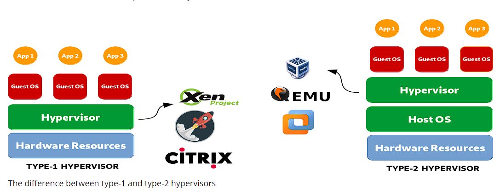

<h1><a name="readme-top"></a></h1>

[](https://github.com/marcossilvestrini/learning-lpic-3-305-300/actions/workflows/release.yml)[](https://github.com/marcossilvestrini/learning-lpic-3-305-300/actions/workflows/translate.yml)[](https://github.com/marcossilvestrini/learning-lpic-3-305-300/actions/workflows/jekyll-gh-pages.yml)[](https://github.com/marcossilvestrini/learning-lpic-3-305-300/actions/workflows/generate-html.yml)[](https://github.com/marcossilvestrini/learning-lpic-3-305-300/actions/workflows/powershell.yml)[](https://github.com/marcossilvestrini/learning-lpic-3-305-300/actions/workflows/slack.yml)

* * *

[![MIT License][license-shield]][license-url][![Forks][forks-shield]][forks-url][![Stargazers][stars-shield]][stars-url][![Contributors][contributors-shield]][contributors-url][![Issues][issues-shield]][issues-url][![LinkedIn][linkedin-shield]][linkedin-url]

* * *

# Aprendizaje de LPIC-3 305-300


<p align="center">
<strong>Explore the docs »</strong></a>
    <br />
    <a href="https://marcossilvestrini.github.io/learning-lpic-3-305-300/">Web Site</a>
    -
    <a href="https://github.com/marcossilvestrini/learning-lpic-3-305-300">Code Page</a>
    -
    <a href="https://github.com/marcossilvestrini/learning-lpic-3-305-300/issues">Report Bug</a>
    -
    <a href="https://github.com/marcossilvestrini/learning-lpic-3-305-300/issues">Request Feature</a>
</p>

* * *

## Resumen

<details>
  <summary><b>TABLE OF CONTENT</b></summary>
  <ol>
    <li>
      <a href="#about-the-project">About The Project</a>
    </li>
    <li>
      <a href="#getting-started">Getting Started</a>
      <ul>
        <li><a href="#prerequisites">Prerequisites</a></li>
        <li><a href="#installation">installation</a></li>
      </ul>
    </li>
    <li><a href="#usage">Usage</a></li>
    <li><a href="#roadmap">Roadmap</a></li>
    <li><a href="#freedoms">Four Essential Freedoms</a></li>
    <li>
      <a href="#topic-351">Topic 351: Full Virtualization</a>
      <ul>
        <li><a href="#topic-351.1">351.1 Virtualization Concepts and Theory </a></li>
        <li><a href="#topic-351.2">351.2 Xen</a></li>
        <li><a href="#topic-351.3">351.3 QEMU</a></li>
        <li><a href="#topic-351.4">351.4 Libvirt Virtual Machine</a></li>
        <li><a href="#topic-351.5">351.5 Virtual Machine Disk Image Management</a></li>
      </ul>
    </li>
    <li>
      <a href="#topic-352">Topic 352: Container Virtualization</a>
      <ul>
        <li><a href="#topic-352.1">352.1 Container Virtualization Concepts</a></li>
        <li><a href="#topic-352.2">352.2 LXC</a></li>
        <li><a href="#topic-352.3">352.3 Docker</a></li>
        <li><a href="#topic-352.4">352.4 Container Orchestration Platforms</a></li>
      </ul>
    </li>
    <li>
      <a href="#topic-353">Topic 353: VM Deployment and Provisioning</a>
      <ul>
        <li><a href="#topic-353.1">353.1 Cloud Management Tools</a></li>
        <li><a href="#topic-353.2">353.2 Packer</a></li>
        <li><a href="#topic-353.3">353.3 cloud-init</a></li>
        <li><a href="#topic-353.4">353.4 Vagrant</a></li>
      </ul>
    </li>
    <li><a href="#license">License</a></li>
    <li><a href="#contact">Contact</a></li>
    <li><a href="#acknowledgments">Acknowledgments</a></li>
  </ol>
</details><br>

* * *

<a name="about-the-project"></a>

## Acerca del proyecto

> Este proyecto tiene como objetivo ayudar a los estudiantes o profesionales a aprender los conceptos principales de Gnulinux.
> y software libre \\
> Algunas distribuciones de Gnulinux como Debian y RPM estarán cubiertas \\
> La instalación y la configuración de algunos paquetes también se cubrirán \\
> Al hacer esto, puede darle a toda la comunidad la oportunidad de beneficiarse de sus cambios.
> El acceso al código fuente es una condición previa para esto. \\
> Use Vagrant para máquinas UP y ejecute laboratorios y practique contenido en este artículo.
> He publicado en carpeta Vagrant un archivo vagabundo con lo que es necesario \\
> Para que subas un entorno para estudios

* * *

<p align="right">(<a href="#readme-top">back to top</a>)</p>

<a name="getting-started"></a>

## Empezando

Para comenzar el aprendizaje, consulte la documentación anterior.

<a name="prerequisites"></a>

### Requisitos previos

-   [Git](https://git-scm.com/book/en/v2/Getting-Started-Installing-Git)
-   [Estación de trabajo de VMware](https://blogs.vmware.com/workstation/2024/05/vmware-workstation-pro-now-available-free-for-personal-use.html)
-   [Utilidad de VMware vagabundo](https://developer.hashicorp.com/vagrant/install/vmware)
-   [Vagabundo](https://developer.hashicorp.com/vagrant/install)

<a name="installation"></a>

### Instalación

Clonar el repositorio

```sh
git clone https://github.com/marcossilvestrini/learning-lpic-3-305-300.git
cd learning-lpic-3-305-300
```

Personalizar una plantilla_Vagrantfile-topic-xxx_. Este archivo contiene una configuración de VMS para Labs. Ejemplo:

-   File [Vagantfile-topic-351](./vagrant/Vagrantfile-topic-351)
    -   vm.clone_directory = "&lt;Your_driver_letter>:\\<folder>\\&lt;TO_MACHINE>\\#{Vm_name} -instance-1 "
        Ejemplo: vm.clone_directory = "e:\\Servidor\\VMware\\#{Vm_name} -instance-1 "
    -   vm.vmx["Memsize"]= ""
    -   vm.vmx["Numvcpus"]= ""
    -   vm.vmx["CPUID.CORRESPERSOCOUT"]= ""

Personalizar la configuración de la red en archivos[configuraciones/red](configs/network/).

* * *

<a name="usage"></a>

## Uso

Use este repositorio para obtener el aprendizaje sobre el examen LPIC-3 305-300

### Para arriba y abajo

Cambiar un_Vagrantfile-topic-xxx_plantilla y copia para un nuevo archivo con el nombre_Archivo vagabundo_

```sh
cd vagrant && vagrant up
cd vagrant && vagrant destroy -f
```

### Para reiniciar máquinas virtuales

```sh
cd vagrant && vagrant reload
```

**Importante:**_Si reinicia las máquinas virtuales sin Vagerant, la carpeta compartida no se monta después del arranque._

### Use PowerShell para arriba y abajo

Si usa la plataforma Windows, creo un script PowerShell para VMS arriba y abajo.

```powershell
vagrant/up.ps1
vagrant/destroy.ps1
```

### Schema de infraestructura Tema 351


<p align="right">(<a href="#readme-top">back to top</a>)</p>

* * *

<a name="roadmap"></a>

## Hoja de ruta

-   [x] Crear repositorio
-   [x] Crear scripts para el aprovisionamiento de laboratorios
-   [x] Crear ejemplos sobre el tema 351
-   [ ] Crear ejemplos sobre el tema 352
-   [ ] Crear ejemplos sobre el tema 353
-   [ ] Cargar itexam simulado

* * *

<a name="freedoms"></a>

## Cuatro libertades esenciales

> 0\. La libertad de ejecutar el programa como desee, para cualquier propósito (libertad 0).
> 1.La libertad para estudiar cómo funciona el programa y cambiarlo para que lo haga \\
> Su computación como desee (Libertad 1). \\
> El acceso al código fuente es una condición previa para esto. \\
> 2\. La libertad para redistribuir copias para que pueda ayudar a los demás (Libertad 2).
> 3\. Freedom para distribuir copias de sus versiones modificadas a otros (libertad 3).

* * *

## Inspeccionar comandos

```sh
type COMMAND
apropos COMMAND
whatis COMMAND --long
whereis COMMAND
COMMAND --help, --h
man COMMAND
```

<p align="right">(<a href="#readme-top">back to top</a>)</p>

* * *

<a name="topic-351"></a>

## Tema 351: Virtualización completa



* * *

<a name="topic-351.1"></a>

### 351.1 Conceptos y teoría de virtualización

**Peso:**6

**Descripción:**Los candidatos deben conocer y comprender los conceptos generales, la teoría y la terminología de la virtualización. Esto incluye la terminología Xen, Qemu y Libvirt.

**Áreas clave de conocimiento:**

-   Comprender la terminología de la virtualización
-   Comprender los pros y los contras de la virtualización
-   Comprender las diversas variaciones de hipervisores y monitores de máquinas virtuales
-   Comprender los aspectos principales de la migración de máquinas físicas a virtuales
-   Comprender los aspectos principales de la migración de máquinas virtuales entre los sistemas de host
-   Comprender las características e implicaciones de la virtualización para una máquina virtual, como instantáneas, pausas, clonación y límites de recursos
-   Conciencia de Ovirt, Proxmox, Systemd-Machined y VirtualBox
-   Conciencia de Open Vswitch

#### 351.1 Objetos citados

```sh
Hypervisor
Hardware Virtual Machine (HVM)
Paravirtualization (PV)
Emulation and Simulation
CPU flags
/proc/cpuinfo
Migration (P2V, V2V)
```

#### Hipervisores

##### Hypervisor tipo 1 (hipervisor de metal desnudo)

###### Definición de tipo 1

Se ejecuta directamente en el hardware físico del host, proporcionando una capa base para administrar máquinas virtuales sin la necesidad de un sistema operativo del host.

###### Características del tipo 1

-   Alto rendimiento y eficiencia.
-   Menor latencia y sobrecarga.
-   A menudo se usa en entornos empresariales y centros de datos.

###### Ejemplos de tipo 1

-   VMware ESXI: un hipervisor robusto y ampliamente utilizado en la configuración empresarial.
-   Microsoft Hyper-V: integrado con Windows Server, que ofrece un fuerte rendimiento y características de administración.
-   XEN: Un hipervisor de código abierto utilizado por muchos proveedores de servicios en la nube.
-   KVM (máquina virtual basada en el núcleo): integrado en el kernel de Linux, proporcionando un alto rendimiento para los sistemas basados ​​en Linux.

##### Hypervisor tipo 2 (Hypervisor alojado)

###### Definición de tipo 2

Se ejecuta además de un sistema operativo convencional, confiando en el sistema operativo host para la administración de recursos y el soporte de dispositivos.

###### Características de tipo 2

-   Más fácil de configurar y usar, especialmente en computadoras personales.
-   Más flexible para el desarrollo, las pruebas y las implementaciones de menor escala.
-   Por lo general, menos eficiente que los hipervisores tipo 1 debido a la sobrecarga adicional del sistema operativo host.

###### Ejemplos de tipo 2

-   Estación de trabajo VMware: un potente hipervisor para ejecutar múltiples sistemas operativos en un solo escritorio.
-   Oracle VirtualBox: un hipervisor de código abierto conocido por su flexibilidad y facilidad de uso.
-   Desktop paralelo: diseñado para que los usuarios de Mac ejecute Windows y otros sistemas operativos junto con macOS.
-   QEMU (emulador rápido): un emulador y virtualizador de código abierto, a menudo utilizado junto con KVM.

##### Diferencias clave entre los hipervisores tipo 1 y tipo 2

-   Entorno de implementación:
    -   Los hipervisores tipo 1 se implementan comúnmente en centros de datos y entornos empresariales debido a su interacción directa con hardware y alto rendimiento.
    -   Los hipervisores tipo 2 son más adecuados para el uso personal, el desarrollo, las pruebas y las tareas de virtualización a pequeña escala.
-   Actuación:
    -   Los hipervisores tipo 1 generalmente ofrecen un mejor rendimiento y una latencia más baja porque no dependen de un sistema operativo host.
    -   Los hipervisores tipo 2 pueden experimentar cierta degradación del rendimiento debido a la sobrecarga de correr encima de un sistema operativo host.
-   Gestión y facilidad de uso:
    -   Los hipervisores tipo 1 requieren una configuración y gestión más complejas, pero proporcionan características avanzadas y escalabilidad para implementaciones a gran escala.
    -   Los hipervisores tipo 2 son más fáciles de instalar y usar, lo que los hace ideales para usuarios individuales y proyectos más pequeños.

##### Tipos de migración

En el contexto de los hipervisores, que son tecnologías utilizadas para crear y administrar máquinas virtuales, los términos migración de P2V y migración de V2V son comunes en entornos de virtualización.  
Se refieren a procesos de sistemas migratorios entre diferentes tipos de plataformas.

##### P2V - migración física a virtual

La migración de P2V se refiere al proceso de migración de un servidor físico a una máquina virtual.  
En otras palabras, un sistema operativo y sus aplicaciones, que se ejecutan en hardware físico dedicado, se "convierten" y se mueven a una máquina virtual que se ejecuta en un hipervisor (como VMware, Hyper-V, KVM, etc.).

-   Ejemplo: tiene un servidor físico que ejecuta un sistema de Windows o Linux, y desea moverlo a un entorno virtual, como una infraestructura en la nube o un servidor de virtualización interno.  
    El proceso implica copiar todo el estado del sistema, incluido el sistema operativo, los controladores y los datos, para crear una máquina virtual equivalente que pueda ejecutarse como si estuviera en el hardware físico.

##### V2V - migración virtual a virtual

La migración de V2V se refiere al proceso de migración de una máquina virtual de un hipervisor a otro.  
En este caso, ya tiene una máquina virtual que se ejecuta en un entorno virtualizado (como VMware), y desea moverla a otro entorno virtualizado (por ejemplo, a Hyper-V o a un nuevo servidor VMware).

-   Ejemplo: tiene una máquina virtual que se ejecuta en un servidor de virtualización VMware, pero decide migrarla a una plataforma Hyper-V. En este caso, la migración V2V convierte la máquina virtual de un formato o hipervisor a otro, asegurando que pueda continuar funcionando correctamente.

#### HVM y paravirtualización

##### Virtualización asistida por hardware (HVM)

###### Definición de HVM

HVM aprovecha las extensiones de hardware proporcionadas por las CPU modernas para virtualizar el hardware, lo que permite la creación y gestión de máquinas virtuales con una sobrecarga de rendimiento mínima.

###### Características de la clave HVM

-   **Soporte de hardware**: Requiere soporte de CPU para extensiones de virtualización como Intel VT-X o AMD-V.
-   **Virtualización completa:**Las máquinas virtuales pueden ejecutar sistemas operativos invitados no modificados, ya que el hipervisor proporciona una emulación completa del entorno de hardware.
-   **Actuación:**Por lo general, ofrece un rendimiento casi nativo debido a la ejecución directa del código de invitado en la CPU.
-   **Aislamiento:**Proporciona un aislamiento fuerte entre las máquinas virtuales ya que cada VM funciona como si tuviera su propio hardware dedicado.

###### Ejemplo de HVM

VMware ESXI, Microsoft Hyper-V, KVM (máquina virtual basada en kernel).

###### Ventajas de HVM

-   **Compatibilidad:**Puede ejecutar cualquier sistema operativo sin modificación.
-   **Actuación:**Alto rendimiento debido al soporte de hardware.
-   **Seguridad:**Características mejoradas de aislamiento y seguridad proporcionadas por hardware.

###### Desventajas de HVM

-   **Dependencia del hardware:**Requiere características de hardware específicas, limitando la compatibilidad con los sistemas más antiguos.
-   **Complejidad:**Puede involucrar una configuración y administración más complejas.

##### Paravirtualización

###### Definición de paravirtualización

La paravirtualización implica modificar el sistema operativo invitado para conocer el entorno virtual, lo que le permite interactuar de manera más eficiente con el hipervisor.

###### Características clave de paravirtualización

-   **Modificación del invitado:**Requiere cambios en el sistema operativo invitado para comunicarse directamente con el hipervisor utilizando hipercalls.
-   **Actuación:**Puede ser más eficiente que la virtualización completa tradicional porque reduce la sobrecarga asociada con la emulación de hardware.
-   **Compatibilidad:**Limitado a los sistemas operativos que han sido modificados para la paravirtualización.

###### Ejemplos de paravirtualización

Xen con invitados paravirtualizados, herramientas de VMware en ciertas configuraciones y algunas configuraciones de KVM.

###### Ventajas de paravirtualización

-   **Eficiencia:**Reduce la sobrecarga de la virtualización del hardware, que potencialmente ofrece un mejor rendimiento para ciertas cargas de trabajo.
-   **Utilización de recursos:**Uso más eficiente de los recursos del sistema debido a la comunicación directa entre el sistema operativo invitado y el hipervisor.

###### Desventajas de paravirtualización

-   **Modificación del sistema operativo de invitado:**Requiere modificaciones al sistema operativo invitado, lo que limita la compatibilidad a los sistemas operativos compatibles.
-   **Complejidad:**Requiere complejidad adicional en el sistema operativo invitado para implementaciones de hipercall.

##### Diferencias clave

###### Requisitos del sistema operativo de invitado

-   **HVM:**Puede ejecutar sistemas operativos invitados no modificados.
-   **Paravirtualización:**Requiere que los sistemas operativos de huéspedes se modifiquen para trabajar con el hipervisor.

###### Actuación

-   **HVM:**Por lo general, proporciona un rendimiento casi nativo debido a la ejecución asistida por hardware.
-   **Paravirtualización:**Puede ofrecer un rendimiento eficiente al reducir la sobrecarga de la emulación de hardware, pero se basa en un sistema operativo invitado modificado.

###### Dependencia de hardware

-   **HVM:**Requiere características específicas de CPU (Intel VT-X, AMD-V).
-   **Paravirtualización:**No requiere características específicas de la CPU, pero necesita un sistema operativo invitado modificado.

###### Aislamiento

-   **HVM:**Proporciona un aislamiento fuerte utilizando características de hardware.
-   **Paravirtualización:**Se basa en el aislamiento basado en software, que puede no ser tan robusto como el aislamiento basado en hardware.

###### Complejidad

-   **HVM:**Generalmente más sencillo de implementar ya que admite un sistema operativo no modificado.
-   **Paravirtualización:**Requiere una configuración y modificaciones adicionales al sistema operativo invitado, aumentando la complejidad.

#### NUMA (acceso a la memoria no uniforme)

NUMA (acceso de memoria no uniforme) es una arquitectura de memoria utilizada en los sistemas multiprocesador para optimizar el acceso a la memoria por los procesadores.  
En un sistema NUMA, la memoria se distribuye de manera desigual entre los procesadores, lo que significa que cada procesador tiene un acceso más rápido a una parte de la memoria (su "memoria local") que a la memoria que está físicamente más lejos (denominada "memoria remota") y asociada con otros procesadores.

##### Características clave de la arquitectura NUMA

1.  **Memoria local y remota**: Cada procesador tiene su propia memoria local, a la que puede acceder más rápidamente. Sin embargo, también puede acceder a la memoria de otros procesadores, aunque esto lleva más tiempo.
2.  **Latencia diferenciada**: La latencia del acceso a la memoria varía según si el procesador está accediendo a su memoria local o la memoria de otro nodo. El acceso a la memoria local es más rápido, mientras que acceder a la memoria de otro nodo (remota) es más lento.
3.  **Escalabilidad**: La arquitectura NUMA está diseñada para mejorar la escalabilidad en sistemas con muchos procesadores. A medida que se agregan más procesadores, la memoria también se distribuye, evitando el cuello de botella que ocurriría en una arquitectura de acceso de memoria uniforme (UMA).

##### Ventajas de NUMA

-   Mejor rendimiento en sistemas grandes: dado que cada procesador tiene memoria local, puede funcionar de manera más eficiente sin competir tanto con otros procesadores para el acceso a la memoria.
-   Escalabilidad: NUMA permite que los sistemas con muchos procesadores y grandes cantidades de memoria escalar de manera más efectiva en comparación con una arquitectura UMA.

##### Desventajas

-   Complejidad de programación: los programadores deben ser conscientes de qué regiones de memoria son locales o remotas, optimizando el uso de la memoria local para lograr un mejor rendimiento.
-   Sanciones potenciales de rendimiento: si un procesador con frecuencia accede a la memoria remota, el rendimiento puede sufrir debido a una mayor latencia.
    Esta arquitectura es común en los sistemas multiprocesador de alto rendimiento, como servidores y supercomputadoras, donde la escalabilidad y la optimización de la memoria son críticos.

#### OpenSource Solutions

-   Ovirt:<https://www.ovirt.org/>

-   Proxmox:<https://www.proxmox.com/en/proxmox-virtual-environment/overview>

-   Oracle Virtualbox:<https://www.virtualbox.org/>

-   Abrir vswitch:<https://www.openvswitch.org/>

#### Tipos de virtualización

##### Virtualización de hardware (virtualización del servidor)

###### Definición de HV

Abraza el hardware físico para crear máquinas virtuales (VM) que ejecutan sistemas operativos y aplicaciones separadas.

###### Casos de uso de HV

Centros de datos, computación en la nube, consolidación del servidor.

###### Ejemplos de HV

VMware ESXI, Microsoft Hyper-V, KVM.

##### Virtualización del sistema operativo (contenedorización)

###### Definición de contenedores

Permite que se ejecuten múltiples instancias de espacio de usuario aisladas (contenedores) en un solo núcleo del sistema operativo.

###### Casos de uso de contenedores

Microservicios Arquitectura, desarrollo y entornos de prueba.

###### Ejemplos de contenedores

Docker, Kubernetes, LXC.

##### Virtualización de red

###### Definición de virtualización de red

Combina recursos de red de hardware y software en una entidad administrativa única basada en software.

###### Casos de uso de virtualización de red

Networking (SDN) definido por software, Virtualización de funciones de red (NFV).

###### Ejemplos de virtualización de red

VMware NSX, Cisco ACI, OpenStack Neutron.

##### Virtualización de almacenamiento

###### Definición de virtualización de almacenamiento

Agrupar el almacenamiento físico de múltiples dispositivos en una sola unidad de almacenamiento virtual que se puede administrar centralmente.

###### Casos de uso de definición de virtualización de almacenamiento

Gestión de datos, optimización de almacenamiento, recuperación de desastres.

###### Ejemplos de definición de virtualización de almacenamiento

Controlador de volumen IBM SAN, VMware VSAN, NetApp Ontap.

##### Virtualización de escritorio

###### Definición de virtualización de escritorio

Permite que un sistema operativo de escritorio se ejecute en una máquina virtual alojada en un servidor.

###### Casos de uso de definición de virtualización de escritorio

Infraestructura de escritorio virtual (VDI), soluciones de trabajo remoto.

###### Ejemplos de definición de virtualización de escritorio

Aplicaciones y escritorios virtuales de Citrix, VMware Horizon, Servicios de escritorio remotos de Microsoft.

##### Virtualización de la aplicación

###### Definición de virtualización de la aplicación

Separa las aplicaciones del hardware y el sistema operativo subyacente, lo que les permite ejecutarse en entornos aislados.

###### Casos de uso de la definición de virtualización de la aplicación

Implementación de aplicaciones simplificada, prueba de compatibilidad.

###### Ejemplos de definición de virtualización de aplicaciones

VMware ThinApp, Microsoft App-V, Citrix XenApp.

##### Virtualización de datos

###### Definición de virtualización de datos

Integra datos de varias fuentes sin consolidarlo físicamente, proporcionando una vista unificada para el análisis y los informes.

###### Casos de uso de la definición de virtualización de datos

Inteligencia de negocios, integración de datos en tiempo real.

###### Ejemplos de definición de virtualización de datos

Denodo, Red Hat JBoss Virtualización de datos, IBM InfoShere.

##### Beneficios de la virtualización

-   Eficiencia de recursos: mejor utilización de los recursos físicos.
-   Ahorro de costos: costos de hardware y operaciones reducidos.
-   Escalabilidad: fácil de escalar hacia arriba o hacia abajo según la demanda.
-   Flexibilidad: admite una variedad de cargas de trabajo y aplicaciones.
-   Recuperación ante desastres: procesos de respaldo y recuperación simplificados.
-   Aislamiento: mejor seguridad a través del aislamiento de entornos.

<p align="right">(<a href="#topic-351.1">back to sub Topic 351.1</a>)</p>
<p align="right">(<a href="#topic-351">back to Topic 351</a>)</p>
<p align="right">(<a href="#readme-top">back to top</a>)</p>

* * *

<a name="topic-351.2"></a>

### 351.2 Alterna


**Peso:**3

**Descripción:**Los candidatos deben poder instalar, configurar, mantener, migrar y solucionar problemas de XEN. El foco está en XEN versión 4.x.

**Áreas clave de conocimiento:**

-   Comprender la arquitectura de Xen, incluidas las redes y el almacenamiento
-   Configuración básica de nodos y dominios XEN
-   Gestión básica de nodos y dominios XEN
-   Solución de problemas básicas de las instalaciones de XEN
-   Píldora de avarines
-   Conciencia de Xenstore
-   Conciencia de los parámetros de arranque xen
-   Conciencia de la utilidad XM

#### Alternar


Xen es un hipervisor de código abierto (desnudo) (moderno), que permite que múltiples sistemas operativos se ejecuten simultáneamente en el mismo hardware físico.  
Xen proporciona una capa entre el hardware físico y las máquinas virtuales (VM), lo que permite un intercambio de recursos eficiente y el aislamiento.

-   **Arquitectura:**XEN opera con un sistema de dos niveles donde el dominio 0 (DOM0) es el dominio privilegiado con acceso directo a hardware y administra el hipervisor. Otras máquinas virtuales, llamadas Domain U (DOMU), ejecutan sistemas operativos invitados y son administradas por DOM0.
-   **Tipos de virtualización:**XEN admite la paravirtualización (PV), que requiere un sistema operativo invitado modificado y la virtualización asistida por hardware (HVM), que utiliza extensiones de hardware (por ejemplo, Intel VT-X o AMD-V) para ejecutar sistemas operativos invitados no modificados.
    XEN es ampliamente utilizado en entornos en la nube, especialmente por Amazon Web Services (AWS) y otros proveedores de nubes a gran escala.

#### Xenseurce

Xensource fue la compañía fundada por los desarrolladores originales del Xen Hypervisor de la Universidad de Cambridge para comercializar Xen.  
La Compañía proporcionó soluciones empresariales basadas en XEN y ofreció herramientas y soporte adicionales para mejorar las capacidades de XEN para uso empresarial.

-   **Adquisición de Citrix**: En 2007, Xensource fue adquirido por Citrix Systems, Inc. Citrix utilizó la tecnología XEN como base para su producto Citrix Xenserver, que se convirtió en una plataforma de virtualización popular de grado empresarial basada en Xen.
-   **Transición**: Después de la adquisición, el Proyecto XEN continuó como un proyecto de código abierto, mientras que Citrix se centró en ofertas comerciales como Xenserver, aprovechando la tecnología Xensource.

#### Proyecto Xen

El Proyecto XEN se refiere a la comunidad e iniciativa de código abierto responsables de desarrollar y mantener el Hypervisor XEN después de su comercialización.  
El proyecto XEN opera bajo la Fundación Linux, con un enfoque en la construcción, mejora y apoyar a Xen como un esfuerzo colaborativo y impulsado por la comunidad.

-   **Objetivos:**El proyecto XEN tiene como objetivo avanzar al hipervisor mejorando su rendimiento, seguridad y conjunto de características para una amplia gama de casos de uso, incluida la computación en la nube, la virtualización centrada en la seguridad (por ejemplo, QUBES OS) y sistemas integrados.
-   **Contributors:**El proyecto incluye contribuyentes de varias organizaciones, incluidos los principales proveedores de la nube, proveedores de hardware y desarrolladores independientes.
-   **Píldora y hedools:**El proyecto XEN también incluye herramientas como XAPI (XENAPI), que se utiliza para administrar las instalaciones de XEN Hypervisor y varias otras utilidades para la gestión y optimización del sistema.

#### Xenstore

La tienda XEN es un componente crítico del Hypervisor XEN.  
Esencialmente, Xen Store es una base de datos de valor clave distribuida utilizada para la comunicación y el intercambio de información entre el Hypervisor XEN y las máquinas virtuales (también conocidas como dominios) que administra.

Aquí hay algunos aspectos clave de la tienda Xen:

-   **Comunicación entre dominios:**La tienda XEN permite la comunicación entre dominios, como DOM0 (el dominio privilegiado que controla los recursos de hardware) y DOMUS (dominios de usuario, que son las máquinas virtuales). Esto se realiza a través de entradas de valor clave, donde cada dominio puede leer o escribir información.

-   **Gestión de configuración:**Se utiliza para almacenar y acceder a la información de configuración, como dispositivos virtuales, redes y parámetros de arranque. Esto facilita la gestión dinámica y la configuración de las máquinas virtuales.

-   **Eventos y notificaciones:**Xen Store también admite notificaciones de eventos. Cuando se modifica una clave o valor particular en la tienda XEN, se pueden notificar dominios interesados ​​para reaccionar a estos cambios. Esto es útil para monitorear y administrar recursos.

-   API simple: la tienda XEN proporciona una API simple para leer y escribir datos, lo que facilita a los desarrolladores integrar sus aplicaciones con el sistema de virtualización XEN.

#### Píldora

XAPI, o XENAPI, es la interfaz de programación de aplicaciones (API) utilizada para administrar el Hypervisor XEN y sus máquinas virtuales (VM).  
XAPI es un componente clave de Xenserver (ahora conocido como Citrix Hypervisor) y proporciona una forma estandarizada de interactuar con el Hypervisor XEN para realizar operaciones como crear, configurar, monitorear y controlar las máquinas virtuales.

Aquí hay algunos aspectos importantes de Xapi:

-   **Gestión de VM:**XAPI permite a los administradores crear, eliminar, iniciar, iniciar y detener las máquinas virtuales.

-   **Automatización:**Con XAPI, es posible automatizar la gestión de los recursos virtuales, incluidas las redes, el almacenamiento y la computación, que es crucial para grandes entornos en la nube.

-   **Integración:**XAPI se puede integrar con otras herramientas y scripts para proporcionar una administración más eficiente y personalizada del entorno XEN.

-   **Control de acceso:**XAPI también proporciona mecanismos de control de acceso para garantizar que solo los usuarios autorizados puedan realizar operaciones específicas en el entorno virtual.

XAPI es la interfaz que permite el control y la automatización del Hypervisor XEN, lo que facilita la gestión de entornos virtualizados.

#### Resumen de Xen

-   **Interpretado:**La tecnología Core Hypervisor que permite que las máquinas virtuales se ejecuten en hardware físico.
-   **XENSOURCE:**La compañía que comercializó Xen, más tarde adquirida por Citrix, que condujo al desarrollo de Citrix Xenserver.
-   **Xen Project:**La iniciativa de código abierto y la comunidad que continúa desarrollando y manteniendo el Hypervisor XEN bajo la Fundación Linux.
-   **Xenstore:**La tienda XEN actúa como un intermediario de comunicación y configuración entre el Hypervisor XEN y las máquinas virtuales, racionalizando la operación y la gestión de entornos virtualizados.
-   **Píldora**es la interfaz que permite el control y la automatización del Hypervisor XEN, lo que facilita la gestión de entornos virtualizados.

#### Dominio0 (DOM0)

Domain0, o DOM0, es el dominio de control en una arquitectura XEN. Manejan otros dominios (DOMUS) y tiene acceso directo al hardware.  
DOM0 ejecuta los controladores de dispositivos, permitiendo que DOMUS, que carecen de acceso directo a hardware, se comuniquen con los dispositivos. Por lo general, es una instancia completa de un sistema operativo, como Linux, y es esencial para la operación del hipervisor XEN.

#### Dominio (casa)

DOMUS son dominios no privilegiados que ejecutan máquinas virtuales.  
Son administrados por DOM0 y no tienen acceso directo al hardware. DOMUS se puede configurar para ejecutar diferentes sistemas operativos y se utilizan para varios fines, como servidores de aplicaciones y entornos de desarrollo. Confían en DOM0 para la interacción de hardware.

#### Peewee-Dom (Paravardiyed Domina)

PV-DOMUS Utiliza una técnica llamada paravirtualización. En este modelo, el sistema operativo DOMU se modifica para tener en cuenta que se ejecuta en un entorno virtualizado, lo que le permite comunicarse directamente con el hipervisor para un rendimiento optimizado.  
Esto da como resultado una sobrecarga más baja y una mejor eficiencia en comparación con la virtualización completa.

#### HVM-DOMU (Hardware Virtual Machine Domainu)

HVM-DOMUS son máquinas virtuales que utilizan virtualización completa, lo que permite que los sistemas operativos no modificados se ejecuten. El Hypervisor XEN proporciona emulación de hardware para estos DOMUS, lo que les permite ejecutar cualquier sistema operativo que admita la arquitectura de hardware subyacente.  
Si bien esto ofrece una mayor flexibilidad, puede dar como resultado una mayor sobrecarga en comparación con PV-DOMUS.

#### Red xen

Dispositivos de red en paravirtualizados

Puente

#### 351.2 Objetos citados

```sh
Domain0 (Dom0), DomainU (DomU)
PV-DomU, HVM-DomU
/etc/xen/
xl
xl.cfg 
xl.conf # Xen global configurations
xentop
oxenstored # Xenstore configurations
```

#### 351.2 notas

```sh

# Xen Settings
/etc/xen/
/etc/xen/xl.conf - Main general configuration file for Xen
/etc/xen/oxenstored.conf - Xenstore configurations

# VM Configurations
/etc/xen/xlexample.pvlinux
/etc/xen/xlexample.hvm

# Service Configurations
/etc/default/xen
/etc/default/xendomains

# xen-tools configurations
/etc/xen-tools/
/usr/share/xen-tools/

# docs
xl(1)
xl.conf(5)
xlcpupool.cfg(5)
xl-disk-configuration(5)
xl-network-configuration(5)
xen-tscmode(7)

# initialized domains auto
/etc/default/xendomains
   XENDOMAINS_AUTO=/etc/xen/auto

/etc/xen/auto/


# set domain for up after xen reboot
## create folder auto
cd /etc/xen && mkdir -p auto && cd auto

# create simbolic link
ln -s /etc/xen/lpic3-pv-guest /etc/xen/auto/lpic3-pv-guest
```

#### 351.2 comandos importantes

##### xen-create-imagen

```sh
# create a pv image
xen-create-image \
  --hostname=lpic3-pv-guest \
  --memory=1gb \
  --vcpus=2 \
  --lvm=vg_xen \
  --dhcp \
  --pygrub \
  --dist=bookworm
```

##### imágenes de la lista xen

```sh
# list image
xen-list-image
```

##### Xen-Delete-Image

```sh
# delete a pv image
xen-delete-image lpic3-pv-guest --lvm=vg_xen
```

##### xenstore-ls

```sh
# list xenstore infos
xenstore-ls
```

##### brctl

```sh
# list xen interfaces
brctl show
```

##### SG

```sh
# view xen information
xl infos

# list Domains
xl list
xl list lpic3-hvm-guest
xl list lpic3-hvm-guest -l

# uptime Domains
xl uptime

# pause Domain
xl pause 2
xl pause lpic3-hvm-guest

# save state Domains
xl -v save lpic3-hvm-guest ~root/image-lpic3-hvm-guest.save

# restore Domain
xl restore /root/image-lpic3-hvm-guest.save

# get Domain name
xl domname 2

# view dmesg information
xl dmesg

# monitoring domain
xl top
xentop
xen top

# Limit mem Dom0
xl mem-set 0 2048

# Limite cpu (not permanent after boot)
xl vcpu-set 0 2

# create DomainU - virtual machine
xl create /etc/xen/lpic3-pv-guest.cfg

# create DomainU virtual machine and connect to guest
xl create -c /etc/xen/lpic3-pv-guest.cfg


##----------------------------------------------
# create DomainU virtual machine HVM

## create logical volume
lvcreate -l +20%FREE -n lpic3-hvm-guest-disk  vg_xen

## create a ssh tunel for vnc
ssh -l vagrant -L 5900:localhost:5900  192.168.0.130

## configure /etc/xen/lpic3-hvm-guest.cfg
## set boot for cdrom: boot = "d"

## create domain hvm
xl create /etc/xen/lpic3-hvm-guest.cfg

## open vcn conection in your vnc client with localhost
## for view install details

## after installation finished, destroy domain: xl destroy <id_or_name>

## set /etc/xen/lpic3-hvm-guest.cfg: boot for hard disc: boot = "c"

## create domain hvm
xl create /etc/xen/lpic3-hvm-guest.cfg

## access domain hvm
xl console <id_or_name>
##----------------------------------------------

# connect in domain guest
xl console <id>|<name> (press enter)
xl console 1
xl console lpic3-pv-guest

#How do I exit domU "xl console" session
#Press ctrl+] or if you're using Putty press ctrl+5.

# Poweroff domain
xl shutdown lpic3-pv-guest

# destroy domain
xl destroy lpic3-pv-guest

# reboot domain
xl reboot lpic3-pv-guest

# list block devices
xl block-list 1
xl block-list lpic3-pv-guest

# detach block devices
xl block-detach lpic3-hvm-guest hdc

# attach block devices
xl block-attach lpic3-hvm-guest hdc

```

<p align="right">(<a href="#topic-351.2">back to sub Topic 351.2</a>)</p>
<p align="right">(<a href="#topic-351">back to Topic 351</a>)</p>
<p align="right">(<a href="#readme-top">back to top</a>)</p>

* * *

<a name="topic-351.3"></a>

### 351.3 QEMU

**Peso:**4

**Descripción:**Los candidatos deben poder instalar, configurar, mantener, migrar y solucionar problemas de instalaciones de QEMU.

**Áreas clave de conocimiento:**

-   Comprender la arquitectura de QEMU, incluyendo KVM, redes y almacenamiento
-   Iniciar instancias QEMU desde la línea de comando
-   Administrar instantáneas utilizando el monitor QEMU
-   Instale el agente invitado de QEMU y los controladores de dispositivos Virtio
-   Solucionar problemas de instalaciones de QEMU, incluidas las redes y el almacenamiento
-   Conciencia de importantes parámetros de configuración de QEMU

#### 351.3 Objetos citados

```sh
Kernel modules: kvm, kvm-intel and kvm-amd
/dev/kvm
QEMU monitor
qemu
qemu-system-x86_64
ip
brctl
tunctl
```

#### 351.3 comandos importantes

##### IP

```sh
# list links
ip link show
```

<p align="right">(<a href="#topic-351.3">back to sub Topic 351.3</a>)</p>
<p align="right">(<a href="#topic-351">back to Topic 351</a>)</p>
<p align="right">(<a href="#readme-top">back to top</a>)</p>

* * *

<a name="topic-351.4"></a>

### 351.4 Libvirt Virtual Machine Management

**Peso:**9

**Descripción:**Los candidatos deben poder administrar hosts de virtualización y máquinas virtuales ("dominios libvirt") utilizando libvirt y herramientas relacionadas.

**Áreas clave de conocimiento:**

-   Comprender la arquitectura de libvirt
-   Gestionar las conexiones y nodos libvirt
-   Crear y administrar dominios QEMU y XEN, incluidas las instantáneas
-   Administrar y analizar el consumo de recursos de dominios
-   Crear y administrar grupos y volúmenes de almacenamiento
-   Crear y administrar redes virtuales
-   Migrar dominios entre nodos
-   Comprender cómo Libvirt interactúa con Xen y Qemu
-   Comprenda cómo Libvirt interactúa con servicios de red como DNSMASQ y RADVD
-   Comprender archivos de configuración de Libvirt XML
-   Conciencia de VirtLogd y Virtlockd

#### 351.4 Objetos citados

```sh
libvirtd
/etc/libvirt/
virsh (including relevant subcommands)
```

#### 351.4 comandos importantes

##### foo

```sh
foo
```

<p align="right">(<a href="#topic-351.4">back to sub Topic 351.4</a>)</p>
<p align="right">(<a href="#topic-351">back to Topic 351</a>)</p>
<p align="right">(<a href="#readme-top">back to top</a>)</p>

* * *

<a name="topic-351.5"></a>

### 351.5 Administración de imágenes de disco de máquina virtual

**Peso:**3

**Descripción:**Los candidatos deben poder administrar imágenes de disco de máquinas virtuales. Esto incluye la conversión de imágenes de disco entre varios formatos e hipervisores y el acceso a los datos almacenados dentro de una imagen.

**Áreas clave de conocimiento:**

-   Comprender las características de varios formatos de imagen de disco virtual, como imágenes RAW, QCOW2 y VMDK
-   Administrar imágenes de disco de máquina virtual usando qemu-img
-   Monte las particiones y los archivos de acceso contenidos en las imágenes de disco de máquina virtual utilizando el pez libguest
-   Copiar contenido de disco físico a una imagen de disco de máquina virtual
-   Migrar contenido de disco entre varios formatos de imagen de disco de máquina virtual
-   Conciencia del formato de virtualización abierta (OVF)

#### 351.5 objetos citados

```sh
qemu-img
guestfish (including relevant subcommands)
guestmount
guestumount
virt-cat
virt-copy-in
virt-copy-out
virt-diff
virt-inspector
virt-filesystems
virt-rescue
virt-df
virt-resize
virt-sparsify
virt-p2v
virt-p2v-make-disk
virt-v2v
virt-sysprep
```

#### 351.5 comandos importantes

##### foo

```sh
foo
```

<p align="right">(<a href="#topic-351.5">back to sub Topic 351.5</a>)</p>
<p align="right">(<a href="#topic-351">back to Topic 351</a>)</p>
<p align="right">(<a href="#readme-top">back to top</a>)</p>

* * *

<a name="topic-352"></a>

## Tema 352: Virtualización de contenedores

* * *

<a name="topic-352.1"></a>

### 352.1 Conceptos de virtualización de contenedores

**Peso:**7

**Descripción:**Los candidatos deben comprender el concepto de virtualización de contenedores. Esto incluye comprender los componentes de Linux utilizados para implementar la virtualización de contenedores, así como usar herramientas de Linux estándar para solucionar estos componentes.

**Áreas clave de conocimiento:**

-   Comprender los conceptos del sistema y el contenedor de aplicaciones
-   Comprender y analizar los espacios de nombres del núcleo
-   Comprender y analizar grupos de control
-   Comprender y analizar las capacidades
-   Comprender el papel de SecComp, Selinux y Apparmor para la virtualización de contenedores
-   Comprenda cómo LXC y Docker aprovechan los espacios de nombres, CGROUPS, Capacidades, SECComp y Mac
-   Comprender el principio de RUNC
-   Comprender el principio de Cri-O y Containerd
-   Conciencia del tiempo de ejecución de OCI y las especificaciones de la imagen
-   Conciencia de la interfaz de tiempo de ejecución del contenedor Kubernetes (CRI)
-   Conciencia de Podman, Buildah y Scopeo
-   Conciencia de otros enfoques de virtualización de contenedores en Linux y otros sistemas operativos gratuitos, como RKT, OpenVZ, Systemd-Nspawn o BSD Cails


#### 352.1 Objetos citados

```sh
nsenter
unshare
ip (including relevant subcommands)
capsh
/sys/fs/cgroups
/proc/[0-9]+/ns
/proc/[0-9]+/status
```

#### 352.1 comandos importantes

##### foo

```sh
foo
```

<p align="right">(<a href="#topic-352.1">back to sub topic 352.1</a>)</p>
<p align="right">(<a href="#topic-352">back to topic 352</a>)</p>
<p align="right">(<a href="#readme-top">back to top</a>)</p>

* * *

<a name="topic-352.2"></a>

### 352.2 LXC

**Peso:**6

**Descripción:**Los candidatos deben poder usar contenedores del sistema utilizando LXC y LXD. La versión de LXC cubierta es de 3.0 o más.

**Áreas clave de conocimiento:**

-   Comprender la arquitectura de LXC y LXD
-   Administre contenedores LXC en función de las imágenes existentes utilizando LXD, incluidas las redes y el almacenamiento
-   Configurar las propiedades del contenedor LXC
-   Limite el uso de recursos de contenedores LXC
-   Usar perfiles LXD
-   Comprender las imágenes LXC
-   Conciencia de las herramientas LXC tradicionales

#### 352.2 Objetos citados

```sh
lxd
lxc (including relevant subcommands)
```

#### 352.2 Comandos importantes

##### foo

```sh
foo
```

<p align="right">(<a href="#topic-352.2">back to sub topic 352.2</a>)</p>
<p align="right">(<a href="#topic-352">back to topic 352</a>)</p>
<p align="right">(<a href="#readme-top">back to top</a>)</p>

* * *

<a name="topic-352.3"></a>

### 352.3 Docker

**Peso:**9

**Descripción:**El candidato debe poder administrar nodos Docker y contenedores Docker. Esto incluye comprender la arquitectura de Docker y comprender cómo Docker interactúa con el sistema Linux del nodo.

**Áreas clave de conocimiento:**

-   Comprender la arquitectura y los componentes de Docker
-   Administre contenedores Docker utilizando imágenes de un registro de Docker
-   Comprender y administrar imágenes y volúmenes para contenedores Docker
-   Understand and manage logging for Docker containers
-   Comprender y administrar redes para Docker
-   Use DockerFiles para crear imágenes de contenedores
-   Ejecutar un registro de Docker utilizando la imagen Docker de registro

#### 352.3 Objetos citados

```sh
dockerd
/etc/docker/daemon.json
/var/lib/docker/
docker
Dockerfile
```

#### 352.3 Comandos importantes

##### estibador

```sh
# Examples of docker
```

<p align="right">(<a href="#topic-352.3">back to sub topic 352.3</a>)</p>
<p align="right">(<a href="#topic-352">back to topic 352</a>)</p>
<p align="right">(<a href="#readme-top">back to top</a>)</p>

* * *

<a name="topic-352.4"></a>

### 352.4 plataformas de orquestación de contenedores

**Peso:**3

**Descripción:**Los candidatos deben comprender la importancia de la orquestación de contenedores y los conceptos clave que Docker Swarm y Kubernetes proporcionan para implementar la orquestación de contenedores.

**Áreas clave de conocimiento:**

-   Comprender la relevancia de la orquestación del contenedor
-   Comprender los conceptos clave de Docker Compose y Docker Swarm
-   Comprender los conceptos clave de Kubernetes y Helm
-   Conciencia de Openshift, Rancher y Mesosphere DC/OS

<p align="right">(<a href="#topic-352.4">back to sub topic 352.4</a>)</p>
<p align="right">(<a href="#topic-352">back to topic 352</a>)</p>
<p align="right">(<a href="#readme-top">back to top</a>)</p>

* * *

<a name="topic-353"></a>

## Tema 353: Despliegue y aprovisionamiento de VM

* * *

<a name="topic-353.1"></a>

### 353.1 Herramientas de gestión de la nube

**Peso:**2

**Descripción:**Los candidatos deben comprender las ofertas comunes en las nubes públicas y tener un conocimiento básico de características de las herramientas de gestión de la nube comúnmente disponibles.

**Áreas clave de conocimiento:**

-   Comprender las ofertas comunes en las nubes públicas
-   Conocimiento de características básicas de OpenStack
-   Conocimiento básico de características de Terraform
-   Conciencia de CloudStack, Eucalipto y OpenNebula

#### 353.1 Objetos citados

```sh
IaaS, PaaS, SaaS
OpenStack
Terraform
```

#### 353.1 comandos importantes

##### foo

```sh
# examples
```

<p align="right">(<a href="#topic-353.1">back to sub topic 353.1</a>)</p>
<p align="right">(<a href="#topic-353">back to topic 353</a>)</p>
<p align="right">(<a href="#readme-top">back to top</a>)</p>

* * *

<a name="topic-353.2"></a>

### 353.2 Packer

**Peso:**2

**Descripción:**Los candidatos deben poder usar Packer para crear imágenes del sistema. Esto incluye ejecutar Packer en varios entornos de nube público y privado, así como la creación de imágenes de contenedores para LXC/LXD.

**Áreas clave de conocimiento:**

-   Comprender la funcionalidad y las características de Packer
-   Crear y mantener archivos de plantilla
-   Cree imágenes a partir de archivos de plantilla utilizando diferentes constructores

#### 353.2 Objetos citados

```sh
packer
```

#### 353.2 Comandos importantes

##### envasador

```sh
# examples
```

<p align="right">(<a href="#topic-353.2">back to sub topic 353.2</a>)</p>
<p align="right">(<a href="#topic 353">back to topic 353</a>)</p>
<p align="right">(<a href="#readme-top">back to top</a>)</p>

* * *

<a name="topic-353.3"></a>

### 353.3 INITO CLOCE

**Peso:**3

**Descripción:**Los candidatos deben usar la Inicla Cloud para configurar máquinas virtuales creadas a partir de imágenes estandarizadas. Esto incluye ajustar máquinas virtuales para que coincidan con sus recursos de hardware disponibles, específicamente, espacio en disco y volúmenes.  
Además, los candidatos deberían poder configurar instancias para permitir los inicios de sesión SSH seguros e instalar un conjunto específico de paquetes de software.  
Además, los candidatos deberían poder crear nuevas imágenes del sistema con soporte de In-Init.

**Áreas clave de conocimiento:**

-   Comprensión de las características y conceptos de In-INIT, incluidos los datos del usuario, la inicialización y la configuración de la In-Init de la nube
-   Use la entrada en la nube para crear, cambiar el tamaño y montar los sistemas de archivos, configurar cuentas de usuario, incluidas las credenciales de inicio de sesión, como las claves SSH e instalar paquetes de software desde el repositorio de la distribución
-   Integre la entrada de la nube en las imágenes del sistema
-   Utilice la fuente de datos de configuración de la unidad para las pruebas

#### 353.3 Objetos citados

```sh
cloud-init
user-data
/var/lib/cloud/
```

#### 353.3 comandos importantes

##### foo

```sh
# examples
```

<p align="right">(<a href="#topic-353.3">back to sub topic 353.3</a>)</p>
<p align="right">(<a href="#topic 353">back to topic 353</a>)</p>
<p align="right">(<a href="#readme-top">back to top</a>)</p>

* * *

<a name="topic-353.4"></a>

### 353.4 vagabundo

**Peso:**3

**Descripción:**El candidato debe poder usar Vagrant para administrar máquinas virtuales, incluido el aprovisionamiento de la máquina virtual.

**Áreas clave de conocimiento:**

-   Comprender la arquitectura y los conceptos vagabundos, incluido el almacenamiento y las redes
-   Recuperar y usar cajas de Atlas
-   Crear y ejecutar a Vagrantfiles
-   Acceder a máquinas virtuales vagabundas
-   Compartir y sincronizar la carpeta entre una máquina virtual vagabunda y el sistema de host
-   Comprender el aprovisionamiento vagabundo, es decir, los proveedores de archivos y shell
-   Comprender la configuración de múltiples máquinas

#### 353.4 objetos citados

```sh
vagrant
Vagrantfile
```

#### 353.4 comandos importantes

##### vagabundo

```sh
# examples
```

<p align="right">(<a href="#topic-353.4">back to sub topic 353.4</a>)</p>
<p align="right">(<a href="#topic 353">back to topic 353</a>)</p>
<p align="right">(<a href="#readme-top">back to top</a>)</p>

* * *

## Que contribuye

Las contribuciones son las que hacen que la comunidad de código abierto sea un lugar tan increíble para
Aprende, inspira y crea. Cualquier contribución que haga son**muy apreciado**.

If you have a suggestion that would make this better, please fork the repo and
create a pull request. You can also simply open an issue with the tag "enhancement".
Don't forget to give the project a star! Thanks again!

1.  Bifurca el proyecto
2.  Crea tu rama de características (`git checkout -b feature/AmazingFeature`)
3.  Comprometa tus cambios (`git commit -m 'Add some AmazingFeature'`)
4.  Empujar a la rama (`git push origin feature/AmazingFeature`)
5.  Abra una solicitud de extracción

* * *

## Licencia

-   Este proyecto tiene licencia bajo la licencia MIT \* Consulte el archivo de licencia. MD para obtener más detalles

* * *

## Contacto

Marcos Silvestrini -[marcos.silvestrini@gmail.com](mailto:marcos.silvestrini@gmail.com)\\[](https://twitter.com/mrsilvestrini)

Enlace del proyecto:<https://github.com/marcossilvestrini/learning-lpic-3-305-300>

<p align="right">(<a href="#readme-top">back to top</a>)</p>

* * *

## Expresiones de gratitud

-   [Richard Stallman's](http://www.stallman.org/)
-   [ÑU](<>)
    -   [Preguntas frecuentes de GNU/Linux por Richard Stallman](https://www.gnu.org/gnu/gnu-linux-faq.html)
    -   [ÑU](https://www.gnu.org/)
    -   [Sistema operativo GNU](https://www.gnu.org/gnu/thegnuproject.html)
    -   [Compilador de GCC](https://gcc.gnu.org/wiki/History)
    -   [Alquitrán GNU](https://www.gnu.org/software/tar/)
    -   [GNU Make](https://www.gnu.org/software/make/)
    -   [Emacs de GNU](https://en.wikipedia.org/wiki/Emacs)
    -   [Paquetes de GNU](https://www.gnu.org/software/)
    -   [Colección GNU/Linux](https://directory.fsf.org/wiki/Collection:GNU/Linux)
    -   [Gestor de arranque de GNU GRUB](https://www.gnu.org/software/grub/)
    -   [GNU Hurd](https://www.gnu.org/software/hurd/hurd/what_is_the_gnu_hurd.html)
-   [Núcleo](<>)
    -   [Núcleo](https://www.kernel.org/)
    -   [Páginas de Linux Kernel Man](https://www.kernel.org/doc/man-pages/)
    -   [Compila tu núcleo](https://wiki.linuxquestions.org/wiki/How_to_build_and_install_your_own_Linux_kernel)
-   [Base estándar de Linux](<>)
    -   [Base estándar de Linux](https://en.wikipedia.org/wiki/Linux_Standard_Base)
    -   [Estándar de jerarquía del sistema de archivos](https://en.wikipedia.org/wiki/Filesystem_Hierarchy_Standard)
    -   [Estructura de jerarquía de archivos](https://refspecs.linuxfoundation.org/FHS_3.0/fhs-3.0.pdf)
-   [Software libre](<>)
    -   [FSF](https://www.fsf.org)
    -   [Directorio de software gratuito](https://directory.fsf.org/wiki/Free_Software_Directory:Free_software_replacements)
-   [Licencia](<>)
    -   [Software libre](https://www.gnu.org/philosophy/free-sw.html)
    -   [Copyleft](https://www.gnu.org/licenses/copyleft.en.html)
    -   [GPL](https://www.gnu.org/licenses/quick-guide-gplv3.html)
    -   [Licencia pública general de GNU Lesser Lesser](https://www.gnu.org/licenses/lgpl-3.0.html)
    -   [BSD](https://opensource.org/licenses/BSD-3-Clause)
    -   [Iniciativa de código abierto](https://opensource.org/)
    -   [Comunics creativos](https://creativecommons.org/)
    -   [Licencia LTS](https://en.wikipedia.org/wiki/Long-term_support)
-   [Distracción](<>)
    -   [Directrices de software gratuito de Debian](https://www.debian.org/social_contract#guidelines)
    -   [Lista de distribución de Linux](https://en.wikipedia.org/wiki/List_of_Linux_distributions)
    -   [Distribuir](https://distrowatch.com/)
    -   [Comparación de distribuciones de Linux](https://en.wikipedia.org/wiki/Comparison_of_Linux_distributions)
-   [Entornos de escritorio](<>)
    -   [X11 orgg](https://www.x.org/wiki/)
    -   [Tierra](https://wayland.freedesktop.org/)
    -   [Gnu gnomo](https://www.gnu.org/press/gnome-1.0.html)
    -   [GNOMO](https://www.gnome.org/)
    -   [XFCE](https://xfce.org/)
    -   [Donde plasma](https://kde.org/plasma-desktop/)
    -   [Armonía](https://en.wikipedia.org/wiki/Harmony_(toolkit))
-   [Protocolos](<>)
    -   [Http](<>)
        -   [W3Techs](https://w3techs.com/)
        -   [apache](https://www.apache.org/)
        -   [Directivas Apache][def]
        -   [Códigos de estado HTTP](https://en.wikipedia.org/wiki/List_of_HTTP_status_codes)
        -   [Cifradores fuertes para Apache, Nginx y LightTPD](https://cipherlist.eu/)
        -   [Tutoriales SSL](https://www.golinuxcloud.com/blog/)
        -   [SSL Config mozilla](https://ssl-config.mozilla.org/)
    -   [XRDP](https://bytexd.com/xrdp-centos/)
    -   [NTP](https://www.ntppool.org/en/)
-   [DNS](<>)
    -   [Unir](https://www.isc.org/bind/)
    -   [Bind Rogging](https://www.zytrax.com/books/dns/ch7/logging.html)
    -   [Lista de tipos de registro DNS](https://en.wikipedia.org/wiki/List_of_DNS_record_types)
    -   [Lista de tipos de registro DNS](https://en.wikipedia.org/wiki/List_of_DNS_record_types)
-   [Administrador de paquetes](<>)
    -   [Descargar paquetes](https://pkgs.org/)
    -   [Instalar paquetes](https://installati.one/)
    -   [Guía de instalación de paquetes](https://installati.one/)
-   [Guión de shell](<>)
    -   [Bourne Again Shell](https://www.gnu.org/software/bash/manual/)
    -   [El asunto](https://bash.cyberciti.biz/guide/Shebang)
    -   [Variables de entorno](https://linuxize.com/post/how-to-set-and-list-environment-variables-in-linux/)
    -   [GNU Globbing](https://man7.org/linux/man-pages/man7/glob.7.html)
    -   [Globo](https://linuxhint.com/bash_globbing_tutorial/)
    -   [Citado](https://www.gnu.org/software/bash/manual/html_node/Quoting.html)
    -   [Expresiones regulares](https://www.gnu.org/software/grep/manual/html_node/Regular-Expressions.html)
    -   [Comando no se encuentra](https://command-not-found.com/)
    -   [Generador de aviso de bash](https://bash-prompt-generator.org/)
    -   [Explicar](https://explainshell.com/)
    -   [Tutorial vim](https://www.openvim.com/)
    -   [Tutorial de secuencias de comandos de Linux Shell](https://bash.cyberciti.biz/guide/Main_Page)
    -   [Ejemplos de comandos](https://www.geeksforgeeks.org/)
-   [Otras herramientas](<>)
    -   [Bugzila](https://bugzilla.kernel.org/)
    -   [Insignias de Github](https://github.com/alexandresanlim/Badges4-README.md-Profile)
-   [Definiciones de virtualización](<>)
    -   [Sombrero rojo](https://www.redhat.com/pt-br/topics/virtualization/what-is-virtualization)
    -   [AWS](https://aws.amazon.com/pt/what-is/virtualization/)
    -   [IBM](https://www.ibm.com/topics/virtualization)
    -   [OpenSource.com](https://opensource.com/resources/virtualization)
-   [KVM](<>)
    -   [KVM (máquinas virtuales del núcleo)](https://www.redhat.com/pt-br/topics/virtualization/what-is-KVM)
    -   [Herramientas de gestión de KVM](https://www.linux-kvm.org/page/Management_Tools)
-   [Alternar](<>)
    -   [Xenserver](https://www.xenserver.com/)
    -   [Wiki xenproject](https://wiki.xenproject.org/wiki/Main_Page)
    -   [Interfaces de red](https://wiki.xenproject.org/wiki/Xen_Networking#Virtual_Network_Interfaces)
    -   [Herramientas xen](https://xen-tools.org/software/)
    -   [Blog de LPI: XEN Virtualization and Cloud Computing #01: Introducción](https://www.lpi.org/pt-br/blog/2020/10/01/xen-virtualization-and-cloud-computing-01-introduction/)
    -   [Blog de LPI: Virtualización XEN y computación en la nube #02: Cómo Xen hace el trabajo](https://www.lpi.org/blog/2020/10/08/xen-virtualization-and-cloud-computing-02-how-xen-does-job/)
    -   [Blog LPI: Virtualización XEN y computación en la nube #04: Contenedores, OpenStack y otras plataformas relacionadas](https://www.lpi.org/pt-br/blog/2020/10/22/xen-virtualization-and-cloud-computing-04-containers-openstack-and-other-related/)
    -   [Virtualización XEN y computación en la nube #05: El proyecto Xen, Unikernels y el futuro](https://www.lpi.org/pt-br/blog/2020/10/29/xen-virtualization-and-cloud-computing-05-xen-project-unikernels-and-future/)
    -   [Guía de principiantes del proyecto XEN](https://wiki.xenproject.org/wiki/Xen_Project_Beginners_Guide#Installing_the_Xen_Project_Software)
    -   [Libro loco](https://wiki.xenproject.org/wiki/Book/HelloXenProject/0-Contents)
-   [Unicernel](https://www.lpi.org/blog/2020/10/29/xen-virtualization-and-cloud-computing-05-xen-project-unikernels-and-future/)
    -   [Unikraft](https://github.com/unikraft/unikraft)
    -   [MirageOS](https://mirage.io/docs/hello-world)
    -   [Malo](https://galois.com/project/halvm/)
    -   [Único](https://github.com/solo-io/unik/blob/master/docs/providers/virtualbox.md)
-   [OpenStack Docs](<>)
    -   [Redhat](https://www.redhat.com/pt-br/topics/openstack)
-   [Abrir vswitch](<>)
    -   [OVS doc 4Linux](https://blog.4linux.com.br/open-vswitch-o-que-e-o-que-come-onde-vive)
-   [Examen LPIC-3 305-300](<>)
    -   [LPIC-3 305-300 OBJETIVOS](https://www.lpi.org/our-certifications/exam-305-objectives/)
    -   [LPIC-3 305-300 wiki](https://wiki.lpi.org/wiki/LPIC-305_Objectives_V3.0)
    -   [LPIC-3 305-300 Material de aprendizaje](https://cursos.linuxsemfronteiras.com.br/courses/preparatorio-para-certificacao-lpic-3-305/)
    -   [Examen simulado LPIC-3 305-300 por ITEXAMS](https://www.itexams.com/info/305-300)

<p align="right">(<a href="#readme-top">back to top</a>)</p>

* * *

<!-- MARKDOWN LINKS & IMAGES-->

<!-- https://www.markdownguide.org/basic-syntax/#reference-style-links -->

[contributors-shield]: https://img.shields.io/github/contributors/marcossilvestrini/learning-lpic-3-305-300.svg?style=for-the-badge

[contributors-url]: https://github.com/marcossilvestrini/learning-lpic-3-305-300/graphs/contributors

[forks-shield]: https://img.shields.io/github/forks/marcossilvestrini/learning-lpic-3-305-300.svg?style=for-the-badge

[forks-url]: https://github.com/marcossilvestrini/learning-lpic-3-305-300/network/members

[stars-shield]: https://img.shields.io/github/stars/marcossilvestrini/learning-lpic-3-305-300.svg?style=for-the-badge

[stars-url]: https://github.com/marcossilvestrini/learning-lpic-3-305-300/stargazers

[issues-shield]: https://img.shields.io/github/issues/marcossilvestrini/learning-lpic-3-305-300.svg?style=for-the-badge

[issues-url]: https://github.com/marcossilvestrini/learning-lpic-3-305-300/issues

[license-shield]: https://img.shields.io/github/license/marcossilvestrini/learning-lpic-3-305-300.svg?style=for-the-badge

[license-url]: https://github.com/marcossilvestrini/learning-lpic-3-305-300/blob/master/LICENSE

[linkedin-shield]: https://img.shields.io/badge/-LinkedIn-black.svg?style=for-the-badge&logo=linkedin&colorB=555

[linkedin-url]: https://linkedin.com/in/marcossilvestrini

[def]: https://httpd.apache.org/docs/2.4/mod/directives.html
