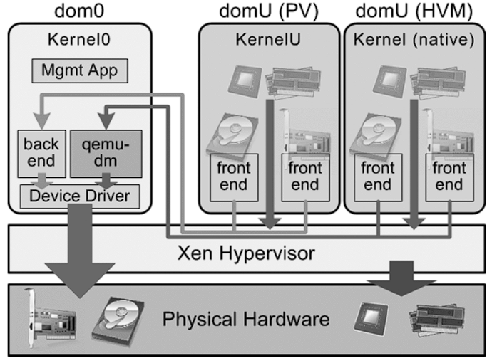

<h1><a name="readme-top"></a></h1>

[](https://github.com/marcossilvestrini/learning-lpic-3-305-300/actions/workflows/release.yml)[](https://github.com/marcossilvestrini/learning-lpic-3-305-300/actions/workflows/translate.yml)[](https://github.com/marcossilvestrini/learning-lpic-3-305-300/actions/workflows/jekyll-gh-pages.yml)[](https://github.com/marcossilvestrini/learning-lpic-3-305-300/actions/workflows/generate-html.yml)[](https://github.com/marcossilvestrini/learning-lpic-3-305-300/actions/workflows/powershell.yml)[](https://github.com/marcossilvestrini/learning-lpic-3-305-300/actions/workflows/slack.yml)

* * *

[![MIT License][license-shield]][license-url][![Forks][forks-shield]][forks-url][![Stargazers][stars-shield]][stars-url][![Contributors][contributors-shield]][contributors-url][![Issues][issues-shield]][issues-url][![LinkedIn][linkedin-shield]][linkedin-url]

* * *

# APRENDIZAJE LPIC-3 305-300


<p align="center">
<strong>Explore the docs »</strong></a>
    <br />
    <a href="">Web Site</a>
    -
    <a href="https://github.com/marcossilvestrini/learning-lpic-3-305-300">Code Page</a>
    -
    <a href="https://github.com/marcossilvestrini/learning-lpic-3-305-300/issues">Report Bug</a>
    -
    <a href="https://github.com/marcossilvestrini/learning-lpic-3-305-300/issues">Request Feature</a>
</p>

* * *

## Resumen

<details>
  <summary><b>TABLE OF CONTENT</b></summary>
  <ol>
    <li>
      <a href="#about-the-project">About The Project</a>
    </li>
    <li>
      <a href="#getting-started">Getting Started</a>
      <ul>
        <li><a href="#prerequisites">Prerequisites</a></li>
        <li><a href="#installation">installation</a></li>
      </ul>
    </li>
    <li><a href="#usage">Usage</a></li>
    <li><a href="#roadmap">Roadmap</a></li>
    <li><a href="#freedoms">Four Essential Freedoms</a></li>
    <li>
      <a href="#topic-351">Topic 351: Full Virtualization</a>
      <ul>
        <li><a href="#topic-351.1">351.1 Virtualization Concepts and Theory </a></li>
        <li><a href="#topic-351.2">351.2 Xen</a></li>
        <li><a href="#topic-351.3">351.3 QEMU</a></li>
        <li><a href="#topic-351.4">351.4 Libvirt Virtual Machine</a></li>
        <li><a href="#topic-351.5">351.5 Virtual Machine Disk Image Management</a></li>
      </ul>
    </li>
    <li>
      <a href="#topic-352">Topic 352: Container Virtualization</a>
      <ul>
        <li><a href="#topic-352.1">352.1 Container Virtualization Concepts</a></li>
        <li><a href="#topic-352.2">352.2 LXC</a></li>
        <li><a href="#topic-352.3">352.3 Docker</a></li>
        <li><a href="#topic-352.4">352.4 Container Orchestration Platforms</a></li>
      </ul>
    </li>
    <li>
      <a href="#topic-353">Topic 353: VM Deployment and Provisioning</a>
      <ul>
        <li><a href="#topic-353.1">353.1 Cloud Management Tools</a></li>
        <li><a href="#topic-353.2">353.2 Packer</a></li>
        <li><a href="#topic-353.3">353.3 cloud-init</a></li>
        <li><a href="#topic-353.4">353.4 Vagrant</a></li>
      </ul>
    </li>
    <li><a href="#license">License</a></li>
    <li><a href="#contact">Contact</a></li>
    <li><a href="#acknowledgments">Acknowledgments</a></li>
  </ol>
</details><br>

* * *

<a name="about-the-project"></a>

## Acerca del proyecto

> Este proyecto tiene como objetivo ayudar a estudiantes o profesionales a aprender los conceptos principales de GNULinux.
> y software libre\\
> Se cubrirán algunas distribuciones de GNULinux como Debian y RPM\\
> También se cubrirá la instalación y configuración de algunos paquetes\\
> Al hacer esto, podrás darle a toda la comunidad la oportunidad de beneficiarse de tus cambios.\\
> El acceso al código fuente es una condición previa para ello.\\
> Utilice vagrant para máquinas y ejecute laboratorios y practique el contenido de este artículo.\\
> He publicado en la carpeta Vagrant un Vagrantfile con lo necesario\\
> para que subas un ambiente para estudios

* * *

<p align="right">(<a href="#readme-top">back to top</a>)</p>

<a name="getting-started"></a>

## Empezando

Para comenzar el aprendizaje, consulte la documentación anterior.

<a name="prerequisites"></a>

### Requisitos previos

-   [git](https://git-scm.com/book/en/v2/Getting-Started-Installing-Git)
-   [Estación de trabajo VMware](https://blogs.vmware.com/workstation/2024/05/vmware-workstation-pro-now-available-free-for-personal-use.html)
-   [Utilidad vagabunda VMWare](https://developer.hashicorp.com/vagrant/install/vmware)
-   [Vagabundo](https://developer.hashicorp.com/vagrant/install)

<a name="installation"></a>

### Instalación

Clonar el repositorio

```sh
git clone https://github.com/marcossilvestrini/learning-lpic-3-305-300.git
```

Utilice Vagrantfile-topic-XXX para personalizar máquinas virtuales para laboratorios.

Establezca algunas configuraciones para su entorno:

-   Archivo[Vagrantfile-tema-351](./labs/vagrant/Vagrantfile-topic-351)
    -   vm.clone_directory = "&lt;su_carta_de_conductor>:\\<folder>\\&lt;a_máquina>\\#{VM_NAME}-instancia-1"
        Ejemplo: vm.clone_directory = "E:\\Servidores\\VMware\\#{VM_NAME}-instancia-1"
    -   vm.vmx["memsize"]= ""
    -   vm.vmx["numvcpus"]= ""
    -   vm.vmx["cpuid.coresPerSocket"]= ""
    -   en línea: "ifconfig eth1 &lt;your_ip_public_instanceX> máscara de red 255.255.255.0 arriba"
    -   en línea: "ruta agregar gw predeterminado &lt;your_public_gateway>"

* * *

<a name="usage"></a>

## Uso

Utilice este repositorio para obtener información sobre el examen LPIC-3 305-300

### Para arriba y abajo

```sh
cd vagrant && vagrant up
cd vagrant && vagrant destroy -f
```

### Para reiniciar máquinas virtuales

```sh
cd vagrant && vagrant reload
```

**Importante:**_Si reinicia vms sin vagrant, la carpeta compartida no se monta después del arranque._

### Utilice powershell para subir y bajar

vagabundo/up.ps1
vagabundo/destruir.ps1

<p align="right">(<a href="#readme-top">back to top</a>)</p>

* * *

<a name="roadmap"></a>

## Hoja de ruta

-   [x] Crear repositorio
-   [x] Crear scripts para laboratorios de aprovisionamiento
-   [x] Crear ejemplos sobre el Tema 351
-   [ ] Crear ejemplos sobre el Tema 352
-   [ ] Crear ejemplos sobre el Tema 353
-   [ ] Subir itexam simulado

* * *

<a name="freedoms"></a>

## Cuatro libertades esenciales

> 0.La libertad de ejecutar el programa como desees, para cualquier propósito (libertad 0).\\
> 1.La libertad de estudiar cómo funciona el programa y cambiarlo para que funcione\\
> tu informática como desees (libertad 1).\\
> El acceso al código fuente es una condición previa para ello.\\
> 2.La libertad de redistribuir copias para poder ayudar a otros (libertad 2).\\
> 3.libertad para distribuir copias de sus versiones modificadas a otros (libertad 3).

* * *

## Inspeccionar comandos

```sh
type COMMAND
apropos COMMAND
whatis COMMAND --long
whereis COMMAND
COMMAND --help, --h
man COMMAND
```

<p align="right">(<a href="#readme-top">back to top</a>)</p>

* * *

<a name="topic-351"></a>

## Tema 351: Virtualización completa


* * *

<a name="topic-351.1"></a>

### 351.1 Conceptos y teoría de la virtualización

**Peso:**6

**Descripción:**Los candidatos deben conocer y comprender los conceptos generales, la teoría y la terminología de la virtualización. Esto incluye terminología de Xen, QEMU y libvirt.

**Áreas de conocimiento clave:**

-   Comprender la terminología de virtualización
-   Comprender los pros y los contras de la virtualización
-   Comprender las diversas variaciones de hipervisores y monitores de máquinas virtuales
-   Comprender los aspectos principales de la migración de máquinas físicas a virtuales
-   Comprender los aspectos principales de la migración de máquinas virtuales entre sistemas host
-   Comprender las características y las implicaciones de la virtualización para una máquina virtual, como la creación de instantáneas, la pausa, la clonación y los límites de recursos.
-   Conocimiento de oVirt, Proxmox, systemd-machined y VirtualBox
-   Conocimiento de Open vSwitch

#### 351.1 Objetos citados

```sh
Hypervisor
Hardware Virtual Machine (HVM)
Paravirtualization (PV)
Emulation and Simulation
CPU flags
/proc/cpuinfo
Migration (P2V, V2V)
```

#### Hipervisores

##### Hipervisor tipo 1 (hipervisor bare-metal)

###### Definición de tipo 1

Se ejecuta directamente en el hardware físico del host, proporcionando una capa base para administrar máquinas virtuales sin la necesidad de un sistema operativo host.

###### Características tipo 1

-   Alto rendimiento y eficiencia.
-   Menor latencia y sobrecarga.
-   A menudo se utiliza en entornos empresariales y centros de datos.

###### Ejemplos de tipo 1

-   VMware ESXi: un hipervisor robusto y ampliamente utilizado en entornos empresariales.
-   Microsoft Hyper-V: integrado con Windows Server, ofrece sólidas funciones de administración y rendimiento.
-   Xen: un hipervisor de código abierto utilizado por muchos proveedores de servicios en la nube.
-   KVM (Máquina virtual basada en kernel): Integrada en el kernel de Linux, proporciona un alto rendimiento para sistemas basados ​​en Linux.

##### Hipervisor tipo 2 (hipervisor alojado)

###### Definición de tipo 2

Se ejecuta sobre un sistema operativo convencional y depende del sistema operativo host para la administración de recursos y el soporte del dispositivo.

###### Características tipo 2

-   Más fácil de configurar y usar, especialmente en computadoras personales.
-   Más flexible para desarrollo, pruebas e implementaciones a menor escala.
-   Normalmente son menos eficientes que los hipervisores de tipo 1 debido a la sobrecarga adicional del sistema operativo host.

###### Ejemplos de tipo 2

-   VMware Workstation: un potente hipervisor para ejecutar múltiples sistemas operativos en un solo escritorio.
-   Oracle VirtualBox: un hipervisor de código abierto conocido por su flexibilidad y facilidad de uso.
-   Parallels Desktop: Diseñado para que los usuarios de Mac ejecuten Windows y otros sistemas operativos junto con macOS.
-   QEMU (Quick EMULator): un emulador y virtualizador de código abierto, que a menudo se usa junto con KVM.

##### Diferencias clave entre los hipervisores tipo 1 y tipo 2

-   Entorno de implementación:
    -   Los hipervisores de tipo 1 se implementan comúnmente en centros de datos y entornos empresariales debido a su interacción directa con el hardware y su alto rendimiento.
    -   Los hipervisores de tipo 2 son más adecuados para uso personal, desarrollo, pruebas y tareas de virtualización a pequeña escala.
-   Actuación:
    -   Los hipervisores de tipo 1 generalmente ofrecen mejor rendimiento y menor latencia porque no dependen de un sistema operativo host.
    -   Los hipervisores de tipo 2 pueden experimentar cierta degradación del rendimiento debido a la sobrecarga de ejecutarse sobre un sistema operativo host.
-   Gestión y facilidad de uso:
    -   Los hipervisores de tipo 1 requieren una configuración y administración más complejas, pero brindan funciones avanzadas y escalabilidad para implementaciones a gran escala.
    -   Los hipervisores tipo 2 son más fáciles de instalar y usar, lo que los hace ideales para usuarios individuales y proyectos más pequeños.

##### Tipos de migración

En el contexto de los hipervisores, que son tecnologías utilizadas para crear y administrar máquinas virtuales, los términos migración P2V y migración V2V son comunes en entornos de virtualización.  
Se refieren a procesos de migración de sistemas entre diferentes tipos de plataformas.

##### P2V: Migración física a virtual

La migración P2V se refiere al proceso de migrar un servidor físico a una máquina virtual.  
En otras palabras, un sistema operativo y sus aplicaciones, que se ejecutan en hardware físico dedicado, se "convierten" y se trasladan a una máquina virtual que se ejecuta en un hipervisor (como VMware, Hyper-V, KVM, etc.).

-   Ejemplo: tiene un servidor físico que ejecuta un sistema Windows o Linux y desea trasladarlo a un entorno virtual, como una infraestructura en la nube o un servidor de virtualización interno.  
    El proceso implica copiar todo el estado del sistema, incluido el sistema operativo, los controladores y los datos, para crear una máquina virtual equivalente que pueda ejecutarse como si estuviera en el hardware físico.

##### V2V: Migración de virtual a virtual

La migración V2V se refiere al proceso de migrar una máquina virtual de un hipervisor a otro.  
En este caso, ya tiene una máquina virtual ejecutándose en un entorno virtualizado (como VMware) y desea moverla a otro entorno virtualizado (por ejemplo, a Hyper-V o a un nuevo servidor VMware).

-   Ejemplo: tiene una máquina virtual ejecutándose en un servidor de virtualización VMware, pero decide migrarla a una plataforma Hyper-V. En este caso, la migración V2V convierte la máquina virtual de un formato o hipervisor a otro, asegurando que pueda seguir funcionando correctamente.

#### HVM y paravirtualización

##### Virtualización asistida por hardware (HVM)

###### Definición de HVM

HVM aprovecha las extensiones de hardware proporcionadas por las CPU modernas para virtualizar el hardware, lo que permite la creación y gestión de máquinas virtuales con una sobrecarga de rendimiento mínima.

###### Características clave de HVM

-   **Soporte de hardware**: Requiere soporte de CPU para extensiones de virtualización como Intel VT-x o AMD-V.
-   **Virtualización completa:**Las máquinas virtuales pueden ejecutar sistemas operativos invitados no modificados, ya que el hipervisor proporciona una emulación completa del entorno de hardware.
-   **Actuación:**Normalmente ofrece un rendimiento casi nativo debido a la ejecución directa del código invitado en la CPU.
-   **Aislamiento:**Proporciona un fuerte aislamiento entre las máquinas virtuales, ya que cada máquina virtual funciona como si tuviera su propio hardware dedicado.

###### Ejemplos de HVM

VMware ESXi, Microsoft Hyper-V, KVM (Máquina virtual basada en kernel).

###### Ventajas de HVM

-   **Compatibilidad:**Puede ejecutar cualquier sistema operativo sin modificaciones.
-   **Actuación:**Alto rendimiento gracias al soporte de hardware.
-   **Seguridad:**Funciones mejoradas de aislamiento y seguridad proporcionadas por hardware.

###### Desventajas de HVM

-   **Dependencia del hardware:**Requiere características de hardware específicas, lo que limita la compatibilidad con sistemas más antiguos.
-   **Complejidad:**Puede implicar una configuración y gestión más complejas.

##### Paravirtualización

###### Definición de paravirtualización

La paravirtualización implica modificar el sistema operativo invitado para que sea consciente del entorno virtual, lo que le permite interactuar de manera más eficiente con el hipervisor.

###### Características clave de la paravirtualización

-   **Modificación de invitado:**Requiere cambios en el sistema operativo invitado para comunicarse directamente con el hipervisor mediante hiperllamadas.
-   **Actuación:**Puede ser más eficiente que la virtualización completa tradicional porque reduce la sobrecarga asociada con la emulación de hardware.
-   **Compatibilidad:**Limitado a sistemas operativos que han sido modificados para la paravirtualización.

###### Ejemplos de paravirtualización

Xen con invitados paravirtualizados, herramientas VMware en determinadas configuraciones y algunas configuraciones KVM.

###### Ventajas de la paravirtualización

-   **Eficiencia:**Reduce la sobrecarga de virtualizar hardware, ofreciendo potencialmente un mejor rendimiento para determinadas cargas de trabajo.
-   **Utilización de recursos:**Uso más eficiente de los recursos del sistema debido a la comunicación directa entre el sistema operativo invitado y el hipervisor.

###### Desventajas de la paravirtualización

-   **Modificación del sistema operativo invitado:**Requiere modificaciones en el sistema operativo invitado, lo que limita la compatibilidad con los sistemas operativos compatibles.
-   **Complejidad:**Requiere complejidad adicional en el sistema operativo invitado para implementaciones de hiperllamadas.

##### Diferencias clave

###### Requisitos del sistema operativo invitado

-   **HVM:**Puede ejecutar sistemas operativos invitados no modificados.
-   **Paravirtualización:**Requiere que los sistemas operativos invitados se modifiquen para que funcionen con el hipervisor.

###### Actuación

-   **HVM:**Normalmente proporciona un rendimiento casi nativo debido a la ejecución asistida por hardware.
-   **Paravirtualización:**Puede ofrecer un rendimiento eficiente al reducir la sobrecarga de la emulación de hardware, pero depende de un sistema operativo invitado modificado.

###### Dependencia de hardware

-   **HVM:**Requiere características específicas de CPU (Intel VT-x, AMD-V).
-   **Paravirtualización:**No requiere funciones específicas de CPU, pero necesita un sistema operativo invitado modificado.

###### Aislamiento

-   **HVM:**Proporciona un fuerte aislamiento mediante funciones de hardware.
-   **Paravirtualización:**Se basa en un aislamiento basado en software, que puede no ser tan sólido como el aislamiento basado en hardware.

###### Complejidad

-   **HVM:**Generalmente es más sencillo de implementar ya que admite sistemas operativos no modificados.
-   **Paravirtualización:**Requiere configuración y modificaciones adicionales en el sistema operativo invitado, lo que aumenta la complejidad.

#### NUMA (Acceso a memoria no uniforme)

NUMA (Acceso a memoria no uniforme) es una arquitectura de memoria utilizada en sistemas multiprocesador para optimizar el acceso a la memoria por parte de los procesadores.  
En un sistema NUMA, la memoria se distribuye de manera desigual entre los procesadores, lo que significa que cada procesador tiene un acceso más rápido a una porción de la memoria (su "memoria local") que a la memoria que está físicamente más lejos (denominada "memoria remota") y asociada. con otros procesadores.

##### Características clave de la arquitectura NUMA

1.  **Memoria local y remota**: Cada procesador tiene su propia memoria local, a la que puede acceder más rápidamente. Sin embargo, también puede acceder a la memoria de otros procesadores, aunque esto lleva más tiempo.
2.  **Latencia diferenciada**: La latencia del acceso a la memoria varía dependiendo de si el procesador accede a su memoria local o a la memoria de otro nodo. El acceso a la memoria local es más rápido, mientras que el acceso a la memoria de otro nodo (remoto) es más lento.
3.  **Escalabilidad**: La arquitectura NUMA está diseñada para mejorar la escalabilidad en sistemas con muchos procesadores. A medida que se añaden más procesadores, la memoria también se distribuye, evitando el cuello de botella que se produciría en una arquitectura de acceso uniforme a memoria (UMA).

##### Ventajas de NUMA

-   Mejor rendimiento en sistemas grandes: dado que cada procesador tiene memoria local, puede funcionar de manera más eficiente sin competir tanto con otros procesadores por el acceso a la memoria.
-   Escalabilidad: NUMA permite que los sistemas con muchos procesadores y grandes cantidades de memoria escale de manera más efectiva en comparación con una arquitectura UMA.

##### Desventajas

-   Complejidad de la programación: los programadores deben ser conscientes de qué regiones de la memoria son locales o remotas, optimizando el uso de la memoria local para lograr un mejor rendimiento.
-   Posibles penalizaciones de rendimiento: si un procesador accede con frecuencia a la memoria remota, el rendimiento puede verse afectado debido a una mayor latencia.
    Esta arquitectura es común en sistemas multiprocesador de alto rendimiento, como servidores y supercomputadoras, donde la escalabilidad y la optimización de la memoria son fundamentales.

#### Soluciones de código abierto

-   oVirt:<https://www.ovirt.org/>

-   Proxmox:<https://www.proxmox.com/en/proxmox-virtual-environment/overview>

-   Oracle VirtualBox:<https://www.virtualbox.org/>

-   Abra vSwitch:<https://www.openvswitch.org/>

#### Tipos de virtualización

##### Virtualización de hardware (virtualización de servidores)

###### Definición de alta tensión

Abstrae el hardware físico para crear máquinas virtuales (VM) que ejecutan sistemas operativos y aplicaciones independientes.

###### Casos de uso de alta tensión

Centros de datos, computación en la nube, consolidación de servidores.

###### Ejemplos de alta tensión

VMware ESXi, Microsoft Hyper-V, KVM.

##### Virtualización del sistema operativo (containerización)

###### Definición de contenedorización

Permite que se ejecuten múltiples instancias aisladas de espacio de usuario (contenedores) en un único kernel del sistema operativo.

###### Casos de uso de contenedores

Arquitectura de microservicios, entornos de desarrollo y pruebas.

###### Ejemplos de contenedorización

Docker, Kubernetes, LXC.

##### Virtualización de red

###### Definición de virtualización de red

Combina recursos de red de hardware y software en una única entidad administrativa basada en software.

###### Casos de uso de virtualización de red

Redes definidas por software (SDN), virtualización de funciones de red (NFV).

###### Ejemplos de virtualización de red

VMware NSX, Cisco ACI, OpenStack Neutron.

##### Virtualización del almacenamiento

###### Definición de virtualización de almacenamiento

Agrupa el almacenamiento físico de varios dispositivos en una única unidad de almacenamiento virtual que se puede administrar de forma centralizada.

###### Casos de uso de definición de virtualización de almacenamiento

Gestión de datos, optimización del almacenamiento, recuperación ante desastres.

###### Ejemplos de definición de virtualización de almacenamiento

Controlador de volumen IBM SAN, VMware vSAN, NetApp ONTAP.

##### Virtualización de escritorio

###### Definición de virtualización de escritorio

Permite que un sistema operativo de escritorio se ejecute en una máquina virtual alojada en un servidor.

###### Casos de uso de definición de virtualización de escritorio

Infraestructura de escritorio virtual (VDI), soluciones de trabajo remoto.

###### Ejemplos de definición de virtualización de escritorio

Aplicaciones y escritorios virtuales Citrix, VMware Horizon, Servicios de escritorio remoto de Microsoft.

##### Virtualización de aplicaciones

###### Definición de virtualización de aplicaciones

Separa las aplicaciones del hardware y el sistema operativo subyacentes, permitiéndoles ejecutarse en entornos aislados.

###### Casos de uso de definición de virtualización de aplicaciones

Implementación de aplicaciones simplificada, pruebas de compatibilidad.

###### Ejemplos de definición de virtualización de aplicaciones

VMware ThinApp, Microsoft App-V, Citrix XenApp.

##### Virtualización de datos

###### Definición de virtualización de datos

Integra datos de varias fuentes sin consolidarlos físicamente, proporcionando una vista unificada para análisis e informes.

###### Casos de uso de definición de virtualización de datos

Inteligencia de negocios, integración de datos en tiempo real.

###### Ejemplos de definición de virtualización de datos

Denodo, Red Hat JBoss Virtualización de datos, IBM InfoSphere.

##### Beneficios de la virtualización

-   Eficiencia de recursos: Mejor utilización de los recursos físicos.
-   Ahorro de costos: Reducción de costos operativos y de hardware.
-   Escalabilidad: Fácil de ampliar o reducir según la demanda.
-   Flexibilidad: admite una variedad de cargas de trabajo y aplicaciones.
-   Recuperación ante desastres: procesos de copia de seguridad y recuperación simplificados.
-   Aislamiento: Seguridad mejorada mediante el aislamiento de entornos.

<p align="right">(<a href="#topic-351.1">back to sub Topic 351.1</a>)</p>
<p align="right">(<a href="#topic-351">back to Topic 351</a>)</p>
<p align="right">(<a href="#readme-top">back to top</a>)</p>

* * *

<a name="topic-351.2"></a>

### 351.2 Xen




**Peso:**3

**Descripción:**Los candidatos deben poder instalar, configurar, mantener, migrar y solucionar problemas de instalaciones de Xen. La atención se centra en Xen versión 4.x.

**Áreas de conocimiento clave:**

-   Comprender la arquitectura de Xen, incluidas las redes y el almacenamiento.
-   Configuración básica de nodos y dominios Xen.
-   Gestión básica de nodos y dominios Xen.
-   Solución de problemas básicos de instalaciones de Xen
-   Avaricia de PÍLDORAS
-   Conocimiento de XenStore
-   Conocimiento de los parámetros de arranque de Xen
-   Conocimiento de la utilidad xm

#### xén


Xen es un hipervisor tipo 1 (bare-metal) de código abierto que permite ejecutar múltiples sistemas operativos simultáneamente en el mismo hardware físico.  
Xen proporciona una capa entre el hardware físico y las máquinas virtuales (VM), lo que permite compartir y aislar recursos de manera eficiente.

-   **Arquitectura:**Xen opera con un sistema de dos niveles donde el Dominio 0 (Dom0) es el dominio privilegiado con acceso directo al hardware y administra el hipervisor. Otras máquinas virtuales, llamadas Dominio U (DomU), ejecutan sistemas operativos invitados y son administradas por Dom0.
-   **Tipos de virtualización:**Xen admite tanto la paravirtualización (PV), que requiere un sistema operativo invitado modificado, como la virtualización asistida por hardware (HVM), que utiliza extensiones de hardware (por ejemplo, Intel VT-x o AMD-V) para ejecutar sistemas operativos invitados no modificados.
    Xen se utiliza ampliamente en entornos de nube, especialmente por Amazon Web Services (AWS) y otros proveedores de nube a gran escala.

#### XenFuente

XenSource fue la empresa fundada por los desarrolladores originales del hipervisor Xen en la Universidad de Cambridge para comercializar Xen.  
La empresa proporcionó soluciones empresariales basadas en Xen y ofreció herramientas y soporte adicionales para mejorar las capacidades de Xen para uso empresarial.

-   **Adquisición por Citrix**: En 2007, XenSource fue adquirida por Citrix Systems, Inc. Citrix utilizó la tecnología Xen como base para su producto Citrix XenServer, que se convirtió en una popular plataforma de virtualización de nivel empresarial basada en Xen.
-   **Transición**: Después de la adquisición, el proyecto Xen continuó como un proyecto de código abierto, mientras que Citrix se centró en ofertas comerciales como XenServer, aprovechando la tecnología XenSource.

#### Proyecto Xen

Proyecto Xen se refiere a la comunidad e iniciativa de código abierto responsable de desarrollar y mantener el hipervisor Xen después de su comercialización.  
El Proyecto Xen opera bajo la Fundación Linux, con un enfoque en construir, mejorar y respaldar a Xen como un esfuerzo colaborativo impulsado por la comunidad.

-   **Objetivos:**El Proyecto Xen tiene como objetivo hacer avanzar el hipervisor mejorando su rendimiento, seguridad y conjunto de funciones para una amplia gama de casos de uso, incluida la computación en la nube, la virtualización centrada en la seguridad (por ejemplo, Qubes OS) y los sistemas integrados.
-   **Colaboradores:**El proyecto incluye contribuyentes de varias organizaciones, incluidos los principales proveedores de nube, proveedores de hardware y desarrolladores independientes.
-   **PASTILLAS Y HANTOOLS:**El Proyecto Xen también incluye herramientas como XAPI (XenAPI), que se utiliza para administrar las instalaciones del hipervisor Xen, y varias otras utilidades para la administración y optimización del sistema.

#### Tienda Xen

Xen Store es un componente crítico del Xen Hypervisor.  
Básicamente, Xen Store es una base de datos distribuida de valores clave que se utiliza para la comunicación y el intercambio de información entre el hipervisor Xen y las máquinas virtuales (también conocidas como dominios) que administra.

Estos son algunos aspectos clave de Xen Store:

-   **Comunicación entre dominios:**Xen Store permite la comunicación entre dominios, como Dom0 (el dominio privilegiado que controla los recursos de hardware) y DomUs (dominios de usuario, que son las máquinas virtuales). Esto se hace a través de entradas clave-valor, donde cada dominio puede leer o escribir información.

-   **Gestión de configuración:**Se utiliza para almacenar y acceder a información de configuración, como dispositivos virtuales, redes y parámetros de arranque. Esto facilita la gestión dinámica y la configuración de las máquinas virtuales.

-   **Eventos y Notificaciones:**Xen Store también admite notificaciones de eventos. Cuando se modifica una clave o valor particular en Xen Store, se puede notificar a los dominios interesados ​​para que reaccionen a estos cambios. Esto es útil para monitorear y administrar recursos.

-   API simple: Xen Store proporciona una API simple para leer y escribir datos, lo que facilita a los desarrolladores la integración de sus aplicaciones con el sistema de virtualización Xen.

#### Píldora

XAPI, o XenAPI, es la interfaz de programación de aplicaciones (API) que se utiliza para administrar Xen Hypervisor y sus máquinas virtuales (VM).  
XAPI es un componente clave de XenServer (ahora conocido como Citrix Hypervisor) y proporciona una forma estandarizada de interactuar con el hipervisor Xen para realizar operaciones como la creación, configuración, monitoreo y control de máquinas virtuales.

Estos son algunos aspectos importantes de XAPI:

-   **Gestión de máquinas virtuales:** XAPI allows administrators to programmatically create, delete, start, and stop virtual machines.

-   **Automatización:**Con XAPI, es posible automatizar la gestión de recursos virtuales, incluidas las redes, el almacenamiento y la informática, lo cual es crucial para grandes entornos de nube.

-   **Integración:**XAPI se puede integrar con otras herramientas y scripts para proporcionar una administración más eficiente y personalizada del entorno Xen.

-   **Control de acceso:**XAPI también proporciona mecanismos de control de acceso para garantizar que solo los usuarios autorizados puedan realizar operaciones específicas en el entorno virtual.

XAPI es la interfaz que permite el control y la automatización del Hipervisor Xen, facilitando la gestión de entornos virtualizados.

#### Resumen de Xen

-   **Xén:**La tecnología central de hipervisor que permite que las máquinas virtuales se ejecuten en hardware físico.
-   **Fuente Xen:**La empresa que comercializaba Xen, posteriormente adquirida por Citrix, dio lugar al desarrollo de Citrix XenServer.
-   **Proyecto Xen:**La iniciativa y comunidad de código abierto que continúa desarrollando y manteniendo el hipervisor Xen bajo la Fundación Linux.
-   **Tienda Xen:**Xen Store actúa como intermediario de comunicación y configuración entre el hipervisor Xen y las VM, agilizando la operación y gestión de entornos virtualizados.
-   **Píldora**es la interfaz que permite el control y la automatización del Hipervisor Xen, facilitando la gestión de entornos virtualizados.

#### Dominio0 (Dom0)

Domain0, o Dom0, es el dominio de control en una arquitectura Xen. Gestiona otros dominios (DomUs) y tiene acceso directo al hardware.  
Dom0 ejecuta controladores de dispositivos, lo que permite a los DomU, que carecen de acceso directo al hardware, comunicarse con los dispositivos. Normalmente, es una instancia completa de un sistema operativo, como Linux, y es esencial para el funcionamiento del hipervisor Xen.

#### DominioU (DomU)

Los DomU son dominios sin privilegios que ejecutan máquinas virtuales.  
Están gestionados por Dom0 y no tienen acceso directo al hardware. Las DomU se pueden configurar para ejecutar diferentes sistemas operativos y se utilizan para diversos fines, como servidores de aplicaciones y entornos de desarrollo. Confían en Dom0 para la interacción del hardware.

#### PV-DOMU (Dominio Paranormalizado)

Los PV-DomU utilizan una técnica llamada paravirtualización. En este modelo, el sistema operativo DomU se modifica para que sea consciente de que se ejecuta en un entorno virtualizado, lo que le permite comunicarse directamente con el hipervisor para un rendimiento optimizado.  
Esto da como resultado una menor sobrecarga y una mejor eficiencia en comparación con la virtualización completa.

#### HVM-DomU (DominioU de máquina virtual de hardware)

Los HVM-DomU son máquinas virtuales que utilizan virtualización completa, lo que permite ejecutar sistemas operativos sin modificaciones. El hipervisor Xen proporciona emulación de hardware para estas DomU, permitiéndoles ejecutar cualquier sistema operativo que admita la arquitectura de hardware subyacente.  
Si bien esto ofrece una mayor flexibilidad, puede generar mayores gastos generales en comparación con las PV-DomU.

#### 351.2 Objetos citados

```sh
Domain0 (Dom0), DomainU (DomU)
PV-DomU, HVM-DomU
/etc/xen/
xl
xl.cfg
xl.conf
xentop
```

#### 351.2 Comandos importantes

##### SG

```sh
# view xen information
xl infos

# list Domains
xl list

# view dmesg information
xl dmesg

# monitoring domain
xl top

# Limit mem Dom0
xl mem-set 0 2048

# Limite cpu (not permanent after boot)
xl vcpu-set 0 2
```

##### brctl

```sh
# list bridges linked
brctl show
```

<p align="right">(<a href="#topic-351.2">back to sub Topic 351.2</a>)</p>
<p align="right">(<a href="#topic-351">back to Topic 351</a>)</p>
<p align="right">(<a href="#readme-top">back to top</a>)</p>

* * *

<a name="topic-351.3"></a>

### 351.3 QEMU

**Peso:**4

**Descripción:**Los candidatos deben poder instalar, configurar, mantener, migrar y solucionar problemas de instalaciones de QEMU.

**Áreas de conocimiento clave:**

-   Comprender la arquitectura de QEMU, incluidos KVM, redes y almacenamiento.
-   Inicie instancias de QEMU desde la línea de comando
-   Administre instantáneas usando el monitor QEMU
-   Instale los controladores de dispositivo QEMU Guest Agent y VirtIO
-   Solucionar problemas de instalaciones de QEMU, incluidas las redes y el almacenamiento
-   Conocimiento de parámetros de configuración importantes de QEMU

#### 351.3 Objetos citados

```sh
Kernel modules: kvm, kvm-intel and kvm-amd
/dev/kvm
QEMU monitor
qemu
qemu-system-x86_64
ip
brctl
tunctl
```

#### 351.3 Comandos importantes

##### IP

```sh
# list links
ip link show
```

<p align="right">(<a href="#topic-351.3">back to sub Topic 351.3</a>)</p>
<p align="right">(<a href="#topic-351">back to Topic 351</a>)</p>
<p align="right">(<a href="#readme-top">back to top</a>)</p>

* * *

<a name="topic-351.4"></a>

### 351.4 Gestión de máquinas virtuales Libvirt

**Peso:**9

**Descripción:**Los candidatos deben poder administrar hosts de virtualización y máquinas virtuales ("dominios libvirt") utilizando libvirt y herramientas relacionadas.

**Áreas de conocimiento clave:**

-   Comprender la arquitectura de libvirt
-   Administrar conexiones y nodos libvirt
-   Cree y administre dominios QEMU y Xen, incluidas instantáneas
-   Gestionar y analizar el consumo de recursos de los dominios.
-   Crear y administrar volúmenes y grupos de almacenamiento
-   Crear y gestionar redes virtuales.
-   Migrar dominios entre nodos
-   Comprender cómo interactúa libvirt con Xen y QEMU
-   Comprender cómo interactúa libvirt con servicios de red como dnsmasq y radvd
-   Comprender los archivos de configuración XML de libvirt
-   Conciencia de virtlogd y virtlockd

#### 351.4 Objetos citados

```sh
libvirtd
/etc/libvirt/
virsh (including relevant subcommands)
```

#### 351.4 Comandos importantes

##### foo

```sh
foo
```

<p align="right">(<a href="#topic-351.4">back to sub Topic 351.4</a>)</p>
<p align="right">(<a href="#topic-351">back to Topic 351</a>)</p>
<p align="right">(<a href="#readme-top">back to top</a>)</p>

* * *

<a name="topic-351.5"></a>

### 351.5 Gestión de imágenes de disco de máquina virtual

**Peso:**3

**Descripción:**Los candidatos deberían poder administrar imágenes de disco de máquinas virtuales. Esto incluye convertir imágenes de disco entre varios formatos e hipervisores y acceder a los datos almacenados dentro de una imagen.

**Áreas de conocimiento clave:**

-   Comprender las características de varios formatos de imágenes de discos virtuales, como imágenes sin formato, qcow2 y VMDK.
-   Administre imágenes de disco de máquinas virtuales usando qemu-img
-   Monte particiones y acceda a archivos contenidos en imágenes de disco de máquinas virtuales usando libguestfish
-   Copie el contenido del disco físico a una imagen de disco de máquina virtual
-   Migrar contenido de disco entre varios formatos de imagen de disco de máquina virtual
-   Conciencia del formato de virtualización abierta (OVF)

#### 351.5 Objetos citados

```sh
qemu-img
guestfish (including relevant subcommands)
guestmount
guestumount
virt-cat
virt-copy-in
virt-copy-out
virt-diff
virt-inspector
virt-filesystems
virt-rescue
virt-df
virt-resize
virt-sparsify
virt-p2v
virt-p2v-make-disk
virt-v2v
virt-sysprep
```

#### 351.5 Comandos importantes

##### foo

```sh
foo
```

<p align="right">(<a href="#topic-351.5">back to sub Topic 351.5</a>)</p>
<p align="right">(<a href="#topic-351">back to Topic 351</a>)</p>
<p align="right">(<a href="#readme-top">back to top</a>)</p>

* * *

<a name="topic-352"></a>

## Tema 352: Virtualización de contenedores

* * *

<a name="topic-352.1"></a>

### 352.1 Conceptos de virtualización de contenedores

**Peso:**7

**Descripción:**Los candidatos deben comprender el concepto de virtualización de contenedores. Esto incluye comprender los componentes de Linux utilizados para implementar la virtualización de contenedores, así como el uso de herramientas estándar de Linux para solucionar problemas de estos componentes.

**Áreas de conocimiento clave:**

-   Comprender los conceptos de sistema y contenedor de aplicaciones.
-   Comprender y analizar los espacios de nombres del kernel
-   Comprender y analizar grupos de control.
-   Comprender y analizar capacidades.
-   Comprender el papel de seccomp, SELinux y AppArmor para la virtualización de contenedores
-   Comprenda cómo LXC y Docker aprovechan los espacios de nombres, cgroups, capacidades, seccomp y MAC
-   Comprender el principio de runc.
-   Comprender el principio de CRI-O y contenedores.
-   Conocimiento del tiempo de ejecución de OCI y de las especificaciones de imagen.
-   Conocimiento de la interfaz de ejecución de contenedores (CRI) de Kubernetes
-   Conciencia de podman, buildah y alcance.
-   Conocimiento de otros enfoques de virtualización de contenedores en Linux y otros sistemas operativos libres, como rkt, OpenVZ, systemd-nspawn o BSD Jails.


#### 352.1 Objetos citados

```sh
nsenter
unshare
ip (including relevant subcommands)
capsh
/sys/fs/cgroups
/proc/[0-9]+/ns
/proc/[0-9]+/status
```

#### 352.1 Comandos importantes

##### foo

```sh
foo
```

<p align="right">(<a href="#topic-352.1">back to sub topic 352.1</a>)</p>
<p align="right">(<a href="#topic-352">back to topic 352</a>)</p>
<p align="right">(<a href="#readme-top">back to top</a>)</p>

* * *

<a name="topic-352.2"></a>

### 352.2 LXC

**Peso:**6

**Descripción:**Los candidatos deberían poder utilizar contenedores del sistema utilizando LXC y LXD. La versión de LXC cubierta es 3.0 o superior.

**Áreas de conocimiento clave:**

-   Comprender la arquitectura de LXC y LXD
-   Administre contenedores LXC basados ​​en imágenes existentes usando LXD, incluidas redes y almacenamiento.
-   Configurar las propiedades del contenedor LXC
-   Limitar el uso de recursos del contenedor LXC
-   Utilice perfiles LXD
-   Comprender las imágenes LXC
-   Conocimiento de las herramientas tradicionales de LXC

#### 352.2 Objetos citados

```sh
lxd
lxc (including relevant subcommands)
```

#### 352.2 Comandos importantes

##### foo

```sh
foo
```

<p align="right">(<a href="#topic-352.2">back to sub topic 352.2</a>)</p>
<p align="right">(<a href="#topic-352">back to topic 352</a>)</p>
<p align="right">(<a href="#readme-top">back to top</a>)</p>

* * *

<a name="topic-352.3"></a>

### 352.3 acoplador

**Peso:**9

**Descripción:**El candidato debe poder gestionar nodos Docker y contenedores Docker. Esto incluye comprender la arquitectura de Docker y cómo interactúa Docker con el sistema Linux del nodo.

**Áreas de conocimiento clave:**

-   Comprender la arquitectura y los componentes de Docker.
-   Administre contenedores Docker utilizando imágenes de un registro de Docker
-   Comprender y administrar imágenes y volúmenes para contenedores Docker
-   Comprender y gestionar el registro de contenedores Docker
-   Comprender y administrar redes para Docker
-   Utilice Dockerfiles para crear imágenes de contenedores
-   Ejecute un registro de Docker utilizando la imagen de Docker del registro

#### 352.3 Objetos citados

```sh
dockerd
/etc/docker/daemon.json
/var/lib/docker/
docker
Dockerfile
```

#### 352.3 Comandos importantes

##### estibador

```sh
# Examples of docker
```

<p align="right">(<a href="#topic-352.3">back to sub topic 352.3</a>)</p>
<p align="right">(<a href="#topic-352">back to topic 352</a>)</p>
<p align="right">(<a href="#readme-top">back to top</a>)</p>

* * *

<a name="topic-352.4"></a>

### 352.4 Plataformas de orquestación de contenedores

**Peso:**3

**Descripción:**Los candidatos deben comprender la importancia de la orquestación de contenedores y los conceptos clave que Docker Swarm y Kubernetes proporcionan para implementar la orquestación de contenedores.

**Áreas de conocimiento clave:**

-   Comprender la relevancia de la orquestación de contenedores
-   Comprender los conceptos clave de Docker Compose y Docker Swarm
-   Comprender los conceptos clave de Kubernetes y Helm.
-   Conciencia de OpenShift, Rancher y Mesosphere DC/OS

<p align="right">(<a href="#topic-352.4">back to sub topic 352.4</a>)</p>
<p align="right">(<a href="#topic-352">back to topic 352</a>)</p>
<p align="right">(<a href="#readme-top">back to top</a>)</p>

* * *

<a name="topic-353"></a>

## Tema 353: Implementación y aprovisionamiento de VM

* * *

<a name="topic-353.1"></a>

### 353.1 Herramientas de gestión de la nube

**Peso:**2

**Descripción:**Los candidatos deben comprender las ofertas comunes en las nubes públicas y tener conocimientos básicos de las funciones de las herramientas de administración de la nube comúnmente disponibles.

**Áreas de conocimiento clave:**

-   Comprender las ofertas comunes en las nubes públicas
-   Conocimientos básicos de las funciones de OpenStack.
-   Conocimientos básicos de las funciones de Terraform.
-   Conocimiento de CloudStack, Eucalyptus y OpenNebula

#### 353.1 Objetos citados

```sh
IaaS, PaaS, SaaS
OpenStack
Terraform
```

#### 353.1 Comandos importantes

##### foo

```sh
# examples
```

<p align="right">(<a href="#topic-353.1">back to sub topic 353.1</a>)</p>
<p align="right">(<a href="#topic-353">back to topic 353</a>)</p>
<p align="right">(<a href="#readme-top">back to top</a>)</p>

* * *

<a name="topic-353.2"></a>

### 353.2 Empaquetadora

**Peso:**2

**Descripción:**Los candidatos deberían poder utilizar Packer para crear imágenes del sistema. Esto incluye ejecutar Packer en varios entornos de nube públicos y privados, así como crear imágenes de contenedores para LXC/LXD.

**Áreas de conocimiento clave:**

-   Comprender la funcionalidad y características de Packer
-   Crear y mantener archivos de plantilla
-   Cree imágenes a partir de archivos de plantilla utilizando diferentes constructores

#### 353.2 Objetos citados

```sh
packer
```

#### 353.2 Comandos importantes

##### envasador

```sh
# examples
```

<p align="right">(<a href="#topic-353.2">back to sub topic 353.2</a>)</p>
<p align="right">(<a href="#topic 353">back to topic 353</a>)</p>
<p align="right">(<a href="#readme-top">back to top</a>)</p>

* * *

<a name="topic-353.3"></a>

### 353.3 inicio de nube

**Peso:**3

**Descripción:**Los candidatos deberían poder utilizar cloud-init para configurar máquinas virtuales creadas a partir de imágenes estandarizadas. Esto incluye ajustar las máquinas virtuales para que coincidan con sus recursos de hardware disponibles, específicamente, espacio en disco y volúmenes.  
Además, los candidatos deberían poder configurar instancias para permitir inicios de sesión SSH seguros e instalar un conjunto específico de paquetes de software.  
Además, los candidatos deberían poder crear nuevas imágenes del sistema con soporte de inicio en la nube.

**Áreas de conocimiento clave:**

-   Comprender las características y conceptos de cloud-init, incluidos los datos del usuario, la inicialización y la configuración de cloud-init.
-   Utilice cloud-init para crear, cambiar el tamaño y montar sistemas de archivos, configurar cuentas de usuario, incluidas credenciales de inicio de sesión como claves SSH e instalar paquetes de software desde el repositorio de la distribución.
-   Integre cloud-init en imágenes del sistema
-   Utilice la fuente de datos de la unidad de configuración para realizar pruebas

#### 353.3 Objetos citados

```sh
cloud-init
user-data
/var/lib/cloud/
```

#### 353.3 Comandos importantes

##### foo

```sh
# examples
```

<p align="right">(<a href="#topic-353.3">back to sub topic 353.3</a>)</p>
<p align="right">(<a href="#topic 353">back to topic 353</a>)</p>
<p align="right">(<a href="#readme-top">back to top</a>)</p>

* * *

<a name="topic-353.4"></a>

### 353.4 Vagabundo

**Peso:**3

**Descripción:**El candidato debe poder utilizar Vagrant para administrar máquinas virtuales, incluido el aprovisionamiento de la máquina virtual.

**Áreas de conocimiento clave:**

-   Comprender la arquitectura y los conceptos de Vagrant, incluidos el almacenamiento y las redes.
-   Recuperar y utilizar cajas de Atlas
-   Crear y ejecutar Vagrantfiles
-   Acceder a máquinas virtuales Vagrant
-   Compartir y sincronizar carpetas entre una máquina virtual Vagrant y el sistema host
-   Comprender el aprovisionamiento de Vagrant, es decir, aprovisionadores de archivos y Shell
-   Comprender la configuración de varias máquinas

#### 353.4 Objetos citados

```sh
vagrant
Vagrantfile
```

#### 353.4 Comandos importantes

##### vagabundo

```sh
# examples
```

<p align="right">(<a href="#topic-353.4">back to sub topic 353.4</a>)</p>
<p align="right">(<a href="#topic 353">back to topic 353</a>)</p>
<p align="right">(<a href="#readme-top">back to top</a>)</p>

* * *

## Contribuyendo

Las contribuciones son las que hacen de la comunidad de código abierto un lugar increíble para
aprende, inspira y crea. Cualquier contribución que hagas es**muy apreciado**.

Si tiene alguna sugerencia que pueda mejorar esto, bifurque el repositorio y
crear una solicitud de extracción. También puedes simplemente abrir un problema con la etiqueta "mejora".
¡No olvides darle una estrella al proyecto! ¡Gracias de nuevo!

1.  Bifurcar el proyecto
2.  Crea tu rama de funciones (`git checkout -b feature/AmazingFeature`)
3.  Confirme sus cambios (`git commit -m 'Add some AmazingFeature'`)
4.  Empujar a la rama (`git push origin feature/AmazingFeature`)
5.  Abrir una solicitud de extracción

* * *

## Licencia

-   Este proyecto tiene la licencia MIT \* consulte el archivo LICENSE.md para obtener más detalles

* * *

## Contacto

Marcos Silvestrini -[marcos.silvestrini@gmail.com](mailto:marcos.silvestrini@gmail.com)\\[](https://twitter.com/mrsilvestrini)

Enlace del proyecto:<https://github.com/marcossilvestrini/learning-lpic-3-305-300>

<p align="right">(<a href="#readme-top">back to top</a>)</p>

* * *

## Expresiones de gratitud

-   [Richard Stallman](http://www.stallman.org/)
-   [ÑU](<>)
    -   [Preguntas frecuentes sobre GNU/Linux por Richard Stallman](https://www.gnu.org/gnu/gnu-linux-faq.html)
    -   [ÑU](https://www.gnu.org/)
    -   [Sistema operativo GNU](https://www.gnu.org/gnu/thegnuproject.html)
    -   [Compilador GCC](https://gcc.gnu.org/wiki/History)
    -   [Alquitrán GNU](https://www.gnu.org/software/tar/)
    -   [Marca GNU](https://www.gnu.org/software/make/)
    -   [Emacs GNU](https://en.wikipedia.org/wiki/Emacs)
    -   [Paquetes GNU](https://www.gnu.org/software/)
    -   [Colección GNU/Linux](https://directory.fsf.org/wiki/Collection:GNU/Linux)
    -   [Cargador de arranque GNU Grub](https://www.gnu.org/software/grub/)
    -   [GNU Hurd](https://www.gnu.org/software/hurd/hurd/what_is_the_gnu_hurd.html)
-   [Núcleo](<>)
    -   [Núcleo](https://www.kernel.org/)
    -   [Páginas de manual del kernel de Linux](https://www.kernel.org/doc/man-pages/)
    -   [Compila tu kernel](https://wiki.linuxquestions.org/wiki/How_to_build_and_install_your_own_Linux_kernel)
-   [Base estándar de Linux](<>)
    -   [Base estándar de Linux](https://en.wikipedia.org/wiki/Linux_Standard_Base)
    -   [Estándar de jerarquía del sistema de archivos](https://en.wikipedia.org/wiki/Filesystem_Hierarchy_Standard)
    -   [Estructura de jerarquía de archivos](https://refspecs.linuxfoundation.org/FHS_3.0/fhs-3.0.pdf)
-   [Software libre](<>)
    -   [FSF](https://www.fsf.org)
    -   [Directorio de software libre](https://directory.fsf.org/wiki/Free_Software_Directory:Free_software_replacements)
-   [Licencia](<>)
    -   [Software libre](https://www.gnu.org/philosophy/free-sw.html)
    -   [Copyleft](https://www.gnu.org/licenses/copyleft.en.html)
    -   [GPL](https://www.gnu.org/licenses/quick-guide-gplv3.html)
    -   [Licencia pública general reducida GNU](https://www.gnu.org/licenses/lgpl-3.0.html)
    -   [BSD](https://opensource.org/licenses/BSD-3-Clause)
    -   [Iniciativa de código abierto](https://opensource.org/)
    -   [Bienes comunes creativos](https://creativecommons.org/)
    -   [Licencia LTS](https://en.wikipedia.org/wiki/Long-term_support)
-   [Distribuciones](<>)
    -   [Directrices para el software libre de Debian](https://www.debian.org/social_contract#guidelines)
    -   [Listar distribución de Linux](https://en.wikipedia.org/wiki/List_of_Linux_distributions)
    -   [Distrowatch](https://distrowatch.com/)
    -   [Comparación de distribuciones de Linux](https://en.wikipedia.org/wiki/Comparison_of_Linux_distributions)
-   [Entornos de escritorio](<>)
    -   [Organización X11](https://www.x.org/wiki/)
    -   [wayland](https://wayland.freedesktop.org/)
    -   [GNU GNOMO](https://www.gnu.org/press/gnome-1.0.html)
    -   [GNOMO](https://www.gnome.org/)
    -   [XFCE](https://xfce.org/)
    -   [Plasma KDE](https://kde.org/plasma-desktop/)
    -   [Armonía](https://en.wikipedia.org/wiki/Harmony_(toolkit))
-   [Protocolos](<>)
    -   [HTTP](<>)
        -   [W3Techs](https://w3techs.com/)
        -   [apache](https://www.apache.org/)
        -   [Directivas Apache][def]
        -   [Códigos de estado HTTP](https://en.wikipedia.org/wiki/List_of_HTTP_status_codes)
        -   [Cifrados fuertes para Apache, nginx y Lighttpd](https://cipherlist.eu/)
        -   [Tutoriales SSL](https://www.golinuxcloud.com/blog/)
        -   [Configuración SSL Mozilla](https://ssl-config.mozilla.org/)
    -   [xRDP](https://bytexd.com/xrdp-centos/)
    -   [NTP](https://www.ntppool.org/en/)
-   [DNS](<>)
    -   [Unir](https://www.isc.org/bind/)
    -   [Vincular registro](https://www.zytrax.com/books/dns/ch7/logging.html)
    -   [Lista de tipos de registros DNS](https://en.wikipedia.org/wiki/List_of_DNS_record_types)
    -   [Lista de tipos de registros DNS](https://en.wikipedia.org/wiki/List_of_DNS_record_types)
-   [Administrador de paquetes](<>)
    -   [Descargar paquetes](https://pkgs.org/)
    -   [Instalar paquetes](https://installati.one/)
    -   [Guía de instalación de paquetes](https://installati.one/)
-   [Guión de shell](<>)
    -   [Bourne otra vez Shell](https://www.gnu.org/software/bash/manual/)
    -   [El asunto](https://bash.cyberciti.biz/guide/Shebang)
    -   [Variables de entorno](https://linuxize.com/post/how-to-set-and-list-environment-variables-in-linux/)
    -   [Globalización de GNU](https://man7.org/linux/man-pages/man7/glob.7.html)
    -   [globalizar](https://linuxhint.com/bash_globbing_tutorial/)
    -   [Citando](https://www.gnu.org/software/bash/manual/html_node/Quoting.html)
    -   [Expresiones regulares](https://www.gnu.org/software/grep/manual/html_node/Regular-Expressions.html)
    -   [Comando no encontrado](https://command-not-found.com/)
    -   [Generador Bashrc](http://bashrcgenerator.com/)
    -   [Explicar shell](https://explainshell.com/)
    -   [tutorial de vim](https://www.openvim.com/)
    -   [Tutorial de secuencias de comandos de shell de Linux](https://bash.cyberciti.biz/guide/Main_Page)
    -   [Ejemplos de comandos](https://www.geeksforgeeks.org/)
-   [Otras herramientas](<>)
    -   [Bugzilla](https://bugzilla.kernel.org/)
    -   [Insignias de Github](https://github.com/alexandresanlim/Badges4-README.md-Profile)
-   [Definiciones de virtualización](<>)
    -   [sombrero rojo](https://www.redhat.com/pt-br/topics/virtualization/what-is-virtualization)
    -   [AWS](https://aws.amazon.com/pt/what-is/virtualization/)
    -   [IBM](https://www.ibm.com/topics/virtualization)
    -   [OpenSource.com](https://opensource.com/resources/virtualization)
-   [KVM](<>)
    -   [KVM (máquinas virtuales del núcleo)](https://www.redhat.com/pt-br/topics/virtualization/what-is-KVM)
    -   [Herramientas de gestión KVM](https://www.linux-kvm.org/page/Management_Tools)
-   [xén](<>)
    -   [XenServer](https://www.xenserver.com/)
    -   [Proyecto Wiki Xen](https://wiki.xenproject.org/wiki/Main_Page)
    -   [Blog de LPI: Virtualización Xen y Computación en la Nube #01: Introducción](https://www.lpi.org/pt-br/blog/2020/10/01/xen-virtualization-and-cloud-computing-01-introduction/)
    -   [Blog de LPI: Virtualización Xen y Computación en la Nube #02: Cómo hace el trabajo Xen](https://www.lpi.org/blog/2020/10/08/xen-virtualization-and-cloud-computing-02-how-xen-does-job/)
    -   [Blog de LPI: Virtualización Xen y Computación en la Nube #04: Contenedores, OpenStack y otras plataformas relacionadas](https://www.lpi.org/pt-br/blog/2020/10/22/xen-virtualization-and-cloud-computing-04-containers-openstack-and-other-related/)
    -   [Virtualización Xen y Computación en la Nube #05: El Proyecto Xen, Unikernels y el Futuro](https://www.lpi.org/pt-br/blog/2020/10/29/xen-virtualization-and-cloud-computing-05-xen-project-unikernels-and-future/)
    -   [Guía para principiantes del proyecto Xen](https://wiki.xenproject.org/wiki/Xen_Project_Beginners_Guide#Installing_the_Xen_Project_Software)
    -   [libro loco](https://wiki.xenproject.org/wiki/Book/HelloXenProject/0-Contents)
-   [Unikernel](https://www.lpi.org/blog/2020/10/29/xen-virtualization-and-cloud-computing-05-xen-project-unikernels-and-future/)
    -   [Unikraft](https://github.com/unikraft/unikraft)
    -   [MirageOS](https://mirage.io/docs/hello-world)
    -   [HaLVM](https://galois.com/project/halvm/)
    -   [Único](https://github.com/solo-io/unik/blob/master/docs/providers/virtualbox.md)
-   [Documentos de Openstack](<>)
    -   [sombrero rojo](https://www.redhat.com/pt-br/topics/openstack)
-   [Abrir vSwitch](<>)
    -   [OVS Doc 4Linux](https://blog.4linux.com.br/open-vswitch-o-que-e-o-que-come-onde-vive)
-   [Examen LPIC-3 305-300](<>)
    -   [LPIC-3 305-300 Objetivos](https://www.lpi.org/our-certifications/exam-305-objectives/)
    -   [LPIC-3 305-300 Wiki](https://wiki.lpi.org/wiki/LPIC-305_Objectives_V3.0)
    -   [LPIC-3 305-300 Material de aprendizaje](https://cursos.linuxsemfronteiras.com.br/courses/preparatorio-para-certificacao-lpic-3-305/)
    -   [LPIC-3 305-300 Examen simulado por ITexams](https://www.itexams.com/info/305-300)

<p align="right">(<a href="#readme-top">back to top</a>)</p>

* * *

<!-- MARKDOWN LINKS & IMAGES-->

<!-- https://www.markdownguide.org/basic-syntax/#reference-style-links -->

[contributors-shield]: https://img.shields.io/github/contributors/marcossilvestrini/learning-lpic-3-305-300.svg?style=for-the-badge

[contributors-url]: https://github.com/marcossilvestrini/learning-lpic-3-305-300/graphs/contributors

[forks-shield]: https://img.shields.io/github/forks/marcossilvestrini/learning-lpic-3-305-300.svg?style=for-the-badge

[forks-url]: https://github.com/marcossilvestrini/learning-lpic-3-305-300/network/members

[stars-shield]: https://img.shields.io/github/stars/marcossilvestrini/learning-lpic-3-305-300.svg?style=for-the-badge

[stars-url]: https://github.com/marcossilvestrini/learning-lpic-3-305-300/stargazers

[issues-shield]: https://img.shields.io/github/issues/marcossilvestrini/learning-lpic-3-305-300.svg?style=for-the-badge

[issues-url]: https://github.com/marcossilvestrini/learning-lpic-3-305-300/issues

[license-shield]: https://img.shields.io/github/license/marcossilvestrini/learning-lpic-3-305-300.svg?style=for-the-badge

[license-url]: https://github.com/marcossilvestrini/learning-lpic-3-305-300/blob/master/LICENSE

[linkedin-shield]: https://img.shields.io/badge/-LinkedIn-black.svg?style=for-the-badge&logo=linkedin&colorB=555

[linkedin-url]: https://linkedin.com/in/marcossilvestrini

[def]: https://httpd.apache.org/docs/2.4/mod/directives.html
