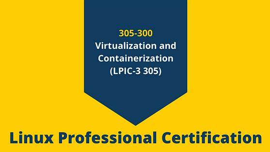
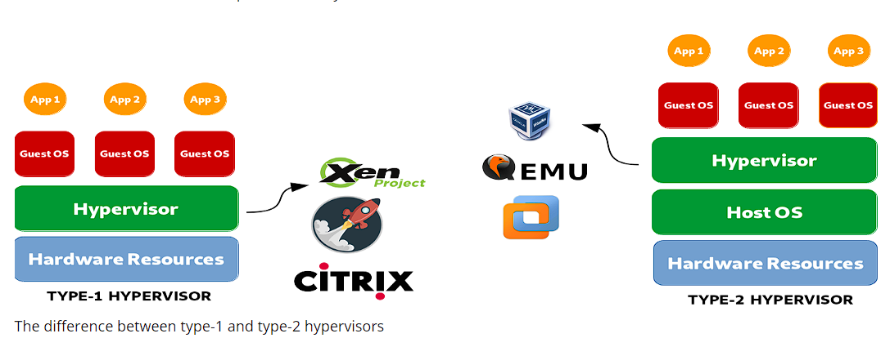
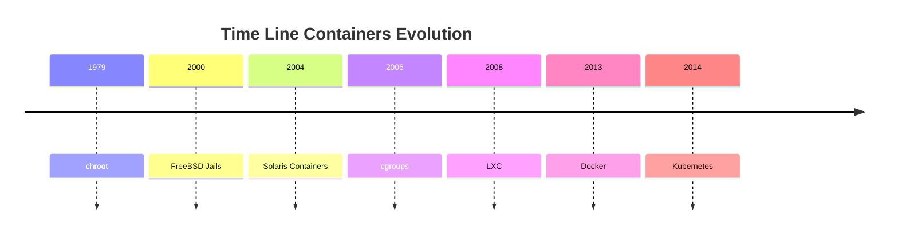

<h1><a name="readme-top"></a></h1>

[](https://github.com/marcossilvestrini/learning-lpic-3-305-300/actions/workflows/release.yml)[](https://github.com/marcossilvestrini/learning-lpic-3-305-300/actions/workflows/translate.yml)[](https://github.com/marcossilvestrini/learning-lpic-3-305-300/actions/workflows/jekyll-gh-pages.yml)[](https://github.com/marcossilvestrini/learning-lpic-3-305-300/actions/workflows/generate-html.yml)[](https://github.com/marcossilvestrini/learning-lpic-3-305-300/actions/workflows/powershell.yml)[](https://github.com/marcossilvestrini/learning-lpic-3-305-300/actions/workflows/slack.yml)

* * *

[![MIT License][license-shield]][license-url][![Forks][forks-shield]][forks-url][![Stargazers][stars-shield]][stars-url][![Contributors][contributors-shield]][contributors-url][![Issues][issues-shield]][issues-url][![LinkedIn][linkedin-shield]][linkedin-url]

* * *

# APPRENTISSAGE LPIC-3 305-300



<p align="center">
<strong>Explore the docs »</strong></a>
    <br />
    <a href="">Web Site</a>
    -
    <a href="https://github.com/marcossilvestrini/learning-lpic-3-305-300">Code Page</a>
    -
    <a href="https://github.com/marcossilvestrini/learning-lpic-3-305-300/issues">Report Bug</a>
    -
    <a href="https://github.com/marcossilvestrini/learning-lpic-3-305-300/issues">Request Feature</a>
</p>

* * *

## Résumé

<details>
  <summary><b>TABLE OF CONTENT</b></summary>
  <ol>
    <li>
      <a href="#about-the-project">About The Project</a>
    </li>
    <li>
      <a href="#getting-started">Getting Started</a>
      <ul>
        <li><a href="#prerequisites">Prerequisites</a></li>
        <li><a href="#installation">installation</a></li>
      </ul>
    </li>
    <li><a href="#usage">Usage</a></li>
    <li><a href="#roadmap">Roadmap</a></li>
    <li><a href="#freedoms">Four Essential Freedoms</a></li>
    <li>
      <a href="#topic-351">Topic 351: Full Virtualization</a>
      <ul>
        <li><a href="#topic-351.1">351.1 Virtualization Concepts and Theory </a></li>
        <li><a href="#topic-351.2">351.2 Xen</a></li>
        <li><a href="#topic-351.3">351.3 QEMU</a></li>
        <li><a href="#topic-351.4">351.4 Libvirt Virtual Machine</a></li>
        <li><a href="#topic-351.5">351.5 Virtual Machine Disk Image Management</a></li>
      </ul>
    </li>
    <li>
      <a href="#topic-352">Topic 352: Container Virtualization</a>
      <ul>
        <li><a href="#topic-352.1">352.1 Container Virtualization Concepts</a></li>
        <li><a href="#topic-352.2">352.2 LXC</a></li>
        <li><a href="#topic-352.3">352.3 Docker</a></li>
        <li><a href="#topic-352.4">352.4 Container Orchestration Platforms</a></li>
      </ul>
    </li>
    <li>
      <a href="#topic-353">Topic 353: VM Deployment and Provisioning</a>
      <ul>
        <li><a href="#topic-353.1">353.1 Cloud Management Tools</a></li>
        <li><a href="#topic-353.2">353.2 Packer</a></li>
        <li><a href="#topic-353.3">353.3 cloud-init</a></li>
        <li><a href="#topic-353.4">353.4 Vagrant</a></li>
      </ul>
    </li>
    <li><a href="#license">License</a></li>
    <li><a href="#contact">Contact</a></li>
    <li><a href="#acknowledgments">Acknowledgments</a></li>
  </ol>
</details><br>

* * *

<a name="about-the-project"></a>

## À propos du projet

> Ce projet a pour objectif d'aider les étudiants ou professionnels à apprendre les principaux concepts de GNULinux
> et logiciels gratuits\\
> Certaines distributions GNULinux comme Debian et RPM seront couvertes\\
> L'installation et la configuration de certains packages seront également abordées.\\
> En faisant cela, vous pouvez donner à l'ensemble de la communauté une chance de bénéficier de vos changements.\\
> L'accès au code source est une condition préalable à cela.\\
> Utilisez vagrant pour les machines up et exécutez les ateliers et le contenu pratique de cet article.\\
> J'ai publié dans le dossier Vagrant un Vagrantfile avec le nécessaire\\
> pour que vous téléchargiez un environnement pour les études

* * *

<p align="right">(<a href="#readme-top">back to top</a>)</p>

<a name="getting-started"></a>

## Commencer

Pour commencer l'apprentissage, consultez la documentation ci-dessus.

<a name="prerequisites"></a>

### Conditions préalables

-   [Git](https://git-scm.com/book/en/v2/Getting-Started-Installing-Git)
-   [Boîte Virtuelle](https://blogs.vmware.com/workstation/2024/05/vmware-workstation-pro-now-available-free-for-personal-use.html)
-   [Poste de travail VMware](https://blogs.vmware.com/workstation/2024/05/vmware-workstation-pro-now-available-free-for-personal-use.html)
-   [Utilitaire VMWare vagabond](https://developer.hashicorp.com/vagrant/install/vmware)
-   [Vagabond](https://developer.hashicorp.com/vagrant/install)

<a name="installation"></a>

### Installation

Cloner le dépôt

```sh
git clone https://github.com/marcossilvestrini/learning-lpic-3-305-300.git
```

Je crée un script PowerShell pour provisionner les instances avec vagrant pour les laboratoires.  
Si votre système SO est Windows, vous pouvez utiliser un script[app.ps1](./labs/app.ps1).

Définissez quelques configurations pour votre environnement :

-   Déposer[Vagrantfile-topic-351](./labs/vagrant/Vagrantfile-topic-351)
    -   vm.clone_directory = "&lt;votre_lettre_de_pilote> :\\<folder>\\&lt;vers_machine>\\#{VM_NAME}-instance-1"
        Exemple : vm.clone_directory = "E :\\Serveurs\\VMware\\#{VM_NAME}-instance-1"
    -   vm.vmx["memsize"]= ""
    -   vm.vmx["numvcpus"]= ""
    -   vm.vmx["cpuid.coresPerSocket"]= ""
    -   vb.mémoire = ""
    -   vb.cpus = ""
    -   en ligne : "ifconfig eth1 &lt;your_public_ip_instanceX> masque de réseau 255.255.255.0 up"
    -   inline : "route add default gw &lt;your_public_gateway>"

* * *

<a name="usage"></a>

## Usage

Utilisez ce référentiel pour en savoir plus sur l'examen LPIC2 202-450

<p align="right">(<a href="#readme-top">back to top</a>)</p>

* * *

<a name="roadmap"></a>

## Feuille de route

-   [x] Créer un référentiel
-   [x] Créer des scripts pour les laboratoires de provisionnement
-   [x] Créer des exemples sur le sujet 351
-   [ ] Créer des exemples sur le sujet 352
-   [ ] Créer des exemples sur le sujet 353
-   [ ] Télécharger un examen itexam simulé

* * *

<a name="freedoms"></a>

## Quatre libertés essentielles

> 0.La liberté d'exécuter le programme comme vous le souhaitez, dans n'importe quel but (liberté 0).\\
> 1.La liberté d'étudier le fonctionnement du programme et de le modifier pour qu'il fonctionne\\
> votre informatique comme vous le souhaitez (liberté 1).\\
> L'accès au code source est une condition préalable à cela.\\
> 2.La liberté de redistribuer des copies afin que vous puissiez aider les autres (liberté 2).\\
> 3.liberté de distribuer des copies de vos versions modifiées à d'autres (liberté 3).

* * *

## Inspecter les commandes

```sh
type COMMAND
apropos COMMAND
whatis COMMAND --long
whereis COMMAND
COMMAND --help, --h
man COMMAND
```

<p align="right">(<a href="#readme-top">back to top</a>)</p>

* * *

<a name="topic-351"></a>

## Sujet 351 : Virtualisation complète



* * *

<a name="topic-351.1"></a>

### 351.1 Concepts et théorie de la virtualisation

**Poids:**6

**Description:**Les candidats doivent connaître et comprendre les concepts généraux, la théorie et la terminologie de la virtualisation. Cela inclut la terminologie Xen, QEMU et libvirt.

**Domaines de connaissances clés :**

-   Comprendre la terminologie de la virtualisation
-   Comprendre les avantages et les inconvénients de la virtualisation
-   Comprendre les différentes variantes d'hyperviseurs et de moniteurs de machines virtuelles
-   Comprendre les principaux aspects de la migration des machines physiques vers les machines virtuelles
-   Comprendre les principaux aspects de la migration des machines virtuelles entre les systèmes hôtes
-   Comprendre les fonctionnalités et les implications de la virtualisation pour une machine virtuelle, telles que la prise d'instantanés, la pause, le clonage et les limites de ressources
-   Connaissance de oVirt, Proxmox, systemd-machined et VirtualBox
-   Connaissance d'Open vSwitch

#### 351.1 Objets cités

```sh
Hypervisor
Hardware Virtual Machine (HVM)
Paravirtualization (PV)
Emulation and Simulation
CPU flags
/proc/cpuinfo
Migration (P2V, V2V)
```

#### Hyperviseurs

##### Hyperviseur de type 1 (hyperviseur Bare Metal)

###### Définition de type 1

S'exécute directement sur le matériel physique de l'hôte, fournissant une couche de base pour gérer les machines virtuelles sans avoir besoin d'un système d'exploitation hôte.

###### Caractéristiques de type 1

-   Haute performance et efficacité.
-   Latence et surcharge réduites.
-   Souvent utilisé dans les environnements d’entreprise et les centres de données.

###### Exemples de type 1

-   VMware ESXi : un hyperviseur robuste et largement utilisé dans les environnements d'entreprise.
-   Microsoft Hyper-V : intégré à Windows Server, offrant de solides fonctionnalités de performances et de gestion.
-   Xen : un hyperviseur open source utilisé par de nombreux fournisseurs de services cloud.
-   KVM (Kernel-based Virtual Machine) : intégré au noyau Linux, offrant des performances élevées pour les systèmes basés sur Linux.

##### Hyperviseur de type 2 (hyperviseur hébergé)

###### Définition de type 2

Fonctionne sur un système d'exploitation conventionnel, s'appuyant sur le système d'exploitation hôte pour la gestion des ressources et la prise en charge des périphériques.

###### Caractéristiques du type 2

-   Plus facile à configurer et à utiliser, en particulier sur les ordinateurs personnels.
-   Plus flexible pour le développement, les tests et les déploiements à plus petite échelle.
-   Généralement moins efficace que les hyperviseurs de type 1 en raison de la surcharge supplémentaire du système d'exploitation hôte.

###### Exemples de type 2

-   VMware Workstation : un hyperviseur puissant pour exécuter plusieurs systèmes d'exploitation sur un seul poste de travail.
-   Oracle VirtualBox : Un hyperviseur open source connu pour sa flexibilité et sa facilité d'utilisation.
-   Parallels Desktop : conçu pour que les utilisateurs de Mac puissent exécuter Windows et d'autres systèmes d'exploitation avec macOS.
-   QEMU (Quick EMUlator) : émulateur et virtualiseur open source, souvent utilisé en conjonction avec KVM.

##### Principales différences entre les hyperviseurs de type 1 et de type 2

-   Environnement de déploiement :
    -   Les hyperviseurs de type 1 sont couramment déployés dans les centres de données et les environnements d'entreprise en raison de leur interaction directe avec le matériel et de leurs hautes performances.
    -   Les hyperviseurs de type 2 sont plus adaptés aux tâches d'utilisation personnelle, de développement, de test et de virtualisation à petite échelle.
-   Performance:
    -   Les hyperviseurs de type 1 offrent généralement de meilleures performances et une latence plus faible car ils ne s'appuient pas sur un système d'exploitation hôte.
    -   Les hyperviseurs de type 2 peuvent subir une certaine dégradation des performances en raison de la surcharge liée à l'exécution sur un système d'exploitation hôte.
-   Gestion et facilité d'utilisation :
    -   Les hyperviseurs de type 1 nécessitent une configuration et une gestion plus complexes, mais offrent des fonctionnalités avancées et une évolutivité pour les déploiements à grande échelle.
    -   Les hyperviseurs de type 2 sont plus faciles à installer et à utiliser, ce qui les rend idéaux pour les utilisateurs individuels et les petits projets.

##### Types de migration

Dans le contexte des hyperviseurs, qui sont des technologies utilisées pour créer et gérer des machines virtuelles, les termes migration P2V et migration V2V sont courants dans les environnements de virtualisation.  
Ils font référence à des processus de migration de systèmes entre différents types de plates-formes.

##### P2V - Migration physique vers virtuelle

La migration P2V fait référence au processus de migration d'un serveur physique vers une machine virtuelle.  
En d'autres termes, un système d'exploitation et ses applications, fonctionnant sur du matériel physique dédié, sont « convertis » et déplacés vers une machine virtuelle qui s'exécute sur un hyperviseur (comme VMware, Hyper-V, KVM, etc.).

-   Exemple : Vous disposez d'un serveur physique exécutant un système Windows ou Linux et vous souhaitez le déplacer vers un environnement virtuel, comme une infrastructure cloud ou un serveur de virtualisation interne.  
    Le processus consiste à copier l'intégralité de l'état du système, y compris le système d'exploitation, les pilotes et les données, pour créer une machine virtuelle équivalente pouvant s'exécuter comme si elle se trouvait sur le matériel physique.

##### V2V - Migration virtuelle vers virtuelle

La migration V2V fait référence au processus de migration d'une machine virtuelle d'un hyperviseur à un autre.  
Dans ce cas, vous disposez déjà d'une machine virtuelle exécutée dans un environnement virtualisé (comme VMware) et vous souhaitez la déplacer vers un autre environnement virtualisé (par exemple, vers Hyper-V ou vers un nouveau serveur VMware).

-   Exemple : Vous disposez d'une machine virtuelle exécutée sur un serveur de virtualisation VMware, mais vous décidez de la migrer vers une plateforme Hyper-V. Dans ce cas, la migration V2V convertit la machine virtuelle d'un format ou d'un hyperviseur à un autre, garantissant ainsi son bon fonctionnement.

#### HVM et paravirtualisation

##### Virtualisation assistée par matériel (HVM)

###### HVM Definition

HVM exploite les extensions matérielles fournies par les processeurs modernes pour virtualiser le matériel, permettant ainsi la création et la gestion de machines virtuelles avec une surcharge de performances minimale.

###### Caractéristiques clés du HVM

-   **Prise en charge matérielle**: Nécessite la prise en charge du processeur pour les extensions de virtualisation telles qu'Intel VT-x ou AMD-V.
-   **Virtualisation complète :**Les machines virtuelles peuvent exécuter des systèmes d'exploitation invités non modifiés, car l'hyperviseur fournit une émulation complète de l'environnement matériel.
-   **Performance:**Offre généralement des performances quasi natives en raison de l’exécution directe du code invité sur le processeur.
-   **Isolement:**Fournit une forte isolation entre les machines virtuelles puisque chaque machine virtuelle fonctionne comme si elle disposait de son propre matériel dédié.

###### HVM Examples

VMware ESXi, Microsoft Hyper-V, KVM (machine virtuelle basée sur le noyau).

###### HVM Advantages

-   **Compatibilité:**Peut exécuter n’importe quel système d’exploitation sans modification.
-   **Performance:**Hautes performances grâce au support matériel.
-   **Sécurité:**Fonctionnalités d’isolation et de sécurité améliorées fournies par le matériel.

###### HVM Disadvantages

-   **Dépendance matérielle :**Nécessite des fonctionnalités matérielles spécifiques, limitant la compatibilité avec les anciens systèmes.
-   **Complexité:**Peut impliquer une configuration et une gestion plus complexes.

##### Paravirtualisation

###### Définition de la paravirtualisation

La paravirtualisation implique de modifier le système d'exploitation invité pour qu'il soit conscient de l'environnement virtuel, lui permettant d'interagir plus efficacement avec l'hyperviseur.

###### Caractéristiques clés de la paravirtualisation

-   **Modification des invités :**Nécessite des modifications du système d’exploitation invité pour communiquer directement avec l’hyperviseur à l’aide d’hyperappels.
-   **Performance:**Peut être plus efficace que la virtualisation complète traditionnelle, car elle réduit la surcharge associée à l'émulation du matériel.
-   **Compatibilité:**Limité aux systèmes d'exploitation qui ont été modifiés pour la paravirtualisation.

###### Exemples de paravirtualisation

Xen avec des invités paravirtualisés, des outils VMware dans certaines configurations et certaines configurations KVM.

###### Avantages de la paravirtualisation

-   **Efficacité:**Réduit la surcharge liée à la virtualisation du matériel, offrant potentiellement de meilleures performances pour certaines charges de travail.
-   **Utilisation des ressources :**Utilisation plus efficace des ressources système grâce à la communication directe entre le système d'exploitation invité et l'hyperviseur.

###### Inconvénients de la paravirtualisation

-   **Modification du système d'exploitation invité :**Nécessite des modifications du système d'exploitation invité, limitant la compatibilité aux systèmes d'exploitation pris en charge.
-   **Complexité:**Nécessite une complexité supplémentaire dans le système d’exploitation invité pour les implémentations d’hypercall.

##### Différences clés

###### Exigences du système d'exploitation invité

-   **HVM:**Peut exécuter des systèmes d’exploitation invités non modifiés.
-   **Paravirtualisation :**Nécessite que les systèmes d’exploitation invités soient modifiés pour fonctionner avec l’hyperviseur.

###### Performance

-   **HVM:**Fournit généralement des performances quasi natives grâce à l’exécution assistée par matériel.
-   **Paravirtualisation :**Peut offrir des performances efficaces en réduisant la surcharge de l'émulation matérielle, mais repose sur un système d'exploitation invité modifié.

###### Dépendance matérielle

-   **HVM:**Nécessite des fonctionnalités CPU spécifiques (Intel VT-x, AMD-V).
-   **Paravirtualisation :**Ne nécessite pas de fonctionnalités de processeur spécifiques mais nécessite un système d'exploitation invité modifié.

###### Isolement

-   **HVM:**Fournit une forte isolation grâce aux fonctionnalités matérielles.
-   **Paravirtualisation :**Repose sur une isolation logicielle, qui n'est peut-être pas aussi robuste que l'isolation matérielle.

###### Complexité

-   **HVM:**Généralement plus simple à déployer car il prend en charge le système d'exploitation non modifié.
-   **Paravirtualisation :**Nécessite une configuration et des modifications supplémentaires du système d’exploitation invité, ce qui augmente la complexité.

#### NUMA (accès mémoire non uniforme)

NUMA (Non-Uniform Memory Access) est une architecture de mémoire utilisée dans les systèmes multiprocesseurs pour optimiser l'accès à la mémoire par les processeurs.  
Dans un système NUMA, la mémoire est inégalement répartie entre les processeurs, ce qui signifie que chaque processeur a un accès plus rapide à une partie de la mémoire (sa « mémoire locale ») qu'à une mémoire physiquement plus éloignée (appelée « mémoire distante ») et associée. avec d'autres processeurs.

##### Principales fonctionnalités de l'architecture NUMA

1.  **Mémoire locale et distante**: Chaque processeur possède sa propre mémoire locale, à laquelle il peut accéder plus rapidement. Cependant, il peut également accéder à la mémoire d'autres processeurs, même si cela prend plus de temps.
2.  **Latence différenciée**: La latence d'accès mémoire varie selon que le processeur accède à sa mémoire locale ou à la mémoire d'un autre nœud. L’accès à la mémoire locale est plus rapide, tandis que l’accès à la mémoire d’un autre nœud (distant) est plus lent.
3.  **Évolutivité**: L'architecture NUMA est conçue pour améliorer l'évolutivité des systèmes dotés de nombreux processeurs. À mesure que davantage de processeurs sont ajoutés, la mémoire est également distribuée, évitant ainsi le goulot d'étranglement qui se produirait dans une architecture d'accès uniforme à la mémoire (UMA).

##### Avantages de NUMA

-   Meilleures performances dans les grands systèmes : étant donné que chaque processeur dispose d'une mémoire locale, il peut fonctionner plus efficacement sans rivaliser autant avec les autres processeurs pour l'accès à la mémoire.
-   Évolutivité : NUMA permet aux systèmes dotés de nombreux processeurs et de grandes quantités de mémoire d'évoluer plus efficacement par rapport à une architecture UMA.

##### Inconvénients

-   Complexité de la programmation : les programmeurs doivent savoir quelles régions de mémoire sont locales ou distantes, optimisant ainsi l'utilisation de la mémoire locale pour obtenir de meilleures performances.
-   Pénalités potentielles en termes de performances : si un processeur accède fréquemment à la mémoire distante, les performances peuvent en souffrir en raison d'une latence plus élevée.
    Cette architecture est courante dans les systèmes multiprocesseurs hautes performances, tels que les serveurs et les supercalculateurs, où l'évolutivité et l'optimisation de la mémoire sont essentielles.

#### Opensource Solutions

-   oVirté :<https://www.ovirt.org/>

-   Proxmox :<https://www.proxmox.com/en/proxmox-virtual-environment/overview>

-   Oracle VirtualBox :<https://www.virtualbox.org/>

-   Ouvrez le vSwitch :<https://www.openvswitch.org/>

#### Types de virtualisation

##### Virtualisation matérielle (virtualisation de serveur)

###### Définition HT

Extrait le matériel physique pour créer des machines virtuelles (VM) qui exécutent des systèmes d'exploitation et des applications distincts.

###### Cas d'utilisation HT

Centres de données, cloud computing, consolidation de serveurs.

###### Exemples HT

VMware ESXi, Microsoft Hyper-V, KVM.

##### Virtualisation du système d'exploitation (conteneurisation)

###### Définition de la conteneurisation

Permet à plusieurs instances d'espace utilisateur isolées (conteneurs) de s'exécuter sur un seul noyau de système d'exploitation.

###### Cas d'utilisation de la conteneurisation

Architecture de microservices, environnements de développement et de test.

###### Exemples de conteneurisation

Docker, Kubernetes, LXC.

##### Virtualisation du réseau

###### Définition de la virtualisation du réseau

Combine les ressources réseau matérielles et logicielles en une seule entité administrative logicielle.

###### Cas d'utilisation de la virtualisation de réseau

Réseau défini par logiciel (SDN), virtualisation des fonctions réseau (NFV).

###### Exemples de virtualisation de réseau

VMware NSX, Cisco ACI, OpenStack Neutron.

##### Virtualisation du stockage

###### Définition de la virtualisation du stockage

Regroupe le stockage physique de plusieurs appareils dans une seule unité de stockage virtuelle qui peut être gérée de manière centralisée.

###### Cas d'utilisation de la définition de virtualisation du stockage

Gestion des données, optimisation du stockage, reprise après sinistre.

###### Exemples de définition de virtualisation du stockage

Contrôleur de volume IBM SAN, VMware vSAN, NetApp ONTAP.

##### Virtualisation des postes de travail

###### Définition de la virtualisation des postes de travail

Permet à un système d'exploitation de bureau de s'exécuter sur une machine virtuelle hébergée sur un serveur.

###### Cas d'utilisation de la définition de la virtualisation des postes de travail

Infrastructure de bureau virtuel (VDI), solutions de travail à distance.

###### Exemples de définition de virtualisation de bureau

Citrix Virtual Apps and Desktops, VMware Horizon, Microsoft Remote Desktop Services.

##### Virtualisation des applications

###### Définition de la virtualisation des applications

Sépare les applications du matériel et du système d'exploitation sous-jacents, leur permettant de s'exécuter dans des environnements isolés.

###### Cas d'utilisation de la définition de la virtualisation des applications

Déploiement d'applications simplifié, tests de compatibilité.

###### Exemples de définition de virtualisation d'applications

VMware ThinApp, Microsoft App-V, Citrix XenApp.

##### Virtualisation des données

###### Définition de la virtualisation des données

Intègre les données provenant de diverses sources sans les consolider physiquement, offrant ainsi une vue unifiée pour l'analyse et le reporting.

###### Cas d'utilisation de la définition de la virtualisation des données

Business intelligence, intégration de données en temps réel.

###### Exemples de définition de virtualisation des données

Denodo, virtualisation des données Red Hat JBoss, IBM InfoSphere.

##### Avantages de la virtualisation

-   Efficacité des ressources : meilleure utilisation des ressources physiques.
-   Économies de coûts : réduction des coûts matériels et opérationnels.
-   Évolutivité : facile à augmenter ou à réduire en fonction de la demande.
-   Flexibilité : prend en charge une variété de charges de travail et d’applications.
-   Reprise après sinistre : processus de sauvegarde et de récupération simplifiés.
-   Isolation : sécurité améliorée grâce à l'isolation des environnements.

<p align="right">(<a href="#topic-351.1">back to sub Topic 351.1</a>)</p>
<p align="right">(<a href="#topic-351">back to Topic 351</a>)</p>
<p align="right">(<a href="#readme-top">back to top</a>)</p>

* * *

<a name="topic-351.2"></a>

### 351.2 Xén


**Poids:**3

**Description:**Les candidats doivent être capables d'installer, de configurer, de maintenir, de migrer et de dépanner les installations Xen. L'accent est mis sur Xen version 4.x.

**Domaines de connaissances clés :**

-   Comprendre l'architecture de Xen, y compris la mise en réseau et le stockage
-   Configuration de base des nœuds et domaines Xen
-   Gestion de base des nœuds et domaines Xen
-   Dépannage de base des installations Xen
-   Avaricité des pilules
-   Connaissance de XenStore
-   Connaissance des paramètres de démarrage Xen
-   Connaissance de l'utilitaire xm

#### Xen


Xen est un hyperviseur open source de type 1 (bare metal), qui permet à plusieurs systèmes d'exploitation de s'exécuter simultanément sur le même matériel physique.  
Xen fournit une couche entre le matériel physique et les machines virtuelles (VM), permettant un partage et une isolation efficaces des ressources.

-   **Architecture:**Xen fonctionne avec un système à deux niveaux où le domaine 0 (Dom0) est le domaine privilégié avec un accès matériel direct et gère l'hyperviseur. D'autres machines virtuelles, appelées Domain U (DomU), exécutent des systèmes d'exploitation invités et sont gérées par Dom0.
-   **Types de virtualisation :**Xen prend en charge à la fois la paravirtualisation (PV), qui nécessite un système d'exploitation invité modifié, et la virtualisation assistée par matériel (HVM), qui utilise des extensions matérielles (par exemple, Intel VT-x ou AMD-V) pour exécuter des systèmes d'exploitation invités non modifiés.
    Xen est largement utilisé dans les environnements cloud, notamment par Amazon Web Services (AWS) et d'autres fournisseurs cloud à grande échelle.

#### XenSource

XenSource était la société fondée par les développeurs originaux de l'hyperviseur Xen de l'Université de Cambridge pour commercialiser Xen.  
La société a fourni des solutions d'entreprise basées sur Xen et a proposé des outils et un support supplémentaires pour améliorer les capacités de Xen pour une utilisation en entreprise.

-   **Rachat par Citrix**: En 2007, XenSource a été acquis par Citrix Systems, Inc. Citrix a utilisé la technologie Xen comme base pour son produit Citrix XenServer, qui est devenu une plate-forme de virtualisation d'entreprise populaire basée sur Xen.
-   **Transition**: Après l'acquisition, le projet Xen s'est poursuivi en tant que projet open source, tandis que Citrix s'est concentré sur des offres commerciales comme XenServer, tirant parti de la technologie XenSource.

#### Projet Xen

Xen Project fait référence à la communauté et à l'initiative open source responsables du développement et de la maintenance de l'hyperviseur Xen après sa commercialisation.  
Le projet Xen fonctionne sous la Fondation Linux et se concentre sur la création, l'amélioration et le support de Xen dans le cadre d'un effort collaboratif axé sur la communauté.

-   **Objectifs:**Le projet Xen vise à faire progresser l'hyperviseur en améliorant ses performances, sa sécurité et ses fonctionnalités pour un large éventail de cas d'utilisation, notamment le cloud computing, la virtualisation axée sur la sécurité (par exemple, Qubes OS) et les systèmes embarqués.
-   **Contributeurs :**Le projet inclut des contributeurs de diverses organisations, notamment des principaux fournisseurs de cloud, des fournisseurs de matériel et des développeurs indépendants.
-   **PILULES ET OUTILS HANTOOLS :**Le projet Xen comprend également des outils tels que XAPI (XenAPI), utilisé pour gérer les installations de l'hyperviseur Xen, ainsi que divers autres utilitaires pour la gestion et l'optimisation du système.

#### XenStore

Xen Store est un composant essentiel de l'hyperviseur Xen.  
Essentiellement, Xen Store est une base de données clé-valeur distribuée utilisée pour la communication et le partage d'informations entre l'hyperviseur Xen et les machines virtuelles (également appelées domaines) qu'il gère.

Voici quelques aspects clés de Xen Store :

-   **Communication inter-domaine :**Xen Store permet la communication entre des domaines, tels que Dom0 (le domaine privilégié qui contrôle les ressources matérielles) et DomUs (domaines utilisateur, qui sont les machines virtuelles). Cela se fait via des entrées clé-valeur, où chaque domaine peut lire ou écrire des informations.

-   **Gestion des configurations :**Il est utilisé pour stocker et accéder aux informations de configuration, telles que les périphériques virtuels, la mise en réseau et les paramètres de démarrage. Cela facilite la gestion et la configuration dynamiques des VM.

-   **Événements et notifications :**Xen Store prend également en charge les notifications d'événements. Lorsqu'une clé ou une valeur particulière dans le Xen Store est modifiée, les domaines intéressés peuvent être avertis pour réagir à ces modifications. Ceci est utile pour surveiller et gérer les ressources.

-   API simple : Xen Store fournit une API simple pour lire et écrire des données, permettant aux développeurs d'intégrer facilement leurs applications au système de virtualisation Xen.

#### Pilule

XAPI, ou XenAPI, est l'interface de programmation d'application (API) utilisée pour gérer l'hyperviseur Xen et ses machines virtuelles (VM).  
XAPI est un composant clé de XenServer (maintenant connu sous le nom de Citrix Hypervisor) et fournit un moyen standardisé d'interagir avec l'hyperviseur Xen pour effectuer des opérations telles que la création, la configuration, la surveillance et le contrôle des machines virtuelles.

Voici quelques aspects importants de XAPI :

-   **Gestion des machines virtuelles :**XAPI permet aux administrateurs de créer, supprimer, démarrer et arrêter par programme des machines virtuelles.

-   **Automation:**Avec XAPI, il est possible d'automatiser la gestion des ressources virtuelles, notamment la mise en réseau, le stockage et l'informatique, ce qui est crucial pour les grands environnements cloud.

-   **Intégration:**XAPI peut être intégré à d'autres outils et scripts pour fournir une administration plus efficace et personnalisée de l'environnement Xen.

-   **Contrôle d'accès :**XAPI fournit également des mécanismes de contrôle d'accès pour garantir que seuls les utilisateurs autorisés peuvent effectuer des opérations spécifiques dans l'environnement virtuel.

XAPI est l'interface qui permet le contrôle et l'automatisation de l'hyperviseur Xen, facilitant ainsi la gestion des environnements virtualisés.

#### Résumé Xen

-   **Xen :**La technologie d'hyperviseur de base permettant aux machines virtuelles de s'exécuter sur du matériel physique.
-   **XenSource :**La société qui a commercialisé Xen, acquise plus tard par Citrix, conduisant au développement de Citrix XenServer.
-   **Projet Xen :**L'initiative et la communauté open source qui continuent de développer et de maintenir l'hyperviseur Xen sous la Fondation Linux.
-   **XenStore :**Xen Store agit comme intermédiaire de communication et de configuration entre l'hyperviseur Xen et les VM, rationalisant le fonctionnement et la gestion des environnements virtualisés.
-   **Pilule**est l'interface qui permet le contrôle et l'automatisation de l'hyperviseur Xen, facilitant ainsi la gestion des environnements virtualisés.

#### Domain0 (Dom0)

Domain0, ou Dom0, est le domaine de contrôle dans une architecture Xen. Il gère d'autres domaines (DomUs) et dispose d'un accès direct au matériel.  
Dom0 exécute des pilotes de périphériques, permettant aux DomU, qui ne disposent pas d'un accès direct au matériel, de communiquer avec les périphériques. En règle générale, il s'agit d'une instance complète d'un système d'exploitation, comme Linux, et elle est essentielle au fonctionnement de l'hyperviseur Xen.

#### DomaineU (DomU)

Les DomU sont des domaines non privilégiés qui exécutent des machines virtuelles.  
Ils sont gérés par Dom0 et n'ont pas d'accès direct au matériel. Les DomU peuvent être configurés pour exécuter différents systèmes d'exploitation et sont utilisés à diverses fins, telles que les serveurs d'applications et les environnements de développement. Ils s'appuient sur Dom0 pour l'interaction matérielle.

#### PV-DomU (Paravirtualized DomainU)

Les PV-DomU utilisent une technique appelée paravirtualisation. Dans ce modèle, le système d'exploitation DomU est modifié pour prendre conscience qu'il s'exécute dans un environnement virtualisé, lui permettant de communiquer directement avec l'hyperviseur pour des performances optimisées.  
Cela se traduit par une réduction des frais généraux et une meilleure efficacité par rapport à la virtualisation complète.

#### HVM-DomU (Hardware Virtual Machine DomainU)

Les HVM-DomU sont des machines virtuelles qui utilisent une virtualisation complète, permettant à des systèmes d'exploitation non modifiés de s'exécuter. L'hyperviseur Xen fournit une émulation matérielle pour ces DomU, leur permettant d'exécuter n'importe quel système d'exploitation prenant en charge l'architecture matérielle sous-jacente.  
Bien que cela offre une plus grande flexibilité, cela peut entraîner des frais généraux plus élevés par rapport aux PV-DomU.

#### 351.2 Cited Objects

```sh
Domain0 (Dom0), DomainU (DomU)
PV-DomU, HVM-DomU
/etc/xen/
xl
xl.cfg
xl.conf
xentop
```

#### 351.2 Commandes importantes

##### XL

```sh
# view xen information
xl infos
```

<p align="right">(<a href="#topic-351.2">back to sub Topic 351.2</a>)</p>
<p align="right">(<a href="#topic-351">back to Topic 351</a>)</p>
<p align="right">(<a href="#readme-top">back to top</a>)</p>

* * *

<a name="topic-351.3"></a>

### 351.3 QEMU

**Poids:**4

**Description:**Les candidats doivent être capables d'installer, de configurer, de maintenir, de migrer et de dépanner les installations QEMU.

**Domaines de connaissances clés :**

-   Comprendre l'architecture de QEMU, y compris KVM, la mise en réseau et le stockage
-   Démarrez les instances QEMU à partir de la ligne de commande
-   Gérer les instantanés à l'aide du moniteur QEMU
-   Installez les pilotes de périphérique QEMU Guest Agent et VirtIO
-   Dépanner les installations QEMU, y compris la mise en réseau et le stockage
-   Connaissance des paramètres de configuration importants de QEMU

#### 351.3 Objets cités

```sh
Kernel modules: kvm, kvm-intel and kvm-amd
/dev/kvm
QEMU monitor
qemu
qemu-system-x86_64
ip
brctl
tunctl
```

#### 351.3 Commandes importantes

##### adresse IP

```sh
# list links
ip link show
```

<p align="right">(<a href="#topic-351.3">back to sub Topic 351.3</a>)</p>
<p align="right">(<a href="#topic-351">back to Topic 351</a>)</p>
<p align="right">(<a href="#readme-top">back to top</a>)</p>

* * *

<a name="topic-351.4"></a>

### 351.4 Gestion des machines virtuelles Libvirt

**Poids:**9

**Description:**Les candidats doivent être capables de gérer des hôtes de virtualisation et des machines virtuelles (« domaines libvirt ») à l'aide de libvirt et des outils associés.

**Domaines de connaissances clés :**

-   Comprendre l'architecture de libvirt
-   Gérer les connexions et les nœuds libvirt
-   Créer et gérer des domaines QEMU et Xen, y compris des instantanés
-   Gérer et analyser la consommation des ressources des domaines
-   Créer et gérer des pools et des volumes de stockage
-   Créer et gérer des réseaux virtuels
-   Migrer les domaines entre les nœuds
-   Comprendre comment libvirt interagit avec Xen et QEMU
-   Comprendre comment libvirt interagit avec les services réseau tels que dnsmasq et radvd
-   Comprendre les fichiers de configuration XML de libvirt
-   Connaissance de virtlogd et virtlockd

#### 351.4 Objets cités

```sh
libvirtd
/etc/libvirt/
virsh (including relevant subcommands)
```

#### 351.4 Commandes importantes

##### foo

```sh
foo
```

<p align="right">(<a href="#topic-351.4">back to sub Topic 351.4</a>)</p>
<p align="right">(<a href="#topic-351">back to Topic 351</a>)</p>
<p align="right">(<a href="#readme-top">back to top</a>)</p>

* * *

<a name="topic-351.5"></a>

### 351.5 Gestion des images disque de machine virtuelle

**Poids:**3

**Description:**Les candidats doivent être capables de gérer des images disque de machines virtuelles. Cela inclut la conversion d'images disque entre différents formats et hyperviseurs et l'accès aux données stockées dans une image.

**Domaines de connaissances clés :**

-   Comprendre les fonctionnalités de divers formats d'image de disque virtuel, tels que les images brutes, qcow2 et VMDK
-   Gérer les images de disque de machine virtuelle à l'aide de qemu-img
-   Montez des partitions et accédez aux fichiers contenus dans les images disque de la machine virtuelle à l'aide de libguestfish
-   Copier le contenu du disque physique sur une image disque de machine virtuelle
-   Migrer le contenu du disque entre différents formats d'image disque de machine virtuelle
-   Connaissance du format de virtualisation ouverte (OVF)

#### 351.5 Objets cités

```sh
qemu-img
guestfish (including relevant subcommands)
guestmount
guestumount
virt-cat
virt-copy-in
virt-copy-out
virt-diff
virt-inspector
virt-filesystems
virt-rescue
virt-df
virt-resize
virt-sparsify
virt-p2v
virt-p2v-make-disk
virt-v2v
virt-sysprep
```

#### 351.5 Commandes importantes

##### foo

```sh
foo
```

<p align="right">(<a href="#topic-351.5">back to sub Topic 351.5</a>)</p>
<p align="right">(<a href="#topic-351">back to Topic 351</a>)</p>
<p align="right">(<a href="#readme-top">back to top</a>)</p>

* * *

<a name="topic-352"></a>

## Sujet 352 : Virtualisation des conteneurs

* * *

<a name="topic-352.1"></a>

### 352.1 Concepts de virtualisation de conteneurs

**Poids:**7

**Description:**Les candidats doivent comprendre le concept de virtualisation de conteneurs. Cela inclut la compréhension des composants Linux utilisés pour implémenter la virtualisation des conteneurs ainsi que l'utilisation des outils Linux standard pour dépanner ces composants.

**Domaines de connaissances clés :**

-   Comprendre les concepts de système et de conteneur d'applications
-   Comprendre et analyser les espaces de noms du noyau
-   Comprendre et analyser les groupes de contrôle
-   Comprendre et analyser les capacités
-   Comprendre le rôle de seccomp, SELinux et AppArmor pour la virtualisation des conteneurs
-   Comprendre comment LXC et Docker exploitent les espaces de noms, les groupes de contrôle, les capacités, seccomp et MAC
-   Comprendre le principe du runc
-   Comprendre le principe du CRI-O et de containersd
-   Connaissance du runtime OCI et des spécifications des images
-   Connaissance de l'interface d'exécution de conteneur Kubernetes (CRI)
-   Conscience de podman, buildah et scope
-   Connaissance d'autres approches de virtualisation de conteneurs sous Linux et d'autres systèmes d'exploitation libres, tels que rkt, OpenVZ, systemd-nspawn ou BSD Jails



#### 352.1 Objets cités

```sh
nsenter
unshare
ip (including relevant subcommands)
capsh
/sys/fs/cgroups
/proc/[0-9]+/ns
/proc/[0-9]+/status
```

#### 352.1 Commandes importantes

##### foo

```sh
foo
```

<p align="right">(<a href="#topic-352.1">back to sub topic 352.1</a>)</p>
<p align="right">(<a href="#topic-352">back to topic 352</a>)</p>
<p align="right">(<a href="#readme-top">back to top</a>)</p>

* * *

<a name="topic-352.2"></a>

### 352.2 LXC

**Poids:**6

**Description:**Les candidats doivent être capables d'utiliser des conteneurs système utilisant LXC et LXD. La version de LXC couverte est 3.0 ou supérieure.

**Domaines de connaissances clés :**

-   Comprendre l'architecture de LXC et LXD
-   Gérez les conteneurs LXC en fonction des images existantes à l'aide de LXD, y compris la mise en réseau et le stockage.
-   Configurer les propriétés du conteneur LXC
-   Limiter l'utilisation des ressources du conteneur LXC
-   Utiliser les profils LXD
-   Comprendre les images LXC
-   Connaissance des outils LXC traditionnels

#### 352.2 Objets cités

```sh
lxd
lxc (including relevant subcommands)
```

#### 352.2 Commandes importantes

##### foo

```sh
foo
```

<p align="right">(<a href="#topic-352.2">back to sub topic 352.2</a>)</p>
<p align="right">(<a href="#topic-352">back to topic 352</a>)</p>
<p align="right">(<a href="#readme-top">back to top</a>)</p>

* * *

<a name="topic-352.3"></a>

### 352.3 Docker

**Poids:**9

**Description:**Le candidat doit être capable de gérer les nœuds Docker et les conteneurs Docker. Cela inclut la compréhension de l'architecture de Docker ainsi que la compréhension de la manière dont Docker interagit avec le système Linux du nœud.

**Domaines de connaissances clés :**

-   Comprendre l'architecture et les composants de Docker
-   Gérer les conteneurs Docker à l'aide d'images d'un registre Docker
-   Comprendre et gérer les images et les volumes pour les conteneurs Docker
-   Comprendre et gérer la journalisation pour les conteneurs Docker
-   Comprendre et gérer la mise en réseau pour Docker
-   Utiliser Dockerfiles pour créer des images de conteneurs
-   Exécutez un registre Docker à l'aide de l'image Docker du registre

#### 352.3 Objets cités

```sh
dockerd
/etc/docker/daemon.json
/var/lib/docker/
docker
Dockerfile
```

#### 352.3 Commandes importantes

##### docker

```sh
# Examples of docker
```

<p align="right">(<a href="#topic-352.3">back to sub topic 352.3</a>)</p>
<p align="right">(<a href="#topic-352">back to topic 352</a>)</p>
<p align="right">(<a href="#readme-top">back to top</a>)</p>

* * *

<a name="topic-352.4"></a>

### 352.4 Plateformes d'orchestration de conteneurs

**Poids:**3

**Description:**Les candidats doivent comprendre l'importance de l'orchestration des conteneurs et les concepts clés fournis par Docker Swarm et Kubernetes pour mettre en œuvre l'orchestration des conteneurs.

**Domaines de connaissances clés :**

-   Comprendre la pertinence de l'orchestration des conteneurs
-   Comprendre les concepts clés de Docker Compose et Docker Swarm
-   Comprendre les concepts clés de Kubernetes et Helm
-   Connaissance d'OpenShift, Rancher et Mesosphere DC/OS

<p align="right">(<a href="#topic-352.4">back to sub topic 352.4</a>)</p>
<p align="right">(<a href="#topic-352">back to topic 352</a>)</p>
<p align="right">(<a href="#readme-top">back to top</a>)</p>

* * *

<a name="topic-353"></a>

## Sujet 353 : Déploiement et provisionnement de VM

* * *

<a name="topic-353.1"></a>

### 353.1 Outils de gestion du cloud

**Poids:**2

**Description:**Les candidats doivent comprendre les offres courantes dans les cloud publics et posséder une connaissance de base des fonctionnalités des outils de gestion cloud couramment disponibles.

**Domaines de connaissances clés :**

-   Comprendre les offres courantes dans les cloud publics
-   Connaissance des fonctionnalités de base d'OpenStack
-   Connaissance des fonctionnalités de base de Terraform
-   Connaissance de CloudStack, Eucalyptus et OpenNebula

#### 353.1 Objets cités

```sh
IaaS, PaaS, SaaS
OpenStack
Terraform
```

#### 353.1 Commandes importantes

##### foo

```sh
# examples
```

<p align="right">(<a href="#topic-353.1">back to sub topic 353.1</a>)</p>
<p align="right">(<a href="#topic-353">back to topic 353</a>)</p>
<p align="right">(<a href="#readme-top">back to top</a>)</p>

* * *

<a name="topic-353.2"></a>

### 353.2 Emballeur

**Poids:**2

**Description:**Les candidats doivent être capables d'utiliser Packer pour créer des images système. Cela inclut l'exécution de Packer dans divers environnements de cloud public et privé ainsi que la création d'images de conteneurs pour LXC/LXD.

**Domaines de connaissances clés :**

-   Comprendre les fonctionnalités et les caractéristiques de Packer
-   Créer et gérer des fichiers modèles
-   Créez des images à partir de fichiers modèles à l'aide de différents générateurs

#### 353.2 Objets cités

```sh
packer
```

#### 353.2 Commandes importantes

##### emballeur

```sh
# examples
```

<p align="right">(<a href="#topic-353.2">back to sub topic 353.2</a>)</p>
<p align="right">(<a href="#topic 353">back to topic 353</a>)</p>
<p align="right">(<a href="#readme-top">back to top</a>)</p>

* * *

<a name="topic-353.3"></a>

### 353.3 initialisation du cloud

**Poids:**3

**Description:**Les candidats doivent pouvoir utiliser cloud-init pour configurer des machines virtuelles créées à partir d'images standardisées. Cela inclut l'ajustement des machines virtuelles pour qu'elles correspondent à leurs ressources matérielles disponibles, en particulier l'espace disque et les volumes.  
De plus, les candidats doivent être capables de configurer des instances pour permettre des connexions SSH sécurisées et installer un ensemble spécifique de progiciels.  
De plus, les candidats doivent être capables de créer de nouvelles images système avec la prise en charge de cloud-init.

**Domaines de connaissances clés :**

-   Comprendre les fonctionnalités et les concepts de cloud-init, y compris les données utilisateur, l'initialisation et la configuration de cloud-init
-   Utilisez cloud-init pour créer, redimensionner et monter des systèmes de fichiers, configurer les comptes d'utilisateurs, y compris les informations de connexion telles que les clés SSH et installer des packages logiciels à partir du référentiel de la distribution.
-   Intégrer cloud-init dans les images système
-   Utiliser la source de données du lecteur de configuration pour les tests

#### 353.3 Objets cités

```sh
cloud-init
user-data
/var/lib/cloud/
```

#### 353.3 Commandes importantes

##### foo

```sh
# examples
```

<p align="right">(<a href="#topic-353.3">back to sub topic 353.3</a>)</p>
<p align="right">(<a href="#topic 353">back to topic 353</a>)</p>
<p align="right">(<a href="#readme-top">back to top</a>)</p>

* * *

<a name="topic-353.4"></a>

### 353.4 Vagabond

**Poids:**3

**Description:**Le candidat doit être capable d'utiliser Vagrant pour gérer des machines virtuelles, y compris le provisionnement de la machine virtuelle.

**Domaines de connaissances clés :**

-   Comprendre l'architecture et les concepts de Vagrant, y compris le stockage et la mise en réseau
-   Récupérer et utiliser des boîtes d'Atlas
-   Créer et exécuter des Vagrantfiles
-   Accéder aux machines virtuelles Vagrant
-   Partager et synchroniser le dossier entre une machine virtuelle Vagrant et le système hôte
-   Comprendre le provisionnement Vagrant, c'est-à-dire les provisionneurs de fichiers et de shell
-   Comprendre la configuration multi-machines

#### 353.4 Objets cités

```sh
vagrant
Vagrantfile
```

#### 353.4 Commandes importantes

##### vagabond

```sh
# examples
```

<p align="right">(<a href="#topic-353.4">back to sub topic 353.4</a>)</p>
<p align="right">(<a href="#topic 353">back to topic 353</a>)</p>
<p align="right">(<a href="#readme-top">back to top</a>)</p>

* * *

## Contribuer

Les contributions sont ce qui fait de la communauté open source un endroit si formidable pour
apprendre, inspirer et créer. Toutes les contributions que vous apportez sont**grandement apprécié**.

Si vous avez une suggestion pour améliorer les choses, veuillez créer le dépôt et
créer une pull request. Vous pouvez aussi simplement ouvrir un ticket avec la balise « amélioration ».
N'oubliez pas de donner une étoile au projet ! Merci encore!

1.  Forkez le projet
2.  Créez votre branche de fonctionnalités (`git checkout -b feature/AmazingFeature`)
3.  Validez vos modifications (`git commit -m 'Add some AmazingFeature'`)
4.  Pousser vers la succursale (`git push origin feature/AmazingFeature`)
5.  Ouvrir une demande de tirage

* * *

## Licence

-   Ce projet est sous licence MIT \* voir le fichier LICENSE.md pour plus de détails

* * *

## Contact

Marcos Sylvestrini -[marcos.silvestrini@gmail.com](mailto:marcos.silvestrini@gmail.com)\\[](https://twitter.com/mrsilvestrini)

Lien du projet :<https://github.com/marcossilvestrini/learning-lpic-3-305-300>

<p align="right">(<a href="#readme-top">back to top</a>)</p>

* * *

## Remerciements

-   [Celui de Richard Stallman](http://www.stallman.org/)
-   [GNOU](<>)
    -   [FAQ GNU/Linux par Richard Stallman](https://www.gnu.org/gnu/gnu-linux-faq.html)
    -   [GNOU](https://www.gnu.org/)
    -   [Système d'exploitation GNU](https://www.gnu.org/gnu/thegnuproject.html)
    -   [Compilateur GCC](https://gcc.gnu.org/wiki/History)
    -   [Tar GNU](https://www.gnu.org/software/tar/)
    -   [Marque GNU](https://www.gnu.org/software/make/)
    -   [GNU-Emacs](https://en.wikipedia.org/wiki/Emacs)
    -   [Paquets GNU](https://www.gnu.org/software/)
    -   [Collection GNU/Linux](https://directory.fsf.org/wiki/Collection:GNU/Linux)
    -   [Chargeur de démarrage GNU Grub](https://www.gnu.org/software/grub/)
    -   [GNU Hurd](https://www.gnu.org/software/hurd/hurd/what_is_the_gnu_hurd.html)
-   [Noyau](<>)
    -   [Noyau](https://www.kernel.org/)
    -   [Pages de manuel du noyau Linux](https://www.kernel.org/doc/man-pages/)
    -   [Compilez votre noyau](https://wiki.linuxquestions.org/wiki/How_to_build_and_install_your_own_Linux_kernel)
-   [Base standard Linux](<>)
    -   [Base standard Linux](https://en.wikipedia.org/wiki/Linux_Standard_Base)
    -   [Norme de hiérarchie du système de fichiers](https://en.wikipedia.org/wiki/Filesystem_Hierarchy_Standard)
    -   [Structure hiérarchique des fichiers](https://refspecs.linuxfoundation.org/FHS_3.0/fhs-3.0.pdf)
-   [Logiciel gratuit](<>)
    -   [FSF](https://www.fsf.org)
    -   [Répertoire des logiciels libres](https://directory.fsf.org/wiki/Free_Software_Directory:Free_software_replacements)
-   [Licence](<>)
    -   [Logiciel gratuit](https://www.gnu.org/philosophy/free-sw.html)
    -   [Copie gauche](https://www.gnu.org/licenses/copyleft.en.html)
    -   [GPL](https://www.gnu.org/licenses/quick-guide-gplv3.html)
    -   [Licence publique générale réduite GNU](https://www.gnu.org/licenses/lgpl-3.0.html)
    -   [BSD](https://opensource.org/licenses/BSD-3-Clause)
    -   [Initiative Open Source](https://opensource.org/)
    -   [Creative Commons](https://creativecommons.org/)
    -   [Licence LTS](https://en.wikipedia.org/wiki/Long-term_support)
-   [Distributions](<>)
    -   [Directives du logiciel libre Debian](https://www.debian.org/social_contract#guidelines)
    -   [Liste des distributions Linux](https://en.wikipedia.org/wiki/List_of_Linux_distributions)
    -   [Montre de distribution](https://distrowatch.com/)
    -   [Comparaison des distributions Linux](https://en.wikipedia.org/wiki/Comparison_of_Linux_distributions)
-   [Environnements de bureau](<>)
    -   [Organisation X11](https://www.x.org/wiki/)
    -   [Wayland](https://wayland.freedesktop.org/)
    -   [GNU-GNOME](https://www.gnu.org/press/gnome-1.0.html)
    -   [GNOME](https://www.gnome.org/)
    -   [XFCE](https://xfce.org/)
    -   [Plasma KDE](https://kde.org/plasma-desktop/)
    -   [Harmonie](https://en.wikipedia.org/wiki/Harmony_(toolkit))
-   [Protocoles](<>)
    -   [HTTP](<>)
        -   [W3Techs](https://w3techs.com/)
        -   [Apache](https://www.apache.org/)
        -   [Apache Directives][def]
        -   [Codes d'état HTTP](https://en.wikipedia.org/wiki/List_of_HTTP_status_codes)
        -   [Chiffres forts pour Apache, nginx et Lighttpd](https://cipherlist.eu/)
        -   [Tutoriels SSL](https://www.golinuxcloud.com/blog/)
        -   [Configuration SSL Mozilla](https://ssl-config.mozilla.org/)
    -   [xRDP](https://bytexd.com/xrdp-centos/)
    -   [NTP](https://www.ntppool.org/en/)
-   [DNS](<>)
    -   [Lier](https://www.isc.org/bind/)
    -   [Journalisation de liaison](https://www.zytrax.com/books/dns/ch7/logging.html)
    -   [Liste des types d'enregistrements DNS](https://en.wikipedia.org/wiki/List_of_DNS_record_types)
    -   [Liste des types d'enregistrements DNS](https://en.wikipedia.org/wiki/List_of_DNS_record_types)
-   [Gestionnaire de paquets](<>)
    -   [Télécharger les forfaits](https://pkgs.org/)
    -   [Installer des packages](https://installati.one/)
    -   [Guider les packages d'installation](https://installati.one/)
-   [Script Shell](<>)
    -   [Bourne à nouveau Shell](https://www.gnu.org/software/bash/manual/)
    -   [Case](https://bash.cyberciti.biz/guide/Shebang)
    -   [Variables d'environnement](https://linuxize.com/post/how-to-set-and-list-environment-variables-in-linux/)
    -   [Globulisation GNU](https://man7.org/linux/man-pages/man7/glob.7.html)
    -   [Globulation](https://linuxhint.com/bash_globbing_tutorial/)
    -   [Citation](https://www.gnu.org/software/bash/manual/html_node/Quoting.html)
    -   [Expressions régulières](https://www.gnu.org/software/grep/manual/html_node/Regular-Expressions.html)
    -   [Commande introuvable](https://command-not-found.com/)
    -   [Générateur Bashrc](http://bashrcgenerator.com/)
    -   [Expliquer le shell](https://explainshell.com/)
    -   [Tutoriel Vim](https://www.openvim.com/)
    -   [Tutoriel de script Shell Linux](https://bash.cyberciti.biz/guide/Main_Page)
    -   [Exemples de commandes](https://www.geeksforgeeks.org/)
-   [Autres outils](<>)
    -   [Bugzilla](https://bugzilla.kernel.org/)
    -   [Insignes GitHub](https://github.com/alexandresanlim/Badges4-README.md-Profile)
-   [Définitions de virtualisation](<>)
    -   [Chapeau rouge](https://www.redhat.com/pt-br/topics/virtualization/what-is-virtualization)
    -   [AWS](https://aws.amazon.com/pt/what-is/virtualization/)
    -   [IBM](https://www.ibm.com/topics/virtualization)
    -   [OpenSource.com](https://opensource.com/resources/virtualization)
-   [KVM](<>)
    -   [KVM (machines virtuelles du noyau)](https://www.redhat.com/pt-br/topics/virtualization/what-is-KVM)
    -   [Outils de gestion KVM](https://www.linux-kvm.org/page/Management_Tools)
-   [Xen](<>)
    -   [XenServeur](https://www.xenserver.com/)
    -   [Wiki XenProjet](https://wiki.xenproject.org/wiki/Main_Page)
    -   [Blog LPI : Virtualisation Xen et Cloud Computing #01 : Introduction](https://www.lpi.org/pt-br/blog/2020/10/01/xen-virtualization-and-cloud-computing-01-introduction/)
    -   [Blog LPI : Virtualisation Xen et Cloud Computing #02 : Comment Xen fait le travail](https://www.lpi.org/blog/2020/10/08/xen-virtualization-and-cloud-computing-02-how-xen-does-job/)
    -   [Guide du débutant du projet Xen](https://wiki.xenproject.org/wiki/Xen_Project_Beginners_Guide#Installing_the_Xen_Project_Software)
-   [Documents Openstack](<>)
    -   [Chapeau Rouge](https://www.redhat.com/pt-br/topics/openstack)
-   [Ouvrir le vSwitch](<>)
    -   [OVS Doc 4Linux](https://blog.4linux.com.br/open-vswitch-o-que-e-o-que-come-onde-vive)
-   [Examen LPIC-3 305-300](<>)
    -   [Objectifs LPIC-3 305-300](https://www.lpi.org/our-certifications/exam-305-objectives/)
    -   [Wiki LPIC-3 305-300](https://wiki.lpi.org/wiki/LPIC-305_Objectives_V3.0)
    -   [Matériel d'apprentissage LPIC-3 305-300](https://cursos.linuxsemfronteiras.com.br/courses/preparatorio-para-certificacao-lpic-3-305/)
    -   [Examen simulé LPIC-3 305-300 par ITexams](https://www.itexams.com/info/305-300)

<p align="right">(<a href="#readme-top">back to top</a>)</p>

* * *

<!-- MARKDOWN LINKS & IMAGES-->

<!-- https://www.markdownguide.org/basic-syntax/#reference-style-links -->

[contributors-shield]: https://img.shields.io/github/contributors/marcossilvestrini/learning-lpic-3-305-300.svg?style=for-the-badge

[contributors-url]: https://github.com/marcossilvestrini/learning-lpic-3-305-300/graphs/contributors

[forks-shield]: https://img.shields.io/github/forks/marcossilvestrini/learning-lpic-3-305-300.svg?style=for-the-badge

[forks-url]: https://github.com/marcossilvestrini/learning-lpic-3-305-300/network/members

[stars-shield]: https://img.shields.io/github/stars/marcossilvestrini/learning-lpic-3-305-300.svg?style=for-the-badge

[stars-url]: https://github.com/marcossilvestrini/learning-lpic-3-305-300/stargazers

[issues-shield]: https://img.shields.io/github/issues/marcossilvestrini/learning-lpic-3-305-300.svg?style=for-the-badge

[issues-url]: https://github.com/marcossilvestrini/learning-lpic-3-305-300/issues

[license-shield]: https://img.shields.io/github/license/marcossilvestrini/learning-lpic-3-305-300.svg?style=for-the-badge

[license-url]: https://github.com/marcossilvestrini/learning-lpic-3-305-300/blob/master/LICENSE

[linkedin-shield]: https://img.shields.io/badge/-LinkedIn-black.svg?style=for-the-badge&logo=linkedin&colorB=555

[linkedin-url]: https://linkedin.com/in/marcossilvestrini

[def]: https://httpd.apache.org/docs/2.4/mod/directives.html
