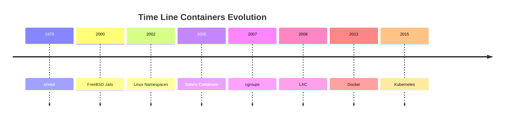
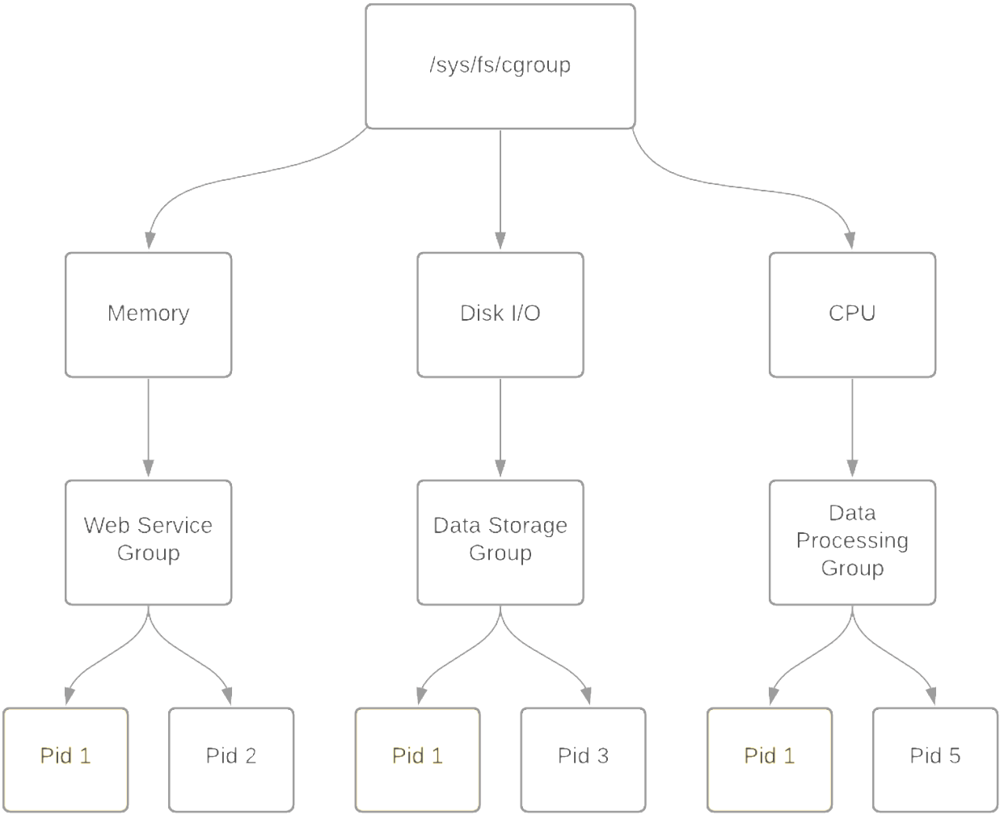
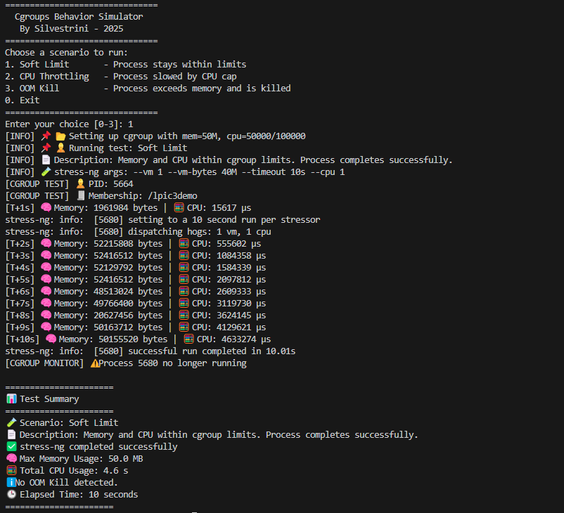

<h1><a name="readme-top"></a></h1>

[](https://github.com/marcossilvestrini/learning-lpic-3-305-300/actions/workflows/release.yml)[](https://github.com/marcossilvestrini/learning-lpic-3-305-300/actions/workflows/translate.yml)[](https://github.com/marcossilvestrini/learning-lpic-3-305-300/actions/workflows/generate-html.yml)[](https://github.com/marcossilvestrini/learning-lpic-3-305-300/actions/workflows/deploy-webpage.yml)[](https://github.com/marcossilvestrini/learning-lpic-3-305-300/actions/workflows/generate-docs.yml)[](https://github.com/marcossilvestrini/learning-lpic-3-305-300/actions/workflows/powershell.yml)[](https://github.com/marcossilvestrini/learning-lpic-3-305-300/actions/workflows/slack.yml)

* * *

[![MIT License][license-shield]][license-url][![Forks][forks-shield]][forks-url][![Stargazers][stars-shield]][stars-url][![Contributors][contributors-shield]][contributors-url][![Issues][issues-shield]][issues-url][![LinkedIn][linkedin-shield]][linkedin-url]

* * *

# Apprendre le LPIC-3 305-300


<p align="center">
<strong>Explore the docs »</strong></a>
    <br />
    <a href="https://marcossilvestrini.github.io/learning-lpic-3-305-300/">Web Site</a>
    -
    <a href="https://github.com/marcossilvestrini/learning-lpic-3-305-300">Code Page</a>
    -
    <a href="https://skynet-8.gitbook.io/learning-lpic-3-305-300">Gitbook</a>
    -
    <a href="https://github.com/marcossilvestrini/learning-lpic-3-305-300/issues">Report Bug</a>
    -
    <a href="https://github.com/marcossilvestrini/learning-lpic-3-305-300/issues">Request Feature</a>
</p>

* * *

## Résumé

<details>
  <summary><b>TABLE OF CONTENT</b></summary>
  <ol>
    <li>
      <a href="#about-the-project">About The Project</a>
    </li>
    <li>
      <a href="#getting-started">Getting Started</a>
      <ul>
        <li><a href="#prerequisites">Prerequisites</a></li>
        <li><a href="#installation">installation</a></li>
      </ul>
    </li>
    <li><a href="#usage">Usage</a></li>
    <li><a href="#roadmap">Roadmap</a></li>
    <li><a href="#freedoms">Four Essential Freedoms</a></li>
    <li>
      <a href="#topic-351">Topic 351: Full Virtualization</a>
      <ul>
        <li><a href="#topic-351.1">351.1 Virtualization Concepts and Theory </a></li>
        <li><a href="#topic-351.2">351.2 Xen</a></li>
        <li><a href="#topic-351.3">351.3 QEMU</a></li>
        <li><a href="#topic-351.4">351.4 Libvirt Virtual Machine</a></li>
        <li><a href="#topic-351.5">351.5 Virtual Machine Disk Image Management</a></li>
      </ul>
    </li>
    <li>
      <a href="#topic-352">Topic 352: Container Virtualization</a>
      <ul>
        <li><a href="#topic-352.1">352.1 Container Virtualization Concepts</a></li>
        <li><a href="#topic-352.2">352.2 LXC</a></li>
        <li><a href="#topic-352.3">352.3 Docker</a></li>
        <li><a href="#topic-352.4">352.4 Container Orchestration Platforms</a></li>
      </ul>
    </li>
    <li>
      <a href="#topic-353">Topic 353: VM Deployment and Provisioning</a>
      <ul>
        <li><a href="#topic-353.1">353.1 Cloud Management Tools</a></li>
        <li><a href="#topic-353.2">353.2 Packer</a></li>
        <li><a href="#topic-353.3">353.3 cloud-init</a></li>
        <li><a href="#topic-353.4">353.4 Vagrant</a></li>
      </ul>
    </li>
    <li><a href="#license">License</a></li>
    <li><a href="#contact">Contact</a></li>
    <li><a href="#acknowledgments">Acknowledgments</a></li>
  </ol>
</details><br>

* * *

<a name="about-the-project"></a>

## À propos du projet

> Ce projet vise à aider les étudiants ou les professionnels à apprendre les principaux concepts de Gnulinux
> et logiciel gratuit \\
> Certaines distributions Gnunux comme Debian et RPM seront couvertes \\
> L'installation et la configuration de certains packages seront également couvertes \\
> En faisant cela, vous pouvez donner à toute la communauté une chance de bénéficier de vos modifications. \\
> L'accès au code source est une condition préalable à cela. \\
> Utilisez Vagrant pour les machines UP et exécutez des laboratoires et pratiquez le contenu de cet article. \\
> J'ai publié dans Folder Vagrant A Vagrantfile avec ce qui est nécessaire \\
> Pour que vous puissiez télécharger un environnement pour les études

* * *

<p align="right">(<a href="#readme-top">back to top</a>)</p>

<a name="getting-started"></a>

## Commencer

Pour commencer l'apprentissage, consultez la documentation ci-dessus.

<a name="prerequisites"></a>

### Condition préalable

-   [Git](https://git-scm.com/book/en/v2/Getting-Started-Installing-Git)
-   [Passe de travail VMware](https://blogs.vmware.com/workstation/2024/05/vmware-workstation-pro-now-available-free-for-personal-use.html)
-   [Utilitaire VMware vaginal](https://developer.hashicorp.com/vagrant/install/vmware)
-   [Vagabond](https://developer.hashicorp.com/vagrant/install)

<a name="installation"></a>

### Installation

Cloner le repo

```sh
git clone https://github.com/marcossilvestrini/learning-lpic-3-305-300.git
cd learning-lpic-3-305-300
```

Personnaliser un modèle_Vagrantfile-topic-xxx_. Ce fichier contient une configuration VMS pour les laboratoires. Exemple:

-   Déposer[Vagrantfile-topic-351](vagrant/Vagrantfile-topic-351)
    -   vm.clone_directory = "&lt;your_driver_letter>:\\<folder>\\&lt;To_machine>\\# {Vm_name} -instance-1 "
        Exemple: vm.clone_directory = "E:\\Serveurs\\Vmware\\# {Vm_name} -instance-1 "
    -   vm.vmx["memsize"]= ""
    -   vm.vmx["Numvcpus"]= ""
    -   vm.vmx["CPUID.CorRrespersoCout"]= ""

Personnaliser la configuration du réseau dans les fichiers[configs / réseau](configs/network/).

* * *

<a name="usage"></a>

## Usage

Utilisez ce référentiel pour obtenir un apprentissage sur l'examen LPIC-3 305-300

### Pour de haut en bas

Changer un_Vagrantfile-topic-xxx_modèle et copier pour un nouveau fichier avec nom_Vagabond_

```sh
cd vagrant && vagrant up
cd vagrant && vagrant destroy -f
```

### Pour redémarrer les machines virtuelles

```sh
cd vagrant && vagrant reload
```

**Important:**_Si vous redémarrez les machines virtuelles sans vagabond, le dossier partagé ne monte pas après le démarrage._

### Utiliser PowerShell pour le haut et le bas

Si vous utilisez la plate-forme Windows, je crée un script PowerShell pour les machines virtuelles de haut en bas.

```powershell
vagrant/up.ps1
vagrant/destroy.ps1
```

### Schéma d'infrastructure Sujet 351


<p align="right">(<a href="#readme-top">back to top</a>)</p>

* * *

<a name="roadmap"></a>

## Feuille de route

-   [x] Créer un référentiel
-   [x] Créer des scripts pour l'approvisionnement des laboratoires
-   [x] Créer des exemples sur le sujet 351
-   [ ] Créer des exemples sur le sujet 352
-   [ ] Créer des exemples sur le sujet 353
-   [ ] Télécharger simulé iTexam

* * *

<a name="freedoms"></a>

## Quatre libertés essentielles

> 0\. La liberté d'exécuter le programme comme vous le souhaitez, à quelque fin que ce soit (liberté 0). \\
> 1.La liberté d'étudier le fonctionnement du programme et de le changer pour qu'il ait \\
> votre informatique comme vous le souhaitez (Freedom 1). \\
> L'accès au code source est une condition préalable à cela. \\
> 2\. La liberté de redistribuer des copies afin que vous puissiez aider les autres (Freedom 2). \\
> 3\. Freedom pour distribuer des copies de vos versions modifiées à d'autres (Freedom 3).

* * *

## Inspecter les commandes

```sh
type COMMAND
apropos COMMAND
whatis COMMAND --long
whereis COMMAND
COMMAND --help, --h
man COMMAND
```

<p align="right">(<a href="#readme-top">back to top</a>)</p>

* * *

<a name="topic-351"></a>

## Sujet 351: Virtualisation complète


* * *

<a name="topic-351.1"></a>

### 351.1 Concepts de virtualisation et théorie

**Poids:**6

**Description:**Les candidats doivent connaître et comprendre les concepts généraux, la théorie et la terminologie de la virtualisation. Cela comprend la terminologie Xen, Qemu et Libvirt.

**Zones de connaissances clés:**

-   🖥️ comprendre la terminologie de la virtualisation
-   ⚖️ comprendre les avantages et les inconvénients de la virtualisation
-   🛠️ Comprenez les différentes variations des hyperviseurs et des moniteurs de machines virtuelles
-   🔄 Comprendre les principaux aspects de la migration des machines physiques vers virtuelles
-   🚀 Comprendre les principaux aspects de la migration des machines virtuelles entre les systèmes hôtes
-   📸 Comprendre les caractéristiques et les implications de la virtualisation pour une machine virtuelle, comme les instantanés, la pause, le clonage et les limites de ressources
-   🌐 Conscience d'Ovirt, Proxmox, Systemd-Machine et VirtualBox
-   🔗 Sensibilisation du vSwitch ouvert

#### 351.1 objets cités

```sh
Hypervisor
Hardware Virtual Machine (HVM)
Paravirtualization (PV)
Emulation and Simulation
CPU flags
/proc/cpuinfo
Migration (P2V, V2V)
```

#### Hyperviseurs

##### Hyperviseur de type 1 (hyperviseur à métal nu)

###### Définition de type 1

S'exécute directement sur le matériel physique de l'hôte, fournissant une couche de base pour gérer les machines virtuelles sans avoir besoin d'un système d'exploitation hôte.

###### Caractéristiques de type 1

-   ⚡ Haute performance et efficacité.
-   ⏱️ latence et les frais généraux inférieurs.
-   🏢 Souvent utilisé dans les environnements d'entreprise et les centres de données.

###### Exemples de type 1

-   VMware ESXi: un hyperviseur robuste et largement utilisé dans les paramètres d'entreprise.
-   Microsoft Hyper-V: intégré à Windows Server, offrant des performances et des fonctionnalités de gestion solides.
-   Xen: un hyperviseur open source utilisé par de nombreux fournisseurs de services cloud.
-   KVM (machine virtuelle basée sur le noyau): intégré dans le noyau Linux, offrant des performances élevées pour les systèmes basés sur Linux.

##### Hyperviseur de type 2 (hyperviseur hébergé)

###### Définition de type 2

Exécute sur un système d'exploitation conventionnel, en s'appuyant sur le système d'exploitation hôte pour la gestion des ressources et la prise en charge des appareils.

###### Caractéristiques de type 2

-   🛠️ Plus facile à configurer et à utiliser, en particulier sur les ordinateurs personnels.
-   🔧 Plus flexible pour le développement, les tests et les déploiements à plus petite échelle.
-   🐢 Typiquement moins efficace que les hyperviseurs de type 1 en raison des frais généraux supplémentaires du système d'exploitation hôte.

###### Exemples de type 2

-   VMware Workstation: un puissant hyperviseur pour exécuter plusieurs systèmes d'exploitation sur un seul bureau.
-   Oracle VirtualBox: un hyperviseur open source connu pour sa flexibilité et sa facilité d'utilisation.
-   Parallels Desktop: Conçu pour que les utilisateurs de Mac puissent exécuter Windows et d'autres systèmes d'exploitation aux côtés de macOS.
-   Qemu (émulateur rapide): un émulateur et virtualiseur open source, souvent utilisés en conjonction avec KVM.

##### Différences clés entre les hyperviseurs de type 1 et de type 2

-   Environnement de déploiement:
    -   Les hyperviseurs de type 1 sont couramment déployés dans les centres de données et les environnements d'entreprise en raison de leur interaction directe avec le matériel et des performances élevées.
    -   Les hyperviseurs de type 2 conviennent plus à un usage personnel, au développement, aux tests et aux tâches de virtualisation à petite échelle.
-   Performance:
    -   Les hyperviseurs de type 1 offrent généralement de meilleures performances et une latence plus faible car elles ne comptent pas sur un système d'exploitation hôte.
    -   Les hyperviseurs de type 2 peuvent subir une certaine dégradation des performances en raison des frais généraux de fonctionnement au-dessus d'un système d'exploitation hôte.
-   Gestion et facilité d'utilisation:
    -   Les hyperviseurs de type 1 nécessitent une configuration et une gestion plus complexes, mais fournissent des fonctionnalités avancées et une évolutivité pour les déploiements à grande échelle.
    -   Les hyperviseurs de type 2 sont plus faciles à installer et à utiliser, ce qui les rend idéaux pour les utilisateurs individuels et les petits projets.

##### Types de migration

Dans le contexte des hyperviseurs, qui sont des technologies utilisées pour créer et gérer les machines virtuelles, les termes migration P2V et migration V2V sont courants dans les environnements de virtualisation.  
Ils se réfèrent aux processus de migration des systèmes entre différents types de plates-formes.

##### P2V - Migration physique à virtuelle

La migration P2V fait référence au processus de migration d'un serveur physique vers une machine virtuelle.  
En d'autres termes, un système d'exploitation et ses applications, fonctionnant sur du matériel physique dédié, sont "convertis" et déplacés vers une machine virtuelle qui s'exécute sur un hyperviseur (comme VMware, Hyper-V, KVM, etc.).

-   Exemple: vous avez un serveur physique exécutant un système Windows ou Linux, et vous souhaitez le déplacer vers un environnement virtuel, comme une infrastructure cloud ou un serveur de virtualisation interne.  
    Le processus consiste à copier l'ensemble de l'état du système, y compris le système d'exploitation, les pilotes et les données, pour créer une machine virtuelle équivalente qui peut s'exécuter comme si elle se trouvait sur le matériel physique.

##### V2V - Migration virtuelle à virtuelle

La migration V2V fait référence au processus de migration d'une machine virtuelle d'un hyperviseur à un autre.  
Dans ce cas, vous avez déjà une machine virtuelle exécutée dans un environnement virtualisé (comme VMware), et vous souhaitez le déplacer vers un autre environnement virtualisé (par exemple, à Hyper-V ou vers un nouveau serveur VMware).

-   Exemple: vous avez une machine virtuelle en cours d'exécution sur un serveur de virtualisation VMware, mais vous décidez de le migrer vers une plate-forme Hyper-V. Dans ce cas, la migration V2V convertit la machine virtuelle d'un format ou d'un hyperviseur à un autre, garantissant qu'il peut continuer à fonctionner correctement.

#### HVM et paravirtualisation

##### Virtualisation assistée par matériel (HVM)

###### HVM Definition

HVM exploite les extensions matérielles fournies par les processeurs modernes pour virtualiser le matériel, permettant la création et la gestion des machines virtuelles avec des frais généraux minimaux.

###### Caractéristiques clés HVM

-   🖥️**Support matériel**: Nécessite une prise en charge du processeur pour les extensions de virtualisation telles que Intel VT-X ou AMD-V.
-   🛠️**Virtualisation complète:**Les VM peuvent exécuter des systèmes d'exploitation invités non modifiés, car l'hyperviseur fournit une émulation complète de l'environnement matériel.
-   ⚡**Performance:**Offre généralement des performances presque natives en raison de l'exécution directe du code invité sur le CPU.
-   🔒**Isolement:**Fournit une forte isolement entre les machines virtuelles car chaque machine virtuelle fonctionne comme si elle avait son propre matériel dédié.

###### HVM Examples

VMware Esxi, Microsoft Hyper-V, KVM (machine virtuelle basée sur le noyau).

###### HVM Advantages

-   ✅**Compatibilité:**Peut exécuter n'importe quel système d'exploitation sans modification.
-   ⚡**Performance:**Haute performances en raison de la prise en charge matérielle.
-   🔒**Sécurité:**Des fonctionnalités d'isolement et de sécurité améliorées fournies par le matériel.

###### HVM Disadvantages

-   🛠️**Dépendance matérielle:**Nécessite des fonctionnalités matérielles spécifiques, limitant la compatibilité avec les systèmes plus anciens.
-   🔧**Complexité:**Peut impliquer une configuration et une gestion plus complexes.

##### Paravirtualisation

###### Définition de paravirtualisation

La paravirtualisation consiste à modifier le système d'exploitation invité pour être conscient de l'environnement virtuel, ce qui lui permet d'interagir plus efficacement avec l'hyperviseur.

###### Paravirtualisation des caractéristiques clés

-   🛠️**Modification des invités:**Nécessite des modifications apportées au système d'exploitation des invités pour communiquer directement avec l'hyperviseur à l'aide d'hypercaux.
-   ⚡**Performance:**Peut être plus efficace que la virtualisation complète traditionnelle car elle réduit les frais généraux associés à l'émulation de matériel.
-   🔗**Compatibilité:**Limité aux systèmes d'exploitation qui ont été modifiés pour la paravirtualisation.

###### Exemples de paravirtualisation

Xen avec des invités paravirtualisés, des outils VMware dans certaines configurations et certaines configurations KVM.

###### Avantages de paravirtualisation

-   ⚡**Efficacité:**Réduit les frais généraux du matériel de virtualisation, offrant potentiellement de meilleures performances pour certaines charges de travail.
-   ✅**Utilisation des ressources:**Utilisation plus efficace des ressources système en raison de la communication directe entre le système d'exploitation invité et l'hyperviseur.

###### Inconvénients de paravirtualisation

-   🛠️**Modification du système d'exploitation invité:**Nécessite des modifications au système d'exploitation invité, limitant la compatibilité aux systèmes d'exploitation pris en charge.
-   🔧**Complexité:**Nécessite une complexité supplémentaire dans le système d'exploitation invité pour les implémentations hypercall.

##### Différences clés

###### Exigences du système d'exploitation invité

-   **HVM:**Peut exécuter des systèmes d'exploitation invités non modifiés.
-   **Paravirtualisation:**Exige que les systèmes d'exploitation invités soient modifiés pour travailler avec l'hyperviseur.

###### Performance

-   **HVM:**Offre généralement des performances presque natives en raison de l'exécution assistée par le matériel.
-   **Paravirtualisation:**Peut offrir des performances efficaces en réduisant les frais généraux de l'émulation matérielle, mais repose sur un système d'exploitation invité modifié.

###### Dépendance matérielle

-   **HVM:**Nécessite des fonctionnalités CPU spécifiques (Intel VT-X, AMD-V).
-   **Paravirtualisation:**Ne nécessite pas de fonctionnalités CPU spécifiques mais nécessite un système d'exploitation invité modifié.

###### Isolement

-   **HVM:**Fournit une forte isolement à l'aide de fonctionnalités matérielles.
-   **Paravirtualisation:**S'appuie sur l'isolement logiciel, qui peut ne pas être aussi robuste que l'isolement matériel.

###### Complexité

-   **HVM:**Généralement plus simple à déployer car il prend en charge le système d'exploitation non modifié.
-   **Paravirtualisation:**Nécessite une configuration et des modifications supplémentaires pour le système d'exploitation invité, augmentant la complexité.

#### NUMA (accès à la mémoire non uniforme)

NUMA (Accès à la mémoire non uniforme) est une architecture de mémoire utilisée dans les systèmes multiprocesseurs pour optimiser l'accès à la mémoire par les processeurs.  
Dans un système NUMA, la mémoire est distribuée de manière inégale entre les processeurs, ce qui signifie que chaque processeur a un accès plus rapide à une partie de la mémoire (sa "mémoire locale") qu'à la mémoire qui est physiquement plus loin (appelée "mémoire distante") et associée à d'autres processeurs.

##### Caractéristiques clés de l'architecture NUMA

1.  **Mémoire locale et distante**: Chaque processeur a sa propre mémoire locale, à laquelle elle peut accéder plus rapidement. Cependant, il peut également accéder à la mémoire d'autres processeurs, bien que cela prenne plus de temps.
2.  **Latence différenciée**: La latence de l'accès à la mémoire varie selon que le processeur accéde à sa mémoire locale ou à la mémoire d'un autre nœud. L'accès à la mémoire locale est plus rapide, tandis que l'accès à la mémoire d'un autre nœud (télécommande) est plus lent.
3.  **Évolutivité**: L'architecture NUMA est conçue pour améliorer l'évolutivité des systèmes avec de nombreux processeurs. À mesure que davantage de processeurs sont ajoutés, la mémoire est également distribuée, en évitant le goulot d'étranglement qui se produirait dans une architecture d'accès à la mémoire uniforme (UMA).

##### Avantages de Numa

-   ⚡ Meilleures performances dans les grands systèmes: Étant donné que chaque processeur a une mémoire locale, il peut fonctionner plus efficacement sans concurrencer autant avec d'autres processeurs pour l'accès à la mémoire.
-   📈 Évolutivité: NUMA permet des systèmes avec de nombreux processeurs et de grandes quantités de mémoire pour évoluer plus efficacement par rapport à une architecture UMA.

##### Désavantage

-   🛠️ Complexité de programmation: les programmeurs doivent être conscients quelles régions de mémoire sont locales ou éloignées, optimisant l'utilisation de la mémoire locale pour obtenir de meilleures performances.
-   🐢 Pénances de performances potentielles: Si un processeur accède fréquemment à la mémoire distante, les performances peuvent souffrir en raison d'une latence plus élevée.
    Cette architecture est courante dans les systèmes multiprocesseurs haute performance, tels que les serveurs et les superordinateurs, où l'évolutivité et l'optimisation de la mémoire sont essentielles.

#### Opensource Solutions

-   🌐 Ovirt:<https://www.ovirt.org/>

-   🌐 Proxmox:<https://www.proxmox.com/en/proxmox-virtual-environment/overview>

-   🌐 Oracle VirtualBox:<https://www.virtualbox.org/>

-   🌐 Open VSwitch:<https://www.openvswitch.org/>

#### Types de virtualisation

##### Virtualisation matérielle (virtualisation du serveur)

###### Définition HV

Résumé matériel physique pour créer des machines virtuelles (VM) qui exécutent des systèmes d'exploitation et des applications distincts.

###### Cas d'utilisation HV

Centres de données, cloud computing, consolidation de serveurs.

###### Exemples HV

VMware Esxi, Microsoft Hyper-V, KVM.

##### Virtualisation du système d'exploitation (conteneurisation)

###### Définition de conteneurisation

Permet à plusieurs instances d'espace utilisateur isolées (conteneurs) d'exécuter sur un seul noyau de système d'exploitation.

###### Cas d'utilisation de la conteneurisation

Environnements d'architecture, de développement et de test des microservices.

###### Exemples de conteneurisation

Docker, Kubernetes, LXC.

##### Virtualisation du réseau

###### Définition de virtualisation du réseau

Combine les ressources matérielles et réseau logicielles dans une seule entité administrative basée sur un logiciel.

###### Cas d'utilisation de la virtualisation du réseau

Réseaux définis par logiciel (SDN), virtualisation des fonctions du réseau (NFV).

###### Exemples de virtualisation du réseau

VMware NSX, Cisco ACI, OpenStack Neutron.

##### Virtualisation de stockage

###### Définition de virtualisation de stockage

Poolets Stockage physique de plusieurs appareils dans une seule unité de stockage virtuel qui peut être géré de manière centralisée.

###### Définition de virtualisation de stockage Cas d'utilisation

Gestion des données, optimisation du stockage, reprise après sinistre.

###### Exemples de définition de virtualisation de stockage

Contrôleur de volume IBM SAN, VMware VSAN, NetApp ONTAP.

##### Virtualisation de bureau

###### Définition de virtualisation de bureau

Permet à un système d'exploitation de bureau d'exécuter une machine virtuelle hébergée sur un serveur.

###### Cas d'utilisation de définition de virtualisation de bureau

Infrastructure de bureau virtuelle (VDI), solutions de travail à distance.

###### Exemples de définition de virtualisation de bureau

Citrix Virtual Apps and Desktops, VMware Horizon, Microsoft Remote Desktop Services.

##### Virtualisation de l'application

###### Définition de virtualisation de l'application

Sépare les applications du matériel et du système d'exploitation sous-jacents, leur permettant d'exécuter dans des environnements isolés.

###### Application Virtualization Définition des cas d'utilisation

Déploiement simplifié des applications, tests de compatibilité.

###### Exemples de définition de virtualisation de l'application

VMware Thinapp, Microsoft App-V, Citrix XenApp.

##### Virtualisation des données

###### Définition de virtualisation des données

Intègre les données de diverses sources sans la consolider physiquement, fournissant une vue unifiée pour l'analyse et les rapports.

###### Data Virtualization Définition des cas d'utilisation

Business Intelligence, intégration de données en temps réel.

###### Exemples de définition de virtualisation des données

DÉNODO, Red Hat JBoss Data Virtualization, IBM Infosphere.

##### Avantages de la virtualisation

-   ⚡ Efficacité des ressources: meilleure utilisation des ressources physiques.
-   💰 Économies de coûts: réduction des coûts matériels et opérationnels.
-   📈 Évolutivité: facile à évoluer ou à la baisse selon la demande.
-   🔧 Flexibilité: prend en charge une variété de charges de travail et d'applications.
-   🔄 Récupération en cas de catastrophe: processus de sauvegarde et de récupération simplifiés.
-   🔒 Isolement: une sécurité améliorée par l'isolement des environnements.

#### Émulation

L'émulation implique la simulation du comportement du matériel ou des logiciels sur une plate-forme différente de celle initialement prévue.

Ce processus permet aux logiciels conçus pour un système d'exécuter sur un autre système qui peut avoir une architecture ou un environnement de fonctionnement différent.

Bien que l'émulation offre une polyvalence en permettant l'exécution de systèmes ou d'applications d'exploitation invités non modifiés, il est souvent livré avec des frais généraux de performances.

Cette surcharge survient parce que le système émulé doit interpréter et traduire les instructions destinées au système d'origine en instructions compatibles avec le système hôte. En conséquence, l'émulation peut être plus lente que l'exécution native, ce qui le rend moins efficace pour les tâches à forte intensité de ressources.

Malgré cet inconvénient, l'émulation reste précieuse pour exécuter des logiciels hérités, tester des applications sur différentes plates-formes et faciliter le développement de la plate-forme multiplate.

#### systemd-machant

Le service SystemD-Maching est dédié à la gestion des machines virtuelles et des conteneurs au sein de l'écosystème SystemD.
 Il fournit des fonctionnalités essentielles pour contrôler, surveiller et maintenir des instances virtuelles, offrant une intégration et une efficacité robustes dans les environnements Linux.

<p align="right">(<a href="#topic-351.1">back to sub Topic 351.1</a>)</p>
<p align="right">(<a href="#topic-351">back to Topic 351</a>)</p>
<p align="right">(<a href="#readme-top">back to top</a>)</p>

* * *

<a name="topic-351.2"></a>

### 351.2 alternant


**Poids:**3

**Description:**Les candidats doivent pouvoir installer, configurer, maintenir, migrer et dépanner les installations Xen. L'accent est mis sur Xen version 4.x.

**Zones de connaissances clés:**

-   Comprendre l'architecture de Xen, y compris le réseautage et le stockage
-   Configuration de base des nœuds et domaines Xen
-   Gestion de base des nœuds et domaines Xen
-   Dépannage de base des installations Xen
-   Avarines hors de la pilule
-   Sensibilisation de Xenstore
-   Conscience des paramètres de démarrage Xen
-   Conscience de l'utilitaire XM

#### Alterner


Xen est un hyperviseur open source de type 1 (bare-metal), qui permet à plusieurs systèmes d'exploitation d'exécuter simultanément le même matériel physique.  
Xen fournit une couche entre le matériel physique et les machines virtuelles (VM), permettant un partage et un isolement efficaces des ressources.

-   **Architecture:**Xen fonctionne avec un système à deux niveaux où le domaine 0 (DOM0) est le domaine privilégié avec un accès matériel direct et gère l'hyperviseur. D'autres machines virtuelles, appelées Domain U (DOMU), exécutent des systèmes d'exploitation invités et sont gérées par DOM0.
-   **Types de virtualisation:**Xen prend en charge à la fois la paravirtualisation (PV), qui nécessite un système d'exploitation invité modifié, et la virtualisation assistée par le matériel (HVM), qui utilise des extensions matérielles (par exemple, Intel VT-X ou AMD-V) pour exécuter des systèmes d'exploitation invités non modifiés.
    Xen est largement utilisé dans les environnements cloud, notamment par Amazon Web Services (AWS) et d'autres fournisseurs de cloud à grande échelle.

#### Xensource

Xensource était la société fondée par les développeurs originaux de l'hyperviseur Xen à l'Université de Cambridge pour commercialiser Xen.  
La société a fourni des solutions d'entreprise basées sur Xen et a offert des outils et un support supplémentaires pour améliorer les capacités de Xen à usage d'entreprise.

-   **Acquisition par Citrix**: En 2007, Xensource a été acquis par Citrix Systems, Inc. Citrix a utilisé la technologie Xen comme base de son produit Citrix Xenserver, qui est devenu une plate-forme de virtualisation populaire de qualité d'entreprise basée sur Xen.
-   **Transition**: Après l'acquisition, le projet Xen s'est poursuivi en tant que projet open source, tandis que Citrix s'est concentré sur des offres commerciales comme Xenserver, en tirant parti de la technologie XenSource.

#### Projet Xen

Le projet Xen fait référence à la communauté open source et à l'initiative responsable du développement et du maintien de l'hyperviseur Xen après sa commercialisation.  
Le projet Xen fonctionne sous la Fondation Linux, en mettant l'accent sur la construction, l'amélioration et le soutien de Xen comme un effort collaboratif et axé sur la communauté.

-   **Objectifs:**Le projet Xen vise à faire progresser l'hyperviseur en améliorant ses performances, sa sécurité et son ensemble de fonctionnalités pour une large gamme de cas d'utilisation, notamment le cloud computing, la virtualisation axée sur la sécurité (par exemple, Qubes OS) et les systèmes intégrés.
-   **Contributeurs:**Le projet comprend des contributeurs de diverses organisations, notamment les principaux fournisseurs de cloud, les fournisseurs de matériel et les développeurs indépendants.
-   **Pilule et hédools:**Le projet Xen comprend également des outils tels que XAPI (Xenapi), qui est utilisé pour gérer les installations d'hyperviseur Xen, et divers autres utilitaires pour la gestion et l'optimisation du système.

#### Xenstore

Xen Store est un élément essentiel de l'hyperviseur Xen.  
Essentiellement, Xen Store est une base de données de valeur clé distribuée utilisée pour la communication et le partage d'informations entre l'hyperviseur Xen et les machines virtuelles (également appelées domaines).

Voici quelques aspects clés de Xen Store:

-   **Communication inter-domaine:**Xen Store permet la communication entre les domaines, tels que DOM0 (le domaine privilégié qui contrôle les ressources matérielles) et Domus (domaines utilisateur, qui sont les VM). Cela se fait via des entrées de valeur clé, où chaque domaine peut lire ou écrire des informations.

-   **Gestion de la configuration:**Il est utilisé pour stocker et accéder aux informations de configuration, telles que les périphériques virtuels, les réseaux et les paramètres de démarrage. Cela facilite la gestion et la configuration dynamiques des machines virtuelles.

-   **Événements et notifications:**Xen Store prend également en charge les notifications d'événements. Lorsqu'une clé ou valeur particulière dans le magasin Xen est modifiée, les domaines intéressés peuvent être informés pour réagir à ces modifications. Ceci est utile pour surveiller et gérer les ressources.

-   API simple: Xen Store fournit une API simple pour la lecture et l'écriture de données, ce qui permet aux développeurs d'intégrer facilement leurs applications avec le système de virtualisation Xen.

#### Pilule

XAPI, ou Xenapi, est l'interface de programmation d'application (API) utilisée pour gérer l'hyperviseur Xen et ses machines virtuelles (VM).  
XAPI est un composant clé de XenServer (maintenant connu sous le nom d'hyperviseur Citrix) et fournit un moyen standardisé d'interagir avec l'hyperviseur Xen pour effectuer des opérations telles que la création, la configuration, la surveillance et le contrôle des machines virtuelles.

Voici quelques aspects importants de XAPI:

-   **Gestion de la machine virtuelle:**XAPI permet aux administrateurs de créer, de supprimer, de démarrer et d'arrêter les machines virtuelles.

-   **Automation:**Avec XAPI, il est possible d'automatiser la gestion des ressources virtuelles, y compris la mise en réseau, le stockage et l'informatique, ce qui est crucial pour les grands environnements cloud.

-   **Intégration:**XAPI peut être intégré à d'autres outils et scripts pour fournir une administration plus efficace et personnalisée de l'environnement XEN.

-   **Contrôle d'accès:**XAPI fournit également des mécanismes de contrôle d'accès pour s'assurer que seuls les utilisateurs autorisés peuvent effectuer des opérations spécifiques dans l'environnement virtuel.

XAPI est l'interface qui permet le contrôle et l'automatisation de l'hyperviseur Xen, ce qui facilite la gestion des environnements virtualisés.

#### Résumé Xen

-   **Intercalpring:**La technologie de base de l'hyperviseur permettant aux machines virtuelles de fonctionner sur du matériel physique.
-   **Xensource:**La société qui a commercialisé Xen, acquise plus tard par Citrix, conduisant au développement de Citrix Xenserver.
-   **Projet Xen:**L'initiative et la communauté open source qui continue de développer et de maintenir l'hyperviseur Xen sous la Fondation Linux.
-   **Xenstore:**Xen Store agit comme un intermédiaire de communication et de configuration entre l'hyperviseur Xen et les machines virtuelles, rationalisant le fonctionnement et la gestion des environnements virtualisés.
-   **Pilule**est l'interface qui permet le contrôle et l'automatisation de l'hyperviseur Xen, ce qui facilite la gestion des environnements virtualisés.

#### Domain0 (Dom0)

Domain0, ou Dom0, est le domaine de contrôle dans une architecture XEN. Il gère d'autres domaines (DOMUS) et a un accès direct au matériel.  
DOM0 exécute les pilotes de périphériques, permettant à Domus, qui manque d'accès matériel direct, à communiquer avec les appareils. En règle générale, il s'agit d'une instance complète d'un système d'exploitation, comme Linux, et est essentiel pour le fonctionnement de l'hyperviseur Xen.

#### Domaine (maison)

Domus sont des domaines non privilégiés qui exécutent des machines virtuelles.  
Ils sont gérés par DOM0 et n'ont pas accès direct au matériel. DOMUS peut être configuré pour exécuter différents systèmes d'exploitation et est utilisé à diverses fins, tels que les serveurs d'applications et les environnements de développement. Ils comptent sur DOM0 pour l'interaction matérielle.

#### PV-DomU (Paravirtualized DomainU)

PV-DOMUS utilise une technique appelée paravirtualisation. Dans ce modèle, le système d'exploitation DOMU est modifié pour savoir qu'il s'exécute dans un environnement virtualisé, lui permettant de communiquer directement avec l'hyperviseur pour des performances optimisées.  
Il en résulte des frais généraux plus faibles et une meilleure efficacité par rapport à la virtualisation complète.

#### HVM-DomU (Hardware Virtual Machine DomainU)

HVM-DOMUS sont des machines virtuelles qui utilisent une virtualisation complète, permettant aux systèmes d'exploitation non modifiés de s'exécuter. L'hyperviseur Xen fournit une émulation matérielle pour ces domus, leur permettant d'exécuter tout système d'exploitation qui prend en charge l'architecture matérielle sous-jacente.  
Bien que cela offre une plus grande flexibilité, cela peut entraîner des frais généraux plus élevés par rapport à PV-DOMUS.

#### Réseau Xen

Appareils réseau paravirtualisés

Pontage

#### 351.2 objets cités

```sh
Domain0 (Dom0), DomainU (DomU)
PV-DomU, HVM-DomU
/etc/xen/
xl
xl.cfg 
xl.conf # Xen global configurations
xentop
oxenstored # Xenstore configurations
```

#### 351.2 Notes

```sh

# Xen Settings
/etc/xen/
/etc/xen/xl.conf - Main general configuration file for Xen
/etc/xen/oxenstored.conf - Xenstore configurations

# VM Configurations
/etc/xen/xlexample.pvlinux
/etc/xen/xlexample.hvm

# Service Configurations
/etc/default/xen
/etc/default/xendomains

# xen-tools configurations
/etc/xen-tools/
/usr/share/xen-tools/

# docs
xl(1)
xl.conf(5)
xlcpupool.cfg(5)
xl-disk-configuration(5)
xl-network-configuration(5)
xen-tscmode(7)

# initialized domains auto
/etc/default/xendomains
   XENDOMAINS_AUTO=/etc/xen/auto

/etc/xen/auto/


# set domain for up after xen reboot
## create folder auto
cd /etc/xen && mkdir -p auto && cd auto

# create simbolic link
ln -s /etc/xen/lpic3-pv-guest /etc/xen/auto/lpic3-pv-guest
```

#### 351.2 Commandes importantes

##### xen-création-image

```sh
# create a pv image
xen-create-image \
  --hostname=lpic3-pv-guest \
  --memory=1gb \
  --vcpus=2 \
  --lvm=vg_xen \
  --bridge=xenbr0 \
  --dhcp \
  --pygrub \
  --password=vagrant \
  --dist=bookworm
```

##### Xen-list-iMages

```sh
# list image
xen-list-image
```

##### Xen-Delete-Image

```sh
# delete a pv image
xen-delete-image lpic3-pv-guest --lvm=vg_xen
```

##### Xenstore-LS

```sh
# list xenstore infos
xenstore-ls
```

##### xl

```sh
# view xen information
xl infos

# list Domains
xl list
xl list lpic3-hvm-guest
xl list lpic3-hvm-guest -l

# uptime Domains
xl uptime

# pause Domain
xl pause 2
xl pause lpic3-hvm-guest

# save state Domains
xl -v save lpic3-hvm-guest ~root/image-lpic3-hvm-guest.save

# restore Domain
xl restore /root/image-lpic3-hvm-guest.save

# get Domain name
xl domname 2

# view dmesg information
xl dmesg

# monitoring domain
xl top
xentop
xen top

# Limit mem Dom0
xl mem-set 0 2048

# Limite cpu (not permanent after boot)
xl vcpu-set 0 2

# create DomainU - virtual machine
xl create /etc/xen/lpic3-pv-guest.cfg

# create DomainU virtual machine and connect to guest
xl create -c /etc/xen/lpic3-pv-guest.cfg

##----------------------------------------------
# create DomainU virtual machine HVM

## create logical volume
lvcreate -l +20%FREE -n lpic3-hvm-guest-disk  vg_xen

## create a ssh tunel for vnc
ssh -l vagrant -L 5900:localhost:5900  192.168.0.130

## configure /etc/xen/lpic3-hvm-guest.cfg
## set boot for cdrom: boot = "d"

## create domain hvm
xl create /etc/xen/lpic3-hvm-guest.cfg

## open vcn conection in your vnc client with localhost
## for view install details

## after installation finished, destroy domain: xl destroy <id_or_name>

## set /etc/xen/lpic3-hvm-guest.cfg: boot for hard disc: boot = "c"

## create domain hvm
xl create /etc/xen/lpic3-hvm-guest.cfg

## access domain hvm
xl console <id_or_name>
##----------------------------------------------

# connect in domain guest
xl console <id>|<name> (press enter)
xl console 1
xl console lpic3-pv-guest

#How do I exit domU "xl console" session
#Press ctrl+] or if you're using Putty press ctrl+5.

# Poweroff domain
xl shutdown lpic3-pv-guest

# destroy domain
xl destroy lpic3-pv-guest

# reboot domain
xl reboot lpic3-pv-guest

# list block devices
xl block-list 1
xl block-list lpic3-pv-guest

# detach block devices
xl block-detach lpic3-hvm-guest hdc
xl block-detach 2 xvdc

# attach block devices

## hard disk devices
xl block-attach lpic3-hvm-guest-ubuntu 'phy:/dev/vg_xen/lpic3-hvm-guest-disk2,xvde,w'

## cdrom
xl block-attach lpic3-hvm-guest 'file:/home/vagrant/isos/ubuntu/seed.iso,xvdc:cdrom,r'
xl block-attach 2 'file:/home/vagrant/isos/ubuntu/seed.iso,xvdc:cdrom,r'

# insert and eject cdrom devices
xl cd-insert lpic3-hvm-guest-ubuntu xvdb  /home/vagrant/isos/ubuntu/ubuntu-24.04.1-live-server-amd64.iso
xl cd-eject lpic3-hvm-guest-ubuntu xvdb
```

#### 251.2 Notes

##### vif

Dans Xen, «VIF» signifie l'interface virtuelle et est utilisée pour configurer le réseau pour les machines virtuelles (domaines).

En spécifiant les directives «VIF» dans les fichiers de configuration du domaine, les administrateurs peuvent définir les interfaces réseau, attribuer des adresses IP, configurer des VLAN et configurer d'autres paramètres de réseautage pour les machines virtuelles fonctionnant sur des hôtes Xen. Par exemple: vif =[«Bridge = xenbr0»], dans ce cas, il connecte l'interface réseau de la machine virtuelle au pont Xen nommé «Xenbr0».

````sh

<p align="right">(<a href="#topic-351.2">back to sub Topic 351.2</a>)</p>
<p align="right">(<a href="#topic-351">back to Topic 351</a>)</p>
<p align="right">(<a href="#readme-top">back to top</a>)</p>

---

<a name="topic-351.3"></a>

### 351.3 QEMU


**Weight:** 4

**Description:** Candidates should be able to install, configure, maintain, migrate and troubleshoot QEMU installations.

**Key Knowledge Areas:**

* Understand the architecture of QEMU, including KVM, networking and storage
* Start QEMU instances from the command line
* Manage snapshots using the QEMU monitor
* Install the QEMU Guest Agent and VirtIO device drivers
* Troubleshoot QEMU installations, including networking and storage
* Awareness of important QEMU configuration parameters

#### 351.3 Cited Objects

```sh
Kernel modules: kvm, kvm-intel and kvm-amd
/dev/kvm
QEMU monitor
qemu
qemu-system-x86_64
ip
brctl
tunctl
````

#### 351.3 Commandes importantes

##### 351.3 autres commandes

##### Vérifiez le module KVM

```sh
# check if kvm is enabled
egrep -o '(vmx|svm)' /proc/cpuinfo
lscpu |grep Virtualization
lsmod|grep kvm
ls -l /dev/kvm
hostnamectl
systemd-detect-virt
```

```sh
# check if kvm is enabled
egrep -o '(vmx|svm)' /proc/cpuinfo
lscpu |grep Virtualization
lsmod|grep kvm
ls -l /dev/kvm

# check kernel infos
uname -a

# check root device
findmnt /

# mount a qcow2 image
## Example 1:
mkdir -p /mnt/qemu
guestmount -a os-images/Debian_12.0.0_VMM/Debian_12.0.0.qcow2 -i /mnt/qemu/

## Example 2:
sudo guestfish --rw -a os-images/Debian_12.0.0_VMM/Debian_12.0.0.qcow2
run
list-filesystems

# run commands in qcow2 images
## Example 1:
virt-customize -a  os-images/Debian_12.0.0_VMM/Debian_12.0.0.qcow2  --run-command 'echo hello >/root/hello.txt'
## Example 2:
sudo virt-customize -a os-images/Debian_12.0.0_VMM/Debian_12.0.0.qcow2 \
  --run-command 'echo -e "auto ens3\niface ens3 inet dhcp" > /etc/network/interfaces.d/ens3.cfg'

# generate mac 
printf 'DE:AD:BE:EF:%02X:%02X\n' $((RANDOM%256)) $((RANDOM%256))
```

##### IP

```sh
# list links
ip link show

# create bridge
ip link add br0 type bridge
```

##### BRCTL

```sh
# list links
ip link show

# create bridge
ip link add br0 type bridge
```

##### Qemu-IMG

```sh
# create image
qemu-img create -f qcow2 vm-disk-debian-12.qcow2 20G

# convert vmdk to qcow2 image
qemu-img convert \
  -f vmdk \
  -O qcow2 os-images/Debian_12.0.0_VMM/Debian_12.0.0_VMM_LinuxVMImages.COM.vmdk os-images/Debian_12.0.0_VMM/Debian_12.0.0.qcow2 \
  -p \
  -m16

# check image
qemu-img info os-images/Debian_12.0.0_VMM/Debian_12.0.0.qcow2
```

##### Qemu-system-x86_64

```sh
# create vm with ISO
qemu-system-x86_64 \
  -name lpic3-debian-12 \
  -enable-kvm -hda vm-disk-debian-12.qcow2 \
  -cdrom /home/vagrant/isos/debian/debian-12.8.0-amd64-DVD-1.iso  \
  -boot d \
  -m 2048 \
  -smp cpus=2 \
  -k pt-br

# create vm with ISO using vnc in no gui servers \ ssh connections

## create ssh tunel in host
 ssh -l vagrant -L 5902:localhost:5902  192.168.0.131

## create vm 
qemu-system-x86_64 \
  -name lpic3-debian-12 \
  -enable-kvm \
  -m 2048 \
  -smp cpus=2 \
  -k pt-br \
  -vnc :2 \
  -device qemu-xhci \
  -device usb-tablet \
  -device ide-cd,bus=ide.1,drive=cdrom,bootindex=1 \
  -drive id=cdrom,media=cdrom,if=none,file=/home/vagrant/isos/debian/debian-12.8.0-amd64-DVD-1.iso \
  -hda vm-disk-debian-12.qcow2 \
  -boot order=d \
  -vga std \
  -display none \
  -monitor stdio

# create vm with OS Image - qcow2

## create vm
qemu-system-x86_64 \
  -name lpic3-debian-12 \
  -enable-kvm \
  -m 2048 \
  -smp cpus=2 \
  -k pt-br \
  -vnc :2 \
  -hda os-images/Debian_12.0.0_VMM/Debian_12.0.0.qcow2

## create vm with custom kernel params
qemu-system-x86_64 \
  -name lpic3-debian-12 \
  -kernel /vmlinuz \
  -initrd /initrd.img \
  -append "root=/dev/mapper/debian--vg-root ro fastboot console=ttyS0" \
  -enable-kvm \
  -m 2048 \
  -smp cpus=2 \
  -k pt-br \
  -vnc :2 \
  -hda os-images/Debian_12.0.0_VMM/Debian_12.0.0.qcow2

## create vm with and attach disk
qemu-system-x86_64 \
  -name lpic3-debian-12 \
  -enable-kvm \
  -m 2048 \
  -smp cpus=2 \
  -vnc :2 \
  -hda os-images/Debian_12.0.0_VMM/Debian_12.0.0.qcow2 \
  -hdb vmdisk-debian12.qcow2 \
  -drive file=vmdisk-extra-debian12.qcow2,index=2,media=disk,if=ide \
  -netdev bridge,id=net0,br=qemubr0 \
  -device virtio-net-pci,netdev=net0
  
## create vm network netdev user
qemu-system-x86_64 \
  -name lpic3-debian-12 \
  -enable-kvm \
  -m 2048 \
  -smp cpus=2 \
  -vnc :2 \
  -hda os-images/Debian_12.0.0_VMM/Debian_12.0.0.qcow2 \
  -netdev user,id=mynet0,net=192.168.0.150/24,dhcpstart=192.168.0.155,hostfwd=tcp::2222-:22 \
  -device virtio-net-pci,netdev=mynet0

## create vm network netdev tap (Private Network)
ip link add br0 type bridge ; ifconfig br0 up
qemu-system-x86_64 \
  -name lpic3-debian-12 \
  -enable-kvm \
  -m 2048 \
  -smp cpus=2 \
  -vnc :2 \
  -hda os-images/Debian_12.0.0_VMM/Debian_12.0.0.qcow2 \
  -netdev tap,id=br0 \
  -device e1000,netdev=br0,mac=DE:AD:BE:EF:1A:24

## create vm with public bridge
#create a public bridge : https://www.linux-kvm.org/page/Networking

qemu-system-x86_64 \
  -name lpic3-debian-12 \
  -enable-kvm \
  -m 2048 \
  -smp cpus=2 \
  -hda os-images/Debian_12.0.0_VMM/Debian_12.0.0.qcow2 \
  -k pt-br \
  -vnc :2 \
  -device qemu-xhci \
  -device usb-tablet \
  -vga std \
  -display none \
  -netdev bridge,id=net0,br=qemubr0 \
  -device virtio-net-pci,netdev=net0

## get a ipv4 ip - open ssh in vm and:
dhcpclient ens4
```

#### Moniteur Qemu

Pour initier le moniteur Qemu dans l'utilisation de la ligne de commande**-Monitor Stdio**param**Qemu-system-x86_64**

```sh
qemu-system-x86_64 -monitor stdio
```

Exit Qemu-monitor:

```sh
ctrl+alt+2
```

```sh
# Managment
info status # vm info
info cpus # cpu information
info network # network informations
stop # pause vm
cont # start vm in status pause
system_powerdown # poweroff vm
system_reset # restart monitor


# Blocks
info block # block info
boot_set d # force boot iso
change ide1-cd0  /home/vagrant/isos/debian/debian-12.8.0-amd64-DVD-1.iso  # attach cdrom
eject ide1-cd0 # detach cdrom

# Snapshots
info snapshots # list snapshots
savevm snapshot-01  # create snapshot
loadvm snapshot-01 # restore snapshot
delvm snapshot-01
```

#### Agent invité

Pour activer, utiliser:

```sh
qemu-system-x86_x64
 -chardev socket,path=/tmp/qga.sock,server=on,wait=off,id=qga0 \
 -device virtio-serial \
 -device virtserialport,chardev=qga0,name=org.qemu.guest_agent.0
```

<p align="right">(<a href="#topic-351.3">back to sub Topic 351.3</a>)</p>
<p align="right">(<a href="#topic-351">back to Topic 351</a>)</p>
<p align="right">(<a href="#readme-top">back to top</a>)</p>

* * *

<a name="topic-351.4"></a>

### 351.4 Gestion de la machine virtuelle LibVirt


**Poids:**9

**Description:**Les candidats devraient être en mesure de gérer les hôtes de virtualisation et les machines virtuelles («Domains LibVirt») à l'aide de libvirt et d'outils connexes.

**Zones de connaissances clés:**

-   Comprendre l'architecture de libvirt
-   Gérer les connexions et les nœuds libvirt
-   Créer et gérer les domaines Qemu et Xen, y compris les instantanés
-   Gérer et analyser la consommation de ressources de domaines
-   Créer et gérer les pools de stockage et les volumes
-   Créer et gérer les réseaux virtuels
-   Migrer les domaines entre les nœuds
-   Comprendre comment Libvirt interagit avec Xen et Qemu
-   Comprendre comment LibVirt interagit avec les services de réseau tels que DNSMASQ et RADVD
-   Comprendre les fichiers de configuration XML LibVirt
-   Conscience de Virtlogd et Virtlockd

#### 351.4 objets cités

```sh
libvirtd
/etc/libvirt/
/var/lib/libvirt
/var/log/libvirt
virsh (including relevant subcommands) 
```

#### 351.4 Commandes importantes

##### Vif

```sh
# using env variable for set virsh uri (local or remotly)
export LIBVIRT_DEFAULT_URI=qemu:///system
export LIBVIRT_DEFAULT_URI=xen+ssh://vagrant@192.168.0.130
export LIBVIRT_DEFAULT_URI='xen+ssh://vagrant@192.168.0.130?keyfile=/home/vagrant/.ssh/skynet-key-ecdsa'

# COMMONS

# get helps
virsh help
virsh help pool-create

# view version
virsh version

# view system info
sudo virsh sysinfo

# view node info
virsh nodeinfo

# hostname
virsh hostname

# check vcn allocated port
virsh vncdisplay <domain_id>
virsh vncdisplay <domain_name>
virsh vncdisplay rocky9-server01 

# HYPERVISIONER

# view libvirt hypervisioner connection
virsh uri

# list valid hypervisioners
virt-host-validate
virt-host-validate qemu

# test connetion uri(vm test)
virsh -c test:///default list

# connect remotly
virsh -c xen+ssh://vagrant@192.168.0.130
virsh -c xen+ssh://vagrant@192.168.0.130 list
virsh -c qemu+ssh://vagrant@192.168.0.130/system list

# connect remotly without enter password
virsh -c 'xen+ssh://vagrant@192.168.0.130?keyfile=/home/vagrant/.ssh/skynet-key-ecdsa'

# STORAGE

# list storage pools
virsh pool-list --details

# list all storage pool
virsh pool-list --all --details

# get a pool configuration
virsh pool-dumpxml default

# get pool info
virsh pool-info default

# create a storage pool
virsh pool-define-as --name default --type dir --target /var/lib/libvirt/images

# create a storage pool with dumpxml
virsh pool-create --overwrite --file configs/kvm/libvirt/pool.xml

# start storage pool
virsh pool-start default

# set storage pool for autostart
virsh pool-autostart default

# stop storage pool
virsh pool-destroy linux

# delete xml storage pool file
virsh pool-undefine linux

# edit storage pool
virsh pool-edit linux

# list volumes
virsh vol-list linux

# get volume infos
virsh vol-info Debian_12.0.0.qcow2 os-images
virsh vol-info --pool os-images Debian_12.0.0.qcow2 

# get volume xml
virsh vol-dumpxml rocky9-disk1 default

# create volume
virsh vol-create-as default --format qcow2 disk1 10G

# delete volume
virsh vol-delete  disk1 default

# DOMAINS \ INSTANCES \ VIRTUAL MACHINES

# list domain\instance\vm
virsh list
virsh list --all

# create domain\instance\vm
virsh create configs/kvm/libvirt/rocky9-server03.xml

# view domain\instance\vm info
virsh dominfo rocky9-server01

# view domain\instance\vm xml
virsh dumpxml rocky9-server01

# edit domain\instance\vm xml
virsh edit rocky9-server01

# stop domain\instance\vm
virsh shutdown rocky9-server01 # gracefully
virsh destroy 1
virsh destroy rocky9-server01

# suspend domain\instance\vm
virsh suspend rocky9-server01

# resume domain\instance\vm
virsh resume rocky9-server01

# start domain\instance\vm
virsh start rocky9-server01

# remove domain\instance\vm
virsh undefine rocky9-server01

# remove domain\instance\vm and storage volumes
virsh undefine rocky9-server01 --remove-all-storage

# save domain\instance\vm
virsh save rocky9-server01 rocky9-server01.qcow2

# restore domain\instance\vm
virsh restore rocky9-server01.qcow2

# list snapshots
virsh snapshot-list rocky9-server01

# create snapshot
virsh snapshot-create rocky9-server01

# restore snapshot
virsh snapshot-revert rocky9-server01 1748983520

# view snapshot xml
virsh snapshot-info rocky9-server01 1748983520

# dumpxml snapshot
virsh snapshot-dumpxml rocky9-server01 1748983520

# xml snapshot path
/var/lib/libvirt/qemu/snapshot/rocky9-server01/

# view snapshot info
virsh snapshot-info rocky9-server01 1748983671

# edit snapshot
virsh snapshot-edit rocky9-server01 1748983520

# delete snapshot
virsh snapshot-delete rocky9-server01 1748983520

# DEVICES

# list block devices
virsh domblklist rocky9-server01 --details

# add cdrom media 
virsh change-media rocky9-server01 sda /home/vagrant/isos/rocky/Rocky-9.5-x86_64-minimal.iso
virsh attach-disk rocky9-server01 /home/vagrant/isos/rocky/Rocky-9.5-x86_64-minimal.iso sda --type cdrom --mode readonly

# remove cdrom media
virsh change-media rocky9-server01 sda --eject

# add new disk
virsh attach-disk rocky9-server01  /var/lib/libvirt/images/rocky9-disk2  vdb --persistent

# remove disk
virsh detach-disk rocky9-server01 vdb --persistent

# RESOURCES (CPU and Memory)

# get cpu infos
virsh vcpuinfo rocky9-server01 --pretty
virsh dominfo rocky9-server01 | grep 'CPU'

# get vcpu count
virsh vcpucount rocky9-server01

# set vcpus maximum config
virsh setvcpus rocky9-server01 --count 4 --maximum --config
virsh shutdown rocky9-server01
virsh start rocky9-server01

# set vcpu current config
virsh setvcpus rocky9-server01 --count 4 --config

# set vcpu current live
virsh setvcpus rocky9-server01 --count 3 --current
virsh setvcpus rocky9-server01 --count 3 --live

# configure vcpu afinity config
virsh vcpupin rocky9-server01 0 7 --config
virsh vcpupin rocky9-server01 1 5-6 --config

# configure vcpu afinity current
virsh vcpupin rocky9-server01 0 7
virsh vcpupin rocky9-server01 1 5-6

# set maximum memory config
virsh setmaxmem rocky9-server01 3000000 --config
virsh shutdown rocky9-server01
virsh start rocky9-server01

# set current memory config
virsh setmem rocky9-server01 2500000 --current

# NETWORK

# get netwwork bridges
brctl show

# get iptables rules for libvirt
sudo iptables -L -n -t  nat

# list network
virsh net-list --all

# set default network
virsh net-define /etc/libvirt/qemu/networks/default.xml

# get network infos
virsh net-info default

# get xml network
virsh net-dumpxml default

# xml file
cat /etc/libvirt/qemu/networks/default.xml

# dhcp config
sudo cat /etc/libvirt/qemu/networks/default.xml | grep -A 10 dhcp
sudo cat /var/lib/libvirt/dnsmasq/default.conf

# get domain ipp address
virsh net-dhcp-leases default
virsh net-dhcp-leases default --mac 52\:54\:00\:89\:19\:86

# edit network
virsh net-edit default

# get domain network detais
virsh domiflist debian-server01

# path for network filter files
/etc/libvirt/nwfilter/

# list network filters
virsh nwfilter-list

# create network filter - block icmp traffic
virsh nwfilter-define block-icmp.xml
# virsh edit Debian-Server
    #  <interface type='network'>
    #        ...
    #        <filterref filter='block-icmp'/>
    #        ...
    # </interface>
# virsh destroy debian-server01
# virsh start debian-server01

# delete network filter
virsh nwfilter-undefine block-icmp

# get xml network filter
virsh nwfilter-dumpxml block-icmp
```

###### verrouillage

```sh
# list os variants
virt-install --os-variant list
osinfo-query os

# create domain\instance\vm with iso file
virsh vol-create-as default --format qcow2 rocky9-disk1 20G
virt-install --name rocky9-server01 \
--vcpus 2 \
--cpu host \
--memory 2048 \
--disk vol=default/rocky9-disk1 \
--cdrom /home/vagrant/isos/rocky/Rocky-9.5-x86_64-minimal.iso \
--os-variant=rocky9 \
--graphics vnc,listen=0.0.0.0,port=5905

# create debian domain\instance\vm with qcow2 file
virt-install --name debian-server01 \
--vcpus 2 \
--ram 2048 \
--disk vol=os-images/Debian_12.0.0.qcow2 \
--import \
--osinfo detect=on \
--graphics vnc,listen=0.0.0.0,port=5906 \
--network network=default \
--noautoconsole

# create rocky9 domain\instance\vm with qcow2 file
virt-install --name rocky9-server02 \
--vcpus 2 \
--ram 2048 \
--disk path=os-images/RockyLinux_9.4_VMG/RockyLinux_9.4.qcow2,format=qcow2,bus=virtio \
--import \
--osinfo detect=on \
--graphics vnc,listen=0.0.0.0,port=5907 \
--network bridge=qemubr0,model=virtio \
--noautoconsole

# open domain\instance\vm gui console
virt-viewer debian-server01

# check metadata domain\instance\vm file (if uri is qemu:////system)
less /etc/libvirt/qemu/debian-server01.xml
```

<p align="right">(<a href="#topic-351.4">back to sub Topic 351.4</a>)</p>
<p align="right">(<a href="#topic-351">back to Topic 351</a>)</p>
<p align="right">(<a href="#readme-top">back to top</a>)</p>

* * *

<a name="topic-351.5"></a>

### 351.5 Gestion de l'image du disque de machine virtuelle


**Poids:**3

**Description:**Les candidats devraient être en mesure de gérer des images de disque de machines virtuelles. Cela comprend la conversion d'images de disque entre différents formats et hyperviseurs et accéder aux données stockées dans une image.

**Zones de connaissances clés:**

-   Comprendre les fonctionnalités de divers formats d'image disque virtuels, tels que les images brutes, QCOW2 et VMDK
-   Gérer les images de disque de machine virtuelle à l'aide de Qemu-IMG
-   Les partitions de montage et les fichiers d'accès contenus dans les images de disque de machine virtuelle à l'aide de libguestfish
-   Copier le contenu du disque physique sur une image de disque de machine virtuelle
-   Migrer le contenu du disque entre divers formats d'image de disque de machine virtuelle
-   Conscience du format de virtualisation ouverte (OVF)

#### 351,5 objets cités

```sh
qemu-img
guestfish (including relevant subcommands)
guestmount
guestumount
virt-cat
virt-copy-in
virt-copy-out
virt-diff
virt-inspector
virt-filesystems
virt-rescue
virt-df
virt-sparsify
virt-p2v
virt-p2v-make-disk
virt-v2v
```

#### 351,5 Commandes importantes

##### 351.5.1 QemU-IMG

```sh
# Display detailed information about a disk image
qemu-img info UbuntuServer_24.04.qcow2

# Create a new 22G raw disk image (default format is raw)
qemu-img create new-disk 22G

# Create a new 22G disk image in qcow2 format
qemu-img create -f qcow2 new-disk2 22G

# Convert a VDI image to raw format using 5 threads and show progress
qemu-img convert -f vdi -O raw Ubuntu-Server.vdk new-Ubuntu.raw -m5 -p

# Convert vmdk to qcow2 image
qemu-img convert \
-f vmdk \
-O qcow2 os-images/UbuntuServer_24.04_VM/UbuntuServer_24.04_VM_LinuxVMImages.COM.vmdk \
os-images/UbuntuServer_24.04_VM/UbuntuServer_24.04.qcow2 \
-p \
-m16

# Resize a raw image to 30G
qemu-img resize -f raw new-disk 30G

# Resize a qcow2 image to 15G(actual size 30Gdisk 30G)
qemu-img resize -f raw --shrink new-disk 15G

# Snapshots

# List all snapshots in the image
qemu-img snapshot -l new-disk2.qcow2

# Create a snapshot named SNAP1
qemu-img snapshot -c SNAP1 disk

# Apply a snapshot by ID or name
qemu-img snapshot -a 123456789 disk

# Delete the snapshot named SNAP1
qemu-img snapshot -d SNAP1 disk
```

##### poisson-client

```sh
# set enviroment variables for guestfish
export LIBGUESTFS_BACKEND_SETTINGS=force_tcg

# Launch guestfish with a disk image
guestfish -a UbuntuServer_24.04.qcow2
#run
#list-partitions

# Run the commands in a script file
guestfish -a UbuntuServer_24.04.qcow2 -m /dev/sda -i < script.ssh

# Interactively run commands
guestfish --rw -a UbuntuServer_24.04.qcow2 <<'EOF'
run
list-filesystems
EOF

# Copy a file from the guest image to the host
export LIBGUESTFS_BACKEND_SETTINGS=force_tcg
sudo guestfish --rw -a UbuntuServer_24.04.qcow2 -i <<'EOF'
copy-out /etc/hostname /tmp/
EOF

# Copy a file from the host into the guest image
echo "new-hostname" > /tmp/hostname
export LIBGUESTFS_BACKEND_SETTINGS=force_tcg
sudo guestfish --rw -a UbuntuServer_24.04.qcow2 -i <<'EOF'
copy-in /tmp/hostname /etc/
EOF

# View contents of a file in the guest image
guestfish --ro -a UbuntuServer_24.04.qcow2 -i <<'EOF'
cat /etc/hostname
EOF

# List files in the guest image
export LIBGUESTFS_BACKEND_SETTINGS=force_tcg
guestfish --rw -a UbuntuServer_24.04.qcow2 -i <<'EOF'
ls /home/ubuntu
EOF

# Edit a file in the guest image
export LIBGUESTFS_BACKEND_SETTINGS=force_tcg
guestfish --rw -a UbuntuServer_24.04.qcow2 -i <<'EOF'
edit /etc/hosts
EOF
```

###### calendrier

```sh
# Mount a disk image to a directory
guestmount -a UbuntuServer_24.04.qcow2 -m /dev/ubuntu-vg/ubuntu-lv /mnt/ubuntu
# domain
guestmount -d rocky9-server02 -m /dev/ubuntu-vg/ubuntu-lv /mnt/ubuntu 

# Mount a specific partition from a disk image
guestmount -a UbuntuServer_24.04.qcow2 -m /dev/sda2 /mnt/ubuntu
# domain
guestmount -d debian-server01 --ro -m  /dev/debian-vg/root /mnt/debian
```

###### invité

```sh
# Umount a disk image to a directory
sudo guestunmount /mnt/ubuntu
```

##### vir-DF

```sh
# Show free and used space on virtual machine filesystems
virt-df UbuntuServer_24.04.qcow2 -h
virt-df -d rocky9-server02 -h
```

##### Virt-FileSystems

```sh
# List filesystems, partitions, and logical volumes in a VM disk image (disk image)
virt-filesystems -a UbuntuServer_24.04.qcow2 --all --long -h

# List filesystems, partitions, and logical volumes in a VM disk image (domain)
virt-filesystems -d debian-server01 --all --long -h
```

##### vrac-inspecteur

```sh
# Inspect and report on the operating system in a VM disk image
virt-inspector -a UbuntuServer_24.04.qcow2 #(disk)
virt-inspector -d debian-server01 #(domain) 
```

##### vir-cat

```sh
# Display the contents of a file inside a VM disk image
virt-cat -a UbuntuServer_24.04.qcow2 /etc/hosts
virt-cat -d debian-server01 /etc/hosts #(domain)
```

##### vrombier

```sh
# Show differences between two VM disk images
virt-diff -a UbuntuServer_24.04.qcow2 -A Rocky-Linux.qcow2
```

##### verrouiller

```sh
# Make a VM disk image smaller by removing unused space
virt-sparsify UbuntuServer_24.04.qcow2 UbuntuServer_24.04-sparse.qcow2
```

##### verti-resize

```sh
# Resize a VM disk image or its partitions
virt-filesystems -a UbuntuServer_24.04.qcow2 --all --long -h #(check size of partitions)
qemu-img create -f qcow2 UbuntuServer_24.04-expanded.qcow2 100G #(create new disk image with 100G)
virt-resize --expand /dev/ubuntu-vg/ubuntu-lv \
UbuntuServer_24.04.qcow2 UbuntuServer_24.04-expanded.qcow2

```

##### verdat-copy-in

```sh
# Copy files from the host into a VM disk image

virt-copy-in -a UbuntuServer_24.04.qcow2 ~vagrant/test-virt-copy-in.txt /home/ubuntu
```

##### verrure-copie

```sh
# Copy files from a VM disk image to the host
virt-copy-out -a UbuntuServer_24.04.qcow2 /home/ubuntu/.bashrc /tmp
```

##### verrouillage

```sh
# List files and directories inside a VM disk image
virt-ls -a UbuntuServer_24.04.qcow2 /home/ubuntu
```

##### verrure

```sh
# Launch a rescue shell on a VM disk image for recovery
virt-rescue -a UbuntuServer_24.04.qcow2
```

##### Verrouillage

```sh
# Prepare a VM disk image for cloning by removing system-specific data
virt-sysprep -a UbuntuServer_24.04.qcow2
```

##### Virt-V2V

```sh
# Convert a VM from a foreign hypervisor to run on KVM
virt-v2v -i disk input-disk.img -o local -os /var/tmp
```

##### Virt-P2v

```sh
# Convert a physical machine to use KVM
```

##### Virt-P2v-Make-Disk

```sh
# Create a bootable disk image for physical to virtual conversion
sudo virt-p2v-make-disk -o output.img
```

#### 351,5 notes

##### OVF: format de virtualisation ouvrir

OVF: un format ouvert qui définit une norme pour l'emballage et la distribution de machines virtuelles dans différents environnements.

Le package généré a l'extension .ova et contient les fichiers suivants:

-   .ovf: fichier XML avec des métadonnées définissant l'environnement de la machine virtuelle
-   Fichiers d'image: .vmdk, .vhd, .vhdx, .qcow2, .raw
-   Fichiers supplémentaires: métadonnées, instantanés, configuration, hachage

<p align="right">(<a href="#topic-351.5">back to sub Topic 351.5</a>)</p>
<p align="right">(<a href="#topic-351">back to Topic 351</a>)</p>
<p align="right">(<a href="#readme-top">back to top</a>)</p>

* * *

<a name="topic-352"></a>

## Sujet 352: Virtualisation des conteneurs

* * *

<a name="topic-352.1"></a>

### 352.1 Concepts de virtualisation des conteneurs



```mermaid
timeline
    title Time Line Containers Evolution
    1979 : chroot
    2000 : FreeBSD Jails
    2002 : Linux Namespaces
    2005 : Solaris Containers
    2007 : cgroups
    2008 : LXC
    2013 : Docker
    2015 : Kubernetes
```

* * *

**Poids:**7

**Description:**Les candidats doivent comprendre le concept de virtualisation des conteneurs. Cela comprend la compréhension des composants Linux utilisés pour implémenter la virtualisation des conteneurs ainsi que l'utilisation d'outils Linux standard pour dépanner ces composants.

**Zones de connaissances clés:**

-   Comprendre les concepts du système et du conteneur d'application
-   Comprendre et analyser les espaces de noms du noyau
-   Comprendre et analyser les groupes de contrôle
-   Comprendre et analyser les capacités
-   Comprendre le rôle de SecComp, Selinux et Apparmor pour la virtualisation des conteneurs
-   Comprenez comment LXC et Docker levier des espaces de noms, les CGROUP, les capacités, SecComp et Mac
-   Comprendre le principe de Runc
-   Comprendre le principe de Cri-O et de Containerd
-   Conscience des spécifications de l'exécution et de l'image OCI
-   Sensibilisation de l'interface d'exécution des conteneurs de Kubernetes (CRI)
-   Conscience de Podman, Buildah et Scopeo
-   Conscience des autres approches de virtualisation des conteneurs dans Linux et d'autres systèmes d'exploitation gratuits, tels que RKT, OpenVZ, Systemd-Nspawn ou BSD

* * *

#### 352.1 objets cités

```sh
nsenter
unshare
ip (including relevant subcommands)
capsh
/sys/fs/cgroups
/proc/[0-9]+/ns
/proc/[0-9]+/status
```

* * *

#### 🧠 Comprendre les conteneurs


Les conteneurs sont une technologie de virtualisation légère qui emballe les applications ainsi que leurs dépendances requises - code, bibliothèques, variables d'environnement et fichiers de configuration - en unités isolées, portables et reproductibles.

> En termes simples: un conteneur est une boîte autonome qui exécute votre application de la même manière, n'importe où.

##### 💡 Qu'est-ce qu'un conteneur?

Contrairement aux machines virtuelles (VM), les conteneurs ne virtualisent pas le matériel. Au lieu de cela, ils virtualisent le système d'exploitation. Les conteneurs partagent le même noyau Linux avec l'hôte, mais chacun fonctionne dans un espace utilisateur entièrement isolé.

📌 CONTENSEURS VS Machines virtuelles:

| Fonctionnalité            | Conteneurs                                 | Machines virtuelles                                          |
| ------------------------- | ------------------------------------------ | ------------------------------------------------------------ |
| Noyau d'os                | Partagé avec l'hôte                        | Chaque machine virtuelle a son propre système d'exploitation |
| Heure de démarrage        | Rapide (secondes ou moins)                 | Lent (minutes)                                               |
| Taille de l'image         | Léger (MBS)                                | Lourd (GBS)                                                  |
| Efficacité des ressources | Haut                                       | Inférieur                                                    |
| Mécanisme d'isolement     | Fonctionnalités du noyau (espaces de noms) | Hyperviseur                                                  |

##### 🔑 Caractéristiques clés des conteneurs

🔹**Léger**: Partagez le noyau du système d'exploitation hôte, en réduisant les frais généraux et en activant le démarrage rapide.

🔹**Portable**: Exécutez de manière cohérente dans différents environnements (Dev, Staging, Prod, Cloud, sur-Prem).

🔹**Isolé**: Utilisez des espaces de noms pour l'isolement de processus, de réseau et de système de fichiers.

🔹**Efficace**: Activer une densité plus élevée et une meilleure utilisation des ressources que les machines virtuelles traditionnelles.

🔹**Évolutif**: Ajustement parfait pour les microservices et l'architecture native du cloud.

##### 🧱 Types de conteneurs

1.  Conteneurs système
    -   Conçu pour exécuter l'intégralité du système d'exploitation, ressembler à des machines virtuelles.
    -   Prise en charge de plusieurs processus et services système (init, syslog).
    -   Idéal pour les applications héritées ou monolithiques.
    -   Exemple: LXC, libvirt-lxc.

2.  Conteneurs de demande
    -   Conçu pour exécuter un seul processus.
    -   Apatride, éphémère et évolutif horizontalement.
    -   Utilisé largement dans les environnements DevOps et Kubernetes modernes.
    -   Exemple: Docker, Containerd, Cri-O.

##### 🚀 Runtime des conteneurs populaires

| Temps d'exécution | Description                                                                    |
| ----------------- | ------------------------------------------------------------------------------ |
| **Docker**        | CLI / démon le plus largement adopté pour la construction et la course à pied. |
| **conteneur**     | Docker de runtime léger et Kubernetes.                                         |
| **Critiquer**     | Kubernetes Native Runtime pour les conteneurs OCI.                             |
| **LXC**           | Conteneurs de système Linux traditionnels, plus proche de la Fond OS.          |
| **Rkt**           | Exécution axée sur la sécurité (obsolète).                                     |

##### 🔐 Les internes et les éléments de sécurité des conteneurs

| Composant              | Rôle                                                                  |
| ---------------------- | --------------------------------------------------------------------- |
| **Espaces de noms**    | Isoler les processus, les utilisateurs, les montures, les réseaux.    |
| **troupes**            | Contrôler et limiter l'utilisation des ressources (CPU, mémoire, IO). |
| **Capacités**          | Contrôle des privilèges à grain fin à l'intérieur des conteneurs.     |
| **seccompente**        | Restreint les systèmes autorisés à réduire la surface d'attaque.      |
| **Apparmor / selinux** | Application obligatoire du contrôle d'accès au niveau du noyau.       |

* * *

#### 🧠 Comprendre le chroot - Modifier le répertoire racine dans Unix / Linux


##### Qu'est-ce que le chroot?

Chroot (abréviation de Change Root) est un appel et une commande système sur les systèmes d'exploitation de type UNIX qui modifient le répertoire racine apparent (/) pour le processus de fonctionnement actuel et ses enfants. Cela crée un environnement isolé, communément appelé une prison de chroot.

##### 🧱 But et cas d'utilisation

-   🔒 Isoler les demandes de sécurité (emprisonnement).
-   🧪 Créez des environnements de test sans avoir un impact sur le reste du système.
-   🛠️ Récupération du système (par exemple, démarrer dans Livecd et chroot dans le système installé).
-   📦 Construire des packages de logiciels dans un environnement contrôlé.

##### 📁 Structure minimale requise

L'environnement de chroot doit avoir ses propres fichiers et structure essentiels:

```sh
/mnt/myenv/
├── bin/
│   └── bash
├── etc/
├── lib/
├── lib64/
├── usr/
├── dev/
├── proc/
└── tmp/
```

Utilisez LDD pour identifier les bibliothèques requises:

```sh
ldd /bin/bash
```

##### 🚨 limitations et considérations de sécurité

-   Le chroot n'est pas une limite de sécurité comme les conteneurs ou les machines virtuelles.
-   Un utilisateur privilégié (racine) à l'intérieur de la prison peut potentiellement éclater.
-   Aucune isolation d'espaces de noms de processus, d'appareils ou de ressources au niveau du noyau.

Pour une isolement plus fort, considérez des alternatives comme:

-   Conteneurs Linux (LXC, Docker)
-   Machines virtuelles (KVM, QEMU)
-   Espaces de noms et groupes de noyau

##### 🧪 Test de chroot avec debootstrap

```sh
# download debain files
sudo debootstrap stable ~vagrant/debian http://deb.debian.org/debian
sudo chroot ~vagrant/debian bash
```

##### : 🧪 Chroot Lab

Utilisez ce script pour le laboratoire:[chroot.sh](scripts/container/chroot.sh)

Sortir:


* * *

#### 🧠 Comprendre les espaces de noms Linux


Les espaces de noms sont une fonctionnalité de noyau Linux de base qui permette l'isolement au niveau du processus. Ils créent des «vues» distinctes des ressources système mondiales - telles que les ID de processus, le réseau, les systèmes de fichiers et les utilisateurs - afin que chaque groupe de processus pense qu'il s'exécute dans son propre système.

> En termes simples: les espaces de noms trompent un processus en pensant qu'il possède la machine, même s'il ne fait que le partager.

C'est le fondement de l'isolement des conteneurs.

##### 🔍 Qu'est-ce que les espaces de noms isolent?

Chaque type d'espace de noms isole une ressource système spécifique. Ensemble, ils constituent le bac à sable dans lequel un conteneur opère:

| Espace de noms  | Isolats ...                              | Exemple du monde réel                                                           |
| --------------- | ---------------------------------------- | ------------------------------------------------------------------------------- |
| **Piquer**      | ID de processus                          | Les processus à l'intérieur d'un conteneur voient un autre espace PID           |
| **Monter**      | Points de montage du système de fichiers | Chaque conteneur voit son propre système de fichiers racine                     |
| **Réseau**      | Pile de réseau                           | Les conteneurs ont des IP, des interfaces et des itinéraires isolés             |
| **Uts**         | Nom d'hôte et nom de domaine             | Chaque conteneur définit son propre nom d'hôte                                  |
| **IPC**         | Mémoire partagée et sémaphores           | Empêche la communication interprète entre les conteneurs                        |
| **Utilisateur** | ID utilisateur et groupe                 | Active la fausse racine (UID 0) à l'intérieur du conteneur                      |
| **Cgroup (V2)** | Adhésion au groupe témoin                | Liés aux contrôles des ressources comme le processeur et les limites de mémoire |

##### 🧪 Analogie visuelle


Imaginez un immeuble de bureaux partagé:

-   Tous les locataires partagent la même fondation (noyau Linux).
-   Chaque entreprise a son propre bureau (espace de noms): différents serrures, meubles, lignes téléphoniques et nom de l'entreprise.
-   Pour chaque locataire, cela ressemble à leur propre bâtiment.

C'est exactement ainsi que les conteneurs éprouvent le système - isolé, mais efficace.

##### 🔧 Comment les conteneurs utilisent des espaces de noms

Lorsque vous exécutez un conteneur (par exemple, avec Docker ou Podman), le runtime crée un nouvel ensemble d'espaces de noms:

```bash
docker run -it --rm alpine sh
```

Cette commande donne le processus:

-   Un nouvel espace de noms PID → C'est le processus 1 à l'intérieur du conteneur.
-   Un nouvel espace de noms de réseau → son propre Ethernet virtuel.
-   Un espace de noms de montage → Un système de fichiers racine spécifique au conteneur.
-   Autres espaces de noms en fonction de la configuration (utilisateur, IPC, etc.)

Le résultat: un environnement d'exécution léger et isolé qui se comporte comme un système séparé.

##### ⚙️ Caractéristiques du noyau complémentaire

Les espaces de noms masquent les ressources des conteneurs. Mais pour contrôler combien ils peuvent utiliser et ce qu'ils peuvent faire, nous avons besoin de mécanismes supplémentaires:

###### 🔩 cgroups (groupes de contrôle)

Les CGRoupes permettent au noyau de limiter, de hiérarchiser et de surveiller l'utilisation des ressources entre les groupes de processus.

| Ressource    | Exemples de cas d'utilisation                |
| ------------ | -------------------------------------------- |
| Processeur   | Limiter le temps du processeur par conteneur |
| Mémoire      | Cap RAM usage                                |
| E / S disque | Opérations de lecture / écriture de gaz      |
| Réseau (V2)  | Restrictions de bande passante               |

🛡️ empêche le problème du "voisin bruyant" en empêchant un conteneur de consommer toutes les ressources système.

###### 🧱 Capacités

Linux traditionnel utilise un modèle de privilège binaire: Root (UID 0) peut tout faire, tout le monde est limité.

| Capacité               | Permet ...                                                       |
| ---------------------- | ---------------------------------------------------------------- |
| `CAP_NET_BIND_SERVICE` | Liaison aux ports privilégiés (par exemple 80, 443)              |
| `CAP_SYS_ADMIN`        | Un puissant fourre-tout pour les tâches d'administration système |
| `CAP_KILL`             | Envoi de signaux aux processus arbitraires                       |

En abandonnant les capacités inutiles, les conteneurs peuvent fonctionner avec seulement ce dont ils ont besoin - en réduisant les risques.

##### 🔐 Mécanismes de sécurité

Utilisé en conjonction avec des espaces de noms et des CGROUP pour verrouiller ce qu'un processus conteneurisé peut faire:

| Fonctionnalité  | Description                                                                    |
| --------------- | ------------------------------------------------------------------------------ |
| **seccompente** | Ligne blanche ou bloquer les appels du système Linux (système)                 |
| **Apparmor**    | Appliquer les profils de sécurité par application par application              |
| **Selinux**     | Appliquer le contrôle d'accès obligatoire avec des politiques système étroites |

##### 🧠 Résumé pour les débutants

> ✅ Les espaces de noms isolent ce qu'un conteneur peut voir  
> ✅ Cgroups contrôlent ce qu'il peut utiliser  
> ✅ Les capacités et les modules de sécurité définissent ce qu'il peut faire

Ensemble, ces caractéristiques du noyau forment l'épine dorsale technique de l'isolement des conteneurs - permettant un déploiement d'applications à haute densité, sécurisé et efficace sans machines virtuelles complètes.

##### 🧪 Espaces de noms de laboratoire

Utilisez ce script pour le laboratoire:[namespace.sh](scripts/container/namespace.sh)

Sortir:


* * *

#### 🧩 Comprendre les groupes (groupes de contrôle)



##### 📌 Définition

Les groupes de contrôle (CGROUP) sont une fonctionnalité du noyau Linux introduit en 2007 qui vous permettent de limiter, de rendre compte et d'isoler l'utilisation des ressources (CPU, mémoire, E / S de disque, etc.) de groupes de processus.

Les CGROUP sont fortement utilisés par les temps de récipient de bas niveau tels que RUNC et CRUN, et exploités par des moteurs à conteneurs comme Docker, Podman et LXC pour appliquer les limites des ressources et fournir l'isolement entre les conteneurs.

Les espaces de noms isolent, le contrôle des CGROUP.

Les espaces de noms créent des environnements distincts pour les processus (comme le PID, le réseau ou les montures), tandis que CGROUPS limite et surveillez l'utilisation des ressources (CPU, mémoire, E / S) pour ces processus.

⚙️ Capacités clés

| Fonctionnalité                | Description                                                                |
| ----------------------------- | -------------------------------------------------------------------------- |
| **Limitation des ressources** | Imposer des limites à la quantité de ressources qu'un groupe peut utiliser |
| **Priorisation**              | Allouer plus de priorité CPU / IO à certains groupes plutôt que d'autres   |
| **Comptabilité**              | Suivre l'utilisation des ressources par groupe                             |
| **Contrôle**                  | Suspendre, reprendre ou tuer les processus en vrac                         |
| **Isolement**                 | Empêcher la famine des ressources entre les groupes                        |

##### 📦 Sous-systèmes (contrôleurs)

CGroup fonctionne via des contrôleurs, chacun responsable de la gestion d'un type de ressource:

| Sous-système | Description                                        |
| ------------ | -------------------------------------------------- |
| `cpu`        | Contrôle la planification du processeur            |
| `cpuacct`    | Génère des rapports d'utilisation du processeur    |
| `memory`     | Limites et utilisation de la mémoire des comptes   |
| `blkio`      | Limite les E / S de l'appareil de bloc             |
| `devices`    | Contrôle l'accès aux appareils                     |
| `freezer`    | Suspend / reprend l'exécution des tâches           |
| `net_cls`    | Paquets de balises pour la mise en forme du trafic |
| `ns`         | Gère l'accès à l'espace de noms (rare)             |

##### 📂 Disposition du système de fichiers

Les CGROUP sont exposés via le système de fichiers virtuel sous / SYS / FS / CGROUP.

Selon la version:

-   **Cgroups v1**: Hiérarchies séparées pour chaque contrôleur (par exemple, mémoire, CPU, etc.)
-   **Cgroups v2**: hiérarchie unifiée sous un seul point de montage

Monté sous:

```sh
/sys/fs/cgroup/
```

Hiérarchie Cgroups V1 typique:

```sh
/sys/fs/cgroup/
├── memory/
│   ├── mygroup/
│   │   ├── tasks
│   │   ├── memory.limit_in_bytes
├── cpu/
│   └── mygroup/
└── ...
```

Dans CGroups v2, toutes les ressources sont gérées sous une hiérarchie unifiée:

```sh
/sys/fs/cgroup/
├── cgroup.procs
├── cgroup.controllers
├── memory.max
├── cpu.max
└── ...
```

##### 🧪 Utilisation commune (exemples V1 et V2)

V1 - Créer et affecter la limite de mémoire:

```sh
# Mount memory controller (if needed)
mount -t cgroup -o memory none /sys/fs/cgroup/memory

# Create group
mkdir /sys/fs/cgroup/memory/mygroup

# Set memory limit (100 MB)
echo 104857600 | tee /sys/fs/cgroup/memory/mygroup/memory.limit_in_bytes

# Assign a process (e.g., current shell)
echo $$ | tee /sys/fs/cgroup/memory/mygroup/tasks
```

V2 - Hiérarchie unifiée:

```sh
# Create subgroup
mkdir /sys/fs/cgroup/mygroup

# Enable controllers
echo +memory +cpu > /sys/fs/cgroup/cgroup.subtree_control

# Move shell into group
echo $$ > /sys/fs/cgroup/mygroup/cgroup.procs

# Set limits
echo 104857600 > /sys/fs/cgroup/mygroup/memory.max
echo "50000 100000" > /sys/fs/cgroup/mygroup/cpu.max  # 50ms quota per 100ms period
```

🧭 Inspection du processus et du groupe

| Commande                | Description                                    |
| ----------------------- | ---------------------------------------------- |
| `cat /proc/self/cgroup` | Affiche l'appartenance CGROUP actuelle         |
| `cat /proc/PID/cgroup`  | Cgroup d'un autre processus                    |
| `cat /proc/PID/status`  | Informations sur la mémoire et le groupe       |
| `ps -o pid,cmd,cgroup`  | Afficher la cartographie de processus à groupe |

##### 📦 Utilisation dans les conteneurs

Des moteurs à conteneurs comme Docker, Podman et Containerd Delegate Resource Control aux CGroups (via Runc ou Crun), en autorisant:

-   CPU par contact et limites de mémoire
-   Contrôle à grains fins sur Blkio et les appareils
-   Comptabilité des ressources en temps réel

Exemple de docker:

```sh
docker run --memory=256m --cpus=1 busybox
```

Dans les coulisses, cela crée des règles de CGROUP pour la mémoire et les limites du processeur pour le processus de conteneur.

##### 🧠 Résumé des concepts

| Concept         | Explication                                                                   |
| --------------- | ----------------------------------------------------------------------------- |
| **Contrôleurs** | Modules comme`cpu`,`memory`,`blkio`, etc. Appliquer des limites et des règles |
| **Tâches**      | Pids (processus) affectés au groupe témoin                                    |
| **Hiérarchie**  | Les Cgroups sont structurés dans un arbre parent-enfant                       |
| **Délégation**  | Systemd et les services utilisateur peuvent gérer les sous-arbres de CGROUPS  |

##### 🧪 LAB COMPROUPS

Utilisez ce script pour le laboratoire:[cgroups.sh](scripts/container/cgroups.sh)

Sortie de la mémoire limite douce:



* * *

#### 🛡️ Comprendre les capacités

❓ Quelles sont les capacités Linux?

Traditionnellement dans Linux, l'utilisateur racine a un accès illimité au système. Les capacités Linux ont été introduites pour décomposer ces privilèges tout-puissants en autorisations plus petites et discrètes, permettant aux processus d'effectuer des opérations privilégiées spécifiques sans nécessiter un accès racine complet.

Cela améliore la sécurité du système en appliquant le principe du moindre privilège.

| 🔐 Capacité            | 📋 Description                                                       |
| ---------------------- | -------------------------------------------------------------------- |
| `CAP_CHOWN`            | Modifier le propriétaire du fichier indépendamment des autorisations |
| `CAP_NET_BIND_SERVICE` | Se lier aux ports inférieurs à 1024 (par exemple, 80, 443)           |
| `CAP_SYS_TIME`         | Définir l'horloge du système                                         |
| `CAP_SYS_ADMIN`        | ⚠️ très puissant - comprend la monture, le BPF et plus               |
| `CAP_NET_RAW`          | Utilisez des prises brutes (par exemple, ping, traceroute)           |
| `CAP_SYS_PTRACE`       | Tracez d'autres processus (débogage)                                 |
| `CAP_KILL`             | Envoyer des signaux à n'importe quel processus                       |
| `CAP_DAC_OVERRIDE`     | Modifier les fichiers et les répertoires sans autorisation           |
| `CAP_SETUID`           | Modifier l'ID utilisateur (UID) du processus                         |
| `CAP_NET_ADMIN`        | Gérer les interfaces réseau, le routage, etc.                        |

🔐 Certains types de capacités Linux

| Type de capacité      | Description                                                                       |
| --------------------- | --------------------------------------------------------------------------------- |
| **Capinhos (hérité)** | Capacités héritées du processus parent.                                           |
| **CAPPRM (autorisé)** | Capacités que le processus est autorisée à avoir.                                 |
| **CAPEFF (efficace)** | Capacités que le processus utilise actuellement.                                  |
| **Capbnd (limite)**   | Restreint l'ensemble maximum de capacités efficaces qu'un processus peut obtenir. |
| **Capamb (ambiant)**  | Permet à un processus de définir explicitement ses propres capacités efficaces.   |

📦 Capacités dans les conteneurs et les gousses
Les conteneurs ne fonctionnent généralement pas en tant que racine complète, mais reçoivent plutôt un ensemble limité de capacités par défaut en fonction de l'exécution.

Des capacités peuvent être ajoutées ou supprimées dans Kubernetes à l'aide du SecurityContext.

📄 Kubernetes Exemple:

```yaml
securityContext:
  capabilities:
    drop: ["ALL"]
    add: ["NET_BIND_SERVICE"]
```

🔐 Cela garantit que le conteneur commence par zéro privilèges et ne reçoit que ce qui est nécessaire.

##### 🧪 Capacités de laboratoire

Utilisez ce script pour le laboratoire:[capabilities.sh](scripts/container/capabilities.sh)

Sortir:


* * *

#### 352.1 Commandes importantes

##### sans partage

```sh
# create a new namespaces and run a command in it
unshare --mount --uts --ipc --user --pid --net  --map-root-user --mount-proc --fork chroot ~vagrant/debian bash
# mount /proc for test
#mount -t proc proc /proc
#ps -aux
#ip addr show
#umount /proc
```

##### LSN

```sh
# show all namespaces
lsns

# show only pid namespace
lsns -s <pid>
lsns -p 3669

ls -l /proc/<pid>/ns
ls -l /proc/3669/ns

ps -o pid,pidns,netns,ipcns,utsns,userns,args -p <PID>
ps -o pid,pidns,netns,ipcns,utsns,userns,args -p 3669
```

##### nsenter

```sh
# execute a command in namespace
sudo nsenter -t <PID> -n  ip link show
sudo nsenter -t 3669 -n ip link show
```

##### 252.1 IP

```sh
# create a new network namespace
sudo ip netns add lxc1

# list network list
ip netns list

# exec command in network namespace
sudo ip netns exec lxc1 ip addr show
```

##### stat

```sh
# get cgroup version
stat -fc %T /sys/fs/cgroup
```

##### SystemCTL et SystemD

```sh
# get cgroups of system
systemctl status
systemd-cgls
```

##### cgcreate

```sh
cgcreate -g memory,cpu:lsf
```

##### cgClassify

```sh
cgclassify -g memory,cpu:lsf <PID>
```

##### setCap Cap_net_raw = ep / usr / bin / tcpdump

```sh

```

##### getCap / usr / bin / tcpdump

```sh

```

##### Capsh - Capacité enveloppe de coquille

* * *

<p align="right">(<a href="#topic-352.1">back to sub topic 352.1</a>)</p>
<p align="right">(<a href="#topic-352">back to topic 352</a>)</p>
<p align="right">(<a href="#readme-top">back to top</a>)</p>

* * *

<a name="topic-352.2"></a>

### 352.2 LXC

**Poids:**6

**Description:**Les candidats doivent pouvoir utiliser des conteneurs système à l'aide de LXC et LXD. La version de LXC couverte est de 3,0 ou plus.

**Zones de connaissances clés:**

-   Comprendre l'architecture de LXC et LXD
-   Gérer les conteneurs LXC en fonction des images existantes à l'aide de LXD, y compris la mise en réseau et le stockage
-   Configurer les propriétés du conteneur LXC
-   Limiter l'utilisation des ressources de conteneur LXC
-   Utiliser les profils LXD
-   Comprendre les images LXC
-   Conscience des outils LXC traditionnels

#### 352.2 objets cités

```sh
lxd
lxc (including relevant subcommands)
```

#### 352.2 Commandes importantes

##### foo

```sh
foo
```

<p align="right">(<a href="#topic-352.2">back to sub topic 352.2</a>)</p>
<p align="right">(<a href="#topic-352">back to topic 352</a>)</p>
<p align="right">(<a href="#readme-top">back to top</a>)</p>

* * *

<a name="topic-352.3"></a>

### 352.3 Docker

**Poids:**9

**Description:**Le candidat doit être en mesure de gérer les nœuds Docker et les conteneurs Docker. Cela inclut la compréhension de l'architecture de Docker ainsi que la compréhension de la façon dont Docker interagit avec le système Linux du nœud.

**Zones de connaissances clés:**

-   Comprendre l'architecture et les composants de Docker
-   Gérer les conteneurs Docker en utilisant des images à partir d'un registre Docker
-   Comprendre et gérer les images et les volumes pour les conteneurs Docker
-   Comprendre et gérer la journalisation des conteneurs Docker
-   Comprendre et gérer le réseautage pour Docker
-   Utilisez dockerfiles pour créer des images de conteneurs
-   Exécutez un registre Docker à l'aide de l'image du registre Docker

#### 352.3 objets cités

```sh
dockerd
/etc/docker/daemon.json
/var/lib/docker/
docker
Dockerfile
```

#### 352.3 Commandes importantes

##### docker

```sh
# Examples of docker
```

<p align="right">(<a href="#topic-352.3">back to sub topic 352.3</a>)</p>
<p align="right">(<a href="#topic-352">back to topic 352</a>)</p>
<p align="right">(<a href="#readme-top">back to top</a>)</p>

* * *

<a name="topic-352.4"></a>

### 352.4 plates-formes d'orchestration en conteneurs

**Poids:**3

**Description:**Les candidats doivent comprendre l'importance de l'orchestration des conteneurs et les concepts clés Docker Swarm et Kubernetes fournissent pour implémenter l'orchestration des conteneurs.

**Zones de connaissances clés:**

-   Comprendre la pertinence de l'orchestration des conteneurs
-   Comprendre les concepts clés de Docker Compose et Docker Swarm
-   Comprendre les concepts clés de Kubernetes et Helm
-   Sensibilisation de l'OpenShift, du Rancher et de la Mesosphère DC / OS

<p align="right">(<a href="#topic-352.4">back to sub topic 352.4</a>)</p>
<p align="right">(<a href="#topic-352">back to topic 352</a>)</p>
<p align="right">(<a href="#readme-top">back to top</a>)</p>

* * *

<a name="topic-353"></a>

## Sujet 353: déploiement et provisionnement VM

* * *

<a name="topic-353.1"></a>

### 353.1 outils de gestion du cloud

**Poids:**2

**Description:**Les candidats doivent comprendre les offres communes dans les nuages ​​publics et avoir une connaissance de base des fonctionnalités des outils de gestion du cloud couramment disponibles.

**Zones de connaissances clés:**

-   Comprendre les offres communes dans les nuages ​​publics
-   Connaissance de base des fonctionnalités d'OpenStack
-   Connaissance des fonctionnalités de base de Terraform
-   Conscience de Cloudstack, Eucalyptus et Opennebula

#### 353.1 objets cités

```sh
IaaS, PaaS, SaaS
OpenStack
Terraform
```

#### 353.1 Commandes importantes

##### foo

```sh
# examples
```

<p align="right">(<a href="#topic-353.1">back to sub topic 353.1</a>)</p>
<p align="right">(<a href="#topic-353">back to topic 353</a>)</p>
<p align="right">(<a href="#readme-top">back to top</a>)</p>

* * *

<a name="topic-353.2"></a>

### 353.2 Packer

**Poids:**2

**Description:**Les candidats devraient pouvoir utiliser Packer pour créer des images système. Cela comprend l'exécution de Packer dans divers environnements cloud publics et privés ainsi que la construction d'images de conteneurs pour LXC / LXD.

**Zones de connaissances clés:**

-   Comprendre les fonctionnalités et les fonctionnalités de Packer
-   Créer et maintenir des fichiers de modèle
-   Créer des images à partir de fichiers de modèle à l'aide de différents constructeurs

#### 353,2 objets cités

```sh
packer
```

#### 353.2 Commandes importantes

##### emballeur

```sh
# examples
```

<p align="right">(<a href="#topic-353.2">back to sub topic 353.2</a>)</p>
<p align="right">(<a href="#topic 353">back to topic 353</a>)</p>
<p align="right">(<a href="#readme-top">back to top</a>)</p>

* * *

<a name="topic-353.3"></a>

### 353.3 Cloud-init

**Poids:**3

**Description:**Les candidats doivent utiliser le cloud-init pour configurer des machines virtuelles créées à partir d'images standardisées. Cela comprend l'ajustement des machines virtuelles pour correspondre à leurs ressources matérielles disponibles, en particulier, l'espace disque et les volumes.  
De plus, les candidats devraient pouvoir configurer des instances pour permettre des connexions SSH sécurisées et installer un ensemble spécifique de packages logiciels.  
De plus, les candidats devraient être en mesure de créer de nouvelles images système avec un support Cloud-INT.

**Zones de connaissances clés:**

-   Comprendre les fonctionnalités et les concepts du cloud-init, y compris les données utilisateur, l'initialisation et la configuration du cloud-init
-   Utilisez le cloud-init pour créer, redimensionner et monter des systèmes de fichiers, configurer les comptes d'utilisateurs, y compris les informations d'identification de connexion telles que les clés SSH et installer des packages de logiciels à partir du référentiel de la distribution
-   Intégrer le cloud-init dans les images du système
-   Utilisez la source de données de configuration pour les tests

#### 353.3 objets cités

```sh
cloud-init
user-data
/var/lib/cloud/
```

#### 353.3 Commandes importantes

##### foo

```sh
# examples
```

<p align="right">(<a href="#topic-353.3">back to sub topic 353.3</a>)</p>
<p align="right">(<a href="#topic 353">back to topic 353</a>)</p>
<p align="right">(<a href="#readme-top">back to top</a>)</p>

* * *

<a name="topic-353.4"></a>

### 353,4 vagabond

**Poids:**3

**Description:**Le candidat doit être en mesure d'utiliser Vagrant pour gérer les machines virtuelles, y compris l'approvisionnement de la machine virtuelle.

**Zones de connaissances clés:**

-   Comprendre l'architecture et les concepts vagabonds, y compris le stockage et le réseautage
-   Récupérez et utilisez des boîtes à partir de l'atlas
-   Créer et exécuter Vagrantfiles
-   Accéder aux machines virtuelles vagues
-   Partagez et synchronisez le dossier entre une machine virtuelle Vagrant et le système hôte
-   Comprendre l'approvisionnement vagabond, c'est-à-dire les provisions de fichiers et de shell
-   Comprendre la configuration multi-machine

#### 353.4 objets cités

```sh
vagrant
Vagrantfile
```

#### 353.4 Commandes importantes

##### vagabond

```sh
# examples
```

<p align="right">(<a href="#topic-353.4">back to sub topic 353.4</a>)</p>
<p align="right">(<a href="#topic 353">back to topic 353</a>)</p>
<p align="right">(<a href="#readme-top">back to top</a>)</p>

* * *

## Contributif

Les contributions font de la communauté open source un endroit incroyable
Apprenez, inspirez et créez. Toutes les contributions que vous faites sont**très apprécié**.

Si vous avez une suggestion qui rendrait cela meilleur, veuillez enfiler le repo et
Créez une demande de traction. Vous pouvez également ouvrir simplement un problème avec la balise "amélioration".
N'oubliez pas de donner une étoile au projet! Merci encore!

1.  Fourk le projet
2.  Créez votre branche de fonctionnalité (`git checkout -b feature/AmazingFeature`)
3.  Engagez vos modifications (`git commit -m 'Add some AmazingFeature'`)
4.  Pousser à la branche (`git push origin feature/AmazingFeature`)
5.  Ouvrir une demande de traction

* * *

## Licence

-   Ce projet est sous licence en vertu de la licence MIT \* voir le fichier licence.md pour plus de détails

* * *

## Contact

Marcos Silvestrini -[marcos.silvestrini@gmail.com](mailto:marcos.silvestrini@gmail.com)\\[](https://twitter.com/mrsilvestrini)

Lien du projet:<https://github.com/marcossilvestrini/learning-lpic-3-305-300>

<p align="right">(<a href="#readme-top">back to top</a>)</p>

* * *

## Remerciements

-   [Richard Stallman's](http://www.stallman.org/)
-   [GNOU](<>)
    -   [FAQ GNU / Linux par Richard Stallman](https://www.gnu.org/gnu/gnu-linux-faq.html)
    -   [GNOU](https://www.gnu.org/)
    -   [Système d'exploitation GNU](https://www.gnu.org/gnu/thegnuproject.html)
    -   [Compilateur GCC](https://gcc.gnu.org/wiki/History)
    -   [Goudron de gnu](https://www.gnu.org/software/tar/)
    -   [GNU FAIT](https://www.gnu.org/software/make/)
    -   [GNU Emacs](https://en.wikipedia.org/wiki/Emacs)
    -   [Forfaits GNU](https://www.gnu.org/software/)
    -   [Collection GNU / Linux](https://directory.fsf.org/wiki/Collection:GNU/Linux)
    -   [Téléchargeur de démarrage GNU GRUB](https://www.gnu.org/software/grub/)
    -   [GNU HURD](https://www.gnu.org/software/hurd/hurd/what_is_the_gnu_hurd.html)
-   [Noyau](<>)
    -   [Noyau](https://www.kernel.org/)
    -   [Pages de noyau Linux](https://www.kernel.org/doc/man-pages/)
    -   [Compilez votre noyau](https://wiki.linuxquestions.org/wiki/How_to_build_and_install_your_own_Linux_kernel)
-   [Base standard Linux](<>)
    -   [Base standard Linux](https://en.wikipedia.org/wiki/Linux_Standard_Base)
    -   [Norme de hiérarchie du système de fichiers](https://en.wikipedia.org/wiki/Filesystem_Hierarchy_Standard)
    -   [Structure de hiérarchie de fichiers](https://refspecs.linuxfoundation.org/FHS_3.0/fhs-3.0.pdf)
-   [Logiciel gratuit](<>)
    -   [FSF](https://www.fsf.org)
    -   [Répertoire de logiciel gratuit](https://directory.fsf.org/wiki/Free_Software_Directory:Free_software_replacements)
-   [Licence](<>)
    -   [Logiciel gratuit](https://www.gnu.org/philosophy/free-sw.html)
    -   [Copyleft](https://www.gnu.org/licenses/copyleft.en.html)
    -   [GPL](https://www.gnu.org/licenses/quick-guide-gplv3.html)
    -   [Licence publique générale GNU moindre](https://www.gnu.org/licenses/lgpl-3.0.html)
    -   [BSD](https://opensource.org/licenses/BSD-3-Clause)
    -   [Initiative open source](https://opensource.org/)
    -   [Communes créatives](https://creativecommons.org/)
    -   [Licence LTS](https://en.wikipedia.org/wiki/Long-term_support)
-   [Distros](<>)
    -   [Directives de Debian Free Software](https://www.debian.org/social_contract#guidelines)
    -   [Liste de la distribution Linux](https://en.wikipedia.org/wiki/List_of_Linux_distributions)
    -   [Destrowatch](https://distrowatch.com/)
    -   [Comparaison Distributions Linux](https://en.wikipedia.org/wiki/Comparison_of_Linux_distributions)
-   [Environnements de bureau](<>)
    -   [X11 org](https://www.x.org/wiki/)
    -   [Wayland](https://wayland.freedesktop.org/)
    -   [GNU GNOME](https://www.gnu.org/press/gnome-1.0.html)
    -   [GNOME](https://www.gnome.org/)
    -   [Xfce](https://xfce.org/)
    -   [Où le plasma](https://kde.org/plasma-desktop/)
    -   [Harmonie](https://en.wikipedia.org/wiki/Harmony_(toolkit))
-   [Protocoles](<>)
    -   [Http](<>)
        -   [W3techs](https://w3techs.com/)
        -   [Apache](https://www.apache.org/)
        -   [Apache Directives][def]
        -   [Codes d'état HTTP](https://en.wikipedia.org/wiki/List_of_HTTP_status_codes)
        -   [Ciphers forts pour Apache, Nginx et LightTPD](https://cipherlist.eu/)
        -   [Tutoriels SSL](https://www.golinuxcloud.com/blog/)
        -   [SSL Config Mozilla](https://ssl-config.mozilla.org/)
    -   [xrdp](https://bytexd.com/xrdp-centos/)
    -   [NTP](https://www.ntppool.org/en/)
-   [DNS](<>)
    -   [Lier](https://www.isc.org/bind/)
    -   [Lier la journalisation](https://www.zytrax.com/books/dns/ch7/logging.html)
    -   [Liste des types d'enregistrements DNS](https://en.wikipedia.org/wiki/List_of_DNS_record_types)
    -   [Liste des types d'enregistrements DNS](https://en.wikipedia.org/wiki/List_of_DNS_record_types)
-   [Gestionnaire de packages](<>)
    -   [Télécharger des packages](https://pkgs.org/)
    -   [Installer des packages](https://installati.one/)
    -   [Guide des packages d'installation](https://installati.one/)
-   [Script shell](<>)
    -   [Bourne à nouveau Shell](https://www.gnu.org/software/bash/manual/)
    -   [Case](https://bash.cyberciti.biz/guide/Shebang)
    -   [Variables d'environnement](https://linuxize.com/post/how-to-set-and-list-environment-variables-in-linux/)
    -   [GNU GLOBBING](https://man7.org/linux/man-pages/man7/glob.7.html)
    -   [Global](https://linuxhint.com/bash_globbing_tutorial/)
    -   [Citation](https://www.gnu.org/software/bash/manual/html_node/Quoting.html)
    -   [Expressions régulières](https://www.gnu.org/software/grep/manual/html_node/Regular-Expressions.html)
    -   [Commande non trouvée](https://command-not-found.com/)
    -   [Générateur d'invite de bash](https://bash-prompt-generator.org/)
    -   [Expliquer](https://explainshell.com/)
    -   [Tutoriel VIM](https://www.openvim.com/)
    -   [Tutoriel de script de shell Linux](https://bash.cyberciti.biz/guide/Main_Page)
    -   [Commandes Exemples](https://www.geeksforgeeks.org/)
-   [Autres outils](<>)
    -   [Bugzila](https://bugzilla.kernel.org/)
    -   [Badges Github](https://github.com/alexandresanlim/Badges4-README.md-Profile)
-   [Définitions de virtualisation](<>)
    -   [Chapeau rouge](https://www.redhat.com/pt-br/topics/virtualization/what-is-virtualization/)
    -   [AWS](https://aws.amazon.com/pt/what-is/virtualization/)
    -   [Ibm](https://www.ibm.com/topics/virtualization)
    -   [OpenSource.com](https://opensource.com/resources/virtualization)
-   [Alterner](<>)
    -   [Xenserver](https://www.xenserver.com/)
    -   [Wiki xenproject](https://wiki.xenproject.org/wiki/Main_Page)
    -   [Interfaces réseau](https://wiki.xenproject.org/wiki/Xen_Networking#Virtual_Network_Interfaces)
    -   [Outils Xen](https://xen-tools.org/software/)
    -   [Blog LPI: Virtualisation Xen et cloud computing # 01: Introduction](https://www.lpi.org/pt-br/blog/2020/10/01/xen-virtualization-and-cloud-computing-01-introduction/)
    -   [Blog LPI: Xen Virtualisation et cloud computing # 02: Comment Xen fait le travail](https://www.lpi.org/blog/2020/10/08/xen-virtualization-and-cloud-computing-02-how-xen-does-job/)
    -   [Blog LPI: Virtualisation Xen et cloud computing # 04: conteneurs, OpenStack et autres plateformes connexes](https://www.lpi.org/pt-br/blog/2020/10/22/xen-virtualization-and-cloud-computing-04-containers-openstack-and-other-related/)
    -   [Virtualisation Xen et cloud computing # 05: The Xen Project, Unikernell et l'avenir](https://www.lpi.org/pt-br/blog/2020/10/29/xen-virtualization-and-cloud-computing-05-xen-project-unikernels-and-future/)
    -   [Guide des débutants du projet Xen](https://wiki.xenproject.org/wiki/Xen_Project_Beginners_Guide#Installing_the_Xen_Project_Software)
    -   [Livre fou](https://wiki.xenproject.org/wiki/Book/HelloXenProject/0-Contents)
-   [Unicernel](https://www.lpi.org/blog/2020/10/29/xen-virtualization-and-cloud-computing-05-xen-project-unikernels-and-future/)
    -   [Force unique](https://github.com/unikraft/unikraft)
    -   [Mirageos](https://mirage.io/docs/hello-world)
    -   [Mauvais](https://galois.com/project/halvm/)
    -   [Unique](https://github.com/solo-io/unik/blob/master/docs/providers/virtualbox.md)
-   [Kvm](<>)
    -   [Officier Doc](https://linux-kvm.org/page/Main_Page)
    -   [KVM (machines virtuelles du noyau par redhat)](https://www.redhat.com/pt-br/topics/virtualization/what-is-KVM)
    -   [Outils de gestion KVM](https://www.linux-kvm.org/page/Management_Tools)
    -   [Réseau KVM](https://www.linux-kvm.org/page/Networking)
-   [Qemu](<>)
    -   [Officier Doc](https://www.qemu.org/)
    -   [Télécharger des images Osboxes](https://www.osboxes.org/)
    -   [Télécharger des images LinuxImages](https://www.linuxvmimages.com/)
    -   [Urbain](https://en.wikibooks.org/wiki/QEMU/Devices/Virtio)
    -   [Agent invité](https://wiki.qemu.org/Features/GuestAgent)
-   [Libvirt](<>)
    -   [Officier Doc](https://libvirt.org/)
    -   [Activation du socket système](https://libvirt.org/manpages/libvirtd.html#system-socket-activation)
    -   [Relations](https://libvirt.org/uri.html)
    -   [Stockage](https://libvirt.org/storage.html)
    -   [Réseau](https://wiki.libvirt.org/Networking.html)
    -   [VirtualNetwork](https://wiki.libvirt.org/VirtualNetworking.html)
    -   [verrogd](https://libvirt.org/manpages/virtlogd.html)
    -   [Virtlockd](https://libvirt.org/manpages/virtlockd.html)
    -   [manager](https://virt-manager.org/)
-   [Gestion du disque](<>)
    -   [Images disque](https://qemu-project.gitlab.io/qemu/system/images.html)
    -   [copie-écriture](https://sempreupdate.com.br/linux/tutoriais/sistema-de-arquivos-copy-on-write-saiba-o-que-e-e-quais-as-vantagens-e-desvantagens/)
    -   [RAM X QCOW2](https://docs.redhat.com/en/documentation/red_hat_virtualization/4.3/html/technical_reference/qcow2)
    -   [Libguestfs](https://libguestfs.org/)
-   [Virtualisation et contenerisation](<>)
    -   [Conteneurs AWS Doc](https://aws.amazon.com/pt/containers/)
    -   [Conteneurs Doc GCP](https://cloud.google.com/learn/what-are-containers?hl=pt-br)
    -   [Conteneur IBM Doc](https://www.ibm.com/br-pt/topics/containers)
    -   [Conteneurs Docs Red Hat](https://www.redhat.com/en/topics/containers/whats-a-linux-container)
    -   [Espaces de noms](https://manpages.ubuntu.com/manpages/noble/man7/namespaces.7.html)
    -   [Espaces de noms les plus importants](https://www.redhat.com/en/blog/7-linux-namespaces)
    -   [Cours de Cgroups](https://docs.redhat.com/en/documentation/red_hat_enterprise_linux/6/html/resource_management_guide/ch01)
    -   [Homme cgroupes](https://manpages.ubuntu.com/manpages/noble/man7/cgroups.7.html)
    -   [Capacités Doc](https://linux-audit.com/kernel/capabilities/linux-capabilities-101/)
    -   [Capacités de l'homme](https://manpages.ubuntu.com/manpages/noble/man7/capabilities.7.html)
    -
-   [Docs OpenStack](<>)
    -   [Redhat](https://www.redhat.com/pt-br/topics/openstack)
-   [VSWitch ouvert](<>)
    -   [Ovs doc 4linux](https://blog.4linux.com.br/open-vswitch-o-que-e-o-que-come-onde-vive)
-   [Examen LPIC-3 305-300](<>)
    -   [LPIC-3 305-300 Objectifs](https://www.lpi.org/our-certifications/exam-305-objectives/)
    -   [LPIC-3 305-300 Wiki](https://wiki.lpi.org/wiki/LPIC-305_Objectives_V3.0)
    -   [LPIC-3 305-300 Matériel d'apprentissage](https://cursos.linuxsemfronteiras.com.br/courses/preparatorio-para-certificacao-lpic-3-305/)
    -   [LPIC-3 305-300 Examen simulé par iTexams](https://www.itexams.com/info/305-300)

<p align="right">(<a href="#readme-top">back to top</a>)</p>

* * *

<!-- MARKDOWN LINKS & IMAGES-->

<!-- https://www.markdownguide.org/basic-syntax/#reference-style-links -->

[contributors-shield]: https://img.shields.io/github/contributors/marcossilvestrini/learning-lpic-3-305-300.svg?style=for-the-badge

[contributors-url]: https://github.com/marcossilvestrini/learning-lpic-3-305-300/graphs/contributors

[forks-shield]: https://img.shields.io/github/forks/marcossilvestrini/learning-lpic-3-305-300.svg?style=for-the-badge

[forks-url]: https://github.com/marcossilvestrini/learning-lpic-3-305-300/network/members

[stars-shield]: https://img.shields.io/github/stars/marcossilvestrini/learning-lpic-3-305-300.svg?style=for-the-badge

[stars-url]: https://github.com/marcossilvestrini/learning-lpic-3-305-300/stargazers

[issues-shield]: https://img.shields.io/github/issues/marcossilvestrini/learning-lpic-3-305-300.svg?style=for-the-badge

[issues-url]: https://github.com/marcossilvestrini/learning-lpic-3-305-300/issues

[license-shield]: https://img.shields.io/github/license/marcossilvestrini/learning-lpic-3-305-300.svg?style=for-the-badge

[license-url]: https://github.com/marcossilvestrini/learning-lpic-3-305-300/blob/master/LICENSE

[linkedin-shield]: https://img.shields.io/badge/-LinkedIn-black.svg?style=for-the-badge&logo=linkedin&colorB=555

[linkedin-url]: https://linkedin.com/in/marcossilvestrini

[def]: https://httpd.apache.org/docs/2.4/mod/directives.html
