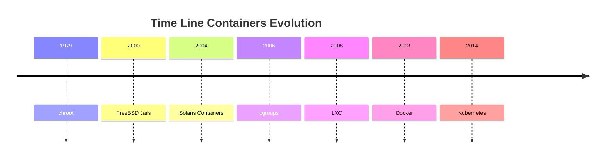

<h1><a name="readme-top"></a></h1>

[](https://github.com/marcossilvestrini/learning-lpic-3-305-300/actions/workflows/release.yml)[](https://github.com/marcossilvestrini/learning-lpic-3-305-300/actions/workflows/translate.yml)[](https://github.com/marcossilvestrini/learning-lpic-3-305-300/actions/workflows/jekyll-gh-pages.yml)[](https://github.com/marcossilvestrini/learning-lpic-3-305-300/actions/workflows/generate-html.yml)[](https://github.com/marcossilvestrini/learning-lpic-3-305-300/actions/workflows/powershell.yml)[](https://github.com/marcossilvestrini/learning-lpic-3-305-300/actions/workflows/slack.yml)

* * *

[![MIT License][license-shield]][license-url][![Forks][forks-shield]][forks-url][![Stargazers][stars-shield]][stars-url][![Contributors][contributors-shield]][contributors-url][![Issues][issues-shield]][issues-url][![LinkedIn][linkedin-shield]][linkedin-url]

* * *

# LPIC-3 305-300 の学習


<p align="center">
<strong>Explore the docs »</strong></a>
    <br />
    <a href="https://marcossilvestrini.github.io/learning-lpic-3-305-300/">Web Site</a>
    -
    <a href="https://github.com/marcossilvestrini/learning-lpic-3-305-300">Code Page</a>
    -
    <a href="https://github.com/marcossilvestrini/learning-lpic-3-305-300/issues">Report Bug</a>
    -
    <a href="https://github.com/marcossilvestrini/learning-lpic-3-305-300/issues">Request Feature</a>
</p>

* * *

## まとめ

<details>
  <summary><b>TABLE OF CONTENT</b></summary>
  <ol>
    <li>
      <a href="#about-the-project">About The Project</a>
    </li>
    <li>
      <a href="#getting-started">Getting Started</a>
      <ul>
        <li><a href="#prerequisites">Prerequisites</a></li>
        <li><a href="#installation">installation</a></li>
      </ul>
    </li>
    <li><a href="#usage">Usage</a></li>
    <li><a href="#roadmap">Roadmap</a></li>
    <li><a href="#freedoms">Four Essential Freedoms</a></li>
    <li>
      <a href="#topic-351">Topic 351: Full Virtualization</a>
      <ul>
        <li><a href="#topic-351.1">351.1 Virtualization Concepts and Theory </a></li>
        <li><a href="#topic-351.2">351.2 Xen</a></li>
        <li><a href="#topic-351.3">351.3 QEMU</a></li>
        <li><a href="#topic-351.4">351.4 Libvirt Virtual Machine</a></li>
        <li><a href="#topic-351.5">351.5 Virtual Machine Disk Image Management</a></li>
      </ul>
    </li>
    <li>
      <a href="#topic-352">Topic 352: Container Virtualization</a>
      <ul>
        <li><a href="#topic-352.1">352.1 Container Virtualization Concepts</a></li>
        <li><a href="#topic-352.2">352.2 LXC</a></li>
        <li><a href="#topic-352.3">352.3 Docker</a></li>
        <li><a href="#topic-352.4">352.4 Container Orchestration Platforms</a></li>
      </ul>
    </li>
    <li>
      <a href="#topic-353">Topic 353: VM Deployment and Provisioning</a>
      <ul>
        <li><a href="#topic-353.1">353.1 Cloud Management Tools</a></li>
        <li><a href="#topic-353.2">353.2 Packer</a></li>
        <li><a href="#topic-353.3">353.3 cloud-init</a></li>
        <li><a href="#topic-353.4">353.4 Vagrant</a></li>
      </ul>
    </li>
    <li><a href="#license">License</a></li>
    <li><a href="#contact">Contact</a></li>
    <li><a href="#acknowledgments">Acknowledgments</a></li>
  </ol>
</details><br>

* * *

<a name="about-the-project"></a>

## プロジェクトについて

> このプロジェクトは、学生や専門家が GNULinux の主要な概念を学習できるようにすることを目的としています。
> およびフリー ソフトウェア\\
> Debian や RPM などの一部の GNULinux ディストリビューションがカバーされます\\
> 一部のパッケージのインストールと構成についても説明します\\
> こうすることで、コミュニティ全体が変更から恩恵を受ける機会を得ることができます。\\
> ソース コードへのアクセスがその前提条件です。\\
> 稼働中のマシンには vagrant を使用し、ラボを実行して、この記事の内容を実践してください。\\
> 必要なものを含む Vagrantfile をフォルダー Vagrant に公開しました\\
> 学習環境をアップロードするため

* * *

<p align="right">(<a href="#readme-top">back to top</a>)</p>

<a name="getting-started"></a>

## はじめる

学習を開始するには、上記のドキュメントを参照してください。

<a name="prerequisites"></a>

### 前提条件

-   [Git](https://git-scm.com/book/en/v2/Getting-Started-Installing-Git)
-   [VMware ワークステーション](https://blogs.vmware.com/workstation/2024/05/vmware-workstation-pro-now-available-free-for-personal-use.html)
-   [Vagrant VMwareユーティリティ](https://developer.hashicorp.com/vagrant/install/vmware)
-   [Vagrant](https://developer.hashicorp.com/vagrant/install)

<a name="installation"></a>

### インストール

レポをクローンします

```sh
git clone https://github.com/marcossilvestrini/learning-lpic-3-305-300.git
cd learning-lpic-3-305-300
```

テンプレートをカスタマイズする_Vagrantfile-トピック-XXX_。このファイルには、ラボ用のVMS構成が含まれています。例：

-   ファイル[Vagrantfile-topic-351](./vagrant/Vagrantfile-topic-351)
    -   vm.clone_directory = "&lt;ドライバーの文字>:\\<folder>\\&lt;マシンへ>\\#{VM_NAME}-インスタンス-1"
        例: vm.clone_directory = "E:\\サーバー\\ヴイエムウェア\\＃{vm_name} -instance-1 "
    -   vm.vmx[「メムサイズ」"]= ""
    -   vm.vmx[「numvcpus」"]= ""
    -   vm.vmx[「cpuid"coresPerSocket」.]= ""

ファイル内のネットワーク構成をカスタマイズする[構成/ネットワーク](configs/network/).

* * *

<a name="usage"></a>

## 使用法

このリポジトリを使用して、LPIC-3 305-300試験について学習します

### For up and down

スイッチa_vagrantfile-topic-xxx_名前の新しいファイルのテンプレートとコピー_vagrantfile_

```sh
cd vagrant && vagrant up
cd vagrant && vagrant destroy -f
```

### VMSを再起動する場合

```sh
cd vagrant && vagrant reload
```

**重要：**_VMSを使用せずにVMSを再起動する場合、ブート後にマウントされていない共有フォルダー。_

### 上下にはPowerShellを使用します

Windowsプラットフォームを使用する場合、VMSの上下にPowerShellスクリプトを作成します。

```powershell
vagrant/up.ps1
vagrant/destroy.ps1
```

<p align="right">(<a href="#readme-top">back to top</a>)</p>

* * *

<a name="roadmap"></a>

## ロードマップ

-   [x] リポジトリの作成
-   [x] ラボをプロビジョニングするためのスクリプトを作成する
-   [x] トピック 351 に関する例を作成する
-   [ ] トピック 352 に関する例を作成する
-   [ ] トピック 353 に関する例を作成する
-   [ ] シミュレートされたiTexamをアップロードします

* * *

<a name="freedoms"></a>

## 4つの本質的な自由

> 0.目的を問わず、プログラムを自由に実行できます (自由 0)。\\
> 1.プログラムがどのように動作するかを研究し、そのように変更する自由\\
> あなたのコンピューティングを思いのままに (自由 1)。\\
> ソース コードへのアクセスがその前提条件です。\\
> 2.他の人を助けるためにコピーを再配布する自由 (自由 2)。\\
> 3\. 修正したバージョンのコピーを他の人に配布する自由 (自由 3)。

* * *

## コマンドを検査する

```sh
type COMMAND
apropos COMMAND
whatis COMMAND --long
whereis COMMAND
COMMAND --help, --h
man COMMAND
```

<p align="right">(<a href="#readme-top">back to top</a>)</p>

* * *

<a name="topic-351"></a>

## トピック 351: 完全仮想化


* * *

<a name="topic-351.1"></a>

### 351.1仮想化の概念と理論

**重さ：**6

**説明：**受験者は、仮想化の一般的な概念、理論、用語を理解し、理解している必要があります。これには、Xen、QEMU、libvirt の用語が含まれます。

**重要な知識領域：**

-   仮想化用語を理解する
-   仮想化の長所と短所を理解する
-   ハイパーバイザーと仮想マシンモニターのさまざまなバリエーションを理解する
-   物理マシンから仮想マシンへの移行の主な側面を理解する
-   ホスト システム間での仮想マシンの移行の主な側面を理解する
-   スナップショット、一時停止、クローン作成、リソース制限など、仮想マシンの仮想化の機能と影響を理解する
-   Ovirt、Proxmox、SystemDマシン、VirtualBoxの認識
-   Open Vswitchの認識

#### 351.1 引用オブジェクト

```sh
Hypervisor
Hardware Virtual Machine (HVM)
Paravirtualization (PV)
Emulation and Simulation
CPU flags
/proc/cpuinfo
Migration (P2V, V2V)
```

#### ハイパーバイザー

##### タイプ1ハイパーバイザー（ベアメタルハイパーバイザー）

###### タイプ1定義

ホストの物理的なハードウェアで直接実行され、ホストオペレーティングシステムを必要とせずにVMを管理するためのベースレイヤーを提供します。

###### タイプ1の特性

-   高性能と効率。
-   レイテンシとオーバーヘッドが低い。
-   多くの場合、エンタープライズ環境やデータセンターで使用されます。

###### タイプ 1 の例

-   VMware ESXi: 企業環境で広く使用されている堅牢なハイパーバイザー。
-   Microsoft Hyper-V: Windows Server と統合され、強力なパフォーマンスと管理機能を提供します。
-   Xen：多くのクラウドサービスプロバイダーが使用するオープンソースハイパーバイザー。
-   KVM (カーネルベースの仮想マシン): Linux カーネルに統合され、Linux ベースのシステムに高いパフォーマンスを提供します。

##### タイプ2ハイパーバイザー（ホストされたハイパーバイザー）

###### タイプ 2 の定義

従来のオペレーティング システム上で実行され、リソース管理とデバイス サポートをホスト OS に依存します。

###### タイプ2の特性

-   特にパーソナルコンピュータでのセットアップと使用が簡単になります。
-   開発、テスト、小規模な導入においてより柔軟に対応できます。
-   通常、ホスト OS からのオーバーヘッドが追加されるため、タイプ 1 ハイパーバイザーよりも効率が低くなります。

###### タイプ 2 の例

-   VMware Workstation: 単一のデスクトップ上で複数のオペレーティング システムを実行するための強力なハイパーバイザー。
-   Oracle VirtualBox: 柔軟性と使いやすさで知られるオープンソースのハイパーバイザー。
-   Parallels Desktop：MacユーザーがMacOSと一緒にWindowsやその他のオペレーティングシステムを実行するように設計されています。
-   QEMU（クイックエミュレータ）：KVMと組み合わせてよく使用されるオープンソースエミュレーターと仮想イザー。

##### タイプ 1 ハイパーバイザーとタイプ 2 ハイパーバイザーの主な違い

-   導入環境:
    -   タイプ 1 ハイパーバイザーは、ハードウェアとの直接対話と高いパフォーマンスのため、一般にデータセンターやエンタープライズ環境に導入されます。
    -   タイプ 2 ハイパーバイザーは、個人使用、開発、テスト、および小規模な仮想化タスクにより適しています。
-   パフォーマンス：
    -   タイプ 1 ハイパーバイザーは、ホスト OS に依存しないため、一般にパフォーマンスが向上し、遅延が低くなります。
    -   タイプ2のハイパーバイザーは、ホストOSの上でのランニングのオーバーヘッドにより、パフォーマンスの劣化が発生する場合があります。
-   管理と使いやすさ:
    -   タイプ 1 ハイパーバイザーは、より複雑なセットアップと管理を必要としますが、大規模な展開向けの高度な機能と拡張性を提供します。
    -   タイプ2のハイパーバイザーは、インストールと使用が簡単で、個々のユーザーや小規模なプロジェクトに最適です。

##### 移行タイプ

仮想マシンの作成と管理に使用されるテクノロジーであるハイパーバイザーのコンテキストでは、仮想化環境ではP2V移行とV2Vの移行という用語が一般的です。  
これらは、異なるタイプのプラットフォーム間でシステムを移行するプロセスを指します。

##### P2V - 物理から仮想への移行

P2V移行とは、物理サーバーを仮想マシンに移行するプロセスを指します。  
言い換えれば、専用の物理ハードウェアで実行されるオペレーティングシステムとそのアプリケーションは「変換」され、ハイパーバイザー（VMware、Hyper-V、KVMなど）で実行される仮想マシンに移動します。

-   例: Windows または Linux システムを実行している物理サーバーがあり、それをクラウド インフラストラクチャや内部仮想化サーバーなどの仮想環境に移動したいと考えています。  
    このプロセスでは、オペレーティングシステム、ドライバー、データを含むシステム状態全体をコピーして、物理ハードウェア上で実行できるように実行できる同等の仮想マシンを作成します。

##### V2V-仮想から仮想移行

V2V移行とは、仮想マシンをあるハイパーバイザーから別のハイパーバイザーに移行するプロセスを指します。  
この場合、仮想化された環境（VMwareなど）で実行されている仮想マシンが既にあり、別の仮想化環境（たとえば、Hyper-Vや新しいVMwareサーバー）に移動する必要があります。

-   例：VMware Virtualization Serverで実行されている仮想マシンがありますが、Hyper-Vプラットフォームに移行することにします。この場合、V2V移行は仮想マシンをある形式またはハイパーバイザーから別の形式に変換し、正しく実行を続けることができるようにします。

#### HVMと傍観的化

##### ハードウェア支援仮想化 (HVM)

###### HVM定義

HVMは、最新のCPUが提供するハードウェア拡張機能を活用してハードウェアを仮想化し、最小限のパフォーマンスオーバーヘッドでVMの作成と管理を可能にします。

###### HVM の主な特徴

-   **ハードウェアサポート**: Intel VT-x や AMD-V などの仮想化拡張機能に対する CPU サポートが必要です。
-   **完全な仮想化：**ハイパーバイザーはハードウェア環境の完全なエミュレーションを提供するため、VM は変更されていないゲスト オペレーティング システムを実行できます。
-   **パフォーマンス：**通常、CPUでゲストコードを直接実行するため、ネイティブに近いパフォーマンスを提供します。
-   **分離：**各 VM は独自の専用ハードウェアがあるかのように動作するため、VM 間に強力な分離が提供されます。

###### HVMの例

VMware ESXi、Microsoft Hyper-V、KVM (カーネルベースの仮想マシン)。

###### HVMの利点

-   **互換性：**変更なしで任意のオペレーティングシステムを実行できます。
-   **パフォーマンス：**ハードウェアサポートによる高性能。
-   **安全：**ハードウェアによって提供される強化された分離機能とセキュリティ機能。

###### HVM の欠点

-   **ハードウェアの依存関係:**特定のハードウェア機能が必要であり、古いシステムとの互換性を制限します。
-   **複雑：**より複雑な構成と管理が含まれる場合があります。

##### 官報化

###### 準仮想化の定義

準仮想化では、ゲスト オペレーティング システムを変更して仮想環境を認識し、ハイパーバイザーとより効率的に対話できるようにします。

###### 準仮想化の主な特徴

-   **ゲストの変更:**ハイパーコールを使用してハイパーバイザーと直接通信するために、ゲストオペレーティングシステムの変更が必要です。
-   **パフォーマンス：**ハードウェアのエミュレーションに関連するオーバーヘッドが削減されるため、従来の完全仮想化よりも効率的になります。
-   **互換性:**傍観的化のために変更されたオペレーティングシステムに限定されています。

###### 傍観的な例

準仮想化ゲストを備えた Xen、特定の構成の VMware ツール、および一部の KVM 構成。

###### 準仮想化の利点

-   **効率：**ハードウェアの仮想化のオーバーヘッドを削減し、特定のワークロードのパフォーマンスを向上させる可能性があります。
-   **リソース使用率:**ゲスト OS とハイパーバイザー間の直接通信により、システム リソースがより効率的に使用されます。

###### 準仮想化の欠点

-   **ゲスト OS の変更:**ゲストOSの変更が必要であり、サポートされているオペレーティングシステムへの互換性を制限します。
-   **複雑：**HyperCallの実装には、ゲストOSの追加の複雑さが必要です。

##### 重要な違い

###### ゲストOS要件

-   **HVM:**変更されていないゲストオペレーティングシステムを実行できます。
-   **paravirtualization：**ゲストオペレーティングシステムを変更して、ハイパーバイザーと連携する必要があります。

###### パフォーマンス

-   **HVM:**通常、ハードウェア支援の実行により、ネイティブに近いパフォーマンスを提供します。
-   **paravirtualization：**ハードウェアエミュレーションのオーバーヘッドを削減することで効率的なパフォーマンスを提供できますが、変更されたゲストOSに依存しています。

###### ハードウェアの依存関係

-   **HVM：**特定の CPU 機能 (Intel VT-x、AMD-V) が必要です。
-   **準仮想化:**特定のCPU機能は必要ありませんが、変更されたゲストOSが必要です。

###### 分離

-   **HVM:**ハードウェア機能を使用して強力な分離を提供します。
-   **準仮想化:**ソフトウェアベースの分離に依存しています。これは、ハードウェアベースの分離ほど堅牢ではない場合があります。

###### 複雑

-   **HVM：**変更されていない OS をサポートしているため、一般に導入がより簡単です。
-   **準仮想化:**ゲスト OS への追加のセットアップと変更が必要となり、複雑さが増します。

#### NUMA (不均一メモリアクセス)

numa（不均一なメモリアクセス）は、プロセッサによるメモリアクセスを最適化するためにマルチプロセッサシステムで使用されるメモリアーキテクチャです。  
NUMA システムでは、メモリはプロセッサ間で不均等に分散されます。つまり、各プロセッサは、物理的に遠く離れたメモリ (「リモート メモリ」と呼ばれる) よりもメモリの一部 (「ローカル メモリ」) に高速にアクセスでき、関連付けられています。他のプロセッサと。

##### numaアーキテクチャの重要な機能

1.  **ローカルおよびリモートメモリ**: 各プロセッサには独自のローカル メモリがあり、より高速にアクセスできます。ただし、時間はかかりますが、他のプロセッサのメモリにアクセスすることもできます。
2.  **差別化されたレイテンシ**：メモリアクセスの遅延は、プロセッサがローカルメモリにアクセスしているか、別のノードのメモリにアクセスしているかによって異なります。ローカルメモリアクセスはより速くなりますが、別のノードのメモリ（リモート）へのアクセスは遅くなります。
3.  **スケーラビリティ**: NUMA アーキテクチャは、多数のプロセッサを備えたシステムのスケーラビリティを向上させるように設計されています。プロセッサーを追加すると、メモリーも分散され、Uniform Memory Access (UMA) アーキテクチャーで発生するボトルネックが回避されます。

##### NUMAの利点

-   大規模なシステムでのパフォーマンスの向上：各プロセッサにはローカルメモリがあるため、メモリアクセスのために他のプロセッサと競合することなく、より効率的に動作できます。
-   スケーラビリティ: NUMA を使用すると、UMA アーキテクチャと比較して、多数のプロセッサと大量のメモリを備えたシステムをより効果的に拡張できます。

##### 短所

-   プログラミングの複雑さ：プログラマーは、どのメモリの領域がローカルまたはリモートであるかを認識する必要があり、ローカルメモリの使用を最適化してパフォーマンスを向上させる必要があります。
-   潜在的なパフォーマンスペナルティ：プロセッサがリモートメモリに頻繁にアクセスする場合、レイテンシが高いためパフォーマンスが低下する可能性があります。
    このアーキテクチャは、スケーラビリティとメモリの最適化が重要なサーバーやスーパーコンピューターなどの高性能マルチプロセッサシステムで一般的です。

#### OpenSourceソリューション

-   ovirt：<https://www.ovirt.org/>

-   プロクスモックス:<https://www.proxmox.com/en/proxmox-virtual-environment/overview>

-   Oracle VirtualBox：<https://www.virtualbox.org/>

-   オープンvswitch：<https://www.openvswitch.org/>

#### 仮想化の種類

##### ハードウェア仮想化（サーバー仮想化）

###### HV定義

物理ハードウェアを抽象化して、個別のオペレーティング システムとアプリケーションを実行する仮想マシン (VM) を作成します。

###### HV の使用例

データセンター、クラウドコンピューティング、サーバー統合。

###### HVの例

VMware ESXi、Microsoft Hyper-V、KVM。

##### オペレーティングシステム仮想化（コンテナ化）

###### コンテナ化定義

複数の分離されたユーザー空間インスタンス（コンテナ）が単一のOSカーネルで実行されるようにします。

###### コンテナ化ユースケース

マイクロサービス アーキテクチャ、開発およびテスト環境。

###### コンテナ化の例

Docker、Kubernetes、LXC。

##### ネットワーク仮想化

###### ネットワーク仮想化の定義

ハードウェアとソフトウェアのネットワーク リソースを単一のソフトウェア ベースの管理エンティティに結合します。

###### ネットワーク仮想化ユースケース

ソフトウェア定義ネットワーキング (SDN)、ネットワーク機能仮想化 (NFV)。

###### ネットワーク仮想化の例

VMware NSX、Cisco ACI、OpenStack Neutron。

##### ストレージ仮想化

###### ストレージ仮想化の定義

複数のデバイスの物理ストレージを単一の仮想ストレージ ユニットにプールし、一元管理できます。

###### ストレージ仮想化定義のユースケース

データ管理、ストレージの最適化、災害復旧。

###### ストレージ仮想化の定義例

IBM SAN ボリューム コントローラー、VMware vSAN、NetApp ONTAP。

##### デスクトップ仮想化

###### デスクトップ仮想化の定義

サーバー上でホストされている仮想マシン上でデスクトップ オペレーティング システムを実行できるようにします。

###### デスクトップ仮想化の定義の使用例

仮想デスクトップインフラストラクチャ（VDI）、リモートワークソリューション。

###### デスクトップ仮想化の定義例

Citrix Virtual Apps and Desktops、VMware Horizo​​n、Microsoft リモート デスクトップ サービス。

##### アプリケーション仮想化

###### アプリケーション仮想化定義

アプリケーションを基礎となるハードウェアおよびオペレーティングシステムから分離し、孤立した環境で実行できるようにします。

###### アプリケーション仮想化の定義の使用例

アプリケーションの導入、互換性テストの簡素化。

###### アプリケーション仮想化定義の例

VMware ThinApp、Microsoft App-V、Citrix XenApp。

##### データ仮想化

###### データ仮想化の定義

物理的に統合することなく、さまざまなソースからのデータを統合し、分析とレポートの統一ビューを提供します。

###### データ仮想化の定義の使用例

ビジネス インテリジェンス、リアルタイム データ統合。

###### データ仮想化の定義例

Denodo、Red Hat JBossデータ仮想化、IBM Infosphere。

##### 仮想化の利点

-   リソース効率: 物理リソースの利用効率が向上します。
-   コスト削減：ハードウェアと運用コストの削減。
-   スケーラビリティ：需要に応じて簡単にスケールアップまたはダウンします。
-   柔軟性：さまざまなワークロードとアプリケーションをサポートします。
-   ディザスタリカバリ: バックアップとリカバリのプロセスを簡素化します。
-   分離: 環境の分離によりセキュリティが向上します。

<p align="right">(<a href="#topic-351.1">back to sub Topic 351.1</a>)</p>
<p align="right">(<a href="#topic-351">back to Topic 351</a>)</p>
<p align="right">(<a href="#readme-top">back to top</a>)</p>

* * *

<a name="topic-351.2"></a>

### 351.2ゼン


**重さ：**3

**説明：**受験者は、Xen インストールのインストール、構成、保守、移行、およびトラブルシューティングができる必要があります。 Xen バージョン 4.x に焦点を当てています。

**重要な知識領域：**

-   ネットワークやストレージを含む Xen のアーキテクチャを理解する
-   Xenノードとドメインの基本的な構成
-   Xen ノードとドメインの基本的な管理
-   XENインストールの基本的なトラブルシューティング
-   丸薬から離れたアバリン
-   Xenstoreの認識
-   Xen ブートパラメータの認識
-   xm ユーティリティの認識

#### ゼン


Xenは、オープンソースタイプ1（裸のメタル）ハイパーバイザーであり、複数のオペレーティングシステムが同じ物理ハードウェアで同時に実行できるようにします。  
Xen は、物理ハードウェアと仮想マシン (VM) の間にレイヤーを提供し、効率的なリソースの共有と分離を可能にします。

-   **建築：**Xenは、ドメイン0（DOM0）が直接ハードウェアアクセスを備えた特権ドメインであり、ハイパーバイザーを管理する2層システムで動作します。ドメインu（domu）と呼ばれる他の仮想マシンは、ゲストオペレーティングシステムを実行し、dom0によって管理されています。
-   **仮想化の種類:**Xen は、変更されたゲスト OS を必要とする準仮想化 (PV) と、ハードウェア拡張機能 (Intel VT-x や AMD-V など) を使用して未変更のゲスト OS を実行するハードウェア支援仮想化 (HVM) の両方をサポートします。
    Xen は、クラウド環境、特にアマゾン ウェブ サービス (AWS) やその他の大規模クラウド プロバイダーで広く使用されています。

#### Xenソース

Xensourceは、ケンブリッジ大学のXenハイパーバイザーの元の開発者によって設立された同社であり、Xenを商業化しました。  
同社はXenに基づいてエンタープライズソリューションを提供し、エンタープライズの使用にXenの機能を強化するための追加のツールとサポートを提供しました。

-   **Citrixによる買収**：2007 年、XenSource は Citrix Systems, Inc. に買収されました。Citrix は、Xen テクノロジーを Citrix XenServer 製品の基盤として使用し、Xen ベースのエンタープライズ グレードの仮想化プラットフォームとして人気を博しました。
-   **遷移**：買収後、Xenプロジェクトはオープンソースプロジェクトとして継続され、CitrixはXenserverなどの商用製品に焦点を当て、Xensourceテクノロジーを活用しました。

#### xenプロジェクト

Xen プロジェクトは、Xen ハイパーバイザーの商用化後の開発と保守を担当するオープンソース コミュニティおよびイニシアチブを指します。  
Xen プロジェクトは Linux Foundation の下で運営されており、コミュニティ主導の共同作業として Xen の構築、改善、サポートに重点を置いています。

-   **目標：**Xen プロジェクトは、クラウド コンピューティング、セキュリティ重視の仮想化 (Qubes OS など)、組み込みシステムなど、幅広いユースケース向けにパフォーマンス、セキュリティ、機能セットを改善することでハイパーバイザーを進化させることを目指しています。
-   **寄稿者:**このプロジェクトには、大手クラウド プロバイダー、ハードウェア ベンダー、独立系開発者など、さまざまな組織からの貢献者が参加しています。
-   **錠剤とハンツール:**Xen プロジェクトには、Xen ハイパーバイザーのインストールの管理に使用される XAPI (XenAPI) などのツールや、システム管理と最適化のためのその他のさまざまなユーティリティも含まれています。

#### XenStore

Xenストアは、Xenハイパーバイザーの重要なコンポーネントです。  
基本的に、Xen Store は、Xen ハイパーバイザーとそれが管理する仮想マシン (ドメインとも呼ばれます) の間の通信と情報共有に使用される分散キー/値データベースです。

Xen Store の重要な側面をいくつか示します。

-   **ドメイン間通信:**Xen Store を使用すると、Dom0 (ハードウェア リソースを制御する特権ドメイン) と DomU (ユーザー ドメイン、VM) などのドメイン間の通信が可能になります。これは、各ドメインが情報を読み書きできるキーと値のエントリを通じて行われます。

-   **構成管理:**これは、仮想デバイス、ネットワーク、ブート パラメーターなどの構成情報を保存し、アクセスするために使用されます。これにより、VM の動的な管理と構成が容易になります。

-   **イベントと通知:**Xen Storeは、イベント通知もサポートしています。 Xenストアの特定のキーまたは値が変更されると、これらの変更に反応するように関心のあるドメインを通知できます。これは、リソースの監視と管理に役立ちます。

-   Simple API：Xen Storeは、データを読み書きするためのシンプルなAPIを提供し、開発者がアプリケーションをXen仮想化システムと簡単に統合できるようにします。

#### ピル

XAPI (XenAPI) は、Xen Hypervisor とその仮想マシン (VM) を管理するために使用されるアプリケーション プログラミング インターフェイス (API) です。  
XAPI は XenServer (現在は Citrix Hypervisor として知られています) の主要コンポーネントであり、Xen ハイパーバイザーと対話して VM の作成、構成、監視、制御などの操作を実行するための標準化された方法を提供します。

XAPIのいくつかの重要な側面は次のとおりです。

-   **VM管理:**XAPI を使用すると、管理者はプログラムで仮想マシンを作成、削除、起動、停止できます。

-   **オートメーション：**XAPI を使用すると、大規模なクラウド環境にとって重要な、ネットワーク、ストレージ、コンピューティングなどの仮想リソースの管理を自動化できます。

-   **統合：**XAPI は他のツールやスクリプトと統合して、Xen 環境のより効率的なカスタマイズされた管理を提供できます。

-   **アクセス制御:**XAPI は、許可されたユーザーのみが仮想環境で特定の操作を実行できるようにするアクセス制御メカニズムも提供します。

XAPIは、Xenハイパーバイザーの制御と自動化を可能にするインターフェイスであり、仮想化された環境の管理を容易にします。

#### xenサマリー

-   **間散布：**仮想マシンを物理ハードウェア上で実行できるようにするコア ハイパーバイザー テクノロジ。
-   **Xensource：**Xen を商用化した企業で、後に Citrix に買収され、Citrix XenServer の開発につながりました。
-   **Xen プロジェクト:**Linux Foundationの下でXenハイパーバイザーの開発と維持を続けるオープンソースのイニシアチブとコミュニティ。
-   **Xenストア:**Xen Store は、Xen ハイパーバイザーと VM の間の通信と構成の仲介者として機能し、仮想化環境の運用と管理を合理化します。
-   **ピル**は、Xen Hypervisor の制御と自動化を可能にし、仮想化環境の管理を容易にするインターフェイスです。

#### ドメイン0 (Dom0)

Domain0 (Dom0) は、Xen アーキテクチャの制御ドメインです。他のドメイン (DomU) を管理し、ハードウェアに直接アクセスします。  
Dom0 はデバイス ドライバーを実行し、ハードウェアに直接アクセスできない DomU がデバイスと通信できるようにします。通常、これは Linux などのオペレーティング システムの完全なインスタンスであり、Xen ハイパーバイザーの動作に不可欠です。

#### ドメイン（家）

DomU は、仮想マシンを実行する非特権ドメインです。  
それらはdom0によって管理されており、ハードウェアに直接アクセスできません。 Domusは、さまざまなオペレーティングシステムを実行するように構成でき、アプリケーションサーバーや開発環境など、さまざまな目的に使用できます。彼らは、ハードウェアの相互作用のためにdom0に依存しています。

#### Peewee-Dom（Paravardiyed Domina）

pv-domus paravirtualizationという手法を使用します。このモデルでは、DOMUオペレーティングシステムは、仮想化された環境で実行されることを認識するように変更されており、最適化されたパフォーマンスのためにハイパーバイザーと直接通信できるようにします。  
これにより、完全な仮想化と比較して、オーバーヘッドが低くなり、効率が向上します。

#### HVM-DomU (ハードウェア仮想マシン ドメイン U)

HVM-Domusは、完全な仮想化を利用する仮想マシンであり、変更されていないオペレーティングシステムを実行できます。 Xenハイパーバイザーは、これらのドムスにハードウェアエミュレーションを提供し、基礎となるハードウェアアーキテクチャをサポートするオペレーティングシステムを実行できるようにします。  
これにより柔軟性が高まりますが、PV-Domusと比較してオーバーヘッドが高くなる可能性があります。

#### Xenネットワーク

Paravirtualised Networkデバイス

ブリッジング

#### 351.2引用されたオブジェクト

```sh
Domain0 (Dom0), DomainU (DomU)
PV-DomU, HVM-DomU
/etc/xen/
xl
xl.cfg 
xl.conf # Xen global configurations
xentop
oxenstored # Xenstore configurations
```

#### 351.2ノート

```sh

# Xen Settings
/etc/xen/
/etc/xen/xl.conf - Main general configuration file for Xen
/etc/xen/oxenstored.conf - Xenstore configurations

# VM Configurations
/etc/xen/xlexample.pvlinux
/etc/xen/xlexample.hvm

# Service Configurations
/etc/default/xen
/etc/default/xendomains

# xen-tools configurations
/etc/xen-tools/
/usr/share/xen-tools/

# docs
xl(1)
xl.conf(5)
xlcpupool.cfg(5)
xl-disk-configuration(5)
xl-network-configuration(5)
xen-tscmode(7)
```

#### 351.2重要なコマンド

##### xen-create-image

```sh
# create a pv image
xen-create-image \
  --hostname=lpic3-pv-guest \
  --memory=1gb \
  --vcpus=2 \
  --lvm=vg_xen \
  --dhcp \
  --pygrub \
  --dist=bookworm
```

##### xen-削除-イメージ

```sh
# delete a pv image
xen-delete-image lpic3-pv-guest --lvm=vg_xen
```

##### brctl

```sh
# list xen interfaces
brctl show
```

##### XL

```sh
# view xen information
xl infos

# list Domains
xl list

# view dmesg information
xl dmesg

# monitoring domain
xl top
xentop
xen top

# Limit mem Dom0
xl mem-set 0 2048

# Limite cpu (not permanent after boot)
xl vcpu-set 0 2

# manual conf
man xl.conf

# manual cfg - about guest configuration
man xl.cfg

# create DomainU - virtual machine
xl create /etc/xen/lpic3-pv-guest.cfg

# create DomainU virtual machine and connect to guest
xl create -c /etc/xen/lpic3-pv-guest.cfg

# create DomainU virtual machine HVM

## configure /etc/xen/lpic3-hvm-guest.cfg

## create a ssh tunel for vnc
ssh -l vagrant -L 5900:localhost:5900  192.168.0.130

## create domain hvm
xl create /etc/xen/lpic3-hvm-guest.cfg

## open vcn conectio in your vnc client with localhost

# connect in domain guest
xl console <id>|<name> (press enter)
xl console 1
xl console lpic3-pv-guest

#How do I exit domU "xl console" session
#Press ctrl+] or if you're using Putty press ctrl+5.

# Poweroff domain
xl shutdown lpic3-pv-guest

# destroy domain
xl destroy lpic3-pv-guest

# reboot domain
xl reboot lpic3-pv-guest
```

<p align="right">(<a href="#topic-351.2">back to sub Topic 351.2</a>)</p>
<p align="right">(<a href="#topic-351">back to Topic 351</a>)</p>
<p align="right">(<a href="#readme-top">back to top</a>)</p>

* * *

<a name="topic-351.3"></a>

### 351.3QEMU

**重さ：**4

**説明：**候補者は、QEMUのインストールをインストール、構成、保守、移行、およびトラブルシューティングできる必要があります。

**重要な知識領域：**

-   KVM、ネットワーキング、ストレージなど、QEMUのアーキテクチャを理解する
-   コマンドラインからQEMUインスタンスを起動する
-   QEMU モニターを使用してスナップショットを管理する
-   QEMU ゲスト エージェントと VirtIO デバイス ドライバーをインストールする
-   ネットワーキングやストレージを含むQEMUのインストールのトラブルシューティング
-   重要な QEMU 構成パラメータの認識

#### 351.3引用されたオブジェクト

```sh
Kernel modules: kvm, kvm-intel and kvm-amd
/dev/kvm
QEMU monitor
qemu
qemu-system-x86_64
ip
brctl
tunctl
```

#### 351.3 重要なコマンド

##### ip

```sh
# list links
ip link show
```

<p align="right">(<a href="#topic-351.3">back to sub Topic 351.3</a>)</p>
<p align="right">(<a href="#topic-351">back to Topic 351</a>)</p>
<p align="right">(<a href="#readme-top">back to top</a>)</p>

* * *

<a name="topic-351.4"></a>

### 351.4 Libvirt仮想マシン管理

**重さ：**9

**説明：**候補者は、Libvirtおよび関連ツールを使用して、仮想化ホストと仮想マシン（「Libvirtドメイン」）を管理できる必要があります。

**重要な知識領域：**

-   libvirt のアーキテクチャを理解する
-   libvirt接続とノードを管理します
-   スナップショットを含むQEMUおよびXENドメインを作成および管理します
-   ドメインのリソース消費を管理および分析する
-   ストレージプールとボリュームの作成と管理
-   仮想ネットワークを作成および管理します
-   ノード間でドメインを移動します
-   libvirtがxenやqemuとどのように相互作用するかを理解してください
-   libvirt が dnsmasq や radvd などのネットワーク サービスとどのように対話するかを理解する
-   libvirt XML 構成ファイルを理解する
-   VirtlogdとVirtlockDの認識

#### 351.4 引用オブジェクト

```sh
libvirtd
/etc/libvirt/
virsh (including relevant subcommands)
```

#### 351.4重要なコマンド

##### ふー

```sh
foo
```

<p align="right">(<a href="#topic-351.4">back to sub Topic 351.4</a>)</p>
<p align="right">(<a href="#topic-351">back to Topic 351</a>)</p>
<p align="right">(<a href="#readme-top">back to top</a>)</p>

* * *

<a name="topic-351.5"></a>

### 351.5 仮想マシンのディスクイメージの管理

**重さ：**3

**説明：**受験者は、仮想マシンのディスク イメージを管理できる必要があります。これには、さまざまな形式とハイパーバイザー間でのディスク イメージの変換や、イメージ内に保存されているデータへのアクセスが含まれます。

**重要な知識領域：**

-   Raw イメージ、qcow2、VMDK などのさまざまな仮想ディスク イメージ形式の機能を理解する
-   QEMU-IMGを使用して仮想マシンディスクイメージを管理します
-   libguestfish を使用してパーティションをマウントし、仮想マシンのディスク イメージに含まれるファイルにアクセスする
-   物理ディスクの内容を仮想マシンのディスクイメージにコピーする
-   さまざまな仮想マシンのディスク イメージ形式間でディスク コンテンツを移行する
-   オープン仮想化フォーマット (OVF) の認識

#### 351.5 引用オブジェクト

```sh
qemu-img
guestfish (including relevant subcommands)
guestmount
guestumount
virt-cat
virt-copy-in
virt-copy-out
virt-diff
virt-inspector
virt-filesystems
virt-rescue
virt-df
virt-resize
virt-sparsify
virt-p2v
virt-p2v-make-disk
virt-v2v
virt-sysprep
```

#### 351.5 重要なコマンド

##### foo

```sh
foo
```

<p align="right">(<a href="#topic-351.5">back to sub Topic 351.5</a>)</p>
<p align="right">(<a href="#topic-351">back to Topic 351</a>)</p>
<p align="right">(<a href="#readme-top">back to top</a>)</p>

* * *

<a name="topic-352"></a>

## トピック352：コンテナ仮想化

* * *

<a name="topic-352.1"></a>

### 352.1コンテナ仮想化の概念

**重さ：**7

**説明：**受験者はコンテナ仮想化の概念を理解している必要があります。これには、コンテナ仮想化の実装に使用される Linux コンポーネントの理解と、これらのコンポーネントのトラブルシューティングのための標準 Linux ツールの使用が含まれます。

**主要な知識領域:**

-   システムとアプリケーションコンテナの概念を理解する
-   カーネルネームスペースを理解して分析します
-   コントロールグループの理解と分析
-   能力の理解と分析
-   コンテナ仮想化における seccomp、SELinux、AppArmor の役割を理解する
-   LXCとDockerが名前空間、cgroups、機能、Seccomp、およびMacを活用する方法を理解する
-   runcの原理を理解する
-   CRI-Oとcontainerdの原理を理解する
-   OCIランタイムと画像仕様の認識
-   Kubernetesコンテナランタイムインターフェイス（CRI）の認識
-   Podman、Buildah、Scopeoの認識
-   Linux およびその他の無料オペレーティング システム (rkt、OpenVZ、systemd-nspawn、BSD Jails など) における他のコンテナ仮想化アプローチの認識



#### 352.1 引用オブジェクト

```sh
nsenter
unshare
ip (including relevant subcommands)
capsh
/sys/fs/cgroups
/proc/[0-9]+/ns
/proc/[0-9]+/status
```

#### 352.1重要なコマンド

##### foo

```sh
foo
```

<p align="right">(<a href="#topic-352.1">back to sub topic 352.1</a>)</p>
<p align="right">(<a href="#topic-352">back to topic 352</a>)</p>
<p align="right">(<a href="#readme-top">back to top</a>)</p>

* * *

<a name="topic-352.2"></a>

### 352.2LXC

**重さ：**6

**説明：**受験者は、LXC および LXD を使用してシステム コンテナを使用できる必要があります。対象となる LXC のバージョンは 3.0 以降です。

**重要な知識領域：**

-   LXCとLXDのアーキテクチャを理解してください
-   LXD を使用して既存のイメージに基づいて LXC コンテナー (ネットワーキングやストレージを含む) を管理する
-   LXCコンテナプロパティを構成します
-   LXC コンテナーのリソース使用量を制限する
-   LXDプロファイルを使用する
-   LXC イメージを理解する
-   従来の LXC ツールの認識

#### 352.2引用オブジェクト

```sh
lxd
lxc (including relevant subcommands)
```

#### 352.2重要なコマンド

##### foo

```sh
foo
```

<p align="right">(<a href="#topic-352.2">back to sub topic 352.2</a>)</p>
<p align="right">(<a href="#topic-352">back to topic 352</a>)</p>
<p align="right">(<a href="#readme-top">back to top</a>)</p>

* * *

<a name="topic-352.3"></a>

### 352.3 Docker

**重さ：**9

**説明：**候補者は、DockerノードとDockerコンテナを管理できる必要があります。これには、Dockerのアーキテクチャを理解し、DockerがノードのLinuxシステムとどのように相互作用するかを理解することが含まれます。

**重要な知識領域：**

-   Dockerのアーキテクチャとコンポーネントを理解してください
-   Docker レジストリのイメージを使用して Docker コンテナを管理する
-   Dockerコンテナのイメージとボリュームを理解して管理する
-   Dockerコンテナのロギングを理解して管理します
-   Docker のネットワークを理解して管理する
-   dockerfilesを使用してコンテナ画像を作成します
-   レジストリ Docker イメージを使用して Docker レジストリを実行する

#### 352.3引用されたオブジェクト

```sh
dockerd
/etc/docker/daemon.json
/var/lib/docker/
docker
Dockerfile
```

#### 352.3重要なコマンド

##### Docker

```sh
# Examples of docker
```

<p align="right">(<a href="#topic-352.3">back to sub topic 352.3</a>)</p>
<p align="right">(<a href="#topic-352">back to topic 352</a>)</p>
<p align="right">(<a href="#readme-top">back to top</a>)</p>

* * *

<a name="topic-352.4"></a>

### 352.4コンテナオーケストレーションプラットフォーム

**重さ：**3

**説明：**受験者は、コンテナ オーケストレーションの重要性と、コンテナ オーケストレーションを実装するために Docker Swarm と Kubernetes が提供する重要な概念を理解する必要があります。

**重要な知識領域：**

-   コンテナオーケストレーションの関連性を理解します
-   Docker ComposeとDocker Swarmの重要な概念を理解する
-   Kubernetes と Helm の主要な概念を理解する
-   OpenShift、Rancher、Mesosphere DC/OS の認識

<p align="right">(<a href="#topic-352.4">back to sub topic 352.4</a>)</p>
<p align="right">(<a href="#topic-352">back to topic 352</a>)</p>
<p align="right">(<a href="#readme-top">back to top</a>)</p>

* * *

<a name="topic-353"></a>

## トピック353：VMの展開とプロビジョニング

* * *

<a name="topic-353.1"></a>

### 353.1 クラウド管理ツール

**重さ：**2

**説明：**候補者は、パブリッククラウドの一般的な製品を理解し、一般的に利用可能なクラウド管理ツールの基本的な機能知識を持っている必要があります。

**主要な知識領域:**

-   パブリック クラウドの一般的なサービスを理解する
-   OpenStack の基本的な機能の知識
-   テラフォームの基本的な機能知識
-   CloudStack、Eucalyptus、OpenNebula の認識

#### 353.1引用オブジェクト

```sh
IaaS, PaaS, SaaS
OpenStack
Terraform
```

#### 353.1重要なコマンド

##### ふー

```sh
# examples
```

<p align="right">(<a href="#topic-353.1">back to sub topic 353.1</a>)</p>
<p align="right">(<a href="#topic-353">back to topic 353</a>)</p>
<p align="right">(<a href="#readme-top">back to top</a>)</p>

* * *

<a name="topic-353.2"></a>

### 353.2 パッカー

**重さ：**2

**説明：**受験者は、Packer を使用してシステム イメージを作成できる必要があります。これには、さまざまなパブリックおよびプライベート クラウド環境での Packer の実行や、LXC/LXD 用のコンテナ イメージの構築が含まれます。

**重要な知識領域：**

-   Packerの機能と機能を理解します
-   テンプレート ファイルの作成と保守
-   異なるビルダーを使用してテンプレートファイルから画像を作成します

#### 353.2 引用オブジェクト

```sh
packer
```

#### 353.2 重要なコマンド

##### パッカー

```sh
# examples
```

<p align="right">(<a href="#topic-353.2">back to sub topic 353.2</a>)</p>
<p align="right">(<a href="#topic 353">back to topic 353</a>)</p>
<p align="right">(<a href="#readme-top">back to top</a>)</p>

* * *

<a name="topic-353.3"></a>

### 353.3 クラウド初期化

**重さ：**3

**説明：**候補者は、クラウドInitを使用して、標準化された画像から作成された仮想マシンを構成できる必要があります。これには、利用可能なハードウェアリソース、特にディスクスペースとボリュームに合わせて仮想マシンを調整することが含まれます。  
さらに、候補者はインスタンスを構成して、安全なSSHログインを許可し、特定のソフトウェアパッケージセットをインストールできる必要があります。  
さらに、候補者は、クラウドイットサポートを備えた新しいシステム画像を作成できる必要があります。

**重要な知識領域：**

-   ユーザーデータ、クラウドイニットの初期化と構成など、クラウドイニットの機能と概念を理解する
-   Cloud-init を使用して、ファイル システムの作成、サイズ変更、マウントを行い、SSH キーなどのログイン認証情報を含むユーザー アカウントを構成し、ディストリビューションのリポジトリからソフトウェア パッケージをインストールします。
-   Cloud-init をシステム イメージに統合する
-   テストには構成ドライブ データソースを使用する

#### 353.3引用オブジェクト

```sh
cloud-init
user-data
/var/lib/cloud/
```

#### 353.3 重要なコマンド

##### ふー

```sh
# examples
```

<p align="right">(<a href="#topic-353.3">back to sub topic 353.3</a>)</p>
<p align="right">(<a href="#topic 353">back to topic 353</a>)</p>
<p align="right">(<a href="#readme-top">back to top</a>)</p>

* * *

<a name="topic-353.4"></a>

### 353.4 浮浪者

**重さ：**3

**説明：**受験者は、仮想マシンのプロビジョニングを含め、Vagrant を使用して仮想マシンを管理できる必要があります。

**重要な知識領域：**

-   ストレージやネットワークなど、Vagrant のアーキテクチャと概念を理解する
-   Atlasからボックスを取得して使用します
-   Vagrantfile を作成して実行する
-   Vagrant 仮想マシンにアクセスする
-   Vagrant 仮想マシンとホスト システム間でフォルダーを共有および同期する
-   Vagrant プロビジョニング、つまりファイル プロビジョナーとシェル プロビジョナーを理解する
-   マルチマシンのセットアップを理解する

#### 353.4引用されたオブジェクト

```sh
vagrant
Vagrantfile
```

#### 353.4重要なコマンド

##### 浮浪者

```sh
# examples
```

<p align="right">(<a href="#topic-353.4">back to sub topic 353.4</a>)</p>
<p align="right">(<a href="#topic 353">back to topic 353</a>)</p>
<p align="right">(<a href="#readme-top">back to top</a>)</p>

* * *

## 貢献

貢献は、オープンソースコミュニティを非常に素晴らしい場所にするものです
学び、インスピレーションを与え、作成します。あなたがする貢献はすべてです**とても感謝しています**.

これを改善する提案がある場合は、リポジトリをフォークしてください。
プルリクエストを作成します。 「拡張」タグを付けて問題を開くこともできます。
プロジェクトにスターを付けることを忘れないでください。再度、感謝します！

1.  プロジェクトをフォークします
2.  機能ブランチを作成します（`git checkout -b feature/AmazingFeature`)
3.  あなたの変更をコミットします（`git commit -m 'Add some AmazingFeature'`)
4.  枝に押します（`git push origin feature/AmazingFeature`)
5.  プルリクエストを開く

* * *

## ライセンス

-   このプロジェクトはMITライセンスに基づいてライセンスされています \*詳細については、license.mdファイルを参照してください

* * *

## 接触

マルコス・シルヴェストリーニ -[marcos.silvestrini@gmail.com](mailto:marcos.silvestrini@gmail.com)\\[](https://twitter.com/mrsilvestrini)

プロジェクトリンク：<https://github.com/marcossilvestrini/learning-lpic-3-305-300>

<p align="right">(<a href="#readme-top">back to top</a>)</p>

* * *

## 謝辞

-   [リチャード・ストールマンズ](http://www.stallman.org/)
-   [gnu](<>)
    -   [Richard Stallman による GNU/Linux FAQ](https://www.gnu.org/gnu/gnu-linux-faq.html)
    -   [gnu](https://www.gnu.org/)
    -   [GNU オペレーティング システム](https://www.gnu.org/gnu/thegnuproject.html)
    -   [GCC コンパイラ](https://gcc.gnu.org/wiki/History)
    -   [GNUタール](https://www.gnu.org/software/tar/)
    -   [gnu make](https://www.gnu.org/software/make/)
    -   [GNU Emacs](https://en.wikipedia.org/wiki/Emacs)
    -   [GNU パッケージ](https://www.gnu.org/software/)
    -   [GNU/Linuxコレクション](https://directory.fsf.org/wiki/Collection:GNU/Linux)
    -   [GNU Grub ブートローダー](https://www.gnu.org/software/grub/)
    -   [GNUハード](https://www.gnu.org/software/hurd/hurd/what_is_the_gnu_hurd.html)
-   [カーネル](<>)
    -   [カーネル](https://www.kernel.org/)
    -   [Linuxカーネルマンページ](https://www.kernel.org/doc/man-pages/)
    -   [カーネルをコンパイルする](https://wiki.linuxquestions.org/wiki/How_to_build_and_install_your_own_Linux_kernel)
-   [Linux標準ベース](<>)
    -   [Linux標準ベース](https://en.wikipedia.org/wiki/Linux_Standard_Base)
    -   [ファイルシステム階層標準](https://en.wikipedia.org/wiki/Filesystem_Hierarchy_Standard)
    -   [ファイル階層構造](https://refspecs.linuxfoundation.org/FHS_3.0/fhs-3.0.pdf)
-   [フリーソフトウェア](<>)
    -   [FSF](https://www.fsf.org)
    -   [フリーソフトウェアディレクトリ](https://directory.fsf.org/wiki/Free_Software_Directory:Free_software_replacements)
-   [ライセンス](<>)
    -   [フリーソフトウェア](https://www.gnu.org/philosophy/free-sw.html)
    -   [コピーレフト](https://www.gnu.org/licenses/copyleft.en.html)
    -   [gpl](https://www.gnu.org/licenses/quick-guide-gplv3.html)
    -   [GNU以下の一般公開ライセンス](https://www.gnu.org/licenses/lgpl-3.0.html)
    -   [BSD](https://opensource.org/licenses/BSD-3-Clause)
    -   [オープンソースイニシアチブ](https://opensource.org/)
    -   [クリエイティブ・コモンズ](https://creativecommons.org/)
    -   [ライセンスLTS](https://en.wikipedia.org/wiki/Long-term_support)
-   [ディストリビューション](<>)
    -   [Debian フリーソフトウェアのガイドライン](https://www.debian.org/social_contract#guidelines)
    -   [Linux ディストリビューションのリスト](https://en.wikipedia.org/wiki/List_of_Linux_distributions)
    -   [ディストロウォッチ](https://distrowatch.com/)
    -   [Linux ディストリビューションの比較](https://en.wikipedia.org/wiki/Comparison_of_Linux_distributions)
-   [デスクトップ環境](<>)
    -   [X11組織](https://www.x.org/wiki/)
    -   [ウェイランド](https://wayland.freedesktop.org/)
    -   [GNU GNOME](https://www.gnu.org/press/gnome-1.0.html)
    -   [gnome](https://www.gnome.org/)
    -   [xfce](https://xfce.org/)
    -   [KDE Plasma](https://kde.org/plasma-desktop/)
    -   [調和](https://en.wikipedia.org/wiki/Harmony_(toolkit))
-   [プロトコル](<>)
    -   [HTTP](<>)
        -   [W3テック](https://w3techs.com/)
        -   [アパッチ](https://www.apache.org/)
        -   [Apache ディレクティブ][def]
        -   [HTTPステータスコード](https://en.wikipedia.org/wiki/List_of_HTTP_status_codes)
        -   [Apache、nginx、Lighttpd の強力な暗号](https://cipherlist.eu/)
        -   [SSL チュートリアル](https://www.golinuxcloud.com/blog/)
        -   [SSL 構成 Mozilla](https://ssl-config.mozilla.org/)
    -   [xRDP](https://bytexd.com/xrdp-centos/)
    -   [NTP](https://www.ntppool.org/en/)
-   [DNS](<>)
    -   [バインド](https://www.isc.org/bind/)
    -   [バインドロギング](https://www.zytrax.com/books/dns/ch7/logging.html)
    -   [DNSレコードタイプのリスト](https://en.wikipedia.org/wiki/List_of_DNS_record_types)
    -   [DNSレコードタイプのリスト](https://en.wikipedia.org/wiki/List_of_DNS_record_types)
-   [パッケージマネージャー](<>)
    -   [パッケージをダウンロードする](https://pkgs.org/)
    -   [パッケージをインストールします](https://installati.one/)
    -   [パッケージをインストールするガイド](https://installati.one/)
-   [シェルスクリプト](<>)
    -   [再びボーン](https://www.gnu.org/software/bash/manual/)
    -   [シバン](https://bash.cyberciti.biz/guide/Shebang)
    -   [環境変数](https://linuxize.com/post/how-to-set-and-list-environment-variables-in-linux/)
    -   [GNU グロビング](https://man7.org/linux/man-pages/man7/glob.7.html)
    -   [グローブ](https://linuxhint.com/bash_globbing_tutorial/)
    -   [引用](https://www.gnu.org/software/bash/manual/html_node/Quoting.html)
    -   [正規表現](https://www.gnu.org/software/grep/manual/html_node/Regular-Expressions.html)
    -   [コマンドが見つかりません](https://command-not-found.com/)
    -   [bashrcジェネレーター](http://bashrcgenerator.com/)
    -   [説明](https://explainshell.com/)
    -   [Vim チュートリアル](https://www.openvim.com/)
    -   [Linuxシェルスクリプトチュートリアル](https://bash.cyberciti.biz/guide/Main_Page)
    -   [コマンドの例](https://www.geeksforgeeks.org/)
-   [その他のツール](<>)
    -   [バグジラ](https://bugzilla.kernel.org/)
    -   [Githubバッジ](https://github.com/alexandresanlim/Badges4-README.md-Profile)
-   [仮想化の定義](<>)
    -   [赤い帽子](https://www.redhat.com/pt-br/topics/virtualization/what-is-virtualization)
    -   [AWS](https://aws.amazon.com/pt/what-is/virtualization/)
    -   [IBM](https://www.ibm.com/topics/virtualization)
    -   [OpenSource.com](https://opensource.com/resources/virtualization)
-   [KVM](<>)
    -   [KVM(カーネル仮想マシン)](https://www.redhat.com/pt-br/topics/virtualization/what-is-KVM)
    -   [KVM管理ツール](https://www.linux-kvm.org/page/Management_Tools)
-   [ゼン](<>)
    -   [Xenサーバー](https://www.xenserver.com/)
    -   [ウィキ Xenプロジェクト](https://wiki.xenproject.org/wiki/Main_Page)
    -   [ネットワークインターフェイス](https://wiki.xenproject.org/wiki/Xen_Networking#Virtual_Network_Interfaces)
    -   [Xenツール](https://xen-tools.org/software/)
    -   [LPIブログ：Xen Virtualization and Cloud Computing＃01：はじめに](https://www.lpi.org/pt-br/blog/2020/10/01/xen-virtualization-and-cloud-computing-01-introduction/)
    -   [LPI ブログ: Xen 仮想化とクラウド コンピューティング #02: Xen の役割](https://www.lpi.org/blog/2020/10/08/xen-virtualization-and-cloud-computing-02-how-xen-does-job/)
    -   [LPI Blog: Xen Virtualization and Cloud Computing #04: Containers, OpenStack, and Other Related Platforms](https://www.lpi.org/pt-br/blog/2020/10/22/xen-virtualization-and-cloud-computing-04-containers-openstack-and-other-related/)
    -   [Xen 仮想化とクラウド コンピューティング #05: Xen プロジェクト、ユニカーネル、そして将来](https://www.lpi.org/pt-br/blog/2020/10/29/xen-virtualization-and-cloud-computing-05-xen-project-unikernels-and-future/)
    -   [Xen プロジェクト初心者ガイド](https://wiki.xenproject.org/wiki/Xen_Project_Beginners_Guide#Installing_the_Xen_Project_Software)
    -   [クレイジーブック](https://wiki.xenproject.org/wiki/Book/HelloXenProject/0-Contents)
-   [ユニカーネル](https://www.lpi.org/blog/2020/10/29/xen-virtualization-and-cloud-computing-05-xen-project-unikernels-and-future/)
    -   [ユニークな力](https://github.com/unikraft/unikraft)
    -   [ミラージュOS](https://mirage.io/docs/hello-world)
    -   [悪い](https://galois.com/project/halvm/)
    -   [個性的](https://github.com/solo-io/unik/blob/master/docs/providers/virtualbox.md)
-   [オープンスタックのドキュメント](<>)
    -   [redhat](https://www.redhat.com/pt-br/topics/openstack)
-   [vswitchを開きます](<>)
    -   [OVS ドキュメント 4Linux](https://blog.4linux.com.br/open-vswitch-o-que-e-o-que-come-onde-vive)
-   [LPIC-3 305-300試験](<>)
    -   [LPIC-3 305-300 の目的](https://www.lpi.org/our-certifications/exam-305-objectives/)
    -   [LPIC-3 305-300ウィキ](https://wiki.lpi.org/wiki/LPIC-305_Objectives_V3.0)
    -   [LPIC-3 305-300学習資料](https://cursos.linuxsemfronteiras.com.br/courses/preparatorio-para-certificacao-lpic-3-305/)
    -   [ITexams による LPIC-3 305-300 模擬試験](https://www.itexams.com/info/305-300)

<p align="right">(<a href="#readme-top">back to top</a>)</p>

* * *

<!-- MARKDOWN LINKS & IMAGES-->

<!-- https://www.markdownguide.org/basic-syntax/#reference-style-links -->

[contributors-shield]: https://img.shields.io/github/contributors/marcossilvestrini/learning-lpic-3-305-300.svg?style=for-the-badge

[contributors-url]: https://github.com/marcossilvestrini/learning-lpic-3-305-300/graphs/contributors

[forks-shield]: https://img.shields.io/github/forks/marcossilvestrini/learning-lpic-3-305-300.svg?style=for-the-badge

[forks-url]: https://github.com/marcossilvestrini/learning-lpic-3-305-300/network/members

[stars-shield]: https://img.shields.io/github/stars/marcossilvestrini/learning-lpic-3-305-300.svg?style=for-the-badge

[stars-url]: https://github.com/marcossilvestrini/learning-lpic-3-305-300/stargazers

[issues-shield]: https://img.shields.io/github/issues/marcossilvestrini/learning-lpic-3-305-300.svg?style=for-the-badge

[issues-url]: https://github.com/marcossilvestrini/learning-lpic-3-305-300/issues

[license-shield]: https://img.shields.io/github/license/marcossilvestrini/learning-lpic-3-305-300.svg?style=for-the-badge

[license-url]: https://github.com/marcossilvestrini/learning-lpic-3-305-300/blob/master/LICENSE

[linkedin-shield]: https://img.shields.io/badge/-LinkedIn-black.svg?style=for-the-badge&logo=linkedin&colorB=555

[linkedin-url]: https://linkedin.com/in/marcossilvestrini

[def]: https://httpd.apache.org/docs/2.4/mod/directives.html
