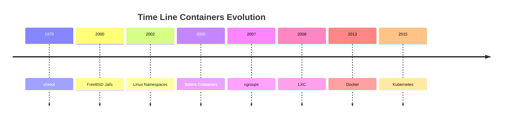

<h1><a name="readme-top"></a></h1>

[](https://github.com/marcossilvestrini/learning-lpic-3-305-300/actions/workflows/release.yml)[](https://github.com/marcossilvestrini/learning-lpic-3-305-300/actions/workflows/translate.yml)[](https://github.com/marcossilvestrini/learning-lpic-3-305-300/actions/workflows/generate-html.yml)[](https://github.com/marcossilvestrini/learning-lpic-3-305-300/actions/workflows/deploy-webpage.yml)[](https://github.com/marcossilvestrini/learning-lpic-3-305-300/actions/workflows/powershell.yml)[](https://github.com/marcossilvestrini/learning-lpic-3-305-300/actions/workflows/slack.yml)

* * *

[![MIT License][license-shield]][license-url][![Forks][forks-shield]][forks-url][![Stargazers][stars-shield]][stars-url][![Contributors][contributors-shield]][contributors-url][![Issues][issues-shield]][issues-url][![LinkedIn][linkedin-shield]][linkedin-url]

* * *

# LPIC-3 305-300の学習


<p align="center">
<strong>Explore the docs »</strong></a>
    <br />
    <a href="https://marcossilvestrini.github.io/learning-lpic-3-305-300/">Web Site</a>
    -
    <a href="https://github.com/marcossilvestrini/learning-lpic-3-305-300">Code Page</a>
    -
    <a href="https://github.com/marcossilvestrini/learning-lpic-3-305-300/issues">Report Bug</a>
    -
    <a href="https://github.com/marcossilvestrini/learning-lpic-3-305-300/issues">Request Feature</a>
</p>

* * *

## まとめ

<details>
  <summary><b>TABLE OF CONTENT</b></summary>
  <ol>
    <li>
      <a href="#about-the-project">About The Project</a>
    </li>
    <li>
      <a href="#getting-started">Getting Started</a>
      <ul>
        <li><a href="#prerequisites">Prerequisites</a></li>
        <li><a href="#installation">installation</a></li>
      </ul>
    </li>
    <li><a href="#usage">Usage</a></li>
    <li><a href="#roadmap">Roadmap</a></li>
    <li><a href="#freedoms">Four Essential Freedoms</a></li>
    <li>
      <a href="#topic-351">Topic 351: Full Virtualization</a>
      <ul>
        <li><a href="#topic-351.1">351.1 Virtualization Concepts and Theory </a></li>
        <li><a href="#topic-351.2">351.2 Xen</a></li>
        <li><a href="#topic-351.3">351.3 QEMU</a></li>
        <li><a href="#topic-351.4">351.4 Libvirt Virtual Machine</a></li>
        <li><a href="#topic-351.5">351.5 Virtual Machine Disk Image Management</a></li>
      </ul>
    </li>
    <li>
      <a href="#topic-352">Topic 352: Container Virtualization</a>
      <ul>
        <li><a href="#topic-352.1">352.1 Container Virtualization Concepts</a></li>
        <li><a href="#topic-352.2">352.2 LXC</a></li>
        <li><a href="#topic-352.3">352.3 Docker</a></li>
        <li><a href="#topic-352.4">352.4 Container Orchestration Platforms</a></li>
      </ul>
    </li>
    <li>
      <a href="#topic-353">Topic 353: VM Deployment and Provisioning</a>
      <ul>
        <li><a href="#topic-353.1">353.1 Cloud Management Tools</a></li>
        <li><a href="#topic-353.2">353.2 Packer</a></li>
        <li><a href="#topic-353.3">353.3 cloud-init</a></li>
        <li><a href="#topic-353.4">353.4 Vagrant</a></li>
      </ul>
    </li>
    <li><a href="#license">License</a></li>
    <li><a href="#contact">Contact</a></li>
    <li><a href="#acknowledgments">Acknowledgments</a></li>
  </ol>
</details><br>

* * *

<a name="about-the-project"></a>

## プロジェクトについて

> このプロジェクトは、学生や専門家がGnulinuxの主な概念を学ぶのを支援することを目指しています
> およびフリーソフトウェア\\
> DebianやRPMのようないくつかのGnulinux分布はカバーされます\\
> 一部のパッケージのインストールと構成もカバーされます\\
> これを行うことで、コミュニティ全体にあなたの変更から利益を得る機会を与えることができます。\\
> ソースコードへのアクセスは、これの前提条件です。\\
> この記事では、UPマシンにVagrantを使用し、ラボを実行し、コンテンツを練習します。\\
> 私はフォルダーVagrantに公開しましたvagrantFileが必要なものを\\
> 研究のために環境をアップロードするために

* * *

<p align="right">(<a href="#readme-top">back to top</a>)</p>

<a name="getting-started"></a>

## はじめる

学習を開始するには、上記のドキュメントを参照してください。

<a name="prerequisites"></a>

### 前提条件

-   [git](https://git-scm.com/book/en/v2/Getting-Started-Installing-Git)
-   [VMwareワークステーション](https://blogs.vmware.com/workstation/2024/05/vmware-workstation-pro-now-available-free-for-personal-use.html)
-   [Vagrant VMwareユーティリティ](https://developer.hashicorp.com/vagrant/install/vmware)
-   [Vagrant](https://developer.hashicorp.com/vagrant/install)

<a name="installation"></a>

### インストール

レポをクローンします

```sh
git clone https://github.com/marcossilvestrini/learning-lpic-3-305-300.git
cd learning-lpic-3-305-300
```

テンプレートをカスタマイズします_vagrantfile-topic-xxx_。このファイルには、ラボ用のVMS構成が含まれています。例：

-   ファイル[vagrantfile-topic-351](./vagrant/Vagrantfile-topic-351)
    -   vm.clone_directory = "&lt;your_driver_letter>：\\<folder>\\&lt;to_machine>\\＃{vm_name} -instance-1 "
        例：vm.clone_directory = "e：\\サーバー\\vmware\\＃{vm_name} -instance-1 "
    -   vm.vmx[「Memsize」"]= ""
    -   vm.vmx[「numvcpus」"]= ""
    -   vm.vmx[「cpuid"correspersocout」.]= ""

ファイルでネットワーク構成をカスタマイズします[構成/ネットワーク](configs/network/).

* * *

<a name="usage"></a>

## 使用法

このリポジトリを使用して、LPIC-3 305-300試験について学習します

### 上下に

スイッチa_vagrantfile-topic-xxx_名前の新しいファイルのテンプレートとコピー_vagrantfile_

```sh
cd vagrant && vagrant up
cd vagrant && vagrant destroy -f
```

### VMSを再起動するため

```sh
cd vagrant && vagrant reload
```

**重要：**_VMSを使用せずにVMSを再起動する場合、ブート後にマウントされていない共有フォルダー。_

### 上下にPowerShellを使用します

Windowsプラットフォームを使用する場合、VMSの上下にPowerShellスクリプトを作成します。

```powershell
vagrant/up.ps1
vagrant/destroy.ps1
```

### インフラストラクチャスキーマトピック351


<p align="right">(<a href="#readme-top">back to top</a>)</p>

* * *

<a name="roadmap"></a>

## ロードマップ

-   [x] リポジトリを作成します
-   [x] ラボのプロビジョニング用のスクリプトを作成します
-   [x] トピック351に関する例を作成します
-   [ ] トピック352に関する例を作成します
-   [ ] トピック353に関する例を作成します
-   [ ] シミュレートされたiTexamをアップロードします

* * *

<a name="freedoms"></a>

## 4つの本質的な自由

> 0.あなたが望むようにプログラムを実行する自由、あらゆる目的のために（自由0）。\\
> 1.プログラムがどのように機能するかを研究し、それを変更する自由が\\
> あなたが望むようにあなたのコンピューティング（自由1）。\\
> ソースコードへのアクセスは、これの前提条件です。\\
> 2.他の人を助けることができるようにコピーを再配布する自由（自由2）。\\
> 3.修正されたバージョンのコピーを他の人に配布するためのFreedom（Freedom 3）。

* * *

## コマンドを検査します

```sh
type COMMAND
apropos COMMAND
whatis COMMAND --long
whereis COMMAND
COMMAND --help, --h
man COMMAND
```

<p align="right">(<a href="#readme-top">back to top</a>)</p>

* * *

<a name="topic-351"></a>

## トピック351：完全な仮想化


* * *

<a name="topic-351.1"></a>

### 351.1仮想化の概念と理論

**重さ：**6

**説明：**候補者は、仮想化の一般的な概念、理論、用語を知り、理解する必要があります。これには、Xen、Qemu、Libvirtの用語が含まれます。

**重要な知識領域：**

-   ∎仮想化用語を理解する
-   ⚖§仮想化の長所と短所を理解します
-   Hypervisorsと仮想マシンモニターのさまざまなバリエーションを理解する
-   showmenthy Physical Machinesから仮想マシンへの移行の主要な側面を理解する
-   hostホストシステム間で仮想マシンを移行する主要な側面を理解する
-   snapshotting、一時停止、クローニング、リソースの制限など、仮想マシンの仮想化の機能と意味を理解する
-   ovir、ovirt、proxmox、systemd-machined、virtualboxの認識
-   openオープンVswitchの認識

#### 351.1引用されたオブジェクト

```sh
Hypervisor
Hardware Virtual Machine (HVM)
Paravirtualization (PV)
Emulation and Simulation
CPU flags
/proc/cpuinfo
Migration (P2V, V2V)
```

#### ハイパーバイザー

##### タイプ1ハイパーバイザー（ベアメタルハイパーバイザー）

###### タイプ1定義

ホストの物理的なハードウェアで直接実行され、ホストオペレーティングシステムを必要とせずにVMを管理するためのベースレイヤーを提供します。

###### タイプ1の特性

-   ⚡高性能と効率。
-   daverレイテンシとオーバーヘッドが低い。
-   courseエンタープライズ環境とデータセンターでよく使用されます。

###### タイプ1の例

-   VMware ESXI：エンタープライズ設定で堅牢で広く使用されているハイパーバイザー。
-   Microsoft Hyper-V：Windows Serverと統合され、強力なパフォーマンスと管理機能を提供します。
-   Xen：多くのクラウドサービスプロバイダーが使用するオープンソースハイパーバイザー。
-   KVM（カーネルベースの仮想マシン）：Linuxカーネルに統合され、Linuxベースのシステムに高性能を提供します。

##### タイプ2ハイパーバイザー（ホストされたハイパーバイザー）

###### タイプ2の定義

リソース管理とデバイスサポートのためにホストOSに依存して、従来のオペレーティングシステムの上で実行されます。

###### タイプ2の特性

-   特にパーソナルコンピューターでは、セットアップと使用が簡単です。
-   development開発、テスト、および小規模の展開により柔軟に対応します。
-   host Host OSからの追加オーバーヘッドにより、通常、タイプ1ハイパーバイザーよりも効率が低くなります。

###### タイプ2の例

-   VMwareワークステーション：単一のデスクトップで複数のオペレーティングシステムを実行するための強力なハイパーバイザー。
-   Oracle VirtualBox：柔軟性と使いやすさで知られているオープンソースハイパーバイザー。
-   Parallels Desktop：MacユーザーがMacOSと一緒にWindowsやその他のオペレーティングシステムを実行するように設計されています。
-   QEMU（クイックエミュレータ）：KVMと組み合わせてよく使用されるオープンソースエミュレーターと仮想イザー。

##### タイプ1とタイプ2のハイパーバイザーの主な違い

-   展開環境：
    -   タイプ1のハイパーバイザーは、ハードウェアとの直接的な相互作用と高性能のため、一般にデータセンターとエンタープライズ環境に展開されます。
    -   タイプ2のハイパーバイザーは、個人使用、開発、テスト、および小規模な仮想化タスクにより適しています。
-   パフォーマンス：
    -   タイプ1のハイパーバイザーは、通常、ホストOSに依存していないため、パフォーマンスが向上し、遅延が低くなります。
    -   タイプ2のハイパーバイザーは、ホストOSの上でのランニングのオーバーヘッドにより、パフォーマンスの劣化が発生する場合があります。
-   管理と使いやすさ：
    -   タイプ1のハイパーバイザーは、より複雑なセットアップと管理が必要ですが、大規模な展開には高度な機能とスケーラビリティを提供します。
    -   タイプ2のハイパーバイザーは、インストールと使用が簡単で、個々のユーザーや小規模なプロジェクトに最適です。

##### 移行タイプ

仮想マシンの作成と管理に使用されるテクノロジーであるハイパーバイザーのコンテキストでは、仮想化環境ではP2V移行とV2Vの移行という用語が一般的です。  
それらは、さまざまなタイプのプラットフォーム間の移行システムのプロセスを指します。

##### P2V-物理的から仮想移行

P2V移行とは、物理サーバーを仮想マシンに移行するプロセスを指します。  
言い換えれば、専用の物理ハードウェアで実行されるオペレーティングシステムとそのアプリケーションは「変換」され、ハイパーバイザー（VMware、Hyper-V、KVMなど）で実行される仮想マシンに移動します。

-   例：WindowsまたはLinuxシステムを実行している物理サーバーがあり、クラウドインフラストラクチャや内部仮想化サーバーなどの仮想環境に移動する必要があります。  
    このプロセスでは、オペレーティングシステム、ドライバー、データを含むシステム状態全体をコピーして、物理ハードウェア上で実行できるように実行できる同等の仮想マシンを作成します。

##### V2V-仮想から仮想移行

V2V移行とは、仮想マシンをあるハイパーバイザーから別のハイパーバイザーに移行するプロセスを指します。  
この場合、仮想化された環境（VMwareなど）で実行されている仮想マシンが既にあり、別の仮想化環境（たとえば、Hyper-Vや新しいVMwareサーバー）に移動する必要があります。

-   例：VMware Virtualization Serverで実行されている仮想マシンがありますが、Hyper-Vプラットフォームに移行することにします。この場合、V2V移行は仮想マシンをある形式またはハイパーバイザーから別の形式に変換し、正しく実行を続けることができるようにします。

#### HVMと傍観的化

##### ハードウェアアシスト仮想化（HVM）

###### HVM定義

HVMは、最新のCPUが提供するハードウェア拡張機能を活用してハードウェアを仮想化し、最小限のパフォーマンスオーバーヘッドでVMの作成と管理を可能にします。

###### HVMキー特性

-   🖥️**ハードウェアサポート**：Intel VT-XやAMD-Vなどの仮想化拡張機能のCPUサポートが必要です。
-   🛠️**完全な仮想化：**ハイパーバイザーはハードウェア環境の完全なエミュレーションを提供するため、VMSは変更されていないゲストオペレーティングシステムを実行できます。
-   ⚡**パフォーマンス：**通常、CPUでゲストコードを直接実行するため、ネイティブに近いパフォーマンスを提供します。
-   🔒**分離：**各VMは、独自の専用ハードウェアを持っているかのように動作するため、VM間で強力な分離を提供します。

###### HVMの例

VMware ESXI、Microsoft Hyper-V、KVM（カーネルベースの仮想マシン）。

###### HVMの利点

-   ✅**互換性：**変更なしで任意のオペレーティングシステムを実行できます。
-   ⚡**パフォーマンス：**ハードウェアサポートによる高性能。
-   🔒**安全：**ハードウェアが提供する拡張分離およびセキュリティ機能。

###### HVM短所

-   🛠️**ハードウェア依存関係：**特定のハードウェア機能が必要であり、古いシステムとの互換性を制限します。
-   🔧**複雑：**より複雑な構成と管理が含まれる場合があります。

##### 官報化

###### Paravirtualizationの定義

Paravirtualizationには、ゲストオペレーティングシステムを変更して仮想環境を認識し、ハイパーバイザーとより効率的に相互作用できるようにします。

###### 視床化の重要な特性

-   🛠️**ゲストの変更：**ハイパーコールを使用してハイパーバイザーと直接通信するために、ゲストオペレーティングシステムの変更が必要です。
-   ⚡**パフォーマンス：**エミュレートハードウェアに関連するオーバーヘッドを削減するため、従来の完全な仮想化よりも効率的です。
-   🔗**互換性：**傍観的化のために変更されたオペレーティングシステムに限定されています。

###### 傍観的な例

Paravirtualized Guests、特定の構成のVMwareツール、およびいくつかのKVM構成を備えたXen。

###### 対paravirtualizationの利点

-   ⚡**効率：**仮想化ハードウェアのオーバーヘッドを減らし、特定のワークロードのパフォーマンスを向上させる可能性があります。
-   ✅**リソース利用：**ゲストOSとハイパーバイザー間の直接通信により、システムリソースのより効率的な使用。

###### Paravirtualization Disdvantages

-   🛠️**ゲストOSの変更：**ゲストOSの変更が必要であり、サポートされているオペレーティングシステムへの互換性を制限します。
-   🔧**複雑：**HyperCallの実装には、ゲストOSの追加の複雑さが必要です。

##### 重要な違い

###### ゲストOS要件

-   **HVM：**変更されていないゲストオペレーティングシステムを実行できます。
-   **paravirtualization：**ゲストオペレーティングシステムを変更して、ハイパーバイザーと連携する必要があります。

###### パフォーマンス

-   **HVM：**通常、ハードウェア支援の実行により、ネイティブに近いパフォーマンスを提供します。
-   **paravirtualization：**ハードウェアエミュレーションのオーバーヘッドを削減することで効率的なパフォーマンスを提供できますが、変更されたゲストOSに依存しています。

###### ハードウェアの依存関係

-   **HVM：**特定のCPU機能（Intel VT-X、AMD-V）が必要です。
-   **paravirtualization：**特定のCPU機能は必要ありませんが、変更されたゲストOSが必要です。

###### 分離

-   **HVM：**ハードウェア機能を使用して強力な分離を提供します。
-   **paravirtualization：**ソフトウェアベースの分離に依存しています。これは、ハードウェアベースの分離ほど堅牢ではない場合があります。

###### 複雑

-   **HVM：**一般に、変更されていないOSをサポートするため、展開がより簡単です。
-   **paravirtualization：**ゲストOSに追加のセットアップと変更が必要であり、複雑さが増します。

#### numa（不均一なメモリアクセス）

numa（不均一なメモリアクセス）は、プロセッサによるメモリアクセスを最適化するためにマルチプロセッサシステムで使用されるメモリアーキテクチャです。  
numaシステムでは、メモリはプロセッサ間で不均一に分散されています。つまり、各プロセッサは、物理的に遠く（「リモートメモリ」と呼ばれる）、他のプロセッサに関連付けられているメモリ（「ローカルメモリ」）へのアクセスが高速であることを意味します。

##### numaアーキテクチャの重要な機能

1.  **ローカルおよびリモートメモリ**：各プロセッサには独自のローカルメモリがあり、より迅速にアクセスできます。ただし、他のプロセッサのメモリにアクセスすることもできますが、これには時間がかかります。
2.  **差別化されたレイテンシ**：メモリアクセスの遅延は、プロセッサがローカルメモリにアクセスしているか、別のノードのメモリにアクセスしているかによって異なります。ローカルメモリアクセスはより速くなりますが、別のノードのメモリ（リモート）へのアクセスは遅くなります。
3.  **スケーラビリティ**：numaアーキテクチャは、多くのプロセッサを使用してシステムのスケーラビリティを向上させるように設計されています。より多くのプロセッサが追加されると、メモリも配布され、均一なメモリアクセス（UMA）アーキテクチャで発生するボトルネックを避けます。

##### Numaの利点

-   ingar大規模システムでのパフォーマンスの向上：各プロセッサにはローカルメモリがあるため、メモリアクセスのために他のプロセッサと競合することなく、より効率的に動作できます。
-   📈スケーラビリティ：NUMAは、多くのプロセッサと大量のメモリを備えたシステムを、UMAアーキテクチャと比較してより効果的にスケーリングできるようにします。

##### 短所

-   🛠️プログラミングの複雑さ：プログラマーは、どのメモリの領域がローカルまたはリモートであるかを認識する必要があり、ローカルメモリの使用を最適化してパフォーマンスを向上させます。
-   coption潜在的なパフォーマンスペナルティ：プロセッサがリモートメモリに頻繁にアクセスする場合、遅延が高いためにパフォーマンスが低下する可能性があります。
    このアーキテクチャは、スケーラビリティとメモリの最適化が重要なサーバーやスーパーコンピューターなどの高性能マルチプロセッサシステムで一般的です。

#### OpenSourceソリューション

-   ovirt：<https://www.ovirt.org/>

-   🌐proxmox：<https://www.proxmox.com/en/proxmox-virtual-environment/overview>

-   🌐Oracle VirtualBox：<https://www.virtualbox.org/>

-   🌐オープンvswitch：<https://www.openvswitch.org/>

#### 仮想化の種類

##### ハードウェア仮想化（サーバー仮想化）

###### HV定義

物理的なハードウェアを要約して、個別のオペレーティングシステムとアプリケーションを実行する仮想マシン（VM）を作成します。

###### HVユースケース

データセンター、クラウドコンピューティング、サーバーの統合。

###### HVの例

VMware ESXi、Microsoft Hyper-V、KVM。

##### オペレーティングシステム仮想化（コンテナ化）

###### コンテナ化定義

複数の分離されたユーザー空間インスタンス（コンテナ）が単一のOSカーネルで実行されるようにします。

###### コンテナ化ユースケース

マイクロサービスアーキテクチャ、開発、テスト環境。

###### コンテナ化の例

Docker、Kubernetes、LXC。

##### ネットワーク仮想化

###### ネットワーク仮想化の定義

ハードウェアとソフトウェアのネットワークリソースを、単一のソフトウェアベースの管理エンティティに組み合わせます。

###### ネットワーク仮想化ユースケース

ソフトウェア定義ネットワーク（SDN）、ネットワーク機能仮想化（NFV）。

###### ネットワーク仮想化の例

VMware NSX、Cisco ACI、OpenStack Neutron。

##### ストレージ仮想化

###### ストレージ仮想化の定義

複数のデバイスから物理的なストレージをプールして、中央に管理できる単一の仮想ストレージユニットにプールします。

###### ストレージ仮想化定義のユースケース

データ管理、ストレージの最適化、災害復旧。

###### ストレージ仮想化定義の例

IBM SANボリュームコントローラー、VMware VSAN、NetApp ONTAP。

##### デスクトップ仮想化

###### デスクトップ仮想化定義

デスクトップオペレーティングシステムは、サーバーでホストされている仮想マシンで実行できます。

###### デスクトップ仮想化定義のユースケース

仮想デスクトップインフラストラクチャ（VDI）、リモートワークソリューション。

###### デスクトップ仮想化定義の例

Citrix仮想アプリとデスクトップ、VMware Horizo​​n、Microsoftリモートデスクトップサービス。

##### アプリケーション仮想化

###### アプリケーション仮想化定義

アプリケーションを基礎となるハードウェアおよびオペレーティングシステムから分離し、孤立した環境で実行できるようにします。

###### アプリケーション仮想化定義のユースケース

簡略化されたアプリケーションの展開、互換性テスト。

###### アプリケーション仮想化定義の例

VMware ThinApp、Microsoft App-V、Citrix XenApp。

##### データ仮想化

###### データ仮想化の定義

物理的に統合することなく、さまざまなソースからのデータを統合し、分析とレポートの統一ビューを提供します。

###### データ仮想化定義のユースケース

ビジネスインテリジェンス、リアルタイムデータ統合。

###### データ仮想化定義の例

Denodo、Red Hat JBossデータ仮想化、IBM Infosphere。

##### 仮想化の利点

-   ⚡リソース効率：物理リソースのより良い利用。
-   コスト削減：ハードウェアと運用コストの削減。
-   scalabilityスケーラビリティ：需要に応じて簡単に縮小または下がります。
-   flex性：さまざまなワークロードとアプリケーションをサポートします。
-   災害復旧：簡素化されたバックアップおよび回復プロセス。
-   🔒分離：環境の分離によるセキュリティの改善。

#### エミュレーション

エミュレーションには、当初の目的とは異なるプラットフォームでハードウェアまたはソフトウェアの動作をシミュレートすることが含まれます。

このプロセスにより、あるシステムが異なるアーキテクチャや動作環境を持つ可能性のある別のシステムで実行されるソフトウェアが設計されています。

エミュレーションは、変更されていないゲストオペレーティングシステムまたはアプリケーションの実行を可能にすることで汎用性を提供しますが、多くの場合、パフォーマンスオーバーヘッドが付属しています。

エミュレートされたシステムは、元のシステムをホストシステムと互換性のある命令に対象とした命令を解釈および翻訳する必要があるため、このオーバーヘッドが発生します。その結果、エミュレーションはネイティブの実行よりも遅くなる可能性があり、リソース集約型タスクの効率が低下します。

この欠点にもかかわらず、エミュレーションは、レガシーソフトウェアを実行し、さまざまなプラットフォームでアプリケーションをテストし、クロスプラットフォーム開発の促進に役立ちます。

#### SystemDマシン

SystemD-Machinedサービスは、SystemDエコシステム内の仮想マシンとコンテナの管理に専念しています。
 仮想インスタンスを制御、監視、維持するための重要な機能を提供し、Linux環境内で堅牢な統合と効率を提供します。

<p align="right">(<a href="#topic-351.1">back to sub Topic 351.1</a>)</p>
<p align="right">(<a href="#topic-351">back to Topic 351</a>)</p>
<p align="right">(<a href="#readme-top">back to top</a>)</p>

* * *

<a name="topic-351.2"></a>

### 351.2交互


**重さ：**3

**説明：**候補者は、XENのインストールをインストール、構成、保守、移行、およびトラブルシューティングできる必要があります。焦点はXenバージョン4.xにあります。

**重要な知識領域：**

-   ネットワーキングやストレージなど、Xenのアーキテクチャを理解します
-   Xenノードとドメインの基本的な構成
-   Xenノードとドメインの基本管理
-   XENインストールの基本的なトラブルシューティング
-   丸薬から離れたアバリン
-   Xenstoreの認識
-   Xenブートパラメーターの認識
-   XMユーティリティの認識

#### 代替


Xenは、オープンソースタイプ1（裸のメタル）ハイパーバイザーであり、複数のオペレーティングシステムが同じ物理ハードウェアで同時に実行できるようにします。  
Xenは、物理ハードウェアと仮想マシン（VM）の間にレイヤーを提供し、効率的なリソース共有と分離を可能にします。

-   **建築：**Xenは、ドメイン0（DOM0）が直接ハードウェアアクセスを備えた特権ドメインであり、ハイパーバイザーを管理する2層システムで動作します。ドメインu（domu）と呼ばれる他の仮想マシンは、ゲストオペレーティングシステムを実行し、dom0によって管理されています。
-   **仮想化の種類：**Xenは、修正されたゲストOSを必要とするParavirtualization（PV）と、ハードウェアエクステンション（Intel VT-XまたはAMD-Vなど）を使用して未修正のゲストオペレーティングシステムを実行するハードウェアアシスト仮想化（HVM）の両方をサポートします。
    Xenは、特にAmazon Web Services（AWS）およびその他の大規模なクラウドプロバイダーによって、クラウド環境で広く使用されています。

#### xensource

Xensourceは、ケンブリッジ大学のXenハイパーバイザーの元の開発者によって設立された同社であり、Xenを商業化しました。  
同社はXenに基づいてエンタープライズソリューションを提供し、エンタープライズの使用にXenの機能を強化するための追加のツールとサポートを提供しました。

-   **Citrixによる買収**：2007年、XensourceはCitrix Systems、Inc。に買収されました。Citrixは、Xen TechnologyをCitrix Xenserver製品の基礎として使用しました。
-   **遷移**：買収後、Xenプロジェクトはオープンソースプロジェクトとして継続され、CitrixはXenserverなどの商用製品に焦点を当て、Xensourceテクノロジーを活用しました。

#### xenプロジェクト

Xen Projectとは、商業化後のXenハイパーバイザーの開発と維持を担当するオープンソースコミュニティとイニシアチブを指します。  
Xenプロジェクトは、Linux Foundationの下で運営されており、Xenの構築、改善、および共同のコミュニティ主導の努力としてのサポートに重点を置いています。

-   **目標：**XENプロジェクトは、クラウドコンピューティング、セキュリティ中心の仮想化（QUBES OSなど）、組み込みシステムなど、幅広いユースケースのパフォーマンス、セキュリティ、および機能セットを改善することにより、ハイパーバイザーを前進させることを目的としています。
-   **貢献者：**このプロジェクトには、主要なクラウドプロバイダー、ハードウェアベンダー、独立した開発者など、さまざまな組織の貢献者が含まれています。
-   **ピルとヘドール：**Xenプロジェクトには、XAPI（Xenapi）などのツールにも含まれています。これは、Xenハイパーバイザーのインストールの管理に使用され、システム管理と最適化のための他のさまざまなユーティリティが含まれています。

#### xenstore

Xenストアは、Xenハイパーバイザーの重要なコンポーネントです。  
基本的に、Xenストアは、Xenハイパーバイザーとそれが管理する仮想マシン（ドメインとも呼ばれる）間の通信と情報共有に使用される分散キー価値データベースです。

Xenストアのいくつかの重要な側面は次のとおりです。

-   **ドメイン間コミュニケーション：**Xenストアでは、Dom0（ハードウェアリソースを制御する特権ドメイン）やDomus（VMSであるユーザードメイン）などのドメイン間の通信を可能にします。これは、各ドメインが情報を読み書きできるキー価値エントリを介して行われます。

-   **構成管理：**仮想デバイス、ネットワーク、ブートパラメーターなどの構成情報を保存およびアクセスするために使用されます。これにより、VMの動的管理と構成が容易になります。

-   **イベントと通知：**Xen Storeは、イベント通知もサポートしています。 Xenストアの特定のキーまたは値が変更されると、これらの変更に反応するように関心のあるドメインを通知できます。これは、リソースの監視と管理に役立ちます。

-   Simple API：Xen Storeは、データを読み書きするためのシンプルなAPIを提供し、開発者がアプリケーションをXen仮想化システムと簡単に統合できるようにします。

#### ピル

XAPIまたはXenapiは、Xenハイパーバイザーとその仮想マシン（VM）の管理に使用されるアプリケーションプログラミングインターフェイス（API）です。  
Xapiは、XenServer（現在はCitrix Hypervisorとして知られている）の重要なコンポーネントであり、VMの作成、構成、監視、制御などの操作を実行するためにXenハイパーバイザーと対話する標準化された方法を提供します。

XAPIのいくつかの重要な側面は次のとおりです。

-   **VM管理：**XAPIを使用すると、管理者は仮想マシンをプログラム的に作成、削除、開始、および停止できます。

-   **オートメーション：**XAPIを使用すると、ネットワーキング、ストレージ、コンピューティングなどの仮想リソースの管理を自動化することができます。これは、大規模なクラウド環境にとって重要です。

-   **統合：**XAPIは他のツールやスクリプトと統合して、XEN環境のより効率的でカスタマイズされた管理を提供できます。

-   **アクセス制御：**XAPIは、認定ユーザーのみが仮想環境で特定の操作を実行できるようにするためのアクセス制御メカニズムも提供します。

XAPIは、Xenハイパーバイザーの制御と自動化を可能にするインターフェイスであり、仮想化された環境の管理を容易にします。

#### xenサマリー

-   **間散布：**コアハイパーバイザー技術により、仮想マシンが物理ハードウェアで実行できるようにします。
-   **Xensource：**Xenを商業化した会社は、後にCitrixに買収され、Citrix Xenserverの開発につながりました。
-   **xenプロジェクト：**Linux Foundationの下でXenハイパーバイザーの開発と維持を続けるオープンソースのイニシアチブとコミュニティ。
-   **xenstore：**Xen Storeは、XenハイパーバイザーとVMの間の通信および構成の仲介として機能し、仮想化された環境の動作と管理を合理化します。
-   **ピル**Xenハイパーバイザーの制御と自動化を可能にするインターフェイスであり、仮想化された環境の管理を容易にします。

#### domain0（dom0）

domain0またはdom0は、XENアーキテクチャの制御ドメインです。他のドメイン（Domus）を管理し、ハードウェアに直接アクセスできます。  
Dom0はデバイスドライバーを実行し、直接ハードウェアアクセスを欠いているDomusがデバイスと通信できるようにします。通常、Linuxのようなオペレーティングシステムの完全なインスタンスであり、Xenハイパーバイザー操作には不可欠です。

#### ドメイン（家）

Domusは、仮想マシンを実行する非主権ドメインです。  
それらはdom0によって管理されており、ハードウェアに直接アクセスできません。 Domusは、さまざまなオペレーティングシステムを実行するように構成でき、アプリケーションサーバーや開発環境など、さまざまな目的に使用できます。彼らは、ハードウェアの相互作用のためにdom0に依存しています。

#### Peewee-Dom（Paravardiyed Domina）

pv-domus paravirtualizationという手法を使用します。このモデルでは、DOMUオペレーティングシステムは、仮想化された環境で実行されることを認識するように変更されており、最適化されたパフォーマンスのためにハイパーバイザーと直接通信できるようにします。  
これにより、完全な仮想化と比較して、オーバーヘッドが低くなり、効率が向上します。

#### HVM-DOMU（ハードウェア仮想マシンドメイン）

HVM-Domusは、完全な仮想化を利用する仮想マシンであり、変更されていないオペレーティングシステムを実行できます。 Xenハイパーバイザーは、これらのドムスにハードウェアエミュレーションを提供し、基礎となるハードウェアアーキテクチャをサポートするオペレーティングシステムを実行できるようにします。  
これにより柔軟性が高まりますが、PV-Domusと比較してオーバーヘッドが高くなる可能性があります。

#### xenネットワーク

Paravirtualised Networkデバイス

ブリッジング

#### 351.2引用されたオブジェクト

```sh
Domain0 (Dom0), DomainU (DomU)
PV-DomU, HVM-DomU
/etc/xen/
xl
xl.cfg 
xl.conf # Xen global configurations
xentop
oxenstored # Xenstore configurations
```

#### 351.2ノート

```sh

# Xen Settings
/etc/xen/
/etc/xen/xl.conf - Main general configuration file for Xen
/etc/xen/oxenstored.conf - Xenstore configurations

# VM Configurations
/etc/xen/xlexample.pvlinux
/etc/xen/xlexample.hvm

# Service Configurations
/etc/default/xen
/etc/default/xendomains

# xen-tools configurations
/etc/xen-tools/
/usr/share/xen-tools/

# docs
xl(1)
xl.conf(5)
xlcpupool.cfg(5)
xl-disk-configuration(5)
xl-network-configuration(5)
xen-tscmode(7)

# initialized domains auto
/etc/default/xendomains
   XENDOMAINS_AUTO=/etc/xen/auto

/etc/xen/auto/


# set domain for up after xen reboot
## create folder auto
cd /etc/xen && mkdir -p auto && cd auto

# create simbolic link
ln -s /etc/xen/lpic3-pv-guest /etc/xen/auto/lpic3-pv-guest
```

#### 351.2重要なコマンド

##### xen-create-image

```sh
# create a pv image
xen-create-image \
  --hostname=lpic3-pv-guest \
  --memory=1gb \
  --vcpus=2 \
  --lvm=vg_xen \
  --bridge=xenbr0 \
  --dhcp \
  --pygrub \
  --password=vagrant \
  --dist=bookworm
```

##### xen-list-images

```sh
# list image
xen-list-image
```

##### xen-delete-image

```sh
# delete a pv image
xen-delete-image lpic3-pv-guest --lvm=vg_xen
```

##### xenstore-ls

```sh
# list xenstore infos
xenstore-ls
```

##### XL

```sh
# view xen information
xl infos

# list Domains
xl list
xl list lpic3-hvm-guest
xl list lpic3-hvm-guest -l

# uptime Domains
xl uptime

# pause Domain
xl pause 2
xl pause lpic3-hvm-guest

# save state Domains
xl -v save lpic3-hvm-guest ~root/image-lpic3-hvm-guest.save

# restore Domain
xl restore /root/image-lpic3-hvm-guest.save

# get Domain name
xl domname 2

# view dmesg information
xl dmesg

# monitoring domain
xl top
xentop
xen top

# Limit mem Dom0
xl mem-set 0 2048

# Limite cpu (not permanent after boot)
xl vcpu-set 0 2

# create DomainU - virtual machine
xl create /etc/xen/lpic3-pv-guest.cfg

# create DomainU virtual machine and connect to guest
xl create -c /etc/xen/lpic3-pv-guest.cfg

##----------------------------------------------
# create DomainU virtual machine HVM

## create logical volume
lvcreate -l +20%FREE -n lpic3-hvm-guest-disk  vg_xen

## create a ssh tunel for vnc
ssh -l vagrant -L 5900:localhost:5900  192.168.0.130

## configure /etc/xen/lpic3-hvm-guest.cfg
## set boot for cdrom: boot = "d"

## create domain hvm
xl create /etc/xen/lpic3-hvm-guest.cfg

## open vcn conection in your vnc client with localhost
## for view install details

## after installation finished, destroy domain: xl destroy <id_or_name>

## set /etc/xen/lpic3-hvm-guest.cfg: boot for hard disc: boot = "c"

## create domain hvm
xl create /etc/xen/lpic3-hvm-guest.cfg

## access domain hvm
xl console <id_or_name>
##----------------------------------------------

# connect in domain guest
xl console <id>|<name> (press enter)
xl console 1
xl console lpic3-pv-guest

#How do I exit domU "xl console" session
#Press ctrl+] or if you're using Putty press ctrl+5.

# Poweroff domain
xl shutdown lpic3-pv-guest

# destroy domain
xl destroy lpic3-pv-guest

# reboot domain
xl reboot lpic3-pv-guest

# list block devices
xl block-list 1
xl block-list lpic3-pv-guest

# detach block devices
xl block-detach lpic3-hvm-guest hdc
xl block-detach 2 xvdc

# attach block devices

## hard disk devices
xl block-attach lpic3-hvm-guest-ubuntu 'phy:/dev/vg_xen/lpic3-hvm-guest-disk2,xvde,w'

## cdrom
xl block-attach lpic3-hvm-guest 'file:/home/vagrant/isos/ubuntu/seed.iso,xvdc:cdrom,r'
xl block-attach 2 'file:/home/vagrant/isos/ubuntu/seed.iso,xvdc:cdrom,r'

# insert and eject cdrom devices
xl cd-insert lpic3-hvm-guest-ubuntu xvdb  /home/vagrant/isos/ubuntu/ubuntu-24.04.1-live-server-amd64.iso
xl cd-eject lpic3-hvm-guest-ubuntu xvdb
```

#### 251.2ノート

##### vif

Xenでは、「VIF」は仮想インターフェイスの略で、仮想マシン（ドメイン）のネットワークの構成に使用されます。

ドメイン構成ファイルに「VIF」ディレクティブを指定することにより、管理者はネットワークインターフェイスを定義し、IPアドレスを割り当て、VLANを設定し、XENホストで実行されている仮想マシンの他のネットワークパラメーターを構成できます。例：vif =[「ブリッジ= xenbr0」]、この場合、VMのネットワークインターフェイスを「xenbr0」という名前のxenブリッジに接続します。

````sh

<p align="right">(<a href="#topic-351.2">back to sub Topic 351.2</a>)</p>
<p align="right">(<a href="#topic-351">back to Topic 351</a>)</p>
<p align="right">(<a href="#readme-top">back to top</a>)</p>

---

<a name="topic-351.3"></a>

### 351.3 QEMU


**Weight:** 4

**Description:** Candidates should be able to install, configure, maintain, migrate and troubleshoot QEMU installations.

**Key Knowledge Areas:**

* Understand the architecture of QEMU, including KVM, networking and storage
* Start QEMU instances from the command line
* Manage snapshots using the QEMU monitor
* Install the QEMU Guest Agent and VirtIO device drivers
* Troubleshoot QEMU installations, including networking and storage
* Awareness of important QEMU configuration parameters

#### 351.3 Cited Objects

```sh
Kernel modules: kvm, kvm-intel and kvm-amd
/dev/kvm
QEMU monitor
qemu
qemu-system-x86_64
ip
brctl
tunctl
````

#### 351.3重要なコマンド

##### 351.3その他のコマンド

##### KVMモジュールを確認してください

```sh
# check if kvm is enabled
egrep -o '(vmx|svm)' /proc/cpuinfo
lscpu |grep Virtualization
lsmod|grep kvm
ls -l /dev/kvm
hostnamectl
systemd-detect-virt
```

```sh
# check if kvm is enabled
egrep -o '(vmx|svm)' /proc/cpuinfo
lscpu |grep Virtualization
lsmod|grep kvm
ls -l /dev/kvm

# check kernel infos
uname -a

# check root device
findmnt /

# mount a qcow2 image
## Example 1:
mkdir -p /mnt/qemu
guestmount -a os-images/Debian_12.0.0_VMM/Debian_12.0.0.qcow2 -i /mnt/qemu/

## Example 2:
sudo guestfish --rw -a os-images/Debian_12.0.0_VMM/Debian_12.0.0.qcow2
run
list-filesystems

# run commands in qcow2 images
## Example 1:
virt-customize -a  os-images/Debian_12.0.0_VMM/Debian_12.0.0.qcow2  --run-command 'echo hello >/root/hello.txt'
## Example 2:
sudo virt-customize -a os-images/Debian_12.0.0_VMM/Debian_12.0.0.qcow2 \
  --run-command 'echo -e "auto ens3\niface ens3 inet dhcp" > /etc/network/interfaces.d/ens3.cfg'

# generate mac 
printf 'DE:AD:BE:EF:%02X:%02X\n' $((RANDOM%256)) $((RANDOM%256))
```

##### IP

```sh
# list links
ip link show

# create bridge
ip link add br0 type bridge
```

##### brctl

```sh
# list links
ip link show

# create bridge
ip link add br0 type bridge
```

##### Qemu-img

```sh
# create image
qemu-img create -f qcow2 vm-disk-debian-12.qcow2 20G

# convert vmdk to qcow2 image
qemu-img convert \
  -f vmdk \
  -O qcow2 os-images/Debian_12.0.0_VMM/Debian_12.0.0_VMM_LinuxVMImages.COM.vmdk os-images/Debian_12.0.0_VMM/Debian_12.0.0.qcow2 \
  -p \
  -m16

# check image
qemu-img info os-images/Debian_12.0.0_VMM/Debian_12.0.0.qcow2
```

##### QEMU-System-X86_64

```sh
# create vm with ISO
qemu-system-x86_64 \
  -name lpic3-debian-12 \
  -enable-kvm -hda vm-disk-debian-12.qcow2 \
  -cdrom /home/vagrant/isos/debian/debian-12.8.0-amd64-DVD-1.iso  \
  -boot d \
  -m 2048 \
  -smp cpus=2 \
  -k pt-br

# create vm with ISO using vnc in no gui servers \ ssh connections

## create ssh tunel in host
 ssh -l vagrant -L 5902:localhost:5902  192.168.0.131

## create vm 
qemu-system-x86_64 \
  -name lpic3-debian-12 \
  -enable-kvm \
  -m 2048 \
  -smp cpus=2 \
  -k pt-br \
  -vnc :2 \
  -device qemu-xhci \
  -device usb-tablet \
  -device ide-cd,bus=ide.1,drive=cdrom,bootindex=1 \
  -drive id=cdrom,media=cdrom,if=none,file=/home/vagrant/isos/debian/debian-12.8.0-amd64-DVD-1.iso \
  -hda vm-disk-debian-12.qcow2 \
  -boot order=d \
  -vga std \
  -display none \
  -monitor stdio

# create vm with OS Image - qcow2

## create vm
qemu-system-x86_64 \
  -name lpic3-debian-12 \
  -enable-kvm \
  -m 2048 \
  -smp cpus=2 \
  -k pt-br \
  -vnc :2 \
  -hda os-images/Debian_12.0.0_VMM/Debian_12.0.0.qcow2

## create vm with custom kernel params
qemu-system-x86_64 \
  -name lpic3-debian-12 \
  -kernel /vmlinuz \
  -initrd /initrd.img \
  -append "root=/dev/mapper/debian--vg-root ro fastboot console=ttyS0" \
  -enable-kvm \
  -m 2048 \
  -smp cpus=2 \
  -k pt-br \
  -vnc :2 \
  -hda os-images/Debian_12.0.0_VMM/Debian_12.0.0.qcow2

## create vm with and attach disk
qemu-system-x86_64 \
  -name lpic3-debian-12 \
  -enable-kvm \
  -m 2048 \
  -smp cpus=2 \
  -vnc :2 \
  -hda os-images/Debian_12.0.0_VMM/Debian_12.0.0.qcow2 \
  -hdb vmdisk-debian12.qcow2 \
  -drive file=vmdisk-extra-debian12.qcow2,index=2,media=disk,if=ide \
  -netdev bridge,id=net0,br=qemubr0 \
  -device virtio-net-pci,netdev=net0
  
## create vm network netdev user
qemu-system-x86_64 \
  -name lpic3-debian-12 \
  -enable-kvm \
  -m 2048 \
  -smp cpus=2 \
  -vnc :2 \
  -hda os-images/Debian_12.0.0_VMM/Debian_12.0.0.qcow2 \
  -netdev user,id=mynet0,net=192.168.0.150/24,dhcpstart=192.168.0.155,hostfwd=tcp::2222-:22 \
  -device virtio-net-pci,netdev=mynet0

## create vm network netdev tap (Private Network)
ip link add br0 type bridge ; ifconfig br0 up
qemu-system-x86_64 \
  -name lpic3-debian-12 \
  -enable-kvm \
  -m 2048 \
  -smp cpus=2 \
  -vnc :2 \
  -hda os-images/Debian_12.0.0_VMM/Debian_12.0.0.qcow2 \
  -netdev tap,id=br0 \
  -device e1000,netdev=br0,mac=DE:AD:BE:EF:1A:24

## create vm with public bridge
#create a public bridge : https://www.linux-kvm.org/page/Networking

qemu-system-x86_64 \
  -name lpic3-debian-12 \
  -enable-kvm \
  -m 2048 \
  -smp cpus=2 \
  -hda os-images/Debian_12.0.0_VMM/Debian_12.0.0.qcow2 \
  -k pt-br \
  -vnc :2 \
  -device qemu-xhci \
  -device usb-tablet \
  -vga std \
  -display none \
  -netdev bridge,id=net0,br=qemubr0 \
  -device virtio-net-pci,netdev=net0

## get a ipv4 ip - open ssh in vm and:
dhcpclient ens4
```

#### QEMUモニター

コマンドラインの使用でQEMUモニターを開始するには**-monitor stdio**パラメイン**QEMU-System-X86_64**

```sh
qemu-system-x86_64 -monitor stdio
```

QEMU-Monitorを終了：

```sh
ctrl+alt+2
```

```sh
# Managment
info status # vm info
info cpus # cpu information
info network # network informations
stop # pause vm
cont # start vm in status pause
system_powerdown # poweroff vm
system_reset # restart monitor


# Blocks
info block # block info
boot_set d # force boot iso
change ide1-cd0  /home/vagrant/isos/debian/debian-12.8.0-amd64-DVD-1.iso  # attach cdrom
eject ide1-cd0 # detach cdrom

# Snapshots
info snapshots # list snapshots
savevm snapshot-01  # create snapshot
loadvm snapshot-01 # restore snapshot
delvm snapshot-01
```

#### ゲストエージェント

有効にするには、使用するには：

```sh
qemu-system-x86_x64
 -chardev socket,path=/tmp/qga.sock,server=on,wait=off,id=qga0 \
 -device virtio-serial \
 -device virtserialport,chardev=qga0,name=org.qemu.guest_agent.0
```

<p align="right">(<a href="#topic-351.3">back to sub Topic 351.3</a>)</p>
<p align="right">(<a href="#topic-351">back to Topic 351</a>)</p>
<p align="right">(<a href="#readme-top">back to top</a>)</p>

* * *

<a name="topic-351.4"></a>

### 351.4 Libvirt仮想マシン管理


**重さ：**9

**説明：**候補者は、Libvirtおよび関連ツールを使用して、仮想化ホストと仮想マシン（「Libvirtドメイン」）を管理できる必要があります。

**重要な知識領域：**

-   libvirtのアーキテクチャを理解してください
-   libvirt接続とノードを管理します
-   スナップショットを含むQEMUおよびXENドメインを作成および管理します
-   ドメインのリソース消費を管理および分析します
-   ストレージプールとボリュームを作成および管理します
-   仮想ネットワークを作成および管理します
-   ノード間でドメインを移動します
-   libvirtがxenやqemuとどのように相互作用するかを理解してください
-   libvirtがDNSMASQやRADVDなどのネットワークサービスとどのように相互作用するかを理解する
-   libvirt xml構成ファイルを理解します
-   VirtlogdとVirtlockDの認識

#### 351.4引用されたオブジェクト

```sh
libvirtd
/etc/libvirt/
/var/lib/libvirt
/var/log/libvirt
virsh (including relevant subcommands) 
```

#### 351.4重要なコマンド

##### ヴァイルシュ

```sh
# using env variable for set virsh uri (local or remotly)
export LIBVIRT_DEFAULT_URI=qemu:///system
export LIBVIRT_DEFAULT_URI=xen+ssh://vagrant@192.168.0.130
export LIBVIRT_DEFAULT_URI='xen+ssh://vagrant@192.168.0.130?keyfile=/home/vagrant/.ssh/skynet-key-ecdsa'

# COMMONS

# get helps
virsh help
virsh help pool-create

# view version
virsh version

# view system info
sudo virsh sysinfo

# view node info
virsh nodeinfo

# hostname
virsh hostname

# check vcn allocated port
virsh vncdisplay <domain_id>
virsh vncdisplay <domain_name>
virsh vncdisplay rocky9-server01 

# HYPERVISIONER

# view libvirt hypervisioner connection
virsh uri

# list valid hypervisioners
virt-host-validate
virt-host-validate qemu

# test connetion uri(vm test)
virsh -c test:///default list

# connect remotly
virsh -c xen+ssh://vagrant@192.168.0.130
virsh -c xen+ssh://vagrant@192.168.0.130 list
virsh -c qemu+ssh://vagrant@192.168.0.130/system list

# connect remotly without enter password
virsh -c 'xen+ssh://vagrant@192.168.0.130?keyfile=/home/vagrant/.ssh/skynet-key-ecdsa'

# STORAGE

# list storage pools
virsh pool-list --details

# list all storage pool
virsh pool-list --all --details

# get a pool configuration
virsh pool-dumpxml default

# get pool info
virsh pool-info default

# create a storage pool
virsh pool-define-as --name default --type dir --target /var/lib/libvirt/images

# create a storage pool with dumpxml
virsh pool-create --overwrite --file configs/kvm/libvirt/pool.xml

# start storage pool
virsh pool-start default

# set storage pool for autostart
virsh pool-autostart default

# stop storage pool
virsh pool-destroy linux

# delete xml storage pool file
virsh pool-undefine linux

# edit storage pool
virsh pool-edit linux

# list volumes
virsh vol-list linux

# get volume infos
virsh vol-info Debian_12.0.0.qcow2 os-images
virsh vol-info --pool os-images Debian_12.0.0.qcow2 

# get volume xml
virsh vol-dumpxml rocky9-disk1 default

# create volume
virsh vol-create-as default --format qcow2 disk1 10G

# delete volume
virsh vol-delete  disk1 default

# DOMAINS \ INSTANCES \ VIRTUAL MACHINES

# list domain\instance\vm
virsh list
virsh list --all

# create domain\instance\vm
virsh create configs/kvm/libvirt/rocky9-server03.xml

# view domain\instance\vm info
virsh dominfo rocky9-server01

# view domain\instance\vm xml
virsh dumpxml rocky9-server01

# edit domain\instance\vm xml
virsh edit rocky9-server01

# stop domain\instance\vm
virsh shutdown rocky9-server01 # gracefully
virsh destroy 1
virsh destroy rocky9-server01

# suspend domain\instance\vm
virsh suspend rocky9-server01

# resume domain\instance\vm
virsh resume rocky9-server01

# start domain\instance\vm
virsh start rocky9-server01

# remove domain\instance\vm
virsh undefine rocky9-server01

# remove domain\instance\vm and storage volumes
virsh undefine rocky9-server01 --remove-all-storage

# save domain\instance\vm
virsh save rocky9-server01 rocky9-server01.qcow2

# restore domain\instance\vm
virsh restore rocky9-server01.qcow2

# list snapshots
virsh snapshot-list rocky9-server01

# create snapshot
virsh snapshot-create rocky9-server01

# restore snapshot
virsh snapshot-revert rocky9-server01 1748983520

# view snapshot xml
virsh snapshot-info rocky9-server01 1748983520

# dumpxml snapshot
virsh snapshot-dumpxml rocky9-server01 1748983520

# xml snapshot path
/var/lib/libvirt/qemu/snapshot/rocky9-server01/

# view snapshot info
virsh snapshot-info rocky9-server01 1748983671

# edit snapshot
virsh snapshot-edit rocky9-server01 1748983520

# delete snapshot
virsh snapshot-delete rocky9-server01 1748983520

# DEVICES

# list block devices
virsh domblklist rocky9-server01 --details

# add cdrom media 
virsh change-media rocky9-server01 sda /home/vagrant/isos/rocky/Rocky-9.5-x86_64-minimal.iso
virsh attach-disk rocky9-server01 /home/vagrant/isos/rocky/Rocky-9.5-x86_64-minimal.iso sda --type cdrom --mode readonly

# remove cdrom media
virsh change-media rocky9-server01 sda --eject

# add new disk
virsh attach-disk rocky9-server01  /var/lib/libvirt/images/rocky9-disk2  vdb --persistent

# remove disk
virsh detach-disk rocky9-server01 vdb --persistent

# RESOURCES (CPU and Memory)

# get cpu infos
virsh vcpuinfo rocky9-server01 --pretty
virsh dominfo rocky9-server01 | grep 'CPU'

# get vcpu count
virsh vcpucount rocky9-server01

# set vcpus maximum config
virsh setvcpus rocky9-server01 --count 4 --maximum --config
virsh shutdown rocky9-server01
virsh start rocky9-server01

# set vcpu current config
virsh setvcpus rocky9-server01 --count 4 --config

# set vcpu current live
virsh setvcpus rocky9-server01 --count 3 --current
virsh setvcpus rocky9-server01 --count 3 --live

# configure vcpu afinity config
virsh vcpupin rocky9-server01 0 7 --config
virsh vcpupin rocky9-server01 1 5-6 --config

# configure vcpu afinity current
virsh vcpupin rocky9-server01 0 7
virsh vcpupin rocky9-server01 1 5-6

# set maximum memory config
virsh setmaxmem rocky9-server01 3000000 --config
virsh shutdown rocky9-server01
virsh start rocky9-server01

# set current memory config
virsh setmem rocky9-server01 2500000 --current

# NETWORK

# get netwwork bridges
brctl show

# get iptables rules for libvirt
sudo iptables -L -n -t  nat

# list network
virsh net-list --all

# set default network
virsh net-define /etc/libvirt/qemu/networks/default.xml

# get network infos
virsh net-info default

# get xml network
virsh net-dumpxml default

# xml file
cat /etc/libvirt/qemu/networks/default.xml

# dhcp config
sudo cat /etc/libvirt/qemu/networks/default.xml | grep -A 10 dhcp
sudo cat /var/lib/libvirt/dnsmasq/default.conf

# get domain ipp address
virsh net-dhcp-leases default
virsh net-dhcp-leases default --mac 52\:54\:00\:89\:19\:86

# edit network
virsh net-edit default

# get domain network detais
virsh domiflist debian-server01

# path for network filter files
/etc/libvirt/nwfilter/

# list network filters
virsh nwfilter-list

# create network filter - block icmp traffic
virsh nwfilter-define block-icmp.xml
# virsh edit Debian-Server
    #  <interface type='network'>
    #        ...
    #        <filterref filter='block-icmp'/>
    #        ...
    # </interface>
# virsh destroy debian-server01
# virsh start debian-server01

# delete network filter
virsh nwfilter-undefine block-icmp

# get xml network filter
virsh nwfilter-dumpxml block-icmp
```

###### Virt-Install

```sh
# list os variants
virt-install --os-variant list
osinfo-query os

# create domain\instance\vm with iso file
virsh vol-create-as default --format qcow2 rocky9-disk1 20G
virt-install --name rocky9-server01 \
--vcpus 2 \
--cpu host \
--memory 2048 \
--disk vol=default/rocky9-disk1 \
--cdrom /home/vagrant/isos/rocky/Rocky-9.5-x86_64-minimal.iso \
--os-variant=rocky9 \
--graphics vnc,listen=0.0.0.0,port=5905

# create debian domain\instance\vm with qcow2 file
virt-install --name debian-server01 \
--vcpus 2 \
--ram 2048 \
--disk vol=os-images/Debian_12.0.0.qcow2 \
--import \
--osinfo detect=on \
--graphics vnc,listen=0.0.0.0,port=5906 \
--network network=default \
--noautoconsole

# create rocky9 domain\instance\vm with qcow2 file
virt-install --name rocky9-server02 \
--vcpus 2 \
--ram 2048 \
--disk path=os-images/RockyLinux_9.4_VMG/RockyLinux_9.4.qcow2,format=qcow2,bus=virtio \
--import \
--osinfo detect=on \
--graphics vnc,listen=0.0.0.0,port=5907 \
--network bridge=qemubr0,model=virtio \
--noautoconsole

# open domain\instance\vm gui console
virt-viewer debian-server01

# check metadata domain\instance\vm file (if uri is qemu:////system)
less /etc/libvirt/qemu/debian-server01.xml
```

<p align="right">(<a href="#topic-351.4">back to sub Topic 351.4</a>)</p>
<p align="right">(<a href="#topic-351">back to Topic 351</a>)</p>
<p align="right">(<a href="#readme-top">back to top</a>)</p>

* * *

<a name="topic-351.5"></a>

### 351.5仮想マシンディスク画像管理


**重さ：**3

**説明：**候補者は、仮想マシンのディスク画像を管理できる必要があります。これには、さまざまな形式とハイパーバイザー間のディスク画像の変換と、画像内に保存されているデータへのアクセスが含まれます。

**重要な知識領域：**

-   RAW画像、QCOW2、VMDKなど、さまざまな仮想ディスク画像形式の機能を理解する
-   QEMU-IMGを使用して仮想マシンディスクイメージを管理します
-   Libguestfishを使用して、仮想マシンディスク画像に含まれるパーティションとアクセスファイルをマウントし、アクセスファイル
-   物理ディスクコンテンツを仮想マシンディスクイメージにコピーする
-   さまざまな仮想マシンディスクイメージフォーマット間でディスクコンテンツを移行する
-   オープン仮想化形式（OVF）の認識

#### 351.5引用されたオブジェクト

```sh
qemu-img
guestfish (including relevant subcommands)
guestmount
guestumount
virt-cat
virt-copy-in
virt-copy-out
virt-diff
virt-inspector
virt-filesystems
virt-rescue
virt-df
virt-sparsify
virt-p2v
virt-p2v-make-disk
virt-v2v
```

#### 351.5重要なコマンド

##### 351.5.1 Qemu-img

```sh
# Display detailed information about a disk image
qemu-img info UbuntuServer_24.04.qcow2

# Create a new 22G raw disk image (default format is raw)
qemu-img create new-disk 22G

# Create a new 22G disk image in qcow2 format
qemu-img create -f qcow2 new-disk2 22G

# Convert a VDI image to raw format using 5 threads and show progress
qemu-img convert -f vdi -O raw Ubuntu-Server.vdk new-Ubuntu.raw -m5 -p

# Convert vmdk to qcow2 image
qemu-img convert \
-f vmdk \
-O qcow2 os-images/UbuntuServer_24.04_VM/UbuntuServer_24.04_VM_LinuxVMImages.COM.vmdk \
os-images/UbuntuServer_24.04_VM/UbuntuServer_24.04.qcow2 \
-p \
-m16

# Resize a raw image to 30G
qemu-img resize -f raw new-disk 30G

# Resize a qcow2 image to 15G(actual size 30Gdisk 30G)
qemu-img resize -f raw --shrink new-disk 15G

# Snapshots

# List all snapshots in the image
qemu-img snapshot -l new-disk2.qcow2

# Create a snapshot named SNAP1
qemu-img snapshot -c SNAP1 disk

# Apply a snapshot by ID or name
qemu-img snapshot -a 123456789 disk

# Delete the snapshot named SNAP1
qemu-img snapshot -d SNAP1 disk
```

##### ゲストフィッシュ

```sh
# set enviroment variables for guestfish
export LIBGUESTFS_BACKEND_SETTINGS=force_tcg

# Launch guestfish with a disk image
guestfish -a UbuntuServer_24.04.qcow2
#run
#list-partitions

# Run the commands in a script file
guestfish -a UbuntuServer_24.04.qcow2 -m /dev/sda -i < script.ssh

# Interactively run commands
guestfish --rw -a UbuntuServer_24.04.qcow2 <<'EOF'
run
list-filesystems
EOF

# Copy a file from the guest image to the host
export LIBGUESTFS_BACKEND_SETTINGS=force_tcg
sudo guestfish --rw -a UbuntuServer_24.04.qcow2 -i <<'EOF'
copy-out /etc/hostname /tmp/
EOF

# Copy a file from the host into the guest image
echo "new-hostname" > /tmp/hostname
export LIBGUESTFS_BACKEND_SETTINGS=force_tcg
sudo guestfish --rw -a UbuntuServer_24.04.qcow2 -i <<'EOF'
copy-in /tmp/hostname /etc/
EOF

# View contents of a file in the guest image
guestfish --ro -a UbuntuServer_24.04.qcow2 -i <<'EOF'
cat /etc/hostname
EOF

# List files in the guest image
export LIBGUESTFS_BACKEND_SETTINGS=force_tcg
guestfish --rw -a UbuntuServer_24.04.qcow2 -i <<'EOF'
ls /home/ubuntu
EOF

# Edit a file in the guest image
export LIBGUESTFS_BACKEND_SETTINGS=force_tcg
guestfish --rw -a UbuntuServer_24.04.qcow2 -i <<'EOF'
edit /etc/hosts
EOF
```

###### GuestMount

```sh
# Mount a disk image to a directory
guestmount -a UbuntuServer_24.04.qcow2 -m /dev/ubuntu-vg/ubuntu-lv /mnt/ubuntu
# domain
guestmount -d rocky9-server02 -m /dev/ubuntu-vg/ubuntu-lv /mnt/ubuntu 

# Mount a specific partition from a disk image
guestmount -a UbuntuServer_24.04.qcow2 -m /dev/sda2 /mnt/ubuntu
# domain
guestmount -d debian-server01 --ro -m  /dev/debian-vg/root /mnt/debian
```

###### guestumount

```sh
# Umount a disk image to a directory
sudo guestunmount /mnt/ubuntu
```

##### virt-df

```sh
# Show free and used space on virtual machine filesystems
virt-df UbuntuServer_24.04.qcow2 -h
virt-df -d rocky9-server02 -h
```

##### Virt-Filesystems

```sh
# List filesystems, partitions, and logical volumes in a VM disk image (disk image)
virt-filesystems -a UbuntuServer_24.04.qcow2 --all --long -h

# List filesystems, partitions, and logical volumes in a VM disk image (domain)
virt-filesystems -d debian-server01 --all --long -h
```

##### Virt-Inspector

```sh
# Inspect and report on the operating system in a VM disk image
virt-inspector -a UbuntuServer_24.04.qcow2 #(disk)
virt-inspector -d debian-server01 #(domain) 
```

##### VIRT-CAT

```sh
# Display the contents of a file inside a VM disk image
virt-cat -a UbuntuServer_24.04.qcow2 /etc/hosts
virt-cat -d debian-server01 /etc/hosts #(domain)
```

##### virt-diff

```sh
# Show differences between two VM disk images
virt-diff -a UbuntuServer_24.04.qcow2 -A Rocky-Linux.qcow2
```

##### virt-sparsify

```sh
# Make a VM disk image smaller by removing unused space
virt-sparsify UbuntuServer_24.04.qcow2 UbuntuServer_24.04-sparse.qcow2
```

##### Virt-Resize

```sh
# Resize a VM disk image or its partitions
virt-filesystems -a UbuntuServer_24.04.qcow2 --all --long -h #(check size of partitions)
qemu-img create -f qcow2 UbuntuServer_24.04-expanded.qcow2 100G #(create new disk image with 100G)
virt-resize --expand /dev/ubuntu-vg/ubuntu-lv \
UbuntuServer_24.04.qcow2 UbuntuServer_24.04-expanded.qcow2

```

##### Virt-Copy-in

```sh
# Copy files from the host into a VM disk image

virt-copy-in -a UbuntuServer_24.04.qcow2 ~vagrant/test-virt-copy-in.txt /home/ubuntu
```

##### Virt-Copy-Out

```sh
# Copy files from a VM disk image to the host
virt-copy-out -a UbuntuServer_24.04.qcow2 /home/ubuntu/.bashrc /tmp
```

##### virt-ls

```sh
# List files and directories inside a VM disk image
virt-ls -a UbuntuServer_24.04.qcow2 /home/ubuntu
```

##### Virt-Rescue

```sh
# Launch a rescue shell on a VM disk image for recovery
virt-rescue -a UbuntuServer_24.04.qcow2
```

##### virt-sysprep

```sh
# Prepare a VM disk image for cloning by removing system-specific data
virt-sysprep -a UbuntuServer_24.04.qcow2
```

##### Virt-V2V

```sh
# Convert a VM from a foreign hypervisor to run on KVM
virt-v2v -i disk input-disk.img -o local -os /var/tmp
```

##### Virt-P2V

```sh
# Convert a physical machine to use KVM
```

##### Virt-P2V-Make-Disk

```sh
# Create a bootable disk image for physical to virtual conversion
sudo virt-p2v-make-disk -o output.img
```

#### 351.5ノート

##### OVF：仮想化形式を開きます

OVF：異なる環境にわたって仮想マシンのパッケージングと配布の標準を定義するオープンフォーマット。

生成されたパッケージには.ova拡張機能があり、次のファイルが含まれています。

-   .ovf：仮想マシン環境を定義するメタデータを備えたXMLファイル
-   画像ファイル：.vmdk、.vhd、.vhdx、.qcow2、.raw
-   追加ファイル：メタデータ、スナップショット、構成、ハッシュ

<p align="right">(<a href="#topic-351.5">back to sub Topic 351.5</a>)</p>
<p align="right">(<a href="#topic-351">back to Topic 351</a>)</p>
<p align="right">(<a href="#readme-top">back to top</a>)</p>

* * *

<a name="topic-352"></a>

## トピック352：コンテナ仮想化

* * *

<a name="topic-352.1"></a>

### 352.1コンテナ仮想化の概念




* * *

**重さ：**7

**説明：**候補者は、コンテナ仮想化の概念を理解する必要があります。これには、コンテナ仮想化の実装に使用されるLinuxコンポーネントの理解と、標準のLinuxツールを使用してこれらのコンポーネントのトラブルシューティングが含まれます。

**重要な知識領域：**

-   システムとアプリケーションのコンテナの概念を理解します
-   カーネルネームスペースを理解して分析します
-   コントロールグループを理解して分析します
-   能力を理解して分析します
-   コンテナ仮想化のためのSecComp、Selinux、Apparmorの役割を理解する
-   LXCとDockerが名前空間、cgroups、機能、Seccomp、およびMacを活用する方法を理解する
-   Runcの原則を理解します
-   Cri-Oとcontainerdの原則を理解してください
-   OCIランタイムと画像仕様の認識
-   Kubernetesコンテナランタイムインターフェイス（CRI）の認識
-   Podman、Buildah、Scopooの認識
-   LinuxやRKT、OpenVZ、SystemD-NSPAWN、BSD刑務所などのLinuxおよびその他の無料オペレーティングシステムでの他のコンテナ仮想化アプローチの認識

* * *

#### 352.1引用されたオブジェクト

```sh
nsenter
unshare
ip (including relevant subcommands)
capsh
/sys/fs/cgroups
/proc/[0-9]+/ns
/proc/[0-9]+/status
```

* * *

#### chroot- unix/linuxのルートディレクトリを変更します


##### クルーとは何ですか？

Chroot（Change Rootの略）は、現在の実行プロセスとその子供の見かけのルートディレクトリ（/）を変更するUnixのようなオペレーティングシステムのシステムコールとコマンドです。これにより、一般にクルート刑務所と呼ばれる孤立した環境が作成されます。

##### 🧱目的とユースケース

-   securityセキュリティのためのアプリケーションを分離します（投獄）。
-   systemシステムの残りに影響を与えることなく、テスト環境を作成します。
-   🛠️システムの回復（例えば、Livecdへの起動とインストールされたシステムへのクルート）。
-   controld制御された環境にソフトウェアパッケージを構築します。

##### consive最小必要な構造

Chroot環境には、独自の重要なファイルと構造が必要です。

```sh
/mnt/myenv/
├── bin/
│   └── bash
├── etc/
├── lib/
├── lib64/
├── usr/
├── dev/
├── proc/
└── tmp/
```

LDDを使用して、必要なライブラリを識別します。

```sh
ldd /bin/bash
```

##### 🚨制限とセキュリティ上の考慮事項

-   Chrootは、コンテナやVMのようなセキュリティ境界ではありません。
-   刑務所内の特権ユーザー（ルート）は、潜在的に発生する可能性があります。
-   プロセス名空間、デバイス、またはカーネルレベルのリソースの分離はありません。

より強い隔離のために、次のような代替案を考慮してください。

-   Linuxコンテナ（LXC、Docker）
-   仮想マシン（KVM、QEMU）
-   カーネルネームスペースとcgroups

##### 🧪例：基本的なクルー環境のセットアップ

このスクリプトを使用して、最小限のクルー環境を設定します。

[**chroot.sh**](scripts/container/chroot.sh)

##### deBootStrapでクルートをテストします

```sh
# download debain files
sudo debootstrap stable ~vagrant/debian http://deb.debian.org/debian
sudo chroot ~vagrant/debian bash
```

#### containersを理解する


コンテナは、コード、ライブラリ、環境変数、および構成ファイルなど、必要な依存関係と孤立した、ポータブル、再現性のあるユニットに依存する依存関係をパッケージ化する軽量仮想化テクノロジーです。

> 簡単に言えば、コンテナは、どこでも同じ方法でアプリケーションを実行する自己完結型ボックスです。

##### 容器とは何ですか？

仮想マシン（VM）とは異なり、コンテナはハードウェアを仮想化しません。代わりに、オペレーティングシステムを仮想化します。コンテナは同じLinuxカーネルをホストと共有しますが、それぞれが完全に分離されたユーザースペースで動作します。

📌コンテナ対仮想マシン：

| 特徴      | コンテナ         | 仮想マシン           |
| ------- | ------------ | --------------- |
| OSカーネル  | ホストと共有       | 各VMには独自のOSがあります |
| 起動時間    | 高速（秒以下）      | 遅い（分）           |
| 画像サイズ   | 軽量（MBS）      | ヘビー（GBS）        |
| リソース効率  | 高い           | より低い            |
| 分離メカニズム | カーネル機能（名前空間） | ハイパーバイザー        |

##### containersの重要な特性

🔹**軽量**：ホストOSカーネルを共有し、オーバーヘッドを減らし、高速スタートアップを可能にします。

🔹**ポータブル**：さまざまな環境（DEV、ステージング、製品、クラウド、オンプレム）で一貫して実行します。

🔹**隔離**：プロセス、ネットワーク、およびファイルシステムの分離に名前空間を使用します。

🔹**効率的**：従来のVMよりも高い密度とより良いリソース利用を可能にします。

🔹**スケーラブル**：マイクロサービスとクラウドネイティブアーキテクチャに最適です。

##### containersの種類

1.  システムコンテナ
    -   OS全体を実行するように設計され、仮想マシンに似ています。
    -   複数のプロセスとシステムサービス（init、syslog）をサポートします。
    -   レガシーまたはモノリシックアプリケーションに最適です。
    -   例：LXC、libvirt-lxc。

2.  アプリケーションコンテナ
    -   単一のプロセスを実行するように設計されています。
    -   ステートレス、はかない、および水平方向にスケーラブル。
    -   最新のDevOpsおよびKubernetes環境で広く使用されています。
    -   例：Docker、containred、cri-o。

##### conpolal人気のあるコンテナランタイム

| ランタイム          | 説明                                      |
| -------------- | --------------------------------------- |
| **Docker**     | コンテナを建設および稼働させるために、最も広く採用されているCLI/デーモン。 |
| **containerd** | DockerとKubernetesの軽量ランタイムパワー。           |
| **それを批判します**   | OCIコンテナのKubernetes-Nativeランタイム。         |
| **LXC**        | 完全なOSに近い、従来のLinuxシステムコンテナ。              |
| **Rkt**        | セキュリティ中心のランタイム（非推奨）。                    |

##### 🔐コンテナ内部とセキュリティ要素

| 成分                     | 役割                              |
| ---------------------- | ------------------------------- |
| **名前空間**               | プロセス、ユーザー、マウント、ネットワークを分離します。    |
| **cgroups**            | リソースの使用（CPU、メモリ、IO）を制御および制限します。 |
| **機能**                 | コンテナ内の細かい特権制御。                  |
| **seccomp**            | 制限により、syscallsが攻撃面を減らすことができました。 |
| **Apparmor / selinux** | カーネルレベルでの必須アクセス制御の施行。           |

* * *

#### Linuxネームスペースの理解


名前空間は、プロセスレベルの分離を可能にするコアLinuxカーネル機能です。プロセスID、ネットワーキング、ファイルシステム、ユーザーなど、グローバルシステムリソースの個別の「ビュー」を作成し、各プロセスグループが独自のシステムで実行されていると考えています。

> 簡単に言えば、名前空間はプロセスをだまして、マシンを所有しているだけでも、マシンを所有していると思わせます。

これがコンテナ分離の基礎です。

##### namesネームスペースは何を分離しますか？

各名前空間タイプは、特定のシステムリソースを分離します。一緒に、コンテナが動作するサンドボックスを構成します。

| 名前空間           | 分離株...            | 実世界の例                              |
| -------------- | ----------------- | ---------------------------------- |
| **pid**        | プロセスID            | コンテナ内のプロセスは、別のPIDスペースを参照してください     |
| **マウント**       | ファイルシステムマウントポイント  | 各コンテナには、独自のルートファイルシステムが表示されます      |
| **ネットワーク**     | ネットワークスタック        | コンテナには、IP、インターフェイス、およびルートが分離されています |
| **UTS**        | ホスト名とドメイン名        | 各コンテナは独自のホスト名を設定します                |
| **IPC**        | 共有メモリとセマフォ        | コンテナ間のプロセス間通信を防ぎます                 |
| **ユーザー**       | ユーザーおよびグループID     | コンテナ内で偽のルート（UID 0）を有効にします          |
| **cgroup（v2）** | コントロールグループメンバーシップ | CPUやメモリ制限などのリソースコントロールに結び付けます      |

##### 🧪視覚的類似性


共有オフィスビルを想像してみてください：

-   すべてのテナントは同じ基盤（Linuxカーネル）を共有しています。
-   各企業には、独自のオフィス（名前空間）があります。さまざまなロック、家具、電話回線、会社名です。
-   各テナントにとって、それは彼ら自身の建物のように感じます。

それがまさにコンテナがシステムを体験する方法です - 孤立しているが効率的です。

##### containerが名前空間を使用する方法

コンテナを実行すると（DockerやPodmanなど）、ランタイムは新しい名前空間セットを作成します。

```bash
docker run -it --rm alpine sh
```

このコマンドはプロセスを提供します。

-   新しいPIDネームスペース→コンテナ内のプロセス1です。
-   新しいネットワークネームスペース→独自の仮想イーサネット。
-   マウントネームスペース→コンテナ固有のルートファイルシステム。
-   構成（ユーザー、IPCなど）に応じて他の名前空間

結果：別のシステムのように振る舞う軽量で孤立したランタイム環境。

##### ⚙⚙補完的なカーネル機能

名前空間はコンテナからリソースを非表示にします。しかし、彼らがどれだけ使用できるか、何ができるかを制御するには、追加のメカニズムが必要です。

##### 🔩cgroups（コントロールグループ）

Cgroups allow the kernel to limit, prioritize, and monitor resource usage across process groups.

| リソース       | ユースケースの例            |
| ---------- | ------------------- |
| CPU        | コンテナあたりのCPU時間を制限します |
| メモリ        | キャップラムの使用           |
| ディスクI/O    | スロットル読み取り/書き込み操作    |
| ネットワーク（V2） | 帯域幅の制限              |

deversome容器がすべてのシステムリソースを消費するのを止めることにより、「騒々しい隣人」の問題を防ぎます。

##### 🧱機能

従来のLinuxはバイナリ特権モデルを使用します：root（uid 0）はすべてを実行でき、他のすべての人は限られています。

| 能力                     | 許可します...             |
| ---------------------- | -------------------- |
| `CAP_NET_BIND_SERVICE` | 特権ポートへの拘束（例：80、443）  |
| `CAP_SYS_ADMIN`        | システム管理タスクの強力なキャッチオール |
| `CAP_KILL`             | 任意のプロセスに信号を送信します     |

不要な機能を削除することにより、コンテナは必要なものだけで実行できます。リスクを軽減します。

##### 🔐セキュリティメカニズム

コンテナ化されたプロセスができることをロックダウンするために、名前空間とcgroupと組み合わせて使用​​されます。

| 特徴           | 説明                                   |
| ------------ | ------------------------------------ |
| **seccomp**  | ホワイトリストまたはブロックLinuxシステムコール（syscalls） |
| **Apparmor** | アプリケーションごとのセキュリティプロファイルを適用します        |
| **selinux**  | タイトなシステムポリシーで必須アクセス制御を強制します          |

##### 🧠初心者の概要

> container容器が見ることができるものを分離します  
> cgroups使用できるものを制御します  
> ✅機能とセキュリティモジュールが何ができるかを定義します

一緒に、これらのカーネル機能は、コンテナ分離の技術的なバックボーンを形成します。これは、完全なVMを使用せずに高密度、安全、効率的なアプリケーションの展開を可能にします。

##### croups cgroups（コントロールグループ）の理解

システムcgroupsを確認してください

# SystemCTLステータス

# SystemD-CGLS

CGOUP処理ツール

# apt-getインストールcgroup-tools

# CGCreate -Gメモリ、CPU：LSF

# cgClassify -Gメモリ、CPU：LSF<PID>

* * *

#### 352.1重要なコマンド

##### ウンシェア

```sh
# create a new namespaces and run a command in it
unshare --mount --uts --ipc --user --pid --net  --map-root-user --mount-proc --fork chroot ~vagrant/debian bash
# mount /proc for test
#mount -t proc proc /proc
#ps -aux
#ip addr show
#umount /proc
```

##### LSNS

```sh
# show all namespaces
lsns

# show only pid namespace
lsns -s <pid>
lsns -p 3669

ls -l /proc/<pid>/ns
ls -l /proc/3669/ns

ps -o pid,pidns,netns,ipcns,utsns,userns,args -p <PID>
ps -o pid,pidns,netns,ipcns,utsns,userns,args -p 3669
```

##### nsenter

```sh
# execute a command in namespace
sudo nsenter -t <PID> -n  ip link show
sudo nsenter -t 3669 -n ip link show
```

##### 252.1 IP

```sh
# create a new network namespace
sudo ip netns add lxc1

# list network list
ip netns list

# exec command in network namespace
sudo ip netns exec lxc1 ip addr show
```

* * *

<p align="right">(<a href="#topic-352.1">back to sub topic 352.1</a>)</p>
<p align="right">(<a href="#topic-352">back to topic 352</a>)</p>
<p align="right">(<a href="#readme-top">back to top</a>)</p>

* * *

<a name="topic-352.2"></a>

### 352.2 LXC

**重さ：**6

**説明：**候補者は、LXCとLXDを使用してシステムコンテナを使用できる必要があります。 LXCカバーのバージョンは3.0以上です。

**重要な知識領域：**

-   LXCとLXDのアーキテクチャを理解してください
-   ネットワーキングやストレージを含むLXDを使用した既存の画像に基づいてLXCコンテナを管理する
-   LXCコンテナプロパティを構成します
-   LXCコンテナリソースの使用法を制限します
-   LXDプロファイルを使用します
-   LXC画像を理解します
-   従来のLXCツールの認識

#### 352.2引用オブジェクト

```sh
lxd
lxc (including relevant subcommands)
```

#### 352.2重要なコマンド

##### foo

```sh
foo
```

<p align="right">(<a href="#topic-352.2">back to sub topic 352.2</a>)</p>
<p align="right">(<a href="#topic-352">back to topic 352</a>)</p>
<p align="right">(<a href="#readme-top">back to top</a>)</p>

* * *

<a name="topic-352.3"></a>

### 352.3 Docker

**重さ：**9

**説明：**候補者は、DockerノードとDockerコンテナを管理できる必要があります。これには、Dockerのアーキテクチャを理解し、DockerがノードのLinuxシステムとどのように相互作用するかを理解することが含まれます。

**重要な知識領域：**

-   Dockerのアーキテクチャとコンポーネントを理解してください
-   Dockerレジストリからの画像を使用してDockerコンテナを管理する
-   Dockerコンテナの画像とボリュームを理解して管理します
-   Dockerコンテナのロギングを理解して管理します
-   Dockerのネットワーキングを理解して管理します
-   dockerfilesを使用してコンテナ画像を作成します
-   レジストリDockerイメージを使用してDockerレジストリを実行します

#### 352.3引用されたオブジェクト

```sh
dockerd
/etc/docker/daemon.json
/var/lib/docker/
docker
Dockerfile
```

#### 352.3重要なコマンド

##### Docker

```sh
# Examples of docker
```

<p align="right">(<a href="#topic-352.3">back to sub topic 352.3</a>)</p>
<p align="right">(<a href="#topic-352">back to topic 352</a>)</p>
<p align="right">(<a href="#readme-top">back to top</a>)</p>

* * *

<a name="topic-352.4"></a>

### 352.4コンテナオーケストレーションプラットフォーム

**重さ：**3

**説明：**候補者は、コンテナオーケストレーションの重要性と、Docker SwarmとKubernetesがコンテナオーケストレーションを実装するために提供する重要な概念を理解する必要があります。

**重要な知識領域：**

-   コンテナオーケストレーションの関連性を理解します
-   Docker ComposeとDocker Swarmの重要な概念を理解する
-   KubernetesとHelmの重要な概念を理解してください
-   OpenShift、Rancher、Mesosphere DC/OSの認識

<p align="right">(<a href="#topic-352.4">back to sub topic 352.4</a>)</p>
<p align="right">(<a href="#topic-352">back to topic 352</a>)</p>
<p align="right">(<a href="#readme-top">back to top</a>)</p>

* * *

<a name="topic-353"></a>

## トピック353：VMの展開とプロビジョニング

* * *

<a name="topic-353.1"></a>

### 353.1クラウド管理ツール

**重さ：**2

**説明：**候補者は、パブリッククラウドの一般的な製品を理解し、一般的に利用可能なクラウド管理ツールの基本的な機能知識を持っている必要があります。

**重要な知識領域：**

-   パブリッククラウドの一般的な製品を理解します
-   OpenStackの基本的な機能知識
-   テラフォームの基本的な機能知識
-   CloudStack、ユーカリ、Opennebulaの認識

#### 353.1引用オブジェクト

```sh
IaaS, PaaS, SaaS
OpenStack
Terraform
```

#### 353.1重要なコマンド

##### foo

```sh
# examples
```

<p align="right">(<a href="#topic-353.1">back to sub topic 353.1</a>)</p>
<p align="right">(<a href="#topic-353">back to topic 353</a>)</p>
<p align="right">(<a href="#readme-top">back to top</a>)</p>

* * *

<a name="topic-353.2"></a>

### 353.2パッカー

**重さ：**2

**説明：**候補者は、Packerを使用してシステムイメージを作成できる必要があります。これには、さまざまなパブリックおよびプライベートクラウド環境でパッカーを実行し、LXC/LXD用のコンテナ画像の構築が含まれます。

**重要な知識領域：**

-   Packerの機能と機能を理解します
-   テンプレートファイルを作成および保守します
-   異なるビルダーを使用してテンプレートファイルから画像を作成します

#### 353.2引用されたオブジェクト

```sh
packer
```

#### 353.2重要なコマンド

##### パッカー

```sh
# examples
```

<p align="right">(<a href="#topic-353.2">back to sub topic 353.2</a>)</p>
<p align="right">(<a href="#topic 353">back to topic 353</a>)</p>
<p align="right">(<a href="#readme-top">back to top</a>)</p>

* * *

<a name="topic-353.3"></a>

### 353.3 Cloud-init

**重さ：**3

**説明：**候補者は、クラウドInitを使用して、標準化された画像から作成された仮想マシンを構成できる必要があります。これには、利用可能なハードウェアリソース、特にディスクスペースとボリュームに合わせて仮想マシンを調整することが含まれます。  
さらに、候補者はインスタンスを構成して、安全なSSHログインを許可し、特定のソフトウェアパッケージセットをインストールできる必要があります。  
さらに、候補者は、クラウドイットサポートを備えた新しいシステム画像を作成できる必要があります。

**重要な知識領域：**

-   ユーザーデータ、クラウドイニットの初期化と構成など、クラウドイニットの機能と概念を理解する
-   Cloud-Initを使用してファイルシステムを作成、サイズ変更、マウントし、SSHキーなどのログイン資格情報を含むユーザーアカウントを構成し、Distributionのリポジトリからソフトウェアパッケージをインストールします
-   クラウドインをシステム画像に統合します
-   テストに構成ドライブDataSourceを使用します

#### 353.3引用オブジェクト

```sh
cloud-init
user-data
/var/lib/cloud/
```

#### 353.3重要なコマンド

##### foo

```sh
# examples
```

<p align="right">(<a href="#topic-353.3">back to sub topic 353.3</a>)</p>
<p align="right">(<a href="#topic 353">back to topic 353</a>)</p>
<p align="right">(<a href="#readme-top">back to top</a>)</p>

* * *

<a name="topic-353.4"></a>

### 353.4 Vagrant

**重さ：**3

**説明：**候補者は、仮想マシンのプロビジョニングなど、仮想マシンを管理するためにVagrantを使用できる必要があります。

**重要な知識領域：**

-   ストレージやネットワーキングなど、浮浪者のアーキテクチャと概念を理解してください
-   Atlasからボックスを取得して使用します
-   vagrantfilesを作成して実行します
-   Vagrant Virtual Machinesにアクセスします
-   Vagrant Virtual MachineとHost Systemの間でフォルダーを共有して同期します
-   Vagrantのプロビジョニング、つまりファイルおよびシェルプロビジャーを理解します
-   マルチマシンのセットアップを理解します

#### 353.4引用されたオブジェクト

```sh
vagrant
Vagrantfile
```

#### 353.4重要なコマンド

##### Vagrant

```sh
# examples
```

<p align="right">(<a href="#topic-353.4">back to sub topic 353.4</a>)</p>
<p align="right">(<a href="#topic 353">back to topic 353</a>)</p>
<p align="right">(<a href="#readme-top">back to top</a>)</p>

* * *

## 貢献

貢献は、オープンソースコミュニティを非常に素晴らしい場所にするものです
学び、インスピレーションを与え、作成します。あなたがする貢献はすべてです**大歓迎です**.

これを改善する提案がある場合は、レポをフォークしてください
プルリクエストを作成します。また、タグ「拡張機能」で問題を開くこともできます。
プロジェクトにスターを与えることを忘れないでください！再度、感謝します！

1.  プロジェクトをフォークします
2.  機能ブランチを作成します（`git checkout -b feature/AmazingFeature`)
3.  あなたの変更をコミットします（`git commit -m 'Add some AmazingFeature'`)
4.  枝に押します（`git push origin feature/AmazingFeature`)
5.  プルリクエストを開きます

* * *

## ライセンス

-   このプロジェクトはMITライセンスに基づいてライセンスされています \*詳細については、license.mdファイルを参照してください

* * *

## 接触

マルコス・シルベストリーニ - [marcos.silvestrini@gmail.com](mailto:marcos.silvestrini@gmail.com)\\[](https://twitter.com/mrsilvestrini)

プロジェクトリンク：<https://github.com/marcossilvestrini/learning-lpic-3-305-300>

<p align="right">(<a href="#readme-top">back to top</a>)</p>

* * *

## 謝辞

-   [リチャード・ストールマンズ](http://www.stallman.org/)
-   [gnu](<>)
    -   [Richard StallmanによるGNU/Linux FAQ](https://www.gnu.org/gnu/gnu-linux-faq.html)
    -   [gnu](https://www.gnu.org/)
    -   [GNUオペレーティングシステム](https://www.gnu.org/gnu/thegnuproject.html)
    -   [GCCコンパイラ](https://gcc.gnu.org/wiki/History)
    -   [GNUタール](https://www.gnu.org/software/tar/)
    -   [gnu make](https://www.gnu.org/software/make/)
    -   [GNU EMACS](https://en.wikipedia.org/wiki/Emacs)
    -   [GNUパッケージ](https://www.gnu.org/software/)
    -   [GNU/Linuxコレクション](https://directory.fsf.org/wiki/Collection:GNU/Linux)
    -   [GNU Grub Bootloader](https://www.gnu.org/software/grub/)
    -   [GNUハード](https://www.gnu.org/software/hurd/hurd/what_is_the_gnu_hurd.html)
-   [カーネル](<>)
    -   [カーネル](https://www.kernel.org/)
    -   [Linuxカーネルマンページ](https://www.kernel.org/doc/man-pages/)
    -   [カーネルをコンパイルします](https://wiki.linuxquestions.org/wiki/How_to_build_and_install_your_own_Linux_kernel)
-   [Linux標準ベース](<>)
    -   [Linux標準ベース](https://en.wikipedia.org/wiki/Linux_Standard_Base)
    -   [ファイルシステム階層標準](https://en.wikipedia.org/wiki/Filesystem_Hierarchy_Standard)
    -   [ファイル階層構造](https://refspecs.linuxfoundation.org/FHS_3.0/fhs-3.0.pdf)
-   [フリーソフトウェア](<>)
    -   [FSF](https://www.fsf.org)
    -   [フリーソフトウェアディレクトリ](https://directory.fsf.org/wiki/Free_Software_Directory:Free_software_replacements)
-   [ライセンス](<>)
    -   [フリーソフトウェア](https://www.gnu.org/philosophy/free-sw.html)
    -   [copyleft](https://www.gnu.org/licenses/copyleft.en.html)
    -   [gpl](https://www.gnu.org/licenses/quick-guide-gplv3.html)
    -   [GNU以下の一般公開ライセンス](https://www.gnu.org/licenses/lgpl-3.0.html)
    -   [BSD](https://opensource.org/licenses/BSD-3-Clause)
    -   [オープンソースイニシアチブ](https://opensource.org/)
    -   [クリエイティブコモンズ](https://creativecommons.org/)
    -   [ライセンスLTS](https://en.wikipedia.org/wiki/Long-term_support)
-   [ディストリビューション](<>)
    -   [Debianフリーソフトウェアガイドライン](https://www.debian.org/social_contract#guidelines)
    -   [Linux Distributionをリストします](https://en.wikipedia.org/wiki/List_of_Linux_distributions)
    -   [ディストリビューション](https://distrowatch.com/)
    -   [比較Linux分布](https://en.wikipedia.org/wiki/Comparison_of_Linux_distributions)
-   [デスクトップ環境](<>)
    -   [X11 ORG](https://www.x.org/wiki/)
    -   [ウェイランド](https://wayland.freedesktop.org/)
    -   [gnu gnome](https://www.gnu.org/press/gnome-1.0.html)
    -   [gnome](https://www.gnome.org/)
    -   [xfce](https://xfce.org/)
    -   [ここでプラズマ](https://kde.org/plasma-desktop/)
    -   [調和](https://en.wikipedia.org/wiki/Harmony_(toolkit))
-   [プロトコル](<>)
    -   [http](<>)
        -   [w3techs](https://w3techs.com/)
        -   [アパッチ](https://www.apache.org/)
        -   [Apacheディレクティブ][def]
        -   [HTTPステータスコード](https://en.wikipedia.org/wiki/List_of_HTTP_status_codes)
        -   [Apache、Nginx、Lighttpdの強力な暗号](https://cipherlist.eu/)
        -   [SSLチュートリアル](https://www.golinuxcloud.com/blog/)
        -   [SSL Config Mozilla](https://ssl-config.mozilla.org/)
    -   [xrdp](https://bytexd.com/xrdp-centos/)
    -   [NTP](https://www.ntppool.org/en/)
-   [DNS](<>)
    -   [バインド](https://www.isc.org/bind/)
    -   [バインドロギング](https://www.zytrax.com/books/dns/ch7/logging.html)
    -   [DNSレコードタイプのリスト](https://en.wikipedia.org/wiki/List_of_DNS_record_types)
    -   [DNSレコードタイプのリスト](https://en.wikipedia.org/wiki/List_of_DNS_record_types)
-   [パッケージマネージャー](<>)
    -   [パッケージをダウンロードします](https://pkgs.org/)
    -   [パッケージをインストールします](https://installati.one/)
    -   [パッケージをインストールするガイド](https://installati.one/)
-   [シェルスクリプト](<>)
    -   [再びボーン](https://www.gnu.org/software/bash/manual/)
    -   [シバン](https://bash.cyberciti.biz/guide/Shebang)
    -   [環境変数](https://linuxize.com/post/how-to-set-and-list-environment-variables-in-linux/)
    -   [GNUグローブ](https://man7.org/linux/man-pages/man7/glob.7.html)
    -   [グローブ](https://linuxhint.com/bash_globbing_tutorial/)
    -   [引用](https://www.gnu.org/software/bash/manual/html_node/Quoting.html)
    -   [正規表現](https://www.gnu.org/software/grep/manual/html_node/Regular-Expressions.html)
    -   [コマンドが見つかりません](https://command-not-found.com/)
    -   [バッシュプロンプトジェネレーター](https://bash-prompt-generator.org/)
    -   [説明](https://explainshell.com/)
    -   [VIMチュートリアル](https://www.openvim.com/)
    -   [Linuxシェルスクリプトチュートリアル](https://bash.cyberciti.biz/guide/Main_Page)
    -   [コマンドの例](https://www.geeksforgeeks.org/)
-   [その他のツール](<>)
    -   [bugzila](https://bugzilla.kernel.org/)
    -   [Githubバッジ](https://github.com/alexandresanlim/Badges4-README.md-Profile)
-   [仮想化の定義](<>)
    -   [赤い帽子](https://www.redhat.com/pt-br/topics/virtualization/what-is-virtualization/)
    -   [aws](https://aws.amazon.com/pt/what-is/virtualization/)
    -   [IBM](https://www.ibm.com/topics/virtualization)
    -   [OpenSource.com](https://opensource.com/resources/virtualization)
-   [代替](<>)
    -   [XenServer](https://www.xenserver.com/)
    -   [wiki xenproject](https://wiki.xenproject.org/wiki/Main_Page)
    -   [ネットワークインターフェイス](https://wiki.xenproject.org/wiki/Xen_Networking#Virtual_Network_Interfaces)
    -   [xenツール](https://xen-tools.org/software/)
    -   [LPIブログ：Xen Virtualization and Cloud Computing＃01：はじめに](https://www.lpi.org/pt-br/blog/2020/10/01/xen-virtualization-and-cloud-computing-01-introduction/)
    -   [LPIブログ：Xen Virtualization and Cloud Computing＃02：Xenがどのように仕事をするか](https://www.lpi.org/blog/2020/10/08/xen-virtualization-and-cloud-computing-02-how-xen-does-job/)
    -   [LPIブログ：Xen Virtualization and Cloud Computing＃04：コンテナ、OpenStack、およびその他の関連プラットフォーム](https://www.lpi.org/pt-br/blog/2020/10/22/xen-virtualization-and-cloud-computing-04-containers-openstack-and-other-related/)
    -   [Xen Virtualization and Cloud Computing＃05：Xen Project、Unikernels、およびThe Future](https://www.lpi.org/pt-br/blog/2020/10/29/xen-virtualization-and-cloud-computing-05-xen-project-unikernels-and-future/)
    -   [Xen Project初心者ガイド](https://wiki.xenproject.org/wiki/Xen_Project_Beginners_Guide#Installing_the_Xen_Project_Software)
    -   [クレイジーな本](https://wiki.xenproject.org/wiki/Book/HelloXenProject/0-Contents)
-   [ユニセル](https://www.lpi.org/blog/2020/10/29/xen-virtualization-and-cloud-computing-05-xen-project-unikernels-and-future/)
    -   [ユニークな力](https://github.com/unikraft/unikraft)
    -   [ミラゴス](https://mirage.io/docs/hello-world)
    -   [悪い](https://galois.com/project/halvm/)
    -   [個性的](https://github.com/solo-io/unik/blob/master/docs/providers/virtualbox.md)
-   [KVM](<>)
    -   [役員文書](https://linux-kvm.org/page/Main_Page)
    -   [KVM（Redhatによるカーネル仮想マシン）](https://www.redhat.com/pt-br/topics/virtualization/what-is-KVM)
    -   [KVM管理ツール](https://www.linux-kvm.org/page/Management_Tools)
    -   [KVMネットワーク](https://www.linux-kvm.org/page/Networking)
-   [qemu](<>)
    -   [役員文書](https://www.qemu.org/)
    -   [画像OSBOXESをダウンロードします](https://www.osboxes.org/)
    -   [画像linuximagesをダウンロードします](https://www.linuxvmimages.com/)
    -   [都会的な](https://en.wikibooks.org/wiki/QEMU/Devices/Virtio)
    -   [ゲストエージェント](https://wiki.qemu.org/Features/GuestAgent)
-   [libvirt](<>)
    -   [役員文書](https://libvirt.org/)
    -   [システムソケットのアクティブ化](https://libvirt.org/manpages/libvirtd.html#system-socket-activation)
    -   [接続](https://libvirt.org/uri.html)
    -   [ストレージ](https://libvirt.org/storage.html)
    -   [ネットワーク](https://wiki.libvirt.org/Networking.html)
    -   [virtualnetwork](https://wiki.libvirt.org/VirtualNetworking.html)
    -   [virtogd](https://libvirt.org/manpages/virtlogd.html)
    -   [virtlockd](https://libvirt.org/manpages/virtlockd.html)
    -   [Virt-Manager](https://virt-manager.org/)
-   [ディスク管理](<>)
    -   [ディスク画像](https://qemu-project.gitlab.io/qemu/system/images.html)
    -   [コピーオンワイト](https://sempreupdate.com.br/linux/tutoriais/sistema-de-arquivos-copy-on-write-saiba-o-que-e-e-quais-as-vantagens-e-desvantagens/)
    -   [RAM X QCOW2](https://docs.redhat.com/en/documentation/red_hat_virtualization/4.3/html/technical_reference/qcow2)
    -   [libguestfs](https://libguestfs.org/)
-   [仮想化とコンテナ化](<>)
    -   [AWSドキュメントコンテナ](https://aws.amazon.com/pt/containers/)
    -   [GCPドキュメントコンテナ](https://cloud.google.com/learn/what-are-containers?hl=pt-br)
    -   [IBMドキュメントコンテナ](https://www.ibm.com/br-pt/topics/containers)
    -   [Red Hat Docsコンテナ](https://www.redhat.com/en/topics/containers/whats-a-linux-container)
    -   [名前空間](https://manpages.ubuntu.com/manpages/noble/man7/namespaces.7.html)
    -   [最も重要な名前空間](https://www.redhat.com/en/blog/7-linux-namespaces)
    -   [cgroupsクラス](https://docs.redhat.com/en/documentation/red_hat_enterprise_linux/6/html/resource_management_guide/ch01)
    -   [男のcgroups](https://manpages.ubuntu.com/manpages/noble/man7/cgroups.7.html)
-   [OpenStackドキュメント](<>)
    -   [redhat](https://www.redhat.com/pt-br/topics/openstack)
-   [vswitchを開きます](<>)
    -   [ovs doc 4linux](https://blog.4linux.com.br/open-vswitch-o-que-e-o-que-come-onde-vive)
-   [LPIC-3 305-300試験](<>)
    -   [LPIC-3 305-300目的](https://www.lpi.org/our-certifications/exam-305-objectives/)
    -   [LPIC-3 305-300ウィキ](https://wiki.lpi.org/wiki/LPIC-305_Objectives_V3.0)
    -   [LPIC-3 305-300学習資料](https://cursos.linuxsemfronteiras.com.br/courses/preparatorio-para-certificacao-lpic-3-305/)
    -   [LPIC-3 305-300 ITEXAMSによるシミュレーション試験](https://www.itexams.com/info/305-300)

<p align="right">(<a href="#readme-top">back to top</a>)</p>

* * *

<!-- MARKDOWN LINKS & IMAGES-->

<!-- https://www.markdownguide.org/basic-syntax/#reference-style-links -->

[contributors-shield]: https://img.shields.io/github/contributors/marcossilvestrini/learning-lpic-3-305-300.svg?style=for-the-badge

[contributors-url]: https://github.com/marcossilvestrini/learning-lpic-3-305-300/graphs/contributors

[forks-shield]: https://img.shields.io/github/forks/marcossilvestrini/learning-lpic-3-305-300.svg?style=for-the-badge

[forks-url]: https://github.com/marcossilvestrini/learning-lpic-3-305-300/network/members

[stars-shield]: https://img.shields.io/github/stars/marcossilvestrini/learning-lpic-3-305-300.svg?style=for-the-badge

[stars-url]: https://github.com/marcossilvestrini/learning-lpic-3-305-300/stargazers

[issues-shield]: https://img.shields.io/github/issues/marcossilvestrini/learning-lpic-3-305-300.svg?style=for-the-badge

[issues-url]: https://github.com/marcossilvestrini/learning-lpic-3-305-300/issues

[license-shield]: https://img.shields.io/github/license/marcossilvestrini/learning-lpic-3-305-300.svg?style=for-the-badge

[license-url]: https://github.com/marcossilvestrini/learning-lpic-3-305-300/blob/master/LICENSE

[linkedin-shield]: https://img.shields.io/badge/-LinkedIn-black.svg?style=for-the-badge&logo=linkedin&colorB=555

[linkedin-url]: https://linkedin.com/in/marcossilvestrini

[def]: https://httpd.apache.org/docs/2.4/mod/directives.html
