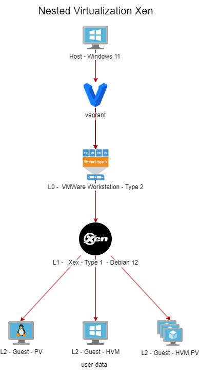

<h1><a name="readme-top"></a></h1>

[](https://github.com/marcossilvestrini/learning-lpic-3-305-300/actions/workflows/release.yml)[](https://github.com/marcossilvestrini/learning-lpic-3-305-300/actions/workflows/translate.yml)[](https://github.com/marcossilvestrini/learning-lpic-3-305-300/actions/workflows/jekyll-gh-pages.yml)[](https://github.com/marcossilvestrini/learning-lpic-3-305-300/actions/workflows/generate-html.yml)[](https://github.com/marcossilvestrini/learning-lpic-3-305-300/actions/workflows/powershell.yml)[](https://github.com/marcossilvestrini/learning-lpic-3-305-300/actions/workflows/slack.yml)

* * *

[![MIT License][license-shield]][license-url][![Forks][forks-shield]][forks-url][![Stargazers][stars-shield]][stars-url][![Contributors][contributors-shield]][contributors-url][![Issues][issues-shield]][issues-url][![LinkedIn][linkedin-shield]][linkedin-url]

* * *

# LPIC-3 305-300の学習


<p align="center">
<strong>Explore the docs »</strong></a>
    <br />
    <a href="https://marcossilvestrini.github.io/learning-lpic-3-305-300/">Web Site</a>
    -
    <a href="https://github.com/marcossilvestrini/learning-lpic-3-305-300">Code Page</a>
    -
    <a href="https://github.com/marcossilvestrini/learning-lpic-3-305-300/issues">Report Bug</a>
    -
    <a href="https://github.com/marcossilvestrini/learning-lpic-3-305-300/issues">Request Feature</a>
</p>

* * *

## まとめ

<details>
  <summary><b>TABLE OF CONTENT</b></summary>
  <ol>
    <li>
      <a href="#about-the-project">About The Project</a>
    </li>
    <li>
      <a href="#getting-started">Getting Started</a>
      <ul>
        <li><a href="#prerequisites">Prerequisites</a></li>
        <li><a href="#installation">installation</a></li>
      </ul>
    </li>
    <li><a href="#usage">Usage</a></li>
    <li><a href="#roadmap">Roadmap</a></li>
    <li><a href="#freedoms">Four Essential Freedoms</a></li>
    <li>
      <a href="#topic-351">Topic 351: Full Virtualization</a>
      <ul>
        <li><a href="#topic-351.1">351.1 Virtualization Concepts and Theory </a></li>
        <li><a href="#topic-351.2">351.2 Xen</a></li>
        <li><a href="#topic-351.3">351.3 QEMU</a></li>
        <li><a href="#topic-351.4">351.4 Libvirt Virtual Machine</a></li>
        <li><a href="#topic-351.5">351.5 Virtual Machine Disk Image Management</a></li>
      </ul>
    </li>
    <li>
      <a href="#topic-352">Topic 352: Container Virtualization</a>
      <ul>
        <li><a href="#topic-352.1">352.1 Container Virtualization Concepts</a></li>
        <li><a href="#topic-352.2">352.2 LXC</a></li>
        <li><a href="#topic-352.3">352.3 Docker</a></li>
        <li><a href="#topic-352.4">352.4 Container Orchestration Platforms</a></li>
      </ul>
    </li>
    <li>
      <a href="#topic-353">Topic 353: VM Deployment and Provisioning</a>
      <ul>
        <li><a href="#topic-353.1">353.1 Cloud Management Tools</a></li>
        <li><a href="#topic-353.2">353.2 Packer</a></li>
        <li><a href="#topic-353.3">353.3 cloud-init</a></li>
        <li><a href="#topic-353.4">353.4 Vagrant</a></li>
      </ul>
    </li>
    <li><a href="#license">License</a></li>
    <li><a href="#contact">Contact</a></li>
    <li><a href="#acknowledgments">Acknowledgments</a></li>
  </ol>
</details><br>

* * *

<a name="about-the-project"></a>

## プロジェクトについて

> このプロジェクトは、学生や専門家がGnulinuxの主な概念を学ぶのを支援することを目指しています
> およびフリーソフトウェア\\
> DebianやRPMのようないくつかのGnulinux分布はカバーされます\\
> 一部のパッケージのインストールと構成もカバーされます\\
> これを行うことで、コミュニティ全体にあなたの変更から利益を得る機会を与えることができます。\\
> ソースコードへのアクセスは、これの前提条件です。\\
> この記事では、UPマシンにVagrantを使用し、ラボを実行し、コンテンツを練習します。\\
> 私はフォルダーVagrantに公開しましたvagrantFileが必要なものを\\
> 研究のために環境をアップロードするために

* * *

<p align="right">(<a href="#readme-top">back to top</a>)</p>

<a name="getting-started"></a>

## はじめる

学習を開始するには、上記のドキュメントを参照してください。

<a name="prerequisites"></a>

### 前提条件

-   [git](https://git-scm.com/book/en/v2/Getting-Started-Installing-Git)
-   [VMwareワークステーション](https://blogs.vmware.com/workstation/2024/05/vmware-workstation-pro-now-available-free-for-personal-use.html)
-   [Vagrant VMwareユーティリティ](https://developer.hashicorp.com/vagrant/install/vmware)
-   [Vagrant](https://developer.hashicorp.com/vagrant/install)

<a name="installation"></a>

### インストール

レポをクローンします

```sh
git clone https://github.com/marcossilvestrini/learning-lpic-3-305-300.git
cd learning-lpic-3-305-300
```

テンプレートをカスタマイズします_vagrantfile-topic-xxx_。このファイルには、ラボ用のVMS構成が含まれています。例：

-   ファイル[vagrantfile-topic-351](./vagrant/Vagrantfile-topic-351)
    -   vm.clone_directory = "&lt;your_driver_letter>：\\<folder>\\&lt;to_machine>\\＃{vm_name} -instance-1 "
        例：vm.clone_directory = "e：\\サーバー\\vmware\\＃{vm_name} -instance-1 "
    -   vm.vmx[「Memsize」"]= ""
    -   vm.vmx[「numvcpus」"]= ""
    -   vm.vmx[「cpuid"correspersocout」.]= ""

ファイルでネットワーク構成をカスタマイズします[構成/ネットワーク](configs/network/).

* * *

<a name="usage"></a>

## 使用法

このリポジトリを使用して、LPIC-3 305-300試験について学習します

### 上下に

スイッチa_vagrantfile-topic-xxx_名前の新しいファイルのテンプレートとコピー_vagrantfile_

```sh
cd vagrant && vagrant up
cd vagrant && vagrant destroy -f
```

### VMSを再起動するため

```sh
cd vagrant && vagrant reload
```

**重要：**_VMSを使用せずにVMSを再起動する場合、ブート後にマウントされていない共有フォルダー。_

### 上下にPowerShellを使用します

Windowsプラットフォームを使用する場合、VMSの上下にPowerShellスクリプトを作成します。

```powershell
vagrant/up.ps1
vagrant/destroy.ps1
```

### インフラストラクチャスキーマトピック351



<p align="right">(<a href="#readme-top">back to top</a>)</p>

* * *

<a name="roadmap"></a>

## ロードマップ

-   [x] リポジトリを作成します
-   [x] ラボのプロビジョニング用のスクリプトを作成します
-   [x] トピック351に関する例を作成します
-   [ ] トピック352に関する例を作成します
-   [ ] トピック353に関する例を作成します
-   [ ] シミュレートされたiTexamをアップロードします

* * *

<a name="freedoms"></a>

## 4つの本質的な自由

> 0.あなたが望むようにプログラムを実行する自由、あらゆる目的のために（自由0）。\\
> 1.プログラムがどのように機能するかを研究し、それを変更する自由が\\
> あなたが望むようにあなたのコンピューティング（自由1）。\\
> ソースコードへのアクセスは、これの前提条件です。\\
> 2.他の人を助けることができるようにコピーを再配布する自由（自由2）。\\
> 3.修正されたバージョンのコピーを他の人に配布するためのFreedom（Freedom 3）。

* * *

## コマンドを検査します

```sh
type COMMAND
apropos COMMAND
whatis COMMAND --long
whereis COMMAND
COMMAND --help, --h
man COMMAND
```

<p align="right">(<a href="#readme-top">back to top</a>)</p>

* * *

<a name="topic-351"></a>

## トピック351：完全な仮想化


* * *

<a name="topic-351.1"></a>

### 351.1仮想化の概念と理論

**重さ：**6

**説明：**候補者は、仮想化の一般的な概念、理論、用語を知り、理解する必要があります。これには、Xen、Qemu、Libvirtの用語が含まれます。

**重要な知識領域：**

-   仮想化の用語を理解します
-   仮想化の長所と短所を理解します
-   ハイパーバイザーと仮想マシンモニターのさまざまなバリエーションを理解する
-   物理的なマシンから仮想マシンへの移行の主要な側面を理解する
-   ホストシステム間で仮想マシンを移行する主要な側面を理解する
-   スナップショット、一時停止、クローニング、リソースの制限など、仮想マシンの仮想化の機能と意味を理解する
-   Ovirt、Proxmox、SystemDマシン、VirtualBoxの認識
-   Open Vswitchの認識

#### 351.1引用されたオブジェクト

```sh
Hypervisor
Hardware Virtual Machine (HVM)
Paravirtualization (PV)
Emulation and Simulation
CPU flags
/proc/cpuinfo
Migration (P2V, V2V)
```

#### ハイパーバイザー

##### タイプ1ハイパーバイザー（ベアメタルハイパーバイザー）

###### タイプ1定義

ホストの物理的なハードウェアで直接実行され、ホストオペレーティングシステムを必要とせずにVMを管理するためのベースレイヤーを提供します。

###### タイプ1の特性

-   高性能と効率。
-   レイテンシとオーバーヘッドが低い。
-   多くの場合、エンタープライズ環境やデータセンターで使用されます。

###### タイプ1の例

-   VMware ESXI：エンタープライズ設定で堅牢で広く使用されているハイパーバイザー。
-   Microsoft Hyper-V：Windows Serverと統合され、強力なパフォーマンスと管理機能を提供します。
-   Xen：多くのクラウドサービスプロバイダーが使用するオープンソースハイパーバイザー。
-   KVM（カーネルベースの仮想マシン）：Linuxカーネルに統合され、Linuxベースのシステムに高性能を提供します。

##### タイプ2ハイパーバイザー（ホストされたハイパーバイザー）

###### タイプ2の定義

リソース管理とデバイスサポートのためにホストOSに依存して、従来のオペレーティングシステムの上で実行されます。

###### タイプ2の特性

-   特にパーソナルコンピューターでは、セットアップと使用が簡単です。
-   開発、テスト、および小規模な展開により柔軟に対応します。
-   通常、ホストOSからのオーバーヘッドが追加されたため、タイプ1ハイパーバイザーよりも効率が低くなります。

###### タイプ2の例

-   VMwareワークステーション：単一のデスクトップで複数のオペレーティングシステムを実行するための強力なハイパーバイザー。
-   Oracle VirtualBox：柔軟性と使いやすさで知られているオープンソースハイパーバイザー。
-   Parallels Desktop：MacユーザーがMacOSと一緒にWindowsやその他のオペレーティングシステムを実行するように設計されています。
-   QEMU（クイックエミュレータ）：KVMと組み合わせてよく使用されるオープンソースエミュレーターと仮想イザー。

##### タイプ1とタイプ2のハイパーバイザーの主な違い

-   展開環境：
    -   タイプ1のハイパーバイザーは、ハードウェアとの直接的な相互作用と高性能のため、一般にデータセンターとエンタープライズ環境に展開されます。
    -   タイプ2のハイパーバイザーは、個人使用、開発、テスト、および小規模な仮想化タスクにより適しています。
-   パフォーマンス：
    -   タイプ1のハイパーバイザーは、通常、ホストOSに依存していないため、パフォーマンスが向上し、遅延が低くなります。
    -   タイプ2のハイパーバイザーは、ホストOSの上でのランニングのオーバーヘッドにより、パフォーマンスの劣化が発生する場合があります。
-   管理と使いやすさ：
    -   タイプ1のハイパーバイザーは、より複雑なセットアップと管理が必要ですが、大規模な展開には高度な機能とスケーラビリティを提供します。
    -   タイプ2のハイパーバイザーは、インストールと使用が簡単で、個々のユーザーや小規模なプロジェクトに最適です。

##### 移行タイプ

仮想マシンの作成と管理に使用されるテクノロジーであるハイパーバイザーのコンテキストでは、仮想化環境ではP2V移行とV2Vの移行という用語が一般的です。  
それらは、さまざまなタイプのプラットフォーム間の移行システムのプロセスを指します。

##### P2V-物理的から仮想移行

P2V移行とは、物理サーバーを仮想マシンに移行するプロセスを指します。  
言い換えれば、専用の物理ハードウェアで実行されるオペレーティングシステムとそのアプリケーションは「変換」され、ハイパーバイザー（VMware、Hyper-V、KVMなど）で実行される仮想マシンに移動します。

-   例：WindowsまたはLinuxシステムを実行している物理サーバーがあり、クラウドインフラストラクチャや内部仮想化サーバーなどの仮想環境に移動する必要があります。  
    このプロセスでは、オペレーティングシステム、ドライバー、データを含むシステム状態全体をコピーして、物理ハードウェア上で実行できるように実行できる同等の仮想マシンを作成します。

##### V2V-仮想から仮想移行

V2V移行とは、仮想マシンをあるハイパーバイザーから別のハイパーバイザーに移行するプロセスを指します。  
この場合、仮想化された環境（VMwareなど）で実行されている仮想マシンが既にあり、別の仮想化環境（たとえば、Hyper-Vや新しいVMwareサーバー）に移動する必要があります。

-   例：VMware Virtualization Serverで実行されている仮想マシンがありますが、Hyper-Vプラットフォームに移行することにします。この場合、V2V移行は仮想マシンをある形式またはハイパーバイザーから別の形式に変換し、正しく実行を続けることができるようにします。

#### HVMと傍観的化

##### ハードウェアアシスト仮想化（HVM）

###### HVM定義

HVMは、最新のCPUが提供するハードウェア拡張機能を活用してハードウェアを仮想化し、最小限のパフォーマンスオーバーヘッドでVMの作成と管理を可能にします。

###### HVMキー特性

-   **ハードウェアサポート**：Intel VT-XやAMD-Vなどの仮想化拡張機能のCPUサポートが必要です。
-   **完全な仮想化：**ハイパーバイザーはハードウェア環境の完全なエミュレーションを提供するため、VMSは変更されていないゲストオペレーティングシステムを実行できます。
-   **パフォーマンス：**通常、CPUでゲストコードを直接実行するため、ネイティブに近いパフォーマンスを提供します。
-   **分離：**各VMは、独自の専用ハードウェアを持っているかのように動作するため、VM間で強力な分離を提供します。

###### HVMの例

VMware ESXI、Microsoft Hyper-V、KVM（カーネルベースの仮想マシン）。

###### HVMの利点

-   **互換性：**変更なしで任意のオペレーティングシステムを実行できます。
-   **パフォーマンス：**ハードウェアサポートによる高性能。
-   **安全：**ハードウェアが提供する拡張分離およびセキュリティ機能。

###### HVM短所

-   **ハードウェア依存関係：**特定のハードウェア機能が必要であり、古いシステムとの互換性を制限します。
-   **複雑：**より複雑な構成と管理が含まれる場合があります。

##### 官報化

###### Paravirtualizationの定義

Paravirtualizationには、ゲストオペレーティングシステムを変更して仮想環境を認識し、ハイパーバイザーとより効率的に相互作用できるようにします。

###### 視床化の重要な特性

-   **ゲストの変更：**ハイパーコールを使用してハイパーバイザーと直接通信するために、ゲストオペレーティングシステムの変更が必要です。
-   **パフォーマンス：**エミュレートハードウェアに関連するオーバーヘッドを削減するため、従来の完全な仮想化よりも効率的です。
-   **互換性：**傍観的化のために変更されたオペレーティングシステムに限定されています。

###### Paravirtualizationの例

Paravirtualized Guests、特定の構成のVMwareツール、およびいくつかのKVM構成を備えたXen。

###### 対paravirtualizationの利点

-   **効率：**仮想化ハードウェアのオーバーヘッドを減らし、特定のワークロードのパフォーマンスを向上させる可能性があります。
-   **リソース利用：**ゲストOSとハイパーバイザー間の直接通信により、システムリソースのより効率的な使用。

###### Paravirtualization Disdvantages

-   **ゲストOSの変更：**ゲストOSの変更が必要であり、サポートされているオペレーティングシステムへの互換性を制限します。
-   **複雑：**HyperCallの実装には、ゲストOSの追加の複雑さが必要です。

##### 重要な違い

###### ゲストOS要件

-   **HVM：**変更されていないゲストオペレーティングシステムを実行できます。
-   **paravirtualization：**ゲストオペレーティングシステムを変更して、ハイパーバイザーと連携する必要があります。

###### パフォーマンス

-   **HVM：**通常、ハードウェア支援の実行により、ネイティブに近いパフォーマンスを提供します。
-   **paravirtualization：**ハードウェアエミュレーションのオーバーヘッドを削減することで効率的なパフォーマンスを提供できますが、変更されたゲストOSに依存しています。

###### ハードウェアの依存関係

-   **HVM：**特定のCPU機能（Intel VT-X、AMD-V）が必要です。
-   **paravirtualization：**特定のCPU機能は必要ありませんが、変更されたゲストOSが必要です。

###### 分離

-   **HVM：**ハードウェア機能を使用して強力な分離を提供します。
-   **paravirtualization：**ソフトウェアベースの分離に依存しています。これは、ハードウェアベースの分離ほど堅牢ではない場合があります。

###### 複雑

-   **HVM：**一般に、変更されていないOSをサポートするため、展開がより簡単です。
-   **paravirtualization：**ゲストOSに追加のセットアップと変更が必要であり、複雑さが増します。

#### numa（不均一なメモリアクセス）

numa（不均一なメモリアクセス）は、プロセッサによるメモリアクセスを最適化するためにマルチプロセッサシステムで使用されるメモリアーキテクチャです。  
numaシステムでは、メモリはプロセッサ間で不均一に分散されています。つまり、各プロセッサは、物理的に遠くにあるメモリ（「リモートメモリ」と呼ばれる）および関連するメモリ（「ローカルメモリ」）へのアクセスが高速であることを意味します。他のプロセッサと。

##### numaアーキテクチャの重要な機能

1.  **ローカルおよびリモートメモリ**：各プロセッサには独自のローカルメモリがあり、より迅速にアクセスできます。ただし、他のプロセッサのメモリにアクセスすることもできますが、これには時間がかかります。
2.  **差別化されたレイテンシ**：メモリアクセスの遅延は、プロセッサがローカルメモリにアクセスしているか、別のノードのメモリにアクセスしているかによって異なります。ローカルメモリアクセスはより速くなりますが、別のノードのメモリ（リモート）へのアクセスは遅くなります。
3.  **スケーラビリティ**：numaアーキテクチャは、多くのプロセッサを使用してシステムのスケーラビリティを向上させるように設計されています。より多くのプロセッサが追加されると、メモリも配布され、均一なメモリアクセス（UMA）アーキテクチャで発生するボトルネックを避けます。

##### Numaの利点

-   大規模なシステムでのパフォーマンスの向上：各プロセッサにはローカルメモリがあるため、メモリアクセスのために他のプロセッサと競合することなく、より効率的に動作できます。
-   スケーラビリティ：NUMAは、多くのプロセッサと大量のメモリを備えたシステムを、UMAアーキテクチャと比較してより効果的にスケーリングできます。

##### 短所

-   プログラミングの複雑さ：プログラマーは、どのメモリの領域がローカルまたはリモートであるかを認識する必要があり、ローカルメモリの使用を最適化してパフォーマンスを向上させる必要があります。
-   潜在的なパフォーマンスペナルティ：プロセッサがリモートメモリに頻繁にアクセスする場合、レイテンシが高いためパフォーマンスが低下する可能性があります。
    このアーキテクチャは、スケーラビリティとメモリの最適化が重要なサーバーやスーパーコンピューターなどの高性能マルチプロセッサシステムで一般的です。

#### OpenSourceソリューション

-   ovirt：<https://www.ovirt.org/>

-   proxmox：<https://www.proxmox.com/en/proxmox-virtual-environment/overview>

-   Oracle VirtualBox：<https://www.virtualbox.org/>

-   オープンvswitch：<https://www.openvswitch.org/>

#### 仮想化の種類

##### ハードウェア仮想化（サーバー仮想化）

###### HV定義

物理的なハードウェアを要約して、個別のオペレーティングシステムとアプリケーションを実行する仮想マシン（VM）を作成します。

###### HVユースケース

データセンター、クラウドコンピューティング、サーバーの統合。

###### HVの例

VMware ESXi、Microsoft Hyper-V、KVM。

##### オペレーティングシステム仮想化（コンテナ化）

###### コンテナ化定義

複数の分離されたユーザー空間インスタンス（コンテナ）が単一のOSカーネルで実行されるようにします。

###### コンテナ化ユースケース

マイクロサービスアーキテクチャ、開発、テスト環境。

###### コンテナ化の例

Docker、Kubernetes、LXC。

##### ネットワーク仮想化

###### ネットワーク仮想化の定義

ハードウェアとソフトウェアのネットワークリソースを、単一のソフトウェアベースの管理エンティティに組み合わせます。

###### ネットワーク仮想化ユースケース

ソフトウェア定義ネットワーク（SDN）、ネットワーク機能仮想化（NFV）。

###### ネットワーク仮想化の例

VMware NSX、Cisco ACI、OpenStack Neutron。

##### ストレージ仮想化

###### ストレージ仮想化の定義

複数のデバイスから物理的なストレージをプールして、中央に管理できる単一の仮想ストレージユニットにプールします。

###### ストレージ仮想化定義のユースケース

データ管理、ストレージの最適化、災害復旧。

###### ストレージ仮想化定義の例

IBM SANボリュームコントローラー、VMware VSAN、NetApp ONTAP。

##### デスクトップ仮想化

###### デスクトップ仮想化定義

デスクトップオペレーティングシステムは、サーバーでホストされている仮想マシンで実行できます。

###### デスクトップ仮想化定義のユースケース

仮想デスクトップインフラストラクチャ（VDI）、リモートワークソリューション。

###### デスクトップ仮想化定義の例

Citrix仮想アプリとデスクトップ、VMware Horizo​​n、Microsoftリモートデスクトップサービス。

##### アプリケーション仮想化

###### アプリケーション仮想化定義

アプリケーションを基礎となるハードウェアおよびオペレーティングシステムから分離し、孤立した環境で実行できるようにします。

###### アプリケーション仮想化定義のユースケース

Simplified application deployment, compatibility testing.

###### アプリケーション仮想化定義の例

VMware ThinApp、Microsoft App-V、Citrix XenApp。

##### データ仮想化

###### データ仮想化の定義

物理的に統合することなく、さまざまなソースからのデータを統合し、分析とレポートの統一ビューを提供します。

###### データ仮想化定義のユースケース

ビジネスインテリジェンス、リアルタイムデータ統合。

###### データ仮想化定義の例

Denodo、Red Hat JBossデータ仮想化、IBM Infosphere。

##### 仮想化の利点

-   リソース効率：物理リソースのより良い利用。
-   コスト削減：ハードウェアと運用コストの削減。
-   スケーラビリティ：需要に応じて簡単にスケールアップまたはダウンします。
-   柔軟性：さまざまなワークロードとアプリケーションをサポートします。
-   災害復旧：バックアップと復旧プロセスの簡素化。
-   分離：環境の分離によるセキュリティの改善。

<p align="right">(<a href="#topic-351.1">back to sub Topic 351.1</a>)</p>
<p align="right">(<a href="#topic-351">back to Topic 351</a>)</p>
<p align="right">(<a href="#readme-top">back to top</a>)</p>

* * *

<a name="topic-351.2"></a>

### 351.2交互


**重さ：**3

**説明：**候補者は、XENのインストールをインストール、構成、保守、移行、およびトラブルシューティングできる必要があります。焦点はXenバージョン4.xにあります。

**重要な知識領域：**

-   ネットワーキングやストレージなど、Xenのアーキテクチャを理解します
-   Xenノードとドメインの基本的な構成
-   Xenノードとドメインの基本管理
-   XENインストールの基本的なトラブルシューティング
-   丸薬から離れたアバリン
-   Xenstoreの認識
-   Xenブートパラメーターの認識
-   XMユーティリティの認識

#### 代替


Xenは、オープンソースタイプ1（裸のメタル）ハイパーバイザーであり、複数のオペレーティングシステムが同じ物理ハードウェアで同時に実行できるようにします。  
Xenは、物理ハードウェアと仮想マシン（VM）の間にレイヤーを提供し、効率的なリソース共有と分離を可能にします。

-   **建築：**Xenは、ドメイン0（DOM0）が直接ハードウェアアクセスを備えた特権ドメインであり、ハイパーバイザーを管理する2層システムで動作します。ドメインu（domu）と呼ばれる他の仮想マシンは、ゲストオペレーティングシステムを実行し、dom0によって管理されています。
-   **仮想化の種類：**Xenは、修正されたゲストOSを必要とするParavirtualization（PV）と、ハードウェアエクステンション（Intel VT-XまたはAMD-Vなど）を使用して未修正のゲストオペレーティングシステムを実行するハードウェアアシスト仮想化（HVM）の両方をサポートします。
    Xenは、特にAmazon Web Services（AWS）およびその他の大規模なクラウドプロバイダーによって、クラウド環境で広く使用されています。

#### xensource

Xensourceは、ケンブリッジ大学のXenハイパーバイザーの元の開発者によって設立された同社であり、Xenを商業化しました。  
同社はXenに基づいてエンタープライズソリューションを提供し、エンタープライズの使用にXenの機能を強化するための追加のツールとサポートを提供しました。

-   **Citrixによる買収**：2007年、XensourceはCitrix Systems、Inc。に買収されました。Citrixは、Xen TechnologyをCitrix Xenserver製品の基礎として使用しました。
-   **遷移**：買収後、Xenプロジェクトはオープンソースプロジェクトとして継続され、CitrixはXenserverなどの商用製品に焦点を当て、Xensourceテクノロジーを活用しました。

#### xenプロジェクト

Xen Projectとは、商業化後のXenハイパーバイザーの開発と維持を担当するオープンソースコミュニティとイニシアチブを指します。  
Xenプロジェクトは、Linux Foundationの下で運営されており、Xenの構築、改善、および共同のコミュニティ主導の努力としてのサポートに重点を置いています。

-   **目標：**XENプロジェクトは、クラウドコンピューティング、セキュリティ中心の仮想化（QUBES OSなど）、組み込みシステムなど、幅広いユースケースのパフォーマンス、セキュリティ、および機能セットを改善することにより、ハイパーバイザーを前進させることを目的としています。
-   **貢献者：**このプロジェクトには、主要なクラウドプロバイダー、ハードウェアベンダー、独立した開発者など、さまざまな組織の貢献者が含まれています。
-   **ピルとヘドール：**Xenプロジェクトには、XAPI（Xenapi）などのツールにも含まれています。これは、Xenハイパーバイザーのインストールの管理に使用され、システム管理と最適化のための他のさまざまなユーティリティが含まれています。

#### xenstore

Xenストアは、Xenハイパーバイザーの重要なコンポーネントです。  
基本的に、Xenストアは、Xenハイパーバイザーとそれが管理する仮想マシン（ドメインとも呼ばれる）間の通信と情報共有に使用される分散キー価値データベースです。

Xenストアのいくつかの重要な側面は次のとおりです。

-   **ドメイン間コミュニケーション：**Xenストアでは、Dom0（ハードウェアリソースを制御する特権ドメイン）やDomus（VMSであるユーザードメイン）などのドメイン間の通信を可能にします。これは、各ドメインが情報を読み書きできるキー価値エントリを介して行われます。

-   **構成管理：**仮想デバイス、ネットワーク、ブートパラメーターなどの構成情報を保存およびアクセスするために使用されます。これにより、VMの動的管理と構成が容易になります。

-   **イベントと通知：**Xen Storeは、イベント通知もサポートしています。 Xenストアの特定のキーまたは値が変更されると、これらの変更に反応するように関心のあるドメインを通知できます。これは、リソースの監視と管理に役立ちます。

-   Simple API：Xen Storeは、データを読み書きするためのシンプルなAPIを提供し、開発者がアプリケーションをXen仮想化システムと簡単に統合できるようにします。

#### ピル

XAPIまたはXenapiは、Xenハイパーバイザーとその仮想マシン（VM）の管理に使用されるアプリケーションプログラミングインターフェイス（API）です。  
Xapiは、XenServer（現在はCitrix Hypervisorとして知られている）の重要なコンポーネントであり、VMの作成、構成、監視、制御などの操作を実行するためにXenハイパーバイザーと対話する標準化された方法を提供します。

XAPIのいくつかの重要な側面は次のとおりです。

-   **VM管理：**XAPIを使用すると、管理者は仮想マシンをプログラム的に作成、削除、開始、および停止できます。

-   **オートメーション：**XAPIを使用すると、ネットワーキング、ストレージ、コンピューティングなどの仮想リソースの管理を自動化することができます。これは、大規模なクラウド環境にとって重要です。

-   **統合：**XAPIは他のツールやスクリプトと統合して、XEN環境のより効率的でカスタマイズされた管理を提供できます。

-   **アクセス制御：**XAPIは、認定ユーザーのみが仮想環境で特定の操作を実行できるようにするためのアクセス制御メカニズムも提供します。

XAPIは、Xenハイパーバイザーの制御と自動化を可能にするインターフェイスであり、仮想化された環境の管理を容易にします。

#### xenサマリー

-   **間散布：**コアハイパーバイザー技術により、仮想マシンが物理ハードウェアで実行できるようにします。
-   **Xensource：**Xenを商業化した会社は、後にCitrixに買収され、Citrix Xenserverの開発につながりました。
-   **xenプロジェクト：**Linux Foundationの下でXenハイパーバイザーの開発と維持を続けるオープンソースのイニシアチブとコミュニティ。
-   **xenstore：**Xen Storeは、XenハイパーバイザーとVMの間の通信および構成の仲介として機能し、仮想化された環境の動作と管理を合理化します。
-   **ピル**Xenハイパーバイザーの制御と自動化を可能にするインターフェイスであり、仮想化された環境の管理を容易にします。

#### domain0（dom0）

domain0またはdom0は、XENアーキテクチャの制御ドメインです。他のドメイン（Domus）を管理し、ハードウェアに直接アクセスできます。  
Dom0はデバイスドライバーを実行し、直接ハードウェアアクセスを欠いているDomusがデバイスと通信できるようにします。通常、Linuxのようなオペレーティングシステムの完全なインスタンスであり、Xenハイパーバイザー操作には不可欠です。

#### ドメイン（家）

Domusは、仮想マシンを実行する非主権ドメインです。  
それらはdom0によって管理されており、ハードウェアに直接アクセスできません。 Domusは、さまざまなオペレーティングシステムを実行するように構成でき、アプリケーションサーバーや開発環境など、さまざまな目的に使用できます。彼らは、ハードウェアの相互作用のためにdom0に依存しています。

#### Peewee-Dom（Paravardiyed Domina）

pv-domus paravirtualizationという手法を使用します。このモデルでは、DOMUオペレーティングシステムは、仮想化された環境で実行されることを認識するように変更されており、最適化されたパフォーマンスのためにハイパーバイザーと直接通信できるようにします。  
これにより、完全な仮想化と比較して、オーバーヘッドが低くなり、効率が向上します。

#### HVM-DOMU（ハードウェア仮想マシンドメイン）

HVM-Domusは、完全な仮想化を利用する仮想マシンであり、変更されていないオペレーティングシステムを実行できます。 Xenハイパーバイザーは、これらのドムスにハードウェアエミュレーションを提供し、基礎となるハードウェアアーキテクチャをサポートするオペレーティングシステムを実行できるようにします。  
これにより柔軟性が高まりますが、PV-Domusと比較してオーバーヘッドが高くなる可能性があります。

#### xenネットワーク

Paravirtualised Networkデバイス

ブリッジング

#### 351.2引用されたオブジェクト

```sh
Domain0 (Dom0), DomainU (DomU)
PV-DomU, HVM-DomU
/etc/xen/
xl
xl.cfg 
xl.conf # Xen global configurations
xentop
oxenstored # Xenstore configurations
```

#### 351.2ノート

```sh

# Xen Settings
/etc/xen/
/etc/xen/xl.conf - Main general configuration file for Xen
/etc/xen/oxenstored.conf - Xenstore configurations

# VM Configurations
/etc/xen/xlexample.pvlinux
/etc/xen/xlexample.hvm

# Service Configurations
/etc/default/xen
/etc/default/xendomains

# xen-tools configurations
/etc/xen-tools/
/usr/share/xen-tools/

# docs
xl(1)
xl.conf(5)
xlcpupool.cfg(5)
xl-disk-configuration(5)
xl-network-configuration(5)
xen-tscmode(7)

# initialized domains auto
/etc/default/xendomains
   XENDOMAINS_AUTO=/etc/xen/auto

/etc/xen/auto/


# set domain for up after xen reboot
## create folder auto
cd /etc/xen && mkdir -p auto && cd auto

# create simbolic link
ln -s /etc/xen/lpic3-pv-guest /etc/xen/auto/lpic3-pv-guest
```

#### 351.2重要なコマンド

##### xen-create-image

```sh
# create a pv image
xen-create-image \
  --hostname=lpic3-pv-guest \
  --memory=1gb \
  --vcpus=2 \
  --lvm=vg_xen \
  --dhcp \
  --pygrub \
  --dist=bookworm
```

##### xen-list-images

```sh
# list image
xen-list-image
```

##### xen-delete-image

```sh
# delete a pv image
xen-delete-image lpic3-pv-guest --lvm=vg_xen
```

##### xenstore-ls

```sh
# list xenstore infos
xenstore-ls
```

##### brctl

```sh
# list xen interfaces
brctl show
```

##### XL

```sh
# view xen information
xl infos

# list Domains
xl list
xl list lpic3-hvm-guest
xl list lpic3-hvm-guest -l

# uptime Domains
xl uptime

# pause Domain
xl pause 2
xl pause lpic3-hvm-guest

# save state Domains
xl -v save lpic3-hvm-guest ~root/image-lpic3-hvm-guest.save

# restore Domain
xl restore /root/image-lpic3-hvm-guest.save

# get Domain name
xl domname 2

# view dmesg information
xl dmesg

# monitoring domain
xl top
xentop
xen top

# Limit mem Dom0
xl mem-set 0 2048

# Limite cpu (not permanent after boot)
xl vcpu-set 0 2

# create DomainU - virtual machine
xl create /etc/xen/lpic3-pv-guest.cfg

# create DomainU virtual machine and connect to guest
xl create -c /etc/xen/lpic3-pv-guest.cfg


##----------------------------------------------
# create DomainU virtual machine HVM

## create logical volume
lvcreate -l +20%FREE -n lpic3-hvm-guest-disk  vg_xen

## create a ssh tunel for vnc
ssh -l vagrant -L 5900:localhost:5900  192.168.0.130

## configure /etc/xen/lpic3-hvm-guest.cfg
## set boot for cdrom: boot = "d"

## create domain hvm
xl create /etc/xen/lpic3-hvm-guest.cfg

## open vcn conection in your vnc client with localhost
## for view install details

## after installation finished, destroy domain: xl destroy <id_or_name>

## set /etc/xen/lpic3-hvm-guest.cfg: boot for hard disc: boot = "c"

## create domain hvm
xl create /etc/xen/lpic3-hvm-guest.cfg

## access domain hvm
xl console <id_or_name>
##----------------------------------------------

# connect in domain guest
xl console <id>|<name> (press enter)
xl console 1
xl console lpic3-pv-guest

#How do I exit domU "xl console" session
#Press ctrl+] or if you're using Putty press ctrl+5.

# Poweroff domain
xl shutdown lpic3-pv-guest

# destroy domain
xl destroy lpic3-pv-guest

# reboot domain
xl reboot lpic3-pv-guest

# list block devices
xl block-list 1
xl block-list lpic3-pv-guest

# detach block devices
xl block-detach lpic3-hvm-guest hdc

# attach block devices
xl block-attach lpic3-hvm-guest hdc

```

<p align="right">(<a href="#topic-351.2">back to sub Topic 351.2</a>)</p>
<p align="right">(<a href="#topic-351">back to Topic 351</a>)</p>
<p align="right">(<a href="#readme-top">back to top</a>)</p>

* * *

<a name="topic-351.3"></a>

### 351.3 QEMU

**重さ：**4

**説明：**候補者は、QEMUのインストールをインストール、構成、保守、移行、およびトラブルシューティングできる必要があります。

**重要な知識領域：**

-   KVM、ネットワーキング、ストレージなど、QEMUのアーキテクチャを理解する
-   コマンドラインからQEMUインスタンスを開始します
-   QEMUモニターを使用してスナップショットを管理します
-   QEMUゲストエージェントとVirtioデバイスドライバーをインストールします
-   ネットワーキングやストレージを含むQEMUのインストールのトラブルシューティング
-   重要なQEMU構成パラメーターの認識

#### 351.3引用されたオブジェクト

```sh
Kernel modules: kvm, kvm-intel and kvm-amd
/dev/kvm
QEMU monitor
qemu
qemu-system-x86_64
ip
brctl
tunctl
```

#### 351.3重要なコマンド

##### IP

```sh
# list links
ip link show
```

<p align="right">(<a href="#topic-351.3">back to sub Topic 351.3</a>)</p>
<p align="right">(<a href="#topic-351">back to Topic 351</a>)</p>
<p align="right">(<a href="#readme-top">back to top</a>)</p>

* * *

<a name="topic-351.4"></a>

### 351.4 Libvirt仮想マシン管理

**重さ：**9

**説明：**候補者は、Libvirtおよび関連ツールを使用して、仮想化ホストと仮想マシン（「Libvirtドメイン」）を管理できる必要があります。

**重要な知識領域：**

-   libvirtのアーキテクチャを理解してください
-   libvirt接続とノードを管理します
-   スナップショットを含むQEMUおよびXENドメインを作成および管理します
-   ドメインのリソース消費を管理および分析します
-   ストレージプールとボリュームを作成および管理します
-   仮想ネットワークを作成および管理します
-   ノード間でドメインを移動します
-   libvirtがxenやqemuとどのように相互作用するかを理解してください
-   libvirtがDNSMASQやRADVDなどのネットワークサービスとどのように相互作用するかを理解する
-   libvirt xml構成ファイルを理解します
-   VirtlogdとVirtlockDの認識

#### 351.4引用されたオブジェクト

```sh
libvirtd
/etc/libvirt/
virsh (including relevant subcommands)
```

#### 351.4重要なコマンド

##### foo

```sh
foo
```

<p align="right">(<a href="#topic-351.4">back to sub Topic 351.4</a>)</p>
<p align="right">(<a href="#topic-351">back to Topic 351</a>)</p>
<p align="right">(<a href="#readme-top">back to top</a>)</p>

* * *

<a name="topic-351.5"></a>

### 351.5仮想マシンディスク画像管理

**重さ：**3

**説明：**候補者は、仮想マシンのディスク画像を管理できる必要があります。これには、さまざまな形式とハイパーバイザー間のディスク画像の変換と、画像内に保存されているデータへのアクセスが含まれます。

**重要な知識領域：**

-   RAW画像、QCOW2、VMDKなど、さまざまな仮想ディスク画像形式の機能を理解する
-   QEMU-IMGを使用して仮想マシンディスクイメージを管理します
-   Libguestfishを使用して、仮想マシンディスク画像に含まれるパーティションとアクセスファイルをマウントし、アクセスファイル
-   物理ディスクコンテンツを仮想マシンディスクイメージにコピーする
-   さまざまな仮想マシンディスクイメージフォーマット間でディスクコンテンツを移行する
-   オープン仮想化形式（OVF）の認識

#### 351.5引用されたオブジェクト

```sh
qemu-img
guestfish (including relevant subcommands)
guestmount
guestumount
virt-cat
virt-copy-in
virt-copy-out
virt-diff
virt-inspector
virt-filesystems
virt-rescue
virt-df
virt-resize
virt-sparsify
virt-p2v
virt-p2v-make-disk
virt-v2v
virt-sysprep
```

#### 351.5重要なコマンド

##### foo

```sh
foo
```

<p align="right">(<a href="#topic-351.5">back to sub Topic 351.5</a>)</p>
<p align="right">(<a href="#topic-351">back to Topic 351</a>)</p>
<p align="right">(<a href="#readme-top">back to top</a>)</p>

* * *

<a name="topic-352"></a>

## トピック352：コンテナ仮想化

* * *

<a name="topic-352.1"></a>

### 352.1コンテナ仮想化の概念

**重さ：**7

**説明：**候補者は、コンテナ仮想化の概念を理解する必要があります。これには、コンテナ仮想化の実装に使用されるLinuxコンポーネントの理解と、標準のLinuxツールを使用してこれらのコンポーネントのトラブルシューティングが含まれます。

**重要な知識領域：**

-   システムとアプリケーションのコンテナの概念を理解します
-   カーネルネームスペースを理解して分析します
-   コントロールグループを理解して分析します
-   能力を理解して分析します
-   コンテナ仮想化のためのSecComp、Selinux、Apparmorの役割を理解する
-   LXCとDockerが名前空間、cgroups、機能、Seccomp、およびMacを活用する方法を理解する
-   Runcの原則を理解します
-   Cri-Oとcontainerdの原則を理解してください
-   OCIランタイムと画像仕様の認識
-   Kubernetesコンテナランタイムインターフェイス（CRI）の認識
-   Podman、Buildah、Scopooの認識
-   LinuxやRKT、OpenVZ、SystemD-NSPAWN、BSD刑務所などのLinuxおよびその他の無料オペレーティングシステムでの他のコンテナ仮想化アプローチの認識


#### 352.1引用されたオブジェクト

```sh
nsenter
unshare
ip (including relevant subcommands)
capsh
/sys/fs/cgroups
/proc/[0-9]+/ns
/proc/[0-9]+/status
```

#### 352.1重要なコマンド

##### foo

```sh
foo
```

<p align="right">(<a href="#topic-352.1">back to sub topic 352.1</a>)</p>
<p align="right">(<a href="#topic-352">back to topic 352</a>)</p>
<p align="right">(<a href="#readme-top">back to top</a>)</p>

* * *

<a name="topic-352.2"></a>

### 352.2 LXC

**重さ：**6

**説明：**候補者は、LXCとLXDを使用してシステムコンテナを使用できる必要があります。 LXCカバーのバージョンは3.0以上です。

**重要な知識領域：**

-   LXCとLXDのアーキテクチャを理解してください
-   ネットワーキングやストレージを含むLXDを使用した既存の画像に基づいてLXCコンテナを管理する
-   LXCコンテナプロパティを構成します
-   LXCコンテナリソースの使用法を制限します
-   LXDプロファイルを使用します
-   LXC画像を理解します
-   従来のLXCツールの認識

#### 352.2引用オブジェクト

```sh
lxd
lxc (including relevant subcommands)
```

#### 352.2重要なコマンド

##### foo

```sh
foo
```

<p align="right">(<a href="#topic-352.2">back to sub topic 352.2</a>)</p>
<p align="right">(<a href="#topic-352">back to topic 352</a>)</p>
<p align="right">(<a href="#readme-top">back to top</a>)</p>

* * *

<a name="topic-352.3"></a>

### 352.3 Docker

**重さ：**9

**説明：**候補者は、DockerノードとDockerコンテナを管理できる必要があります。これには、Dockerのアーキテクチャを理解し、DockerがノードのLinuxシステムとどのように相互作用するかを理解することが含まれます。

**重要な知識領域：**

-   Dockerのアーキテクチャとコンポーネントを理解してください
-   Dockerレジストリからの画像を使用してDockerコンテナを管理する
-   Dockerコンテナの画像とボリュームを理解して管理します
-   Dockerコンテナのロギングを理解して管理します
-   Dockerのネットワーキングを理解して管理します
-   dockerfilesを使用してコンテナ画像を作成します
-   レジストリDockerイメージを使用してDockerレジストリを実行します

#### 352.3引用されたオブジェクト

```sh
dockerd
/etc/docker/daemon.json
/var/lib/docker/
docker
Dockerfile
```

#### 352.3重要なコマンド

##### Docker

```sh
# Examples of docker
```

<p align="right">(<a href="#topic-352.3">back to sub topic 352.3</a>)</p>
<p align="right">(<a href="#topic-352">back to topic 352</a>)</p>
<p align="right">(<a href="#readme-top">back to top</a>)</p>

* * *

<a name="topic-352.4"></a>

### 352.4コンテナオーケストレーションプラットフォーム

**重さ：**3

**説明：**候補者は、コンテナオーケストレーションの重要性と、Docker SwarmとKubernetesがコンテナオーケストレーションを実装するために提供する重要な概念を理解する必要があります。

**重要な知識領域：**

-   コンテナオーケストレーションの関連性を理解します
-   Docker ComposeとDocker Swarmの重要な概念を理解する
-   KubernetesとHelmの重要な概念を理解してください
-   OpenShift、Rancher、Mesosphere DC/OSの認識

<p align="right">(<a href="#topic-352.4">back to sub topic 352.4</a>)</p>
<p align="right">(<a href="#topic-352">back to topic 352</a>)</p>
<p align="right">(<a href="#readme-top">back to top</a>)</p>

* * *

<a name="topic-353"></a>

## トピック353：VMの展開とプロビジョニング

* * *

<a name="topic-353.1"></a>

### 353.1クラウド管理ツール

**重さ：**2

**説明：**候補者は、パブリッククラウドの一般的な製品を理解し、一般的に利用可能なクラウド管理ツールの基本的な機能知識を持っている必要があります。

**重要な知識領域：**

-   パブリッククラウドの一般的な製品を理解します
-   OpenStackの基本的な機能知識
-   テラフォームの基本的な機能知識
-   CloudStack、ユーカリ、Opennebulaの認識

#### 353.1引用オブジェクト

```sh
IaaS, PaaS, SaaS
OpenStack
Terraform
```

#### 353.1重要なコマンド

##### foo

```sh
# examples
```

<p align="right">(<a href="#topic-353.1">back to sub topic 353.1</a>)</p>
<p align="right">(<a href="#topic-353">back to topic 353</a>)</p>
<p align="right">(<a href="#readme-top">back to top</a>)</p>

* * *

<a name="topic-353.2"></a>

### 353.2パッカー

**重さ：**2

**説明：**候補者は、Packerを使用してシステムイメージを作成できる必要があります。これには、さまざまなパブリックおよびプライベートクラウド環境でパッカーを実行し、LXC/LXD用のコンテナ画像の構築が含まれます。

**重要な知識領域：**

-   Packerの機能と機能を理解します
-   テンプレートファイルを作成および保守します
-   異なるビルダーを使用してテンプレートファイルから画像を作成します

#### 353.2引用されたオブジェクト

```sh
packer
```

#### 353.2重要なコマンド

##### パッカー

```sh
# examples
```

<p align="right">(<a href="#topic-353.2">back to sub topic 353.2</a>)</p>
<p align="right">(<a href="#topic 353">back to topic 353</a>)</p>
<p align="right">(<a href="#readme-top">back to top</a>)</p>

* * *

<a name="topic-353.3"></a>

### 353.3 Cloud-init

**重さ：**3

**説明：**候補者は、クラウドInitを使用して、標準化された画像から作成された仮想マシンを構成できる必要があります。これには、利用可能なハードウェアリソース、特にディスクスペースとボリュームに合わせて仮想マシンを調整することが含まれます。  
さらに、候補者はインスタンスを構成して、安全なSSHログインを許可し、特定のソフトウェアパッケージセットをインストールできる必要があります。  
さらに、候補者は、クラウドイットサポートを備えた新しいシステム画像を作成できる必要があります。

**重要な知識領域：**

-   ユーザーデータ、クラウドイニットの初期化と構成など、クラウドイニットの機能と概念を理解する
-   Cloud-Initを使用してファイルシステムを作成、サイズ変更、マウントし、SSHキーなどのログイン資格情報を含むユーザーアカウントを構成し、Distributionのリポジトリからソフトウェアパッケージをインストールします
-   クラウドインをシステム画像に統合します
-   テストに構成ドライブDataSourceを使用します

#### 353.3引用オブジェクト

```sh
cloud-init
user-data
/var/lib/cloud/
```

#### 353.3重要なコマンド

##### foo

```sh
# examples
```

<p align="right">(<a href="#topic-353.3">back to sub topic 353.3</a>)</p>
<p align="right">(<a href="#topic 353">back to topic 353</a>)</p>
<p align="right">(<a href="#readme-top">back to top</a>)</p>

* * *

<a name="topic-353.4"></a>

### 353.4 Vagrant

**重さ：**3

**説明：**候補者は、仮想マシンのプロビジョニングなど、仮想マシンを管理するためにVagrantを使用できる必要があります。

**重要な知識領域：**

-   ストレージやネットワーキングなど、浮浪者のアーキテクチャと概念を理解してください
-   Atlasからボックスを取得して使用します
-   vagrantfilesを作成して実行します
-   Vagrant Virtual Machinesにアクセスします
-   Vagrant Virtual MachineとHost Systemの間でフォルダーを共有して同期します
-   Vagrantのプロビジョニング、つまりファイルおよびシェルプロビジャーを理解します
-   マルチマシンのセットアップを理解します

#### 353.4引用されたオブジェクト

```sh
vagrant
Vagrantfile
```

#### 353.4重要なコマンド

##### Vagrant

```sh
# examples
```

<p align="right">(<a href="#topic-353.4">back to sub topic 353.4</a>)</p>
<p align="right">(<a href="#topic 353">back to topic 353</a>)</p>
<p align="right">(<a href="#readme-top">back to top</a>)</p>

* * *

## 貢献

貢献は、オープンソースコミュニティを非常に素晴らしい場所にするものです
学び、インスピレーションを与え、作成します。あなたがする貢献はすべてです**大歓迎です**.

これを改善する提案がある場合は、レポをフォークしてください
プルリクエストを作成します。また、タグ「拡張機能」で問題を開くこともできます。
プロジェクトにスターを与えることを忘れないでください！再度、感謝します！

1.  プロジェクトをフォークします
2.  機能ブランチを作成します（`git checkout -b feature/AmazingFeature`)
3.  あなたの変更をコミットします（`git commit -m 'Add some AmazingFeature'`)
4.  枝に押します（`git push origin feature/AmazingFeature`)
5.  プルリクエストを開きます

* * *

## ライセンス

-   このプロジェクトはMITライセンスに基づいてライセンスされています \*詳細については、license.mdファイルを参照してください

* * *

## 接触

マルコス・シルベストリーニ - [marcos.silvestrini@gmail.com](mailto:marcos.silvestrini@gmail.com)\\[](https://twitter.com/mrsilvestrini)

プロジェクトリンク：<https://github.com/marcossilvestrini/learning-lpic-3-305-300>

<p align="right">(<a href="#readme-top">back to top</a>)</p>

* * *

## 謝辞

-   [リチャード・ストールマンズ](http://www.stallman.org/)
-   [gnu](<>)
    -   [Richard StallmanによるGNU/Linux FAQ](https://www.gnu.org/gnu/gnu-linux-faq.html)
    -   [gnu](https://www.gnu.org/)
    -   [GNUオペレーティングシステム](https://www.gnu.org/gnu/thegnuproject.html)
    -   [GCCコンパイラ](https://gcc.gnu.org/wiki/History)
    -   [GNUタール](https://www.gnu.org/software/tar/)
    -   [gnu make](https://www.gnu.org/software/make/)
    -   [GNU EMACS](https://en.wikipedia.org/wiki/Emacs)
    -   [GNUパッケージ](https://www.gnu.org/software/)
    -   [GNU/Linuxコレクション](https://directory.fsf.org/wiki/Collection:GNU/Linux)
    -   [GNU Grub Bootloader](https://www.gnu.org/software/grub/)
    -   [GNUハード](https://www.gnu.org/software/hurd/hurd/what_is_the_gnu_hurd.html)
-   [カーネル](<>)
    -   [カーネル](https://www.kernel.org/)
    -   [Linuxカーネルマンページ](https://www.kernel.org/doc/man-pages/)
    -   [カーネルをコンパイルします](https://wiki.linuxquestions.org/wiki/How_to_build_and_install_your_own_Linux_kernel)
-   [Linux標準ベース](<>)
    -   [Linux標準ベース](https://en.wikipedia.org/wiki/Linux_Standard_Base)
    -   [ファイルシステム階層標準](https://en.wikipedia.org/wiki/Filesystem_Hierarchy_Standard)
    -   [ファイル階層構造](https://refspecs.linuxfoundation.org/FHS_3.0/fhs-3.0.pdf)
-   [フリーソフトウェア](<>)
    -   [FSF](https://www.fsf.org)
    -   [Free Software Directory](https://directory.fsf.org/wiki/Free_Software_Directory:Free_software_replacements)
-   [ライセンス](<>)
    -   [フリーソフトウェア](https://www.gnu.org/philosophy/free-sw.html)
    -   [copyleft](https://www.gnu.org/licenses/copyleft.en.html)
    -   [gpl](https://www.gnu.org/licenses/quick-guide-gplv3.html)
    -   [GNU以下の一般公開ライセンス](https://www.gnu.org/licenses/lgpl-3.0.html)
    -   [BSD](https://opensource.org/licenses/BSD-3-Clause)
    -   [オープンソースイニシアチブ](https://opensource.org/)
    -   [クリエイティブコモンズ](https://creativecommons.org/)
    -   [ライセンスLTS](https://en.wikipedia.org/wiki/Long-term_support)
-   [ディストリビューション](<>)
    -   [Debianフリーソフトウェアガイドライン](https://www.debian.org/social_contract#guidelines)
    -   [Linux Distributionをリストします](https://en.wikipedia.org/wiki/List_of_Linux_distributions)
    -   [Distro Watch](https://distrowatch.com/)
    -   [比較Linux分布](https://en.wikipedia.org/wiki/Comparison_of_Linux_distributions)
-   [デスクトップ環境](<>)
    -   [X11 ORG](https://www.x.org/wiki/)
    -   [ウェイランド](https://wayland.freedesktop.org/)
    -   [gnu gnome](https://www.gnu.org/press/gnome-1.0.html)
    -   [gnome](https://www.gnome.org/)
    -   [xfce](https://xfce.org/)
    -   [ここでプラズマ](https://kde.org/plasma-desktop/)
    -   [調和](https://en.wikipedia.org/wiki/Harmony_(toolkit))
-   [プロトコル](<>)
    -   [http](<>)
        -   [w3techs](https://w3techs.com/)
        -   [アパッチ](https://www.apache.org/)
        -   [Apacheディレクティブ][def]
        -   [HTTPステータスコード](https://en.wikipedia.org/wiki/List_of_HTTP_status_codes)
        -   [Apache、Nginx、Lighttpdの強力な暗号](https://cipherlist.eu/)
        -   [SSLチュートリアル](https://www.golinuxcloud.com/blog/)
        -   [SSL Config Mozilla](https://ssl-config.mozilla.org/)
    -   [xrdp](https://bytexd.com/xrdp-centos/)
    -   [NTP](https://www.ntppool.org/en/)
-   [DNS](<>)
    -   [バインド](https://www.isc.org/bind/)
    -   [バインドロギング](https://www.zytrax.com/books/dns/ch7/logging.html)
    -   [DNSレコードタイプのリスト](https://en.wikipedia.org/wiki/List_of_DNS_record_types)
    -   [DNSレコードタイプのリスト](https://en.wikipedia.org/wiki/List_of_DNS_record_types)
-   [パッケージマネージャー](<>)
    -   [パッケージをダウンロードします](https://pkgs.org/)
    -   [パッケージをインストールします](https://installati.one/)
    -   [パッケージをインストールするガイド](https://installati.one/)
-   [シェルスクリプト](<>)
    -   [再びボーン](https://www.gnu.org/software/bash/manual/)
    -   [シバン](https://bash.cyberciti.biz/guide/Shebang)
    -   [環境変数](https://linuxize.com/post/how-to-set-and-list-environment-variables-in-linux/)
    -   [GNUグローブ](https://man7.org/linux/man-pages/man7/glob.7.html)
    -   [グローブ](https://linuxhint.com/bash_globbing_tutorial/)
    -   [引用](https://www.gnu.org/software/bash/manual/html_node/Quoting.html)
    -   [正規表現](https://www.gnu.org/software/grep/manual/html_node/Regular-Expressions.html)
    -   [コマンドが見つかりません](https://command-not-found.com/)
    -   [バッシュプロンプトジェネレーター](https://bash-prompt-generator.org/)
    -   [説明](https://explainshell.com/)
    -   [VIMチュートリアル](https://www.openvim.com/)
    -   [Linuxシェルスクリプトチュートリアル](https://bash.cyberciti.biz/guide/Main_Page)
    -   [コマンドの例](https://www.geeksforgeeks.org/)
-   [その他のツール](<>)
    -   [bugzila](https://bugzilla.kernel.org/)
    -   [Githubバッジ](https://github.com/alexandresanlim/Badges4-README.md-Profile)
-   [仮想化の定義](<>)
    -   [赤い帽子](https://www.redhat.com/pt-br/topics/virtualization/what-is-virtualization)
    -   [aws](https://aws.amazon.com/pt/what-is/virtualization/)
    -   [IBM](https://www.ibm.com/topics/virtualization)
    -   [OpenSource.com](https://opensource.com/resources/virtualization)
-   [KVM](<>)
    -   [KVM（カーネル仮想マシン）](https://www.redhat.com/pt-br/topics/virtualization/what-is-KVM)
    -   [KVM管理ツール](https://www.linux-kvm.org/page/Management_Tools)
-   [代替](<>)
    -   [XenServer](https://www.xenserver.com/)
    -   [wiki xenproject](https://wiki.xenproject.org/wiki/Main_Page)
    -   [ネットワークインターフェイス](https://wiki.xenproject.org/wiki/Xen_Networking#Virtual_Network_Interfaces)
    -   [xenツール](https://xen-tools.org/software/)
    -   [LPIブログ：Xen Virtualization and Cloud Computing＃01：はじめに](https://www.lpi.org/pt-br/blog/2020/10/01/xen-virtualization-and-cloud-computing-01-introduction/)
    -   [LPIブログ：Xen Virtualization and Cloud Computing＃02：Xenがどのように仕事をするか](https://www.lpi.org/blog/2020/10/08/xen-virtualization-and-cloud-computing-02-how-xen-does-job/)
    -   [LPIブログ：Xen Virtualization and Cloud Computing＃04：コンテナ、OpenStack、およびその他の関連プラットフォーム](https://www.lpi.org/pt-br/blog/2020/10/22/xen-virtualization-and-cloud-computing-04-containers-openstack-and-other-related/)
    -   [Xen Virtualization and Cloud Computing＃05：Xen Project、Unikernels、およびThe Future](https://www.lpi.org/pt-br/blog/2020/10/29/xen-virtualization-and-cloud-computing-05-xen-project-unikernels-and-future/)
    -   [Xen Project初心者ガイド](https://wiki.xenproject.org/wiki/Xen_Project_Beginners_Guide#Installing_the_Xen_Project_Software)
    -   [クレイジーな本](https://wiki.xenproject.org/wiki/Book/HelloXenProject/0-Contents)
-   [ユニセル](https://www.lpi.org/blog/2020/10/29/xen-virtualization-and-cloud-computing-05-xen-project-unikernels-and-future/)
    -   [ユニークな力](https://github.com/unikraft/unikraft)
    -   [ミラゴス](https://mirage.io/docs/hello-world)
    -   [悪い](https://galois.com/project/halvm/)
    -   [個性的](https://github.com/solo-io/unik/blob/master/docs/providers/virtualbox.md)
-   [OpenStackドキュメント](<>)
    -   [redhat](https://www.redhat.com/pt-br/topics/openstack)
-   [vswitchを開きます](<>)
    -   [OVS Doc 4Linux](https://blog.4linux.com.br/open-vswitch-o-que-e-o-que-come-onde-vive)
-   [LPIC-3 305-300試験](<>)
    -   [LPIC-3 305-300目的](https://www.lpi.org/our-certifications/exam-305-objectives/)
    -   [LPIC-3 305-300ウィキ](https://wiki.lpi.org/wiki/LPIC-305_Objectives_V3.0)
    -   [LPIC-3 305-300学習資料](https://cursos.linuxsemfronteiras.com.br/courses/preparatorio-para-certificacao-lpic-3-305/)
    -   [LPIC-3 305-300 ITEXAMSによるシミュレーション試験](https://www.itexams.com/info/305-300)

<p align="right">(<a href="#readme-top">back to top</a>)</p>

* * *

<!-- MARKDOWN LINKS & IMAGES-->

<!-- https://www.markdownguide.org/basic-syntax/#reference-style-links -->

[contributors-shield]: https://img.shields.io/github/contributors/marcossilvestrini/learning-lpic-3-305-300.svg?style=for-the-badge

[contributors-url]: https://github.com/marcossilvestrini/learning-lpic-3-305-300/graphs/contributors

[forks-shield]: https://img.shields.io/github/forks/marcossilvestrini/learning-lpic-3-305-300.svg?style=for-the-badge

[forks-url]: https://github.com/marcossilvestrini/learning-lpic-3-305-300/network/members

[stars-shield]: https://img.shields.io/github/stars/marcossilvestrini/learning-lpic-3-305-300.svg?style=for-the-badge

[stars-url]: https://github.com/marcossilvestrini/learning-lpic-3-305-300/stargazers

[issues-shield]: https://img.shields.io/github/issues/marcossilvestrini/learning-lpic-3-305-300.svg?style=for-the-badge

[issues-url]: https://github.com/marcossilvestrini/learning-lpic-3-305-300/issues

[license-shield]: https://img.shields.io/github/license/marcossilvestrini/learning-lpic-3-305-300.svg?style=for-the-badge

[license-url]: https://github.com/marcossilvestrini/learning-lpic-3-305-300/blob/master/LICENSE

[linkedin-shield]: https://img.shields.io/badge/-LinkedIn-black.svg?style=for-the-badge&logo=linkedin&colorB=555

[linkedin-url]: https://linkedin.com/in/marcossilvestrini

[def]: https://httpd.apache.org/docs/2.4/mod/directives.html
