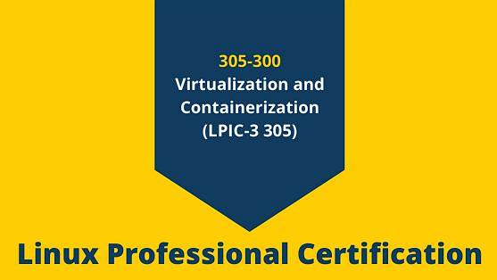
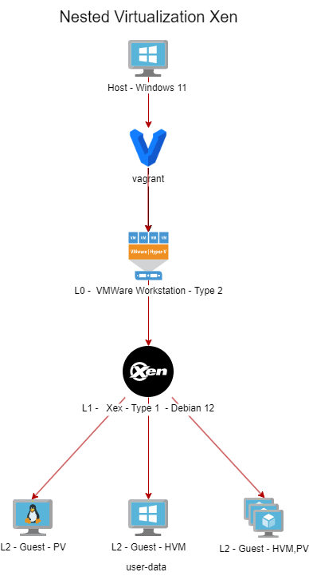
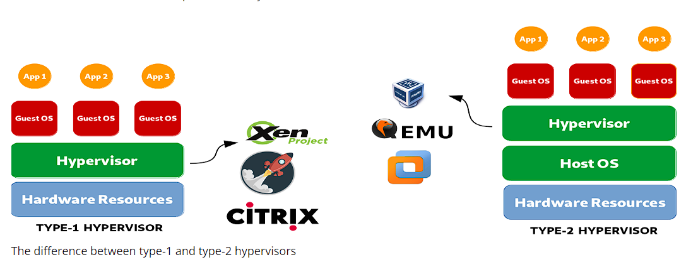
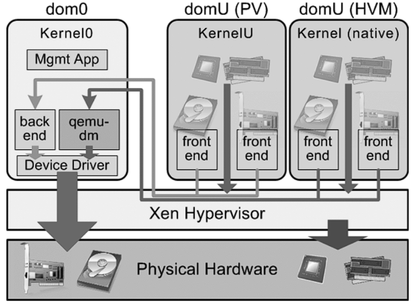
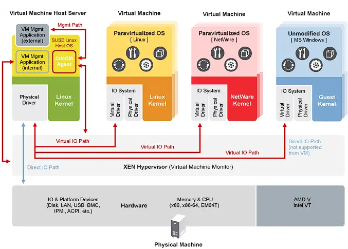
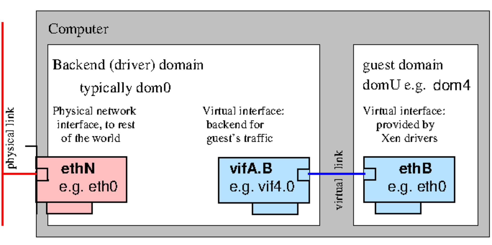
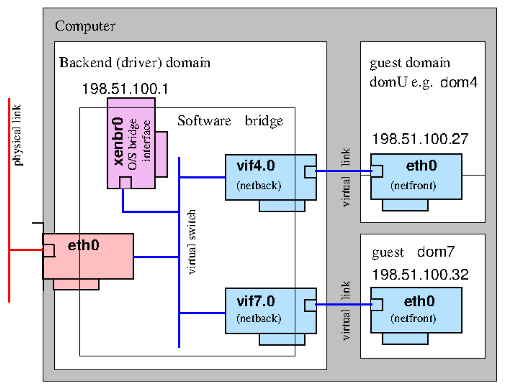
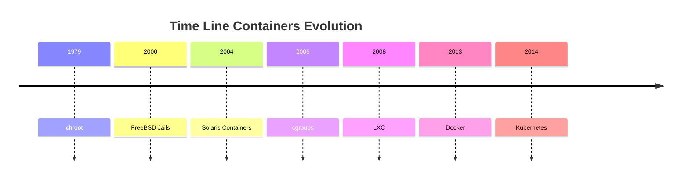

<h1><a name="readme-top"></a></h1>

[](https://github.com/marcossilvestrini/learning-lpic-3-305-300/actions/workflows/release.yml)
[](https://github.com/marcossilvestrini/learning-lpic-3-305-300/actions/workflows/translate.yml)
[](https://github.com/marcossilvestrini/learning-lpic-3-305-300/actions/workflows/jekyll-gh-pages.yml)
[](https://github.com/marcossilvestrini/learning-lpic-3-305-300/actions/workflows/generate-html.yml)
[](https://github.com/marcossilvestrini/learning-lpic-3-305-300/actions/workflows/powershell.yml)
[](https://github.com/marcossilvestrini/learning-lpic-3-305-300/actions/workflows/slack.yml)

---

[![MIT License][license-shield]][license-url]
[![Forks][forks-shield]][forks-url]
[![Stargazers][stars-shield]][stars-url]
[![Contributors][contributors-shield]][contributors-url]
[![Issues][issues-shield]][issues-url]
[![LinkedIn][linkedin-shield]][linkedin-url]

---

# LEARNING LPIC-3 305-300



<p align="center">
<strong>Explore the docs »</strong></a>
    <br />
    <a href="https://marcossilvestrini.github.io/learning-lpic-3-305-300/">Web Site</a>
    -
    <a href="https://github.com/marcossilvestrini/learning-lpic-3-305-300">Code Page</a>
    -
    <a href="https://github.com/marcossilvestrini/learning-lpic-3-305-300/issues">Report Bug</a>
    -
    <a href="https://github.com/marcossilvestrini/learning-lpic-3-305-300/issues">Request Feature</a>
</p>

---

## Summary

<details>
  <summary><b>TABLE OF CONTENT</b></summary>
  <ol>
    <li>
      <a href="#about-the-project">About The Project</a>
    </li>
    <li>
      <a href="#getting-started">Getting Started</a>
      <ul>
        <li><a href="#prerequisites">Prerequisites</a></li>
        <li><a href="#installation">installation</a></li>
      </ul>
    </li>
    <li><a href="#usage">Usage</a></li>
    <li><a href="#roadmap">Roadmap</a></li>
    <li><a href="#freedoms">Four Essential Freedoms</a></li>
    <li>
      <a href="#topic-351">Topic 351: Full Virtualization</a>
      <ul>
        <li><a href="#topic-351.1">351.1 Virtualization Concepts and Theory </a></li>
        <li><a href="#topic-351.2">351.2 Xen</a></li>
        <li><a href="#topic-351.3">351.3 QEMU</a></li>
        <li><a href="#topic-351.4">351.4 Libvirt Virtual Machine</a></li>
        <li><a href="#topic-351.5">351.5 Virtual Machine Disk Image Management</a></li>
      </ul>
    </li>
    <li>
      <a href="#topic-352">Topic 352: Container Virtualization</a>
      <ul>
        <li><a href="#topic-352.1">352.1 Container Virtualization Concepts</a></li>
        <li><a href="#topic-352.2">352.2 LXC</a></li>
        <li><a href="#topic-352.3">352.3 Docker</a></li>
        <li><a href="#topic-352.4">352.4 Container Orchestration Platforms</a></li>
      </ul>
    </li>
    <li>
      <a href="#topic-353">Topic 353: VM Deployment and Provisioning</a>
      <ul>
        <li><a href="#topic-353.1">353.1 Cloud Management Tools</a></li>
        <li><a href="#topic-353.2">353.2 Packer</a></li>
        <li><a href="#topic-353.3">353.3 cloud-init</a></li>
        <li><a href="#topic-353.4">353.4 Vagrant</a></li>
      </ul>
    </li>
    <li><a href="#license">License</a></li>
    <li><a href="#contact">Contact</a></li>
    <li><a href="#acknowledgments">Acknowledgments</a></li>
  </ol>
</details><br>

---

<a name="about-the-project"></a>

## About Project

>This project aims to help students or professionals to learn the main concepts of GNULinux
and free software\
Some GNULinux distributions like Debian and RPM will be covered\
Installation and configuration of some packages will also be covered\
By doing this you can give the whole community a chance to benefit from your changes.\
Access to the source code is a precondition for this.\
Use vagrant for up machines and execute labs and practice content in this article.\
I have published in folder Vagrant a Vagrantfile with what is necessary\
for you to upload an environment for studies

---

<p align="right">(<a href="#readme-top">back to top</a>)</p>

<a name="getting-started"></a>

## Getting Started

For starting the learning, see the documentation above.

<a name="prerequisites"></a>

### Prerequisites

* [Git](https://git-scm.com/book/en/v2/Getting-Started-Installing-Git)
* [VMware Workstation](https://blogs.vmware.com/workstation/2024/05/vmware-workstation-pro-now-available-free-for-personal-use.html)
* [Vagrant VMWare Utility](https://developer.hashicorp.com/vagrant/install/vmware)
* [Vagrant](https://developer.hashicorp.com/vagrant/install)

<a name="installation"></a>

### Installation

Clone the repo

```sh
git clone https://github.com/marcossilvestrini/learning-lpic-3-305-300.git
cd learning-lpic-3-305-300
```

Customize a template *Vagrantfile-topic-XXX*. This file contains a vms configuration for labs. Example:

* File [Vagrantfile-topic-351](./vagrant/Vagrantfile-topic-351)
  * vm.clone_directory = "<your_driver_letter>:\\<folder>\\<to_machine>\\#{VM_NAME}-instance-1"
    Example: vm.clone_directory = "E:\\Servers\\VMWare\\#{VM_NAME}-instance-1"
  * vm.vmx["memsize"] = ""
  * vm.vmx["numvcpus"] = ""
  * vm.vmx["cpuid.coresPerSocket"] = ""

Customize network configuration in files [configs/network](configs/network/). 

---

<a name="usage"></a>

## Usage

Use this repository for get learning about LPIC-3 305-300 exam

### For up and down

Switch a *Vagrantfile-topic-xxx* template and copy for a new file with name *Vagrantfile*

```sh
cd vagrant && vagrant up
cd vagrant && vagrant destroy -f
```

### For reboot vms

```sh
cd vagrant && vagrant reload
```

**Important:**
*If you reboot vms without vagrant, shared folder not mount after boot.*

### Use powershell for up and down

If you use Windows platform, I create a powershell script for up and down vms.

```powershell
vagrant/up.ps1
vagrant/destroy.ps1
```

### Infrastructure Schema Topic 352



<p align="right">(<a href="#readme-top">back to top</a>)</p>

---

<a name="roadmap"></a>

## Roadmap

* [x] Create repository
* [x] Create scripts for provisioning labs
* [x] Create examples about Topic 351
* [ ] Create examples about Topic 352
* [ ] Create examples about Topic 353
* [ ] Upload simulated itexam

---

<a name="freedoms"></a>

## Four Essential Freedoms

>0.The freedom to run the program as you wish, for any purpose (freedom 0).\
>1.The freedom to study how the program works, and change it so it does\
>your computing as you wish (freedom 1).\
>Access to the source code is a precondition for this.\
>2.The freedom to redistribute copies so you can help others (freedom 2).\
>3.freedom to distribute copies of your modified versions to others (freedom 3).

---

## Inspect commands

```sh
type COMMAND
apropos COMMAND
whatis COMMAND --long
whereis COMMAND
COMMAND --help, --h
man COMMAND
```

<p align="right">(<a href="#readme-top">back to top</a>)</p>

---

<a name="topic-351"></a>

## Topic 351: Full Virtualization



---

<a name="topic-351.1"></a>

### 351.1 Virtualization Concepts and Theory

**Weight:** 6  

**Description:** Candidates should know and understand the general concepts, theory and terminology of virtualization. This includes Xen, QEMU and libvirt terminology.

**Key Knowledge Areas:**

* Understand virtualization terminology
* Understand the pros and cons of virtualization
* Understand the various variations of Hypervisors and Virtual Machine Monitors
* Understand the major aspects of migrating physical to virtual machines
* Understand the major aspects of migrating virtual machines between host systems
* Understand the features and implications of virtualization for a virtual machine, such as snapshotting, pausing, cloning and resource limits
* Awareness of oVirt, Proxmox, systemd-machined and VirtualBox
* Awareness of Open vSwitch

#### 351.1 Cited Objects

```sh
Hypervisor
Hardware Virtual Machine (HVM)
Paravirtualization (PV)
Emulation and Simulation
CPU flags
/proc/cpuinfo
Migration (P2V, V2V)
```

#### Hypervisors

##### Type 1 Hypervisor (Bare-Metal Hypervisor)

###### Type 1 Definition

Runs directly on the host's physical hardware, providing a base layer to manage VMs without the need for a host operating system.  

###### Type 1 Characteristics

* High performance and efficiency.
* Lower latency and overhead.
* Often used in enterprise environments and data centers.

###### Type 1 Examples

* VMware ESXi: A robust and widely used hypervisor in enterprise settings.
* Microsoft Hyper-V: Integrated with Windows Server, offering strong performance and management features.
* Xen: An open-source hypervisor used by many cloud service providers.
* KVM (Kernel-based Virtual Machine): Integrated into the Linux kernel, providing high performance for Linux-based systems.

##### Type 2 Hypervisor (Hosted Hypervisor)

###### Type 2 Definition

Runs on top of a conventional operating system, relying on the host OS for resource management and device support.

###### Type 2 Characteristics

* Easier to set up and use, especially on personal computers.
* More flexible for development, testing, and smaller-scale deployments.
* Typically less efficient than Type 1 hypervisors due to additional overhead from the host OS.

###### Type 2 Examples

* VMware Workstation: A powerful hypervisor for running multiple operating systems on a single desktop.
* Oracle VirtualBox: An open-source hypervisor known for its flexibility and ease of use.
* Parallels Desktop: Designed for Mac users to run Windows and other operating systems alongside macOS.
* QEMU (Quick EMUlator): An open-source emulator and virtualizer, often used in conjunction with KVM.

##### Key Differences Between Type 1 and Type 2 Hypervisors

* Deployment Environment:
  * Type 1 hypervisors are commonly deployed in data centers and enterprise environments due to their direct interaction with hardware and high performance.
  * Type 2 hypervisors are more suitable for personal use, development, testing, and small-scale virtualization tasks.
* Performance:
  * Type 1 hypervisors generally offer better performance and lower latency because they do not rely on a host OS.
  * Type 2 hypervisors may experience some performance degradation due to the overhead of running on top of a host OS.
* Management and Ease of Use:
  * Type 1 hypervisors require more complex setup and management but provide advanced features and scalability for large-scale deployments.
  * Type 2 hypervisors are easier to install and use, making them ideal for individual users and smaller projects.
  
##### Migration Types

In the context of hypervisors, which are technologies used to create and manage virtual machines, the terms P2V migration and V2V migration are common in virtualization environments.  
They refer to processes of migrating systems between different types of platforms.

##### P2V - Physical to Virtual Migration

P2V migration refers to the process of migrating a physical server to a virtual machine.  
In other words, an operating system and its applications, running on dedicated physical hardware, are "converted" and moved to a virtual machine that runs on a hypervisor (such as VMware, Hyper-V, KVM, etc.).

* Example: You have a physical server running a Windows or Linux system, and you want to move it to a virtual environment, like a cloud infrastructure or an internal virtualization server.  
The process involves copying the entire system state, including the operating system, drivers, and data, to create an equivalent virtual machine that can run as if it were on the physical hardware.

##### V2V  - Virtual to Virtual Migration

V2V migration refers to the process of migrating a virtual machine from one hypervisor to another.  
In this case, you already have a virtual machine running in a virtualized environment (like VMware), and you want to move it to another virtualized environment (for example, to Hyper-V or to a new VMware server).

* Example: You have a virtual machine running on a VMware virtualization server, but you decide to migrate it to a Hyper-V platform. In this case, the V2V migration converts the virtual machine from one format or hypervisor to another, ensuring it can continue running correctly.

#### HVM and Paravirtualization

##### Hardware-assisted Virtualization (HVM)

###### HVM Definition

HVM leverages hardware extensions provided by modern CPUs to virtualize hardware, enabling the creation and management of VMs with minimal performance overhead.

###### HVM Key Characteristics

* **Hardware Support**: Requires CPU support for virtualization extensions such as Intel VT-x or AMD-V.
* **Full Virtualization:** VMs can run unmodified guest operating systems, as the hypervisor provides a complete emulation of the hardware environment.
* **Performance:** Typically offers near-native performance because of direct execution of guest code on the CPU.
* **Isolation:** Provides strong isolation between VMs since each VM operates as if it has its own dedicated hardware.

###### HVM Examples

VMware ESXi, Microsoft Hyper-V, KVM (Kernel-based Virtual Machine).

###### HVM Advantages

* **Compatibility:** Can run any operating system without modification.
* **Performance:** High performance due to hardware support.
* **Security:** Enhanced isolation and security features provided by hardware.

###### HVM Disadvantages

* **Hardware Dependency:** Requires specific hardware features, limiting compatibility with older systems.
* **Complexity:** May involve more complex configuration and management.

##### Paravirtualization

###### Paravirtualization Definition

Paravirtualization involves modifying the guest operating system to be aware of the virtual environment, allowing it to interact more efficiently with the hypervisor.

###### Paravirtualization Key Characteristics

* **Guest Modification:** Requires changes to the guest operating system to communicate directly with the hypervisor using hypercalls.
* **Performance:** Can be more efficient than traditional full virtualization because it reduces the overhead associated with emulating hardware.
* **Compatibility:** Limited to operating systems that have been modified for paravirtualization.

###### Paravirtualization Examples

Xen with paravirtualized guests, VMware tools in certain configurations, and some KVM configurations.

###### Paravirtualization Advantages

* **Efficiency:** Reduces the overhead of virtualizing hardware, potentially offering better performance for certain workloads.
* **Resource Utilization:** More efficient use of system resources due to direct communication between the guest OS and hypervisor.

###### Paravirtualization Disadvantages

* **Guest OS Modification:** Requires modifications to the guest OS, limiting compatibility to supported operating systems.
* **Complexity:** Requires additional complexity in the guest OS for hypercall implementations.

##### Key Differences

###### Guest OS Requirements

* **HVM:** Can run unmodified guest operating systems.
* **Paravirtualization:** Requires guest operating systems to be modified to work with the hypervisor.

###### Performance

* **HVM:** Typically provides near-native performance due to hardware-assisted execution.
* **Paravirtualization:** Can offer efficient performance by reducing the overhead of hardware emulation, but relies on modified guest OS.

###### Hardware Dependency

* **HVM:** Requires specific CPU features (Intel VT-x, AMD-V).
* **Paravirtualization:** Does not require specific CPU features but needs modified guest OS.

###### Isolation

* **HVM:** Provides strong isolation using hardware features.
* **Paravirtualization:** Relies on software-based isolation, which may not be as robust as hardware-based isolation.

###### Complexity

* **HVM:** Generally more straightforward to deploy since it supports unmodified OS.
* **Paravirtualization:** Requires additional setup and modifications to the guest OS, increasing complexity.
  
#### NUMA (Non-Uniform Memory Access)

NUMA (Non-Uniform Memory Access) is a memory architecture used in multiprocessor systems to optimize memory access by processors.  
In a NUMA system, memory is distributed unevenly among processors, meaning that each processor has faster access to a portion of memory (its "local memory") than to memory that is physically further away (referred to as "remote memory") and associated with other processors.

##### Key Features of NUMA Architecture

1. **Local and Remote Memory**: Each processor has its own local memory, which it can access more quickly. However, it can also access the memory of other processors, although this takes longer.
2. **Differentiated Latency**: The latency of memory access varies depending on whether the processor is accessing its local memory or the memory of another node. Local memory access is faster, while accessing another node’s memory (remote) is slower.
3. **Scalability**: NUMA architecture is designed to improve scalability in systems with many processors. As more processors are added, memory is also distributed, avoiding the bottleneck that would occur in a uniform memory access (UMA) architecture.

##### Advantages of NUMA

* Better Performance in Large Systems: Since each processor has local memory, it can work more efficiently without competing as much with other processors for memory access.
* Scalability: NUMA allows systems with many processors and large amounts of memory to scale more effectively compared to a UMA architecture.

##### Disadvantages

* Programming Complexity: Programmers need to be aware of which regions of memory are local or remote, optimizing the use of local memory to achieve better performance.
* Potential Performance Penalties: If a processor frequently accesses remote memory, performance may suffer due to higher latency.
This architecture is common in high-performance multiprocessor systems, such as servers and supercomputers, where scalability and memory optimization are critical.

#### Opensource Solutions

* oVirt: https://www.ovirt.org/

* Proxmox: https://www.proxmox.com/en/proxmox-virtual-environment/overview

* Oracle VirtualBox: https://www.virtualbox.org/

* Open vSwitch: https://www.openvswitch.org/
  
#### Types of Virtualization

##### Hardware Virtualization (Server Virtualization)

###### HV Definition

Abstracts physical hardware to create virtual machines (VMs) that run separate operating systems and applications.  

###### HV Use Cases

Data centers, cloud computing, server consolidation.

###### HV Examples

VMware ESXi, Microsoft Hyper-V, KVM.

##### Operating System Virtualization (Containerization)

###### Containerization Definition

Allows multiple isolated user-space instances (containers) to run on a single OS kernel.

###### Containerization Use Cases

Microservices architecture, development and testing environments.

###### Containerization Examples

Docker, Kubernetes, LXC.

##### Network Virtualization

###### Network Virtualization Definition

Combines hardware and software network resources into a single, software-based administrative entity.

###### Network Virtualization Use Cases

Software-defined networking (SDN), network function virtualization (NFV).

###### Network Virtualization Examples

VMware NSX, Cisco ACI, OpenStack Neutron.

##### Storage Virtualization

###### Storage VirtualizationDefinition

Pools physical storage from multiple devices into a single virtual storage unit that can be managed centrally.

###### Storage VirtualizationDefinition Use Cases

Data management, storage optimization, disaster recovery.

###### Storage VirtualizationDefinition Examples

IBM SAN Volume Controller, VMware vSAN, NetApp ONTAP.

##### Desktop Virtualization

###### Desktop Virtualization Definition

Allows a desktop operating system to run on a virtual machine hosted on a server.

###### Desktop Virtualization Definition Use Cases

Virtual desktop infrastructure (VDI), remote work solutions.

###### Desktop Virtualization Definition Examples

Citrix Virtual Apps and Desktops, VMware Horizon, Microsoft Remote Desktop Services.

##### Application Virtualization

###### Application VirtualizationDefinition

Separates applications from the underlying hardware and operating system, allowing them to run in isolated environments.

###### Application VirtualizationDefinition Use Cases

Simplified application deployment, compatibility testing.

###### Application VirtualizationDefinition Examples

VMware ThinApp, Microsoft App-V, Citrix XenApp.

##### Data Virtualization

###### Data VirtualizationDefinition

Integrates data from various sources without physically consolidating it, providing a unified view for analysis and reporting.

###### Data VirtualizationDefinition Use Cases

Business intelligence, real-time data integration.

###### Data VirtualizationDefinition Examples

Denodo, Red Hat JBoss Data Virtualization, IBM InfoSphere.

##### Benefits of Virtualization

* Resource Efficiency: Better utilization of physical resources.
* Cost Savings: Reduced hardware and operational costs.
* Scalability: Easy to scale up or down according to demand.
* Flexibility: Supports a variety of workloads and applications.
* Disaster Recovery: Simplified backup and recovery processes.
* Isolation: Improved security through isolation of environments.

<p align="right">(<a href="#topic-351.1">back to sub Topic 351.1</a>)</p>
<p align="right">(<a href="#topic-351">back to Topic 351</a>)</p>
<p align="right">(<a href="#readme-top">back to top</a>)</p>

---

<a name="topic-351.2"></a>

### 351.2 Xen





**Weight:** 3

**Description:** Candidates should be able to install, configure, maintain, migrate and troubleshoot Xen installations. The focus is on Xen version 4.x.

**Key Knowledge Areas:**

* Understand architecture of Xen, including networking and storage
* Basic configuration of Xen nodes and domains
* Basic management of Xen nodes and domains
* Basic troubleshooting of Xen installations
* Awareness of XAPI
* Awareness of XenStore
* Awareness of Xen Boot Parameters
* Awareness of the xm utility

#### Xen


Xen is an open-source type-1 (bare-metal) hypervisor, which allows multiple operating systems to run concurrently on the same physical hardware.  
Xen provides a layer between the physical hardware and virtual machines (VMs), enabling efficient resource sharing and isolation.

* **Architecture:** Xen operates with a two-tier system where Domain 0 (Dom0) is the privileged domain with direct hardware access and manages the hypervisor. Other virtual machines, called Domain U (DomU), run guest operating systems and are managed by Dom0.
* **Types of Virtualization:** Xen supports both paravirtualization (PV), which requires modified guest OS, and hardware-assisted virtualization (HVM), which uses hardware extensions (e.g., Intel VT-x or AMD-V) to run unmodified guest operating systems.
Xen is widely used in cloud environments, notably by Amazon Web Services (AWS) and other large-scale cloud providers.

#### XenSource

XenSource was the company founded by the original developers of the Xen hypervisor at the University of Cambridge to commercialize Xen.  
The company provided enterprise solutions based on Xen and offered additional tools and support to enhance Xen’s capabilities for enterprise use.

* **Acquisition by Citrix**: In 2007, XenSource was acquired by Citrix Systems, Inc. Citrix used Xen technology as the foundation for its Citrix XenServer product, which became a popular enterprise-grade virtualization platform based on Xen.
* **Transition**: After the acquisition, the Xen project continued as an open-source project, while Citrix focused on commercial offerings like XenServer, leveraging XenSource technology.

#### Xen Project

Xen Project refers to the open-source community and initiative responsible for developing and maintaining the Xen hypervisor after its commercialization.  
The Xen Project operates under the Linux Foundation, with a focus on building, improving, and supporting Xen as a collaborative, community-driven effort.

* **Goals:** The Xen Project aims to advance the hypervisor by improving its performance, security, and feature set for a wide range of use cases, including cloud computing, security-focused virtualization (e.g., Qubes OS), and embedded systems.
* **Contributors:** The project includes contributors from various organizations, including major cloud providers, hardware vendors, and independent developers.
* **XAPI and XenTools:** The Xen Project also includes tools such as XAPI (XenAPI), which is used for managing Xen hypervisor installations, and various other utilities for system management and optimization.

#### XenStore

Xen Store is a critical component of the Xen Hypervisor.  
Essentially, Xen Store is a distributed key-value database used for communication and information sharing between the Xen hypervisor and the virtual machines (also known as domains) it manages.

Here are some key aspects of Xen Store:

* **Inter-Domain Communication:** Xen Store enables communication between domains, such as Dom0 (the privileged domain that controls hardware resources) and DomUs (user domains, which are the VMs). This is done through key-value entries, where each domain can read or write information.

* **Configuration Management:** It is used to store and access configuration information, such as virtual devices, networking, and boot parameters. This facilitates the dynamic management and configuration of VMs.

* **Events and Notifications:** Xen Store also supports event notifications. When a particular key or value in the Xen Store is modified, interested domains can be notified to react to these changes. This is useful for monitoring and managing resources.

* Simple API: Xen Store provides a simple API for reading and writing data, making it easy for developers to integrate their applications with the Xen virtualization system.

#### XAPI

XAPI, or XenAPI, is the application programming interface (API) used to manage the Xen Hypervisor and its virtual machines (VMs).  
XAPI is a key component of XenServer (now known as Citrix Hypervisor) and provides a standardized way to interact with the Xen hypervisor to perform operations such as creating, configuring, monitoring, and controlling VMs.

Here are some important aspects of XAPI:

* **VM Management:** XAPI allows administrators to programmatically create, delete, start, and stop virtual machines.

* **Automation:** With XAPI, it's possible to automate the management of virtual resources, including networking, storage, and computing, which is crucial for large cloud environments.

* **Integration:** XAPI can be integrated with other tools and scripts to provide more efficient and customized administration of the Xen environment.

* **Access Control:** XAPI also provides access control mechanisms to ensure that only authorized users can perform specific operations in the virtual environment.

XAPI is the interface that enables control and automation of the Xen Hypervisor, making it easier to manage virtualized environments.

#### Xen Summary

* **Xen:** The core hypervisor technology enabling virtual machines to run on physical hardware.
* **XenSource:** The company that commercialized Xen, later acquired by Citrix, leading to the development of Citrix XenServer.
* **Xen Project:** The open-source initiative and community that continues to develop and maintain the Xen hypervisor under the Linux Foundation.
* **XenStore:**  Xen Store acts as a communication and configuration intermediary between the Xen hypervisor and the VMs, streamlining the operation and management of virtualized environments.
* **XAPI** is the interface that enables control and automation of the Xen Hypervisor, making it easier to manage virtualized environments.

#### Domain0 (Dom0)

Domain0, or Dom0, is the control domain in a Xen architecture. It manages other domains (DomUs) and has direct access to hardware.  
Dom0 runs device drivers, allowing DomUs, which lack direct hardware access, to communicate with devices. Typically, it is a full instance of an operating system, like Linux, and is essential for Xen hypervisor operation.

#### DomainU (DomU)

DomUs are non-privileged domains that run virtual machines.  
They are managed by Dom0 and do not have direct access to hardware. DomUs can be configured to run different operating systems and are used for various purposes, such as application servers and development environments. They rely on Dom0 for hardware interaction.

#### PV-DomU (Paravirtualized DomainU)

PV-DomUs use a technique called paravirtualization. In this model, the DomU operating system is modified to be aware that it runs in a virtualized environment, allowing it to communicate directly with the hypervisor for optimized performance.  
This results in lower overhead and better efficiency compared to full virtualization.

#### HVM-DomU (Hardware Virtual Machine DomainU)

HVM-DomUs are virtual machines that utilize full virtualization, allowing unmodified operating systems to run. The Xen hypervisor provides hardware emulation for these DomUs, enabling them to run any operating system that supports the underlying hardware architecture.  
While this offers greater flexibility, it can result in higher overhead compared to PV-DomUs.

#### Xen Network

Paravirtualised Network Devices


Bridging


#### 351.2 Cited Objects

```sh
Domain0 (Dom0), DomainU (DomU)
PV-DomU, HVM-DomU
/etc/xen/
xl
xl.cfg 
xl.conf # Xen global configurations
xentop
oxenstored # Xenstore configurations
```

#### 351.2 Notes

```sh

# Xen Settings
/etc/xen/
/etc/xen/xl.conf - Main general configuration file for Xen
/etc/xen/oxenstored.conf - Xenstore configurations

# VM Configurations
/etc/xen/xlexample.pvlinux
/etc/xen/xlexample.hvm

# Service Configurations
/etc/default/xen
/etc/default/xendomains

# xen-tools configurations
/etc/xen-tools/
/usr/share/xen-tools/

# docs
xl(1)
xl.conf(5)
xlcpupool.cfg(5)
xl-disk-configuration(5)
xl-network-configuration(5)
xen-tscmode(7)
```

#### 351.2 Important Commands

##### xen-create-image

```sh
# create a pv image
xen-create-image \
  --hostname=lpic3-pv-guest \
  --memory=1gb \
  --vcpus=2 \
  --lvm=vg_xen \
  --dhcp \
  --pygrub \
  --dist=bookworm
```

##### xen-list-images

```sh
# list image
xen-list-image
```

##### xen-delete-image

```sh
# delete a pv image
xen-delete-image lpic3-pv-guest --lvm=vg_xen
```

##### xenstore-ls

```sh
# list xenstore infos
xenstore-ls
```

##### brctl

```sh
# list xen interfaces
brctl show
```
##### xl

```sh
# view xen information
xl infos

# list Domains
xl list
xl list lpic3-hvm-guest
xl list lpic3-hvm-guest -l

# uptime Domains
xl uptime

# pause Domain
xl pause 2
xl pause lpic3-hvm-guest

# save state Domains
xl -v save lpic3-hvm-guest ~root/image-lpic3-hvm-guest.save

# restore Domain
xl restore /root/image-lpic3-hvm-guest.save

# get Domain name
xl domname 2

# view dmesg information
xl dmesg

# monitoring domain
xl top
xentop
xen top

# Limit mem Dom0
xl mem-set 0 2048

# Limite cpu (not permanent after boot)
xl vcpu-set 0 2

# manual conf
man xl.conf

# manual cfg - about guest configuration
man xl.cfg

# create DomainU - virtual machine
xl create /etc/xen/lpic3-pv-guest.cfg

# create DomainU virtual machine and connect to guest
xl create -c /etc/xen/lpic3-pv-guest.cfg

# create DomainU virtual machine HVM

## configure /etc/xen/lpic3-hvm-guest.cfg

## create logical volume
lvcreate -l +20%FREE -n lpic3-hvm-guest-disk  vg_xen

## create a ssh tunel for vnc
ssh -l vagrant -L 5900:localhost:5900  192.168.0.130

## create domain hvm
xl create /etc/xen/lpic3-hvm-guest.cfg

## open vcn conectio in your vnc client with localhost

# connect in domain guest
xl console <id>|<name> (press enter)
xl console 1
xl console lpic3-pv-guest

#How do I exit domU "xl console" session
#Press ctrl+] or if you're using Putty press ctrl+5.

# Poweroff domain
xl shutdown lpic3-pv-guest

# destroy domain
xl destroy lpic3-pv-guest

# reboot domain
xl reboot lpic3-pv-guest
```


<p align="right">(<a href="#topic-351.2">back to sub Topic 351.2</a>)</p>
<p align="right">(<a href="#topic-351">back to Topic 351</a>)</p>
<p align="right">(<a href="#readme-top">back to top</a>)</p>

---

<a name="topic-351.3"></a>

### 351.3 QEMU

**Weight:** 4

**Description:** Candidates should be able to install, configure, maintain, migrate and troubleshoot QEMU installations.

**Key Knowledge Areas:**

* Understand the architecture of QEMU, including KVM, networking and storage
* Start QEMU instances from the command line
* Manage snapshots using the QEMU monitor
* Install the QEMU Guest Agent and VirtIO device drivers
* Troubleshoot QEMU installations, including networking and storage
* Awareness of important QEMU configuration parameters

#### 351.3 Cited Objects

```sh
Kernel modules: kvm, kvm-intel and kvm-amd
/dev/kvm
QEMU monitor
qemu
qemu-system-x86_64
ip
brctl
tunctl
```

#### 351.3 Important Commands

##### ip

```sh
# list links
ip link show
```

<p align="right">(<a href="#topic-351.3">back to sub Topic 351.3</a>)</p>
<p align="right">(<a href="#topic-351">back to Topic 351</a>)</p>
<p align="right">(<a href="#readme-top">back to top</a>)</p>

---

<a name="topic-351.4"></a>

### 351.4 Libvirt Virtual Machine Management

**Weight:** 9

**Description:** Candidates should be able to manage virtualization hosts and virtual machines (‘libvirt domains’) using libvirt and related tools.

**Key Knowledge Areas:**

* Understand the architecture of libvirt
* Manage libvirt connections and nodes
* Create and manage QEMU and Xen domains, including snapshots
* Manage and analyze resource consumption of domains
* Create and manage storage pools and volumes
* Create and manage virtual networks
* Migrate domains between nodes
* Understand how libvirt interacts with Xen and QEMU
* Understand how libvirt interacts with network services such as dnsmasq and radvd
* Understand libvirt XML configuration files
* Awareness of virtlogd and virtlockd

#### 351.4 Cited Objects

```sh
libvirtd
/etc/libvirt/
virsh (including relevant subcommands)
```

#### 351.4 Important Commands

##### foo

```sh
foo
```

<p align="right">(<a href="#topic-351.4">back to sub Topic 351.4</a>)</p>
<p align="right">(<a href="#topic-351">back to Topic 351</a>)</p>
<p align="right">(<a href="#readme-top">back to top</a>)</p>

---

<a name="topic-351.5"></a>

### 351.5 Virtual Machine Disk Image Management

**Weight:** 3

**Description:** Candidates should be able to manage virtual machines disk images. This includes converting disk images between various formats and hypervisors and accessing data stored within an image.

**Key Knowledge Areas:**

* Understand features of various virtual disk image formats, such as raw images, qcow2 and VMDK
* Manage virtual machine disk images using qemu-img
* Mount partitions and access files contained in virtual machine disk images using libguestfish
* Copy physical disk content to a virtual machine disk image
* Migrate disk content between various virtual machine disk image formats
* Awareness of Open Virtualization Format (OVF)

#### 351.5 Cited Objects

```sh
qemu-img
guestfish (including relevant subcommands)
guestmount
guestumount
virt-cat
virt-copy-in
virt-copy-out
virt-diff
virt-inspector
virt-filesystems
virt-rescue
virt-df
virt-resize
virt-sparsify
virt-p2v
virt-p2v-make-disk
virt-v2v
virt-sysprep
```

#### 351.5 Important Commands

##### foo

```sh
foo
```

<p align="right">(<a href="#topic-351.5">back to sub Topic 351.5</a>)</p>
<p align="right">(<a href="#topic-351">back to Topic 351</a>)</p>
<p align="right">(<a href="#readme-top">back to top</a>)</p>

---

<a name="topic-352"></a>

## Topic 352: Container Virtualization

---

<a name="topic-352.1"></a>

### 352.1  Container Virtualization Concepts

**Weight:** 7

**Description:** Candidates should understand the concept of container virtualization. This includes understanding the Linux components used to implement container virtualization as well as using standard Linux tools to troubleshoot these components.

**Key Knowledge Areas:**

* Understand the concepts of system and application container
* Understand and analyze kernel namespaces
* Understand and analyze control groups
* Understand and analyze capabilities
* Understand the role of seccomp, SELinux and AppArmor for container virtualization
* Understand how LXC and Docker leverage namespaces, cgroups, capabilities, seccomp and MAC
* Understand the principle of runc
* Understand the principle of CRI-O and containerd
* Awareness of the OCI runtime and image specifications
* Awareness of the Kubernetes Container Runtime Interface (CRI)
* Awareness of podman, buildah and skopeo
* Awareness of other container virtualization approaches in Linux and other free operating systems, such as rkt, OpenVZ, systemd-nspawn or BSD Jails



#### 352.1 Cited Objects

```sh
nsenter
unshare
ip (including relevant subcommands)
capsh
/sys/fs/cgroups
/proc/[0-9]+/ns
/proc/[0-9]+/status
```

#### 352.1 Important Commands

##### foo

```sh
foo
```

<p align="right">(<a href="#topic-352.1">back to sub topic 352.1</a>)</p>
<p align="right">(<a href="#topic-352">back to topic 352</a>)</p>
<p align="right">(<a href="#readme-top">back to top</a>)</p>

---

<a name="topic-352.2"></a>

### 352.2 LXC

**Weight:** 6

**Description:** Candidates should be able to use system containers using LXC and LXD. The version of LXC covered is 3.0 or higher.

**Key Knowledge Areas:**

* Understand the architecture of LXC and LXD
* Manage LXC containers based on existing images using LXD, including networking and storage
* Configure LXC container properties
* Limit LXC container resource usage
* Use LXD profiles
* Understand LXC images
* Awareness of traditional LXC tools

#### 352.2 Cited Objects

```sh
lxd
lxc (including relevant subcommands)
```

#### 352.2 Important Commands

##### foo

```sh
foo
```

<p align="right">(<a href="#topic-352.2">back to sub topic 352.2</a>)</p>
<p align="right">(<a href="#topic-352">back to topic 352</a>)</p>
<p align="right">(<a href="#readme-top">back to top</a>)</p>

---

<a name="topic-352.3"></a>

### 352.3 Docker

**Weight:** 9

**Description:** Candidate should be able to manage Docker nodes and Docker containers. This include understand the architecture of Docker as well as understanding how Docker interacts with the node’s Linux system.

**Key Knowledge Areas:**

* Understand the architecture and components of Docker
* Manage Docker containers by using images from a Docker registry
* Understand and manage images and volumes for Docker containers
* Understand and manage logging for Docker containers
* Understand and manage networking for Docker
* Use Dockerfiles to create container images
* Run a Docker registry using the registry Docker image

#### 352.3 Cited Objects

```sh
dockerd
/etc/docker/daemon.json
/var/lib/docker/
docker
Dockerfile
```


#### 352.3 Important Commands

##### docker

```sh
# Examples of docker
```

<p align="right">(<a href="#topic-352.3">back to sub topic 352.3</a>)</p>
<p align="right">(<a href="#topic-352">back to topic 352</a>)</p>
<p align="right">(<a href="#readme-top">back to top</a>)</p>

---

<a name="topic-352.4"></a>

### 352.4 Container Orchestration Platforms

**Weight:** 3

**Description:** Candidates should understand the importance of container orchestration and the key concepts Docker Swarm and Kubernetes provide to implement container orchestration.

**Key Knowledge Areas:**

* Understand the relevance of container orchestration
* Understand the key concepts of Docker Compose and Docker Swarm
* Understand the key concepts of Kubernetes and Helm
* Awareness of OpenShift, Rancher and Mesosphere DC/OS

<p align="right">(<a href="#topic-352.4">back to sub topic 352.4</a>)</p>
<p align="right">(<a href="#topic-352">back to topic 352</a>)</p>
<p align="right">(<a href="#readme-top">back to top</a>)</p>

---

<a name="topic-353"></a>

## Topic 353: VM Deployment and Provisioning

---

<a name="topic-353.1"></a>

### 353.1  Cloud Management Tools

**Weight:** 2

**Description:** Candidates should understand common offerings in public clouds and have basic feature knowledge of commonly available cloud management tools.

**Key Knowledge Areas:**

* Understand common offerings in public clouds
* Basic feature knowledge of OpenStack
* Basic feature knowledge of Terraform
* Awareness of CloudStack, Eucalyptus and OpenNebula

#### 353.1 Cited Objects

```sh
IaaS, PaaS, SaaS
OpenStack
Terraform
```

#### 353.1 Important Commands

##### foo

```sh
# examples
```

<p align="right">(<a href="#topic-353.1">back to sub topic 353.1</a>)</p>
<p align="right">(<a href="#topic-353">back to topic 353</a>)</p>
<p align="right">(<a href="#readme-top">back to top</a>)</p>

---

<a name="topic-353.2"></a>

### 353.2 Packer

**Weight:** 2

**Description:** Candidates should be able to use Packer to create system images. This includes running Packer in various public and private cloud environments as well as building container images for LXC/LXD.

**Key Knowledge Areas:**

* Understand the functionality and features of Packer
* Create and maintain template files
* Build images from template files using different builders

#### 353.2 Cited Objects

```sh
packer
```

#### 353.2 Important Commands

##### packer

```sh
# examples
```

<p align="right">(<a href="#topic-353.2">back to sub topic 353.2</a>)</p>
<p align="right">(<a href="#topic 353">back to topic 353</a>)</p>
<p align="right">(<a href="#readme-top">back to top</a>)</p>

---

<a name="topic-353.3"></a>

### 353.3 cloud-init

**Weight:** 3

**Description:** Candidates should able to use cloud-init to configure virtual machines created from standardized images. This includes adjusting virtual machines to match their available hardware resources, specifically, disk space and volumes.  
Additionally, candidates should be able to configure instances to allow secure SSH logins and install a specific set of software packages.  
Furthermore, candidates should be able to create new system images with cloud-init support.

**Key Knowledge Areas:**

* Understanding the features and concepts of cloud-init, including user-data, initializing and configuring cloud-init
* Use cloud-init to create, resize and mount file systems, configure user accounts, including login credentials such as SSH keys and install software packages from the distribution’s repository
* Integrate cloud-init into system images
* Use config drive datasource for testing

#### 353.3 Cited Objects

```sh
cloud-init
user-data
/var/lib/cloud/
```

#### 353.3 Important Commands

##### foo

```sh
# examples
```

<p align="right">(<a href="#topic-353.3">back to sub topic 353.3</a>)</p>
<p align="right">(<a href="#topic 353">back to topic 353</a>)</p>
<p align="right">(<a href="#readme-top">back to top</a>)</p>

---

<a name="topic-353.4"></a>

### 353.4 Vagrant

**Weight:** 3

**Description:** Candidate should be able to use Vagrant to manage virtual machines, including provisioning of the virtual machine.

**Key Knowledge Areas:**

* Understand Vagrant architecture and concepts, including storage and networking
* Retrieve and use boxes from Atlas
* Create and run Vagrantfiles
* Access Vagrant virtual machines
* Share and synchronize folder between a Vagrant virtual machine and the host system
* Understand Vagrant provisioning, i.e. File and Shell provisioners
* Understand multi-machine setup

#### 353.4 Cited Objects

```sh
vagrant
Vagrantfile
```

#### 353.4 Important Commands

##### vagrant

```sh
# examples
```

<p align="right">(<a href="#topic-353.4">back to sub topic 353.4</a>)</p>
<p align="right">(<a href="#topic 353">back to topic 353</a>)</p>
<p align="right">(<a href="#readme-top">back to top</a>)</p>

---

## Contributing

Contributions are what make the open source community such an amazing place to
learn, inspire, and create. Any contributions you make are **greatly appreciated**.

If you have a suggestion that would make this better, please fork the repo and
create a pull request. You can also simply open an issue with the tag "enhancement".
Don't forget to give the project a star! Thanks again!

1. Fork the Project
2. Create your Feature Branch (`git checkout -b feature/AmazingFeature`)
3. Commit your Changes (`git commit -m 'Add some AmazingFeature'`)
4. Push to the Branch (`git push origin feature/AmazingFeature`)
5. Open a Pull Request

---

## License

* This project is licensed under the MIT License * see the LICENSE.md file for details

---

## Contact

Marcos Silvestrini - marcos.silvestrini@gmail.com \
[](https://twitter.com/mrsilvestrini)

Project Link: [https://github.com/marcossilvestrini/learning-lpic-3-305-300](https://github.com/marcossilvestrini/learning-lpic-3-305-300)

<p align="right">(<a href="#readme-top">back to top</a>)</p>

---

## Acknowledgments

* [Richard Stallman's](http://www.stallman.org/)
* [GNU]()
  * [GNU/Linux FAQ by Richard Stallman](https://www.gnu.org/gnu/gnu-linux-faq.html)
  * [GNU](https://www.gnu.org/)
  * [GNU Operating System](https://www.gnu.org/gnu/thegnuproject.html)
  * [GCC Compiler](https://gcc.gnu.org/wiki/History)
  * [GNU Tar](https://www.gnu.org/software/tar/)
  * [GNU Make](https://www.gnu.org/software/make/)
  * [GNU Emacs](https://en.wikipedia.org/wiki/Emacs)
  * [GNU Packages](https://www.gnu.org/software/)
  * [GNU/Linux Collection](https://directory.fsf.org/wiki/Collection:GNU/Linux)
  * [GNU Grub Bootloader](https://www.gnu.org/software/grub/)
  * [GNU Hurd](https://www.gnu.org/software/hurd/hurd/what_is_the_gnu_hurd.html)
* [Kernel]()
  * [Kernel](https://www.kernel.org/)
  * [Linux Kernel Man Pages](https://www.kernel.org/doc/man-pages/)
  * [Compile Your Kernel](https://wiki.linuxquestions.org/wiki/How_to_build_and_install_your_own_Linux_kernel)
* [Linux Standard Base]()
  * [Linux Standard Base](https://en.wikipedia.org/wiki/Linux_Standard_Base)
  * [Filesystem Hierarchy Standard](https://en.wikipedia.org/wiki/Filesystem_Hierarchy_Standard)
  * [File Hierarchy Structure](https://refspecs.linuxfoundation.org/FHS_3.0/fhs-3.0.pdf)
* [Free Software]()
  * [FSF](https://www.fsf.org)
  * [Free Software Directory](https://directory.fsf.org/wiki/Free_Software_Directory:Free_software_replacements)
* [License]()
  * [Free Software](https://www.gnu.org/philosophy/free-sw.html)
  * [Copyleft](https://www.gnu.org/licenses/copyleft.en.html)
  * [GPL](https://www.gnu.org/licenses/quick-guide-gplv3.html)
  * [GNU Lesser General Public License](https://www.gnu.org/licenses/lgpl-3.0.html)
  * [BSD](https://opensource.org/licenses/BSD-3-Clause)
  * [Open Source Initiative](https://opensource.org/)
  * [Creative Commons](https://creativecommons.org/)
  * [License LTS](https://en.wikipedia.org/wiki/Long-term_support)
* [Distros]()
  * [Debian Free Software Guidelines](https://www.debian.org/social_contract#guidelines)
  * [List Linux Distribution](https://en.wikipedia.org/wiki/List_of_Linux_distributions)
  * [Distro Watch](https://distrowatch.com/)
  * [Comparison Linux Distributions](https://en.wikipedia.org/wiki/Comparison_of_Linux_distributions)
* [Desktop Environments]()
  * [X11 Org](https://www.x.org/wiki/)
  * [Wayland](https://wayland.freedesktop.org/)
  * [GNU GNOME](https://www.gnu.org/press/gnome-1.0.html)
  * [GNOME](https://www.gnome.org/)
  * [XFCE](https://xfce.org/)
  * [KDE Plasma](https://kde.org/plasma-desktop/)
  * [Harmony](https://en.wikipedia.org/wiki/Harmony_(toolkit))
* [Protocols]() 
  * [HTTP]()
    * [W3Techs](https://w3techs.com/)
    * [Apache](https://www.apache.org/)
    * [Apache Directives][def]
    * [HTTP Status Codes](https://en.wikipedia.org/wiki/List_of_HTTP_status_codes)
    * [Strong Ciphers for Apache, nginx and Lighttpd](https://cipherlist.eu/)
    * [SSL Tutorials](https://www.golinuxcloud.com/blog/)
    * [SSL Config Mozilla](https://ssl-config.mozilla.org/)
  * [xRDP](https://bytexd.com/xrdp-centos/)
  * [NTP](https://www.ntppool.org/en/)
* [DNS]()
  * [Bind](https://www.isc.org/bind/)
  * [Bind Logging](https://www.zytrax.com/books/dns/ch7/logging.html)
  * [List of DNS record types](https://en.wikipedia.org/wiki/List_of_DNS_record_types)
  * [List of DNS record types](https://en.wikipedia.org/wiki/List_of_DNS_record_types)
* [Package Manager]()
  * [Download Packages](https://pkgs.org/)
  * [Install Packages](https://installati.one/)
  * [Guide Install Packages](https://installati.one/)
* [Shell Script]()
  * [Bourne Again Shell](https://www.gnu.org/software/bash/manual/)
  * [Shebang](https://bash.cyberciti.biz/guide/Shebang)
  * [Environment Variables](https://linuxize.com/post/how-to-set-and-list-environment-variables-in-linux/)
  * [GNU Globbing](https://man7.org/linux/man-pages/man7/glob.7.html)
  * [Globbing](https://linuxhint.com/bash_globbing_tutorial/)
  * [Quoting](https://www.gnu.org/software/bash/manual/html_node/Quoting.html)
  * [Regular Expressions](https://www.gnu.org/software/grep/manual/html_node/Regular-Expressions.html)
  * [Command Not Found](https://command-not-found.com/)
  * [Bash RC Generator](http://bashrcgenerator.com/)
  * [Explainshell](https://explainshell.com/)
  * [Vim Tutorial](https://www.openvim.com/)
  * [Linux Shell Scripting Tutorial](https://bash.cyberciti.biz/guide/Main_Page)
  * [Commands Examples](https://www.geeksforgeeks.org/)
* [Others Tools]()
  * [Bugzila](https://bugzilla.kernel.org/)
  * [Github Badges](https://github.com/alexandresanlim/Badges4-README.md-Profile)
* [Virtualization Definitions]()
  * [Red Hat](https://www.redhat.com/pt-br/topics/virtualization/what-is-virtualization)
  * [AWS](https://aws.amazon.com/pt/what-is/virtualization/)
  * [IBM](https://www.ibm.com/topics/virtualization)
  * [OpenSource.com](https://opensource.com/resources/virtualization )
* [KVM]() 
  * [KVM(Kernel Virtual Machines)](https://www.redhat.com/pt-br/topics/virtualization/what-is-KVM)
  * [KVM Management Tools](https://www.linux-kvm.org/page/Management_Tools)
* [Xen]()
  * [XenServer](https://www.xenserver.com/)
  * [Wiki XenProject](https://wiki.xenproject.org/wiki/Main_Page)
  * [Network Interfaces](https://wiki.xenproject.org/wiki/Xen_Networking#Virtual_Network_Interfaces)
  * [Xen Tools](https://xen-tools.org/software/)
  * [LPI Blog: Xen Virtualization and Cloud Computing #01: Introduction](https://www.lpi.org/pt-br/blog/2020/10/01/xen-virtualization-and-cloud-computing-01-introduction/)
  * [LPI Blog: Xen Virtualization and Cloud Computing #02: How Xen Does the Job](https://www.lpi.org/blog/2020/10/08/xen-virtualization-and-cloud-computing-02-how-xen-does-job/)
  * [LPI Blog: Xen Virtualization and Cloud Computing #04: Containers, OpenStack, and Other Related Platforms](https://www.lpi.org/pt-br/blog/2020/10/22/xen-virtualization-and-cloud-computing-04-containers-openstack-and-other-related/)
  * [Xen Virtualization and Cloud Computing #05: The Xen Project, Unikernels, and the Future](https://www.lpi.org/pt-br/blog/2020/10/29/xen-virtualization-and-cloud-computing-05-xen-project-unikernels-and-future/)  
  * [Xen Project Beginners Guide](https://wiki.xenproject.org/wiki/Xen_Project_Beginners_Guide#Installing_the_Xen_Project_Software)
  * [Crazy Book](https://wiki.xenproject.org/wiki/Book/HelloXenProject/0-Contents)
* [Unikernels](https://www.lpi.org/blog/2020/10/29/xen-virtualization-and-cloud-computing-05-xen-project-unikernels-and-future/)
  * [Unikraft](https://github.com/unikraft/unikraft)
  * [MirageOS](https://mirage.io/docs/hello-world)
  * [HaLVM](https://galois.com/project/halvm/)
  * [Unik](https://github.com/solo-io/unik/blob/master/docs/providers/virtualbox.md)
* [Openstack Docs]()
  * [RedHat](https://www.redhat.com/pt-br/topics/openstack)
* [Open vSwitch]()
  * [OVS Doc 4Linux](https://blog.4linux.com.br/open-vswitch-o-que-e-o-que-come-onde-vive)
* [LPIC-3 305-300 Exam]()
  * [LPIC-3 305-300 Objectives](https://www.lpi.org/our-certifications/exam-305-objectives/)
  * [LPIC-3 305-300 Wiki](https://wiki.lpi.org/wiki/LPIC-305_Objectives_V3.0)
  * [LPIC-3 305-300 Learning Material](https://cursos.linuxsemfronteiras.com.br/courses/preparatorio-para-certificacao-lpic-3-305/)
  * [LPIC-3 305-300 Simulated Exam By ITexams](https://www.itexams.com/info/305-300)

<p align="right">(<a href="#readme-top">back to top</a>)</p>

---

<!-- MARKDOWN LINKS & IMAGES-->
<!-- https://www.markdownguide.org/basic-syntax/#reference-style-links -->
[contributors-shield]: https://img.shields.io/github/contributors/marcossilvestrini/learning-lpic-3-305-300.svg?style=for-the-badge
[contributors-url]: https://github.com/marcossilvestrini/learning-lpic-3-305-300/graphs/contributors
[forks-shield]: https://img.shields.io/github/forks/marcossilvestrini/learning-lpic-3-305-300.svg?style=for-the-badge
[forks-url]: https://github.com/marcossilvestrini/learning-lpic-3-305-300/network/members
[stars-shield]: https://img.shields.io/github/stars/marcossilvestrini/learning-lpic-3-305-300.svg?style=for-the-badge
[stars-url]: https://github.com/marcossilvestrini/learning-lpic-3-305-300/stargazers
[issues-shield]: https://img.shields.io/github/issues/marcossilvestrini/learning-lpic-3-305-300.svg?style=for-the-badge
[issues-url]: https://github.com/marcossilvestrini/learning-lpic-3-305-300/issues
[license-shield]: https://img.shields.io/github/license/marcossilvestrini/learning-lpic-3-305-300.svg?style=for-the-badge
[license-url]: https://github.com/marcossilvestrini/learning-lpic-3-305-300/blob/master/LICENSE
[linkedin-shield]: https://img.shields.io/badge/-LinkedIn-black.svg?style=for-the-badge&logo=linkedin&colorB=555
[linkedin-url]: https://linkedin.com/in/marcossilvestrini
[def]: https://httpd.apache.org/docs/2.4/mod/directives.html
