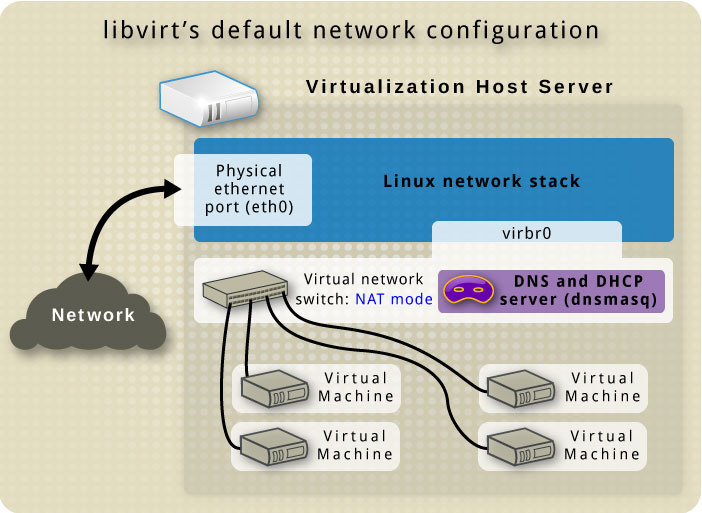
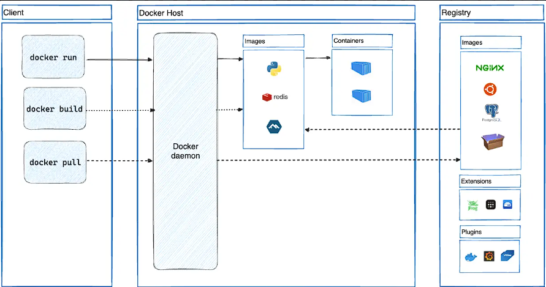
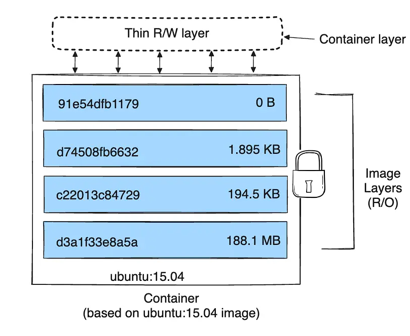
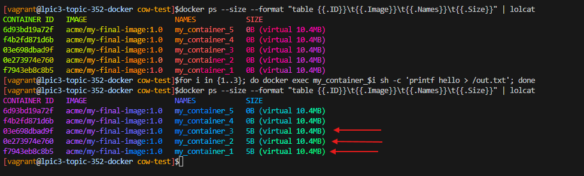
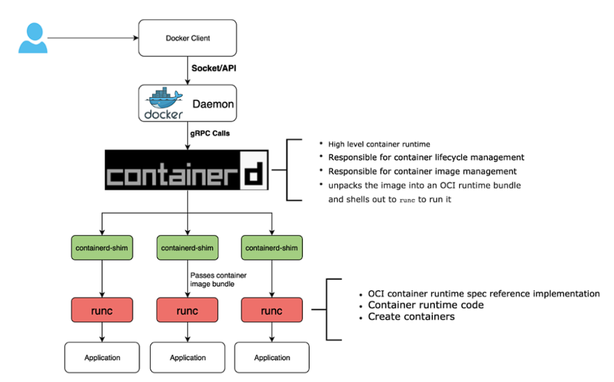

<h1><a name="readme-top"></a></h1>

[](https://github.com/marcossilvestrini/learning-lpic-3-305-300/actions/workflows/release.yml)
[](https://github.com/marcossilvestrini/learning-lpic-3-305-300/actions/workflows/translate.yml)
[](https://github.com/marcossilvestrini/learning-lpic-3-305-300/actions/workflows/generate-html.yml)
[](https://github.com/marcossilvestrini/learning-lpic-3-305-300/actions/workflows/deploy-webpage.yml)
[](https://github.com/marcossilvestrini/learning-lpic-3-305-300/actions/workflows/generate-docs.yml)
[](https://github.com/marcossilvestrini/learning-lpic-3-305-300/actions/workflows/powershell.yml)
[](https://github.com/marcossilvestrini/learning-lpic-3-305-300/actions/workflows/slack.yml)

---

[MIT License][license-url]
[Forks][forks-url]
[Stargazers][stars-url]
[Contributors][contributors-url]
[Issues][issues-url]
[LinkedIn][linkedin-url]
------------------------

# 📚 LEARNING LPIC-3 305-300

[](./README.md)
[](README_pt.md)


<p align="center">
<strong>Explore the docs »</strong></a>
    <br />
    <a href="https://marcossilvestrini.github.io/learning-lpic-3-305-300/">Web Site</a>
    -
    <a href="https://github.com/marcossilvestrini/learning-lpic-3-305-300">Code Page</a>
    -
    <a href="https://skynet-8.gitbook.io/learning-lpic-3-305-300">Gitbook</a>
    -
    <a href="https://github.com/marcossilvestrini/learning-lpic-3-305-300/issues">Report Bug</a>
    -
    <a href="https://github.com/marcossilvestrini/learning-lpic-3-305-300/issues">Request Feature</a>
</p>

---

## 🗂️ Summary

<details>
  <summary><b>TABLE OF CONTENT</b></summary>
  <ol>
    <li>
      <a href="#about-the-project">About The Project</a>
    </li>
    <li>
      <a href="#getting-started">Getting Started</a>
      <ul>
        <li><a href="#prerequisites">Prerequisites</a></li>
        <li><a href="#installation">installation</a></li>
      </ul>
    </li>
    <li><a href="#usage">Usage</a></li>
    <li><a href="#roadmap">Roadmap</a></li>
    <li><a href="#freedoms">Four Essential Freedoms</a></li>
    <li>
      <a href="#topic-351">Topic 351: Full Virtualization</a>
      <ul>
        <li><a href="#topic-351.1">351.1 Virtualization Concepts and Theory </a></li>
        <li><a href="#topic-351.2">351.2 Xen</a></li>
        <li><a href="#topic-351.3">351.3 QEMU</a></li>
        <li><a href="#topic-351.4">351.4 Libvirt Virtual Machine</a></li>
        <li><a href="#topic-351.5">351.5 Virtual Machine Disk Image Management</a></li>
      </ul>
    </li>
    <li>
      <a href="#topic-352">Topic 352: container Virtualization</a>
      <ul>
        <li><a href="#topic-352.1">352.1 container Virtualization Concepts</a></li>
        <li><a href="#topic-352.2">352.2 LXC</a></li>
        <li><a href="#topic-352.3">352.3 Docker</a></li>
        <li><a href="#topic-352.4">352.4 container Orchestration Platforms</a></li>
      </ul>
    </li>
    <li>
      <a href="#topic-353">Topic 353: VM Deployment and Provisioning</a>
      <ul>
        <li><a href="#topic-353.1">353.1 Cloud Management Tools</a></li>
        <li><a href="#topic-353.2">353.2 Packer</a></li>
        <li><a href="#topic-353.3">353.3 cloud-init</a></li>
        <li><a href="#topic-353.4">353.4 Vagrant</a></li>
      </ul>
    </li>
    <li><a href="#license">License</a></li>
    <li><a href="#contact">Contact</a></li>
    <li><a href="#acknowledgments">Acknowledgments</a></li>
  </ol>
</details><br>

---

<a name="about-the-project"></a>

## 📖 About Project

> This project aims to help students or professionals to learn the main concepts of GNULinux
> and free software
> Some GNULinux distributions like Debian and RPM will be covered
> Installation and configuration of some packages will also be covered
> By doing this you can give the whole community a chance to benefit from your changes.
> Access to the source code is a precondition for this.
> Use vagrant for up machines and execute labs and practice content in this article.
> I have published in folder Vagrant a Vagrantfile with what is necessary
> for you to upload an environment for studies

---

<p align="right">(<a href="#readme-top">back to top</a>)</p>

<a name="getting-started"></a>

## 🚀 Getting Started

For starting the learning, see the documentation above.

<a name="prerequisites"></a>

### 🛠️ Prerequisites

* [Git](https://git-scm.com/book/en/v2/Getting-Started-Installing-Git)
* [VMware Workstation](https://blogs.vmware.com/workstation/2024/05/vmware-workstation-pro-now-available-free-for-personal-use.html)
* [Vagrant VMWare Utility](https://developer.hashicorp.com/vagrant/install/vmware)
* [Vagrant](https://developer.hashicorp.com/vagrant/install)

<a name="installation"></a>

### 💾 Installation

Clone the repo

```sh
git clone https://github.com/marcossilvestrini/learning-lpic-3-305-300.git
cd learning-lpic-3-305-300
```

Customize a template *Vagrantfile-topic-XXX*. This file contains a vms configuration for labs. Example:

* File [Vagrantfile-topic-351](vagrant/Vagrantfile-topic-351)
  * vm.clone_directory = "<your_driver_letter>:\\`<folder>`\\<to_machine>\\#{VM_NAME}-instance-1"
    Example: vm.clone_directory = "E:\\Servers\\VMWare\\#{VM_NAME}-instance-1"
  * vm.vmx["memsize"] = ""
  * vm.vmx["numvcpus"] = ""
  * vm.vmx["cpuid.coresPerSocket"] = ""

Customize network configuration in files [configs/network](configs/network/).

---

<a name="usage"></a>

## 📝 Usage

Use this repository for get learning about LPIC-3 305-300 exam

### ⬆️⬇️ For up and down

Switch a *Vagrantfile-topic-xxx* template and copy for a new file with name *Vagrantfile*

```sh
cd vagrant && vagrant up
cd vagrant && vagrant destroy -f
```

### 🔄 For reboot VMs

```sh
cd vagrant && vagrant reload
```

**Important:**
*If you reboot vms without vagrant, shared folder not mount after boot.*

### 💻 Use PowerShell for up and down

If you use Windows platform, I create a powershell script for up and down vms.

```powershell
vagrant/up.ps1
vagrant/destroy.ps1
```

### 🗺️ Infrastructure Schema Topic 351


<p align="right">(<a href="#readme-top">back to top</a>)</p>

---

<a name="roadmap"></a>

## 🛣️ Roadmap

* [X] Create repository
* [X] Create scripts for provisioning labs
* [X] Create examples about Topic 351
* [X] Create examples about Topic 352
* [ ] Create examples about Topic 353
* [ ] Upload simulated itexam

---

<a name="freedoms"></a>

## 🗽 Four Essential Freedoms

> 0.The freedom to run the program as you wish, for any purpose (freedom 0).
> 1.The freedom to study how the program works, and change it so it does
> your computing as you wish (freedom 1).
> Access to the source code is a precondition for this.
> 2.The freedom to redistribute copies so you can help others (freedom 2).
> 3.freedom to distribute copies of your modified versions to others (freedom 3).

---

## 🔍 Inspect commands

```sh
type COMMAND
apropos COMMAND
whatis COMMAND --long
whereis COMMAND
COMMAND --help, --h
man COMMAND
```

<p align="right">(<a href="#readme-top">back to top</a>)</p>

---

<a name="topic-351"></a>

## 🖥️ Topic 351: Full Virtualization


---

<a name="topic-351.1"></a>

### 🧠 351.1 Virtualization Concepts and Theory

**Weight:** 6

**Description:** Candidates should know and understand the general concepts, theory and terminology of virtualization. This includes Xen, QEMU and libvirt terminology.

**Key Knowledge Areas:**

* 🖥️ Understand virtualization terminology
* ⚖️ Understand the pros and cons of virtualization
* 🛠️ Understand the various variations of Hypervisors and Virtual Machine Monitors
* 🔄 Understand the major aspects of migrating physical to virtual machines
* 🚀 Understand the major aspects of migrating virtual machines between host systems
* 📸 Understand the features and implications of virtualization for a virtual machine, such as snapshotting, pausing, cloning and resource limits
* 🌐 Awareness of oVirt, Proxmox, systemd-machined and VirtualBox
* 🔗 Awareness of Open vSwitch

#### 📋 351.1 Cited Objects

```sh
Hypervisor
Hardware Virtual Machine (HVM)
Paravirtualization (PV)
Emulation and Simulation
CPU flags
/proc/cpuinfo
Migration (P2V, V2V)
```

#### 🖥️ Hypervisors

##### 🏢 Type 1 Hypervisor (Bare-Metal Hypervisor)

###### 📄 Type 1 Definition

Runs directly on the host's physical hardware, providing a base layer to manage VMs without the need for a host operating system.

###### 📝 Type 1 Characteristics

* ⚡ High performance and efficiency.
* ⏱️ Lower latency and overhead.
* 🏢 Often used in enterprise environments and data centers.

###### 💡 Type 1 Examples

* VMware ESXi: A robust and widely used hypervisor in enterprise settings.
* Microsoft Hyper-V: Integrated with Windows Server, offering strong performance and management features.
* Xen: An open-source hypervisor used by many cloud service providers.
* KVM (Kernel-based Virtual Machine): Integrated into the Linux kernel, providing high performance for Linux-based systems.

##### 🏠 Type 2 Hypervisor (Hosted Hypervisor)

###### 📄 Type 2 Definition

Runs on top of a conventional operating system, relying on the host OS for resource management and device support.

###### 📝 Type 2 Characteristics

* 🛠️ Easier to set up and use, especially on personal computers.
* 🔧 More flexible for development, testing, and smaller-scale deployments.
* 🐢 Typically less efficient than Type 1 hypervisors due to additional overhead from the host OS.

###### 💡 Type 2 Examples

* VMware Workstation: A powerful hypervisor for running multiple operating systems on a single desktop.
* Oracle VirtualBox: An open-source hypervisor known for its flexibility and ease of use.
* Parallels Desktop: Designed for Mac users to run Windows and other operating systems alongside macOS.
* QEMU (Quick EMUlator): An open-source emulator and virtualizer, often used in conjunction with KVM.

##### ⚖️ Key Differences Between Type 1 and Type 2 Hypervisors

* Deployment Environment:
  * Type 1 hypervisors are commonly deployed in data centers and enterprise environments due to their direct interaction with hardware and high performance.
  * Type 2 hypervisors are more suitable for personal use, development, testing, and small-scale virtualization tasks.
* Performance:
  * Type 1 hypervisors generally offer better performance and lower latency because they do not rely on a host OS.
  * Type 2 hypervisors may experience some performance degradation due to the overhead of running on top of a host OS.
* Management and Ease of Use:
  * Type 1 hypervisors require more complex setup and management but provide advanced features and scalability for large-scale deployments.
  * Type 2 hypervisors are easier to install and use, making them ideal for individual users and smaller projects.

##### 🔄 Migration Types

In the context of hypervisors, which are technologies used to create and manage virtual machines, the terms P2V migration and V2V migration are common in virtualization environments.
They refer to processes of migrating systems between different types of platforms.

##### 🖥️➡️🖥️ P2V - Physical to Virtual Migration

P2V migration refers to the process of migrating a physical server to a virtual machine.In other words, an operating system and its applications, running on dedicated physical hardware, are "converted" and moved to a virtual machine that runs on a hypervisor (such as VMware, Hyper-V, KVM, etc.).

* Example: You have a physical server running a Windows or Linux system, and you want to move it to a virtual environment, like a cloud infrastructure or an internal virtualization server.
  The process involves copying the entire system state, including the operating system, drivers, and data, to create an equivalent virtual machine that can run as if it were on the physical hardware.

##### 🖥️🔁🖥️ V2V  - Virtual to Virtual Migration

V2V migration refers to the process of migrating a virtual machine from one hypervisor to another.In this case, you already have a virtual machine running in a virtualized environment (like VMware), and you want to move it to another virtualized environment (for example, to Hyper-V or to a new VMware server).

* Example: You have a virtual machine running on a VMware virtualization server, but you decide to migrate it to a Hyper-V platform. In this case, the V2V migration converts the virtual machine from one format or hypervisor to another, ensuring it can continue running correctly.

#### 🧩 HVM and Paravirtualization

##### ⚙️ Hardware-assisted Virtualization (HVM)

###### 📄 HVM Definition

HVM leverages hardware extensions provided by modern CPUs to virtualize hardware, enabling the creation and management of VMs with minimal performance overhead.

###### 📝 HVM Key Characteristics

* 🖥️ **Hardware Support**: Requires CPU support for virtualization extensions such as Intel VT-x or AMD-V.
* 🛠️ **Full Virtualization:** VMs can run unmodified guest operating systems, as the hypervisor provides a complete emulation of the hardware environment.
* ⚡ **Performance:** Typically offers near-native performance because of direct execution of guest code on the CPU.
* 🔒 **Isolation:** Provides strong isolation between VMs since each VM operates as if it has its own dedicated hardware.

###### 💡 HVM Examples

VMware ESXi, Microsoft Hyper-V, KVM (Kernel-based Virtual Machine).

###### ✅ HVM Advantages

* ✅ **Compatibility:** Can run any operating system without modification.
* ⚡ **Performance:** High performance due to hardware support.
* 🔒 **Security:** Enhanced isolation and security features provided by hardware.

###### ❌ HVM Disadvantages

* 🛠️ **Hardware Dependency:** Requires specific hardware features, limiting compatibility with older systems.
* 🔧 **Complexity:** May involve more complex configuration and management.

##### 🧩 Paravirtualization

###### 📄 Paravirtualization Definition

Paravirtualization involves modifying the guest operating system to be aware of the virtual environment, allowing it to interact more efficiently with the hypervisor.

###### 📝 Paravirtualization Key Characteristics

* 🛠️ **Guest Modification:** Requires changes to the guest operating system to communicate directly with the hypervisor using hypercalls.
* ⚡ **Performance:** Can be more efficient than traditional full virtualization because it reduces the overhead associated with emulating hardware.
* 🔗 **Compatibility:** Limited to operating systems that have been modified for paravirtualization.

###### 💡 Paravirtualization Examples

Xen with paravirtualized guests, VMware tools in certain configurations, and some KVM configurations.

###### ✅ Paravirtualization Advantages

* ⚡ **Efficiency:** Reduces the overhead of virtualizing hardware, potentially offering better performance for certain workloads.
* ✅ **Resource Utilization:** More efficient use of system resources due to direct communication between the guest OS and hypervisor.

###### ❌ Paravirtualization Disadvantages

* 🛠️ **Guest OS Modification:** Requires modifications to the guest OS, limiting compatibility to supported operating systems.
* 🔧 **Complexity:** Requires additional complexity in the guest OS for hypercall implementations.

##### ⚖️ Key Differences

###### 🖥️ Guest OS Requirements

* **HVM:** Can run unmodified guest operating systems.
* **Paravirtualization:** Requires guest operating systems to be modified to work with the hypervisor.

###### ⚡ Performance

* **HVM:** Typically provides near-native performance due to hardware-assisted execution.
* **Paravirtualization:** Can offer efficient performance by reducing the overhead of hardware emulation, but relies on modified guest OS.

###### 🧰 Hardware Dependency

* **HVM:** Requires specific CPU features (Intel VT-x, AMD-V).
* **Paravirtualization:** Does not require specific CPU features but needs modified guest OS.

###### 🔒 Isolation

* **HVM:** Provides strong isolation using hardware features.
* **Paravirtualization:** Relies on software-based isolation, which may not be as robust as hardware-based isolation.

###### 🧩 Complexity

* **HVM:** Generally more straightforward to deploy since it supports unmodified OS.
* **Paravirtualization:** Requires additional setup and modifications to the guest OS, increasing complexity.

#### 🧠 NUMA (Non-Uniform Memory Access)

NUMA (Non-Uniform Memory Access) is a memory architecture used in multiprocessor systems to optimize memory access by processors.
In a NUMA system, memory is distributed unevenly among processors, meaning that each processor has faster access to a portion of memory (its "local memory") than to memory that is physically further away (referred to as "remote memory") and associated with other processors.

##### 📝 Key Features of NUMA Architecture

1. **Local and Remote Memory**: Each processor has its own local memory, which it can access more quickly. However, it can also access the memory of other processors, although this takes longer.
2. **Differentiated Latency**: The latency of memory access varies depending on whether the processor is accessing its local memory or the memory of another node. Local memory access is faster, while accessing another node’s memory (remote) is slower.
3. **Scalability**: NUMA architecture is designed to improve scalability in systems with many processors. As more processors are added, memory is also distributed, avoiding the bottleneck that would occur in a uniform memory access (UMA) architecture.

##### ✅ Advantages of NUMA

* ⚡ Better Performance in Large Systems: Since each processor has local memory, it can work more efficiently without competing as much with other processors for memory access.
* 📈 Scalability: NUMA allows systems with many processors and large amounts of memory to scale more effectively compared to a UMA architecture.

##### ❌ Disadvantages

* 🛠️ Programming Complexity: Programmers need to be aware of which regions of memory are local or remote, optimizing the use of local memory to achieve better performance.
* 🐢 Potential Performance Penalties: If a processor frequently accesses remote memory, performance may suffer due to higher latency.
  This architecture is common in high-performance multiprocessor systems, such as servers and supercomputers, where scalability and memory optimization are critical.

#### 🆓 Opensource Solutions

* 🌐 oVirt: [https://www.ovirt.org/](https://www.ovirt.org/)
* 🌐 Proxmox: [https://www.proxmox.com/en/proxmox-virtual-environment/overview](https://www.proxmox.com/en/proxmox-virtual-environment/overview)
* 🌐 Oracle VirtualBox: [https://www.virtualbox.org/](https://www.virtualbox.org/)
* 🌐 Open vSwitch: [https://www.openvswitch.org/](https://www.openvswitch.org/)

#### 🗂️ Types of Virtualization

##### 🖥️ Hardware Virtualization (Server Virtualization)

###### 📄 HV Definition

Abstracts physical hardware to create virtual machines (VMs) that run separate operating systems and applications.

###### 🛠️ HV Use Cases

Data centers, cloud computing, server consolidation.

###### 💡 HV Examples

VMware ESXi, Microsoft Hyper-V, KVM.

##### 📦 Operating System Virtualization (containerization)

###### 📄 containerization Definition

Allows multiple isolated user-space instances (containers) to run on a single OS kernel.

###### 🛠️ containerization Use Cases

Microservices architecture, development and testing environments.

###### 💡 containerization Examples

Docker, Kubernetes, LXC.

##### 🌐 Network Virtualization

###### 📄 Network Virtualization Definition

Combines hardware and software network resources into a single, software-based administrative entity.

###### 🛠️ Network Virtualization Use Cases

Software-defined networking (SDN), network function virtualization (NFV).

###### 💡 Network Virtualization Examples

VMware NSX, Cisco ACI, OpenStack Neutron.

##### 💾 Storage Virtualization

###### 📄 Storage Virtualization Definition

Pools physical storage from multiple devices into a single virtual storage unit that can be managed centrally.

###### 🛠️ Storage Virtualization Use Cases

Data management, storage optimization, disaster recovery.

###### 💡 Storage Virtualization Examples

IBM SAN Volume Controller, VMware vSAN, NetApp ONTAP.

##### 🖥️ Desktop Virtualization

###### 📄 Desktop Virtualization Definition

Allows a desktop operating system to run on a virtual machine hosted on a server.

###### 🛠️ Desktop Virtualization Use Cases

Virtual desktop infrastructure (VDI), remote work solutions.

###### 💡 Desktop Virtualization Examples

Citrix Virtual Apps and Desktops, VMware Horizon, Microsoft Remote Desktop Services.

##### 📱 Application Virtualization

###### 📄 Application Virtualization Definition

Separates applications from the underlying hardware and operating system, allowing them to run in isolated environments.

###### 🛠️ Application Virtualization Use Cases

Simplified application deployment, compatibility testing.

###### 💡 Application Virtualization Examples

VMware ThinApp, Microsoft App-V, Citrix XenApp.

##### 🗃️ Data Virtualization

###### 📄 Data Virtualization Definition

Integrates data from various sources without physically consolidating it, providing a unified view for analysis and reporting.

###### 🛠️ Data Virtualization Use Cases

Business intelligence, real-time data integration.

###### 💡 Data Virtualization Examples

Denodo, Red Hat JBoss Data Virtualization, IBM InfoSphere.

##### 🌟 Benefits of Virtualization

* ⚡ Resource Efficiency: Better utilization of physical resources.
* 💰 Cost Savings: Reduced hardware and operational costs.
* 📈 Scalability: Easy to scale up or down according to demand.
* 🔧 Flexibility: Supports a variety of workloads and applications.
* 🔄 Disaster Recovery: Simplified backup and recovery processes.
* 🔒 Isolation: Improved security through isolation of environments.

#### Emulation

Emulation involves simulating the behavior of hardware or software on a different platform than originally intended.

This process allows software designed for one system to run on another system that may have different architecture or operating environment.

While emulation provides versatility by enabling the execution of unmodified guest operating systems or applications, it often comes with performance overhead.

This overhead arises because the emulated system needs to interpret and translate instructions meant for the original system into instructions compatible with the host system. As a result, emulation can be slower than native execution, making it less efficient for resource-intensive tasks.

Despite this drawback, emulation remains valuable for running legacy software, testing applications across different platforms, and facilitating cross-platform development.

#### systemd-machined

 The systemd-machined service is dedicated to managing virtual machines and containers within the systemd ecosystem.
 It provides essential functionalities for controlling, monitoring, and maintaining virtual instances, offering robust integration and efficiency within Linux environments.

<p align="right">(<a href="#topic-351.1">back to sub Topic 351.1</a>)</p>
<p align="right">(<a href="#topic-351">back to Topic 351</a>)</p>
<p align="right">(<a href="#readme-top">back to top</a>)</p>

---

<a name="topic-351.2"></a>

### 🐧 351.2 Xen


**Weight:** 3

**Description:** Candidates should be able to install, configure, maintain, migrate and troubleshoot Xen installations. The focus is on Xen version 4.x.

**Key Knowledge Areas:**

* Understand architecture of Xen, including networking and storage
* Basic configuration of Xen nodes and domains
* Basic management of Xen nodes and domains
* Basic troubleshooting of Xen installations
* Awareness of XAPI
* Awareness of XenStore
* Awareness of Xen Boot Parameters
* Awareness of the xm utility

#### 🐧 Xen


Xen is an open-source type-1 (bare-metal) hypervisor, which allows multiple operating systems to run concurrently on the same physical hardware.Xen provides a layer between the physical hardware and virtual machines (VMs), enabling efficient resource sharing and isolation.

* **Architecture:** Xen operates with a two-tier system where Domain 0 (Dom0) is the privileged domain with direct hardware access and manages the hypervisor. Other virtual machines, called Domain U (DomU), run guest operating systems and are managed by Dom0.
* **Types of Virtualization:** Xen supports both paravirtualization (PV), which requires modified guest OS, and hardware-assisted virtualization (HVM), which uses hardware extensions (e.g., Intel VT-x or AMD-V) to run unmodified guest operating systems.
  Xen is widely used in cloud environments, notably by Amazon Web Services (AWS) and other large-scale cloud providers.

#### 🏢 XenSource

XenSource was the company founded by the original developers of the Xen hypervisor at the University of Cambridge to commercialize Xen.The company provided enterprise solutions based on Xen and offered additional tools and support to enhance Xen’s capabilities for enterprise use.

* **Acquisition by Citrix**: In 2007, XenSource was acquired by Citrix Systems, Inc. Citrix used Xen technology as the foundation for its Citrix XenServer product, which became a popular enterprise-grade virtualization platform based on Xen.
* **Transition**: After the acquisition, the Xen project continued as an open-source project, while Citrix focused on commercial offerings like XenServer, leveraging XenSource technology.

#### 🌍 Xen Project

Xen Project refers to the open-source community and initiative responsible for developing and maintaining the Xen hypervisor after its commercialization.The Xen Project operates under the Linux Foundation, with a focus on building, improving, and supporting Xen as a collaborative, community-driven effort.

* **Goals:** The Xen Project aims to advance the hypervisor by improving its performance, security, and feature set for a wide range of use cases, including cloud computing, security-focused virtualization (e.g., Qubes OS), and embedded systems.
* **Contributors:** The project includes contributors from various organizations, including major cloud providers, hardware vendors, and independent developers.
* **XAPI and XenTools:** The Xen Project also includes tools such as XAPI (XenAPI), which is used for managing Xen hypervisor installations, and various other utilities for system management and optimization.

#### 🗄️ XenStore

Xen Store is a critical component of the Xen Hypervisor.
Essentially, Xen Store is a distributed key-value database used for communication and information sharing between the Xen hypervisor and the virtual machines (also known as domains) it manages.

Here are some key aspects of Xen Store:

* **Inter-Domain Communication:** Xen Store enables communication between domains, such as Dom0 (the privileged domain that controls hardware resources) and DomUs (user domains, which are the VMs). This is done through key-value entries, where each domain can read or write information.
* **Configuration Management:** It is used to store and access configuration information, such as virtual devices, networking, and boot parameters. This facilitates the dynamic management and configuration of VMs.
* **Events and Notifications:** Xen Store also supports event notifications. When a particular key or value in the Xen Store is modified, interested domains can be notified to react to these changes. This is useful for monitoring and managing resources.
* Simple API: Xen Store provides a simple API for reading and writing data, making it easy for developers to integrate their applications with the Xen virtualization system.

#### 🔗 XAPI

XAPI, or XenAPI, is the application programming interface (API) used to manage the Xen Hypervisor and its virtual machines (VMs).
XAPI is a key component of XenServer (now known as Citrix Hypervisor) and provides a standardized way to interact with the Xen hypervisor to perform operations such as creating, configuring, monitoring, and controlling VMs.

Here are some important aspects of XAPI:

* **VM Management:** XAPI allows administrators to programmatically create, delete, start, and stop virtual machines.
* **Automation:** With XAPI, it's possible to automate the management of virtual resources, including networking, storage, and computing, which is crucial for large cloud environments.
* **Integration:** XAPI can be integrated with other tools and scripts to provide more efficient and customized administration of the Xen environment.
* **Access Control:** XAPI also provides access control mechanisms to ensure that only authorized users can perform specific operations in the virtual environment.

XAPI is the interface that enables control and automation of the Xen Hypervisor, making it easier to manage virtualized environments.

#### 📝 Xen Summary

* **Xen:** The core hypervisor technology enabling virtual machines to run on physical hardware.
* **XenSource:** The company that commercialized Xen, later acquired by Citrix, leading to the development of Citrix XenServer.
* **Xen Project:** The open-source initiative and community that continues to develop and maintain the Xen hypervisor under the Linux Foundation.
* **XenStore:**  Xen Store acts as a communication and configuration intermediary between the Xen hypervisor and the VMs, streamlining the operation and management of virtualized environments.
* **XAPI** is the interface that enables control and automation of the Xen Hypervisor, making it easier to manage virtualized environments.

#### 🖥️ Domain0 (Dom0)

Domain0, or Dom0, is the control domain in a Xen architecture. It manages other domains (DomUs) and has direct access to hardware.
Dom0 runs device drivers, allowing DomUs, which lack direct hardware access, to communicate with devices. Typically, it is a full instance of an operating system, like Linux, and is essential for Xen hypervisor operation.

#### 💻 DomainU (DomU)

DomUs are non-privileged domains that run virtual machines.
They are managed by Dom0 and do not have direct access to hardware. DomUs can be configured to run different operating systems and are used for various purposes, such as application servers and development environments. They rely on Dom0 for hardware interaction.

#### 🧩 PV-DomU (Paravirtualized DomainU)

PV-DomUs use a technique called paravirtualization. In this model, the DomU operating system is modified to be aware that it runs in a virtualized environment, allowing it to communicate directly with the hypervisor for optimized performance.
This results in lower overhead and better efficiency compared to full virtualization.

#### ⚙️ HVM-DomU (Hardware Virtual Machine DomainU)

HVM-DomUs are virtual machines that utilize full virtualization, allowing unmodified operating systems to run. The Xen hypervisor provides hardware emulation for these DomUs, enabling them to run any operating system that supports the underlying hardware architecture.
While this offers greater flexibility, it can result in higher overhead compared to PV-DomUs.

#### 🌐 Xen Network

Paravirtualized Network Devices


Bridging


#### 📋 351.2 Cited Objects

```sh
Domain0 (Dom0), DomainU (DomU)
PV-DomU, HVM-DomU
/etc/xen/
xl
xl.cfg 
xl.conf # Xen global configurations
xentop
oxenstored # Xenstore configurations
```

#### 📝 351.2 Notes

```sh

# Xen Settings
/etc/xen/
/etc/xen/xl.conf - Main general configuration file for Xen
/etc/xen/oxenstored.conf - Xenstore configurations

# VM Configurations
/etc/xen/xlexample.pvlinux
/etc/xen/xlexample.hvm

# Service Configurations
/etc/default/xen
/etc/default/xendomains

# xen-tools configurations
/etc/xen-tools/
/usr/share/xen-tools/

# docs
xl(1)
xl.conf(5)
xlcpupool.cfg(5)
xl-disk-configuration(5)
xl-network-configuration(5)
xen-tscmode(7)

# initialized domains auto
/etc/default/xendomains
   XENDOMAINS_AUTO=/etc/xen/auto

/etc/xen/auto/

# set domain for up after xen reboot
## create folder auto
cd /etc/xen && mkdir -p auto && cd auto

# create symbolic link
ln -s /etc/xen/lpic3-pv-guest /etc/xen/auto/lpic3-pv-guest
```

##### vif

In Xen, “vif” stands for Virtual Interface and is used to configure networking for virtual machines (domains).

By specifying “vif” directives in the domain configuration files, administrators can define network interfaces, assign IP addresses, set up VLANs, and configure other networking parameters for virtual machines running on Xen hosts. For example: vif = [‘bridge=xenbr0’], in this case, it connects the VM’s network interface to the Xen bridge named “xenbr0”.

#### Xen Lab

Use this script for lab provisioning: [xen.sh](scripts/xen/xen.sh)

#### 💻 351.2 Important Commands

##### 🏗️ xen-create-image

```sh
# create a pv image
xen-create-image \
  --hostname=lpic3-pv-guest \
  --memory=1gb \
  --vcpus=2 \
  --lvm=vg_xen \
  --bridge=xenbr0 \
  --dhcp \
  --pygrub \
  --password=vagrant \
  --dist=bookworm
```

##### 📄 xen-list-images

```sh
# list image
xen-list-image
```

##### ❌ xen-delete-image

```sh
# delete a pv image
xen-delete-image lpic3-pv-guest --lvm=vg_xen
```

##### 🗄️ xenstore-ls

```sh
# list xenstore infos
xenstore-ls
```

##### ⚙️ xl

```sh
# view xen information
xl infos

# list Domains
xl list
xl list lpic3-hvm-guest
xl list lpic3-hvm-guest -l

# uptime Domains
xl uptime

# pause Domain
xl pause 2
xl pause lpic3-hvm-guest

# save state Domains
xl -v save lpic3-hvm-guest ~root/image-lpic3-hvm-guest.save

# restore Domain
xl restore /root/image-lpic3-hvm-guest.save

# get Domain name
xl domname 2

# view dmesg information
xl dmesg

# monitoring domain
xl top
xentop
xen top

# Limit mem Dom0
xl mem-set 0 2048

# Limit cpu (not permanent after boot)
xl vcpu-set 0 2

# create DomainU - virtual machine
xl create /etc/xen/lpic3-pv-guest.cfg

# create DomainU virtual machine and connect to guest
xl create -c /etc/xen/lpic3-pv-guest.cfg

##----------------------------------------------
# create DomainU virtual machine HVM

## create logical volume
lvcreate -l +20%FREE -n lpic3-hvm-guest-disk  vg_xen

## create a ssh tunel for vnc
ssh -l vagrant -L 5900:localhost:5900  192.168.0.130

## configure /etc/xen/lpic3-hvm-guest.cfg
## set boot for cdrom: boot = "d"

## create domain hvm
xl create /etc/xen/lpic3-hvm-guest.cfg

## open vcn connection in your vnc client with localhost
## for view install details

## after installation finished, destroy domain: xl destroy <id_or_name>

## set /etc/xen/lpic3-hvm-guest.cfg: boot for hard disc: boot = "c"

## create domain hvm
xl create /etc/xen/lpic3-hvm-guest.cfg

## access domain hvm
xl console <id_or_name>
##----------------------------------------------

# connect in domain guest
xl console <id>|<name> (press enter)
xl console 1
xl console lpic3-pv-guest

#How do I exit domU "xl console" session
#Press ctrl+] or if you're using Putty press ctrl+5.

# Poweroff domain
xl shutdown lpic3-pv-guest

# destroy domain
xl destroy lpic3-pv-guest

# reboot domain
xl reboot lpic3-pv-guest

# list block devices
xl block-list 1
xl block-list lpic3-pv-guest

# detach block devices
xl block-detach lpic3-hvm-guest hdc
xl block-detach 2 xvdc

# attach block devices

## hard disk devices
xl block-attach lpic3-hvm-guest-ubuntu 'phy:/dev/vg_xen/lpic3-hvm-guest-disk2,xvde,w'

## cdrom
xl block-attach lpic3-hvm-guest 'file:/home/vagrant/isos/ubuntu/seed.iso,xvdc:cdrom,r'
xl block-attach 2 'file:/home/vagrant/isos/ubuntu/seed.iso,xvdc:cdrom,r'

# insert and eject cdrom devices
xl cd-insert lpic3-hvm-guest-ubuntu xvdb  /home/vagrant/isos/ubuntu/ubuntu-24.04.1-live-server-amd64.iso
xl cd-eject lpic3-hvm-guest-ubuntu xvdb
```

<p align="right">(<a href="#topic-351.2">back to sub Topic 351.2</a>)</p>
<p align="right">(<a href="#topic-351">back to Topic 351</a>)</p>
<p align="right">(<a href="#readme-top">back to top</a>)</p>

---

<a name="topic-351.3"></a>

### 🖥️ 351.3 QEMU


**Weight:** 4

**Description:** Candidates should be able to install, configure, maintain, migrate and troubleshoot QEMU installations.

**Key Knowledge Areas:**

* Understand the architecture of QEMU, including KVM, networking and storage
* Start QEMU instances from the command line
* Manage snapshots using the QEMU monitor
* Install the QEMU Guest Agent and VirtIO device drivers
* Troubleshoot QEMU installations, including networking and storage
* Awareness of important QEMU configuration parameters

#### 📋 351.3 Cited Objects

```sh
Kernel modules: kvm, kvm-intel and kvm-amd
/dev/kvm
QEMU monitor
qemu
qemu-system-x86_64
ip
brctl
tunctl
```

#### 🛠️ 351.3 Important Commands

##### 📝 351.3 Others Commands

##### 🧪 check kvm module

```sh
# check if kvm is enabled
egrep -o '(vmx|svm)' /proc/cpuinfo
lscpu |grep Virtualization
lsmod|grep kvm
ls -l /dev/kvm
hostnamectl
systemd-detect-virt
```

```sh
# check if kvm is enabled
egrep -o '(vmx|svm)' /proc/cpuinfo
lscpu |grep Virtualization
lsmod|grep kvm
ls -l /dev/kvm

# check kernel infos
uname -a

# check root device
findmnt /

# mount a qcow2 image
## Example 1:
mkdir -p /mnt/qemu
guestmount -a os-images/Debian_12.0.0_VMM/Debian_12.0.0.qcow2 -i /mnt/qemu/

## Example 2:
sudo guestfish --rw -a os-images/Debian_12.0.0_VMM/Debian_12.0.0.qcow2
run
list-filesystems

# run commands in qcow2 images
## Example 1:
virt-customize -a  os-images/Debian_12.0.0_VMM/Debian_12.0.0.qcow2  --run-command 'echo hello >/root/hello.txt'
## Example 2:
sudo virt-customize -a os-images/Debian_12.0.0_VMM/Debian_12.0.0.qcow2 \
  --run-command 'echo -e "auto ens3\niface ens3 inet dhcp" > /etc/network/interfaces.d/ens3.cfg'

# generate mac 
printf 'DE:AD:BE:EF:%02X:%02X\n' $((RANDOM%256)) $((RANDOM%256))
```

##### 🌐 ip

```sh
# list links
ip link show

# create bridge
ip link add br0 type bridge
```

##### 🌉 brctl

```sh
# list links
ip link show

# create bridge
ip link add br0 type bridge
```

##### 💾 qemu-img

```sh
# create image
qemu-img create -f qcow2 vm-disk-debian-12.qcow2 20G

# convert vmdk to qcow2 image
qemu-img convert \
  -f vmdk \
  -O qcow2 os-images/Debian_12.0.0_VMM/Debian_12.0.0_VMM_LinuxVMImages.COM.vmdk os-images/Debian_12.0.0_VMM/Debian_12.0.0.qcow2 \
  -p \
  -m16

# check image
qemu-img info os-images/Debian_12.0.0_VMM/Debian_12.0.0.qcow2
```

##### 🖥️ qemu-system-x86_64

```sh
# create vm with ISO
qemu-system-x86_64 \
  -name lpic3-debian-12 \
  -enable-kvm -hda vm-disk-debian-12.qcow2 \
  -cdrom /home/vagrant/isos/debian/debian-12.8.0-amd64-DVD-1.iso  \
  -boot d \
  -m 2048 \
  -smp cpus=2 \
  -k pt-br

# create vm with ISO using vnc in no gui servers \ ssh connections

## create ssh tunel in host
 ssh -l vagrant -L 5902:localhost:5902  192.168.0.131

## create vm 
qemu-system-x86_64 \
  -name lpic3-debian-12 \
  -enable-kvm \
  -m 2048 \
  -smp cpus=2 \
  -k pt-br \
  -vnc :2 \
  -device qemu-xhci \
  -device usb-tablet \
  -device ide-cd,bus=ide.1,drive=cdrom,bootindex=1 \
  -drive id=cdrom,media=cdrom,if=none,file=/home/vagrant/isos/debian/debian-12.8.0-amd64-DVD-1.iso \
  -hda vm-disk-debian-12.qcow2 \
  -boot order=d \
  -vga std \
  -display none \
  -monitor stdio

# create vm with OS Image - qcow2

## create vm
qemu-system-x86_64 \
  -name lpic3-debian-12 \
  -enable-kvm \
  -m 2048 \
  -smp cpus=2 \
  -k pt-br \
  -vnc :2 \
  -hda os-images/Debian_12.0.0_VMM/Debian_12.0.0.qcow2

## create vm with custom kernel params
qemu-system-x86_64 \
  -name lpic3-debian-12 \
  -kernel /vmlinuz \
  -initrd /initrd.img \
  -append "root=/dev/mapper/debian--vg-root ro fastboot console=ttyS0" \
  -enable-kvm \
  -m 2048 \
  -smp cpus=2 \
  -k pt-br \
  -vnc :2 \
  -hda os-images/Debian_12.0.0_VMM/Debian_12.0.0.qcow2

## create vm with and attach disk
qemu-system-x86_64 \
  -name lpic3-debian-12 \
  -enable-kvm \
  -m 2048 \
  -smp cpus=2 \
  -vnc :2 \
  -hda os-images/Debian_12.0.0_VMM/Debian_12.0.0.qcow2 \
  -hdb vmdisk-debian12.qcow2 \
  -drive file=vmdisk-extra-debian12.qcow2,index=2,media=disk,if=ide \
  -netdev bridge,id=net0,br=qemubr0 \
  -device virtio-net-pci,netdev=net0
  
## create vm network netdev user
qemu-system-x86_64 \
  -name lpic3-debian-12 \
  -enable-kvm \
  -m 2048 \
  -smp cpus=2 \
  -vnc :2 \
  -hda os-images/Debian_12.0.0_VMM/Debian_12.0.0.qcow2 \
  -netdev user,id=mynet0,net=192.168.0.150/24,dhcpstart=192.168.0.155,hostfwd=tcp::2222-:22 \
  -device virtio-net-pci,netdev=mynet0

## create vm network netdev tap (Private Network)
ip link add br0 type bridge ; ifconfig br0 up
qemu-system-x86_64 \
  -name lpic3-debian-12 \
  -enable-kvm \
  -m 2048 \
  -smp cpus=2 \
  -vnc :2 \
  -hda os-images/Debian_12.0.0_VMM/Debian_12.0.0.qcow2 \
  -netdev tap,id=br0 \
  -device e1000,netdev=br0,mac=DE:AD:BE:EF:1A:24

## create vm with public bridge
#create a public bridge : https://www.linux-kvm.org/page/Networking

qemu-system-x86_64 \
  -name lpic3-debian-12 \
  -enable-kvm \
  -m 2048 \
  -smp cpus=2 \
  -hda os-images/Debian_12.0.0_VMM/Debian_12.0.0.qcow2 \
  -k pt-br \
  -vnc :2 \
  -device qemu-xhci \
  -device usb-tablet \
  -vga std \
  -display none \
  -netdev bridge,id=net0,br=qemubr0 \
  -device virtio-net-pci,netdev=net0

## get a ipv4 ip - open ssh in vm and:
dhcpclient ens4
```

#### 🖥️ QEMU Monitor

For initiate QEMU monitor in commandline use **-monitor stdio** param in **qemu-system-x86_64**

```sh
qemu-system-x86_64 -monitor stdio
```

Exit qemu-monitor:

```sh
ctrl+alt+2
```

```sh
# Management
info status # vm info
info cpus # cpu information
info network # network informations
stop # pause vm
cont # start vm in status pause
system_powerdown # poweroff vm
system_reset # restart monitor


# Blocks
info block # block info
boot_set d # force boot iso
change ide1-cd0  /home/vagrant/isos/debian/debian-12.8.0-amd64-DVD-1.iso  # attach cdrom
eject ide1-cd0 # detach cdrom

# Snapshots
info snapshots # list snapshots
savevm snapshot-01  # create snapshot
loadvm snapshot-01 # restore snapshot
delvm snapshot-01
```

#### 🤖 Guest Agent

For enable, use:

```sh
qemu-system-x86_x64
 -chardev socket,path=/tmp/qga.sock,server=on,wait=off,id=qga0 \
 -device virtio-serial \
 -device virtserialport,chardev=qga0,name=org.qemu.guest_agent.0
```

<p align="right">(<a href="#topic-351.3">back to sub Topic 351.3</a>)</p>
<p align="right">(<a href="#topic-351">back to Topic 351</a>)</p>
<p align="right">(<a href="#readme-top">back to top</a>)</p>

---

<a name="topic-351.4"></a>

### 🏢 351.4 Libvirt Virtual Machine Management




**Weight:** 9

**Description:** Candidates should be able to manage virtualization hosts and virtual machines (‘libvirt domains’) using libvirt and related tools.

**Key Knowledge Areas:**

* Understand the architecture of libvirt
* Manage libvirt connections and nodes
* Create and manage QEMU and Xen domains, including snapshots
* Manage and analyze resource consumption of domains
* Create and manage storage pools and volumes
* Create and manage virtual networks
* Migrate domains between nodes
* Understand how libvirt interacts with Xen and QEMU
* Understand how libvirt interacts with network services such as dnsmasq and radvd
* Understand libvirt XML configuration files
* Awareness of virtlogd and virtlockd

#### 📋 351.4 Cited Objects

```sh
libvirtd
/etc/libvirt/
/var/lib/libvirt
/var/log/libvirt
virsh (including relevant subcommands) 
```

#### 🛠️ 351.4 Important Commands

##### 🖥️ virsh

```sh
# using env variable for set virsh uri (local or remotely)
export LIBVIRT_DEFAULT_URI=qemu:///system
export LIBVIRT_DEFAULT_URI=xen+ssh://vagrant@192.168.0.130
export LIBVIRT_DEFAULT_URI='xen+ssh://vagrant@192.168.0.130?keyfile=/home/vagrant/.ssh/skynet-key-ecdsa'

# COMMONS

# get helps
virsh help
virsh help pool-create

# view version
virsh version

# view system info
sudo virsh sysinfo

# view node info
virsh nodeinfo

# hostname
virsh hostname

# check vcn allocated port
virsh vncdisplay <domain_id>
virsh vncdisplay <domain_name>
virsh vncdisplay rocky9-server01 

# HYPERVISORS

# view libvirt hypervisor connection
virsh uri

# list valid hypervisors
virt-host-validate
virt-host-validate qemu

# test connection uri(vm test)
virsh -c test:///default list

# connect remotely
virsh -c xen+ssh://vagrant@192.168.0.130
virsh -c xen+ssh://vagrant@192.168.0.130 list
virsh -c qemu+ssh://vagrant@192.168.0.130/system list

# connect remotely without enter password
virsh -c 'xen+ssh://vagrant@192.168.0.130?keyfile=/home/vagrant/.ssh/skynet-key-ecdsa'

# STORAGE

# list storage pools
virsh pool-list --details

# list all storage pool
virsh pool-list --all --details

# get a pool configuration
virsh pool-dumpxml default

# get pool info
virsh pool-info default

# create a storage pool
virsh pool-define-as --name default --type dir --target /var/lib/libvirt/images

# create a storage pool with dumpxml
virsh pool-create --overwrite --file configs/kvm/libvirt/pool.xml

# start storage pool
virsh pool-start default

# set storage pool for autostart
virsh pool-autostart default

# stop storage pool
virsh pool-destroy linux

# delete xml storage pool file
virsh pool-undefine linux

# edit storage pool
virsh pool-edit linux

# list volumes
virsh vol-list linux

# get volume infos
virsh vol-info Debian_12.0.0.qcow2 os-images
virsh vol-info --pool os-images Debian_12.0.0.qcow2 

# get volume xml
virsh vol-dumpxml rocky9-disk1 default

# create volume
virsh vol-create-as default --format qcow2 disk1 10G

# delete volume
virsh vol-delete  disk1 default

# DOMAINS \ INSTANCES \ VIRTUAL MACHINES

# list domain\instance\vm
virsh list
virsh list --all

# create domain\instance\vm
virsh create configs/kvm/libvirt/rocky9-server03.xml

# view domain\instance\vm info
virsh dominfo rocky9-server01

# view domain\instance\vm xml
virsh dumpxml rocky9-server01

# edit domain\instance\vm xml
virsh edit rocky9-server01

# stop domain\instance\vm
virsh shutdown rocky9-server01 # gracefully
virsh destroy 1
virsh destroy rocky9-server01

# suspend domain\instance\vm
virsh suspend rocky9-server01

# resume domain\instance\vm
virsh resume rocky9-server01

# start domain\instance\vm
virsh start rocky9-server01

# remove domain\instance\vm
virsh undefine rocky9-server01

# remove domain\instance\vm and storage volumes
virsh undefine rocky9-server01 --remove-all-storage

# save domain\instance\vm
virsh save rocky9-server01 rocky9-server01.qcow2

# restore domain\instance\vm
virsh restore rocky9-server01.qcow2

# list snapshots
virsh snapshot-list rocky9-server01

# create snapshot
virsh snapshot-create rocky9-server01

# restore snapshot
virsh snapshot-revert rocky9-server01 1748983520

# view snapshot xml
virsh snapshot-info rocky9-server01 1748983520

# dumpxml snapshot
virsh snapshot-dumpxml rocky9-server01 1748983520

# xml snapshot path
/var/lib/libvirt/qemu/snapshot/rocky9-server01/

# view snapshot info
virsh snapshot-info rocky9-server01 1748983671

# edit snapshot
virsh snapshot-edit rocky9-server01 1748983520

# delete snapshot
virsh snapshot-delete rocky9-server01 1748983520

# DEVICES

# list block devices
virsh domblklist rocky9-server01 --details

# add cdrom media 
virsh change-media rocky9-server01 sda /home/vagrant/isos/rocky/Rocky-9.5-x86_64-minimal.iso
virsh attach-disk rocky9-server01 /home/vagrant/isos/rocky/Rocky-9.5-x86_64-minimal.iso sda --type cdrom --mode readonly

# remove cdrom media
virsh change-media rocky9-server01 sda --eject

# add new disk
virsh attach-disk rocky9-server01  /var/lib/libvirt/images/rocky9-disk2  vdb --persistent

# remove disk
virsh detach-disk rocky9-server01 vdb --persistent

# RESOURCES (CPU and Memory)

# get cpu infos
virsh vcpuinfo rocky9-server01 --pretty
virsh dominfo rocky9-server01 | grep 'CPU'

# get vcpu count
virsh vcpucount rocky9-server01

# set vcpus maximum config
virsh setvcpus rocky9-server01 --count 4 --maximum --config
virsh shutdown rocky9-server01
virsh start rocky9-server01

# set vcpu current config
virsh setvcpus rocky9-server01 --count 4 --config

# set vcpu current live
virsh setvcpus rocky9-server01 --count 3 --current
virsh setvcpus rocky9-server01 --count 3 --live

# configure vcpu affinity config
virsh vcpupin rocky9-server01 0 7 --config
virsh vcpupin rocky9-server01 1 5-6 --config

# configure vcpu affinity current
virsh vcpupin rocky9-server01 0 7
virsh vcpupin rocky9-server01 1 5-6

# set maximum memory config
virsh setmaxmem rocky9-server01 3000000 --config
virsh shutdown rocky9-server01
virsh start rocky9-server01

# set current memory config
virsh setmem rocky9-server01 2500000 --current

# NETWORK

# get netwwork bridges
brctl show

# get iptables rules for libvirt
sudo iptables -L -n -t  nat

# list network
virsh net-list --all

# set default network
virsh net-define /etc/libvirt/qemu/networks/default.xml

# get network infos
virsh net-info default

# get xml network
virsh net-dumpxml default

# xml file
cat /etc/libvirt/qemu/networks/default.xml

# dhcp config
sudo cat /etc/libvirt/qemu/networks/default.xml | grep -A 10 dhcp
sudo cat /var/lib/libvirt/dnsmasq/default.conf

# get domain ipp address
virsh net-dhcp-leases default
virsh net-dhcp-leases default --mac 52\:54\:00\:89\:19\:86

# edit network
virsh net-edit default

# get domain network details
virsh domiflist debian-server01

# path for network filter files
/etc/libvirt/nwfilter/

# list network filters
virsh nwfilter-list

# create network filter - block icmp traffic
virsh nwfilter-define block-icmp.xml
# virsh edit Debian-Server
    #  <interface type='network'>
    #        ...
    #        <filterref filter='block-icmp'/>
    #        ...
    # </interface>
# virsh destroy debian-server01
# virsh start debian-server01

# delete network filter
virsh nwfilter-undefine block-icmp

# get xml network filter
virsh nwfilter-dumpxml block-icmp
```

###### 🏗️ virt-install

```sh
# list os variants
virt-install --os-variant list
osinfo-query os

# create domain\instance\vm with iso file
virsh vol-create-as default --format qcow2 rocky9-disk1 20G
virt-install --name rocky9-server01 \
--vcpus 2 \
--cpu host \
--memory 2048 \
--disk vol=default/rocky9-disk1 \
--cdrom /home/vagrant/isos/rocky/Rocky-9.5-x86_64-minimal.iso \
--os-variant=rocky9 \
--graphics vnc,listen=0.0.0.0,port=5905

# create debian domain\instance\vm with qcow2 file
virt-install --name debian-server01 \
--vcpus 2 \
--ram 2048 \
--disk vol=os-images/Debian_12.0.0.qcow2 \
--import \
--osinfo detect=on \
--graphics vnc,listen=0.0.0.0,port=5906 \
--network network=default \
--noautoconsole

# create rocky9 domain\instance\vm with qcow2 file
virt-install --name rocky9-server02 \
--vcpus 2 \
--ram 2048 \
--disk path=os-images/RockyLinux_9.4_VMG/RockyLinux_9.4.qcow2,format=qcow2,bus=virtio \
--import \
--osinfo detect=on \
--graphics vnc,listen=0.0.0.0,port=5907 \
--network bridge=qemubr0,model=virtio \
--noautoconsole

# open domain\instance\vm gui console
virt-viewer debian-server01

# check metadata domain\instance\vm file (if uri is qemu:////system)
less /etc/libvirt/qemu/debian-server01.xml
```

<p align="right">(<a href="#topic-351.4">back to sub Topic 351.4</a>)</p>
<p align="right">(<a href="#topic-351">back to Topic 351</a>)</p>
<p align="right">(<a href="#readme-top">back to top</a>)</p>

---

<a name="topic-351.5"></a>

### 💾 351.5 Virtual Machine Disk Image Management


**Weight:** 3

**Description:** Candidates should be able to manage virtual machines disk images. This includes converting disk images between various formats and hypervisors and accessing data stored within an image.

**Key Knowledge Areas:**

* Understand features of various virtual disk image formats, such as raw images, qcow2 and VMDK
* Manage virtual machine disk images using qemu-img
* Mount partitions and access files containerd in virtual machine disk images using libguestfish
* Copy physical disk content to a virtual machine disk image
* Migrate disk content between various virtual machine disk image formats
* Awareness of Open Virtualization Format (OVF)

#### 📋 351.5 Cited Objects

```sh
qemu-img
guestfish (including relevant subcommands)
guestmount
guestumount
virt-cat
virt-copy-in
virt-copy-out
virt-diff
virt-inspector
virt-filesystems
virt-rescue
virt-df
virt-sparsify
virt-p2v
virt-p2v-make-disk
virt-v2v
```

#### 🛠️ 351.5 Important Commands

##### 💾 351.5.1 qemu-img

```sh
# Display detailed information about a disk image
qemu-img info UbuntuServer_24.04.qcow2

# Create a new 22G raw disk image (default format is raw)
qemu-img create new-disk 22G

# Create a new 22G disk image in qcow2 format
qemu-img create -f qcow2 new-disk2 22G

# Convert a VDI image to raw format using 5 threads and show progress
qemu-img convert -f vdi -O raw Ubuntu-Server.vdk new-Ubuntu.raw -m5 -p

# Convert vmdk to qcow2 image
qemu-img convert \
-f vmdk \
-O qcow2 os-images/UbuntuServer_24.04_VM/UbuntuServer_24.04_VM_LinuxVMImages.COM.vmdk \
os-images/UbuntuServer_24.04_VM/UbuntuServer_24.04.qcow2 \
-p \
-m16

# Resize a raw image to 30G
qemu-img resize -f raw new-disk 30G

# Resize a qcow2 image to 15G(actual size 30Gdisk 30G)
qemu-img resize -f raw --shrink new-disk 15G

# Snapshots

# List all snapshots in the image
qemu-img snapshot -l new-disk2.qcow2

# Create a snapshot named SNAP1
qemu-img snapshot -c SNAP1 disk

# Apply a snapshot by ID or name
qemu-img snapshot -a 123456789 disk

# Delete the snapshot named SNAP1
qemu-img snapshot -d SNAP1 disk
```

##### 🐟 guestfish

```sh
# set environment variables for guestfish
export LIBGUESTFS_BACKEND_SETTINGS=force_tcg

# Launch guestfish with a disk image
guestfish -a UbuntuServer_24.04.qcow2
#run
#list-partitions

# Run the commands in a script file
guestfish -a UbuntuServer_24.04.qcow2 -m /dev/sda -i < script.ssh

# Interactively run commands
guestfish --rw -a UbuntuServer_24.04.qcow2 <<'EOF'
run
list-filesystems
EOF

# Copy a file from the guest image to the host
export LIBGUESTFS_BACKEND_SETTINGS=force_tcg
sudo guestfish --rw -a UbuntuServer_24.04.qcow2 -i <<'EOF'
copy-out /etc/hostname /tmp/
EOF

# Copy a file from the host into the guest image
echo "new-hostname" > /tmp/hostname
export LIBGUESTFS_BACKEND_SETTINGS=force_tcg
sudo guestfish --rw -a UbuntuServer_24.04.qcow2 -i <<'EOF'
copy-in /tmp/hostname /etc/
EOF

# View contents of a file in the guest image
guestfish --ro -a UbuntuServer_24.04.qcow2 -i <<'EOF'
cat /etc/hostname
EOF

# List files in the guest image
export LIBGUESTFS_BACKEND_SETTINGS=force_tcg
guestfish --rw -a UbuntuServer_24.04.qcow2 -i <<'EOF'
ls /home/ubuntu
EOF

# Edit a file in the guest image
export LIBGUESTFS_BACKEND_SETTINGS=force_tcg
guestfish --rw -a UbuntuServer_24.04.qcow2 -i <<'EOF'
edit /etc/hosts
EOF
```

###### 🗂️ guestmount

```sh
# Mount a disk image to a directory
guestmount -a UbuntuServer_24.04.qcow2 -m /dev/ubuntu-vg/ubuntu-lv /mnt/ubuntu
# domain
guestmount -d rocky9-server02 -m /dev/ubuntu-vg/ubuntu-lv /mnt/ubuntu 

# Mount a specific partition from a disk image
guestmount -a UbuntuServer_24.04.qcow2 -m /dev/sda2 /mnt/ubuntu
# domain
guestmount -d debian-server01 --ro -m  /dev/debian-vg/root /mnt/debian
```

###### 🗑️ guestumount

```sh
# Umount a disk image to a directory
sudo guestunmount /mnt/ubuntu
```

##### 📊 virt-df

```sh
# Show free and used space on virtual machine filesystems
virt-df UbuntuServer_24.04.qcow2 -h
virt-df -d rocky9-server02 -h
```

##### 🗃️ virt-filesystems

```sh
# List filesystems, partitions, and logical volumes in a VM disk image (disk image)
virt-filesystems -a UbuntuServer_24.04.qcow2 --all --long -h

# List filesystems, partitions, and logical volumes in a VM disk image (domain)
virt-filesystems -d debian-server01 --all --long -h
```

##### 🔍 virt-inspector

```sh
# Inspect and report on the operating system in a VM disk image
virt-inspector -a UbuntuServer_24.04.qcow2 #(disk)
virt-inspector -d debian-server01 #(domain) 
```

##### 🐱 virt-cat

```sh
# Display the contents of a file inside a VM disk image
virt-cat -a UbuntuServer_24.04.qcow2 /etc/hosts
virt-cat -d debian-server01 /etc/hosts #(domain)
```

##### 🔀 virt-diff

```sh
# Show differences between two VM disk images
virt-diff -a UbuntuServer_24.04.qcow2 -A Rocky-Linux.qcow2
```

##### 🧹 virt-sparsify

```sh
# Make a VM disk image smaller by removing unused space
virt-sparsify UbuntuServer_24.04.qcow2 UbuntuServer_24.04-sparse.qcow2
```

##### 📏 virt-resize

```sh
# Resize a VM disk image or its partitions
virt-filesystems -a UbuntuServer_24.04.qcow2 --all --long -h #(check size of partitions)
qemu-img create -f qcow2 UbuntuServer_24.04-expanded.qcow2 100G #(create new disk image with 100G)
virt-resize --expand /dev/ubuntu-vg/ubuntu-lv \
UbuntuServer_24.04.qcow2 UbuntuServer_24.04-expanded.qcow2

```

##### 📥 virt-copy-in

```sh
# Copy files from the host into a VM disk image

virt-copy-in -a UbuntuServer_24.04.qcow2 ~vagrant/test-virt-copy-in.txt /home/ubuntu
```

##### 📤 virt-copy-out

```sh
# Copy files from a VM disk image to the host
virt-copy-out -a UbuntuServer_24.04.qcow2 /home/ubuntu/.bashrc /tmp
```

##### 📋 virt-ls

```sh
# List files and directories inside a VM disk image
virt-ls -a UbuntuServer_24.04.qcow2 /home/ubuntu
```

##### 🚑 virt-rescue

```sh
# Launch a rescue shell on a VM disk image for recovery
virt-rescue -a UbuntuServer_24.04.qcow2
```

##### 🧰 virt-sysprep

```sh
# Prepare a VM disk image for cloning by removing system-specific data
virt-sysprep -a UbuntuServer_24.04.qcow2
```

##### 🔄 virt-v2v

```sh
# Convert a VM from a foreign hypervisor to run on KVM
virt-v2v -i disk input-disk.img -o local -os /var/tmp
```

##### 🔄 virt-p2v

```sh
# Convert a physical machine to use KVM
```

##### 💽 virt-p2v-make-disk

```sh
# Create a bootable disk image for physical to virtual conversion
sudo virt-p2v-make-disk -o output.img
```

#### 📝 351.5 Notes

##### 📦 OVF: Open Virtualization Format

OVF: An open format that defines a standard for packaging and distributing virtual machines across different environments.

The generated package has the .ova extension and contains the following files:

* .ovf: XML file with metadata defining the virtual machine environment
* Image files: .vmdk, .vhd, .vhdx, .qcow2, .raw
* Additional files: metadata, snapshots, configuration, hash

<p align="right">(<a href="#topic-351.5">back to sub Topic 351.5</a>)</p>
<p align="right">(<a href="#topic-351">back to Topic 351</a>)</p>
<p align="right">(<a href="#readme-top">back to top</a>)</p>

---

<a name="topic-352"></a>

## 📦 Topic 352: container Virtualization

---

<a name="topic-352.1"></a>

### 🧠 352.1  container Virtualization Concepts


---

**Weight:** 7

**Description:** Candidates should understand the concept of container virtualization. This includes understanding the Linux components used to implement container virtualization as well as using standard Linux tools to troubleshoot these components.

**Key Knowledge Areas:**

* Understand the concepts of system and application container
* Understand and analyze kernel namespaces
* Understand and analyze control groups
* Understand and analyze capabilities
* Understand the role of seccomp, SELinux and AppArmor for container virtualization
* Understand how LXC and Docker leverage namespaces, cgroups, capabilities, seccomp and MAC
* Understand the principle of runc
* Understand the principle of CRI-O and containerd
* Awareness of the OCI runtime and image specifications
* Awareness of the Kubernetes container Runtime Interface (CRI)
* Awareness of podman, buildah and skopeo
* Awareness of other container virtualization approaches in Linux and other free operating systems, such as rkt, OpenVZ, systemd-nspawn or BSD Jails

---

#### 📋 352.1 Cited Objects

```sh
nsenter
unshare
ip (including relevant subcommands)
capsh
/sys/fs/cgroups
/proc/[0-9]+/ns
/proc/[0-9]+/status
```

---

#### 🧠 Understanding containers


containers are a lightweight virtualization technology that package applications along with their required dependencies — code, libraries, environment variables, and configuration files — into isolated, portable, and reproducible units.

> In simple terms: a container is a self-containerd box that runs your application the same way, anywhere.

##### 💡 What Is a container?

Unlike Virtual Machines (VMs), containers do not virtualize hardware. Instead, they virtualize the operating system. containers share the same Linux kernel with the host, but each one operates in a fully isolated user space.

📌 containers vs Virtual Machines:

| Feature             | containers                   | Virtual Machines       |
| ------------------- | ---------------------------- | ---------------------- |
| OS Kernel           | Shared with host             | Each VM has its own OS |
| Startup time        | Fast (seconds or less)       | Slow (minutes)         |
| Image size          | Lightweight (MBs)            | Heavy (GBs)            |
| Resource efficiency | High                         | Lower                  |
| Isolation mechanism | Kernel features (namespaces) | Hypervisor             |

##### 🔑 Key Characteristics of containers

🔹 **Lightweight**: Share the host OS kernel, reducing overhead and enabling fast startup.

🔹 **Portable**: Run consistently across different environments (dev, staging, prod, cloud, on-prem).

🔹 **Isolated**: Use namespaces for process, network, and filesystem isolation.

🔹 **Efficient**: Enable higher density and better resource utilization than traditional VMs.

🔹 **Scalable**: Perfect fit for microservices and cloud-native architecture.

##### 🧱 Types of containers

1. System containers

   * Designed to run the entire OS, Resemble virtual machines.
   * Support multiple processes and system services (init, syslog).
   * Ideal for legacy or monolithic applications.
   * Example: LXC, libvirt-lxc.
2. Application containers

   * Designed to run a single process.
   * Stateless, ephemeral, and horizontally scalable.
   * Used widely in modern DevOps and Kubernetes environments.
   * Example: Docker, containerd, CRI-O.

##### 🚀 Popular container Runtimes

| Runtime              | Description                                                         |
| -------------------- | ------------------------------------------------------------------- |
| **Docker**     | Most widely adopted CLI/daemon for building and running containers. |
| **containerd** | Lightweight runtime powering Docker and Kubernetes.                 |
| **CRI-O**      | Kubernetes-native runtime for OCI containers.                       |
| **LXC**        | Traditional Linux system containers, closer to full OS.             |
| **RKT**        | Security-focused runtime (deprecated).                              |

##### 🔐 container Internals and Security Elements

| Component                    | Role                                                  |
| ---------------------------- | ----------------------------------------------------- |
| **Namespaces**         | Isolate processes, users, mounts, networks.           |
| **cgroups**            | Control and limit resource usage (CPU, memory, IO).   |
| **Capabilities**       | Fine-grained privilege control inside containers.     |
| **seccomp**            | Restricts allowed syscalls to reduce attack surface.  |
| **AppArmor / SELinux** | Mandatory Access Control enforcement at kernel level. |

---

#### 🧠 Understanding chroot - Change Root Directory in Unix/Linux


##### What is chroot?

chroot (short for change root) is a system call and command on Unix-like operating systems that changes the apparent root directory (/) for the current running process and its children. This creates an isolated environment, commonly referred to as a chroot jail.

##### 🧱 Purpose and Use Cases

* 🔒 Isolate applications for security (jailing).
* 🧪 Create testing environments without impacting the rest of the system.
* 🛠️ System recovery (e.g., boot into LiveCD and chroot into installed system).
* 📦 Building software packages in a controlled environment.

##### 📁 Minimum Required Structure

The chroot environment must have its own essential files and structure:

```sh
/mnt/myenv/
├── bin/
│   └── bash
├── etc/
├── lib/
├── lib64/
├── usr/
├── dev/
├── proc/
└── tmp/
```

Use ldd to identify required libraries:

```sh
ldd /bin/bash
```

##### 🚨 Limitations and Security Considerations

* chroot is not a security boundary like containers or VMs.
* A privileged user (root) inside the jail can potentially break out.
* No isolation of process namespaces, devices, or kernel-level resources.

For stronger isolation, consider alternatives like:

* Linux containers (LXC, Docker)
* Virtual machines (KVM, QEMU)
* Kernel namespaces and cgroups

##### 🧪 Test chroot with debootstrap

```sh
# download debian files
sudo debootstrap stable ~vagrant/debian http://deb.debian.org/debian
sudo chroot ~vagrant/debian bash
```

##### :🧪 Lab chroot

Use this script for lab: [chroot.sh](scripts/container/chroot.sh)

[](https://asciinema.org/a/PWkjazgTXll9678Qy6LLOaKdN)

---

#### 🧠 Understanding Linux Namespaces


Namespaces are a core Linux kernel feature that enable process-level isolation. They create separate "views" of global system resources — such as process IDs, networking, filesystems, and users — so that each process group believes it is running in its own system.

> In simple terms: namespaces trick a process into thinking it owns the machine, even though it's just sharing it.

This is the foundation for container isolation.

##### 🔍 What Do Namespaces Isolate?

Each namespace type isolates a specific system resource. Together, they make up the sandbox that a container operates in:

| Namespace             | Isolates...                  | Real-world example                                      |
| --------------------- | ---------------------------- | ------------------------------------------------------- |
| **PID**         | Process IDs                  | Processes inside a container see a different PID space  |
| **Mount**       | Filesystem mount points      | Each container sees its own root filesystem             |
| **Network**     | Network stack                | containers have isolated IPs, interfaces, and routes    |
| **UTS**         | Hostname and domain name     | Each container sets its own hostname                    |
| **IPC**         | Shared memory and semaphores | Prevents inter-process communication between containers |
| **User**        | User and group IDs           | Enables fake root (UID 0) inside the container          |
| **Cgroup (v2)** | Control group membership     | Ties into resource controls like CPU and memory limits  |

##### 🧪 Visual Analogy


Imagine a shared office building:

* All tenants share the same foundation (Linux kernel).
* Each company has its own office (namespace): different locks, furniture, phone lines, and company name.
* To each tenant, it feels like their own building.

That's exactly how containers experience the system — isolated, yet efficient.

##### 🔧 How containers Use Namespaces

When you run a container (e.g., with Docker or Podman), the runtime creates a new set of namespaces:

```bash
docker run -it --rm alpine sh
```

This command gives the process:

* A new PID namespace → it's process 1 inside the container.
* A new network namespace → its own virtual Ethernet.
* A mount namespace → a container-specific root filesystem.
* Other namespaces depending on configuration (user, IPC, etc.)

The result: a lightweight, isolated runtime environment that behaves like a separate system.

##### ⚙️ Complementary Kernel Features

Namespaces hide resources from containers. But to control how much they can use and what they can do, we need additional mechanisms:

###### 🔩 Cgroups (Control Groups)

Cgroups allow the kernel to limit, prioritize, and monitor resource usage across process groups.

| Resource     | Use case examples              |
| ------------ | ------------------------------ |
| CPU          | Limit CPU time per container   |
| Memory       | Cap RAM usage                  |
| Disk I/O     | Throttle read/write operations |
| Network (v2) | Bandwidth restrictions         |

🛡️ Prevents the "noisy neighbor" problem by stopping one container from consuming all system resources.

###### 🧱 Capabilities

Traditional Linux uses a binary privilege model: root (UID 0) can do everything, everyone else is limited.

| Capability               | Allows...                                   |
| ------------------------ | ------------------------------------------- |
| `CAP_NET_BIND_SERVICE` | Binding to privileged ports (e.g. 80, 443)  |
| `CAP_SYS_ADMIN`        | A powerful catch-all for system admin tasks |
| `CAP_KILL`             | Sending signals to arbitrary processes      |

By dropping unnecessary capabilities, containers can run with only what they need — reducing risk.

##### 🔐 Security Mechanisms

Used in conjunction with namespaces and cgroups to lock down what a containerized process can do:

| Feature            | Description                                                 |
| ------------------ | ----------------------------------------------------------- |
| **seccomp**  | Whitelist or block Linux system calls (syscalls)            |
| **AppArmor** | Apply per-application security profiles                     |
| **SELinux**  | Enforce Mandatory Access Control with tight system policies |

##### 🧠 Summary for Beginners

> ✅ Namespaces isolate what a container can see
> ✅ Cgroups control what it can use
> ✅ Capabilities and security modules define what it can do

Together, these kernel features form the technical backbone of container isolation — enabling high-density, secure, and efficient application deployment without full VMs.

##### 🧪 Lab Namespaces

Use this script for lab: [namespace.sh](scripts/container/namespace.sh)

[](https://asciinema.org/a/8H6iczCMO24VgjWqwCcXEKWBG)

---

#### 🧩 Understanding Cgroups (Control Groups)


##### 📌 Definition

Control Groups (cgroups) are a Linux kernel feature introduced in 2007 that allow you to limit, account for, and isolate the resource usage (CPU, memory, disk I/O, etc.) of groups of processes.

cgroups are heavily used by low-level container runtimes such as runc and crun, and leveraged by container engines like Docker, Podman, and LXC to enforce resource boundaries and provide isolation between containers.

Namespaces isolate, cgroups control.

Namespaces create separate environments for processes (like PID, network, or mounts), while cgroups limit and monitor resource usage (CPU, memory, I/O) for those processes.

⚙️ Key Capabilities

| Feature                     | Description                                              |
| --------------------------- | -------------------------------------------------------- |
| **Resource Limiting** | Impose limits on how much of a resource a group can use  |
| **Prioritization**    | Allocate more CPU/IO priority to some groups over others |
| **Accounting**        | Track usage of resources per group                       |
| **Control**           | Suspend, resume, or kill processes in bulk               |
| **Isolation**         | Prevent resource starvation between groups               |

##### 📦 Subsystems (Controllers)

cgroups operate through controllers, each responsible for managing one type of resource:

| Subsystem   | Description                         |
| ----------- | ----------------------------------- |
| `cpu`     | Controls CPU scheduling             |
| `cpuacct` | Generates CPU usage reports         |
| `memory`  | Limits and accounts memory usage    |
| `blkio`   | Limits block device I/O             |
| `devices` | Controls access to devices          |
| `freezer` | Suspends/resumes execution of tasks |
| `net_cls` | Tags packets for traffic shaping    |
| `ns`      | Manages namespace access (rare)     |

##### 📂 Filesystem Layout

cgroups are exposed through the virtual filesystem under /sys/fs/cgroup.

Depending on the version:

* **cgroups v1**: separate hierarchies for each controller (e.g., memory, cpu, etc.)
* **cgroups v2**: unified hierarchy under a single mount point

Mounted under:

```sh
/sys/fs/cgroup/
```

Typical cgroups v1 hierarchy:

```sh
/sys/fs/cgroup/
├── memory/
│   ├── mygroup/
│   │   ├── tasks
│   │   ├── memory.limit_in_bytes
├── cpu/
│   └── mygroup/
└── ...
```

In cgroups v2, all resources are managed under a unified hierarchy:

```sh
/sys/fs/cgroup/
├── cgroup.procs
├── cgroup.controllers
├── memory.max
├── cpu.max
└── ...
```

##### 🧪 Common Usage (v1 and v2 examples)

v1 – Create and assign memory limit:

```sh
# Mount memory controller (if needed)
mount -t cgroup -o memory none /sys/fs/cgroup/memory

# Create group
mkdir /sys/fs/cgroup/memory/mygroup

# Set memory limit (100 MB)
echo 104857600 | tee /sys/fs/cgroup/memory/mygroup/memory.limit_in_bytes

# Assign a process (e.g., current shell)
echo $$ | tee /sys/fs/cgroup/memory/mygroup/tasks
```

v2 – Unified hierarchy:

```sh
# Create subgroup
mkdir /sys/fs/cgroup/mygroup

# Enable controllers
echo +memory +cpu > /sys/fs/cgroup/cgroup.subtree_control

# Move shell into group
echo $$ > /sys/fs/cgroup/mygroup/cgroup.procs

# Set limits
echo 104857600 > /sys/fs/cgroup/mygroup/memory.max
echo "50000 100000" > /sys/fs/cgroup/mygroup/cpu.max  # 50ms quota per 100ms period
```

🧭 Process & Group Inspection

| Command                   | Description                     |
| ------------------------- | ------------------------------- |
| `cat /proc/self/cgroup` | Shows current cgroup membership |
| `cat /proc/PID/cgroup`  | cgroup of another process       |
| `cat /proc/PID/status`  | Memory and cgroup info          |
| `ps -o pid,cmd,cgroup`  | Show process-to-cgroup mapping  |

##### 📦 Usage in containers

container engines like Docker, Podman, and containerd delegate resource control to cgroups (via runc or crun), allowing:

* Per-container CPU and memory limits
* Fine-grained control over blkio and devices
* Real-time resource accounting

Docker example:

```sh
docker run --memory=256m --cpus=1 busybox
```

Behind the scenes, this creates cgroup rules for memory and CPU limits for the container process.

##### 🧠 Concepts Summary

| Concept               | Explanation                                                              |
| --------------------- | ------------------------------------------------------------------------ |
| **Controllers** | Modules like `cpu`, `memory`, `blkio`, etc. apply limits and rules |
| **Tasks**       | PIDs (processes) assigned to the control group                           |
| **Hierarchy**   | Cgroups are structured in a parent-child tree                            |
| **Delegation**  | Systemd and user services may manage subtrees of cgroups                 |

##### 🧪 Lab Cgroups

Use this script for lab: [cgroups.sh](scripts/container/cgroups.sh)

[](https://asciinema.org/a/WbudWJpHKPzBWMh8CGRxCIpZf)

---

#### 🛡️ Understanding Capabilities

❓ What Are Linux Capabilities?

Traditionally in Linux, the root user has unrestricted access to the system. Linux capabilities were introduced to break down these all-powerful privileges into smaller, discrete permissions, allowing processes to perform specific privileged operations without requiring full root access.

This enhances system security by enforcing the principle of least privilege.

| 🔐 Capability            | 📋 Description                                      |
| ------------------------ | --------------------------------------------------- |
| `CAP_CHOWN`            | Change file owner regardless of permissions         |
| `CAP_NET_BIND_SERVICE` | Bind to ports below 1024 (e.g., 80, 443)            |
| `CAP_SYS_TIME`         | Set system clock                                    |
| `CAP_SYS_ADMIN`        | ⚠️ Very powerful – includes mount, BPF, and more |
| `CAP_NET_RAW`          | Use raw sockets (e.g., ping, traceroute)            |
| `CAP_SYS_PTRACE`       | Trace other processes (debugging)                   |
| `CAP_KILL`             | Send signals to any process                         |
| `CAP_DAC_OVERRIDE`     | Modify files and directories without permission     |
| `CAP_SETUID`           | Change user ID (UID) of the process                 |
| `CAP_NET_ADMIN`        | Manage network interfaces, routing, etc.            |

🔐 Some Linux Capabilities Types

| Capability Type              | Description                                                               |
| ---------------------------- | ------------------------------------------------------------------------- |
| **CapInh (Inherited)** | Capabilities inherited from the parent process.                           |
| **CapPrm (Permitted)** | Capabilities that the process is allowed to have.                         |
| **CapEff (Effective)** | Capabilities that the process is currently using.                         |
| **CapBnd (Bounding)**  | Restricts the maximum set of effective capabilities a process can obtain. |
| **CapAmb (Ambient)**   | Allows a process to explicitly define its own effective capabilities.     |

📦 Capabilities in containers and Pods
containers typically do not run as full root, but instead receive a limited set of capabilities by default depending on the runtime.

Capabilities can be added or dropped in Kubernetes using the securityContext.

📄 Kubernetes example:

```yaml
securityContext:
  capabilities:
    drop: ["ALL"]
    add: ["NET_BIND_SERVICE"]
```

🔐 This ensures the container starts with zero privileges and receives only what is needed.

##### 🧪 Lab Capabilities

Use this script for lab: [capabilities.sh](scripts/container/capabilities.sh)

[](https://asciinema.org/a/kCiUGvY0YGA5Mdzbj1NSdfLAx)

#### 🛡️ Seccomp (Secure Computing Mode)

**What is it?**

* A Linux kernel feature for restricting which syscalls (system calls) a process can use.
* Commonly used in containers (like Docker), browsers, sandboxes, etc.

**How does it work?**

* A process enables a seccomp profile/filter.
* The kernel blocks, logs, or kills the process if it tries forbidden syscalls.
* Filters are written in BPF (Berkeley Packet Filter) format.

**Quick commands**

```sh
# Check support
docker info | grep Seccomp

# Disable for a container:
docker run --security-opt seccomp=unconfined ...

# Inspect running process:
grep Seccomp /proc/$$/status
```

**Tools**

```sh
# for analyzing
seccomp-tools 

# Profiles
/etc/docker/seccomp.json
```

#### 🦺AppArmor

**What is it?**

* A Mandatory Access Control (MAC) system for restricting what specific programs can access.
* Profiles are text-based, path-oriented, easy to read and edit.

**How does it work?**

* Each binary can have a profile that defines its allowed files, network, and capabilities—even as root!
* Easy to switch between complain, enforce, and disabled modes.

**Quick commands:**

```sh
#Status
aa-status

# Put a program in enforce mode
sudo aa-enforce /etc/apparmor.d/usr.bin.foo

# Profiles
location: /etc/apparmor.d/
```

**Tools:**

aa-genprof, aa-logprof for generating/updating profiles

Logs

```sh
/var/log/syslog (search for apparmor)
```

#### 🔒SELinux (Security-Enhanced Linux)

**What is it?**

* A very powerful MAC system for controlling access to everything: files, processes, users, ports, networks, and more.
* Uses labels (contexts) and detailed policies.

**How does it work?**

* Everything (process, file, port, etc.) gets a security context.
* Kernel checks every action against policy rules.

**Quick commands:**

```sh
#Status
sestatus

#Set to enforcing/permissive:
setenforce 1  # Enforcing
setenforce 0  # Permissive

#List security contexts:
ls -Z  # Files
ps -eZ # Processes
```

**Tools:**

* audit2allow, semanage, chcon (for managing policies/labels)
* Logs: /var/log/audit/audit.log
* Policies: /etc/selinux/

#### 📋 Summary Table for Common Security Systems

| System   | Focus              | Complexity | Policy Location               | Typical Use          |
| -------- | ------------------ | ---------- | ----------------------------- | -------------------- |
| Seccomp  | Kernel syscalls    | Medium     | Per-process (via code/config) | Docker, sandboxes    |
| AppArmor | Per-program access | Easy       | /etc/apparmor.d/              | Ubuntu, Snap, SUSE   |
| SELinux  | Full-system MAC    | Advanced   | /etc/selinux/ + labels        | RHEL, Fedora, CentOS |

#### 🗂️ Linux container Isolation & Security Comparison

| Technology                  | Purpose / What It Does                                                                               | Main Differences                                                                                | Example in containers                                                                        |
| --------------------------- | ---------------------------------------------------------------------------------------------------- | ----------------------------------------------------------------------------------------------- | -------------------------------------------------------------------------------------------- |
| **chroot 🏠**         | Changes the apparent root directory for a process. Isolates filesystem.                              | Simple filesystem isolation; does**not** restrict resources, privileges, or system calls. | Docker uses `chroot` internally for building minimal images, but not for strong isolation. |
| **cgroups 📊**        | Controls and limits resource usage (CPU, memory, disk I/O, etc.) per group of processes.             | Kernel feature; fine-grained resource control, not isolation.                                   | Docker and Kubernetes use cgroups to limit CPU/mem per container/pod.                        |
| **namespaces 🌐**     | Isolate system resources: PID, mount, UTS, network, user, IPC, time.                                 | Kernel feature; provides different kinds of isolation.                                          | Each container runs in its own set of namespaces (PID, net, mount, etc).                     |
| **capabilities 🛡️** | Split root privileges into fine-grained units (e.g., net\_admin, sys\_admin).                        | More granular than all-or-nothing root/non-root; can drop or grant specific privileges.         | Docker containers usually run with reduced capabilities (drop dangerous ones).               |
| **seccomp 🧱**        | Filter/restrict which syscalls a process can make (whitelisting/blacklisting).                       | Very focused: blocks kernel syscalls; cannot block all actions.                                 | Docker’s default profile blocks dangerous syscalls (e.g.,`ptrace`, `mount`).            |
| **AppArmor 🐧**       | Mandatory Access Control (MAC) framework: restricts programs' file/network access via profiles.      | Profile-based, easier to manage than SELinux; less fine-grained in some cases.                  | Ubuntu-based containers often use AppArmor for container process profiles.                   |
| **SELinux 🔒**        | More complex MAC framework, label-based, very fine-grained. Can confine users, processes, and files. | More powerful and complex than AppArmor; enforced on Fedora/RHEL/CentOS.                        | On OpenShift/Kubernetes with RHEL, SELinux labels are used to keep pods separate.            |

Summary

* chroot: Basic isolation, no resource/security guarantees.
* cgroups: Resource control, not isolation.
* namespaces: Isolate "views" of kernel resources.
* capabilities: Fine-tune process privileges.
* seccomp: Restrict system call surface.
* AppArmor/SELinux: Limit what processes can touch, even as root (MAC).

#### 🧩 OCI, runc, containerd, CRI, CRI-O — What They Are in the container Ecosystem

##### Overview and Roles

* **OCI (Open container Initiative) 🏛️**

  A foundation creating open standards for **container images** and  **runtimes** .

  *Defines how images are formatted, stored, and how containers are started/stopped (runtime spec).*
* **runc ⚙️**

  A universal, low-level, lightweight CLI tool that can run containers according to the OCI runtime specification.

  *“The engine” that turns an image + configuration into an actual running Linux container.*
* **containerd 🏋️**

  A core container runtime daemon for managing the complete container lifecycle: **pulling images, managing storage, running containers** (calls runc), networking plugins, etc.

  *Used by Docker, Kubernetes, nerdctl, and other tools as their main container runtime backend.*
* **CRI (container Runtime Interface) 🔌**

  A Kubernetes-specific gRPC API to connect Kubernetes with container runtimes.

  *Not used outside Kubernetes, but enables K8s to talk to containerd, CRI-O, etc.*
* **CRI-O 🥤**

  A lightweight, Kubernetes-focused runtime that **only** runs OCI containers, using runc under the hood.

  *Mostly used in Kubernetes, but demonstrates how to build a minimal container runtime focused on open standards.*

##### 🏷️ Comparison Table: OCI, runc, containerd, CRI, CRI-O

| Component            | Emoji | What Is It?                           | Who Uses It?                            | Example Usage                                                                |
| -------------------- | ----- | ------------------------------------- | --------------------------------------- | ---------------------------------------------------------------------------- |
| **OCI**        | 🏛️  | Standards/specifications              | Docker, Podman, CRI-O, containerd, runc | Ensures images/containers are compatible across tools                        |
| **runc**       | ⚙️  | container runtime (CLI)               | containerd, CRI-O, Docker, Podman       | Directly running a container from a bundle (e.g.`runc run`)                |
| **containerd** | 🏋️  | container runtime daemon              | Docker, Kubernetes, nerdctl             | Handles pulling images, managing storage/network, starts containers via runc |
| **CRI**        | 🔌    | K8s runtime interface (API)           | Kubernetes only                         | Lets kubelet talk to containerd/CRI-O                                        |
| **CRI-O**      | 🥤    | Lightweight container runtime for K8s | Kubernetes, OpenShift                   | Used as K8s container engine                                                 |

---

##### 🛠️ Practical Examples (General container World)

* **Building images:**

  Any tool (Docker, Podman, Buildah) can produce images following the **OCI Image Spec** so they’re compatible everywhere.
* **Running containers:**

  Both Podman and Docker ultimately use **runc** (via containerd or directly) to create containers.
* **Managing many containers:**

  **containerd** can be used on its own (via `ctr` or `nerdctl`) or as a backend for Docker and Kubernetes.
* **Plug-and-play runtimes:**

  Thanks to  **OCI** , you could swap runc for another OCI-compliant runtime (like Kata containers for VMs, gVisor for sandboxing) without changing how you build or manage images.

---

##### 🚢 Typical Stack

```plaintext
[User CLI / Orchestration]
           |
   [containerd / CRI-O]
           |
        [runc]
           |
[Linux Kernel: namespaces, cgroups, etc]
```

* **Docker** : User CLI → containerd → runc
* **Podman** : User CLI → runc
* **Kubernetes** : kubelet (CRI) → containerd or CRI-O → runc

---

##### 🧠 Summary

* **OCI** = Common language for images/runtimes (standards/specs)
* **runc** = Actual tool that creates and manages container processes
* **containerd** = Full-featured daemon that manages images, containers, lifecycle
* **CRI** = Only for Kubernetes, to make runtimes pluggable
* **CRI-O** = Lightweight runtime focused on Kubernetes, built on OCI standards and runc

##### 🧩 Diagram: container Ecosystem


##### 🧪 lab runc

For runc lab, you can use this script: [runc.sh](scripts/container/runc.sh)

[](https://asciinema.org/a/UDVnhKSxPFRXDcwg0HYFkZdlX)

##### 🧪 lab containerd

For containerd, you can use this script: [containerd.sh](scripts/container/container.sh)

[](https://asciinema.org/a/fCJsiwcL2ePneQX1aafITtoGM)

---

#### 🚀 Podman, Buildah, Skopeo, OpenVZ, crun & Kata containers – Fast Track

---

##### 🐳 **Podman**

* **What is it?** A container manager compatible with Docker CLI, but **daemonless** and can run  **rootless** .
* **Use:** Create, run, stop, and inspect containers and pods.
* **Highlights:** No central daemon, safer for multi-user, integrates with systemd.
* [More info]()

---

##### 📦 **Buildah**

* **What is it?** Tool to **build and manipulate container images** (OCI/Docker) without a daemon.
* **Use:** Building images in CI/CD pipelines or scripting.
* **Highlights:** Lightweight, rootless support, used by Podman under the hood.
* [More info](https://www.redhat.com/en/topics/containers/what-is-buildah)

---

##### 🔭 **Skopeo**

* **What is it?** Utility to **inspect, copy, and move container images** between registries **without pulling or running** them.
* **Use:** Move images, check signatures and metadata.
* **Highlights:** No daemon, ideal for automation and security.
* [More info]()

---

##### 🏢 **OpenVZ**

* **What is it?** **container-based virtualization** solution for Linux (pre-dating modern container tools).
* **Use:** Lightweight VPS (virtual private servers) sharing the same kernel.
* **Highlights:** Very efficient, but less isolated than VM (shares kernel).
* [More info](https://en.wikipedia.org/wiki/OpenVZ)

---

##### ⚡ **crun**

* **What is it?** Ultra-fast, minimal OCI runtime for containers, written in C (not Go).
* **Use:** Executes containers with minimal overhead.
* **Highlights:** Faster and lighter than runc, default for Podman on some systems.
* [More info](https://www.redhat.com/sysadmin/introduction-crun)

---

##### 🛡️ **Kata containers**

* **What is it?** Open source project combining containers and VMs: each container runs in a lightweight micro-VM.
* **Use:** Strong isolation for sensitive workloads or multi-tenant environments.
* **Highlights:** VM-grade security, near-container performance.
* [More info](https://katacontainers.io/)

---

##### 📊 **Comparison Table**

| Project                   | Category       | Isolation             | Daemon? | Main Use               | Rootless | Notes                       |
| ------------------------- | -------------- | --------------------- | ------- | ---------------------- | -------- | --------------------------- |
| **Podman**          | Orchestration  | container             | No      | Manage containers      | Yes      | Docker-like CLI             |
| **Buildah**         | Build          | N/A                   | No      | Build images           | Yes      | For CI/CD, no container run |
| **Skopeo**          | Image transfer | N/A                   | No      | Move/check images      | Yes      | No container execution      |
| **OpenVZ**          | Virtualization | container/VPS         | Yes     | Lightweight VPS        | No       | Kernel shared, legacy tech  |
| **crun**            | OCI Runtime    | container             | No      | Fast container runtime | Yes      | Faster than runc            |
| **Kata containers** | Runtime/VM     | MicroVM per container | No      | Strong isolation       | Yes      | VM-level security           |

---

##### ☑️ **Quick Recap**

* **Podman:** Modern, daemonless Docker alternative.
* **Buildah:** Build images, doesn't run containers.
* **Skopeo:** Moves/inspects images, never runs them.
* **OpenVZ:** Legacy container-based VPS.
* **crun:** Super fast, lightweight OCI runtime.
* **Kata:** containers with VM-level isolation.

#### 🛠️ 352.1 Important Commands

##### 🔗 unshare

```sh
# create a new namespaces and run a command in it
unshare --mount --uts --ipc --user --pid --net  --map-root-user --mount-proc --fork chroot ~vagrant/debian bash
# mount /proc for test
#mount -t proc proc /proc
#ps -aux
#ip addr show
#umount /proc
```

##### 🔍 lsns

```sh
# show all namespaces
lsns

# show only pid namespace
lsns -p <pid>
lsns -p 3669

ls -l /proc/<pid>/ns
ls -l /proc/3669/ns

ps -o pid,pidns,netns,ipcns,utsns,userns,args -p <PID>
ps -o pid,pidns,netns,ipcns,utsns,userns,args -p 3669
```

##### 🚪 nsenter

```sh
# get PID docker container
# execute a command in namespace Network
sudo nsenter -t 3669 -n ip link show

# execute a command in namespace UTS
sudo nsenter -t 3669 -u hostname

# execute a command in namespace mount
nsenter -t 3669 -m ls

# execute a command in all namespaces
sudo nsenter -t 3669 -a ps
```

##### 🌐 252.1 ip

```sh
# create a new network namespace
sudo ip netns add lxc1

# list network list
ip netns list

# exec command in network namespace
sudo ip netns exec lxc1 ip addr show
```

##### 📊 stat

```sh
# get cgroup version
stat -fc %T /sys/fs/cgroup
```

##### 🛠️ systemctl and systemd

```sh
# get cgroups of system
systemctl status
systemd-cgls
```

##### 🏗️ cgcreate

```sh
cgcreate -g memory,cpu:lsf
```

##### 🏷️ cgclassify

```sh
cgclassify -g memory,cpu:lsf <PID>
```

##### 🛡️ pscap - List Process Capabilities

```sh
# List capabilities of all process
pscap
```

##### 🛡️ getcap /usr/bin/tcpdump

```sh
getcap /usr/bin/tcpdump
```

##### 🛡️ setcap cap_net_raw=ep /usr/bin/tcpdump

```sh
# add capabilities to tcpdump
sudo setcap cap_net_raw=ep /usr/bin/tcpdump

# remove capabilities from tcpdump
sudo setcap -r /usr/bin/tcpdump
sudo setcap '' /usr/bin/tcpdump
```

##### 🛡️ check capabilities by process

```sh
grep Cap /proc/<PID>/status
```

##### 🛡️ capsh - capability shell wrapper

```sh
# use grep Cap /proc/<PID>/statusfor get hexadecimal value(Example CApEff=0000000000002000)
capsh --decode=0000000000002000
```

##### 🦺 AppArmor - kernel enhancement to confine programs to a limited set of resources

```sh
# check AppArmor status
sudo aa-status

#  unload all AppArmor profiles
aa-teardown

# loads AppArmor profiles into the kernel
aaparmor_parser
```

##### 🔒 SELinux - Security-Enhanced Linux

```sh
# check SELinux status
sudo sestatus

# check SELinux mode
sudo getenforce 

# set SELinux to enforcing mode
sudo setenforce 1
```

##### ⚙️ runc

```sh
#create a spec file for runc
runc spec

# run a container using runc
sudo runc run mycontainer
```

---

<p align="right">(<a href="#topic-352.1">back to sub topic 352.1</a>)</p>
<p align="right">(<a href="#topic-352">back to topic 352</a>)</p>
<p align="right">(<a href="#readme-top">back to top</a>)</p>

---

<a name="topic-352.2"></a>

### 📦 352.2 LXC

**Weight:** 6

**Description:** Candidates should be able to use system containers using LXC and LXD. The version of LXC covered is 3.0 or higher.

**Key Knowledge Areas:**

* Understand the architecture of LXC and LXD
* Manage LXC containers based on existing images using LXD, including networking and storage
* Configure LXC container properties
* Limit LXC container resource usage
* Use LXD profiles
* Understand LXC images
* Awareness of traditional LXC tools

#### 📋 352.2 Cited Objects

```sh
lxd
lxc (including relevant subcommands)
/etc/lxc/
/etc/default/lxc
/var/log/lxc/
/usr/share/lxc/templates
```

#### 🧩 LXC & LXD – The Linux System containers Suite

---

##### 📦 LXC (Linux containers)

* **What is it?**

  The *core* userspace toolset for managing application and system containers on Linux. Think of LXC as **"chroot on steroids"** – it provides lightweight process isolation using kernel features (namespaces, cgroups, AppArmor, seccomp, etc).
* **Use:**

  * Run full Linux distributions as containers (not just single apps).
  * Useful for testing, legacy apps, or simulating servers.
* **Highlights:**

  * CLI-focused: `lxc-create`, `lxc-start`, `lxc-attach`, etc.
  * Fine-grained control over container resources.
  * No daemon – runs per-container processes.
* **Best for:**

  Linux experts who want total control and “bare-metal” feel for containers.

##### 🧪 lab LXC

For LXC lab, you can use this script: [lxc.sh](scripts/container/lxc.sh)

[](https://asciinema.org/a/CpjDAXRnaKH5kExg9eWSBJGHI)

---

##### 🌐 LXD

* **What is it?**

  **LXD** is a *next-generation* container and VM manager,  **built on top of LXC** . It offers a powerful but user-friendly experience to manage containers and virtual machines via REST API, CLI, or even a Web UI.
* **Use:**

  * Manage system containers and virtual machines at scale.
  * Networked “container as a service” with easy orchestration.
* **Highlights:**

  * **REST API** : manage containers/VMs over the network.
  * **Images:** Instant deployment of many Linux distros.
  * **Snapshots, storage pools, clustering, live migration.**
  * Supports running unprivileged containers by default.
  * CLI: `lxc launch`, `lxc exec`, `lxc snapshot`, etc. *(Yes, same prefix as LXC, but different backend!)*
* **Best for:**

  DevOps, sysadmins, cloud-native setups, lab environments.

##### 📝 **LXD Storage: Feature Table (per backend)**

| Feature                     | dir | zfs       | btrfs     | lvm/lvmthin  | ceph/cephfs          |
| --------------------------- | --- | --------- | --------- | ------------ | -------------------- |
| **Snapshots**         | ❌  | ✅        | ✅        | ✅           | ✅                   |
| **Thin Provisioning** | ❌  | ✅        | ✅        | ✅ (lvmthin) | ✅                   |
| **Resizing**          | ❌  | ✅        | ✅        | ✅           | ✅                   |
| **Quotas**            | ❌  | ✅        | ✅        | ✅ (lvmthin) | ✅                   |
| **Live Migration**    | ❌  | ✅        | ✅        | ✅           | ✅                   |
| **Deduplication**     | ❌  | ✅        | ❌        | ❌           | ✅ (Ceph)            |
| **Compression**       | ❌  | ✅        | ✅        | ❌           | ✅ (Ceph)            |
| **Encryption**        | ❌  | ✅        | ❌        | ✅ (LUKS)    | ✅                   |
| **Cluster/Remote**    | ❌  | ❌        | ❌        | ❌           | ✅                   |
| **Best Use Case**     | Dev | Labs/Prod | Labs/Prod | Labs/Prod    | Clusters, Enterprise |

##### 🔍 **Quick LXD Storage Summary**

* **Storage Pools:** Abstracts the backend—multiple pools, different drivers per pool.
* **Available Drivers:** dir, zfs, btrfs, lvm, lvmthin, ceph, cephfs (more via plugins).
* **Custom Volumes:** Create, mount, unmount for containers/VMs.
* **Snapshots & Clones:** Native, fast, supports backup/restore, copy-on-write migration.
* **Quotas & Resize:** Easy live management for pools, containers, or volumes.
* **Live Migration:** Move containers/VMs across hosts without downtime.
* **Security:** Built-in encryption (ZFS, LVM, Ceph), ACLs, backup/restore, etc.
* **Enterprise-ready:** Suits clustered and high-availability setups.

---

##### 📊 LXC vs LXD Comparison Table

| Feature                 | 🏷️ LXC                              | 🌐 LXD                                |
| ----------------------- | ------------------------------------- | ------------------------------------- |
| **Type**          | Low-level userspace container manager | High-level manager (containers + VMs) |
| **Interface**     | CLI only                              | REST API, CLI, Web UI                 |
| **Daemon?**       | No (runs as processes)                | Yes (central daemon/service)          |
| **Orchestration** | Manual, scriptable                    | Built-in clustering & API             |
| **Images**        | Template-based                        | Full image repository, many OSes      |
| **Snapshots**     | Manual                                | Native, integrated                    |
| **VM support**    | No                                    | Yes (QEMU/KVM)                        |
| **Use-case**      | Fine-grained control, “bare-metal”  | Scalable, user-friendly, multi-host   |
| **Security**      | Can be unprivileged, but DIY          | Default unprivileged, more isolation  |
| **Best for**      | Linux pros, advanced scripting        | DevOps, cloud, teams, self-service    |

---

##### ☑️ Quick Recap

* **LXC** = The low-level building blocks. Power and flexibility for  *container purists* .
* **LXD** = Modern, API-driven, scalable platform on top of LXC for *easy* container and VM management (single node or clusters).

##### 🗃️ LXC vs LXD - Storage Support (Summary)

| Feature                       | **LXC**                          | **LXD**                                                                                                                     |
| ----------------------------- | -------------------------------------- | --------------------------------------------------------------------------------------------------------------------------------- |
| **Storage Backends**    | Local filesystem (default only)        | **dir**(filesystem), **zfs** , **btrfs** , **lvm** , **ceph** , **cephfs** ,**lvmthin** |
| **Storage Pools**       | ❌ (just local paths, no native pools) | ✅ Multiple storage pools, each with different drivers                                                                            |
| **Snapshots**           | Manual/FS dependent                    | ✅ Native, fast, automatic, scheduled, consistent snapshots                                                                       |
| **Thin Provisioning**   | ❌ (not supported natively)            | ✅ Supported in ZFS, Btrfs, LVM thin, Ceph                                                                                        |
| **Quotas**              | ❌                                     | ✅ Supported per container/volume (in ZFS, Btrfs, Ceph, LVMthin)                                                                  |
| **Live Migration**      | Limited                                | ✅ Live storage migration between hosts, copy-on-write                                                                            |
| **Encryption**          | ❌                                     | ✅ (ZFS, LVM, Ceph)                                                                                                               |
| **Custom Volumes**      | ❌                                     | ✅ Create, attach/detach custom storage volumes for containers/VMs                                                                |
| **Remote Storage**      | ❌                                     | ✅ Ceph, CephFS, NFS, SMB support                                                                                                 |
| **Filesystem Features** | Host dependent                         | ZFS: dedup, compress, snapshots, send/receive, cache, quotas. LVM: thin, snapshots, etc.                                          |
| **Resizing**            | Manual (via host)                      | ✅ Volumes and pools can be resized live                                                                                          |
| **Storage Drivers**     | Basic/local only                       | Extensible plugins, multiple enterprise-ready drivers                                                                             |

##### 📊 Final Storage Comparison Table

|                             | **LXC**  | **LXD**                                          |
| --------------------------- | -------------- | ------------------------------------------------------ |
| **Storage Backend**   | Local only     | dir, zfs, btrfs, lvm, lvmthin, ceph, cephfs            |
| **Storage Pools**     | ❌             | ✅ Multiple, independent, hot-pluggable                |
| **Snapshots**         | Limited/manual | ✅ Fast, automatic, consistent                         |
| **Thin Provisioning** | ❌             | ✅ (ZFS, Btrfs, LVMthin, Ceph)                         |
| **Quotas**            | ❌             | ✅                                                     |
| **Resizing**          | Manual         | ✅                                                     |
| **Remote Storage**    | ❌             | ✅ (Ceph, NFS, SMB)                                    |
| **Custom Volumes**    | ❌             | ✅                                                     |
| **Cluster Ready**     | ❌             | ✅                                                     |
| **Enterprise**        | No             | Yes—HA, backup, migration, security, production ready |

##### 🌐 LXC vs LXD - Network Support (Summary)

| Feature                    | **LXC**                     | **LXD**                                                         |
| -------------------------- | --------------------------------- | --------------------------------------------------------------------- |
| **Network Types**    | bridge, veth, macvlan, phys, vlan | bridge, ovn, macvlan, sriov, physical, vlan, fan, tunnels             |
| **Managed Networks** | ❌ Manual (host config)           | ✅ Natively managed via API/CLI, easy to create and edit              |
| **Network API**      | ❌ CLI commands only              | ✅ REST API, CLI, integration with external tools                     |
| **Bridge Support**   | ✅ Manual                         | ✅ Automatic and advanced (L2, Open vSwitch, native bridge)           |
| **NAT & DHCP**       | ❌ Manual (iptables/dnsmasq)      | ✅ Integrated NAT, DHCP, DNS, per-network configurable                |
| **DNS**              | ❌ Manual                         | ✅ Integrated DNS, custom domains, systemd-resolved integration       |
| **IPv6**             | ✅ (manual, limited)              | ✅ Full support, auto, DHCPv6, NAT6, routing                          |
| **VLAN**             | ✅ (manual, host)                 | ✅ Native VLANs, easy configuration                                   |
| **SR-IOV**           | ❌                                | ✅ Native support                                                     |
| **Network ACLs**     | ❌                                | ✅ ACLs, forwards, zones, peerings, firewall rules                    |
| **Clustering**       | ❌                                | ✅ Replicated and managed networks in clusters                        |
| **Attach/Detach**    | Manual (host)                     | ✅ CLI/API, hotplug, easy for containers/VMs                          |
| **Security**         | Manual (host)                     | ✅ Isolation, firewall, ACL, firewalld integration, per-network rules |
| **Custom Routes**    | Manual                            | ✅ Custom routes support, multiple gateways                           |
| **Network Profiles** | ❌                                | ✅ Reusable network profiles                                          |
| **Monitoring**       | Manual                            | ✅ Status, IPAM, logs, detailed info via CLI/API                      |
| **Enterprise**       | No                                | Yes—multi-tenant, ACL, clustering, cloud integration                 |

##### 📊 Final Network Comparison Table

|                         | **LXC**      | **LXD**                                             |
| ----------------------- | ------------------ | --------------------------------------------------------- |
| **Network Types** | bridge, veth, vlan | bridge, ovn, macvlan, sriov, physical, vlan, fan, tunnels |
| **Managed**       | ❌                 | ✅                                                        |
| **NAT/DHCP/DNS**  | Manual             | ✅ Integrated                                             |
| **VLAN**          | Manual             | ✅                                                        |
| **SR-IOV**        | ❌                 | ✅                                                        |
| **API**           | ❌                 | ✅                                                        |
| **Clustering**    | ❌                 | ✅                                                        |
| **Security/ACL**  | Manual             | ✅                                                        |
| **Profiles**      | ❌                 | ✅                                                        |
| **Enterprise**    | No                 | Yes                                                       |

##### 🧪 lab LXD

For LXD lab, you can use this script: [lxd.sh](scripts/container/lxd.sh)

#### 🛠️ 352.2 Important Commands

##### 📦 lxc

```sh

# lxc configuration
/etc/default/lxc
/etc/default/lxc-net
/etc/lxc/default.conf
/usr/share/lxc/

# lxc container configuration
/var/lib/lxc/

# check lxc version
lxc-create --version

# list containers
sudo lxc-ls --fancy
sudo lxc-ls -f

# create a priveleged container
sudo lxc-create -n busybox -t busybox

# create a priveleged container with template
sudo lxc-create -n debian01 -t download
sudo lxc-create --name server2 --template download -- --dist alpine --release 3.19 --arch amd64

# get container info
sudo lxc-info -n debian01

# get container PID
sudo lxc-info -n debian01 -pH

# get container config
sudo lxc-checkconfig -n debian01

# start container
sudo lxc-start -n debian01

# stop container
sudo lxc-stop -n debian01

# connect to container
sudo lxc-attach -n debian01

# execute a command in container
sudo lxc-attach -n debian01 --  echo "Hello from"
sudo lxc-attach -n debian01 -- bash -c ls

# delete container
sudo lxc-destroy -n debian01

# delete container and snapshot
sudo lxc-destroy -n -s debian01

# rootfs of a container
sudo ls -l /var/lib/lxc/server1/rootfs

# modify rootfs of a container
sudo touch  /var/lib/lxc/server1/rootfs/tmp/test_roofs_file
sudo lxc-attach server1
ls /tmp

# get lxc namespaces
sudo lsns -p <LXC_container_PID>
sudo lsns -p $(sudo lxc-info server2 -pH)
sudo lsns -p $(sudo lxc-info -n server1 | awk '/PID:/ { print $2 }')

# unprivileged container namespaces
lsns -p $(lxc-info -n ubuntu | awk '/PID:/ { print $2 }')

# get container resource 
sudo lxc-top

# create a container snapshot
sudo lxc-stop -k -n debian01
sudo lxc-snapshot -n debian01

# list snapshots
sudo lxc-snapshot -n debian01 -L

# restore snapshot
sudo lxc-stop -n debian01
sudo lxc-snapshot -n debian01 -r snap0

# delete snapshot
sudo lxc-snapshot -n debian01 -d snap0

# create a new container with snapshot
sudo lxc-snapshot -n debian01 -r snap0 -N debian02

# create container checkpoint (privileged container)
sudo lxc-checkpoint -n debian01 -s -D /home/vagrant/.config/lxc/checkpoints/debian01-checkpoint01.file 

# define memory container limits with cgroups
sudo lxc-cgroup -n debian01 memory.max 262144000 #(250 MB × 1.048.576 bytes = 262144000 bytes)

# define CPU cores of container  with cgroups
sudo lxc-cgroup -n debian01 cpuset.cpus 0-2

# get container cgroup limits
sudo cgget -g :lxc.payload.debian01 -a |grep memory.max
sudo cgget -g :lxc.payload.debian01 -a |grep cpuset

# set container cgroup vcpus range in file
sudo vim /var/lib/lxc/debian01/config
# add the following lines
lxc.cgroup2.cpuset.cpus = "5-6"

######## create unprivileged container #######

## create directory for unprivileged container
mkdir -p /home/vagrant/.config/lxc

## copy default config
cp /etc/lxc/default.conf /home/vagrant/.config/lxc/

## get subordinate user and group IDs
cat /etc/subuid

## configure subordinate user and group IDs
vim /home/vagrant/.config/lxc/default.conf

## add the following lines
lxc.idmap = u 0 100000 65536
lxc.idmap = g 0 100000 65536

## configure lxc-usernet
sudo vim /etc/lxc/lxc-usernet

## add the following line
vagrant veth lxcbr0 10

## create unprivileged container
lxc-create -n unprivileged -t download -- -d ubuntu -r jammy -a amd64

## set permissions for unprivileged container
sudo setfacl -m u:100000:--x /home/vagrant
sudo setfacl -m u:100000:--x /home/vagrant/.config
sudo setfacl -m u:100000:--x /home/vagrant/.local
sudo setfacl -m u:100000:--x /home/vagrant/.local/share

## start unprivileged container
lxc-start -n unprivileged --logpriority=DEBUG --logfile=lxc.log

## check container status
lxc-ls -f

## unprivileged container files
ls .local/share/lxc/unprivileged/
```

##### 🌐 lxd

```sh
# lxd configuration files
/var/lib/lxd
/var/log/lxd

# initialize lxd
sudo lxd init
sudo lxd init --auto
sudo cat lxd-init.yaml | lxd init --preseed

# check lxd version
sudo lxd --version

# check lxd status
systemctl status lxd

#### LXD STORAGE MANAGEMENT ####

# lxd list storage
lxc storage list

# show lxd storage pools
lxc storage show default

# lxd storage info
lxc storage info default

# create a new storage pool dir
lxc storage create lpic3-dir dir 

# create a new storage pool lvm
lxc storage create lpic3-lvm lvm source=/dev/sdb1

# create a new storage pool btrfs
lxc storage create lpic3-btrfs btrfs
lxc storage create lpic3-btrfs btrfs size=10GB
lxc storage create lpic3-btrfs btrfs source=/dev/sdb2

# create a new storage pool zfs
lxc storage create lpic3-zfs zfs source=/dev/sdb3

# delete storage pool
lxc storage delete lpic3-btrfs

# edit storage pool
lxc storage edit lpic3-btrfs

# get storage pool properties
lxc storage  get lpic3-btrfs size

# set storage pool properties
lxc storage set lpic3-btrfs size 20GB

# list storage volumes
lxc storage volume list lpic3-btrfs

# create a new storage volume
lxc storage volume create lpic3-btrfs vol-lpic3-btrfs

# delete storage volume
lxc storage volume delete lpic3-btrfs vol-lpic3-btrfs

### Management lxd storage buckets ####

# create lxd bucket
lxc storage bucket create lpic3-btrfs bucket-lpic3-btrfs
lxc storage bucket create lpic3-zfs bucket-lpic3-zfs

# list lxd buckets
lxc storage bucket list lpic3-btrfs

# set lxd bucket properties
lxc storage bucket set lpic3-btrfs bucket-lpic3-btrfs size 10GB

# edit lxd bucket 
lxc storage bucket edit lpic3-btrfs bucket-lpic3-btrfs

# delete lxd bucket
lxc storage bucket delete lpic3-btrfs bucket-lpic3-btrfs

# show ldx storage bucket
lxc storage bucket show lpic3-btrfs bucket-lpic3-btrfs

# create storage bucket keys
lxc storage bucket key create lpic3-btrfs bucket-lpic3-btrfs key-bucket-lpic3-btrfs

# edit storage bucket keys
lxc storage bucket key edit lpic3-btrfs bucket-lpic3-btrfs key-bucket-lpic3-btrfs

# list storage bucket keys
lxc storage bucket key list lpic3-btrfs bucket-lpic3-btrfs

# show storage bucket keys
lxc storage bucket key show lpic3-btrfs bucket-lpic3-btrfs key-bucket-lpic3-btrfs

# delete storage bucket keys
lxc storage bucket key delete lpic3-btrfs bucket-lpic3-btrfs key-bucket-lpic3-btrfs

### LXD IMAGE MANAGEMENT ###

# list lxd repositories
lxc remote list

# add lxd remote repository
lxc remote add lpic3-images https://images.lxd.canonical.com --protocol=simplestreams

# remove lxd remote repository
lxc remote remove lpic3-images 

# list lxd images
lxc image list

# list lxd images from remote repository
lxc image list images:
lxc image list images: os=Ubuntu
lxc image list images: os=Ubuntu release=jammy
lxc image list images: os=Ubuntu release=jammy architecture=amd64
lxc image list images: architecture=amd64 type=container
lxc image list images: d kal

# download lxd image to local
lxc image copy images:centos/9-Stream local: --alias centos-9

# export lxd remote image
lxc image export aed8a3749942  ./lxd-images/centos-9

# export lxd remote image
lxc image export images:f8fadb0d1b28 ./lxd-images/alma-9

# remove lxd image
lxc image delete centos-9

# mount lxd rootfs
mkdir -p /mnt/lxd-rootfs/centos-9
sudo mount lxd-images/centos-9/aed8a374994230243aaa82e979ac7d23f379e511556d35af051b1638662d47ae.squashfs  /mnt/lxd-rootfs/centos-9/
ls /mnt/lxd-rootfs/centos-9/

### LXD INSTANCES MANAGEMENT ###

# create a new container from image
lxc launch images:ubuntu/jammy ubuntu-lxd
lxc launch images:debian/12 debian12lxc
lxc launch images:fedora/41 fedora41
lxc launch images:opensuse/15.6 opensuse15

# create a new container from image with storage pool
lxc launch images:alpine/3.19 alpine --storage lpic3-lvm
lxc launch images:kali kali --storage lpic3-zfs

# create a new container from image local
lxc launch 757b2a721e9d kali-local-image

# create new vm
lxc launch --vm  images:debian/13 debian13 --storage lpic3-zfs
lxc launch --vm  images:e44d713a71b6 rocky9 --storage lpic3-btrfs

# list container\instances
lxc list

# stop container\instance
lxc stop alpine

# start container\instance
lxc start alpine

# delete container\instance
lxc delete alpine --force

# show container\instance
lxc info alpine

# show container\instance config
lxc config show alpine

# edit container\instance config
lxc config edit alpine

# view container\instance config
lxc config get alpine boot.autostart

# set container\instance config
lxc config set alpine boot.autostart=false

# set limit for container\instance
lxc config set alpine limits.cpu 2
lxc config set alpine limits.memory 10%

# unset limit for container\instance
lxc config unset alpine limits.cpu  
lxc config unset alpine limits.memory

# execute command in container\instance
lxc --exec alpine -- /bin/bash
lxc exec alpine -- uname -a || dhclient
lxc exec alpine -- sh -c "echo 'Hello from Alpine'"

# lxd copy file to container\instance
lxc file push /etc/hosts alpine/etc/hosts

# lxd edit file in container\instance
lxc file edit alpine/etc/hosts

# download file from container\instance
lxc file pull alpine/etc/hosts /tmp/alpine-hosts

### LXD NETWORK MANAGEMENT ###

# list networks
lxc network list

# show network details
lxc network show lxdbr0

# create a new network
lxc network create lxdbr1

# delete a network
lxc network delete lxdbr0

# show network details
lxc network show lxdbr0

# set ipv4.dhcp.ranges
lxc network set lxdbr0 ipv4.dhcp.ranges=10.119.220.100-10.119.220.200

# attach a network to a container
lxc network attach lxdbr0 alpine

# detach a network from a container
lxc network detach lxdbr0 alpine

### LXD SNAPSHOT MANAGEMENT ###

# snapshot files
/var/lib/lxd/snapshots/
/var/snap/lxd/common/lxd/snapshots

# create a snapshot
lxc snapshot debian12

# create a snapshot
lxc snapshot debian12 nome-snapshot

# restore a snapshot
lxc restore debian12 nome-snapshot

# delete a snapshot
lxc delete debian12/snap0

# show snapshot info
lxc info debian12

# copy a snapshot
lxc copy debian12/snap0 debian12-2

### LXD PROFILES MANAGEMENT ###

# list profiles
lxc profile list

# show profile details
lxc profile show default

# copy profile
lxc profile copy default production

# edit profile
lxc profile edit production

#set environment variables
lxc profile set production environment.EDITOR vim

# unset memory limit
lxc profile unset production limits.memory

# set boot autostart
lxc profile set production boot.autostart true

# add profile to container
lxc profile add debian12 production

# remove profile from container
lxc profile remove debian12 production

# launch container with profile
lxc launch 1u1u1u1u1u1 rockylinux9-2 -p production
```

<p align="right">(<a href="#topic-352.2">back to sub topic 352.2</a>)</p>
<p align="right">(<a href="#topic-352">back to topic 352</a>)</p>
<p align="right">(<a href="#readme-top">back to top</a>)</p>

---

<a name="topic-352.3"></a>

### 🐳 352.3 Docker




**Weight:** 9

**Description:** Candidate should be able to manage Docker nodes and Docker containers. This include understand the architecture of Docker as well as understanding how Docker interacts with the node’s Linux system.

**Key Knowledge Areas:**

* Understand the architecture and components of Docker
* Manage Docker containers by using images from a Docker registry
* Understand and manage images and volumes for Docker containers
* Understand and manage logging for Docker containers
* Understand and manage networking for Docker
* Use Dockerfiles to create container images
* Run a Docker registry using the registry Docker image

#### 📋 352.3 Cited Objects

```sh
dockerd
/etc/docker/daemon.json
/var/lib/docker/
docker
Dockerfile
```

#### 📖 Definition

Docker is an **open-source container platform** that allows developers and operators to package applications and their dependencies into  **containers** .

These containers ensure  **consistency across environments** , speed up deployments, and reduce infrastructure complexity.

---

#### 🔑 Key Concepts

* 📦 **container** → Lightweight, isolated runtime sharing the host kernel.
* 🖼️ **Image** → Read-only template containing the app and dependencies.
* ⚙️ **Docker Engine (dockerd)** → Daemon managing containers, images, and volumes.
* ⌨️ **Docker CLI** → Command-line tool (`docker`) communicating with the daemon.
* ☁️ **Docker Hub** → Default registry for storing and distributing images.

---

#### 🚀 Advantages

* ⚡ **Lightweight & Fast** → Much faster than virtual machines.
* 🌍 **Portability** → Runs anywhere Docker is supported.
* 🛠️ **Rich Ecosystem** → Compose, Swarm, Hub, Desktop UI, registries.
* 🔄 **DevOps Friendly** → CI/CD integration and IaC alignment.

---

#### 📑 Docker Registries

* ☁️ **Docker Hub** → Default, public registry.
* 🏢 **Private Registries** → Harbor, Artifactory, GitHub container Registry.
* 🔒 Use `docker login` to authenticate, push, and pull images.

---

#### Docker Images



* Concept: immutable package with app, dependencies, and metadata.
* Layers and cache: each Dockerfile instruction becomes a reusable layer
* Builds and pulls share layers.
* Naming: `registry/namespace/repo:tag` (e.g., `docker.io/library/nginx:1.27`).
* Digest: use `@sha256:...` to pin exact content (good for production).
* Image vs container: image is read-only; container is an instance with an ephemeral write layer.
* Basic commands: `docker image ls`, `docker pull`, `docker run`, `docker inspect`, `docker history`, `docker tag`, `docker push`, `docker rmi`, `docker image prune -a`, `docker save`/`docker load`.
* Best practices: minimal base (alpine/distroless), multi-stage builds, pin versions/tags, run as non-root `USER`.

##### Docker Image Layers

In this example, I demonstrate a docker image layers.

In the first image we have a base image of alpine and add one layer.

```dockerfile
# syntax=docker/dockerfile:1
FROM alpine
RUN apk add --no-cache bash
```

The second image I have a my-base-image:1.0 and add two layers, generating a new image with name acme/my-final-image:1.0.

```dockerfile
# syntax=docker/dockerfile:1
FROM acme/my-base-image:1.0
COPY . /app
RUN chmod +x /app/hello.sh
CMD /app/hello.sh
```


##### Docker image Copy-on-Write (CoW)

In this example, I demonstrate a docker image Copy-on-Write (CoW).

Create a 5 containers from the same image.

```sh
docker run -dit --name my_container_1 acme/my-final-image:1.0 bash \
  && docker run -dit --name my_container_2 acme/my-final-image:1.0 bash \
  && docker run -dit --name my_container_3 acme/my-final-image:1.0 bash \
  && docker run -dit --name my_container_4 acme/my-final-image:1.0 bash \
  && docker run -dit --name my_container_5 acme/my-final-image:1.0 bash
```

See the size of the containers.

```sh
docker ps --size --format "table {{.ID}}\t{{.Image}}\t{{.Names}}\t{{.Size}}"
```

To demonstrate this, run the following command to write the word 'hello' to a file on the container's writable layer in containers my_container_1, my_container_2, and my_container_3:

```sh
for i in {1..3}; do docker exec my_container_$i sh -c 'printf hello > /out.txt'; done
```

Check the size of the containers again.

```sh
docker ps --size --format "table {{.ID}}\t{{.Image}}\t{{.Names}}\t{{.Size}}"
```



##### 🐳 Dockerfile Image Instructions and Layers

**📊 Table: Instruction vs. Layer Generation**

| Instruction     | Creates a Filesystem Layer? | Notes                                                                              |
| --------------- | --------------------------- | ---------------------------------------------------------------------------------- |
| `FROM`        | ❌ No                       | Sets the base image; underlying layers come from it.                               |
| `RUN`         | ✅ Yes                      | Executes filesystem changes; adds content that persists.                           |
| `COPY`        | ✅ Yes                      | Adds files from build context into the image filesystem.                           |
| `ADD`         | ✅ Yes                      | Similar to COPY, with additional features (URLs, tar extraction).                  |
| `LABEL`       | ❌ No                       | Only adds metadata; doesn’t change filesystem content.                            |
| `ENV`         | ❌ No                       | Defines environment variables; stored as metadata.                                 |
| `ARG`         | ❌ No                       | Build-time only; does not affect final image unless used later.                    |
| `WORKDIR`     | ❌ No                       | Changes working directory; metadata only.                                          |
| `USER`        | ❌ No                       | Sets the user; metadata only.                                                      |
| `EXPOSE`      | ❌ No                       | Declares exposed port(s); metadata only.                                           |
| `ENTRYPOINT`  | ❌ No                       | Defines how container starts; metadata configuration.                              |
| `CMD`         | ❌ No                       | Default command or args; metadata only.                                            |
| `VOLUME`      | ✅ Yes / Partial            | Declares mount points; metadata + volumes in runtime; has filesystem implications. |
| `HEALTHCHECK` | ❌ No                       | Defines health check config; stored as metadata.                                   |
| `STOPSIGNAL`  | ❌ No                       | Defines signal to stop container; metadata only.                                   |
| `SHELL`       | ❌ No                       | Changes shell for later `RUN`; metadata only.                                    |
| `ONBUILD`     | ❌ No                       | Triggers for future builds; metadata only.                                         |

**🔎 Key Insights**

* Most Dockerfile instructions **create a new image layer** — even metadata changes (`CMD`, `EXPOSE`, etc.) are stored as part of the final image configuration.
* **Heavyweight layers** come from instructions that **modify the filesystem** (`RUN`, `COPY`, `ADD`).
* **Lightweight/metadata layers** come from instructions like `ENV`, `CMD`, `LABEL`.
* **`ARG` is special** : it exists only at build-time and is discarded in the final image unless used in other instructions.
* To minimize image size:
  * Combine multiple `RUN` commands into one.
  * Use `.dockerignore` to avoid copying unnecessary files.
  * Order instructions to maximize Docker’s  **build cache efficiency** .

---

#### 🐳 Dockerfile

A **Dockerfile** is a declarative text file that contains a sequence of instructions to build a Docker image. It's the blueprint for creating reproducible, portable, and automated containerized environments.

##### ✨ Key Concepts

| Concept | Description |
| :--- | :--- |
| 📜 **Declarative Script** | A simple text file with line-by-line instructions for assembling an image. |
| 겹 **Layered Architecture** | Each instruction in a Dockerfile creates a new layer in the image. Layers are stacked and are read-only. |
| ⚡ **Build Cache** | Docker caches the result of each layer. If a layer and its dependencies haven't changed, Docker reuses the cached layer, making builds significantly faster. |
| 📦 **Build Context** | The set of files at a specified `PATH` or `URL` that are sent to the Docker daemon during a build. Use a `.dockerignore` file to exclude unnecessary files. |
| 🏗️ **Multi-Stage Builds** | A powerful feature that allows you to use multiple `FROM` instructions in a single Dockerfile. This helps to separate build-time dependencies from runtime dependencies, resulting in smaller and more secure production images. |

---

##### 📝 Core Instructions

The following table summarizes the most common Dockerfile instructions.

| Instruction | Purpose | Example |
| :--- | :--- | :--- |
| 🏁 **`FROM`** | Specifies the base image for subsequent instructions. Must be the first instruction. | `FROM ubuntu:22.04` |
| 🏷️ **`LABEL`** | Adds metadata to an image as key-value pairs. | `LABEL version="1.0" maintainer="me@example.com"` |
| 🏃 **`RUN`** | Executes any commands in a new layer on top of the current image and commits the results. | `RUN apt-get update && apt-get install -y nginx` |
| 🚀 **`CMD`** | Provides defaults for an executing container. There can only be one `CMD`. | `CMD ["nginx", "-g", "daemon off;"]` |
| 🚪 **`ENTRYPOINT`** | Configures a container that will run as an executable. | `ENTRYPOINT ["/usr/sbin/nginx"]` |
| 🌐 **`EXPOSE`** | Informs Docker that the container listens on the specified network ports at runtime. | `EXPOSE 80` |
| 🌳 **`ENV`** | Sets environment variables. | `ENV APP_VERSION=1.0` |
| 📂 **`COPY`** | Copies new files or directories from the build context to the filesystem of the image. | `COPY ./app /app` |
| 🔗 **`ADD`** | Similar to `COPY`, but with more features like remote URL support and tar extraction. | `ADD http://example.com/big.tar.xz /usr/src` |
| 👤 **`USER`** | Sets the user name (or UID) and optionally the user group (or GID) to use when running the image. | `USER appuser` |
| 📁 **`WORKDIR`** | Sets the working directory for any `RUN`, `CMD`, `ENTRYPOINT`, `COPY`, and `ADD` instructions. | `WORKDIR /app` |
| 💾 **`VOLUME`** | Creates a mount point with the specified name and marks it as holding externally mounted volumes. | `VOLUME /var/lib/mysql` |
| 🏗️ **`ONBUILD`** | Adds to the image a trigger instruction to be executed at a later time, when the image is used as the base for another build. | `ONBUILD COPY . /app/src` |
| 💊 **`HEALTHCHECK`** | Tells Docker how to test a container to check that it is still working. | `HEALTHCHECK --interval=5m --timeout=3s CMD curl -f http://localhost/ || exit 1` |
| 🐚 **`SHELL`** | Allows the default shell used for the shell form of commands to be overridden. | `SHELL ["/bin/bash", "-c"]` |

---

##### ⭐ Best Practices for Writing Dockerfiles

Following best practices is crucial for creating efficient, secure, and maintainable images.

| Guideline | Description |
| :--- | :--- |
| 🤏 **Keep it Small** | Start with a minimal base image (like `alpine` or `distroless`). Don't install unnecessary packages to reduce size and attack surface. |
| ♻️ **Leverage Build Cache** | Order your Dockerfile instructions from least to most frequently changing. Place `COPY` and `ADD` instructions as late as possible to avoid cache invalidation. |
| 🏗️ **Use Multi-Stage Builds** | Separate your build environment from your runtime environment. This dramatically reduces the size of your final image by excluding build tools and dependencies. |
| 🚫 **Use `.dockerignore`** | Exclude files and directories that are not necessary for the build (e.g., `.git`, `node_modules`, local test scripts) to keep the build context small and avoid sending sensitive data. |
| 📦 **Combine `RUN` Instructions** | Chain related commands using `&&` to create a single layer. For example, combine `apt-get update` with `apt-get install` and clean up afterwards (`rm -rf /var/lib/apt/lists/*`). |
| 📌 **Pin Versions** | Pin versions for base images (`ubuntu:22.04`) and packages (`nginx=1.21.6-1~bullseye`) to ensure reproducible builds and avoid unexpected changes. |
| 👤 **Run as Non-Root** | Create a dedicated user and group with `RUN useradd`, and use the `USER` instruction to switch to that user. This improves security by avoiding running containers with root privileges. |
| 🚀 **`CMD` vs `ENTRYPOINT`** | Use `ENTRYPOINT` for the main executable of the image and `CMD` to specify default arguments. This makes the image behave like a binary. |
| 💬 **Sort Multi-line Arguments** | Sort multi-line arguments alphanumerically (e.g., in a long `RUN apt-get install` command) to make the Dockerfile easier to read and maintain. |
| 📝 **Be Explicit** | Use `COPY` instead of `ADD` when the extra magic of `ADD` (like tar extraction or URL fetching) is not needed. It's more transparent. |

**Dockerfile example**

```dockerfile
# syntax=docker/dockerfile:1

# ---- Base Stage ----
FROM ubuntu:22.04 AS base
RUN apt-get update && apt-get install -y --no-install-recommends nginx \
    && rm -rf /var/lib/apt/lists/*

# ---- Production Stage ----
FROM base AS production
COPY ./html /usr/share/nginx/html
EXPOSE 80
CMD ["nginx", "-g", "daemon off;"]
```

---

#### Docker + containerd + shim + runc Architecture



##### 🔹 Main Components

* **Docker CLI / Docker Daemon (`dockerd`)**

  The `docker` command communicates with the Docker daemon, which orchestrates container lifecycle, images, networks, and volumes.
* **containerd**

  A high-level container runtime that manages the entire container lifecycle: pulling images, managing storage, networking, and execution.
* **containerd-shim**

  * Acts as the *parent process* of each container once `runc` has done its job.
  * Keeps **stdin/stdout/stderr** streams open, even if Docker or containerd restarts (so `docker logs` / `kubectl logs` still work).
  * Collects the container exit code and reports it back to the manager.
  * Prevents containers from becoming orphans if the daemon crashes or is restarted.
* **runc**

  A low-level runtime (OCI-compliant) that creates containers using Linux namespaces and cgroups.

  After launching the container, `runc` exits, and `containerd-shim` takes over as the parent process.

---

##### 🔹 Execution Flow

1. **User** runs `docker run ...` → the **Docker Daemon** is called.
2. **Docker Daemon** delegates to  **containerd** .
3. **containerd** spawns  **runc** , which sets up the container.
4. Once the container starts,  **runc exits** .
5. **containerd-shim** remains as the  **container’s parent process** , handling logging and exit codes.

---

##### 🔹 Benefits of the Shim Layer

* **Resilience** → Containers continue running even if `dockerd` or `containerd` crash or restart.
* **Logging** → Maintains container log streams for `docker logs` or `kubectl logs`.
* **Isolation** → Each container has its own shim, simplifying lifecycle management.
* **Standards Compliance** → Works with the  **OCI runtime spec** , ensuring compatibility.

#### ⚖️ Docker vs. containerd

| 🔹 Feature / Component | 🐳 Docker (dockerd)                 | 🐋 containerd                      |
| ---------------------- | ----------------------------------- | ---------------------------------- |
| Scope                  | Full platform (build, CLI, UI, Hub) | Core container runtime only        |
| API                    | High-level Docker API               | Low-level CRI/runtime API          |
| Built upon             | Uses containerd internally          | Standalone runtime                 |
| Features               | Build, Compose, Swarm, Hub, Desktop | Image lifecycle, pull/run, runtime |
| Use Cases              | Dev workflows, local testing        | Kubernetes, production runtimes    |
| Footprint              | Heavier, more tooling               | Lightweight, efficient             |
| Ecosystem              | Rich developer tools                | CNCF project, Kubernetes default   |

#### Docker Storage

##### 🧱 Core Concepts

| 🔍 Focus | Details |
| --- | --- |
| Union FS | Read-only image layers + the container's writable layer form a union filesystem; removing the container drops ephemeral changes. |
| Data Root | Storage drivers persist data under `/var/lib/docker/<driver>/`; inspect the active driver via `docker info --format "{{.Driver}}"`. |
| Persistence | Move stateful data to **volumes** (persistent), **bind mounts** (host path), or **tmpfs mounts** (in-memory, ephemeral) to survive container recreation or optimize performance. |

##### ⚙️ Storage Drivers

| Driver | When to use | Notes |
| --- | --- | --- |
| overlay2 | Default on modern Linux kernels. | Fast copy-on-write; backing filesystem must support `d_type`. |
| fuse-overlayfs | Rootless or user-namespace deployments. | Adds a thin FUSE layer; enables non-root workflows. |
| btrfs / zfs | Need native snapshots, quotas, compression. | Provision dedicated pools and use platform tooling for management. |
| devicemapper (direct-lvm) / aufs | Legacy setups only. | Maintenance mode; plan migrations to overlay2. |
| windowsfilter | Windows container images. | Use LCOW/WSL 2 to expose overlay2 for Linux workloads on Windows hosts. |

##### 🧭 Selecting the Driver

* Confirm kernel modules (`modprobe overlay`) and filesystem prerequisites before switching drivers.
* Match driver features to workloads: many small layers favor `overlay2`; filesystem-level snapshots may justify `btrfs` or `zfs`.
* Stick to provider defaults on Docker Desktop, EKS, GKE, etc., to stay within support boundaries.
* Keep `/var/lib/docker` on reliable, low-latency storage—copy-on-write drivers amplify slow disks.

For testing volume drivers use script: [docker-storage-driver.sh](scripts/docker/docker-storage-driver.sh).

##### 📦 Docker Storage Types

**Volumes:**

* Managed by Docker, located outside the container's writable layer (`/var/lib/docker/volumes`).
* Persist after container removal, can be shared between containers.
* Used for data that must survive the container lifecycle.
* Examples:
  * Create volume: `docker volume create data`
  * Use volume: `docker run -v data:/app/data ...`

**Bind Mounts:**

* Mount a host directory/file directly into the container.
* Useful for development, code sync, or accessing existing host data.
* Less portable (absolute paths, host permissions).
* Examples:
  * `docker run -v /home/user/app:/app ...`
  * `docker run --mount type=bind,source=/data,target=/app/data ...`

**Tmpfs Mounts:**

* In-memory mount (RAM), does not persist after container stops or restarts.
* Ideal for temporary data, caches, or sensitive information.
* Nothing is written to disk, maximum performance.
* Examples:
  * `docker run --mount type=tmpfs,target=/tmp/cache ...`
  * `docker run --tmpfs /tmp/cache ...`

**Quick summary:**

| Type       | Persistence | Location | Portability | Typical use         |
|------------|-------------|----------|-------------|---------------------|
| Volume     | Yes         | Docker   | High        | App data, databases |
| Bind mount | Optional    | Host     | Low         | Dev, integration    |
| Tmpfs      | No          | RAM      | High        | Cache, ephemeral    |

##### 🛠️ Storage Types Usage examples

```sh
# Persistent volume
docker run -d --name pg -v pgdata:/var/lib/postgresql/data postgres:16

# Bind mount
docker run -d -v /home/user/html:/usr/share/nginx/html nginx:latest

# Tmpfs mount
docker run -d --mount type=tmpfs,target=/tmp nginx:latest
docker run -d --tmpfs /tmp nginx:latest
```

##### ✅ Docker Storage Best practices

* Prefer volumes for persistent and backup data.
* Use tmpfs for sensitive or temporary data.
* Document volumes and mounts in Compose/Stack files.
* Monitor disk usage with `docker system df` and clean up orphaned volumes.
* Always check the [official Docker Storage documentation](https://docs.docker.com/storage/) and [storage drivers](https://docs.docker.com/storage/storagedriver/select-storage-driver/).

For testing storage volumes use script: [docker-storage-volumes.sh](scripts/docker/docker-storage-volumes.sh).

#### Docker Networking

##### 🌐 Core Concepts

| 🔍 Focus | Details |
| --- | --- |
| User-defined networks | Create isolated topologies (`docker network create`) and attach/detach containers on demand with `docker network connect` or the `--network` flag. |
| Network stack sharing | By default each container gets its own namespace; `--network container:<id>` reuses another container's stack but disables flags like `--publish`, `--dns`, and `--hostname`. |
| Embedded DNS | Docker injects an internal DNS server per network; container names and `--network-alias` entries resolve automatically and fall back to the host resolver for external lookups. |
| Gateway priority | When a container joins multiple networks, Docker selects the default route via the highest `--gw-priority`; override IPs with `--ip` / `--ip6` for deterministic addressing. |

##### 🚍 Default Drivers

| Driver | Use when | Highlights |
| --- | --- | --- |
| bridge | Standalone workloads on a single host need simple east-west traffic. | Default `bridge` network ships with Docker; create user-defined bridges for DNS, isolation, and per-project scoping. |
| host | You need native host networking with zero isolation. | Shares the host stack; no port mapping needed; ideal for high-throughput or port-dynamic workloads. |
| overlay | Services must span multiple Docker hosts or Swarm nodes. | VXLAN-backed; requires the Swarm control plane (or external KV store) to coordinate networks across engines. |
| macvlan | Containers must appear as physical devices on the LAN. | Assigns unique MAC/IP pairs from the parent interface; great for legacy integrations or strict VLAN segmentation. |
| ipvlan | Underlay restricts MAC addresses but permits L3 routing. | Provides per-container IPv4/IPv6 without extra MACs; supports L2 (`ipvlan -l2`) and L3 modes with VLAN tagging. |
| none | Full isolation is required. | Removes the network stack entirely; manual namespace wiring only (not supported for Swarm services). |
| Plugins | Built-in drivers fall short of SDN or vendor needs. | Install third-party network plugins from the Docker ecosystem to integrate with specialized fabrics. |

##### 🕹️ Working with Networks

* Scope infrastructure with user-defined bridges for app components, overlays for distributed stacks, or L2-style macvlan/ipvlan for direct LAN presence.
* Combine frontend/backend networks per container; set `--internal` on a bridge to block egress while still allowing service-to-service traffic.
* Inspect connectivity with `docker network ls`, `docker network inspect`, and `docker exec <ctr> ip addr` to validate namespace wiring.
* Clean up unused networks regularly with `docker network prune` to avoid stale subnets and orphaned config.

##### 🚦 Published Ports & Access

* Bridge networks keep ports private unless you publish them with `-p` / `--publish`; include `127.0.0.1:` (or `[::1]:` for IPv6) to restrict exposure to the host only.
* Port publishing is not required for container-to-container access on the same user-defined bridge—DNS and the internal IP suffice.
* Overlay and macvlan drivers bypass the userland proxy; plan upstream firewalls or routing accordingly.

##### 🔐 Addressing & DNS

* IPv4 is enabled by default on new networks; add `--ipv6` to provision dual-stack ranges and use `--ip` / `--ip6` to pin addresses.
* Each join operation can supply extra identities via `--alias`; Docker advertises them through the embedded DNS service.
* Override resolvers per container using `--dns`, `--dns-search`, or `--dns-option`, or import extra hosts with `--add-host`.
* Containers inherit a curated `/etc/hosts`; host-level entries are not synced automatically.

##### 🛠️ Docker Network Usage examples

```sh
# Create dedicated frontend and backend bridges
docker network create --driver bridge frontend_net
docker network create --driver bridge --internal backend_net

# Launch services with deterministic addressing and aliases
docker run -d --name api \
  --network backend_net --ip 10.18.0.10 \
  --network-alias api.internal \
  ghcr.io/example/api:latest

docker run -d --name web \
  --network frontend_net \
  --network backend_net --alias web-backend \
  -p 443:8443 \
  ghcr.io/example/web:latest

# Attach a troubleshooting container temporarily
docker run -it --rm \
  --network container:web \
  alpine:latest sh
```

##### ✅ Docker Network Best practices

* Model network boundaries early; document which containers share bridges, overlays, or macvlan segments.
* Use `--internal` or firewalls to block unintended egress, and prefer network-level isolation over ad-hoc port publishing.
* When mixing drivers, verify default routes (`ip route`) to ensure the correct gateway won the `--gw-priority`.
* Monitor subnet allocation conflicts when multiple hosts create networks; explicitly set `--subnet` / `--gateway` for predictable CIDRs.
* Cross-check the official docs for updates: [Networking overview](https://docs.docker.com/network/) and [Network drivers](https://docs.docker.com/engine/network/drivers/).

For testing docker network use script: [docker-network.sh](scripts/docker/docker-network.sh).

#### 🐳 Docker Registry

##### 📘 What is a Docker Registry?

A Docker Registry is a stateless, highly scalable server-side application that stores and lets you distribute Docker images. It's the central place where you can push your images after building them and pull them to run on other machines.

##### Key Concepts

* **Registry**: The storage system that contains repositories of images. Examples: Docker Hub, AWS ECR, a self-hosted registry.
* **Repository**: A collection of related Docker images, often different versions of the same application or service (e.g., the `nginx` repository).
* **Tag**: A label applied to an image within a repository to identify a specific version (e.g., `1.27`, `latest`).
* **Image Name**: The full name of an image follows the format: `[registry-host]/[username-or-org]/[repository]:[tag]`.
  * If `registry-host` is omitted, it defaults to Docker Hub (`docker.io`).
  * If `tag` is omitted, it defaults to `latest`.

##### Types of Registries

1. **Public Registries**:
    * **Docker Hub**: The default and largest public registry.
    * **Quay.io**: Another popular public and private registry by Red Hat.
    * **GitHub Container Registry (GHCR)**: Integrated with GitHub repositories and Actions.

2. **Private Registries**:
    * **Self-Hosted**:
        * **Docker Registry Image**: A simple, official image to run your own basic registry.
        * **Harbor**: An enterprise-grade open-source registry with security scanning, access control, and replication.
        * **JFrog Artifactory**: A universal artifact manager that supports Docker images.
    * **Cloud-Hosted**:
        * **Amazon Elastic Container Registry (ECR)**
        * **Google Artifact Registry (formerly GCR)**
        * **Azure Container Registry (ACR)**

##### Running a Local Registry

You can easily run a private registry locally for testing or development using Docker's official `registry` image.

1. **Start the local registry container:**

    ```sh
    docker run -d -p 5000:5000 -v /var/lib/registry-data:/var/lib/registry --restart=always --name registry registry:2
    ```

    This starts a registry listening on `localhost:5000`.

2. **Tag an image to point to the local registry:**
    Before you can push an image to this registry, you need to tag it with the registry's host and port.

    ```sh
    # Pull an image (e.g., alpine)
    docker pull alpine
    
    # Tag it for your local registry
    docker tag alpine localhost:5000/my-alpine
    ```

3. **Push the image to the local registry:**

    ```sh
    docker push localhost:5000/my-alpine
    ```

4. **Pull the image from the local registry:**
    You can now pull this image on any machine that can access `localhost:5000`.

    ```sh
    # First, remove the local copies to simulate pulling from scratch
    docker image rm alpine
    docker image rm localhost:5000/my-alpine
    
    # Now, pull from your local registry
    docker pull localhost:5000/my-alpine
    ```

5. **Access the registry API:**
    You can interact with the registry using its HTTP API. For example, to list repositories:

    ```sh
    curl -X GET http://localhost:5000/v2/_catalog
    ```

##### 🚀 Core Commands

| Command           | Description                                       | Example                                         |
| ----------------- | ------------------------------------------------- | ----------------------------------------------- |
| `docker login`    | Log in to a Docker registry.                      | `docker login myregistry.example.com`           |
| `docker logout`   | Log out from a Docker registry.                   | `docker logout`                                 |
| `docker pull`     | Pull an image or a repository from a registry.    | `docker pull ubuntu:22.04`                      |
| `docker push`     | Push an image or a repository to a registry.      | `docker push myregistry.com/myapp:1.0`          |
| `docker search`   | Search Docker Hub for images.                     | `docker search nginx`                           |

For testing docker registry use script: [docker-registry-lab.sh](scripts/docker/docker-registry-lab.sh).

#### 🛠️ 352.3 Important Commands

##### 🐳 docker

```sh
############ FILES ############
/var/lib/docker
/etc/docker/daemon.json

############ DAEMON ############
# get version
docker --version

# docker infos
docker info

############ MANAGE IMAGES ############
# pull image from docker hub
docker pull nginx:latest

# list images
docker image ls
docker images
docker images -a
docker images --format "{{.Repository}}: {{.Tag}} {{.Size}}"

# docker image inspect
docker image inspect nginx:latest
docker inspect nginx:latest
docker inspect --format '{{.Id}}' nginx:latest
docker image inspect --format "{{json .RootFS.Layers}}" acme/my-base-image:1.0

# remove image
docker image rm nginx:latest
docker rmi nginx:latest
docker rmi -f nginx:latest
docker image prune -a

# docker history
docker history nginx:latest

# docker push image to registry
docker push acme/my-final-image:1.0

# create image from dockerfile
docker build -t acme/my-base-image:1.0 .
docker build -t acme/my-final-image:1.0 -f Dockerfile.final .
docker build -t acme/my-final-image:1.0 --build-arg BASE_IMAGE=acme/my-base-image:1.0 .

# create a new tag for an image
docker tag nginx:latest acme/nginx:1.1

# send image to tar file
docker save -o nginx-latest.tar nginx:latest

# load image from tar file
docker load -i nginx-latest.tar


############ MANAGE CONTAINERS ############

# list containers running
docker container ls
docker ps

# list all containers
docker container ls -a
docker ps -a

# list containers id
docker container ls -q

# list last created container
docker container ls -l

# list containers with size
docker ps -s
docker ps --size --format "table {{.ID}}\t{{.Image}}\t{{.Names}}\t{{.Size}}"

# create container
docker container run hello-world

# create container as daemon
docker container run -d --name my-nginx -p 8080:80 nginx:latest

# create container and run interactively
docker container run -it ubuntu bash

# docker container port
docker container port my-nginx

# create container and expose port 80 to host port 8080
docker container run -d --name my-nginx -p 8080:80 nginx:latest

# create container and publish all exposed ports to random ports
docker container run -d --name my-nginx -P nginx:latest

# create container and expose tcp port 8080 and udp port 8080 to host
docker container run -d --name my-nginx -p 8080:80/tcp -p 8080:80/udp nginx:latest

# create a container and expose port 8888
docker container run -d --name my-nginx -p 9082:80 --expose 8888 nginx:latest

# create a container and define hostname, dns
docker container run -dit --name ubuntu --dns=8.8.8.8 --dns=1.1.1.1 --hostname ubuntu ubuntu

# create container in detached mode
docker container run -d -it --name alpine alpine

# pause container
docker container pause <container_id|name>

# unpause container
docker container unpause <container_id|name>

# stop container
docker container stop <container_id|name>

# start container
docker container start <container_id|name>

# remove container
docker container rm <container_id|name>

# remove container force
docker container rm -f <container_id|name>

# prune all stopped containers
docker container prune

# remove all containers
docker container rm -f $(docker container ps -a -q)

# inspect container
docker container inspect <container_id|name>

# get PID of container
docker container inspect --format '{{.State.Pid}}' <container_id|name>

# get ID of container
docker container inspect --format '{{.Id}}' <container_id|name>
docker container inspect --format '{{.Id}}' <container_id|name>

# execute command in container
docker container exec -it <container_id|name> bash
docker container exec -it <container_id|name> ls /
docker container exec -it <container_id|name> sh -c "echo 'Hello from container'"

# copy file to container
docker container cp /etc/hosts <container_id|name>:/etc/hosts

# copy file from container
docker container cp <container_id|name>:/etc/hosts /tmp/container-hosts

############ MANAGE STORAGE #############

# Docker Storage Files
/var/lib/docker/overlay/
/var/lib/docker/containers/
/var/lib/docker/volumes/

# list volumes
docker volume ls

# create volume
docker volume create my-volume

# inspect volume
docker volume inspect my-volume

# remove volume
docker volume rm my-volume

# prune all unused volumes
docker volume prune

# create container with bind mount
docker container run -d --name my-nginx -p 8080:80 --mount type=bind,source=/home/vagrant/html,target=/usr/share/nginx/html nginx:latest
docker container run -d --name my-nginx -p 8080:80 --volume /home/vagrant/html:/usr/share/nginx/html nginx:latest
docker container run -d --name my-nginx -p 8080:80 -v /home/vagrant/html:/usr/share/nginx/html nginx:latest
docker container run -d --name my-nginx -p 8080:80 -v /home/vagrant/html:/usr/share/nginx/html:ro nginx:latest

# create container with volume
docker container run -d --name my-nginx -p 8080:80 --mount type=volume,source=my-volume,target=/usr/share/nginx/html nginx:latest
docker container run -d --name my-nginx -p 8080:80 --volume my-volume:/usr/share/nginx/html nginx:latest

# create a container with volume-from another container
docker container run -d --name my-nginx2 -p 8086:80 --volumes-from my-nginx1 nginx:latest

# create container with tmpfs mount
docker container run -d --name my-nginx -p 8080:80 --mount type=tmpfs,target=/usr/share/nginx/html nginx:latest
docker container run -d --name my-nginx -p 8080:80 --tmpfs /usr/share/nginx/html nginx:latest

# remove volume
docker volume rm my-volume

# remove volumes not used by any containers
docker volume prune

# remove all volumes
docker volume rm $(docker volume ls -q)

########### MANAGE LOGS ############

# view container logs
docker container logs <container_id|name>

# follow container logs
docker container logs -f <container_id|name>

# docker system events
docker system events --since "2h"
docker system events --since "20h" --filter 'container=<container_id|name>'
docker system events --since "20h" --filter type=container  --filter 'event=start' --filter 'event=stop'

# docker stats
docker container stats
docker container stats <container_id|name>

# docker top
docker container top <container_id|name>

########### DOCKER NETWORKING ###########

# list networks
docker network ls

# inspect network
docker network inspect bridge
docker network inspect --format '{{json .Containers}}' bridge | jq

# create network
docker network create my-bridge

# create network with specific driver
docker network create --driver bridge my-bridge

# create network with specific subnet
docker network create --subnet 192.168.1.0/24 my-bridge

# remove network
docker network rm my-bridge

# prune all unused networks
docker network prune

# connect container to network
docker network connect my-bridge <container_id|name>

# create a network and define: subnet,gateway,bridge name
docker network create \
  --driver bridge \
  --subnet 192.168.3.0/24 \
  --gateway 192.168.3.1 \
  --opt "com.docker.network.bridge.name"="br-mybridge" \
  my-bridge3

# create a container and connect it to a specific network
docker container run -d --name my-nginx --network my-bridge3 -p

# disconnect container from network
docker network disconnect my-bridge <container_id|name>

# create a network with specific options
docker network create \
  --driver bridge \
  --opt com.docker.network.bridge.enable_icc=false \
  --opt com.docker.network.bridge.enable_ip_masquerade=true \
  --opt com.docker.network.bridge.host_binding_ipv4="192.168.1.1" \
  my-bridge

############ OTHERS COMMANDS ############

# inspect namespaces
ls -l /proc/<PID>/ns
sudo lsns -p <PID>
ps -o pid,ppid,cmd,netns,mntns,pidns,utsns <PID>

# inspect cgroups
lscgroup | grep <PID> # cgroup v1
cat /proc/<PID>/cgroup # cgroup v2
ls -l /sys/fs/cgroup/system.slice/docker-<FULL_ID_CONTAINER>.scope
cat /sys/fs/cgroup/system.slice/docker-<FULL_ID_CONTAINER>.scope/cgroup.procs
```

<p align="right">(<a href="#topic-352.3">back to sub topic 352.3</a>)</p>
<p align="right">(<a href="#topic-352">back to topic 352</a>)</p>
<p align="right">(<a href="#readme-top">back to top</a>)</p>

---

<a name="topic-352.4"></a>

### 🗂️ 352.4 container Orchestration Platforms

**Weight:** 3

**Description:** Candidates should understand the importance of container orchestration and the key concepts Docker Swarm and Kubernetes provide to implement container orchestration.

**Key Knowledge Areas:**

* Understand the relevance of container orchestration
* Understand the key concepts of Docker Compose and Docker Swarm
* Understand the key concepts of Kubernetes and Helm
* Awareness of OpenShift, Rancher and Mesosphere DC/OS

<p align="right">(<a href="#topic-352.4">back to sub topic 352.4</a>)</p>
<p align="right">(<a href="#topic-352">back to topic 352</a>)</p>
<p align="right">(<a href="#readme-top">back to top</a>)</p>

---

#### 🧩 Docker Compose

##### 📘 Docker Compose Command Reference

Docker Compose is a tool for defining and managing multi-container Docker applications using a YAML file (`docker-compose.yml`). 

Below is a structured table of the main commands and their purposes.

**📊 Table: Docker Compose Commands**

| Command                                 | Purpose                                                                               | Example                                                                    |
| --------------------------------------- | ------------------------------------------------------------------------------------- | -------------------------------------------------------------------------- |
| ▶️**`docker compose up`**           | Build, (re)create, start, and attach to containers defined in `docker-compose.yml`. | `docker compose up -d`                                                   |
| ⏹️**`docker compose down`**         | Stop and remove containers, networks, volumes, and images created by `up`.          | `docker compose down --volumes`                                          |
| 🔄**`docker compose restart`**  | Restart running services.                                                             | `docker compose restart web`                                             |
| 🟢**`docker compose start`**    | Start existing containers without recreating them.                                    | `docker compose start db`                                                |
| 🔴**`docker compose stop`**     | Stop running containers without removing them.                                        | `docker compose stop db`                                                 |
| 🧹**`docker compose rm`**       | Remove stopped service containers.                                                    | `docker compose rm -f`                                                   |
| 🏗️**`docker compose build`**        | Build or rebuild service images.                                                      | `docker compose build web`                                               |
| 📥**`docker compose pull`**     | Pull service images from a registry.                                                  | `docker compose pull redis`                                              |
| 📤**`docker compose push`**     | Push service images to a registry.                                                    | `docker compose push api`                                                |
| 📄**`docker compose config`**   | Validate and view the Compose file.                                                   | `docker compose config`                                                  |
| 📋**`docker compose ps`**       | List containers managed by Compose.                                                   | `docker compose ps`                                                      |
| 📊**`docker compose top`**      | Display running processes of containers.                                              | `docker compose top`                                                     |
| 📜**`docker compose logs`**     | View output logs from services.                                                       | `docker compose logs -f api`                                             |
| 🔍**`docker compose exec`**     | Run a command in a running service container.                                         | `docker compose exec db psql -U postgres`                                |
| 🐚**`docker compose run`**      | Run one-off commands in a new container.                                              | `docker compose run web sh`                                              |
| 🔧**`docker compose override`** | Use `-f`to specify multiple Compose files (overrides).                              | `docker compose -f docker-compose.yml -f docker-compose.override.yml up` |
| 🌐**Networking**                  | Networks are auto-created; can be declared explicitly in YAML.                        | `docker network ls`                                                      |
| 📦**Volumes**                     | Manage persistent data; can be declared in YAML and used across services.             | `docker volume ls`                                                       |

##### 🔑 Key Notes

* **`up` vs `start`** : `up` builds/recreates containers, `start` only runs existing ones.
* **`run` vs `exec`** : `run` launches a *new* container, `exec` runs inside an existing one.
* **Config validation** : Always run `docker compose config` to check for syntax errors.
* **Detach mode** : Use `-d` to run services in background.

##### **📄 `docker-compose.yml`**

```yaml
version: "3.9"  # Compose file format

services:
  web:
    image: nginx:latest
    container_name: my-nginx
    ports:
      - "8080:80"             # host:container
    volumes:
      - ./html:/usr/share/nginx/html:ro
    networks:
      - app-network

  api:
    build:
      context: ./api          # build from Dockerfile in ./api
      dockerfile: Dockerfile
    container_name: my-api
    environment:
      - NODE_ENV=production
      - API_KEY=${API_KEY}    # read from .env file
    depends_on:
      - db
    ports:
      - "3000:3000"
    networks:
      - app-network

  db:
    image: postgres:15
    container_name: my-postgres
    restart: always
    environment:
      POSTGRES_USER: admin
      POSTGRES_PASSWORD: secret
      POSTGRES_DB: appdb
    volumes:
      - db-data:/var/lib/postgresql/data
    networks:
      - app-network

volumes:
  db-data:

networks:
  app-network:
    driver: bridge

```

**🔎 Explanation**

* **`services`** : Defines containers (`web`, `api`, `db`) that make up the app.
* **`ports`** : Maps host ports to container ports (`8080:80`).
* **`volumes`** :
* Named volume (`db-data`) for persistent DB data.
* Bind mount (`./html:/usr/share/nginx/html`) to serve static content.
* **`build`** : Allows building a custom image from a Dockerfile.
* **`depends_on`** : Ensures service startup order (`api` waits for `db`).
* **`networks`** : Defines an isolated virtual network for communication.

**🚀 Usage**

Start in detached mode

```sh
docker compose up -d
docker compose logs -f api
docker compose down -v
```

For testing docker compose use examples of services in [apps](apps/).

#### 🌐 Docker Swarm


*Swarm architecture with manager and worker nodes*


*Swarm services with multiple replicas*

Docker Swarm is Docker's native orchestration tool that allows you to manage a cluster of Docker hosts as a single virtual system. It facilitates the deployment, management, and scaling of containerized applications across multiple machines.

##### Docker Swarm Key Concepts

| Concept | Description |
| :--- | :--- |
| 🌐 **Swarm** | A cluster of Docker hosts running in swarm mode. |
| 🤖 **Node** | A Docker host participating in the swarm. Nodes can be either managers or workers. |
| 👑 **Manager Node** | Responsible for managing the swarm's state, scheduling tasks, and maintaining the desired state of the cluster. |
| 👷 **Worker Node** | Executes tasks assigned by manager nodes, running the actual containers. |
| 🚀 **Service** | An abstract definition of a computational resource (e.g., an Nginx web server) that can be scaled and updated independently. |
| 📝 **Task** | A running container that is part of a service. |

##### ✨ Main characteristics

| Feature | Description |
| :--- | :--- |
| ⬆️ **High availability** | Distributes services across multiple nodes, ensuring applications remain available even if a node fails. |
| ⚖️ **Scalability** | Easily scale services up or down to handle varying workloads. |
| 🔄 **Load Balancing** | Built-in load balancing distributes requests evenly among service replicas. |
| 🚀 **Rolling Updates** | Perform updates to services with zero downtime. |
| 😊 **Ease of use** | Integrated directly into Docker Engine, making it relatively simple to set up and manage compared to other orchestrators. |

##### 🐳 Swarm Management Commands

| Command | Description | Example |
| :--- | :--- | :--- |
| 👑 **`docker swarm init`** | Initializes a new swarm on the current node, making it the manager. | `docker swarm init --advertise-addr 192.168.1.10` |
| 👷 **`docker swarm join`** | Joins a node to an existing swarm as a worker or manager. | `docker swarm join --token <TOKEN> 192.168.1.10:2377` |
| 👋 **`docker swarm leave`** | Removes the current node from the swarm. | `docker swarm leave --force` |
| 📜 **`docker node ls`** | Lists all nodes in the swarm. | `docker node ls` |

##### 🚀 Service Management Commands

| Command | Description | Example |
| :--- | :--- | :--- |
| ✨ **`docker service create`** | Creates a new service in the swarm. | `docker service create --name web -p 80:80 --replicas 3 nginx` |
| ⚖️ **`docker service scale`** | Scales one or more replicated services. | `docker service scale web=5` |
| 🔄 **`docker service update`** | Updates a service's configuration. | `docker service update --image nginx:latest web` |
| 🗑️ **`docker service rm`** | Removes a service from the swarm. | `docker service rm web` |
| 📜 **`docker service ls`** | Lists all services in the swarm. | `docker service ls` |
| 📝 **`docker service ps`** | Lists the tasks of one or more services. | `docker service ps web` |

For testing docker swarm use script: [docker-swarm.sh](scripts/docker/docker-swarm.sh).

#### ☸️ Kubernetes

Kubernetes, also known as K8s, is an open-source platform for automating the deployment, scaling, and management of containerized applications. It groups containers that make up an application into logical units for easy management and discovery.

##### 🏛️ Kubernetes Architecture


A Kubernetes cluster consists of a set of worker machines, called **nodes**, that run containerized applications. Every cluster has at least one worker node. The worker node(s) host the **Pods** which are the components of the application workload. The **control plane** manages the worker nodes and the Pods in the cluster.

###### ✈️ Control Plane Components

The control plane's components make global decisions about the cluster (for example, scheduling), as well as detecting and responding to cluster events.

| Component | Description |
| :--- | :--- |
| **kube-apiserver** | The API server is a component of the Kubernetes control plane that exposes the Kubernetes API. The API server is the front end for the Kubernetes control plane. |
| **etcd** | Consistent and highly-available key-value store used as Kubernetes' backing store for all cluster data. |
| **kube-scheduler** | Watches for newly created Pods with no assigned node, and selects a node for them to run on. |
| **kube-controller-manager** | Runs controller processes. Logically, each controller is a separate process, but to reduce complexity, they are all compiled into a single binary and run in a single process. |
| **cloud-controller-manager** | A Kubernetes control plane component that embeds cloud-specific control logic. The cloud controller manager lets you link your cluster into your cloud provider's API, and separates out the components that interact with that cloud platform from components that only interact with your cluster. |

###### 👷 Node Components

Node components run on every node, maintaining running pods and providing the Kubernetes runtime environment.

| Component | Description |
| :--- | :--- |
| **kubelet** | An agent that runs on each node in the cluster. It makes sure that containers are running in a Pod. |
| **kube-proxy** | A network proxy that runs on each node in your cluster, implementing part of the Kubernetes Service concept. |
| **Container runtime** | The software that is responsible for running containers. Kubernetes supports several container runtimes: Docker, containerd, CRI-O, and any other implementation of the Kubernetes CRI (Container Runtime Interface). |

##### 📦 Kubernetes Objects

Kubernetes objects are persistent entities in the Kubernetes system. Kubernetes uses these entities to represent the state of your cluster.

| Object | Description |
| :--- | :--- |
| **Pod** | The smallest and simplest unit in the Kubernetes object model that you create or deploy. A Pod represents a set of running containers on your cluster. |
| **Service** | An abstract way to expose an application running on a set of Pods as a network service. |
| **Volume** | A directory containing data, accessible to the containers in a Pod. |
| **Namespace** | A way to divide cluster resources between multiple users. |
| **Deployment** | Provides declarative updates for Pods and ReplicaSets. You describe a desired state in a Deployment, and the Deployment Controller changes the actual state to the desired state at a controlled rate. |
| **ReplicaSet** | Ensures that a specified number of pod replicas are running at any given time. |
| **StatefulSet** | Manages the deployment and scaling of a set of Pods, and provides guarantees about the ordering and uniqueness of these Pods. |
| **DaemonSet** | Ensures that all (or some) Nodes run a copy of a Pod. |
| **Job** | Creates one or more Pods and ensures that a specified number of them successfully terminate. |
| **CronJob** | Creates Jobs on a time-based schedule. |

#### ⎈ Helm

Helm is a package manager for Kubernetes.

It helps you manage Kubernetes applications — Helm Charts help you define, install, and upgrade even the most complex Kubernetes application.

##### 🎯 Key Concepts

| Concept | Description |
| :--- | :--- |
| **Chart** | A Helm package. It contains all of the resource definitions necessary to run an application, tool, or service inside of a Kubernetes cluster. |
| **Repository** | A place where charts can be collected and shared. |
| **Release** | An instance of a chart running in a Kubernetes cluster. One chart can often be installed many times into the same cluster. And each time it is installed, a new *release* is created. |

##### 🚀 Core Commands Kubernetes

| Command | Description | Example |
| :--- | :--- | :--- |
| `helm search` | Search for charts in a repository. | `helm search repo stable` |
| `helm install` | Install a chart. | `helm install my-release stable/mysql` |
| `helm upgrade` | Upgrade a release. | `helm upgrade my-release stable/mysql` |
| `helm uninstall` | Uninstall a release. | `helm uninstall my-release` |
| `helm list` | List releases. | `helm list` |

#### 🏗️ Other Orchestration Platforms

##### OpenShift

**OpenShift** is a family of containerization software products developed by Red Hat. Its flagship product is the OpenShift Container Platform — an on-premises platform as a service built around Docker containers orchestrated and managed by Kubernetes on a foundation of Red Hat Enterprise Linux.

##### Rancher

**Rancher** is a complete software stack for teams adopting containers. It addresses the operational and security challenges of managing multiple Kubernetes clusters across any infrastructure, while providing DevOps teams with integrated tools for running containerized workloads.

##### Mesosphere DC/OS

**Mesosphere DC/OS** (the Datacenter Operating System) is a distributed operating system based on the Apache Mesos distributed systems kernel. It can manage multiple machines in a datacenter or cloud as if they’re a single computer. It provides a highly elastic, and highly scalable way of deploying applications, services, and big data infrastructure on shared resources.

#### 🛠️ 352.4 Important Commands

```sh

#------------- SWARM MANAGEMENT COMMANDS ------------
# initialize a new swarm
docker swarm init --advertise-addr 192.168.1.131

# list nodes in the swarm
docker node ls

# join a node to an existing swarm
docker swarm join --token <TOKEN> 192.168.1.131:2377

# leave the swarm
docker swarm leave --force

# promote a node to manager
docker node promote <NODE_ID_OR_NAME>

# demote a node to worker
docker node demote <NODE_ID_OR_NAME>

# inspect a node
docker node inspect <NODE_ID_OR_NAME>
docker node inspect  --format '{{json .Spec.Role}}' lpic3-topic-352-docker-1
docker node inspect --format '{{json .Spec}}' lpic3-topic-352-docker-2  | jq
docker node inspect --format '{{json .Status}}' lpic3-topic-352-docker-1 | jq

# remove a node from the swarm
docker node rm <NODE_ID_OR_NAME>
# remove all nodes
docker node rm $(docker node ls -q)

#------------- SERVICE MANAGEMENT COMMANDS ------------
# create a service
docker service create --name registry --publish published=5000,target=5000 registry:2
docker service create --name web --replicas 3 --publish published=8080,target=80 nginx:latest

# list services
docker service ls

# logs of a service
docker service logs <SERVICE_ID_OR_NAME>
docker service logs -f <SERVICE_ID_OR_NAME>
docker service logs -f registry

# inspect a service
docker service inspect <SERVICE_ID_OR_NAME>
docker service inspect --format '{{json .Spec}}' registry

# remove a service
docker service rm <SERVICE_ID_OR_NAME>

# scale a service
docker service scale <SERVICE_ID_OR_NAME>=<NUMBER_OF_REPLICAS>
docker service scale registry=3

# update a service
docker service update --image registry:3 registry

# list tasks of a service
docker service ps <SERVICE_ID_OR_NAME>  
docker service ps registry

# list all tasks
docker service ps $(docker service ls -q)

# inspect a task
docker inspect <TASK_ID>
docker inspect <TASK_ID> --format '{{json .Status}}' | jq
docker inspect <TASK_ID> --format '{{json .Spec}}' | jq

# remove all services
docker service rm $(docker service ls -q)

#------------- STACK MANAGEMENT COMMANDS ------------
# validate a stack file
docker stack config --compose-file docker-compose.yml

# deploy a stack
docker stack deploy -c docker-compose.yml mystack

# list stacks
docker stack ls

# list services in a stack
docker stack services mystack

# list tasks in a stack
docker stack ps mystack
docker stack ps mystack --filter "desired-state=running"

# scale a service in a stack
docker service scale mystack_web=5

# remove a stack
docker stack rm mystack 

# remove all stacks
docker stack rm $(docker stack ls -q)

# ------------- MINIKUBE ------------
# start minikube
minikube start

# stop minikube
minikube stop

# delete minikube
minikube delete

# dashboard
minikube dashboard
minikube dashboard -p lpic3


#------------- KUBERNETES COMMANDS ------------
# get kubernetes cluster info
kubectl cluster-info

# Management nodes

# get nodes
kubectl get nodes

# Manage pods and deployments

# run a pod
kubectl run nginx-example --image=nginx:latest

# get pods
kubectl get pods

# get deployments
kubectl get deployments

# describe a pod
kubectl describe pod <POD_NAME>

# describe a deployment
kubectl describe deployment <DEPLOYMENT_NAME>

# generate a yaml file for a pod
kubectl run nginx-example-1 --image=nginx:latest  --dry-run=client -o yaml > configs/kubernetes/manifests/nginx-pod.yaml

# generate a yaml file for a deployment
kubectl create deployment nginx-example-2 --image=nginx:latest  --dry-run=client -o yaml > configs/kubernetes/manifests/nginx-deployment.yaml

# create a resource from a configuration file
kubectl create -f nginx-deployment.yaml

# apply a configuration file
kubectl apply -f nginx-deployment.yaml

# delete a resource from a configuration file
kubectl delete -f nginx-deployment.yaml

# scale a deployment
kubectl scale deployment nginx-example-2 --replicas=5

#------------- HELM COMMANDS ------------

# list repositories
helm repo list

# add a repository
helm repo add stable https://charts.helm.sh/stable

# update repositories
helm repo update

# delete a repository
helm repo remove stable

# search for charts in a repository
helm search repo stable

# install a chart
helm install my-release stable/mysql
helm install mysql -n mysql  --create-namespace stable/mysql --values values.yaml

# upgrade a release
helm upgrade my-release stable/mysql

# uninstall a release
helm uninstall my-release

# list releases
helm list -A

# fetch chart
helm fetch stable/mysql

# fetch values of a release
helm get values my-release
```

---

<a name="topic-353"></a>

## ☁️ Topic 353: VM Deployment and Provisioning

---

<a name="topic-353.1"></a>

### ☁️ 353.1  Cloud Management Tools

**Weight:** 2

**Description:** Candidates should understand common offerings in public clouds and have basic feature knowledge of commonly available cloud management tools.

**Key Knowledge Areas:**

* Understand common offerings in public clouds
* Basic feature knowledge of OpenStack
* Basic feature knowledge of Terraform
* Awareness of CloudStack, Eucalyptus and OpenNebula

#### 📋 353.1 Cited Objects

```sh
IaaS, PaaS, SaaS
OpenStack
Terraform
```

### Cloud Definition

Cloud is a model for distributed computing that provides on-demand access to a shared pool of configurable computing resources (networks, servers, storage, applications, and services) via the internet, provisioned and released rapidly with minimal management effort. 

### Cloud Computing Definition

Cloud Computing is the paradigm for delivering IT services through the internet, where computing resources are dynamically allocated based on demand. Instead of investing in local infrastructure, users and organizations access computing power, storage, and applications through subscription or pay-per-use models, with automatic scalability and centralized management.

### Types of cloud

#### Public Cloud

Public cloud refers to cloud computing services offered by third-party providers over the public internet, making them available to anyone who wants to use or purchase them. Examples include Amazon Web Services (AWS), Microsoft Azure, and Google Cloud Platform (GCP). 

#### Private Cloud

Private cloud is a cloud computing environment dedicated to a single organization, either hosted on-premises or by a third-party provider. It offers enhanced security, control, and customization compared to public clouds. 

#### Hybrid Cloud

Hybrid cloud combines public and private cloud environments, allowing data and applications to be shared between them. This approach provides greater flexibility, scalability, and cost-efficiency. 

#### Multi-Cloud

Multi-cloud refers to the use of multiple cloud computing services from different providers within a single architecture. This strategy helps avoid vendor lock-in, enhances redundancy, and allows organizations to leverage the best features of each cloud provider.

### IaaS, PaaS, SaaS

#### IaaS (Infrastructure as a Service)

IaaS provides virtualized computing resources on demand (virtual machines, block and object storage, networking, GPUs). By 2026, IaaS has evolved to include AI-ready infrastructure, automated bare-metal provisioning, and native integration with observability, security, and real-time compliance solutions.

#### PaaS (Platform as a Service)

PaaS offers a managed platform for application development, deployment, and operation without managing underlying infrastructure. In 2026, PaaS includes serverless functions, managed databases, API gateways, native CI/CD, and event-driven and microservices architectures with automatic scaling.

#### SaaS (Software as a Service)

SaaS delivers software applications via web, accessible through browsers or native clients, with subscription-based models. In 2026, SaaS integrates artificial intelligence for automation and insights, provides extensible customization, open APIs for integration, and supports rigorous compliance with zero-trust security.

#### OpenStack

OpenStack is an open-source cloud computing platform that provides IaaS capabilities for private and hybrid cloud environments. In 2026, OpenStack maintains its relevance in corporate datacenters and private cloud providers, offering a complete service stack (Nova for compute, Cinder for block storage, Swift for object storage, Neutron for networking) with advanced support for Kubernetes containers, automatic load balancing, and integration with enterprise-grade security and compliance solutions.

#### Terraform

Terraform is an open-source Infrastructure as Code (IaC) tool that enables infrastructure definition and provisioning in a declarative and versioned manner. By 2026, Terraform is the de facto standard for infrastructure management in multicloud environments (AWS, Azure, GCP, OpenStack, etc.), with robust support for distributed state, policy as code, reusable modules, and native integration with CI/CD pipelines, GitOps, and compliance automation.

<p align="right">(<a href="#topic-353.1">back to sub topic 353.1</a>)</p>
<p align="right">(<a href="#topic-353">back to topic 353</a>)</p>
<p align="right">(<a href="#readme-top">back to top</a>)</p>

---

<a name="topic-353.2"></a>

### 📦 353.2 Packer

**Weight:** 2

**Description:** Candidates should be able to use Packer to create system images. This includes running Packer in various public and private cloud environments as well as building container images for LXC/LXD.

**Key Knowledge Areas:**

* Understand the functionality and features of Packer
* Create and maintain template files
* Build images from template files using different builders

#### 📋 353.2 Cited Objects

```sh
packer
```

#### 🛠️ 353.2 Important Commands

##### 📦 packer

```sh
# examples
```

<p align="right">(<a href="#topic-353.2">back to sub topic 353.2</a>)</p>
<p align="right">(<a href="#topic 353">back to topic 353</a>)</p>
<p align="right">(<a href="#readme-top">back to top</a>)</p>

---

<a name="topic-353.3"></a>

### ☁️ 353.3 cloud-init

**Weight:** 3

**Description:** Candidates should able to use cloud-init to configure virtual machines created from standardized images. This includes adjusting virtual machines to match their available hardware resources, specifically, disk space and volumes.
Additionally, candidates should be able to configure instances to allow secure SSH logins and install a specific set of software packages.
Furthermore, candidates should be able to create new system images with cloud-init support.

**Key Knowledge Areas:**

* Understanding the features and concepts of cloud-init, including user-data, initializing and configuring cloud-init
* Use cloud-init to create, resize and mount file systems, configure user accounts, including login credentials such as SSH keys and install software packages from the distribution’s repository
* Integrate cloud-init into system images
* Use config drive datasource for testing

#### 📋 353.3 Cited Objects

```sh
cloud-init
user-data
/var/lib/cloud/
```

#### 🛠️ 353.3 Important Commands

##### 📝 cloud-init

```sh
# examples
```

<p align="right">(<a href="#topic-353.3">back to sub topic 353.3</a>)</p>
<p align="right">(<a href="#topic 353">back to topic 353</a>)</p>
<p align="right">(<a href="#readme-top">back to top</a>)</p>

---

<a name="topic-353.4"></a>

### 📦 353.4 Vagrant

**Weight:** 3

**Description:** Candidate should be able to use Vagrant to manage virtual machines, including provisioning of the virtual machine.

**Key Knowledge Areas:**

* Understand Vagrant architecture and concepts, including storage and networking
* Retrieve and use boxes from Atlas
* Create and run Vagrantfiles
* Access Vagrant virtual machines
* Share and synchronize folder between a Vagrant virtual machine and the host system
* Understand Vagrant provisioning, i.e. File and Shell provisioners
* Understand multi-machine setup

#### 📋 353.4 Cited Objects

```sh
vagrant
Vagrantfile
```

#### 🛠️ 353.4 Important Commands

##### 📦 vagrant

```sh
# examples
```

<p align="right">(<a href="#topic-353.4">back to sub topic 353.4</a>)</p>
<p align="right">(<a href="#topic 353">back to topic 353</a>)</p>
<p align="right">(<a href="#readme-top">back to top</a>)</p>

---

## 🤝 Contributing

Contributions are what make the open source community such an amazing place to
learn, inspire, and create. Any contributions you make are **greatly appreciated**.

If you have a suggestion that would make this better, please fork the repo and
create a pull request. You can also simply open an issue with the tag "enhancement".
Don't forget to give the project a star! Thanks again!

1. Fork the Project
2. Create your Feature Branch (`git checkout -b feature/AmazingFeature`)
3. Commit your Changes (`git commit -m 'Add some AmazingFeature'`)
4. Push to the Branch (`git push origin feature/AmazingFeature`)
5. Open a Pull Request

---

## 📄 License

* This project is licensed under the MIT License * see the LICENSE.md file for details

---

## 📬 Contact

Marcos Silvestrini - <marcos.silvestrini@gmail.com>
[](https://twitter.com/mrsilvestrini)

Project Link: [https://github.com/marcossilvestrini/learning-lpic-3-305-300](https://github.com/marcossilvestrini/learning-lpic-3-305-300)

<p align="right">(<a href="#readme-top">back to top</a>)</p>

---

## 🙏 Acknowledgments

* [Richard Stallman&#39;s](http://www.stallman.org/)
* [GNU]()

  * [GNU/Linux FAQ by Richard Stallman](https://www.gnu.org/gnu/gnu-linux-faq.html)
  * [GNU](https://www.gnu.org/)
  * [GNU Operating System](https://www.gnu.org/gnu/thegnuproject.html)
  * [GCC Compiler](https://gcc.gnu.org/wiki/History)
  * [GNU Tar](https://www.gnu.org/software/tar/)
  * [GNU Make](https://www.gnu.org/software/make/)
  * [GNU Emacs](https://en.wikipedia.org/wiki/Emacs)
  * [GNU Packages](https://www.gnu.org/software/)
  * [GNU/Linux Collection](https://directory.fsf.org/wiki/Collection:GNU/Linux)
  * [GNU Grub Bootloader](https://www.gnu.org/software/grub/)
  * [GNU Hurd](https://www.gnu.org/software/hurd/hurd/what_is_the_gnu_hurd.html)
* [Kernel]()

  * [Kernel](https://www.kernel.org/)
  * [Linux Kernel Man Pages](https://www.kernel.org/doc/man-pages/)
  * [Compile Your Kernel](https://wiki.linuxquestions.org/wiki/How_to_build_and_install_your_own_Linux_kernel)
* [Linux Standard Base]()

  * [Linux Standard Base](https://en.wikipedia.org/wiki/Linux_Standard_Base)
  * [Filesystem Hierarchy Standard](https://en.wikipedia.org/wiki/Filesystem_Hierarchy_Standard)
  * [File Hierarchy Structure](https://refspecs.linuxfoundation.org/FHS_3.0/fhs-3.0.pdf)
* [Free Software]()

  * [FSF](https://www.fsf.org)
  * [Free Software Directory](https://directory.fsf.org/wiki/Free_Software_Directory:Free_software_replacements)
* [License]()

  * [Free Software](https://www.gnu.org/philosophy/free-sw.html)
  * [Copyleft](https://www.gnu.org/licenses/copyleft.en.html)
  * [GPL](https://www.gnu.org/licenses/quick-guide-gplv3.html)
  * [GNU Lesser General Public License](https://www.gnu.org/licenses/lgpl-3.0.html)
  * [BSD](https://opensource.org/licenses/BSD-3-Clause)
  * [Open Source Initiative](https://opensource.org/)
  * [Creative Commons](https://creativecommons.org/)
  * [License LTS](https://en.wikipedia.org/wiki/Long-term_support)
* [Distros]()

  * [Debian Free Software Guidelines](https://www.debian.org/social_contract#guidelines)
  * [List Linux Distribution](https://en.wikipedia.org/wiki/List_of_Linux_distributions)
  * [Distro Watch](https://distrowatch.com/)
  * [Comparison Linux Distributions](https://en.wikipedia.org/wiki/Comparison_of_Linux_distributions)
* [Desktop Environments]()

  * [X11 Org](https://www.x.org/wiki/)
  * [Wayland](https://wayland.freedesktop.org/)
  * [GNU GNOME](https://www.gnu.org/press/gnome-1.0.html)
  * [GNOME](https://www.gnome.org/)
  * [XFCE](https://xfce.org/)
  * [KDE Plasma](https://kde.org/plasma-desktop/)
  * [Harmony](https://en.wikipedia.org/wiki/Harmony_(toolkit))
* [Protocols]()

  * [HTTP]()
    * [W3Techs](https://w3techs.com/)
    * [Apache](https://www.apache.org/)
    * [Apache Directives](https://httpd.apache.org/docs/2.4/mod/directives.html)
    * [HTTP Status Codes](https://en.wikipedia.org/wiki/List_of_HTTP_status_codes)
    * [Strong Ciphers for Apache, nginx and Lighttpd](https://cipherlist.eu/)
    * [SSL Tutorials](https://www.golinuxcloud.com/blog/)
    * [SSL Config Mozilla](https://ssl-config.mozilla.org/)
  * [xRDP](https://bytexd.com/xrdp-centos/)
  * [NTP](https://www.ntppool.org/en/)
* [DNS]()

  * [Bind](https://www.isc.org/bind/)
  * [Bind Logging](https://www.zytrax.com/books/dns/ch7/logging.html)
  * [List of DNS record types](https://en.wikipedia.org/wiki/List_of_DNS_record_types)
  * [List of DNS record types](https://en.wikipedia.org/wiki/List_of_DNS_record_types)
* [Package Manager]()

  * [Download Packages](https://pkgs.org/)
  * [Install Packages](https://installati.one/)
  * [Guide Install Packages](https://installati.one/)
* [Shell Script]()

  * [Bourne Again Shell](https://www.gnu.org/software/bash/manual/)
  * [Shebang](https://bash.cyberciti.biz/guide/Shebang)
  * [Environment Variables](https://linuxize.com/post/how-to-set-and-list-environment-variables-in-linux/)
  * [GNU Globbing](https://man7.org/linux/man-pages/man7/glob.7.html)
  * [Globbing](https://linuxhint.com/bash_globbing_tutorial/)
  * [Quoting](https://www.gnu.org/software/bash/manual/html_node/Quoting.html)
  * [Regular Expressions](https://www.gnu.org/software/grep/manual/html_node/Regular-Expressions.html)
  * [Command Not Found](https://command-not-found.com/)
  * [Bash Prompt Generator](https://bash-prompt-generator.org/)
  * [Explainshell](https://explainshell.com/)
  * [Vim Tutorial](https://www.openvim.com/)
  * [Linux Shell Scripting Tutorial](https://bash.cyberciti.biz/guide/Main_Page)
  * [Commands Examples](https://www.geeksforgeeks.org/)
* [Others Tools]()

  * [Bugzila](https://bugzilla.kernel.org/)
  * [Github Badges](https://github.com/alexandresanlim/Badges4-README.md-Profile)
* [Virtualization Definitions]()

  * [Red Hat](https://www.redhat.com/pt-br/topics/virtualization/what-is-virtualization/)
  * [AWS](https://aws.amazon.com/pt/what-is/virtualization/)
  * [IBM](https://www.ibm.com/topics/virtualization)
  * [OpenSource.com](https://opensource.com/resources/virtualization)
* [Xen]()

  * [XenServer](https://www.xenserver.com/)
  * [Wiki XenProject](https://wiki.xenproject.org/wiki/Main_Page)
  * [Network Interfaces](https://wiki.xenproject.org/wiki/Xen_Networking#Virtual_Network_Interfaces)
  * [Xen Tools](https://xen-tools.org/software/)
  * [LPI Blog: Xen Virtualization and Cloud Computing #01: Introduction](https://www.lpi.org/pt-br/blog/2020/10/01/xen-virtualization-and-cloud-computing-01-introduction/)
  * [LPI Blog: Xen Virtualization and Cloud Computing #02: How Xen Does the Job](https://www.lpi.org/blog/2020/10/08/xen-virtualization-and-cloud-computing-02-how-xen-does-job/)
  * [LPI Blog: Xen Virtualization and Cloud Computing #04: containers, OpenStack, and Other Related Platforms](https://www.lpi.org/pt-br/blog/2020/10/22/xen-virtualization-and-cloud-computing-04-containers-openstack-and-other-related/)
  * [Xen Virtualization and Cloud Computing #05: The Xen Project, Unikernels, and the Future](https://www.lpi.org/pt-br/blog/2020/10/29/xen-virtualization-and-cloud-computing-05-xen-project-unikernels-and-future/)
  * [Xen Project Beginners Guide](https://wiki.xenproject.org/wiki/Xen_Project_Beginners_Guide#Installing_the_Xen_Project_Software)
  * [Crazy Book](https://wiki.xenproject.org/wiki/Book/HelloXenProject/0-Contents)
* [Unikernels](https://www.lpi.org/blog/2020/10/29/xen-virtualization-and-cloud-computing-05-xen-project-unikernels-and-future/)

  * [Unikraft](https://github.com/unikraft/unikraft)
  * [MirageOS](https://mirage.io/docs/hello-world)
  * [HaLVM](https://galois.com/project/halvm/)
  * [Unik](https://github.com/solo-io/unik/blob/master/docs/providers/virtualbox.md)
* [KVM]()

  * [Official Doc](https://linux-kvm.org/page/Main_Page)
  * [KVM(Kernel Virtual Machines by RedHat)](https://www.redhat.com/pt-br/topics/virtualization/what-is-KVM)
  * [KVM Management Tools](https://www.linux-kvm.org/page/Management_Tools)
  * [KVM Network](https://www.linux-kvm.org/page/Networking)
* [QEMU]()

  * [Official Doc](https://www.qemu.org/)
  * [Download Images osboxes](https://www.osboxes.org/)
  * [Download Images linuximages](https://www.linuxvmimages.com/)
  * [Virtio](https://en.wikibooks.org/wiki/QEMU/Devices/Virtio)
  * [Guest Agent](https://wiki.qemu.org/Features/GuestAgent)
* [Libvirt]()

  * [Official Doc](https://libvirt.org/)
  * [System Socket Activation](https://libvirt.org/manpages/libvirtd.html#system-socket-activation)
  * [Conections](https://libvirt.org/uri.html)
  * [Storage](https://libvirt.org/storage.html)
  * [Network](https://wiki.libvirt.org/Networking.html)
  * [VirtualNetwork](https://wiki.libvirt.org/VirtualNetworking.html)
  * [virtlogd](https://libvirt.org/manpages/virtlogd.html)
  * [virtlockd](https://libvirt.org/manpages/virtlockd.html)
  * [virt-manager](https://virt-manager.org/)
* [Disk Management]()

  * [Disk Images](https://qemu-project.gitlab.io/qemu/system/images.html)
  * [copy-on-write](https://sempreupdate.com.br/linux/tutoriais/sistema-de-arquivos-copy-on-write-saiba-o-que-e-e-quais-as-vantagens-e-desvantagens/)
  * [RAM x QCOW2](https://docs.redhat.com/en/documentation/red_hat_virtualization/4.3/html/technical_reference/qcow2)
  * [Libguestfs](https://libguestfs.org/)
* [containers]()

  * [AWS Doc containers](https://aws.amazon.com/pt/containers/)
  * [GCP Doc containers](https://cloud.google.com/learn/what-are-containers?hl=pt-br)
  * [IBM Doc container](https://www.ibm.com/br-pt/topics/containers)
  * [Red Hat Docs containers](https://www.redhat.com/en/topics/containers/whats-a-linux-container)
  * [Namespaces](https://manpages.ubuntu.com/manpages/noble/man7/namespaces.7.html)
  * [Most important Namespaces](https://www.redhat.com/en/blog/7-linux-namespaces)
  * [Cgroups Classes](https://docs.redhat.com/en/documentation/red_hat_enterprise_linux/6/html/resource_management_guide/ch01)
  * [Man Cgroups](https://manpages.ubuntu.com/manpages/noble/man7/cgroups.7.html)
  * [Capabilities Doc](https://linux-audit.com/kernel/capabilities/linux-capabilities-101/)
  * [Man Capabilities](https://manpages.ubuntu.com/manpages/noble/man7/capabilities.7.html)
  * [Seccomp Profiles in Docker](https://docs.docker.com/engine/security/seccomp/)
  * [AppArmor Profiles in Docker](https://docs.docker.com/engine/security/apparmor/)
  * [SElinux](https://pt.wikipedia.org/wiki/SELinux)
  * [Apparmor SElinux comparator](https://www.redhat.com/en/blog/apparmor-selinux-isolation)
  * [runC](https://www.docker.com/blog/runc/)
  * [runc Github](https://github.com/opencontainers/runc)
  * [OCI](https://opencontainers.org/about/overview/)
  * [CRI](https://kubernetes.io/docs/concepts/architecture/cri/)
  * [CRI-O](https://cri-o.io/)
  * [containerd](https://containerd.io/)
  * [Podman](https://www.redhat.com/pt-br/topics/containers/what-is-podman)
  * [Skopeo](https://www.redhat.com/pt-br/topics/containers/what-is-skopeo)
  * [Buildah](https://www.redhat.com/en/topics/containers/what-is-buildah)
  * [OpenVZ](https://openvz.org/)
  * [crun](https://www.redhat.com/en/blog/introduction-crun)
  * [kata](https://katacontainers.io/)
* [LXC - Linux containers]()

  * [LXC](https://linuxcontainers.org/lxc/introduction/)
  * [Linux container Images](https://images.linuxcontainers.org/)
* [LXD]()

  * [LXD Canonical](https://canonical.com/lxd)
  * [LXD Canonical Github](https://github.com/canonical/lxd)
  * [LXD Documentation](https://linuxcontainers.org/lxd/docs/master/)
  * [LXD Installation](https://documentation.ubuntu.com/lxd/stable-4.0/instances/)
  * [LDX Images](https://images.lxd.canonical.com/)
  * [LXD Storage](https://documentation.ubuntu.com/lxd/stable-4.0/storage/)
  * [LXD Storage pools, volumes, and buckets](https://documentation.ubuntu.com/lxd/stable-5.21/explanation/storage/#exp-storage)
  * [LXD Network Types](https://documentation.ubuntu.com/lxd/latest/explanation/networks/)
  * [LXD Network Parameters](https://documentation.ubuntu.com/lxd/stable-4.0/networks/)
  * [LXD Network Configuration](https://documentation.ubuntu.com/lxd/latest/howto/network_create/)
  * [LXD Profiles](https://documentation.ubuntu.com/lxd/to/latest/profiles/)
  * [LXD Instances](https://documentation.ubuntu.com/lxd/en/stable-4.0/instances/)
* [Docker](https://www.docker.com/)
  * [Docker Overview](https://docs.docker.com/get-started/overview/)
  * [Containerd x Docker](https://www.docker.com/blog/containerd-vs-docker/)
  * [Install](https://docs.docker.com/engine/install/)
  * [Daemon Configuration](https://docs.docker.com/engine/daemon/)
  * [Docker Images](https://docs.docker.com/engine/storage/drivers/#images-and-layers)
  * [Docker Hub](https://hub.docker.com/)
  * [Storage on Docker](https://docs.docker.com/storage/)
  * [Volumes]( https://docs.docker.com/storage/volumes/)
  * [Bind Mounts](https://docs.docker.com/storage/bind-mounts/)
  * [Storage Drivers]( https://docs.docker.com/storage/storagedriver/select-storage-driver/)
  * [Testcontainers](https://testcontainers.com/)
  * [Docker Networking](https://docs.docker.com/network/)
  * [Docker Network Drivers](https://docs.docker.com/network/drivers)
  * [Dockerfile](https://docs.docker.com/reference/dockerfile)
  * [Dockerfile Best Practices](https://docs.docker.com/build/building/best-practices/)
  * [The Twelve-Factor App - Processes](https://12factor.net/processes)
* [Container Orchestration]()
  * [Container Orchestration by IBM](https://www.ibm.com/br-pt/topics/container-orchestration)
  * [Container Orchestration by AWS](https://aws.amazon.com/pt/what-is/container-orchestration)
  * [Container Orchestration by RedHat](https://www.redhat.com/pt-br/topics/containers/what-is-container-orchestration)
  * [Container Orchestration by Google Cloud](https://cloud.google.com/discover/what-is-container-orchestration?hl=pt-br)
  * [Docker Compose](https://docs.docker.com/compose/)
  * [Docker Swarm](https://docs.docker.com/engine/swarm/)
    * [Keys Concepts](https://docs.docker.com/engine/swarm/key-concepts/)
    * [Nodes](https://docs.docker.com/engine/swarm/how-swarm-mode-works/nodes/)
    * [Services](https://docs.docker.com/engine/swarm/how-swarm-mode-works/services/)
    * [Docker Swarm Stack](https://docs.docker.com/engine/swarm/stack-deploy/)
  * [Play with Docker Swarm](https://labs.play-with-docker.com/)
  * [Kubernetes](https://kubernetes.io/)
    * [Kubernetes](https://kubernetes.io/)
    * [Components](https://kubernetes.io/docs/concepts/overview/components/)
    * [Architecture](https://kubernetes.io/docs/concepts/architecture/)
    * [Red Hat Site](https://www.redhat.com/pt-br/topics/containers/kubernetes-architecture)
    * [Minikube](https://minikube.sigs.k8s.io/docs/start/)
    * [Kind](https://kind.sigs.k8s.io/docs/user/quick-start/)
    * [Play with Kubernetes](https://labs.play-with-k8s.com/)
* [Cloud]()
  * [Red Hat - Cloud Computing](https://www.redhat.com/pt-br/topics/cloud)  
* [Openstack Docs]()
  * [RedHat](https://www.redhat.com/pt-br/topics/openstack)
* [Open vSwitch]()
  * [OVS Doc 4Linux](https://blog.4linux.com.br/open-vswitch-o-que-e-o-que-come-onde-vive)
* [LPIC-3 305-300 Exam]()
  * [LPIC-3 305-300 Objectives](https://www.lpi.org/our-certifications/exam-305-objectives/)
  * [LPIC-3 305-300 Wiki](https://wiki.lpi.org/wiki/LPIC-305_Objectives_V3.0)
  * [LPIC-3 305-300 Learning Material](https://cursos.linuxsemfronteiras.com.br/courses/preparatorio-para-certificacao-lpic-3-305/)
  * [LPIC-3 305-300 Simulated Exam By ITexams](https://www.itexams.com/info/305-300)

<p align="right">(<a href="#readme-top">back to top</a>)</p>

---

<!-- MARKDOWN LINKS & IMAGES -->

<!-- https://www.markdownguide.org/basic-syntax/#reference-style-links -->

[contributors-shield]: https://img.shields.io/github/contributors/marcossilvestrini/learning-lpic-3-305-300.svg?style=for-the-badge
[contributors-url]: https://github.com/marcossilvestrini/learning-lpic-3-305-300/graphs/contributors
[forks-shield]: https://img.shields.io/github/forks/marcossilvestrini/learning-lpic-3-305-300.svg?style=for-the-badge
[forks-url]: https://github.com/marcossilvestrini/learning-lpic-3-305-300/network/members
[stars-shield]: https://img.shields.io/github/stars/marcossilvestrini/learning-lpic-3-305-300.svg?style=for-the-badge
[stars-url]: https://github.com/marcossilvestrini/learning-lpic-3-305-300/stargazers
[issues-shield]: https://img.shields.io/github/issues/marcossilvestrini/learning-lpic-3-305-300.svg?style=for-the-badge
[issues-url]: https://github.com/marcossilvestrini/learning-lpic-3-305-300/issues
[license-shield]: https://img.shields.io/github/license/marcossilvestrini/learning-lpic-3-305-300.svg?style=for-the-badge
[license-url]: https://github.com/marcossilvestrini/learning-lpic-3-305-300/blob/main/LICENSE
[linkedin-shield]: https://img.shields.io/badge/-LinkedIn-black.svg?style=for-the-badge&logo=linkedin&colorB=555
[linkedin-url]: https://linkedin.com/in/marcossilvestrini
[def]: https://httpd.apache.org/docs/2.4/mod/directives.html
