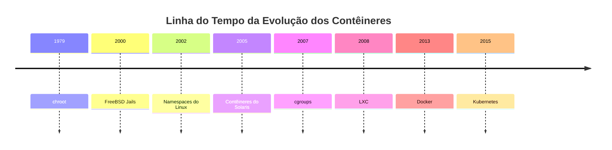
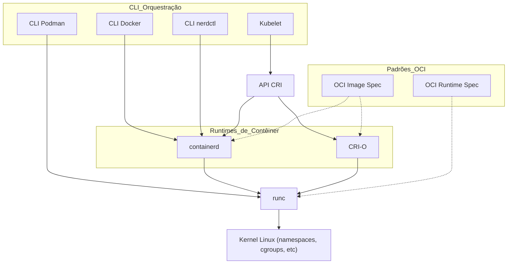

# LEARNING LPIC-3 305-300


<p align="center">
<strong>Explore a documentação »</strong></a>
    <br />
    <a href="https://marcossilvestrini.github.io/learning-lpic-3-305-300/">Site Web</a>
    -
    <a href="https://github.com/marcossilvestrini/learning-lpic-3-305-300">Página de Código</a>
    -
    <a href="https://skynet-8.gitbook.io/learning-lpic-3-305-300">Gitbook</a>
    -
    <a href="https://github.com/marcossilvestrini/learning-lpic-3-305-300/issues">Reportar Bug</a>
    -
    <a href="https://github.com/marcossilvestrini/learning-lpic-3-305-300/issues">Solicitar Funcionalidade</a>
</p>

---

## Resumo

<details>
  <summary><b>TABELA DE CONTEÚDO</b></summary>
  <ol>
    <li>
      <a href="#about-the-project">Sobre o Projeto</a>
    </li>
    <li>
      <a href="#getting-started">Começando</a>
      <ul>
        <li><a href="#prerequisites">Pré-requisitos</a></li>
        <li><a href="#installation">Instalação</a></li>
      </ul>
    </li>
    <li><a href="#usage">Uso</a></li>
    <li><a href="#roadmap">Roteiro</a></li>
    <li><a href="#freedoms">Quatro Liberdades Essenciais</a></li>
    <li>
      <a href="#topic-351">Tópico 351: Virtualização Completa</a>
      <ul>
        <li><a href="#topic-351.1">351.1 Conceitos e Teoria da Virtualização</a></li>
        <li><a href="#topic-351.2">351.2 Xen</a></li>
        <li><a href="#topic-351.3">351.3 QEMU</a></li>
        <li><a href="#topic-351.4">351.4 Gerenciamento de Máquinas Virtuais com Libvirt</a></li>
        <li><a href="#topic-351.5">351.5 Gerenciamento de Imagens de Disco de Máquinas Virtuais</a></li>
      </ul>
    </li>
    <li>
      <a href="#topic-352">Tópico 352: Virtualização de Contêineres</a>
      <ul>
        <li><a href="#topic-352.1">352.1 Conceitos de Virtualização por Contêiner</a></li>
        <li><a href="#topic-352.2">352.2 LXC</a></li>
        <li><a href="#topic-352.3">352.3 Docker</a></li>
        <li><a href="#topic-352.4">352.4 Plataformas de Orquestração de Contêineres</a></li>
      </ul>
    </li>
    <li>
      <a href="#topic-353">Tópico 353: Implantação e Provisionamento de VM</a>
      <ul>
        <li><a href="#topic-353.1">353.1 Ferramentas de Gerenciamento Cloud</a></li>
        <li><a href="#topic-353.2">353.2 Packer</a></li>
        <li><a href="#topic-353.3">353.3 cloud-init</a></li>
        <li><a href="#topic-353.4">353.4 Vagrant</a></li>
      </ul>
    </li>
    <li><a href="#license">Licença</a></li>
    <li><a href="#contact">Contato</a></li>
    <li><a href="#acknowledgments">Agradecimentos</a></li>
  </ol>
</details><br>

---

<a name="about-the-project"></a>

## Sobre o Projeto

> Este projeto tem como objetivo ajudar estudantes ou profissionais a aprender os principais conceitos de GNULinux
> e softwares livres
> Algumas distribuições GNULinux, como Debian e RPM, serão abordadas
> Instalação e configuração de alguns pacotes também serão abordados
> Assim, você pode oferecer à comunidade a oportunidade de se beneficiar de suas mudanças.
> O acesso ao código-fonte é uma pré-condição para isso.
> Use o vagrant para levantar máquinas e executar laboratórios e conteúdos práticos neste artigo.
> Publiquei na pasta Vagrant um arquivo Vagrantfile com o necessário
> para você criar um ambiente de estudos

---

<p align="right">(<a href="#readme-top">voltar ao topo</a>)</p>

<a name="getting-started"></a>

## Começando

Para iniciar o aprendizado, consulte a documentação acima.

<a name="prerequisites"></a>

### Pré-requisitos

* [Git](https://git-scm.com/book/en/v2/Getting-Started-Installing-Git)
* [VMware Workstation](https://blogs.vmware.com/workstation/2024/05/vmware-workstation-pro-now-available-free-for-personal-use.html)
* [Vagrant VMWare Utility](https://developer.hashicorp.com/vagrant/install/vmware)
* [Vagrant](https://developer.hashicorp.com/vagrant/install)

<a name="installation"></a>

### Instalação

Clone o repositório

```sh
git clone https://github.com/marcossilvestrini/learning-lpic-3-305-300.git
cd learning-lpic-3-305-300
```

Personalize um arquivo modelo *Vagrantfile-topic-XXX*. Este arquivo contém a configuração de VMs para os laboratórios. Exemplo:

* Arquivo [Vagrantfile-topic-351](vagrant/Vagrantfile-topic-351)
  * vm.clone_directory = "<letra_da_unidade>:\\`<pasta>`\\<para_vm>\\#{VM_NAME}-instance-1"
    Exemplo: vm.clone_directory = "E:\\Servidores\\VMWare\\#{VM_NAME}-instance-1"
  * vm.vmx["memsize"] = ""
  * vm.vmx["numvcpus"] = ""
  * vm.vmx["cpuid.coresPerSocket"] = ""

Altere a configuração da rede nos arquivos [configs/network](configs/network/).

---

<a name="usage"></a>

## Uso

Utilize este repositório para obter conhecimentos sobre o exame LPIC-3 305-300

### Para subir e parar

Altere o template *Vagrantfile-topic-xxx* e copie para um novo arquivo chamado *Vagrantfile*

```sh
cd vagrant && vagrant up
cd vagrant && vagrant destroy -f
```

### Para reiniciar as VMs

```sh
cd vagrant && vagrant reload
```

**Importante:**
*Se você reiniciar as VMs sem usar o vagrant, a pasta compartilhada não será montada após a reinicialização.*

### Para usar powershell para subir e parar

Se usar Windows, criei um script powershell para subir e parar as VMs.

```powershell
vagrant/up.ps1
vagrant/destroy.ps1
```

### Esquema de Infraestrutura Tópico 351


<p align="right">(<a href="#readme-top">voltar ao topo</a>)</p>

---

<a name="roadmap"></a>

## Roteiro

* [X] Criar repositório
* [X] Criar scripts para provisionamento dos laboratórios
* [X] Criar exemplos sobre o Tópico 351
* [X] Criar exemplos sobre o Tópico 352
* [ ] Criar exemplos sobre o Tópico 353
* [ ] Carregar simulado do ITexams

---

<a name="freedoms"></a>

## Quatro Liberdades Essenciais

> 0. A liberdade de executar o programa como desejar, para qualquer propósito (liberdade 0).
> 1. A liberdade de estudar como o programa funciona, e modificá-lo para que faça
> seu cálculo como desejar (liberdade 1).
> O acesso ao código-fonte é uma condição prévia para isso.
> 2. A liberdade de redistribuir cópias para ajudar os outros (liberdade 2).
> 3. liberdade de distribuir cópias das suas versões modificadas para outras pessoas (liberdade 3).

---

## Comandos de inspeção

```sh
type COMANDO
apropos COMANDO
whatis COMANDO --long
whereis COMANDO
COMANDO --help, --h
man COMANDO
```

<p align="right">(<a href="#readme-top">voltar ao topo</a>)</p>

---

<a name="topic-351"></a>

## Tópico 351: Virtualização Completa


---

<a name="topic-351.1"></a>

### 351.1 Conceitos e Teoria da Virtualização

**Peso:** 6

**Descrição:** Os candidatos devem conhecer e compreender os conceitos gerais, teoria e terminologia da virtualização. Isso inclui Xen, QEMU e terminologia libvirt.

**Áreas de Conhecimento-Chave:**

* 🖥️ Compreender terminologia de virtualização
* ⚖️ Entender os prós e contras da virtualização
* 🛠️ Entender as várias variações de Hipervisores e Monitores de Máquinas Virtuais
* 🔄 Compreender os principais aspectos da migração de máquinas físicas para virtuais
* 🚀 Compreender os principais aspectos da migração de máquinas virtuais entre sistemas hospedeiros
* 📸 Compreender recursos e implicações da virtualização para uma máquina virtual, como snapshot, pausa, clonagem e limites de recursos
* 🌐 Conhecimento de oVirt, Proxmox, systemd-machined e VirtualBox
* 🔗 Conhecimento de Open vSwitch

#### 351.1 Objetos Citados

```sh
Hypervisor
Máquina Virtual de Hardware (HVM)
Paravirtualização (PV)
Emulação e Simulação
Flags de CPU
/proc/cpuinfo
Migração (P2V, V2V)
```

#### Hipervisores

##### Tipo 1 Hypervisor (Hypervisor de Metal Nudo)

###### Definição de Tipo 1

Executa diretamente no hardware físico do host, fornecendo uma camada base para gerenciar VMs sem a necessidade de um sistema operacional hospedeiro.

###### Características do Tipo 1

* ⚡ Alto desempenho e eficiência.
* ⏱️ Latência e overhead menores.
* 🏢 Frequentemente usado em ambientes empresariais e data centers.

###### Exemplos de Tipo 1

* VMware ESXi: Um hypervisor robusto e amplamente utilizado em ambientes empresariais.
* Microsoft Hyper-V: Integrado ao Windows Server, oferecendo alto desempenho e recursos de gerenciamento.
* Xen: Hypervisor de código aberto usado por muitos provedores de serviços em nuvem.
* KVM (Kernel-based Virtual Machine): Integrado ao kernel Linux, oferecendo alto desempenho para sistemas Linux.

##### Tipo 2 Hypervisor (Hypervisor Hospedado)

###### Definição de Tipo 2

Executa sobre um sistema operacional convencional, dependendo do OS hospedeiro para gerenciamento de recursos e suporte a dispositivos.

###### Características do Tipo 2

* 🛠️ Mais fácil de configurar e usar, especialmente em PCs pessoais.
* 🔧 Mais flexível para desenvolvimento, testes e implantações em pequena escala.
* 🐢 Geralmente menos eficiente que Hypervisores de Tipo 1 devido ao overhead adicional do sistema operacional hospedeiro.

###### Exemplos de Tipo 2

* VMware Workstation: Um hypervisor potente para executar múltiplos sistemas operacionais em um desktop.
* Oracle VirtualBox: Hypervisor de código aberto conhecido por sua flexibilidade e facilidade de uso.
* Parallels Desktop: Projetado para Mac para executar Windows e outros sistemas ao lado do macOS.
* QEMU (Quick EMUlator): Emulador e virtualizador de código aberto, frequentemente usado junto com KVM.

##### Diferenças Principais entre Hypervisores de Tipo 1 e Tipo 2

* Ambiente de Desdobramento:
  * Hypervisores de Tipo 1 são comumente implantados em data centers e ambientes empresariais por seu contato direto com o hardware e alto desempenho.
  * Hypervisores de Tipo 2 são mais apropriados para uso pessoal, desenvolvimento, testes e tarefas de virtualização em pequena escala.
* Desempenho:
  * Hypervisores de Tipo 1 geralmente oferecem melhor desempenho e menor latência por não dependerem de um sistema operacional hospedeiro.
  * Hypervisores de Tipo 2 podem sofrer com degradação de desempenho devido ao overhead do sistema operacional hospedeiro.
* Gestão e Facilidade de Uso:
  * Hypervisores de Tipo 1 requerem configuração e gerenciamento mais complexos, oferecendo recursos avançados e escalabilidade para grandes ambientes.
  * Hypervisores de Tipo 2 são mais fáceis de instalar e usar, sendo ideais para usuários individuais e projetos menores.

##### Tipos de Migração

No contexto de hypervisores, que são tecnologias usadas para criar e gerenciar máquinas virtuais, os termos P2V (Físico para Virtual) e V2V (Virtual para Virtual) são comuns em ambientes de virtualização.
Refere-se aos processos de migração entre plataformas diferentes.

##### P2V - Migração de Físico para Virtual

P2V refere-se ao processo de migrar um servidor físico para uma máquina virtual. Em outras palavras, um sistema operacional e seus aplicativos, executados em hardware dedicado, são "convertidos" e movidos para uma máquina virtual que roda em um hypervisor (como VMware, Hyper-V, KVM, etc.).

* Exemplo: Você possui um servidor físico com Windows ou Linux e deseja movê-lo para um ambiente virtualizado, como uma infraestrutura de nuvem ou um servidor de virtualização interno.
* O processo envolve copiar todo o estado do sistema, incluindo o sistema operacional, drivers e dados, para criar uma VM equivalente que possa ser executada como se estivesse no hardware físico.

##### V2V - Virtual para Virtual Migration

V2V refere-se ao processo de migrar uma máquina virtual de um hypervisor para outro. Neste caso, você já tem uma VM em execução em um ambiente virtualizado (como VMware), e deseja movê-la para outro ambiente virtualizado (por exemplo, para Hyper-V ou para um novo servidor VMware).

* Exemplo: Você tem uma VM rodando em um servidor VMware, mas decide migrá-la para uma plataforma Hyper-V. Nesse caso, a migração V2V converte a VM de um formato ou hypervisor para outro, garantindo sua continuidade operacional.

#### HVM e Paravirtualização

##### Virtualização Assistida por Hardware (HVM)

###### Definição de HVM

HVM aproveita extensões de hardware fornecidas por CPUs modernas para virtualizar o hardware, permitindo a criação e gerenciamento de VMs com overhead de desempenho mínimo.

###### Características Chave de HVM

* 🖥️ **Suporte de Hardware**: Necessita suporte de CPU para extensões de virtualização, como Intel VT-x ou AMD-V.
* 🛠️ **Virtualização Completa:** VMs podem rodar sistemas operacionais convidados não modificados, pois o hypervisor fornece uma emulação completa do hardware.
* ⚡ **Desempenho:** Geralmente oferece desempenho quase nativo devido à execução direta do código do convidado na CPU.
* 🔒 **Isolamento:** Oferece forte isolamento entre VMs, uma vez que cada VM opera como se tivesse hardware dedicado.

###### Exemplos de HVM

VMware ESXi, Microsoft Hyper-V, KVM (Kernel-based Virtual Machine).

###### Vantagens de HVM

* ✅ **Compatibilidade:** Pode executar qualquer sistema operacional sem modificação.
* ⚡ **Desempenho:** Alto desempenho devido ao suporte de hardware.
* 🔒 **Segurança:** Recursos aprimorados de isolamento e segurança fornecidos pelo hardware.

###### Desvantagens de HVM

* 🛠️ **Dependência de Hardware:** Requer recursos específicos de hardware, limitando a compatibilidade com sistemas antigos.
* 🔧 **Complexidade:** Pode envolver configurações mais complexas e gerenciamento.

##### Paravirtualização

###### Definição de Paravirtualização

Paravirtualização envolve modificar o sistema operacional convidado para estar ciente do ambiente virtualizado, permitindo uma interação mais eficiente com o hypervisor.

###### Características-Chave de Paravirtualização

* 🛠️ **Modificação do Convidado:** Requer alterações no sistema operacional convidado para comunicar-se diretamente com o hypervisor usando hypercalls.
* ⚡ **Desempenho:** Pode ser mais eficiente que a virtualização completa tradicional, pois reduz o overhead associado à emulação de hardware.
* 🔗 **Compatibilidade:** Limitado a OS que foram modificados para paravirtualização.

###### Exemplos de Paravirtualização

Xen com convidados paravirtualizados, ferramentas VMware em certas configurações, e algumas configurações de KVM.

###### Vantagens da Paravirtualização

* ⚡ **Eficiência:** Reduz o overhead da virtualização de hardware, oferecendo melhor desempenho para certos workloads.
* ✅ **Utilização de Recursos:** Uso mais eficiente dos recursos do sistema devido à comunicação direta entre o OS convidado e o hypervisor.

###### Desvantagens da Paravirtualização

* 🛠️ **Modificação do Sistema Operacional:** Requer modificações no OS convidado, limitando compatibilidade a sistemas suportados.
* 🔧 **Complexidade:** Necessita de configurações adicionais no sistema convidado para implementação de hypercalls.

##### Diferenças-Chave

###### Requisitos do Sistema Operacional Convidado

* **HVM:** Pode rodar sistemas convidados não modificados.
* **Paravirtualização:** Requer modificações no OS convidado para funcionar com o hypervisor.

###### Desempenho

* **HVM:** Geralmente fornece desempenho próximo ao nativo devido à execução assistida por hardware.
* **Paravirtualização:** Pode oferecer desempenho eficiente, reduzindo o overhead da emulação de hardware, mas depende do OS convidado modificado.

###### Dependência de Hardware

* **HVM:** Requer recursos específicos de CPU (Intel VT-x, AMD-V).
* **Paravirtualização:** Não requer recursos específicos de CPU, mas necessita de OS convidado modificado.

###### Isolamento

* **HVM:** Fornece forte isolamento usando recursos de hardware.
* **Paravirtualização:** Confia em isolamento baseado em software, que pode não ser tão robusto quanto o baseado em hardware.

###### Complexidade

* **HVM:** Geralmente mais simples de implementar, pois suporta OS não modificados.
* **Paravirtualização:** Requer configurações adicionais e modificações no OS convidado, aumentando a complexidade.

#### NUMA (Acesso Não Uniforme à Memória)

NUMA (Non-Uniform Memory Access) é uma arquitetura de memória usada em sistemas multiprocessadores para otimizar o acesso à memória pelos processadores.
Em um sistema NUMA, a memória é distribuída de forma desigual entre os processadores, ou seja, cada processador tem acesso mais rápido a uma porção da memória (sua "memória local") do que à memória que está fisicamente mais distante (referida como "memória remota") e associada a outros processadores.

##### Características Chave da Arquitetura NUMA

1. **Memória Local e Remota**: Cada processador possui sua própria memória local, acessível mais rapidamente. No entanto, também pode acessar a memória de outros processadores, embora demore mais.
2. **Latência Diferenciada**: A latência de acesso à memória varia dependendo de o processador estar acessando sua memória local ou a memória de outro nó. O acesso à memória local é mais rápido, enquanto o acesso a uma memória remota é mais lento.
3. **Escalabilidade**: A arquitetura NUMA foi projetada para melhorar a escalabilidade em sistemas com muitos processadores. À medida que mais processadores são adicionados, a memória também é distribuída, evitando o gargalo que ocorreria em uma arquitetura de acesso uniforme à memória (UMA).

##### Vantagens do NUMA

* ⚡ Melhor desempenho em sistemas grandes: Como cada processador possui sua própria memória local, ele pode trabalhar de maneira mais eficiente, sem competir tanto por acesso à memória.
* 📈 Escalabilidade: NUMA permite que sistemas com múltiplos processadores e grandes quantidades de memória tenham uma expansão mais eficiente, em comparação com uma arquitetura UMA.

##### Desvantagens

* 🛠️ Complexidade de programação: Os programadores precisam estar cientes de quais regiões de memória são locais ou remotas, otimizando o uso da memória local para melhor desempenho.
* 🐢 Penalidades de desempenho potenciais: Se um processador acessar frequentemente a memória remota, o desempenho pode sofrer devido à maior latência.
  Essa arquitetura é comum em sistemas de multiprocessamento de alto desempenho, como servidores e supercomputadores, onde a escalabilidade e otimização de memória são críticas.

#### Soluções Open Source

* 🌐 oVirt: [https://www.ovirt.org/](https://www.ovirt.org/)
* 🌐 Proxmox: [https://www.proxmox.com/en/proxmox-virtual-environment/overview](https://www.proxmox.com/en/proxmox-virtual-environment/overview)
* 🌐 Oracle VirtualBox: [https://www.virtualbox.org/](https://www.virtualbox.org/)
* 🌐 Open vSwitch: [https://www.openvswitch.org/](https://www.openvswitch.org/)

#### Tipos de Virtualização

##### Virtualização de Hardware (Virtualização de Servidores)

###### HV Definição

Abstracts hardware físico para criar máquinas virtuais (VMs) que executam sistemas operacionais e aplicativos independentes.

###### Casos de Uso de HV

Data centers, computação em nuvem, consolidação de servidores.

###### Exemplos de HV

VMware ESXi, Microsoft Hyper-V, KVM.

##### Virtualização de Sistema Operacional (Contêineres)

###### Definição de Contêineres

Permite múltiplas instâncias isoladas de espaço de usuário (contêineres) em um único kernel de sistema operacional.

###### Casos de Uso de Contêineres

Arquitetura de microsserviços, ambientes de desenvolvimento e testes.

###### Exemplos de Contêineres

Docker, Kubernetes, LXC.

##### Virtualização de Rede

###### Definição de Virtualização de Rede

Combina recursos de rede de hardware e software em uma única entidade administrativa baseada em software.

###### Casos de Uso de Virtualização de Rede

Redes definidas por software (SDN), virtualização de funções de rede (NFV).

###### Exemplos de Virtualização de Rede

VMware NSX, Cisco ACI, OpenStack Neutron.

##### Virtualização de Armazenamento

###### Definição de Virtualização de Armazenamento

Agrupa armazenamento físico de vários dispositivos em uma única unidade de armazenamento virtual que pode ser gerenciada centralmente.

###### Casos de Uso de Virtualização de Armazenamento

Gestão de dados, otimização de armazenamento, recuperação de desastres.

###### Exemplos de Virtualização de Armazenamento

IBM SAN Volume Controller, VMware vSAN, NetApp ONTAP.

##### Virtualização de Desktop

###### Definição de Virtualização de Desktop

Permite que um sistema operacional desktop rode em uma máquina virtual hospedada em um servidor.

###### Casos de Uso de Virtualização de Desktop

Infraestrutura de desktops virtuais (VDI), soluções de trabalho remoto.

###### Exemplos de Virtualização de Desktop

Citrix Virtual Apps and Desktops, VMware Horizon, Microsoft Remote Desktop Services.

##### Virtualização de Aplicativos

###### Definição de Virtualização de Aplicativos

Separa aplicativos do hardware e sistema operacional subjacentes, permitindo sua execução em ambientes isolados.

###### Casos de Uso de Virtualização de Aplicativos

Simplificação do deployment de aplicativos, testes de compatibilidade.

###### Exemplos de Virtualização de Aplicativos

VMware ThinApp, Microsoft App-V, Citrix XenApp.

##### Virtualização de Dados

###### Definição de Virtualização de Dados

Integra dados de várias fontes sem consolidá-los fisicamente, oferecendo uma visão unificada para análise e relatórios.

###### Casos de Uso de Virtualização de Dados

Inteligência de negócios, integração de dados em tempo real.

###### Exemplos de Virtualização de Dados

Denodo, Red Hat JBoss Data Virtualization, IBM InfoSphere.

##### Benefícios da Virtualização

* ⚡ Eficiência de Recursos: Melhor utilização de recursos físicos.
* 💰 Economia de Custos: Redução de custos de hardware e operação.
* 📈 Escalabilidade: Facilmente escalar para cima ou para baixo conforme a demanda.
* 🔧 Flexibilidade: Suporta variados workloads e aplicativos.
* 🔄 Recuperação de Desastres: Processos simplificados de backup e recuperação.
* 🔒 Isolamento: Segurança aprimorada por meio do isolamento de ambientes.

#### Emulação

Emulação envolve simular o comportamento de hardware ou software em uma plataforma diferente daquela originalmente pretendida.

Este processo permite que software projetado para um sistema seja executado em outro sistema que pode ter arquitetura ou ambiente operacional diferentes.

Embora a emulação ofereça versatilidade ao possibilitar a execução de sistemas operacionais convidados ou aplicativos não modificados, ela geralmente tem custos de desempenho.

Esse overhead surge porque o sistema emulado precisa interpretar e traduzir instruções destinadas ao sistema original para instruções compatíveis com o sistema hospedeiro. Como resultado, a emulação pode ser mais lenta que a execução nativa, tornando-a menos eficiente para tarefas intensivas em recursos.

Apesar dessa limitação, a emulação continua valiosa para rodar softwares legados, testar aplicativos em plataformas diferentes e facilitar o desenvolvimento multiplataforma.

#### systemd-machined

 O serviço systemd-machined é dedicado à gestão de máquinas virtuais e contêineres dentro do ecossistema systemd.
 Ele fornece funcionalidades essenciais para controle, monitoramento e manutenção de instâncias virtuais, oferecendo integração robusta e eficiência em ambientes Linux.

<p align="right">(<a href="#topic-351.1">voltar ao sub Tópico 351.1</a>)</p>
<p align="right">(<a href="#topic-351">voltar ao Tópico 351</a>)</p>
<p align="right">(<a href="#readme-top">voltar ao topo</a>)</p>

---

<a name="topic-351.2"></a>

### 351.2 Xen


**Peso:** 3

**Descrição:** Os candidatos devem ser capazes de instalar, configurar, manter, migrar e solucionar problemas nas instalações Xen. O foco está na versão Xen 4.x.

**Áreas de Conhecimento-Chave:**

* Compreender arquitetura do Xen, incluindo redes e armazenamento
* Configuração básica de nós e domínios Xen
* Gerenciamento básico de nós e domínios Xen
* Solução de problemas básica de instalações Xen
* Conhecimento de XAPI
* Conhecimento de XenStore
* Conhecimento de Parâmetros de Boot do Xen
* Conhecimento da utilidade xm

#### Xen


Xen é um hypervisor de código aberto de tipo 1 (de metal nu), que permite que múltiplos sistemas operacionais rodem simultaneamente no mesmo hardware físico. O Xen fornece uma camada entre o hardware físico e as máquinas virtuais (VMs), possibilitando compartilhamento eficiente de recursos e isolamento.

* **Arquitetura:** Xen opera com um sistema de dois níveis onde o Domínio 0 (Dom0) é o domínio privilegiado com acesso direto ao hardware e gerencia o hypervisor. Outras máquinas virtuais, chamadas de DomU, executam sistemas operacionais convidados e são gerenciadas pelo Dom0.
* **Tipos de Virtualização:** Xen suporta tanto paravirtualização (PV), que requer OS convidados modificados, quanto virtualização assistida por hardware (HVM), que usa extensões de hardware (por exemplo, VT-x da Intel ou AMD-V) para executar sistemas convidados não modificados.
  Xen é amplamente usado em ambientes de nuvem, notavelmente pela AWS e outros provedores de nuvem de grande escala.

#### XenSource

XenSource foi a empresa fundada pelos desenvolvedores originais do hypervisor Xen na Universidade de Cambridge para comercializar o Xen.
A empresa fornecia soluções empresariais baseadas no Xen e oferecia ferramentas e suporte adicionais para aprimorar o Xen para uso corporativo.

* **Aquisição pela Citrix**: Em 2007, a XenSource foi adquirida pela Citrix Systems, Inc. A Citrix usou a tecnologia Xen como base para o seu produto XenServer da Citrix, que se tornou uma plataforma de virtualização empresarial popular baseada em Xen.
* **Transição**: Após a aquisição, o projeto Xen continuou como um projeto de código aberto, enquanto a Citrix focou em ofertas comerciais como o XenServer, aproveitando a tecnologia XenSource.

#### Xen Project

Xen Project refere-se à comunidade e iniciativa de código aberto responsável pelo desenvolvimento e manutenção do hypervisor Xen após sua comercialização. O Xen Project opera sob a Fundação Linux, com foco em construir, melhorar e apoiar o Xen como um esforço colaborativo e conduzido pela comunidade.

* **Objetivos:** O Xen Project visa avançar o hypervisor aprimorando seu desempenho, segurança e conjunto de recursos para uma ampla gama de casos de uso, incluindo computação em nuvem, virtualização centrada em segurança (por exemplo, Qubes OS) e sistemas embarcados.
* **Colaboradores:** O projeto inclui contribuintes de várias organizações, incluindo grandes provedores de nuvem, fornecedores de hardware e desenvolvedores independentes.
* **XAPI e XenTools:** O Xen Project também inclui ferramentas como XAPI (XenAPI) e várias utilidades para gerenciamento e otimização do sistema.

#### XenStore

Xen Store é um componente crítico do hypervisor Xen.
Basicamente, Xen Store é um banco de dados de chaves e valores distribuído usado para comunicação e compartilhamento de informações entre o hypervisor Xen e as máquinas virtuais (domínios) que ele gerencia.

Vamos aos aspectos principais do Xen Store:

* **Comunicação entre Domínios:** Xen Store permite comunicação entre domínios, como o Dom0 (domínio privilegiado que controla recursos de hardware) e os DomUs (domínios de usuário, que são as VMs). Isso é feito por meio de entradas de chaves e valores, onde cada domínio pode ler ou escrever informações.
* **Gerenciamento de Configurações:** É usado para armazenar e acessar informações de configuração, como dispositivos virtuais, rede e parâmetros de boot. Isso facilita o gerenciamento dinâmico e configuração das VMs.
* **Eventos e Notificações:** Xen Store também suporta notificações de eventos. Quando uma chave ou valor específico no Xen Store é modificado, os domínios interessados podem ser notificados para reagir a essas alterações. Isso é útil para monitoramento e gerenciamento de recursos.
* **API Simples:** Xen Store fornece uma API simples para leitura e escrita de dados, facilitando a integração de aplicativos com o sistema de virtualização Xen.

#### XAPI

XAPI, ou XenAPI, é a interface de programação de aplicativos (API) usada para gerenciar o hypervisor Xen e suas máquinas virtuais (VMs).
XAPI é um componente chave do XenServer (agora conhecido como Hypervisor Citrix) e fornece uma maneira padronizada de interagir com o hypervisor Xen para realizar operações como criar, configurar, monitorar e controlar VMs.

Vamos aos aspectos importantes de XAPI:

* **Gerenciamento de VMs:** XAPI permite que administradores criem, excluam, iniciem e parem máquinas virtuais de forma programática.
* **Automação:** Com XAPI, é possível automação na gestão de recursos virtuais, incluindo rede, armazenamento e computação, o que é crucial para ambientes de nuvem.
* **Integração:** XAPI pode ser integrado a outras ferramentas e scripts para fornecer administração mais eficiente e personalizada do ambiente Xen.
* **Controle de Acesso:** XAPI também fornece mecanismos de controle de acesso para garantir que apenas usuários autorizados possam executar operações específicas no ambiente virtual.

XAPI é a interface que possibilita controle e automação do hypervisor Xen, facilitando a gestão de ambientes virtualizados.

#### Resumo do Xen

* **Xen:** A tecnologia de hypervisor central que permite que máquinas virtuais rodem em hardware físico.
* **XenSource:** A empresa que comercializou o Xen, posteriormente adquirida pela Citrix, levando ao desenvolvimento do XenServer da Citrix.
* **Xen Project:** A iniciativa e comunidade de código aberto que continua a desenvolver e manter o hypervisor Xen sob a Fundação Linux.
* **XenStore:**  Xen Store atua como intermediário de comunicação e configuração entre o hypervisor Xen e as VMs, agilizando a operação e gestão de ambientes virtualizados.
* **XAPI** é a interface que possibilita controle e automação do hypervisor Xen, facilitando sua gestão.

#### Domain0 (Dom0)

Domain0, ou Dom0, é o domínio de controle na arquitetura Xen. Ele gerencia outros domínios (DomUs) e tem acesso direto ao hardware.
Dom0 executa drivers de dispositivos, permitindo que DomUs, que não têm acesso direto ao hardware, comuniquem-se com os dispositivos. Geralmente, é uma instância completa de sistema operacional, como Linux, e é essencial para o funcionamento do hypervisor Xen.

#### DomainU (DomU)

DomUs são domínios sem privilégios que executam máquinas virtuais.
Eles são gerenciados pelo Dom0 e não possuem acesso direto ao hardware. Os DomUs podem ser configurados para executar sistemas operacionais diferentes e são usados para várias finalidades, como servidores de aplicativos e ambientes de desenvolvimento. Dependem do Dom0 para interação com o hardware.

#### PV-DomU (Domínio ParavirtualizadoU)

PV-DomUs usam uma técnica chamada paravirtualização. Nesse modelo, o sistema operacional DomU é modificado para estar ciente do ambiente virtualizado, permitindo comunicação direta com o hypervisor para desempenho otimizado.
Isso resulta em overhead menor e maior eficiência em comparação à virtualização completa.

#### HVM-DomU (Máquina Virtual de Hardware DomU)

HVM-DomUs são máquinas virtuais que utilizam virtualização completa, permitindo que sistemas operacionais não modificados rodem. O hypervisor Xen fornece emulação de hardware para esses DomUs, possibilitando a execução de qualquer sistema que suporte a arquitetura de hardware subjacente.
Embora ofereça maior flexibilidade, pode resultar em overhead maior em comparação aos PV-DomUs.

#### Rede Xen

Rede Paravirtualizada


Bridging


#### 351.2 Citações de Objetos

```sh
Domain0 (Dom0), DomainU (DomU)
PV-DomU, HVM-DomU
/etc/xen/
xl
xl.cfg 
xl.conf # configurações globais do Xen
xentop
oxenstored # configurações do Xenstore
```

#### 351.2 Notas

```sh

# Configurações do Xen
/etc/xen/
/etc/xen/xl.conf - Arquivo de configuração geral do Xen
/etc/xen/oxenstored.conf - Configurações do Xenstore

# Configurações das VMs
/etc/xen/xlexample.pvlinux
/etc/xen/xlexample.hvm

# Configurações de serviço
/etc/default/xen
/etc/default/xendomains

# configurações de xen-tools
/etc/xen-tools/
/usr/share/xen-tools/

# documentos
xl(1)
xl.conf(5)
xlcpupool.cfg(5)
xl-disk-configuration(5)
xl-network-configuration(5)
xen-tscmode(7)

# domínios auto inicializados
/etc/default/xendomains
   XENDOMAINS_AUTO=/etc/xen/auto

/etc/xen/auto/


# define domínio para subir após reboot do xen
## criar pasta auto
cd /etc/xen && mkdir -p auto && cd auto

# criar link simbólico
ln -s /etc/xen/lpic3-pv-guest /etc/xen/auto/lpic3-pv-guest
```

#### 351.2 Comandos Importantes

##### xen-create-image

```sh
# criar uma imagem pv
xen-create-image \
  --hostname=lpic3-pv-guest \
  --memory=1gb \
  --vcpus=2 \
  --lvm=vg_xen \
  --bridge=xenbr0 \
  --dhcp \
  --pygrub \
  --password=vagrant \
  --dist=bookworm
```

##### xen-list-images

```sh
# listar imagens
xen-list-image
```

##### xen-delete-image

```sh
# deletar uma imagem pv
xen-delete-image lpic3-pv-guest --lvm=vg_xen
```

##### xenstore-ls

```sh
# listar infos do xenstore
xenstore-ls
```

##### xl

```sh
# visualizar informações do xen
xl infos

# listar domínios
xl list
xl list lpic3-hvm-guest
xl list lpic3-hvm-guest -l

# uptime dos domínios
xl uptime

# pausar domínio
xl pause 2
xl pause lpic3-hvm-guest

# salvar estado dos domínios
xl -v save lpic3-hvm-guest ~root/image-lpic3-hvm-guest.save

# restaurar domínio
xl restore /root/image-lpic3-hvm-guest.save

# obter nome do domínio
xl domname 2

# visualizar dmesg
xl dmesg

# monitorar domínio
xl top
xentop
xen top

# Limitar memória do Dom0
xl mem-set 0 2048

# Limitar cpu (não permanente após boot)
xl vcpu-set 0 2

# criar DomainU - máquina virtual
xl create /etc/xen/lpic3-pv-guest.cfg

# criar e conectar a máquina virtual ao guest
xl create -c /etc/xen/lpic3-pv-guest.cfg

##----------------------------------------------
# criar DomainU máquina virtual HVM

## criar volume lógico
lvcreate -l +20%FREE -n lpic3-hvm-guest-disk  vg_xen

## criar túnel ssh para vnc
ssh -l vagrant -L 5900:localhost:5900  192.168.0.130

## configurar /etc/xen/lpic3-hvm-guest.cfg
## definir boot para cdrom: boot = "d"

## criar domínio hvm
xl create /etc/xen/lpic3-hvm-guest.cfg

## abrir conexão VNC no cliente com localhost
## para visualização, podem-se instalar detalhes

## após instalação, destruir domínio: xl destroy <id_nome>

## definir /etc/xen/lpic3-hvm-guest.cfg: boot para disco rígido: boot = "c"

## criar domínio hvm
xl create /etc/xen/lpic3-hvm-guest.cfg

## acessar domínio hvm
xl console <id_nome>
##----------------------------------------------

# conectar no guest da VM
xl console <id>|<nome> (pressionar enter)
xl console 1
xl console lpic3-pv-guest

# Como sair do "xl console" do domU
#Press ctrl+] ou, no Putty, ctrl+5.

# Desligar a VM
xl shutdown lpic3-pv-guest

# destruir domínio
xl destroy lpic3-pv-guest

# reiniciar domínio
xl reboot lpic3-pv-guest

# listar dispositivos de bloco
xl block-list 1
xl block-list lpic3-pv-guest

# detach dispositivos de bloco
xl block-detach lpic3-hvm-guest hdc
xl block-detach 2 xvdc

# conectar dispositivos de bloco

## dispositivos de disco rígido
xl block-attach lpic3-hvm-guest-ubuntu 'phy:/dev/vg_xen/lpic3-hvm-guest-disk2,xvde,w'

## cdrom
xl block-attach lpic3-hvm-guest 'file:/home/vagrant/isos/ubuntu/seed.iso,xvdc:cdrom,r'
xl block-attach 2 'file:/home/vagrant/isos/ubuntu/seed.iso,xvdc:cdrom,r'

# inserir e ejetar dispositivos de cdrom
xl cd-insert lpic3-hvm-guest-ubuntu xvdb  /home/vagrant/isos/ubuntu/ubuntu-24.04.1-live-server-amd64.iso
xl cd-eject lpic3-hvm-guest-ubuntu xvdb
```

#### 251.2 Notas

##### vif

No Xen, “vif” significa Interface Virtual e é usado para configurar a rede de máquinas virtuais (domínios).

Ao especificar diretivas “vif” nos arquivos de configuração do domínio, administradores podem definir interfaces de rede, atribuir endereços IP, configurar VLANs e outros parâmetros de rede para VMs em hosts Xen. Por exemplo: vif = ['bridge=xenbr0'], nesse caso, conecta a interface de rede da VM à ponte Xen chamada “xenbr0”.

```sh

<p align="right">(<a href="#topic-351.2">voltar ao sub Tópico 351.2</a>)</p>
<p align="right">(<a href="#topic-351">voltar ao Tópico 351</a>)</p>
<p align="right">(<a href="#readme-top">voltar ao topo</a>)</p>

---

<a name="topic-351.3"></a>

### 351.3 QEMU


**Peso:** 4

**Descrição:** Os candidatos devem ser capazes de instalar, configurar, manter, migrar e solucionar problemas nas instalações QEMU.

**Áreas de Conhecimento-Chave:**

* Compreender a arquitetura do QEMU, incluindo KVM, redes e armazenamento
* Iniciar instâncias QEMU a partir da linha de comando
* Gerenciar snapshots usando o monitor do QEMU
* Instalar o Agente Guest do QEMU e drivers VirtIO
* Resolver problemas de instalações do QEMU, incluindo rede e armazenamento
* Conhecimento de parâmetros de configuração importantes do QEMU

#### Objetos Citados de 351.3

```sh
Módulos do Kernel: kvm, kvm-intel e kvm-amd
/dev/kvm
Monitor do QEMU
qemu
qemu-system-x86_64
ip
brctl
tunctl
```

#### Comandos Importantes de 351.3

##### Outros comandos de 351.3

##### verificar módulo kvm

```sh
# verificar se kvm está ativado
egrep -o '(vmx|svm)' /proc/cpuinfo
lscpu |grep Virtualization
lsmod|grep kvm
ls -l /dev/kvm
hostnamectl
systemd-detect-virt
```

```sh
# verificar se kvm está ativado
egrep -o '(vmx|svm)' /proc/cpuinfo
lscpu |grep Virtualization
lsmod|grep kvm
ls -l /dev/kvm

# verificar informações do kernel
uname -a

# verificar dispositivo raiz
findmnt /

# montar uma imagem qcow2
## Exemplo 1:
mkdir -p /mnt/qemu
guestmount -a os-images/Debian_12.0.0_VMM/Debian_12.0.0.qcow2 -i /mnt/qemu/

## Exemplo 2:
sudo guestfish --rw -a os-images/Debian_12.0.0_VMM/Debian_12.0.0.qcow2
run
list-filesystems

# executar comandos em imagens qcow2
## Exemplo 1:
virt-customize -a  os-images/Debian_12.0.0_VMM/Debian_12.0.0.qcow2  --run-command 'echo hello >/root/hello.txt'
## Exemplo 2:
sudo virt-customize -a os-images/Debian_12.0.0_VMM/Debian_12.0.0.qcow2 \
  --run-command 'echo -e "auto ens3\niface ens3 inet dhcp" > /etc/network/interfaces.d/ens3.cfg'

# gerar MAC
printf 'DE:AD:BE:EF:%02X:%02X\n' $((RANDOM%256)) $((RANDOM%256))
```

##### ip

```sh
# listar links
ip link show

# criar bridge
ip link add br0 type bridge
```

##### brctl

```sh
# listar links
ip link show

# criar bridge
ip link add br0 type bridge
```

##### qemu-img

```sh
# criar imagem
qemu-img create -f qcow2 vm-disk-debian-12.qcow2 20G

# converter vmdk para imagem qcow2
qemu-img convert \
  -f vmdk \
  -O qcow2 os-images/Debian_12.0.0_VMM/Debian_12.0.0_VMM_LinuxVMImages.COM.vmdk \
  os-images/Debian_12.0.0_VMM/Debian_12.0.0.qcow2 \
  -p \
  -m16

# redimensionar imagem raw para 30G
qemu-img resize -f raw new-disk 30G

# redimensionar imagem qcow2 para 15G (tamanho atual 30G do disco 30G)
qemu-img resize -f raw --shrink new-disk 15G

# Snapshots

# listar todos os snapshots na imagem
qemu-img snapshot -l new-disk2.qcow2

# criar um snapshot chamado SNAP1
qemu-img snapshot -c SNAP1 disk

# aplicar snapshot por ID ou nome
qemu-img snapshot -a 123456789 disk

# deletar o snapshot chamado SNAP1
qemu-img snapshot -d SNAP1 disk
```

##### guestfish

```sh
# definir variáveis de ambiente para guestfish
export LIBGUESTFS_BACKEND_SETTINGS=force_tcg

# iniciar guestfish com uma imagem de disco
guestfish -a UbuntuServer_24.04.qcow2
#run
#list-partitions

# Executar comandos em arquivo de script
guestfish -a UbuntuServer_24.04.qcow2 -m /dev/sda -i < script.ssh

# Executar comandos de forma interativa
guestfish --rw -a UbuntuServer_24.04.qcow2 <<'EOF'
run
list-filesystems
EOF

# Copiar arquivo do guest para o host
export LIBGUESTFS_BACKEND_SETTINGS=force_tcg
sudo guestfish --rw -a UbuntuServer_24.04.qcow2 -i <<'EOF'
copy-out /etc/hostname /tmp/
EOF

# Copiar arquivo do host para o guest
echo "novo-hostname" > /tmp/hostname
export LIBGUESTFS_BACKEND_SETTINGS=force_tcg
sudo guestfish --rw -a UbuntuServer_24.04.qcow2 -i <<'EOF'
copy-in /tmp/hostname /etc/
EOF

# Visualizar conteúdo de arquivo no guest
guestfish --ro -a UbuntuServer_24.04.qcow2 -i <<'EOF'
cat /etc/hostname
EOF

# Listar arquivos no guest
export LIBGUESTFS_BACKEND_SETTINGS=force_tcg
guestfish --rw -a UbuntuServer_24.04.qcow2 -i <<'EOF'
ls /home/ubuntu
EOF

# Editar arquivo no guest
export LIBGUESTFS_BACKEND_SETTINGS=force_tcg
guestfish --rw -a UbuntuServer_24.04.qcow2 -i <<'EOF'
edit /etc/hosts
EOF
```

###### guestmount

```sh
# Montar imagem de disco em diretório
guestmount -a UbuntuServer_24.04.qcow2 -m /dev/ubuntu-vg/ubuntu-lv /mnt/ubuntu
# domínio
guestmount -d rocky9-server02 -m /dev/ubuntu-vg/ubuntu-lv /mnt/ubuntu 

# Montar partição específica de uma imagem de disco
guestmount -a UbuntuServer_24.04.qcow2 -m /dev/sda2 /mnt/ubuntu
# domínio
guestmount -d debian-server01 --ro -m  /dev/debian-vg/root /mnt/debian
```

###### guestumount

```sh
# Desmontar imagem de disco de um diretório
sudo guestunmount /mnt/ubuntu
```

##### virt-df

```sh
# Mostrar espaço livre e utilizado nos sistemas de arquivos da VM
virt-df UbuntuServer_24.04.qcow2 -h
virt-df -d rocky9-server02 -h
```

##### virt-filesystems

```sh
# Listar sistemas de arquivos, partições e volumes lógicos em uma imagem de disco VM (imagem de disco)
virt-filesystems -a UbuntuServer_24.04.qcow2 --all --long -h

# Listar sistemas de arquivos, partições e volumes lógicos em uma VM (domínio)
virt-filesystems -d debian-server01 --all --long -h
```

##### virt-inspector

```sh
# Inspecionar e relatar o sistema operacional na imagem da VM
virt-inspector -a UbuntuServer_24.04.qcow2 #(disco)
virt-inspector -d debian-server01 #(domínio)
```

##### virt-cat

```sh
# Exibir conteúdo de arquivo dentro de imagem da VM
virt-cat -a UbuntuServer_24.04.qcow2 /etc/hosts
virt-cat -d debian-server01 /etc/hosts #(domínio)
```

##### virt-diff

```sh
# Mostrar diferenças entre duas imagens de disco de VM
virt-diff -a UbuntuServer_24.04.qcow2 -A Rocky-Linux.qcow2
```

##### virt-sparsify

```sh
# Tornar uma imagem de disco de VM menor removendo espaço não utilizado
virt-sparsify UbuntuServer_24.04.qcow2 UbuntuServer_24.04-sparse.qcow2
```

##### virt-resize

```sh
# Redimensionar conteúdo de disco de VM ou partições
virt-filesystems -a UbuntuServer_24.04.qcow2 --all --long -h #(ver tamanho das partições)
qemu-img create -f qcow2 UbuntuServer_24.04-expanded.qcow2 100G #(criar nova imagem de disco com 100G)
virt-resize --expand /dev/ubuntu-vg/ubuntu-lv \
UbuntuServer_24.04.qcow2 UbuntuServer_24.04-expanded.qcow2
```

##### virt-copy-in

```sh
# Copiar arquivos do host para a imagem de disco da VM

virt-copy-in -a UbuntuServer_24.04.qcow2 ~vagrant/test-virt-copy-in.txt /home/ubuntu
```

##### virt-copy-out

```sh
# Copiar arquivos da imagem de disco da VM para o host
virt-copy-out -a UbuntuServer_24.04.qcow2 /home/ubuntu/.bashrc /tmp
```

##### virt-ls

```sh
# Listar arquivos e diretórios dentro de uma imagem de disco da VM
virt-ls -a UbuntuServer_24.04.qcow2 /home/ubuntu
```

##### virt-rescue

```sh
# Lançar um shell de resgate em uma imagem de disco da VM para recuperação
virt-rescue -a UbuntuServer_24.04.qcow2
```

##### virt-sysprep

```sh
# Preparar uma imagem de disco da VM para clonagem removendo dados específicos do sistema
virt-sysprep -a UbuntuServer_24.04.qcow2
```

##### virt-v2v

```sh
# Converter uma VM de um hypervisor estrangeiro para rodar em KVM
virt-v2v -i disk input-disk.img -o local -os /var/tmp
```

##### virt-p2v

```sh
# Converter uma máquina física para usar KVM
```

##### virt-p2v-make-disk

```sh
# Criar uma imagem de disco bootável para conversão físico para virtual
sudo virt-p2v-make-disk -o output.img
```

#### 351.5 Notas

##### OVF: Formato de Virtualização Abert

OVF: Um formato aberto que define um padrão para empacotamento e distribuição de máquinas virtuais em diferentes ambientes.

O pacote gerado possui extensão .ova e contém os seguintes arquivos:

* .ovf: arquivo XML com metadados que definem o ambiente da máquina virtual
* Arquivos de imagem: .vmdk, .vhd, .vhdx, .qcow2, .raw
* Arquivos adicionais: metadados, snapshots, configuração, hash

<p align="right">(<a href="#topic-351.5">voltar ao sub Tópico 351.5</a>)</p>
<p align="right">(<a href="#topic-351">voltar ao Tópico 351</a>)</p>
<p align="right">(<a href="#readme-top">voltar ao topo</a>)</p>

---

<a name="topic-352"></a>

## Tópico 352: Virtualização de Contêineres

---

<a name="topic-352.1"></a>

### 352.1 Conceitos de Virtualização por Contêiner




---

**Peso:** 7

**Descrição:** Os candidatos devem compreender o conceito de virtualização por contêiner. Isso inclui entender os componentes do Linux usados na implementação da virtualização por contêiner, bem como usar ferramentas padrão do Linux para solucionar problemas desses componentes.

**Áreas de Conhecimento-Chave:**

* Entender os conceitos de contêiner de sistema e de aplicação
* Analisar namespaces do kernel
* Analisar grupos de controle (cgroups)
* Analisar capacidades
* Entender o papel do seccomp, SELinux e AppArmor na virtualização por contêiner
* Compreender como LXC e Docker aproveitam namespaces, cgroups, capacidades, seccomp e MAC
* Entender o princípio do runc
* Entender o princípio do CRI-O e containerd
* Conhecimento do runtime OCI e das especificações de imagem
* Conhecimento do Kubernetes Container Runtime Interface (CRI)
* Conhecimento do Podman, Buildah e Skopeo
* Conhecimento de outras abordagens de virtualização de contêineres no Linux e outros sistemas operacionais livres, como rkt, OpenVZ, systemd-nspawn ou BSD Jails

---

#### 352.1 Objetos Citados

```sh
nsenter
unshare
ip (incluindo comandos relevantes)
capsh
/sys/fs/cgroups
/proc/[0-9]+/ns
/proc/[0-9]+/status
```

---

#### 🧠 Entendendo Contêineres


Contêineres são uma tecnologia de virtualização leve que embala aplicações juntamente com suas dependências necessárias — código, bibliotecas, variáveis de ambiente e arquivos de configuração — em unidades isoladas, portáteis e reproduzíveis.

> Em termos simples: um contêiner é uma caixa auto contida que executa sua aplicação da mesma forma, em qualquer lugar.

##### 💡 O que é um Contêiner?

Ao contrário de Máquinas Virtuais (VMs), contêineres não virtualizam o hardware. Em vez disso, eles virtualizam o sistema operacional. Os contêineres compartilham o mesmo kernel Linux com o host, mas cada um opera em espaço de usuário totalmente isolado.

📌 Contêineres vs Máquinas Virtuais:

| Característica       | Contêineres                   | Máquinas Virtuais          |
| ------------------- | ---------------------------- | ------------------------ |
| Kernel do SO       | Compartilhado com o host       | Cada VM tem seu próprio SO |
| Tempo de inicialização | Rápido (segundos ou menos)   | Lento (minutos)           |
| Tamanho da Imagem   | Leve (MBs)                    | Pesado (GBs)             |
| Eficiência dos Recursos | Alta                        | Menor                     |
| Mecanismo de Isolamento | Recursos do kernel (namespaces) | Hypervisor               |

##### 🔑 Características-Chave dos Contêineres

🔹 **Leveza**: Compartilha o kernel do host, reduzindo overhead e permitindo inicializações rápidas.

🔹 **Portátil**: Executa de forma consistente em diferentes ambientes (desenvolvimento, staging, produção, nuvem, local).

🔹 **Isolados**: Utiliza namespaces para isolamento de processos, rede e sistema de arquivos.

🔹 **Eficiente**: Permite maior densidade e melhor utilização de recursos do que VMs tradicionais.

🔹 **Escalabilidade**: Perfeito para microsserviços e arquitetura nativa de nuvem.

##### 🧱 Tipos de Contêineres

1. Contêineres de Sistema

   * Projetados para rodar o sistema operacional completo, assemelham-se a máquinas virtuais.
   * Suportam múltiplos processos e serviços do sistema (init, syslog).
   * Ideais para aplicações legadas ou monolíticas.
   * Exemplo: LXC, libvirt-lxc.
2. Contêineres de Aplicação

   * Projetados para rodar um único processo.
   * Stateless, efêmeros e altamente escaláveis horizontalmente.
   * Utilizados amplamente em DevOps modernos e Kubernetes.
   * Exemplo: Docker, containerd, CRI-O.

##### 🚀 Runtimes de Contêineres Populares

| Runtime              | Descrição                                                      |
| -------------------- | ----------------------------------------------------------------|
| **Docker**     | CLI/daemon mais amplamente adotado para criar e executar contêineres. |
| **containerd** | Runtime leve que alimenta Docker e Kubernetes.                          |
| **CRI-O**      | Runtime nativo do Kubernetes para contêiner OCI.                          |
| **LXC**        | Contêineres de sistema Linux tradicionais, mais próximos de um SO completo. |
| **RKT**        | Runtime com foco em segurança (obsoleto).                                |

##### 🔐 Componentes Internos e Elementos de Segurança de Contêiner

| Componente           | Papel                                              |
| ------------------- | ------------------------------------------------- |
| **Namespaces**      | Isolam processos, usuários, montagem, redes.     |
| **cgroups**         | Controlam e limitam uso de recursos (CPU, memória, I/O).   |
| **Capacidades**      | Controle de privilégios finos dentro do contêiner. |
| **seccomp**         | Restringe syscalls permitidos para reduzir a superfície de ataque. |
| **AppArmor / SELinux** | Controle de acesso obrigatório no kernel. |

---

#### 🧠 Entendendo o comando chroot - Change Root Directory no Unix/Linux


##### O que é chroot?

chroot (abreviação de change root) é uma chamada de sistema e comando em sistemas operacionais Unix-like que altera o diretório raíz aparente (/) para o processo em execução e seus filhos. Isso cria um ambiente isolado, conhecido como jaula chroot.

##### 🧱 Propósito e Casos de Uso

* 🔒 Isolar aplicações para segurança (jaula).
* 🧪 Criar ambientes de teste sem impactar o restante do sistema.
* 🛠️ Recuperação do sistema (ex.: boot com LiveCD e chroot no sistema instalado).
* 📦 Construção de pacotes de software em ambiente controlado.

##### Estrutura Mínima Necessária

O ambiente chroot deve possuir seus próprios arquivos essenciais e estrutura:

```sh
/mnt/myenv/
├── bin/
│   └── bash
├── etc/
├── lib/
├── lib64/
├── usr/
├── dev/
├── proc/
└── tmp/
```

Use ldd para identificar bibliotecas necessárias:

```sh
ldd /bin/bash
```

##### 🚨 Limitações e Considerações de Segurança

* chroot não é uma fronteira de segurança como contêineres ou VMs.
* Um usuário privilegiado (root) dentro da jaula pode potencialmente escapar.
* Não oferece isolamento de namespaces de processos, dispositivos ou recursos do kernel.

Para isolamento mais forte, considere alternativas como:

* Contêineres Linux (LXC, Docker)
* Máquinas virtuais (KVM, QEMU)
* Namespaces de kernel e cgroups

##### 🧪 Testar chroot com debootstrap

```sh
# baixar arquivos do debian
sudo debootstrap stable ~vagrant/debian http://deb.debian.org/debian
sudo chroot ~vagrant/debian bash
```

##### :🧪 Laboratório chroot

Use este script para laboratório: [chroot.sh](scripts/container/chroot.sh)

Saída:


---

#### 🧠 Entendendo Namespaces do Linux


Namespaces são uma funcionalidade central do kernel Linux que permite o isolamento ao nível de processos. Eles criam visualizações separadas de recursos globais do sistema — como IDs de processo, rede, sistemas de arquivos e usuários — de modo que cada grupo de processos acredita estar rodando em seu próprio sistema.

> Em termos simples: namespaces enganam um processo para pensar que possui a máquina, embora esteja compartilhando-a.

Essa é a base para o isolamento de contêineres.

##### 🔍 O que os Namespaces Isolam?

Cada tipo de namespace isola um recurso específico do sistema. Juntos, formam a sandbox na qual um contêiner opera:

| Namespace             | Isola...                      | Exemplo do Mundo Real                                       |
| --------------------- | ------------------------------ | ----------------------------------------------------------- |
| **PID**       | IDs de processos                 | Processos dentro de um contêiner veem um espaço de PID diferente |
| **Mount**     | Pontos de montagem do sistema de arquivos | Cada contêiner vê seu próprio sistema de arquivos raiz     |
| **Network**   | Pilha de rede                   | Contêineres têm IPs, interfaces e rotas isoladas             |
| **UTS**       | Nome do host e domínio          | Cada contêiner define seu próprio hostname                  |
| **IPC**       | Memória compartilhada e semáforos | Impede comunicação entre processos de diferentes contêineres |
| **User**      | IDs de usuário e grupo        | Permite UID 0 falso dentro do contêiner                     |
| **Cgroup (v2)** | Associação ao grupo de controle | Relacionados a limites de CPU e memória                     |

##### 🧪 Analogia Visual


Imagine um prédio de escritórios compartilhado:

* Todos compartilham a mesma fundação (Kernel Linux).
* Cada empresa tem seu próprio escritório (namespace): chaves, mobília, linhas telefônicas, nome da empresa.
* Para cada inquilino, parece que sua própria construção.

É exatamente assim que os contêineres experienciam o sistema — isolados, mas eficientes.

##### 🔧 Como os Contêineres Usam Namespaces

Quando você roda um contêiner (ex.: com Docker ou Podman), o runtime cria um novo conjunto de namespaces:

```bash
docker run -it --rm alpine sh
```

Este comando fornece ao processo:

* Um novo namespace de PID → é o processo 1 dentro do contêiner.
* Um novo namespace de rede → sua própria Ethernet virtual.
* Um namespace de montagem → raiz do sistema de arquivos específica do contêiner.
* Outros namespaces dependendo da configuração (usuário, IPC, etc.)

O resultado: um ambiente de execução leve e isolado que se comporta como um sistema separado.

##### ⚙️ Recursos Complementares do Kernel

Namespaces escondem recursos dos contêineres. Mas, para controlar quanto eles podem usar e o que podem fazer, precisamos de mecanismos adicionais:

###### 🔩 Cgroups (Grupos de Controle)

Cgroups permitem que o kernel limite, priorize e monitore o uso de recursos de grupos de processos.

| Recurso     | Exemplos de uso                          |
| ---------- | -------------------------------------- |
| CPU        | Limitar tempo de CPU por contêiner     |
| Memória    | Limitar uso de RAM                    |
| I/O de disco | Limitar leitura/gravação de disco |
| Rede (v2) | Restrições de largura de banda         |

🛡️ Impede o problema do "vizinho barulhento" ao impedir que um contêiner consuma todos os recursos do sistema.

###### 🧱 Capacidades

O Linux tradicional usa um modelo de privilégios binários: root (UID 0) pode fazer tudo, outros são limitados.

| Capacidade                     | Permite...                                    |
| ------------------------------ | -------------------------------------------- |
| `CAP_CHOWN`                 | Alterar proprietário de arquivos sem permissão |
| `CAP_NET_BIND_SERVICE`      | Associar-se a portas privilegiadas (ex. 80, 443) |
| `CAP_SYS_TIME`              | Alterar o relógio do sistema                 |
| `CAP_SYS_ADMIN`             | ⚠️ Muito poderosa – inclui montar, BPF, etc. |
| `CAP_NET_RAW`               | Usar sockets raw (ex. ping, traceroute) |
| `CAP_SYS_PTRACE`            | Traçar outros processos (depuração) |
| `CAP_KILL`                  | Enviar sinais a qualquer processo             |
| `CAP_DAC_OVERRIDE`          | Modificar arquivos sem permissão |
| `CAP_SETUID`                | Alterar UID do processo                     |
| `CAP_NET_ADMIN`             | Gerenciar interfaces de rede, rotas, etc.  |

🔐 Algumas Tipos de Capacidades Linux

| Tipo de Capacidade             | Descrição                                               |
| ------------------------------ | ------------------------------------------------------- |
| **CapInh (Inerente)**    | Capacidades herdadas do processo pai.                        |
| **CapPrm (Permitted)**    | Capacidades permitidas ao processo.                              |
| **CapEff (Eficaz)**       | Capacidades que o processo está utilizando atualmente.         |
| **CapBnd (Limite)**        | Restringe o conjunto máximo de capacidades eficazes que um processo pode obter. |
| **CapAmb (Ambiente)**      | Permite que um processo defina explicitamente suas capacidades eficazes. |

📦 Capacidades em Contêineres e Podes
Contêineres normalmente não rodam como root completo, mas recebem um conjunto limitado de capacidades por padrão, dependendo do runtime.

Capacidades podem ser incluídas ou removidas no Kubernetes usando o securityContext.

Exemplo Kubernetes:

```yaml
securityContext:
  capabilities:
    drop: ["ALL"]
    add: ["NET_BIND_SERVICE"]
```

🔐 Assim, o contêiner inicia com privilégios mínimos e apenas com o necessário.

##### 🧪 Laboratório Capacidades

Use este script para laboratório: [capabilities.sh](scripts/container/capabilities.sh)

Saída:


#### 🛡️ Seccomp (Modo de Computação Segura)

**O que é?**

* Uma funcionalidade do kernel Linux para restringir quais syscalls um processo pode usar.
* Comumente usado em contêineres (como Docker), navegadores, ambientes isolados, etc.

**Como funciona?**

* Um processo ativa um perfil/filtro seccomp.
* O kernel bloqueia, registra ou mata o processo se tentar syscalls proibidos.
* Os filtros são escritos em BPF (Berkeley Packet Filter).

**Comandos rápidos**

```sh
# Verificar suporte
docker info | grep Seccomp

# Desativar para um contêiner:
docker run --security-opt seccomp=unconfined ...

# Inspecionar processo em execução:
grep Seccomp /proc/$$/status
```

**Ferramentas**

```sh
# para análise
seccomp-tools 

# Perfis
/etc/docker/seccomp.json
```

#### 🦺AppArmor

**O que é?**

* Um sistema de Controle de Acesso Obrigatório (MAC) para restringir o que programas específicos podem acessar.
* Perfis baseados em texto, orientados por caminhos, fáceis de ler e editar.

**Como funciona?**

* Cada binário pode ter um perfil que define seus arquivos, rede e privilégios — mesmo como root!
* Fácil de alternar entre modo de conformidade, imposição e desativado.

**Comandos rápidos:**

```sh
#Status
aa-status

# Colocar um programa em modo de imposição
sudo aa-enforce /etc/apparmor.d/usr.bin.foo

# Perfis
localização: /etc/apparmor.d/
```

**Ferramentas:**

aa-genprof, aa-logprof para geração/atualização de perfis

Registros

```sh
/var/log/syslog (procure por apparmor)
```

#### 🔒SELinux (Linux de Segurança Aprimorada)

**O que é?**

* Um sistema de MAC extremamente potente para controlar o acesso a tudo: arquivos, processos, usuários, portas, redes e mais.
* Usa rótulos (contextos) e políticas detalhadas.

**Como funciona?**

* Tudo (processo, arquivo, porta, etc.) recebe um contexto de segurança.
* O kernel verifica cada ação com base nas regras da política.

**Comandos rápidos:**

```sh
#Status
sestatus

# Definir modo para reforçar/permissivo:
setenforce 1  # Reforçado
setenforce 0  # Permissivo

# Listar contextos de segurança:
ls -Z  # Arquivos
ps -eZ # Processos
```

**Ferramentas:**

* audit2allow, semanage, chcon (para gerenciar políticas/rótulos)
* Registros: /var/log/audit/audit.log
* Políticas: /etc/selinux/

#### Tabela Resumo de Sistemas de Segurança Comuns

| Sistema    | Foco                                   | Complexidade | Local de Políticas                 | Uso Típico           |
| ---------- | -------------------------------------- | ------------ | -------------------------------- | --------------------- |
| Seccomp    | Syscalls do kernel                     | Médio        | Por processo (via código/config) | Docker, ambientes isolados |
| AppArmor   | Controle de acesso por programa        | Fácil        | /etc/apparmor.d/                  | Ubuntu, Snap, SUSE  |
| SELinux    | MAC de sistema completo                 | Avançado     | /etc/selinux/ + rótulos           | RHEL, Fedora, CentOS|

#### 🗂️ Comparação de Segurança e Isolamento em Linux

| Tecnologia                   | Propósito / O que faz                                               | Diferenças principais                                                                             | Exemplo em Contêineres                                                        |
| ---------------------------- | ----------------------------------------------------------------- | -------------------------------------------------------------------------------------------------- | ---------------------------------------------------------------------------- |
| **chroot 🏠**         | Altera o diretório raiz aparente de um processo. Isola o sistema de arquivos. | Isolamento simples de sistema de arquivos; **não** restringe recursos, privilégios ou syscalls. | Docker usa `chroot` internamente para construir imagens mínimas, mas não para isolamento forte. |
| **cgroups 📊**        | Controla e limita uso de recursos (CPU, memória, I/O, etc.) por grupo de processos. | Funcionalidade do kernel; controle fino dos recursos, não isolamento.                            | Docker e Kubernetes usam cgroups para limitar CPU/mem por contêiner/pod.      |
| **namespaces 🌐**     | Isola recursos do sistema: PID, mount, UTS, rede, usuário, IPC, tempo. | Funcionalidade do kernel; oferece isolamento de recursos.                                         | Cada contêiner roda em seu próprio conjunto de namespaces (PID, rede, montagem, etc). |
| **capacidades 🛡️** | Dividem privilégios do Linux de forma granular (ex.: net\_bind, sys\_admin). | Mais granular que tudo ou nada; pode remover ou conceder capacidades específicas.             | Contêineres Docker geralmente rodam com capacidades reduzidas (removidas).     |
| **seccomp 🧱**        | Filtra/restringe syscalls que o processo pode fazer (whitelisting/blacklisting). | Focado: bloqueia syscalls do kernel; não consegue bloquear todas ações.                    | Perfil padrão do Docker bloqueia syscalls perigosas (ex.:`ptrace`, `mount`).  |
| **AppArmor 🐧**       | Framework de controle de acesso obrigatório (MAC): restringe acesso a programas por perfil. | Baseado em perfil, mais fácil de gerenciar que SELinux; menos granular em alguns casos. | Contêineres baseados em Ubuntu usam AppArmor para perfis de processos.        |
| **SELinux 🔒**        | Framework MAC mais complexo, baseado em rótulos, muito granular. Pode restringir usuários, processos e arquivos. | Mais potente e complexo que AppArmor; usado em RHEL/Fedora/CentOS. | Em OpenShift/Kubernetes com RHEL, rótulos SELinux isolam pods.             |

Resumo

* chroot: Isolamento básico, sem garantias de segurança.
* cgroups: Controle de recursos, não isolamento.
* namespaces: Isolam “visualizações” de recursos do kernel.
* capacidades: Ajuste fino de privilégios.
* seccomp: Restringe superfície de syscalls.
* AppArmor/SELinux: Limita ações de processos, mesmo como root (MAC).

#### 🧩 OCI, runc, containerd, CRI, CRI-O — O Que São na Ecossistema de Contêineres

##### Visão Geral e Papéis

* **OCI (Open Container Initiative) 🏛️**

  Uma fundação que cria padrões abertos para **imagens de contêiner** e **runtimes**.

  *Define como as imagens são formatadas, armazenadas e como os contêineres são iniciados/parados (Especificação de runtime).*
* **runc ⚙️**

  Uma ferramenta CLI leve, universal, que pode executar contêineres de acordo com a especificação OCI.

  *“O motor” que transforma uma imagem + configuração em um contêiner Linux em execução.*
* **containerd 🏋️**

  Um daemon de runtime de contêineres que gerencia todo ciclo de vida: **baixar imagens, gerenciar armazenamento, rodar contêineres** (chama o runc), plugins de rede, etc.

  *Usado pelo Docker, Kubernetes, nerdctl e outras ferramentas como backend principal de runtime de contêineres.*
* **CRI (Container Runtime Interface) 🔌**

  Uma API gRPC específica do Kubernetes para conectar o Kubernetes aos runtimes de contêineres.

  *Não é usada fora do Kubernetes, mas permite que o K8s fale com containerd, CRI-O, etc.*
* **CRI-O 🥤**

  Um runtime leve e focado no Kubernetes que **apenas** roda contêineres OCI, usando o runc por baixo.

  *Principalmente usado no Kubernetes, mas demonstra como criar um runtime de contêiner minimalista focado em padrões abertos.*

##### 🏷️ Tabela de Comparação: OCI, runc, containerd, CRI, CRI-O

| Componente            | Emoji | O que É?                    | Quem Usa?                                   | Exemplo de Uso                                           |
| --------------------- | ----- | -------------------------- | ------------------------------------------ | -------------------------------------------------------- |
| **OCI**        | 🏛️  | Padrões/especificações     | Docker, Podman, CRI-O, containerd, runc    | Garante compatibilidade de imagens/contêineres entre ferramentas |
| **runc**       | ⚙️  | Runtime de contêiner (CLI)  | containerd, CRI-O, Docker, Podman          | Executar diretamente um contêiner a partir de um bundle (ex.:`runc run`) |
| **containerd** | 🏋️  | Daemon de runtime de contêiner | Docker, Kubernetes, nerdctl                | Gerencia download de imagens, armazenamento, inicia contêineres via runc |
| **CRI**        | 🔌    | Interface de runtime K8s (API) | Kubernetes                                  | Permite o kubelet falar com containerd/CRI-O             |
| **CRI-O**      | 🥤    | Runtime leve de contêiner para K8s | Kubernetes, OpenShift                     | Usado como engine de contêiner para K8s                  |

---

##### 🛠️ Exemplos Práticos (Mundo Geral de Contêineres)

* **Construção de imagens:**

  Qualquer ferramenta (Docker, Podman, Buildah) pode produzir imagens seguindo a **OCI Image Spec**, assim, compatíveis em qualquer lugar.
* **Execução de contêineres:**

  Tanto Podman quanto Docker usam, em última análise, o **runc** (via containerd ou diretamente) para criar containers.
* **Gerenciamento de muitos contêineres:**

  **containerd** pode ser usado sozinho (via `ctr` ou `nerdctl`) ou como backend de Docker e Kubernetes.
* **Runtime plug-and-play:**

  Graças ao **OCI**, você pode trocar o runc por outro runtime compatível OCI (como Kata Containers para VMs, gVisor para sandboxing) sem alterar a forma de criar ou gerenciar imagens.

---

##### 🚢 Pilha Típica

```plaintext
[CLI do Usuário / Orquestração]
           |
   [containerd / CRI-O]
           |
        [runc]
           |
[Kernel Linux: namespaces, cgroups, etc]
```

* **Docker** : CLI do usuário → containerd → runc
* **Podman** : CLI do usuário → runc
* **Kubernetes** : kubelet (CRI) → containerd ou CRI-O → runc

---

##### 🧠 Resumo

* **OCI** = Linguagem comum para imagens/runtimes (padrões/especificações)
* **runc** = Ferramenta que cria e gerencia processos de contêiner
* **containerd** = Daemon completo que gerencia imagens, contêineres, ciclo de vida
* **CRI** = Apenas para Kubernetes, para tornar runtimes plugáveis
* **CRI-O** = Runtime leve focado em Kubernetes, baseado em padrões OCI e runc

##### 🧩 Diagrama: Ecossistema de Contêineres



##### 🧪 Laboratório runc

Para laboratório de runc, você pode usar este script: [runc.sh](scripts/container/runc.sh)


##### 🧪 Laboratório containerd

Para laboratório de containerd, você pode usar este script: [containerd.sh](scripts/container/container.sh)


---

#### 🚀 Podman, Buildah, Skopeo, OpenVZ, crun & Contêineres Kata - Rota Rápida

---

##### 🐳 **Podman**

* **O que é?** Um gerenciador de contêiner compatível com CLI do Docker, mas **sem daemon** e pode rodar **sem privilégios**.
* **Uso:** Criar, rodar, parar e inspecionar contêineres e pods.
* **Destaques:** Sem daemon central, mais seguro para múltiplos usuários, integra-se ao systemd.
* [Mais informações]()

---

##### 📦 **Buildah**

* **O que é?** Ferramenta para **criar e manipular imagens de contêiner** (OCI/Docker) sem daemon.
* **Uso:** Criar imagens em pipelines de CI/CD ou scripts.
* **Destaques:** Leve, suporte a rootless, usado pelo Podman internamente.
* [Mais informações](https://www.redhat.com/en/topics/containers/what-is-buildah)

---

##### 🔭 **Skopeo**

* **O que é?** Utilitário para **inspecionar, copiar e mover imagens de contêiner** entre registries **sem baixá-las ou executá-las**.
* **Uso:** Mover imagens, verificar assinaturas e metadata.
* **Destaques:** Sem daemon, ideal para automação e segurança.
* [Mais informações]()

---

##### 🏢 **OpenVZ**

* **O que é?** Solução de **virtualização baseada em contêiner** para Linux (antes das modernas ferramentas de contêiner).
* **Uso:** VPS leve (servidor privado virtual) que compartilha o mesmo kernel.
* **Destaques:** Muito eficiente, mas menos isolado que VM (compartilha kernel).
* [Mais informações](https://en.wikipedia.org/wiki/OpenVZ)

---

##### ⚡ **crun**

* **O que é?** Runtime OCI ultra rápido, minimalista, escrito em C (não Go).
* **Uso:** Executa contêineres com overhead mínimo.
* **Destaques:** Mais rápido e leve que runc, padrão em algumas instalações do Podman.
* [Mais informações](https://www.redhat.com/sysadmin/introduction-crun)

---

##### 🛡️ **Contêineres Kata**

* **O que é?** Projeto open source que combina contêineres e VMs: cada contêiner roda em uma micro-VM leve.
* **Uso:** Segurança forte para workloads sensíveis ou ambientes multi-inquilino.
* **Destaques:** Segurança de nível VM, desempenho próximo ao do contêiner.
* [Mais informações](https://katacontainers.io/)

---

##### 📊 **Tabela de Comparação**

| Projeto                   | Categoria       | Isolamento            | Daemon? | Uso Principal              | Sem Privilégio | Observações                     |
| ------------------------- | -------------- | --------------------- | ------- | -------------------------- | -------------- | ------------------------------ |
| **Podman**               | Orquestração   | Contêiner             | Não     | Gerenciar contêineres      | Sim            | CLI estilo Docker             |
| **Buildah**              | Build          | N/A                   | Não     | Construir imagens           | Sim            | Para CI/CD, sem execução de contêiner |
| **Skopeo**               | Transferência de Imagens | N/A | Não     | Mover/verificar imagens    | Sim            | Sem execução de contêiner     |
| **OpenVZ**               | Virtualização  | Contêiner/VPS         | Sim     | VPS leve                   | Não            | Kernel compartilhado, tech legado |
| **crun**                 | Runtime OCI    | Contêiner             | Não     | Runtime rápido de contêineres | Sim            | Mais rápido que runc          |
| **Kata Containers**      | Runtime/Vm     | MicroVM por contêiner | Não     | Segurança forte            | Sim            | Segurança de VM              |

---

##### ☑️ Resumo rápido

* **Podman:** Alternativa moderna, sem daemon, compatível com Docker.
* **Buildah:** Constrói imagens, não roda contêineres.
* **Skopeo:** Move/verifica imagens, nunca roda.
* **OpenVZ:** Contêiner legado baseado em VPS.
* **crun:** Runtime OCI super rápido, leve.
* **Kata:** Contêineres com isolamento nível VM.

#### Comandos importantes do 352.1

##### unshare

```sh
# criar novos namespaces e rodar um comando neles
unshare --mount --uts --ipc --user --pid --net  --map-root-user --mount-proc --fork chroot ~vagrant/debian bash
# montar /proc para testes
#mount -t proc proc /proc
#ps -aux
#ip addr show
#umount /proc
```

##### lsns

```sh
# exibir todos os namespaces
lsns

# mostrar apenas o namespace de pid
lsns -s <pid>
lsns -p 3669

ls -l /proc/<pid>/ns
ls -l /proc/3669/ns

ps -o pid,pidns,netns,ipcns,utsns,userns,args -p <PID>
ps -o pid,pidns,netns,ipcns,utsns,userns,args -p 3669
```

##### nsenter

```sh
# executar comando no namespace
sudo nsenter -t <PID> -n  ip link show
sudo nsenter -t 3669 -n ip link show
```

##### 252.1 ip

```sh
# criar um novo namespace de rede
sudo ip netns add lxc1

# listar namespaces de rede
ip netns list

# executar comando em namespace de rede
sudo ip netns exec lxc1 ip addr show
```

##### stat

```sh
# obter versão do cgroup
stat -fc %T /sys/fs/cgroup
```

##### systemctl e systemd

```sh
# obter status do sistema
systemctl status
systemd-cgls
```

##### cgcreate

```sh
cgcreate -g memory,cpu:lsf
```

##### cgclassify

```sh
cgclassify -g memory,cpu:lsf <PID>
```

##### pscap - Listar Capacidades do Processo

```sh
# listar capacidades de todos os processos
pscap
```

##### getcap /usr/bin/tcpdump

```sh
getcap /usr/bin/tcpdump
```

##### setcap cap_net_raw=ep /usr/bin/tcpdump

```sh
# adicionar capacidades ao tcpdump
sudo setcap cap_net_raw=ep /usr/bin/tcpdump

# remover capacidades do tcpdump
sudo setcap -r /usr/bin/tcpdump
sudo setcap '' /usr/bin/tcpdump
```

##### verificar capacidades por processo

```sh
grep Cap /proc/<PID>/status
```

##### capsh - shell de capacidades

```sh
# usar grep Cap /proc/<PID>/status para obter valor hexadecimal (Exemplo CapEff=0000000000002000)
capsh --decode=0000000000002000
```

##### AppArmor

```sh
# verificar status
sudo aa-status

# descarregar todos os perfis do AppArmor
aa-teardown

# carregar perfis no kernel
aa-parse-profile
```

##### SELinux

```sh
# verificar status
sudo sestatus

# verificar modo SELinux
sudo getenforce 

# definir modo para enforcement
sudo setenforce 1
```

##### runc

```sh
# criar arquivo de especificação
runc spec

# rodar um contêiner usando runc
sudo runc run meuscontainer
```


---

**Sponsor**
Looking for accurate and efficient translation services while maintaining formatting? [Text, Inc.](https://pollinations.ai/redirect-nexad/AT4nEu0y?user_id=983577) offers comprehensive customer service solutions that ensure clear and effective communication across languages. Just as you need to preserve formatting in translations, Text, Inc. helps businesses maintain consistent and high-quality customer interactions through LiveChat, ChatBot, and more. Explore how Text, Inc. can elevate your global customer experience by providing seamless support at scale, ensuring every interaction resonates with your audience, no matter the language.