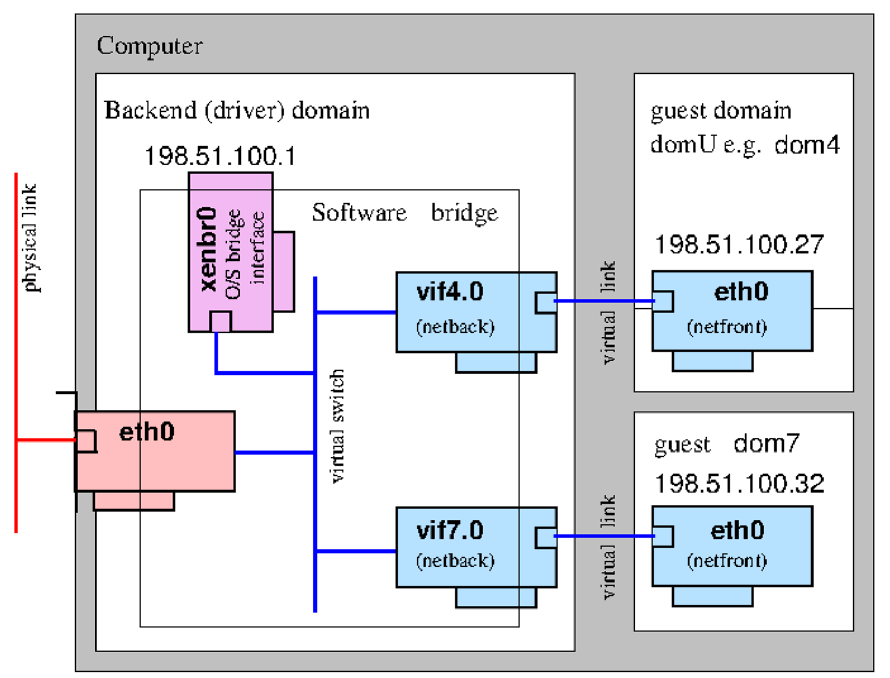

<h1><a name="readme-top"></a></h1>

[](https://github.com/marcossilvestrini/learning-lpic-3-305-300/actions/workflows/release.yml)[](https://github.com/marcossilvestrini/learning-lpic-3-305-300/actions/workflows/translate.yml)[](https://github.com/marcossilvestrini/learning-lpic-3-305-300/actions/workflows/jekyll-gh-pages.yml)[](https://github.com/marcossilvestrini/learning-lpic-3-305-300/actions/workflows/generate-html.yml)[](https://github.com/marcossilvestrini/learning-lpic-3-305-300/actions/workflows/powershell.yml)[](https://github.com/marcossilvestrini/learning-lpic-3-305-300/actions/workflows/slack.yml)

* * *

[![MIT License][license-shield]][license-url][![Forks][forks-shield]][forks-url][![Stargazers][stars-shield]][stars-url][![Contributors][contributors-shield]][contributors-url][![Issues][issues-shield]][issues-url][![LinkedIn][linkedin-shield]][linkedin-url]

* * *

# APRENDIZAGEM LPIC-3 305-300


<p align="center">
<strong>Explore the docs »</strong></a>
    <br />
    <a href="https://marcossilvestrini.github.io/learning-lpic-3-305-300/">Web Site</a>
    -
    <a href="https://github.com/marcossilvestrini/learning-lpic-3-305-300">Code Page</a>
    -
    <a href="https://github.com/marcossilvestrini/learning-lpic-3-305-300/issues">Report Bug</a>
    -
    <a href="https://github.com/marcossilvestrini/learning-lpic-3-305-300/issues">Request Feature</a>
</p>

* * *

## Resumo

<details>
  <summary><b>TABLE OF CONTENT</b></summary>
  <ol>
    <li>
      <a href="#about-the-project">About The Project</a>
    </li>
    <li>
      <a href="#getting-started">Getting Started</a>
      <ul>
        <li><a href="#prerequisites">Prerequisites</a></li>
        <li><a href="#installation">installation</a></li>
      </ul>
    </li>
    <li><a href="#usage">Usage</a></li>
    <li><a href="#roadmap">Roadmap</a></li>
    <li><a href="#freedoms">Four Essential Freedoms</a></li>
    <li>
      <a href="#topic-351">Topic 351: Full Virtualization</a>
      <ul>
        <li><a href="#topic-351.1">351.1 Virtualization Concepts and Theory </a></li>
        <li><a href="#topic-351.2">351.2 Xen</a></li>
        <li><a href="#topic-351.3">351.3 QEMU</a></li>
        <li><a href="#topic-351.4">351.4 Libvirt Virtual Machine</a></li>
        <li><a href="#topic-351.5">351.5 Virtual Machine Disk Image Management</a></li>
      </ul>
    </li>
    <li>
      <a href="#topic-352">Topic 352: Container Virtualization</a>
      <ul>
        <li><a href="#topic-352.1">352.1 Container Virtualization Concepts</a></li>
        <li><a href="#topic-352.2">352.2 LXC</a></li>
        <li><a href="#topic-352.3">352.3 Docker</a></li>
        <li><a href="#topic-352.4">352.4 Container Orchestration Platforms</a></li>
      </ul>
    </li>
    <li>
      <a href="#topic-353">Topic 353: VM Deployment and Provisioning</a>
      <ul>
        <li><a href="#topic-353.1">353.1 Cloud Management Tools</a></li>
        <li><a href="#topic-353.2">353.2 Packer</a></li>
        <li><a href="#topic-353.3">353.3 cloud-init</a></li>
        <li><a href="#topic-353.4">353.4 Vagrant</a></li>
      </ul>
    </li>
    <li><a href="#license">License</a></li>
    <li><a href="#contact">Contact</a></li>
    <li><a href="#acknowledgments">Acknowledgments</a></li>
  </ol>
</details><br>

* * *

<a name="about-the-project"></a>

## Sobre o projeto

> Este projeto visa ajudar estudantes ou profissionais a aprender os principais conceitos do GNULinux
> e software livre\\
> Algumas distribuições GNULinux como Debian e RPM serão abordadas\\
> A instalação e configuração de alguns pacotes também serão abordadas\\
> Ao fazer isso, você pode dar a toda a comunidade a chance de se beneficiar de suas alterações.\\
> O acesso ao código-fonte é uma pré-condição para isso.\\
> Use o vagrant para atualizar máquinas, executar laboratórios e praticar o conteúdo deste artigo.\\
> Publiquei na pasta Vagrant um Vagrantfile com o que é necessário\\
> para você subir um ambiente para estudos

* * *

<p align="right">(<a href="#readme-top">back to top</a>)</p>

<a name="getting-started"></a>

## Começando

Para iniciar o aprendizado, consulte a documentação acima.

<a name="prerequisites"></a>

### Pré-requisitos

-   [Git](https://git-scm.com/book/en/v2/Getting-Started-Installing-Git)
-   [VMware WorkStation](https://blogs.vmware.com/workstation/2024/05/vmware-workstation-pro-now-available-free-for-personal-use.html)
-   [Utilitário VMware Vagrant](https://developer.hashicorp.com/vagrant/install/vmware)
-   [Vagabundo](https://developer.hashicorp.com/vagrant/install)

<a name="installation"></a>

### Instalação

Clonar o repositório

```sh
git clone https://github.com/marcossilvestrini/learning-lpic-3-305-300.git
cd learning-lpic-3-305-300
```

Personalize um modelo_Vagrantfile-topic-XXX_. Este arquivo contém uma configuração de vms para laboratórios. Exemplo:

-   Arquivo[Vagrantfile-topic-351](./vagrant/Vagrantfile-topic-351)
    -   vm.clone_directory = "&lt;sua_letra_do_driver>:\\<folder>\\&lt;para_máquina>\\#{VM_NAME}-instance-1"
        Exemplo: vm.clone_directory = "E:\\Servidores\\VMware\\#{VM_NAME}-instance-1"
    -   vm.vmx["mem tamanho"]= ""
    -   vm.vmx["numvcpus"]= ""
    -   vm.vmx["CPUID.CRERSESCOUT"]= ""

Personalize a configuração de rede em arquivos[Configs/Network](configs/network/).

* * *

<a name="usage"></a>

## Uso

Use este repositório para aprender sobre o exame LPIC-3 305-300

### Para cima e para baixo

Mudar um_VagrantFile-Topic-xxx_modelo e cópia para um novo arquivo com nome_Vagrantfile_

```sh
cd vagrant && vagrant up
cd vagrant && vagrant destroy -f
```

### Para reiniciar VMs

```sh
cd vagrant && vagrant reload
```

**Importante:**_Se você reiniciar VMs sem vagão, a pasta compartilhada não é montada após a inicialização._

### Use o PowerShell para cima e para baixo

Se você usa a plataforma Windows, eu crio um script PowerShell para ativar e desativar vms.

```powershell
vagrant/up.ps1
vagrant/destroy.ps1
```

<p align="right">(<a href="#readme-top">back to top</a>)</p>

* * *

<a name="roadmap"></a>

## Roteiro

-   [x] Criar repositório
-   [x] Crie scripts para provisioning laboratórios
-   [x] Crie exemplos sobre o Tópico 351
-   [ ] Crie exemplos sobre o Tópico 352
-   [ ] Crie exemplos sobre o Tópico 353
-   [ ] Carregue o ITEXAM simulado

* * *

<a name="freedoms"></a>

## Quatro liberdades essenciais

> 0.A liberdade de executar o programa como desejar, para qualquer finalidade (liberdade 0).\\
> 1.A liberdade de estudar como o programa funciona e alterá-lo para que funcione\\
> sua computação como desejar (liberdade 1).\\
> O acesso ao código-fonte é uma pré-condição para isso.\\
> 2.A liberdade de redistribuir cópias para que você possa ajudar outras pessoas (liberdade 2).\\
> 3.liberdade para distribuir cópias de suas versões modificadas para terceiros (liberdade 3).

* * *

## Inspecionar comandos

```sh
type COMMAND
apropos COMMAND
whatis COMMAND --long
whereis COMMAND
COMMAND --help, --h
man COMMAND
```

<p align="right">(<a href="#readme-top">back to top</a>)</p>

* * *

<a name="topic-351"></a>

## Tópico 351: Virtualização Completa


* * *

<a name="topic-351.1"></a>

### 351.1 Conceitos e teoria de virtualização

**Peso:**6

**Descrição:**Os candidatos devem conhecer e entender os conceitos gerais, a teoria e a terminologia da virtualização. Isso inclui terminologia Xen, Qemu e Libvirt.

**Principais áreas de conhecimento:**

-   Entenda a terminologia de virtualização
-   Entender os prós e contras da virtualização
-   Compreenda as diversas variações de hipervisores e monitores de máquinas virtuais
-   Entenda os principais aspectos da migração de máquinas físicas para virtuais
-   Compreender os principais aspectos da migração de máquinas virtuais entre sistemas host
-   Compreenda os recursos e as implicações da virtualização para uma máquina virtual, como captura instantânea, pausa, clonagem e limites de recursos
-   Conhecimento de oVirt, Proxmox, systemd-machined e VirtualBox
-   Conscientização do Open vSwitch

#### 351.1 Objetos citados

```sh
Hypervisor
Hardware Virtual Machine (HVM)
Paravirtualization (PV)
Emulation and Simulation
CPU flags
/proc/cpuinfo
Migration (P2V, V2V)
```

#### Hipervisores

##### Hipervisor tipo 1 (hipervisor bare-metal)

###### Definição do tipo 1

É executado diretamente no hardware físico do host, fornecendo uma camada base para gerenciar VMs sem a necessidade de um sistema operacional host.

###### Características do tipo 1

-   Alto desempenho e eficiência.
-   Menor latência e sobrecarga.
-   Frequentemente usado em ambientes corporativos e data centers.

###### Exemplos de tipo 1

-   VMware ESXi: um hipervisor robusto e amplamente usado em configurações corporativas.
-   Microsoft Hyper-V: Integrado ao Windows Server, oferecendo forte desempenho e recursos de gerenciamento.
-   Xen: Um hipervisor de código aberto usado por muitos provedores de serviços em nuvem.
-   KVM (Máquina Virtual Baseada em Kernel): Integrado ao kernel Linux, proporcionando alto desempenho para sistemas baseados em Linux.

##### Hipervisor tipo 2 (hipervisor hospedado)

###### Definição Tipo 2

Executa em cima de um sistema operacional convencional, contando com o sistema operacional host para gerenciamento de recursos e suporte ao dispositivo.

###### Características do tipo 2

-   Mais fácil de configurar e usar, especialmente em computadores pessoais.
-   Mais flexível para desenvolvimento, testes e implantações em menor escala.
-   Normalmente menos eficiente que os hipervisores Tipo 1 devido à sobrecarga adicional do sistema operacional host.

###### Exemplos de tipo 2

-   VMware Workstation: um poderoso hipervisor para executar vários sistemas operacionais em uma única área de trabalho.
-   Oracle VirtualBox: um hipervisor de código aberto conhecido por sua flexibilidade e facilidade de uso.
-   Parallels Desktop: projetado para usuários de Mac executarem Windows e outros sistemas operacionais junto com o macOS.
-   Qemu (emulador rápido): um emulador de código aberto e virtualizador, geralmente usado em conjunto com o KVM.

##### Diferenças -chave entre os hipervisores do tipo 1 e do tipo 2

-   Ambiente de implantação:
    -   Os hipervisores tipo 1 são comumente implantados em data centers e ambientes corporativos devido à sua interação direta com hardware e alto desempenho.
    -   Os hipervisores do tipo 2 são mais adequados para tarefas de uso pessoal, desenvolvimento, teste e virtualização em pequena escala.
-   Desempenho:
    -   Os hipervisores tipo 1 geralmente oferecem melhor desempenho e menor latência porque não dependem de um sistema operacional host.
    -   Os hipervisores do tipo 2 podem experimentar alguma degradação do desempenho devido à sobrecarga de execução no topo de um sistema operacional host.
-   Gerenciamento e facilidade de uso:
    -   Os hipervisores do tipo 1 requerem configuração e gerenciamento mais complexos, mas fornecem recursos avançados e escalabilidade para implantações em larga escala.
    -   Os hipervisores tipo 2 são mais fáceis de instalar e usar, tornando -os ideais para usuários individuais e projetos menores.

##### Tipos de migração

No contexto dos hipervisores, que são tecnologias usadas para criar e gerenciar máquinas virtuais, os termos migração de P2V e migração V2V são comuns em ambientes de virtualização.  
Referem-se a processos de migração de sistemas entre diferentes tipos de plataformas.

##### P2V - Migração física para virtual

A migração P2V refere-se ao processo de migração de um servidor físico para uma máquina virtual.  
Em outras palavras, um sistema operacional e seus aplicativos, executados em hardware físico dedicado, são "convertidos" e movidos para uma máquina virtual que é executada em um hipervisor (como VMware, Hyper-V, KVM, etc.).

-   Exemplo: você tem um servidor físico executando um sistema Windows ou Linux e deseja movê -lo para um ambiente virtual, como uma infraestrutura em nuvem ou um servidor de virtualização interna.  
    O processo envolve copiar todo o estado do sistema, incluindo sistema operacional, drivers e dados, para criar uma máquina virtual equivalente que possa ser executada como se estivesse no hardware físico.

##### V2V - Migração Virtual para Virtual

A migração V2V refere -se ao processo de migrar uma máquina virtual de um hipervisor para outro.  
Nesse caso, você já possui uma máquina virtual em execução em um ambiente virtualizado (como o VMware) e deseja movê-lo para outro ambiente virtualizado (por exemplo, para Hyper-V ou para um novo servidor VMware).

-   Exemplo: você tem uma máquina virtual em execução em um servidor de virtualização do VMware, mas decide migrá-lo para uma plataforma Hyper-V. Nesse caso, a migração V2V converte a máquina virtual de um formato ou hipervisor para outro, garantindo que ela possa continuar funcionando corretamente.

#### HVM e Paravirtualização

##### Virtualização assistida por hardware (HVM)

###### Definição HVM

O HVM aproveita extensões de hardware fornecidas por CPUs modernas para virtualizar hardware, permitindo a criação e o gerenciamento de VMs com sobrecarga mínima de desempenho.

###### Características -chave da HVM

-   **Suporte de hardware**: requer suporte de CPU para extensões de virtualização como Intel VT-x ou AMD-V.
-   **Virtualização completa:**As VMs podem executar sistemas operacionais de hóspedes não modificados, pois o hipervisor fornece uma emulação completa do ambiente de hardware.
-   **Desempenho:**Normalmente oferece desempenho quase nativo devido à execução direta do código convidado na CPU.
-   **Isolamento:**Fornece forte isolamento entre VMs, pois cada VM opera como se tivesse seu próprio hardware dedicado.

###### Exemplos de HVM

VMware Esxi, Microsoft Hyper-V, KVM (máquina virtual baseada em kernel).

###### Vantagens de HVM

-   **Compatibilidade:**Pode executar qualquer sistema operacional sem modificação.
-   **Desempenho:**Alto desempenho devido ao suporte de hardware.
-   **Segurança:**Recursos aprimorados de isolamento e segurança fornecidos pelo hardware.

###### Desvantagens do HVM

-   **Dependência de hardware:**Requer recursos de hardware específicos, limitando a compatibilidade com sistemas mais antigos.
-   **Complexidade:**Pode envolver configuração e gerenciamento mais complexos.

##### Paravirtualização

###### Definição de Paravirtualização

A paravirtualização envolve a modificação do sistema operacional convidado para estar ciente do ambiente virtual, permitindo que ele interaja com mais eficiência com o hipervisor.

###### Características -chave da paravirtualização

-   **Modificação de convidado:**Requer alterações no sistema operacional convidado para se comunicar diretamente com o hipervisor usando hiperchamadas.
-   **Desempenho:**Pode ser mais eficiente do que a virtualização completa tradicional porque reduz a sobrecarga associada à emulação de hardware.
-   **Compatibilidade:**Limitado a sistemas operacionais que foram modificados para paravirtualização.

###### Exemplos de paravirtualização

Xen com convidados paravirtualizados, ferramentas VMware em determinadas configurações e algumas configurações de KVM.

###### Vantagens da paravirtualização

-   **Eficiência:**Reduz a sobrecarga de virtualizar hardware, potencialmente oferecendo melhor desempenho para determinadas cargas de trabalho.
-   **Utilização de recursos:**Uso mais eficiente dos recursos do sistema devido à comunicação direta entre o sistema operacional convidado e o hipervisor.

###### Desvantagens da Paravirtualização

-   **Modificação do sistema operacional convidado:**Requer modificações para o sistema operacional convidado, limitando a compatibilidade aos sistemas operacionais suportados.
-   **Complexidade:**Requer complexidade adicional no sistema operacional convidado para implementações de hiperchamada.

##### Principais diferenças

###### Requisitos de sistema operacional convidado

-   **HVM:**Pode executar sistemas operacionais de convidados não modificados.
-   **Paravirtualização:**Requer que os sistemas operacionais de convidados sejam modificados para trabalhar com o hipervisor.

###### Desempenho

-   **HVM:**Normalmente, fornece desempenho quase nativo devido à execução assistida por hardware.
-   **Paravirtutualização:**Pode oferecer desempenho eficiente reduzindo a sobrecarga da emulação de hardware, mas depende do sistema operacional convidado modificado.

###### Dependência de hardware

-   **HVM:**Requer recursos específicos da CPU (Intel VT-X, AMD-V).
-   **Paravirtutualização:**Não requer recursos específicos da CPU, mas precisa de um sistema operacional de convidado modificado.

###### Isolamento

-   **HVM:**Fornece forte isolamento usando recursos de hardware.
-   **Paravirtutualização:**Baseia-se no isolamento baseado em software, que pode não ser tão robusto quanto o isolamento baseado em hardware.

###### Complexidade

-   **HVM:**Geralmente mais simples de implantar, pois oferece suporte a sistemas operacionais não modificados.
-   **Paravirtualização:**Requer configuração e modificações adicionais no sistema operacional convidado, aumentando a complexidade.

#### NUMA (acesso não uniforme de memória)

O NUMA (acesso não uniforme de memória) é uma arquitetura de memória usada em sistemas multiprocessadores para otimizar o acesso à memória pelos processadores.  
Em um sistema NUMA, a memória é distribuída de maneira desigual entre os processadores, o que significa que cada processador tem um acesso mais rápido a uma parte da memória (sua "memória local") do que à memória que está fisicamente mais distante (referida como "memória remota") e associado com outros processadores.

##### Principais recursos da arquitetura NUMA

1.  **Memória local e remota**: Cada processador tem sua própria memória local, que pode acessar mais rapidamente. No entanto, também pode acessar a memória de outros processadores, embora isso leve mais tempo.
2.  **Latência diferenciada**: A latência do acesso à memória varia dependendo se o processador está acessando sua memória local ou a memória de outro nó. O acesso à memória local é mais rápido, enquanto o acesso à memória de outro nó (remoto) é mais lento.
3.  **Escalabilidade**: A arquitetura NUMA foi projetada para melhorar a escalabilidade em sistemas com muitos processadores. À medida que mais processadores são adicionados, a memória também é distribuída, evitando o gargalo que ocorreria em uma arquitetura de acesso uniforme à memória (UMA).

##### Advantages of NUMA

-   Melhor desempenho em sistemas grandes: como cada processador possui memória local, ele pode funcionar com mais eficiência sem competir tanto com outros processadores pelo acesso à memória.
-   Escalabilidade: o NUMA permite sistemas com muitos processadores e grandes quantidades de memória para escalar de maneira mais eficaz em comparação com uma arquitetura da Uma.

##### Desvantagens

-   Complexidade de programação: Os programadores precisam estar cientes de quais regiões da memória são locais ou remotas, otimizando o uso da memória local para obter melhor desempenho.
-   Penalidades potenciais de desempenho: se um processador acessar frequentemente a memória remota, o desempenho poderá sofrer devido à maior latência.
    Essa arquitetura é comum em sistemas multiprocessadores de alto desempenho, como servidores e supercomputadores, onde a escalabilidade e a otimização da memória são críticas.

#### Opensource Solutions

-   Ovirt:<https://www.ovirt.org/>

-   Proxmox:<https://www.proxmox.com/en/proxmox-virtual-environment/overview>

-   Oracle VirtualBox:<https://www.virtualbox.org/>

-   Aberto vswitch:<https://www.openvswitch.org/>

#### Tipos de virtualização

##### Virtualização de hardware (virtualização do servidor)

###### Definição de alta tensão

Abstraia o hardware físico para criar máquinas virtuais (VMs) que executam sistemas e aplicativos operacionais separados.

###### Casos de uso de HV

Data centers, computação em nuvem, consolidação de servidores.

###### Exemplos de HV

VMware ESXi, Microsoft Hyper-V, KVM.

##### Virtualização de sistema operacional (containerização)

###### Definição de conteinerização

Permite que várias instâncias isoladas do espaço do usuário (contêineres) sejam executadas em um único kernel do sistema operacional.

###### Casos de uso de conteinerização

Ambientes de arquitetura, desenvolvimento e teste de microsserviços.

###### Exemplos de contêinerização

Docker, Kubernetes, LXC.

##### Virtualização de rede

###### Definição de virtualização de rede

Combina recursos de rede de hardware e software em uma única entidade administrativa baseada em software.

###### Casos de uso da virtualização de rede

Networking definido por software (SDN), Virtualização da Função de Rede (NFV).

###### Exemplos de virtualização de rede

VMware NSX, Cisco ACI, OpenStack Neutron.

##### Virtualização de armazenamento

###### Definição de virtualização de armazenamento

Pools armazenamento físico de vários dispositivos em uma única unidade de armazenamento virtual que pode ser gerenciada centralmente.

###### Casos de uso da definição de virtualização de armazenamento

Gerenciamento de dados, otimização de armazenamento, recuperação de desastres.

###### Exemplos de definição de virtualização de armazenamento

IBM SAN Volume Controller, VMware vsan, NetApp OTAP.

##### Virtualização da área de trabalho

###### Definição de virtualização da área de trabalho

Permite que um sistema operacional de desktop seja executado em uma máquina virtual hospedada em um servidor.

###### Casos de uso de definição de virtualização de desktop

Infraestrutura de Desktop Virtual (VDI), Soluções de Trabalho Remoto.

###### Exemplos de definição de virtualização de desktop

Citrix Apps e desktops Citrix, VMware Horizon, Microsoft Remote Desktop Services.

##### Virtualização de aplicativos

###### Definição de virtualização de aplicativos

Separa os aplicativos do hardware subjacente e do sistema operacional, permitindo que eles sejam executados em ambientes isolados.

###### Casos de uso de definição de virtualização de aplicativos

Implantação simplificada de aplicativos, teste de compatibilidade.

###### Exemplos de definição de virtualização de aplicativos

VMware ThinApp, Microsoft App-V, Citrix XenApp.

##### Virtualização de dados

###### Definição de virtualização de dados

Integra dados de diversas fontes sem consolidá-los fisicamente, fornecendo uma visão unificada para análise e relatórios.

###### Casos de uso de definição de virtualização de dados

Inteligência de negócios, integração de dados em tempo real.

###### Exemplos de definição de virtualização de dados

Denodo, Red Hat JBoss Virtualização de dados, IBM InfoSphere.

##### Benefícios da virtualização

-   Eficiência de Recursos: Melhor utilização dos recursos físicos.
-   Economia de custos: Redução de custos operacionais e de hardware.
-   Escalabilidade: Fácil de aumentar ou diminuir de acordo com a demanda.
-   Flexibilidade: suporta uma variedade de cargas de trabalho e aplicativos.
-   Recuperação de desastres: processos simplificados de backup e recuperação.
-   Isolamento: Maior segurança através do isolamento de ambientes.

<p align="right">(<a href="#topic-351.1">back to sub Topic 351.1</a>)</p>
<p align="right">(<a href="#topic-351">back to Topic 351</a>)</p>
<p align="right">(<a href="#readme-top">back to top</a>)</p>

* * *

<a name="topic-351.2"></a>

### 351.2 Xen


**Peso:**3

**Descrição:**Os candidatos devem poder instalar, configurar, manter, migrar e solucionar problemas de instalações XEN. O foco está no Xen versão 4.x.

**Principais áreas de conhecimento:**

-   Entenda a arquitetura de Xen, incluindo networking e armazenamento
-   Configuração básica de nós e domínios Xen
-   Gerenciamento básico de nós e domínios Xen
-   Solução de problemas básicos de instalações Xen
-   Avareza de COMPRIMIDOS
-   Conhecimento do XenStore
-   Consciência dos parâmetros de inicialização do Xen
-   Conscientização do utilitário xm

#### Alternar


O XEN é um hipervisor de código aberto (sem metal), que permite que vários sistemas operacionais sejam executados simultaneamente no mesmo hardware físico.  
O Xen fornece uma camada entre o hardware físico e as máquinas virtuais (VMs), permitindo o compartilhamento e o isolamento eficientes de recursos.

-   **Arquitetura:**O Xen opera com um sistema de duas camadas onde o Domínio 0 (Dom0) é o domínio privilegiado com acesso direto ao hardware e gerencia o hipervisor. Outras máquinas virtuais, chamadas Domain U (DomU), executam sistemas operacionais convidados e são gerenciadas pelo Dom0.
-   **Tipos de virtualização:**O XEN suporta paravirtualização (PV), que requer o sistema operacional convidado modificado e a virtualização assistida por hardware (HVM), que usa extensões de hardware (por exemplo, Intel VT-X ou AMD-V) para executar sistemas operacionais de convidados não modificados.
    O XEN é amplamente utilizado em ambientes em nuvem, principalmente pela Amazon Web Services (AWS) e outros provedores de nuvem em larga escala.

#### Xensource

A Xensource foi a empresa fundada pelos desenvolvedores originais do Xen Hypervisor da Universidade de Cambridge para comercializar Xen.  
A empresa forneceu soluções corporativas com base no XEN e ofereceu ferramentas e suporte adicionais para aprimorar os recursos do Xen para uso corporativo.

-   **Aquisição pela Citrix**: Em 2007, a XenSource foi adquirida pela Citrix Systems, Inc. A Citrix usou a tecnologia Xen como base para seu produto Citrix XenServer, que se tornou uma popular plataforma de virtualização de nível empresarial baseada em Xen.
-   **Transição**: Após a aquisição, o projeto Xen continuou como um projeto de código aberto, enquanto a Citrix se concentrou em ofertas comerciais como Xenserver, alavancando a tecnologia Xensource.

#### Projeto Xen

O projeto Xen refere-se à comunidade de código aberto e à iniciativa responsável pelo desenvolvimento e manutenção do hipervisor Xen após sua comercialização.  
O Projeto Xen opera sob a Linux Foundation, com foco na construção, melhoria e suporte do Xen como um esforço colaborativo e voltado para a comunidade.

-   **Metas:**O projeto XEN visa avançar o hipervisor, melhorando seu desempenho, segurança e conjunto de recursos para uma ampla gama de casos de uso, incluindo computação em nuvem, virtualização focada na segurança (por exemplo, Qubes OS) e sistemas incorporados.
-   **Colaboradores:**O projeto inclui colaboradores de diversas organizações, incluindo grandes provedores de nuvem, fornecedores de hardware e desenvolvedores independentes.
-   **Pílula e hedools:**O projeto XEN também inclui ferramentas como XAPI (XenAPI), que é usado para gerenciar instalações do Xen Hypervisor e vários outros utilitários para gerenciamento e otimização do sistema.

#### Xenstore

A Xen Store é um componente crítico do hipervisor Xen.  
Essencialmente, o Xen Store é um banco de dados de valor-chave distribuído usado para comunicação e compartilhamento de informações entre o hypervisor Xen e as máquinas virtuais (também conhecidas como domínios) que ele gerencia.

Aqui estão alguns aspectos importantes da Xen Store:

-   **Comunicação entre domínios:**O Xen Store permite a comunicação entre domínios, como Dom0 (o domínio privilegiado que controla os recursos de hardware) e DomUs (domínios de usuários, que são as VMs). Isso é feito por meio de entradas de valores-chave, onde cada domínio pode ler ou gravar informações.

-   **Gerenciamento de configuração:**Ele é usado para armazenar e acessar informações de configuração, como dispositivos virtuais, rede e parâmetros de inicialização. Isso facilita o gerenciamento dinâmico e a configuração de VMs.

-   **Eventos e notificações:**A Xen Store também oferece suporte a notificações de eventos. Quando uma chave ou valor específico na Xen Store é modificado, os domínios interessados ​​podem ser notificados para reagir a essas mudanças. Isso é útil para monitorar e gerenciar recursos.

-   API simples: O Xen Store fornece uma API simples para leitura e gravação de dados, facilitando aos desenvolvedores a integração de seus aplicativos com o sistema de virtualização Xen.

#### Pílula

XAPI, ou Xenapi, é a interface de programação de aplicativos (API) usada para gerenciar o hipervisor Xen e suas máquinas virtuais (VMs).  
XAPI é um componente chave do XenServer (agora conhecido como Citrix Hypervisor) e fornece uma maneira padronizada de interagir com o hipervisor Xen para executar operações como criação, configuração, monitoramento e controle de VMs.

Aqui estão alguns aspectos importantes de Xapi:

-   **Gerenciamento de VM:**O XAPI permite que os administradores criem, excluam, excluam, iniciem e parem e parem e parem programaticamente as máquinas virtuais.

-   **Automação:**Com o XAPI, é possível automatizar o gerenciamento de recursos virtuais, incluindo redes, armazenamento e computação, o que é crucial para grandes ambientes em nuvem.

-   **Integração:**O XAPI pode ser integrado a outras ferramentas e scripts para fornecer administração mais eficiente e personalizada do ambiente XEN.

-   **Controle de acesso:**A XAPI também fornece mecanismos de controle de acesso para garantir que apenas usuários autorizados possam realizar operações específicas no ambiente virtual.

O XAPI é a interface que permite o controle e a automação do hipervisor Xen, facilitando o gerenciamento de ambientes virtualizados.

#### Resumo Xen

-   **Xen:**A principal tecnologia de hipervisor que permite que máquinas virtuais sejam executadas em hardware físico.
-   **XenFonte:**Empresa que comercializou o Xen, posteriormente adquirida pela Citrix, levando ao desenvolvimento do Citrix XenServer.
-   **Projeto Xen:**A iniciativa e comunidade de código aberto que continua a desenvolver e manter o hipervisor Xen sob a Linux Foundation.
-   **XenStore:**A Xen Store atua como intermediária de comunicação e configuração entre o hipervisor Xen e as VMs, agilizando a operação e o gerenciamento de ambientes virtualizados.
-   **Pílula**é a interface que permite o controle e a automação do hipervisor Xen, facilitando o gerenciamento de ambientes virtualizados.

#### Domain0 (DOM0)

Domain0, ou Dom0, é o domínio de controle em uma arquitetura Xen. Gerencia outros domínios (DomUs) e tem acesso direto ao hardware.  
Dom0 executa drivers de dispositivos, permitindo que DomUs, que não possuem acesso direto ao hardware, se comuniquem com os dispositivos. Normalmente, é uma instância completa de um sistema operacional, como o Linux, e é essencial para a operação do hipervisor Xen.

#### Domínio (casa)

DomUs são domínios não privilegiados que executam máquinas virtuais.  
Eles são gerenciados pelo DOM0 e não têm acesso direto ao hardware. O DOMUS pode ser configurado para executar diferentes sistemas operacionais e é usado para vários fins, como servidores de aplicativos e ambientes de desenvolvimento. Eles dependem do DOM0 para interação de hardware.

#### PV-DOMU (Domínio Paranormalizado)

PV-DomUs usam uma técnica chamada paravirtualização. Neste modelo, o sistema operacional DomU é modificado para saber que roda em um ambiente virtualizado, permitindo a comunicação direta com o hipervisor para desempenho otimizado.  
Isso resulta em menor sobrecarga e melhor eficiência em comparação com a virtualização total.

#### HVM-domu (domínio da máquina virtual de hardware)

HVM-DomUs são máquinas virtuais que utilizam virtualização completa, permitindo a execução de sistemas operacionais não modificados. O hipervisor Xen fornece emulação de hardware para esses DomUs, permitindo-lhes executar qualquer sistema operacional que suporte a arquitetura de hardware subjacente.  
Embora isso ofereça maior flexibilidade, pode resultar em sobrecarga maior em comparação com PV-DomUs.

#### Rede Xen

Dispositivos de rede paravirtualizados

Ponte

#### 351.2 Objetos citados

```sh
Domain0 (Dom0), DomainU (DomU)
PV-DomU, HVM-DomU
/etc/xen/
xl
xl.cfg 
xl.conf # Xen global configurations
xentop
oxenstored # Xenstore configurations
```

#### 351.2 Notas

```sh

# Xen Settings
/etc/xen/
/etc/xen/xl.conf - Main general configuration file for Xen
/etc/xen/oxenstored.conf - Xenstore configurations

# VM Configurations
/etc/xen/xlexample.pvlinux
/etc/xen/xlexample.hvm

# Service Configurations
/etc/default/xen
/etc/default/xendomains

# xen-tools configurations
/etc/xen-tools/
/usr/share/xen-tools/

# docs
xl(1)
xl.conf(5)
xlcpupool.cfg(5)
xl-disk-configuration(5)
xl-network-configuration(5)
xen-tscmode(7)
```

#### 351.2 Comandos importantes

##### Imagem Xen-Criar

```sh
# create a pv image
xen-create-image \
  --hostname=lpic3-pv-guest \
  --memory=1gb \
  --vcpus=2 \
  --lvm=vg_xen \
  --dhcp \
  --pygrub \
  --dist=bookworm
```

##### Xen-Delete-Image

```sh
# delete a pv image
xen-delete-image lpic3-pv-guest --lvm=vg_xen
```

##### brctl

```sh
# list xen interfaces
brctl show
```

##### xl

```sh
# view xen information
xl infos

# list Domains
xl list

# view dmesg information
xl dmesg

# monitoring domain
xl top
xentop
xen top

# Limit mem Dom0
xl mem-set 0 2048

# Limite cpu (not permanent after boot)
xl vcpu-set 0 2

# manual conf
man xl.conf

# manual cfg - about guest configuration
man xl.cfg

# create DomainU - virtual machine
xl create /etc/xen/lpic3-pv-guest.cfg

# create DomainU virtual machine and connect to guest
xl create -c /etc/xen/lpic3-pv-guest.cfg

# create DomainU virtual machine HVM

## configure /etc/xen/lpic3-hvm-guest.cfg

## create a ssh tunel for vnc
ssh -l vagrant -L 5900:localhost:5900  192.168.0.130

## create domain hvm
xl create /etc/xen/lpic3-hvm-guest.cfg

## open vcn conectio in your vnc client with localhost

# connect in domain guest
xl console <id>|<name> (press enter)
xl console 1
xl console lpic3-pv-guest

#How do I exit domU "xl console" session
#Press ctrl+] or if you're using Putty press ctrl+5.

# Poweroff domain
xl shutdown lpic3-pv-guest

# destroy domain
xl destroy lpic3-pv-guest

# reboot domain
xl reboot lpic3-pv-guest
```

<p align="right">(<a href="#topic-351.2">back to sub Topic 351.2</a>)</p>
<p align="right">(<a href="#topic-351">back to Topic 351</a>)</p>
<p align="right">(<a href="#readme-top">back to top</a>)</p>

* * *

<a name="topic-351.3"></a>

### 351.3 QEMU

**Peso:**4

**Descrição:**Os candidatos devem ser capazes de instalar, configurar, manter, migrar e solucionar problemas de instalações do QEMU.

**Principais áreas de conhecimento:**

-   Entenda a arquitetura de Qemu, incluindo KVM, networking e armazenamento
-   Inicie as instâncias QEMU da linha de comando
-   Gerencie instantâneos usando o monitor QEMU
-   Instale os drivers de dispositivo QEMU Guest Agent e VirtIO
-   Solucionar problemas de instalações QEMU, incluindo redes e armazenamento
-   Consciência de importantes parâmetros de configuração do QEMU

#### 351.3 Objetos citados

```sh
Kernel modules: kvm, kvm-intel and kvm-amd
/dev/kvm
QEMU monitor
qemu
qemu-system-x86_64
ip
brctl
tunctl
```

#### 351.3 Comandos importantes

##### IP

```sh
# list links
ip link show
```

<p align="right">(<a href="#topic-351.3">back to sub Topic 351.3</a>)</p>
<p align="right">(<a href="#topic-351">back to Topic 351</a>)</p>
<p align="right">(<a href="#readme-top">back to top</a>)</p>

* * *

<a name="topic-351.4"></a>

### 351.4 LibVirt Máquina virtual Gerenciamento

**Peso:**9

**Descrição:**Os candidatos devem ser capazes de gerenciar hosts de virtualização e máquinas virtuais (“domínios libvirt”) usando libvirt e ferramentas relacionadas.

**Principais áreas de conhecimento:**

-   Entenda a arquitetura da libvirt
-   Gerenciar conexões e nós da LibVirt
-   Crie e gerencie domínios qemu e xen, incluindo instantâneos
-   Gerenciar e analisar o consumo de recursos de domínios
-   Crie e gerencie pools de armazenamento e volumes
-   Crie e gerencie redes virtuais
-   Migrar domínios entre nós
-   Entenda como o LibVirt interage com Xen e Qemu
-   Entenda como a libvirt interage com serviços de rede como dnsmasq e radvd
-   Entenda os arquivos de configuração do LibVirt XML
-   Conscientização sobre virtlogd e virtlockd

#### 351.4 Objetos citados

```sh
libvirtd
/etc/libvirt/
virsh (including relevant subcommands)
```

#### 351.4 Comandos Importantes

##### foo

```sh
foo
```

<p align="right">(<a href="#topic-351.4">back to sub Topic 351.4</a>)</p>
<p align="right">(<a href="#topic-351">back to Topic 351</a>)</p>
<p align="right">(<a href="#readme-top">back to top</a>)</p>

* * *

<a name="topic-351.5"></a>

### 351.5 Gerenciamento de imagem em disco da máquina virtual

**Peso:**3

**Descrição:**Os candidatos devem ser capazes de gerenciar imagens de disco de máquinas virtuais. Isso inclui a conversão de imagens de disco entre vários formatos e hipervisores e o acesso a dados armazenados em uma imagem.

**Principais áreas de conhecimento:**

-   Compreenda os recursos de vários formatos de imagem de disco virtual, como imagens raw, qcow2 e VMDK
-   Gerenciar imagens de disco da máquina virtual usando Qemu-IMG
-   Monte Partições e Arquivos de Acesso contidos em imagens de disco da máquina virtual usando LibGuestfish
-   Copie o conteúdo do disco físico para uma imagem de disco da máquina virtual
-   Migrar o conteúdo do disco entre vários formatos de imagem de disco da máquina virtual
-   Conscientização do Formato de Virtualização Aberto (OVF)

#### 351,5 Objetos Citados

```sh
qemu-img
guestfish (including relevant subcommands)
guestmount
guestumount
virt-cat
virt-copy-in
virt-copy-out
virt-diff
virt-inspector
virt-filesystems
virt-rescue
virt-df
virt-resize
virt-sparsify
virt-p2v
virt-p2v-make-disk
virt-v2v
virt-sysprep
```

#### 351.5 Comandos importantes

##### foo

```sh
foo
```

<p align="right">(<a href="#topic-351.5">back to sub Topic 351.5</a>)</p>
<p align="right">(<a href="#topic-351">back to Topic 351</a>)</p>
<p align="right">(<a href="#readme-top">back to top</a>)</p>

* * *

<a name="topic-352"></a>

## Tópico 352: Virtualização de contêineres

* * *

<a name="topic-352.1"></a>

### 352.1 Conceitos de virtualização de contêineres

**Peso:**7

**Descrição:**Os candidatos devem entender o conceito de virtualização de contêineres. Isso inclui a compreensão dos componentes do Linux usados ​​para implementar a virtualização de contêineres, bem como usar as ferramentas padrão do Linux para solucionar esses componentes.

**Principais áreas de conhecimento:**

-   Compreenda os conceitos de sistema e contêiner de aplicativo
-   Compreenda e analise namespaces de kernel
-   Entender e analisar grupos de controle
-   Entender e analisar recursos
-   Entenda a função do seccomp, SELinux e AppArmor para virtualização de contêineres
-   Entenda como LXC e Docker aproveitam namespaces, cgroups, capacidades, seccomp e MAC
-   Entenda o princípio de Runc
-   Entenda o princípio do CRI-O e do containerd
-   Consciência das especificações de tempo de execução da OCI e imagem
-   Consciência da interface de tempo de execução do contêiner Kubernetes (CRI)
-   Consciência de Podman, Buildah e Scopeo
-   Conhecimento de outras abordagens de virtualização de contêineres no Linux e outros sistemas operacionais livres, como rkt, OpenVZ, systemd-nspawn ou BSD Jails


#### 352.1 Objetos citados

```sh
nsenter
unshare
ip (including relevant subcommands)
capsh
/sys/fs/cgroups
/proc/[0-9]+/ns
/proc/[0-9]+/status
```

#### 352.1 Comandos Importantes

##### foo

```sh
foo
```

<p align="right">(<a href="#topic-352.1">back to sub topic 352.1</a>)</p>
<p align="right">(<a href="#topic-352">back to topic 352</a>)</p>
<p align="right">(<a href="#readme-top">back to top</a>)</p>

* * *

<a name="topic-352.2"></a>

### 352,2 LXC

**Peso:**6

**Descrição:**Os candidatos devem poder usar contêineres do sistema usando LXC e LXD. A versão do LXC coberta é 3,0 ou superior.

**Principais áreas de conhecimento:**

-   Entenda a arquitetura do LXC e LXD
-   Gerencie recipientes LXC com base nas imagens existentes usando LXD, incluindo redes e armazenamento
-   Configurar propriedades do contêiner LXC
-   Limitar o uso de recursos do contêiner LXC
-   Use perfis LXD
-   Entenda as imagens LXC
-   Conhecimento das ferramentas LXC tradicionais

#### 352.2 Objetos citados

```sh
lxd
lxc (including relevant subcommands)
```

#### 352.2 Comandos Importantes

##### foo

```sh
foo
```

<p align="right">(<a href="#topic-352.2">back to sub topic 352.2</a>)</p>
<p align="right">(<a href="#topic-352">back to topic 352</a>)</p>
<p align="right">(<a href="#readme-top">back to top</a>)</p>

* * *

<a name="topic-352.3"></a>

### 352.3 Docker

**Peso:**9

**Descrição:**O candidato deve ser capaz de gerenciar nós do Docker e recipientes do Docker. Isso inclui entender a arquitetura do Docker, além de entender como o Docker interage com o sistema Linux do nó.

**Principais áreas de conhecimento:**

-   Entenda a arquitetura e componentes do Docker
-   Gerencie os contêineres do Docker usando imagens de um registro do Docker
-   Entenda e gerencie imagens e volumes para recipientes do Docker
-   Entenda e gerencie o log para recipientes do docker
-   Compreenda e gerencie redes para Docker
-   Use Dockerfiles para criar imagens de contêiner
-   Execute um registro Docker usando a imagem Docker do registro

#### 352.3 Objetos Citados

```sh
dockerd
/etc/docker/daemon.json
/var/lib/docker/
docker
Dockerfile
```

#### 352.3 Comandos Importantes

##### janela de encaixe

```sh
# Examples of docker
```

<p align="right">(<a href="#topic-352.3">back to sub topic 352.3</a>)</p>
<p align="right">(<a href="#topic-352">back to topic 352</a>)</p>
<p align="right">(<a href="#readme-top">back to top</a>)</p>

* * *

<a name="topic-352.4"></a>

### 352.4 Plataformas de orquestração de contêineres

**Peso:**3

**Descrição:**Os candidatos devem entender a importância da orquestração de contêineres e os principais conceitos Docker Swarm e Kubernetes fornecem para implementar a orquestração de contêineres.

**Principais áreas de conhecimento:**

-   Entenda a relevância da orquestração de contêineres
-   Entenda os principais conceitos do Docker Compose e do Docker Swarm
-   Entenda os principais conceitos de Kubernetes e comando
-   Conscientização sobre OpenShift, Rancher e Mesosphere DC/OS

<p align="right">(<a href="#topic-352.4">back to sub topic 352.4</a>)</p>
<p align="right">(<a href="#topic-352">back to topic 352</a>)</p>
<p align="right">(<a href="#readme-top">back to top</a>)</p>

* * *

<a name="topic-353"></a>

## Tópico 353: implantação e provisionamento da VM

* * *

<a name="topic-353.1"></a>

### 353.1 Ferramentas de gerenciamento de nuvem

**Peso:**2

**Descrição:**Os candidatos devem entender as ofertas comuns em nuvens públicas e ter o conhecimento básico das ferramentas de gerenciamento de nuvem comumente disponíveis.

**Principais áreas de conhecimento:**

-   Entenda as ofertas comuns em nuvens públicas
-   Conhecimento básico de recursos do OpenStack
-   Feature Basic Feature Knowledge of Terraform
-   Consciência do CloudStack, Eucalyptus e Opennebula

#### 353.1 Objetos citados

```sh
IaaS, PaaS, SaaS
OpenStack
Terraform
```

#### 353.1 Comandos Importantes

##### foo

```sh
# examples
```

<p align="right">(<a href="#topic-353.1">back to sub topic 353.1</a>)</p>
<p align="right">(<a href="#topic-353">back to topic 353</a>)</p>
<p align="right">(<a href="#readme-top">back to top</a>)</p>

* * *

<a name="topic-353.2"></a>

### 353.2 Empacotador

**Peso:**2

**Descrição:**Os candidatos devem poder usar o Packer para criar imagens do sistema. Isso inclui a execução do Packer em vários ambientes de nuvem pública e privada, além de criar imagens de contêineres para LXC/LXD.

**Principais áreas de conhecimento:**

-   Entenda a funcionalidade e os recursos do Packer
-   Criar e manter arquivos de modelo
-   Crie imagens a partir de arquivos de modelo usando diferentes construtores

#### 353.2 Objetos Citados

```sh
packer
```

#### 353.2 Comandos Importantes

##### Packer

```sh
# examples
```

<p align="right">(<a href="#topic-353.2">back to sub topic 353.2</a>)</p>
<p align="right">(<a href="#topic 353">back to topic 353</a>)</p>
<p align="right">(<a href="#readme-top">back to top</a>)</p>

* * *

<a name="topic-353.3"></a>

### 353,3 nuvem-init

**Peso:**3

**Descrição:**Os candidatos devem usar a entrada da nuvem para configurar máquinas virtuais criadas a partir de imagens padronizadas. Isso inclui o ajuste das máquinas virtuais para corresponder aos seus recursos de hardware disponíveis, especificamente, espaço em disco e volumes.  
Além disso, os candidatos devem poder configurar instâncias para permitir logins SSH seguros e instalar um conjunto específico de pacotes de software.  
Além disso, os candidatos devem ser capazes de criar novas imagens do sistema com suporte à initência da nuvem.

**Principais áreas de conhecimento:**

-   Compreender os recursos e conceitos do cloud-init, incluindo dados do usuário, inicialização e configuração do cloud-init
-   Use o cloud-init para criar, redimensionar e montar sistemas de arquivos, configurar contas de usuário, incluindo credenciais de login, como chaves SSH, e instalar pacotes de software do repositório da distribuição
-   Integre o cloud-init às imagens do sistema
-   Use a fonte de dados da unidade de configuração para teste

#### 353.3 Objetos Citados

```sh
cloud-init
user-data
/var/lib/cloud/
```

#### 353.3 Comandos Importantes

##### foo

```sh
# examples
```

<p align="right">(<a href="#topic-353.3">back to sub topic 353.3</a>)</p>
<p align="right">(<a href="#topic 353">back to topic 353</a>)</p>
<p align="right">(<a href="#readme-top">back to top</a>)</p>

* * *

<a name="topic-353.4"></a>

### 353.4 Vagrant

**Peso:**3

**Descrição:**O candidato deverá ser capaz de usar o Vagrant para gerenciar máquinas virtuais, incluindo o provisionamento da máquina virtual.

**Principais áreas de conhecimento:**

-   Entenda a arquitetura e os conceitos do Vagrant, incluindo armazenamento e rede
-   Recuperar e usar caixas do Atlas
-   Crie e execute Vagrantfiles
-   Acesse máquinas virtuais vagantes
-   Compartilhe e sincronize pastas entre uma máquina virtual Vagrant e o sistema host
-   Entenda o provisionamento vagante, ou seja, provisionistas de arquivos e shell
-   Entenda a configuração de várias máquinas

#### 353.4 Objetos Citados

```sh
vagrant
Vagrantfile
```

#### 353.4 Comandos importantes

##### vagabundo

```sh
# examples
```

<p align="right">(<a href="#topic-353.4">back to sub topic 353.4</a>)</p>
<p align="right">(<a href="#topic 353">back to topic 353</a>)</p>
<p align="right">(<a href="#readme-top">back to top</a>)</p>

* * *

## Contribuindo

As contribuições são o que tornam a comunidade de código aberto um lugar incrível para
aprender, inspirar e criar. Qualquer contribuição que você fizer será**muito apreciado**.

Se você tiver uma sugestão que melhoraria isso, bifór -se o repositório e
Crie uma solicitação de tração. Você também pode simplesmente abrir um problema com a tag "aprimoramento".
Não se esqueça de dar uma estrela ao projeto! Obrigado novamente!

1.  Bifurcar o projeto
2.  Crie sua ramificação de recursos (`git checkout -b feature/AmazingFeature`)
3.  Compreenda suas mudanças (`git commit -m 'Add some AmazingFeature'`)
4.  Empurre para a filial (`git push origin feature/AmazingFeature`)
5.  Abra uma solicitação pull

* * *

## Licença

-   This project is licensed under the MIT License \* see the LICENSE.md file for details

* * *

## Contato

Marcos Silvestrini[marcos.silvestrini@gmail.com](mailto:marcos.silvestrini@gmail.com)\\[](https://twitter.com/mrsilvestrini)

Link do projeto:<https://github.com/marcossilvestrini/learning-lpic-3-305-300>

<p align="right">(<a href="#readme-top">back to top</a>)</p>

* * *

## Agradecimentos

-   [Richard Stallman's](http://www.stallman.org/)
-   [GNU](<>)
    -   [GNU/FAQ Linux por Richard Stallman](https://www.gnu.org/gnu/gnu-linux-faq.html)
    -   [GNU](https://www.gnu.org/)
    -   [Sistema operacional GNU](https://www.gnu.org/gnu/thegnuproject.html)
    -   [Compilador GCC](https://gcc.gnu.org/wiki/History)
    -   [GNU tar](https://www.gnu.org/software/tar/)
    -   [GNU Make](https://www.gnu.org/software/make/)
    -   [GNU Emacs](https://en.wikipedia.org/wiki/Emacs)
    -   [Pacotes GNU](https://www.gnu.org/software/)
    -   [Coleção GNU/Linux](https://directory.fsf.org/wiki/Collection:GNU/Linux)
    -   [Carregador de inicialização GNU Grub](https://www.gnu.org/software/grub/)
    -   [GNU Hurd](https://www.gnu.org/software/hurd/hurd/what_is_the_gnu_hurd.html)
-   [Núcleo](<>)
    -   [Kernel](https://www.kernel.org/)
    -   [Páginas de manual do kernel Linux](https://www.kernel.org/doc/man-pages/)
    -   [Compile seu kernel](https://wiki.linuxquestions.org/wiki/How_to_build_and_install_your_own_Linux_kernel)
-   [Base Padrão Linux](<>)
    -   [Base Padrão Linux](https://en.wikipedia.org/wiki/Linux_Standard_Base)
    -   [Padrão de hierarquia do sistema de arquivos](https://en.wikipedia.org/wiki/Filesystem_Hierarchy_Standard)
    -   [Estrutura de hierarquia de arquivos](https://refspecs.linuxfoundation.org/FHS_3.0/fhs-3.0.pdf)
-   [Software livre](<>)
    -   [FSF](https://www.fsf.org)
    -   [Diretório de Software Gratuito](https://directory.fsf.org/wiki/Free_Software_Directory:Free_software_replacements)
-   [Licença](<>)
    -   [Software livre](https://www.gnu.org/philosophy/free-sw.html)
    -   [Copyleft](https://www.gnu.org/licenses/copyleft.en.html)
    -   [GPL](https://www.gnu.org/licenses/quick-guide-gplv3.html)
    -   [Licença Pública Geral Menor GNU](https://www.gnu.org/licenses/lgpl-3.0.html)
    -   [BSD](https://opensource.org/licenses/BSD-3-Clause)
    -   [Iniciativa de código aberto](https://opensource.org/)
    -   [Creative Commons](https://creativecommons.org/)
    -   [Licença LTS](https://en.wikipedia.org/wiki/Long-term_support)
-   [Distos](<>)
    -   [Diretrizes de Software Livre Debian](https://www.debian.org/social_contract#guidelines)
    -   [Lista de distribuição Linux](https://en.wikipedia.org/wiki/List_of_Linux_distributions)
    -   [Distrowatch](https://distrowatch.com/)
    -   [Comparação Distribuições Linux](https://en.wikipedia.org/wiki/Comparison_of_Linux_distributions)
-   [Ambientes de mesa](<>)
    -   [Organização X11](https://www.x.org/wiki/)
    -   [Wayland](https://wayland.freedesktop.org/)
    -   [GNU Gnome](https://www.gnu.org/press/gnome-1.0.html)
    -   [GNOMO](https://www.gnome.org/)
    -   [XFCE](https://xfce.org/)
    -   [Onde plasma](https://kde.org/plasma-desktop/)
    -   [Harmonia](https://en.wikipedia.org/wiki/Harmony_(toolkit))
-   [Protocolos](<>)
    -   [Http](<>)
        -   [W3Techs](https://w3techs.com/)
        -   [Apache](https://www.apache.org/)
        -   [Diretivas Apache][def]
        -   [Códigos de status HTTP](https://en.wikipedia.org/wiki/List_of_HTTP_status_codes)
        -   [Cifras fortes para Apache, Nginx e LightTPD](https://cipherlist.eu/)
        -   [Tutoriais da SSL](https://www.golinuxcloud.com/blog/)
        -   [Configuração SSL Mozilla](https://ssl-config.mozilla.org/)
    -   [XRDP](https://bytexd.com/xrdp-centos/)
    -   [Ntp](https://www.ntppool.org/en/)
-   [Dns](<>)
    -   [Vincular](https://www.isc.org/bind/)
    -   [Vincular registro](https://www.zytrax.com/books/dns/ch7/logging.html)
    -   [Lista de tipos de registro DNS](https://en.wikipedia.org/wiki/List_of_DNS_record_types)
    -   [Lista de tipos de registro DNS](https://en.wikipedia.org/wiki/List_of_DNS_record_types)
-   [Gerenciador de pacotes](<>)
    -   [Baixar pacotes](https://pkgs.org/)
    -   [Instalar pacotes](https://installati.one/)
    -   [Guia de instalação de pacotes](https://installati.one/)
-   [Script de shell](<>)
    -   [Bourne novamente Shell](https://www.gnu.org/software/bash/manual/)
    -   [Shebang](https://bash.cyberciti.biz/guide/Shebang)
    -   [Environment Variables](https://linuxize.com/post/how-to-set-and-list-environment-variables-in-linux/)
    -   [Globulação GNU](https://man7.org/linux/man-pages/man7/glob.7.html)
    -   [Globulação](https://linuxhint.com/bash_globbing_tutorial/)
    -   [Citando](https://www.gnu.org/software/bash/manual/html_node/Quoting.html)
    -   [Expressões regulares](https://www.gnu.org/software/grep/manual/html_node/Regular-Expressions.html)
    -   [Comando não encontrado](https://command-not-found.com/)
    -   [Gerador Bashrc](http://bashrcgenerator.com/)
    -   [Explique](https://explainshell.com/)
    -   [Tutorial Vim](https://www.openvim.com/)
    -   [Tutorial de script linux shell](https://bash.cyberciti.biz/guide/Main_Page)
    -   [Comandos exemplos](https://www.geeksforgeeks.org/)
-   [Outras ferramentas](<>)
    -   [Bugzila](https://bugzilla.kernel.org/)
    -   [Crachás do github](https://github.com/alexandresanlim/Badges4-README.md-Profile)
-   [Definições de virtualização](<>)
    -   [Chapéu vermelho](https://www.redhat.com/pt-br/topics/virtualization/what-is-virtualization)
    -   [AWS](https://aws.amazon.com/pt/what-is/virtualization/)
    -   [IBM](https://www.ibm.com/topics/virtualization)
    -   [OpenSource.com](https://opensource.com/resources/virtualization)
-   [KVM](<>)
    -   [KVM (máquinas virtuais de kernel)](https://www.redhat.com/pt-br/topics/virtualization/what-is-KVM)
    -   [Ferramentas de gerenciamento da KVM](https://www.linux-kvm.org/page/Management_Tools)
-   [Xen](<>)
    -   [XenServer](https://www.xenserver.com/)
    -   [Wiki XenProject](https://wiki.xenproject.org/wiki/Main_Page)
    -   [Interfaces de rede](https://wiki.xenproject.org/wiki/Xen_Networking#Virtual_Network_Interfaces)
    -   [Ferramentas Xen](https://xen-tools.org/software/)
    -   [Blog LPI: Virtualização Xen e Computação em Nuvem #01: Introdução](https://www.lpi.org/pt-br/blog/2020/10/01/xen-virtualization-and-cloud-computing-01-introduction/)
    -   [Blog do LPI: Virtualização Xen e Computação em Nuvem #02: Como o Xen faz o trabalho](https://www.lpi.org/blog/2020/10/08/xen-virtualization-and-cloud-computing-02-how-xen-does-job/)
    -   [LPI Blog: Xen Virtualização e computação em nuvem #04: Contêineres, OpenStack e outras plataformas relacionadas](https://www.lpi.org/pt-br/blog/2020/10/22/xen-virtualization-and-cloud-computing-04-containers-openstack-and-other-related/)
    -   [Virtualização Xen e Computação em Cloud #05: O Projeto Xen, Unikernels e o Futuro](https://www.lpi.org/pt-br/blog/2020/10/29/xen-virtualization-and-cloud-computing-05-xen-project-unikernels-and-future/)
    -   [Guia para iniciantes do projeto Xen](https://wiki.xenproject.org/wiki/Xen_Project_Beginners_Guide#Installing_the_Xen_Project_Software)
    -   [Livro maluco](https://wiki.xenproject.org/wiki/Book/HelloXenProject/0-Contents)
-   [Unicernel](https://www.lpi.org/blog/2020/10/29/xen-virtualization-and-cloud-computing-05-xen-project-unikernels-and-future/)
    -   [Força única](https://github.com/unikraft/unikraft)
    -   [Mirageos](https://mirage.io/docs/hello-world)
    -   [Ruim](https://galois.com/project/halvm/)
    -   [Exclusivo](https://github.com/solo-io/unik/blob/master/docs/providers/virtualbox.md)
-   [Documentos Openstack](<>)
    -   [Redhat](https://www.redhat.com/pt-br/topics/openstack)
-   [Abra o vSwitch](<>)
    -   [OVS DOC 4LINUX](https://blog.4linux.com.br/open-vswitch-o-que-e-o-que-come-onde-vive)
-   [Exame LPIC-3 305-300](<>)
    -   [Lpic-3 305-300 Objetivos](https://www.lpi.org/our-certifications/exam-305-objectives/)
    -   [Wiki LPIC-3 305-300](https://wiki.lpi.org/wiki/LPIC-305_Objectives_V3.0)
    -   [Material de aprendizagem LPIC-3 305-300](https://cursos.linuxsemfronteiras.com.br/courses/preparatorio-para-certificacao-lpic-3-305/)
    -   [Exame simulado LPIC-3 305-300 por ITexams](https://www.itexams.com/info/305-300)

<p align="right">(<a href="#readme-top">back to top</a>)</p>

* * *

<!-- MARKDOWN LINKS & IMAGES-->

<!-- https://www.markdownguide.org/basic-syntax/#reference-style-links -->

[contributors-shield]: https://img.shields.io/github/contributors/marcossilvestrini/learning-lpic-3-305-300.svg?style=for-the-badge

[contributors-url]: https://github.com/marcossilvestrini/learning-lpic-3-305-300/graphs/contributors

[forks-shield]: https://img.shields.io/github/forks/marcossilvestrini/learning-lpic-3-305-300.svg?style=for-the-badge

[forks-url]: https://github.com/marcossilvestrini/learning-lpic-3-305-300/network/members

[stars-shield]: https://img.shields.io/github/stars/marcossilvestrini/learning-lpic-3-305-300.svg?style=for-the-badge

[stars-url]: https://github.com/marcossilvestrini/learning-lpic-3-305-300/stargazers

[issues-shield]: https://img.shields.io/github/issues/marcossilvestrini/learning-lpic-3-305-300.svg?style=for-the-badge

[issues-url]: https://github.com/marcossilvestrini/learning-lpic-3-305-300/issues

[license-shield]: https://img.shields.io/github/license/marcossilvestrini/learning-lpic-3-305-300.svg?style=for-the-badge

[license-url]: https://github.com/marcossilvestrini/learning-lpic-3-305-300/blob/master/LICENSE

[linkedin-shield]: https://img.shields.io/badge/-LinkedIn-black.svg?style=for-the-badge&logo=linkedin&colorB=555

[linkedin-url]: https://linkedin.com/in/marcossilvestrini

[def]: https://httpd.apache.org/docs/2.4/mod/directives.html
