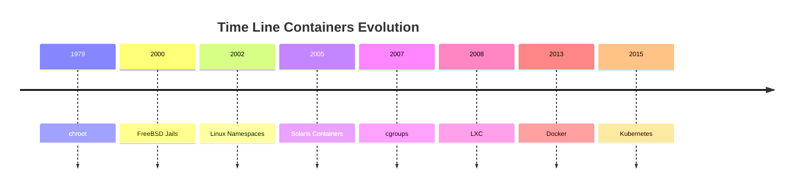

<h1><a name="readme-top"></a></h1>

[](https://github.com/marcossilvestrini/learning-lpic-3-305-300/actions/workflows/release.yml)[](https://github.com/marcossilvestrini/learning-lpic-3-305-300/actions/workflows/translate.yml)[](https://github.com/marcossilvestrini/learning-lpic-3-305-300/actions/workflows/generate-html.yml)[](https://github.com/marcossilvestrini/learning-lpic-3-305-300/actions/workflows/deploy-webpage.yml)[](https://github.com/marcossilvestrini/learning-lpic-3-305-300/actions/workflows/powershell.yml)[](https://github.com/marcossilvestrini/learning-lpic-3-305-300/actions/workflows/slack.yml)

* * *

[![MIT License][license-shield]][license-url][![Forks][forks-shield]][forks-url][![Stargazers][stars-shield]][stars-url][![Contributors][contributors-shield]][contributors-url][![Issues][issues-shield]][issues-url][![LinkedIn][linkedin-shield]][linkedin-url]

* * *

# 學習LPIC-3 305-300


<p align="center">
<strong>Explore the docs »</strong></a>
    <br />
    <a href="https://marcossilvestrini.github.io/learning-lpic-3-305-300/">Web Site</a>
    -
    <a href="https://github.com/marcossilvestrini/learning-lpic-3-305-300">Code Page</a>
    -
    <a href="https://github.com/marcossilvestrini/learning-lpic-3-305-300/issues">Report Bug</a>
    -
    <a href="https://github.com/marcossilvestrini/learning-lpic-3-305-300/issues">Request Feature</a>
</p>

* * *

## 概括

<details>
  <summary><b>TABLE OF CONTENT</b></summary>
  <ol>
    <li>
      <a href="#about-the-project">About The Project</a>
    </li>
    <li>
      <a href="#getting-started">Getting Started</a>
      <ul>
        <li><a href="#prerequisites">Prerequisites</a></li>
        <li><a href="#installation">installation</a></li>
      </ul>
    </li>
    <li><a href="#usage">Usage</a></li>
    <li><a href="#roadmap">Roadmap</a></li>
    <li><a href="#freedoms">Four Essential Freedoms</a></li>
    <li>
      <a href="#topic-351">Topic 351: Full Virtualization</a>
      <ul>
        <li><a href="#topic-351.1">351.1 Virtualization Concepts and Theory </a></li>
        <li><a href="#topic-351.2">351.2 Xen</a></li>
        <li><a href="#topic-351.3">351.3 QEMU</a></li>
        <li><a href="#topic-351.4">351.4 Libvirt Virtual Machine</a></li>
        <li><a href="#topic-351.5">351.5 Virtual Machine Disk Image Management</a></li>
      </ul>
    </li>
    <li>
      <a href="#topic-352">Topic 352: Container Virtualization</a>
      <ul>
        <li><a href="#topic-352.1">352.1 Container Virtualization Concepts</a></li>
        <li><a href="#topic-352.2">352.2 LXC</a></li>
        <li><a href="#topic-352.3">352.3 Docker</a></li>
        <li><a href="#topic-352.4">352.4 Container Orchestration Platforms</a></li>
      </ul>
    </li>
    <li>
      <a href="#topic-353">Topic 353: VM Deployment and Provisioning</a>
      <ul>
        <li><a href="#topic-353.1">353.1 Cloud Management Tools</a></li>
        <li><a href="#topic-353.2">353.2 Packer</a></li>
        <li><a href="#topic-353.3">353.3 cloud-init</a></li>
        <li><a href="#topic-353.4">353.4 Vagrant</a></li>
      </ul>
    </li>
    <li><a href="#license">License</a></li>
    <li><a href="#contact">Contact</a></li>
    <li><a href="#acknowledgments">Acknowledgments</a></li>
  </ol>
</details><br>

* * *

<a name="about-the-project"></a>

## 關於項目

> 該項目旨在幫助學生或專業人員學習Gnulinux的主要概念
> 和免費軟件\\
> 一些Gnulinux分佈（例如Debian和RPM）將被覆蓋\\
> 某些軟件包的安裝和配置也將被覆蓋\\
> 通過這樣做，您可以為整個社區提供一個從您的變化中受益的機會。
> 訪問源代碼是此的先決條件。 \\ \\
> 在本文中使用Vagrant進行UP機器並執行實驗室和練習內容。 \\ \\
> 我已經在vagrant a vagrantfile中發布了必要的\\
> 為您上傳研究環境

* * *

<p align="right">(<a href="#readme-top">back to top</a>)</p>

<a name="getting-started"></a>

## 入門

要開始學習，請參見上面的文檔。

<a name="prerequisites"></a>

### 先決條件

-   [git](https://git-scm.com/book/en/v2/Getting-Started-Installing-Git)
-   [VMware工作站](https://blogs.vmware.com/workstation/2024/05/vmware-workstation-pro-now-available-free-for-personal-use.html)
-   [Vagrant VMware實用程序](https://developer.hashicorp.com/vagrant/install/vmware)
-   [流浪漢](https://developer.hashicorp.com/vagrant/install)

<a name="installation"></a>

### 安裝

克隆倉庫

```sh
git clone https://github.com/marcossilvestrini/learning-lpic-3-305-300.git
cd learning-lpic-3-305-300
```

自定義模板_vagrantfile-topic-xxx_。該文件包含實驗室的VMS配置。例子：

-   文件[VagrantFile-Topic-351](./vagrant/Vagrantfile-topic-351)
    -   vm.clone_directory =“ &lt;your_driver_letter>：\\<folder>\\&lt;to_machine>\\＃{vm_name} -instance-1
        示例：vm.clone_directory =“ e：\\伺服器\\VMware\\＃{vm_name} -instance-1
    -   vm.vmx[“孟加斯”"]= ""
    -   vm.vmx[“ numvcpus”"]= ""
    -   vm.vmx[“ cpuid"correspersocout”.]= ""

自定義文件中的網絡配置[配置/網絡](configs/network/).

* * *

<a name="usage"></a>

## 用法

使用此存儲庫來學習有關LPIC-3 305-300考試

### 上下

切換_vagrantfile-topic-xxx_模板並複制帶有名稱的新文件_Vagrantfile_

```sh
cd vagrant && vagrant up
cd vagrant && vagrant destroy -f
```

### 用於重新啟動VM

```sh
cd vagrant && vagrant reload
```

**重要的：**_如果您無流量重新啟動VM，則共享文件夾在引導後不安裝。_

### 使用Powershell上下

如果您使用Windows平台，我將為上下VM創建一個PowerShell腳本。

```powershell
vagrant/up.ps1
vagrant/destroy.ps1
```

### 基礎設施架構主題351


<p align="right">(<a href="#readme-top">back to top</a>)</p>

* * *

<a name="roadmap"></a>

## 路線圖

-   [x] 創建存儲庫
-   [x] 創建用於配置實驗室的腳本
-   [x] 創建有關主題351的示例
-   [ ] 創建有關主題352的示例
-   [ ] 創建有關主題353的示例
-   [ ] 上傳模擬ITEXAM

* * *

<a name="freedoms"></a>

## 四個基本自由

> 0.出於任何目的，按照您希望運行該程序的自由（自由0）。 \\ \\
> 1.研究程序的工作方式並更改它的自由
> 您希望的計算（自由1）。 \\
> 訪問源代碼是此的先決條件。 \\ \\
> 2.重新分配副本的自由，以便您可以幫助他人（自由2）。
> 3\. freedom將修改後版本的副本分發給他人（Freedom 3）。

* * *

## 檢查命令

```sh
type COMMAND
apropos COMMAND
whatis COMMAND --long
whereis COMMAND
COMMAND --help, --h
man COMMAND
```

<p align="right">(<a href="#readme-top">back to top</a>)</p>

* * *

<a name="topic-351"></a>

## 主題351：完整的虛擬化


* * *

<a name="topic-351.1"></a>

### 351.1虛擬化概念和理論

**重量：**6

**描述：**候選人應該了解並理解虛擬化的一般概念，理論和術語。這包括Xen，Qemu和Libvirt術語。

**關鍵知識領域：**

-   🖥️了解虛擬化術語
-   ⚖️了解虛擬化的利弊
-   🛠️了解虛擬機管理程序和虛擬機監視的各種變化
-   🔄了解遷移到虛擬機的主要方面
-   🚀了解主機系統之間遷移虛擬機的主要方面
-   📸了解虛擬機對虛擬機的特徵和含義，例如快照，暫停，克隆和資源限制
-   🌐意識到ovirt，proxmox，systemd生產和虛擬箱
-   🔗意識開放vswitch

#### 351.1引用對象

```sh
Hypervisor
Hardware Virtual Machine (HVM)
Paravirtualization (PV)
Emulation and Simulation
CPU flags
/proc/cpuinfo
Migration (P2V, V2V)
```

#### 管理程序

##### 1型1型管理程序（裸金屬管理程序）

###### 類型1定義

直接在主機的物理硬件上運行，提供了一個基本層來管理VM，而無需主機操作系統。

###### 1型特徵

-   ⚡高性能和效率。
-   ⏱️降低潛伏期和開銷。
-   🏢經常用於企業環境和數據中心。

###### 類型1個示例

-   VMware ESXI：企業設置中的強大而廣泛使用的虛擬機管理程序。
-   Microsoft Hyper-V：與Windows Server集成，提供強大的性能和管理功能。
-   XEN：許多雲服務提供商使用的開源管理程序。
-   KVM（基於內核的虛擬機）：集成到Linux內核中，為基於Linux的系統提供了高性能。

##### 2型操縱褲（託管管理程序）

###### 類型2定義

在常規操作系統之上運行，依靠主機OS進行資源管理和設備支持。

###### 2型特徵

-   🛠️更容易設置和使用，尤其是在個人計算機上。
-   🔧在開發，測試和較小規模的部署方面更加靈活。
-   🐢由於主機OS的額外開銷，通常比1型管理程序效率低。

###### 類型2個示例

-   VMware Workstation：一個強大的管理程序，用於在單個桌面上運行多個操作系統。
-   Oracle VirtualBox：以其靈活性和易用性而聞名的開源管理程序。
-   Parallels Desktop：供Mac用戶與MacOS一起運行Windows和其他操作系統。
-   QEMU（快速模擬器）：一種開源仿真器和虛擬化器，通常與KVM結合使用。

##### 1型和類型2型管理程序之間的關鍵差異

-   部署環境：
    -   類型1個虛擬機管理程序通常在數據中心和企業環境中部署，因為它們與硬件和高性能的直接互動。
    -   2型管理程序更適合個人使用，開發，測試和小規模的虛擬化任務。
-   表現：
    -   1型操作系統通常提供更好的性能和較低的延遲，因為它們不依賴主機操作系統。
    -   型2型管理程序可能會由於在主機OS上運行的開銷而遭受某些性能降解。
-   管理和易用性：
    -   類型1的管理程序需要更複雜的設置和管理，但為大規模部署提供了高級功能和可擴展性。
    -   類型2個虛擬機管理程序更易於安裝和使用，使其非常適合單個用戶和較小的項目。

##### 遷移類型

在用於創建和管理虛擬機的技術的情況下，P2V遷移和V2V遷移術語在虛擬化環境中很常見。  
他們指的是不同類型平台之間遷移系統的過程。

##### P2V-物理到虛擬遷移

P2V遷移是指將物理服務器遷移到虛擬機的過程。  
換句話說，在專用物理硬件上運行的操作系統及其應用程序被“轉換”，並移動到在管理程序上運行的虛擬機（例如VMware，Hyper-V，KVM等）。

-   示例：您擁有運行Windows或Linux系統的物理服務器，並且要將其移至虛擬環境，例如雲基礎架構或內部虛擬化服務器。  
    該過程涉及復制整個系統狀態，包括操作系統，驅動程序和數據，以創建同等的虛擬機，該機器可以像在物理硬件上一樣運行。

##### V2V-虛擬遷移

V2V遷移是指將虛擬機遷移到另一台虛擬機的過程。  
在這種情況下，您已經在虛擬化環境（例如VMware）中運行虛擬機，並且要將其移至另一個虛擬化環境（例如，到Hyper-V或新的VMware服務器）。

-   示例：您在VMware虛擬化服務器上​​運行了一台虛擬機，但是您決定將其遷移到Hyper-V平台。在這種情況下，V2V遷移將虛擬機從一種格式或管理程序轉換為另一種格式，以確保它可以繼續正確運行。

#### HVM和寄生蟲虛擬化

##### 硬件輔助虛擬化（HVM）

###### HVM定義

HVM利用現代CPU提供的硬件擴展名來虛擬化硬件，從而使VM的創建和管理具有最小的性能開銷。

###### HVM關鍵特徵

-   🖥️**硬件支持**：需要CPU支持虛擬化擴展，例如Intel VT-X或AMD-V。
-   🛠️**完整的虛擬化：**VM可以運行未修改的訪客操作系統，因為該管理程序提供了完整的硬件環境模仿。
-   ⚡**表現：**通常，由於CPU上直接執行訪客代碼，通常會提供近乎本地的性能。
-   🔒**隔離:**由於每個VM都具有自己的專用硬件，因此提供了VM之間的強烈隔離。

###### HVM示例

VMware ESXI，Microsoft Hyper-V，KVM（基於內核的虛擬機）。

###### HVM優勢

-   ✅**相容性:**可以在沒有修改的情況下運行任何操作系統。
-   ⚡**表現：**高性能由於硬件支持。
-   🔒**安全：**硬件提供的增強隔離和安全功能。

###### HVM缺點

-   🛠️**硬件依賴性：**需要特定的硬件功能，從而限制與舊系統的兼容性。
-   🔧**複雜：**可能涉及更複雜的配置和管理。

##### 寄生蟲虛擬化

###### paraviralization定義

paraviralization涉及修改來賓操作系統以了解虛擬環境，從而使其與管理程序更有效地交互。

###### 寄生蟲的關鍵特徵

-   🛠️**來賓修改：**需要更改來賓操作系統，以使用HyperCalls直接與管理程序進行通信。
-   ⚡**表現：**比傳統的完全虛擬化可以更有效，因為它減少了與模擬硬件相關的開銷。
-   🔗**相容性:**僅限於已修改用於寄生蟲的操作系統。

###### paraviralization示例

Xen帶有paraviralizatization的來賓，某些配置中的VMware工具以及一些KVM配置。

###### 寄生蟲的優勢

-   ⚡**效率：**減少了虛擬化硬件的開銷，有可能為某些工作負載提供更好的性能。
-   ✅**資源利用：**由於來賓操作系統和管理程序之間的直接通信，更有效地利用了系統資源。

###### 寄生蟲的缺點

-   🛠️**客座操作系統修改：**需要對來賓操作系統進行修改，從而將兼容性限制在支持的操作系統上。
-   🔧**複雜：**需要在客座操作系統中進行超級呼叫實現的額外複雜性。

##### 關鍵差異

###### 訪客操作系統要求

-   **HVM：**可以運行未修改的客人操作系統。
-   **寄生蟲：**需要修改來賓操作系統以與管理程序一起使用。

###### 表現

-   **HVM：**通常由於硬件輔助執行而提供近乎本地的性能。
-   **寄生蟲：**可以通過減少硬件仿真的開銷來提供有效的性能，但依賴於修改後的訪客操作系統。

###### 硬件依賴性

-   **HVM：**需要特定的CPU功能（Intel VT-X，AMD-V）。
-   **寄生蟲：**不需要特定的CPU功能，而需要修改的訪客操作系統。

###### 隔離

-   **HVM：**使用硬件功能提供強大的隔離。
-   **寄生蟲：**依靠基於軟件的隔離，這可能不像基於硬件的隔離那樣強大。

###### 複雜

-   **HVM：**通常，由於它支持未修飾的操作系統，因此通常更直接地部署。
-   **寄生蟲：**需要對來賓操作系統進行其他設置和修改，從而提高複雜性。

#### numa（不一致的內存訪問）

NUMA（非統一內存訪問）是多處理器系統中使用的內存體系結構，可通過處理器優化內存訪問。  
在NUMA系統中，內存在處理器之間不均勻地分佈，這意味著每個處理器對內存的一部分（其“本地存儲器”）的訪問速度要比物理更遠的內存（稱為“遠程存儲器”）並與其他處理器關聯的內存更快。

##### NUMA體系結構的關鍵特徵

1.  **本地和遠程內存**：每個處理器都有自己的本地內存，它可以更快地訪問。但是，儘管需要更長的時間，但它也可以訪問其他處理器的內存。
2.  **區分潛伏期**：內存訪問的延遲取決於處理器是訪問其本地內存還是其他節點的內存。訪問另一個節點的內存（遠程）時，本地內存訪問更快。
3.  **可伸縮性**：NUMA架構旨在提高許多處理器系統的可擴展性。隨著添加更多處理器的添加，還會分發內存，避免在統一內存訪問（UMA）體系結構中發生的瓶頸。

##### NUMA的優勢

-   ⚡在大型系統中的性能更好：由於每個處理器都有本地內存，因此它可以更有效地工作，而無需與其他處理器競爭以獲得內存訪問。
-   📈可伸縮性：NUMA允許與UMA體系結構相比，具有許多處理器和大量內存的系統可以更有效地擴展。

##### 缺點

-   🛠️編程複雜性：程序員需要了解哪些內存區域是本地或遠程區域，以優化使用本地內存以實現更好的性能。
-   🐢潛在的性能處罰：如果處理器經常訪問遙控內存，則由於延遲較高而可能會遭受性能。
    該體系結構在高性能多處理器系統（例如服務器和超級計算機）中很常見，在該系統中，可擴展性和內存優化至關重要。

#### OpenSource解決方案

-   ovirt：<https://www.ovirt.org/>

-   🌐proxmox：<https://www.proxmox.com/en/proxmox-virtual-environment/overview>

-   🌐Oracle VirtualBox：<https://www.virtualbox.org/>

-   🌐開放vswitch：<https://www.openvswitch.org/>

#### 虛擬化類型

##### 硬件虛擬化（服務器虛擬化）

###### HV定義

摘要物理硬件以創建運行單獨的操作系統和應用程序的虛擬機（VM）。

###### HV用例

數據中心，雲計算，服務器整合。

###### HV示例

VMware ESXI，Microsoft Hyper-V，KVM。

##### 操作系統虛擬化（容器化）

###### 容器化定義

允許多個隔離的用戶空間實例（容器）在單個OS內核上運行。

###### 容器化用例

微服務體系結構，開發和測試環境。

###### 容器化示例

Docker，Kubernetes，LXC。

##### 網絡虛擬化

###### 網絡虛擬化定義

將硬件和軟件網絡資源結合到一個基於軟件的管理實體中。

###### 網絡虛擬化用例

軟件定義的網絡（SDN），網絡功能虛擬化（NFV）。

###### 網絡虛擬化示例

VMware NSX，Cisco ACI，OpenStack Neutron。

##### 存儲虛擬化

###### 存儲虛擬化定義

從多個設備將物理存儲池用於單個虛擬存儲單元，該單元可以在中心進行管理。

###### 存儲虛擬化定義用例

數據管理，存儲優化，災難恢復。

###### 存儲虛擬化定義示例

IBM SAN音量控制器，VMware VSAN，NetApp ontap。

##### 桌面虛擬化

###### 桌面虛擬化定義

允許桌面操作系統在託管服務器上託管的虛擬機上運行。

###### 桌面虛擬化定義用例

虛擬桌面基礎架構（VDI），遠程工作解決方案。

###### 桌面虛擬化定義示例

Citrix虛擬應用程序和台式機，VMware Horizo​​​​n，Microsoft遠程桌面服務。

##### 應用虛擬化

###### 應用虛擬化定義

將應用程序與基礎硬件和操作系統分開，使它們可以在孤立的環境中運行。

###### 應用虛擬化定義用例

簡化的應用程序部署，兼容性測試。

###### 應用虛擬化定義示例

VMware ThinApp，Microsoft App-V，Citrix Xenapp。

##### 數據虛擬化

###### 數據虛擬化定義

整合來自各種來源的數據而無需物理整合，提供了統一的觀點進行分析和報告。

###### 數據虛擬化定義用例

商業智能，實時數據集成。

###### 數據虛擬化定義示例

Denodo，Red Hat Jboss數據虛擬化，IBM Infosphere。

##### 虛擬化的好處

-   ⚡資源效率：更好地利用物理資源。
-   💰節省成本：降低硬件和運營成本。
-   📈可伸縮性：根據需求易於擴展或向下擴展。
-   🔧靈活性：支持各種工作量和應用程序。
-   🔄災難恢復：簡化的備份和恢復過程。
-   🔒隔離：通過隔離環境改善了安全性。

#### 仿真

仿真涉及模擬與最初預期不同平台上硬件或軟件的行為。

此過程允許為一個系統設計的軟件可以在另一個可能具有不同體系結構或操作環境的系統上運行。

雖然仿真通過實現未修改的來賓操作系統或應用程序來提供多功能性，但它通常帶有性能開銷。

之所以出現此間接費用，是因為模擬系統需要將用於原始系統的指令解釋和翻譯為與主機系統兼容的指令。結果，仿真可以比本地執行慢，從而使資源密集型任務的效率降低。

儘管有這一缺點，但仿真對於運行傳統軟件，在不同平台上測試應用程序以及促進跨平台開發仍然有價值。

#### SystemD機場

SystemD生產的服務致力於管理SystemD生態系統中的虛擬機和容器。
 它提供了控制，監視和維護虛擬實例的基本功能，從而在Linux環境中提供了強大的集成和效率。

<p align="right">(<a href="#topic-351.1">back to sub Topic 351.1</a>)</p>
<p align="right">(<a href="#topic-351">back to Topic 351</a>)</p>
<p align="right">(<a href="#readme-top">back to top</a>)</p>

* * *

<a name="topic-351.2"></a>

### 351.2交替


**重量：**3

**描述：**候選人應能夠安裝，配置，維護，遷移和故障排除XEN安裝。重點是Xen版本4.x。

**關鍵知識領域：**

-   了解XEN的體系結構，包括網絡和存儲
-   XEN節點和域的基本配置
-   XEN節點和域的基本管理
-   XEN安裝的基本故障排除
-   貪婪的藥丸
-   意識Xenstore
-   Xen引導參數的意識
-   意識到XM實用程序

#### 備用


XEN是一種開源類型1（裸機）管理程序，它允許多個操作系統在同一物理硬件上同時運行。  
Xen提供了物理硬件和虛擬機（VM）之間的一層，從而實現了有效的資源共享和隔離。

-   **建築學：**XEN使用域0（DOM0）是具有直接硬件訪問的特權域並管理管理程序的兩層系統。其他稱為域U（DOMU）的虛擬機，運行訪客操作系統，並由DOM0管理。
-   **虛擬化類型：**XEN支持需要修改的訪客操作系統和硬件輔助虛擬化（HVM）的Paravirtualization（PV），該虛擬化（HVM）使用硬件擴展（例如Intel VT-X或AMD-V）來運行未修改的來賓操作系統。
    XEN廣泛用於雲環境中，特別是由Amazon Web Services（AWS）和其他大型雲提供商使用。

#### Xensource

Xensource是由劍橋大學XEN管理程序的原始開發商創立的公司，以商業化Xen。  
該公司提供了基於Xen的企業解決方案，並提供了其他工具和支持，以增強Xen的企業使用能力。

-   **Citrix的收購**：2007年，Xensource被Citrix Systems，Inc。收購。 Citrix使用Xen Technology作為其Citrix Xenserver產品的基礎，該產品成為基於Xen的流行企業級虛擬化平台。
-   **過渡**：收購後，Xen項目繼續作為開源項目，而Citrix則專注於Xenserver等商業產品，利用Xensource Technology。

#### Xen項目

XEN項目是指負責在其商業化後開發和維護XEN管理程序的開源社區和倡議。  
XEN項目在Linux基金會下運作，重點是建造，改進和支持Xen作為協作，社區驅動的努力。

-   **目標：**XEN項目旨在通過改善其性能，安全性和功能設置為廣泛的用例，包括雲計算，以安全性為中心的虛擬化（例如Qubes OS）和嵌入式系統來推動該管理程序。
-   **貢獻者：**該項目包括來自各種組織的貢獻者，包括主要的雲提供商，硬件供應商和獨立開發人員。
-   **藥丸和Hedools：**XEN項目還包括XAPI（XENAPI）等工具，該工具用於管理XEN管理程序安裝，以及用於系統管理和優化的其他各種實用程序。

#### Xenstore

Xen Store是Xen管理程序的關鍵組成部分。  
從本質上講，Xen Store是一個分佈式鍵值數據庫，用於在XEN管理程序和虛擬機（也稱為域）之間進行通信和信息共享。

這是Xen Store的一些關鍵方面：

-   **跨域交流：**XEN存儲啟用域之間的通信，例如DOM0（控制硬件資源的特權域）和DOMUS（用戶域，是VMS）。這是通過鍵值條目完成的，每個域都可以讀取或寫入信息。

-   **配置管理：**它用於存儲和訪問配置信息，例如虛擬設備，網絡和引導參數。這有助於VM的動態管理和配置。

-   **事件和通知：**Xen Store還支持事件通知。當修改XEN存儲中的特定鍵或值時，可以通知感興趣的域以對這些更改做出反應。這對於監視和管理資源很有用。

-   簡單的API：Xen Store提供了一個簡單的API，用於讀取和編寫數據，使開發人員可以輕鬆地將其應用程序與Xen虛擬化系統集成在一起。

#### 丸

XAPI或XENAPI是用於管理XEN機床機及其虛擬機（VMS）的應用程序編程接口（API）。  
XAPI是Xenserver（現稱為Citrix Hypervisor）的關鍵組成部分，並提供了一種與Xen Hypervisor交互的標準化方法，以執行諸如創建，配置，監視和控制VM的操作。

這是XAPI的一些重要方面：

-   **VM Management:**XAPI允許管理員通過編程性創建，刪除，啟動和停止虛擬機。

-   **自動化：**使用XAPI，可以自動化虛擬資源的管理，包括網絡，存儲和計算，這對於大雲環境至關重要。

-   **一體化：**XAPI可以與其他工具和腳本集成，以提供更有效和定制的XEN環境管理。

-   **訪問控制：**XAPI還提供訪問控制機制，以確保只有授權用戶才能在虛擬環境中執行特定操作。

XAPI是可以控制和自動化XEN管理程序的接口，使管理虛擬化環境更容易。

#### Xen摘要

-   **間作：**核心管理程序技術使虛擬機能夠在物理硬件上運行。
-   **Xensource：**Xen商業化的公司後來被Citrix收購，導致Citrix Xenserver的發展。
-   **XEN項目：**在Linux基金會下繼續開發和維護XEN管理程序的開源計劃和社區。
-   **Xenstore：**XEN存儲充當XEN管理程序和VM之間的通信和配置中介，簡化了虛擬化環境的操作和管理。
-   **丸**是可以控制和自動化XEN虛擬機程序的接口，使管理虛擬化環境變得更加容易。

#### domain0（dom0）

domain0或dom0是XEN體系結構中的控制域。它管理其他域（Domus），並可以直接訪問硬件。  
DOM0運行設備驅動程序，允許缺乏直接硬件訪問的Domus與設備通信。通常，它是操作系統（例如Linux）的完整實例，對於XEN Hyprovisor操作至關重要。

#### 域（房屋）

Domus是運行虛擬機的非特權域。  
它們由DOM0管理，無法直接訪問硬件。 Domus可以配置為運行不同的操作系統，並用於各種目的，例如應用程序服務器和開發環境。他們依靠DOM0進行硬件交互。

#### peewee-dom（paravardiyed domina）

PV-Domus使用一種稱為paraviratualization的技術。在此模型中，對DOMU操作系統進行了修改，以意識到它在虛擬化的環境中運行，從而使其可以直接與操縱虛擬機直接通信以獲得優化的性能。  
與完全虛擬化相比，這會導致較低的開銷和提高效率。

#### HVM-DOMU（硬件虛擬機域）

HVM-Domus是使用完整虛擬化的虛擬機，允許未修改的操作系統運行。 XEN管理程序為這些圓頂提供了硬件仿真，使他們能夠運行任何支持基礎硬件體系結構的操作系統。  
儘管這具有更大的靈活性，但與PV-Domus相比，它可能導致更高的開銷。

#### XEN網絡

Paravirtualised Network Devices


橋接

#### 351.2引用的對象

```sh
Domain0 (Dom0), DomainU (DomU)
PV-DomU, HVM-DomU
/etc/xen/
xl
xl.cfg 
xl.conf # Xen global configurations
xentop
oxenstored # Xenstore configurations
```

#### 351.2註釋

```sh

# Xen Settings
/etc/xen/
/etc/xen/xl.conf - Main general configuration file for Xen
/etc/xen/oxenstored.conf - Xenstore configurations

# VM Configurations
/etc/xen/xlexample.pvlinux
/etc/xen/xlexample.hvm

# Service Configurations
/etc/default/xen
/etc/default/xendomains

# xen-tools configurations
/etc/xen-tools/
/usr/share/xen-tools/

# docs
xl(1)
xl.conf(5)
xlcpupool.cfg(5)
xl-disk-configuration(5)
xl-network-configuration(5)
xen-tscmode(7)

# initialized domains auto
/etc/default/xendomains
   XENDOMAINS_AUTO=/etc/xen/auto

/etc/xen/auto/


# set domain for up after xen reboot
## create folder auto
cd /etc/xen && mkdir -p auto && cd auto

# create simbolic link
ln -s /etc/xen/lpic3-pv-guest /etc/xen/auto/lpic3-pv-guest
```

#### 351.2重要命令

##### Xen-Create-image

```sh
# create a pv image
xen-create-image \
  --hostname=lpic3-pv-guest \
  --memory=1gb \
  --vcpus=2 \
  --lvm=vg_xen \
  --bridge=xenbr0 \
  --dhcp \
  --pygrub \
  --password=vagrant \
  --dist=bookworm
```

##### Xen-list-images

```sh
# list image
xen-list-image
```

##### Xen-Delete-image

```sh
# delete a pv image
xen-delete-image lpic3-pv-guest --lvm=vg_xen
```

##### Xenstore-LS

```sh
# list xenstore infos
xenstore-ls
```

##### XL

```sh
# view xen information
xl infos

# list Domains
xl list
xl list lpic3-hvm-guest
xl list lpic3-hvm-guest -l

# uptime Domains
xl uptime

# pause Domain
xl pause 2
xl pause lpic3-hvm-guest

# save state Domains
xl -v save lpic3-hvm-guest ~root/image-lpic3-hvm-guest.save

# restore Domain
xl restore /root/image-lpic3-hvm-guest.save

# get Domain name
xl domname 2

# view dmesg information
xl dmesg

# monitoring domain
xl top
xentop
xen top

# Limit mem Dom0
xl mem-set 0 2048

# Limite cpu (not permanent after boot)
xl vcpu-set 0 2

# create DomainU - virtual machine
xl create /etc/xen/lpic3-pv-guest.cfg

# create DomainU virtual machine and connect to guest
xl create -c /etc/xen/lpic3-pv-guest.cfg

##----------------------------------------------
# create DomainU virtual machine HVM

## create logical volume
lvcreate -l +20%FREE -n lpic3-hvm-guest-disk  vg_xen

## create a ssh tunel for vnc
ssh -l vagrant -L 5900:localhost:5900  192.168.0.130

## configure /etc/xen/lpic3-hvm-guest.cfg
## set boot for cdrom: boot = "d"

## create domain hvm
xl create /etc/xen/lpic3-hvm-guest.cfg

## open vcn conection in your vnc client with localhost
## for view install details

## after installation finished, destroy domain: xl destroy <id_or_name>

## set /etc/xen/lpic3-hvm-guest.cfg: boot for hard disc: boot = "c"

## create domain hvm
xl create /etc/xen/lpic3-hvm-guest.cfg

## access domain hvm
xl console <id_or_name>
##----------------------------------------------

# connect in domain guest
xl console <id>|<name> (press enter)
xl console 1
xl console lpic3-pv-guest

#How do I exit domU "xl console" session
#Press ctrl+] or if you're using Putty press ctrl+5.

# Poweroff domain
xl shutdown lpic3-pv-guest

# destroy domain
xl destroy lpic3-pv-guest

# reboot domain
xl reboot lpic3-pv-guest

# list block devices
xl block-list 1
xl block-list lpic3-pv-guest

# detach block devices
xl block-detach lpic3-hvm-guest hdc
xl block-detach 2 xvdc

# attach block devices

## hard disk devices
xl block-attach lpic3-hvm-guest-ubuntu 'phy:/dev/vg_xen/lpic3-hvm-guest-disk2,xvde,w'

## cdrom
xl block-attach lpic3-hvm-guest 'file:/home/vagrant/isos/ubuntu/seed.iso,xvdc:cdrom,r'
xl block-attach 2 'file:/home/vagrant/isos/ubuntu/seed.iso,xvdc:cdrom,r'

# insert and eject cdrom devices
xl cd-insert lpic3-hvm-guest-ubuntu xvdb  /home/vagrant/isos/ubuntu/ubuntu-24.04.1-live-server-amd64.iso
xl cd-eject lpic3-hvm-guest-ubuntu xvdb
```

#### 251.2筆記

##### vif

在Xen中，“ VIF”代表虛擬接口，用於為虛擬機（域）配置網絡。

通過在域配置文件中指定“ VIF”指令，管理員可以定義網絡接口，分配IP地址，設置VLAN，並為在XEN主機上運行的虛擬機配置其他網絡參數。例如：vif =[“橋= Xenbr0”]，在這種情況下，它將VM的網絡接口連接到名為“ XENBR0”的Xen橋。

````sh

<p align="right">(<a href="#topic-351.2">back to sub Topic 351.2</a>)</p>
<p align="right">(<a href="#topic-351">back to Topic 351</a>)</p>
<p align="right">(<a href="#readme-top">back to top</a>)</p>

---

<a name="topic-351.3"></a>

### 351.3 QEMU


**Weight:** 4

**Description:** Candidates should be able to install, configure, maintain, migrate and troubleshoot QEMU installations.

**Key Knowledge Areas:**

* Understand the architecture of QEMU, including KVM, networking and storage
* Start QEMU instances from the command line
* Manage snapshots using the QEMU monitor
* Install the QEMU Guest Agent and VirtIO device drivers
* Troubleshoot QEMU installations, including networking and storage
* Awareness of important QEMU configuration parameters

#### 351.3 Cited Objects

```sh
Kernel modules: kvm, kvm-intel and kvm-amd
/dev/kvm
QEMU monitor
qemu
qemu-system-x86_64
ip
brctl
tunctl
````

#### 351.3重要命令

##### 351.3其他命令

##### 檢查KVM模塊

```sh
# check if kvm is enabled
egrep -o '(vmx|svm)' /proc/cpuinfo
lscpu |grep Virtualization
lsmod|grep kvm
ls -l /dev/kvm
hostnamectl
systemd-detect-virt
```

```sh
# check if kvm is enabled
egrep -o '(vmx|svm)' /proc/cpuinfo
lscpu |grep Virtualization
lsmod|grep kvm
ls -l /dev/kvm

# check kernel infos
uname -a

# check root device
findmnt /

# mount a qcow2 image
## Example 1:
mkdir -p /mnt/qemu
guestmount -a os-images/Debian_12.0.0_VMM/Debian_12.0.0.qcow2 -i /mnt/qemu/

## Example 2:
sudo guestfish --rw -a os-images/Debian_12.0.0_VMM/Debian_12.0.0.qcow2
run
list-filesystems

# run commands in qcow2 images
## Example 1:
virt-customize -a  os-images/Debian_12.0.0_VMM/Debian_12.0.0.qcow2  --run-command 'echo hello >/root/hello.txt'
## Example 2:
sudo virt-customize -a os-images/Debian_12.0.0_VMM/Debian_12.0.0.qcow2 \
  --run-command 'echo -e "auto ens3\niface ens3 inet dhcp" > /etc/network/interfaces.d/ens3.cfg'

# generate mac 
printf 'DE:AD:BE:EF:%02X:%02X\n' $((RANDOM%256)) $((RANDOM%256))
```

##### IP

```sh
# list links
ip link show

# create bridge
ip link add br0 type bridge
```

##### brctl

```sh
# list links
ip link show

# create bridge
ip link add br0 type bridge
```

##### qemu-img

```sh
# create image
qemu-img create -f qcow2 vm-disk-debian-12.qcow2 20G

# convert vmdk to qcow2 image
qemu-img convert \
  -f vmdk \
  -O qcow2 os-images/Debian_12.0.0_VMM/Debian_12.0.0_VMM_LinuxVMImages.COM.vmdk os-images/Debian_12.0.0_VMM/Debian_12.0.0.qcow2 \
  -p \
  -m16

# check image
qemu-img info os-images/Debian_12.0.0_VMM/Debian_12.0.0.qcow2
```

##### QEMU-SYSTEM-X86_64

```sh
# create vm with ISO
qemu-system-x86_64 \
  -name lpic3-debian-12 \
  -enable-kvm -hda vm-disk-debian-12.qcow2 \
  -cdrom /home/vagrant/isos/debian/debian-12.8.0-amd64-DVD-1.iso  \
  -boot d \
  -m 2048 \
  -smp cpus=2 \
  -k pt-br

# create vm with ISO using vnc in no gui servers \ ssh connections

## create ssh tunel in host
 ssh -l vagrant -L 5902:localhost:5902  192.168.0.131

## create vm 
qemu-system-x86_64 \
  -name lpic3-debian-12 \
  -enable-kvm \
  -m 2048 \
  -smp cpus=2 \
  -k pt-br \
  -vnc :2 \
  -device qemu-xhci \
  -device usb-tablet \
  -device ide-cd,bus=ide.1,drive=cdrom,bootindex=1 \
  -drive id=cdrom,media=cdrom,if=none,file=/home/vagrant/isos/debian/debian-12.8.0-amd64-DVD-1.iso \
  -hda vm-disk-debian-12.qcow2 \
  -boot order=d \
  -vga std \
  -display none \
  -monitor stdio

# create vm with OS Image - qcow2

## create vm
qemu-system-x86_64 \
  -name lpic3-debian-12 \
  -enable-kvm \
  -m 2048 \
  -smp cpus=2 \
  -k pt-br \
  -vnc :2 \
  -hda os-images/Debian_12.0.0_VMM/Debian_12.0.0.qcow2

## create vm with custom kernel params
qemu-system-x86_64 \
  -name lpic3-debian-12 \
  -kernel /vmlinuz \
  -initrd /initrd.img \
  -append "root=/dev/mapper/debian--vg-root ro fastboot console=ttyS0" \
  -enable-kvm \
  -m 2048 \
  -smp cpus=2 \
  -k pt-br \
  -vnc :2 \
  -hda os-images/Debian_12.0.0_VMM/Debian_12.0.0.qcow2

## create vm with and attach disk
qemu-system-x86_64 \
  -name lpic3-debian-12 \
  -enable-kvm \
  -m 2048 \
  -smp cpus=2 \
  -vnc :2 \
  -hda os-images/Debian_12.0.0_VMM/Debian_12.0.0.qcow2 \
  -hdb vmdisk-debian12.qcow2 \
  -drive file=vmdisk-extra-debian12.qcow2,index=2,media=disk,if=ide \
  -netdev bridge,id=net0,br=qemubr0 \
  -device virtio-net-pci,netdev=net0
  
## create vm network netdev user
qemu-system-x86_64 \
  -name lpic3-debian-12 \
  -enable-kvm \
  -m 2048 \
  -smp cpus=2 \
  -vnc :2 \
  -hda os-images/Debian_12.0.0_VMM/Debian_12.0.0.qcow2 \
  -netdev user,id=mynet0,net=192.168.0.150/24,dhcpstart=192.168.0.155,hostfwd=tcp::2222-:22 \
  -device virtio-net-pci,netdev=mynet0

## create vm network netdev tap (Private Network)
ip link add br0 type bridge ; ifconfig br0 up
qemu-system-x86_64 \
  -name lpic3-debian-12 \
  -enable-kvm \
  -m 2048 \
  -smp cpus=2 \
  -vnc :2 \
  -hda os-images/Debian_12.0.0_VMM/Debian_12.0.0.qcow2 \
  -netdev tap,id=br0 \
  -device e1000,netdev=br0,mac=DE:AD:BE:EF:1A:24

## create vm with public bridge
#create a public bridge : https://www.linux-kvm.org/page/Networking

qemu-system-x86_64 \
  -name lpic3-debian-12 \
  -enable-kvm \
  -m 2048 \
  -smp cpus=2 \
  -hda os-images/Debian_12.0.0_VMM/Debian_12.0.0.qcow2 \
  -k pt-br \
  -vnc :2 \
  -device qemu-xhci \
  -device usb-tablet \
  -vga std \
  -display none \
  -netdev bridge,id=net0,br=qemubr0 \
  -device virtio-net-pci,netdev=net0

## get a ipv4 ip - open ssh in vm and:
dhcpclient ens4
```

#### QEMU監視器

在命令行中使用QEMU監視器**-Monitor Stdio**參數**QEMU-SYSTEM-X86_64**

```sh
qemu-system-x86_64 -monitor stdio
```

退出QEMU-MONITOR：

```sh
ctrl+alt+2
```

```sh
# Managment
info status # vm info
info cpus # cpu information
info network # network informations
stop # pause vm
cont # start vm in status pause
system_powerdown # poweroff vm
system_reset # restart monitor


# Blocks
info block # block info
boot_set d # force boot iso
change ide1-cd0  /home/vagrant/isos/debian/debian-12.8.0-amd64-DVD-1.iso  # attach cdrom
eject ide1-cd0 # detach cdrom

# Snapshots
info snapshots # list snapshots
savevm snapshot-01  # create snapshot
loadvm snapshot-01 # restore snapshot
delvm snapshot-01
```

#### 來賓經紀人

對於啟用，請使用：

```sh
qemu-system-x86_x64
 -chardev socket,path=/tmp/qga.sock,server=on,wait=off,id=qga0 \
 -device virtio-serial \
 -device virtserialport,chardev=qga0,name=org.qemu.guest_agent.0
```

<p align="right">(<a href="#topic-351.3">back to sub Topic 351.3</a>)</p>
<p align="right">(<a href="#topic-351">back to Topic 351</a>)</p>
<p align="right">(<a href="#readme-top">back to top</a>)</p>

* * *

<a name="topic-351.4"></a>

### 351.4 libvirt虛擬機管理


**重量：**9

**描述：**候選人應能夠使用Libvirt和相關工具來管理虛擬化主機和虛擬機（“ Libvirt域”）。

**關鍵知識領域：**

-   了解libvirt的建築
-   管理libvirt連接和節點
-   創建和管理QEMU和XEN域，包括快照
-   管理和分析域的資源消耗
-   創建和管理存儲池和卷
-   創建和管理虛擬網絡
-   節點之間的遷移域
-   了解Libvirt如何與Xen和Qemu互動
-   了解Libvirt如何與DNSMASQ和RADVD等網絡服務互動
-   Understand libvirt XML configuration files
-   意識對virtlogd和virtlockd

#### 351.4引用對象

```sh
libvirtd
/etc/libvirt/
/var/lib/libvirt
/var/log/libvirt
virsh (including relevant subcommands) 
```

#### 351.4重要命令

##### Virsh

```sh
# using env variable for set virsh uri (local or remotly)
export LIBVIRT_DEFAULT_URI=qemu:///system
export LIBVIRT_DEFAULT_URI=xen+ssh://vagrant@192.168.0.130
export LIBVIRT_DEFAULT_URI='xen+ssh://vagrant@192.168.0.130?keyfile=/home/vagrant/.ssh/skynet-key-ecdsa'

# COMMONS

# get helps
virsh help
virsh help pool-create

# view version
virsh version

# view system info
sudo virsh sysinfo

# view node info
virsh nodeinfo

# hostname
virsh hostname

# check vcn allocated port
virsh vncdisplay <domain_id>
virsh vncdisplay <domain_name>
virsh vncdisplay rocky9-server01 

# HYPERVISIONER

# view libvirt hypervisioner connection
virsh uri

# list valid hypervisioners
virt-host-validate
virt-host-validate qemu

# test connetion uri(vm test)
virsh -c test:///default list

# connect remotly
virsh -c xen+ssh://vagrant@192.168.0.130
virsh -c xen+ssh://vagrant@192.168.0.130 list
virsh -c qemu+ssh://vagrant@192.168.0.130/system list

# connect remotly without enter password
virsh -c 'xen+ssh://vagrant@192.168.0.130?keyfile=/home/vagrant/.ssh/skynet-key-ecdsa'

# STORAGE

# list storage pools
virsh pool-list --details

# list all storage pool
virsh pool-list --all --details

# get a pool configuration
virsh pool-dumpxml default

# get pool info
virsh pool-info default

# create a storage pool
virsh pool-define-as --name default --type dir --target /var/lib/libvirt/images

# create a storage pool with dumpxml
virsh pool-create --overwrite --file configs/kvm/libvirt/pool.xml

# start storage pool
virsh pool-start default

# set storage pool for autostart
virsh pool-autostart default

# stop storage pool
virsh pool-destroy linux

# delete xml storage pool file
virsh pool-undefine linux

# edit storage pool
virsh pool-edit linux

# list volumes
virsh vol-list linux

# get volume infos
virsh vol-info Debian_12.0.0.qcow2 os-images
virsh vol-info --pool os-images Debian_12.0.0.qcow2 

# get volume xml
virsh vol-dumpxml rocky9-disk1 default

# create volume
virsh vol-create-as default --format qcow2 disk1 10G

# delete volume
virsh vol-delete  disk1 default

# DOMAINS \ INSTANCES \ VIRTUAL MACHINES

# list domain\instance\vm
virsh list
virsh list --all

# create domain\instance\vm
virsh create configs/kvm/libvirt/rocky9-server03.xml

# view domain\instance\vm info
virsh dominfo rocky9-server01

# view domain\instance\vm xml
virsh dumpxml rocky9-server01

# edit domain\instance\vm xml
virsh edit rocky9-server01

# stop domain\instance\vm
virsh shutdown rocky9-server01 # gracefully
virsh destroy 1
virsh destroy rocky9-server01

# suspend domain\instance\vm
virsh suspend rocky9-server01

# resume domain\instance\vm
virsh resume rocky9-server01

# start domain\instance\vm
virsh start rocky9-server01

# remove domain\instance\vm
virsh undefine rocky9-server01

# remove domain\instance\vm and storage volumes
virsh undefine rocky9-server01 --remove-all-storage

# save domain\instance\vm
virsh save rocky9-server01 rocky9-server01.qcow2

# restore domain\instance\vm
virsh restore rocky9-server01.qcow2

# list snapshots
virsh snapshot-list rocky9-server01

# create snapshot
virsh snapshot-create rocky9-server01

# restore snapshot
virsh snapshot-revert rocky9-server01 1748983520

# view snapshot xml
virsh snapshot-info rocky9-server01 1748983520

# dumpxml snapshot
virsh snapshot-dumpxml rocky9-server01 1748983520

# xml snapshot path
/var/lib/libvirt/qemu/snapshot/rocky9-server01/

# view snapshot info
virsh snapshot-info rocky9-server01 1748983671

# edit snapshot
virsh snapshot-edit rocky9-server01 1748983520

# delete snapshot
virsh snapshot-delete rocky9-server01 1748983520

# DEVICES

# list block devices
virsh domblklist rocky9-server01 --details

# add cdrom media 
virsh change-media rocky9-server01 sda /home/vagrant/isos/rocky/Rocky-9.5-x86_64-minimal.iso
virsh attach-disk rocky9-server01 /home/vagrant/isos/rocky/Rocky-9.5-x86_64-minimal.iso sda --type cdrom --mode readonly

# remove cdrom media
virsh change-media rocky9-server01 sda --eject

# add new disk
virsh attach-disk rocky9-server01  /var/lib/libvirt/images/rocky9-disk2  vdb --persistent

# remove disk
virsh detach-disk rocky9-server01 vdb --persistent

# RESOURCES (CPU and Memory)

# get cpu infos
virsh vcpuinfo rocky9-server01 --pretty
virsh dominfo rocky9-server01 | grep 'CPU'

# get vcpu count
virsh vcpucount rocky9-server01

# set vcpus maximum config
virsh setvcpus rocky9-server01 --count 4 --maximum --config
virsh shutdown rocky9-server01
virsh start rocky9-server01

# set vcpu current config
virsh setvcpus rocky9-server01 --count 4 --config

# set vcpu current live
virsh setvcpus rocky9-server01 --count 3 --current
virsh setvcpus rocky9-server01 --count 3 --live

# configure vcpu afinity config
virsh vcpupin rocky9-server01 0 7 --config
virsh vcpupin rocky9-server01 1 5-6 --config

# configure vcpu afinity current
virsh vcpupin rocky9-server01 0 7
virsh vcpupin rocky9-server01 1 5-6

# set maximum memory config
virsh setmaxmem rocky9-server01 3000000 --config
virsh shutdown rocky9-server01
virsh start rocky9-server01

# set current memory config
virsh setmem rocky9-server01 2500000 --current

# NETWORK

# get netwwork bridges
brctl show

# get iptables rules for libvirt
sudo iptables -L -n -t  nat

# list network
virsh net-list --all

# set default network
virsh net-define /etc/libvirt/qemu/networks/default.xml

# get network infos
virsh net-info default

# get xml network
virsh net-dumpxml default

# xml file
cat /etc/libvirt/qemu/networks/default.xml

# dhcp config
sudo cat /etc/libvirt/qemu/networks/default.xml | grep -A 10 dhcp
sudo cat /var/lib/libvirt/dnsmasq/default.conf

# get domain ipp address
virsh net-dhcp-leases default
virsh net-dhcp-leases default --mac 52\:54\:00\:89\:19\:86

# edit network
virsh net-edit default

# get domain network detais
virsh domiflist debian-server01

# path for network filter files
/etc/libvirt/nwfilter/

# list network filters
virsh nwfilter-list

# create network filter - block icmp traffic
virsh nwfilter-define block-icmp.xml
# virsh edit Debian-Server
    #  <interface type='network'>
    #        ...
    #        <filterref filter='block-icmp'/>
    #        ...
    # </interface>
# virsh destroy debian-server01
# virsh start debian-server01

# delete network filter
virsh nwfilter-undefine block-icmp

# get xml network filter
virsh nwfilter-dumpxml block-icmp
```

###### virt-install

```sh
# list os variants
virt-install --os-variant list
osinfo-query os

# create domain\instance\vm with iso file
virsh vol-create-as default --format qcow2 rocky9-disk1 20G
virt-install --name rocky9-server01 \
--vcpus 2 \
--cpu host \
--memory 2048 \
--disk vol=default/rocky9-disk1 \
--cdrom /home/vagrant/isos/rocky/Rocky-9.5-x86_64-minimal.iso \
--os-variant=rocky9 \
--graphics vnc,listen=0.0.0.0,port=5905

# create debian domain\instance\vm with qcow2 file
virt-install --name debian-server01 \
--vcpus 2 \
--ram 2048 \
--disk vol=os-images/Debian_12.0.0.qcow2 \
--import \
--osinfo detect=on \
--graphics vnc,listen=0.0.0.0,port=5906 \
--network network=default \
--noautoconsole

# create rocky9 domain\instance\vm with qcow2 file
virt-install --name rocky9-server02 \
--vcpus 2 \
--ram 2048 \
--disk path=os-images/RockyLinux_9.4_VMG/RockyLinux_9.4.qcow2,format=qcow2,bus=virtio \
--import \
--osinfo detect=on \
--graphics vnc,listen=0.0.0.0,port=5907 \
--network bridge=qemubr0,model=virtio \
--noautoconsole

# open domain\instance\vm gui console
virt-viewer debian-server01

# check metadata domain\instance\vm file (if uri is qemu:////system)
less /etc/libvirt/qemu/debian-server01.xml
```

<p align="right">(<a href="#topic-351.4">back to sub Topic 351.4</a>)</p>
<p align="right">(<a href="#topic-351">back to Topic 351</a>)</p>
<p align="right">(<a href="#readme-top">back to top</a>)</p>

* * *

<a name="topic-351.5"></a>

### 351.5虛擬機磁盤圖像管理


**重量：**3

**描述：**候選人應該能夠管理虛擬機磁盤圖像。這包括在各種格式和虛擬機中轉換磁盤圖像，以及訪問圖像中存儲的數據。

**關鍵知識領域：**

-   了解各種虛擬磁盤圖像格式的功能，例如RAW Images，QCOW2和VMDK
-   使用QEMU-IMG管理虛擬機磁盤圖像
-   使用libguestfish在虛擬機磁盤圖像中包含的安裝分區和訪問文件
-   將物理磁盤內容複製到虛擬機磁盤圖像
-   在各種虛擬機磁盤圖像格式之間遷移磁盤內容
-   意識開放虛擬化格式（OVF）

#### 351.5引用的對象

```sh
qemu-img
guestfish (including relevant subcommands)
guestmount
guestumount
virt-cat
virt-copy-in
virt-copy-out
virt-diff
virt-inspector
virt-filesystems
virt-rescue
virt-df
virt-sparsify
virt-p2v
virt-p2v-make-disk
virt-v2v
```

#### 351.5重要命令

##### 351.5.1 qemu-img

```sh
# Display detailed information about a disk image
qemu-img info UbuntuServer_24.04.qcow2

# Create a new 22G raw disk image (default format is raw)
qemu-img create new-disk 22G

# Create a new 22G disk image in qcow2 format
qemu-img create -f qcow2 new-disk2 22G

# Convert a VDI image to raw format using 5 threads and show progress
qemu-img convert -f vdi -O raw Ubuntu-Server.vdk new-Ubuntu.raw -m5 -p

# Convert vmdk to qcow2 image
qemu-img convert \
-f vmdk \
-O qcow2 os-images/UbuntuServer_24.04_VM/UbuntuServer_24.04_VM_LinuxVMImages.COM.vmdk \
os-images/UbuntuServer_24.04_VM/UbuntuServer_24.04.qcow2 \
-p \
-m16

# Resize a raw image to 30G
qemu-img resize -f raw new-disk 30G

# Resize a qcow2 image to 15G(actual size 30Gdisk 30G)
qemu-img resize -f raw --shrink new-disk 15G

# Snapshots

# List all snapshots in the image
qemu-img snapshot -l new-disk2.qcow2

# Create a snapshot named SNAP1
qemu-img snapshot -c SNAP1 disk

# Apply a snapshot by ID or name
qemu-img snapshot -a 123456789 disk

# Delete the snapshot named SNAP1
qemu-img snapshot -d SNAP1 disk
```

##### 來賓魚

```sh
# set enviroment variables for guestfish
export LIBGUESTFS_BACKEND_SETTINGS=force_tcg

# Launch guestfish with a disk image
guestfish -a UbuntuServer_24.04.qcow2
#run
#list-partitions

# Run the commands in a script file
guestfish -a UbuntuServer_24.04.qcow2 -m /dev/sda -i < script.ssh

# Interactively run commands
guestfish --rw -a UbuntuServer_24.04.qcow2 <<'EOF'
run
list-filesystems
EOF

# Copy a file from the guest image to the host
export LIBGUESTFS_BACKEND_SETTINGS=force_tcg
sudo guestfish --rw -a UbuntuServer_24.04.qcow2 -i <<'EOF'
copy-out /etc/hostname /tmp/
EOF

# Copy a file from the host into the guest image
echo "new-hostname" > /tmp/hostname
export LIBGUESTFS_BACKEND_SETTINGS=force_tcg
sudo guestfish --rw -a UbuntuServer_24.04.qcow2 -i <<'EOF'
copy-in /tmp/hostname /etc/
EOF

# View contents of a file in the guest image
guestfish --ro -a UbuntuServer_24.04.qcow2 -i <<'EOF'
cat /etc/hostname
EOF

# List files in the guest image
export LIBGUESTFS_BACKEND_SETTINGS=force_tcg
guestfish --rw -a UbuntuServer_24.04.qcow2 -i <<'EOF'
ls /home/ubuntu
EOF

# Edit a file in the guest image
export LIBGUESTFS_BACKEND_SETTINGS=force_tcg
guestfish --rw -a UbuntuServer_24.04.qcow2 -i <<'EOF'
edit /etc/hosts
EOF
```

###### 嘉賓蒙特

```sh
# Mount a disk image to a directory
guestmount -a UbuntuServer_24.04.qcow2 -m /dev/ubuntu-vg/ubuntu-lv /mnt/ubuntu
# domain
guestmount -d rocky9-server02 -m /dev/ubuntu-vg/ubuntu-lv /mnt/ubuntu 

# Mount a specific partition from a disk image
guestmount -a UbuntuServer_24.04.qcow2 -m /dev/sda2 /mnt/ubuntu
# domain
guestmount -d debian-server01 --ro -m  /dev/debian-vg/root /mnt/debian
```

###### Guestumount

```sh
# Umount a disk image to a directory
sudo guestunmount /mnt/ubuntu
```

##### virt-df

```sh
# Show free and used space on virtual machine filesystems
virt-df UbuntuServer_24.04.qcow2 -h
virt-df -d rocky9-server02 -h
```

##### virt-filesystems

```sh
# List filesystems, partitions, and logical volumes in a VM disk image (disk image)
virt-filesystems -a UbuntuServer_24.04.qcow2 --all --long -h

# List filesystems, partitions, and logical volumes in a VM disk image (domain)
virt-filesystems -d debian-server01 --all --long -h
```

##### Virt-Anspector

```sh
# Inspect and report on the operating system in a VM disk image
virt-inspector -a UbuntuServer_24.04.qcow2 #(disk)
virt-inspector -d debian-server01 #(domain) 
```

##### virt-cat

```sh
# Display the contents of a file inside a VM disk image
virt-cat -a UbuntuServer_24.04.qcow2 /etc/hosts
virt-cat -d debian-server01 /etc/hosts #(domain)
```

##### 維爾德

```sh
# Show differences between two VM disk images
virt-diff -a UbuntuServer_24.04.qcow2 -A Rocky-Linux.qcow2
```

##### virt-sparsify

```sh
# Make a VM disk image smaller by removing unused space
virt-sparsify UbuntuServer_24.04.qcow2 UbuntuServer_24.04-sparse.qcow2
```

##### 魔術

```sh
# Resize a VM disk image or its partitions
virt-filesystems -a UbuntuServer_24.04.qcow2 --all --long -h #(check size of partitions)
qemu-img create -f qcow2 UbuntuServer_24.04-expanded.qcow2 100G #(create new disk image with 100G)
virt-resize --expand /dev/ubuntu-vg/ubuntu-lv \
UbuntuServer_24.04.qcow2 UbuntuServer_24.04-expanded.qcow2

```

##### Virt-Copy-In

```sh
# Copy files from the host into a VM disk image

virt-copy-in -a UbuntuServer_24.04.qcow2 ~vagrant/test-virt-copy-in.txt /home/ubuntu
```

##### virt-copy-out

```sh
# Copy files from a VM disk image to the host
virt-copy-out -a UbuntuServer_24.04.qcow2 /home/ubuntu/.bashrc /tmp
```

##### virt-ls

```sh
# List files and directories inside a VM disk image
virt-ls -a UbuntuServer_24.04.qcow2 /home/ubuntu
```

##### virt-rescue

```sh
# Launch a rescue shell on a VM disk image for recovery
virt-rescue -a UbuntuServer_24.04.qcow2
```

##### virt-sysprep

```sh
# Prepare a VM disk image for cloning by removing system-specific data
virt-sysprep -a UbuntuServer_24.04.qcow2
```

##### virt-v2v

```sh
# Convert a VM from a foreign hypervisor to run on KVM
virt-v2v -i disk input-disk.img -o local -os /var/tmp
```

##### virt-p2v

```sh
# Convert a physical machine to use KVM
```

##### Virt-P2V-Make-Disk

```sh
# Create a bootable disk image for physical to virtual conversion
sudo virt-p2v-make-disk -o output.img
```

#### 351.5筆記

##### OVF：開放虛擬化格式

OVF：一種開放格式，該格式定義了用於在不同環境中包裝和分發虛擬機的標準。

生成的軟件包具有.ova擴展名，並包含以下文件：

-   .OVF：帶有元數據定義虛擬機環境的XML文件
-   圖像文件：.vmdk，.vhd，.vhdx，.qcow2，.raw
-   其他文件：元數據，快照，配置，哈希

<p align="right">(<a href="#topic-351.5">back to sub Topic 351.5</a>)</p>
<p align="right">(<a href="#topic-351">back to Topic 351</a>)</p>
<p align="right">(<a href="#readme-top">back to top</a>)</p>

* * *

<a name="topic-352"></a>

## 主題352：容器虛擬化

* * *

<a name="topic-352.1"></a>

### 352.1容器虛擬化概念




* * *

**重量：**7

**描述：**候選人應了解容器虛擬化的概念。這包括了解用於實現容器虛擬化的Linux組件以及使用標準Linux工具對這些組件進行故障排除。

**關鍵知識領域：**

-   了解系統和應用程序容器的概念
-   了解和分析內核名稱空間
-   了解和分析對照組
-   了解和分析功能
-   了解seccomp，selinux和apparmor在容器虛擬化中的作用
-   了解LXC和Docker如何利用名稱空間，CGROUP，功能，Seccomp和Mac
-   了解Runc的原理
-   了解CRI-O和Contarerd的原理
-   意識到OCI運行時和圖像規格
-   對Kubernetes容器運行時接口（CRI）的意識
-   意識到Podman，Buildah和Scopeo
-   在Linux和其他免費操作系統（例如RKT，OpenVZ，SystemD-Nspawn或BSD監獄）中了解其他容器虛擬化方法的認識

* * *

#### 352.1引用對象

```sh
nsenter
unshare
ip (including relevant subcommands)
capsh
/sys/fs/cgroups
/proc/[0-9]+/ns
/proc/[0-9]+/status
```

* * *

#### chroot-在UNIX/Linux中更改根目錄


##### 什麼是Chroot？

Chroot（更改根部）是類似Unix的操作系統上的系統調用和命令，該操作系統更改了當前運行過程及其子女的明顯根目錄（/）。這創造了一個孤立的環境，通常稱為Chroot監獄。

##### 🧱目的和用例

-   🔒隔離安全申請（監獄）。
-   🧪創建測試環境而不會影響系統的其餘部分。
-   🛠️系統恢復（例如，啟動到livecd，將Chroot啟動到安裝的系統中）。
-   📦在受控環境中構建軟件包。

##### 📁最低要求的結構

Chroot環境必須具有自己的基本文件和結構：

```sh
/mnt/myenv/
├── bin/
│   └── bash
├── etc/
├── lib/
├── lib64/
├── usr/
├── dev/
├── proc/
└── tmp/
```

使用LDD確定所需的庫：

```sh
ldd /bin/bash
```

##### 🚨限制和安全考慮

-   Chroot不是安全邊界，例如容器或VM。
-   監獄內的特權用戶（根）可能會爆發。
-   沒有隔離過程名稱空間，設備或內核級資源的隔離。

對於更強的隔離，請考慮以下替代方案：

-   Linux容器（LXC，Docker）
-   虛擬機（KVM，QEMU）
-   內核名稱空間和cgroups

##### 🧪示例：基本的Chroot環境設置

使用此腳本來設置最小的Chroot環境：

[**chroot.sh**](scripts/container/chroot.sh)

##### 🧪用Debootstrap測試Chroot

```sh
# download debain files
sudo debootstrap stable ~vagrant/debian http://deb.debian.org/debian
sudo chroot ~vagrant/debian bash
```

#### 🔍了解容器


容器是一種輕巧的虛擬化技術，將應用程序及其所需的依賴項（代碼，庫，環境變量和配置文件）包裝為孤立，便攜式和可重複的單元。

> 簡而言之：容器是一個獨立的框，以相同的方式運行您的應用程序。

##### 💡什麼是容器？

與虛擬機（VM）不同，容器不會虛擬化硬件。相反，它們虛擬化操作系統。容器與主機共享相同的Linux內核，但是每個Linux內核在完全隔離的用戶空間中運行。

📌容器與虛擬機：

| 特徵   | 容器         | 虛擬機           |
| ---- | ---------- | ------------- |
| OS內核 | 與主機共享      | 每個VM都有自己的操作系統 |
| 啟動時間 | 快速（秒或更少）   | 慢（分鐘）         |
| 圖像大小 | 輕量級（MB）    | 重（GB）         |
| 資源效率 | 高的         | 降低            |
| 隔離機制 | 內核功能（名稱空間） | 管理程序          |

##### 🔑容器的關鍵特徵

🔹**輕的**：共享主機OS內核，減少開銷並啟用快速啟動。

🔹**便攜的**：在不同的環境（開發，分期，產品，雲，本地）始終運行。

🔹**孤立**：使用名稱空間進行過程，網絡和文件系統隔離。

🔹**高效的**：比傳統的VMS啟用更高的密度和更好的資源利用。

🔹**可擴展**：非常適合微服務和雲原生體系結構。

##### 🧱容器的類型

1.  系統容器
    -   設計為運行整個操作系統，類似於虛擬機。
    -   支持多個流程和系統服務（Init，Syslog）。
    -   遺產或整體應用的理想選擇。
    -   示例：LXC，libvirt-lxc。

2.  申請容器
    -   設計用於運行一個過程。
    -   無狀態，短暫和水平可擴展。
    -   廣泛用於現代Devops和Kubernetes環境中。
    -   示例：Docker，Contanserd，Cri-O。

##### 🚀流行的集裝箱運行時間

| 運行時        | 描述                            |
| ---------- | ----------------------------- |
| **Docker** | 用於建造和運行容器的最廣泛採用的CLI/守護程序。     |
| **容器**     | 輕巧的運行時為Docker和Kubernetes提供動力。 |
| **批評它**    | OCI容器的Kubernetes-native運行時間。  |
| **LXC**    | 傳統的Linux系統容器，更接近全操作。          |
| **RKT**    | 以安全為中心的運行時（已棄用）。              |

##### 🔐集裝箱內部和安全元素

| 成分                     | 角色                      |
| ---------------------- | ----------------------- |
| **名稱空間**               | 隔離進程，用戶，安裝座，網絡。         |
| **cgroups**            | 控制和限制資源使用情況（CPU，內存，IO）。 |
| **功能**                 | 容器內部的細粒度特權控制。           |
| **seccomp**            | 限制使SYSCALL可以減少攻擊表面。     |
| **Apparmor / selinux** | 內核級別的強制訪問控制執法。          |

* * *

#### 🧠了解Linux名稱空間


名稱空間是核心Linux內核功能，可啟用過程級別的隔離。它們創建了全球系統資源的單獨“視圖”，例如流程ID，網絡，文件系統和用戶 - ，以便每個流程組都認為它在自己的系統中運行。

> 簡單的術語：命名空間欺騙一個過程以思考它擁有機器，即使它只是共享它。

這是隔離容器的基礎。

##### 🔍名稱空間隔離什麼？

每個名稱空間類型都隔離了特定的系統資源。它們一起組成了一個容器在以下操作的沙箱：

| 名稱空間           | 分離株...  | 現實世界示例           |
| -------------- | ------- | ---------------- |
| **pid**        | 流程ID    | 容器內的過程看到不同的PID空間 |
| **山**          | 文件系統安裝點 | 每個容器都會看到自己的根文件系統 |
| **網絡**         | 網絡堆棧    | 容器具有孤立的IP，接口和路線  |
| **UTS**        | 主機名和域名  | 每個容器設置自己的主機名     |
| **IPC**        | 共享記憶和信號 | 防止容器之間的過程間通信     |
| **用戶**         | 用戶和組ID  | 在容器中啟用假根（UID 0）  |
| **cgroup（v2）** | 對照組成員資格 | 與CPU和內存限制等資源控件聯繫 |

##### 🧪視覺類比


想像一個共享的辦公大樓：

-   所有租戶共享相同的基礎（Linux內核）。
-   每個公司都有自己的辦公室（命名空間）：不同的鎖，家具，電話線和公司名稱。
-   對於每個租戶，感覺就像他們自己的建築物。

這正是容器體驗系統的方式 - 孤立但有效。

##### 🔧容器如何使用名稱空間

當您運行一個容器（例如，使用Docker或Podman）時，運行時會創建一組新的名稱空間：

```bash
docker run -it --rm alpine sh
```

此命令給出了該過程：

-   一個新的PID名稱空間→它是容器內部的過程1。
-   一個新的網絡名稱空間→其自己的虛擬以太網。
-   安裝名稱空間→特定於容器的根文件系統。
-   其他名稱空間取決於配置（用戶，IPC等）

結果：輕巧，孤立的運行時環境，表現得像單獨的系統。

##### ⚙️互補內核功能

名稱空間從容器中隱藏資源。但是，為了控制他們可以使用多少以及可以做什麼，我們需要其他機制：

##### 🔩cgroups（對照組）

CGROUP允許內核限制，優先級和監視過程組之間的資源使用情況。

| 資源     | 用例示例         |
| ------ | ------------ |
| 中央處理器  | 限制每個容器的CPU時間 |
| 記憶     | 帽公羊的使用       |
| 磁盤I/O。 | 油門讀/寫操作      |
| 網絡（v2） | 帶寬限制         |

🛡️通過阻止一個容器消耗所有系統資源來阻止“嘈雜的鄰居”問題。

##### 🧱功能

傳統Linux使用二進制特權模型：root（uid 0）可以做所有事情，其他所有人都受到限制。

| 能力                     | 允許...             |
| ---------------------- | ----------------- |
| `CAP_NET_BIND_SERVICE` | 與特權端口結合（例如80，443） |
| `CAP_SYS_ADMIN`        | 系統管理任務的強大全部       |
| `CAP_KILL`             | 將信號發送到任意過程        |

通過刪除不必要的功能，容器只能以所需的方式運行 - 降低風險。

##### 🔐安全機制

與命名空間和cgroups結合使用，以鎖定容器化的過程可以做的事情：

| 特徵           | 描述                       |
| ------------ | ------------------------ |
| **seccomp**  | 白名單或塊Linux系統調用（SYSCALLS） |
| **Apparmor** | 應用每個應用程序安全配置文件           |
| **Selinux**  | 通過緊密的系統政策強制執行強制性訪問控制     |

##### 🧠初學者的摘要

> ✅名稱空間隔離容器可以看到的東西  
> ✅cgroups控制它可以使用的  
> ✅功能和安全模塊定義了它可以做什麼

這些內核功能共同構成了容器隔離的技術骨幹，可以在沒有完整VM的情況下進行高密度，安全和有效的應用部署。

* * *

#### 352.1重要命令

##### 不共產

```sh
# create a new namespaces and run a command in it
unshare --mount --uts --ipc --user --pid --net  --map-root-user --mount-proc --fork chroot ~vagrant/debian bash
# mount /proc for test
#mount -t proc proc /proc
#ps -aux
#ip addr show
#umount /proc
```

##### LSN

```sh
# show all namespaces
lsns

# show only pid namespace
lsns -s <pid>
lsns -p 3669

ls -l /proc/<pid>/ns
ls -l /proc/3669/ns

ps -o pid,pidns,netns,ipcns,utsns,userns,args -p <PID>
ps -o pid,pidns,netns,ipcns,utsns,userns,args -p 3669
```

##### nsenter

```sh
# execute a command in namespace
sudo nsenter -t <PID> -n  ip link show
sudo nsenter -t 3669 -n ip link show
```

##### 252.1 IP

```sh
# create a new network namespace
sudo ip netns add lxc1

# list network list
ip netns list

# exec command in network namespace
sudo ip netns exec lxc1 ip addr show
```

* * *

<p align="right">(<a href="#topic-352.1">back to sub topic 352.1</a>)</p>
<p align="right">(<a href="#topic-352">back to topic 352</a>)</p>
<p align="right">(<a href="#readme-top">back to top</a>)</p>

* * *

<a name="topic-352.2"></a>

### 352.2 LXC

**重量：**6

**描述：**候選人應能夠使用LXC和LXD使用系統容器。覆蓋的LXC的版本為3.0或更高。

**關鍵知識領域：**

-   了解LXC和LXD的結構
-   基於現有圖像使用LXD管理LXC容器，包括網絡和存儲
-   配置LXC容器屬性
-   限制LXC容器資源使用
-   使用LXD配置文件
-   了解LXC圖像
-   對傳統LXC工具的意識

#### 352.2引用的對象

```sh
lxd
lxc (including relevant subcommands)
```

#### 352.2重要命令

##### foo

```sh
foo
```

<p align="right">(<a href="#topic-352.2">back to sub topic 352.2</a>)</p>
<p align="right">(<a href="#topic-352">back to topic 352</a>)</p>
<p align="right">(<a href="#readme-top">back to top</a>)</p>

* * *

<a name="topic-352.3"></a>

### 352.3 Docker

**重量：**9

**描述：**候選人應該能夠管理Docker節點和Docker容器。這包括了解Docker的體系結構，並了解Docker如何與Node的Linux系統互動。

**關鍵知識領域：**

-   了解Docker的架構和組件
-   通過使用來自Docker註冊表的圖像來管理Docker容器
-   了解和管理Docker容器的圖像和卷
-   了解和管理Docker容器的日誌記錄
-   了解和管理Docker的網絡
-   使用Dockerfiles創建容器圖像
-   使用註冊表Docker Image運行Docker註冊表

#### 352.3引用對象

```sh
dockerd
/etc/docker/daemon.json
/var/lib/docker/
docker
Dockerfile
```

#### 352.3重要命令

##### Docker

```sh
# Examples of docker
```

<p align="right">(<a href="#topic-352.3">back to sub topic 352.3</a>)</p>
<p align="right">(<a href="#topic-352">back to topic 352</a>)</p>
<p align="right">(<a href="#readme-top">back to top</a>)</p>

* * *

<a name="topic-352.4"></a>

### 352.4集裝箱編排平台

**重量：**3

**描述：**候選人應該了解容器編排的重要性，以及Docker Swarm和Kubernetes提供的關鍵概念為實施集裝箱編排提供的重要性。

**關鍵知識領域：**

-   了解集裝箱編排的相關性
-   了解Docker組成和Docker群的關鍵概念
-   了解Kubernetes和Helm的關鍵概念
-   意識到Openshift，Rancher和Mesophere DC/OS

<p align="right">(<a href="#topic-352.4">back to sub topic 352.4</a>)</p>
<p align="right">(<a href="#topic-352">back to topic 352</a>)</p>
<p align="right">(<a href="#readme-top">back to top</a>)</p>

* * *

<a name="topic-353"></a>

## 主題353：VM部署和供應

* * *

<a name="topic-353.1"></a>

### 353.1雲管理工具

**重量：**2

**描述：**候選人應了解公共雲中的共同產品，並具有常見雲管理工具的基本功能知識。

**關鍵知識領域：**

-   了解公共雲中的共同產品
-   OpenStack的基本功能知識
-   Terraform的基本特徵知識
-   意識到Cloudstack，Eucalyptus和Opennebula

#### 353.1引用對象

```sh
IaaS, PaaS, SaaS
OpenStack
Terraform
```

#### 353.1重要命令

##### foo

```sh
# examples
```

<p align="right">(<a href="#topic-353.1">back to sub topic 353.1</a>)</p>
<p align="right">(<a href="#topic-353">back to topic 353</a>)</p>
<p align="right">(<a href="#readme-top">back to top</a>)</p>

* * *

<a name="topic-353.2"></a>

### 353.2包裝工

**重量：**2

**描述：**候選人應該能夠使用Packer創建系統圖像。這包括在各種公共和私有云環境中運行的包裝器，以及為LXC/LXD構建容器圖像。

**關鍵知識領域：**

-   了解包裝工的功能和功能
-   創建和維護模板文件
-   使用不同的構建器從模板文件構建圖像

#### 353.2引用的對象

```sh
packer
```

#### 353.2重要命令

##### 包裝工

```sh
# examples
```

<p align="right">(<a href="#topic-353.2">back to sub topic 353.2</a>)</p>
<p align="right">(<a href="#topic 353">back to topic 353</a>)</p>
<p align="right">(<a href="#readme-top">back to top</a>)</p>

* * *

<a name="topic-353.3"></a>

### 353.3雲

**重量：**3

**描述：**候選人應能夠使用雲機構來配置從標準化圖像創建的虛擬機。這包括調整虛擬機以匹配其可用硬件資源，特別是磁盤空間和卷。  
此外，候選人應該能夠配置實例以允許安全的SSH登錄並安裝一組特定的軟件包。  
此外，候選人應該能夠創建新的系統圖像，並提供雲基機的支持。

**關鍵知識領域：**

-   了解雲內部的功能和概念，包括用戶數據，初始化和配置雲機構
-   使用Cloud-Init來創建，調整和安裝文件系統，配置用戶帳戶，包括登錄憑據，例如SSH鍵和從發行版的存儲庫中安裝軟件包
-   將雲機構整合到系統圖像中
-   使用Config Drive DataSource進行測試

#### 353.3引用的對象

```sh
cloud-init
user-data
/var/lib/cloud/
```

#### 353.3重要命令

##### foo

```sh
# examples
```

<p align="right">(<a href="#topic-353.3">back to sub topic 353.3</a>)</p>
<p align="right">(<a href="#topic 353">back to topic 353</a>)</p>
<p align="right">(<a href="#readme-top">back to top</a>)</p>

* * *

<a name="topic-353.4"></a>

### 353.4 Vagrant

**重量：**3

**描述：**候選人應該能夠使用Vagrant來管理虛擬機，包括配置虛擬機。

**關鍵知識領域：**

-   了解流浪結構和概念，包括存儲和網絡
-   檢索並使用Atlas的盒子
-   創建並運行VagrantFiles
-   訪問Vagrant虛擬機
-   共享並同步流量虛擬機和主機系統
-   了解流量供應，即文件和外殼供應商
-   了解多機器設置

#### 353.4引用的對象

```sh
vagrant
Vagrantfile
```

#### 353.4重要命令

##### 流浪漢

```sh
# examples
```

<p align="right">(<a href="#topic-353.4">back to sub topic 353.4</a>)</p>
<p align="right">(<a href="#topic 353">back to topic 353</a>)</p>
<p align="right">(<a href="#readme-top">back to top</a>)</p>

* * *

## 貢獻

貢獻是使開源社區成為如此驚人的地方
學習，啟發和創造。您所做的任何貢獻是**非常感謝**.

如果您有建議可以使情況變得更好的建議，請分配回購和
創建拉動請求。您也可以簡單地使用標籤“增強”打開問題。
別忘了給項目一個明星！再次感謝！

1.  分叉項目
2.  創建您的功能分支（`git checkout -b feature/AmazingFeature`)
3.  提交您的更改（`git commit -m 'Add some AmazingFeature'`)
4.  推到分支（`git push origin feature/AmazingFeature`)
5.  打開拉請請求

* * *

## 執照

-   此項目已根據麻省理工學院許可證 \*請參閱許可證。

* * *

## 接觸

Marcos Silvestrini-[marcos.silvestrini@gmail.com](mailto:marcos.silvestrini@gmail.com)\\[](https://twitter.com/mrsilvestrini)

項目鏈接：<https://github.com/marcossilvestrini/learning-lpic-3-305-300>

<p align="right">(<a href="#readme-top">back to top</a>)</p>

* * *

## 致謝

-   [理查德·史塔爾曼（Richard Stallman）](http://www.stallman.org/)
-   [gnu](<>)
    -   [Richard Stallman的GNU/Linux常見問題解答](https://www.gnu.org/gnu/gnu-linux-faq.html)
    -   [gnu](https://www.gnu.org/)
    -   [GNU操作系統](https://www.gnu.org/gnu/thegnuproject.html)
    -   [海灣合作委員會編譯器](https://gcc.gnu.org/wiki/History)
    -   [gnu tar](https://www.gnu.org/software/tar/)
    -   [GNU製作](https://www.gnu.org/software/make/)
    -   [gnu emacs](https://en.wikipedia.org/wiki/Emacs)
    -   [GNU軟件包](https://www.gnu.org/software/)
    -   [GNU/Linux收藏](https://directory.fsf.org/wiki/Collection:GNU/Linux)
    -   [GNU grub引導加載程序](https://www.gnu.org/software/grub/)
    -   [GNU Hurd](https://www.gnu.org/software/hurd/hurd/what_is_the_gnu_hurd.html)
-   [核心](<>)
    -   [核心](https://www.kernel.org/)
    -   [Linux內核人頁](https://www.kernel.org/doc/man-pages/)
    -   [編譯您的內核](https://wiki.linuxquestions.org/wiki/How_to_build_and_install_your_own_Linux_kernel)
-   [Linux標準基礎](<>)
    -   [Linux標準基礎](https://en.wikipedia.org/wiki/Linux_Standard_Base)
    -   [文件系統層次結構標準](https://en.wikipedia.org/wiki/Filesystem_Hierarchy_Standard)
    -   [文件層次結構](https://refspecs.linuxfoundation.org/FHS_3.0/fhs-3.0.pdf)
-   [免費軟件](<>)
    -   [FSF](https://www.fsf.org)
    -   [免費軟件目錄](https://directory.fsf.org/wiki/Free_Software_Directory:Free_software_replacements)
-   [執照](<>)
    -   [免費軟件](https://www.gnu.org/philosophy/free-sw.html)
    -   [copyleft](https://www.gnu.org/licenses/copyleft.en.html)
    -   [GPL](https://www.gnu.org/licenses/quick-guide-gplv3.html)
    -   [GNU較少的通用公共許可證](https://www.gnu.org/licenses/lgpl-3.0.html)
    -   [BSD](https://opensource.org/licenses/BSD-3-Clause)
    -   [開源計劃](https://opensource.org/)
    -   [創意共享](https://creativecommons.org/)
    -   [許可證有限公司](https://en.wikipedia.org/wiki/Long-term_support)
-   [發行版](<>)
    -   [Debian免費軟件指南](https://www.debian.org/social_contract#guidelines)
    -   [列表Linux分佈](https://en.wikipedia.org/wiki/List_of_Linux_distributions)
    -   [Distrowatch](https://distrowatch.com/)
    -   [比較Linux分佈](https://en.wikipedia.org/wiki/Comparison_of_Linux_distributions)
-   [桌面環境](<>)
    -   [x11 org](https://www.x.org/wiki/)
    -   [韋蘭](https://wayland.freedesktop.org/)
    -   [gnu gnome](https://www.gnu.org/press/gnome-1.0.html)
    -   [侏儒](https://www.gnome.org/)
    -   [XFCE](https://xfce.org/)
    -   [在哪裡等離子體](https://kde.org/plasma-desktop/)
    -   [和諧](https://en.wikipedia.org/wiki/Harmony_(toolkit))
-   [協定](<>)
    -   [http](<>)
        -   [W3Techs](https://w3techs.com/)
        -   [apache](https://www.apache.org/)
        -   [Apache指令][def]
        -   [HTTP狀態代碼](https://en.wikipedia.org/wiki/List_of_HTTP_status_codes)
        -   [Apache，Nginx和LightTPD的強密碼](https://cipherlist.eu/)
        -   [SSL教程](https://www.golinuxcloud.com/blog/)
        -   [SSL配置Mozilla](https://ssl-config.mozilla.org/)
    -   [XRDP](https://bytexd.com/xrdp-centos/)
    -   [NTP](https://www.ntppool.org/en/)
-   [DNS](<>)
    -   [綁定](https://www.isc.org/bind/)
    -   [綁定日誌記錄](https://www.zytrax.com/books/dns/ch7/logging.html)
    -   [DNS記錄類型列表](https://en.wikipedia.org/wiki/List_of_DNS_record_types)
    -   [DNS記錄類型列表](https://en.wikipedia.org/wiki/List_of_DNS_record_types)
-   [軟件包管理器](<>)
    -   [下載軟件包](https://pkgs.org/)
    -   [安裝軟件包](https://installati.one/)
    -   [指南安裝軟件包](https://installati.one/)
-   [外殼腳本](<>)
    -   [伯恩再次殼](https://www.gnu.org/software/bash/manual/)
    -   [希邦](https://bash.cyberciti.biz/guide/Shebang)
    -   [環境變量](https://linuxize.com/post/how-to-set-and-list-environment-variables-in-linux/)
    -   [GNU球](https://man7.org/linux/man-pages/man7/glob.7.html)
    -   [球](https://linuxhint.com/bash_globbing_tutorial/)
    -   [引用](https://www.gnu.org/software/bash/manual/html_node/Quoting.html)
    -   [正則表達式](https://www.gnu.org/software/grep/manual/html_node/Regular-Expressions.html)
    -   [找不到命令](https://command-not-found.com/)
    -   [bash提示生成器](https://bash-prompt-generator.org/)
    -   [解釋殼](https://explainshell.com/)
    -   [VIM教程](https://www.openvim.com/)
    -   [Linux殼腳本教程](https://bash.cyberciti.biz/guide/Main_Page)
    -   [命令示例](https://www.geeksforgeeks.org/)
-   [其他工具](<>)
    -   [Bugzila](https://bugzilla.kernel.org/)
    -   [Github徽章](https://github.com/alexandresanlim/Badges4-README.md-Profile)
-   [虛擬化定義](<>)
    -   [紅帽](https://www.redhat.com/pt-br/topics/virtualization/what-is-virtualization/)
    -   [AWS](https://aws.amazon.com/pt/what-is/virtualization/)
    -   [IBM](https://www.ibm.com/topics/virtualization)
    -   [OpenSource.com](https://opensource.com/resources/virtualization)
-   [備用](<>)
    -   [Xenserver](https://www.xenserver.com/)
    -   [Wiki Xenproject](https://wiki.xenproject.org/wiki/Main_Page)
    -   [網絡接口](https://wiki.xenproject.org/wiki/Xen_Networking#Virtual_Network_Interfaces)
    -   [XEN工具](https://xen-tools.org/software/)
    -   [LPI博客：XEN虛擬化和雲計算＃01：簡介](https://www.lpi.org/pt-br/blog/2020/10/01/xen-virtualization-and-cloud-computing-01-introduction/)
    -   [LPI博客：Xen虛擬化和雲計算＃02：XEN如何完成工作](https://www.lpi.org/blog/2020/10/08/xen-virtualization-and-cloud-computing-02-how-xen-does-job/)
    -   [LPI博客：XEN虛擬化和雲計算＃04：容器，OpenStack和其他相關平台](https://www.lpi.org/pt-br/blog/2020/10/22/xen-virtualization-and-cloud-computing-04-containers-openstack-and-other-related/)
    -   [XEN虛擬化和雲計算＃05：XEN項目，Unikernels和Future](https://www.lpi.org/pt-br/blog/2020/10/29/xen-virtualization-and-cloud-computing-05-xen-project-unikernels-and-future/)
    -   [XEN項目初學者指南](https://wiki.xenproject.org/wiki/Xen_Project_Beginners_Guide#Installing_the_Xen_Project_Software)
    -   [瘋狂的書](https://wiki.xenproject.org/wiki/Book/HelloXenProject/0-Contents)
-   [UNICERNEL](https://www.lpi.org/blog/2020/10/29/xen-virtualization-and-cloud-computing-05-xen-project-unikernels-and-future/)
    -   [獨特的力量](https://github.com/unikraft/unikraft)
    -   [Mirageos](https://mirage.io/docs/hello-world)
    -   [壞的](https://galois.com/project/halvm/)
    -   [獨特的](https://github.com/solo-io/unik/blob/master/docs/providers/virtualbox.md)
-   [KVM](<>)
    -   [軍官文檔](https://linux-kvm.org/page/Main_Page)
    -   [KVM（redhat的內核虛擬機）](https://www.redhat.com/pt-br/topics/virtualization/what-is-KVM)
    -   [KVM管理工具](https://www.linux-kvm.org/page/Management_Tools)
    -   [KVM網絡](https://www.linux-kvm.org/page/Networking)
-   [QEMU](<>)
    -   [軍官文檔](https://www.qemu.org/)
    -   [下載圖像OSBOXES](https://www.osboxes.org/)
    -   [下載圖像linuximages](https://www.linuxvmimages.com/)
    -   [城市的](https://en.wikibooks.org/wiki/QEMU/Devices/Virtio)
    -   [來賓經紀人](https://wiki.qemu.org/Features/GuestAgent)
-   [libvirt](<>)
    -   [軍官文檔](https://libvirt.org/)
    -   [系統插座激活](https://libvirt.org/manpages/libvirtd.html#system-socket-activation)
    -   [連接](https://libvirt.org/uri.html)
    -   [貯存](https://libvirt.org/storage.html)
    -   [網絡](https://wiki.libvirt.org/Networking.html)
    -   [虛擬網絡](https://wiki.libvirt.org/VirtualNetworking.html)
    -   [Vortogd](https://libvirt.org/manpages/virtlogd.html)
    -   [virtlockd](https://libvirt.org/manpages/virtlockd.html)
    -   [Virt-Manager](https://virt-manager.org/)
-   [磁盤管理](<>)
    -   [磁盤圖像](https://qemu-project.gitlab.io/qemu/system/images.html)
    -   [抄寫](https://sempreupdate.com.br/linux/tutoriais/sistema-de-arquivos-copy-on-write-saiba-o-que-e-e-quais-as-vantagens-e-desvantagens/)
    -   [RAM X QCOW2](https://docs.redhat.com/en/documentation/red_hat_virtualization/4.3/html/technical_reference/qcow2)
    -   [libguestfs](https://libguestfs.org/)
-   [虛擬化和容器化](<>)
    -   [AWS DOC容器](https://aws.amazon.com/pt/containers/)
    -   [GCP DOC容器](https://cloud.google.com/learn/what-are-containers?hl=pt-br)
    -   [IBM DOC容器](https://www.ibm.com/br-pt/topics/containers)
    -   [紅帽文檔容器](https://www.redhat.com/en/topics/containers/whats-a-linux-container)
    -   [名稱空間](https://manpages.ubuntu.com/manpages/noble/man7/namespaces.7.html)
    -   [最重要的名稱空間](https://www.redhat.com/en/blog/7-linux-namespaces)
-   [OpenStack文檔](<>)
    -   [redhat](https://www.redhat.com/pt-br/topics/openstack)
-   [開放的VSWITCH](<>)
    -   [OVS Doc 4linux](https://blog.4linux.com.br/open-vswitch-o-que-e-o-que-come-onde-vive)
-   [LPIC-3 305-300考試](<>)
    -   [LPIC-3 305-300目標](https://www.lpi.org/our-certifications/exam-305-objectives/)
    -   [LPIC-3 305-300 Wiki](https://wiki.lpi.org/wiki/LPIC-305_Objectives_V3.0)
    -   [LPIC-3 305-300學習材料](https://cursos.linuxsemfronteiras.com.br/courses/preparatorio-para-certificacao-lpic-3-305/)
    -   [LPIC-3 305-300 ITEXAMS模擬考試](https://www.itexams.com/info/305-300)

<p align="right">(<a href="#readme-top">back to top</a>)</p>

* * *

<!-- MARKDOWN LINKS & IMAGES-->

<!-- https://www.markdownguide.org/basic-syntax/#reference-style-links -->

[contributors-shield]: https://img.shields.io/github/contributors/marcossilvestrini/learning-lpic-3-305-300.svg?style=for-the-badge

[contributors-url]: https://github.com/marcossilvestrini/learning-lpic-3-305-300/graphs/contributors

[forks-shield]: https://img.shields.io/github/forks/marcossilvestrini/learning-lpic-3-305-300.svg?style=for-the-badge

[forks-url]: https://github.com/marcossilvestrini/learning-lpic-3-305-300/network/members

[stars-shield]: https://img.shields.io/github/stars/marcossilvestrini/learning-lpic-3-305-300.svg?style=for-the-badge

[stars-url]: https://github.com/marcossilvestrini/learning-lpic-3-305-300/stargazers

[issues-shield]: https://img.shields.io/github/issues/marcossilvestrini/learning-lpic-3-305-300.svg?style=for-the-badge

[issues-url]: https://github.com/marcossilvestrini/learning-lpic-3-305-300/issues

[license-shield]: https://img.shields.io/github/license/marcossilvestrini/learning-lpic-3-305-300.svg?style=for-the-badge

[license-url]: https://github.com/marcossilvestrini/learning-lpic-3-305-300/blob/master/LICENSE

[linkedin-shield]: https://img.shields.io/badge/-LinkedIn-black.svg?style=for-the-badge&logo=linkedin&colorB=555

[linkedin-url]: https://linkedin.com/in/marcossilvestrini

[def]: https://httpd.apache.org/docs/2.4/mod/directives.html
