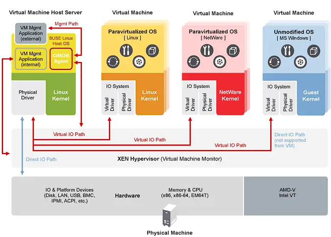

<h1><a name="readme-top"></a></h1>

[](https://github.com/marcossilvestrini/learning-lpic-3-305-300/actions/workflows/release.yml)[](https://github.com/marcossilvestrini/learning-lpic-3-305-300/actions/workflows/translate.yml)[](https://github.com/marcossilvestrini/learning-lpic-3-305-300/actions/workflows/jekyll-gh-pages.yml)[](https://github.com/marcossilvestrini/learning-lpic-3-305-300/actions/workflows/generate-html.yml)[](https://github.com/marcossilvestrini/learning-lpic-3-305-300/actions/workflows/powershell.yml)[](https://github.com/marcossilvestrini/learning-lpic-3-305-300/actions/workflows/slack.yml)

* * *

[![MIT License][license-shield]][license-url][![Forks][forks-shield]][forks-url][![Stargazers][stars-shield]][stars-url][![Contributors][contributors-shield]][contributors-url][![Issues][issues-shield]][issues-url][![LinkedIn][linkedin-shield]][linkedin-url]

* * *

# 學習LPIC-3 305-300


<p align="center">
<strong>Explore the docs »</strong></a>
    <br />
    <a href="https://marcossilvestrini.github.io/learning-lpic-3-305-300/">Web Site</a>
    -
    <a href="https://github.com/marcossilvestrini/learning-lpic-3-305-300">Code Page</a>
    -
    <a href="https://github.com/marcossilvestrini/learning-lpic-3-305-300/issues">Report Bug</a>
    -
    <a href="https://github.com/marcossilvestrini/learning-lpic-3-305-300/issues">Request Feature</a>
</p>

* * *

## 概括

<details>
  <summary><b>TABLE OF CONTENT</b></summary>
  <ol>
    <li>
      <a href="#about-the-project">About The Project</a>
    </li>
    <li>
      <a href="#getting-started">Getting Started</a>
      <ul>
        <li><a href="#prerequisites">Prerequisites</a></li>
        <li><a href="#installation">installation</a></li>
      </ul>
    </li>
    <li><a href="#usage">Usage</a></li>
    <li><a href="#roadmap">Roadmap</a></li>
    <li><a href="#freedoms">Four Essential Freedoms</a></li>
    <li>
      <a href="#topic-351">Topic 351: Full Virtualization</a>
      <ul>
        <li><a href="#topic-351.1">351.1 Virtualization Concepts and Theory </a></li>
        <li><a href="#topic-351.2">351.2 Xen</a></li>
        <li><a href="#topic-351.3">351.3 QEMU</a></li>
        <li><a href="#topic-351.4">351.4 Libvirt Virtual Machine</a></li>
        <li><a href="#topic-351.5">351.5 Virtual Machine Disk Image Management</a></li>
      </ul>
    </li>
    <li>
      <a href="#topic-352">Topic 352: Container Virtualization</a>
      <ul>
        <li><a href="#topic-352.1">352.1 Container Virtualization Concepts</a></li>
        <li><a href="#topic-352.2">352.2 LXC</a></li>
        <li><a href="#topic-352.3">352.3 Docker</a></li>
        <li><a href="#topic-352.4">352.4 Container Orchestration Platforms</a></li>
      </ul>
    </li>
    <li>
      <a href="#topic-353">Topic 353: VM Deployment and Provisioning</a>
      <ul>
        <li><a href="#topic-353.1">353.1 Cloud Management Tools</a></li>
        <li><a href="#topic-353.2">353.2 Packer</a></li>
        <li><a href="#topic-353.3">353.3 cloud-init</a></li>
        <li><a href="#topic-353.4">353.4 Vagrant</a></li>
      </ul>
    </li>
    <li><a href="#license">License</a></li>
    <li><a href="#contact">Contact</a></li>
    <li><a href="#acknowledgments">Acknowledgments</a></li>
  </ol>
</details><br>

* * *

<a name="about-the-project"></a>

## 關於項目

> 該項目旨在幫助學生或專業人員學習Gnulinux的主要概念
> 和免費軟件\\
> 一些Gnulinux分佈（例如Debian和RPM）將被覆蓋\\
> 某些軟件包的安裝和配置也將被覆蓋\\
> 通過這樣做，您可以為整個社區提供一個從您的變化中受益的機會。
> 訪問源代碼是此的先決條件。\\ \\
> 在本文中使用Vagrant進行UP機器並執行實驗室和練習內容。\\ \\
> 我已經在vagrant a vagrantfile中發布了必要的\\
> 為您上傳研究環境

* * *

<p align="right">(<a href="#readme-top">back to top</a>)</p>

<a name="getting-started"></a>

## 入門

要開始學習，請參見上面的文檔。

<a name="prerequisites"></a>

### 先決條件

-   [git](https://git-scm.com/book/en/v2/Getting-Started-Installing-Git)
-   [VMware工作站](https://blogs.vmware.com/workstation/2024/05/vmware-workstation-pro-now-available-free-for-personal-use.html)
-   [Vagrant VMware實用程序](https://developer.hashicorp.com/vagrant/install/vmware)
-   [流浪漢](https://developer.hashicorp.com/vagrant/install)

<a name="installation"></a>

### 安裝

克隆倉庫

```sh
git clone https://github.com/marcossilvestrini/learning-lpic-3-305-300.git
cd learning-lpic-3-305-300
```

自定義模板_vagrantfile-topic-xxx_。該文件包含實驗室的VMS配置。例子：

-   文件[VagrantFile-Topic-351](./vagrant/Vagrantfile-topic-351)
    -   vm.clone_directory =“ &lt;your_driver_letter>：\\<folder>\\&lt;to_machine>\\＃{vm_name} -instance-1
        示例：vm.clone_directory =“ e：\\伺服器\\VMware\\＃{vm_name} -instance-1
    -   vm.vmx[“孟加斯”"]= ""
    -   vm.vmx[“ numvcpus”"]= ""
    -   vm.vmx[“ cpuid"correspersocout”.]= ""

自定義文件中的網絡配置[配置/網絡](configs/network/).

* * *

<a name="usage"></a>

## 用法

使用此存儲庫來學習有關LPIC-3 305-300考試

### 上下

切換_vagrantfile-topic-xxx_模板並複制帶有名稱的新文件_Vagrantfile_

```sh
cd vagrant && vagrant up
cd vagrant && vagrant destroy -f
```

### 用於重新啟動VM

```sh
cd vagrant && vagrant reload
```

**重要的：**_如果您無流量重新啟動VM，則共享文件夾在引導後不安裝。_

### 使用Powershell上下

如果您使用Windows平台，我將為上下VM創建一個PowerShell腳本。

```powershell
vagrant/up.ps1
vagrant/destroy.ps1
```

### 基礎設施架構主題351


<p align="right">(<a href="#readme-top">back to top</a>)</p>

* * *

<a name="roadmap"></a>

## 路線圖

-   [x] 創建存儲庫
-   [x] 創建用於配置實驗室的腳本
-   [x] 創建有關主題351的示例
-   [ ] 創建有關主題352的示例
-   [ ] 創建有關主題353的示例
-   [ ] 上傳模擬ITEXAM

* * *

<a name="freedoms"></a>

## 四個基本自由

> 0.出於任何目的，按照您希望運行該程序的自由（自由0）。\\ \\
> 1.研究程序的工作方式並更改它的自由
> 您希望的計算（自由1）。\\
> 訪問源代碼是此的先決條件。\\ \\
> 2.重新分配副本的自由，以便您可以幫助他人（自由2）。
> 3\. freedom將修改後版本的副本分發給他人（Freedom 3）。

* * *

## 檢查命令

```sh
type COMMAND
apropos COMMAND
whatis COMMAND --long
whereis COMMAND
COMMAND --help, --h
man COMMAND
```

<p align="right">(<a href="#readme-top">back to top</a>)</p>

* * *

<a name="topic-351"></a>

## 主題351：完整的虛擬化


* * *

<a name="topic-351.1"></a>

### 351.1虛擬化概念和理論

**重量：**6

**描述：**候選人應該了解並理解虛擬化的一般概念，理論和術語。這包括Xen，Qemu和Libvirt術語。

**關鍵知識領域：**

-   了解虛擬化術語
-   了解虛擬化的利弊
-   了解虛擬機管理程序和虛擬機監視器的各種變化
-   了解將物理遷移到虛擬機的主要方面
-   了解主機系統之間遷移虛擬機的主要方面
-   了解虛擬機的虛擬化功能和含義，例如快照，暫停，克隆和資源限制
-   意識到卵形，proxmox，SystemD機加工和虛擬盒
-   意識開放vswitch

#### 351.1引用對象

```sh
Hypervisor
Hardware Virtual Machine (HVM)
Paravirtualization (PV)
Emulation and Simulation
CPU flags
/proc/cpuinfo
Migration (P2V, V2V)
```

#### 管理程序

##### 1型1型管理程序（裸金屬管理程序）

###### 類型1定義

直接在主機的物理硬件上運行，提供了一個基本層來管理VM，而無需主機操作系統。

###### 1型特徵

-   高性能和效率。
-   降低潛伏期和開銷。
-   通常用於企業環境和數據中心。

###### 類型1個示例

-   VMware ESXI：企業設置中的強大而廣泛使用的虛擬機管理程序。
-   Microsoft Hyper-V：與Windows Server集成，提供強大的性能和管理功能。
-   XEN：許多雲服務提供商使用的開源管理程序。
-   KVM（基於內核的虛擬機）：集成到Linux內核中，為基於Linux的系統提供了高性能。

##### 2型操縱褲（託管管理程序）

###### 類型2定義

Runs on top of a conventional operating system, relying on the host OS for resource management and device support.

###### 2型特徵

-   更容易設置和使用，尤其是在個人計算機上。
-   更靈活地進行開發，測試和較小規模的部署。
-   由於主機OS的額外開銷，通常比1型管理程序效率低。

###### 類型2個示例

-   VMware Workstation：一個強大的管理程序，用於在單個桌面上運行多個操作系統。
-   Oracle VirtualBox：以其靈活性和易用性而聞名的開源管理程序。
-   Parallels Desktop：供Mac用戶與MacOS一起運行Windows和其他操作系統。
-   QEMU（快速模擬器）：一種開源仿真器和虛擬化器，通常與KVM結合使用。

##### 1型和類型2型管理程序之間的關鍵差異

-   部署環境：
    -   類型1個虛擬機管理程序通常在數據中心和企業環境中部署，因為它們與硬件和高性能的直接互動。
    -   2型管理程序更適合個人使用，開發，測試和小規模的虛擬化任務。
-   表現：
    -   1型操作系統通常提供更好的性能和較低的延遲，因為它們不依賴主機操作系統。
    -   型2型管理程序可能會由於在主機OS上運行的開銷而遭受某些性能降解。
-   管理和易用性：
    -   類型1的管理程序需要更複雜的設置和管理，但為大規模部署提供了高級功能和可擴展性。
    -   類型2個虛擬機管理程序更易於安裝和使用，使其非常適合單個用戶和較小的項目。

##### 遷移類型

在用於創建和管理虛擬機的技術的情況下，P2V遷移和V2V遷移術語在虛擬化環境中很常見。  
他們指的是不同類型平台之間遷移系統的過程。

##### P2V-物理到虛擬遷移

P2V遷移是指將物理服務器遷移到虛擬機的過程。  
換句話說，在專用物理硬件上運行的操作系統及其應用程序被“轉換”，並移動到在管理程序上運行的虛擬機（例如VMware，Hyper-V，KVM等）。

-   示例：您擁有運行Windows或Linux系統的物理服務器，並且要將其移至虛擬環境，例如雲基礎架構或內部虛擬化服務器。  
    該過程涉及復制整個系統狀態，包括操作系統，驅動程序和數據，以創建同等的虛擬機，該機器可以像在物理硬件上一樣運行。

##### V2V-虛擬遷移

V2V遷移是指將虛擬機遷移到另一台虛擬機的過程。  
在這種情況下，您已經在虛擬化環境（例如VMware）中運行虛擬機，並且要將其移至另一個虛擬化環境（例如，到Hyper-V或新的VMware服務器）。

-   示例：您在VMware虛擬化服務器上​​運行了一台虛擬機，但是您決定將其遷移到Hyper-V平台。在這種情況下，V2V遷移將虛擬機從一種格式或管理程序轉換為另一種格式，以確保它可以繼續正確運行。

#### HVM和寄生蟲虛擬化

##### 硬件輔助虛擬化（HVM）

###### HVM定義

HVM利用現代CPU提供的硬件擴展名來虛擬化硬件，從而使VM的創建和管理具有最小的性能開銷。

###### HVM關鍵特徵

-   **硬件支持**：需要CPU支持虛擬化擴展，例如Intel VT-X或AMD-V。
-   **完整的虛擬化：**VM可以運行未修改的訪客操作系統，因為該管理程序提供了完整的硬件環境模仿。
-   **表現：**通常，由於CPU上直接執行訪客代碼，通常會提供近乎本地的性能。
-   **隔離:**由於每個VM都具有自己的專用硬件，因此提供了VM之間的強烈隔離。

###### HVM示例

VMware ESXI，Microsoft Hyper-V，KVM（基於內核的虛擬機）。

###### HVM優勢

-   **相容性:**可以在沒有修改的情況下運行任何操作系統。
-   **表現：**高性能由於硬件支持。
-   **安全：**硬件提供的增強隔離和安全功能。

###### HVM缺點

-   **硬件依賴性：**需要特定的硬件功能，從而限制與舊系統的兼容性。
-   **複雜：**可能涉及更複雜的配置和管理。

##### 寄生蟲虛擬化

###### paraviralization定義

paraviralization涉及修改來賓操作系統以了解虛擬環境，從而使其與管理程序更有效地交互。

###### 寄生蟲的關鍵特徵

-   **來賓修改：**需要更改來賓操作系統，以使用HyperCalls直接與管理程序進行通信。
-   **表現：**比傳統的完全虛擬化可以更有效，因為它減少了與模擬硬件相關的開銷。
-   **相容性:**僅限於已修改用於寄生蟲的操作系統。

###### paraviralization示例

Xen帶有paraviralizatization的來賓，某些配置中的VMware工具以及一些KVM配置。

###### 寄生蟲的優勢

-   **效率：**減少了虛擬化硬件的開銷，有可能為某些工作負載提供更好的性能。
-   **資源利用：**由於來賓操作系統和管理程序之間的直接通信，更有效地利用了系統資源。

###### 寄生蟲的缺點

-   **客座操作系統修改：**需要對來賓操作系統進行修改，從而將兼容性限制在支持的操作系統上。
-   **複雜：**需要在客座操作系統中進行超級呼叫實現的額外複雜性。

##### 關鍵差異

###### 訪客操作系統要求

-   **HVM：**可以運行未修改的客人操作系統。
-   **寄生蟲：**需要修改來賓操作系統以與管理程序一起使用。

###### 表現

-   **HVM：**通常由於硬件輔助執行而提供近乎本地的性能。
-   **寄生蟲：**可以通過減少硬件仿真的開銷來提供有效的性能，但依賴於修改後的訪客操作系統。

###### 硬件依賴性

-   **HVM：**需要特定的CPU功能（Intel VT-X，AMD-V）。
-   **寄生蟲：**不需要特定的CPU功能，而需要修改的訪客操作系統。

###### 隔離

-   **HVM：**使用硬件功能提供強大的隔離。
-   **寄生蟲：**依靠基於軟件的隔離，這可能不像基於硬件的隔離那樣強大。

###### 複雜

-   **HVM：** Generally more straightforward to deploy since it supports unmodified OS.
-   **寄生蟲：**需要對來賓操作系統進行其他設置和修改，從而提高複雜性。

#### numa（不一致的內存訪問）

NUMA（非統一內存訪問）是多處理器系統中使用的內存體系結構，可通過處理器優化內存訪問。  
在NUMA系統中，內存在處理器之間不均勻地分佈，這意味著每個處理器對內存的一部分（其“本地內存”）的訪問速度要比物理上更遠的內存（稱為“遠程存儲器”）和關聯的內存更快。與其他處理器。

##### NUMA體系結構的關鍵特徵

1.  **本地和遠程內存**：每個處理器都有自己的本地內存，它可以更快地訪問。但是，儘管需要更長的時間，但它也可以訪問其他處理器的內存。
2.  **區分潛伏期**：內存訪問的延遲取決於處理器是訪問其本地內存還是其他節點的內存。訪問另一個節點的內存（遠程）時，本地內存訪問更快。
3.  **可伸縮性**：NUMA架構旨在提高許多處理器系統的可擴展性。隨著添加更多處理器的添加，還會分發內存，避免在統一內存訪問（UMA）體系結構中發生的瓶頸。

##### NUMA的優勢

-   在大型系統中的性能更好：由於每個處理器都有本地內存，因此它可以更有效地工作，而無需與其他處理器競爭以獲得內存訪問。
-   可伸縮性：NUMA允許與UMA體系結構相比，具有許多處理器和大量內存的系統可以更有效地擴展。

##### 缺點

-   編程複雜性：程序員需要了解哪些內存區域是本地或遠程區域，以優化使用本地內存以實現更好的性能。
-   潛在的性能處罰：如果處理器經常訪問遙控內存，則由於延遲較高而可能會遭受性能。
    該體系結構在高性能多處理器系統（例如服務器和超級計算機）中很常見，在該系統中，可擴展性和內存優化至關重要。

#### OpenSource解決方案

-   ovirt：<https://www.ovirt.org/>

-   proxmox：<https://www.proxmox.com/en/proxmox-virtual-environment/overview>

-   Oracle VirtualBox：<https://www.virtualbox.org/>

-   開放vswitch：<https://www.openvswitch.org/>

#### 虛擬化類型

##### 硬件虛擬化（服務器虛擬化）

###### HV定義

摘要物理硬件以創建運行單獨的操作系統和應用程序的虛擬機（VM）。

###### HV用例

數據中心，雲計算，服務器整合。

###### HV示例

VMware ESXI，Microsoft Hyper-V，KVM。

##### 操作系統虛擬化（容器化）

###### 容器化定義

允許多個隔離的用戶空間實例（容器）在單個OS內核上運行。

###### 容器化用例

微服務體系結構，開發和測試環境。

###### 容器化示例

Docker，Kubernetes，LXC。

##### 網絡虛擬化

###### 網絡虛擬化定義

將硬件和軟件網絡資源結合到一個基於軟件的管理實體中。

###### 網絡虛擬化用例

軟件定義的網絡（SDN），網絡功能虛擬化（NFV）。

###### 網絡虛擬化示例

VMware NSX，Cisco ACI，OpenStack Neutron。

##### 存儲虛擬化

###### 存儲虛擬化定義

從多個設備將物理存儲池用於單個虛擬存儲單元，該單元可以在中心進行管理。

###### 存儲虛擬化定義用例

數據管理，存儲優化，災難恢復。

###### 存儲虛擬化定義示例

IBM SAN音量控制器，VMware VSAN，NetApp ontap。

##### 桌面虛擬化

###### 桌面虛擬化定義

允許桌面操作系統在託管服務器上託管的虛擬機上運行。

###### 桌面虛擬化定義用例

虛擬桌面基礎架構（VDI），遠程工作解決方案。

###### 桌面虛擬化定義示例

Citrix虛擬應用程序和台式機，VMware Horizo​​n，Microsoft遠程桌面服務。

##### 應用虛擬化

###### 應用虛擬化定義

將應用程序與基礎硬件和操作系統分開，使它們可以在孤立的環境中運行。

###### 應用虛擬化定義用例

簡化的應用程序部署，兼容性測試。

###### 應用虛擬化定義示例

VMware ThinApp，Microsoft App-V，Citrix Xenapp。

##### 數據虛擬化

###### 數據虛擬化定義

整合來自各種來源的數據而無需物理整合，提供了統一的觀點進行分析和報告。

###### 數據虛擬化定義用例

商業智能，實時數據集成。

###### 數據虛擬化定義示例

Denodo，Red Hat Jboss數據虛擬化，IBM Infosphere。

##### 虛擬化的好處

-   資源效率：更好地利用物理資源。
-   節省成本：降低硬件和運營成本。
-   可伸縮性：根據需求易於擴展或向下擴展。
-   靈活性：支持各種工作量和應用程序。
-   災難恢復：簡化的備份和恢復過程。
-   隔離：通過隔離環境改善了安全性。

<p align="right">(<a href="#topic-351.1">back to sub Topic 351.1</a>)</p>
<p align="right">(<a href="#topic-351">back to Topic 351</a>)</p>
<p align="right">(<a href="#readme-top">back to top</a>)</p>

* * *

<a name="topic-351.2"></a>

### 351.2交替




**重量：**3

**描述：**候選人應能夠安裝，配置，維護，遷移和故障排除XEN安裝。重點是Xen版本4.x。

**關鍵知識領域：**

-   了解XEN的體系結構，包括網絡和存儲
-   XEN節點和域的基本配置
-   XEN節點和域的基本管理
-   XEN安裝的基本故障排除
-   貪婪的藥丸
-   意識Xenstore
-   Xen引導參數的意識
-   意識到XM實用程序

#### 備用


XEN是一種開源類型1（裸機）管理程序，它允許多個操作系統在同一物理硬件上同時運行。  
Xen提供了物理硬件和虛擬機（VM）之間的一層，從而實現了有效的資源共享和隔離。

-   **建築學：**XEN使用域0（DOM0）是具有直接硬件訪問的特權域並管理管理程序的兩層系統。其他稱為域U（DOMU）的虛擬機，運行訪客操作系統，並由DOM0管理。
-   **虛擬化類型：**XEN支持需要修改的訪客操作系統和硬件輔助虛擬化（HVM）的Paravirtualization（PV），該虛擬化（HVM）使用硬件擴展（例如Intel VT-X或AMD-V）來運行未修改的來賓操作系統。
    XEN廣泛用於雲環境中，特別是由Amazon Web Services（AWS）和其他大型雲提供商使用。

#### Xensource

Xensource是由劍橋大學XEN管理程序的原始開發商創立的公司，以商業化Xen。  
該公司提供了基於Xen的企業解決方案，並提供了其他工具和支持，以增強Xen的企業使用能力。

-   **Citrix的收購**：2007年，Xensource被Citrix Systems，Inc。收購。Citrix使用Xen Technology作為其Citrix Xenserver產品的基礎，該產品成為基於Xen的流行企業級虛擬化平台。
-   **過渡**：收購後，Xen項目繼續作為開源項目，而Citrix則專注於Xenserver等商業產品，利用Xensource Technology。

#### Xen項目

XEN項目是指負責在其商業化後開發和維護XEN管理程序的開源社區和倡議。  
XEN項目在Linux基金會下運作，重點是建造，改進和支持Xen作為協作，社區驅動的努力。

-   **目標：**XEN項目旨在通過改善其性能，安全性和功能設置為廣泛的用例，包括雲計算，以安全性為中心的虛擬化（例如Qubes OS）和嵌入式系統來推動該管理程序。
-   **貢獻者：**該項目包括來自各種組織的貢獻者，包括主要的雲提供商，硬件供應商和獨立開發人員。
-   **藥丸和Hedools：**XEN項目還包括XAPI（XENAPI）等工具，該工具用於管理XEN管理程序安裝，以及用於系統管理和優化的其他各種實用程序。

#### Xenstore

Xen Store是Xen管理程序的關鍵組成部分。  
從本質上講，Xen Store是一個分佈式鍵值數據庫，用於在XEN管理程序和虛擬機（也稱為域）之間進行通信和信息共享。

這是Xen Store的一些關鍵方面：

-   **跨域交流：**XEN存儲啟用域之間的通信，例如DOM0（控制硬件資源的特權域）和DOMUS（用戶域，是VMS）。這是通過鍵值條目完成的，每個域都可以讀取或寫入信息。

-   **配置管理：**它用於存儲和訪問配置信息，例如虛擬設備，網絡和引導參數。這有助於VM的動態管理和配置。

-   **事件和通知：**Xen Store還支持事件通知。當修改XEN存儲中的特定鍵或值時，可以通知感興趣的域以對這些更改做出反應。這對於監視和管理資源很有用。

-   簡單的API：Xen Store提供了一個簡單的API，用於讀取和編寫數據，使開發人員可以輕鬆地將其應用程序與Xen虛擬化系統集成在一起。

#### 丸

XAPI或XENAPI是用於管理XEN機床機及其虛擬機（VMS）的應用程序編程接口（API）。  
XAPI是Xenserver（現稱為Citrix Hypervisor）的關鍵組成部分，並提供了一種與Xen Hypervisor交互的標準化方法，以執行諸如創建，配置，監視和控制VM的操作。

這是XAPI的一些重要方面：

-   **VM管理：**XAPI允許管理員通過編程性創建，刪除，啟動和停止虛擬機。

-   **自動化：**使用XAPI，可以自動化虛擬資源的管理，包括網絡，存儲和計算，這對於大雲環境至關重要。

-   **一體化：**XAPI可以與其他工具和腳本集成，以提供更有效和定制的XEN環境管理。

-   **訪問控制：**XAPI還提供訪問控制機制，以確保只有授權用戶才能在虛擬環境中執行特定操作。

XAPI是可以控制和自動化XEN虛擬機程序的接口，使管理虛擬化環境變得更容易。

#### Xen摘要

-   **間作：**核心管理程序技術使虛擬機能夠在物理硬件上運行。
-   **Xensource：**Xen商業化的公司後來被Citrix收購，導致Citrix Xenserver的發展。
-   **XEN項目：**在Linux基金會下繼續開發和維護XEN管理程序的開源計劃和社區。
-   **Xenstore：**XEN存儲充當XEN管理程序和VM之間的通信和配置中介，簡化了虛擬化環境的操作和管理。
-   **丸**是可以控制和自動化XEN虛擬機程序的接口，使管理虛擬化環境變得更加容易。

#### domain0（dom0）

domain0或dom0是XEN體系結構中的控制域。它管理其他域（Domus），並可以直接訪問硬件。  
DOM0運行設備驅動程序，允許缺乏直接硬件訪問的Domus與設備通信。通常，它是操作系統（例如Linux）的完整實例，對於XEN Hyprovisor操作至關重要。

#### 域（房屋）

Domus是運行虛擬機的非特權域。  
它們由DOM0管理，無法直接訪問硬件。 Domus可以配置為運行不同的操作系統，並用於各種目的，例如應用程序服務器和開發環境。他們依靠DOM0進行硬件交互。

#### peewee-dom（paravardiyed domina）

PV-Domus使用一種稱為paraviratualization的技術。在此模型中，對DOMU操作系統進行了修改，以意識到它在虛擬化的環境中運行，從而使其可以直接與操縱虛擬機直接通信以獲得優化的性能。  
與完全虛擬化相比，這會導致較低的開銷和提高效率。

#### HVM-DOMU（硬件虛擬機域）

HVM-Domus是使用完整虛擬化的虛擬機，允許未修改的操作系統運行。 XEN管理程序為這些圓頂提供了硬件仿真，使他們能夠運行任何支持基礎硬件體系結構的操作系統。  
儘管這具有更大的靈活性，但與PV-Domus相比，它可能導致更高的開銷。

#### XEN網絡

寄生網絡設備

橋接

#### 351.2引用的對象

```sh
Domain0 (Dom0), DomainU (DomU)
PV-DomU, HVM-DomU
/etc/xen/
xl
xl.cfg 
xl.conf # Xen global configurations
xentop
oxenstored # Xenstore configurations
```

#### 351.2註釋

```sh

# Xen Settings
/etc/xen/
/etc/xen/xl.conf - Main general configuration file for Xen
/etc/xen/oxenstored.conf - Xenstore configurations

# VM Configurations
/etc/xen/xlexample.pvlinux
/etc/xen/xlexample.hvm

# Service Configurations
/etc/default/xen
/etc/default/xendomains

# xen-tools configurations
/etc/xen-tools/
/usr/share/xen-tools/

# docs
xl(1)
xl.conf(5)
xlcpupool.cfg(5)
xl-disk-configuration(5)
xl-network-configuration(5)
xen-tscmode(7)

# initialized domains auto
/etc/default/xendomains
   XENDOMAINS_AUTO=/etc/xen/auto

/etc/xen/auto/


# set domain for up after xen reboot
## create folder auto
cd /etc/xen && mkdir -p auto && cd auto

# create simbolic link
ln -s /etc/xen/lpic3-pv-guest /etc/xen/auto/lpic3-pv-guest
```

#### 351.2重要命令

##### Xen-Create-image

```sh
# create a pv image
xen-create-image \
  --hostname=lpic3-pv-guest \
  --memory=1gb \
  --vcpus=2 \
  --lvm=vg_xen \
  --bridge=xenbr0 \
  --dhcp \
  --pygrub \
  --password=vagrant \
  --dist=bookworm
```

##### Xen-list-images

```sh
# list image
xen-list-image
```

##### Xen-Delete-image

```sh
# delete a pv image
xen-delete-image lpic3-pv-guest --lvm=vg_xen
```

##### Xenstore-LS

```sh
# list xenstore infos
xenstore-ls
```

##### brctl

```sh
# list xen interfaces
brctl show
```

##### XL

```sh
# view xen information
xl infos

# list Domains
xl list
xl list lpic3-hvm-guest
xl list lpic3-hvm-guest -l

# uptime Domains
xl uptime

# pause Domain
xl pause 2
xl pause lpic3-hvm-guest

# save state Domains
xl -v save lpic3-hvm-guest ~root/image-lpic3-hvm-guest.save

# restore Domain
xl restore /root/image-lpic3-hvm-guest.save

# get Domain name
xl domname 2

# view dmesg information
xl dmesg

# monitoring domain
xl top
xentop
xen top

# Limit mem Dom0
xl mem-set 0 2048

# Limite cpu (not permanent after boot)
xl vcpu-set 0 2

# create DomainU - virtual machine
xl create /etc/xen/lpic3-pv-guest.cfg

# create DomainU virtual machine and connect to guest
xl create -c /etc/xen/lpic3-pv-guest.cfg


##----------------------------------------------
# create DomainU virtual machine HVM

## create logical volume
lvcreate -l +20%FREE -n lpic3-hvm-guest-disk  vg_xen

## create a ssh tunel for vnc
ssh -l vagrant -L 5900:localhost:5900  192.168.0.130

## configure /etc/xen/lpic3-hvm-guest.cfg
## set boot for cdrom: boot = "d"

## create domain hvm
xl create /etc/xen/lpic3-hvm-guest.cfg

## open vcn conection in your vnc client with localhost
## for view install details

## after installation finished, destroy domain: xl destroy <id_or_name>

## set /etc/xen/lpic3-hvm-guest.cfg: boot for hard disc: boot = "c"

## create domain hvm
xl create /etc/xen/lpic3-hvm-guest.cfg

## access domain hvm
xl console <id_or_name>
##----------------------------------------------

# connect in domain guest
xl console <id>|<name> (press enter)
xl console 1
xl console lpic3-pv-guest

#How do I exit domU "xl console" session
#Press ctrl+] or if you're using Putty press ctrl+5.

# Poweroff domain
xl shutdown lpic3-pv-guest

# destroy domain
xl destroy lpic3-pv-guest

# reboot domain
xl reboot lpic3-pv-guest

# list block devices
xl block-list 1
xl block-list lpic3-pv-guest

# detach block devices
xl block-detach lpic3-hvm-guest hdc

# attach block devices
xl block-attach lpic3-hvm-guest hdc

```

<p align="right">(<a href="#topic-351.2">back to sub Topic 351.2</a>)</p>
<p align="right">(<a href="#topic-351">back to Topic 351</a>)</p>
<p align="right">(<a href="#readme-top">back to top</a>)</p>

* * *

<a name="topic-351.3"></a>

### 351.3 Qemu

**重量：**4

**描述：**候選人應能夠安裝，配置，維護，遷移和故障排除QEMU安裝。

**Key Knowledge Areas:**

-   了解QEMU的體系結構，包括KVM，網絡和存儲
-   從命令行啟動QEMU實例
-   使用QEMU監視器管理快照
-   安裝QEMU訪客代理和Virtio設備驅動程序
-   對QEMU安裝進行故障排除，包括網絡和存儲
-   意識重要的QEMU配置參數

#### 351.3引用對象

```sh
Kernel modules: kvm, kvm-intel and kvm-amd
/dev/kvm
QEMU monitor
qemu
qemu-system-x86_64
ip
brctl
tunctl
```

#### 351.3重要命令

##### IP

```sh
# list links
ip link show
```

<p align="right">(<a href="#topic-351.3">back to sub Topic 351.3</a>)</p>
<p align="right">(<a href="#topic-351">back to Topic 351</a>)</p>
<p align="right">(<a href="#readme-top">back to top</a>)</p>

* * *

<a name="topic-351.4"></a>

### 351.4 libvirt虛擬機管理

**重量：**9

**描述：**候選人應能夠使用Libvirt和相關工具來管理虛擬化主機和虛擬機（“ Libvirt域”）。

**關鍵知識領域：**

-   了解libvirt的建築
-   管理libvirt連接和節點
-   創建和管理QEMU和XEN域，包括快照
-   管理和分析域的資源消耗
-   創建和管理存儲池和卷
-   創建和管理虛擬網絡
-   節點之間的遷移域
-   了解Libvirt如何與Xen和Qemu互動
-   了解Libvirt如何與DNSMASQ和RADVD等網絡服務互動
-   了解libvirt xml配置文件
-   意識對virtlogd和virtlockd

#### 351.4引用對象

```sh
libvirtd
/etc/libvirt/
virsh (including relevant subcommands)
```

#### 351.4重要命令

##### foo

```sh
foo
```

<p align="right">(<a href="#topic-351.4">back to sub Topic 351.4</a>)</p>
<p align="right">(<a href="#topic-351">back to Topic 351</a>)</p>
<p align="right">(<a href="#readme-top">back to top</a>)</p>

* * *

<a name="topic-351.5"></a>

### 351.5虛擬機磁盤圖像管理

**重量：**3

**描述：**候選人應該能夠管理虛擬機磁盤圖像。這包括在各種格式和虛擬機中轉換磁盤圖像，以及訪問圖像中存儲的數據。

**關鍵知識領域：**

-   了解各種虛擬磁盤圖像格式的功能，例如RAW Images，QCOW2和VMDK
-   使用QEMU-IMG管理虛擬機磁盤圖像
-   使用libguestfish在虛擬機磁盤圖像中包含的安裝分區和訪問文件
-   將物理磁盤內容複製到虛擬機磁盤圖像
-   在各種虛擬機磁盤圖像格式之間遷移磁盤內容
-   意識開放虛擬化格式（OVF）

#### 351.5引用的對象

```sh
qemu-img
guestfish (including relevant subcommands)
guestmount
guestumount
virt-cat
virt-copy-in
virt-copy-out
virt-diff
virt-inspector
virt-filesystems
virt-rescue
virt-df
virt-resize
virt-sparsify
virt-p2v
virt-p2v-make-disk
virt-v2v
virt-sysprep
```

#### 351.5重要命令

##### foo

```sh
foo
```

<p align="right">(<a href="#topic-351.5">back to sub Topic 351.5</a>)</p>
<p align="right">(<a href="#topic-351">back to Topic 351</a>)</p>
<p align="right">(<a href="#readme-top">back to top</a>)</p>

* * *

<a name="topic-352"></a>

## 主題352：容器虛擬化

* * *

<a name="topic-352.1"></a>

### 352.1容器虛擬化概念

**重量：**7

**描述：**候選人應了解容器虛擬化的概念。這包括了解用於實現容器虛擬化的Linux組件以及使用標準Linux工具對這些組件進行故障排除。

**關鍵知識領域：**

-   了解系統和應用程序容器的概念
-   Understand and analyze kernel namespaces
-   了解和分析對照組
-   了解和分析功能
-   了解seccomp，selinux和apparmor在容器虛擬化中的作用
-   了解LXC和Docker如何利用名稱空間，CGROUP，功能，Seccomp和Mac
-   了解Runc的原理
-   了解CRI-O和Contarerd的原理
-   意識到OCI運行時和圖像規格
-   對Kubernetes容器運行時接口（CRI）的意識
-   意識到Podman，Buildah和Scopeo
-   在Linux和其他免費操作系統（例如RKT，OpenVZ，SystemD-Nspawn或BSD監獄）中了解其他容器虛擬化方法的認識


#### 352.1引用對象

```sh
nsenter
unshare
ip (including relevant subcommands)
capsh
/sys/fs/cgroups
/proc/[0-9]+/ns
/proc/[0-9]+/status
```

#### 352.1重要命令

##### foo

```sh
foo
```

<p align="right">(<a href="#topic-352.1">back to sub topic 352.1</a>)</p>
<p align="right">(<a href="#topic-352">back to topic 352</a>)</p>
<p align="right">(<a href="#readme-top">back to top</a>)</p>

* * *

<a name="topic-352.2"></a>

### 352.2 LXC

**重量：**6

**描述：**候選人應能夠使用LXC和LXD使用系統容器。覆蓋的LXC的版本為3.0或更高。

**關鍵知識領域：**

-   了解LXC和LXD的結構
-   基於現有圖像使用LXD管理LXC容器，包括網絡和存儲
-   配置LXC容器屬性
-   限制LXC容器資源使用
-   使用LXD配置文件
-   了解LXC圖像
-   對傳統LXC工具的意識

#### 352.2引用的對象

```sh
lxd
lxc (including relevant subcommands)
```

#### 352.2重要命令

##### foo

```sh
foo
```

<p align="right">(<a href="#topic-352.2">back to sub topic 352.2</a>)</p>
<p align="right">(<a href="#topic-352">back to topic 352</a>)</p>
<p align="right">(<a href="#readme-top">back to top</a>)</p>

* * *

<a name="topic-352.3"></a>

### 352.3 Docker

**重量：**9

**描述：**候選人應該能夠管理Docker節點和Docker容器。這包括了解Docker的體系結構，並了解Docker如何與Node的Linux系統互動。

**關鍵知識領域：**

-   了解Docker的架構和組件
-   通過使用來自Docker註冊表的圖像來管理Docker容器
-   了解和管理Docker容器的圖像和卷
-   了解和管理Docker容器的日誌記錄
-   了解和管理Docker的網絡
-   使用Dockerfiles創建容器圖像
-   Run a Docker registry using the registry Docker image

#### 352.3引用對象

```sh
dockerd
/etc/docker/daemon.json
/var/lib/docker/
docker
Dockerfile
```

#### 352.3重要命令

##### Docker

```sh
# Examples of docker
```

<p align="right">(<a href="#topic-352.3">back to sub topic 352.3</a>)</p>
<p align="right">(<a href="#topic-352">back to topic 352</a>)</p>
<p align="right">(<a href="#readme-top">back to top</a>)</p>

* * *

<a name="topic-352.4"></a>

### 352.4集裝箱編排平台

**重量：**3

**描述：**候選人應該了解容器編排的重要性，以及Docker Swarm和Kubernetes提供的關鍵概念為實施集裝箱編排提供的重要性。

**關鍵知識領域：**

-   了解集裝箱編排的相關性
-   了解Docker組成和Docker群的關鍵概念
-   了解Kubernetes和Helm的關鍵概念
-   意識到Openshift，Rancher和Mesophere DC/OS

<p align="right">(<a href="#topic-352.4">back to sub topic 352.4</a>)</p>
<p align="right">(<a href="#topic-352">back to topic 352</a>)</p>
<p align="right">(<a href="#readme-top">back to top</a>)</p>

* * *

<a name="topic-353"></a>

## 主題353：VM部署和供應

* * *

<a name="topic-353.1"></a>

### 353.1雲管理工具

**重量：**2

**描述：**候選人應了解公共雲中的共同產品，並具有常見雲管理工具的基本功能知識。

**關鍵知識領域：**

-   了解公共雲中的共同產品
-   OpenStack的基本功能知識
-   Terraform的基本特徵知識
-   意識到Cloudstack，Eucalyptus和Opennebula

#### 353.1引用對象

```sh
IaaS, PaaS, SaaS
OpenStack
Terraform
```

#### 353.1重要命令

##### foo

```sh
# examples
```

<p align="right">(<a href="#topic-353.1">back to sub topic 353.1</a>)</p>
<p align="right">(<a href="#topic-353">back to topic 353</a>)</p>
<p align="right">(<a href="#readme-top">back to top</a>)</p>

* * *

<a name="topic-353.2"></a>

### 353.2包裝工

**重量：**2

**描述：**候選人應該能夠使用Packer創建系統圖像。這包括在各種公共和私有云環境中運行的包裝器，以及為LXC/LXD構建容器圖像。

**關鍵知識領域：**

-   了解包裝工的功能和功能
-   創建和維護模板文件
-   使用不同的構建器從模板文件構建圖像

#### 353.2引用的對象

```sh
packer
```

#### 353.2重要命令

##### 包裝工

```sh
# examples
```

<p align="right">(<a href="#topic-353.2">back to sub topic 353.2</a>)</p>
<p align="right">(<a href="#topic 353">back to topic 353</a>)</p>
<p align="right">(<a href="#readme-top">back to top</a>)</p>

* * *

<a name="topic-353.3"></a>

### 353.3雲

**重量：**3

**描述：**候選人應能夠使用雲機構來配置從標準化圖像創建的虛擬機。這包括調整虛擬機以匹配其可用硬件資源，特別是磁盤空間和卷。  
此外，候選人應該能夠配置實例以允許安全的SSH登錄並安裝一組特定的軟件包。  
此外，候選人應該能夠創建新的系統圖像，並提供雲基機的支持。

**關鍵知識領域：**

-   了解雲內部的功能和概念，包括用戶數據，初始化和配置雲機構
-   使用Cloud-Init來創建，調整和安裝文件系統，配置用戶帳戶，包括登錄憑據，例如SSH鍵和從發行版的存儲庫中安裝軟件包
-   將雲機構整合到系統圖像中
-   使用Config Drive DataSource進行測試

#### 353.3引用的對象

```sh
cloud-init
user-data
/var/lib/cloud/
```

#### 353.3重要命令

##### foo

```sh
# examples
```

<p align="right">(<a href="#topic-353.3">back to sub topic 353.3</a>)</p>
<p align="right">(<a href="#topic 353">back to topic 353</a>)</p>
<p align="right">(<a href="#readme-top">back to top</a>)</p>

* * *

<a name="topic-353.4"></a>

### 353.4 Vagrant

**重量：**3

**描述：**候選人應該能夠使用Vagrant來管理虛擬機，包括配置虛擬機。

**關鍵知識領域：**

-   了解流浪結構和概念，包括存儲和網絡
-   檢索並使用Atlas的盒子
-   創建並運行VagrantFiles
-   訪問Vagrant虛擬機
-   共享並同步流量虛擬機和主機系統
-   了解流量供應，即文件和外殼供應商
-   了解多機器設置

#### 353.4引用的對象

```sh
vagrant
Vagrantfile
```

#### 353.4重要命令

##### 流浪漢

```sh
# examples
```

<p align="right">(<a href="#topic-353.4">back to sub topic 353.4</a>)</p>
<p align="right">(<a href="#topic 353">back to topic 353</a>)</p>
<p align="right">(<a href="#readme-top">back to top</a>)</p>

* * *

## 貢獻

貢獻是使開源社區成為如此驚人的地方
學習，啟發和創造。您所做的任何貢獻是**非常感謝**.

如果您有建議可以使情況變得更好的建議，請分配回購和
創建拉動請求。您也可以簡單地使用標籤“增強”打開問題。
別忘了給項目一個明星！再次感謝！

1.  分叉項目
2.  創建您的功能分支（`git checkout -b feature/AmazingFeature`)
3.  提交您的更改（`git commit -m 'Add some AmazingFeature'`)
4.  推到分支（`git push origin feature/AmazingFeature`)
5.  打開拉請請求

* * *

## 執照

-   此項目已根據麻省理工學院許可證 \*請參閱許可證。

* * *

## 接觸

Marcos Silvestrini-[marcos.silvestrini@gmail.com](mailto:marcos.silvestrini@gmail.com)\\[](https://twitter.com/mrsilvestrini)

項目鏈接：<https://github.com/marcossilvestrini/learning-lpic-3-305-300>

<p align="right">(<a href="#readme-top">back to top</a>)</p>

* * *

## 致謝

-   [理查德·史塔爾曼（Richard Stallman）](http://www.stallman.org/)
-   [gnu](<>)
    -   [Richard Stallman的GNU/Linux常見問題解答](https://www.gnu.org/gnu/gnu-linux-faq.html)
    -   [gnu](https://www.gnu.org/)
    -   [GNU操作系統](https://www.gnu.org/gnu/thegnuproject.html)
    -   [海灣合作委員會編譯器](https://gcc.gnu.org/wiki/History)
    -   [gnu tar](https://www.gnu.org/software/tar/)
    -   [GNU製作](https://www.gnu.org/software/make/)
    -   [gnu emacs](https://en.wikipedia.org/wiki/Emacs)
    -   [GNU軟件包](https://www.gnu.org/software/)
    -   [GNU/Linux收藏](https://directory.fsf.org/wiki/Collection:GNU/Linux)
    -   [GNU grub引導加載程序](https://www.gnu.org/software/grub/)
    -   [GNU Hurd](https://www.gnu.org/software/hurd/hurd/what_is_the_gnu_hurd.html)
-   [核心](<>)
    -   [核心](https://www.kernel.org/)
    -   [Linux內核人頁](https://www.kernel.org/doc/man-pages/)
    -   [編譯您的內核](https://wiki.linuxquestions.org/wiki/How_to_build_and_install_your_own_Linux_kernel)
-   [Linux標準基礎](<>)
    -   [Linux標準基礎](https://en.wikipedia.org/wiki/Linux_Standard_Base)
    -   [文件系統層次結構標準](https://en.wikipedia.org/wiki/Filesystem_Hierarchy_Standard)
    -   [文件層次結構](https://refspecs.linuxfoundation.org/FHS_3.0/fhs-3.0.pdf)
-   [免費軟件](<>)
    -   [FSF](https://www.fsf.org)
    -   [免費軟件目錄](https://directory.fsf.org/wiki/Free_Software_Directory:Free_software_replacements)
-   [執照](<>)
    -   [免費軟件](https://www.gnu.org/philosophy/free-sw.html)
    -   [copyleft](https://www.gnu.org/licenses/copyleft.en.html)
    -   [GPL](https://www.gnu.org/licenses/quick-guide-gplv3.html)
    -   [GNU較少的通用公共許可證](https://www.gnu.org/licenses/lgpl-3.0.html)
    -   [BSD](https://opensource.org/licenses/BSD-3-Clause)
    -   [開源計劃](https://opensource.org/)
    -   [創意共享](https://creativecommons.org/)
    -   [許可證有限公司](https://en.wikipedia.org/wiki/Long-term_support)
-   [發行版](<>)
    -   [Debian免費軟件指南](https://www.debian.org/social_contract#guidelines)
    -   [列表Linux分佈](https://en.wikipedia.org/wiki/List_of_Linux_distributions)
    -   [Distrowatch](https://distrowatch.com/)
    -   [比較Linux分佈](https://en.wikipedia.org/wiki/Comparison_of_Linux_distributions)
-   [桌面環境](<>)
    -   [x11 org](https://www.x.org/wiki/)
    -   [韋蘭](https://wayland.freedesktop.org/)
    -   [gnu gnome](https://www.gnu.org/press/gnome-1.0.html)
    -   [侏儒](https://www.gnome.org/)
    -   [XFCE](https://xfce.org/)
    -   [在哪裡等離子體](https://kde.org/plasma-desktop/)
    -   [和諧](https://en.wikipedia.org/wiki/Harmony_(toolkit))
-   [協定](<>)
    -   [http](<>)
        -   [W3Techs](https://w3techs.com/)
        -   [apache](https://www.apache.org/)
        -   [Apache指令][def]
        -   [HTTP狀態代碼](https://en.wikipedia.org/wiki/List_of_HTTP_status_codes)
        -   [Apache，Nginx和LightTPD的強密碼](https://cipherlist.eu/)
        -   [SSL教程](https://www.golinuxcloud.com/blog/)
        -   [SSL配置Mozilla](https://ssl-config.mozilla.org/)
    -   [XRDP](https://bytexd.com/xrdp-centos/)
    -   [NTP](https://www.ntppool.org/en/)
-   [DNS](<>)
    -   [綁定](https://www.isc.org/bind/)
    -   [綁定日誌記錄](https://www.zytrax.com/books/dns/ch7/logging.html)
    -   [DNS記錄類型列表](https://en.wikipedia.org/wiki/List_of_DNS_record_types)
    -   [DNS記錄類型列表](https://en.wikipedia.org/wiki/List_of_DNS_record_types)
-   [軟件包管理器](<>)
    -   [下載軟件包](https://pkgs.org/)
    -   [安裝軟件包](https://installati.one/)
    -   [指南安裝軟件包](https://installati.one/)
-   [外殼腳本](<>)
    -   [伯恩再次殼](https://www.gnu.org/software/bash/manual/)
    -   [希邦](https://bash.cyberciti.biz/guide/Shebang)
    -   [環境變量](https://linuxize.com/post/how-to-set-and-list-environment-variables-in-linux/)
    -   [GNU球](https://man7.org/linux/man-pages/man7/glob.7.html)
    -   [球](https://linuxhint.com/bash_globbing_tutorial/)
    -   [引用](https://www.gnu.org/software/bash/manual/html_node/Quoting.html)
    -   [正則表達式](https://www.gnu.org/software/grep/manual/html_node/Regular-Expressions.html)
    -   [找不到命令](https://command-not-found.com/)
    -   [bash提示生成器](https://bash-prompt-generator.org/)
    -   [解釋殼](https://explainshell.com/)
    -   [VIM教程](https://www.openvim.com/)
    -   [Linux殼腳本教程](https://bash.cyberciti.biz/guide/Main_Page)
    -   [命令示例](https://www.geeksforgeeks.org/)
-   [其他工具](<>)
    -   [Bugzila](https://bugzilla.kernel.org/)
    -   [Github徽章](https://github.com/alexandresanlim/Badges4-README.md-Profile)
-   [虛擬化定義](<>)
    -   [紅帽](https://www.redhat.com/pt-br/topics/virtualization/what-is-virtualization)
    -   [AWS](https://aws.amazon.com/pt/what-is/virtualization/)
    -   [IBM](https://www.ibm.com/topics/virtualization)
    -   [OpenSource.com](https://opensource.com/resources/virtualization)
-   [KVM](<>)
    -   [KVM（內核虛擬機）](https://www.redhat.com/pt-br/topics/virtualization/what-is-KVM)
    -   [KVM管理工具](https://www.linux-kvm.org/page/Management_Tools)
-   [備用](<>)
    -   [Xenserver](https://www.xenserver.com/)
    -   [Wiki Xenproject](https://wiki.xenproject.org/wiki/Main_Page)
    -   [網絡接口](https://wiki.xenproject.org/wiki/Xen_Networking#Virtual_Network_Interfaces)
    -   [XEN工具](https://xen-tools.org/software/)
    -   [LPI博客：XEN虛擬化和雲計算＃01：簡介](https://www.lpi.org/pt-br/blog/2020/10/01/xen-virtualization-and-cloud-computing-01-introduction/)
    -   [LPI博客：Xen虛擬化和雲計算＃02：XEN如何完成工作](https://www.lpi.org/blog/2020/10/08/xen-virtualization-and-cloud-computing-02-how-xen-does-job/)
    -   [LPI博客：XEN虛擬化和雲計算＃04：容器，OpenStack和其他相關平台](https://www.lpi.org/pt-br/blog/2020/10/22/xen-virtualization-and-cloud-computing-04-containers-openstack-and-other-related/)
    -   [XEN虛擬化和雲計算＃05：XEN項目，Unikernels和Future](https://www.lpi.org/pt-br/blog/2020/10/29/xen-virtualization-and-cloud-computing-05-xen-project-unikernels-and-future/)
    -   [XEN項目初學者指南](https://wiki.xenproject.org/wiki/Xen_Project_Beginners_Guide#Installing_the_Xen_Project_Software)
    -   [瘋狂的書](https://wiki.xenproject.org/wiki/Book/HelloXenProject/0-Contents)
-   [UNICERNEL](https://www.lpi.org/blog/2020/10/29/xen-virtualization-and-cloud-computing-05-xen-project-unikernels-and-future/)
    -   [獨特的力量](https://github.com/unikraft/unikraft)
    -   [Mirageos](https://mirage.io/docs/hello-world)
    -   [壞的](https://galois.com/project/halvm/)
    -   [獨特的](https://github.com/solo-io/unik/blob/master/docs/providers/virtualbox.md)
-   [OpenStack文檔](<>)
    -   [redhat](https://www.redhat.com/pt-br/topics/openstack)
-   [開放的VSWITCH](<>)
    -   [OVS Doc 4linux](https://blog.4linux.com.br/open-vswitch-o-que-e-o-que-come-onde-vive)
-   [LPIC-3 305-300考試](<>)
    -   [LPIC-3 305-300目標](https://www.lpi.org/our-certifications/exam-305-objectives/)
    -   [LPIC-3 305-300 Wiki](https://wiki.lpi.org/wiki/LPIC-305_Objectives_V3.0)
    -   [LPIC-3 305-300學習材料](https://cursos.linuxsemfronteiras.com.br/courses/preparatorio-para-certificacao-lpic-3-305/)
    -   [LPIC-3 305-300 ITEXAMS模擬考試](https://www.itexams.com/info/305-300)

<p align="right">(<a href="#readme-top">back to top</a>)</p>

* * *

<!-- MARKDOWN LINKS & IMAGES-->

<!-- https://www.markdownguide.org/basic-syntax/#reference-style-links -->

[contributors-shield]: https://img.shields.io/github/contributors/marcossilvestrini/learning-lpic-3-305-300.svg?style=for-the-badge

[contributors-url]: https://github.com/marcossilvestrini/learning-lpic-3-305-300/graphs/contributors

[forks-shield]: https://img.shields.io/github/forks/marcossilvestrini/learning-lpic-3-305-300.svg?style=for-the-badge

[forks-url]: https://github.com/marcossilvestrini/learning-lpic-3-305-300/network/members

[stars-shield]: https://img.shields.io/github/stars/marcossilvestrini/learning-lpic-3-305-300.svg?style=for-the-badge

[stars-url]: https://github.com/marcossilvestrini/learning-lpic-3-305-300/stargazers

[issues-shield]: https://img.shields.io/github/issues/marcossilvestrini/learning-lpic-3-305-300.svg?style=for-the-badge

[issues-url]: https://github.com/marcossilvestrini/learning-lpic-3-305-300/issues

[license-shield]: https://img.shields.io/github/license/marcossilvestrini/learning-lpic-3-305-300.svg?style=for-the-badge

[license-url]: https://github.com/marcossilvestrini/learning-lpic-3-305-300/blob/master/LICENSE

[linkedin-shield]: https://img.shields.io/badge/-LinkedIn-black.svg?style=for-the-badge&logo=linkedin&colorB=555

[linkedin-url]: https://linkedin.com/in/marcossilvestrini

[def]: https://httpd.apache.org/docs/2.4/mod/directives.html
