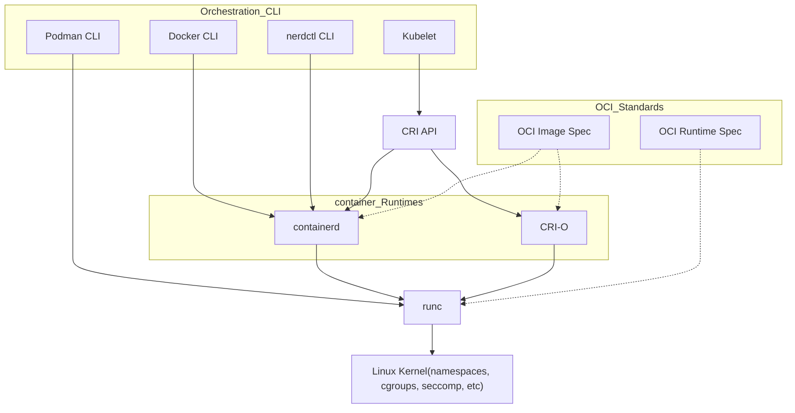

<h1><a name="readme-top"></a></h1>

[](https://github.com/marcossilvestrini/learning-lpic-3-305-300/actions/workflows/release.yml)[](https://github.com/marcossilvestrini/learning-lpic-3-305-300/actions/workflows/translate.yml)[](https://github.com/marcossilvestrini/learning-lpic-3-305-300/actions/workflows/generate-html.yml)[](https://github.com/marcossilvestrini/learning-lpic-3-305-300/actions/workflows/deploy-webpage.yml)[](https://github.com/marcossilvestrini/learning-lpic-3-305-300/actions/workflows/generate-docs.yml)[](https://github.com/marcossilvestrini/learning-lpic-3-305-300/actions/workflows/powershell.yml)[](https://github.com/marcossilvestrini/learning-lpic-3-305-300/actions/workflows/slack.yml)

* * *

[Minha licença][license-url][Garfos][forks-url][Observadores das estrelas][stars-url][Colaboradores][contributors-url][Problemas][issues-url]

## [LinkedIn][linkedin-url]

# 📚 APRENDIZAGEM LPIC-3 305-300

[](./README.md)[](README_pt.md)


<p align="center">
<strong>Explore the docs »</strong></a>
    <br />
    <a href="https://marcossilvestrini.github.io/learning-lpic-3-305-300/">Web Site</a>
    -
    <a href="https://github.com/marcossilvestrini/learning-lpic-3-305-300">Code Page</a>
    -
    <a href="https://skynet-8.gitbook.io/learning-lpic-3-305-300">Gitbook</a>
    -
    <a href="https://github.com/marcossilvestrini/learning-lpic-3-305-300/issues">Report Bug</a>
    -
    <a href="https://github.com/marcossilvestrini/learning-lpic-3-305-300/issues">Request Feature</a>
</p>

* * *

## 🗂️ Resumo

<details>
  <summary><b>TABLE OF CONTENT</b></summary>
  <ol>
    <li>
      <a href="#about-the-project">About The Project</a>
    </li>
    <li>
      <a href="#getting-started">Getting Started</a>
      <ul>
        <li><a href="#prerequisites">Prerequisites</a></li>
        <li><a href="#installation">installation</a></li>
      </ul>
    </li>
    <li><a href="#usage">Usage</a></li>
    <li><a href="#roadmap">Roadmap</a></li>
    <li><a href="#freedoms">Four Essential Freedoms</a></li>
    <li>
      <a href="#topic-351">Topic 351: Full Virtualization</a>
      <ul>
        <li><a href="#topic-351.1">351.1 Virtualization Concepts and Theory </a></li>
        <li><a href="#topic-351.2">351.2 Xen</a></li>
        <li><a href="#topic-351.3">351.3 QEMU</a></li>
        <li><a href="#topic-351.4">351.4 Libvirt Virtual Machine</a></li>
        <li><a href="#topic-351.5">351.5 Virtual Machine Disk Image Management</a></li>
      </ul>
    </li>
    <li>
      <a href="#topic-352">Topic 352: container Virtualization</a>
      <ul>
        <li><a href="#topic-352.1">352.1 container Virtualization Concepts</a></li>
        <li><a href="#topic-352.2">352.2 LXC</a></li>
        <li><a href="#topic-352.3">352.3 Docker</a></li>
        <li><a href="#topic-352.4">352.4 container Orchestration Platforms</a></li>
      </ul>
    </li>
    <li>
      <a href="#topic-353">Topic 353: VM Deployment and Provisioning</a>
      <ul>
        <li><a href="#topic-353.1">353.1 Cloud Management Tools</a></li>
        <li><a href="#topic-353.2">353.2 Packer</a></li>
        <li><a href="#topic-353.3">353.3 cloud-init</a></li>
        <li><a href="#topic-353.4">353.4 Vagrant</a></li>
      </ul>
    </li>
    <li><a href="#license">License</a></li>
    <li><a href="#contact">Contact</a></li>
    <li><a href="#acknowledgments">Acknowledgments</a></li>
  </ol>
</details><br>

* * *

<a name="about-the-project"></a>

## 📖 Sobre o Projeto

> Este projeto visa ajudar estudantes ou profissionais a aprender os principais conceitos do GNULinux
> e software livre
> Algumas distribuições GNULinux como Debian e RPM serão abordadas
> A instalação e configuração de alguns pacotes também serão abordadas
> Ao fazer isso, você pode dar a toda a comunidade a chance de se beneficiar de suas mudanças.
> O acesso ao código-fonte é uma pré-condição para isso.
> Use o vagrant para atualizar máquinas e executar laboratórios e praticar o conteúdo deste artigo.
> Publiquei na pasta Vagrant um Vagrantfile com o que é necessário
> para você subir um ambiente para estudos

* * *

<p align="right">(<a href="#readme-top">back to top</a>)</p>

<a name="getting-started"></a>

## 🚀 Primeiros passos

Para iniciar o aprendizado, consulte a documentação acima.

<a name="prerequisites"></a>

### 🛠️ Pré-requisitos

-   [Git](https://git-scm.com/book/en/v2/Getting-Started-Installing-Git)
-   [Estação de trabalho VMware](https://blogs.vmware.com/workstation/2024/05/vmware-workstation-pro-now-available-free-for-personal-use.html)
-   [Utilitário Vagrant VMWare](https://developer.hashicorp.com/vagrant/install/vmware)
-   [Vagabundo](https://developer.hashicorp.com/vagrant/install)

<a name="installation"></a>

### 💾 Instalação

Clonar o repositório

```sh
git clone https://github.com/marcossilvestrini/learning-lpic-3-305-300.git
cd learning-lpic-3-305-300
```

Personalize um modelo_Vagrantfile-tópico-XXX_. Este arquivo contém uma configuração de vms para laboratórios. Exemplo:

-   Arquivo[Vagrantfile-topic-351](vagrant/Vagrantfile-topic-351)
    -   vm.clone_directory = "&lt;sua_letra_do_driver>:\\`<folder>`\\&lt;para_máquina>\\#{VM_NAME}-instance-1"
        Exemplo: vm.clone_directory = "E:\\Servidores\\VMware\\#{VM_NAME}-instance-1"
    -   vm.vmx["mem tamanho"]= ""
    -   vm.vmx[“numvcpus”"]= ""
    -   vm.vmx["Cpuid.correspersocout"]= ""

Personalize a configuração de rede em arquivos[configurações/rede](configs/network/).

* * *

<a name="usage"></a>

## 📝 Uso

Use este repositório para aprender sobre o exame LPIC-3 305-300

### ⬆️⬇️ Para cima e para baixo

Mudar um_Vagrantfile-tópico-xxx_modelo e copie para um novo arquivo com nome_Vagrantfile_

```sh
cd vagrant && vagrant up
cd vagrant && vagrant destroy -f
```

### 🔄 Para reiniciar VMs

```sh
cd vagrant && vagrant reload
```

**Importante:**_Se você reiniciar o vms sem o vagrant, a pasta compartilhada não será montada após a inicialização._

### 💻 Use o PowerShell para cima e para baixo

Se você usa a plataforma Windows, eu crio um script PowerShell para ativar e desativar vms.

```powershell
vagrant/up.ps1
vagrant/destroy.ps1
```

### 🗺️ Tópico 351 do esquema de infraestrutura


<p align="right">(<a href="#readme-top">back to top</a>)</p>

* * *

<a name="roadmap"></a>

## 🛣️ Roteiro

-   [x] Criar repositório
-   [x] Crie scripts para laboratórios de provisionamento
-   [x] Crie exemplos sobre o Tópico 351
-   [x] Crie exemplos sobre o Tópico 352
-   [ ] Crie exemplos sobre o Tópico 353
-   [ ] Carregar itexam simulado

* * *

<a name="freedoms"></a>

## 🗽 Quatro liberdades essenciais

> 0.A liberdade de executar o programa como desejar, para qualquer finalidade (liberdade 0).
> 1\. A liberdade de estudar como o programa funciona e alterá-lo para que funcione
> sua computação como desejar (liberdade 1).
> O acesso ao código-fonte é uma pré-condição para isso.
> 2.A liberdade de redistribuir cópias para que você possa ajudar outras pessoas (liberdade 2).
> 3.liberdade para distribuir cópias de suas versões modificadas para terceiros (liberdade 3).

* * *

## 🔍 Inspecione comandos

```sh
type COMMAND
apropos COMMAND
whatis COMMAND --long
whereis COMMAND
COMMAND --help, --h
man COMMAND
```

<p align="right">(<a href="#readme-top">back to top</a>)</p>

* * *

<a name="topic-351"></a>

## 🖥️ Tópico 351: Virtualização completa


* * *

<a name="topic-351.1"></a>

### 🧠 351.1 Conceitos e teoria de virtualização

**Peso:**6

**Descrição:**Os candidatos devem conhecer e compreender os conceitos gerais, teoria e terminologia da virtualização. Isso inclui a terminologia Xen, QEMU e libvirt.

**Principais áreas de conhecimento:**

-   🖥️ Compreender a terminologia de virtualização
-   ⚖️ Entenda os prós e os contras da virtualização
-   🛠️ Entenda as diversas variações de hipervisores e monitores de máquinas virtuais
-   🔄 Entenda os principais aspectos da migração de máquinas físicas para virtuais
-   🚀 Compreenda os principais aspectos da migração de máquinas virtuais entre sistemas host
-   📸 Compreender os recursos e implicações da virtualização para uma máquina virtual, como snapshot, pausa, clonagem e limites de recursos
-   🌐 Conscientização sobre oVirt, Proxmox, systemd-machined e VirtualBox
-   🔗 Conscientização do Open vSwitch

#### 📋 351,1 Objetos Citados

```sh
Hypervisor
Hardware Virtual Machine (HVM)
Paravirtualization (PV)
Emulation and Simulation
CPU flags
/proc/cpuinfo
Migration (P2V, V2V)
```

#### 🖥️ Hipervisores

##### 🏢 Hipervisor Tipo 1 (Hipervisor Bare-Metal)

###### 📄 Definição Tipo 1

É executado diretamente no hardware físico do host, fornecendo uma camada base para gerenciar VMs sem a necessidade de um sistema operacional host.

###### 📝 Características Tipo 1

-   ⚡ Alto desempenho e eficiência.
-   ⏱️ Menor latência e sobrecarga.
-   🏢 Frequentemente usado em ambientes corporativos e data centers.

###### 💡 Exemplos de tipo 1

-   VMware ESXi: um hipervisor robusto e amplamente utilizado em ambientes empresariais.
-   Microsoft Hyper-V: Integrado ao Windows Server, oferecendo forte desempenho e recursos de gerenciamento.
-   Xen: Um hipervisor de código aberto usado por muitos provedores de serviços em nuvem.
-   KVM (Máquina Virtual Baseada em Kernel): Integrado ao kernel Linux, proporcionando alto desempenho para sistemas baseados em Linux.

##### 🏠 Hipervisor Tipo 2 (hipervisor hospedado)

###### 📄 Definição Tipo 2

É executado sobre um sistema operacional convencional, contando com o sistema operacional host para gerenciamento de recursos e suporte a dispositivos.

###### 📝 Características do tipo 2

-   🛠️ Mais fácil de configurar e usar, especialmente em computadores pessoais.
-   🔧 Mais flexível para desenvolvimento, testes e implantações em menor escala.
-   🐢 Normalmente menos eficiente que os hipervisores Tipo 1 devido à sobrecarga adicional do sistema operacional host.

###### 💡 Exemplos de tipo 2

-   Estação de trabalho VMware: um hipervisor poderoso para executar vários sistemas operacionais em um único desktop.
-   Oracle VirtualBox: um hipervisor de código aberto conhecido por sua flexibilidade e facilidade de uso.
-   Parallels Desktop: projetado para usuários de Mac executarem Windows e outros sistemas operacionais junto com o macOS.
-   QEMU (Quick EMUlator): Um emulador e virtualizador de código aberto, frequentemente usado em conjunto com KVM.

##### ⚖️ Principais diferenças entre hipervisores tipo 1 e tipo 2

-   Ambiente de implantação:
    -   Os hipervisores tipo 1 são comumente implantados em data centers e ambientes corporativos devido à sua interação direta com hardware e alto desempenho.
    -   Os hipervisores tipo 2 são mais adequados para uso pessoal, desenvolvimento, testes e tarefas de virtualização em pequena escala.
-   Desempenho:
    -   Os hipervisores tipo 1 geralmente oferecem melhor desempenho e menor latência porque não dependem de um sistema operacional host.
    -   Os hipervisores tipo 2 podem sofrer alguma degradação de desempenho devido à sobrecarga de execução em um sistema operacional host.
-   Gerenciamento e facilidade de uso:
    -   Os hipervisores tipo 1 exigem configuração e gerenciamento mais complexos, mas fornecem recursos avançados e escalabilidade para implantações em larga escala.
    -   Os hipervisores tipo 2 são mais fáceis de instalar e usar, tornando-os ideais para usuários individuais e projetos menores.

##### 🔄 Tipos de migração

No contexto dos hipervisores, que são tecnologias utilizadas para criar e gerenciar máquinas virtuais, os termos migração P2V e migração V2V são comuns em ambientes de virtualização.
Referem-se a processos de migração de sistemas entre diferentes tipos de plataformas.

##### 🖥️➡️🖥️ P2V - Migração Física para Virtual

A migração P2V refere-se ao processo de migração de um servidor físico para uma máquina virtual. Em outras palavras, um sistema operacional e seus aplicativos, executados em hardware físico dedicado, são "convertidos" e movidos para uma máquina virtual executada em um hipervisor (como VMware, Hyper-V, KVM, etc.).

-   Exemplo: você tem um servidor físico executando um sistema Windows ou Linux e deseja movê-lo para um ambiente virtual, como uma infraestrutura em nuvem ou um servidor de virtualização interno.
    O processo envolve copiar todo o estado do sistema, incluindo sistema operacional, drivers e dados, para criar uma máquina virtual equivalente que possa ser executada como se estivesse no hardware físico.

##### 🖥️🔁🖥️ V2V - Migração Virtual para Virtual

A migração V2V refere-se ao processo de migração de uma máquina virtual de um hipervisor para outro. Nesse caso, você já tem uma máquina virtual rodando em um ambiente virtualizado (como VMware) e deseja movê-la para outro ambiente virtualizado (por exemplo, para Hyper-V ou para um novo servidor VMware).

-   Exemplo: você tem uma máquina virtual rodando em um servidor de virtualização VMware, mas decide migrá-la para uma plataforma Hyper-V. Nesse caso, a migração V2V converte a máquina virtual de um formato ou hipervisor para outro, garantindo que ela continue funcionando corretamente.

#### 🧩 HVM e Paravirtualização

##### ⚙️ Virtualização assistida por hardware (HVM)

###### 📄 Definição HVM

O HVM aproveita extensões de hardware fornecidas por CPUs modernas para virtualizar hardware, permitindo a criação e o gerenciamento de VMs com sobrecarga mínima de desempenho.

###### 📝 Principais características do HVM

-   🖥️**Suporte de Hardware**: requer suporte de CPU para extensões de virtualização como Intel VT-x ou AMD-V.
-   🛠️**Virtualização completa:**As VMs podem executar sistemas operacionais convidados não modificados, pois o hipervisor fornece uma emulação completa do ambiente de hardware.
-   ⚡**Desempenho:**Normalmente oferece desempenho quase nativo devido à execução direta do código convidado na CPU.
-   🔒**Isolamento:**Fornece forte isolamento entre VMs, pois cada VM opera como se tivesse seu próprio hardware dedicado.

###### 💡 Exemplos de HVM

VMware ESXi, Microsoft Hyper-V, KVM (máquina virtual baseada em kernel).

###### ✅ Vantagens do HVM

-   ✅**Compatibilidade:**Pode executar qualquer sistema operacional sem modificação.
-   ⚡**Desempenho:**Alto desempenho devido ao suporte de hardware.
-   🔒**Segurança:**Recursos aprimorados de isolamento e segurança fornecidos pelo hardware.

###### ❌ Desvantagens do HVM

-   🛠️**Dependência de Hardware:**Requer recursos de hardware específicos, limitando a compatibilidade com sistemas mais antigos.
-   🔧**Complexidade:**Pode envolver configuração e gerenciamento mais complexos.

##### 🧩 Paravirtualização

###### 📄 Definição de Paravirtualização

A paravirtualização envolve a modificação do sistema operacional convidado para estar ciente do ambiente virtual, permitindo que ele interaja de forma mais eficiente com o hipervisor.

###### 📝 Principais características da paravirtualização

-   🛠️**Modificação de convidado:**Requer alterações no sistema operacional convidado para se comunicar diretamente com o hipervisor usando hiperchamadas.
-   ⚡**Desempenho:**Pode ser mais eficiente do que a virtualização completa tradicional porque reduz a sobrecarga associada à emulação de hardware.
-   🔗**Compatibilidade:**Limitado a sistemas operacionais que foram modificados para paravirtualização.

###### 💡 Exemplos de paravirtualização

Xen com convidados paravirtualizados, ferramentas VMware em determinadas configurações e algumas configurações KVM.

###### ✅ Vantagens da Paravirtualização

-   ⚡**Eficiência:**Reduz a sobrecarga de virtualização de hardware, oferecendo potencialmente melhor desempenho para determinadas cargas de trabalho.
-   ✅**Utilização de recursos:**Uso mais eficiente dos recursos do sistema devido à comunicação direta entre o sistema operacional convidado e o hipervisor.

###### ❌ Desvantagens da Paravirtualização

-   🛠️**Modificação do sistema operacional convidado:**Requer modificações no sistema operacional convidado, limitando a compatibilidade aos sistemas operacionais suportados.
-   🔧**Complexidade:**Requer complexidade adicional no sistema operacional convidado para implementações de hiperchamada.

##### ⚖️ Principais diferenças

###### 🖥️ Requisitos de sistema operacional convidado

-   **HVM:**Pode executar sistemas operacionais convidados não modificados.
-   **Paravirtualização:**Requer que os sistemas operacionais convidados sejam modificados para funcionar com o hipervisor.

###### ⚡ Desempenho

-   **HVM:**Normalmente fornece desempenho quase nativo devido à execução assistida por hardware.
-   **Paravirtualização:**Pode oferecer desempenho eficiente reduzindo a sobrecarga da emulação de hardware, mas depende do sistema operacional convidado modificado.

###### 🧰 Dependência de Hardware

-   **HVM:**Requer recursos específicos de CPU (Intel VT-x, AMD-V).
-   **Paravirtualização:**Não requer recursos específicos de CPU, mas precisa de um sistema operacional convidado modificado.

###### 🔒 Isolamento

-   **HVM:**Fornece forte isolamento usando recursos de hardware.
-   **Paravirtualização:**Baseia-se no isolamento baseado em software, que pode não ser tão robusto quanto o isolamento baseado em hardware.

###### 🧩 Complexidade

-   **HVM:**Geralmente mais simples de implantar, pois oferece suporte a sistemas operacionais não modificados.
-   **Paravirtualização:**Requer configuração e modificações adicionais no sistema operacional convidado, aumentando a complexidade.

#### 🧠 NUMA (acesso à memória não uniforme)

NUMA (Non-Uniform Memory Access) é uma arquitetura de memória usada em sistemas multiprocessadores para otimizar o acesso à memória pelos processadores.
Num sistema NUMA, a memória é distribuída de forma desigual entre os processadores, o que significa que cada processador tem acesso mais rápido a uma parte da memória (sua "memória local") do que à memória que está fisicamente mais distante (conhecida como "memória remota") e associada a outros processadores.

##### 📝 Principais recursos da arquitetura NUMA

1.  **Memória local e remota**: Cada processador possui sua própria memória local, que pode acessar mais rapidamente. No entanto, também pode acessar a memória de outros processadores, embora demore mais.
2.  **Latência Diferenciada**: A latência de acesso à memória varia dependendo se o processador está acessando sua memória local ou a memória de outro nó. O acesso à memória local é mais rápido, enquanto o acesso à memória de outro nó (remoto) é mais lento.
3.  **Escalabilidade**: A arquitetura NUMA foi projetada para melhorar a escalabilidade em sistemas com muitos processadores. À medida que mais processadores são adicionados, a memória também é distribuída, evitando o gargalo que ocorreria em uma arquitetura de acesso uniforme à memória (UMA).

##### ✅ Advantages of NUMA

-   ⚡ Melhor Desempenho em Sistemas Grandes: Como cada processador possui memória local, ele pode funcionar com mais eficiência sem competir tanto com outros processadores pelo acesso à memória.
-   📈 Escalabilidade: NUMA permite que sistemas com muitos processadores e grandes quantidades de memória sejam dimensionados de forma mais eficaz em comparação com uma arquitetura UMA.

##### ❌ Desvantagens

-   🛠️ Complexidade de programação: Os programadores precisam estar cientes de quais regiões da memória são locais ou remotas, otimizando o uso da memória local para obter melhor desempenho.
-   🐢 Potenciais penalidades de desempenho: Se um processador acessa frequentemente a memória remota, o desempenho pode ser prejudicado devido à maior latência.
    Essa arquitetura é comum em sistemas multiprocessadores de alto desempenho, como servidores e supercomputadores, onde a escalabilidade e a otimização da memória são críticas.

#### 🆓 Soluções de código aberto

-   🌐 oVirt:<https://www.ovirt.org/>
-   🌐Proxmox:<https://www.proxmox.com/en/proxmox-virtual-environment/overview>
-   🌐Oracle VirtualBox:<https://www.virtualbox.org/>
-   🌐 Abra o vSwitch:<https://www.openvswitch.org/>

#### 🗂️ Tipos de virtualização

##### 🖥️ Virtualização de Hardware (Virtualização de Servidor)

###### 📄 Definição de alta tensão

Abstrai o hardware físico para criar máquinas virtuais (VMs) que executam sistemas operacionais e aplicativos separados.

###### 🛠️ Casos de uso de alta tensão

Data centers, computação em nuvem, consolidação de servidores.

###### 💡 Exemplos de alta tensão

VMware ESXi, Microsoft Hyper-V, KVM.

##### 📦 Virtualização de Sistema Operacional (containerização)

###### 📄 Definição de conteinerização

Permite que várias instâncias isoladas do espaço do usuário (contêineres) sejam executadas em um único kernel do sistema operacional.

###### 🛠️ Casos de uso de conteinerização

Arquitetura de microsserviços, ambientes de desenvolvimento e testes.

###### 💡 Exemplos de conteinerização

Docker, Kubernetes, LXC.

##### 🌐 Virtualização de rede

###### 📄 Definição de virtualização de rede

Combina recursos de rede de hardware e software em uma única entidade administrativa baseada em software.

###### 🛠️ Casos de uso de virtualização de rede

Rede definida por software (SDN), virtualização de funções de rede (NFV).

###### 💡 Exemplos de virtualização de rede

VMware NSX, Cisco ACI, OpenStack Neutron.

##### 💾 Virtualização de armazenamento

###### 📄 Definição de virtualização de armazenamento

Agrupa o armazenamento físico de vários dispositivos em uma única unidade de armazenamento virtual que pode ser gerenciada centralmente.

###### 🛠️ Casos de uso de virtualização de armazenamento

Gerenciamento de dados, otimização de armazenamento, recuperação de desastres.

###### 💡 Exemplos de virtualização de armazenamento

IBM SAN Volume Controller, VMware vSAN, NetApp ONTAP.

##### 🖥️ Virtualização de desktop

###### 📄 Definição de virtualização de desktop

Permite que um sistema operacional de desktop seja executado em uma máquina virtual hospedada em um servidor.

###### 🛠️ Casos de uso de virtualização de desktop

Infraestrutura de desktop virtual (VDI), soluções de trabalho remoto.

###### 💡 Exemplos de virtualização de desktop

Aplicativos e desktops virtuais Citrix, VMware Horizon, serviços de desktop remoto da Microsoft.

##### 📱 Virtualização de aplicativos

###### 📄 Definição de virtualização de aplicativos

Separa aplicativos do hardware e do sistema operacional subjacentes, permitindo que sejam executados em ambientes isolados.

###### 🛠️ Casos de uso de virtualização de aplicativos

Implantação simplificada de aplicativos, testes de compatibilidade.

###### 💡 Exemplos de virtualização de aplicativos

VMware ThinApp, Microsoft App-V, Citrix XenApp.

##### 🗃️ Virtualização de dados

###### 📄 Definição de virtualização de dados

Integra dados de diversas fontes sem consolidá-los fisicamente, fornecendo uma visão unificada para análise e relatórios.

###### 🛠️ Casos de uso de virtualização de dados

Inteligência de negócios, integração de dados em tempo real.

###### 💡 Exemplos de virtualização de dados

Denodo, Red Hat JBoss Data Virtualization, IBM InfoSphere.

##### 🌟 Benefícios da virtualização

-   ⚡ Eficiência de Recursos: Melhor utilização dos recursos físicos.
-   💰 Economia de custos: redução de custos operacionais e de hardware.
-   📈 Escalabilidade: Fácil de aumentar ou diminuir de acordo com a demanda.
-   🔧 Flexibilidade: Suporta uma variedade de cargas de trabalho e aplicativos.
-   🔄 Recuperação de desastres: processos simplificados de backup e recuperação.
-   🔒 Isolamento: Maior segurança através do isolamento de ambientes.

#### Emulação

A emulação envolve simular o comportamento de hardware ou software em uma plataforma diferente da originalmente pretendida.

Este processo permite que software projetado para um sistema seja executado em outro sistema que pode ter arquitetura ou ambiente operacional diferente.

Embora a emulação forneça versatilidade ao permitir a execução de sistemas operacionais ou aplicativos convidados não modificados, ela geralmente acarreta sobrecarga de desempenho.

Essa sobrecarga surge porque o sistema emulado precisa interpretar e traduzir instruções destinadas ao sistema original em instruções compatíveis com o sistema host. Como resultado, a emulação pode ser mais lenta que a execução nativa, tornando-a menos eficiente para tarefas que consomem muitos recursos.

Apesar dessa desvantagem, a emulação continua valiosa para executar software legado, testar aplicativos em diferentes plataformas e facilitar o desenvolvimento entre plataformas.

#### usinado em systemd

O serviço systemd-machined é dedicado ao gerenciamento de máquinas virtuais e contêineres dentro do ecossistema systemd.
 Fornece funcionalidades essenciais para controle, monitoramento e manutenção de instâncias virtuais, oferecendo integração robusta e eficiência em ambientes Linux.

<p align="right">(<a href="#topic-351.1">back to sub Topic 351.1</a>)</p>
<p align="right">(<a href="#topic-351">back to Topic 351</a>)</p>
<p align="right">(<a href="#readme-top">back to top</a>)</p>

* * *

<a name="topic-351.2"></a>

### 🐧 351,2 Xen


**Peso:**3

**Descrição:**Os candidatos devem ser capazes de instalar, configurar, manter, migrar e solucionar problemas de instalações do Xen. O foco está no Xen versão 4.x.

**Principais áreas de conhecimento:**

-   Entenda a arquitetura do Xen, incluindo rede e armazenamento
-   Configuração básica de nós e domínios Xen
-   Gerenciamento básico de nós e domínios Xen
-   Solução de problemas básicos de instalações Xen
-   Avarines fora da pílula
-   Conhecimento do XenStore
-   Conhecimento dos parâmetros de inicialização do Xen
-   Conscientização do utilitário xm

#### 🐧 Xen


Xen é um hipervisor tipo 1 (bare metal) de código aberto, que permite que vários sistemas operacionais sejam executados simultaneamente no mesmo hardware físico. O Xen fornece uma camada entre o hardware físico e as máquinas virtuais (VMs), permitindo compartilhamento e isolamento eficiente de recursos.

-   **Arquitetura:**O Xen opera com um sistema de duas camadas onde o Domínio 0 (Dom0) é o domínio privilegiado com acesso direto ao hardware e gerencia o hipervisor. Outras máquinas virtuais, chamadas Domain U (DomU), executam sistemas operacionais convidados e são gerenciadas pelo Dom0.
-   **Tipos de virtualização:**O Xen suporta tanto a paravirtualização (PV), que requer sistema operacional convidado modificado, quanto a virtualização assistida por hardware (HVM), que usa extensões de hardware (por exemplo, Intel VT-x ou AMD-V) para executar sistemas operacionais convidados não modificados.
    O Xen é amplamente utilizado em ambientes de nuvem, principalmente pela Amazon Web Services (AWS) e outros provedores de nuvem de grande escala.

#### 🏢XenSource

XenSource foi a empresa fundada pelos desenvolvedores originais do hipervisor Xen na Universidade de Cambridge para comercializar o Xen. A empresa forneceu soluções empresariais baseadas no Xen e ofereceu ferramentas e suporte adicionais para aprimorar os recursos do Xen para uso empresarial.

-   **Aquisição pela Citrix**: Em 2007, a XenSource foi adquirida pela Citrix Systems, Inc. A Citrix usou a tecnologia Xen como base para seu produto Citrix XenServer, que se tornou uma popular plataforma de virtualização de nível empresarial baseada em Xen.
-   **Transição**: Após a aquisição, o projeto Xen continuou como um projeto de código aberto, enquanto a Citrix se concentrou em ofertas comerciais como o XenServer, aproveitando a tecnologia XenSource.

#### 🌍 Projeto Xen

Projeto Xen refere-se à comunidade e iniciativa de código aberto responsável pelo desenvolvimento e manutenção do hipervisor Xen após sua comercialização. O Projeto Xen opera sob a Fundação Linux, com foco na construção, melhoria e suporte ao Xen como um esforço colaborativo e voltado para a comunidade.

-   **Metas:**O Projeto Xen visa avançar o hipervisor melhorando seu desempenho, segurança e conjunto de recursos para uma ampla gama de casos de uso, incluindo computação em nuvem, virtualização focada em segurança (por exemplo, Qubes OS) e sistemas embarcados.
-   **Colaboradores:**O projeto inclui colaboradores de diversas organizações, incluindo grandes provedores de nuvem, fornecedores de hardware e desenvolvedores independentes.
-   **Pílula e Hedools:**O Projeto Xen também inclui ferramentas como XAPI (XenAPI), que é usado para gerenciar instalações de hipervisores Xen, e vários outros utilitários para gerenciamento e otimização do sistema.

#### 🗄️XenStore

Xen Store é um componente crítico do Xen Hypervisor.
Essencialmente, o Xen Store é um banco de dados de valores-chave distribuído usado para comunicação e compartilhamento de informações entre o hipervisor Xen e as máquinas virtuais (também conhecidas como domínios) que ele gerencia.

Aqui estão alguns aspectos principais da Xen Store:

-   **Comunicação entre domínios:**O Xen Store permite a comunicação entre domínios, como Dom0 (o domínio privilegiado que controla os recursos de hardware) e DomUs (domínios de usuários, que são as VMs). Isso é feito por meio de entradas de valores-chave, onde cada domínio pode ler ou gravar informações.
-   **Gerenciamento de configuração:**Ele é usado para armazenar e acessar informações de configuração, como dispositivos virtuais, rede e parâmetros de inicialização. Isso facilita o gerenciamento dinâmico e a configuração de VMs.
-   **Eventos e notificações:**A Xen Store também oferece suporte a notificações de eventos. Quando uma chave ou valor específico na Xen Store é modificado, os domínios interessados ​​podem ser notificados para reagir a essas mudanças. Isso é útil para monitorar e gerenciar recursos.
-   API simples: O Xen Store fornece uma API simples para leitura e gravação de dados, facilitando aos desenvolvedores a integração de seus aplicativos com o sistema de virtualização Xen.

#### 🔗xapi

XAPI, ou XenAPI, é a interface de programação de aplicativos (API) usada para gerenciar o hipervisor Xen e suas máquinas virtuais (VMs).
XAPI é um componente chave do XenServer (agora conhecido como Citrix Hypervisor) e fornece uma maneira padronizada de interagir com o hipervisor Xen para executar operações como criação, configuração, monitoramento e controle de VMs.

Aqui estão alguns aspectos importantes do XAPI:

-   **Gerenciamento de VM:**XAPI permite que os administradores criem, excluam, iniciem e parem máquinas virtuais de maneira programática.
-   **Automação:**Com o XAPI, é possível automatizar o gerenciamento de recursos virtuais, incluindo rede, armazenamento e computação, o que é crucial para grandes ambientes de nuvem.
-   **Integração:**O XAPI pode ser integrado a outras ferramentas e scripts para fornecer uma administração mais eficiente e personalizada do ambiente Xen.
-   **Controle de acesso:**A XAPI também fornece mecanismos de controle de acesso para garantir que apenas usuários autorizados possam realizar operações específicas no ambiente virtual.

XAPI é a interface que permite o controle e automação do Hipervisor Xen, facilitando o gerenciamento de ambientes virtualizados.

#### 📝 Resumo Xen

-   **Xen:**A principal tecnologia de hipervisor que permite que máquinas virtuais sejam executadas em hardware físico.
-   **XenFonte:**Empresa que comercializou o Xen, posteriormente adquirida pela Citrix, levando ao desenvolvimento do Citrix XenServer.
-   **Projeto Xen:**A iniciativa e comunidade de código aberto que continua a desenvolver e manter o hipervisor Xen sob a Linux Foundation.
-   **XenStore:**A Xen Store atua como intermediária de comunicação e configuração entre o hipervisor Xen e as VMs, agilizando a operação e o gerenciamento de ambientes virtualizados.
-   **Pílula**é a interface que permite o controle e automação do Hipervisor Xen, facilitando o gerenciamento de ambientes virtualizados.

#### 🖥️ Domínio0 (Dom0)

Domain0, ou Dom0, é o domínio de controle em uma arquitetura Xen. Gerencia outros domínios (DomUs) e tem acesso direto ao hardware.
Dom0 executa drivers de dispositivos, permitindo que DomUs, que não possuem acesso direto ao hardware, se comuniquem com os dispositivos. Normalmente, é uma instância completa de um sistema operacional, como o Linux, e é essencial para a operação do hipervisor Xen.

#### 💻 domínio (casa)

DomUs são domínios não privilegiados que executam máquinas virtuais.
Eles são gerenciados pelo Dom0 e não têm acesso direto ao hardware. DomUs podem ser configurados para executar diferentes sistemas operacionais e são usados ​​para diversos fins, como servidores de aplicativos e ambientes de desenvolvimento. Eles contam com Dom0 para interação de hardware.

#### 🧩 PV-domu (domínio paravirtualizadou)

PV-DomUs usam uma técnica chamada paravirtualização. Neste modelo, o sistema operacional DomU é modificado para saber que roda em um ambiente virtualizado, permitindo a comunicação direta com o hipervisor para desempenho otimizado.
Isso resulta em menor sobrecarga e melhor eficiência em comparação com a virtualização completa.

#### ⚙️ HVM-DomU (Domínio de Máquina Virtual de HardwareU)

HVM-DomUs são máquinas virtuais que utilizam virtualização completa, permitindo a execução de sistemas operacionais não modificados. O hipervisor Xen fornece emulação de hardware para esses DomUs, permitindo-lhes executar qualquer sistema operacional que suporte a arquitetura de hardware subjacente.
Embora isso ofereça maior flexibilidade, pode resultar em maior sobrecarga em comparação com PV-DomUs.

#### 🌐 Rede Xen

Dispositivos de rede paravirtualizados

Ponte

#### 📋 351,2 objetos citados

```sh
Domain0 (Dom0), DomainU (DomU)
PV-DomU, HVM-DomU
/etc/xen/
xl
xl.cfg 
xl.conf # Xen global configurations
xentop
oxenstored # Xenstore configurations
```

#### 📝 351,2 Notas

```sh

# Xen Settings
/etc/xen/
/etc/xen/xl.conf - Main general configuration file for Xen
/etc/xen/oxenstored.conf - Xenstore configurations

# VM Configurations
/etc/xen/xlexample.pvlinux
/etc/xen/xlexample.hvm

# Service Configurations
/etc/default/xen
/etc/default/xendomains

# xen-tools configurations
/etc/xen-tools/
/usr/share/xen-tools/

# docs
xl(1)
xl.conf(5)
xlcpupool.cfg(5)
xl-disk-configuration(5)
xl-network-configuration(5)
xen-tscmode(7)

# initialized domains auto
/etc/default/xendomains
   XENDOMAINS_AUTO=/etc/xen/auto

/etc/xen/auto/

# set domain for up after xen reboot
## create folder auto
cd /etc/xen && mkdir -p auto && cd auto

# create symbolic link
ln -s /etc/xen/lpic3-pv-guest /etc/xen/auto/lpic3-pv-guest
```

##### vif

No Xen, “vif” significa Interface Virtual e é usado para configurar redes para máquinas virtuais (domínios).

Ao especificar diretivas “vif” nos arquivos de configuração de domínio, os administradores podem definir interfaces de rede, atribuir endereços IP, configurar VLANs e configurar outros parâmetros de rede para máquinas virtuais executadas em hosts Xen. Por exemplo: vif =[‘ponte=xenbr0’], neste caso, conecta a interface de rede da VM à ponte Xen denominada “xenbr0”.

#### Laboratório Xen

Use este script para provisionamento de laboratório:[xen.sh](scripts/xen/xen.sh)

#### 💻 351,2 comandos importantes

##### 🏗️ xen-create-image

```sh
# create a pv image
xen-create-image \
  --hostname=lpic3-pv-guest \
  --memory=1gb \
  --vcpus=2 \
  --lvm=vg_xen \
  --bridge=xenbr0 \
  --dhcp \
  --pygrub \
  --password=vagrant \
  --dist=bookworm
```

##### 📄 imagens da lista xen

```sh
# list image
xen-list-image
```

##### ❌ xen-delete-image

```sh
# delete a pv image
xen-delete-image lpic3-pv-guest --lvm=vg_xen
```

##### 🗄️ xenstore-ls

```sh
# list xenstore infos
xenstore-ls
```

##### ⚙️xl

```sh
# view xen information
xl infos

# list Domains
xl list
xl list lpic3-hvm-guest
xl list lpic3-hvm-guest -l

# uptime Domains
xl uptime

# pause Domain
xl pause 2
xl pause lpic3-hvm-guest

# save state Domains
xl -v save lpic3-hvm-guest ~root/image-lpic3-hvm-guest.save

# restore Domain
xl restore /root/image-lpic3-hvm-guest.save

# get Domain name
xl domname 2

# view dmesg information
xl dmesg

# monitoring domain
xl top
xentop
xen top

# Limit mem Dom0
xl mem-set 0 2048

# Limit cpu (not permanent after boot)
xl vcpu-set 0 2

# create DomainU - virtual machine
xl create /etc/xen/lpic3-pv-guest.cfg

# create DomainU virtual machine and connect to guest
xl create -c /etc/xen/lpic3-pv-guest.cfg

##----------------------------------------------
# create DomainU virtual machine HVM

## create logical volume
lvcreate -l +20%FREE -n lpic3-hvm-guest-disk  vg_xen

## create a ssh tunel for vnc
ssh -l vagrant -L 5900:localhost:5900  192.168.0.130

## configure /etc/xen/lpic3-hvm-guest.cfg
## set boot for cdrom: boot = "d"

## create domain hvm
xl create /etc/xen/lpic3-hvm-guest.cfg

## open vcn connection in your vnc client with localhost
## for view install details

## after installation finished, destroy domain: xl destroy <id_or_name>

## set /etc/xen/lpic3-hvm-guest.cfg: boot for hard disc: boot = "c"

## create domain hvm
xl create /etc/xen/lpic3-hvm-guest.cfg

## access domain hvm
xl console <id_or_name>
##----------------------------------------------

# connect in domain guest
xl console <id>|<name> (press enter)
xl console 1
xl console lpic3-pv-guest

#How do I exit domU "xl console" session
#Press ctrl+] or if you're using Putty press ctrl+5.

# Poweroff domain
xl shutdown lpic3-pv-guest

# destroy domain
xl destroy lpic3-pv-guest

# reboot domain
xl reboot lpic3-pv-guest

# list block devices
xl block-list 1
xl block-list lpic3-pv-guest

# detach block devices
xl block-detach lpic3-hvm-guest hdc
xl block-detach 2 xvdc

# attach block devices

## hard disk devices
xl block-attach lpic3-hvm-guest-ubuntu 'phy:/dev/vg_xen/lpic3-hvm-guest-disk2,xvde,w'

## cdrom
xl block-attach lpic3-hvm-guest 'file:/home/vagrant/isos/ubuntu/seed.iso,xvdc:cdrom,r'
xl block-attach 2 'file:/home/vagrant/isos/ubuntu/seed.iso,xvdc:cdrom,r'

# insert and eject cdrom devices
xl cd-insert lpic3-hvm-guest-ubuntu xvdb  /home/vagrant/isos/ubuntu/ubuntu-24.04.1-live-server-amd64.iso
xl cd-eject lpic3-hvm-guest-ubuntu xvdb
```

<p align="right">(<a href="#topic-351.2">back to sub Topic 351.2</a>)</p>
<p align="right">(<a href="#topic-351">back to Topic 351</a>)</p>
<p align="right">(<a href="#readme-top">back to top</a>)</p>

* * *

<a name="topic-351.3"></a>

### 🖥️ 351,3 QEMU


**Peso:**4

**Descrição:**Os candidatos devem ser capazes de instalar, configurar, manter, migrar e solucionar problemas de instalações do QEMU.

**Principais áreas de conhecimento:**

-   Compreenda a arquitetura do QEMU, incluindo KVM, rede e armazenamento
-   Inicie instâncias do QEMU na linha de comando
-   Gerencie instantâneos usando o monitor QEMU
-   Instale os drivers de dispositivo QEMU Guest Agent e VirtIO
-   Solucionar problemas de instalações QEMU, incluindo rede e armazenamento
-   Consciência de parâmetros importantes de configuração do QEMU

#### 📋 351,3 objetos citados

```sh
Kernel modules: kvm, kvm-intel and kvm-amd
/dev/kvm
QEMU monitor
qemu
qemu-system-x86_64
ip
brctl
tunctl
```

#### 🛠️ 351,3 comandos importantes

##### 📝 351,3 Outros comandos

##### 🧪 verifique o módulo kvm

```sh
# check if kvm is enabled
egrep -o '(vmx|svm)' /proc/cpuinfo
lscpu |grep Virtualization
lsmod|grep kvm
ls -l /dev/kvm
hostnamectl
systemd-detect-virt
```

```sh
# check if kvm is enabled
egrep -o '(vmx|svm)' /proc/cpuinfo
lscpu |grep Virtualization
lsmod|grep kvm
ls -l /dev/kvm

# check kernel infos
uname -a

# check root device
findmnt /

# mount a qcow2 image
## Example 1:
mkdir -p /mnt/qemu
guestmount -a os-images/Debian_12.0.0_VMM/Debian_12.0.0.qcow2 -i /mnt/qemu/

## Example 2:
sudo guestfish --rw -a os-images/Debian_12.0.0_VMM/Debian_12.0.0.qcow2
run
list-filesystems

# run commands in qcow2 images
## Example 1:
virt-customize -a  os-images/Debian_12.0.0_VMM/Debian_12.0.0.qcow2  --run-command 'echo hello >/root/hello.txt'
## Example 2:
sudo virt-customize -a os-images/Debian_12.0.0_VMM/Debian_12.0.0.qcow2 \
  --run-command 'echo -e "auto ens3\niface ens3 inet dhcp" > /etc/network/interfaces.d/ens3.cfg'

# generate mac 
printf 'DE:AD:BE:EF:%02X:%02X\n' $((RANDOM%256)) $((RANDOM%256))
```

##### 🌐 ip

```sh
# list links
ip link show

# create bridge
ip link add br0 type bridge
```

##### 🌉brctl

```sh
# list links
ip link show

# create bridge
ip link add br0 type bridge
```

##### 💾 qemu-img

```sh
# create image
qemu-img create -f qcow2 vm-disk-debian-12.qcow2 20G

# convert vmdk to qcow2 image
qemu-img convert \
  -f vmdk \
  -O qcow2 os-images/Debian_12.0.0_VMM/Debian_12.0.0_VMM_LinuxVMImages.COM.vmdk os-images/Debian_12.0.0_VMM/Debian_12.0.0.qcow2 \
  -p \
  -m16

# check image
qemu-img info os-images/Debian_12.0.0_VMM/Debian_12.0.0.qcow2
```

##### 🖥️ qemu-system-x86_64

```sh
# create vm with ISO
qemu-system-x86_64 \
  -name lpic3-debian-12 \
  -enable-kvm -hda vm-disk-debian-12.qcow2 \
  -cdrom /home/vagrant/isos/debian/debian-12.8.0-amd64-DVD-1.iso  \
  -boot d \
  -m 2048 \
  -smp cpus=2 \
  -k pt-br

# create vm with ISO using vnc in no gui servers \ ssh connections

## create ssh tunel in host
 ssh -l vagrant -L 5902:localhost:5902  192.168.0.131

## create vm 
qemu-system-x86_64 \
  -name lpic3-debian-12 \
  -enable-kvm \
  -m 2048 \
  -smp cpus=2 \
  -k pt-br \
  -vnc :2 \
  -device qemu-xhci \
  -device usb-tablet \
  -device ide-cd,bus=ide.1,drive=cdrom,bootindex=1 \
  -drive id=cdrom,media=cdrom,if=none,file=/home/vagrant/isos/debian/debian-12.8.0-amd64-DVD-1.iso \
  -hda vm-disk-debian-12.qcow2 \
  -boot order=d \
  -vga std \
  -display none \
  -monitor stdio

# create vm with OS Image - qcow2

## create vm
qemu-system-x86_64 \
  -name lpic3-debian-12 \
  -enable-kvm \
  -m 2048 \
  -smp cpus=2 \
  -k pt-br \
  -vnc :2 \
  -hda os-images/Debian_12.0.0_VMM/Debian_12.0.0.qcow2

## create vm with custom kernel params
qemu-system-x86_64 \
  -name lpic3-debian-12 \
  -kernel /vmlinuz \
  -initrd /initrd.img \
  -append "root=/dev/mapper/debian--vg-root ro fastboot console=ttyS0" \
  -enable-kvm \
  -m 2048 \
  -smp cpus=2 \
  -k pt-br \
  -vnc :2 \
  -hda os-images/Debian_12.0.0_VMM/Debian_12.0.0.qcow2

## create vm with and attach disk
qemu-system-x86_64 \
  -name lpic3-debian-12 \
  -enable-kvm \
  -m 2048 \
  -smp cpus=2 \
  -vnc :2 \
  -hda os-images/Debian_12.0.0_VMM/Debian_12.0.0.qcow2 \
  -hdb vmdisk-debian12.qcow2 \
  -drive file=vmdisk-extra-debian12.qcow2,index=2,media=disk,if=ide \
  -netdev bridge,id=net0,br=qemubr0 \
  -device virtio-net-pci,netdev=net0
  
## create vm network netdev user
qemu-system-x86_64 \
  -name lpic3-debian-12 \
  -enable-kvm \
  -m 2048 \
  -smp cpus=2 \
  -vnc :2 \
  -hda os-images/Debian_12.0.0_VMM/Debian_12.0.0.qcow2 \
  -netdev user,id=mynet0,net=192.168.0.150/24,dhcpstart=192.168.0.155,hostfwd=tcp::2222-:22 \
  -device virtio-net-pci,netdev=mynet0

## create vm network netdev tap (Private Network)
ip link add br0 type bridge ; ifconfig br0 up
qemu-system-x86_64 \
  -name lpic3-debian-12 \
  -enable-kvm \
  -m 2048 \
  -smp cpus=2 \
  -vnc :2 \
  -hda os-images/Debian_12.0.0_VMM/Debian_12.0.0.qcow2 \
  -netdev tap,id=br0 \
  -device e1000,netdev=br0,mac=DE:AD:BE:EF:1A:24

## create vm with public bridge
#create a public bridge : https://www.linux-kvm.org/page/Networking

qemu-system-x86_64 \
  -name lpic3-debian-12 \
  -enable-kvm \
  -m 2048 \
  -smp cpus=2 \
  -hda os-images/Debian_12.0.0_VMM/Debian_12.0.0.qcow2 \
  -k pt-br \
  -vnc :2 \
  -device qemu-xhci \
  -device usb-tablet \
  -vga std \
  -display none \
  -netdev bridge,id=net0,br=qemubr0 \
  -device virtio-net-pci,netdev=net0

## get a ipv4 ip - open ssh in vm and:
dhcpclient ens4
```

#### 🖥️ Monitor QEMU

Para iniciar o monitor QEMU no uso da linha de comando**-monitorar stdio**parâmetro em**qemu-sistema-x86_64**

```sh
qemu-system-x86_64 -monitor stdio
```

Saia do monitor qemu:

```sh
ctrl+alt+2
```

```sh
# Management
info status # vm info
info cpus # cpu information
info network # network informations
stop # pause vm
cont # start vm in status pause
system_powerdown # poweroff vm
system_reset # restart monitor


# Blocks
info block # block info
boot_set d # force boot iso
change ide1-cd0  /home/vagrant/isos/debian/debian-12.8.0-amd64-DVD-1.iso  # attach cdrom
eject ide1-cd0 # detach cdrom

# Snapshots
info snapshots # list snapshots
savevm snapshot-01  # create snapshot
loadvm snapshot-01 # restore snapshot
delvm snapshot-01
```

#### 🤖 Agente Convidado

Para ativar, use:

```sh
qemu-system-x86_x64
 -chardev socket,path=/tmp/qga.sock,server=on,wait=off,id=qga0 \
 -device virtio-serial \
 -device virtserialport,chardev=qga0,name=org.qemu.guest_agent.0
```

<p align="right">(<a href="#topic-351.3">back to sub Topic 351.3</a>)</p>
<p align="right">(<a href="#topic-351">back to Topic 351</a>)</p>
<p align="right">(<a href="#readme-top">back to top</a>)</p>

* * *

<a name="topic-351.4"></a>

### 🏢 351.4 Gerenciamento de máquina virtual Libvirt


**Peso:**9

**Descrição:**Os candidatos devem ser capazes de gerenciar hosts de virtualização e máquinas virtuais (“domínios libvirt”) usando libvirt e ferramentas relacionadas.

**Principais áreas de conhecimento:**

-   Entenda a arquitetura da libvirt
-   Gerenciar conexões e nós libvirt
-   Crie e gerencie domínios QEMU e Xen, incluindo snapshots
-   Gerencie e analise o consumo de recursos de domínios
-   Crie e gerencie pools de armazenamento e volumes
-   Crie e gerencie redes virtuais
-   Migrar domínios entre nós
-   Entenda como a libvirt interage com o Xen e o QEMU
-   Entenda como a libvirt interage com serviços de rede como dnsmasq e radvd
-   Entenda os arquivos de configuração XML da libvirt
-   Conscientização sobre virtlogd e virtlockd

#### 📋 351,4 objetos citados

```sh
libvirtd
/etc/libvirt/
/var/lib/libvirt
/var/log/libvirt
virsh (including relevant subcommands) 
```

#### 🛠️ 351,4 comandos importantes

##### 🖥️VIRSH

```sh
# using env variable for set virsh uri (local or remotely)
export LIBVIRT_DEFAULT_URI=qemu:///system
export LIBVIRT_DEFAULT_URI=xen+ssh://vagrant@192.168.0.130
export LIBVIRT_DEFAULT_URI='xen+ssh://vagrant@192.168.0.130?keyfile=/home/vagrant/.ssh/skynet-key-ecdsa'

# COMMONS

# get helps
virsh help
virsh help pool-create

# view version
virsh version

# view system info
sudo virsh sysinfo

# view node info
virsh nodeinfo

# hostname
virsh hostname

# check vcn allocated port
virsh vncdisplay <domain_id>
virsh vncdisplay <domain_name>
virsh vncdisplay rocky9-server01 

# HYPERVISORS

# view libvirt hypervisor connection
virsh uri

# list valid hypervisors
virt-host-validate
virt-host-validate qemu

# test connection uri(vm test)
virsh -c test:///default list

# connect remotely
virsh -c xen+ssh://vagrant@192.168.0.130
virsh -c xen+ssh://vagrant@192.168.0.130 list
virsh -c qemu+ssh://vagrant@192.168.0.130/system list

# connect remotely without enter password
virsh -c 'xen+ssh://vagrant@192.168.0.130?keyfile=/home/vagrant/.ssh/skynet-key-ecdsa'

# STORAGE

# list storage pools
virsh pool-list --details

# list all storage pool
virsh pool-list --all --details

# get a pool configuration
virsh pool-dumpxml default

# get pool info
virsh pool-info default

# create a storage pool
virsh pool-define-as --name default --type dir --target /var/lib/libvirt/images

# create a storage pool with dumpxml
virsh pool-create --overwrite --file configs/kvm/libvirt/pool.xml

# start storage pool
virsh pool-start default

# set storage pool for autostart
virsh pool-autostart default

# stop storage pool
virsh pool-destroy linux

# delete xml storage pool file
virsh pool-undefine linux

# edit storage pool
virsh pool-edit linux

# list volumes
virsh vol-list linux

# get volume infos
virsh vol-info Debian_12.0.0.qcow2 os-images
virsh vol-info --pool os-images Debian_12.0.0.qcow2 

# get volume xml
virsh vol-dumpxml rocky9-disk1 default

# create volume
virsh vol-create-as default --format qcow2 disk1 10G

# delete volume
virsh vol-delete  disk1 default

# DOMAINS \ INSTANCES \ VIRTUAL MACHINES

# list domain\instance\vm
virsh list
virsh list --all

# create domain\instance\vm
virsh create configs/kvm/libvirt/rocky9-server03.xml

# view domain\instance\vm info
virsh dominfo rocky9-server01

# view domain\instance\vm xml
virsh dumpxml rocky9-server01

# edit domain\instance\vm xml
virsh edit rocky9-server01

# stop domain\instance\vm
virsh shutdown rocky9-server01 # gracefully
virsh destroy 1
virsh destroy rocky9-server01

# suspend domain\instance\vm
virsh suspend rocky9-server01

# resume domain\instance\vm
virsh resume rocky9-server01

# start domain\instance\vm
virsh start rocky9-server01

# remove domain\instance\vm
virsh undefine rocky9-server01

# remove domain\instance\vm and storage volumes
virsh undefine rocky9-server01 --remove-all-storage

# save domain\instance\vm
virsh save rocky9-server01 rocky9-server01.qcow2

# restore domain\instance\vm
virsh restore rocky9-server01.qcow2

# list snapshots
virsh snapshot-list rocky9-server01

# create snapshot
virsh snapshot-create rocky9-server01

# restore snapshot
virsh snapshot-revert rocky9-server01 1748983520

# view snapshot xml
virsh snapshot-info rocky9-server01 1748983520

# dumpxml snapshot
virsh snapshot-dumpxml rocky9-server01 1748983520

# xml snapshot path
/var/lib/libvirt/qemu/snapshot/rocky9-server01/

# view snapshot info
virsh snapshot-info rocky9-server01 1748983671

# edit snapshot
virsh snapshot-edit rocky9-server01 1748983520

# delete snapshot
virsh snapshot-delete rocky9-server01 1748983520

# DEVICES

# list block devices
virsh domblklist rocky9-server01 --details

# add cdrom media 
virsh change-media rocky9-server01 sda /home/vagrant/isos/rocky/Rocky-9.5-x86_64-minimal.iso
virsh attach-disk rocky9-server01 /home/vagrant/isos/rocky/Rocky-9.5-x86_64-minimal.iso sda --type cdrom --mode readonly

# remove cdrom media
virsh change-media rocky9-server01 sda --eject

# add new disk
virsh attach-disk rocky9-server01  /var/lib/libvirt/images/rocky9-disk2  vdb --persistent

# remove disk
virsh detach-disk rocky9-server01 vdb --persistent

# RESOURCES (CPU and Memory)

# get cpu infos
virsh vcpuinfo rocky9-server01 --pretty
virsh dominfo rocky9-server01 | grep 'CPU'

# get vcpu count
virsh vcpucount rocky9-server01

# set vcpus maximum config
virsh setvcpus rocky9-server01 --count 4 --maximum --config
virsh shutdown rocky9-server01
virsh start rocky9-server01

# set vcpu current config
virsh setvcpus rocky9-server01 --count 4 --config

# set vcpu current live
virsh setvcpus rocky9-server01 --count 3 --current
virsh setvcpus rocky9-server01 --count 3 --live

# configure vcpu affinity config
virsh vcpupin rocky9-server01 0 7 --config
virsh vcpupin rocky9-server01 1 5-6 --config

# configure vcpu affinity current
virsh vcpupin rocky9-server01 0 7
virsh vcpupin rocky9-server01 1 5-6

# set maximum memory config
virsh setmaxmem rocky9-server01 3000000 --config
virsh shutdown rocky9-server01
virsh start rocky9-server01

# set current memory config
virsh setmem rocky9-server01 2500000 --current

# NETWORK

# get netwwork bridges
brctl show

# get iptables rules for libvirt
sudo iptables -L -n -t  nat

# list network
virsh net-list --all

# set default network
virsh net-define /etc/libvirt/qemu/networks/default.xml

# get network infos
virsh net-info default

# get xml network
virsh net-dumpxml default

# xml file
cat /etc/libvirt/qemu/networks/default.xml

# dhcp config
sudo cat /etc/libvirt/qemu/networks/default.xml | grep -A 10 dhcp
sudo cat /var/lib/libvirt/dnsmasq/default.conf

# get domain ipp address
virsh net-dhcp-leases default
virsh net-dhcp-leases default --mac 52\:54\:00\:89\:19\:86

# edit network
virsh net-edit default

# get domain network details
virsh domiflist debian-server01

# path for network filter files
/etc/libvirt/nwfilter/

# list network filters
virsh nwfilter-list

# create network filter - block icmp traffic
virsh nwfilter-define block-icmp.xml
# virsh edit Debian-Server
    #  <interface type='network'>
    #        ...
    #        <filterref filter='block-icmp'/>
    #        ...
    # </interface>
# virsh destroy debian-server01
# virsh start debian-server01

# delete network filter
virsh nwfilter-undefine block-icmp

# get xml network filter
virsh nwfilter-dumpxml block-icmp
```

###### 🏗️ virt-install

```sh
# list os variants
virt-install --os-variant list
osinfo-query os

# create domain\instance\vm with iso file
virsh vol-create-as default --format qcow2 rocky9-disk1 20G
virt-install --name rocky9-server01 \
--vcpus 2 \
--cpu host \
--memory 2048 \
--disk vol=default/rocky9-disk1 \
--cdrom /home/vagrant/isos/rocky/Rocky-9.5-x86_64-minimal.iso \
--os-variant=rocky9 \
--graphics vnc,listen=0.0.0.0,port=5905

# create debian domain\instance\vm with qcow2 file
virt-install --name debian-server01 \
--vcpus 2 \
--ram 2048 \
--disk vol=os-images/Debian_12.0.0.qcow2 \
--import \
--osinfo detect=on \
--graphics vnc,listen=0.0.0.0,port=5906 \
--network network=default \
--noautoconsole

# create rocky9 domain\instance\vm with qcow2 file
virt-install --name rocky9-server02 \
--vcpus 2 \
--ram 2048 \
--disk path=os-images/RockyLinux_9.4_VMG/RockyLinux_9.4.qcow2,format=qcow2,bus=virtio \
--import \
--osinfo detect=on \
--graphics vnc,listen=0.0.0.0,port=5907 \
--network bridge=qemubr0,model=virtio \
--noautoconsole

# open domain\instance\vm gui console
virt-viewer debian-server01

# check metadata domain\instance\vm file (if uri is qemu:////system)
less /etc/libvirt/qemu/debian-server01.xml
```

<p align="right">(<a href="#topic-351.4">back to sub Topic 351.4</a>)</p>
<p align="right">(<a href="#topic-351">back to Topic 351</a>)</p>
<p align="right">(<a href="#readme-top">back to top</a>)</p>

* * *

<a name="topic-351.5"></a>

### 💾 Gerenciamento de imagem de disco de máquina virtual 351,5


**Peso:**3

**Descrição:**Os candidatos devem ser capazes de gerenciar imagens de disco de máquinas virtuais. Isso inclui a conversão de imagens de disco entre vários formatos e hipervisores e o acesso a dados armazenados em uma imagem.

**Principais áreas de conhecimento:**

-   Compreenda os recursos de vários formatos de imagem de disco virtual, como imagens brutas, qcow2 e VMDK
-   Gerencie imagens de disco de máquinas virtuais usando qemu-img
-   Monte partições e acesse arquivos em contêineres em imagens de disco de máquinas virtuais usando libguestfish
-   Copie o conteúdo do disco físico para uma imagem de disco de máquina virtual
-   Migrar conteúdo de disco entre vários formatos de imagem de disco de máquina virtual
-   Conscientização do Formato de Virtualização Aberto (OVF)

#### 📋 351,5 objetos citados

```sh
qemu-img
guestfish (including relevant subcommands)
guestmount
guestumount
virt-cat
virt-copy-in
virt-copy-out
virt-diff
virt-inspector
virt-filesystems
virt-rescue
virt-df
virt-sparsify
virt-p2v
virt-p2v-make-disk
virt-v2v
```

#### 🛠️ 351,5 comandos importantes

##### 💾 351.5.1 qemu-img

```sh
# Display detailed information about a disk image
qemu-img info UbuntuServer_24.04.qcow2

# Create a new 22G raw disk image (default format is raw)
qemu-img create new-disk 22G

# Create a new 22G disk image in qcow2 format
qemu-img create -f qcow2 new-disk2 22G

# Convert a VDI image to raw format using 5 threads and show progress
qemu-img convert -f vdi -O raw Ubuntu-Server.vdk new-Ubuntu.raw -m5 -p

# Convert vmdk to qcow2 image
qemu-img convert \
-f vmdk \
-O qcow2 os-images/UbuntuServer_24.04_VM/UbuntuServer_24.04_VM_LinuxVMImages.COM.vmdk \
os-images/UbuntuServer_24.04_VM/UbuntuServer_24.04.qcow2 \
-p \
-m16

# Resize a raw image to 30G
qemu-img resize -f raw new-disk 30G

# Resize a qcow2 image to 15G(actual size 30Gdisk 30G)
qemu-img resize -f raw --shrink new-disk 15G

# Snapshots

# List all snapshots in the image
qemu-img snapshot -l new-disk2.qcow2

# Create a snapshot named SNAP1
qemu-img snapshot -c SNAP1 disk

# Apply a snapshot by ID or name
qemu-img snapshot -a 123456789 disk

# Delete the snapshot named SNAP1
qemu-img snapshot -d SNAP1 disk
```

##### 🐟 peixe convidado

```sh
# set environment variables for guestfish
export LIBGUESTFS_BACKEND_SETTINGS=force_tcg

# Launch guestfish with a disk image
guestfish -a UbuntuServer_24.04.qcow2
#run
#list-partitions

# Run the commands in a script file
guestfish -a UbuntuServer_24.04.qcow2 -m /dev/sda -i < script.ssh

# Interactively run commands
guestfish --rw -a UbuntuServer_24.04.qcow2 <<'EOF'
run
list-filesystems
EOF

# Copy a file from the guest image to the host
export LIBGUESTFS_BACKEND_SETTINGS=force_tcg
sudo guestfish --rw -a UbuntuServer_24.04.qcow2 -i <<'EOF'
copy-out /etc/hostname /tmp/
EOF

# Copy a file from the host into the guest image
echo "new-hostname" > /tmp/hostname
export LIBGUESTFS_BACKEND_SETTINGS=force_tcg
sudo guestfish --rw -a UbuntuServer_24.04.qcow2 -i <<'EOF'
copy-in /tmp/hostname /etc/
EOF

# View contents of a file in the guest image
guestfish --ro -a UbuntuServer_24.04.qcow2 -i <<'EOF'
cat /etc/hostname
EOF

# List files in the guest image
export LIBGUESTFS_BACKEND_SETTINGS=force_tcg
guestfish --rw -a UbuntuServer_24.04.qcow2 -i <<'EOF'
ls /home/ubuntu
EOF

# Edit a file in the guest image
export LIBGUESTFS_BACKEND_SETTINGS=force_tcg
guestfish --rw -a UbuntuServer_24.04.qcow2 -i <<'EOF'
edit /etc/hosts
EOF
```

###### 🗂️ montagem de convidados

```sh
# Mount a disk image to a directory
guestmount -a UbuntuServer_24.04.qcow2 -m /dev/ubuntu-vg/ubuntu-lv /mnt/ubuntu
# domain
guestmount -d rocky9-server02 -m /dev/ubuntu-vg/ubuntu-lv /mnt/ubuntu 

# Mount a specific partition from a disk image
guestmount -a UbuntuServer_24.04.qcow2 -m /dev/sda2 /mnt/ubuntu
# domain
guestmount -d debian-server01 --ro -m  /dev/debian-vg/root /mnt/debian
```

###### 🗑️ convidado

```sh
# Umount a disk image to a directory
sudo guestunmount /mnt/ubuntu
```

##### 📊virt-df

```sh
# Show free and used space on virtual machine filesystems
virt-df UbuntuServer_24.04.qcow2 -h
virt-df -d rocky9-server02 -h
```

##### 🗃️ sistemas de arquivos virt

```sh
# List filesystems, partitions, and logical volumes in a VM disk image (disk image)
virt-filesystems -a UbuntuServer_24.04.qcow2 --all --long -h

# List filesystems, partitions, and logical volumes in a VM disk image (domain)
virt-filesystems -d debian-server01 --all --long -h
```

##### 🔍 inspetor virtual

```sh
# Inspect and report on the operating system in a VM disk image
virt-inspector -a UbuntuServer_24.04.qcow2 #(disk)
virt-inspector -d debian-server01 #(domain) 
```

##### 🐱 gato virt

```sh
# Display the contents of a file inside a VM disk image
virt-cat -a UbuntuServer_24.04.qcow2 /etc/hosts
virt-cat -d debian-server01 /etc/hosts #(domain)
```

##### 🔀virt-diff

```sh
# Show differences between two VM disk images
virt-diff -a UbuntuServer_24.04.qcow2 -A Rocky-Linux.qcow2
```

##### 🧹virt-sparsify

```sh
# Make a VM disk image smaller by removing unused space
virt-sparsify UbuntuServer_24.04.qcow2 UbuntuServer_24.04-sparse.qcow2
```

##### 📏 redimensionamento virt

```sh
# Resize a VM disk image or its partitions
virt-filesystems -a UbuntuServer_24.04.qcow2 --all --long -h #(check size of partitions)
qemu-img create -f qcow2 UbuntuServer_24.04-expanded.qcow2 100G #(create new disk image with 100G)
virt-resize --expand /dev/ubuntu-vg/ubuntu-lv \
UbuntuServer_24.04.qcow2 UbuntuServer_24.04-expanded.qcow2

```

##### 📥 cópia virtual

```sh
# Copy files from the host into a VM disk image

virt-copy-in -a UbuntuServer_24.04.qcow2 ~vagrant/test-virt-copy-in.txt /home/ubuntu
```

##### 📤 cópia virtual

```sh
# Copy files from a VM disk image to the host
virt-copy-out -a UbuntuServer_24.04.qcow2 /home/ubuntu/.bashrc /tmp
```

##### 📋virt-ls

```sh
# List files and directories inside a VM disk image
virt-ls -a UbuntuServer_24.04.qcow2 /home/ubuntu
```

##### 🚑 resgate virtual

```sh
# Launch a rescue shell on a VM disk image for recovery
virt-rescue -a UbuntuServer_24.04.qcow2
```

##### 🧰virt-sysprep

```sh
# Prepare a VM disk image for cloning by removing system-specific data
virt-sysprep -a UbuntuServer_24.04.qcow2
```

##### 🔄 virt-v2v

```sh
# Convert a VM from a foreign hypervisor to run on KVM
virt-v2v -i disk input-disk.img -o local -os /var/tmp
```

##### 🔄 virt-p2v

```sh
# Convert a physical machine to use KVM
```

##### 💽 virt-p2v-make-disk

```sh
# Create a bootable disk image for physical to virtual conversion
sudo virt-p2v-make-disk -o output.img
```

#### 📝 351,5 Notas

##### 📦 OVF: formato de virtualização aberto

OVF: Um formato aberto que define um padrão para empacotar e distribuir máquinas virtuais em diferentes ambientes.

O pacote gerado possui a extensão .ova e contém os seguintes arquivos:

-   .ovf: arquivo XML com metadados que definem o ambiente da máquina virtual
-   Arquivos de imagem: .vmdk, .vhd, .vhdx, .qcow2, .raw
-   Arquivos adicionais: metadados, instantâneos, configuração, hash

<p align="right">(<a href="#topic-351.5">back to sub Topic 351.5</a>)</p>
<p align="right">(<a href="#topic-351">back to Topic 351</a>)</p>
<p align="right">(<a href="#readme-top">back to top</a>)</p>

* * *

<a name="topic-352"></a>

## 📦 Tópico 352: Virtualização de contêineres

* * *

<a name="topic-352.1"></a>

### 🧠 Conceitos de virtualização de contêiner 352.1


* * *

**Peso:**7

**Descrição:**Os candidatos devem compreender o conceito de virtualização de contêineres. Isso inclui compreender os componentes do Linux usados ​​para implementar a virtualização de contêineres, bem como usar ferramentas padrão do Linux para solucionar problemas desses componentes.

**Principais áreas de conhecimento:**

-   Compreenda os conceitos de sistema e contêiner de aplicativo
-   Compreender e analisar namespaces de kernel
-   Compreender e analisar grupos de controle
-   Compreender e analisar capacidades
-   Entenda a função do seccomp, SELinux e AppArmor para virtualização de contêineres
-   Entenda como LXC e Docker aproveitam namespaces, cgroups, capacidades, seccomp e MAC
-   Entenda o princípio do runc
-   Entenda o princípio do CRI-O e do containerd
-   Conhecimento do tempo de execução do OCI e das especificações de imagem
-   Conhecimento da interface de tempo de execução do contêiner Kubernetes (CRI)
-   Conscientização sobre Podman, Buildah e Scopeo
-   Conhecimento de outras abordagens de virtualização de contêineres no Linux e outros sistemas operacionais livres, como rkt, OpenVZ, systemd-nspawn ou BSD Jails

* * *

#### 📋 352,1 Objetos Citados

```sh
nsenter
unshare
ip (including relevant subcommands)
capsh
/sys/fs/cgroups
/proc/[0-9]+/ns
/proc/[0-9]+/status
```

* * *

#### 🧠 Compreendendo os contêineres


containers são uma tecnologia de virtualização leve que empacota aplicativos junto com suas dependências necessárias (código, bibliotecas, variáveis ​​de ambiente e arquivos de configuração) em unidades isoladas, portáteis e reproduzíveis.

> Em termos simples: um contêiner é uma caixa independente que executa seu aplicativo da mesma maneira, em qualquer lugar.

##### 💡 O que é um contêiner?

Ao contrário das Máquinas Virtuais (VMs), os contêineres não virtualizam hardware. Em vez disso, eles virtualizam o sistema operacional. Os contêineres compartilham o mesmo kernel Linux com o host, mas cada um opera em um espaço de usuário totalmente isolado.

📌 contêineres vs máquinas virtuais:

| Recurso                 | recipientes                     | Máquinas Virtuais                           |
| ----------------------- | ------------------------------- | ------------------------------------------- |
| OS Kernel               | Compartilhado com o anfitrião   | Cada VM tem seu próprio sistema operacional |
| Hora de inicialização   | Rápido (segundos ou menos)      | Lento (minutos)                             |
| Tamanho da imagem       | Leve (MBs)                      | Pesado (GB)                                 |
| Eficiência de recursos  | Alto                            | Mais baixo                                  |
| Mecanismo de isolamento | Recursos do kernel (namespaces) | Hipervisor                                  |

##### 🔑 Principais características dos contêineres

🔹**Leve**: compartilha o kernel do sistema operacional host, reduzindo a sobrecarga e permitindo uma inicialização rápida.

🔹**Portátil**: execute consistentemente em diferentes ambientes (desenvolvimento, teste, produção, nuvem, local).

🔹**Isolado**: Use namespaces para isolamento de processos, redes e sistemas de arquivos.

🔹**Eficiente**: permite maior densidade e melhor utilização de recursos do que as VMs tradicionais.

🔹**Escalável**: ajuste perfeito para microsserviços e arquitetura nativa da nuvem.

##### 🧱 Tipos de contêineres

1.  Contêineres do sistema

    -   Projetado para executar todo o sistema operacional, assemelha-se a máquinas virtuais.
    -   Suporta vários processos e serviços de sistema (init, syslog).
    -   Ideal para aplicações legadas ou monolíticas.
    -   Exemplo: LXC, libvirt-lxc.
2.  Contêineres de aplicativos

    -   Projetado para executar um único processo.
    -   Sem estado, efêmero e escalável horizontalmente.
    -   Amplamente utilizado em ambientes modernos de DevOps e Kubernetes.
    -   Exemplo: Docker, containerd, CRI-O.

##### 🚀 Tempos de execução de contêineres populares

| Tempo de execução | Descrição                                                                                 |
| ----------------- | ----------------------------------------------------------------------------------------- |
| **Docker**        | CLI/daemon mais amplamente adotado para construir e executar contêineres.                 |
| **contêiner**     | Tempo de execução leve alimentando Docker e Kubernetes.                                   |
| **CRI-O**         | Tempo de execução nativo do Kubernetes para contêineres OCI.                              |
| **LXC**           | Contêineres de sistema Linux tradicionais, mais próximos do sistema operacional completo. |
| **CTR**           | Tempo de execução focado na segurança (obsoleto).                                         |

##### 🔐 Interiores do contêiner e elementos de segurança

| Componente            | Papel                                                                       |
| --------------------- | --------------------------------------------------------------------------- |
| **Espaços para nome** | Isole processos, usuários, montagens, redes.                                |
| **grupos**            | Controle e limite o uso de recursos (CPU, memória, IO).                     |
| **Capacidades**       | Controle de privilégios refinado dentro de contêineres.                     |
| **seccomp**           | As restrições permitiram que os syscalls reduzissem a superfície de ataque. |
| **AppArmor/SELinux**  | Aplicação obrigatória de controle de acesso no nível do kernel.             |

* * *

#### 🧠 Compreendendo o chroot - Alterar o diretório raiz no Unix/Linux


##### O que é chroot?

chroot (abreviação de change root) é uma chamada e comando do sistema em sistemas operacionais do tipo Unix que altera o diretório raiz aparente (/) do processo em execução atual e seus filhos. Isso cria um ambiente isolado, comumente conhecido como prisão chroot.

##### 🧱 Finalidade e casos de uso

-   🔒 Isolar aplicativos para segurança (prisão).
-   🧪 Crie ambientes de teste sem impactar o restante do sistema.
-   🛠️ Recuperação do sistema (por exemplo, inicialize no LiveCD e faça chroot no sistema instalado).
-   📦 Construindo pacotes de software em um ambiente controlado.

##### 📁 Estrutura mínima exigida

O ambiente chroot deve ter seus próprios arquivos e estrutura essenciais:

```sh
/mnt/myenv/
├── bin/
│   └── bash
├── etc/
├── lib/
├── lib64/
├── usr/
├── dev/
├── proc/
└── tmp/
```

Use ldd para identificar as bibliotecas necessárias:

```sh
ldd /bin/bash
```

##### 🚨 Limitações e considerações de segurança

-   chroot não é um limite de segurança como contêineres ou VMs.
-   Um usuário privilegiado (root) dentro da prisão pode potencialmente escapar.
-   Nenhum isolamento de namespaces de processos, dispositivos ou recursos em nível de kernel.

Para um isolamento mais forte, considere alternativas como:

-   Contêineres Linux (LXC, Docker)
-   Máquinas virtuais (KVM, QEMU)
-   Namespaces e cgroups do kernel

##### 🧪 Teste o chroot com debootstrap

```sh
# download debian files
sudo debootstrap stable ~vagrant/debian http://deb.debian.org/debian
sudo chroot ~vagrant/debian bash
```

##### :🧪 Laboratório chroot

Use este script para laboratório:[chroot.sh](scripts/container/chroot.sh)

[](https://asciinema.org/a/PWkjazgTXll9678Qy6LLOaKdN)

* * *

#### 🧠 Compreendendo os namespaces do Linux


Namespaces são um recurso central do kernel Linux que permite o isolamento em nível de processo. Eles criam "visualizações" separadas dos recursos globais do sistema — como IDs de processos, redes, sistemas de arquivos e usuários — para que cada grupo de processos acredite que está sendo executado em seu próprio sistema.

> Em termos simples: os namespaces enganam um processo fazendo-o pensar que é o dono da máquina, mesmo que esteja apenas compartilhando-a.

Esta é a base para o isolamento de contêineres.

##### 🔍 O que os namespaces isolam?

Cada tipo de namespace isola um recurso específico do sistema. Juntos, eles constituem a sandbox em que um contêiner opera:

| Espaço para nome | Isola...                                  | Exemplo do mundo real                                             |
| ---------------- | ----------------------------------------- | ----------------------------------------------------------------- |
| **PID**          | IDs de processo                           | Os processos dentro de um contêiner veem um espaço PID diferente  |
| **Montar**       | Pontos de montagem do sistema de arquivos | Cada contêiner vê seu próprio sistema de arquivos raiz            |
| **Rede**         | Pilha de rede                             | contêineres têm IPs, interfaces e rotas isoladas                  |
| **UTS**          | Nome de host e nome de domínio            | Cada contêiner define seu próprio nome de host                    |
| **CIP**          | Memória compartilhada e semáforos         | Impede a comunicação entre processos entre contêineres            |
| **Usuário**      | IDs de usuário e grupo                    | Ativa raiz falsa (UID 0) dentro do contêiner                      |
| **Grupo C (v2)** | Controlar a adesão ao grupo               | Vincula-se a controles de recursos, como limites de CPU e memória |

##### 🧪 Analogia Visual


Imagine um prédio de escritórios compartilhado:

-   Todos os locatários compartilham a mesma base (kernel do Linux).
-   Cada empresa possui seu próprio escritório (namespace): diferentes fechaduras, móveis, linhas telefônicas e nome da empresa.
-   Para cada inquilino, parece que é o seu próprio edifício.

É exatamente assim que os contêineres vivenciam o sistema: isolados, mas eficientes.

##### 🔧 Como os contêineres usam namespaces

Quando você executa um contêiner (por exemplo, com Docker ou Podman), o tempo de execução cria um novo conjunto de namespaces:

```bash
docker run -it --rm alpine sh
```

Este comando fornece o processo:

-   Um novo namespace PID → é o processo 1 dentro do contêiner.
-   Um novo namespace de rede → sua própria Ethernet virtual.
-   Um namespace de montagem → um sistema de arquivos raiz específico do contêiner.
-   Outros namespaces dependendo da configuração (usuário, IPC, etc.)

O resultado: um ambiente de execução leve e isolado que se comporta como um sistema separado.

##### ⚙️ Recursos complementares do kernel

Namespaces ocultam recursos de contêineres. Mas para controlar quanto podem usar e o que podem fazer, precisamos de mecanismos adicionais:

###### 🔩 Cgroups (grupos de controle)

Os Cgroups permitem que o kernel limite, priorize e monitore o uso de recursos entre grupos de processos.

| Recurso      | Exemplos de casos de uso               |
| ------------ | -------------------------------------- |
| CPU          | Limite o tempo de CPU por contêiner    |
| Memória      | Limitar o uso de RAM                   |
| E/S de disco | Acelerar operações de leitura/gravação |
| Rede (v2)    | Restrições de largura de banda         |

🛡️ Evita o problema do “vizinho barulhento”, impedindo que um contêiner consuma todos os recursos do sistema.

###### 🧱 Capacidades

O Linux tradicional usa um modelo de privilégio binário: root (UID 0) pode fazer tudo, todo mundo é limitado.

| Capacidade             | Permite...                                                  |
| ---------------------- | ----------------------------------------------------------- |
| `CAP_NET_BIND_SERVICE` | Vinculação a portas privilegiadas (por exemplo, 80, 443)    |
| `CAP_SYS_ADMIN`        | Um poderoso recurso para tarefas administrativas do sistema |
| `CAP_KILL`             | Enviando sinais para processos arbitrários                  |

Ao eliminar recursos desnecessários, os contêineres podem funcionar apenas com o que precisam, reduzindo o risco.

##### 🔐 Mecanismos de segurança

Usado em conjunto com namespaces e cgroups para bloquear o que um processo conteinerizado pode fazer:

| Recurso      | Descrição                                                                       |
| ------------ | ------------------------------------------------------------------------------- |
| **seccomp**  | Colocar na lista de permissões ou bloquear chamadas do sistema Linux (syscalls) |
| **AppArmor** | Aplicar perfis de segurança por aplicativo                                      |
| **SELinux**  | Aplique o controle de acesso obrigatório com políticas de sistema rígidas       |

##### 🧠 Resumo para iniciantes

> ✅ Namespaces isolam o que um contêiner pode ver
> ✅ Cgroups controlam o que pode usar
> ✅ Capacidades e módulos de segurança definem o que pode fazer

Juntos, esses recursos do kernel formam a espinha dorsal técnica do isolamento de contêineres, permitindo a implantação de aplicativos de alta densidade, segura e eficiente sem VMs completas.

##### 🧪 Namespaces de laboratório

Use este script para laboratório:[namespace.sh](scripts/container/namespace.sh)

[](https://asciinema.org/a/8H6iczCMO24VgjWqwCcXEKWBG)

* * *

#### 🧩 Compreendendo Cgroups (grupos de controle)


##### 📌 Definição

Grupos de controle (cgroups) são um recurso do kernel Linux introduzido em 2007 que permite limitar, contabilizar e isolar o uso de recursos (CPU, memória, E/S de disco, etc.) de grupos de processos.

cgroups são muito usados ​​por tempos de execução de contêineres de baixo nível, como runc e crun, e aproveitados por mecanismos de contêineres como Docker, Podman e LXC para impor limites de recursos e fornecer isolamento entre contêineres.

Namespaces isolados, controle de cgroups.

Namespaces criam ambientes separados para processos (como PID, rede ou montagens), enquanto cgroups limitam e monitoram o uso de recursos (CPU, memória, E/S) para esses processos.

⚙️ Principais recursos

| Recurso                   | Descrição                                                                   |
| ------------------------- | --------------------------------------------------------------------------- |
| **Limitação de recursos** | Impor limites sobre quanto de um recurso um grupo pode usar                 |
| **Priorização**           | Alocar mais prioridade de CPU/IO para alguns grupos em detrimento de outros |
| **Contabilidade**         | Rastreie o uso de recursos por grupo                                        |
| **Controlar**             | Suspender, retomar ou encerrar processos em massa                           |
| **Isolamento**            | Evite a falta de recursos entre grupos                                      |

##### 📦 Subsistemas (Controladores)

cgroups operam através de controladores, cada um responsável por gerenciar um tipo de recurso:

| subsistema | Descrição                               |
| ---------- | --------------------------------------- |
| `cpu`      | Controla o agendamento da CPU           |
| `cpuacct`  | Gera relatórios de uso de CPU           |
| `memory`   | Limites e uso de memória das contas     |
| `blkio`    | Limita a E/S do dispositivo de bloco    |
| `devices`  | Controla o acesso aos dispositivos      |
| `freezer`  | Suspende/retoma a execução de tarefas   |
| `net_cls`  | Marca pacotes para modelagem de tráfego |
| `ns`       | Gerencia o acesso ao namespace (raro)   |

##### 📂 Layout do sistema de arquivos

cgroups são expostos através do sistema de arquivos virtual em /sys/fs/cgroup.

Dependendo da versão:

-   **cgroups v1**: hierarquias separadas para cada controlador (por exemplo, memória, CPU, etc.)
-   **cgroups v2**: hierarquia unificada sob um único ponto de montagem

Montado sob:

```sh
/sys/fs/cgroup/
```

Hierarquia típica de cgroups v1:

```sh
/sys/fs/cgroup/
├── memory/
│   ├── mygroup/
│   │   ├── tasks
│   │   ├── memory.limit_in_bytes
├── cpu/
│   └── mygroup/
└── ...
```

No cgroups v2, todos os recursos são gerenciados sob uma hierarquia unificada:

```sh
/sys/fs/cgroup/
├── cgroup.procs
├── cgroup.controllers
├── memory.max
├── cpu.max
└── ...
```

##### 🧪 Uso comum (exemplos v1 e v2)

v1 – Criar e atribuir limite de memória:

```sh
# Mount memory controller (if needed)
mount -t cgroup -o memory none /sys/fs/cgroup/memory

# Create group
mkdir /sys/fs/cgroup/memory/mygroup

# Set memory limit (100 MB)
echo 104857600 | tee /sys/fs/cgroup/memory/mygroup/memory.limit_in_bytes

# Assign a process (e.g., current shell)
echo $$ | tee /sys/fs/cgroup/memory/mygroup/tasks
```

v2 – Hierarquia unificada:

```sh
# Create subgroup
mkdir /sys/fs/cgroup/mygroup

# Enable controllers
echo +memory +cpu > /sys/fs/cgroup/cgroup.subtree_control

# Move shell into group
echo $$ > /sys/fs/cgroup/mygroup/cgroup.procs

# Set limits
echo 104857600 > /sys/fs/cgroup/mygroup/memory.max
echo "50000 100000" > /sys/fs/cgroup/mygroup/cpu.max  # 50ms quota per 100ms period
```

🧭 Inspeção de Processo e Grupo

| Comando                 | Descrição                                  |
| ----------------------- | ------------------------------------------ |
| `cat /proc/self/cgroup` | Mostra a associação atual do cgroup        |
| `cat /proc/PID/cgroup`  | cgroup de outro processo                   |
| `cat /proc/PID/status`  | Informações de memória e cgroup            |
| `ps -o pid,cmd,cgroup`  | Mostrar mapeamento de processo para cgroup |

##### 📦 Uso em contêineres

mecanismos de contêiner como Docker, Podman e containerd delegam controle de recursos para cgroups (via runc ou crun), permitindo:

-   Limites de CPU e memória por contêiner
-   Controle refinado sobre blkio e dispositivos
-   Contabilidade de recursos em tempo real

Exemplo do Docker:

```sh
docker run --memory=256m --cpus=1 busybox
```

Nos bastidores, isso cria regras de cgroup para memória e limites de CPU para o processo do contêiner.

##### 🧠 Resumo de conceitos

| Conceito          | Explicação                                                          |
| ----------------- | ------------------------------------------------------------------- |
| **Controladores** | Módulos como`cpu`,`memory`,`blkio`, etc. aplicar limites e regras   |
| **Tarefas**       | PIDs (processos) atribuídos ao grupo de controle                    |
| **Hierarquia**    | Cgroups são estruturados em uma árvore pai-filho                    |
| **Delegação**     | Systemd e serviços de usuário podem gerenciar subárvores de cgroups |

##### 🧪 Grupos de laboratório

Use este script para laboratório:[cgroups.sh](scripts/container/cgroups.sh)

[](https://asciinema.org/a/WbudWJpHKPzBWMh8CGRxCIpZf)

* * *

#### 🛡️ Compreendendo as capacidades

❓ Quais são os recursos do Linux?

Tradicionalmente no Linux, o usuário root tem acesso irrestrito ao sistema. Os recursos do Linux foram introduzidos para dividir esses privilégios todo-poderosos em permissões menores e discretas, permitindo que os processos executem operações privilegiadas específicas sem exigir acesso root completo.

Isso aumenta a segurança do sistema ao impor o princípio do menor privilégio.

| 🔐 Capacidade          | 📋 Descrição                                                       |
| ---------------------- | ------------------------------------------------------------------ |
| `CAP_CHOWN`            | Alterar o proprietário do arquivo independentemente das permissões |
| `CAP_NET_BIND_SERVICE` | Vincular a portas abaixo de 1024 (por exemplo, 80, 443)            |
| `CAP_SYS_TIME`         | Definir relógio do sistema                                         |
| `CAP_SYS_ADMIN`        | ⚠️ Muito poderoso – inclui montagem, BPF e muito mais              |
| `CAP_NET_RAW`          | Use soquetes brutos (por exemplo, ping, traceroute)                |
| `CAP_SYS_PTRACE`       | Rastrear outros processos (depuração)                              |
| `CAP_KILL`             | Envie sinais para qualquer processo                                |
| `CAP_DAC_OVERRIDE`     | Modifique arquivos e diretórios sem permissão                      |
| `CAP_SETUID`           | Alterar ID do usuário (UID) do processo                            |
| `CAP_NET_ADMIN`        | Gerenciar interfaces de rede, roteamento, etc.                     |

🔐 Alguns tipos de recursos do Linux

| Tipo de capacidade     | Descrição                                                                         |
| ---------------------- | --------------------------------------------------------------------------------- |
| **CapInh (Inherited)** | Capacidades herdadas do processo pai.                                             |
| **CapPrm (Permitido)** | Capacidades que o processo pode ter.                                              |
| **CapEff (efetivo)**   | Capacidades que o processo está usando atualmente.                                |
| **CapBnd (limite)**    | Restringe o conjunto máximo de capacidades efetivas que um processo pode obter.   |
| **CapAmb (ambiente)**  | Permite que um processo defina explicitamente suas próprias capacidades efetivas. |

📦 Capacidades em contêineres e pods
os contêineres normalmente não são executados como root completo, mas recebem um conjunto limitado de recursos por padrão, dependendo do tempo de execução.

Os recursos podem ser adicionados ou eliminados no Kubernetes usando o securityContext.

📄 Exemplo de Kubernetes:

```yaml
securityContext:
  capabilities:
    drop: ["ALL"]
    add: ["NET_BIND_SERVICE"]
```

🔐 Isso garante que o contêiner comece com zero privilégios e receba apenas o que é necessário.

##### 🧪 Capacidades de laboratório

Use este script para laboratório:[capabilities.sh](scripts/container/capabilities.sh)

[](https://asciinema.org/a/kCiUGvY0YGA5Mdzbj1NSdfLAx)

#### 🛡️ Seccomp (modo de computação segura)

**O que é?**

-   Um recurso do kernel Linux para restringir quais syscalls (chamadas de sistema) um processo pode usar.
-   Comumente usado em contêineres (como Docker), navegadores, sandboxes, etc.

**Como funciona?**

-   Um processo habilita um perfil/filtro seccomp.
-   O kernel bloqueia, registra ou mata o processo se tentar syscalls proibidos.
-   Os filtros são escritos no formato BPF (Berkeley Packet Filter).

**Comandos rápidos**

```sh
# Check support
docker info | grep Seccomp

# Disable for a container:
docker run --security-opt seccomp=unconfined ...

# Inspect running process:
grep Seccomp /proc/$$/status
```

**Ferramentas**

```sh
# for analyzing
seccomp-tools 

# Profiles
/etc/docker/seccomp.json
```

#### 🦺AppArmor

**O que é?**

-   Um sistema de controle de acesso obrigatório (MAC) para restringir o que programas específicos podem acessar.
-   Os perfis são baseados em texto, orientados a caminhos e fáceis de ler e editar.

**Como funciona?**

-   Cada binário pode ter um perfil que define seus arquivos permitidos, rede e capacidades – até mesmo como root!
-   Fácil de alternar entre os modos reclamar, aplicar e desabilitar.

**Comandos rápidos:**

```sh
#Status
aa-status

# Put a program in enforce mode
sudo aa-enforce /etc/apparmor.d/usr.bin.foo

# Profiles
location: /etc/apparmor.d/
```

**Ferramentas:**

aa-genprof, aa-logprof para gerar/atualizar perfis

Registros

```sh
/var/log/syslog (search for apparmor)
```

#### 🔒SELinux (Linux com segurança aprimorada)

**O que é?**

-   Um sistema MAC muito poderoso para controlar o acesso a tudo: arquivos, processos, usuários, portas, redes e muito mais.
-   Usa rótulos (contextos) e políticas detalhadas.

**Como funciona?**

-   Tudo (processo, arquivo, porta, etc.) recebe um contexto de segurança.
-   O kernel verifica cada ação em relação às regras de política.

**Comandos rápidos:**

```sh
#Status
sestatus

#Set to enforcing/permissive:
setenforce 1  # Enforcing
setenforce 0  # Permissive

#List security contexts:
ls -Z  # Files
ps -eZ # Processes
```

**Ferramentas:**

-   audit2allow, semanage, chcon (para gerenciar políticas/rótulos)
-   Registros: /var/log/audit/audit.log
-   Políticas: /etc/selinux/

#### 📋 Tabela resumida para sistemas de segurança comuns

| Sistema  | Foco                          | Complexidade | Localização da política                | Uso típico              |
| -------- | ----------------------------- | ------------ | -------------------------------------- | ----------------------- |
| Seccomp  | Chamadas de sistema do kernel | Médio        | Por processo (via código/configuração) | Docker, caixas de areia |
| AppArmor | Acesso por programa           | Fácil        | /etc/apparmor.d/                       | Ubuntu, Snap, SUSE      |
| SELinux  | MAC de sistema completo       | Avançado     | /etc/selinux/ + rótulos                | RHEL, Fedora, CentOS    |

#### 🗂️ Comparação de isolamento e segurança de contêiner Linux

| Tecnologia               | Objetivo / O que faz                                                                                                   | Principais diferenças                                                                                         | Exemplo em contêineres                                                                             |
| ------------------------ | ---------------------------------------------------------------------------------------------------------------------- | ------------------------------------------------------------------------------------------------------------- | -------------------------------------------------------------------------------------------------- |
| **chroot 🏠**            | Altera o diretório raiz aparente de um processo. Isola o sistema de arquivos.                                          | Isolamento simples do sistema de arquivos; faz**não**restringir recursos, privilégios ou chamadas de sistema. | Docker usa`chroot`internamente para construir imagens mínimas, mas não para isolamento forte.      |
| **cgroups 📊**           | Controla e limita o uso de recursos (CPU, memória, E/S de disco, etc.) por grupo de processos.                         | Recurso do kernel; controle refinado de recursos, não isolamento.                                             | Docker and Kubernetes use cgroups to limit CPU/mem per container/pod.                              |
| **espaços para nome 🌐** | Isole os recursos do sistema: PID, montagem, UTS, rede, usuário, IPC, hora.                                            | Recurso do kernel; fornece diferentes tipos de isolamento.                                                    | Cada contêiner é executado em seu próprio conjunto de namespaces (PID, net, mount, etc).           |
| **capacidades 🛡️**      | Divida os privilégios de root em unidades refinadas (por exemplo, net_administrador, sistema_administrador).           | Mais granular do que raiz/não raiz do tipo tudo ou nada; pode cancelar ou conceder privilégios específicos.   | Os contêineres Docker geralmente são executados com capacidades reduzidas (descarte os perigosos). |
| **seccomp 🧱**           | Filtrar/restringir quais syscalls um processo pode fazer (lista branca/lista negra).                                   | Muito focado: bloqueia syscalls do kernel; não é possível bloquear todas as ações.                            | O perfil padrão do Docker bloqueia syscalls perigosos (por exemplo,`ptrace`,`mount`).              |
| **AppArmor 🐧**          | Estrutura de controle de acesso obrigatório (MAC): restringe o acesso a arquivos/rede de programas por meio de perfis. | Baseado em perfil, mais fácil de gerenciar que o SELinux; menos refinado em alguns casos.                     | Os contêineres baseados no Ubuntu geralmente usam o AppArmor para perfis de processo de contêiner. |
| **SELinux 🔒**           | Estrutura MAC mais complexa, baseada em rótulos, muito refinada. Pode confinar usuários, processos e arquivos.         | Mais poderoso e complexo que o AppArmor; aplicado no Fedora/RHEL/CentOS.                                      | No OpenShift/Kubernetes com RHEL, os rótulos SELinux são usados ​​para manter os pods separados.   |

Resumo

-   chroot: Isolamento básico, sem garantias de recursos/segurança.
-   cgroups: Controle de recursos, não isolamento.
-   namespaces: isolam "visualizações" dos recursos do kernel.
-   capacidades: Ajuste os privilégios do processo.
-   seccomp: Restringe a superfície de chamada do sistema.
-   AppArmor/SELinux: Limite quais processos podem tocar, mesmo como root (MAC).

#### 🧩 OCI, runc, containerd, CRI, CRI-O — O que são no ecossistema de contêineres

##### Visão geral e funções

-   **OCI (Iniciativa de contêiner aberto) 🏛️**

    Uma fundação que cria padrões abertos para**imagens de contêiner**e**tempos de execução**.

    _Define como as imagens são formatadas, armazenadas e como os contêineres são iniciados/parados (especificações de tempo de execução)._
-   **⚙️ runc**

    Uma ferramenta CLI universal, leve e de baixo nível que pode executar contêineres de acordo com a especificação de tempo de execução do OCI.

    _“O mecanismo” que transforma uma imagem + configuração em um contêiner Linux real em execução._
-   **contêiner 🏋️**

    Um daemon de tempo de execução de contêiner principal para gerenciar o ciclo de vida completo do contêiner:**extrair imagens, gerenciar armazenamento, executar contêineres**(chama runc), plug-ins de rede, etc.

    _Usado por Docker, Kubernetes, nerdctl e outras ferramentas como back-end de tempo de execução de contêiner principal._
-   **CRI (interface de tempo de execução do contêiner) 🔌**

    Uma API gRPC específica do Kubernetes para conectar o Kubernetes a tempos de execução de contêiner.

    _Não usado fora do Kubernetes, mas permite que K8s se comuniquem com containerd, CRI-O, etc._
-   **CRI-O 🥤**

    Um tempo de execução leve e focado no Kubernetes que**apenas**executa contêineres OCI, usando runc nos bastidores.

    _Usado principalmente em Kubernetes, mas demonstra como construir um tempo de execução de contêiner mínimo focado em padrões abertos._

##### 🏷️ Tabelas de comparação: Oci, Runc, Containerd, Cri, Cri-o

| Componente    | Emoji | O que é?                                     | Quem usa?                               | Exemplo de uso                                                                                 |
| ------------- | ----- | -------------------------------------------- | --------------------------------------- | ---------------------------------------------------------------------------------------------- |
| **OCI**       | 🏛️   | Padrões/especificações                       | Docker, Podman, CRI-O, containerd, runc | Garante que imagens/contêineres sejam compatíveis entre ferramentas                            |
| **runc**      | ⚙️    | tempo de execução do contêiner (CLI)         | containerd, CRI-O, Docker, Podman       | Executar diretamente um contêiner a partir de um pacote (por exemplo,`runc run`)               |
| **contêiner** | 🏋️   | daemon de tempo de execução do contêiner     | Docker, Kubernetes, nerdctl             | Lida com extração de imagens, gerenciamento de armazenamento/rede, inicia contêineres via runc |
| **IRC**       | 🔌    | Interface de tempo de execução (API) K8s     | Somente Kubernetes                      | Vamos kubelet falar com containerd/CRI-O                                                       |
| **CRI-O**     | 🥤    | Tempo de execução de contêiner leve para K8s | Kubernetes, OpenShift                   | Usado como mecanismo de contêiner K8s                                                          |

* * *

##### 🛠️ Exemplos Práticos (Container Geral Mundial)

-   **Construindo imagens:**

    Qualquer ferramenta (Docker, Podman, Buildah) pode produzir imagens seguindo o**Especificações de imagem OCI**então eles são compatíveis em todos os lugares.
-   **Executando contêineres:**

    Tanto o Podman quanto o Docker usam**runc**(via containerd ou diretamente) para criar contêineres.
-   **Gerenciando muitos contêineres:**

    **contêiner**pode ser usado sozinho (via`ctr`ou`nerdctl`) ou como back-end para Docker e Kubernetes.
-   **Tempos de execução plug-and-play:**

    Graças a**OCI**, você pode trocar o runc por outro tempo de execução compatível com OCI (como contêineres Kata para VMs, gVisor para sandbox) sem alterar a forma como você cria ou gerencia imagens.

* * *

##### 🚢 Pilha Típica

```plaintext
[User CLI / Orchestration]
           |
   [containerd / CRI-O]
           |
        [runc]
           |
[Linux Kernel: namespaces, cgroups, etc]
```

-   **Docker**: Usuário 151 → containerd → runc
-   **Subman**: Usuário 151 → runc
-   **Kubernetes**: Kubelet (CRI) → containerd ou cri-o → runc

* * *

##### 🧠 Resumo

-   **OCI**= Linguagem comum para imagens/tempos de execução (padrões/especificações)
-   **runc**= Ferramenta real que cria e gerencia processos de contêiner
-   **contêiner**= Daemon completo que gerencia imagens, contêineres, ciclo de vida
-   **IRC**= Somente para Kubernetes, para tornar os tempos de execução conectáveis
-   **CRI-O**= Tempo de execução leve focado em Kubernetes, baseado em padrões OCI e runc

##### 🧩 Diagrama: ecossistema de contêineres



##### 🧪 laboratório runc

Para runc lab, você pode usar este script:[runc.sh](scripts/container/runc.sh)

[](https://asciinema.org/a/UDVnhKSxPFRXDcwg0HYFkZdlX)

##### 🧪 contêiner de laboratório

Para containerd, você pode usar este script:[containerd.sh](scripts/container/container.sh)

[](https://asciinema.org/a/fCJsiwcL2ePneQX1aafITtoGM)

* * *

#### 🚀 Contêineres Podman, Buildah, Skopeo, OpenVZ, crun e Kata – Fast Track

* * *

##### 🐳**Subman**

-   **O que é?**Um gerenciador de contêineres compatível com Docker CLI, mas**sem daemon**e pode correr**sem raízes**.
-   **Usar:**Crie, execute, pare e inspecione contêineres e pods.
-   **Destaques:**Nenhum daemon central, mais seguro para multiusuário, integra-se ao systemd.
-   [Mais informações](<>)

* * *

##### 📦**Construir**

-   **O que é?**Ferramenta para**construir e manipular imagens de contêiner**(OCI/Docker) sem daemon.
-   **Usar:**Construindo imagens em pipelines ou scripts de CI/CD.
-   **Destaques:**Suporte leve e sem raízes, usado por Podman sob o capô.
-   [Mais informações](https://www.redhat.com/en/topics/containers/what-is-buildah)

* * *

##### 🔭**Escopo**

-   **O que é?**Utilitário para**inspecionar, copiar e mover imagens de contêiner**entre registros**sem puxar ou correr**eles.
-   **Usar:**Mova imagens, verifique assinaturas e metadados.
-   **Destaques:**Sem daemon, ideal para automação e segurança.
-   [Mais informações](<>)

* * *

##### 🏢**OpenVZ**

-   **O que é?****virtualização baseada em contêiner**solução para Linux (pré-datada de ferramentas de contêiner modernas).
-   **Usar:**VPS leves (servidores virtuais privados) compartilhando o mesmo kernel.
-   **Destaques:**Muito eficiente, mas menos isolado que VM (compartilha kernel).
-   [Mais informações](https://en.wikipedia.org/wiki/OpenVZ)

* * *

##### ⚡**Crun**

-   **O que é?**Tempo de execução OCI mínimo e ultrarrápido para contêineres, escrito em C (não em Go).
-   **Usar:**Executa contêineres com sobrecarga mínima.
-   **Destaques:**Mais rápido e mais leve que o runc, padrão para Podman em alguns sistemas.
-   [Mais informações](https://www.redhat.com/sysadmin/introduction-crun)

* * *

##### 🛡️**A palavra recipientes**

-   **O que é?**Projeto de código aberto que combina contêineres e VMs: cada contêiner é executado em uma micro-VM leve.
-   **Usar:**Forte isolamento para cargas de trabalho confidenciais ou ambientes multilocatários.
-   **Destaques:**Segurança de nível VM, desempenho próximo ao contêiner.
-   [Mais informações](https://katacontainers.io/)

* * *

##### 📊**Tabela de comparação**

| Projeto                   | Categoria                | Isolamento            | Daemon? | Uso principal                         | Sem raízes | Notas                                     |
| ------------------------- | ------------------------ | --------------------- | ------- | ------------------------------------- | ---------- | ----------------------------------------- |
| **Subman**                | Orquestração             | recipiente            | No      | Gerenciar contêineres                 | Sim        | CLI semelhante ao Docker                  |
| **Construir**             | Construir                | N / D                 | No      | Construir imagens                     | Sim        | Para CI/CD, nenhuma execução de contêiner |
| **Escopo**                | Transferência de imagem  | N / D                 | No      | Mover/verificar imagens               | Sim        | Nenhuma execução de contêiner             |
| **OpenVZ**                | Virtualização            | contêiner/VPS         | Sim     | VPS leve                              | No         | Kernel compartilhado, tecnologia legada   |
| **Crun**                  | Tempo de execução do OCI | recipiente            | No      | Tempo de execução rápido do contêiner | Sim        | Mais rápido que runc                      |
| **A palavra recipientes** | Tempo de execução/VM     | MicroVM por contêiner | No      | Isolamento forte                      | Sim        | Segurança em nível de VM                  |

* * *

##### ☑️**Recapitulação rápida**

-   **Podman:**Alternativa Docker moderna e sem daemon.
-   **Construir:** Build images, doesn't run containers.
-   **Escopo:**Move/inspeciona imagens, nunca as executa.
-   **OpenVZ:**VPS legado baseado em contêiner.
-   **Cruel:**Tempo de execução OCI super rápido e leve.
-   **Dizer:**contêineres com isolamento em nível de VM.

#### 🛠️ 352.1 Comandos importantes

##### 🔗 cancelar o compartilhamento

```sh
# create a new namespaces and run a command in it
unshare --mount --uts --ipc --user --pid --net  --map-root-user --mount-proc --fork chroot ~vagrant/debian bash
# mount /proc for test
#mount -t proc proc /proc
#ps -aux
#ip addr show
#umount /proc
```

##### 🔍 lsns

```sh
# show all namespaces
lsns

# show only pid namespace
lsns -p <pid>
lsns -p 3669

ls -l /proc/<pid>/ns
ls -l /proc/3669/ns

ps -o pid,pidns,netns,ipcns,utsns,userns,args -p <PID>
ps -o pid,pidns,netns,ipcns,utsns,userns,args -p 3669
```

##### 🚪 nsenter

```sh
# get PID docker container
# execute a command in namespace Network
sudo nsenter -t 3669 -n ip link show

# execute a command in namespace UTS
sudo nsenter -t 3669 -u hostname

# execute a command in namespace mount
nsenter -t 3669 -m ls

# execute a command in all namespaces
sudo nsenter -t 3669 -a ps
```

##### 🌐 252,1 ip

```sh
# create a new network namespace
sudo ip netns add lxc1

# list network list
ip netns list

# exec command in network namespace
sudo ip netns exec lxc1 ip addr show
```

##### 📊 estatística

```sh
# get cgroup version
stat -fc %T /sys/fs/cgroup
```

##### 🛠️ systemctl e systemd

```sh
# get cgroups of system
systemctl status
systemd-cgls
```

##### 🏗️ cgcriar

```sh
cgcreate -g memory,cpu:lsf
```

##### 🏷️ cgclassificar

```sh
cgclassify -g memory,cpu:lsf <PID>
```

##### 🛡️ pscap - Listar capacidades do processo

```sh
# List capabilities of all process
pscap
```

##### 🛡️ getcap /usr/bin/tcpdump

```sh
getcap /usr/bin/tcpdump
```

##### 🛡️ setcap cap_net_raw=ep /usr/bin/tcpdump

```sh
# add capabilities to tcpdump
sudo setcap cap_net_raw=ep /usr/bin/tcpdump

# remove capabilities from tcpdump
sudo setcap -r /usr/bin/tcpdump
sudo setcap '' /usr/bin/tcpdump
```

##### 🛡️ verifique os recursos por processo

```sh
grep Cap /proc/<PID>/status
```

##### 🛡️ capsh - capacidade de wrapper de shell

```sh
# use grep Cap /proc/<PID>/statusfor get hexadecimal value(Example CApEff=0000000000002000)
capsh --decode=0000000000002000
```

##### 🦺 AppArmor – aprimoramento do kernel para confinar programas a um conjunto limitado de recursos

```sh
# check AppArmor status
sudo aa-status

#  unload all AppArmor profiles
aa-teardown

# loads AppArmor profiles into the kernel
aaparmor_parser
```

##### 🔒 SELinux - Linux com segurança aprimorada

```sh
# check SELinux status
sudo sestatus

# check SELinux mode
sudo getenforce 

# set SELinux to enforcing mode
sudo setenforce 1
```

##### ⚙️ runc

```sh
#create a spec file for runc
runc spec

# run a container using runc
sudo runc run mycontainer
```

* * *

<p align="right">(<a href="#topic-352.1">back to sub topic 352.1</a>)</p>
<p align="right">(<a href="#topic-352">back to topic 352</a>)</p>
<p align="right">(<a href="#readme-top">back to top</a>)</p>

* * *

<a name="topic-352.2"></a>

### 📦 352,2 LXC

**Peso:**6

**Descrição:**Os candidatos devem ser capazes de usar contêineres de sistema usando LXC e LXD. A versão do LXC coberta é 3.0 ou superior.

**Principais áreas de conhecimento:**

-   Entenda a arquitetura do LXC e LXD
-   Gerencie contêineres LXC com base em imagens existentes usando LXD, incluindo rede e armazenamento
-   Configurar propriedades do contêiner LXC
-   Limitar o uso de recursos do contêiner LXC
-   Use perfis LXD
-   Entenda as imagens LXC
-   Conhecimento das ferramentas LXC tradicionais

#### 📋 352,2 objetos citados

```sh
lxd
lxc (including relevant subcommands)
/etc/lxc/
/etc/default/lxc
/var/log/lxc/
/usr/share/lxc/templates
```

#### 🧩 LXC e LXD – O pacote de contêineres do sistema Linux

* * *

##### 📦 LXC (contêineres Linux)

-   **O que é?**

    O_essencial_conjunto de ferramentas de espaço do usuário para gerenciar contêineres de aplicativos e sistemas no Linux. Pense no LXC como**"chroot com esteróides"**– fornece isolamento leve de processos usando recursos do kernel (namespaces, cgroups, AppArmor, seccomp, etc).
-   **Usar:**

    -   Execute distribuições completas do Linux como contêineres (não apenas aplicativos individuais).
    -   Útil para testes, aplicativos legados ou simulação de servidores.
-   **Destaques:**

    -   Focado em CLI:`lxc-create`,`lxc-start`,`lxc-attach`, etc.
    -   Controle refinado sobre os recursos do contêiner.
    -   Sem daemon – executa processos por contêiner.
-   **Melhor para:**

    Especialistas em Linux que desejam controle total e sensação “bare-metal” para contêineres.

##### 🧪 laboratório LXC

Para o laboratório LXC, você pode usar este script:[lxc.sh](scripts/container/lxc.sh)

[](https://asciinema.org/a/CpjDAXRnaKH5kExg9eWSBJGHI)

* * *

##### 🌐LXD

-   **O que é?**

    **LXD**é um_próxima geração_contêiner e gerenciador de VM,**construído em cima do LXC**. Ele oferece uma experiência poderosa, mas fácil de usar, para gerenciar contêineres e máquinas virtuais por meio de API REST, CLI ou até mesmo uma interface da Web.
-   **Usar:**

    -   Gerencie contêineres de sistema e máquinas virtuais em escala.
    -   “Contêiner como serviço” em rede com fácil orquestração.
-   **Destaques:**

    -   **API REST**: gerencia contêineres/VMs pela rede.
    -   **Imagens:**Implantação instantânea de muitas distribuições Linux.
    -   **Instantâneos, pools de armazenamento, clustering, migração em tempo real.**
    -   Suporta a execução de contêineres sem privilégios por padrão.
    -   CLI:`lxc launch`,`lxc exec`,`lxc snapshot`, etc._(Sim, mesmo prefixo do LXC, mas back-end diferente!)_
-   **Melhor para:**

    DevOps, administradores de sistemas, configurações nativas da nuvem, ambientes de laboratório.

##### 📝**Armazenamento LXD: tabela de recursos (por back-end)**

| Recurso                  | Você          | zfs                   | BRFS                  | lvm/lvmfino           | ceph/cepfs        |
| ------------------------ | ------------- | --------------------- | --------------------- | --------------------- | ----------------- |
| **Instantâneos**         | ❌             | ✅                     | ✅                     | ✅                     | ✅                 |
| **Provisionamento fino** | ❌             | ✅                     | ✅                     | ✅ (lvmfino)           | ✅                 |
| **Redimensionar**        | ❌             | ✅                     | ✅                     | ✅                     | ✅                 |
| **Cotas**                | ❌             | ✅                     | ✅                     | ✅ (lvmfino)           | ✅                 |
| **Migração ao vivo**     | ❌             | ✅                     | ✅                     | ✅                     | ✅                 |
| **Desduplicação**        | ❌             | ✅                     | ❌                     | ❌                     | ✅ (Cef)           |
| **Compressão**           | ❌             | ✅                     | ✅                     | ❌                     | ✅ (Cef)           |
| **Criptografia**         | ❌             | ✅                     | ❌                     | ✅ (luxo)              | ✅                 |
| **Cluster/Remoto**       | ❌             | ❌                     | ❌                     | ❌                     | ✅                 |
| **Melhor caso de uso**   | Desenvolvedor | Laboratórios/produção | Laboratórios/produção | Laboratórios/produção | Clusters, Empresa |

##### 🔍**Resumo rápido de armazenamento LXD**

-   **Conjuntos de armazenamento:**Abstrai o back-end: vários pools, diferentes drivers por pool.
-   **Drivers disponíveis:**dir, zfs, btrfs, lvm, lvmthin, ceph, cephfs (mais através de plugins).
-   **Volumes personalizados:**Crie, monte e desmonte contêineres/VMs.
-   **Instantâneos e clones:**Nativo, rápido, suporta backup/restauração e migração de cópia na gravação.
-   **Cotas e redimensionamento:**Fácil gerenciamento em tempo real para pools, contêineres ou volumes.
-   **Migração ao vivo:**Mova contêineres/VMs entre hosts sem tempo de inatividade.
-   **Segurança:**Criptografia integrada (ZFS, LVM, Ceph), ACLs, backup/restauração, etc.
-   **Pronto para empresas:**Adequado para configurações em cluster e de alta disponibilidade.

* * *

##### 📊 Tabela de comparação LXC vs LXD

| Recurso           | 🏷️LXC                                                       | 🌐LXD                                                         |
| ----------------- | ------------------------------------------------------------ | ------------------------------------------------------------- |
| **Tipo**          | Gerenciador de contêiner de espaço do usuário de baixo nível | Gerente de alto nível (contêineres + VMs)                     |
| **Interface**     | Somente CLI                                                  | API REST, CLI, UI da Web                                      |
| **Daemon?**       | No (runs as processes)                                       | Sim (daemon/serviço central)                                  |
| **Orquestração**  | Manual, programável                                          | Clustering e API integrados                                   |
| **Imagens**       | Baseado em modelo                                            | Repositório completo de imagens, muitos sistemas operacionais |
| **Instantâneos**  | Manual                                                       | Nativo, integrado                                             |
| **Suporte a VMs** | No                                                           | Sim (QEMU/KVM)                                                |
| **Caso de uso**   | Controle refinado, “bare metal”                              | Escalável, fácil de usar e multi-host                         |
| **Segurança**     | Pode ser sem privilégios, mas faça você mesmo                | Padrão sem privilégios, mais isolamento                       |
| **Melhor para**   | Profissionais do Linux, scripts avançados                    | DevOps, nuvem, equipes, autoatendimento                       |

* * *

##### ☑️ Recapitulação rápida

-   **LXC**= Os blocos de construção de baixo nível. Potência e flexibilidade para_puristas de contêineres_.
-   **LXD**= Plataforma moderna, baseada em API e escalável sobre LXC para_fácil_gerenciamento de contêineres e VMs (nó único ou clusters).

##### 🗃️ LXC vs LXD - Suporte de armazenamento (resumo)

| Recurso                             | **LXC**                                       | **LXD**                                                                                                       |
| ----------------------------------- | --------------------------------------------- | ------------------------------------------------------------------------------------------------------------- |
| **Back-ends de armazenamento**      | Sistema de arquivos local (somente padrão)    | **Você**(sistema de arquivos),**zfs**,**BRFS**,**lvm**,**ceph**,**cephfs**,**lvmfino**                        |
| **Conjuntos de armazenamento**      | ❌ (apenas caminhos locais, sem pools nativos) | ✅ Vários pools de armazenamento, cada um com drivers diferentes                                               |
| **Instantâneos**                    | Dependente de manual/FS                       | ✅ Snapshots nativos, rápidos, automáticos, programados e consistentes                                         |
| **Provisionamento fino**            | ❌ (não suportado nativamente)                 | ✅ Compatível com ZFS, Btrfs, LVM thin, Ceph                                                                   |
| **Cotas**                           | ❌                                             | ✅ Compatível por contêiner/volume (em ZFS, Btrfs, Ceph, LVMthin)                                              |
| **Migração ao vivo**                | Limitado                                      | ✅ Migração de armazenamento ao vivo entre hosts, cópia na gravação                                            |
| **Criptografia**                    | ❌                                             | ✅ (ZFS, LVM, Ceph)                                                                                            |
| **Volumes personalizados**          | ❌                                             | ✅ Crie, anexe/desconecte volumes de armazenamento personalizados para contêineres/VMs                         |
| **Armazenamento remoto**            | ❌                                             | ✅ Suporte Ceph, CephFS, NFS, SMB                                                                              |
| **Recursos do sistema de arquivos** | Dependente do host                            | ZFS: desduplicação, compactação, instantâneos, envio/recebimento, cache, cotas. LVM: fino, instantâneos, etc. |
| **Redimensionar**                   | Manual (via host)                             | ✅ Volumes e pools podem ser redimensionados ao vivo                                                           |
| **Drivers de armazenamento**        | Básico/local apenas                           | Plug-ins extensíveis, vários drivers prontos para uso empresarial                                             |

##### 📊 Tabela de comparação de armazenamento final

|                                | **LXC**         | **LXD**                                                     |
| ------------------------------ | --------------- | ----------------------------------------------------------- |
| **Back-end de armazenamento**  | Somente locais  | dir, zfs, btrfs, lvm, lvmthin, ceph, cephfs                 |
| **Conjuntos de armazenamento** | ❌               | ✅ Múltiplos, independentes, hot-pluggable                   |
| **Instantâneos**               | Limitado/manual | ✅ Rápido, automático, consistente                           |
| **Provisionamento fino**       | ❌               | ✅ (zFS, BTRFS, LVMthain, Cepph)                             |
| **Cotas**                      | ❌               | ✅                                                           |
| **Redimensionar**              | Manual          | ✅                                                           |
| **Armazenamento remoto**       | ❌               | ✅ (Ceph, NFS, SMB)                                          |
| **Volumes personalizados**     | ❌               | ✅                                                           |
| **Cluster pronto**             | ❌               | ✅                                                           |
| **Empresa**                    | No              | Sim — HA, backup, migração, segurança, pronto para produção |

##### 🌐 LXC vs LXD - Suporte de rede (resumo)

| Recurso                  | **LXC**                          | **LXD**                                                                     |
| ------------------------ | -------------------------------- | --------------------------------------------------------------------------- |
| **Tipos de rede**        | ponte, veth, macvlan, phys, vlan | ponte, ovn, macvlan, sriov, físico, vlan, ventilador, túneis                |
| **Redes Gerenciadas**    | ❌ Manual (configuração do host)  | ✅ Gerenciado nativamente via API/CLI, fácil de criar e editar               |
| **API de rede**          | ❌ Somente comandos CLI           | ✅ API REST, CLI, integração com ferramentas externas                        |
| **Suporte de ponte**     | ✅ Manual                         | ✅ Automático e avançado (L2, Open vSwitch, ponte nativa)                    |
| **NAT e DHCP**           | ❌ Manual (iptables/dnsmasq)      | ✅ NAT integrado, DHCP, DNS, configurável por rede                           |
| **DNS**                  | ❌ Manual                         | ✅ DNS integrado, domínios personalizados, integração resolvida pelo sistema |
| **IPVSH**                | ✅ (manual, limitado)             | ✅ Suporte completo, automático, DHCPv6, NAT6, roteamento                    |
| **VLAN**                 | ✅ (manual, anfitrião)            | ✅ VLANs nativas, fácil configuração                                         |
| **SR-Iov**               | ❌                                | ✅ Suporte nativo                                                            |
| **ACLs de rede**         | ❌                                | ✅ ACLs, encaminhamentos, zonas, peerings, regras de firewall                |
| **Agrupamento**          | ❌                                | ✅ Redes replicadas e gerenciadas em clusters                                |
| **Anexar/Desanexar**     | Manual (anfitrião)               | ✅ CLI/API, hotplug, fácil para contêineres/VMs                              |
| **Segurança**            | Manual (anfitrião)               | ✅ Isolamento, firewall, ACL, integração com firewalld, regras por rede      |
| **Rotas personalizadas** | Manual                           | ✅ Suporte a rotas personalizadas, vários gateways                           |
| **Perfis de rede**       | ❌                                | ✅ Perfis de rede reutilizáveis                                              |
| **Monitoramento**        | Manual                           | ✅ Status, IPAM, logs, informações detalhadas via CLI/API                    |
| **Empresa**              | No                               | Sim: multilocatário, ACL, clustering, integração na nuvem                   |

##### 📊 Tabela final de comparação de redes

|                   | **LXC**           | **LXD**                                                      |
| ----------------- | ----------------- | ------------------------------------------------------------ |
| **Tipos de rede** | ponte, veth, vlan | ponte, ovn, macvlan, sriov, físico, vlan, ventilador, túneis |
| **Gerenciou**     | ❌                 | ✅                                                            |
| **NAT/DHCP/DNS**  | Manual            | ✅ Integrado                                                  |
| **VLAN**          | Manual            | ✅                                                            |
| **SR-Iov**        | ❌                 | ✅                                                            |
| **API**           | ❌                 | ✅                                                            |
| **Agrupamento**   | ❌                 | ✅                                                            |
| **Segurança/ACL** | Manual            | ✅                                                            |
| **Perfis**        | ❌                 | ✅                                                            |
| **Empresa**       | No                | Sim                                                          |

##### 🧪 laboratório LXD

Para o laboratório LXD, você pode usar este script:[lxd.sh](scripts/container/lxd.sh)

#### 🛠️ 352,2 comandos importantes

##### 📦 lxc

```sh

# lxc configuration
/etc/default/lxc
/etc/default/lxc-net
/etc/lxc/default.conf
/usr/share/lxc/

# lxc container configuration
/var/lib/lxc/

# check lxc version
lxc-create --version

# list containers
sudo lxc-ls --fancy
sudo lxc-ls -f

# create a priveleged container
sudo lxc-create -n busybox -t busybox

# create a priveleged container with template
sudo lxc-create -n debian01 -t download
sudo lxc-create --name server2 --template download -- --dist alpine --release 3.19 --arch amd64

# get container info
sudo lxc-info -n debian01

# get container PID
sudo lxc-info -n debian01 -pH

# get container config
sudo lxc-checkconfig -n debian01

# start container
sudo lxc-start -n debian01

# stop container
sudo lxc-stop -n debian01

# connect to container
sudo lxc-attach -n debian01

# execute a command in container
sudo lxc-attach -n debian01 --  echo "Hello from"
sudo lxc-attach -n debian01 -- bash -c ls

# delete container
sudo lxc-destroy -n debian01

# delete container and snapshot
sudo lxc-destroy -n -s debian01

# rootfs of a container
sudo ls -l /var/lib/lxc/server1/rootfs

# modify rootfs of a container
sudo touch  /var/lib/lxc/server1/rootfs/tmp/test_roofs_file
sudo lxc-attach server1
ls /tmp

# get lxc namespaces
sudo lsns -p <LXC_container_PID>
sudo lsns -p $(sudo lxc-info server2 -pH)
sudo lsns -p $(sudo lxc-info -n server1 | awk '/PID:/ { print $2 }')

# unprivileged container namespaces
lsns -p $(lxc-info -n ubuntu | awk '/PID:/ { print $2 }')

# get container resource 
sudo lxc-top

# create a container snapshot
sudo lxc-stop -k -n debian01
sudo lxc-snapshot -n debian01

# list snapshots
sudo lxc-snapshot -n debian01 -L

# restore snapshot
sudo lxc-stop -n debian01
sudo lxc-snapshot -n debian01 -r snap0

# delete snapshot
sudo lxc-snapshot -n debian01 -d snap0

# create a new container with snapshot
sudo lxc-snapshot -n debian01 -r snap0 -N debian02

# create container checkpoint (privileged container)
sudo lxc-checkpoint -n debian01 -s -D /home/vagrant/.config/lxc/checkpoints/debian01-checkpoint01.file 

# define memory container limits with cgroups
sudo lxc-cgroup -n debian01 memory.max 262144000 #(250 MB × 1.048.576 bytes = 262144000 bytes)

# define CPU cores of container  with cgroups
sudo lxc-cgroup -n debian01 cpuset.cpus 0-2

# get container cgroup limits
sudo cgget -g :lxc.payload.debian01 -a |grep memory.max
sudo cgget -g :lxc.payload.debian01 -a |grep cpuset

# set container cgroup vcpus range in file
sudo vim /var/lib/lxc/debian01/config
# add the following lines
lxc.cgroup2.cpuset.cpus = "5-6"

######## create unprivileged container #######

## create directory for unprivileged container
mkdir -p /home/vagrant/.config/lxc

## copy default config
cp /etc/lxc/default.conf /home/vagrant/.config/lxc/

## get subordinate user and group IDs
cat /etc/subuid

## configure subordinate user and group IDs
vim /home/vagrant/.config/lxc/default.conf

## add the following lines
lxc.idmap = u 0 100000 65536
lxc.idmap = g 0 100000 65536

## configure lxc-usernet
sudo vim /etc/lxc/lxc-usernet

## add the following line
vagrant veth lxcbr0 10

## create unprivileged container
lxc-create -n unprivileged -t download -- -d ubuntu -r jammy -a amd64

## set permissions for unprivileged container
sudo setfacl -m u:100000:--x /home/vagrant
sudo setfacl -m u:100000:--x /home/vagrant/.config
sudo setfacl -m u:100000:--x /home/vagrant/.local
sudo setfacl -m u:100000:--x /home/vagrant/.local/share

## start unprivileged container
lxc-start -n unprivileged --logpriority=DEBUG --logfile=lxc.log

## check container status
lxc-ls -f

## unprivileged container files
ls .local/share/lxc/unprivileged/
```

##### 🌐 lxd

```sh
# lxd configuration files
/var/lib/lxd
/var/log/lxd

# initialize lxd
sudo lxd init
sudo lxd init --auto
sudo cat lxd-init.yaml | lxd init --preseed

# check lxd version
sudo lxd --version

# check lxd status
systemctl status lxd

#### LXD STORAGE MANAGEMENT ####

# lxd list storage
lxc storage list

# show lxd storage pools
lxc storage show default

# lxd storage info
lxc storage info default

# create a new storage pool dir
lxc storage create lpic3-dir dir 

# create a new storage pool lvm
lxc storage create lpic3-lvm lvm source=/dev/sdb1

# create a new storage pool btrfs
lxc storage create lpic3-btrfs btrfs
lxc storage create lpic3-btrfs btrfs size=10GB
lxc storage create lpic3-btrfs btrfs source=/dev/sdb2

# create a new storage pool zfs
lxc storage create lpic3-zfs zfs source=/dev/sdb3

# delete storage pool
lxc storage delete lpic3-btrfs

# edit storage pool
lxc storage edit lpic3-btrfs

# get storage pool properties
lxc storage  get lpic3-btrfs size

# set storage pool properties
lxc storage set lpic3-btrfs size 20GB

# list storage volumes
lxc storage volume list lpic3-btrfs

# create a new storage volume
lxc storage volume create lpic3-btrfs vol-lpic3-btrfs

# delete storage volume
lxc storage volume delete lpic3-btrfs vol-lpic3-btrfs

### Management lxd storage buckets ####

# create lxd bucket
lxc storage bucket create lpic3-btrfs bucket-lpic3-btrfs
lxc storage bucket create lpic3-zfs bucket-lpic3-zfs

# list lxd buckets
lxc storage bucket list lpic3-btrfs

# set lxd bucket properties
lxc storage bucket set lpic3-btrfs bucket-lpic3-btrfs size 10GB

# edit lxd bucket 
lxc storage bucket edit lpic3-btrfs bucket-lpic3-btrfs

# delete lxd bucket
lxc storage bucket delete lpic3-btrfs bucket-lpic3-btrfs

# show ldx storage bucket
lxc storage bucket show lpic3-btrfs bucket-lpic3-btrfs

# create storage bucket keys
lxc storage bucket key create lpic3-btrfs bucket-lpic3-btrfs key-bucket-lpic3-btrfs

# edit storage bucket keys
lxc storage bucket key edit lpic3-btrfs bucket-lpic3-btrfs key-bucket-lpic3-btrfs

# list storage bucket keys
lxc storage bucket key list lpic3-btrfs bucket-lpic3-btrfs

# show storage bucket keys
lxc storage bucket key show lpic3-btrfs bucket-lpic3-btrfs key-bucket-lpic3-btrfs

# delete storage bucket keys
lxc storage bucket key delete lpic3-btrfs bucket-lpic3-btrfs key-bucket-lpic3-btrfs

### LXD IMAGE MANAGEMENT ###

# list lxd repositories
lxc remote list

# add lxd remote repository
lxc remote add lpic3-images https://images.lxd.canonical.com --protocol=simplestreams

# remove lxd remote repository
lxc remote remove lpic3-images 

# list lxd images
lxc image list

# list lxd images from remote repository
lxc image list images:
lxc image list images: os=Ubuntu
lxc image list images: os=Ubuntu release=jammy
lxc image list images: os=Ubuntu release=jammy architecture=amd64
lxc image list images: architecture=amd64 type=container
lxc image list images: d kal

# download lxd image to local
lxc image copy images:centos/9-Stream local: --alias centos-9

# export lxd remote image
lxc image export aed8a3749942  ./lxd-images/centos-9

# export lxd remote image
lxc image export images:f8fadb0d1b28 ./lxd-images/alma-9

# remove lxd image
lxc image delete centos-9

# mount lxd rootfs
mkdir -p /mnt/lxd-rootfs/centos-9
sudo mount lxd-images/centos-9/aed8a374994230243aaa82e979ac7d23f379e511556d35af051b1638662d47ae.squashfs  /mnt/lxd-rootfs/centos-9/
ls /mnt/lxd-rootfs/centos-9/

### LXD INSTANCES MANAGEMENT ###

# create a new container from image
lxc launch images:ubuntu/jammy ubuntu-lxd
lxc launch images:debian/12 debian12lxc
lxc launch images:fedora/41 fedora41
lxc launch images:opensuse/15.6 opensuse15

# create a new container from image with storage pool
lxc launch images:alpine/3.19 alpine --storage lpic3-lvm
lxc launch images:kali kali --storage lpic3-zfs

# create a new container from image local
lxc launch 757b2a721e9d kali-local-image

# create new vm
lxc launch --vm  images:debian/13 debian13 --storage lpic3-zfs
lxc launch --vm  images:e44d713a71b6 rocky9 --storage lpic3-btrfs

# list container\instances
lxc list

# stop container\instance
lxc stop alpine

# start container\instance
lxc start alpine

# delete container\instance
lxc delete alpine --force

# show container\instance
lxc info alpine

# show container\instance config
lxc config show alpine

# edit container\instance config
lxc config edit alpine

# view container\instance config
lxc config get alpine boot.autostart

# set container\instance config
lxc config set alpine boot.autostart=false

# set limit for container\instance
lxc config set alpine limits.cpu 2
lxc config set alpine limits.memory 10%

# unset limit for container\instance
lxc config unset alpine limits.cpu  
lxc config unset alpine limits.memory

# execute command in container\instance
lxc --exec alpine -- /bin/bash
lxc exec alpine -- uname -a || dhclient
lxc exec alpine -- sh -c "echo 'Hello from Alpine'"

# lxd copy file to container\instance
lxc file push /etc/hosts alpine/etc/hosts

# lxd edit file in container\instance
lxc file edit alpine/etc/hosts

# download file from container\instance
lxc file pull alpine/etc/hosts /tmp/alpine-hosts

### LXD NETWORK MANAGEMENT ###

# list networks
lxc network list

# show network details
lxc network show lxdbr0

# create a new network
lxc network create lxdbr1

# delete a network
lxc network delete lxdbr0

# show network details
lxc network show lxdbr0

# set ipv4.dhcp.ranges
lxc network set lxdbr0 ipv4.dhcp.ranges=10.119.220.100-10.119.220.200

# attach a network to a container
lxc network attach lxdbr0 alpine

# detach a network from a container
lxc network detach lxdbr0 alpine

### LXD SNAPSHOT MANAGEMENT ###

# snapshot files
/var/lib/lxd/snapshots/
/var/snap/lxd/common/lxd/snapshots

# create a snapshot
lxc snapshot debian12

# create a snapshot
lxc snapshot debian12 nome-snapshot

# restore a snapshot
lxc restore debian12 nome-snapshot

# delete a snapshot
lxc delete debian12/snap0

# show snapshot info
lxc info debian12

# copy a snapshot
lxc copy debian12/snap0 debian12-2

### LXD PROFILES MANAGEMENT ###

# list profiles
lxc profile list

# show profile details
lxc profile show default

# copy profile
lxc profile copy default production

# edit profile
lxc profile edit production

#set environment variables
lxc profile set production environment.EDITOR vim

# unset memory limit
lxc profile unset production limits.memory

# set boot autostart
lxc profile set production boot.autostart true

# add profile to container
lxc profile add debian12 production

# remove profile from container
lxc profile remove debian12 production

# launch container with profile
lxc launch 1u1u1u1u1u1 rockylinux9-2 -p production
```

<p align="right">(<a href="#topic-352.2">back to sub topic 352.2</a>)</p>
<p align="right">(<a href="#topic-352">back to topic 352</a>)</p>
<p align="right">(<a href="#readme-top">back to top</a>)</p>

* * *

<a name="topic-352.3"></a>

### 🐳 352,3 Docker


**Peso:**9

**Descrição:**O candidato deve ser capaz de gerenciar nós Docker e contêineres Docker. Isso inclui compreender a arquitetura do Docker, bem como compreender como o Docker interage com o sistema Linux do nó.

**Principais áreas de conhecimento:**

-   Entenda a arquitetura e os componentes do Docker
-   Gerencie contêineres do Docker usando imagens de um registro do Docker
-   Compreenda e gerencie imagens e volumes para contêineres Docker
-   Compreenda e gerencie o registro em log para contêineres Docker
-   Compreenda e gerencie redes para Docker
-   Use Dockerfiles para criar imagens de contêiner
-   Execute um registro Docker usando a imagem Docker do registro

#### 📋 352,3 Objetos Citados

```sh
dockerd
/etc/docker/daemon.json
/var/lib/docker/
docker
Dockerfile
```

#### 📖 Definição

Docker é um**plataforma de contêiner de código aberto**que permite aos desenvolvedores e operadores empacotar aplicativos e suas dependências em**recipientes**.

Esses contêineres garantem**consistência entre ambientes**, acelerar implantações e reduzir a complexidade da infraestrutura.

* * *

#### 🔑 Conceitos-chave

-   📦**recipiente**→ Tempo de execução leve e isolado, compartilhando o kernel do host.
-   🖼️**Imagem**→ Modelo somente leitura contendo o aplicativo e dependências.
-   ⚙️**Motor Docker (dockerd)**→ Daemon gerenciando contêineres, imagens e volumes.
-   ⌨️**CLI do Docker**→ Ferramenta de linha de comando (`docker`) comunicando-se com o daemon.
-   ☁️**DockerHub**→ Registro padrão para armazenamento e distribuição de imagens.

* * *

#### 🚀 Vantagens

-   ⚡**Leve e rápido**→ Muito mais rápido que máquinas virtuais.
-   🌍**Portabilidade**→ Executa em qualquer lugar que o Docker seja compatível.
-   🛠️**Rico ecossistema**→ Compose, Swarm, Hub, Desktop UI, registros.
-   🔄**DevOps amigável**→ Integração CI/CD e alinhamento IaC.

* * *

#### 📑 Registros Docker

-   ☁️**DockerHub**→ Padrão, registro público.
-   🏢**Registros Privados**→ Harbor, Artifactory, registro de contêiner GitHub.
-   🔒 Usar`docker login`para autenticar, enviar e extrair imagens.

* * *

#### Imagens Docker


-   Conceito: pacote imutável com aplicativo, dependências e metadados.
-   Camadas e cache: cada instrução Dockerfile se torna uma camada reutilizável
-   Constrói e extrai camadas de compartilhamento.
-   SABER:`registry/namespace/repo:tag`(por exemplo,`docker.io/library/nginx:1.27`).
-   Digerir: usar`@sha256:...`para fixar o conteúdo exato (bom para produção).
-   Imagem vs contêiner: a imagem é somente leitura; container é uma instância com uma camada de gravação efêmera.
-   Comandos básicos:`docker image ls`,`docker pull`,`docker run`,`docker inspect`,`docker history`,`docker tag`,`docker push`,`docker rmi`,`docker image prune -a`,`docker save`/`docker load`.
-   Práticas recomendadas: base mínima (alpine/distroless), compilações em vários estágios, fixar versões/tags, executar como não-root`USER`.

##### Camadas de imagem Docker

Neste exemplo, demonstro camadas de imagem do Docker.

Na primeira imagem temos uma imagem base alpina e adicionamos uma camada.

```dockerfile
# syntax=docker/dockerfile:1
FROM alpine
RUN apk add --no-cache bash
```

A segunda imagem tenho uma my-base-image:1.0 e adiciono duas camadas, gerando uma nova imagem com o nome acme/my-final-image:1.0.

```dockerfile
# syntax=docker/dockerfile:1
FROM acme/my-base-image:1.0
COPY . /app
RUN chmod +x /app/hello.sh
CMD /app/hello.sh
```


##### Cópia na gravação da imagem Docker (CoW)

Neste exemplo, demonstro uma imagem docker Copy-on-Write (CoW).

Crie 5 contêineres a partir da mesma imagem.

```sh
docker run -dit --name my_container_1 acme/my-final-image:1.0 bash \
  && docker run -dit --name my_container_2 acme/my-final-image:1.0 bash \
  && docker run -dit --name my_container_3 acme/my-final-image:1.0 bash \
  && docker run -dit --name my_container_4 acme/my-final-image:1.0 bash \
  && docker run -dit --name my_container_5 acme/my-final-image:1.0 bash
```

Veja o tamanho dos contêineres.

```sh
docker ps --size --format "table {{.ID}}\t{{.Image}}\t{{.Names}}\t{{.Size}}"
```

Para demonstrar isso, execute o seguinte comando para escrever a palavra 'hello' em um arquivo na camada gravável do contêiner nos contêineres my_container_1, my_container_2 e my_container_3:

```sh
for i in {1..3}; do docker exec my_container_$i sh -c 'printf hello > /out.txt'; done
```

Verifique novamente o tamanho dos recipientes.

```sh
docker ps --size --format "table {{.ID}}\t{{.Image}}\t{{.Names}}\t{{.Size}}"
```


##### 🐳 Instruções e camadas de imagem Dockerfile

**📊 Tabela: Instrução vs. Geração de Camada**

| Instrução     | Cria uma camada de sistema de arquivos? | Notas                                                                                                         |
| ------------- | --------------------------------------- | ------------------------------------------------------------------------------------------------------------- |
| `FROM`        | ❌ No                                    | Define a imagem base; camadas subjacentes vêm dele.                                                           |
| `RUN`         | ✅ Sim                                   | Executa alterações no sistema de arquivos; adiciona conteúdo que persiste.                                    |
| `COPY`        | ✅ Sim                                   | Adiciona arquivos do contexto de construção ao sistema de arquivos de imagem.                                 |
| `ADD`         | ✅ Sim                                   | Semelhante ao COPY, com recursos adicionais (URLs, extração de alcatrão).                                     |
| `LABEL`       | ❌ No                                    | Adiciona apenas metadados; não altera o conteúdo do sistema de arquivos.                                      |
| `ENV`         | ❌ No                                    | Define variáveis ​​de ambiente; armazenados como metadados.                                                   |
| `ARG`         | ❌ No                                    | Somente em tempo de construção; não afeta a imagem final, a menos que seja usado posteriormente.              |
| `WORKDIR`     | ❌ No                                    | Altera o diretório de trabalho; apenas metadados.                                                             |
| `USER`        | ❌ No                                    | Define o usuário; apenas metadados.                                                                           |
| `EXPOSE`      | ❌ No                                    | Declara porta(s) exposta(s); apenas metadados.                                                                |
| `ENTRYPOINT`  | ❌ No                                    | Define como o contêiner é iniciado; configuração de metadados.                                                |
| `CMD`         | ❌ No                                    | Comando ou argumentos padrão; apenas metadados.                                                               |
| `VOLUME`      | ✅ Sim / Parcial                         | Declara pontos de montagem; metadados + volumes em tempo de execução; tem implicações no sistema de arquivos. |
| `HEALTHCHECK` | ❌ No                                    | Define a configuração da verificação de integridade; armazenados como metadados.                              |
| `STOPSIGNAL`  | ❌ No                                    | Define sinal para parar o container; apenas metadados.                                                        |
| `SHELL`       | ❌ No                                    | Muda o shell para mais tarde`RUN`; apenas metadados.                                                          |
| `ONBUILD`     | ❌ No                                    | Gatilhos para compilações futuras; apenas metadados.                                                          |

**🔎 Principais insights**

-   A maioria das instruções do Dockerfile**crie uma nova camada de imagem**- até mesmo alterações de metadados (`CMD`,`EXPOSE`, etc.) são armazenados como parte da configuração final da imagem.
-   **Camadas pesadas**vêm de instruções que**modificar o sistema de arquivos**(`RUN`,`COPY`,`ADD`).
-   **Camadas leves/metadados**vêm de instruções como`ENV`,`CMD`,`LABEL`.
-   **`ARG`é especial**: existe apenas no momento da construção e é descartado na imagem final, a menos que seja usado em outras instruções.
-   Para minimizar o tamanho da imagem:
    -   Combine vários`RUN`comandos em um.
    -   Usar`.dockerignore`para evitar copiar arquivos desnecessários.
    -   Instruções de pedido para maximizar o Docker**construir eficiência de cache**.

* * *

#### 🐳 Dockerfile

##### 🔎 O que é um Dockerfile?

UM**Dockerfile**é um**arquivo de texto declarativo**que contém uma sequência de**instruções de construção**para construir uma imagem Docker.

Cada instrução especifica como configurar a imagem: qual base usar, quais arquivos copiar, quais comandos executar, qual ambiente definir e como o contêiner resultante deve se comportar em tempo de execução.

É essencialmente o**receita**para construir imagens de contêiner imutáveis ​​e reproduzíveis.

🧩 Principais características

-   **Declarativo**: em vez de executar etapas manuais, você declara o estado desejado da imagem.
-   **Em camadas**: Cada instrução pode produzir uma camada de imagem, que permite armazenamento em cache, reutilização e distribuição eficiente.
-   **Portátil**: Dockerfiles garantem consistência entre ambientes (desenvolvimento, preparação, produção).
-   **Combinável**: com compilações de vários estágios, você pode encadear vários`FROM`declarações para otimizar imagens menores e prontas para produção.

##### 🛠️ Instruções básicas

Algumas das instruções mais comuns incluem:

-   `FROM`: especifica a imagem base.
-   `RUN`: executa comandos para instalar ou configurar software.
-   `COPY`/`ADD`: move arquivos do contexto de construção para a imagem.
-   `ENV`,`WORKDIR`,`USER`: define variáveis ​​de ambiente, diretórios e contexto de execução.
-   `CMD`/`ENTRYPOINT`: define comandos ou processos padrão quando o contêiner é iniciado.
-   `EXPOSE`,`VOLUME`,`HEALTHCHECK`: configure rede, armazenamento persistente e monitoramento.

##### 🚀 Por que é importante

-   **Reprodutibilidade**: Mesmo Dockerfile → mesma imagem → mesmo comportamento em todos os lugares.
-   **Automação**: permite que pipelines de CI/CD criem, testem e implantem contêineres automaticamente.
-   **Otimização**: Dockerfiles adequadamente estruturados minimizam o tamanho da imagem e aceleram as compilações.
-   **Conformidade**: imagens padronizadas com Dockerfiles fixos simplificam auditoria, aplicação de patches e governança.

✅ Resumindo:

UM**Dockerfile**é o**planta**para imagens Docker — a base da entrega de aplicativos em contêineres.

**Exemplo de Dockerfile**

```dockerfile
# syntax=docker/dockerfile:1
FROM nginx:latest
COPY ./html /usr/share/nginx/html
EXPOSE 80
CMD ["nginx", "-g", "daemon off;"]
```

* * *

#### 🧩 Docker Compor

##### 📘 Referência do comando Docker Compose

Docker Compose é uma ferramenta para definir e gerenciar aplicativos Docker de vários contêineres usando um arquivo YAML (`docker-compose.yml`).

Abaixo segue uma tabela estruturada dos principais comandos e suas finalidades.

**📊 Tabela: Comandos Docker Compose**

| Comando                         | Propósito                                                                              | Exemplo                                                                  |
| ------------------------------- | -------------------------------------------------------------------------------------- | ------------------------------------------------------------------------ |
| ▶️**`docker compose up`**       | Construir, (re)criar, iniciar e anexar a contêineres definidos em`docker-compose.yml`. | `docker compose up -d`                                                   |
| ⏹️**`docker compose down`**     | Pare e remova contêineres, redes, volumes e imagens criadas por`up`.                   | `docker compose down --volumes`                                          |
| 🔄**`docker compose restart`**  | Reinicie os serviços em execução.                                                      | `docker compose restart web`                                             |
| 🟢**`docker compose start`**    | Inicie contêineres existentes sem recriá-los.                                          | `docker compose start db`                                                |
| 🔴**`docker compose stop`**     | Pare de executar contêineres sem removê-los.                                           | `docker compose stop db`                                                 |
| 🧹**`docker compose rm`**       | Remova os contêineres de serviço parados.                                              | `docker compose rm -f`                                                   |
| 🏗️**`docker compose build`**   | Crie ou recrie imagens de serviço.                                                     | `docker compose build web`                                               |
| 📥**`docker compose pull`**     | Extraia imagens de serviço de um registro.                                             | `docker compose pull redis`                                              |
| 📤**`docker compose push`**     | Envie imagens de serviço para um registro.                                             | `docker compose push api`                                                |
| 📄**`docker compose config`**   | Valide e visualize o arquivo Compose.                                                  | `docker compose config`                                                  |
| 📋**`docker compose ps`**       | Listar contêineres gerenciados pelo Compose.                                           | `docker compose ps`                                                      |
| 📊**`docker compose top`**      | Exibir processos em execução de contêineres.                                           | `docker compose top`                                                     |
| 📜**`docker compose logs`**     | Visualize logs de saída de serviços.                                                   | `docker compose logs -f api`                                             |
| 🔍**`docker compose exec`**     | Execute um comando em um contêiner de serviço em execução.                             | `docker compose exec db psql -U postgres`                                |
| 🐚**`docker compose run`**      | Execute comandos únicos em um novo contêiner.                                          | `docker compose run web sh`                                              |
| 🔧**`docker compose override`** | Usar`-f`para especificar vários arquivos do Compose (substituições).                   | `docker compose -f docker-compose.yml -f docker-compose.override.yml up` |
| 🌐**Rede**                      | As redes são criadas automaticamente; pode ser declarado explicitamente em YAML.       | `docker network ls`                                                      |
| 📦**Volumes**                   | Gerenciar dados persistentes; pode ser declarado em YAML e usado em vários serviços.   | `docker volume ls`                                                       |

##### 🔑 Notas principais

-   **`up`contra`start`**:`up`constrói/recria contêineres,`start`executa apenas os existentes.
-   **`run`contra`exec`**:`run`lança um_novo_recipiente,`exec`é executado dentro de um existente.
-   **Validação de configuração**: Sempre corra`docker compose config`para verificar se há erros de sintaxe.
-   **Modo de desconexão**: Usar`-d`para executar serviços em segundo plano.

##### **📄`docker-compose.yml`**

```yaml
version: "3.9"  # Compose file format

services:
  web:
    image: nginx:latest
    container_name: my-nginx
    ports:
      - "8080:80"             # host:container
    volumes:
      - ./html:/usr/share/nginx/html:ro
    networks:
      - app-network

  api:
    build:
      context: ./api          # build from Dockerfile in ./api
      dockerfile: Dockerfile
    container_name: my-api
    environment:
      - NODE_ENV=production
      - API_KEY=${API_KEY}    # read from .env file
    depends_on:
      - db
    ports:
      - "3000:3000"
    networks:
      - app-network

  db:
    image: postgres:15
    container_name: my-postgres
    restart: always
    environment:
      POSTGRES_USER: admin
      POSTGRES_PASSWORD: secret
      POSTGRES_DB: appdb
    volumes:
      - db-data:/var/lib/postgresql/data
    networks:
      - app-network

volumes:
  db-data:

networks:
  app-network:
    driver: bridge

```

**🔎 Explicação**

-   **`services`**: Define contêineres (`web`,`api`,`db`) que compõem o aplicativo.
-   **`ports`**: mapeia portas de host para portas de contêiner (`8080:80`).
-   **`volumes`**:
-   Volume nomeado (`db-data`) para dados de banco de dados persistentes.
-   Montagem de ligação (`./html:/usr/share/nginx/html`) para veicular conteúdo estático.
-   **`build`**: permite construir uma imagem personalizada a partir de um Dockerfile.
-   **`depends_on`**: Garante a ordem de inicialização do serviço (`api`espera por`db`).
-   **`networks`**: Define uma rede virtual isolada para comunicação.

**🚀 Uso**

Iniciar no modo desanexado

```sh
docker compose up -d
docker compose logs -f api
docker compose down -v
```

#### Arquitetura Docker + containerd + shim + runc


##### 🔹 Componentes Principais

-   **Docker CLI / Docker Daemon (`dockerd`)**

    O`docker`O comando se comunica com o daemon Docker, que orquestra o ciclo de vida do contêiner, imagens, redes e volumes.
-   **contêiner**

    Um tempo de execução de contêiner de alto nível que gerencia todo o ciclo de vida do contêiner: extração de imagens, gerenciamento de armazenamento, rede e execução.
-   **calço de contêiner**

    -   Atua como o_processo pai_de cada recipiente uma vez`runc`fez o seu trabalho.
    -   Mantém**stdin/stdout/stderr**streams abertos, mesmo se o Docker ou o containerd forem reiniciados (então`docker logs`/`kubectl logs`ainda funciona).
    -   Coleta o código de saída do contêiner e o reporta ao gerente.
    -   Evita que os contêineres se tornem órfãos se o daemon travar ou for reiniciado.
-   **runc**

    Um tempo de execução de baixo nível (compatível com OCI) que cria contêineres usando namespaces e cgroups Linux.

    Depois de lançar o contêiner,`runc`saídas, e`containerd-shim`assume como o processo pai.

* * *

##### 🔹 Fluxo de execução

1.  **Usuário**corre`docker run ...`→ o**Daemon Docker**é chamado.
2.  **Daemon Docker**delegados para**contêiner**.
3.  **contêiner**gera**runc**, que configura o contêiner.
4.  Assim que o contêiner for iniciado,**Saídas Runc**.
5.  **calço de contêiner**permanece como o**processo pai do contêiner**, lidando com códigos de registro e saída.

* * *

##### 🔹 Benefícios da camada de calço

-   **Resiliência**→ Os contêineres continuam funcionando mesmo se`dockerd`ou`containerd`travar ou reiniciar.
-   **Registro**→ Mantém fluxos de log de contêiner para`docker logs`ou`kubectl logs`.
-   **Isolamento**→ Cada contêiner possui seu próprio calço, simplificando o gerenciamento do ciclo de vida.
-   **Conformidade com padrões**→ Funciona com o**Especificação de tempo de execução do OCI**, garantindo compatibilidade.

#### ⚖️ Docker x contêiner

| 🔹 Recurso/Componente | 🐳 Docker (dockerd)                                  | 🐋 contêiner                                         |
| --------------------- | ---------------------------------------------------- | ---------------------------------------------------- |
| Escopo                | Plataforma completa (build, CLI, UI, Hub)            | Somente ambiente de execução do contêiner principal  |
| API                   | API Docker de alto nível                             | API CRI/tempo de execução de baixo nível             |
| Construído sobre      | Usa containerd internamente                          | Tempo de execução independente                       |
| Características       | Construir, Compor, Swarm, Hub, Desktop               | Ciclo de vida da imagem, pull/run, tempo de execução |
| Casos de uso          | Fluxos de trabalho de desenvolvimento, testes locais | Kubernetes, tempos de execução de produção           |
| Pegada                | Mais pesado e com mais ferramentas                   | Leve, eficiente                                      |
| Ecossistema           | Ferramentas avançadas para desenvolvedores           | Projeto CNCF, padrão do Kubernetes                   |

#### Armazenamento Docker

##### 🧱 Conceitos Básicos

| 🔍 Foco       | Detalhes                                                                                                                                                                                                 |
| ------------- | -------------------------------------------------------------------------------------------------------------------------------------------------------------------------------------------------------- |
| União FS      | Camadas de imagem somente leitura + camada gravável do contêiner formam um sistema de arquivos de união; remover o contêiner elimina alterações efêmeras.                                                |
| Raiz de dados | Os drivers de armazenamento persistem os dados em`/var/lib/docker/<driver>/`; inspecionar o driver ativo via`docker info --format "{{.Driver}}"`.                                                        |
| Persistência  | Mova dados com estado para**volumes**(persistente),**vincular montagens**(caminho do host) ou**montagens tmpfs**(na memória, efêmero) para sobreviver à recriação do contêiner ou otimizar o desempenho. |

##### ⚙️ Drivers de armazenamento

| Motorista                        | Quando usar                                           | Notas                                                                              |
| -------------------------------- | ----------------------------------------------------- | ---------------------------------------------------------------------------------- |
| sobreposição2                    | Padrão em kernels Linux modernos.                     | Cópia na gravação rápida; o sistema de arquivos de backup deve suportar`d_type`.   |
| sobreposição de fusíveis         | Implantações sem raiz ou de namespace de usuário.     | Adiciona uma fina camada FUSE; permite fluxos de trabalho não raiz.                |
| btrfs/zfs                        | Precisa de instantâneos nativos, cotas e compactação. | Forneça pools dedicados e use ferramentas de plataforma para gerenciamento.        |
| devicemapper (lvm direto) / aufs | Apenas configurações legadas.                         | Modo de manutenção; planejar migrações para overlay2.                              |
| filtro de janelas                | Imagens de contêiner do Windows.                      | Use LCOW/WSL 2 para expor overlay2 para cargas de trabalho Linux em hosts Windows. |

##### 🧭 Selecionando o driver

-   Confirme os módulos do kernel (`modprobe overlay`) e pré-requisitos do sistema de arquivos antes de trocar de driver.
-   Combine os recursos do driver com as cargas de trabalho: muitas camadas pequenas favorecem`overlay2`; instantâneos em nível de sistema de arquivos podem justificar`btrfs`ou`zfs`.
-   Atenha-se aos padrões do provedor no Docker Desktop, EKS, GKE, etc., para permanecer dentro dos limites de suporte.
-   Manter`/var/lib/docker`em armazenamento confiável e de baixa latência – drivers de cópia na gravação amplificam discos lentos.

Para testar drivers de volume, use o script:[docker-storage-driver.sh](scripts/docker/docker-storage-driver.sh).

##### 📦 Tipos de armazenamento Docker

**Volumes:**

-   Gerenciado pelo Docker, localizado fora da camada gravável do contêiner (`/var/lib/docker/volumes`).
-   Persistir após a remoção do contêiner, pode ser compartilhado entre contêineres.
-   Usado para dados que devem sobreviver ao ciclo de vida do contêiner.
-   Exemplos:
    -   Criar volume:`docker volume create data`
    -   Usar volume:`docker run -v data:/app/data ...`

**Vincular montagens:**

-   Monte um diretório/arquivo host diretamente no contêiner.
-   Útil para desenvolvimento, sincronização de código ou acesso a dados de host existentes.
-   Menos portátil (caminhos absolutos, permissões de host).
-   Exemplos:
    -   `docker run -v /home/user/app:/app ...`
    -   `docker run --mount type=bind,source=/data,target=/app/data ...`

**Montagens Tmpfs:**

-   A montagem na memória (RAM) não persiste após a parada ou reinicialização do contêiner.
-   Ideal para dados temporários, caches ou informações confidenciais.
-   Nada é gravado no disco, desempenho máximo.
-   Exemplos:
    -   `docker run --mount type=tmpfs,target=/tmp/cache ...`
    -   `docker run --tmpfs /tmp/cache ...`

**Resumo rápido:**

| Tipo              | Persistência | Localização | Portabilidade | Uso típico                            |
| ----------------- | ------------ | ----------- | ------------- | ------------------------------------- |
| Volume            | Sim          | Docker      | Alto          | Dados de aplicativos, bancos de dados |
| Vincular montagem | Opcional     | Hospedar    | Baixo         | Desenvolvimento, integração           |
| Tmpfs             | No           | BATER       | Alto          | Cache, efêmero                        |

##### 🛠️ Exemplos de uso de tipos de armazenamento

```sh
# Persistent volume
docker run -d --name pg -v pgdata:/var/lib/postgresql/data postgres:16

# Bind mount
docker run -d -v /home/user/html:/usr/share/nginx/html nginx:latest

# Tmpfs mount
docker run -d --mount type=tmpfs,target=/tmp nginx:latest
docker run -d --tmpfs /tmp nginx:latest
```

##### ✅ Práticas recomendadas de armazenamento Docker

-   Prefira volumes para dados persistentes e de backup.
-   Use tmpfs para dados confidenciais ou temporários.
-   Documente volumes e montagens em arquivos Compose/Stack.
-   Monitore o uso do disco com`docker system df`e limpar volumes órfãos.
-   Verifique sempre o[documentação oficial do Docker Storage](https://docs.docker.com/storage/)e[drivers de armazenamento](https://docs.docker.com/storage/storagedriver/select-storage-driver/).

Para testar volumes de armazenamento, use o script:[docker-storage-volumes.sh](scripts/docker/docker-storage-volumes.sh).

#### Rede Docker

##### 🌐 Conceitos Básicos

| 🔍 Foco                           | Detalhes                                                                                                                                                                                       |
| --------------------------------- | ---------------------------------------------------------------------------------------------------------------------------------------------------------------------------------------------- |
| Redes definidas pelo usuário      | Crie topologias isoladas (`docker network create`) e anexe/desconecte contêineres sob demanda com`docker network connect`ou o`--network`bandeira.                                              |
| Compartilhamento de pilha de rede | Por padrão, cada contêiner recebe seu próprio namespace;`--network container:<id>`reutiliza a pilha de outro contêiner, mas desativa sinalizadores como`--publish`,`--dns`, e`--hostname`.     |
| DNS incorporado                   | Docker injeta um servidor DNS interno por rede; nomes de contêineres e`--network-alias`as entradas são resolvidas automaticamente e retornam ao resolvedor do host para pesquisas externas.    |
| Prioridade do gateway             | Quando um contêiner se junta a múltiplas redes, o Docker seleciona a rota padrão através da rota mais alta.`--gw-priority`; substituir IPs por`--ip`/`--ip6`para endereçamento determinístico. |

##### 🚍 Drivers padrão

| Motorista    | Usar quando                                                                            | Destaques                                                                                                                                  |
| ------------ | -------------------------------------------------------------------------------------- | ------------------------------------------------------------------------------------------------------------------------------------------ |
| ponte        | Cargas de trabalho autônomas em um único host precisam de tráfego leste-oeste simples. | Padrão`bridge`a rede vem com Docker; crie pontes definidas pelo usuário para DNS, isolamento e escopo por projeto.                         |
| hospedar     | Você precisa de rede de host nativa com isolamento zero.                               | Compartilha a pilha do host; não é necessário mapeamento de porta; ideal para cargas de trabalho de alto rendimento ou dinâmicas de porta. |
| sobreposição | Os serviços devem abranger vários hosts Docker ou nós Swarm.                           | Suportado por VXLAN; requer o plano de controle Swarm (ou armazenamento KV externo) para coordenar redes entre motores.                    |
| macvlan      | Os contêineres devem aparecer como dispositivos físicos na LAN.                        | Atribui pares MAC/IP exclusivos da interface pai; ótimo para integrações legadas ou segmentação estrita de VLAN.                           |
| ipvlan       | Underlay restringe endereços MAC, mas permite roteamento L3.                           | Fornece IPv4/IPv6 por contêiner sem MACs extras; suporta L2 (`ipvlan -l2`) e modos L3 com marcação de VLAN.                                |
| nenhum       | É necessário isolamento total.                                                         | Remove totalmente a pilha de rede; somente fiação manual de namespace (não compatível com serviços Swarm).                                 |
| Plug-ins     | Os drivers integrados ficam aquém das necessidades do SDN ou do fornecedor.            | Instale plug-ins de rede de terceiros do ecossistema Docker para integração com estruturas especializadas.                                 |

##### 🕹️ Trabalhando com Redes

-   Infraestrutura de escopo com pontes definidas pelo usuário para componentes de aplicativos, sobreposições para pilhas distribuídas ou macvlan/ipvlan estilo L2 para presença direta de LAN.
-   Combine redes frontend/backend por contêiner; definir`--internal`em uma ponte para bloquear a saída e ainda permitir o tráfego de serviço para serviço.
-   Inspecione a conectividade com`docker network ls`,`docker network inspect`, e`docker exec <ctr> ip addr`para validar a fiação do namespace.
-   Limpe redes não utilizadas regularmente com`docker network prune`para evitar sub-redes obsoletas e configurações órfãs.

##### 🚦 Portas e acessos publicados

-   As redes bridge mantêm as portas privadas, a menos que você as publique com`-p`/`--publish`; incluir`127.0.0.1:`(ou`[::1]:`para IPv6) para restringir a exposição apenas ao host.
-   A publicação de porta não é necessária para acesso de contêiner a contêiner na mesma ponte definida pelo usuário – o DNS e o IP interno são suficientes.
-   Os drivers Overlay e MacVlan ignoram o proxy da área do usuário; planeje firewalls upstream ou roteamento de acordo.

##### 🔐 Endereçamento e DNS

-   O IPv4 está habilitado por padrão em novas redes; adicionar`--ipv6`para provisionar intervalos de pilha dupla e usar`--ip`/`--ip6`para fixar endereços.
-   Cada operação de junção pode fornecer identidades extras via`--alias`; Docker os anuncia por meio do serviço DNS incorporado.
-   Substitua os resolvedores por contêiner usando`--dns`,`--dns-search`, ou`--dns-option`ou importe hosts extras com`--add-host`.
-   Os contêineres herdam uma curadoria`/etc/hosts`; entradas em nível de host não são sincronizadas automaticamente.

##### 🛠️ Exemplos de uso de rede Docker

```sh
# Create dedicated frontend and backend bridges
docker network create --driver bridge frontend_net
docker network create --driver bridge --internal backend_net

# Launch services with deterministic addressing and aliases
docker run -d --name api \
  --network backend_net --ip 10.18.0.10 \
  --network-alias api.internal \
  ghcr.io/example/api:latest

docker run -d --name web \
  --network frontend_net \
  --network backend_net --alias web-backend \
  -p 443:8443 \
  ghcr.io/example/web:latest

# Attach a troubleshooting container temporarily
docker run -it --rm \
  --network container:web \
  alpine:latest sh
```

##### ✅ Melhores práticas da rede Docker

-   Modele os limites da rede antecipadamente; documente quais contêineres compartilham pontes, sobreposições ou segmentos macvlan.
-   Usar`--internal`ou firewalls para bloquear saídas não intencionais e preferir o isolamento no nível da rede em vez da publicação de portas ad-hoc.
-   Ao misturar drivers, verifique as rotas padrão (`ip route`) para garantir que o gateway correto ganhe o`--gw-priority`.
-   Monitore conflitos de alocação de sub-redes quando vários hosts criam redes; definido explicitamente`--subnet`/`--gateway`para CIDRs previsíveis.
-   Verifique os documentos oficiais para atualizações:[Visão geral da rede](https://docs.docker.com/network/)e[Drivers de rede](https://docs.docker.com/engine/network/drivers/).

Para testar o script de uso da rede docker:[docker-network.sh](scripts/docker/docker-network.sh).

#### 🛠️ 352,3 comandos importantes

##### 🐳 janela de encaixe

```sh
############ FILES ############
/var/lib/docker
/etc/docker/daemon.json

############ DAEMON ############
# get version
docker --version

# docker infos
docker info

############ MANAGE IMAGES ############
# pull image from docker hub
docker pull nginx:latest

# list images
docker image ls
docker images
docker images -a
docker images --format "{{.Repository}}: {{.Tag}} {{.Size}}"

# docker image inspect
docker image inspect nginx:latest
docker inspect nginx:latest
docker inspect --format '{{.Id}}' nginx:latest
docker image inspect --format "{{json .RootFS.Layers}}" acme/my-base-image:1.0

# remove image
docker image rm nginx:latest
docker rmi nginx:latest
docker rmi -f nginx:latest
docker image prune -a

# docker history
docker history nginx:latest

############ MANAGE CONTAINERS ############

# list containers running
docker container ls
docker ps

# list all containers
docker container ls -a
docker ps -a

# list containers id
docker container ls -q

# list last created container
docker container ls -l

# list containers with size
docker ps -s
docker ps --size --format "table {{.ID}}\t{{.Image}}\t{{.Names}}\t{{.Size}}"

# create container
docker container run hello-world

# create container as daemon
docker container run -d --name my-nginx -p 8080:80 nginx:latest

# create container and run interactively
docker container run -it ubuntu bash

# docker container port
docker container port my-nginx

# create container and expose port 80 to host port 8080
docker container run -d --name my-nginx -p 8080:80 nginx:latest

# create container and publish all exposed ports to random ports
docker container run -d --name my-nginx -P nginx:latest

# create container and expose tcp port 8080 and udp port 8080 to host
docker container run -d --name my-nginx -p 8080:80/tcp -p 8080:80/udp nginx:latest

# create a container and expose port 8888
docker container run -d --name my-nginx -p 9082:80 --expose 8888 nginx:latest

# create a container and define hostname, dns
docker container run -dit --name ubuntu --dns=8.8.8.8 --dns=1.1.1.1 --hostname ubuntu ubuntu

# create container in detached mode
docker container run -d -it --name alpine alpine

# pause container
docker container pause <container_id|name>

# unpause container
docker container unpause <container_id|name>

# stop container
docker container stop <container_id|name>

# start container
docker container start <container_id|name>

# remove container
docker container rm <container_id|name>

# remove container force
docker container rm -f <container_id|name>

# prune all stopped containers
docker container prune

# remove all containers
docker container rm -f $(docker container ps -a -q)

# inspect container
docker container inspect <container_id|name>

# get PID of container
docker container inspect --format '{{.State.Pid}}' <container_id|name>

# get ID of container
docker container inspect --format '{{.Id}}' <container_id|name>
docker container inspect --format '{{.Id}}' <container_id|name>

# execute command in container
docker container exec -it <container_id|name> bash
docker container exec -it <container_id|name> ls /
docker container exec -it <container_id|name> sh -c "echo 'Hello from container'"

# copy file to container
docker container cp /etc/hosts <container_id|name>:/etc/hosts

# copy file from container
docker container cp <container_id|name>:/etc/hosts /tmp/container-hosts

############ MANAGE STORAGE #############

# Docker Storage Files
/var/lib/docker/overlay/
/var/lib/docker/containers/
/var/lib/docker/volumes/

# list volumes
docker volume ls

# create volume
docker volume create my-volume

# inspect volume
docker volume inspect my-volume

# remove volume
docker volume rm my-volume

# prune all unused volumes
docker volume prune

# create container with bind mount
docker container run -d --name my-nginx -p 8080:80 --mount type=bind,source=/home/vagrant/html,target=/usr/share/nginx/html nginx:latest
docker container run -d --name my-nginx -p 8080:80 --volume /home/vagrant/html:/usr/share/nginx/html nginx:latest
docker container run -d --name my-nginx -p 8080:80 -v /home/vagrant/html:/usr/share/nginx/html nginx:latest
docker container run -d --name my-nginx -p 8080:80 -v /home/vagrant/html:/usr/share/nginx/html:ro nginx:latest

# create container with volume
docker container run -d --name my-nginx -p 8080:80 --mount type=volume,source=my-volume,target=/usr/share/nginx/html nginx:latest
docker container run -d --name my-nginx -p 8080:80 --volume my-volume:/usr/share/nginx/html nginx:latest

# create a container with volume-from another container
docker container run -d --name my-nginx2 -p 8086:80 --volumes-from my-nginx1 nginx:latest

# create container with tmpfs mount
docker container run -d --name my-nginx -p 8080:80 --mount type=tmpfs,target=/usr/share/nginx/html nginx:latest
docker container run -d --name my-nginx -p 8080:80 --tmpfs /usr/share/nginx/html nginx:latest

# remove volume
docker volume rm my-volume

# remove volumes not used by any containers
docker volume prune

# remove all volumes
docker volume rm $(docker volume ls -q)

########### MANAGE LOGS ############

# view container logs
docker container logs <container_id|name>

# follow container logs
docker container logs -f <container_id|name>

# docker system events
docker system events --since "2h"
docker system events --since "20h" --filter 'container=<container_id|name>'
docker system events --since "20h" --filter type=container  --filter 'event=start' --filter 'event=stop'

# docker stats
docker container stats
docker container stats <container_id|name>

# docker top
docker container top <container_id|name>

########### DOCKER NETWORKING ###########

# list networks
docker network ls

# inspect network
docker network inspect bridge
docker network inspect --format '{{json .Containers}}' bridge | jq

# create network
docker network create my-bridge

# create network with specific driver
docker network create --driver bridge my-bridge

# create network with specific subnet
docker network create --subnet 192.168.1.0/24 my-bridge

# remove network
docker network rm my-bridge

# prune all unused networks
docker network prune

# connect container to network
docker network connect my-bridge <container_id|name>

# create a network and define: subnet,gateway,bridge name
docker network create \
  --driver bridge \
  --subnet 192.168.3.0/24 \
  --gateway 192.168.3.1 \
  --opt "com.docker.network.bridge.name"="br-mybridge" \
  my-bridge3

# create a container and connect it to a specific network
docker container run -d --name my-nginx --network my-bridge3 -p

# disconnect container from network
docker network disconnect my-bridge <container_id|name>

# create a network with specific options
docker network create \
  --driver bridge \
  --opt com.docker.network.bridge.enable_icc=false \
  --opt com.docker.network.bridge.enable_ip_masquerade=true \
  --opt com.docker.network.bridge.host_binding_ipv4="192.168.1.1" \
  my-bridge

############ OTHERS COMMANDS ############

# inspect namespaces
ls -l /proc/<PID>/ns
sudo lsns -p <PID>
ps -o pid,ppid,cmd,netns,mntns,pidns,utsns <PID>

# inspect cgroups
lscgroup | grep <PID> # cgroup v1
cat /proc/<PID>/cgroup # cgroup v2
ls -l /sys/fs/cgroup/system.slice/docker-<FULL_ID_CONTAINER>.scope
cat /sys/fs/cgroup/system.slice/docker-<FULL_ID_CONTAINER>.scope/cgroup.procs
```

<p align="right">(<a href="#topic-352.3">back to sub topic 352.3</a>)</p>
<p align="right">(<a href="#topic-352">back to topic 352</a>)</p>
<p align="right">(<a href="#readme-top">back to top</a>)</p>

* * *

<a name="topic-352.4"></a>

### 🗂️ Plataformas de orquestração de contêineres 352,4

**Peso:**3

**Descrição:**Os candidatos devem compreender a importância da orquestração de contêineres e os conceitos-chave que Docker Swarm e Kubernetes fornecem para implementar a orquestração de contêineres.

**Principais áreas de conhecimento:**

-   Entenda a relevância da orquestração de contêineres
-   Entenda os principais conceitos do Docker Compose e do Docker Swarm
-   Compreenda os principais conceitos de Kubernetes e Helm
-   Conscientização sobre OpenShift, Rancher e Mesosphere DC/OS

<p align="right">(<a href="#topic-352.4">back to sub topic 352.4</a>)</p>
<p align="right">(<a href="#topic-352">back to topic 352</a>)</p>
<p align="right">(<a href="#readme-top">back to top</a>)</p>

* * *

<a name="topic-353"></a>

## ☁️ Tópico 353: Implantação e provisionamento de VM

* * *

<a name="topic-353.1"></a>

### ☁️ Ferramentas de gerenciamento de nuvem 353.1

**Peso:**2

**Descrição:**Os candidatos devem compreender as ofertas comuns em nuvens públicas e ter conhecimento básico dos recursos das ferramentas de gerenciamento de nuvem comumente disponíveis.

**Principais áreas de conhecimento:**

-   Entenda as ofertas comuns em nuvens públicas
-   Conhecimento básico de recursos do OpenStack
-   Conhecimento básico de recursos do Terraform
-   Conscientização sobre CloudStack, Eucalyptus e OpenNebula

#### 📋 353,1 Objetos Citados

```sh
IaaS, PaaS, SaaS
OpenStack
Terraform
```

#### 🛠️ 353.1 Comandos importantes

##### 📝 foo

```sh
# examples
```

<p align="right">(<a href="#topic-353.1">back to sub topic 353.1</a>)</p>
<p align="right">(<a href="#topic-353">back to topic 353</a>)</p>
<p align="right">(<a href="#readme-top">back to top</a>)</p>

* * *

<a name="topic-353.2"></a>

### 📦 Empacotador 353,2

**Peso:**2

**Descrição:**Os candidatos devem ser capazes de usar o Packer para criar imagens de sistema. Isso inclui a execução do Packer em vários ambientes de nuvem pública e privada, bem como a construção de imagens de contêiner para LXC/LXD.

**Principais áreas de conhecimento:**

-   Entenda a funcionalidade e os recursos do Packer
-   Criar e manter arquivos de modelo
-   Crie imagens a partir de arquivos de modelo usando diferentes construtores

#### 📋 353,2 objetos citados

```sh
packer
```

#### 🛠️ 353,2 comandos importantes

##### 📦 empacotador

```sh
# examples
```

<p align="right">(<a href="#topic-353.2">back to sub topic 353.2</a>)</p>
<p align="right">(<a href="#topic 353">back to topic 353</a>)</p>
<p align="right">(<a href="#readme-top">back to top</a>)</p>

* * *

<a name="topic-353.3"></a>

### ☁️ 353,3 nuvem de inicialização

**Peso:**3

**Descrição:**Os candidatos devem ser capazes de usar o cloud-init para configurar máquinas virtuais criadas a partir de imagens padronizadas. Isso inclui ajustar as máquinas virtuais para corresponder aos recursos de hardware disponíveis, especificamente espaço em disco e volumes.
Além disso, os candidatos devem ser capazes de configurar instâncias para permitir logins SSH seguros e instalar um conjunto específico de pacotes de software.
Além disso, os candidatos devem ser capazes de criar novas imagens de sistema com suporte para cloud-init.

**Principais áreas de conhecimento:**

-   Compreender os recursos e conceitos do cloud-init, incluindo dados do usuário, inicialização e configuração do cloud-init
-   Use cloud-init para criar, redimensionar e montar sistemas de arquivos, configurar contas de usuário, incluindo credenciais de login, como chaves SSH e instalar pacotes de software do repositório da distribuição
-   Integre o cloud-init às imagens do sistema
-   Use a fonte de dados da unidade de configuração para teste

#### 📋 353,3 Objetos Citados

```sh
cloud-init
user-data
/var/lib/cloud/
```

#### 🛠️ 353,3 comandos importantes

##### 📝 nuvem-init

```sh
# examples
```

<p align="right">(<a href="#topic-353.3">back to sub topic 353.3</a>)</p>
<p align="right">(<a href="#topic 353">back to topic 353</a>)</p>
<p align="right">(<a href="#readme-top">back to top</a>)</p>

* * *

<a name="topic-353.4"></a>

### 📦 353,4 Vagabundo

**Peso:**3

**Descrição:**O candidato deverá ser capaz de usar o Vagrant para gerenciar máquinas virtuais, incluindo o provisionamento da máquina virtual.

**Principais áreas de conhecimento:**

-   Entenda a arquitetura e os conceitos do Vagrant, incluindo armazenamento e rede
-   Recuperar e usar caixas do Atlas
-   Crie e execute Vagrantfiles
-   Acesse máquinas virtuais Vagrant
-   Compartilhe e sincronize pastas entre uma máquina virtual Vagrant e o sistema host
-   Entenda o provisionamento do Vagrant, ou seja, provisionadores de arquivos e Shell
-   Entenda a configuração de várias máquinas

#### 📋 353,4 objetos citados

```sh
vagrant
Vagrantfile
```

#### 🛠️ 353,4 comandos importantes

##### 📦 vagabundo

```sh
# examples
```

<p align="right">(<a href="#topic-353.4">back to sub topic 353.4</a>)</p>
<p align="right">(<a href="#topic 353">back to topic 353</a>)</p>
<p align="right">(<a href="#readme-top">back to top</a>)</p>

* * *

## 🤝 Contribuindo

As contribuições são o que tornam a comunidade de código aberto um lugar incrível para
aprender, inspirar e criar. Qualquer contribuição que você fizer será**muito apreciado**.

Se você tiver uma sugestão que possa melhorar isso, bifurque o repositório e
crie uma solicitação pull. Você também pode simplesmente abrir um problema com a tag “aprimoramento”.
Não se esqueça de dar uma estrela ao projeto! Obrigado novamente!

1.  Bifurque o projeto
2.  Crie sua ramificação de recursos (`git checkout -b feature/AmazingFeature`)
3.  Confirme suas alterações (`git commit -m 'Add some AmazingFeature'`)
4.  Empurre para a filial (`git push origin feature/AmazingFeature`)
5.  Abra uma solicitação pull

* * *

## 📄 Licença

-   Este projeto está licenciado sob a licença MIT \* consulte o arquivo LICENSE.md para obter detalhes

* * *

## 📬 Contato

Marcos Silvestrini[marcos.silvestrini@gmail.com](mailto:marcos.silvestrini@gmail.com)[](https://twitter.com/mrsilvestrini)

Link do projeto:<https://github.com/marcossilvestrini/learning-lpic-3-305-300>

<p align="right">(<a href="#readme-top">back to top</a>)</p>

* * *

## 🙏 Agradecimentos

-   [Richard Stallman'é](http://www.stallman.org/)

-   [GNU](<>)

    -   [Perguntas frequentes sobre GNU/Linux por Richard Stallman](https://www.gnu.org/gnu/gnu-linux-faq.html)
    -   [GNU](https://www.gnu.org/)
    -   [Sistema operacional GNU](https://www.gnu.org/gnu/thegnuproject.html)
    -   [Compilador GCC](https://gcc.gnu.org/wiki/History)
    -   [GNU alcatrão](https://www.gnu.org/software/tar/)
    -   [GNU Make](https://www.gnu.org/software/make/)
    -   [GNU Emacs](https://en.wikipedia.org/wiki/Emacs)
    -   [Pacotes GNU](https://www.gnu.org/software/)
    -   [Coleção GNU/Linux](https://directory.fsf.org/wiki/Collection:GNU/Linux)
    -   [Carregador de inicialização GNU Grub](https://www.gnu.org/software/grub/)
    -   [GNU Hurd](https://www.gnu.org/software/hurd/hurd/what_is_the_gnu_hurd.html)

-   [Núcleo](<>)

    -   [Núcleo](https://www.kernel.org/)
    -   [Páginas de manual do kernel Linux](https://www.kernel.org/doc/man-pages/)
    -   [Compile seu kernel](https://wiki.linuxquestions.org/wiki/How_to_build_and_install_your_own_Linux_kernel)

-   [Base Padrão Linux](<>)

    -   [Base Padrão Linux](https://en.wikipedia.org/wiki/Linux_Standard_Base)
    -   [Padrão de hierarquia do sistema de arquivos](https://en.wikipedia.org/wiki/Filesystem_Hierarchy_Standard)
    -   [Estrutura de hierarquia de arquivos](https://refspecs.linuxfoundation.org/FHS_3.0/fhs-3.0.pdf)

-   [Software Livre](<>)

    -   [FSF](https://www.fsf.org)
    -   [Diretório de software gratuito](https://directory.fsf.org/wiki/Free_Software_Directory:Free_software_replacements)

-   [Licença](<>)

    -   [Software Livre](https://www.gnu.org/philosophy/free-sw.html)
    -   [Copyleft](https://www.gnu.org/licenses/copyleft.en.html)
    -   [GPL](https://www.gnu.org/licenses/quick-guide-gplv3.html)
    -   [Licença Pública Geral Menor GNU](https://www.gnu.org/licenses/lgpl-3.0.html)
    -   [BSD](https://opensource.org/licenses/BSD-3-Clause)
    -   [Iniciativa de código aberto](https://opensource.org/)
    -   [Creative Commons](https://creativecommons.org/)
    -   [Licença LTS](https://en.wikipedia.org/wiki/Long-term_support)

-   [Distribuições](<>)

    -   [Diretrizes de Software Livre Debian](https://www.debian.org/social_contract#guidelines)
    -   [Listar distribuição Linux](https://en.wikipedia.org/wiki/List_of_Linux_distributions)
    -   [Distrowatch](https://distrowatch.com/)
    -   [Comparação de distribuições Linux](https://en.wikipedia.org/wiki/Comparison_of_Linux_distributions)

-   [Ambientes de área de trabalho](<>)

    -   [Organização X11](https://www.x.org/wiki/)
    -   [Wayland](https://wayland.freedesktop.org/)
    -   [GNU GNOME](https://www.gnu.org/press/gnome-1.0.html)
    -   [GNOMO](https://www.gnome.org/)
    -   [XFCE](https://xfce.org/)
    -   [Onde o plasma](https://kde.org/plasma-desktop/)
    -   [Harmonia](https://en.wikipedia.org/wiki/Harmony_(toolkit))

-   [Protocolos](<>)

    -   [HTTP](<>)
        -   [W3Techs](https://w3techs.com/)
        -   [Apache](https://www.apache.org/)
        -   [Diretivas Apache](https://httpd.apache.org/docs/2.4/mod/directives.html)
        -   [Códigos de status HTTP](https://en.wikipedia.org/wiki/List_of_HTTP_status_codes)
        -   [Cifras fortes para Apache, nginx e Lighttpd](https://cipherlist.eu/)
        -   [Tutoriais SSL](https://www.golinuxcloud.com/blog/)
        -   [Configuração SSL Mozilla](https://ssl-config.mozilla.org/)
    -   [xRDP](https://bytexd.com/xrdp-centos/)
    -   [NTP](https://www.ntppool.org/en/)

-   [DNS](<>)

    -   [Vincular](https://www.isc.org/bind/)
    -   [Vincular registro](https://www.zytrax.com/books/dns/ch7/logging.html)
    -   [Lista de tipos de registro DNS](https://en.wikipedia.org/wiki/List_of_DNS_record_types)
    -   [Lista de tipos de registro DNS](https://en.wikipedia.org/wiki/List_of_DNS_record_types)

-   [Gerenciador de pacotes](<>)

    -   [Baixar pacotes](https://pkgs.org/)
    -   [Instalar pacotes](https://installati.one/)
    -   [Guia de instalação de pacotes](https://installati.one/)

-   [Script de shell](<>)

    -   [Bourne Novamente Concha](https://www.gnu.org/software/bash/manual/)
    -   [Shebang](https://bash.cyberciti.biz/guide/Shebang)
    -   [Variáveis ​​de ambiente](https://linuxize.com/post/how-to-set-and-list-environment-variables-in-linux/)
    -   [Globulação GNU](https://man7.org/linux/man-pages/man7/glob.7.html)
    -   [Globulação](https://linuxhint.com/bash_globbing_tutorial/)
    -   [Citando](https://www.gnu.org/software/bash/manual/html_node/Quoting.html)
    -   [Expressões Regulares](https://www.gnu.org/software/grep/manual/html_node/Regular-Expressions.html)
    -   [Comando não encontrado](https://command-not-found.com/)
    -   [Gerador de prompt Bash](https://bash-prompt-generator.org/)
    -   [Explique](https://explainshell.com/)
    -   [Tutorial Vim](https://www.openvim.com/)
    -   [Tutorial de script de shell do Linux](https://bash.cyberciti.biz/guide/Main_Page)
    -   [Exemplos de comandos](https://www.geeksforgeeks.org/)

-   [Outras ferramentas](<>)

    -   [Bugzila](https://bugzilla.kernel.org/)
    -   [Emblemas do GitHub](https://github.com/alexandresanlim/Badges4-README.md-Profile)

-   [Definições de virtualização](<>)

    -   [Chapéu Vermelho](https://www.redhat.com/pt-br/topics/virtualization/what-is-virtualization/)
    -   [AWS](https://aws.amazon.com/pt/what-is/virtualization/)
    -   [IBM](https://www.ibm.com/topics/virtualization)
    -   [OpenSource.com](https://opensource.com/resources/virtualization)

-   [Xen](<>)

    -   [XenServer](https://www.xenserver.com/)
    -   [Wiki XenProject](https://wiki.xenproject.org/wiki/Main_Page)
    -   [Interfaces de rede](https://wiki.xenproject.org/wiki/Xen_Networking#Virtual_Network_Interfaces)
    -   [Ferramentas Xen](https://xen-tools.org/software/)
    -   [Blog LPI: Virtualização Xen e Computação em Nuvem #01: Introdução](https://www.lpi.org/pt-br/blog/2020/10/01/xen-virtualization-and-cloud-computing-01-introduction/)
    -   [Blog do LPI: Virtualização Xen e Computação em Nuvem #02: Como o Xen faz o trabalho](https://www.lpi.org/blog/2020/10/08/xen-virtualization-and-cloud-computing-02-how-xen-does-job/)
    -   [Blog LPI: Virtualização Xen e computação em nuvem #04: contêineres, OpenStack e outras plataformas relacionadas](https://www.lpi.org/pt-br/blog/2020/10/22/xen-virtualization-and-cloud-computing-04-containers-openstack-and-other-related/)
    -   [Virtualização Xen e Computação em Nuvem #05: O Projeto Xen, Unikernels e o Futuro](https://www.lpi.org/pt-br/blog/2020/10/29/xen-virtualization-and-cloud-computing-05-xen-project-unikernels-and-future/)
    -   [Guia para iniciantes do projeto Xen](https://wiki.xenproject.org/wiki/Xen_Project_Beginners_Guide#Installing_the_Xen_Project_Software)
    -   [Livro maluco](https://wiki.xenproject.org/wiki/Book/HelloXenProject/0-Contents)

-   [Unicernel](https://www.lpi.org/blog/2020/10/29/xen-virtualization-and-cloud-computing-05-xen-project-unikernels-and-future/)

    -   [Força única](https://github.com/unikraft/unikraft)
    -   [Mirage OS](https://mirage.io/docs/hello-world)
    -   [Ruim](https://galois.com/project/halvm/)
    -   [Exclusivo](https://github.com/solo-io/unik/blob/master/docs/providers/virtualbox.md)

-   [KVM](<>)

    -   [Documento Oficial](https://linux-kvm.org/page/Main_Page)
    -   [KVM (máquinas virtuais de kernel da RedHat)](https://www.redhat.com/pt-br/topics/virtualization/what-is-KVM)
    -   [Ferramentas de gerenciamento KVM](https://www.linux-kvm.org/page/Management_Tools)
    -   [Rede KVM](https://www.linux-kvm.org/page/Networking)

-   [QEMU](<>)

    -   [Documento Oficial](https://www.qemu.org/)
    -   [Baixar imagens osboxes](https://www.osboxes.org/)
    -   [Baixar imagens linuximages](https://www.linuxvmimages.com/)
    -   [Urbano](https://en.wikibooks.org/wiki/QEMU/Devices/Virtio)
    -   [Agente Convidado](https://wiki.qemu.org/Features/GuestAgent)

-   [Libvirt](<>)

    -   [Documento Oficial](https://libvirt.org/)
    -   [Ativação do soquete do sistema](https://libvirt.org/manpages/libvirtd.html#system-socket-activation)
    -   [Conexões](https://libvirt.org/uri.html)
    -   [Armazenar](https://libvirt.org/storage.html)
    -   [Rede](https://wiki.libvirt.org/Networking.html)
    -   [Rede Virtual](https://wiki.libvirt.org/VirtualNetworking.html)
    -   [virtlogd](https://libvirt.org/manpages/virtlogd.html)
    -   [virtlockd](https://libvirt.org/manpages/virtlockd.html)
    -   [gerenciador de virt](https://virt-manager.org/)

-   [Gerenciamento de disco](<>)

    -   [Imagens de disco](https://qemu-project.gitlab.io/qemu/system/images.html)
    -   [copiar na gravação](https://sempreupdate.com.br/linux/tutoriais/sistema-de-arquivos-copy-on-write-saiba-o-que-e-e-quais-as-vantagens-e-desvantagens/)
    -   [RAM x QCOW2](https://docs.redhat.com/en/documentation/red_hat_virtualization/4.3/html/technical_reference/qcow2)
    -   [Libguestfs](https://libguestfs.org/)

-   [recipientes](<>)

    -   [Contêineres AWS Doc](https://aws.amazon.com/pt/containers/)
    -   [Contêineres de documentos do GCP](https://cloud.google.com/learn/what-are-containers?hl=pt-br)
    -   [Contêiner IBM Doc](https://www.ibm.com/br-pt/topics/containers)
    -   [Contêineres do Red Hat Docs](https://www.redhat.com/en/topics/containers/whats-a-linux-container)
    -   [Espaços para nome](https://manpages.ubuntu.com/manpages/noble/man7/namespaces.7.html)
    -   [Namespaces mais importantes](https://www.redhat.com/en/blog/7-linux-namespaces)
    -   [Aulas de Cgroups](https://docs.redhat.com/en/documentation/red_hat_enterprise_linux/6/html/resource_management_guide/ch01)
    -   [Grupos humanos](https://manpages.ubuntu.com/manpages/noble/man7/cgroups.7.html)
    -   [Documento de capacidades](https://linux-audit.com/kernel/capabilities/linux-capabilities-101/)
    -   [Capacidades do homem](https://manpages.ubuntu.com/manpages/noble/man7/capabilities.7.html)
    -   [Perfis Seccomp no Docker](https://docs.docker.com/engine/security/seccomp/)
    -   [Perfis AppArmor no Docker](https://docs.docker.com/engine/security/apparmor/)
    -   [SElinux](https://pt.wikipedia.org/wiki/SELinux)
    -   [Comparador Apparmor SElinux](https://www.redhat.com/en/blog/apparmor-selinux-isolation)
    -   [runc](https://www.docker.com/blog/runc/)
    -   [Executar GitHub](https://github.com/opencontainers/runc)
    -   [OCI](https://opencontainers.org/about/overview/)
    -   [IRC](https://kubernetes.io/docs/concepts/architecture/cri/)
    -   [CRI-O](https://cri-o.io/)
    -   [contêiner](https://containerd.io/)
    -   [Subman](https://www.redhat.com/pt-br/topics/containers/what-is-podman)
    -   [Escopo](https://www.redhat.com/pt-br/topics/containers/what-is-skopeo)
    -   [Construir](https://www.redhat.com/en/topics/containers/what-is-buildah)
    -   [OpenVZ](https://openvz.org/)
    -   [Crun](https://www.redhat.com/en/blog/introduction-crun)
    -   [dizer](https://katacontainers.io/)

-   [LXC - contêineres Linux](<>)

    -   [LXC](https://linuxcontainers.org/lxc/introduction/)
    -   [Imagens de contêiner Linux](https://images.linuxcontainers.org/)

-   [LXD](<>)

    -   [LXD canônico](https://canonical.com/lxd)
    -   [Github Canônico LXD](https://github.com/canonical/lxd)
    -   [Documentação LXD](https://linuxcontainers.org/lxd/docs/master/)
    -   [Instalação LXD](https://documentation.ubuntu.com/lxd/stable-4.0/instances/)
    -   [Imagens LDX](https://images.lxd.canonical.com/)
    -   [Armazenamento LXD](https://documentation.ubuntu.com/lxd/stable-4.0/storage/)
    -   [Pools, volumes e buckets de armazenamento LXD](https://documentation.ubuntu.com/lxd/stable-5.21/explanation/storage/#exp-storage)
    -   [Tipos de rede LXD](https://documentation.ubuntu.com/lxd/latest/explanation/networks/)
    -   [Parâmetros de rede LXD](https://documentation.ubuntu.com/lxd/stable-4.0/networks/)
    -   [Configuração de rede LXD](https://documentation.ubuntu.com/lxd/latest/howto/network_create/)
    -   [Perfis LXD](https://documentation.ubuntu.com/lxd/to/latest/profiles/)
    -   [Instâncias LXD](https://documentation.ubuntu.com/lxd/en/stable-4.0/instances/)

-   [Docker](https://www.docker.com/)

    -   [Visão geral do Docker](https://docs.docker.com/get-started/overview/)
    -   [Contêiner x Docker](https://www.docker.com/blog/containerd-vs-docker/)
    -   [Instalar](https://docs.docker.com/engine/install/)
    -   [Configuração do Daemon](https://docs.docker.com/engine/daemon/)
    -   [Imagens Docker](https://docs.docker.com/engine/storage/drivers/#images-and-layers)
    -   [DockerHub](https://hub.docker.com/)
    -   [Armazenamento no Docker](https://docs.docker.com/storage/)
    -   [Volumes](https://docs.docker.com/storage/volumes/)
    -   [Vincular montagens](https://docs.docker.com/storage/bind-mounts/)
    -   [Drivers de armazenamento](https://docs.docker.com/storage/storagedriver/select-storage-driver/)
    -   [Contêineres de teste](https://testcontainers.com/)
    -   [Rede Docker](https://docs.docker.com/network/)
    -   [Drivers de rede Docker](https://docs.docker.com/network/drivers)

-   [Documentos Openstack](<>)

    -   [Chapéu Vermelho](https://www.redhat.com/pt-br/topics/openstack)

-   [Abra o vSwitch](<>)

    -   [OVS Documento 4Linux](https://blog.4linux.com.br/open-vswitch-o-que-e-o-que-come-onde-vive)

-   [Exame LPIC-3 305-300](<>)

    -   [Objetivos LPIC-3 305-300](https://www.lpi.org/our-certifications/exam-305-objectives/)
    -   [Wiki LPIC-3 305-300](https://wiki.lpi.org/wiki/LPIC-305_Objectives_V3.0)
    -   [Material de aprendizagem LPIC-3 305-300](https://cursos.linuxsemfronteiras.com.br/courses/preparatorio-para-certificacao-lpic-3-305/)
    -   [Exame simulado LPIC-3 305-300 por ITexams](https://www.itexams.com/info/305-300)

<p align="right">(<a href="#readme-top">back to top</a>)</p>

* * *

<!-- MARKDOWN LINKS & IMAGES -->

<!-- https://www.markdownguide.org/basic-syntax/#reference-style-links -->

[contributors-shield]: https://img.shields.io/github/contributors/marcossilvestrini/learning-lpic-3-305-300.svg?style=for-the-badge

[contributors-url]: https://github.com/marcossilvestrini/learning-lpic-3-305-300/graphs/contributors

[forks-shield]: https://img.shields.io/github/forks/marcossilvestrini/learning-lpic-3-305-300.svg?style=for-the-badge

[forks-url]: https://github.com/marcossilvestrini/learning-lpic-3-305-300/network/members

[stars-shield]: https://img.shields.io/github/stars/marcossilvestrini/learning-lpic-3-305-300.svg?style=for-the-badge

[stars-url]: https://github.com/marcossilvestrini/learning-lpic-3-305-300/stargazers

[issues-shield]: https://img.shields.io/github/issues/marcossilvestrini/learning-lpic-3-305-300.svg?style=for-the-badge

[issues-url]: https://github.com/marcossilvestrini/learning-lpic-3-305-300/issues

[license-shield]: https://img.shields.io/github/license/marcossilvestrini/learning-lpic-3-305-300.svg?style=for-the-badge

[license-url]: https://github.com/marcossilvestrini/learning-lpic-3-305-300/blob/main/LICENSE

[linkedin-shield]: https://img.shields.io/badge/-LinkedIn-black.svg?style=for-the-badge&logo=linkedin&colorB=555

[linkedin-url]: https://linkedin.com/in/marcossilvestrini

[def]: https://httpd.apache.org/docs/2.4/mod/directives.html
