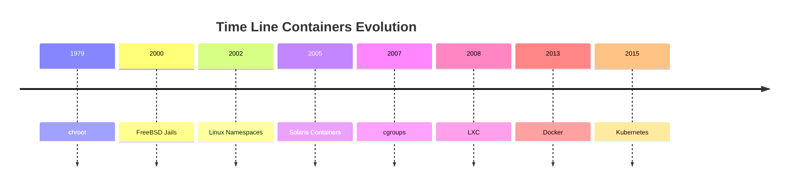

<h1><a name="readme-top"></a></h1>

[](https://github.com/marcossilvestrini/learning-lpic-3-305-300/actions/workflows/release.yml)[](https://github.com/marcossilvestrini/learning-lpic-3-305-300/actions/workflows/translate.yml)[](https://github.com/marcossilvestrini/learning-lpic-3-305-300/actions/workflows/generate-html.yml)[](https://github.com/marcossilvestrini/learning-lpic-3-305-300/actions/workflows/deploy-webpage.yml)[](https://github.com/marcossilvestrini/learning-lpic-3-305-300/actions/workflows/generate-docs.yml)[](https://github.com/marcossilvestrini/learning-lpic-3-305-300/actions/workflows/powershell.yml)[](https://github.com/marcossilvestrini/learning-lpic-3-305-300/actions/workflows/slack.yml)

* * *

[Minha licença][license-url][Garfos][forks-url][Stargazers][stars-url][Colaboradores][contributors-url][Problemas][issues-url][LinkedIn][linkedin-url]

* * *

# Aprendendo LPIC-3 305-300

[](./README.md)[](README_pt.md)


<p align="center">
<strong>Explore the docs »</strong></a>
    <br />
    <a href="https://marcossilvestrini.github.io/learning-lpic-3-305-300/">Web Site</a>
    -
    <a href="https://github.com/marcossilvestrini/learning-lpic-3-305-300">Code Page</a>
    -
    <a href="https://skynet-8.gitbook.io/learning-lpic-3-305-300">Gitbook</a>
    -
    <a href="https://github.com/marcossilvestrini/learning-lpic-3-305-300/issues">Report Bug</a>
    -
    <a href="https://github.com/marcossilvestrini/learning-lpic-3-305-300/issues">Request Feature</a>
</p>

* * *

## Resumo

<details>
  <summary><b>TABLE OF CONTENT</b></summary>
  <ol>
    <li>
      <a href="#about-the-project">About The Project</a>
    </li>
    <li>
      <a href="#getting-started">Getting Started</a>
      <ul>
        <li><a href="#prerequisites">Prerequisites</a></li>
        <li><a href="#installation">installation</a></li>
      </ul>
    </li>
    <li><a href="#usage">Usage</a></li>
    <li><a href="#roadmap">Roadmap</a></li>
    <li><a href="#freedoms">Four Essential Freedoms</a></li>
    <li>
      <a href="#topic-351">Topic 351: Full Virtualization</a>
      <ul>
        <li><a href="#topic-351.1">351.1 Virtualization Concepts and Theory </a></li>
        <li><a href="#topic-351.2">351.2 Xen</a></li>
        <li><a href="#topic-351.3">351.3 QEMU</a></li>
        <li><a href="#topic-351.4">351.4 Libvirt Virtual Machine</a></li>
        <li><a href="#topic-351.5">351.5 Virtual Machine Disk Image Management</a></li>
      </ul>
    </li>
    <li>
      <a href="#topic-352">Topic 352: Container Virtualization</a>
      <ul>
        <li><a href="#topic-352.1">352.1 Container Virtualization Concepts</a></li>
        <li><a href="#topic-352.2">352.2 LXC</a></li>
        <li><a href="#topic-352.3">352.3 Docker</a></li>
        <li><a href="#topic-352.4">352.4 Container Orchestration Platforms</a></li>
      </ul>
    </li>
    <li>
      <a href="#topic-353">Topic 353: VM Deployment and Provisioning</a>
      <ul>
        <li><a href="#topic-353.1">353.1 Cloud Management Tools</a></li>
        <li><a href="#topic-353.2">353.2 Packer</a></li>
        <li><a href="#topic-353.3">353.3 cloud-init</a></li>
        <li><a href="#topic-353.4">353.4 Vagrant</a></li>
      </ul>
    </li>
    <li><a href="#license">License</a></li>
    <li><a href="#contact">Contact</a></li>
    <li><a href="#acknowledgments">Acknowledgments</a></li>
  </ol>
</details><br>

* * *

<a name="about-the-project"></a>

## Sobre o projeto

> Este projeto tem como objetivo ajudar estudantes ou profissionais a aprender os principais conceitos de gnulinux
> e software livre
> Algumas distribuições de Gnulinux como Debian e RPM serão cobertas
> Instalação e configuração de alguns pacotes também serão cobertas
> Ao fazer isso, você pode dar a toda a comunidade a chance de se beneficiar de suas mudanças.
> O acesso ao código -fonte é uma condição prévia para isso.
> Use o Vagrant para máquinas UP e execute laboratórios e pratique o conteúdo deste artigo.
> Eu publiquei na pasta Vagrant um VagrantFile com o que é necessário
> para você fazer upload de um ambiente para estudos

* * *

<p align="right">(<a href="#readme-top">back to top</a>)</p>

<a name="getting-started"></a>

## Começando

Para iniciar o aprendizado, consulte a documentação acima.

<a name="prerequisites"></a>

### Pré -requisitos

-   [Git](https://git-scm.com/book/en/v2/Getting-Started-Installing-Git)
-   [VMware WorkStation](https://blogs.vmware.com/workstation/2024/05/vmware-workstation-pro-now-available-free-for-personal-use.html)
-   [Utilitário VMware Vagrant](https://developer.hashicorp.com/vagrant/install/vmware)
-   [Vagabundo](https://developer.hashicorp.com/vagrant/install)

<a name="installation"></a>

### Instalação

Clone o repo

```sh
git clone https://github.com/marcossilvestrini/learning-lpic-3-305-300.git
cd learning-lpic-3-305-300
```

Personalize um modelo_VagrantFile-Topic-xxx_. Este arquivo contém uma configuração VMS para laboratórios. Exemplo:

-   Arquivo[VagrantFile-Topic-351](vagrant/Vagrantfile-topic-351)
    -   vm.clone_directory = "&lt;your_driver_letter>:\\`<folder>`\\&lt;para_machine>\\#{Vm_name} -instance-1 "
        Exemplo: vm.clone_directory = "e:\\Servidores\\VMware\\#{Vm_name} -instance-1 "
    -   vm.vmx["Memsize"]= ""
    -   vm.vmx[“NumVCPus”"]= ""
    -   vm.vmx["CPUID.CRERSESCOUT"]= ""

Personalize a configuração de rede em arquivos[Configs/Network](configs/network/).

* * *

<a name="usage"></a>

## Uso

Use este repositório para obter aprendizado sobre o exame LPIC-3 305-300

### Para cima e para baixo

Mudar a_VagrantFile-Topic-xxx_modelo e cópia para um novo arquivo com nome_VagrantFile_

```sh
cd vagrant && vagrant up
cd vagrant && vagrant destroy -f
```

### Para reiniciar VMs

```sh
cd vagrant && vagrant reload
```

**Importante:**_Se você reiniciar VMs sem vagão, a pasta compartilhada não é montada após a inicialização._

### Use PowerShell para cima e para baixo

Se você usa a plataforma Windows, crio um script PowerShell para VMs para cima e para baixo.

```powershell
vagrant/up.ps1
vagrant/destroy.ps1
```

### Esquema de infraestrutura Tópico 351


<p align="right">(<a href="#readme-top">back to top</a>)</p>

* * *

<a name="roadmap"></a>

## Roteiro

-   [x] Criar repositório
-   [x] Crie scripts para provisioning laboratórios
-   [x] Crie exemplos sobre o tópico 351
-   [x] Crie exemplos sobre o tópico 352
-   [ ] Crie exemplos sobre o tópico 353
-   [ ] Carregue o ITEXAM simulado

* * *

<a name="freedoms"></a>

## Quatro liberdades essenciais

> 0.a liberdade para executar o programa como desejar, para qualquer finalidade (liberdade 0).
> 1.A liberdade para estudar como o programa funciona e muda para
> sua computação como desejar (liberdade 1).
> O acesso ao código -fonte é uma condição prévia para isso.
> 2.A liberdade para redistribuir cópias para que você possa ajudar os outros (liberdade 2).
> 3.Freedom para distribuir cópias de suas versões modificadas para outras pessoas (liberdade 3).

* * *

## Inspecionar comandos

```sh
type COMMAND
apropos COMMAND
whatis COMMAND --long
whereis COMMAND
COMMAND --help, --h
man COMMAND
```

<p align="right">(<a href="#readme-top">back to top</a>)</p>

* * *

<a name="topic-351"></a>

## Tópico 351: Virtualização completa


* * *

<a name="topic-351.1"></a>

### 351.1 Conceitos e teoria de virtualização

**Peso:**6

**Descrição:**Os candidatos devem conhecer e entender os conceitos gerais, a teoria e a terminologia da virtualização. Isso inclui terminologia Xen, Qemu e Libvirt.

**Principais áreas de conhecimento:**

-   🖥️ entender a terminologia da virtualização
-   ⚖️ entender os prós e contras da virtualização
-   🛠️ Entenda as várias variações de hipervisores e monitores de máquinas virtuais
-   🔄 Entenda os principais aspectos da migração de máquinas físicas para virtuais
-   🚀 Entenda os principais aspectos da migração de máquinas virtuais entre os sistemas host
-   📸 Entenda as características e implicações da virtualização para uma máquina virtual, como instantâneos, pausas, clonagem e limites de recursos
-   🌐 Consciência de ovirt, proxmox, Systemd Machined e VirtualBox
-   🔗 Consciência do Vswitch aberto

#### 351.1 Objetos citados

```sh
Hypervisor
Hardware Virtual Machine (HVM)
Paravirtualization (PV)
Emulation and Simulation
CPU flags
/proc/cpuinfo
Migration (P2V, V2V)
```

#### Hipervisores

##### Hypervisor tipo 1 (hipervisor nua-metal)

###### Definição do tipo 1

Executa diretamente no hardware físico do host, fornecendo uma camada base para gerenciar VMs sem a necessidade de um sistema operacional host.

###### Características do tipo 1

-   ⚡ Alto desempenho e eficiência.
-   Latência mais baixa e sobrecarga.
-   🏢 Freqüentemente usado em ambientes corporativos e data centers.

###### Exemplos do tipo 1

-   VMware ESXi: um hipervisor robusto e amplamente usado em configurações corporativas.
-   Microsoft Hyper-V: integrado ao Windows Server, oferecendo fortes recursos de desempenho e gerenciamento.
-   Xen: Um hipervisor de código aberto usado por muitos provedores de serviços em nuvem.
-   KVM (máquina virtual baseada em kernel): integrada ao kernel Linux, fornecendo alto desempenho para sistemas baseados em Linux.

##### Hypervisor tipo 2 (hipervisor hospedado)

###### Definição do tipo 2

Executa em cima de um sistema operacional convencional, contando com o sistema operacional host para gerenciamento de recursos e suporte ao dispositivo.

###### Características do tipo 2

-   🛠️ mais fácil de configurar e usar, especialmente em computadores pessoais.
-   🔧 Mais flexível para desenvolvimento, teste e implantações em menor escala.
-   🐢 Normalmente menos eficiente que os hipervisores do tipo 1 devido a uma sobrecarga adicional do sistema operacional do host.

###### Exemplos do tipo 2

-   VMware Workstation: um poderoso hipervisor para executar vários sistemas operacionais em uma única área de trabalho.
-   Oracle VirtualBox: um hipervisor de código aberto conhecido por sua flexibilidade e facilidade de uso.
-   Paralels Desktop: Projetado para usuários de Mac para executar o Windows e outros sistemas operacionais ao lado de MacOS.
-   Qemu (emulador rápido): um emulador de código aberto e virtualizador, geralmente usado em conjunto com o KVM.

##### Diferenças -chave entre os hipervisores do tipo 1 e do tipo 2

-   Ambiente de implantação:
    -   Os hipervisores tipo 1 são comumente implantados em data centers e ambientes corporativos devido à sua interação direta com hardware e alto desempenho.
    -   Os hipervisores do tipo 2 são mais adequados para tarefas de uso pessoal, desenvolvimento, teste e virtualização em pequena escala.
-   Desempenho:
    -   Os hipervisores do tipo 1 geralmente oferecem melhor desempenho e menor latência porque não confiam em um sistema operacional host.
    -   Os hipervisores do tipo 2 podem experimentar alguma degradação do desempenho devido à sobrecarga de execução no topo de um sistema operacional host.
-   Gerenciamento e facilidade de uso:
    -   Os hipervisores do tipo 1 requerem configuração e gerenciamento mais complexos, mas fornecem recursos avançados e escalabilidade para implantações em larga escala.
    -   Os hipervisores tipo 2 são mais fáceis de instalar e usar, tornando -os ideais para usuários individuais e projetos menores.

##### Tipos de migração

No contexto dos hipervisores, que são tecnologias usadas para criar e gerenciar máquinas virtuais, os termos migração de P2V e migração V2V são comuns em ambientes de virtualização.
Eles se referem a processos de sistemas de migração entre diferentes tipos de plataformas.

##### P2V - Migração física para virtual

A migração de P2V refere-se ao processo de migração de um servidor físico para uma máquina virtual. Em outras palavras, um sistema operacional e seus aplicativos, executando em hardware físico dedicado, são "convertidos" e movidos para uma máquina virtual que é executada em um hipervisor (como VMware, Hyper-V, KVM, etc.).

-   Exemplo: você tem um servidor físico executando um sistema Windows ou Linux e deseja movê -lo para um ambiente virtual, como uma infraestrutura em nuvem ou um servidor de virtualização interna.
    O processo envolve copiar todo o estado do sistema, incluindo o sistema operacional, drivers e dados, para criar uma máquina virtual equivalente que possa funcionar como se estivesse no hardware físico.

##### V2V - Migração virtual para virtual

A migração V2V refere-se ao processo de migração de uma máquina virtual de um hipervisor para outro. Nesse caso, você já tem uma máquina virtual em execução em um ambiente virtualizado (como o VMware) e deseja movê-lo para outro ambiente virtualizado (por exemplo, para Hyper-V ou um novo servidor VMware).

-   Exemplo: você tem uma máquina virtual em execução em um servidor de virtualização do VMware, mas decide migrá-lo para uma plataforma Hyper-V. Nesse caso, a migração V2V converte a máquina virtual de um formato ou hipervisor para outro, garantindo que ela possa continuar funcionando corretamente.

#### HVM e paravirtualização

##### Virtualização assistida por hardware (HVM)

###### Definição de HVM

A HVM aproveita as extensões de hardware fornecidas pelas CPUs modernas para virtualizar o hardware, permitindo a criação e o gerenciamento de VMs com o mínimo de sobrecarga de desempenho.

###### Características -chave da HVM

-   🖥️**Suporte de hardware**: Requer suporte à CPU para extensões de virtualização, como Intel VT-X ou AMD-V.
-   🛠️**Virtualização completa:**As VMs podem executar sistemas operacionais de hóspedes não modificados, pois o hipervisor fornece uma emulação completa do ambiente de hardware.
-   ⚡**Desempenho:**Normalmente, oferece desempenho quase nativo devido à execução direta do código de convidado na CPU.
-   🔒**Isolamento:**Fornece um forte isolamento entre as VMs, pois cada VM opera como se tivesse seu próprio hardware dedicado.

###### Exemplo de HVM

VMware Esxi, Microsoft Hyper-V, KVM (máquina virtual baseada em kernel).

###### Vantagens de HVM

-   ✅**Compatibilidade:**Pode executar qualquer sistema operacional sem modificação.
-   ⚡**Desempenho:**Alto desempenho devido ao suporte de hardware.
-   🔒**Segurança:**Recursos aprimorados de isolamento e segurança fornecidos pelo hardware.

###### Desvantagens de HVM

-   🛠️**Dependência de hardware:**Requer recursos específicos de hardware, limitando a compatibilidade com sistemas mais antigos.
-   🔧**Complexidade:**Pode envolver configuração e gerenciamento mais complexos.

##### Paravirtualização

###### Definição de paravirtualização

A paravirtualização envolve a modificação do sistema operacional convidado para estar ciente do ambiente virtual, permitindo que ele interaja com mais eficiência com o hipervisor.

###### Características -chave da paravirtualização

-   🛠️**Modificação de convidados:**Requer alterações no sistema operacional convidado para se comunicar diretamente com o hipervisor usando hipercalls.
-   ⚡**Desempenho:**Pode ser mais eficiente que a virtualização completa tradicional, pois reduz a sobrecarga associada ao hardware emulando.
-   🔗**Compatibilidade:**Limitado a sistemas operacionais que foram modificados para paravirtutualização.

###### Exemplos de paravirtualização

Xen com convidados paravirtualizados, ferramentas VMware em determinadas configurações e algumas configurações de KVM.

###### Vantagens de paravirtualização

-   ⚡**Eficiência:**Reduz a sobrecarga de virtualizar hardware, potencialmente oferecendo melhor desempenho para determinadas cargas de trabalho.
-   ✅**Utilização de recursos:**Uso mais eficiente dos recursos do sistema devido à comunicação direta entre o sistema operacional convidado e o hipervisor.

###### Desvantagens de paravirtualização

-   🛠️**Modificação do sistema operacional convidado:**Requer modificações para o sistema operacional convidado, limitando a compatibilidade aos sistemas operacionais suportados.
-   🔧**Complexidade:**Requer complexidade adicional no sistema operacional convidado para implementações de hipercall.

##### Principais diferenças

###### Requisitos do sistema operacional convidado

-   **HVM:**Pode executar sistemas operacionais de convidados não modificados.
-   **Paravirtutualização:**Requer que os sistemas operacionais de convidados sejam modificados para trabalhar com o hipervisor.

###### Desempenho

-   **HVM:**Normalmente, fornece desempenho quase nativo devido à execução assistida por hardware.
-   **Paravirtutualização:**Pode oferecer desempenho eficiente, reduzindo a sobrecarga da emulação de hardware, mas depende do sistema operacional convidado modificado.

###### Dependência de hardware

-   **HVM:**Requer recursos específicos da CPU (Intel VT-X, AMD-V).
-   **Paravirtutualização:**Não requer recursos específicos da CPU, mas precisa de um sistema operacional de convidado modificado.

###### Isolamento

-   **HVM:**Fornece um isolamento forte usando recursos de hardware.
-   **Paravirtutualização:**Depende do isolamento baseado em software, que pode não ser tão robusto quanto o isolamento baseado em hardware.

###### Complexidade

-   **HVM:**Geralmente mais simples de implantar, pois suporta o sistema operacional não modificado.
-   **Paravirtutualização:**Requer configuração e modificações adicionais para o sistema operacional convidado, aumentando a complexidade.

#### NUMA (acesso não uniforme de memória)

O NUMA (acesso não uniforme de memória) é uma arquitetura de memória usada em sistemas multiprocessadores para otimizar o acesso à memória pelos processadores.
Em um sistema NUMA, a memória é distribuída de maneira desigual entre os processadores, o que significa que cada processador tem acesso mais rápido a uma parte da memória (sua "memória local") do que à memória que está fisicamente mais distante (referida como "memória remota") e associada a outros processadores.

##### Principais recursos da arquitetura NUMA

1.  **Memória local e remota**: Cada processador tem sua própria memória local, que pode acessar mais rapidamente. No entanto, também pode acessar a memória de outros processadores, embora isso leve mais tempo.
2.  **Latência diferenciada**: A latência do acesso à memória varia dependendo se o processador está acessando sua memória local ou a memória de outro nó. O acesso à memória local é mais rápido, enquanto o acesso à memória de outro nó (remoto) é mais lento.
3.  **Escalabilidade**: A arquitetura da NUMA foi projetada para melhorar a escalabilidade em sistemas com muitos processadores. À medida que mais processadores são adicionados, a memória também é distribuída, evitando o gargalo que ocorreria em uma arquitetura uniforme de acesso à memória (Uma).

##### Advantages of NUMA

-   ⚡ Melhor desempenho em sistemas grandes: como cada processador possui memória local, ele pode funcionar com mais eficiência sem competir tanto com outros processadores pelo acesso à memória.
-   Scalability: O NUMA permite sistemas com muitos processadores e grandes quantidades de memória para escalar com mais eficácia em comparação com uma arquitetura Uma.

##### Desvantagens

-   Complexidade da programação: os programadores precisam estar cientes de quais regiões de memória são locais ou remotas, otimizando o uso da memória local para obter um melhor desempenho.
-   🐢 Penalidades potenciais de desempenho: se um processador acessar frequentemente a memória remota, o desempenho poderá sofrer devido à maior latência.
    Essa arquitetura é comum em sistemas multiprocessadores de alto desempenho, como servidores e supercomputadores, onde a escalabilidade e a otimização da memória são críticas.

#### Soluções OpenSource

-   🌐 Ovirt:<https://www.ovirt.org/>
-   🌐 Proxmox:<https://www.proxmox.com/en/proxmox-virtual-environment/overview>
-   🌐 Oracle VirtualBox:<https://www.virtualbox.org/>
-   🌐 Open Vswitch:<https://www.openvswitch.org/>

#### Tipos de virtualização

##### Virtualização de hardware (virtualização do servidor)

###### Definição de HV

Abstraia o hardware físico para criar máquinas virtuais (VMs) que executam sistemas e aplicativos operacionais separados.

###### Casos de uso de HV

Data centers, computação em nuvem, consolidação do servidor.

###### Exemplos de HV

VMware Esxi, Microsoft Hyper-V, KVM.

##### Virtualização do sistema operacional (contêinerização)

###### Definição de contêinerização

Permite que várias instâncias isoladas do espaço do usuário (contêineres) sejam executadas em um único kernel do sistema operacional.

###### Casos de uso de contêinerização

Ambientes de arquitetura, desenvolvimento e teste de microsserviços.

###### Exemplos de contêinerização

Docker, Kubernetes, LXC.

##### Virtualização de rede

###### Definição de virtualização de rede

Combina recursos de rede de hardware e software em uma única entidade administrativa baseada em software.

###### Casos de uso da virtualização de rede

Networking definido por software (SDN), Virtualização da Função de Rede (NFV).

###### Exemplos de virtualização de rede

VMware NSX, Cisco ACI, OpenStack Neutron.

##### Virtualização de armazenamento

###### Definição de virtualização de armazenamento

Pools armazenamento físico de vários dispositivos em uma única unidade de armazenamento virtual que pode ser gerenciada centralmente.

###### Casos de uso da definição de virtualização de armazenamento

Gerenciamento de dados, otimização de armazenamento, recuperação de desastres.

###### Exemplos de definição de virtualização de armazenamento

IBM SAN Volume Controller, VMware vsan, NetApp OTAP.

##### Virtualização da área de trabalho

###### Definição de virtualização da área de trabalho

Permite que um sistema operacional de desktop seja executado em uma máquina virtual hospedada em um servidor.

###### Casos de uso da definição de virtualização de desktop

Infraestrutura de Desktop Virtual (VDI), Soluções de Trabalho Remoto.

###### Exemplos de definição de virtualização de desktop

Citrix Apps e desktops Citrix, VMware Horizon, Microsoft Remote Desktop Services.

##### Virtualização de aplicativos

###### Definição de virtualização do aplicativo

Separa os aplicativos do hardware subjacente e do sistema operacional, permitindo que eles sejam executados em ambientes isolados.

###### Casos de uso da definição de virtualização de aplicativos

Implantação simplificada de aplicativos, teste de compatibilidade.

###### Exemplos de definição de virtualização de aplicativos

VMware ThinApp, Microsoft App-V, Citrix XenApp.

##### Virtualização de dados

###### Definição de virtualização de dados

Integra dados de várias fontes sem consolidá -los fisicamente, fornecendo uma visão unificada para análise e relatório.

###### Casos de uso da definição de virtualização de dados

Inteligência de negócios, integração de dados em tempo real.

###### Exemplos de definição de virtualização de dados

Denodo, Red Hat JBoss Virtualização de dados, IBM InfoSphere.

##### Benefícios da virtualização

-   ⚡ Eficiência de recursos: melhor utilização de recursos físicos.
-   💰 Economia de custos: hardware reduzido e custos operacionais.
-   📈 Escalabilidade: fácil de aumentar ou diminuir de acordo com a demanda.
-   🔧 Flexibilidade: suporta uma variedade de cargas de trabalho e aplicações.
-   🔄 Recuperação de desastres: processos simplificados de backup e recuperação.
-   🔒 Isolamento: segurança aprimorada através do isolamento de ambientes.

#### Emulação

A emulação envolve a simulação do comportamento de hardware ou software em uma plataforma diferente do originalmente pretendido.

Esse processo permite que o software projetado para um sistema seja executado em outro sistema que possa ter arquitetura ou ambiente operacional diferente.

Embora a emulação forneça versatilidade, permitindo a execução de sistemas ou aplicativos operacionais de convidados não modificados, ela geralmente vem com sobrecarga de desempenho.

Essa sobrecarga surge porque o sistema emulado precisa interpretar e traduzir instruções destinadas ao sistema original em instruções compatíveis com o sistema host. Como resultado, a emulação pode ser mais lenta que a execução nativa, tornando-o menos eficiente para tarefas com uso intensivo de recursos.

Apesar dessa desvantagem, a emulação permanece valiosa para a execução de software herdado, testando aplicativos em diferentes plataformas e facilitando o desenvolvimento de plataformas cruzadas.

#### Systemd-Mathined

O serviço usinado pela SystemD é dedicado ao gerenciamento de máquinas e contêineres virtuais no ecossistema Systemd.
 Ele fornece funcionalidades essenciais para controlar, monitorar e manter instâncias virtuais, oferecendo integração e eficiência robustas nos ambientes Linux.

<p align="right">(<a href="#topic-351.1">back to sub Topic 351.1</a>)</p>
<p align="right">(<a href="#topic-351">back to Topic 351</a>)</p>
<p align="right">(<a href="#readme-top">back to top</a>)</p>

* * *

<a name="topic-351.2"></a>

### 351.2 Alternação


**Peso:**3

**Descrição:**Os candidatos devem poder instalar, configurar, manter, migrar e solucionar problemas de instalações XEN. O foco está no Xen versão 4.x.

**Principais áreas de conhecimento:**

-   Entenda a arquitetura de Xen, incluindo networking e armazenamento
-   Configuração básica dos nós e domínios Xen
-   Gerenciamento básico de nós e domínios Xen
-   Solução de problemas básicos de instalações Xen
-   Avarines fora da pílula
-   Consciência de Xenstore
-   Consciência dos parâmetros de inicialização do Xen
-   Consciência do utilitário XM

#### Alternar


O XEN é um hipervisor de código aberto tipo 1 (sem metal), que permite que vários sistemas operacionais sejam executados simultaneamente no mesmo hardware físico.xen fornece uma camada entre o hardware físico e as máquinas virtuais (VMs), permitindo compartilhamento de recursos eficientes e isolamento.

-   **Arquitetura:**O Xen opera com um sistema de duas camadas em que o Domínio 0 (DOM0) é o domínio privilegiado com acesso direto ao hardware e gerencia o hipervisor. Outras máquinas virtuais, chamadas de domínio U (DOMU), executam sistemas operacionais convidados e são gerenciados pelo DOM0.
-   **Tipos de virtualização:**O XEN suporta paravirtualização (PV), que requer o sistema operacional convidado modificado e a virtualização assistida por hardware (HVM), que usa extensões de hardware (por exemplo, Intel VT-X ou AMD-V) para executar sistemas operacionais de convidados não modificados.
    O XEN é amplamente utilizado em ambientes em nuvem, principalmente pela Amazon Web Services (AWS) e outros provedores de nuvem em larga escala.

#### Xensource

A Xensource foi a empresa fundada pelos desenvolvedores originais do Xen Hypervisor da Universidade de Cambridge para comercializar a Xen. A empresa forneceu soluções corporativas com base no XEN e ofereceu ferramentas e suporte adicionais para aprimorar os recursos da XEN para uso corporativo.

-   **Aquisição pela Citrix**: Em 2007, a Xensource foi adquirida pela Citrix Systems, Inc. A Citrix usou a tecnologia Xen como base para o seu produto Citrix Xenserver, que se tornou uma popular plataforma de virtualização de grau corporativo baseado em Xen.
-   **Transição**: Após a aquisição, o projeto Xen continuou como um projeto de código aberto, enquanto a Citrix se concentrou em ofertas comerciais como Xenserver, alavancando a tecnologia Xensource.

#### Projeto Xen

O projeto XEN refere-se à comunidade de código aberto e à iniciativa responsável pelo desenvolvimento e manutenção do hipervisor Xen após sua comercialização. O projeto Xen opera sob a Fundação Linux, com foco na construção, melhoria e apoio a Xen como um esforço colaborativo e orientado pela comunidade.

-   **Metas:**O projeto XEN visa avançar o hipervisor, melhorando seu desempenho, segurança e conjunto de recursos para uma ampla gama de casos de uso, incluindo computação em nuvem, virtualização focada na segurança (por exemplo, Qubes OS) e sistemas incorporados.
-   **Colaboradores:**O projeto inclui colaboradores de várias organizações, incluindo os principais provedores de nuvem, fornecedores de hardware e desenvolvedores independentes.
-   **Pílula e hedools:**O projeto XEN também inclui ferramentas como XAPI (XenAPI), que é usado para gerenciar instalações do Xen Hypervisor e vários outros utilitários para gerenciamento e otimização do sistema.

#### Xenstore

A Xen Store é um componente crítico do hipervisor Xen.
Essencialmente, o Xen Store é um banco de dados de valor-chave distribuído usado para comunicação e compartilhamento de informações entre o hypervisor Xen e as máquinas virtuais (também conhecidas como domínios) que ele gerencia.

Aqui estão alguns aspectos importantes da Xen Store:

-   **Comunicação entre domínios:**O Xen Store permite a comunicação entre domínios, como o DOM0 (o domínio privilegiado que controla os recursos de hardware) e o DOMUS (domínios do usuário, que são as VMs). Isso é feito através de entradas de valor-chave, onde cada domínio pode ler ou escrever informações.
-   **Gerenciamento de configuração:**É usado para armazenar e acessar informações de configuração, como dispositivos virtuais, redes e parâmetros de inicialização. Isso facilita o gerenciamento dinâmico e a configuração das VMs.
-   **Eventos e notificações:**A Xen Store também suporta notificações de eventos. Quando uma chave ou valor específica na loja Xen é modificada, os domínios interessados ​​podem ser notificados para reagir a essas alterações. Isso é útil para monitorar e gerenciar recursos.
-   API simples: a Xen Store fornece uma API simples para ler e escrever dados, facilitando os desenvolvedores para integrar seus aplicativos ao sistema de virtualização Xen.

#### Pílula

XAPI, ou Xenapi, é a interface de programação de aplicativos (API) usada para gerenciar o hipervisor Xen e suas máquinas virtuais (VMs).
O XAPI é um componente essencial do Xenserver (agora conhecido como Citrix Hypervisor) e fornece uma maneira padronizada de interagir com o hipervisor Xen para executar operações como criar, configurar, monitorar e controlar VMs.

Aqui estão alguns aspectos importantes de Xapi:

-   **Gerenciamento de VM:**O XAPI permite que os administradores criem, excluam, excluam, iniciem e parem e parem e parem programaticamente as máquinas virtuais.
-   **Automação:**Com o XAPI, é possível automatizar o gerenciamento de recursos virtuais, incluindo redes, armazenamento e computação, o que é crucial para grandes ambientes em nuvem.
-   **Integração:**O XAPI pode ser integrado a outras ferramentas e scripts para fornecer administração mais eficiente e personalizada do ambiente XEN.
-   **Controle de acesso:**O XAPI também fornece mecanismos de controle de acesso para garantir que apenas usuários autorizados possam executar operações específicas no ambiente virtual.

O XAPI é a interface que permite o controle e a automação do hipervisor Xen, facilitando o gerenciamento de ambientes virtualizados.

#### Resumo Xen

-   **INCROPPING:**A tecnologia principal do hipervisor que permite que as máquinas virtuais sejam executadas em hardware físico.
-   **Xensource:**A empresa que comercializou Xen, mais tarde adquirida pela Citrix, levando ao desenvolvimento do Citrix Xenserver.
-   **Projeto Xen:**A iniciativa e a comunidade de código aberto que continuam a desenvolver e manter o hipervisor Xen sob a Fundação Linux.
-   **Xenstore:**A Xen Store atua como uma intermediária de comunicação e configuração entre o Hypervisor Xen e as VMs, simplificando a operação e o gerenciamento de ambientes virtualizados.
-   **Pílula**é a interface que permite o controle e a automação do hipervisor Xen, facilitando o gerenciamento de ambientes virtualizados.

#### Domain0 (DOM0)

Domain0, OR DOM0, é o domínio de controle em uma arquitetura Xen. Ele gerencia outros domínios (DOMUS) e tem acesso direto ao hardware.
O DOM0 executa drivers de dispositivo, permitindo que o Domus, que não possua acesso direto ao hardware, se comunique com dispositivos. Normalmente, é uma instância completa de um sistema operacional, como o Linux, e é essencial para a operação de hipervisor do Xen.

#### Domínio (casa)

Domus são domínios não privilegiados que executam máquinas virtuais.
Eles são gerenciados pelo DOM0 e não têm acesso direto ao hardware. O DOMUS pode ser configurado para executar diferentes sistemas operacionais e é usado para vários fins, como servidores de aplicativos e ambientes de desenvolvimento. Eles dependem do DOM0 para interação de hardware.

#### Peewee-dom (paravardiyed domina)

O PV-Domus usa uma técnica chamada paravirtutualização. Neste modelo, o sistema operacional DOMU é modificado para estar ciente de que ele é executado em um ambiente virtualizado, permitindo que ele se comunique diretamente com o hipervisor para o desempenho otimizado.
Isso resulta em menor sobrecarga e melhor eficiência em comparação com a virtualização total.

#### HVM-domu (domínio da máquina virtual de hardware)

O HVM-Domus são máquinas virtuais que utilizam virtualização completa, permitindo que os sistemas operacionais não modificados sejam executados. O Xen Hypervisor fornece emulação de hardware para esses Domus, permitindo que eles executem qualquer sistema operacional que suporta a arquitetura de hardware subjacente.
Embora isso ofereça maior flexibilidade, pode resultar em uma sobrecarga mais alta em comparação com o PV-Domus.

#### Rede Xen

Dispositivos de rede paravirtualizados

Ponte

#### 351.2 Objetos citados

```sh
Domain0 (Dom0), DomainU (DomU)
PV-DomU, HVM-DomU
/etc/xen/
xl
xl.cfg 
xl.conf # Xen global configurations
xentop
oxenstored # Xenstore configurations
```

#### 351.2 Notas

```sh

# Xen Settings
/etc/xen/
/etc/xen/xl.conf - Main general configuration file for Xen
/etc/xen/oxenstored.conf - Xenstore configurations

# VM Configurations
/etc/xen/xlexample.pvlinux
/etc/xen/xlexample.hvm

# Service Configurations
/etc/default/xen
/etc/default/xendomains

# xen-tools configurations
/etc/xen-tools/
/usr/share/xen-tools/

# docs
xl(1)
xl.conf(5)
xlcpupool.cfg(5)
xl-disk-configuration(5)
xl-network-configuration(5)
xen-tscmode(7)

# initialized domains auto
/etc/default/xendomains
   XENDOMAINS_AUTO=/etc/xen/auto

/etc/xen/auto/


# set domain for up after xen reboot
## create folder auto
cd /etc/xen && mkdir -p auto && cd auto

# create simbolic link
ln -s /etc/xen/lpic3-pv-guest /etc/xen/auto/lpic3-pv-guest
```

#### 351.2 Comandos importantes

##### Imagem Xen-Criar

```sh
# create a pv image
xen-create-image \
  --hostname=lpic3-pv-guest \
  --memory=1gb \
  --vcpus=2 \
  --lvm=vg_xen \
  --bridge=xenbr0 \
  --dhcp \
  --pygrub \
  --password=vagrant \
  --dist=bookworm
```

##### Imagens Xen-Lista

```sh
# list image
xen-list-image
```

##### Xen-Delete-Image

```sh
# delete a pv image
xen-delete-image lpic3-pv-guest --lvm=vg_xen
```

##### Xenstore-LS

```sh
# list xenstore infos
xenstore-ls
```

##### xl

```sh
# view xen information
xl infos

# list Domains
xl list
xl list lpic3-hvm-guest
xl list lpic3-hvm-guest -l

# uptime Domains
xl uptime

# pause Domain
xl pause 2
xl pause lpic3-hvm-guest

# save state Domains
xl -v save lpic3-hvm-guest ~root/image-lpic3-hvm-guest.save

# restore Domain
xl restore /root/image-lpic3-hvm-guest.save

# get Domain name
xl domname 2

# view dmesg information
xl dmesg

# monitoring domain
xl top
xentop
xen top

# Limit mem Dom0
xl mem-set 0 2048

# Limit cpu (not permanent after boot)
xl vcpu-set 0 2

# create DomainU - virtual machine
xl create /etc/xen/lpic3-pv-guest.cfg

# create DomainU virtual machine and connect to guest
xl create -c /etc/xen/lpic3-pv-guest.cfg

##----------------------------------------------
# create DomainU virtual machine HVM

## create logical volume
lvcreate -l +20%FREE -n lpic3-hvm-guest-disk  vg_xen

## create a ssh tunel for vnc
ssh -l vagrant -L 5900:localhost:5900  192.168.0.130

## configure /etc/xen/lpic3-hvm-guest.cfg
## set boot for cdrom: boot = "d"

## create domain hvm
xl create /etc/xen/lpic3-hvm-guest.cfg

## open vcn conection in your vnc client with localhost
## for view install details

## after installation finished, destroy domain: xl destroy <id_or_name>

## set /etc/xen/lpic3-hvm-guest.cfg: boot for hard disc: boot = "c"

## create domain hvm
xl create /etc/xen/lpic3-hvm-guest.cfg

## access domain hvm
xl console <id_or_name>
##----------------------------------------------

# connect in domain guest
xl console <id>|<name> (press enter)
xl console 1
xl console lpic3-pv-guest

#How do I exit domU "xl console" session
#Press ctrl+] or if you're using Putty press ctrl+5.

# Poweroff domain
xl shutdown lpic3-pv-guest

# destroy domain
xl destroy lpic3-pv-guest

# reboot domain
xl reboot lpic3-pv-guest

# list block devices
xl block-list 1
xl block-list lpic3-pv-guest

# detach block devices
xl block-detach lpic3-hvm-guest hdc
xl block-detach 2 xvdc

# attach block devices

## hard disk devices
xl block-attach lpic3-hvm-guest-ubuntu 'phy:/dev/vg_xen/lpic3-hvm-guest-disk2,xvde,w'

## cdrom
xl block-attach lpic3-hvm-guest 'file:/home/vagrant/isos/ubuntu/seed.iso,xvdc:cdrom,r'
xl block-attach 2 'file:/home/vagrant/isos/ubuntu/seed.iso,xvdc:cdrom,r'

# insert and eject cdrom devices
xl cd-insert lpic3-hvm-guest-ubuntu xvdb  /home/vagrant/isos/ubuntu/ubuntu-24.04.1-live-server-amd64.iso
xl cd-eject lpic3-hvm-guest-ubuntu xvdb
```

#### 251.2 Notas

##### VIF

Em Xen, "VIF" significa interface virtual e é usado para configurar a rede para máquinas virtuais (domínios).

Ao especificar as diretrizes "VIF" nos arquivos de configuração do domínio, os administradores podem definir interfaces de rede, atribuir endereços IP, configurar VLANs e configurar outros parâmetros de rede para máquinas virtuais em execução em hosts XEN. Por exemplo: VIF =[=Bridge  Xenbr0], neste caso, conecta a interface de rede da VM à ponte Xen chamada "XenBr0".

````sh

<p align="right">(<a href="#topic-351.2">back to sub Topic 351.2</a>)</p>
<p align="right">(<a href="#topic-351">back to Topic 351</a>)</p>
<p align="right">(<a href="#readme-top">back to top</a>)</p>

---

<a name="topic-351.3"></a>

### 351.3 QEMU


**Weight:** 4

**Description:** Candidates should be able to install, configure, maintain, migrate and troubleshoot QEMU installations.

**Key Knowledge Areas:**

* Understand the architecture of QEMU, including KVM, networking and storage
* Start QEMU instances from the command line
* Manage snapshots using the QEMU monitor
* Install the QEMU Guest Agent and VirtIO device drivers
* Troubleshoot QEMU installations, including networking and storage
* Awareness of important QEMU configuration parameters

#### 351.3 Cited Objects

```sh
Kernel modules: kvm, kvm-intel and kvm-amd
/dev/kvm
QEMU monitor
qemu
qemu-system-x86_64
ip
brctl
tunctl
````

#### 351.3 Comandos importantes

##### 351.3 outros comandos

##### Verifique o módulo KVM

```sh
# check if kvm is enabled
egrep -o '(vmx|svm)' /proc/cpuinfo
lscpu |grep Virtualization
lsmod|grep kvm
ls -l /dev/kvm
hostnamectl
systemd-detect-virt
```

```sh
# check if kvm is enabled
egrep -o '(vmx|svm)' /proc/cpuinfo
lscpu |grep Virtualization
lsmod|grep kvm
ls -l /dev/kvm

# check kernel infos
uname -a

# check root device
findmnt /

# mount a qcow2 image
## Example 1:
mkdir -p /mnt/qemu
guestmount -a os-images/Debian_12.0.0_VMM/Debian_12.0.0.qcow2 -i /mnt/qemu/

## Example 2:
sudo guestfish --rw -a os-images/Debian_12.0.0_VMM/Debian_12.0.0.qcow2
run
list-filesystems

# run commands in qcow2 images
## Example 1:
virt-customize -a  os-images/Debian_12.0.0_VMM/Debian_12.0.0.qcow2  --run-command 'echo hello >/root/hello.txt'
## Example 2:
sudo virt-customize -a os-images/Debian_12.0.0_VMM/Debian_12.0.0.qcow2 \
  --run-command 'echo -e "auto ens3\niface ens3 inet dhcp" > /etc/network/interfaces.d/ens3.cfg'

# generate mac 
printf 'DE:AD:BE:EF:%02X:%02X\n' $((RANDOM%256)) $((RANDOM%256))
```

##### IP

```sh
# list links
ip link show

# create bridge
ip link add br0 type bridge
```

##### BRCTL

```sh
# list links
ip link show

# create bridge
ip link add br0 type bridge
```

##### qemu-img

```sh
# create image
qemu-img create -f qcow2 vm-disk-debian-12.qcow2 20G

# convert vmdk to qcow2 image
qemu-img convert \
  -f vmdk \
  -O qcow2 os-images/Debian_12.0.0_VMM/Debian_12.0.0_VMM_LinuxVMImages.COM.vmdk os-images/Debian_12.0.0_VMM/Debian_12.0.0.qcow2 \
  -p \
  -m16

# check image
qemu-img info os-images/Debian_12.0.0_VMM/Debian_12.0.0.qcow2
```

##### Qemu-System-X86_64

```sh
# create vm with ISO
qemu-system-x86_64 \
  -name lpic3-debian-12 \
  -enable-kvm -hda vm-disk-debian-12.qcow2 \
  -cdrom /home/vagrant/isos/debian/debian-12.8.0-amd64-DVD-1.iso  \
  -boot d \
  -m 2048 \
  -smp cpus=2 \
  -k pt-br

# create vm with ISO using vnc in no gui servers \ ssh connections

## create ssh tunel in host
 ssh -l vagrant -L 5902:localhost:5902  192.168.0.131

## create vm 
qemu-system-x86_64 \
  -name lpic3-debian-12 \
  -enable-kvm \
  -m 2048 \
  -smp cpus=2 \
  -k pt-br \
  -vnc :2 \
  -device qemu-xhci \
  -device usb-tablet \
  -device ide-cd,bus=ide.1,drive=cdrom,bootindex=1 \
  -drive id=cdrom,media=cdrom,if=none,file=/home/vagrant/isos/debian/debian-12.8.0-amd64-DVD-1.iso \
  -hda vm-disk-debian-12.qcow2 \
  -boot order=d \
  -vga std \
  -display none \
  -monitor stdio

# create vm with OS Image - qcow2

## create vm
qemu-system-x86_64 \
  -name lpic3-debian-12 \
  -enable-kvm \
  -m 2048 \
  -smp cpus=2 \
  -k pt-br \
  -vnc :2 \
  -hda os-images/Debian_12.0.0_VMM/Debian_12.0.0.qcow2

## create vm with custom kernel params
qemu-system-x86_64 \
  -name lpic3-debian-12 \
  -kernel /vmlinuz \
  -initrd /initrd.img \
  -append "root=/dev/mapper/debian--vg-root ro fastboot console=ttyS0" \
  -enable-kvm \
  -m 2048 \
  -smp cpus=2 \
  -k pt-br \
  -vnc :2 \
  -hda os-images/Debian_12.0.0_VMM/Debian_12.0.0.qcow2

## create vm with and attach disk
qemu-system-x86_64 \
  -name lpic3-debian-12 \
  -enable-kvm \
  -m 2048 \
  -smp cpus=2 \
  -vnc :2 \
  -hda os-images/Debian_12.0.0_VMM/Debian_12.0.0.qcow2 \
  -hdb vmdisk-debian12.qcow2 \
  -drive file=vmdisk-extra-debian12.qcow2,index=2,media=disk,if=ide \
  -netdev bridge,id=net0,br=qemubr0 \
  -device virtio-net-pci,netdev=net0
  
## create vm network netdev user
qemu-system-x86_64 \
  -name lpic3-debian-12 \
  -enable-kvm \
  -m 2048 \
  -smp cpus=2 \
  -vnc :2 \
  -hda os-images/Debian_12.0.0_VMM/Debian_12.0.0.qcow2 \
  -netdev user,id=mynet0,net=192.168.0.150/24,dhcpstart=192.168.0.155,hostfwd=tcp::2222-:22 \
  -device virtio-net-pci,netdev=mynet0

## create vm network netdev tap (Private Network)
ip link add br0 type bridge ; ifconfig br0 up
qemu-system-x86_64 \
  -name lpic3-debian-12 \
  -enable-kvm \
  -m 2048 \
  -smp cpus=2 \
  -vnc :2 \
  -hda os-images/Debian_12.0.0_VMM/Debian_12.0.0.qcow2 \
  -netdev tap,id=br0 \
  -device e1000,netdev=br0,mac=DE:AD:BE:EF:1A:24

## create vm with public bridge
#create a public bridge : https://www.linux-kvm.org/page/Networking

qemu-system-x86_64 \
  -name lpic3-debian-12 \
  -enable-kvm \
  -m 2048 \
  -smp cpus=2 \
  -hda os-images/Debian_12.0.0_VMM/Debian_12.0.0.qcow2 \
  -k pt-br \
  -vnc :2 \
  -device qemu-xhci \
  -device usb-tablet \
  -vga std \
  -display none \
  -netdev bridge,id=net0,br=qemubr0 \
  -device virtio-net-pci,netdev=net0

## get a ipv4 ip - open ssh in vm and:
dhcpclient ens4
```

#### Monitor qemu

Para iniciar o monitor Qemu no uso de linha de comando**-Monitor stdio**param in**Qemu-System-X86_64**

```sh
qemu-system-x86_64 -monitor stdio
```

Saia Qemu-Monitor:

```sh
ctrl+alt+2
```

```sh
# Managment
info status # vm info
info cpus # cpu information
info network # network informations
stop # pause vm
cont # start vm in status pause
system_powerdown # poweroff vm
system_reset # restart monitor


# Blocks
info block # block info
boot_set d # force boot iso
change ide1-cd0  /home/vagrant/isos/debian/debian-12.8.0-amd64-DVD-1.iso  # attach cdrom
eject ide1-cd0 # detach cdrom

# Snapshots
info snapshots # list snapshots
savevm snapshot-01  # create snapshot
loadvm snapshot-01 # restore snapshot
delvm snapshot-01
```

#### Agente convidado

Para ativar, use:

```sh
qemu-system-x86_x64
 -chardev socket,path=/tmp/qga.sock,server=on,wait=off,id=qga0 \
 -device virtio-serial \
 -device virtserialport,chardev=qga0,name=org.qemu.guest_agent.0
```

<p align="right">(<a href="#topic-351.3">back to sub Topic 351.3</a>)</p>
<p align="right">(<a href="#topic-351">back to Topic 351</a>)</p>
<p align="right">(<a href="#readme-top">back to top</a>)</p>

* * *

<a name="topic-351.4"></a>

### 351.4 LibVirt Máquina virtual Gerenciamento


**Peso:**9

**Descrição:**Os candidatos devem ser capazes de gerenciar hosts de virtualização e máquinas virtuais ('LibVirt Domains') usando o LibVirt e as ferramentas relacionadas.

**Principais áreas de conhecimento:**

-   Entenda a arquitetura do Libvirt
-   Gerenciar conexões e nós da LibVirt
-   Crie e gerencie domínios qemu e xen, incluindo instantâneos
-   Gerenciar e analisar o consumo de recursos de domínios
-   Crie e gerencie pools e volumes de armazenamento
-   Crie e gerencie redes virtuais
-   Migrar domínios entre nós
-   Entenda como o LibVirt interage com Xen e Qemu
-   Entenda como a LibVirt interage com serviços de rede, como Dnsmasq e RadVD
-   Entenda os arquivos de configuração do LibVirt XML
-   Consciência de VirtLogd e Virtlockd

#### 351.4 Objetos citados

```sh
libvirtd
/etc/libvirt/
/var/lib/libvirt
/var/log/libvirt
virsh (including relevant subcommands) 
```

#### 351.4 Comandos importantes

##### Virsh

```sh
# using env variable for set virsh uri (local or remotly)
export LIBVIRT_DEFAULT_URI=qemu:///system
export LIBVIRT_DEFAULT_URI=xen+ssh://vagrant@192.168.0.130
export LIBVIRT_DEFAULT_URI='xen+ssh://vagrant@192.168.0.130?keyfile=/home/vagrant/.ssh/skynet-key-ecdsa'

# COMMONS

# get helps
virsh help
virsh help pool-create

# view version
virsh version

# view system info
sudo virsh sysinfo

# view node info
virsh nodeinfo

# hostname
virsh hostname

# check vcn allocated port
virsh vncdisplay <domain_id>
virsh vncdisplay <domain_name>
virsh vncdisplay rocky9-server01 

# HYPERVISIONER

# view libvirt hypervisioner connection
virsh uri

# list valid hypervisioners
virt-host-validate
virt-host-validate qemu

# test connetion uri(vm test)
virsh -c test:///default list

# connect remotly
virsh -c xen+ssh://vagrant@192.168.0.130
virsh -c xen+ssh://vagrant@192.168.0.130 list
virsh -c qemu+ssh://vagrant@192.168.0.130/system list

# connect remotly without enter password
virsh -c 'xen+ssh://vagrant@192.168.0.130?keyfile=/home/vagrant/.ssh/skynet-key-ecdsa'

# STORAGE

# list storage pools
virsh pool-list --details

# list all storage pool
virsh pool-list --all --details

# get a pool configuration
virsh pool-dumpxml default

# get pool info
virsh pool-info default

# create a storage pool
virsh pool-define-as --name default --type dir --target /var/lib/libvirt/images

# create a storage pool with dumpxml
virsh pool-create --overwrite --file configs/kvm/libvirt/pool.xml

# start storage pool
virsh pool-start default

# set storage pool for autostart
virsh pool-autostart default

# stop storage pool
virsh pool-destroy linux

# delete xml storage pool file
virsh pool-undefine linux

# edit storage pool
virsh pool-edit linux

# list volumes
virsh vol-list linux

# get volume infos
virsh vol-info Debian_12.0.0.qcow2 os-images
virsh vol-info --pool os-images Debian_12.0.0.qcow2 

# get volume xml
virsh vol-dumpxml rocky9-disk1 default

# create volume
virsh vol-create-as default --format qcow2 disk1 10G

# delete volume
virsh vol-delete  disk1 default

# DOMAINS \ INSTANCES \ VIRTUAL MACHINES

# list domain\instance\vm
virsh list
virsh list --all

# create domain\instance\vm
virsh create configs/kvm/libvirt/rocky9-server03.xml

# view domain\instance\vm info
virsh dominfo rocky9-server01

# view domain\instance\vm xml
virsh dumpxml rocky9-server01

# edit domain\instance\vm xml
virsh edit rocky9-server01

# stop domain\instance\vm
virsh shutdown rocky9-server01 # gracefully
virsh destroy 1
virsh destroy rocky9-server01

# suspend domain\instance\vm
virsh suspend rocky9-server01

# resume domain\instance\vm
virsh resume rocky9-server01

# start domain\instance\vm
virsh start rocky9-server01

# remove domain\instance\vm
virsh undefine rocky9-server01

# remove domain\instance\vm and storage volumes
virsh undefine rocky9-server01 --remove-all-storage

# save domain\instance\vm
virsh save rocky9-server01 rocky9-server01.qcow2

# restore domain\instance\vm
virsh restore rocky9-server01.qcow2

# list snapshots
virsh snapshot-list rocky9-server01

# create snapshot
virsh snapshot-create rocky9-server01

# restore snapshot
virsh snapshot-revert rocky9-server01 1748983520

# view snapshot xml
virsh snapshot-info rocky9-server01 1748983520

# dumpxml snapshot
virsh snapshot-dumpxml rocky9-server01 1748983520

# xml snapshot path
/var/lib/libvirt/qemu/snapshot/rocky9-server01/

# view snapshot info
virsh snapshot-info rocky9-server01 1748983671

# edit snapshot
virsh snapshot-edit rocky9-server01 1748983520

# delete snapshot
virsh snapshot-delete rocky9-server01 1748983520

# DEVICES

# list block devices
virsh domblklist rocky9-server01 --details

# add cdrom media 
virsh change-media rocky9-server01 sda /home/vagrant/isos/rocky/Rocky-9.5-x86_64-minimal.iso
virsh attach-disk rocky9-server01 /home/vagrant/isos/rocky/Rocky-9.5-x86_64-minimal.iso sda --type cdrom --mode readonly

# remove cdrom media
virsh change-media rocky9-server01 sda --eject

# add new disk
virsh attach-disk rocky9-server01  /var/lib/libvirt/images/rocky9-disk2  vdb --persistent

# remove disk
virsh detach-disk rocky9-server01 vdb --persistent

# RESOURCES (CPU and Memory)

# get cpu infos
virsh vcpuinfo rocky9-server01 --pretty
virsh dominfo rocky9-server01 | grep 'CPU'

# get vcpu count
virsh vcpucount rocky9-server01

# set vcpus maximum config
virsh setvcpus rocky9-server01 --count 4 --maximum --config
virsh shutdown rocky9-server01
virsh start rocky9-server01

# set vcpu current config
virsh setvcpus rocky9-server01 --count 4 --config

# set vcpu current live
virsh setvcpus rocky9-server01 --count 3 --current
virsh setvcpus rocky9-server01 --count 3 --live

# configure vcpu afinity config
virsh vcpupin rocky9-server01 0 7 --config
virsh vcpupin rocky9-server01 1 5-6 --config

# configure vcpu afinity current
virsh vcpupin rocky9-server01 0 7
virsh vcpupin rocky9-server01 1 5-6

# set maximum memory config
virsh setmaxmem rocky9-server01 3000000 --config
virsh shutdown rocky9-server01
virsh start rocky9-server01

# set current memory config
virsh setmem rocky9-server01 2500000 --current

# NETWORK

# get netwwork bridges
brctl show

# get iptables rules for libvirt
sudo iptables -L -n -t  nat

# list network
virsh net-list --all

# set default network
virsh net-define /etc/libvirt/qemu/networks/default.xml

# get network infos
virsh net-info default

# get xml network
virsh net-dumpxml default

# xml file
cat /etc/libvirt/qemu/networks/default.xml

# dhcp config
sudo cat /etc/libvirt/qemu/networks/default.xml | grep -A 10 dhcp
sudo cat /var/lib/libvirt/dnsmasq/default.conf

# get domain ipp address
virsh net-dhcp-leases default
virsh net-dhcp-leases default --mac 52\:54\:00\:89\:19\:86

# edit network
virsh net-edit default

# get domain network detais
virsh domiflist debian-server01

# path for network filter files
/etc/libvirt/nwfilter/

# list network filters
virsh nwfilter-list

# create network filter - block icmp traffic
virsh nwfilter-define block-icmp.xml
# virsh edit Debian-Server
    #  <interface type='network'>
    #        ...
    #        <filterref filter='block-icmp'/>
    #        ...
    # </interface>
# virsh destroy debian-server01
# virsh start debian-server01

# delete network filter
virsh nwfilter-undefine block-icmp

# get xml network filter
virsh nwfilter-dumpxml block-icmp
```

###### Virt-Install

```sh
# list os variants
virt-install --os-variant list
osinfo-query os

# create domain\instance\vm with iso file
virsh vol-create-as default --format qcow2 rocky9-disk1 20G
virt-install --name rocky9-server01 \
--vcpus 2 \
--cpu host \
--memory 2048 \
--disk vol=default/rocky9-disk1 \
--cdrom /home/vagrant/isos/rocky/Rocky-9.5-x86_64-minimal.iso \
--os-variant=rocky9 \
--graphics vnc,listen=0.0.0.0,port=5905

# create debian domain\instance\vm with qcow2 file
virt-install --name debian-server01 \
--vcpus 2 \
--ram 2048 \
--disk vol=os-images/Debian_12.0.0.qcow2 \
--import \
--osinfo detect=on \
--graphics vnc,listen=0.0.0.0,port=5906 \
--network network=default \
--noautoconsole

# create rocky9 domain\instance\vm with qcow2 file
virt-install --name rocky9-server02 \
--vcpus 2 \
--ram 2048 \
--disk path=os-images/RockyLinux_9.4_VMG/RockyLinux_9.4.qcow2,format=qcow2,bus=virtio \
--import \
--osinfo detect=on \
--graphics vnc,listen=0.0.0.0,port=5907 \
--network bridge=qemubr0,model=virtio \
--noautoconsole

# open domain\instance\vm gui console
virt-viewer debian-server01

# check metadata domain\instance\vm file (if uri is qemu:////system)
less /etc/libvirt/qemu/debian-server01.xml
```

<p align="right">(<a href="#topic-351.4">back to sub Topic 351.4</a>)</p>
<p align="right">(<a href="#topic-351">back to Topic 351</a>)</p>
<p align="right">(<a href="#readme-top">back to top</a>)</p>

* * *

<a name="topic-351.5"></a>

### 351.5 Gerenciamento de imagem em disco da máquina virtual


**Peso:**3

**Descrição:**Os candidatos devem poder gerenciar imagens de disco de máquinas virtuais. Isso inclui a conversão de imagens de disco entre vários formatos e hipervisores e acesso a dados armazenados em uma imagem.

**Principais áreas de conhecimento:**

-   Entenda os recursos de vários formatos de imagem de disco virtual, como imagens cruas, QCOW2 e VMDK
-   Gerenciar imagens de disco da máquina virtual usando Qemu-IMG
-   Monte Partições e Arquivos de Acesso contidos em imagens de disco da máquina virtual usando LibGuestfish
-   Copie o conteúdo do disco físico para uma imagem de disco da máquina virtual
-   Migrar o conteúdo do disco entre vários formatos de imagem de disco da máquina virtual
-   Consciência do formato de virtualização aberta (OVF)

#### 351.5 Objetos citados

```sh
qemu-img
guestfish (including relevant subcommands)
guestmount
guestumount
virt-cat
virt-copy-in
virt-copy-out
virt-diff
virt-inspector
virt-filesystems
virt-rescue
virt-df
virt-sparsify
virt-p2v
virt-p2v-make-disk
virt-v2v
```

#### 351.5 Comandos importantes

##### 351.5.1 Qemu-img

```sh
# Display detailed information about a disk image
qemu-img info UbuntuServer_24.04.qcow2

# Create a new 22G raw disk image (default format is raw)
qemu-img create new-disk 22G

# Create a new 22G disk image in qcow2 format
qemu-img create -f qcow2 new-disk2 22G

# Convert a VDI image to raw format using 5 threads and show progress
qemu-img convert -f vdi -O raw Ubuntu-Server.vdk new-Ubuntu.raw -m5 -p

# Convert vmdk to qcow2 image
qemu-img convert \
-f vmdk \
-O qcow2 os-images/UbuntuServer_24.04_VM/UbuntuServer_24.04_VM_LinuxVMImages.COM.vmdk \
os-images/UbuntuServer_24.04_VM/UbuntuServer_24.04.qcow2 \
-p \
-m16

# Resize a raw image to 30G
qemu-img resize -f raw new-disk 30G

# Resize a qcow2 image to 15G(actual size 30Gdisk 30G)
qemu-img resize -f raw --shrink new-disk 15G

# Snapshots

# List all snapshots in the image
qemu-img snapshot -l new-disk2.qcow2

# Create a snapshot named SNAP1
qemu-img snapshot -c SNAP1 disk

# Apply a snapshot by ID or name
qemu-img snapshot -a 123456789 disk

# Delete the snapshot named SNAP1
qemu-img snapshot -d SNAP1 disk
```

##### peixe -convidado

```sh
# set enviroment variables for guestfish
export LIBGUESTFS_BACKEND_SETTINGS=force_tcg

# Launch guestfish with a disk image
guestfish -a UbuntuServer_24.04.qcow2
#run
#list-partitions

# Run the commands in a script file
guestfish -a UbuntuServer_24.04.qcow2 -m /dev/sda -i < script.ssh

# Interactively run commands
guestfish --rw -a UbuntuServer_24.04.qcow2 <<'EOF'
run
list-filesystems
EOF

# Copy a file from the guest image to the host
export LIBGUESTFS_BACKEND_SETTINGS=force_tcg
sudo guestfish --rw -a UbuntuServer_24.04.qcow2 -i <<'EOF'
copy-out /etc/hostname /tmp/
EOF

# Copy a file from the host into the guest image
echo "new-hostname" > /tmp/hostname
export LIBGUESTFS_BACKEND_SETTINGS=force_tcg
sudo guestfish --rw -a UbuntuServer_24.04.qcow2 -i <<'EOF'
copy-in /tmp/hostname /etc/
EOF

# View contents of a file in the guest image
guestfish --ro -a UbuntuServer_24.04.qcow2 -i <<'EOF'
cat /etc/hostname
EOF

# List files in the guest image
export LIBGUESTFS_BACKEND_SETTINGS=force_tcg
guestfish --rw -a UbuntuServer_24.04.qcow2 -i <<'EOF'
ls /home/ubuntu
EOF

# Edit a file in the guest image
export LIBGUESTFS_BACKEND_SETTINGS=force_tcg
guestfish --rw -a UbuntuServer_24.04.qcow2 -i <<'EOF'
edit /etc/hosts
EOF
```

###### CONGUIDADE

```sh
# Mount a disk image to a directory
guestmount -a UbuntuServer_24.04.qcow2 -m /dev/ubuntu-vg/ubuntu-lv /mnt/ubuntu
# domain
guestmount -d rocky9-server02 -m /dev/ubuntu-vg/ubuntu-lv /mnt/ubuntu 

# Mount a specific partition from a disk image
guestmount -a UbuntuServer_24.04.qcow2 -m /dev/sda2 /mnt/ubuntu
# domain
guestmount -d debian-server01 --ro -m  /dev/debian-vg/root /mnt/debian
```

###### GuestUmount

```sh
# Umount a disk image to a directory
sudo guestunmount /mnt/ubuntu
```

##### virt-df

```sh
# Show free and used space on virtual machine filesystems
virt-df UbuntuServer_24.04.qcow2 -h
virt-df -d rocky9-server02 -h
```

##### Virt-Filesystems

```sh
# List filesystems, partitions, and logical volumes in a VM disk image (disk image)
virt-filesystems -a UbuntuServer_24.04.qcow2 --all --long -h

# List filesystems, partitions, and logical volumes in a VM disk image (domain)
virt-filesystems -d debian-server01 --all --long -h
```

##### Virt-Inspetor

```sh
# Inspect and report on the operating system in a VM disk image
virt-inspector -a UbuntuServer_24.04.qcow2 #(disk)
virt-inspector -d debian-server01 #(domain) 
```

##### Virt-Cat

```sh
# Display the contents of a file inside a VM disk image
virt-cat -a UbuntuServer_24.04.qcow2 /etc/hosts
virt-cat -d debian-server01 /etc/hosts #(domain)
```

##### Virt-Diff

```sh
# Show differences between two VM disk images
virt-diff -a UbuntuServer_24.04.qcow2 -A Rocky-Linux.qcow2
```

##### virt-sparsify

```sh
# Make a VM disk image smaller by removing unused space
virt-sparsify UbuntuServer_24.04.qcow2 UbuntuServer_24.04-sparse.qcow2
```

##### Virt-resize

```sh
# Resize a VM disk image or its partitions
virt-filesystems -a UbuntuServer_24.04.qcow2 --all --long -h #(check size of partitions)
qemu-img create -f qcow2 UbuntuServer_24.04-expanded.qcow2 100G #(create new disk image with 100G)
virt-resize --expand /dev/ubuntu-vg/ubuntu-lv \
UbuntuServer_24.04.qcow2 UbuntuServer_24.04-expanded.qcow2

```

##### Virt-copy-in

```sh
# Copy files from the host into a VM disk image

virt-copy-in -a UbuntuServer_24.04.qcow2 ~vagrant/test-virt-copy-in.txt /home/ubuntu
```

##### Virt-copy-out

```sh
# Copy files from a VM disk image to the host
virt-copy-out -a UbuntuServer_24.04.qcow2 /home/ubuntu/.bashrc /tmp
```

##### virt-ls

```sh
# List files and directories inside a VM disk image
virt-ls -a UbuntuServer_24.04.qcow2 /home/ubuntu
```

##### Virt-rescue

```sh
# Launch a rescue shell on a VM disk image for recovery
virt-rescue -a UbuntuServer_24.04.qcow2
```

##### Virt-sysprep

```sh
# Prepare a VM disk image for cloning by removing system-specific data
virt-sysprep -a UbuntuServer_24.04.qcow2
```

##### virt-v2v

```sh
# Convert a VM from a foreign hypervisor to run on KVM
virt-v2v -i disk input-disk.img -o local -os /var/tmp
```

##### Virt-P2V

```sh
# Convert a physical machine to use KVM
```

##### Virt-P2V-Make-Disk

```sh
# Create a bootable disk image for physical to virtual conversion
sudo virt-p2v-make-disk -o output.img
```

#### 351.5 Notas

##### OVF: Formato de virtualização aberto

OVF: um formato aberto que define um padrão para embalagem e distribuição de máquinas virtuais em diferentes ambientes.

O pacote gerado possui a extensão .ova e contém os seguintes arquivos:

-   .ovf: arquivo xml com metadados definindo o ambiente da máquina virtual
-   Arquivos de imagem: .vmdk, .vhd, .vhdx, .qcow2, .raw
-   Arquivos adicionais: metadados, instantâneos, configuração, hash

<p align="right">(<a href="#topic-351.5">back to sub Topic 351.5</a>)</p>
<p align="right">(<a href="#topic-351">back to Topic 351</a>)</p>
<p align="right">(<a href="#readme-top">back to top</a>)</p>

* * *

<a name="topic-352"></a>

## Tópico 352: Virtualização de contêineres

* * *

<a name="topic-352.1"></a>

### 352.1 conceitos de virtualização de contêineres




* * *

**Peso:**7

**Descrição:**Os candidatos devem entender o conceito de virtualização de contêineres. Isso inclui a compreensão dos componentes do Linux usados ​​para implementar a virtualização de contêineres, bem como usar as ferramentas padrão do Linux para solucionar esses componentes.

**Principais áreas de conhecimento:**

-   Entenda os conceitos de sistema e contêiner de aplicativos
-   Entender e analisar namespaces de kernel
-   Entender e analisar grupos de controle
-   Entender e analisar recursos
-   Entenda o papel do Seccomp, Selinux e Apparmor for Container Virtualization
-   Entenda como o LXC e o Docker alavancam namespaces, cgroups, recursos, Seccomp e Mac
-   Entenda o princípio de Runc
-   Entenda o princípio de Cri-O e Containerd
-   Consciência das especificações de tempo de execução da OCI e imagem
-   Consciência da interface de tempo de execução do contêiner Kubernetes (CRI)
-   Consciência de Podman, Buildah e Scopeo
-   Consciência de outras abordagens de virtualização de contêineres no Linux e em outros sistemas operacionais gratuitos, como RKT, OpenVZ, Systemd-Nspawn ou BSD prisões

* * *

#### 352.1 Objetos citados

```sh
nsenter
unshare
ip (including relevant subcommands)
capsh
/sys/fs/cgroups
/proc/[0-9]+/ns
/proc/[0-9]+/status
```

* * *

#### 🧠 Entendendo os recipientes


Os contêineres são uma tecnologia de virtualização leve que empacota aplicativos, juntamente com as dependências necessárias - código, bibliotecas, variáveis ​​de ambiente e arquivos de configuração - em unidades isoladas, portáteis e reproduzíveis.

> Em termos simples: um contêiner é uma caixa independente que executa seu aplicativo da mesma maneira, em qualquer lugar.

##### 💡 O que é um contêiner?

Ao contrário das máquinas virtuais (VMs), os contêineres não virtualizam o hardware. Em vez disso, eles virtualizam o sistema operacional. Os contêineres compartilham o mesmo kernel Linux com o host, mas cada um opera em um espaço de usuário totalmente isolado.

📌 Recipientes versus máquinas virtuais:

| Recurso                 | Contêineres                     | Máquinas virtuais                           |
| ----------------------- | ------------------------------- | ------------------------------------------- |
| OS Kernel               | Compartilhado com o host        | Cada VM tem seu próprio sistema operacional |
| Hora de inicialização   | Rápido (segundos ou menos)      | Lento (minutos)                             |
| Tamanho da imagem       | Leve (MBS)                      | Pesado (GBS)                                |
| Eficiência de recursos  | Alto                            | Mais baixo                                  |
| Mecanismo de isolamento | Recursos de kernel (namespaces) | Hipervisor                                  |

##### 🔑 Características -chave dos contêineres

🔹**Leve**: Compartilhe o kernel do OS host, reduzindo a sobrecarga e permitindo uma inicialização rápida.

🔹**Portátil**: Execute de forma consistente em diferentes ambientes (dev, estadiamento, Prod, Cloud, On-Prem).

🔹**Isolado**: Use namespaces para isolamento de processo, rede e sistema de arquivos.

🔹**Eficiente**: Habilite maior densidade e melhor utilização de recursos do que as VMs tradicionais.

🔹**Escalável**: Ajuste perfeito para microsserviços e arquitetura nativa em nuvem.

##### 🧱 Tipos de recipientes

1.  Contêineres do sistema

    -   Projetado para executar o sistema operacional inteiro, assemelhar -se a máquinas virtuais.
    -   Suporte a vários processos e serviços do sistema (init, syslog).
    -   Ideal para aplicações legadas ou monolíticas.
    -   Exemplo: lxc, libvirt-lxc.
2.  Contêineres de aplicação

    -   Projetado para executar um único processo.
    -   Sem estado, efêmero e horizontalmente escalável.
    -   Utilizado amplamente em ambientes modernos de DevOps e Kubernetes.
    -   Exemplo: Docker, Containerd, Cri-O.

##### 🚀 Tempos de contêineres populares

| Tempo de execução | Descrição                                                                                 |
| ----------------- | ----------------------------------------------------------------------------------------- |
| **Docker**        | A CLI/daemon mais amplamente adotada para construir e executar recipientes.               |
| **contêiner**     | Docker e Kubernetes com tempo de execução leves.                                          |
| **CRI-O**         | Tempo de execução nativo de Kubernetes para contêineres OCI.                              |
| **LXC**           | Contêineres tradicionais do sistema Linux, mais próximos do sistema operacional completo. |
| **Rkt**           | Tempo de execução focado na segurança (depreciado).                                       |

##### 🔐 Internações de contêineres e elementos de segurança

| Componente            | Papel                                                                  |
| --------------------- | ---------------------------------------------------------------------- |
| **Namespaces**        | Isolar processos, usuários, montagens, redes.                          |
| **CGROUPS**           | Controle e limite o uso de recursos (CPU, memória, IO).                |
| **Recursos**          | Controle de privilégios de granulação fina dentro de recipientes.      |
| **Seccomp**           | Restringem os syscalls permitidos para reduzir a superfície de ataque. |
| **APARMOR / SELinux** | Execução obrigatória de controle de acesso no nível do kernel.         |

* * *

#### 🧠 Entendendo o Chroot - Alterar o diretório raiz no Unix/Linux


##### O que é chroot?

O Chroot (abreviação de ROOTE de mudança) é uma chamada e comando do sistema em sistemas operacionais do tipo UNIX que altera o diretório raiz aparente (/) para o processo de execução atual e seus filhos. Isso cria um ambiente isolado, comumente referido como uma prisão de chroot.

##### 🧱 Casos de propósito e uso

-   🔒 Isolar solicitações de segurança (prisão).
-   🧪 Crie ambientes de teste sem afetar o restante do sistema.
-   Recovery Recuperação do sistema (por exemplo, inicialização no LiveCD e Chroot no sistema instalado).
-   📦 Construindo pacotes de software em um ambiente controlado.

##### 📁 Estrutura mínima necessária

O ambiente de chroot deve ter seus próprios arquivos e estrutura essenciais:

```sh
/mnt/myenv/
├── bin/
│   └── bash
├── etc/
├── lib/
├── lib64/
├── usr/
├── dev/
├── proc/
└── tmp/
```

Use LDD para identificar as bibliotecas necessárias:

```sh
ldd /bin/bash
```

##### 🚨 Limitações e considerações de segurança

-   Chroot não é um limite de segurança como recipientes ou VMs.
-   Um usuário privilegiado (root) dentro da prisão pode potencialmente sair.
-   Nenhum isolamento de namespaces de processo, dispositivos ou recursos no nível do kernel.

Para um isolamento mais forte, considere alternativas como:

-   Contêineres Linux (LXC, Docker)
-   Máquinas Virtuais (KVM, Qemu)
-   Namespaces de kernel e cgroups

##### 🧪 Teste o chroot com Debootstrap

```sh
# download debain files
sudo debootstrap stable ~vagrant/debian http://deb.debian.org/debian
sudo chroot ~vagrant/debian bash
```

##### : 🧪 CHROOT LAB

Use este script para laboratório:[chroot.sh](scripts/container/chroot.sh)

[](https://asciinema.org/a/PWkjazgTXll9678Qy6LLOaKdN)

* * *

#### 🧠 Entendendo namespaces Linux


Os namespaces são um recurso principal do kernel Linux que permite o isolamento no nível do processo. Eles criam "visualizações" separadas dos recursos globais do sistema - como IDs de processo, redes, sistemas de arquivos e usuários - para que cada grupo de processos acredite que está em execução em seu próprio sistema.

> Em termos simples: os namespaces enganam um processo a pensar que ele é dono da máquina, mesmo que esteja apenas compartilhando -a.

Esta é a base para o isolamento de contêineres.

##### 🔍 O que os namespaces isolam?

Cada tipo de espaço para nome isola um recurso específico do sistema. Juntos, eles compõem a caixa de areia em que um contêiner opera:

| Espaço para nome | Isolados ...                              | Exemplo do mundo real                                           |
| ---------------- | ----------------------------------------- | --------------------------------------------------------------- |
| **PID**          | IDs de processo                           | Processos dentro de um recipiente, veja um espaço PID diferente |
| **Montar**       | Pontos de montagem do sistema de arquivos | Cada contêiner vê seu próprio sistema de arquivos raiz          |
| **Rede**         | Pilha de rede                             | Contêineres têm IPs isolados, interfaces e rotas                |
| **Uts**          | Nome de host e nome de domínio            | Cada contêiner define seu próprio nome de host                  |
| **IPC**          | Memória compartilhada e semáforos         | Impede a comunicação entre processos entre contêineres          |
| **Usuário**      | IDs de usuário e grupo                    | Ativa a raiz falsa (UID 0) dentro do recipiente                 |
| **CGROUP (V2)**  | Associação do grupo de controle           | Laços em controles de recursos como CPU e limites de memória    |

##### 🧪 Analogia visual


Imagine um prédio de escritórios compartilhado:

-   Todos os inquilinos compartilham a mesma base (Linux Kernel).
-   Cada empresa possui seu próprio escritório (espaço para nome): bloqueios diferentes, móveis, linhas telefônicas e nome da empresa.
-   Para cada inquilino, parece seu próprio prédio.

É exatamente assim que os contêineres experimentam o sistema - isolados, mas eficientes.

##### 🔧 Como os contêineres usam namespaces

Quando você executa um contêiner (por exemplo, com Docker ou Podman), o tempo de execução cria um novo conjunto de espaços para nome:

```bash
docker run -it --rm alpine sh
```

Este comando fornece o processo:

-   Um novo espaço para nome de PID → é o processo 1 dentro do contêiner.
-   Um novo espaço para nome de rede → sua própria Ethernet virtual.
-   Um espaço para nome de montagem → Um sistema de arquivos raiz específico do contêiner.
-   Outros espaços para nome, dependendo da configuração (usuário, IPC, etc.)

O resultado: um ambiente de tempo de execução leve e isolado que se comporta como um sistema separado.

##### ⚙️ Recursos de kernel complementares

Os namespaces oculam recursos de contêineres. Mas para controlar o quanto eles podem usar e o que podem fazer, precisamos de mecanismos adicionais:

###### 🔩 CGROUPS (Grupos de controle)

Os cgroups permitem que o kernel limite, priorize e monitore o uso de recursos entre os grupos de processos.

| Recurso      | Use exemplos de casos                       |
| ------------ | ------------------------------------------- |
| CPU          | Limitar o tempo da CPU por contêiner        |
| Memória      | Cap Ram Uso                                 |
| E/S de disco | Operações de leitura/gravação do acelerador |
| Rede (V2)    | Restrições de largura de banda              |

🛡️ Impede o problema "vizinho barulhento", impedindo que um contêiner consumindo todos os recursos do sistema.

###### 🧱 Capacidades

O Linux tradicional usa um modelo de privilégio binário: raiz (UID 0) pode fazer tudo, todo mundo é limitado.

| Capacidade             | Permite ...                                                   |
| ---------------------- | ------------------------------------------------------------- |
| `CAP_NET_BIND_SERVICE` | Ligação a portas privilegiadas (por exemplo, 80, 443)         |
| `CAP_SYS_ADMIN`        | Uma poderosa captura para tarefas de administração do sistema |
| `CAP_KILL`             | Enviando sinais para processos arbitrários                    |

Ao soltar recursos desnecessários, os contêineres podem executar apenas o que precisam - reduzindo o risco.

##### 🔐 Mecanismos de segurança

Usado em conjunto com namespaces e cgroups para bloquear o que um processo contêiner pode fazer:

| Recurso     | Descrição                                                                   |
| ----------- | --------------------------------------------------------------------------- |
| **Seccomp** | Lista de permissões ou bloqueios de chamadas do sistema Linux (syscalls)    |
| **APARMOR** | Aplicar perfis de segurança por aplicação                                   |
| **Selinux** | Aplicar o controle de acesso obrigatório com políticas de sistema apertadas |

##### 🧠 Resumo para iniciantes

> ✅ Namespaces Isolle o que um contêiner pode ver
> ✅ CGROUPS Controle o que pode usar
> ✅ Capacidades e módulos de segurança definem o que pode fazer

Juntos, esses recursos do kernel formam a espinha dorsal técnica do isolamento de contêineres-permitindo implantação de aplicação de alta densidade, segurança e eficiência sem VMs completas.

##### 🧪 Namespaces de laboratório

Use este script para laboratório:[namespace.sh](scripts/container/namespace.sh)

[](https://asciinema.org/a/8H6iczCMO24VgjWqwCcXEKWBG)

* * *

#### 🧩 Entendendo os cgroups (grupos de controle)


##### 📌 Definição

Os grupos de controle (CGROUPS) são um recurso Linux Kernel introduzido em 2007 que permite limitar, explicar e isolar o uso de recursos (CPU, memória, E/S de disco, etc.) de grupos de processos.

Os cgroups são fortemente usados ​​por tempos de execução de contêineres de baixo nível, como Runc e Crun, e alavancados por motores de contêineres como Docker, Podman e LXC para aplicar os limites dos recursos e fornecer isolamento entre os contêineres.

Os namespaces isolam o controle de cgroups.

Os namespaces criam ambientes separados para processos (como PID, rede ou montagens), enquanto o CGROUPS limitam e monitoram o uso de recursos (CPU, memória, E/S) para esses processos.

⚙️ Capacidades -chave

| Recurso                   | Descrição                                                        |
| ------------------------- | ---------------------------------------------------------------- |
| **Limitação de recursos** | Impor limites para quanto de um recurso um grupo pode usar       |
| **Priorização**           | Alocar mais prioridade da CPU/IO para alguns grupos sobre outros |
| **Contabilidade**         | Rastrear o uso de recursos por grupo                             |
| **Controlar**             | Suspender, retomar ou matar processos a granel                   |
| **Isolamento**            | Impedir a fome de recursos entre os grupos                       |

##### 📦 Subsistemas (controladores)

Os cgroups operam através dos controladores, cada um responsável pelo gerenciamento de um tipo de recurso:

| Subsistema | Descrição                                 |
| ---------- | ----------------------------------------- |
| `cpu`      | Controla a programação da CPU             |
| `cpuacct`  | Gera relatórios de uso da CPU             |
| `memory`   | Limita e contas o uso da memória          |
| `blkio`    | Limita a E/S do dispositivo de bloco      |
| `devices`  | Controla o acesso a dispositivos          |
| `freezer`  | Suspende/retoma a execução de tarefas     |
| `net_cls`  | Pacotes de tags para modelagem de tráfego |
| `ns`       | Gerencia o acesso ao namespace (raro)     |

##### Layout Layout do sistema de arquivos

Os cgroups são expostos através do sistema de arquivos virtual em/sys/fs/cgroup.

Dependendo da versão:

-   **CGROUPS V1**: Hierarquias separadas para cada controlador (por exemplo, memória, CPU, etc.)
-   **CGROUPS V2**: Hierarquia unificada sob um único ponto de montagem

Montado em:

```sh
/sys/fs/cgroup/
```

Hierarquia típica de CGROUPS v1:

```sh
/sys/fs/cgroup/
├── memory/
│   ├── mygroup/
│   │   ├── tasks
│   │   ├── memory.limit_in_bytes
├── cpu/
│   └── mygroup/
└── ...
```

No CGROUPS V2, todos os recursos são gerenciados sob uma hierarquia unificada:

```sh
/sys/fs/cgroup/
├── cgroup.procs
├── cgroup.controllers
├── memory.max
├── cpu.max
└── ...
```

##### 🧪 Uso comum (exemplos V1 e V2)

v1 - Crie e atribua limite de memória:

```sh
# Mount memory controller (if needed)
mount -t cgroup -o memory none /sys/fs/cgroup/memory

# Create group
mkdir /sys/fs/cgroup/memory/mygroup

# Set memory limit (100 MB)
echo 104857600 | tee /sys/fs/cgroup/memory/mygroup/memory.limit_in_bytes

# Assign a process (e.g., current shell)
echo $$ | tee /sys/fs/cgroup/memory/mygroup/tasks
```

V2 - Hierarquia unificada:

```sh
# Create subgroup
mkdir /sys/fs/cgroup/mygroup

# Enable controllers
echo +memory +cpu > /sys/fs/cgroup/cgroup.subtree_control

# Move shell into group
echo $$ > /sys/fs/cgroup/mygroup/cgroup.procs

# Set limits
echo 104857600 > /sys/fs/cgroup/mygroup/memory.max
echo "50000 100000" > /sys/fs/cgroup/mygroup/cpu.max  # 50ms quota per 100ms period
```

🧭 Process e inspeção de grupo

| Comando                 | Descrição                                 |
| ----------------------- | ----------------------------------------- |
| `cat /proc/self/cgroup` | Mostra a associação atual do CGROUP       |
| `cat /proc/PID/cgroup`  | cgroup de outro processo                  |
| `cat /proc/PID/status`  | Informações de memória e cgroup           |
| `ps -o pid,cmd,cgroup`  | Mostre mapeamento de processo para cgrupo |

##### 📦 Uso em contêineres

Motores de contêiner como Docker, Podman e Containerd Delegate Resource Control para CGroups (via Runc ou Crun), permitindo:

-   CPU por conteúdo e limites de memória
-   Controle de grão fino sobre o BLKIO e dispositivos
-   Contabilidade de recursos em tempo real

Exemplo do Docker:

```sh
docker run --memory=256m --cpus=1 busybox
```

Nos bastidores, isso cria regras do CGROUP para limites de memória e CPU para o processo de contêiner.

##### 🧠 Resumo dos conceitos

| Conceito          | Explicação                                                             |
| ----------------- | ---------------------------------------------------------------------- |
| **Controladores** | Módulos como`cpu`,`memory`,`blkio`, etc. Aplique limites e regras      |
| **Tarefas**       | PIDs (processos) atribuídos ao grupo de controle                       |
| **Hierarquia**    | CGROUPS estão estruturados em uma árvore pai-filho                     |
| **Delegação**     | Os serviços Systemd e do usuário podem gerenciar subárvores de cgroups |

##### 🧪 CGROUPS LAB

Use este script para laboratório:[cgroups.sh](scripts/container/cgroups.sh)

[](https://asciinema.org/a/WbudWJpHKPzBWMh8CGRxCIpZf)

* * *

#### 🛡️ Recursos de compreensão

❓ Quais são os recursos do Linux?

Tradicionalmente no Linux, o usuário raiz tem acesso irrestrito ao sistema. Os recursos do Linux foram introduzidos para dividir esses privilégios todo-poderosos em permissões menores e discretas, permitindo que os processos realizem operações privilegiadas específicas sem exigir acesso total à raiz.

Isso aprimora a segurança do sistema, aplicando o princípio do menor privilégio.

| 🔐 Capacidade          | 📋 Descrição                                                        |
| ---------------------- | ------------------------------------------------------------------- |
| `CAP_CHOWN`            | Alterar o proprietário do arquivo, independentemente das permissões |
| `CAP_NET_BIND_SERVICE` | Ligue para as portas abaixo de 1024 (por exemplo, 80, 443)          |
| `CAP_SYS_TIME`         | Defina o relógio do sistema                                         |
| `CAP_SYS_ADMIN`        | ⚠️ Muito poderoso - inclui Mount, BPF e muito mais                  |
| `CAP_NET_RAW`          | Use soquetes crus (por exemplo, ping, traceroute)                   |
| `CAP_SYS_PTRACE`       | Rastrear outros processos (depuração)                               |
| `CAP_KILL`             | Envie sinais para qualquer processo                                 |
| `CAP_DAC_OVERRIDE`     | Modificar arquivos e diretórios sem permissão                       |
| `CAP_SETUID`           | Alterar ID de usuário (UID) do processo                             |
| `CAP_NET_ADMIN`        | Gerenciar interfaces de rede, roteamento, etc.                      |

🔐 Alguns tipos de recursos do Linux

| Tipo de capacidade       | Descrição                                                                      |
| ------------------------ | ------------------------------------------------------------------------------ |
| **CapInh (Inherited)**   | Recursos herdados do processo pai.                                             |
| **CAPPRM (permitido)**   | Recursos que o processo pode ter.                                              |
| **Capeff (eficaz)**      | Recursos que o processo está usando atualmente.                                |
| **Capbnd (delimitador)** | Restringe o conjunto máximo de recursos eficazes que um processo pode obter.   |
| **Capamb (ambiente)**    | Permite que um processo defina explicitamente seus próprios recursos eficazes. |

📦 Capacidades em recipientes e vagens
Os contêineres normalmente não são executados como raiz completa, mas recebem um conjunto limitado de recursos por padrão, dependendo do tempo de execução.

Os recursos podem ser adicionados ou descartados em Kubernetes usando o SecurityContext.

📄 Kubernetes Exemplo:

```yaml
securityContext:
  capabilities:
    drop: ["ALL"]
    add: ["NET_BIND_SERVICE"]
```

🔐 Isso garante que o contêiner inicie com privilégios zero e receba apenas o que é necessário.

##### 🧪 Recursos de laboratório

Use este script para laboratório:[capabilities.sh](scripts/container/capabilities.sh)

[](https://asciinema.org/a/kCiUGvY0YGA5Mdzbj1NSdfLAx)

#### 🛡️ Seccomp (modo de computação segura)

**O que é?**

-   Um recurso do kernel do Linux para restringir quais syscalls (sistema chama) um processo pode usar.
-   Comumente usado em recipientes (como o docker), navegadores, caixas de areia, etc.

**Como funciona?**

-   Um processo permite um perfil/filtro Seccomp.
-   O kernel bloqueia, registra ou mata o processo se tentar os syscalls proibidos.
-   Os filtros são escritos no formato BPF (Berkeley Packet Filter).

**Comandos rápidos**

```sh
# Check support
docker info | grep Seccomp

# Disable for a container:
docker run --security-opt seccomp=unconfined ...

# Inspect running process:
grep Seccomp /proc/$$/status
```

**Ferramentas**

```sh
# for analyzing
seccomp-tools 

# Profiles
/etc/docker/seccomp.json
```

#### 🦺APARMOR

**O que é?**

-   Um sistema de controle de acesso obrigatório (MAC) para restringir o que programas específicos podem acessar.
-   Os perfis são baseados em texto, orientados para o caminho, fáceis de ler e editar.

**Como funciona?**

-   Cada binário pode ter um perfil que define seus arquivos, rede e recursos permitidos - mesmo como root!
-   Fácil de alternar entre reclamar, aplicar e desativar os modos desativados.

**Comandos rápidos:**

```sh
#Status
aa-status

# Put a program in enforce mode
sudo aa-enforce /etc/apparmor.d/usr.bin.foo

# Profiles
location: /etc/apparmor.d/
```

**Ferramentas:**

AA-GENPROF, AA-LOGPROF para gerar/atualizar perfis

Logs

```sh
/var/log/syslog (search for apparmor)
```

#### 🔒SeLinux (Linux aprimorado de segurança)

**O que é?**

-   Um sistema MAC muito poderoso para controlar o acesso a tudo: arquivos, processos, usuários, portas, redes e muito mais.
-   Usa rótulos (contextos) e políticas detalhadas.

**Como funciona?**

-   Tudo (processo, arquivo, porta, etc.) recebe um contexto de segurança.
-   O kernel verifica todas as ações contra regras políticas.

**Comandos rápidos:**

```sh
#Status
sestatus

#Set to enforcing/permissive:
setenforce 1  # Enforcing
setenforce 0  # Permissive

#List security contexts:
ls -Z  # Files
ps -eZ # Processes
```

**Ferramentas:**

-   Audit2allow, Semanage, CHCON (para gerenciar políticas/etiquetas)
-   Logs: /var/log/audit/audit.log
-   Políticas:/etc/Selinux/

#### 📋 Tabela de resumo para sistemas de segurança comuns

| Sistema | Foco                    | Complexidade | Localização da política                | Uso típico              |
| ------- | ----------------------- | ------------ | -------------------------------------- | ----------------------- |
| Seccomp | Syscalls do kernel      | Médio        | Por processo (via código/configuração) | Docker, caixas de areia |
| APARMOR | Acesso por programa     | Fácil        | /etc/apparmor.d/                       | Ubuntu, Snap, Suse      |
| Selinux | Mac do sistema completo | Avançado     | /etc/selinux/ + rótulos                | Rhel, Fedora, Centos    |

#### 🗂️ Isolamento de contêineres Linux e comparação de segurança

| Tecnologia        | Propósito / o que faz                                                                                                   | Principais diferenças                                                                                         | Exemplo em contêineres                                                                                |
| ----------------- | ----------------------------------------------------------------------------------------------------------------------- | ------------------------------------------------------------------------------------------------------------- | ----------------------------------------------------------------------------------------------------- |
| **Chroot 🏠**     | Altera o diretório raiz aparente para um processo. Isolate o sistema de arquivos.                                       | Isolamento simples do sistema de arquivos; faz**não**restringir recursos, privilégios ou chamadas do sistema. | Docker usa`chroot`Internamente para criar imagens mínimas, mas não para um forte isolamento.          |
| **CGROUPS 📊**    | Controla e limita o uso de recursos (CPU, memória, E/S de disco, etc.) por grupo de processos.                          | Recurso do kernel; Controle de recursos de grão fino, não isolamento.                                         | Docker e Kubernetes usam cgroups para limitar a CPU/MEM por contêiner/pod.                            |
| **Namespaces 🌐** | Isolar recursos do sistema: PID, MOUNT, UTS, Rede, Usuário, IPC, Time.                                                  | Recurso do kernel; fornece diferentes tipos de isolamento.                                                    | Cada contêiner é executado em seu próprio conjunto de espaços para nome (PID, rede, montagem etc.).   |
| **Recursos 🛡️**  | Dividir privilégios de raiz em unidades de grão fino (por exemplo, rede_admin, sys_admin).                              | Mais granular do que tudo o ou nada raiz/não raiz; pode abandonar ou conceder privilégios específicos.        | Os contêineres do Docker geralmente são executados com recursos reduzidos (solteiros perigosos).      |
| **Seccomp 🧱**    | Filtrar/restringir quais syscalls um processo pode fazer (lista de permissões/lista negra).                             | Muito focado: blocos de syscalls do kernel; não pode bloquear todas as ações.                                 | O perfil padrão do Docker bloqueia syscalls perigosos (por exemplo,,`ptrace`,`mount`).                |
| **APARMOR 🐧**    | Estrutura de controle de acesso obrigatório (MAC): restringe o acesso de arquivo/rede dos programas por meio de perfis. | Baseado em perfil, mais fácil de gerenciar do que o Selinux; menos granulação fina em alguns casos.           | Os contêineres baseados em Ubuntu geralmente usam o Apmor para perfis de processo de contêiner.       |
| **Selinux 🔒**    | Estrutura MAC mais complexa, baseada em etiquetas, muito fina. Pode limitar usuários, processos e arquivos.             | Mais poderoso e complexo que o Aparmor; Forçado em Fedora/Rhel/Centos.                                        | No OpenShift/Kubernetes com RHEL, os rótulos do Selinux são usados ​​para manter as vagens separadas. |

Resumo

-   CHROOT: Isolamento básico, sem garantias de recurso/segurança.
-   CGROUPS: Controle de recursos, não isolamento.
-   Namespaces: isolar "vistas" dos recursos do kernel.
-   Recursos: privilégios de processo de ajuste fino.
-   Seccomp: Restre a superfície da chamada do sistema.
-   APARMOR/SELinux: limite o que os processos podem tocar, mesmo como root (Mac).

#### 🧩 OCI, Runc, Containerd, CRI, CRI-O-O que eles são no ecossistema de contêineres

##### Visão geral e papéis

-   **OCI (iniciativa de contêiner aberto) 🏛️**

    Uma fundação criando padrões abertos para**imagens de contêiner**e**Runtimes**.

    _Define como as imagens são formatadas, armazenadas e como os contêineres são iniciados/parados (especificações de tempo de execução)._
-   **⚙️ Runc**

    Uma ferramenta CLI universal, de baixo nível e leve que pode executar contêineres de acordo com a especificação de tempo de execução da OCI.

    _"O motor" que transforma uma configuração de imagem + em um contêiner Linux em execução real._
-   **Containerd 🏋️**

    Um daemon de tempo de execução do contêiner principal para gerenciar o ciclo de vida completo do contêiner:**puxando imagens, gerenciando armazenamento, executando recipientes**(chama Runc), plugins de rede, etc.

    _Usado por Docker, Kubernetes, Nerdctl e outras ferramentas como seu principal back -end de tempo de execução do contêiner._
-   **CRI (interface de tempo de execução do contêiner) 🔌**

    Uma API GRPC específica para Kubernetes para conectar o Kubernetes com os tempos de execução do contêiner.

    _Não usado fora de Kubernetes, mas permite que os K8s conversem com contêineres, Cri-O, etc._
-   **CRI-O 🥤**

    Um tempo de execução leve e focado em Kubernetes que**apenas**Executa contêineres OCI, usando o Runc sob o capô.

    _Principalmente usado em Kubernetes, mas demonstra como criar um tempo de execução mínimo de contêiner focado nos padrões abertos._

##### Tables Tabelas de comparação: OCI, Runc, Containerd, CRI, CRI-O

| Componente    | Emoji | O que é?                                     | Quem o usa?                             | Exemplo de uso                                                                        |
| ------------- | ----- | -------------------------------------------- | --------------------------------------- | ------------------------------------------------------------------------------------- |
| **OCI**       | 🏛️   | Padrões/especificações                       | Docker, Podman, CRI-O, containerd, runc | Garante que imagens/recipientes sejam compatíveis entre as ferramentas                |
| **Runc**      | ⚙️    | Time de execução de contêineres (CLI)        | containerd, CRI-O, Docker, Podman       | Executando diretamente um recipiente de um pacote (por exemplo`runc run`)             |
| **contêiner** | 🏋️   | Daemon de tempo de execução do contêiner     | Docker, Kubernetes, Nerdctl             | Manças de puxar imagens, gerenciar armazenamento/rede, inicia os contêineres via Runc |
| **Cri**       | 🔌    | Interface de tempo de execução do K8S (API)  | Somente Kubernetes                      | Deixe Kubelet falar com o contêiner/Cri-O                                             |
| **CRI-O**     | 🥤    | Tempo de execução do contêiner leve para K8s | Kubernetes, OpenShift                   | Usado como motor de contêiner K8S                                                     |

* * *

##### Exemplos Exemplos práticos (mundo geral de contêineres)

-   **Imagens de construção:**

    Qualquer ferramenta (Docker, Podman, Builtah) pode produzir imagens seguindo o**OCI Image Spec**Então eles são compatíveis em todos os lugares.
-   **Recipientes em execução:**

    Podman e Docker finalmente usam**Runc**(via contêiner ou diretamente) para criar contêineres.
-   **Gerenciando muitos contêineres:**

    **contêiner**pode ser usado por conta própria (via`ctr`ou`nerdctl`) ou como um back -end para Docker e Kubernetes.
-   **Tempos de execução plug-and-play:**

    Obrigado a**OCI**, você pode trocar o Runc por outro tempo de execução compatível com OCI (como os contêineres KATA para VMS, Gvisor for Sandboxing) sem alterar a maneira como você cria ou gerencia imagens.

* * *

##### 🚢 Pilha típica

```plaintext
[User CLI / Orchestration]
           |
   [containerd / CRI-O]
           |
        [runc]
           |
[Linux Kernel: namespaces, cgroups, etc]
```

-   **Docker**: Usuário 151 → Contêiner → Runc
-   **Subman**: Usuário 151 → Runc
-   **Kubernetes**: Kubelet (CRI) → Contêiner ou Cri-O → Runc

* * *

##### 🧠 Resumo

-   **OCI**= Linguagem comum para imagens/tempo de execução (padrões/especificações)
-   **Runc**= Ferramenta real que cria e gerencia processos de contêiner
-   **contêiner**= Daemon completo que gerencia imagens, recipientes, ciclo de vida
-   **Cri**= Somente para Kubernetes, para tornar os tempos de execução que
-   **CRI-O**= Tempo de execução leve focado em Kubernetes, construídos com os padrões da OCI e Runc

##### 🧩 Diagrama: ecossistema de contêineres


##### 🧪 Lab Runc

Para o Runc Lab, você pode usar este script:[runc.sh](scripts/container/runc.sh)

[](https://asciinema.org/a/UDVnhKSxPFRXDcwg0HYFkZdlX)

##### 🧪 Container de laboratório

Para o contêiner, você pode usar este script:[containerd.sh](scripts/container/container.sh)


* * *

#### 🚀 Podman, Buildah, Skopeo, OpenVZ, Crun e Kata Containers - Fast Track

* * *

##### 🐳**Subman**

-   **O que é?**Um gerente de contêineres compatível com a CLI do Docker, mas**Sem daemon**e pode correr**sem raiz**.
-   **Usar:**Crie, execute, pare e inspecione recipientes e vagens.
-   **Destaques:**Nenhum Daemon Central, mais seguro para o MultiUser, integra-se ao Systemd.
-   [Mais informações](<>)

* * *

##### 📦**Buildah**

-   **O que é?**Ferramenta para**Construir e manipular imagens de contêineres**(OCI/Docker) sem daemon.
-   **Usar:**Construindo imagens em pipelines CI/CD ou scripts.
-   **Destaques:**Suporte leve e sem raiz, usado por podman sob o capô.
-   [Mais informações](https://www.redhat.com/en/topics/containers/what-is-buildah)

* * *

##### 🔭**Escopo**

-   **O que é?**Utilidade para**Inspecionar, copiar e mover imagens de contêiner**entre registros**sem puxar ou correr**eles.
-   **Usar:**Mova imagens, verifique as assinaturas e os metadados.
-   **Destaques:**Sem daemon, ideal para automação e segurança.
-   [Mais informações](<>)

* * *

##### 🏢**OpenVZ**

-   **O que é?****Virtualização baseada em contêiner**Solução para Linux (ferramentas modernas de contêiner modernas).
-   **Usar:**VPs leves (servidores privados virtuais) compartilhando o mesmo kernel.
-   **Destaques:**Muito eficiente, mas menos isolado que a VM (ações do kernel).
-   [Mais informações](https://en.wikipedia.org/wiki/OpenVZ)

* * *

##### ⚡**Crun**

-   **O que é?**Tempo de execução Ultra-Fast e Minimal OCI para contêineres, escrito em C (não vá).
-   **Usar:**Executa recipientes com sobrecarga mínima.
-   **Destaques:**Mais rápido e mais leve que o Runc, padrão para o Podman em alguns sistemas.
-   [Mais informações](https://www.redhat.com/sysadmin/introduction-crun)

* * *

##### 🛡️**Contêiner de palavras**

-   **O que é?**Projeto de código aberto Combinando recipientes e VMs: Cada contêiner é executado em um micro-VM leve.
-   **Usar:**Isolamento forte para cargas de trabalho sensíveis ou ambientes multi-inquilinos.
-   **Destaques:**Segurança de grau de VM, desempenho próximo do contorno.
-   [Mais informações](https://katacontainers.io/)

* * *

##### 📊**Tabela de comparação**

| Projeto                   | Categoria               | Isolamento            | Daemon? | Uso principal                         | Sem raiz | Notas                                   |
| ------------------------- | ----------------------- | --------------------- | ------- | ------------------------------------- | -------- | --------------------------------------- |
| **Subman**                | Orquestração            | Recipiente            | No      | Gerenciar contêineres                 | Sim      | CLI do tipo Docker                      |
| **Buildah**               | Construir               | N / D                 | No      | Construir imagens                     | Sim      | Para CI/CD, sem execução de contêineres |
| **Escopo**                | Transferência de imagem | N / D                 | No      | Mova/verifique as imagens             | Sim      | Nenhuma execução de contêiner           |
| **OpenVZ**                | Virtualização           | Contêiner/vps         | Sim     | VPS leves                             | No       | Kernel compartilhou, Tech Legacy        |
| **Crun**                  | OCI Runtime             | Recipiente            | No      | Tempo de execução rápido do contêiner | Sim      | Mais rápido que o Runc                  |
| **Contêiner de palavras** | Runtime/VM              | Microvm por contêiner | No      | Isolamento forte                      | Sim      | Segurança no nível da VM                |

* * *

##### ☑️**Recapitulação rápida**

-   **Podman:**Alternativa moderna e sem daemon sem daemon.
-   **Buildah:**Crie imagens, não executa recipientes.
-   **Skeape:**Move/inspeciona imagens, nunca as executa.
-   **OpenVZ:**VPs baseados em contêineres legados.
-   **Cruel:**Tempo de execução super rápido e leve da OCI.
-   **Dizer:**Recipientes com isolamento no nível da VM.

#### 352.1 Comandos importantes

##### não se bem

```sh
# create a new namespaces and run a command in it
unshare --mount --uts --ipc --user --pid --net  --map-root-user --mount-proc --fork chroot ~vagrant/debian bash
# mount /proc for test
#mount -t proc proc /proc
#ps -aux
#ip addr show
#umount /proc
```

##### lsns

```sh
# show all namespaces
lsns

# show only pid namespace
lsns -s <pid>
lsns -p 3669

ls -l /proc/<pid>/ns
ls -l /proc/3669/ns

ps -o pid,pidns,netns,ipcns,utsns,userns,args -p <PID>
ps -o pid,pidns,netns,ipcns,utsns,userns,args -p 3669
```

##### NSENTER

```sh
# execute a command in namespace
sudo nsenter -t <PID> -n  ip link show
sudo nsenter -t 3669 -n ip link show
```

##### 252.1 IP

```sh
# create a new network namespace
sudo ip netns add lxc1

# list network list
ip netns list

# exec command in network namespace
sudo ip netns exec lxc1 ip addr show
```

##### Stat

```sh
# get cgroup version
stat -fc %T /sys/fs/cgroup
```

##### SystemCTL e Systemd

```sh
# get cgroups of system
systemctl status
systemd-cgls
```

##### cgcreate

```sh
cgcreate -g memory,cpu:lsf
```

##### cgclassify

```sh
cgclassify -g memory,cpu:lsf <PID>
```

##### PSCAP - Recursos de processo de lista

```sh
# List capabilities of all process
pscap
```

##### getCap/usr/bin/tcpdump

```sh
getcap /usr/bin/tcpdump
```

##### setcap cap_net_raw = ep/usr/bin/tcpdump

```sh
# add capabilities to tcpdump
sudo setcap cap_net_raw=ep /usr/bin/tcpdump

# remove capabilities from tcpdump
sudo setcap -r /usr/bin/tcpdump
sudo setcap '' /usr/bin/tcpdump
```

##### Verifique os recursos por processo

```sh
grep Cap /proc/<PID>/status
```

##### Capsh - Capability Shell Wrapper

```sh
# use grep Cap /proc/<PID>/statusfor get hexadecimal value(Example CApEff=0000000000002000)
capsh --decode=0000000000002000
```

##### Appmor - Aprimoramento do kernel para limitar os programas a um conjunto limitado de recursos

```sh
# check AppArmor status
sudo aa-status

#  unload all AppArmor profiles
aa-teardown

# loads AppArmor profiles into the kernel
aaparmor_parser
```

##### Selinux - Linux aprimorado de segurança

```sh
# check SELinux status
sudo sestatus

# check SELinux mode
sudo getenforce 

# set SELinux to enforcing mode
sudo setenforce 1
```

##### Runc

```sh
#create a spec file for runc
runc spec

# run a container using runc
sudo runc run mycontainer


```

* * *

<p align="right">(<a href="#topic-352.1">back to sub topic 352.1</a>)</p>
<p align="right">(<a href="#topic-352">back to topic 352</a>)</p>
<p align="right">(<a href="#readme-top">back to top</a>)</p>

* * *

<a name="topic-352.2"></a>

### 352.2 LXC

**Peso:**6

**Descrição:**Os candidatos devem poder usar contêineres do sistema usando LXC e LXD. A versão do LXC coberta é 3,0 ou superior.

**Principais áreas de conhecimento:**

-   Entenda a arquitetura do LXC e LXD
-   Gerencie recipientes LXC com base nas imagens existentes usando LXD, incluindo redes e armazenamento
-   Configurar propriedades de contêiner LXC
-   Limite o uso de recursos de contêiner LXC
-   Use perfis LXD
-   Entenda imagens LXC
-   Consciência das ferramentas tradicionais do LXC

#### 352.2 Objetos citados

```sh
lxd
lxc (including relevant subcommands)
/etc/lxc/
/var/log/lxc/
/usr/share/lxc/templates
```

#### 🧩 LXC & LXD - O conjunto de contêineres do sistema Linux

* * *

##### 📦 LXC (contêineres Linux)

-   **O que é?**

    O_essencial_UsuáriosPace ToolSet para gerenciar contêineres de aplicativos e sistemas no Linux. Pense no LXC como**"Chroot em esteróides"**- Ele fornece isolamento leve do processo usando recursos do kernel (espaços para nome, cgroups, Aparmor, Seccomp, etc.).
-   **Usar:**

    -   Execute distribuições completas do Linux como contêineres (não apenas aplicativos únicos).
    -   Útil para testes, aplicativos herdados ou servidores simulados.
-   **Destaques:**

    -   Focado na CLI:`lxc-create`,`lxc-start`,`lxc-attach`, etc.
    -   Controle de grão fino sobre os recursos de contêiner.
    -   Nenhum Daemon-executa processos por conteúdo.
-   **Melhor para:**

    Especialistas do Linux que desejam controle total e sensação de "metal nu" para recipientes.
-   [Documentos](https://linuxcontainers.org/lxc/introduction/)

* * *

##### 🌐 LXD

-   **O que é?**

    **Lxd**é a_próxima geração_Container e VM Manager,**Construído em cima do LXC**. Ele oferece uma experiência poderosa, mas fácil de usar, para gerenciar contêineres e máquinas virtuais via API REST, CLI ou até uma interface da web.
-   **Usar:**

    -   Gerenciar contêineres do sistema e máquinas virtuais em escala.
    -   Contêiner em rede “como serviço” com orquestração fácil.
-   **Destaques:**

    -   **Rest API**: Gerencie contêineres/VMs sobre a rede.
    -   **Imagens:**Implantação instantânea de muitas distros do Linux.
    -   **Instantâneos, piscinas de armazenamento, clustering, migração ao vivo.**
    -   Suporta a execução de contêineres sem privilégios por padrão.
    -   CLI:`lxc launch`,`lxc exec`,`lxc snapshot`, etc._(Sim, o mesmo prefixo que LXC, mas back -end diferente!)_
-   **Melhor para:**

    DevOps, sysadmins, configurações nativas da nuvem, ambientes de laboratório.
-   [Documentos](https://linuxcontainers.org/lxd/)\|[LXD canônico](https://canonical.com/lxd)

* * *

##### 📊 LXC vs Tabela de comparação LXD

| Recurso           | 🏷️ LXC                                       | 🌐 LXD                                                       |
| ----------------- | --------------------------------------------- | ------------------------------------------------------------ |
| **Tipo**          | Gerente de contêiner de espaço de baixo nível | Gerente de alto nível (contêineres + VMs)                    |
| **Interface**     | Apenas CLI                                    | API REST, CLI, interface da usuário da web                   |
| **Daemon?**       | No (runs as processes)                        | Sim (daemon/serviço central)                                 |
| **Orquestração**  | Manual, Scriptable                            | Clustering embutido e API                                    |
| **Imagens**       | Baseado em modelo                             | Repositório de imagem completa, muitos sistemas operacionais |
| **Instantâneos**  | Manual                                        | Nativo, integrado                                            |
| **Suporte da VM** | No                                            | Sim (qemu/kvm)                                               |
| **Uso de uso**    | Controle de grão fino, “Bare-metal”           | Multi-host escalável, fácil de usar                          |
| **Segurança**     | Pode ser sem privilégios, mas DIY             | Não privilegiado, mais isolamento                            |
| **Melhor para**   | Prós Linux, script avançado                   | DevOps, nuvem, equipes, autoatendimento                      |

* * *

##### ☑️ Recapitulação rápida

-   **LXC**= Os blocos de construção de baixo nível. Poder e flexibilidade para_Puristas de contêineres_.
-   **Lxd**= Moderno, orientado a API e plataforma escalável em cima do LXC para_fácil_Gerenciamento de contêineres e VM (nó único ou clusters).

#### 352.2 Comandos importantes

##### LXC

```sh
####### Examples of lxc commands #####

# check lxc version
lxc-create --version

# create a priveleged container
sudo lxc-create -n busybox -t busybox

# list containers
sudo lxc-ls --fancy
sudo lxc-ls -f

# create container with template
sudo lxc-create -n debian01 -t download
lxc-create --name server2 --template download -- --dist alpine --release 3.19 --arch amd64

# get container info
sudo lxc-info -n debian01

# start container
sudo lxc-start -n debian01

# stop container
sudo lxc-stop -n debian01

# connect to container
sudo lxc-attach -n debian01

# excute a command in container
sudo lxc-attach -n debian01 --  echo "Hello from"
sudo lxc-attach -n debian01 -- bash -c ls

# delete container
sudo lxc-destroy -n debian01
```

<p align="right">(<a href="#topic-352.2">back to sub topic 352.2</a>)</p>
<p align="right">(<a href="#topic-352">back to topic 352</a>)</p>
<p align="right">(<a href="#readme-top">back to top</a>)</p>

* * *

<a name="topic-352.3"></a>

### 352.3 Docker

**Peso:**9

**Descrição:**O candidato deve ser capaz de gerenciar nós do Docker e recipientes do Docker. Isso inclui entender a arquitetura do Docker, além de entender como o Docker interage com o sistema Linux do nó.

**Principais áreas de conhecimento:**

-   Entenda a arquitetura e componentes do Docker
-   Gerencie os contêineres do Docker usando imagens de um registro do Docker
-   Entenda e gerencie imagens e volumes para recipientes do Docker
-   Entenda e gerencie o log para recipientes do docker
-   Entenda e gerencie a rede para o Docker
-   Use DockerFiles para criar imagens de contêiner
-   Execute um registro do Docker usando a imagem do Docker do Registro

#### 352.3 Objetos citados

```sh
dockerd
/etc/docker/daemon.json
/var/lib/docker/
docker
Dockerfile
```

#### 352.3 Comandos importantes

##### Docker

```sh
# Examples of docker
```

<p align="right">(<a href="#topic-352.3">back to sub topic 352.3</a>)</p>
<p align="right">(<a href="#topic-352">back to topic 352</a>)</p>
<p align="right">(<a href="#readme-top">back to top</a>)</p>

* * *

<a name="topic-352.4"></a>

### 352.4 Plataformas de orquestração de contêineres

**Peso:**3

**Descrição:**Os candidatos devem entender a importância da orquestração de contêineres e os principais conceitos Docker Swarm e Kubernetes fornecem para implementar a orquestração de contêineres.

**Principais áreas de conhecimento:**

-   Entenda a relevância da orquestração de contêineres
-   Entenda os principais conceitos de composição do Docker e Swarm Docker
-   Entenda os principais conceitos de Kubernetes e comando
-   Consciência do OpenShift, Rancher e Mesosfera DC/OS

<p align="right">(<a href="#topic-352.4">back to sub topic 352.4</a>)</p>
<p align="right">(<a href="#topic-352">back to topic 352</a>)</p>
<p align="right">(<a href="#readme-top">back to top</a>)</p>

* * *

<a name="topic-353"></a>

## Tópico 353: implantação e provisionamento da VM

* * *

<a name="topic-353.1"></a>

### 353.1 Ferramentas de gerenciamento de nuvem

**Peso:**2

**Descrição:**Os candidatos devem entender as ofertas comuns em nuvens públicas e ter o conhecimento básico das ferramentas de gerenciamento de nuvem comumente disponíveis.

**Principais áreas de conhecimento:**

-   Entender ofertas comuns em nuvens públicas
-   Conhecimento básico de recurso do OpenStack
-   Feature Basic Feature Knowledge of Terraform
-   Consciência do CloudStack, Eucalyptus e Opennebula

#### 353.1 Objetos citados

```sh
IaaS, PaaS, SaaS
OpenStack
Terraform
```

#### 353.1 Comandos importantes

##### foo

```sh
# examples
```

<p align="right">(<a href="#topic-353.1">back to sub topic 353.1</a>)</p>
<p align="right">(<a href="#topic-353">back to topic 353</a>)</p>
<p align="right">(<a href="#readme-top">back to top</a>)</p>

* * *

<a name="topic-353.2"></a>

### 353.2 Packer

**Peso:**2

**Descrição:**Os candidatos devem poder usar o Packer para criar imagens do sistema. Isso inclui a execução do Packer em vários ambientes de nuvem pública e privada, além de criar imagens de contêineres para LXC/LXD.

**Principais áreas de conhecimento:**

-   Entenda a funcionalidade e os recursos do Packer
-   Crie e mantenha arquivos de modelo
-   Crie imagens a partir de arquivos de modelo usando diferentes construtores

#### 353.2 Objetos citados

```sh
packer
```

#### 353.2 Comandos importantes

##### Packer

```sh
# examples
```

<p align="right">(<a href="#topic-353.2">back to sub topic 353.2</a>)</p>
<p align="right">(<a href="#topic 353">back to topic 353</a>)</p>
<p align="right">(<a href="#readme-top">back to top</a>)</p>

* * *

<a name="topic-353.3"></a>

### 353.3 Cloud-Init

**Peso:**3

**Descrição:**Os candidatos devem usar a entrada da nuvem para configurar máquinas virtuais criadas a partir de imagens padronizadas. Isso inclui o ajuste das máquinas virtuais para corresponder aos seus recursos de hardware disponíveis, especificamente, espaço em disco e volumes.
Além disso, os candidatos devem poder configurar instâncias para permitir logins SSH seguros e instalar um conjunto específico de pacotes de software.
Além disso, os candidatos devem ser capazes de criar novas imagens do sistema com suporte à initência da nuvem.

**Principais áreas de conhecimento:**

-   Compreendendo os recursos e conceitos de entrada de nuvem, incluindo dados de usuário, inicialização e configuração
-   Use Cloud-Init para criar, redimensionar e montar sistemas de arquivos, configurar contas de usuário, incluindo credenciais de login, como teclas SSH e instalar pacotes de software do repositório da distribuição
-   Integre a nuvem-ingressos nas imagens do sistema
-   Use Config Drive DataSource para testar

#### 353.3 Objetos citados

```sh
cloud-init
user-data
/var/lib/cloud/
```

#### 353.3 Comandos importantes

##### foo

```sh
# examples
```

<p align="right">(<a href="#topic-353.3">back to sub topic 353.3</a>)</p>
<p align="right">(<a href="#topic 353">back to topic 353</a>)</p>
<p align="right">(<a href="#readme-top">back to top</a>)</p>

* * *

<a name="topic-353.4"></a>

### 353.4 Vagrant

**Peso:**3

**Descrição:**O candidato deve poder usar o Vagrant para gerenciar máquinas virtuais, incluindo o fornecimento da máquina virtual.

**Principais áreas de conhecimento:**

-   Entenda a arquitetura e os conceitos vagantes, incluindo armazenamento e rede
-   Recuperar e usar caixas do Atlas
-   Crie e execute o VagrantFiles
-   Acesse máquinas virtuais vagantes
-   Compartilhe e sincronize a pasta entre uma máquina virtual vagante e o sistema host
-   Entenda o provisionamento vagante, ou seja, provisionistas de arquivos e shell
-   Entenda a configuração de várias máquinas

#### 353.4 Objetos citados

```sh
vagrant
Vagrantfile
```

#### 353.4 Comandos importantes

##### vagabundo

```sh
# examples
```

<p align="right">(<a href="#topic-353.4">back to sub topic 353.4</a>)</p>
<p align="right">(<a href="#topic 353">back to topic 353</a>)</p>
<p align="right">(<a href="#readme-top">back to top</a>)</p>

* * *

## Contribuindo

Contribuições são o que tornam a comunidade de código aberto um lugar tão incrível para
Aprenda, inspire e crie. Quaisquer contribuições que você faz são**muito apreciado**.

Se você tiver uma sugestão que melhoraria isso, bifór -se o repositório e
Crie uma solicitação de tração. Você também pode simplesmente abrir um problema com a tag "aprimoramento".
Não se esqueça de dar uma estrela ao projeto! Obrigado novamente!

1.  Bifurcar o projeto
2.  Crie sua filial de recursos (`git checkout -b feature/AmazingFeature`)
3.  Compreenda suas mudanças (`git commit -m 'Add some AmazingFeature'`)
4.  Empurre para o ramo (`git push origin feature/AmazingFeature`)
5.  Abra um pedido de tração

* * *

## Licença

-   Este projeto está licenciado sob a licença do MIT \* Veja o arquivo License.md para obter detalhes

* * *

## Contato

Marcos Silvestrini -[marcos.silvestrini@gmail.com](mailto:marcos.silvestrini@gmail.com)[](https://twitter.com/mrsilvestrini)

Link do projeto:<https://github.com/marcossilvestrini/learning-lpic-3-305-300>

<p align="right">(<a href="#readme-top">back to top</a>)</p>

* * *

## Agradecimentos

-   [Richard Stallman's](http://www.stallman.org/)
-   [GNU](<>)
    -   [GNU/FAQ Linux por Richard Stallman](https://www.gnu.org/gnu/gnu-linux-faq.html)
    -   [GNU](https://www.gnu.org/)
    -   [Sistema operacional GNU](https://www.gnu.org/gnu/thegnuproject.html)
    -   [Compilador GCC](https://gcc.gnu.org/wiki/History)
    -   [GNU tar](https://www.gnu.org/software/tar/)
    -   [GNU faz](https://www.gnu.org/software/make/)
    -   [GNU Emacs](https://en.wikipedia.org/wiki/Emacs)
    -   [Pacotes GNU](https://www.gnu.org/software/)
    -   [Coleção GNU/Linux](https://directory.fsf.org/wiki/Collection:GNU/Linux)
    -   [GNU GRUB Bootloader](https://www.gnu.org/software/grub/)
    -   [GNU Hurd](https://www.gnu.org/software/hurd/hurd/what_is_the_gnu_hurd.html)
-   [Kernel](<>)
    -   [Kernel](https://www.kernel.org/)
    -   [Páginas do Kernel Linux](https://www.kernel.org/doc/man-pages/)
    -   [Compile seu kernel](https://wiki.linuxquestions.org/wiki/How_to_build_and_install_your_own_Linux_kernel)
-   [Base padrão Linux](<>)
    -   [Base padrão Linux](https://en.wikipedia.org/wiki/Linux_Standard_Base)
    -   [Padrão de hierarquia do sistema de arquivos](https://en.wikipedia.org/wiki/Filesystem_Hierarchy_Standard)
    -   [Estrutura de hierarquia de arquivos](https://refspecs.linuxfoundation.org/FHS_3.0/fhs-3.0.pdf)
-   [Software livre](<>)
    -   [FSF](https://www.fsf.org)
    -   [Diretório de software livre](https://directory.fsf.org/wiki/Free_Software_Directory:Free_software_replacements)
-   [Licença](<>)
    -   [Software livre](https://www.gnu.org/philosophy/free-sw.html)
    -   [Copyleft](https://www.gnu.org/licenses/copyleft.en.html)
    -   [Gpl](https://www.gnu.org/licenses/quick-guide-gplv3.html)
    -   [GNU Licença pública geral menor](https://www.gnu.org/licenses/lgpl-3.0.html)
    -   [BSD](https://opensource.org/licenses/BSD-3-Clause)
    -   [Iniciativa de código aberto](https://opensource.org/)
    -   [Creative Commons](https://creativecommons.org/)
    -   [Licença LTS](https://en.wikipedia.org/wiki/Long-term_support)
-   [Distos](<>)
    -   [Diretrizes de software livre do Debian](https://www.debian.org/social_contract#guidelines)
    -   [Lista de distribuição Linux](https://en.wikipedia.org/wiki/List_of_Linux_distributions)
    -   [Distrowatch](https://distrowatch.com/)
    -   [Comparação Distribuições Linux](https://en.wikipedia.org/wiki/Comparison_of_Linux_distributions)
-   [Ambientes de mesa](<>)
    -   [X11 org](https://www.x.org/wiki/)
    -   [Wayland](https://wayland.freedesktop.org/)
    -   [GNU Gnome](https://www.gnu.org/press/gnome-1.0.html)
    -   [GNOMO](https://www.gnome.org/)
    -   [Xfce](https://xfce.org/)
    -   [Onde plasma](https://kde.org/plasma-desktop/)
    -   [Harmonia](https://en.wikipedia.org/wiki/Harmony_(toolkit))
-   [Protocolos](<>)
    -   [Http](<>)
        -   [W3Techs](https://w3techs.com/)
        -   [Apache](https://www.apache.org/)
        -   [Diretivas Apache][def]
        -   [Códigos de status HTTP](https://en.wikipedia.org/wiki/List_of_HTTP_status_codes)
        -   [Cifras fortes para Apache, Nginx e LightTPD](https://cipherlist.eu/)
        -   [Tutoriais da SSL](https://www.golinuxcloud.com/blog/)
        -   [SSL Config Mozilla](https://ssl-config.mozilla.org/)
    -   [XRDP](https://bytexd.com/xrdp-centos/)
    -   [Ntp](https://www.ntppool.org/en/)
-   [Dns](<>)
    -   [Vincular](https://www.isc.org/bind/)
    -   [Vincular o log](https://www.zytrax.com/books/dns/ch7/logging.html)
    -   [Lista de tipos de registro DNS](https://en.wikipedia.org/wiki/List_of_DNS_record_types)
    -   [Lista de tipos de registro DNS](https://en.wikipedia.org/wiki/List_of_DNS_record_types)
-   [Gerente de pacotes](<>)
    -   [Baixar pacotes](https://pkgs.org/)
    -   [Instale pacotes](https://installati.one/)
    -   [Guia de instalação de pacotes](https://installati.one/)
-   [Script de shell](<>)
    -   [Bourne novamente Shell](https://www.gnu.org/software/bash/manual/)
    -   [Shebang](https://bash.cyberciti.biz/guide/Shebang)
    -   [Variáveis ​​de ambiente](https://linuxize.com/post/how-to-set-and-list-environment-variables-in-linux/)
    -   [GNU Globbing](https://man7.org/linux/man-pages/man7/glob.7.html)
    -   [Globbing](https://linuxhint.com/bash_globbing_tutorial/)
    -   [Citando](https://www.gnu.org/software/bash/manual/html_node/Quoting.html)
    -   [Expressões regulares](https://www.gnu.org/software/grep/manual/html_node/Regular-Expressions.html)
    -   [Comando não encontrado](https://command-not-found.com/)
    -   [Bash gerador de prompt](https://bash-prompt-generator.org/)
    -   [Explique a casca](https://explainshell.com/)
    -   [Tutorial Vim](https://www.openvim.com/)
    -   [Tutorial de script linux shell](https://bash.cyberciti.biz/guide/Main_Page)
    -   [Comandos exemplos](https://www.geeksforgeeks.org/)
-   [Outras ferramentas](<>)
    -   [Bugzila](https://bugzilla.kernel.org/)
    -   [Crachás do github](https://github.com/alexandresanlim/Badges4-README.md-Profile)
-   [Definições de virtualização](<>)
    -   [Chapéu vermelho](https://www.redhat.com/pt-br/topics/virtualization/what-is-virtualization/)
    -   [AWS](https://aws.amazon.com/pt/what-is/virtualization/)
    -   [IBM](https://www.ibm.com/topics/virtualization)
    -   [OpenSource.com](https://opensource.com/resources/virtualization)
-   [Alternar](<>)
    -   [Xenserver](https://www.xenserver.com/)
    -   [Wiki XenProject](https://wiki.xenproject.org/wiki/Main_Page)
    -   [Interfaces de rede](https://wiki.xenproject.org/wiki/Xen_Networking#Virtual_Network_Interfaces)
    -   [Ferramentas Xen](https://xen-tools.org/software/)
    -   [LPI Blog: Xen Virtualização e computação em nuvem #01: Introdução](https://www.lpi.org/pt-br/blog/2020/10/01/xen-virtualization-and-cloud-computing-01-introduction/)
    -   [LPI Blog: Xen Virtualização e computação em nuvem #02: Como Xen faz o trabalho](https://www.lpi.org/blog/2020/10/08/xen-virtualization-and-cloud-computing-02-how-xen-does-job/)
    -   [LPI Blog: Xen Virtualização e computação em nuvem #04: Contêineres, OpenStack e outras plataformas relacionadas](https://www.lpi.org/pt-br/blog/2020/10/22/xen-virtualization-and-cloud-computing-04-containers-openstack-and-other-related/)
    -   [Virtualização Xen e Computação em Cloud #05: O Projeto Xen, Unikernels e o Futuro](https://www.lpi.org/pt-br/blog/2020/10/29/xen-virtualization-and-cloud-computing-05-xen-project-unikernels-and-future/)
    -   [Guia para iniciantes do projeto Xen](https://wiki.xenproject.org/wiki/Xen_Project_Beginners_Guide#Installing_the_Xen_Project_Software)
    -   [Livro maluco](https://wiki.xenproject.org/wiki/Book/HelloXenProject/0-Contents)
-   [Unicernel](https://www.lpi.org/blog/2020/10/29/xen-virtualization-and-cloud-computing-05-xen-project-unikernels-and-future/)
    -   [Força única](https://github.com/unikraft/unikraft)
    -   [Mirageos](https://mirage.io/docs/hello-world)
    -   [Ruim](https://galois.com/project/halvm/)
    -   [Exclusivo](https://github.com/solo-io/unik/blob/master/docs/providers/virtualbox.md)
-   [KVM](<>)
    -   [Oficial Doc](https://linux-kvm.org/page/Main_Page)
    -   [KVM (máquinas virtuais do kernel por redhat)](https://www.redhat.com/pt-br/topics/virtualization/what-is-KVM)
    -   [Ferramentas de gerenciamento da KVM](https://www.linux-kvm.org/page/Management_Tools)
    -   [Rede KVM](https://www.linux-kvm.org/page/Networking)
-   [Qemu](<>)
    -   [Oficial Doc](https://www.qemu.org/)
    -   [Baixe imagens osboxes](https://www.osboxes.org/)
    -   [Faça o download de imagens linuximages](https://www.linuxvmimages.com/)
    -   [Urbano](https://en.wikibooks.org/wiki/QEMU/Devices/Virtio)
    -   [Agente convidado](https://wiki.qemu.org/Features/GuestAgent)
-   [Libvirt](<>)
    -   [Oficial Doc](https://libvirt.org/)
    -   [Ativação do soquete do sistema](https://libvirt.org/manpages/libvirtd.html#system-socket-activation)
    -   [Conexões](https://libvirt.org/uri.html)
    -   [Armazenar](https://libvirt.org/storage.html)
    -   [Rede](https://wiki.libvirt.org/Networking.html)
    -   [VirtualNetwork](https://wiki.libvirt.org/VirtualNetworking.html)
    -   [Virtogd](https://libvirt.org/manpages/virtlogd.html)
    -   [Virtlockd](https://libvirt.org/manpages/virtlockd.html)
    -   [virt-manager](https://virt-manager.org/)
-   [Gerenciamento de disco](<>)
    -   [Imagens de disco](https://qemu-project.gitlab.io/qemu/system/images.html)
    -   [cópia-em-escrever](https://sempreupdate.com.br/linux/tutoriais/sistema-de-arquivos-copy-on-write-saiba-o-que-e-e-quais-as-vantagens-e-desvantagens/)
    -   [RAM X QCOW2](https://docs.redhat.com/en/documentation/red_hat_virtualization/4.3/html/technical_reference/qcow2)
    -   [Libguestfs](https://libguestfs.org/)
-   [Contêineres](<>)
    -   [Contêineres da AWS DOC](https://aws.amazon.com/pt/containers/)
    -   [Contêineres do DOC GCP](https://cloud.google.com/learn/what-are-containers?hl=pt-br)
    -   [IBM Doc Container](https://www.ibm.com/br-pt/topics/containers)
    -   [Red Hat Docs Containers](https://www.redhat.com/en/topics/containers/whats-a-linux-container)
    -   [Namespaces](https://manpages.ubuntu.com/manpages/noble/man7/namespaces.7.html)
    -   [Os namespaces mais importantes](https://www.redhat.com/en/blog/7-linux-namespaces)
    -   [Classes CGROUPS](https://docs.redhat.com/en/documentation/red_hat_enterprise_linux/6/html/resource_management_guide/ch01)
    -   [Homem CGROUPS](https://manpages.ubuntu.com/manpages/noble/man7/cgroups.7.html)
    -   [Recursos Doc](https://linux-audit.com/kernel/capabilities/linux-capabilities-101/)
    -   [Capacidades do homem](https://manpages.ubuntu.com/manpages/noble/man7/capabilities.7.html)
    -   [Perfis Seccomp no Docker](https://docs.docker.com/engine/security/seccomp/)
    -   [Perfis de Aparmor no Docker](https://docs.docker.com/engine/security/apparmor/)
    -   [Selinux](https://pt.wikipedia.org/wiki/SELinux)
    -   [Comparação do Appmor Selinux](https://www.redhat.com/en/blog/apparmor-selinux-isolation)
    -   [Runc](https://www.docker.com/blog/runc/)
    -   [Runc Github](https://github.com/opencontainers/runc)
    -   [OCI](https://opencontainers.org/about/overview/)
    -   [Cri](https://kubernetes.io/docs/concepts/architecture/cri/)
    -   [CRI-O](https://cri-o.io/)
    -   [contêiner](https://containerd.io/)
    -   [Subman](https://www.redhat.com/pt-br/topics/containers/what-is-podman)
    -   [Escopo](https://www.redhat.com/pt-br/topics/containers/what-is-skopeo)
    -   [Buildah](https://www.redhat.com/en/topics/containers/what-is-buildah)
    -   [OpenVZ](https://openvz.org/)
    -   [Crun](https://www.redhat.com/en/blog/introduction-crun)
    -   [dizer](https://katacontainers.io/)
-   [LXC - Contêineres Linux](<>)
    -   [LXC](https://linuxcontainers.org/lxc/introduction/)
    -   [Lxd canônico](https://canonical.com/lxd)
    -   [LXD Github canônico](https://github.com/canonical/lxd)
    -   [Documentação LXD](https://linuxcontainers.org/lxd/docs/master/)
    -   [Imagens de contêiner Linux](https://images.linuxcontainers.org/)
-   [OpenStack Docs](<>)
    -   [Redhat](https://www.redhat.com/pt-br/topics/openstack)
-   [Aberto vswitch](<>)
    -   [OVS DOC 4LINUX](https://blog.4linux.com.br/open-vswitch-o-que-e-o-que-come-onde-vive)
-   [Exame LPIC-3 305-300](<>)
    -   [Lpic-3 305-300 Objetivos](https://www.lpi.org/our-certifications/exam-305-objectives/)
    -   [LPIC-3 305-300 Wiki](https://wiki.lpi.org/wiki/LPIC-305_Objectives_V3.0)
    -   [Lpic-3 305-300 Material de aprendizado](https://cursos.linuxsemfronteiras.com.br/courses/preparatorio-para-certificacao-lpic-3-305/)
    -   [LPIC-3 305-300 Exame simulado pela ITEXAMS](https://www.itexams.com/info/305-300)

<p align="right">(<a href="#readme-top">back to top</a>)</p>

* * *

<!-- MARKDOWN LINKS & IMAGES -->

<!-- https://www.markdownguide.org/basic-syntax/#reference-style-links -->

[contributors-shield]: https://img.shields.io/github/contributors/marcossilvestrini/learning-lpic-3-305-300.svg?style=for-the-badge

[contributors-url]: https://github.com/marcossilvestrini/learning-lpic-3-305-300/graphs/contributors

[forks-shield]: https://img.shields.io/github/forks/marcossilvestrini/learning-lpic-3-305-300.svg?style=for-the-badge

[forks-url]: https://github.com/marcossilvestrini/learning-lpic-3-305-300/network/members

[stars-shield]: https://img.shields.io/github/stars/marcossilvestrini/learning-lpic-3-305-300.svg?style=for-the-badge

[stars-url]: https://github.com/marcossilvestrini/learning-lpic-3-305-300/stargazers

[issues-shield]: https://img.shields.io/github/issues/marcossilvestrini/learning-lpic-3-305-300.svg?style=for-the-badge

[issues-url]: https://github.com/marcossilvestrini/learning-lpic-3-305-300/issues

[license-shield]: https://img.shields.io/github/license/marcossilvestrini/learning-lpic-3-305-300.svg?style=for-the-badge

[license-url]: https://github.com/marcossilvestrini/learning-lpic-3-305-300/blob/main/LICENSE

[linkedin-shield]: https://img.shields.io/badge/-LinkedIn-black.svg?style=for-the-badge&logo=linkedin&colorB=555

[linkedin-url]: https://linkedin.com/in/marcossilvestrini

[def]: https://httpd.apache.org/docs/2.4/mod/directives.html
