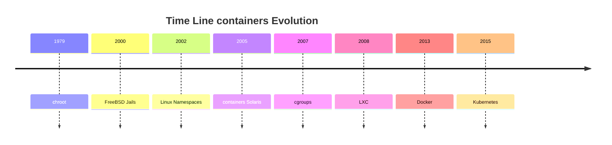
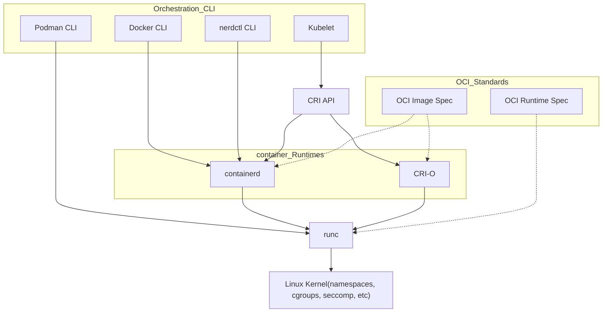
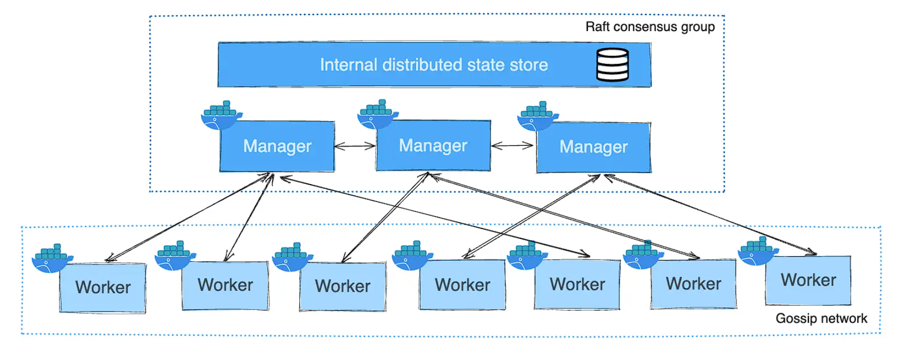
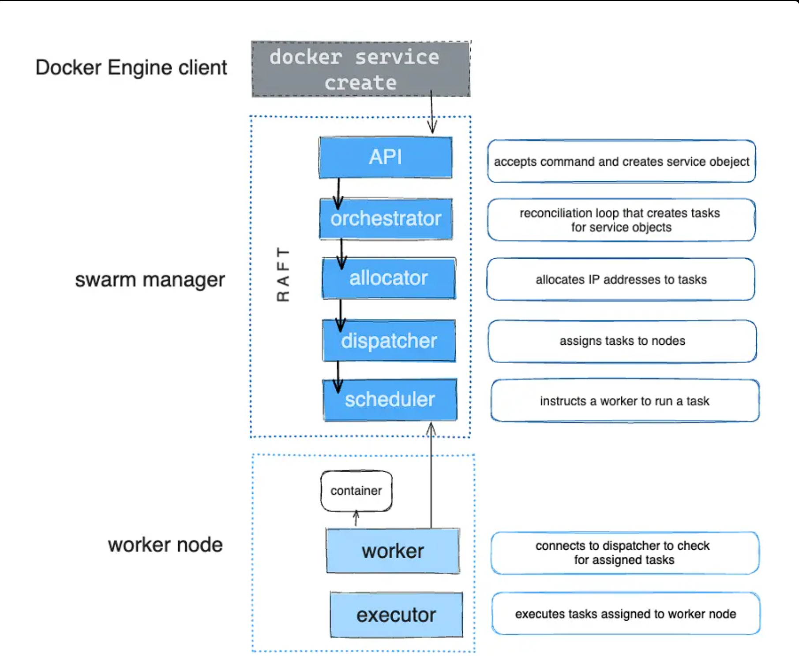
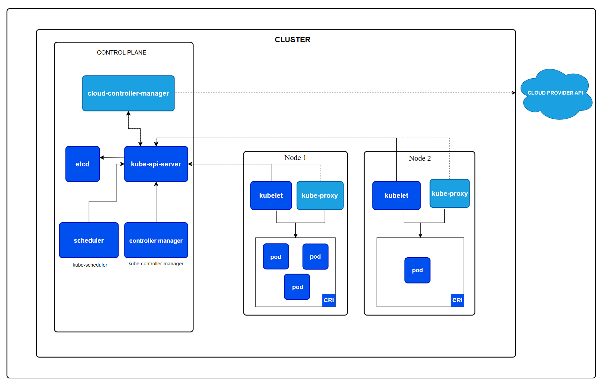

<h1><a name="readme-top"></a></h1>

[](https://github.com/marcossilvestrini/learning-lpic-3-305-300/actions/workflows/release.yml)
[](https://github.com/marcossilvestrini/learning-lpic-3-305-300/actions/workflows/translate.yml)
[](https://github.com/marcossilvestrini/learning-lpic-3-305-300/actions/workflows/generate-html.yml)
[](https://github.com/marcossilvestrini/learning-lpic-3-305-300/actions/workflows/deploy-webpage.yml)
[](https://github.com/marcossilvestrini/learning-lpic-3-305-300/actions/workflows/generate-docs.yml)
[](https://github.com/marcossilvestrini/learning-lpic-3-305-300/actions/workflows/powershell.yml)
[](https://github.com/marcossilvestrini/learning-lpic-3-305-300/actions/workflows/slack.yml)

---

[![Licença MIT][license-shield]][license-url]
[![Forks][forks-shield]][forks-url]
[![Stargazers][stars-shield]][stars-url]
[![Contributors][contributors-shield]][contributors-url]
[![Issues][issues-shield]][issues-url]
[![LinkedIn][linkedin-shield]][linkedin-url]

---

# 📚 LEARNING LPIC-3 305-300

[](./README.md)
[](README_pt.md)


<p align="center"><strong>Explore the docs »</strong>
    <br />
    <a href="https://marcossilvestrini.github.io/learning-lpic-3-305-300/">Web Site</a>
    -
    <a href="https://github.com/marcossilvestrini/learning-lpic-3-305-300">Code Page</a>
    -
    <a href="https://skynet-8.gitbook.io/learning-lpic-3-305-300">Gitbook</a>
    -
    <a href="https://github.com/marcossilvestrini/learning-lpic-3-305-300/issues">Report Bug</a>
    -
    <a href="https://github.com/marcossilvestrini/learning-lpic-3-305-300/issues">Request Feature</a>
</p>

---

## 🗂️ Summary

<details><summary><b>TABELA DO CONTEÚDO</b></summary>
  <ol>
    <li><a href="#about-the-project">Sobre o Projeto</a>
    </li>
    <li>U<a href="#getting-started">Primeiros passos</a>
      <ul>
        <li><a href="#prerequisites">Pré-requisitos</a></li>
        <li><a href="#installation">Instalação</a></li>
      </ul>
    </li>
    <li><a href="#usage">Uso</a></li>
    <li><a href="#roadmap">Roteiro</a></li>
    <li><a href="#freedoms">Four Essential Freedoms</a></li>
    <li><a href="#topic-351">Tópico 351: Virtualização completa</a>
      <ul>
        <li><a href="#topic-351.1">351.1 Conceitos de Virtualização e Teoria </a></li>
        <li><a href="#topic-351.2">351.2 Xen</a></li>
        <li><a href="#topic-351.3">351.3 QEMU</a></li>
        <li><a href="#topic-351.4">351.4 Máquina Virtual Libvirt</a></li>
        <li><a href="#topic-351.5">351.5 de Gerenciamento de Imagens da Máquina Virtual</a></li>
      </ul>
    </li>
    <li><a href="#topic-352">Tópico 352: Virtualização do recipiente</a>
      <ul>
        <li><a href="#topic-352.1">352.1 Container Virtualização de Contenção</a></li>
        <li><a href="#topic-352.2">352.2 LXC</a></li>
        <li><a href="#topic-352.3">352.3 Docker</a></li>
        <li><a href="#topic-352.4">352.4 Plataformas de Container Orchestration</a></li>
      </ul>
    </li>
    <li><a href="#topic-353">Tópico 353: Implantação da VM e provisionamento</a>
      <ul>
        <li><a href="#topic-353.1">353.1 Ferramentas de gerenciamento de nuvem</a></li>
        <li><a href="#topic-353.2">353.2 Pacotes</a></li>
        <li><a href="#topic-353.3">353.3 cloud-init</a></li>
        <li><a href="#topic-353.4">353.4 Vagabundo</a></li>
      </ul>
    </li>
    <li>Licença <a href="#license"></a></li>
    <li><a href="#contact">Contatar</a></li>
    <li><a href="#acknowledgments">Acknowledgments</a></li>
  </ol>
</details><br>

---

<a name="about-the-project"></a>

## 📖 Sobre o projeto

> Este projeto visa ajudar estudantes ou profissionais a aprender os principais conceitos de GNULinux
> e software livre
> Algumas distribuições GNULinux, como Debian e RPM, serão cobertas por
> Instalação e configuração de alguns pacotes também serão cobertas por
> Ao fazer isso, você pode dar a toda a comunidade uma oportunidade de se beneficiar de suas alterações.
> O acesso ao código fonte é uma condição prévia para isso.
> Use `Vagrant` for up machines and execute labs and practice content in this article.
> Publiquei na pasta Vagrant um Vagrantfile com o que é necessário
> para que você carregue um ambiente para estudos

---

<p align="right">(<a href="#readme-top">back to top</a>)</p>

<a name="getting-started"></a>

## 🚀 Primeiros passos

Para iniciar o aprendizado, consulte a documentação acima.

<a name="prerequisites"></a>

### 🛠️ Pré-requisitos

- [Git](https://git-scm.com/book/en/v2/Getting-Started-Installing-Git)
- [Trabalho VMware](https://blogs.vmware.com/workstation/2024/05/vmware-workstation-pro-now-available-free-for-personal-use.html)
- [Utilidade VMWare Vagrante](https://developer.hashicorp.com/vagrant/install/vmware)
- [Vagrant](https://developer.hashicorp.com/vagrant/install)

<a name="installation"></a>

### 💾 Instalação

Clonar o repositório

```sh
clone git https://github.com/marcossilvestrini/learning-lpic-3-305-300.git
cd learning-lpic-3-305-300
```

Personalize um modelo _Vagrantfile-topic-XXX_. Este arquivo contém uma configuração vms para laboratórios.  
Exemplo:

- Arquivo [Vagrantfile-topic-351](vagrant/Vagrantfile-topic-351)
  - vm.clone_directory = "<your_driver_letter>:\\`<folder>`\\<to_machine>\\#{VM_NAME}-instance-1"
    Exemplo: vm.clone_directory = "E:\\Servers\\VMWare\\#{VM_NAME}-instance-1"
  - vm.vmx["memsize"] = ""
  - vm.vmx["numvcpus"] = ""
  - vm.vmx["cpuid.coresPerSocket"] = ""

Personalizar configuração de rede em arquivos [configs/network](configs/network/).

---

<a name="usage"></a>

## 📝 Uso

Use este repositório para aprender sobre o exame LPIC-3 305-300

### ⬆️⬇️ Para cima e para baixo

Mudar um template _Vagrantfile-topic-xxx_ e copiar para um novo arquivo com o nome _Vagrantfile_

```sh
cd vagrant && vagrant subiu
cd vagrant && vagrant destruir -f
```

### 🔄 Para reiniciar VMs

```sh
cd vagrant && vagrant reload
```

**Importante:**
_Se você reiniciar vms sem vagrant, pasta compartilhada não monta após a inicialização._

### 💻 Use PowerShell para cima e para baixo

Se você usa a plataforma Windows, eu crio um script powershell para as vms de cima e baixo.

```powershell
vagrant/up.ps1
vagrant/destroy.ps1
```

### 🗺️ Tópico de esquema de infraestrutura 351


<p align="right">(<a href="#readme-top">back to top</a>)</p>

---

<a name="roadmap"></a>

## :auto-estrada y: Roteiro

- [x] Criar repositório
- [x] Criar scripts para laboratórios de provisionamento
- [x] Criar exemplos de tópico 351
- [x] Crie exemplos sobre o tópico 352
- [x] Crie exemplos sobre o tópico 353
- [ ] Upload simulado itexam

---

<a name="freedoms"></a>

## :Statue_of_Liberdade: Quatro Liberdades Essenciais

> **0**: A liberdade de executar o programa como você quiser, para qualquer propósito (liberdade 0).  
> **1**: A liberdade de estudar como o programa funciona e alterá-lo para que
> faça a sua computação como você quiser (liberdade 1).
> O acesso ao código fonte é uma condição prévia para isso.  
> **2**: A liberdade de redistribuir cópias para que você possa ajudar os outros (liberdade 2).  
> **3**: A liberdade de distribuir cópias de suas versões modificadas para outros (liberdade 3).

---

## 🔍 Inspecionar comandos

```sh
tipo COMANDO # verifique se o comando é um apelido, função, embutido ou arquivo
apropos COMANDO # busca por COMANDO em descrições manuais da página 
whatis COMANDO --long # procura por COMANDO em descrições manuais da página com saída
whereis COMAND # localizar o binário, arquivos de página de origem e manual para COMANDO
COMANDO --help --h # exibe informações de ajuda para COMANDO
homem COMANDO # exibe a página manual para COMANDO
```

<p align="right">(<a href="#readme-top">back to top</a>)</p>

---

<a name="topic-351"></a>

## 🖥️ Tópico 351: Virtualização completa


---

<a name="topic-351.1"></a>

### 🧠 351.1 Conceitos de Virtualização e Teoria

**Peso:** 6

**Descrição:** Os candidatos devem saber e entender os conceitos gerais, a teoria e a terminologia da virtualização. Isto inclui Xen, QUEM e terminologia libvirt.

**Conhecimento Chave Itens:**

- 🖥️ Compreender a terminologia de virtualização
- ⚖️ Compreenda os prós e contras da virtualização
- 🛠️ Entenda as várias variações de Hypervisores e Monitores de Máquina Virtual
- 🔄 Entenda os principais aspectos da migração física para máquinas virtuais
- 🚀 Entenda os principais aspectos da migração de máquinas virtuais entre sistemas de hospedagem
- 📸 Entenda os recursos e implicações da virtualização para uma máquina virtual, como instantâneo, pausa, clonagem e limites de recursos
- 🌐 Consciência do oVirt, Proxmox, systemd-machined e VirtualBox
- 🔗 Percepção do Open vSwitch

#### 📋 351.1 Objetos Citados

```sh
Hypervisor
Máquina Virtual de Hardware (HVM)
Paravirtualização (PV)
Emulação e Simulação
flags da CPU
/proc/cpuinfo
Migração (P2V, V2V)
```

#### 🖥️ Hipervisores

##### 🏢 Digite 1 Hypervisor (Hypervisor de Metal)

###### 📄 Definição tipo 1

Executa diretamente no hardware físico do host, fornecendo uma camada base para gerenciar VMs sem a necessidade de um sistema operacional do host.

###### 📝 Características do Tipo 1

- ⚡ Alto desempenho e eficiência.
- ⏱️ latência e acima da cabeça.
- 🏢 Frequentemente usado em ambientes corporativos e centros de dados.

###### 💡 Exemplos de tipo 1

- VMware ESXi: Um hipervisor robusto e amplamente utilizado nas configurações da empresa.
- Microsoft Hyper-V: Integrado com Windows Server, oferecendo um forte desempenho e recursos de gerenciamento.
- Xen: Um hipervisor de código aberto usado por muitos provedores de serviços de nuvem.
- KVM (Máquina Virtual baseada em Kernel): Integrada no kernel do Linux, proporcionando alto desempenho para sistemas baseados no Linux.

##### 🏠 Hipervisor tipo 2 (Hosted Hypervisor)

###### 📄 Definição tipo 2

Executa em cima de um sistema operacional convencional, dependendo do sistema operacional host para gerenciamento de recursos e suporte a dispositivos.

###### 📝 Tipo 2 Características

- 🛠️ Mais fácil de configurar e usar, especialmente em computadores pessoais.
- 🔧 Mais flexível para desenvolvimento, testes e implantações de menor escala.
- 🐢 Normalmente menos eficiente do que os hipervisores do tipo 1 devido a sobrecarga adicional do sistema operacional host.

###### 💡 Exemplos de tipo 2

- Estação de Trabalho VMware: Um hipervisor poderoso para a execução de vários sistemas operacionais em um único desktop.
- Oracle VirtualBox: Um hipervisor de código aberto conhecido pela sua flexibilidade e facilidade de uso.
- Área de trabalho paralela: Desenvolvida para usuários Mac que rodem o Windows e outros sistemas operacionais ao lado do macOS.
- QUEM (EMUlator rápido): Um emulador e virtualizador de código aberto, muitas vezes usado em conjunto com o KVM.

##### ⚖️ Diferenças principais entre Hipervisores do tipo 1 e do tipo 2

- Ambiente de implantação:
  - O tipo 1 é comumente implantado em centros de dados e ambientes corporativos devido à sua interação direta com hardware e alto desempenho.
  - Hipervisores de tipo 2 são mais adequados para uso pessoal, desenvolvimento, testes e tarefas de virtualização de pequena escala.
- Desempenho:
  - Hipervisores tipo 1 geralmente oferecem melhor desempenho e menor latência porque eles não dependem de um sistema operacional hospedeiro.
  - Hipervisores de tipo 2 podem sofrer alguma degradação de desempenho devido ao excesso de execução no topo do sistema operacional de host.
- Gerenciamento e Facilidade de Uso:
  - Hipervisores de tipo 1 requerem uma configuração e gerenciamento mais complexos, mas fornecem recursos avançados e escalabilidade para implantações em grande escala.
  - hipervisores de tipo 2 são mais fáceis de instalar e usar, tornando-os ideais para usuários individuais e projetos menores.

##### 🔄 Tipos de Migração

No contexto dos hipervisores, que são tecnologias usadas para criar e gerenciar máquinas virtuais, os termos de migração P2V e migração V2V são comuns em ambientes de virtualização.
Eles se referem a processos de migração de sistemas entre diferentes tipos de plataformas.

##### 🖥️➡️🖥️ P2V - Migração física a Virtual

Migração P2V refere-se ao processo de migração de um servidor físico para uma máquina virtual. n outras palavras, um sistema operacional e seus aplicativos, executando em hardware físico dedicado, são "convertidos" e movidos para uma máquina virtual que é executada em um hipervisor (como VMware, Hyper-V, KVM, etc.).

- Exemplo: Você tem um servidor físico rodando um sistema Windows ou Linux, e você quer movê-lo para um ambiente virtual, como uma infraestrutura de nuvem ou um servidor de virtualização interna.
  O processo envolve a cópia de todo o Estado do sistema, incluindo o sistema operacional, os condutores, e dados, para criar uma máquina virtual equivalente que pode rodar como se estivesse no hardware físico.

##### 🖥️🔁🖥️ V2V - Migração Virtual

A migração V2V refere-se ao processo de migração de uma máquina virtual de um hipervisor para outro. Neste caso, você já tem uma máquina virtual executando em um ambiente virtualizado (como VMware), e você quer movê-lo para outro ambiente virtualizado (por exemplo, para o Hyper-V ou para um novo servidor VMware).

- Exemplo: Você tem uma máquina virtual executando em um servidor de virtualização VMware, mas decide migrá-la para uma plataforma Hyper-V. Neste caso, a migração V2V converte a máquina virtual de um formato ou hipervisor para outro, garantindo que ela possa continuar funcionando corretamente.

#### 🧩 HVM e Paravirtualização

##### ⚙️ Virtualização assistida por hardware (HVM)

###### 📄 Definição HVM

HVM aproveita as extensões de hardware fornecidas por CPUs modernas para virtualizar hardware, permitindo a criação e gerenciamento de VMs com sobrecarga mínima de desempenho.

###### 📝 Características da Chave HVM

- 🖥️ **Suporte a hardware**: Requer suporte à CPU para extensões de virtualização, como Intel VT-x ou AMD-V.
- 🛠️ **Virtualização completa:** VMs podem rodar sistemas operacionais convidados não modificados, pois o hipervisor fornece uma emulação completa do ambiente de hardware.
- ⚡ **Desempenho:** Normalmente oferece um desempenho quase nativo devido à execução direta do código de convidado na CPU.
- 🔒 **Isolação:** Fornece um forte isolamento entre as VMs já que cada VM opera como se tivesse seu próprio hardware dedicado.

###### 💡 Exemplos de HVM

VMware ESXi, Microsoft Hyper-V, KVM (Máquina Virtual Baseada em Kernel).

###### ✅ VM Vantagens

- ✅ **Compatibilidade:** Pode executar qualquer sistema operacional sem modificação.
- ⚡ **Desempenho:** Alto desempenho devido ao suporte ao hardware.
- 🔒 **Segurança:** Isolamento melhorado e recursos de segurança fornecidos por hardware.

###### ❌ Desvantagens de HVM

- 🛠️ **Dependência de hardware:** Requer recursos de hardware específicos, limitando a compatibilidade com sistemas mais antigos.
- 🔧 **Complexidade:** Pode envolver configuração e gerenciamento mais complexos.

##### 🧩 Paravirtualização

###### 📄 Definição de Paravirtualização

Paravirtualização implica modificar o sistema operacional de convidados para estar ciente do ambiente virtual, permitindo-lhe interagir de forma mais eficiente com o hipervisor.

###### 📝 Características de Chave Paravirtualização

- 🛠️ **Modificação de convidado:** Requer alterações no sistema operacional convidado para se comunicar diretamente com o hipervisor usando hiperchamadas.
- ⚡ **Performance:** Pode ser mais eficiente do que a tradicional virtualização completa porque reduz a sobrecarga associada a hardware emulador.
- 🔗 **Compatibilidade:** Limitado aos sistemas operacionais que foram modificados para a paravirtualização.

###### 💡 Exemplos de Paravirtualização

Xen com convidados paravirtualizados, ferramentas para VMware em certas configurações e algumas configurações KVM.

###### ✅ Vantagens da Paravirtualização

- ⚡ **Eficiência:** Reduz a sobrecarga de hardware virtualizando, potencialmente oferecendo melhor desempenho para certas cargas de trabalho.
- ✅ **Utilização de recursos:** Uso mais eficiente de recursos de sistema devido à comunicação direta entre o SO convidado e o hipervisor.

###### ❌ Desvantagens de Paravirtualização

- 🛠️ **Modificações do OS convidado:** Requer modificações no sistema operacional convidado, limitando a compatibilidade com os sistemas operacionais suportados.
- 🔧 **Complexidade:** Requer complexidade adicional no SO convidado para implementações de hiperchamada.

##### ⚖️ Diferenças Principais

###### 🖥️ Requisitos do OS do Guest

- **HVM:** Pode executar sistemas operacionais convidados não modificados.
- **Paravirtualization:** Requer que os sistemas operacionais convidados sejam modificados para trabalhar com o hipervisor.

###### ⚡ Performance

- **HVM:** Normalmente fornece um desempenho quase nativo devido à execução assistida pelo hardware.
- **Paravirtualization:** Pode oferecer desempenho eficiente reduzindo a sobrecarga de emulação de hardware, mas depende do SO de guest modificado.

###### 🧰 Dependência de Hardware

- **HVM:** Requer características específicas da CPU (Intel VT-x, AMD-V).
- **Paravirtualization:** Não requer características específicas da CPU mas precisa do Sistema Operacional de Convidados modificado.

###### 🔒 isolamento

- **VM:** Fornece um forte isolamento usando recursos de hardware.
- **Paravirtualização:** Reconhece o isolamento baseado em software, que pode não ser tão robusto quanto o isolamento baseado em hardware.

###### 🧩 Complexidade

- **HVM:** Geralmente mais simples de implantar, já que ele suporta sistemas operacionais não modificados.
- **Paravirtualization:** Requer configuração adicional e modificações no SO convidado, aumentando a complexidade.

#### 🧠 NUMA (Acesso de Memória Uniform)

NUMA (Non-Uniform Memory Access) é uma arquitetura de memória usada em sistemas multiprocessadores para otimizar o acesso de memória por processadores.
Em um sistema NUMA, a memória é distribuída de forma desigual entre processadores, significa que cada processador tem acesso mais rápido a uma porção de memória (sua "memória local") do que a memória fisicamente mais distante (referida como "memória remota") e associada com outros processadores.

##### 📝 Características Chave da Arquitetura NUMA

1. **Memória Local e Remota**: cada processador tem sua própria memória local, que pode acessar mais rapidamente. No entanto, também pode aceder à memória de outros transformadores, embora isso leve mais tempo.
2. **Latência diferenciada**: a latência do acesso a memória varia dependendo se o processador está acessando sua memória local ou a memória de outro nó. O acesso à memória local é mais rápido, enquanto o acesso à memória de outro nó (remoto) é mais lento.
3. **Escalabilidade**: arquitetura NUMA foi projetada para melhorar a escalabilidade em sistemas com muitos processadores. À medida que mais processadores são adicionados, a memória também é distribuída, evitando o estrangulamento que ocorreria numa arquitectura uniforme de acesso a memória (UMA).

##### ✅ Vantagens de NUMA

- ⚡ Melhor desempenho em Sistemas Grandes: Como cada processador tem memória local, pode funcionar de forma mais eficiente, sem competir tanto com outros processadores pelo acesso a memória.
- :chart_increasing : Escalabilidade: NUMA permite que sistemas com muitos processadores e grandes quantidades de memória escalem escala mais eficientemente em comparação com uma arquitetura UMA.

##### ❌ Desvantagens

- 🛠️ Complexidade de programação: Programadores precisam estar cientes de quais regiões de memória são locais ou remotas, otimizar o uso da memória local para alcançar um melhor desempenho.
- 🐢 Penalidades sobre desempenho potencial: Se um processador frequentemente acessa a memória remota, o desempenho pode sofrer devido a latência mais alta.
  Esta arquitetura é comum em sistemas multiprocessadores de alto desempenho, como servidores e supercomputadores, onde a escalabilidade e a otimização de memória são cruciais.

#### 🆓 Soluções de código-fonte

- 🌐 oVirt: [https://www.ovirt.org/](https://www.ovirt.org/)
- 🌐 Proxmox: [https://www.proxmox.com/en/proxmox-virtual-environment/overview](https://www.proxmox.com/en/proxmox-virtual-environment/overview)
- 🌐 Oracle VirtualBox: [https://www.virtualbox.org/](https://www.virtualbox.org/)
- 🌐 Open vSwitch: [https://www.openvswitch.org/](https://www.openvswitch.org/)

#### 🗂️ Tipos de Virtualização

##### 🖥️ Virtualização de hardware (Virtualização de servidor)

###### 📄 Definição de AT

Abstrata hardware físico para criar máquinas virtuais (VMs) que executam sistemas operacionais separados e aplicativos.

###### 🛠️ HV Use Casos

Centro de dados, computação na nuvem, consolidação do servidor.

###### 💡 HV Examples

VMware ESXi, Microsoft Hyper-V, KVM.

##### 📦 Virtualização do sistema operacional (containerização)

###### 📄 Definição de containerização

Permite que várias instâncias isoladas de espaço de usuário (contêineres) sejam executadas em um núcleo único do SO.

###### 🛠️ Casos de uso de containerization

Arquitetura, desenvolvimento e ambiente de testes, dos microserviços.

###### 💡 Exemplos de containerização

Docker, Kubernetes, LXC.

##### 🌐 Virtualização de Rede

###### 📄 Definição de Virtualização de Rede

Combina recursos de hardware e software de rede em uma entidade administrativa única, baseada em software.

###### 🛠️ Casos de Uso de Rede

virtualização de funções de rede (SDN), rede definida por software (NFV).

###### 💡 Exemplos de Virtualização de Rede

VMware NSX, Cisco ACI, OpenStack Neutron.

##### 💾 Virtualização de Armazenamento

###### 📄 Definição de Virtualização de Armazenamento

Armazena físico de vários dispositivos em uma única unidade de armazenamento virtual que pode ser gerenciada centralmente.

###### 🛠️ Casos de Uso de Virtualização de Armazenamento

Gestão de dados, otimização de armazenamento, recuperação de desastres.

###### 💡 Exemplos de Virtualização de Armazenamento

IBM SAN Control de volume, VMware vSAN, NetApp ONTAP.

##### 🖥️ Virtualização do Desktop

###### 📄 Definição de Virtualização do Desktop

Permite que um sistema operacional desktop seja executado em uma máquina virtual hospedada em um servidor.

###### 🛠️ Computador Virtualização Utilize Casos

Infraestrutura de desktop virtual (VDI), soluções de trabalho remotas.

###### 💡 Exemplos de Virtualização do Desktop

Aplicativos Virtuais e Desktops Citrix, VMware Horizon, Serviços de Desktop Remotos da Microsoft.

##### 📱 Virtualização do Aplicativo

###### 📄 Definição de Virtualização de Aplicação

Separa aplicativos do hardware subjacente e do sistema operacional, permitindo-lhes executar em ambientes isolados.

###### 🛠️ Aplicação Virtualização Utilize Casos

Implementação simplificada de aplicação, teste de compatibilidade.

###### 💡 Exemplos de Virtualização de Aplicação

VMware ThinApp, Microsoft App-V, Citrix XenApp.

##### 🗃️ Virtualização de dados

###### 📄 Definição de Virtualização de Dados

Integra dados de várias fontes sem os consolidar fisicamente, proporcionando uma visão unificada para análise e relatório.

###### 🛠️ Data Virtualization Use Casos

Inteligência comercial, integração de dados em tempo real.

###### 💡 Exemplos de Virtualização de Dados

Denodo, Chapéu Vermelho JBoss Data Virtualization, IBM InfoSphere.

##### 🌟 Benefícios da virtualização

- ⚡ Eficiência de Recursos: Melhor utilização de recursos físicos.
- 💰 Economia de custo: Redução de hardware e custos operacionais.
- 📈 Escalabilidade: Fácil de aumentar ou diminuir de acordo com a demanda.
- 🔧 Flexibilidade: Suporta uma variedade de carregamentos e aplicativos.
- 🔄 Recuperação de Disaster : Backup simplificado e processos de recuperação.
- 🔒 Isolamento: Melhorada a segurança através do isolamento de ambientes.

#### Emulação

Emulação envolve simular o comportamento de hardware ou software em uma plataforma diferente do pretendido originalmente.

Este processo permite que o software projetado para um sistema seja executado em outro sistema que pode ter uma arquitetura ou ambiente de operação diferente.

Enquanto a emulação fornece versatilidade ao habilitar a execução de sistemas operacionais ou aplicativos de convidados não modificados, muitas vezes ele vem com excesso de desempenho.

Este excesso surge porque o sistema emulado precisa de interpretar e traduzir instruções destinadas ao sistema original em instruções compatíveis com o sistema de hospedagem. Como resultado, a emulação pode ser mais lenta do que a execução nativa, tornando-a menos eficiente para tarefas intensivas em recursos.

Apesar desta desvantagem, a emulação permanece valiosa para executar software legado, testando aplicativos em diferentes plataformas e facilitando o desenvolvimento entre plataformas.

#### encaixado-sistema

O serviço de máquina de sistema é dedicado ao gerenciamento de máquinas virtuais e contêineres dentro do ecossistema do sistema.
Proporciona funcionalidades essenciais para controlar, monitorizar e manter instâncias virtuais, oferecendo uma integração e eficiência robustas nos ambientes Linux.

<p align="right">(<a href="#topic-351.1">voltar a sub tópico 351.1</a>)</p>
<p align="right">(<a href="#topic-351">back to Topic 351</a>)</p>
<p align="right">(<a href="#readme-top">back to top</a>)</p>

---

<a name="topic-351.2"></a>

### 🐧 351.2 Xen


**Peso:** 3

**Descrição:** Os candidatos devem ser capazes de instalar, configurar, manter, migrar e solucionar instalações de Xen. O foco é na versão 4.x do Xen.

**Conhecimento Chave Itens:**

- Compreender a arquitetura do Xen, incluindo rede e armazenamento
- Configuração básica de nós e domínios Xen
- Gerenciamento básico de nós e domínios de Xen
- Solução de problemas básica de instalações Xen
- Prevenção da XAPI
- Prevenção da XenStore
- Prevenção de Parâmetros Xen Boot
- Prevenção da utilidade xm

#### 🐧 Xen


Xen é um hipervisor de tipo open-source (bare-metal), que permite que vários sistemas operacionais sejam executados simultaneamente no mesmo hardware físico. en fornece uma camada entre o hardware físico e as máquinas virtuais (VM), permitindo o compartilhamento eficiente de recursos e o isolamento.

- **Arquitetura:** Xen opera com um sistema de dois níveis onde o Domínio 0 (Dom0) é o domínio privilegiado com acesso direto ao hardware e gerencia o hipervisor. Outras máquinas virtuais, chamadas de Domain U (DomU), sistemas operacionais convidados e são gerenciados por Dom0.
- **Tipos de Virtualização:** Xen suporta tanto a paravirtualização (PV), que requer um guest OS modificado como a virtualização assistida por hardware (HVM), que usa extensões de hardware (e. ., Intel VT-x ou AMD-V) para executar sistemas operacionais convidados não modificados.
  Xen é amplamente utilizado em ambientes em nuvem, principalmente pela Amazon Web Services (AWS) e outros provedores de nuvem em grande escala.

#### 🏢 XenSource

XenSource foi a empresa fundada pelos desenvolvedores originais do hipervisor Xen na Universidade de Cambridge para comercializar Xen. sua empresa forneceu soluções corporativas com base em Xen e ofereceu ferramentas adicionais e suporte para melhorar as capacidades de Xen para uso empresarial.

- **Aquisição por Citrix**: Em 2007, XenSource foi adquirido por Citrix Systems, Inc. Citrix usou a tecnologia Xen como base para o seu produto Citrix XenServer, que se tornou uma popular plataforma de virtualização de nível empresarial baseada em Xen.
- **Transição**: Após a aquisição, o projeto Xen continuou como um projeto de código aberto, enquanto Citrix se concentrou em ofertas comerciais como XenServer, aproveitando a tecnologia XenSource.

#### :globe_showing_Europe-África: Projeto Xen

O Projeto Xen refere-se à comunidade de código aberto e à iniciativa responsável pelo desenvolvimento e manutenção do hipervisor Xen após sua comercialização. Ele o Projeto Xen opera sob a Fundação Linux, com foco em construir, melhorar e apoiar o Xen como um esforço colaborativo e orientado para a comunidade.

- **Objetivos:** O Projeto Xen visa fazer avançar o hipervisor, melhorando seu desempenho, segurança, e recursos definidos para uma ampla variedade de casos de uso, incluindo computação em nuvem, virtualização focada em segurança (e. ., OS de Qubos) e sistemas embutidos.
- **Contribuidores:** O projeto inclui colaboradores de várias organizações, incluindo principais provedores de nuvem, fornecedores de hardware e desenvolvedores independentes.
- **XAPI e XenTools:** O Projeto Xen também inclui ferramentas como XAPI (XenAPI), que é usado para gerenciar instalações do hipervisor Xen, e vários outros utilitários para gerenciamento do sistema e otimização.

#### 🗄️ XenStore

Xen Store é um componente crítico do Hypervisor Xen.
Essencialmente, Xen Store é um banco de dados distribuído usado para compartilhamento de informações e comunicação entre o hipervisor Xen e as máquinas virtuais (também conhecidas como domínios) que ele gerencia.

Aqui estão alguns aspectos-chave da Loja Xen:

- **Comunicação Inter-Domínio:** Xen Store permite a comunicação entre domínios, tal como Dom0 (o domínio privilegiado que controla os recursos de hardware) e DomUs (domínios do usuário, que são as VMs). Isso é feito através de entradas de valor chave, onde cada domínio pode ler ou escrever informações.
- **Gerenciamento de Configuração:** É usado para armazenar e acessar as informações de configuração, como dispositivos virtuais, redes e parâmetros de inicialização. Isso facilita a gestão dinâmica e a configuração das VMs.
- **Eventos e Notificações:** Xen Store também suporta notificações de eventos. Quando uma chave ou valor específico na Loja Xen é modificado, os domínios interessados podem ser notificados para reagir a essas mudanças. Isso é útil para monitorização e gestão de recursos.
- API simples: Xen Store fornece uma API simples para leitura e escrita de dados, facilitando a integração de seus aplicativos com o sistema de virtualização Xen.

#### 🔗 XAPI

XAPI, ou XenAPI, é a interface de programação de aplicativos (API) usada para gerenciar o Xen Hypervisor e suas máquinas virtuais (VMs).
XAPI é um componente chave do XenServer (agora conhecido como Citrix Hypervisor) e fornece uma maneira padronizada de interagir com o hipervisor Xen para executar operações como a criação, configurando, monitorando e controlando VMs.

Aqui estão alguns aspectos importantes do XAPI:

- **Gerenciamento VM:** XAPI permite que os administradores criem, removam, iniciem e parem as máquinas virtuais.
- **Automação:** Com o XAPI, é possível automatizar o gerenciamento de recursos virtuais, incluindo rede, armazenamento e computação, o que é crucial para grandes ambientes em nuvem.
- **Integração:** XAPI pode ser integrado com outras ferramentas e scripts para fornecer uma administração mais eficiente e personalizada do ambiente Xen.
- **Controle de Acesso:** XAPI também fornece mecanismos de controle de acesso para garantir que apenas usuários autorizados possam executar operações específicas no ambiente virtual.

XAPI é a interface que permite controle e automação do Hypervisor Xen, tornando mais fácil o gerenciamento de ambientes virtualizados.

#### 📝 Xen Summary

- **Xen:** A tecnologia central de hipervisor que permite que as máquinas virtuais rodem em hardware físico.
- **XenSource:** A empresa que comercializou Xen, adquirida mais tarde pela Citrix, levando ao desenvolvimento de Citrix XenServer.
- **Projeto Xen:** A iniciativa e comunidade de código aberto que continua a desenvolver e manter o hipervisor Xen sob a Fundação Linux.
- **XenStore:** Xen Store atua como intermediário de comunicação e configuração entre o hipervisor Xen e as VMs, simplificando a operação e a gestão de ambientes virtualizados.
- **XAPI** é a interface que permite controle e automação do Hypervisor Xen, tornando mais fácil o gerenciamento de ambientes virtualizados.

#### 🖥️ Domain0 (Dom0)

Domain0 ou Dom0, é o domínio de controle de uma arquitetura Xen. Gerencia outros domínios (Domínios) e tem acesso direto ao hardware.
O Dom0 executa drivers do dispositivo, permitindo domínios que não têm acesso direto a hardware, para se comunicar com dispositivos. Normalmente, é uma instância completa de um sistema operacional, como o Linux, e é essencial para a operação do hipervisor Xen.

#### 💻 DomainU (DomU)

Domínios são domínios não privilegiados que rodam máquinas virtuais.
São geridos por Dom0 e não têm acesso directo ao hardware. Os domínios podem ser configurados para executar sistemas operacionais diferentes e são usados para vários fins, como servidores de aplicação e ambientes de desenvolvimento. Eles dependem do Dom0 para a interação de hardware.

#### 🧩 PV-DomU (Domínio Paravirtualizado)

O PV-DomUs usa uma técnica chamada paravirtualização. Neste modelo, o sistema operacional DomU foi modificado para estar ciente de que ele é executado em um ambiente virtualizado. permitindo que se comunique diretamente com o hipervisor para um desempenho otimizado.
Isto resulta numa redução da sobrecarga e numa maior eficiência em comparação com a plena virtualização.

#### ⚙️ HVM-DomU (Domínio de Máquina Virtual Hardware)

HVM-DomUs são máquinas virtuais que utilizam a virtualização total, permitindo que sistemas operacionais não modificados sejam executados. O hipervisor Xen fornece a emulação de hardware para estes DomUs, permitindo que eles executem qualquer sistema operacional que suporte a arquitetura de hardware subjacente.
Embora esta proposta ofereça maior flexibilidade, pode resultar em maior ultrapassagem em comparação com o PV-Domínio.

#### 🌐 Rede Xen

Dispositivos de Rede Paravirtualizados


Bridging


#### 📋 351.2 Objetos Citados

```sh
Domínio (Domínio), DomainU (Domínio)
PV-DomU, HVM-DomU
/etc/xen/
xl
xl. fg 
xl.conf # Configurações globais Xen
xentop
oxenstored # Configuração Xenstore
```

#### 📝 351.2 Notas

```sh

# Xen Settings
/etc/xen/
/etc/xen/xl.conf - Main general configuration file for Xen
/etc/xen/oxenstored.conf - Xenstore configurations

# VM Configurations
/etc/xen/xlexample.pvlinux
/etc/xen/xlexample.hvm

# Service Configurations
/etc/default/xen
/etc/default/xendomains

# xen-tools configurations
/etc/xen-tools/
/usr/share/xen-tools/

# docs
xl(1)
xl.conf(5)
xlcpupool.cfg(5)
xl-disk-configuration(5)
xl-network-configuration(5)
xen-tscmode(7)

# initialized domains auto
/etc/default/xendomains
   XENDOMAINS_AUTO=/etc/xen/auto

/etc/xen/auto/

# set domain for up after xen reboot
## create folder auto
cd /etc/xen && mkdir -p auto && cd auto

# create symbolic link
ln -s /etc/xen/lpic3-pv-guest /etc/xen/auto/lpic3-pv-guest
```

##### vif

No Xen, "vif" significa Interface Virtual e é usado para configurar redes para máquinas virtuais (domínios).

Especificando diretivas "vif" nos arquivos de configuração do domínio, os administradores podem definir interfaces de rede, atribuir endereços IP, configurar VLANs e configurar outros parâmetros de rede para máquinas virtuais em execução nos hosts Xen. Por exemplo: vif = ['bridge=xenbr0'], neste caso, conecta a interface de rede da VM à bridge Xen chamada "xenbr0".

#### Laboratório Xen

Use este script para o fornecimento de laboratório: [xen.sh](scripts/xen/xen.sh)

#### 💻 351.2 Comandos Importantes

##### 🏗️ xen-create-image

```sh
# criar uma imagem de pv
xen-create-image \
  --hostname=lpic3-pv-guest \
  --memory=1gb \
  --vcpus=2 \
  --lvm=vg_xen \
  --bridge=xenbr0 \
  --dhcp \
  --pygrub \
  --password=vagrant \
  --dist=bookworm
```

##### 📄 xen-list-images

```sh
# lista imagem
xen-list-images
```

##### ❌ xen-delete-image

```sh
# delete a pv image
xen-delete-image lpic3-pv-guest --lvm=vg_xen
```

##### 🗄️ xenstore-ls

```sh
# list xenstore infos
sudo xenstore-ls
```

##### ⚙️ xl

```sh
# xl requires privileged access to Xen control interfaces (Dom0)
# run all xl operations with sudo

# view xen information
sudo xl info

# list Domains
sudo xl list
sudo xl list lpic3-hvm-guest
sudo xl list lpic3-hvm-guest -l

# create DomainU - virtual machine
sudo xl create /etc/xen/lpic3-pv-guest.cfg

# create DomainU virtual machine and connect to guest
sudo xl create -c /etc/xen/lpic3-pv-guest.cfg

# uptime Domains
sudo xl uptime

# pause Domain
sudo xl pause 2
sudo xl pause lpic3-hvm-guest

# save state Domains
sudo xl -v save lpic3-hvm-guest ~root/image-lpic3-hvm-guest.save

# restore Domain
sudo xl restore /root/image-lpic3-hvm-guest.save

# get Domain name
sudo xl domname 2

# view dmesg information
sudo xl dmesg

# monitoring domain
sudo xl top
xentop

# Limit mem Dom0
sudo xl mem-set 0 2048

# Limit cpu (not permanent after boot)
sudo xl vcpu-set 0 2

##----------------------------------------------
# create DomainU virtual machine HVM

## create logical volume
lvcreate -l +20%FREE -n lpic3-hvm-guest-disk vg_xen

## optional: create a ssh tunnel for VNC (secondary view only)
ssh -l vagrant -L 5900:localhost:5900 192.168.0.130

## extract installer kernel/initrd from ISO (one-time)
mkdir -p /var/lib/xen/boot/debian12 /mnt/debian-iso
mount -o loop /home/vagrant/isos/debian/debian-12.8.0-amd64-DVD-1.iso /mnt/debian-iso
cp -f /mnt/debian-iso/install.amd/vmlinuz /var/lib/xen/boot/debian12/
cp -f /mnt/debian-iso/install.amd/initrd.gz /var/lib/xen/boot/debian12/
umount /mnt/debian-iso

## start HTTP server to publish preseed.cfg
cd configs/xen/hvm/debian
python3 -m http.server 8000

## optional: validate that preseed.cfg is reachable
curl http://192.168.0.130:8000/preseed.cfg

## create HVM domain and attach to the Xen serial console
sudo xl create configs/xen/hvm/debian/lpic3-hvm-guest-debian-auto.cfg -c

## reconnect later, if needed
sudo xl console <id_or_name>

## note:
## the unattended installer was configured for text mode on ttyS0
## so the active installation appears in xl console, not in VNC
## VNC may show only the guest VGA framebuffer or early boot messages

## after installation finished, destroy domain if still running:
sudo xl destroy <id_or_name>

## create HVM domain from installed disk


## access runtime domain
sudo xl console <id_or_name>
##----------------------------------------------

# connect in domain guest
sudo xl console <id>|<name> (press enter)
sudo xl console 1
sudo xl console lpic3-pv-guest

#How do I exit domU "xl console" session
#Press ctrl+] or if you're using Putty press ctrl+5.

# Poweroff domain
sudo xl shutdown lpic3-pv-guest

# destroy domain
sudo xl destroy lpic3-pv-guest

# reboot domain
sudo xl reboot lpic3-pv-guest

# list block devices
sudo xl block-list 1
sudo xl block-list lpic3-pv-guest

# detach block devices
sudo xl block-detach lpic3-hvm-guest hdc
sudo xl block-detach 2 xvdc

# attach block devices

## hard disk devices
sudo xl block-attach lpic3-hvm-guest-ubuntu 'phy:/dev/vg_xen/lpic3-hvm-guest-disk2,xvde,w'

## cdrom
sudo xl block-attach lpic3-hvm-guest 'file:/home/vagrant/isos/ubuntu/seed.iso,xvdc:cdrom,r'
sudo xl block-attach 2 'file:/home/vagrant/isos/ubuntu/seed.iso,xvdc:cdrom,r'

# insert and eject cdrom devices
sudo xl cd-insert lpic3-hvm-guest-ubuntu xvdb  /home/vagrant/isos/ubuntu/ubuntu-24.04.1-live-server-amd64.iso
sudo xl cd-eject lpic3-hvm-guest-ubuntu xvdb
```

<p align="right">(<a href="#topic-351.2">voltar a sub tópico 351.2</a>)</p>
<p align="right">(<a href="#topic-351">back to Topic 351</a>)</p>
<p align="right">(<a href="#readme-top">back to top</a>)</p>

---

<a name="topic-351.3"></a>

### 🖥️ 351.3 QUEM


**Peso:** 4

**Descrição:** Os candidatos devem ser capazes de instalar, configurar, manter, migrar e solucionar as instalações da QEM.

**Conhecimento Chave Itens:**

- Entenda a arquitetura da QEMU, incluindo KVM, rede e armazenamento
- Inicie instâncias de QUEM na linha de comando
- Gerencie instantâneos usando o monitor QEMM
- Instale os motoristas do QEMU Guest Agent e dos dispositivos VirtIO
- Solucionar problemas de instalações da QEM, incluindo redes e armazenamento.
- Consciência de importantes parâmetros de configuração da QUEM

#### 📋 351.3 Objetos Citado

```sh
Módulos do kernel: kvm, kvm-intel e kvm-amd
/dev/kvm
QEMU monitor
qemu
qemu-system-x86_64
ip
brctl
tunctl
```

#### Compreensão de KVM e QUEM

Nesta seção, estudamos virtualização no Linux, entendendo o papel de cada componente:
o que a QUEM faz, o que KVM faz, e porque ambos são normalmente usados juntos na produção.

##### O que é QEMU?

A QUEM (Emulador rápido) é um monitor de máquina virtual de aplicativos e emulador de hardware.
É responsável pela criação e gestão do processo de máquina virtual e pela exposição dos dispositivos virtuais ao visitante.

Principais responsabilidades da QEMU:

- Emula ou virtualiza a execução da CPU para sistemas de convidados.
- Fornece hardware virtual (controladores de disco, NICs, exibição, USB, dispositivos PCI, etc.).
- Carrega firmware convidado/boot mídia de convidado e inicia inicialização de convidados.
- Gerencia os recursos de VM e controles de tempo de execução (snapshots, comandos de monitoramento, hooks de migração).
- Suporta muitas arquiteturas de máquina (x86_64, aarch64, ppc64 e outros).

When QEMU runs without hardware acceleration, guest CPU instructions are translated in software (TCG),
which is flexible but slower.

##### O que é KVM?

KVM (Máquina Virtual baseada em Kernel) é um framework de virtualização de kernel Linux.
Ele transforma o kernel do Linux em um hipervisor, expondo recursos de virtualização através de `/dev/kvm`.

Principais responsabilidades do KVM:

- Usa extensões de virtualização da CPU (Intel VT-x / AMD-V) para execução de convidados acelerados. Esta característica geralmente é chamada de virtualização assistida por hardware (HVM).
- Fornece suporte ao nível de kernel para transições de privilégios de convidado (modo convidado vs modo host.
- Gerencia mecanismos de virtualização de baixo nível como a execução da vCPU e interrompe a virtualização.
- Expõe uma API para VMMs de espaço do usuário (como QEMU) por ioctls em `/dev/kvm`.

KVM por si só não é um gerenciador de VM completo com modelos de dispositivo ricos; é a camada de aceleração/hipervisor.

##### Como a QUEM e a KVM trabalham em conjunto

Na pilha comum do Linux, QEMU é a VMM do userspace e KVM é o backend de aceleração do kernel:

- A QUEM cria a VM e os aparelhos virtuais.
- A QUEM pede à KVM que rode vCPUs com aceleração de hardware.
- A KVM executa o código da CPU convidado perto de velocidade nativa.
- A QUEM ainda lida com modelos I/O e dispositivos emulados.

Resultado prático:

- `qemu-system-x86_64` sem `-enable-kvm` funciona como emulação (mais lento, mas útil para cross-arch/labs).
- `qemu-system-x86_64 -enable-kvm` usa aceleração de hardware (mais rápido, típico para cargas de trabalho reais).

##### KVM vs QUEM (Comparação Rápida)

| Aspecto               | **QEMU**                                                  | **KVM**                                                                 |
| :-------------------- | :-------------------------------------------------------- | :---------------------------------------------------------------------- |
| tipo                  | Userspace VMM / emulador                                  | Quadro de virtualização do kernel                                       |
| Executa em            | Espaço do usuário                                         | Linux kernel                                                            |
| Função principal      | VM ciclo de vida + emulação de dispositivo                | Aceleração de virtualização de CPU/memória                              |
| Depende de            | Pode executar sozinho (emulação do PG) | Precisa de um espaço de usuário VMM (comumente QEMU) |
| Emulação de hardware  | sim                                                       | Não (não é um emulador de dispositivo)               |
| Impacto no desempenho | Supervisão mais alta sozinha                              | Execução da CPU próxima-nativa com VT-x/AMD-V                           |
| Uso típico            | Comandos `qemu-system-*`                                  | Habilitado através de `/dev/kvm` e `-enable-kvm`                        |

Resumindo: QEMU dá à VM sua máquina virtual "forma" (dispositivos e tempo de execução),
enquanto a KVM executa rapidamente o hardware.

#### 🛠️ 351.3 Comandos Importantes

##### 📝 351.3 Outros Comandos

##### 🧪 verifique o módulo kvm

```sh
# verifique se o kvm está habilitado
egrep -o '(vmxësvm)' /proc/cpuinfo
lscpu there? grep Virtualization
lsmod├grep kvm
ls -l /dev/kvm
hostnamectl
systemdetectd--virt
```

```sh
# checar informações do kernel
uname -a

# verifique o dispositivo root
findmnt /

# mount a imagem qcow2
## Exemplo 1:
mkdir -p /mnt/qemu
guestmount -a os-images/Debian_12. .0_VMM/Debian_12.0.0. cow2 -i /mnt/qemu/

## Exemplo 2:
sudo guestfish --rw -a os-images/Debian_12.0.0_VMM/Debian_12.0.0. cow2
roda
list-filesystems

# executa comandos em imagens qcow2
## Exemplo 1:
virt-customize -a os-images/Debian_12. .0_VMM/Debian_12.0.qcow2 --run-command 'echo hello >/root/hello.txt'
## Exemplo 2:
sudo virt-customize -a os-images/Debian_12.0.0_VMM/Debian_12.0.0. cow2 \
  --run-command 'echo -e "auto ens3\niface ens3 inet dhcp" > /etc/network/interfaces.d/ens3. fg'

# Gerar mac 
printf 'DE:AD:BE:EF:%02X:%02X\n' $((RANDOM%256)) $((RANDOM%256))
```

##### 🌐 ip

```sh
# Lista de links
ip mostra

# cria o link bridge
ip adiciona o tipo bridge br0
```

##### :bridge_ao_noite: brctl

```sh
# lista pontes
brctl show

# crie a ponte
brctl addbr br0
link set br0 up

# adicionar interface à bridge
brctl addif br0 eth0

# remover interface / remover a ponte
brctl delif br0 eth0
ip define o link br0 down
brctl delbr br0
```

##### 💾 qemu-img

```sh
# criar imagem
qemu-img create -f qcow2 vm-disk-debian-12. cow2 20G

# converter vmdk em qcow2 imagem
qemu-img convert \
  -f vmdk \
  -O qcow2 os-images/Debian_12.0. _VMM/Debian_12.0.0_VMM_LinuxVMImages.COM.vmdk os-images/Debian_12.0.0_VMM/Debian_12.0.qcow2 \
  -p \
  -m16

# Verifique a imagem
qemu-img info imagos-images/Debian_12.0.0_VMM/Debian_12.0.qcow2
```

##### 🖥️ qemu-system-x86_64

```sh
# create vm with ISO
qemu-system-x86_64 \
  -name lpic3-debian-12 \
  -enable-kvm -hda vm-disk-debian-12.qcow2 \
  -cdrom /home/vagrant/isos/debian/debian-12.8.0-amd64-DVD-1.iso  \
  -boot d \
  -m 2048 \
  -smp cpus=2 \
  -k pt-br

# create vm with ISO using vnc in no gui servers \ ssh connections

## create ssh tunel in host - for use VNC viewer in local machine with -vnc :2
ssh -l vagrant -L 5902:localhost:5902  192.168.0.131

## create vm 
qemu-system-x86_64 \
  -name lpic3-debian-12 \
  -enable-kvm \
  -m 2048 \
  -smp cpus=2 \
  -k pt-br \
  -vnc :2 \
  -device qemu-xhci \
  -device usb-tablet \
  -device ide-cd,bus=ide.1,drive=cdrom,bootindex=1 \
  -drive id=cdrom,media=cdrom,if=none,file=/home/vagrant/isos/debian/debian-12.8.0-amd64-DVD-1.iso \
  -hda vm-disk-debian-12.qcow2 \
  -boot order=d \
  -vga std \
  -display none \
  -monitor stdio

# create vm with OS Image - qcow2

## create vm
qemu-system-x86_64 \
  -name lpic3-debian-12 \
  -enable-kvm \
  -m 2048 \
  -smp cpus=2 \
  -k pt-br \
  -vnc :2 \
  -hda os-images/Debian_12.0.0_VMM/Debian_12.0.0.qcow2

## create vm with custom kernel params
qemu-system-x86_64 \
  -name lpic3-debian-12 \
  -kernel /vmlinuz \
  -initrd /initrd.img \
  -append "root=/dev/mapper/debian--vg-root ro fastboot console=ttyS0" \
  -enable-kvm \
  -m 2048 \
  -smp cpus=2 \
  -k pt-br \
  -vnc :2 \
  -hda os-images/Debian_12.0.0_VMM/Debian_12.0.0.qcow2

## create vm with and attach disk
qemu-system-x86_64 \
  -name lpic3-debian-12 \
  -enable-kvm \
  -m 2048 \
  -smp cpus=2 \
  -vnc :2 \
  -hda os-images/Debian_12.0.0_VMM/Debian_12.0.0.qcow2 \
  -hdb vmdisk-debian12.qcow2 \
  -drive file=vmdisk-extra-debian12.qcow2,index=2,media=disk,if=ide \
  -netdev bridge,id=net0,br=qemubr0 \
  -device virtio-net-pci,netdev=net0
  
## create vm network netdev user
qemu-system-x86_64 \
  -name lpic3-debian-12 \
  -enable-kvm \
  -m 2048 \
  -smp cpus=2 \
  -vnc :2 \
  -hda os-images/Debian_12.0.0_VMM/Debian_12.0.0.qcow2 \
  -netdev user,id=mynet0,net=192.168.0.150/24,dhcpstart=192.168.0.155,hostfwd=tcp::2222-:22 \
  -device virtio-net-pci,netdev=mynet0

## create vm network netdev tap (Private Network)
ip link add br0 type bridge ; ifconfig br0 up
qemu-system-x86_64 \
  -name lpic3-debian-12 \
  -enable-kvm \
  -m 2048 \
  -smp cpus=2 \
  -vnc :2 \
  -hda os-images/Debian_12.0.0_VMM/Debian_12.0.0.qcow2 \
  -netdev tap,id=br0 \
  -device e1000,netdev=br0,mac=DE:AD:BE:EF:1A:24

## create vm with public bridge
#create a public bridge : https://www.linux-kvm.org/page/Networking

qemu-system-x86_64 \
  -name lpic3-debian-12 \
  -enable-kvm \
  -m 2048 \
  -smp cpus=2 \
  -hda os-images/Debian_12.0.0_VMM/Debian_12.0.0.qcow2 \
  -k pt-br \
  -vnc :2 \
  -device qemu-xhci \
  -device usb-tablet \
  -vga std \
  -display none \
  -netdev bridge,id=net0,br=qemubr0 \
  -device virtio-net-pci,netdev=net0

## get a ipv4 ip - open ssh in vm and:
dhcpclient ens4
```

#### 🖥️ Monitor da QUEM

Para iniciar o monitor QEMU na linha de comando use o parâmetro **-monitor stdio** em **qemu-system-x86_64**

```sh
Estdio qemu-system-x86_64 -monitor
```

Sair do qemu-monitor:

```sh
ctrl+alt+2
```

```sh
# Gerenciamento
info status # vm info
info cpus # cpu information
info network # information information
stop # pause vm
cont # start vm in status pause
system_powerdown # poweroff vm
system_reset # restart monitor


# Blocks
info block info
boot_set d # force boot iso
change ide1-cd0 /home/vagrant/isos/debian/debian-12. .0-amd64-DVD-1. so # attach cdrom
eject ide1-cd0 # detach cdrom

# Snapshots
info snapshots
savevm snapshot-01 # create snapshot
loadvm snapshot-01 # restore snapshot
delvm snapshot-01
```

#### 🤖 Agente convidado

Para habilitar, use:

```sh
qemu-system-x86_64 \
 -chardev socket,path=/tmp/qga.sock,server=on,wait=off,id=qga0 \
 -device virtio-serial \
 -dispositivo virtserialport,chardev=qga0,name=org.qemu.guest_agent.0
```

<p align="right">(<a href="#topic-351.3">back to sub Topic 351.3</a>)</p>
<p align="right">(<a href="#topic-351">back to Topic 351</a>)</p>
<p align="right">(<a href="#readme-top">back to top</a>)</p>

---

<a name="topic-351.4"></a>

### 🏢 351.4 e Gerenciamento de Máquinas Virtuais Libvirt


**Peso:** 9

**Descrição:** Candidatos devem ser capazes de gerenciar hosts de virtualização e máquinas virtuais ("domínios libvirt") usando libvirt e ferramentas relacionadas.

**Conhecimento Chave Itens:**

- Entender a arquitetura do libvirt
- Gerenciar conexões e nós da libvirt
- Crie e gerencie domínios de QUEM e Xen, incluindo instantâneos
- Gerenciar e analisar o consumo de recursos de domínios
- Criar e gerenciar volumes de armazenamento
- Criar e gerenciar redes virtuais
- Migrar domínios entre nós
- Entender como o libvirt interage com Xen e QUEM
- Entender como libvirt interage com serviços de rede como dnsmasq e radvd
- Compreender arquivos de configuração XML libvirt
- Prevenção de virtlogd e virtlockd

#### 📋 351.4 Objetos Citado

```sh
libvirtd
/etc/libvirt/
/var/libvirt
/var/log/libvirt
virsh (incluindo subcomandos relevantes) 
```

#### 🛠️ 351.4 Comandos Importantes

##### 🖥️ virsh

```sh
# using env variable for set virsh uri (local or remotely)
export LIBVIRT_DEFAULT_URI=qemu:///system
export LIBVIRT_DEFAULT_URI=xen+ssh://vagrant@192.168.0.130
export LIBVIRT_DEFAULT_URI='xen+ssh://vagrant@192.168.0.130?keyfile=/home/vagrant/.ssh/skynet-key-ecdsa'

# COMMONS

# get helps
virsh help
virsh help pool-create

# view version
virsh version

# view system info
sudo virsh sysinfo

# view node info
virsh nodeinfo

# hostname
virsh hostname

# check vcn allocated port
virsh vncdisplay <domain_id>
virsh vncdisplay <domain_name>
virsh vncdisplay rocky9-server01 

# HYPERVISORS

# view libvirt hypervisor connection
virsh uri

# list valid hypervisors
virt-host-validate
virt-host-validate qemu

# test connection uri(vm test)
virsh -c test:///default list

# connect remotely
virsh -c xen+ssh://vagrant@192.168.0.130
virsh -c xen+ssh://vagrant@192.168.0.130 list
virsh -c qemu+ssh://vagrant@192.168.0.130/system list

# connect remotely without enter password
virsh -c 'xen+ssh://vagrant@192.168.0.130?keyfile=/home/vagrant/.ssh/skynet-key-ecdsa'

# STORAGE

# list storage pools
virsh pool-list --details

# list all storage pool
virsh pool-list --all --details

# get a pool configuration
virsh pool-dumpxml default

# get pool info
virsh pool-info default

# create a storage pool
virsh pool-define-as --name default --type dir --target /var/lib/libvirt/images

# create a storage pool with dumpxml
virsh pool-create --overwrite --file configs/kvm/libvirt/pool.xml

# start storage pool
virsh pool-start default

# set storage pool for autostart
virsh pool-autostart default

# stop storage pool
virsh pool-destroy linux

# delete xml storage pool file
virsh pool-undefine linux

# edit storage pool
virsh pool-edit linux

# list volumes
virsh vol-list linux

# get volume infos
virsh vol-info Debian_12.0.0.qcow2 os-images
virsh vol-info --pool os-images Debian_12.0.0.qcow2 

# get volume xml
virsh vol-dumpxml rocky9-disk1 default

# create volume
virsh vol-create-as default --format qcow2 disk1 10G

# delete volume
virsh vol-delete  disk1 default

# DOMAINS \ INSTANCES \ VIRTUAL MACHINES

# list domain\instance\vm
virsh list
virsh list --all

# create domain\instance\vm
virsh create configs/kvm/libvirt/rocky9-server03.xml

# view domain\instance\vm info
virsh dominfo rocky9-server01

# view domain\instance\vm xml
virsh dumpxml rocky9-server01

# edit domain\instance\vm xml
virsh edit rocky9-server01

# stop domain\instance\vm
virsh shutdown rocky9-server01 # gracefully
virsh destroy 1
virsh destroy rocky9-server01

# suspend domain\instance\vm
virsh suspend rocky9-server01

# resume domain\instance\vm
virsh resume rocky9-server01

# start domain\instance\vm
virsh start rocky9-server01

# remove domain\instance\vm
virsh undefine rocky9-server01

# remove domain\instance\vm and storage volumes
virsh undefine rocky9-server01 --remove-all-storage

# save domain\instance\vm
virsh save rocky9-server01 rocky9-server01.qcow2

# restore domain\instance\vm
virsh restore rocky9-server01.qcow2

# list snapshots
virsh snapshot-list rocky9-server01

# create snapshot
virsh snapshot-create rocky9-server01

# restore snapshot
virsh snapshot-revert rocky9-server01 1748983520

# view snapshot xml
virsh snapshot-info rocky9-server01 1748983520

# dumpxml snapshot
virsh snapshot-dumpxml rocky9-server01 1748983520

# xml snapshot path
/var/lib/libvirt/qemu/snapshot/rocky9-server01/

# view snapshot info
virsh snapshot-info rocky9-server01 1748983671

# edit snapshot
virsh snapshot-edit rocky9-server01 1748983520

# delete snapshot
virsh snapshot-delete rocky9-server01 1748983520

# DEVICES

# list block devices
virsh domblklist rocky9-server01 --details

# add cdrom media 
virsh change-media rocky9-server01 sda /home/vagrant/isos/rocky/Rocky-9.5-x86_64-minimal.iso
virsh attach-disk rocky9-server01 /home/vagrant/isos/rocky/Rocky-9.5-x86_64-minimal.iso sda --type cdrom --mode readonly

# remove cdrom media
virsh change-media rocky9-server01 sda --eject

# add new disk
virsh attach-disk rocky9-server01  /var/lib/libvirt/images/rocky9-disk2  vdb --persistent

# remove disk
virsh detach-disk rocky9-server01 vdb --persistent

# RESOURCES (CPU and Memory)

# get cpu infos
virsh vcpuinfo rocky9-server01 --pretty
virsh dominfo rocky9-server01 | grep 'CPU'

# get vcpu count
virsh vcpucount rocky9-server01

# set vcpus maximum config
virsh setvcpus rocky9-server01 --count 4 --maximum --config
virsh shutdown rocky9-server01
virsh start rocky9-server01

# set vcpu current config
virsh setvcpus rocky9-server01 --count 4 --config

# set vcpu current live
virsh setvcpus rocky9-server01 --count 3 --current
virsh setvcpus rocky9-server01 --count 3 --live

# configure vcpu affinity config
virsh vcpupin rocky9-server01 0 7 --config
virsh vcpupin rocky9-server01 1 5-6 --config

# configure vcpu affinity current
virsh vcpupin rocky9-server01 0 7
virsh vcpupin rocky9-server01 1 5-6

# set maximum memory config
virsh setmaxmem rocky9-server01 3000000 --config
virsh shutdown rocky9-server01
virsh start rocky9-server01

# set current memory config
virsh setmem rocky9-server01 2500000 --current

# NETWORK

# get netwwork bridges
brctl show

# get iptables rules for libvirt
sudo iptables -L -n -t  nat

# list network
virsh net-list --all

# set default network
virsh net-define /etc/libvirt/qemu/networks/default.xml

# get network infos
virsh net-info default

# get xml network
virsh net-dumpxml default

# xml file
cat /etc/libvirt/qemu/networks/default.xml

# dhcp config
sudo cat /etc/libvirt/qemu/networks/default.xml | grep -A 10 dhcp
sudo cat /var/lib/libvirt/dnsmasq/default.conf

# get domain ipp address
virsh net-dhcp-leases default
virsh net-dhcp-leases default --mac 52\:54\:00\:89\:19\:86

# edit network
virsh net-edit default

# get domain network details
virsh domiflist debian-server01

# path for network filter files
/etc/libvirt/nwfilter/

# list network filters
virsh nwfilter-list

# create network filter - block icmp traffic
virsh nwfilter-define block-icmp.xml
# virsh edit Debian-Server
    #  <interface type='network'>
    #        ...
    #        <filterref filter='block-icmp'/>
    #        ...
    # </interface>
# virsh destroy debian-server01
# virsh start debian-server01

# delete network filter
virsh nwfilter-undefine block-icmp

# get xml network filter
virsh nwfilter-dumpxml block-icmp
```

###### 🏗️ virt-install

```sh
# lista as variantes
virt-install --os-variant list
osinfo-query os

# cria dominio\vm com o arquivo
virsh vol-create-as default --format qcow2 rocky9-disk1 20G
virt-install --name rocky9-server01 \
--vcpus 2 \
--cpu host \
--memory 2048 \
--disk =default/rocky9-disk1 \
--cdrom /home/vagrant/isos/rocky/Rocky-9. -x86_64-minimal.iso \
--os-variant=rocky9 \
--graphics vnc,listen=0.0.0. ,port=5905

# cria domínio debian\instância\vm com arquivo qcow2
virt-install --name debian-server01 \
--vcpus 2 \
--ram 2048 \
--disk vol=os-images/Debian_12. .0.qcow2 \
--import \
--osinfo detect=em \
--graphics vnc,listen=0. .0.0,port=5906 \
--network network=default \
--noautoconsole

# cria rocky9 domain\instance\vm com o arquivo qcow2
virt-install --name rocky9-server02 \
--vcpus 2 \
--ram 2048 \
--disk path=os-images/RockyLinux_9. _VMG/RockyLinux_9.4.qcow2,format=qcow2,bus=virtio \
--import \
--osinfo detect=em \
--graphics vnc,listen=0. .0.0,port=5907 \
--network bridge=qemubr0, odel=virtio \
--noautoconsole

# abrir domínio\instância\vm gui console
virt-viewer debian-server01

# Verificar arquivo de metadados\instância\vm (se uri é qemu:///system)
menos /etc/libvirt/qemu/debian-server01.xml
```

<p align="right">(<a href="#topic-351.4">back to sub Topic 351.4</a>)</p>
<p align="right">(<a href="#topic-351">back to Topic 351</a>)</p>
<p align="right">(<a href="#readme-top">back to top</a>)</p>

---

<a name="topic-351.5"></a>

### 💾 351.5 Gerenciamento de Imagens de Máquina Virtual


**Peso:** 3

**Descrição:** Os candidatos devem poder gerenciar imagens de disco de máquinas virtuais. Isso inclui a conversão de imagens de disco entre vários formatos e hipervisores e o acesso a dados armazenados dentro de uma imagem.

**Conhecimento Chave Itens:**

- Entenda recursos de vários formatos de imagem em disco virtual, como imagens crus, qcow2 e VMDK
- Gerenciar imagens de disco de máquina virtual usando qemu-img
- Monte partições e acesse arquivos containerd em imagens de disco virtual usando libguestfish
- Copiar conteúdo do disco físico para uma imagem de disco da máquina virtual
- Migre o conteúdo do disco entre vários formatos de imagem de máquina virtual
- Consciência do formato de Virtualização Aberta (OVF)

#### 📋 351.5 Objetos Citados

```sh
qemu-img
guestfish (incluindo subcomandos relevantes)
hestmount
guestumount
virt-cat
virt-copy-in
virt-copy-out
virt-diff
virt-inspector
virt-filesystems
virt-rescue
virt-rescue
virt-sparsify
virt-p2v
virt-p2v-make-disk
virt-v2v
```

#### 🛠️ 351.5 Comandos Importantes

##### 💾 351.5.1 qemu-img

```sh
# Display detailed information about a disk image
qemu-img info UbuntuServer_24.04.qcow2

# Create a new 22G raw disk image (default format is raw)
qemu-img create new-disk 22G

# Create a new 22G disk image in qcow2 format
qemu-img create -f qcow2 new-disk2 22G

# Convert a VDI image to raw format using 5 threads and show progress
qemu-img convert -f vdi -O raw Ubuntu-Server.vdk new-Ubuntu.raw -m5 -p

# Convert vmdk to qcow2 image
qemu-img convert \
-f vmdk \
-O qcow2 os-images/UbuntuServer_24.04_VM/UbuntuServer_24.04_VM_LinuxVMImages.COM.vmdk \
os-images/UbuntuServer_24.04_VM/UbuntuServer_24.04.qcow2 \
-p \
-m16

# Resize a raw image to 30G
qemu-img resize -f raw new-disk 30G

# Resize a qcow2 image to 15G(actual size 30Gdisk 30G)
qemu-img resize -f raw --shrink new-disk 15G

# Snapshots

# List all snapshots in the image
qemu-img snapshot -l new-disk2.qcow2

# Create a snapshot named SNAP1
qemu-img snapshot -c SNAP1 disk

# Apply a snapshot by ID or name
qemu-img snapshot -a 123456789 disk

# Delete the snapshot named SNAP1
qemu-img snapshot -d SNAP1 disk
```

##### 🐟 guestfish

```sh
# defina variáveis de ambiente para o guestfish
exporta LIBGUESTFS_BACKEND_SETTINGS=force_tcg

# Inicie o guestfish com uma imagem de disco
guestfish -a UbuntuServer_24. 4.qcow2
#run
#list-partitions

# Executa os comandos em um arquivo de script
guestfish -a UbuntuServer_24.04.qcow2 -m /dev/sda -i < script. sh

# Executar comandos
guestfish --rw -a UbuntuServer_24.04. cow2 <<'EOF'
roda
lista-filesystems
EOF

# Copie um arquivo da imagem de convidado para o host
exportando LIBGUESTFS_BACKEND_SETTINGS=force_tcg
sudo guestfish --rw -a UbuntuServer_24.04. cow2 -i <<'EOF'
copy-out /etc/hostname /tmp/
EOF

# Copie um arquivo do host para a imagem convidada
echo "new-hostname" > /tmp/hostname
export LIBGUESTFS_BACKEND_SETTINGS=force_tcg
sudo guestfish --rw -a UbuntuServer_24. 4.qcow2 -i <<'EOF'
cópia /tmp/hostname /etc/
EOF

# Visualizar conteúdo de um arquivo na imagem de convidado
guestfish --ro -a UbuntuServer_24.04. cow2 -i <<'EOF'
cat /etc/hostname
EOF

# Listar arquivos na imagem de convidado
exporta LIBGUESTFS_BACKEND_SETTINGS=force_tcg
guestfish --rw -a UbuntuServer_24.04. cow2 -i <<'EOF'
ls /home/ubuntu
EOF

# Edite um arquivo na imagem visitante
exporta LIBGUESTFS_BACKEND_SETTINGS=force_tcg
guestfish --rw -a UbuntuServer_24. 4.qcow2 -i <<'EOF'
editar /etc/hosts
EOF
```

###### 🗂️ montagem de hóspedes

```sh
# Monte uma imagem de disco para um diretório
guestmount -a UbuntuServer_24.04. cow2 -m /dev/ubuntu-vg/ubuntu-lv /mnt/ubuntu
# domínio
guestmount -d rocky9-server02 -m /dev/ubuntu-vg/ubuntu-lv /mnt/ubuntu 

# Monte uma partição específica de uma imagem de disco
guestmount -a UbuntuServer_24. 4.qcow2 -m /dev/sda2 /mnt/ubuntu
# domínio
guestmount -d debian-server01 --ro -m /dev/debian-vg/root /mnt/debian
```

###### 🗑️ guestount

```sh
# Umount uma imagem de disco em um diretório
sudo guestunmount /mnt/ubuntu
```

##### 📊 virt-df

```sh
# Mostrar espaço livre e usado no sistema de arquivos de máquina virtual
virt-df UbuntuServer_24.04.qcow2 -h
virt-df -d rocky9-server02 -h
```

##### 🗃️ sistemas de arquivos virt

```sh
# Listar sistemas de arquivos, partições e volumes lógicos em uma imagem de disco da VM (imagem de disco)
virt-filesystems - UbuntuServer_24.04. cow2 --all --long -h

# Listar sistemas de arquivos, partições e volumes lógicos em uma imagem de disco VM (domínio)
virt-filesystems -d debian-server01 --all --long -h
```

##### :magnifying_glass_tilado_restante: inspector virt

```sh
# Inspecionar e reportar sobre o sistema operacional em uma imagem de disco VM
virt-inspector -a UbuntuServer_24.04.qcow2 #(disk)
virt-inspector -d debian-server01 #(domínio) 
```

##### 🐱 virt-cat

```sh
# Exibe o conteúdo de um arquivo dentro de uma imagem de disco VM
virt-cat -a UbuntuServer_24.04.qcow2 /etc/hosts
virt-cat -d debian-server01 /etc/hosts #(domínio)
```

##### 🔀 virt-diff

```sh
# Mostrar diferenças entre duas imagens de disco da VM
virt-diff -a UbuntuServer_24.04.qcow2 -A Rocky-Linux.qcow2
```

##### 🧹 virt-sparsify

```sh
# Faça uma imagem de disco da VM menor removendo o espaço não usado
virt-sparsify UbuntuServer_24.04.qcow2 UbuntuServer_24.04-sparse.qcow2
```

##### 📏 virt-resize

```sh
# Redimensionar uma imagem de disco VM ou suas partições
virt-filesystems -a UbuntuServer_24.04. cow2 --all --long -h #(verifica tamanho das partições)
qemu-img create -f qcow2 UbuntuServer_24. 4-expanded.qcow2 100G #(crie uma nova imagem de disco com 100G)
virt-resize --expand /dev/ubuntu-vg/ubuntu-lv \
UbuntuServer_24.04.qcow2 UbuntuServer_24.04-expanded.qcow2

```

##### 📥 virt-copy-in

```sh
# Copiar arquivos do host para uma imagem de disco VM

virt-copy-in -a UbuntuServer_24.04.qcow2 ~vagrant/test-virt-copy-in.txt /home/ubuntu
```

##### 📤 virt-copy-out

```sh
# Copiar arquivos de uma imagem de disco VM para o host
virt-copy--a UbuntuServer_24.04.qcow2 /home/ubuntu/.bashrc /tmp
```

##### 📋 virt-ls

```sh
# Lista arquivos e diretórios dentro de uma imagem de disco da VM
virt-ls -a UbuntuServer_24.04.qcow2 /home/ubuntu
```

##### 🚑 virt-rescue

```sh
# Execute um shell de resgate em uma imagem de disco VM para recuperação
virt-rescue -a UbuntuServer_24.04.qcow2
```

##### 🧰 virt-sysprep

```sh
# Prepare uma imagem de disco VM para clonar removendo dados específicos do sistema
virt-sysprep -a UbuntuServer_24.04.qcow2
```

##### 🔄 virt-v2v

```sh
# Converta uma VM de um hipervisor estrangeiro para rodar em KVM
virt-v2v -i disco input-disk.img -o local -os /var/tmp
```

##### 🔄 virt-p2v

```sh
# Converter uma máquina física para usar KVM
```

##### 💽 virt-p2v-make-disk

```sh
# Crie uma imagem de disco bootable para conversão virtual
sudo virt-p2v-make-disk -o output.img
```

#### 📝 351.5 Notas

##### 📦 OVF: Formato de Virtualização Aberta

OVF: Um formato aberto que define um padrão para embalagens e distribuição de máquinas virtuais por diferentes ambientes.

O pacote gerado tem a extensão .ova e contém os seguintes arquivos:

- .ovf: Arquivo XML com metadados que definem o ambiente virtual da máquina
- Arquivos de imagem: .vmdk, .vhd, .vhdx, .qcow2, .raw
- Arquivos adicionais: metadados, snapshots, configuração, hash

<p align="right">(<a href="#topic-351.5">back to sub Topic 351.5</a>)</p>
<p align="right">(<a href="#topic-351">back to Topic 351</a>)</p>
<p align="right">(<a href="#readme-top">back to top</a>)</p>

---

<a name="topic-352"></a>

## 📦 Tópico 352: Virtualização do contêiner

---

<a name="topic-352.1"></a>

### 🧠 352.1 Conceitos de Virtualização de recipiente



```mermaid
timeline
    title Time Line containers Evolution
    1979 : chroot
    2000 : FreeBSD Jails
    2002 : Linux Namespaces
    2005: containers Solaris
    2007: cgroups
    2008 : LXC
    2013 : Docker
    2015 : Kubernetes
```

---

**Peso:** 7

**Descrição:** Candidatos devem entender o conceito de virtualização do contêiner. Isto inclui compreender os componentes Linux usados para implementar virtualização do contêiner bem como usar ferramentas padrão de Linux para solucionar esses componentes.

**Conhecimento Chave Itens:**

- Entender os conceitos de sistema e contêiner de aplicação
- Entenda e analise namespaces de kernel
- Entenda e analise grupos de controle
- Entenda e analise os recursos
- Entenda o papel do seccomp, SELinux e AppArmor para virtualização do contêiner
- Entender como o alavancagem LXC e o Docker de namespaces, cgrupos, recursos, seccomp e MAC(Mandatory Access Control [ SELinux,AppArmor ])
- Entender o princípio de runc
- Entenda o princípio de CRI-O e contêineres
- Consciência das especificações de tempo de execução e imagem do OCI
- Consciência da Interface do contêiner de Runtime do Kubernetes (CRI)
- Prevenção de podman, buildah e skopeo
- Prevenção de outras abordagens de virtualização de contêiner em Linux e outros sistemas operacionais livres, como rkt, OpenVZ, systemd-nspawn ou BSD Jails

---

#### 📋 352.1 Objetos Citados

```sh
nsenter
unshare
ip (incluindo subcomandos relevantes)
capsh
/sys/fs/cgroups
/proc/[0-9]+/ns
/proc/[0-9]+/status
```

---

#### 🧠 Compreender contêineres


contêineres são uma tecnologia leve de virtualização que empacota aplicativos juntamente com suas dependências necessárias — código, bibliotecas, variáveis de ambiente e arquivos de configuração - em unidades isoladas, portáteis e reprodutíveis.

> Em termos simples: um contêiner é uma caixa de auto-contêiner que executa o aplicativo da mesma forma, em qualquer lugar.

##### 💡 O que é um contêiner?

Ao contrário das Máquinas Virtuais (VMs), os contêineres não virtualizam hardware. Em vez disso, eles virtualizam o sistema operacional. Os contêineres compartilham o mesmo kernel Linux com o host, mas cada um opera em um espaço completamente isolado do usuário.

📌 contêineres vs Máquinas Virtuais:

| Funcionalidade          | contêineres                                               | Máquinas virtuais                    |
| ----------------------- | --------------------------------------------------------- | ------------------------------------ |
| SO Kernel               | Compartilhado com o host                                  | Cada VM tem seu próprio SO           |
| Startup time            | Rápido (segundos ou menos)             | Devagar (minutos) |
| Tamanho da imagem       | Leve (MBs)                             | Pesado (GBs)      |
| Eficiência de recursos  | alta                                                      | Baixo                                |
| Mecanismo de isolamento | Características do kernel (namespaces) | Hipervisor                           |

##### 🔑 Características Chave dos recipientes

🔹 **Leve**: Compartilhe o kernel do host OS, reduzindo a sobrecarga e ativando o início rápido.

🔹 **Portable**: Execute consistentemente em diferentes ambientes (dev, staging, prod, cloud, on-prem).

🔹 **Isolado**: Use namespaces para processo, rede e isolamento do sistema de arquivos.

🔹 **Eficiente**: Habilita maior densidade e melhor utilização de recursos do que as VMs tradicionais.

🔹 **Escalável**: Perfeito serve para microserviços e arquitetura nativa da nuvem.

##### 🧱 Tipos de contêineres

1. Contêineres do sistema

   - Projetado para executar todo o SO, Resembrulhar máquinas virtuais.
   - Suporte a vários processos e serviços de sistema (init, syslog).
   - Ideal para aplicações legadas ou monolíticas.
   - Example: LXC, libvirt-lxc.
2. Contêineres de aplicativo

   - Projetado para executar um único processo.
   - Stateless, efêmera e horizontalmente escalável.
   - Usada amplamente em ambientes modernos de DevOps e Kubernetes.
   - Exemplo: Docker, containerd, CRI-O.

##### 🚀 Runtimes de contêiner popular

| Runtime       | Descrição:                                                                                |
| ------------- | --------------------------------------------------------------------------------------------------------- |
| **Acoplador** | CLI/daemon mais amplamente adotado para construção e execução de contêineres.             |
| **contêiner** | Leve tempo de execução alimentando o Docker e o Kubernetes.                               |
| **CRI-O**     | Tempo de execução nativo do Kubernetes-para recipientes OCI.                              |
| **LXC**       | Contêineres tradicionais do sistema Linux, mais próximos do sistema operacional completo. |
| **RKT**       | Tempo de execução focado na segurança (obsoleto).                      |

##### 🔐 container interno e Elementos de Segurança

| Componente             | Funções                                                                                    |
| ---------------------- | ------------------------------------------------------------------------------------------ |
| **Namespaces**         | Processos isolados, usuários, montagens, redes.                            |
| **cgroups**            | Controle e limite o uso de recursos (CPU, memória, IO). |
| **Capacidades**        | Controle de privilégio refinado dentro de contêineres.                     |
| **secom**              | Restringe o syscalls permitido para reduzir a superfície de ataque.        |
| **AppArmor / SELinux** | Aplicação obrigatória de controle de acesso a nível de kernel.             |

---

#### 🧠 Entendendo chroot - Alterar Diretório Raiz em Unix/Linux


##### O que é chroot?

o chroot (abreviação de raiz de alteração) é uma chamada e comando do sistema em sistemas operacionais do tipo Unix-qual muda o diretório raiz (/) aparente para o processo de execução atual e seus filhos. Isto cria um ambiente isolado, geralmente referido como uma prisão enraizada.

##### 🧱 Objetivo e Usar Casos

- 🔒 Aplicativos isolados para segurança (cadeia).
- 🧪 Cria ambientes de teste sem afetar o resto do sistema.
- 🛠️ Recuperação do sistema (por exemplo, inicie o LiveCD e o chroot no sistema instalado).
- 📦 Construindo pacotes de software em um ambiente controlado.

##### 📁 Estrutura mínima necessária

O ambiente chroot deve ter os seus próprios ficheiros e estruturas essenciais:

```sh
/mnt/myenv/
── bin/
── bash
── bash 
 ── etc/
── lib/
─ lib64/
── lib64/
── usr/ 
 ── dev/
── proc/
─ tmp/
```

Use ldd para identificar bibliotecas necessárias:

```sh
ldd /bin/bash
```

##### 🚨 Limitações e Considerações de Segurança

- o chroot não é um limite de segurança como contêineres ou VMs.
- Um usuário privilegiado (root) dentro da cadeia pode potencialmente desaparecer.
- Sem isolamento de namespaces, dispositivos ou recursos de nível kernel.

Para um isolamento mais forte, considere alternativas como:

- Contêineres do Linux (LXC, Docker)
- Máquinas virtuais (KVM, QEMU)
- namespaces e cgrupos do kernel

##### 🧪 Testar bash de chroot

```sh
# create chroot environment
sudo mkdir -p /mnt/chroot/{bin,lib,lib64,usr,dev,proc,sys,run,tmp}
sudo chmod 1777 /mnt/chroot/tmp

# copy bash and its dependencies 
sudo cp /bin/bash /mnt/chroot/bin/

# find dependencies of bash and copy them to chroot
ldd /bin/bash

# copy dependencies to chroot
# ldd /bin/bash | awk '{print $3}' | grep '^/' | xargs -I '{}' sudo cp -v '{}' /mnt/chroot/'{}'
sudo cp /lib/x86_64-linux-gnu/libtinfo.so.6 /mnt/chroot/lib/x86_64-linux-gnu/
sudo cp /lib/x86_64-linux-gnu/libc.so.6 /mnt/chroot/lib/x86_64-linux-gnu/
sudo cp /lib64/ld-linux-x86-64.so.2 /mnt/chroot/lib64/

# mount necessary filesystems
sudo mount --bind /dev /mnt/chroot/dev
sudo mount -t proc proc /mnt/chroot/proc
sudo mount -t sysfs sys /mnt/chroot/sys
sudo mount -t tmpfs tmpfs /mnt/chroot/run

# enter chroot environment
sudo chroot /mnt/chroot /bin/bash

# test chroot
echo "Hello from chroot!"
pwd

# umount filesystems after exit
sudo umount /mnt/chroot/run
sudo umount /mnt/chroot/sys
sudo umount /mnt/chroot/proc
sudo umount /mnt/chroot/dev

# delete chroot environment
sudo rm -rf /mnt/chroot
```

##### 🧪 Teste chroot com debootstrap

```sh
# baixar arquivos debian
sudo debootstrap estável ~vagrant/debian http://deb.debian.org/debian
sudo chroot ~vagrant/debian bash
```

##### :🧪 Laboratório chroot

Usar este script para lab: [chroot.sh](scripts/container/chroot.sh)

[](https://asciinema.org/a/PWkjazgTXll9678Qy6LLOaKdN)

---

#### 🧠 Compreender Namespaces de Linux


Namespaces são uma funcionalidade de kernel do Linux principal que permite o isolamento em nível de processo. Eles criam "views" separadas de recursos do sistema global — como IDs de processo, rede, sistemas de arquivos, e usuários — para que cada grupo de processos acredite que está sendo executado em seu próprio sistema.

> Em termos simples: namespaces enganam um processo para que ele seja dono da máquina, mesmo que esteja apenas compartilhando.

Esta é a base para o isolamento dos contentores.

##### 🔍 O que são Namespaces Isolate?

Cada tipo de namespace isola um recurso específico do sistema. Juntos, eles formam o sandbox em que um recipiente opera:

| Espaço nominal                     | Isoladas... | Exemplo Real-mundo                                                   |
| ---------------------------------- | ----------------------------------------------------------- | -------------------------------------------------------------------- |
| **PID**                            | IDs do processo                                             | Processos dentro de um container veja um espaço PID diferente        |
| **Montaria**                       | Montaria de sistemas de arquivos                            | Cada contêiner vê seu próprio sistema de arquivos raiz               |
| **Rede**                           | Pilha de rede                                               | contêineres têm IPs, interfaces e rotas isoladas                     |
| **UTS**                            | Nome do host e nome do domínio                              | Cada contêiner define seu próprio hostname                           |
| **IPC**                            | Memória e semáforos compartilhados                          | Impede a comunicação entre processos entre contêineres               |
| **Usuário**                        | IDs de usuário e grupo                                      | Habilita o falso root (UID 0) dentro do contêiner |
| **Cgroup (v2)** | Grupo de controle                                           | Blocos em controles de recursos como CPU e limites de memória        |

##### 🧪 Analógico Visual


Imagine um edifício de escritório compartilhado:

- Todos os inquilinos compartilham a mesma fundação (Linux kernel).
- Cada empresa tem seu próprio escritório (namespace): diferentes blocos, mobílias, linhas telefônicas e nome da empresa.
- Para cada inquilino, parece-se com o seu próprio prédio.

É assim exatamente como os contêineres experimentam o sistema — isolados, mas eficientes.

##### 🔧 Como contêineres usam Namespaces

Quando você executa um contêiner (por exemplo, com Docker ou Podman), o tempo de execução cria um novo conjunto de namespaces:

```bash
docker run -it --rm alpine sh
```

Este comando dá o processo:

- Um novo namespace PID → é o processo 1 dentro do container.
- Um novo namespace de rede → seu próprio Ethernet virtual.
- Um namespace de montagem → um sistema de arquivos raiz específico por contêiner.
- Outros namespaces dependendo da configuração (usuário, IPC, etc.)

O resultado: um ambiente leve e isolado em tempo de execução que se comporta como um sistema separado.

##### ⚙️ Funcionalidades do Kernel Complementar

Namespaces esconde recursos de contêineres. Mas para controlar o quanto eles podem utilizar e o que podem fazer, precisamos de mecanismos adicionais:

###### 🔩 Cgroups (Grupos de Controle)

Os grupos permitem que o kernel limite, priorize e monitore o uso de recursos entre grupos de processos.

| Recurso                      | Utilizar exemplos de casos           |
| ---------------------------- | ------------------------------------ |
| cpu                          | Limitar tempo de CPU por contêiner   |
| Memória                      | Cap RAM usage                        |
| I/O de disco                 | Limitar operações de leitura/escrita |
| Rede (v2) | Restrições de banda                  |

🛡️ Impede o problema do "vizinho ruidoso" impedindo um contêiner de consumir todos os recursos do sistema.

###### 🧱 Funcionalidades

O Linux tradicional usa um modelo de privilégio binário: root (UID 0) pode fazer tudo, todos os outros são limitados.

| Funcionalidade                  | Permitir...                 |
| ------------------------------- | --------------------------------------------------------------------------- |
| `CAP_NET_BIND_SERVICE`          | Vinculando a portas privilegiadas (por exemplo, 80, 443) |
| `CAP_SYS_ADMIN`                 | Um poderoso catch-all para as tarefas administrativas do sistema            |
| CAP_KILL\` | Enviando sinais para processos arbitrários                                  |

Ao perder capacidades desnecessárias, os contêineres podem correr apenas com o que precisam — reduzindo o risco.

##### 🔐 Mecanismos de Segurança

Usado em conjunto com namespaces e cgroups para bloquear o que um processo containerized pode fazer:

| Funcionalidade | Papel principal                                    | Finalidade Segurança do Contêiner                                                             |
| -------------- | -------------------------------------------------- | --------------------------------------------------------------------------------------------- |
| **secom**      | Filtra syscalls do Linux                           | Limita o que o kernel opera em um processo containerized pode solicitar                       |
| **AppArmor**   | Controle de acesso obrigatório baseado em caminho  | Restringe que arquivos, recursos e recursos um perfil de processo pode acessar                |
| **SELinux**    | Controle de Acesso Obrigatório com base em rótulos | Força decisões políticas com base nas etiquetas de segurança atribuídas a processos e objetos |

##### 🧠 Resumo para Iniciantes

> ✅ Namespaces isolam o que um contêiner pode ver  
> ✅ Grupos controlam o que pode usar  
> ✅ Capacidades e módulos de segurança definem o que pode fazer

Juntos, esses recursos do kernel formam a espinha dorsal técnica do isolamento do contêiner — permitindo a implantação de aplicativos eficiente, segura e com alta densidade sem VM completa.

##### 🧪 Testar namespaces com descompartilhamento

```sh
# create new namespaces and run bash
sudo unshare \
  --fork \
  --pid \
  --mount \
  --uts \
  --ipc \
  --net \
  --mount-proc \
  /bin/bash

# check hostname (UTS namespace)
hostname ns-lab
hostname

# check PID namespace
ps auxf

# check network namespace
ip addr
ip link set lo up
ip addr

# test mount namespace
mkdir /tmp/ns-test
mount -t tmpfs tmpfs /tmp/ns-test
touch /tmp/ns-test/file
ls /tmp/ns-test

# exit namespace shell
exit

# sumary of namespaces used
--pid: processes see their own PID space (PID 1 inside the namespace)
--mount: processes have their own filesystem view (can mount/unmount without affecting host)
--uts: processes have their own hostname/domainname (can set hostname without affecting host)
--ipc: processes have their own inter-process communication (shared memory, semaphores)
--net: processes have their own network stack (interfaces, IPs, routing)
```

##### 🧪 namespaces de laboratório

[](https://asciinema.org/a/8H6iczCMO24VgjWqwCcXEKWBG)

---

#### 🧩 Compreensão de Cgroups (Grupos de Controle)


##### 📌 Definição

Grupos de Controle (cgroups) são uma funcionalidade de kernel do Linux introduzida em 2007 que permite limitar, conta e isolar o uso de recursos (CPU, memória, disco I/O, etc.) de grupos de processos.

cgroups são fortemente usados por tempo de execução de contêiner de baixo nível como runc e crun, e alavancado por motores de contêiner como Docker, Podman, e LXC para impor fronteiras de recursos e fornecer isolamento entre contêineres.

Namespaces isoladas, controle cgrupos.

Os namespaces criam ambientes separados para processos (como PID, rede ou montagens), enquanto os cgroups limitam e monitoram o uso de recursos (CPU, memória, I/O) para esses processos.

⚙️ Recursos da Chave

| Funcionalidade            | Descrição:                                          |
| ------------------------- | ------------------------------------------------------------------- |
| **Limitação de recursos** | Impor limites sobre a quantidade de recursos que um grupo pode usar |
| **Priorização**           | Alocar mais prioridade CPU/IO para alguns grupos sobre outros       |
| **Contabilidade**         | Acompanhar o uso de recursos por grupo                              |
| **Controle**              | Suspra, retomar ou encerrar processos em massa                      |
| **Isolamento**            | Evitar fome de recursos entre grupos                                |

##### 📦 Subsistemas (Controladores)

cgroups operam através de controllers, cada um responsável por gerenciar um tipo de recurso:

| Subsystem      | Descrição:                             |
| -------------- | ------------------------------------------------------ |
| CPU\`          | Controla o agendamento da CPU                          |
| `cpuacct`      | Gera relatórios de uso da CPU                          |
| memória\`      | Limites e contas de uso de memória                     |
| `blkio`        | Limites do dispositivo de bloqueio E/S                 |
| 'dispositivos' | Controla o acesso a dispositivos                       |
| `freezer`      | Suspender/retomar a execução das tarefas               |
| `net_cls`      | Pacotes de marcadores para modelagem de tráfego        |
| `ns`           | Gerencia acesso ao namespace (raro) |

##### 📂 Layout de sistema de arquivos

cgroups são expostos através do sistema de arquivos virtuais em /sys/fs/cgroup.

Dependendo da versão:

- **cgroups v1**: hierarquias separadas para cada controlador (por exemplo, memória, cpu, etc.)
- **cgroups v2**: hierarquia unificada sob um único ponto de montagem

Montado em:

```sh
/sys/fs/cgroup/
```

Cgroups típicos v1 hierarquia:

```sh
/sys/fs/cgroup/
─── memória /
── meu/
├── tarefas
── memor. imit_in_bytes
── cpu/
── meugrupo/
── ...
```

Em cgroups v2, todos os recursos são gerenciados sob uma hierarquia unificada:

```sh
/sys/fs/cgroup/
├── cgroup.procs
├── cgroup.controllers
├── memory.max
├── cpu.max
└── ...
```

##### 🧪 Uso Comum (v1 e v2 exemplos)

v1 – Criar e atribuir limite de memória:

```sh
# Controlador de memória Mount (se necessário)
montagem -t cgroup -o memory none /sys/fs/cgroup/memory

# Criar grupo
mkdir /sys/fs/cgroup/memory/mygroup

# Defina o limite de memória (100 MB)
echo 104857600 ├tee /sys/fs/cgroup/memory/mygroup/memory. imit_in_bytes

# Atribui um processo (por exemplo, shell)
echo $$ ├tee /sys/fs/cgroup/memory/mygroup/tasks
```

v2 – Hierarquia Unificada:

```sh
# Criar subgrupo
mkdir /sys/fs/cgroup/mygroup

# Ativar os controles
echo +memory +cpu > /sys/fs/cgroup/cgroup. ubtree_control

# Mover shell para o grupo
echo $$ > /sys/fs/cgroup/mygroup/cgroup. rocs

# Definir limites
echo 104857600 > /sys/fs/cgroup/mygroup/memory.max
echo "50000 100000" > /sys/fs/cgroup/mygroup/cpu.max # 50ms cota por período de 100ms
```

🧭 Processo e Inspeção de Grupo

| Comando                 | Descrição:                |
| ----------------------- | ----------------------------------------- |
| `cat /proc/self/cgroup` | Mostra os membros atuais do cgroup        |
| `cat /proc/PID/cgroup`  | cgroup de outro processo                  |
| `cat /proc/PID/status`  | Informações da memória e do cgroup        |
| `ps -o pid,cmd,cgroup`  | Mostrar mapeamento de processo-para-grupo |

##### 📦 Uso em contêineres

mecanismos de contêiner como Docker, Podman e containerd delegar controle de recursos para cgroups (via runc ou crun), permitindo:

- Limites de memória e CPU por container
- Controle refinado sobre o blkio e dispositivos
- Contábil em tempo real

Exemplo de Docker:

```sh
docker run --memory=256m --cpus=1 busybox
```

Nos bastidores, isto cria regras cgroup para os limites de memória e CPU para o processo de container.

##### 🧠 Resumo de Conceitos

| Conceito          | Explicação                                                                           |
| ----------------- | ------------------------------------------------------------------------------------ |
| **Controladores** | Módulos como `cpu`, `memory`, `blkio`, etc. aplicam limites e regras |
| **Tarefas**       | PIDs (processos) atribuídos ao grupo de controle                  |
| **Hierarchy**     | Cgroups são estruturados em uma árvore dos filhos                                    |
| **Delegação**     | Sistemas e serviços de usuário podem gerenciar subárvores de cgroups                 |

##### 🧪 Testar cgroups

Exemplo usando cgroups v2 para limitar o uso de memória:

```sh
# criar um novo cgroup para controle de memória
sudo mkdir -p /sys/fs/cgroup/lab-memory
echo 50M Refresh sudo tee /sys/fs/cgroup/lab-memory/memory. ax
echo 0 ├sudo tee /sys/fs/cgroup/lab-memory/memory.swap. ax

# mover a shell atual para o cgroup
bash -c '
  echo $$ ├sudo tee /sys/fs/cgroup/lab-memory/cgroup. rocs
  python3 -c '"'"'
importar mmap,time
blocks=[]
for i in range(200):
    m=mmap. map(-1, 1024*1024)
    m.write(b"x" * 1024*)
    blocos. ppend(m)
    time.sleep(0.05)
''''''
'

# exibir o uso de memória e o status do cgroup
cat /sys/fs/cgroup/lab-memory/memory.events
```

Exemplo de limite de CPU:

```sh
# create a group
sudo mkdir /sys/fs/cgroup/lab-cpu

# set CPU limit to 50ms per 100ms (50% of CPU)
echo "50000 100000" | sudo tee /sys/fs/cgroup/lab-cpu/cpu.max

# open terminal inside the cgroup
echo $$ | sudo tee /sys/fs/cgroup/lab-cpu/cgroup.procs

# run a CPU-intensive process
yes > /dev/null

# monitor CPU usage with top or htop in another terminal
top -p "$(paste -sd, /sys/fs/cgroup/lab-cpu/cgroup.procs)"
htop -p "$(paste -sd, /sys/fs/cgroup/lab-cpu/cgroup.procs)"

# check CPU usage and cgroup status
cat /sys/fs/cgroup/lab-cpu/cpu.stat
```

##### 🧪 Grupos de Laboratório

Usar este script para lab: [cgroups.sh](scripts/container/cgroups.sh)

[](https://asciinema.org/a/WbudWJpHKPzBWMh8CGRxCIpZf)

---

#### 🛡️ Compreensão de Recursos

❓ Quais são as capacidades Linux?

Tradicionalmente no Linux, o usuário root tem acesso irrestrito ao sistema. As capacidades Linux foram introduzidas para dividir esses poderosos privilégios em permissões menores e discretas, permitindo que os processos executem operações privilegiadas específicas sem exigir acesso root total.

Isto reforça a segurança do sistema através da aplicação do princípio do menor privilégio.

| 🔐 Capacidade                                                | 📋 Descrição                                                               |
| ------------------------------------------------------------ | -------------------------------------------------------------------------- |
| CAP_CHOWN\`                             | Alterar proprietário do arquivo, independentemente das permissões          |
| `CAP_NET_BIND_SERVICE`                                       | Vincular a portas abaixo de 1024 (por exemplo, 80, 443) |
| CAP_SYS_TIME\`     | Definir relógio do sistema                                                 |
| `CAP_SYS_ADMIN`                                              | ⚠️ Muito poderoso – inclui montagem, BPF e muito mais                      |
| CAP_NEXT_RAW\`     | Usar soquetes brutos (por exemplo, ping, traceroute)    |
| `CAP_SYS_PTRACE`                                             | Rastrear outros processos (depuração)                   |
| CAP_KILL\`                              | Enviar sinais para qualquer processo                                       |
| CAP_DAC_OVERRIDE\` | Modificar arquivos e diretórios sem permissão                              |
| `CAP_SETUID`                                                 | Alterar a ID do usuário (UID) do processo               |
| `CAP_NET_ADMIN`                                              | Gerenciar interfaces de rede, roteamento, etc.             |

🔐 Alguns Tipos de Recursos Linux

| Tipo de capacidade                        | Descrição:                                                                        |
| ----------------------------------------- | ------------------------------------------------------------------------------------------------- |
| **Capinh (Herdado)**   | Capacidades herdadas do processo pai.                                             |
| **CapPrm (permitido)** | Funcionalidades que o processo pode ter.                                          |
| **CapEff (Efetivo)**   | Recursos que o processo está usando atualmente.                                   |
| **CapBnd (Bound)**     | Restringe o máximo de capacidades efetivas que um processo pode obter.            |
| **CapAmb (Ambiente)**  | Permite que um processo defina explicitamente suas próprias capacidades efetivas. |

📦 Capacidades em recipientes e Pods
containers normalmente não são executados como raiz completa, mas em vez disso, receba um conjunto limitado de recursos por padrão, dependendo do tempo de execução.

Os recursos podem ser adicionados ou descartados no Kubernetes usando o Contexto de segurança.

📄 Exemplo Kubernetes:

```yaml
securityContext:
  recursos:
    drop: ["ALL"]
    add: ["NET_BIND_SERVICE"]
```

🔐 Isso garante que o contêiner comece com privilégios zero e recebe apenas o que é necessário.

##### 🧪 Recursos de teste

```sh
# tente criar um servidor http
python3 -m http. erver 80
# erro: permissão negada (porque vincular à porta 80 requer CAP_NET_BIND_SERVICE)

# verifique o caminho do python
que python3

# adicionar capacidade para permitir a ligação à porta 80
sudo setcap 'cap_net_bind_service=+ep' $(readlink -f $(qual python3))

# verifique as capacidades do python3
obter a cap $(readlink -f $(qual python3))

# tente criar um servidor http novamente
python3 -m http. erver 80

# remove a capacidade
sudo setcap -r $(readlink -f $(qual python3))
```

##### 🧪 Recursos de Laboratório

Usar este script para lab: [capabilities.sh](scripts/container/capabilities.sh)

[](https://asciinema.org/a/kCiUGvY0YGA5Mdzbj1NSdfLAx)

#### 🛡️ Seccomp (Modo Computação Segura)

**O que é isso?**

- Um kernel Linux para restringir que syscalls (chamadas de sistema) um processo pode usar.
- Comumente usado em contêineres (como Docker), navegadores, sandboxes, etc.

**Como isso funciona?**

- Um processo habilita um perfil/filtro de seccomp.
- Os blocos do kernel, logs ou kills o processo se ele tentar syscalls proibidos.
- Os filtros são escritos no formato BPF (Filtro de Pacotes Berkeley).

**Comandos rápidos**

```sh
# Verifique o suporte
docker info ├grep Seccomp

# Desabilita o uso de um contêiner:
docker run --security-opt seccomp=unconfinado. .

# Inspecionar o processo em execução:
grep Seccomp /proc/$$/status
```

**Ferramentas**

```sh
# para analisar o
seccomp-tools 

# Perfis
/etc/docker/seccomp.json
```

##### 🧪 Teste seccomp

```sh
# Verifique se seccomp é suportado
grep SECCOMP /boot/config-$(uname -r)

# crie um perfil seccomp para bloquear o chmod syscalls
cat > /tmp/seccomp-deny-chmod. son <<'EOF'
{
  "defaultAction": "SCMP_ACT_ALLOW",
  "syscalls": [
    {
      "names": ["chmod", "fchmod", "fchmodat"],
      "ação": "SCMP_ACT_ERRNO"
    }
  ]
}
EOF

# teste sem seccomp 
docker executa --rm alpine sh -c 'touch /tmp/a && chmod 600 /tmp/a && echo OK'

# teste com perfil seccomp
docker run --rm \
  --security-opt seccomp=/tmp/sec-deny-chmod. son \
  sh-c alpine 'touch /tmp/a && chmod 600 /tmp/a && echo OK'
# esperado: chmod: /tmp/a: Operação não permitida
```

#### :segurança_coleção:Armadura

**O que é isso?**

- Um sistema obrigatório de Controle de Acesso (MAC) para restringir quais programas específicos podem acessar.
- Perfis são baseados em texto, orientados por pain, fáceis de ler e editar.

**Como isso funciona?**

- Cada binário pode ter um perfil que define seus arquivos, rede e capacidades permitidas, mesmo como root!
- Fácil de alternar entre modos de reclamação, aplicação e desabilitados.

**Comandos rápidos:**

```sh
#Status
aa-status

# Coloque um programa no modo de cumprimento
sudo aa-aplicar /etc/apparmor.d/usr.bin.foo

# Perfis
local: /etc/apparmor.d/
```

**Ferramentas:**

aa-genprof, aa-logprof para gerar/atualizar perfis

Registros

```sh
/var/log/syslog (pesquisa por aparentos)
```

##### 🧪 Teste AppArmor

```sh
# check if AppArmor is supported
aa-status
cat /sys/module/apparmor/parameters/enabled

# create a simple AppArmor profile to block access to /tmp/secret
cat > /tmp/apparmor-block-tmp-secret <<'EOF'
#include <tunables/global>

profile block-tmp-secret flags=(attach_disconnected,mediate_deleted) {
  #include <abstractions/base>

  file,
  capability,

  /tmp/secret w,
  deny /tmp/secret r,
}
EOF

# load the profile
sudo apparmor_parser -r /tmp/apparmor-block-tmp-secret

# confirm profile is loaded
sudo aa-status | grep block-tmp-secret


# test without AppArmor
docker run --rm alpine sh -c 'echo secret > /tmp/secret && cat /tmp/secret'

# test with AppArmor profile
docker run --rm \
  --security-opt apparmor=block-tmp-secret \
  alpine sh -c 'echo secret > /tmp/secret && cat /tmp/secret'
# expected: cat: /tmp/secret: Permission denied
```

#### 🔒SELinux (Security-Enhanced Linux)

**O que é isso?**

- Um sistema MAC muito poderoso para controlar o acesso a tudo: arquivos, processos, usuários, portas, redes e muito mais.
- Usa rótulos (contextos) e políticas detalhadas.

**Como isso funciona?**

- Tudo (processo, arquivo, porta, etc.) obtém um contexto de segurança.
- O Kernel controla todas as acções contra as regras políticas.

**Comandos rápidos:**

```sh
#Status
sestatus

#Set para aplicação/permissão:
setenforce 1 # Forçando
setenforce 0 # Permissive

#Lista de contextos de segurança:
ls -Z # Files
ps -eZ # Processos
```

**Ferramentas:**

- audit2allow, semanage, chcon (para gerenciar políticas/etiquetas)
- Logs: /var/log/auditoria/auditoria.log
- Políticas: /etc/selinux/

#### 📋 Tabela Resumo para Sistemas de Segurança Comum

| SISTEMA  | Focar                   | Complexidade | Localização da política                             | Uso típico           |
| -------- | ----------------------- | ------------ | --------------------------------------------------- | -------------------- |
| Secreta  | Sistema do Kernel       | Média        | Por processo (via código/config) | Docker, sandboxes    |
| AppArmor | Acesso por programa     | Fácil        | /etc/apparmor.d/                    | Ubuntu, Snap, SUSE   |
| SELinux  | MAC do sistema completo | Avançado     | /etc/selinux/ + rótulos                             | RHEL, Fedora, CentOS |

#### 🗂️ Isolamento de container Linux e Comparação de Segurança

| Tecnologia                                             | Propósito / O que faz                                                                                                                                                    | Principais Diferenças                                                                                                           | Exemplo em contêineres                                                                                                        |
| ------------------------------------------------------ | ------------------------------------------------------------------------------------------------------------------------------------------------------------------------ | ------------------------------------------------------------------------------------------------------------------------------- | ----------------------------------------------------------------------------------------------------------------------------- |
| **chroot 🏠**                                          | Altera o diretório raiz aparente para um processo. Isolar sistema de arquivos.                                                           | Simplesmente isolamento do sistema de arquivos; **não** restringe recursos, privilégios ou chamadas do sistema. | Docker usa o `chroot` internamente para construir imagens mínimas, mas não para um isolamento forte.          |
| **namespaces 🌐**                                      | Solucionar recursos de sistema: PID, montagem, UTS, rede, usuário, IPC, tempo.                                                           | A característica do kernel; fornece diferentes tipos de isolamento.                                             | Cada container é executado em seu próprio conjunto de namespaces (PID, net, mount, etc).   |
| **cgroups 📊**                                         | Controla e limita o uso de recursos (CPU, memória, disco I/O, etc.) por grupo de processos.                           | Características do kernel; controle de recursos refinado e não isolamento.                                      | Docker e Kubernetes usam cgroups para limitar CPU/mem por container/pod.                                      |
| **capacidades 🛡️**                                    | Dividir privilégios raiz em unidades refinadas (por exemplo, net\_admin, sys\_admin).     | Mais granular do que tudo ou nada root/não-root; pode descartar ou conceder privilégios específicos.            | Contêineres Docker geralmente são executados com capacidades reduzidas (remove perigosas). |
| **seccomp 🧱**                                         | Filtro/restringir qual syscalls um processo pode fazer (whitelisting/blacklisting).                                                   | Muito focada: bloqueia kernel syscalls; não pode bloquear todas as ações.                       | O perfil padrão do Docker bloqueia syscalls perigosas (por exemplo,`ptrace`, `mount`).     |
| **AppArmor :pinguin:** | Estrutura de Controle de Acesso Obrigatório (MAC): restringe o acesso de arquivo/rede de programas através de perfis. | Baseado em perfil, mais fácil de gerenciar que o SELinux; menos refinado em alguns casos.                       | Contêineres baseados em Ubuntu, muitas vezes usam AppArmor para perfis de processo de contêiner.              |
| **SELinux 🔒**                                         | Estrutura MAC mais complexa, baseada em rótulos, muito refinados. Pode limitar usuários, processos e arquivos.                           | Mais poderoso e complexo que AppArmor; forçado no Fedora/RHEL/CentOS.                                           | Em OpenShift/Kubernetes com RHEL, os rótulos SELinux são usados para manter as sementes separadas.            |

Summary

- chroot: isolamento básico, sem garantia de recursos/segurança.
- cgroups: Controlo de recursos, não isolamento.
- namespaces: Isole "views" dos recursos do kernel.
- capacidades: privilégios do processo fino.
- seccomp: Restringir superfície de chamada do sistema
- AppArmor/SELinux: Limitar quais processos podem tocar, mesmo como raiz (MAC).

#### 🧩 OCI, runc, containerd, CRI, CRI-O — O que eles estão no Ecossistema

##### Visão geral e funções

- **[OCI (Open container Initiative) 🏛️](https://opencontainers.org/)**
  Uma fundação que cria padrões abertos para **container images** e **runtimes**.  
  _Define como as imagens são formatadas, armazenadas e como os contêineres são iniciados/parados (spectime de execução especificado)._

- **[runc ⚙️](https://github.com/opencontainers/runc)**
  Uma ferramenta CLI universal, de baixo nível, leve que pode executar contêineres de acordo com a especificação do tempo de execução OCI.  
  \*“O engenho” que transforma uma imagem + configuração em um contêiner Linux que está rodando.  
  Responsável por criar namespaces, cgrupos, recursos, seccomp, e executar o processo de contêiner.

- **[containerd 🏋️](https://github.com/containerd/containerd)**
  O core container runtime daemon para gerenciar o ciclo de vida completo do contêiner: **puxando imagens, gerenciamento de armazenamento, contêineres rodados** (chamadas executadas), plugins de rede, etc.  
  _Usado pelo Docker, Kubernetes, nerdctl e outras ferramentas como seu backend de contêiner principal em tempo de execução._

- **[CRI (container Runtime Interface) 🔌](https://kubernetes.io/docs/concepts/containers/cri/)**
  Uma API gRPC específica para conectar Kubernetes com o contêiner runtimes.  
  _Não utilizado fora do Kubernetes, mas permite que os K8s falem com containerd, CRI-O, etc._

- **[CRI-O 🥤](https://github.com/cri-o/cri-o)**
  Um tempo de execução leve focado em Kubernet que **apenas** executa recipientes OCI, usando runc por baixo dos panos.  
  _Usada principalmente no Kubernetes, mas demonstra como criar um tempo de execução mínimo de contêiner focado em padrões abertos._

##### 🏷️ Tabela de Comparação: OCI, runc, containerd, CRI, CRI-O

| Componente    | O que é isso?                                           | Quem o usa?                             | Exemplo de uso                                                                                   |
| ------------- | ------------------------------------------------------- | --------------------------------------- | ------------------------------------------------------------------------------------------------ |
| **OCIA**      | Padrões/especificações                                  | Docker, Podman, CRI-O, containerd, runc | Garante imagens/contêineres são compatíveis com ferramentas                                      |
| **correr**    | tempo de execução do container (CLI) | contêiner, CRI-O, Docker, Podman        | Executar um contêiner diretamente de um pacote (por exemplo, `runc run`)      |
| **contêiner** | daemon de tempo de recipiente                           | Docker, Kubernetes, nerdctl             | Gerencia a pulsação de imagens, gerenciamento de armazenamento/rede, inicia contêineres via runc |
| **CRI**       | Interface de execução K8s (API)      | Somente Kubernetes                      | Vamos conversar com o kubelet para containerd/CRI-O                                              |
| **CRI-O**     | Contêiner leve em tempo de execução para K8s            | Kubernetes, OpenShift                   | Usado como motor de contêiner K8s                                                                |

---

##### 🛠️ Exemplos práticos (mundo de contêiner geral)

- **Criando imagens:**

  Qualquer ferramenta (Docker, Podman, Buildah) pode produzir imagens seguindo a **Especificação de Imagem do OCI** para que sejam compatíveis em qualquer lugar.
- **Contêineres de execução:**

  Podman e Docker usam, em última análise, **runc** (via containerd ou diretamente) para criar contêineres.
- **Gerenciando muitos contêineres:**

  O **containerd** pode ser usado sozinho (via `ctr` ou `nerdctl`) ou como backend para Docker e Kubernetes.
- **Execução do Plug-and-play:**

  Graças a **OCI** , você pode trocar o runc por outro tempo de execução compatível com OCI (como contêineres Kata para VMs, gVisor para sandboxing) sem alterar como você cria ou gerencia imagens.

---

##### 🚢 Pilha típica

```plaintext
[User CLI / Orchestration]
           ├
   [containerd / CRI-O]
           :trade_mark
        [runc]
           ├
[Linux Kernel: namespaces, cgroups etc]
```

- **Docker**: User CLI → containerd → runc
- **Podman**: User CLI → runc
- **Kubernetes**: kubelet (CRI) → containerd ou CRI-O → runc

---

##### 🧠 Summary

- **OCI** = Idioma comum para imagens/tempos de execução (padrões/especificações)
- **runc** = Ferramenta atual que cria e gerencia processos contêiner
- **containerd** = daemon Full-featured que gerencia imagens, containers, ciclo de vida
- **CRI** = Somente para o Kubernetes, para tornar o tempo de execução plugável
- **CRI-O** = Tempo de execução leve focado em Kubernetes, construído em padrões de OCI e runc

##### 🧩 Diagram: Ecossistema do recipiente


```mermaid
graph TD
    subgraph OCI_Standards
        OCI1["OCI Image Spec"]
        OCI2["OCI Runtime Spec"]
    end

    subgraph Orchestration_CLI
        Docker["Docker CLI"]
        Podman["Podman CLI"]
        Kubelet["Kubelet"]
        Nerdctl["nerdctl CLI"]
    end

    subgraph container_Runtimes
        containerd["containerd"]
        crio["CRI-O"]
    end

    runc["runc"]

    Kernel["Linux Kernel(namespaces, cgroups, seccomp, etc)"]

    %% Connections
    Docker --> containerd
    Podman --> runc
    Nerdctl --> containerd
    Kubelet --> CRI[CRI API]
    CRI --> containerd
    CRI --> crio
    containerd --> runc
    crio --> runc
    runc --> Kernel

    OCI1 -.-> containerd
    OCI1 -.-> crio
    OCI2 -.-> runc
```

##### 🧪 runc do laboratório

Para laboratório de execução, você pode usar este script: [runc.sh](scripts/container/runc.sh)

[](https://asciinema.org/a/UDVnhKSxPFRXDcwg0HYFkZdlX)

##### 🧪 container do laboratório

Para contêiner, você pode usar este script: [containerd.sh](scripts/container/container.sh)

[](https://asciinema.org/a/fCJsiwcL2ePneQX1aafITtoGM)

---

#### 🚀 Podman, Buildah, Skopeo, OpenVZ, crun & Kata contêineres

---

##### 🐳 **Podman**

- **O que é isso?** Um gerenciador de contêiner compatível com o Docker CLI, mas **daemonless** e pode executar **rootless**.
- **Usar:** Criar, executar, parar e inspecionar contêineres e pods.
- **Destaque:** Nenhum daemon central, mais seguro para vários usuários, integra-se com sistema.
- [Mais informações](https://podman.io/)

---

##### 📦 **Buildah**

- **O que é isso?** Ferramenta para **construir e manipular imagens contêineres** (OCI/Docker) sem um daemon.
- **Usar:** Criando imagens em pipelines de CI/CD ou scripts.
- **Destaque:** Suporte leve e sem roots, usado por Podman sob o capuz.
- [Mais informações](https://www.redhat.com/en/topics/containers/what-is-buildah)

---

##### 🔭 **Skopeo**

- **O que é isso?** Utilitário para **inspecionar, copiar e mover imagens contêineres** entre os registros **sem puxar ou executar**.
- **Usar:** Mover imagens, verificar assinaturas e metadados.
- **Destaque:** Sem daemon, ideal para automação e segurança.
- [Mais informações](https://skopeo.org/)

---

##### 🏢 **OpenVZ**

- **Qual é ela?** **virtualização baseada em contêiner** para Linux (ferramentas de contêiner modernas pré-datando).
- **Usar:** VPS Leve (servidores virtuais) compartilhando o mesmo kernel.
- **Destaques:** Muito eficiente, mas menos isolada do que a VM (kernel de compartilhamento).
- [Mais informações](https://en.wikipedia.org/wiki/OpenVZ)

---

##### ⚡ **crun**

- **O que é isso?** Ultra-rápido, tempo de execução mínimo de OCI para recipientes, escrito em C (não Go).
- **Usar:** Executa contêineres com sobrecarga mínima.
- **Destaques:** Mais rápido e mais claro que o runc, padrão para Podman em alguns sistemas.
- [Mais informações](https://www.redhat.com/sysadmin/introduction-crun)

---

##### 🛡️ **Contêineres de Kat**

- **O que é isso?** Projeto de código aberto que combina contêineres e VMs: cada contêiner roda em uma microVM leve.
- **Usar:** Isolamento forte para cargas de trabalho sensíveis ou ambientes multi-tenentes.
- **Destaques:** Segurança de nível VM, quase desempenho do contêiner.
- [Mais informações](https://katacontainers.io/)

---

##### 📊 **Tabela de Comparação**

| Projecto               | categoria               | Isolamento             | Daemon? | Uso principal             | Impecável | Observações                              |
| ---------------------- | ----------------------- | ---------------------- | ------- | ------------------------- | --------- | ---------------------------------------- |
| **Podman**             | Orquestração            | contêiner              | Não     | Gerenciar contêineres     | sim       | CLI do tipo Docker                       |
| **Construído**         | Construir               | N/D                    | Não     | Construir imagens         | sim       | Para CI/CD, sem contêiner run            |
| **Skopeo**             | Transferência de imagem | N/D                    | Não     | Mover/verificar imagens   | sim       | Nenhum recipiente de execução            |
| **OpenVZ**             | Virtualização           | recipiente/VPS         | sim     | VPS Leve                  | Não       | Kernel compartilhado, tecnologia herdada |
| **crun**               | Runtime OCI             | contêiner              | Não     | Limitar tempo de execução | sim       | Mais rápido que o runc                   |
| **contêineres do Kat** | Executar/VM             | MicroVM por recipiente | Não     | Forte isolamento          | sim       | Segurança a nível VM                     |

---

##### ☑️ **Recarga rápida**

- **Podman:** Alternativo Docker moderno, desonesto.
- **Buildah:** Constrói imagens, não executa contêineres.
- **Skopeo:** Move/inspeciona imagens, nunca as executa.
- **OpenVZ:** VPS baseado em contêineres legais.
- **crun:** Super rápido, leve tempo de execução de OCI.
- **Kata:** contêineres com o isolamento de nível VM.

#### :hammer_and_rench: 352.1 Comandos Importantes

##### 🔗 descompartilhar

```sh
# cria rootfs com debootstrap
sudo install -y debootstrap
sudo para debootstrap estável ~vagrant/debian http://deb.debian. rg/debian
# cria um novo namespaces e executa um comando nele
unshare --mount --ipc --user --pid --net --map-root-user --mount-proc --fork chroot ~vagrant/debian bash
# mount /proc para teste
mount -t proc proc /proc
ps -aux
ip addr show
/proc
```

##### :magniying_glass_tilted_left: lsns

```sh
# mostrar todos os namespaces
lsns

# mostra apenas pid namespace
lsns -p <pid>
lsns -p 3669

ls -l /proc/<pid>/ns
ls -l /proc/3669/ns

ps -o pid, idns,netns,ipcns,uts,userns,args -p <PID>
ps com Comissão, pidns,netns,ipcns,uts,userns,args -p 3669
```

##### 🚪 nsenter

```sh
# get <PID_CRIO_CONTAINER>
crictl ps
CID=$(sudo crictl ps -q --name <CONTAINER>)
PID=$(sudo crictl inspect -o go-template --template '{{.info.pid}}' "$CID")

# get <PID_DOCKER_CONTAINER> with docker
docker ps
CID=$(docker ps -q --filter "name=<CONTAINER>")
PID=$(docker inspect -f '{{.State.Pid}}' <CONTAINER>)

# execute a command in namespace Network
sudo nsenter -t <PID_DOCKER_CONTAINER> -n ip link show

# execute a command in namespace UTS
sudo nsenter -t <PID_DOCKER_CONTAINER> -u hostname

# execute a command in namespace mount
nsenter -t <PID_DOCKER_CONTAINER> -m ls

# execute a command in multiple namespaces
sudo nsenter -t <PID_DOCKER_CONTAINER> -m -u -i -n -p -- bash

# execute a command in all namespaces
sudo nsenter -t <PID_DOCKER_CONTAINER> -a -- bash
```

##### 🌐 252.1 ip

```sh
# criar um novo namespace de rede
sudo ip netns add lxc1

# lista de rede
ip netns list

# exec comando em rede namespace
sudo ip netns exec lxc1 ip addr show
```

##### 📊 estatística

```sh
# obter a versão do cgroup
stat -fc %T /sys/fs/cgroup
```

##### 🛠️ systemctl e systemd

```sh
# obtém cgroups do sistema
systemctl status
systemd-cgls
```

##### 🏗️ cgcreate

```sh
memória de cgcreate -g, cpu:lsf
```

##### 🏷️ cgclassify

```sh
cgclassify -g memória,cpu:lsf <PID>
```

##### 🛡️ pscap - Lista de Recursos

```sh
# Lista recursos de todos os processos
pscap
```

##### 🛡️ getcap /usr/bin/tcpdump

```sh
getcap /usr/bin/tcpdump
```

##### 🛡️ setcap cap_net_raw=ep /usr/bin/tcpdump

```sh
# adicionar recursos ao tcpdump
sudo setcap cap_net_raw=ep /usr/bin/tcpdump

# remove recursos de tcpdump
sudo setcap -r /usr/bin/tcpdump
sudo setcap '' /usr/bin/tcpdump
```

##### 🛡️ verifique os recursos pelo processo

```sh
tirar Limite /proc/<PID>/status
```

##### 🛡️ capsh - invólucro shell de capacidade

```sh
# use grep Cap /proc/<PID>/status para obter valor hexadecimal (Exemplo CApEff=0000000000002000)
capsh --decode=000000002000
```

##### 🦺 AppArmor - Aprimoramento do kernel para limitar os programas a um conjunto limitado de recursos

```sh
# Verifique o status de AppArmor
sudo aa-status

# descarregar todos os perfis de AppArmor
aa-teardown

# carrega os perfis de AppArmor no kernel
aaparmor_parser
```

##### 🔒 SELinux - Security-Enhanced Linux

```sh
# verifique o status do SELinux
sudo sestatus

# verifique o modo SELinux
sudo getenforce 

# define o SELinux para aplicar o modo
sudo setenforce 1
```

##### ⚙️ runc

```sh
#cria uma especificação para runc
runc spec

# executa um contêiner usando runc
sudo runc run mycontainer
```

---

<p align="right">(<a href="#topic-352.1">back to sub topic 352.1</a>)</p>
<p align="right">(<a href="#topic-352">de volta ao tópico 352</a>)</p>
<p align="right">(<a href="#readme-top">back to top</a>)</p>

---

<a name="topic-352.2"></a>

### 📦 352.2 LXC

**Peso:** 6

**Descrição:** Candidatos devem ser capazes de usar contêineres do sistema usando LXC e LXD. A versão LXC coberta é 3.0 ou superior.

**Conhecimento Chave Itens:**

- Entender a arquitetura de LXC e LXD
- Gerenciar contêineres LXC com base em imagens existentes usando LXD, incluindo redes e armazenamento
- Configurar propriedades do recipiente LXC
- Limitar o uso de recursos do contêiner LXC
- Usar perfis LXD
- Compreender imagens LXC
- Consciência das ferramentas LXC tradicionais

#### 📋 352.2 Objetos Citados

```sh
lxd
lxc (incluindo subcomandos relevantes)
/etc/lxc/
/etc/default/lxc
/var/log/lxc/
/usr/share/lxc/templates
```

#### 🧩 LXC & LXD – A Suite de contêineres do sistema Linux

---

##### 📦 LXC (Linux contêineres)

- **O que é isso?**

  The _core_ userspace toolset for managing application and system containers on Linux. Pense no LXC como **"chroot em steroids"** – ele fornece um processo de isolamento leve usando recursos do kernel (namespaces, cgrupos, AppArmor, seccomp, etc).
- **Usar:**

  - Executar todas as distribuições Linux como contêineres (não apenas um aplicativo).
  - Útil para testes, aplicativos legados ou simulação de servidores.
- **Destaque:**

  - CLI-focused: `lxc-create`, `lxc-start`, `lxc-attach`, etc.
  - Controle de grão fino sobre os recursos de recipientes.
  - Nenhum daemon – roda por processos de contêiner.
- **Melhor para:**

  Especialistas em Linux que querem controle total e sinalização "bare-metal" para contêineres.

##### 🧪 laboratório LXC

Para o laboratório LXC, você pode usar este script: [lxc.sh](scripts/container/lxc.sh)

[](https://asciinema.org/a/CpjDAXRnaKH5kExg9eWSBJGHI)

---

##### 🌐 LXD

- **O que é isso?**

  O **LXD** é um contêiner _da próxima geração_ e o gerenciador da VM, **construído em cima do LXC**. Ele oferece uma experiência poderosa, mas amigável para gerenciar contêineres e máquinas virtuais via API REST, CLI ou até mesmo uma interface da web.
- **Usar:**

  - Gerenciar contêineres de sistema e máquinas virtuais em escala.
  - Redes de "contêiner como serviço" com fácil orquestração.
- **Destaque:**

  - **API REST**: gerenciar contêineres/VMs pela rede.
  - **Imagens:** Implementação instantânea de muitas distrações de Linux.
  - **Snapshots, bancos de armazenamento, agrupamento, migração ao vivo.**
  - Suporta por padrão a execução de contêineres não privilegiados.
  - CLI: `lxc launch`, `lxc exec`, `lxc snapshot`, etc. _(Sim, mesmo prefixo que LXC, mas backend diferente!)_
- **Melhor para:**

  DevOps, sysadmins, configurações nativas na nuvem, ambientes do laboratório.

##### 📝 **Armazenamento LXD: Tabela de Recursos (por backend)**

| Funcionalidade           | dir                     | zfs               | btrfs             | lvm/lvmthin                    | cebol/cebolas               |
| ------------------------ | ----------------------- | ----------------- | ----------------- | ------------------------------ | --------------------------- |
| **Capturas**             | ❌                       | ✅                 | ✅                 | ✅                              | ✅                           |
| **Provisionamento fino** | ❌                       | ✅                 | ✅                 | ✅ (lvmthin) | ✅                           |
| **Redimensionando**      | ❌                       | ✅                 | ✅                 | ✅                              | ✅                           |
| **Citações**             | ❌                       | ✅                 | ✅                 | ✅ (lvmthin) | ✅                           |
| **Migração ao vivo**     | ❌                       | ✅                 | ✅                 | ✅                              | ✅                           |
| **Desuplicação**         | ❌                       | ✅                 | ❌                 | ❌                              | ✅ (Ceph) |
| **Compressão**           | ❌                       | ✅                 | ✅                 | ❌                              | ✅ (Ceph) |
| **Criptografia**         | ❌                       | ✅                 | ❌                 | ✅ (LUKS)    | ✅                           |
| **Cluster/Remoto**       | ❌                       | ❌                 | ❌                 | ❌                              | ✅                           |
| **Melhor uso de caso**   | Desenv. | Laboratórios/Prod | Laboratórios/Prod | Laboratórios/Prod              | Clusters, Empresa           |

##### 🔍 **Breve Resumo de Armazenamento LXD**

- **Bancos de armazenamento:** Abstrata o backend — vários pools, diferentes drivers por pool.
- **Motoristas disponíveis:** disr, zfs, btrfs, lvm, lvmthin, ceph, cephfs (mais através de plugins).
- **Volume personalizado:** Criar, montar, desmontar para contêineres/VMs.
- **Snapshots & Clones:** Nativo, rápido, suporta backup / restauração, migração de copy-on-writ.
- **Quotas & Redimensionamento:** Fácil gerenciamento ao vivo para bancos, recipientes ou volumes.
- **Migração ao vivo:** Mova contêineres/VMs em hosts sem interrupções.
- **Segurança:** Criptografia integrada (ZFS, LVM, Ceph), ACLs, backup/restauração, etc.
- **Pronto para empresas:** Configurações de suportes agrupados e de alta disponibilidade.

---

##### 📊 LXC vs tabela de comparação LXD

| Funcionalidade   | 🏷️ LXC                                          | 🌐 LXD                                                          |
| ---------------- | ------------------------------------------------ | --------------------------------------------------------------- |
| **Type**         | Gerenciador de contêiner de Espaço Baixo         | Gerenciador de alto nível (containers + VMs) |
| **Interface**    | Somente CLI                                      | REST API, CLI, Web UI                                           |
| **Daemon?**      | Não (executar como processos) | Sim (daemon/serviço central)                 |
| **Orquestração** | Manual, programável                              | Agrupamento & API integrado                 |
| **Images**       | Baseado em Modelos                               | Repositório de imagem completo, muitos sistemas operacionais    |
| **Capturas**     | Manualmente                                      | Nativo, integrado                                               |
| **Suporte à VM** | Não                                              | Sim (QEMU/KVM)                               |
| **Use-caso**     | Controle refinado, "bare-metal"                  | Escalável, fácil de usar, multi-host                            |
| **Segurança**    | Pode não ter privilégio, mas faça você           | Padrão sem privilégios, mais isolamento                         |
| **Melhor para**  | Pros Linux, script avançado                      | DevOps, nuvem, equipes, auto-serviço                            |

---

##### ☑️ Recapitulação rápida

- **LXC** = Os blocos de construção de baixo nível. Energia e flexibilidade para _puristas do contêiner_.
- **LXD** = plataforma moderna, orientada por API e escalável em cima da LXC para gerenciamento _fácil_ do contêiner e da VM (nó único ou clusters).

##### 🗃️ LXC vs LXD - Suporte ao Armazenamento (ummary)

| Funcionalidade                       | **LXC**                                                           | **LXD**                                                                                                                                                       |
| ------------------------------------ | ----------------------------------------------------------------- | ------------------------------------------------------------------------------------------------------------------------------------------------------------- |
| **Backend de Armazenamento**         | Sistema de arquivos local (apenas padrão)      | **dir**(filesystem), **zfs** , **btrfs** , **lvm** , **ceph** , **cephfs** , **cephfs**, **lvmthin**                                       |
| **Banco de Armazenamento**           | ❌ (apenas caminhos locais, sem bancos nativos) | ✅ Vários bancos de armazenamento, cada um com diferentes drivers                                                                                              |
| **Capturas**                         | Sociedade Manual/FS                                               | ✅ Nativo, rápido, automático, programado e consistente snapshots                                                                                              |
| **Provisionamento fino**             | ❌ (não é suportado nativamente)                | ✅ Suportado em ZFS, Btrfs, LVM thin, Ceph                                                                                                                     |
| **Citações**                         | ❌                                                                 | ✅ Suportado por contêiner/volume (em ZFS, Btrfs, Ceph, LVMthin)                                                                            |
| **Migração ao vivo**                 | Limitada                                                          | ✅ Migração de armazenamento ao vivo entre hosts, copy-on-write                                                                                                |
| **Criptografia**                     | ❌                                                                 | ✅ (ZFS, LVM, Ceph)                                                                                                                         |
| **Volumes personalizados**           | ❌                                                                 | ✅ Criar, anexar/desanexar volumes de armazenamento personalizados para contêineres/VMs                                                                        |
| **Armazenamento remoto**             | ❌                                                                 | ✅ Ceph, CephFS, NFS, suporte a SMB                                                                                                                            |
| **Recursos de Sistemas de Arquivos** | Dependente do host                                                | ZFS: deduz, compressão, snapshots, enviar/receber, cache, quotas. LVM: finos, snapshots, etc. |
| **Redimensionando**                  | Manual (via host)                              | ✅ Volumes e pools podem ser redimensionados ao vivo                                                                                                           |
| **Drivers** de armazenamento\*\*     | Apenas básico/local                                               | Plugins extensíveis, vários drivers prontos para empresas                                                                                                     |

##### 📊 Tabela de Comparação de Armazenamento Final

|                            | **LXC**         | **LXD**                                                |
| -------------------------- | --------------- | ------------------------------------------------------ |
| **Armazenamento Backend**  | Apenas local    | dir, zfs, btrfs, lvm, lvmthin, ceph, cephfs            |
| **Banco de Armazenamento** | ❌               | ✅ Múltiplo, independente, hot-pluggable                |
| **Capturas**               | Limitado/manual | ✅ Rápido, automático e consistente                     |
| **Provisionamento fino**   | ❌               | ✅ (ZFS, Btrfs, LVMthin, Ceph)       |
| **Citações**               | ❌               | ✅                                                      |
| **Redimensionando**        | Manualmente     | ✅                                                      |
| **Armazenamento remoto**   | ❌               | ✅ (Ceph, NFS, SMB)                  |
| **Volumes personalizados** | ❌               | ✅                                                      |
| **O cluster está pronto**  | ❌               | ✅                                                      |
| **Empresa**                | Não             | Sim — HA, backup, migração, segurança, produção pronta |

##### 🌐 LXC vs LXD - Suporte a Rede (ummary)

| Funcionalidade                     | **LXC**                                            | **LXD**                                                                      |
| ---------------------------------- | -------------------------------------------------- | ---------------------------------------------------------------------------- |
| **Tipos de rede**                  | ponte, veto, macvlano, fitos, vlan                 | bridge, ovn, macvlan, sriov, físico, vlan, fã, túneis                        |
| **Redes gerenciadas**              | ❌ Manual (configuração do host) | ✅ Nativamente gerenciado via API/CLI, fácil de criar e editar                |
| **API de rede**                    | ❌ Somente comandos CLI                             | ✅ REST API, CLI, integração com ferramentas externas                         |
| **Suporte à Ponte**                | ✅ Manual                                           | ✅ Automático e avançado (L2, Open vSwitch, bridge nativa) |
| **NAT & DHCP** | ❌ Manual (iptables/dnsmasq)     | ✅ NAT, DHCP, DNS, por rede configurável                                      |
| **DNS**                            | ❌ Manual                                           | ✅ DNS integrados, domínios personalizados, integração resolvida pelo sistema |
| **IPv6**                           | ✅ (manual, limitado)            | ✅ Suporte completo, auto, DHCPv6, NAT6, roteamento                           |
| **VLAN**                           | ✅ (manual, host)                | ✅ VLANs nativas, configuração fácil                                          |
| **SR-IOV**                         | ❌                                                  | ✅ Suporte nativo                                                             |
| **ACLs de rede**                   | ❌                                                  | ✅ ACLs, frentes, zonas, peerings, regras de firewall                         |
| **Agrupamento**                    | ❌                                                  | ✅ Replicado e gerenciado de redes em clusters                                |
| **Anexar/Desanexar**               | Manual (host)                   | ✅ CLI/API, hotplug, fácil de contêineres/VMs                                 |
| **Segurança**                      | Manual (host)                   | ✅ Isolação, firewall, ACL, integração de firewalld, regras por rede          |
| **Rotas personalizadas**           | Manualmente                                        | ✅ Suporte a rotas personalizadas, vários gateways                            |
| **Perfis de rede**                 | ❌                                                  | ✅ Perfis de rede reutilizáveis                                               |
| **Monitorando**                    | Manualmente                                        | ✅ Status, IPAM, logs, informações detalhadas via CLI/API                     |
| **Empresa**                        | Não                                                | Sim—multi-tenant, ACL, agrupamento, integração na nuvem                      |

##### 📊 Tabela de Comparação de Rede Final

|                   | **LXC**          | **LXD**                                               |
| ----------------- | ---------------- | ----------------------------------------------------- |
| **Tipos de rede** | ponte, veto, vlã | bridge, ovn, macvlan, sriov, físico, vlan, fã, túneis |
| **Gerenciado**    | ❌                | ✅                                                     |
| **NAT/DHCP/DNS**  | Manualmente      | ✅ Integrado                                           |
| **VLAN**          | Manualmente      | ✅                                                     |
| **SR-IOV**        | ❌                | ✅                                                     |
| **API**           | ❌                | ✅                                                     |
| **Agrupamento**   | ❌                | ✅                                                     |
| **Segurança/ACL** | Manualmente      | ✅                                                     |
| **Profiles**      | ❌                | ✅                                                     |
| **Empresa**       | Não              | sim                                                   |

##### 🧪 laboratório LXD

Para o laboratório LXD, você pode usar este script: [lxd.sh](scripts/container/lxd.sh)

#### :hammer_and_rench: 352.2 Comandos Importantes

##### 📦 lxc

```sh

# lxc configuration
/etc/default/lxc
/etc/default/lxc-net
/etc/lxc/default.conf
/usr/share/lxc/

# lxc container configuration
/var/lib/lxc/

# check lxc version
lxc-create --version

# list containers
sudo lxc-ls --fancy
sudo lxc-ls -f

# create a priveleged container
sudo lxc-create -n busybox -t busybox

# create a priveleged container with template
sudo lxc-create -n debian01 -t download
sudo lxc-create --name server2 --template download -- --dist alpine --release 3.19 --arch amd64

# get container info
sudo lxc-info -n debian01

# get container PID
sudo lxc-info -n debian01 -pH

# get container config
sudo lxc-checkconfig -n debian01

# start container
sudo lxc-start -n debian01

# stop container
sudo lxc-stop -n debian01

# connect to container
sudo lxc-attach -n debian01

# execute a command in container
sudo lxc-attach -n debian01 --  echo "Hello from"
sudo lxc-attach -n debian01 -- bash -c ls

# delete container
sudo lxc-destroy -n debian01

# delete container and snapshot
sudo lxc-destroy -n -s debian01

# rootfs of a container
sudo ls -l /var/lib/lxc/server1/rootfs

# modify rootfs of a container
sudo touch  /var/lib/lxc/server1/rootfs/tmp/test_roofs_file
sudo lxc-attach server1
ls /tmp

# get lxc namespaces
sudo lsns -p <LXC_container_PID>
sudo lsns -p $(sudo lxc-info server2 -pH)
sudo lsns -p $(sudo lxc-info -n server1 | awk '/PID:/ { print $2 }')

# unprivileged container namespaces
lsns -p $(lxc-info -n ubuntu | awk '/PID:/ { print $2 }')

# get container resource 
sudo lxc-top

# create a container snapshot
sudo lxc-stop -k -n debian01
sudo lxc-snapshot -n debian01

# list snapshots
sudo lxc-snapshot -n debian01 -L

# restore snapshot
sudo lxc-stop -n debian01
sudo lxc-snapshot -n debian01 -r snap0

# delete snapshot
sudo lxc-snapshot -n debian01 -d snap0

# create a new container with snapshot
sudo lxc-snapshot -n debian01 -r snap0 -N debian02

# create container checkpoint (privileged container)
sudo lxc-checkpoint -n debian01 -s -D /home/vagrant/.config/lxc/checkpoints/debian01-checkpoint01.file 

# define memory container limits with cgroups
sudo lxc-cgroup -n debian01 memory.max 262144000 #(250 MB × 1.048.576 bytes = 262144000 bytes)

# define CPU cores of container  with cgroups
sudo lxc-cgroup -n debian01 cpuset.cpus 0-2

# get container cgroup limits
sudo cgget -g :lxc.payload.debian01 -a |grep memory.max
sudo cgget -g :lxc.payload.debian01 -a |grep cpuset

# set container cgroup vcpus range in file
sudo vim /var/lib/lxc/debian01/config
# add the following lines
lxc.cgroup2.cpuset.cpus = "5-6"

######## create unprivileged container #######

## create directory for unprivileged container
mkdir -p /home/vagrant/.config/lxc

## copy default config
cp /etc/lxc/default.conf /home/vagrant/.config/lxc/

## get subordinate user and group IDs
cat /etc/subuid

## configure subordinate user and group IDs
vim /home/vagrant/.config/lxc/default.conf

## add the following lines
lxc.idmap = u 0 100000 65536
lxc.idmap = g 0 100000 65536

## configure lxc-usernet
sudo vim /etc/lxc/lxc-usernet

## add the following line
vagrant veth lxcbr0 10

## create unprivileged container
lxc-create -n unprivileged -t download -- -d ubuntu -r jammy -a amd64

## set permissions for unprivileged container
sudo setfacl -m u:100000:--x /home/vagrant
sudo setfacl -m u:100000:--x /home/vagrant/.config
sudo setfacl -m u:100000:--x /home/vagrant/.local
sudo setfacl -m u:100000:--x /home/vagrant/.local/share

## start unprivileged container
lxc-start -n unprivileged --logpriority=DEBUG --logfile=lxc.log

## check container status
lxc-ls -f

## unprivileged container files
ls .local/share/lxc/unprivileged/
```

##### 🌐 lxd

```sh
# lxd configuration files
/var/lib/lxd
/var/log/lxd

# initialize lxd
sudo lxd init
sudo lxd init --auto
sudo cat lxd-init.yaml | lxd init --preseed

# check lxd version
sudo lxd --version

# check lxd status
systemctl status lxd

#### LXD STORAGE MANAGEMENT ####

# lxd list storage
lxc storage list

# show lxd storage pools
lxc storage show default

# lxd storage info
lxc storage info default

# create a new storage pool dir
lxc storage create lpic3-dir dir 

# create a new storage pool lvm
lxc storage create lpic3-lvm lvm source=/dev/sdb1

# create a new storage pool btrfs
lxc storage create lpic3-btrfs btrfs
lxc storage create lpic3-btrfs btrfs size=10GB
lxc storage create lpic3-btrfs btrfs source=/dev/sdb2

# create a new storage pool zfs
lxc storage create lpic3-zfs zfs source=/dev/sdb3

# delete storage pool
lxc storage delete lpic3-btrfs

# edit storage pool
lxc storage edit lpic3-btrfs

# get storage pool properties
lxc storage  get lpic3-btrfs size

# set storage pool properties
lxc storage set lpic3-btrfs size 20GB

# list storage volumes
lxc storage volume list lpic3-btrfs

# create a new storage volume
lxc storage volume create lpic3-btrfs vol-lpic3-btrfs

# delete storage volume
lxc storage volume delete lpic3-btrfs vol-lpic3-btrfs

### Management lxd storage buckets ####

# create lxd bucket
lxc storage bucket create lpic3-btrfs bucket-lpic3-btrfs
lxc storage bucket create lpic3-zfs bucket-lpic3-zfs

# list lxd buckets
lxc storage bucket list lpic3-btrfs

# set lxd bucket properties
lxc storage bucket set lpic3-btrfs bucket-lpic3-btrfs size 10GB

# edit lxd bucket 
lxc storage bucket edit lpic3-btrfs bucket-lpic3-btrfs

# delete lxd bucket
lxc storage bucket delete lpic3-btrfs bucket-lpic3-btrfs

# show ldx storage bucket
lxc storage bucket show lpic3-btrfs bucket-lpic3-btrfs

# create storage bucket keys
lxc storage bucket key create lpic3-btrfs bucket-lpic3-btrfs key-bucket-lpic3-btrfs

# edit storage bucket keys
lxc storage bucket key edit lpic3-btrfs bucket-lpic3-btrfs key-bucket-lpic3-btrfs

# list storage bucket keys
lxc storage bucket key list lpic3-btrfs bucket-lpic3-btrfs

# show storage bucket keys
lxc storage bucket key show lpic3-btrfs bucket-lpic3-btrfs key-bucket-lpic3-btrfs

# delete storage bucket keys
lxc storage bucket key delete lpic3-btrfs bucket-lpic3-btrfs key-bucket-lpic3-btrfs

### LXD IMAGE MANAGEMENT ###

# list lxd repositories
lxc remote list

# add lxd remote repository
lxc remote add lpic3-images https://images.lxd.canonical.com --protocol=simplestreams

# remove lxd remote repository
lxc remote remove lpic3-images 

# list lxd images
lxc image list

# list lxd images from remote repository
lxc image list images:
lxc image list images: os=Ubuntu
lxc image list images: os=Ubuntu release=jammy
lxc image list images: os=Ubuntu release=jammy architecture=amd64
lxc image list images: architecture=amd64 type=container
lxc image list images: d kal

# download lxd image to local
lxc image copy images:centos/9-Stream local: --alias centos-9

# export lxd remote image
lxc image export aed8a3749942  ./lxd-images/centos-9

# export lxd remote image
lxc image export images:f8fadb0d1b28 ./lxd-images/alma-9

# remove lxd image
lxc image delete centos-9

# mount lxd rootfs
mkdir -p /mnt/lxd-rootfs/centos-9
sudo mount lxd-images/centos-9/aed8a374994230243aaa82e979ac7d23f379e511556d35af051b1638662d47ae.squashfs  /mnt/lxd-rootfs/centos-9/
ls /mnt/lxd-rootfs/centos-9/

### LXD INSTANCES MANAGEMENT ###

# create a new container from image
lxc launch images:ubuntu/jammy ubuntu-lxd
lxc launch images:debian/12 debian12lxc
lxc launch images:fedora/41 fedora41
lxc launch images:opensuse/15.6 opensuse15

# create a new container from image with storage pool
lxc launch images:alpine/3.19 alpine --storage lpic3-lvm
lxc launch images:kali kali --storage lpic3-zfs

# create a new container from image local
lxc launch 757b2a721e9d kali-local-image

# create new vm
lxc launch --vm  images:debian/13 debian13 --storage lpic3-zfs
lxc launch --vm  images:e44d713a71b6 rocky9 --storage lpic3-btrfs

# list container\instances
lxc list

# stop container\instance
lxc stop alpine

# start container\instance
lxc start alpine

# delete container\instance
lxc delete alpine --force

# show container\instance
lxc info alpine

# show container\instance config
lxc config show alpine

# edit container\instance config
lxc config edit alpine

# view container\instance config
lxc config get alpine boot.autostart

# set container\instance config
lxc config set alpine boot.autostart=false

# set limit for container\instance
lxc config set alpine limits.cpu 2
lxc config set alpine limits.memory 10%

# unset limit for container\instance
lxc config unset alpine limits.cpu  
lxc config unset alpine limits.memory

# execute command in container\instance
lxc --exec alpine -- /bin/bash
lxc exec alpine -- uname -a || dhclient
lxc exec alpine -- sh -c "echo 'Hello from Alpine'"

# lxd copy file to container\instance
lxc file push /etc/hosts alpine/etc/hosts

# lxd edit file in container\instance
lxc file edit alpine/etc/hosts

# download file from container\instance
lxc file pull alpine/etc/hosts /tmp/alpine-hosts

### LXD NETWORK MANAGEMENT ###

# list networks
lxc network list

# show network details
lxc network show lxdbr0

# create a new network
lxc network create lxdbr1

# delete a network
lxc network delete lxdbr0

# show network details
lxc network show lxdbr0

# set ipv4.dhcp.ranges
lxc network set lxdbr0 ipv4.dhcp.ranges=10.119.220.100-10.119.220.200

# attach a network to a container
lxc network attach lxdbr0 alpine

# detach a network from a container
lxc network detach lxdbr0 alpine

### LXD SNAPSHOT MANAGEMENT ###

# snapshot files
/var/lib/lxd/snapshots/
/var/snap/lxd/common/lxd/snapshots

# create a snapshot
lxc snapshot debian12

# create a snapshot
lxc snapshot debian12 nome-snapshot

# restore a snapshot
lxc restore debian12 nome-snapshot

# delete a snapshot
lxc delete debian12/snap0

# show snapshot info
lxc info debian12

# copy a snapshot
lxc copy debian12/snap0 debian12-2

### LXD PROFILES MANAGEMENT ###

# list profiles
lxc profile list

# show profile details
lxc profile show default

# copy profile
lxc profile copy default production

# edit profile
lxc profile edit production

#set environment variables
lxc profile set production environment.EDITOR vim

# unset memory limit
lxc profile unset production limits.memory

# set boot autostart
lxc profile set production boot.autostart true

# add profile to container
lxc profile add debian12 production

# remove profile from container
lxc profile remove debian12 production

# launch container with profile
lxc launch 1u1u1u1u1u1 rockylinux9-2 -p production
```

<p align="right">(<a href="#topic-352.2">back to sub topic 352.2</a>)</p>
<p align="right">(<a href="#topic-352">de volta ao tópico 352</a>)</p>
<p align="right">(<a href="#readme-top">back to top</a>)</p>

---

<a name="topic-352.3"></a>

### 🐳 352.3 Docker


**Peso:** 9

**Descrição:** Candidate deve ser capaz de gerenciar os nós Docker e contêineres Docker. Isto inclui entender a arquitetura do Docker, bem como entender como o Docker interage com o sistema Linux do nó.

**Conhecimento Chave Itens:**

- Compreenda a arquitetura e os componentes do Docker
- Gerenciar contêineres Docker usando imagens de um registro Docker
- Entenda e gerencie imagens e volumes para Docker containers
- Compreenda e gerencie o registro para o contêineres Docker
- Entenda e gerencie redes para o Docker
- Use arquivos Dockerfiles para criar imagens de contêiner
- Execute um registro Docker usando a imagem Docker do registro

#### 📋 352.3 Objetos Citados

```sh
dockerd
/etc/docker/daemon.json
/var/lib/docker/
docker
Dockerfile
```

#### 📖 Definição

O Docker é uma **plataforma de contêiner open-source** que permite que desenvolvedores e operadores empacotem aplicativos e suas dependências em **containers**.

Esses contêineres garantem **consistência entre ambientes**, acelerar implantações e reduzir a complexidade da infraestrutura.

---

#### 🔑 Conceitos Chave

- 📦 **container** → Lightweight, isolado compartilhando o kernel do host.
- 🖼️ **Imagem** → Read-only template contendo o aplicativo e as dependências.
- ⚙️ **Docker Engine (dockerd)** → Daemon gerenciando contêineres, imagens e volumes.
- ⌨️ **Docker CLI** → Ferramenta de linha de comando (`docker`) comunicando com o daemon.
- ☁️ **Docker Hub** → Registro padrão para armazenar e distribuir imagens.

---

#### 🚀 Vantagens

- ⚡ **Leve & Rápido** → Muito mais rápido que as máquinas virtuais.
- 🌍 **Portability** → Executa em qualquer lugar que o Docker é suportado.
- 🛠️ **Ecosystem** → Compose, Swarm, Hub, Desktop UI, registros.
- 🔄 **Amizade** → CI/CD de integração e alinhamento IaC.

---

#### 📑 Registros Docker

- ☁️ **Docker Hub** → Padrão, registro público.
- 🏢 **Registros privados** → Porto, Artifício, Registro de contêiner do GitHub.
- 🔒 use `docker login` para autenticar, pressionar e puxar imagens.

---

#### Imagens do Docker


- Conceito: pacote imutável com aplicativo, dependências e metadados.
- Camadas e cache: cada instrução Dockerfile se torna uma camada reutilizável
- Construções e puxas compartilham camadas.
- Nome: `registry/namespace/repo:tag` (por exemplo, `docker.io/library/nginx:1.27`).
- Resumo : use `@sha256:...` para fixar conteúdo exato (bom para produção).
- Imagem vs container: imagem é somente leitura; container é uma instância com uma camada de escrita efêmera.
- Comandos básicos: `docker image ls`, `docker pull`, `docker run`, `docker inspect`, `docker history`, `docker history`, `docker tag`, `docker push`, `docker rmi`, `docker image prune -a`, `docker save`/`docker load`.
- Melhores práticas: base mínima (alpine/destroless), compilações multi-etapas, pin versões/tags, executar como `USER` sem root.

##### Imagens de camadas Docker

Neste exemplo, demonstro uma camada de imagem docker.

Na primeira imagem, temos uma imagem base de alpina e adicionamos uma camada.

```dockerfile
# syntax=docker/dockerfile:1
ROM alpine
RUN apk add --no-cache bash
```

A segunda imagem que tenho uma minha-imagem-base: 1.0 e adicionar duas camadas, gerando uma nova imagem com o nome acme/meu-imagem-final-image:1.0.

```dockerfile
# sintaxe =docker/dockerfile:1
DE acme/my-base-image:1.0
COPY . /app
RUN chmod +x /app/hello.sh
CMD /app/hello.sh
```


##### Imagem Docker Copy-on-Write (CoW)

Neste exemplo, demonstro uma imagem docker Copy-on-Write (CoW).

Criar um contêiner 5 na mesma imagem.

```sh
docker run -dit --name meu_container_1 acme/meu-meu-minha-imagem-final-image:1.0 bash \
  && docker run -dit --name meu_container_2 acme/meu-meu-imagem:1. bash \
  && docker run -dit --name meu_container_3 acme/meu-imagem-final-image:1. bash \
  && docker run -dit --name meu_container_4 acme/meu-imagem-final-image:1. bash \
  && docker run -dit --name my_container_5 acme/my-final-image:1.0 bash
```

Veja o tamanho dos contêineres.

```sh
docker ps --size --format "table {{.ID}}\t{{.Image}}\t{{.Names}}\t{{.Size}}"
```

Para demonstrar isso, execute o seguinte comando para escrever a palavra 'hello' para um arquivo na camada gravável do contêiner em my_container_1, meu_container_2, e meu_container_3:

```sh
for i in {1..3}; do docker exec my_container_$i sh -c 'printf hello > /out.txt'; feito
```

Verifique o tamanho dos contêineres novamente.

```sh
docker ps --size --format "table {{.ID}}\t{{.Image}}\t{{.Names}}\t{{.Size}}"
```


##### 🐳 Instruções de Imagem do Dockerfile e Camadas

**📊 Tabela: Instrução vs. Geração de camada**

| Instrução    | Criar uma camada de sistema de arquivos? | Observações                                                                                                                      |
| ------------ | ---------------------------------------- | -------------------------------------------------------------------------------------------------------------------------------- |
| ROM\`        | ❌ Não                                    | Define a imagem base; camadas subjacentes vêm dela.                                                              |
| `Executar`   | ✅ Sim                                    | Executa alterações no sistema de arquivos; adiciona conteúdo que persiste.                                       |
| `COPY`       | ✅ Sim                                    | Adiciona arquivos de contexto de compilação no sistema de arquivos de imagem.                                    |
| `ADD`        | ✅ Sim                                    | Semelhante ao COPY, com recursos adicionais (URLs, extração de tar).                          |
| LABEL\`      | ❌ Não                                    | Só adiciona metadados; não altera o conteúdo do sistema de arquivos.                                             |
| `ENV`        | ❌ Não                                    | Define variáveis de ambiente; armazenadas como metadados.                                                        |
| `ARG`        | ❌ Não                                    | Somente tempo de construção; não afeta a imagem final a menos que seja usada mais tarde.                         |
| `WORKDIR`    | ❌ Não                                    | Altera o diretório de trabalho; apenas metadados                                                                                 |
| `USADOR`     | ❌ Não                                    | Define o usuário; apenas metadados.                                                                              |
| `EXPOSE`     | ❌ Não                                    | Declara as portas expostas; apenas os metadados.                                                                 |
| `ENTRYPOINT` | ❌ Não                                    | Define como o contêiner inicia; configuração de metadados.                                                       |
| CMD\`        | ❌ Não                                    | Comando padrão ou argumentos; somente metadados.                                                                 |
| `VOLUME`     | ✅ Sim / Parcial                          | Declara os pontos de montagem; metadados + volumes em tempo de execução; tem implicações no sistema de arquivos. |
| ALTERAÇÃO\`  | ❌ Não                                    | Define a configuração de verificação de saúde; armazenada como metadados.                                        |
| `STOPSIGNAL` | ❌ Não                                    | Define sinal para parar contêiner; apenas metadados.                                                             |
| AJUDA        | ❌ Não                                    | Altera shell para 'RUN' posteriormente; apenas metadados.                                                        |
| `ONBUILD`    | ❌ Não                                    | Gatilhos para futuras compilações; apenas metadados.                                                             |

**🔎 Insights chave**

- A maioria das instruções do Dockerfile **cria uma nova camada de imagem** — até mesmo alterações de metadados (`CMD`, `EXPOSE`, etc.) é armazenado como parte da configuração da imagem final.
- **Heavyweight layers** vem de instruções que **modifiquem o sistema de arquivos** (`RUN`, `COPY`, `ADD`).
- **Camadas de metadados/leve** vêm de instruções como `ENV`, `CMD`, `LABEL`.
- **`ARG` é especial** : existe somente em tempo de compilação e é descartado na imagem final a menos que usado em outras instruções.
- Para minimizar o tamanho da imagem:
  - Combine vários comandos `RUN` em um.
  - Use `.dockerignore` para evitar copiar arquivos desnecessários.
  - Instruções de ordem para maximizar a **eficiência do cache de compilação** do Docker.

---

#### 🐳 Dockerfile

Um **Dockerfile** é um arquivo de texto declarativo que contém uma sequência de instruções para construir uma imagem Docker. É o plano para criar ambientes reprodutíveis, portáteis e contêineres automatizados.

##### ✨ Conceitos principais

| Conceito                      | Descrição:                                                                                                                                                                                                                                                                |
| :---------------------------- | :---------------------------------------------------------------------------------------------------------------------------------------------------------------------------------------------------------------------------------------------------------------------------------------- |
| 📜 **Script Declarativo**     | Um arquivo de texto simples com instruções linha por linha para montar uma imagem.                                                                                                                                                                                        |
| 「「**Arquitetura em camadas**  | Cada instrução em um Dockerfile cria uma nova camada na imagem. Camadas estão empilhadas e são somente para leitura.                                                                                                                                      |
| ⚡ **Construa Cache**          | Docker armazena o resultado de cada camada. Se uma camada e suas dependências não mudaram, o Docker reutiliza a camada em cache, tornando as compilações significativamente mais rápidas.                                                                 |
| 📦 **Build Context**          | O conjunto de arquivos em um `PATH` especificado ou `URL` que são enviados para o Docker daemon durante uma compilação. Use um arquivo `.dockerignore` para excluir arquivos desnecessários.                                                              |
| 🏗️ Builds de **Multi-Stage** | Um recurso poderoso que permite a você usar várias instruções `FROM` em um único Dockerfile. Isso ajuda a separar as dependências de tempo de compilação das dependências do tempo de execução, resultando em imagens de produção menores e mais seguras. |

---

##### 📝 Instruções do núcleo

A tabela a seguir sumariza as instruções mais comuns do Dockerfile.

| Instrução            | Objetivo                                                                                                                                                                | Exemplo                                                                                |   |          |
| :------------------- | :---------------------------------------------------------------------------------------------------------------------------------------------------------------------- | :------------------------------------------------------------------------------------- | - | -------- |
| 🏁 **`FROM`**        | Especifica a imagem base para instruções subsequentes. Deve ser a primeira instrução.                                                   | `FROM ubuntu:22.04`                                                                    |   |          |
| 🏷️ **`LABEL`**      | Adiciona metadados a uma imagem como pares de valores-chave.                                                                                            | `LABEL version="1.0" maintainer="me@example.com"`                                      |   |          |
| 🏃 **`RUN`**         | Executa qualquer comando em uma nova camada no topo da imagem atual e submete os resultados.                                                            | `RUN apt-get update && apt-get install -y nginx`                                       |   |          |
| 🚀 **`CMD`**         | Fornece padrões para um contêiner de execução. Pode haver apenas um `CMD`.                                                              | `CMD ["nginx", "-g", "daemon off;"]`                                                   |   |          |
| 🚪 **`ENTRYPOINT`**  | Configura um contêiner que será executado como um executável.                                                                                           | `ENTRYPOINT ["/usr/sbin/nginx"]`                                                       |   |          |
| 🌐 **`EXPOSE`**      | Informa ao Docker que o contêiner escuta nas portas de rede especificadas no tempo de execução.                                                         | `EXPOSE 80`                                                                            |   |          |
| 🌳 **`ENV`**         | Define as variáveis de ambiente.                                                                                                                        | `ENV APP_VERSION=1.0`                                                                  |   |          |
| 📂 **`COPY`**        | Copia novos arquivos ou diretórios do contexto da compilação para o sistema de arquivos da imagem.                                                      | `COPY ./app /app`                                                                      |   |          |
| 🔗 **`ADD`**         | Semelhante ao `COPY`, mas com mais recursos, como suporte de URL remoto e extração de alcatro.                                                          | `ADICIONAR http://example.com/big.tar.xz /usr/src`                                     |   |          |
| 👤 **`USER`**        | Define o nome do usuário (ou UID) e, opcionalmente, o grupo de usuário (ou GID) a ser usado ao executar a imagem. | `USUÁRIO appuser`                                                                      |   |          |
| 📁 **`WORKDIR`**     | Define o diretório de trabalho para quaisquer instruções `RUN`, `CMD`, `ENTRYPOINT`, `COPY`, e `ADD`.                                                   | `WORKDIR /app`                                                                         |   |          |
| 💾 **`VOLUME`**      | Cria um ponto de montagem com o nome especificado e o marca como segurando os volumes montados externamente.                                            | `VOLUME /var/lib/mysql`                                                                |   |          |
| 🏗️ **`ONBUILD`**    | Adiciona à imagem uma instrução de gatilho a ser executada em um momento posterior, quando a imagem é usada como base para outra compilação.            | `CONSTRUA A COPIAR . /app/src`                                                         |   |          |
| 💊 **`HEALTHCHECK`** | Diz ao Docker como testar um recipiente para verificar se ele ainda está funcionando.                                                                   | \`HEALTHCHECK --interval=5m --timeout=3s curl CMD -f http://localhost/ |   | sair 1\` |
| 🐚 **`SHELL`**       | Permite que o shell padrão usado na forma de comandos shell seja substituído.                                                                           | `SHELL ["/bin/bash", "-c"]`                                                            |   |          |

---

##### ⭐ Melhores Práticas para escrever arquivos Dockerfiles

O acompanhamento das melhores práticas é crucial para a criação de imagens eficientes, seguras e sustentáveis.

| Diretrizes                            | Descrição:                                                                                                                                                                                                                                     |
| :------------------------------------ | :------------------------------------------------------------------------------------------------------------------------------------------------------------------------------------------------------------------------------------------------------------- |
| 🤏 **Mantenha isso pequeno**          | Comece com uma imagem base mínima (como `alpine` ou `distroless`). Não instale pacotes desnecessários para reduzir o tamanho e atacar superfície.                                                           |
| ♻️ **Alavancagem Build Cache**        | Ordene as instruções do seu Dockerfile do menos para as mudanças mais frequentes. Coloque as instruções `COPY` e `ADD` o mais tarde possível para evitar a invalidação do cache.                                               |
| 🏗️ **Usar Builds Multi-Estágio**     | Separe seu ambiente de construção do ambiente de runtime. Isto reduz drasticamente o tamanho de sua imagem final excluindo ferramentas de compilação e dependências.                                                           |
| 🚫 **Use `.dockerignore`**            | Exclua arquivos e diretórios que não são necessários para a compilação (por exemplo, `. it`, `node_modules`, scripts de teste locais) para manter o contexto da compilação pequeno e evitar o envio de dados confidenciais. |
| 📦 **Combine instruções `RUN`**       | Corrente comandos relacionados utilizando `&` para criar uma única camada. Por exemplo, combine `apt-get update` com `apt-get install` e limpe depois (`rm -rf /var/lib/apt/lists/*`).                      |
| 📌 \*\*Versões do Pin \*\*            | Fixar versões de imagens base (`ubuntu:22.04`) e pacotes (`nginx=1.21.6-1~bullseye`) para garantir compilações reprodutíveis e evitar mudanças inesperadas.                                              |
| 👤 **Executar como Não-Root**         | Crie um usuário e grupo dedicados com `adição de usuário RUN` e use a instrução `USER` para mudar para esse usuário. Isso melhora a segurança evitando a execução de contêineres com privilégios de root.                      |
| 🚀 **`CMD` vs `ENTRYPOINT`**          | Use `ENTRYPOINT` para o executável principal da imagem e `CMD` para especificar os argumentos padrão. Isto faz com que a imagem se comporte como um binário.                                                                   |
| 💬 **Ordenar Argumentos Multi-linha** | Ordene argumentos multi-linha alfanuméricos (por exemplo, em um comando longo `RUN apt-get install`) para tornar o arquivo Dockerfile mais fácil de ler e manter.                                                           |
| 📝 **Seja Explicito**                 | Use `COPY` em vez de `ADD` quando a magia extra do `ADD` (como extração de tar ou busca de URLs) não for necessária. É mais transparente.                                                                   |

**Dockerfile example**

```dockerfile
# sintaxe =docker/dockerfile:1

# ---- Estágio Base ----
FROM ubuntu:22. 4 AS base
RUN apt-get update && apt-get install -y --no-install-recommend nginx \
    && rm -rf /var/lib/apt/lists/*

# ---- Estágio de produção ----
DE base AS produções
COPY . html /usr/share/nginx/html
EXPOSE 80
CMD ["nginx", "-g", "daemon off;"]
```

---

#### Docker + containerd + shim + runc Architecture


##### 🔹 Componentes principais

- **Docker CLI / Docker Daemon (`dockerd`)**

  O comando `docker` se comunica com o Docker daemon, que orquestra o lifecycle, imagens, redes e volumes.
- **contêiner**

  Um tempo de execução de um container de alto nível que gerencia todo o ciclo de vida do contentor: puxando imagens, gerenciando armazenamento, rede e execução.
- **containerd-shim**

  - Atua como o _processo pai_ de cada container quando `runc` tiver feito seu trabalho.
  - Mantém os fluxos **stdin/stdout/stderr** abertos, mesmo que Docker ou containerd reinicie (então `docker logs` / `kubectl logs` ainda funcione).
  - Coleta o código de saída do contêiner e reporta de volta ao gerenciador.
  - Impede que os recipientes se tornem órfãos se o daemon falhar ou for reiniciado.
- **correr**

  Um tempo de execução de baixo nível (compatível com OCI) que cria contêineres usando namespaces e cgroups do Linux.

  Depois de lançar o contêiner, 'runc' sai, e 'containerd-shim' assume como o processo pai.

---

##### 🔹 Fluxo de execução

1. **Usuário** executa `docker run ...` → o **Docker Daemon** é chamado.
2. **Docker Daemon** delega em **contêiner** .
3. **containerd** gera **runc** , que configura o container.
4. Quando o recipiente começar, **runc exits** .
5. **containerd-shim** permanece como o **processo pai do contêiner**, manipulando códigos de registro e saída.

---

##### 🔹 Benefícios da camada de Shim

- **Resiliência** → contêineres continuam rodando mesmo se `dockerd` ou `containerd` travarem ou reiniciarem.
- **Logging** → Mantém fluxos de log de contêiner para `docker logs` ou `kubectl logs`.
- **Isolação** → Cada contêiner tem sua própria sombra, simplificando a gestão do ciclo de vida.
- **Normais conformidade** → Funciona com a especificação de tempo de execução \*\*OCI \*\*, garantindo compatibilidade.

#### ⚖️ Docker vs. recipiente

| 🔹 Recurso / Componente | 🐳 Docker (dockerd)                       | 🐋 contêiner                                     |
| ----------------------- | ------------------------------------------------------------ | ------------------------------------------------ |
| Escopo                  | Plataforma completa (build, CLI, UI, Hub) | Apenas contêiner de linha                        |
| API                     | Docker API de alto nível                                     | API CRI/runtime de baixo nível                   |
| Construído sobre        | Usa contêiner internamente                                   | Tempo de execução independente                   |
| Funcionalidades         | Construir, Escrever, Swarm, Hub, Desktop                     | Vida útil da imagem, pull/run, tempo de execução |
| Casos de uso            | Fluxos de trabalho do Desenvolvedor, teste local             | Kubernetes, tempos de produção                   |
| Pegada                  | Heavier, mais ferramentas                                    | Leve, eficiente                                  |
| Eco-sistema             | Ferramentas para desenvolvedores ricos                       | Projeto CNCF, por defeito do Kubernetes          |

#### Armazenamento do Docker

##### 🧱 Conceitos Principais

| 🔍 Foco        | detalhes                                                                                                                                                                                                                                                                               |
| -------------- | -------------------------------------------------------------------------------------------------------------------------------------------------------------------------------------------------------------------------------------------------------------------------------------- |
| Uniões FS      | Camadas de imagem somente leitura + a camada gravável do contêiner formam um sistema de arquivos sindical; remover o contêiner drops de alterações efêmeras.                                                                                                           |
| Raiz dos Dados | Os drivers de armazenamento persistem os dados sob `/var/lib/docker/<driver>/`; inspeciona o driver ativo via `docker info --format "{{.Driver}}"`.                                                                                                                    |
| Persistência   | Mover dados de estado para **volumes** (persistente), **vincular montagens** (caminho do hove), ou **tmpfs mounts** (in-memory, ephemeral) para sobreviver à recriação do container ou otimizar o desempenho. |

##### ⚙️ Drivers de Armazenamento

| Motorista                                   | Quando usar                                                           | Observações                                                                                                           |
| ------------------------------------------- | --------------------------------------------------------------------- | --------------------------------------------------------------------------------------------------------------------- |
| overlay2                                    | Padrão em kernel moderno de Linux.                    | Cópia rápida on-write; fazer backup do sistema de arquivos deve suportar `d_type`.                    |
| fuse-overlayfs                              | Instalações sem root ou namespace do usuário.         | Adiciona uma camada fina FUSE; habilita fluxos de trabalho não-root.                                  |
| btrfs / zfs                                 | É necessário tirar fotos nativas, quotas, compressão. | A provisão de pools dedicados e usa ferramentas de plataforma para gestão.                            |
| apper (diret-lvm) / aufs | Configurações legadas apenas.                         | Modo de manutenção; planejar migrações para a sobreposição.                                           |
| filtrar                                     | Imagens com contêiner do Windows.                     | Use o LCOW/WSL 2 para expor sobreposição 2 para carregamentos de trabalho Linux nos hosts do Windows. |

##### 🧭 Selecionando o Driver

- Confirme módulos kernel (`overlay`) e pré-requisitos do sistema de arquivos antes de trocar os drivers.
- Combine as características do driver para cargas de trabalho: muitas camadas pequenas preferem `sobrelay2`; snapshots no sistema de arquivos podem justificar `btrfs` ou `zfs`.
- Mantenha-se fiel aos padrões do provedor no Docker Desktop, EKS, GKE, etc., para permanecer dentro dos limites do suporte.
- Mantenha `/var/lib/docker` em armazenamento confiável e de baixa latência — copie drivers on-write amplificam discos lentos.

Para testar script de uso dos drivers de volume: [docker-storage-driver.sh](scripts/docker/docker-storage-driver.sh).

##### 📦 Tipos de Armazenamento Docker

**Volumes:**

- Gerenciado pelo Docker, localizado fora da camada gravável do contêiner (`/var/lib/docker/volumes`).
- Manter após a remoção do contêiner, pode ser compartilhado entre contêineres.
- Usado para dados que devem sobreviver ao ciclo de vida do container.
- Exemplos:
  - Criar volume: `docker volume create data`
  - Usar volume: `docker run -v data:/app/data ...`

**Vincular Montarias:**

- Monte um diretório/arquivo do host diretamente no container.
- Útil para desenvolvimento, sincronização de código ou acesso a dados de host existentes.
- Menos portátil (caminhos absolutos, permissões do host).
- Exemplos:
  - `docker run -v /home/user/app:/app ...`
  - `docker run --mount type=bind,source=/data,target=/app/data ...`

**Montarias Tmpfs:**

- Montagem na memória (RAM), não persiste após o container parar ou reiniciar.
- Ideal para dados temporários, caches ou informações confidenciais.
- Nada é escrito no disco, desempenho máximo.
- Exemplos:
  - `docker run --mount type=tmpfs,target=/tmp/cache ...`
  - `docker run --tmpfs /tmp/cache ...`

**Resumo rápido:**

| tipo              | Persistência | Local: | Portabilidade | Uso típico                           |
| ----------------- | ------------ | ---------------------- | ------------- | ------------------------------------ |
| Volume            | sim          | Atracador              | alta          | Dados do aplicativo, bancos de dados |
| Vincular montagem | Opcional     | Servidor               | baixa         | Desenvolver, integração              |
| Tmpfs             | Não          | RAM                    | alta          | Cache, efêmera                       |

##### 🛠️ Exemplos de uso Tipos de Armazenamento Tipos de Uso

```sh
# Volume persistente
docker run -d --name pg -v pgdata:/var/lib/postgresql/data postgres:16

# Bind mount
docker run -d -v /home/user/html:/usr/share/nginx/html nginx:latest

# Tmpfs mount
docker run -d --mount type=tmpfs, arget=/tmp nginx:latest
docker run -d --tmpfs /tmp nginx:latest
```

##### ✅ Armazenamento do Docker das melhores práticas

- Preferir volumes para dados persistentes e de backup.
- Use tmpfs para dados confidenciais ou temporários.
- Documentar volumes e montagens em arquivos Compose/Stack.
- Monitore o uso do disco com o `docker system df` e limpe volumes órfãos.
- Sempre verifique a [documentação oficial de armazenamento do Docker](https://docs.docker.com/storage/) e [drivers](https://docs.docker.com/storage/storagedriver/select-storage-driver/).

Para testar o script de uso de volumes de armazenamento: [docker-storage-volumes.sh](scripts/docker/docker-storage-volumes.sh).

#### Rede Docker

##### 🌐 Conceitos Principais

| 🔍 Foco                           | detalhes                                                                                                                                                                                                |
| --------------------------------- | ------------------------------------------------------------------------------------------------------------------------------------------------------------------------------------------------------- |
| Redes definidas pelo usuário      | Crie topologias isoladas (`docker network create`) e anexe/detach contêineres a pedido com `docker network connect` ou a flag `--network`.                           |
| Compartilhamento de pilha de rede | Por padrão, cada contêiner obtém seu próprio namespace; `--network container:<id>` reusa a pilha de outro contêiner mas desabilita bandeiras como `--publish`, `--dns`, e `--hostname`. |
| DNS incorporado                   | Docker injeta um servidor DNS interno por rede; nomes de contêiner e '--network-alias' entradas resolvem automaticamente e voltam para o resolvedor de host para pesquisas externas.    |
| Prioridade do Gateway             | Quando um contêiner se junta a várias redes, o Docker seleciona a rota padrão através da mais alta `--gw-priority`; sobrepõe IPs com `--ip` / `--ip6` para endereço determinístico.     |

##### 🚍 Drivers padrão

| Motorista    | Usar quando                                                                                                     | Destaques                                                                                                                                               |
| ------------ | --------------------------------------------------------------------------------------------------------------- | ------------------------------------------------------------------------------------------------------------------------------------------------------- |
| Ponte        | Cargas de trabalho independentes num único anfitrião necessitam de tráfego simples leste-oeste. | A rede padrão `bridge` vem com o Docker; cria pontes definidas pelo usuário para DNS, isolamento e escopo por projeto.                  |
| hospedeiro   | Você precisa de uma rede de host nativa com isolamento zero.                                    | Compartilha a pilha de host, nenhum mapeamento de porta é necessário; ideal para cargas de trabalho de alta taxa ou dinâmicas de porta. |
| overlay      | Os serviços devem abranger vários hosts Docker ou nós do Swarm .                                | VXLAN; requer o plano de controle da Multidão (ou loja KV externa) para coordenar redes entre motores.               |
| macvlan      | Os contêineres devem aparecer como dispositivos físicos na LAN.                                 | Atribui pares MAC/IP exclusivos da interface pai; ótimo para integrações legadas ou segmentação estrita de VLAN.                        |
| ipvlan       | Underlay restringe endereços MAC, mas permite roteamento L3.                                    | Fornece IPv4/IPv6 por contêiner sem MACs extras; suporta L2 (`ipvlan -l2`) e modos L3 com tag VLAN.                  |
| nenhuma      | É necessário um isolamento total.                                                               | Remove totalmente a pilha de rede; apenas mapeamento de nomes manuais (não suportado para serviços da Multidão).     |
| Complementos | Os motoristas integrados ficam aquém das necessidades do SDN ou do fornecedor.                  | Instalar plugins de rede de terceiros do ecossistema Docker para integrar com tecidos especializados.                                   |

##### 🕹️ Trabalhando com Redes

- Estrutura de escopo com pontes definidas pelo usuário para componentes de aplicativo, sobreposições para pilhas distribuídas, ou macvlan/ipvlan de estilo L2 para presença direta em LAN.
- Combinar redes de frontend/backend por container; configure `--interno` em uma ponte para bloquear o egress enquanto estiver permitindo o tráfego de serviço-para-serviço.
- Inspecione conectividade com `docker network ls`, `docker network inspect` e `docker exec <ctr> ip addr` para validar a namespace wiring.
- Limpe redes não utilizadas regularmente com o 'docker network prune' para evitar subnets obsoletos e configurações órfãs.

##### 🚦 Portas e Acesso Publicados

- Redes de ponte mantêm as portas privadas a menos que você as publique com `-p` / `--publish`; inclua `127. .0.1:` (ou `[::1]:` para IPv6) para restringir a exposição apenas ao host.
- A publicação da porta não é necessária para acesso container-to-container na mesma ponte definida pelo usuário - DNS e o IP interno suficiente.
- Motores de sobreposição e macvlan ignoram o proxy userland; planejam firewalls a montante ou roteamento em conformidade.

##### 🔐 Endereçamento e DNS

- O IPv4 é habilitado por padrão em novas redes; Adicione `--ipv6` para prover intervalos de duplas e use `--ip` / `--ip6` para fixar endereços.
- Cada operação de adesão pode fornecer identidades extras através de '--alias'; O Docker anuncia-as através do serviço DNS incorporado.
- Substitui resolvedores por contêiner usando `--dns`, `--dns-search`, ou `--dns-option`, ou importe hosts extras com `--add-host`.
- Os contêineres herdam um arquivo curado `/etc/hosts`; entradas no nível do host não são sincronizadas automaticamente.

##### 🛠️ Exemplos de Uso da Rede Docker

```sh
# Crie a rede de back-end e frontend
docker dedicada cria a rede --driver bridge frontend_net
docker cria a --driver bridge --driver bridge --internal backend_net

# Lançamento de serviços com endereçamento determinístico e aliases
docker run -d --name api \
  --network backend_net --ip 10. 8.0.10 \
  --network-alias api.internal \
  ghcr. o/exemplo/api:latest

docker run -d --name web \
  --network frontend_net \
  --network backend_net --alias web-backend \
  -p 443:8443 \
  ghcr. o/exemplo/web: latest

# Anexar um contêiner de solução de problemas temporariamente
docker run -it --rm \
  --network container:web \
  alpine:latest sh
```

##### ✅ Melhores práticas da Rede Docker

- Model limites de rede cedo; documento que os contêineres compartilham pontes, sobreposições ou segmentos macvlan.
- Use `--internal` ou firewalls para bloquear ataques não intencionais, e prefira o isolamento em nível de rede a publicação de portas ad-hoc.
- Ao misturar drivers, verifique rotas padrão (`rota ire`) para garantir que o gateway correto tenha ganho a `--gw-priority`.
- Monitorar conflitos de alocação de subnet quando vários hosts criam redes; explicitamente definir `--subnet` / `--gateway` para CIDRs previsíveis.
- Entre com a documentação oficial para ver as atualizações: [Visão geral da rede](https://docs.docker.com/network/) e [drivers de rede](https://docs.docker.com/engine/network/drivers/).

Para testar o script de uso da rede docker: [docker-network.sh](scripts/docker/docker-network.sh).

#### 🐳 Registro Docker

##### 📘 O que é um Registro Docker?

Um Docker Registry é um aplicativo do lado do servidor altamente escalável que armazena e permite que você distribua imagens Docker. É o lugar central onde você pode empurrar suas imagens depois de construí-las e puxá-las para rodar em outras máquinas.

##### Conceitos principais

- **Registry**: O sistema de armazenamento que contém repositórios de imagens. Exemplos: Docker Hub, AWS ECR, um registro auto-hospedado.
- **Repositório**: uma coleção de imagens do Docker relacionadas, muitas vezes versões diferentes do mesmo aplicativo ou serviço (por exemplo, o repositório `nginx`).
- **Tag**: Um rótulo aplicado a uma imagem dentro de um repositório para identificar uma versão específica (por exemplo, `1.27`, `latest`).
- **Nome da Imagem**: O nome completo de uma imagem segue o formato: `[registry-host]/[username-or-org]/[repository]:[tag]`.
  - Se o `registry-host` for omitido, o padrão é Docker Hub (`docker.io`).
  - Se `tag` for omitido, o padrão é `latest`.

##### Tipos de registos

1. **Registros públicos**:
   - **Docker Hub**: O registro padrão e o maior registro público.
   - **Quay.io**: Outro cadastro popular público e privado por Red Hat.
   - **GitHub Container Registry (GHCR)**: Integrado com repositórios e Acções GitHub.

2. **Registros privados**:
   - **Hospedagem Automática**:
     - **Imagem de Registro Docker**: uma imagem simples e oficial para executar seu próprio registro básico.
     - **Harbor**: um registro de código aberto de nível empresarial com verificação de segurança, controle de acesso e replicação.
     - **Artifício do JFrog**: um gerenciador de artefato universal que suporta imagens Docker.
   - **Hospedado**:
     - **Amazon Elastic Container Registry (ECR)**
     - **Registro do Artefato do Google (antigo GCR)**
     - **Azure Container Registry (ACR)**

##### Executando um Registro Local

Você pode facilmente executar um registro privado localmente para teste ou desenvolvimento usando a imagem oficial de `registr` do Docker.

1. **Inicie o contêiner de registro local:**

    ```sh
    docker run -d -p 5000:5000 -v /var/lib/registry-data:/var/lib/registry --restart=sempre --name registry registry:2
    ```

   Isto inicia um registro ouvindo em `localhost:5000`.

2. **Marque uma imagem para apontar para o registro local:**
   Antes que você possa enviar uma imagem para este registro, você precisa marcá-lo com o host e porta do registro.

    ```sh
    # Pull uma imagem (por exemplo, alpine)
    docker pull alpine
    
    # Tag para o seu registro local
    docker tag alpine localhost:5000/my-alpine
    ```

3. **Envie a imagem para o registro local:**

    ```sh
    docker push localhost:5000/meu-alpine
    ```

4. **Puxe a imagem do registro local:**
   Você agora pode puxar esta imagem em qualquer máquina que possa acessar `localhost:5000`.

    ```sh
    # Primeiro, remova as cópias locais para simular a puxação do zero
    docker imagem rm alpine
    docker imagem rm localhost:5000/my-alpine
    
    # Agora, retirar do seu registro local
    docker pull localhost:5000/meu-alpine
    ```

5. **Acessar a API de registro:**
   Você pode interagir com o registro usando sua API HTTP. Por exemplo, para listar repositórios:

    ```sh
    curl -X GET http://localhost:5000/v2/_catalog
    ```

##### 🚀 Comandos do Núcleo

| Comando           | Descrição:                                           | Exemplo                                |
| ----------------- | -------------------------------------------------------------------- | -------------------------------------- |
| `login do docker` | Faça login em um registro Docker.                    | `docker login myregistry.example.com`  |
| `docker logout`   | Sair de um registro Docker.                          | `docker logout`                        |
| `docker pull`     | Puxe uma imagem ou um repositório de um registro.    | `ubuntu:22.04`                         |
| `docker push`     | Envie uma imagem ou um repositório para um registro. | `docker push myregistry.com/myapp:1.0` |
| `docker search`   | Procure no Hub Docker por imagens.                   | `docker search nginx`                  |

Para testar o script de uso do registro docker: [docker-registry-lab.sh](scripts/docker/docker-registry-lab.sh).

#### 🛠️ 352.3 Comandos Importantes

##### 🐳 docker

```sh
############ FILES ############
/var/lib/docker
/etc/docker/daemon.json

############ DAEMON ############
# get version
docker --version

# docker infos
docker info

############ MANAGE IMAGES ############
# pull image from docker hub
docker pull nginx:latest

# list images
docker image ls
docker images
docker images -a
docker images --format "{{.Repository}}: {{.Tag}} {{.Size}}"

# docker image inspect
docker image inspect nginx:latest
docker inspect nginx:latest
docker inspect --format '{{.Id}}' nginx:latest
docker image inspect --format "{{json .RootFS.Layers}}" acme/my-base-image:1.0

# remove image
docker image rm nginx:latest
docker rmi nginx:latest
docker rmi -f nginx:latest
docker image prune -a

# docker history
docker history nginx:latest

# docker push image to registry
docker push acme/my-final-image:1.0

# create image from dockerfile
docker build -t acme/my-base-image:1.0 .
docker build -t acme/my-final-image:1.0 -f Dockerfile.final .
docker build -t acme/my-final-image:1.0 --build-arg BASE_IMAGE=acme/my-base-image:1.0 .

# create a new tag for an image
docker tag nginx:latest acme/nginx:1.1

# send image to tar file
docker save -o nginx-latest.tar nginx:latest

# load image from tar file
docker load -i nginx-latest.tar


############ MANAGE CONTAINERS ############

# list containers running
docker container ls
docker ps

# list all containers
docker container ls -a
docker ps -a

# list containers id
docker container ls -q

# list last created container
docker container ls -l

# list containers with size
docker ps -s
docker ps --size --format "table {{.ID}}\t{{.Image}}\t{{.Names}}\t{{.Size}}"

# create container
docker container run hello-world

# create container as daemon
docker container run -d --name my-nginx -p 8080:80 nginx:latest

# create container and run interactively
docker container run -it ubuntu bash

# docker container port
docker container port my-nginx

# create container and expose port 80 to host port 8080
docker container run -d --name my-nginx -p 8080:80 nginx:latest

# create container and publish all exposed ports to random ports
docker container run -d --name my-nginx -P nginx:latest

# create container and expose tcp port 8080 and udp port 8080 to host
docker container run -d --name my-nginx -p 8080:80/tcp -p 8080:80/udp nginx:latest

# create a container and expose port 8888
docker container run -d --name my-nginx -p 9082:80 --expose 8888 nginx:latest

# create a container and define hostname, dns
docker container run -dit --name ubuntu --dns=8.8.8.8 --dns=1.1.1.1 --hostname ubuntu ubuntu

# create container in detached mode
docker container run -d -it --name alpine alpine

# pause container
docker container pause <container_id|name>

# unpause container
docker container unpause <container_id|name>

# stop container
docker container stop <container_id|name>

# start container
docker container start <container_id|name>

# remove container
docker container rm <container_id|name>

# remove container force
docker container rm -f <container_id|name>

# prune all stopped containers
docker container prune

# remove all containers
docker container rm -f $(docker container ps -a -q)

# inspect container
docker container inspect <container_id|name>

# get PID of container
docker container inspect --format '{{.State.Pid}}' <container_id|name>

# get ID of container
docker container inspect --format '{{.Id}}' <container_id|name>
docker container inspect --format '{{.Id}}' <container_id|name>

# execute command in container
docker container exec -it <container_id|name> bash
docker container exec -it <container_id|name> ls /
docker container exec -it <container_id|name> sh -c "echo 'Hello from container'"

# copy file to container
docker container cp /etc/hosts <container_id|name>:/etc/hosts

# copy file from container
docker container cp <container_id|name>:/etc/hosts /tmp/container-hosts

############ MANAGE STORAGE #############

# Docker Storage Files
/var/lib/docker/overlay/
/var/lib/docker/containers/
/var/lib/docker/volumes/

# list volumes
docker volume ls

# create volume
docker volume create my-volume

# inspect volume
docker volume inspect my-volume

# remove volume
docker volume rm my-volume

# prune all unused volumes
docker volume prune

# create container with bind mount
docker container run -d --name my-nginx -p 8080:80 --mount type=bind,source=/home/vagrant/html,target=/usr/share/nginx/html nginx:latest
docker container run -d --name my-nginx -p 8080:80 --volume /home/vagrant/html:/usr/share/nginx/html nginx:latest
docker container run -d --name my-nginx -p 8080:80 -v /home/vagrant/html:/usr/share/nginx/html nginx:latest
docker container run -d --name my-nginx -p 8080:80 -v /home/vagrant/html:/usr/share/nginx/html:ro nginx:latest

# create container with volume
docker container run -d --name my-nginx -p 8080:80 --mount type=volume,source=my-volume,target=/usr/share/nginx/html nginx:latest
docker container run -d --name my-nginx -p 8080:80 --volume my-volume:/usr/share/nginx/html nginx:latest

# create a container with volume-from another container
docker container run -d --name my-nginx2 -p 8086:80 --volumes-from my-nginx1 nginx:latest

# create container with tmpfs mount
docker container run -d --name my-nginx -p 8080:80 --mount type=tmpfs,target=/usr/share/nginx/html nginx:latest
docker container run -d --name my-nginx -p 8080:80 --tmpfs /usr/share/nginx/html nginx:latest

# remove volume
docker volume rm my-volume

# remove volumes not used by any containers
docker volume prune

# remove all volumes
docker volume rm $(docker volume ls -q)

########### MANAGE LOGS ############

# view container logs
docker container logs <container_id|name>

# follow container logs
docker container logs -f <container_id|name>

# docker system events
docker system events --since "2h"
docker system events --since "20h" --filter 'container=<container_id|name>'
docker system events --since "20h" --filter type=container  --filter 'event=start' --filter 'event=stop'

# docker stats
docker container stats
docker container stats <container_id|name>

# docker top
docker container top <container_id|name>

########### DOCKER NETWORKING ###########

# list networks
docker network ls

# inspect network
docker network inspect bridge
docker network inspect --format '{{json .Containers}}' bridge | jq

# create network
docker network create my-bridge

# create network with specific driver
docker network create --driver bridge my-bridge

# create network with specific subnet
docker network create --subnet 192.168.1.0/24 my-bridge

# remove network
docker network rm my-bridge

# prune all unused networks
docker network prune

# connect container to network
docker network connect my-bridge <container_id|name>

# create a network and define: subnet,gateway,bridge name
docker network create \
  --driver bridge \
  --subnet 192.168.3.0/24 \
  --gateway 192.168.3.1 \
  --opt "com.docker.network.bridge.name"="br-mybridge" \
  my-bridge3

# create a container and connect it to a specific network
docker container run -d --name my-nginx --network my-bridge3 -p

# disconnect container from network
docker network disconnect my-bridge <container_id|name>

# create a network with specific options
docker network create \
  --driver bridge \
  --opt com.docker.network.bridge.enable_icc=false \
  --opt com.docker.network.bridge.enable_ip_masquerade=true \
  --opt com.docker.network.bridge.host_binding_ipv4="192.168.1.1" \
  my-bridge

############ OTHERS COMMANDS ############

# inspect namespaces
ls -l /proc/<PID>/ns
sudo lsns -p <PID>
ps -o pid,ppid,cmd,netns,mntns,pidns,utsns <PID>

# inspect cgroups
lscgroup | grep <PID> # cgroup v1
cat /proc/<PID>/cgroup # cgroup v2
ls -l /sys/fs/cgroup/system.slice/docker-<FULL_ID_CONTAINER>.scope
cat /sys/fs/cgroup/system.slice/docker-<FULL_ID_CONTAINER>.scope/cgroup.procs
```

<p align="right">(<a href="#topic-352.3">back to sub topic 352.3</a>)</p>
<p align="right">(<a href="#topic-352">de volta ao tópico 352</a>)</p>
<p align="right">(<a href="#readme-top">back to top</a>)</p>

---

<a name="topic-352.4"></a>

### 🗂️ 352.4 Plataformas de Orquestração

**Peso:** 3

**Descrição:** Os candidatos devem entender a importância da orquestração de recipientes e os conceitos-chave Docker Swarm e Kubernetes fornecem a implementação de orquestração de recipiente.

**Conhecimento Chave Itens:**

- Entender a relevância da orquestração do contêiner
- Entenda os conceitos-chave do Docker Compose e Docker Swarm
- Entender os conceitos-chave do Kubernetes e Elmo
- Prevenção de OpenShift, Rancher e Mesosfera DC/OS

<p align="right">(<a href="#topic-352.4">back to sub topic 352.4</a>)</p>
<p align="right">(<a href="#topic-352">de volta ao tópico 352</a>)</p>
<p align="right">(<a href="#readme-top">back to top</a>)</p>

---

#### 🧩 Composição Docker

##### 📘 Referência de comando do Docker Compose

Docker Compose é uma ferramenta para definir e gerenciar aplicações de multi-contêiner Docker usando arquivo YAML (`docker-compose.yml`).

Abaixo está uma tabela estruturada dos principais comandos e seus fins.

**📊 Tabela: Compor Docker**

| Comando                                  | Objetivo                                                                                                                   | Exemplo                                                                  |
| ---------------------------------------- | -------------------------------------------------------------------------------------------------------------------------- | ------------------------------------------------------------------------ |
| ▶️\*\*`docker compõe acima`\*\*          | Construir, (re)criar, iniciar e anexar a recipientes definidos em `docker-compose.yml`. | `Docker compõe -d`                                                       |
| ⏹️\*\*`docker compõe para baixo`\*\*     | Parar e remover contêineres, redes, volumes e imagens criadas por `up`.                                    | `docker compõe para baixo --volumes`                                     |
| 🔄\*\*`docker compose reinicializar`\*\* | Reinicie os serviços em execução.                                                                          | `Docker compose restart web`                                             |
| 🟢\*\*`docker compose start`\*\*         | Iniciar contêineres existentes sem recriá-los.                                                             | `Docker compose start db`                                                |
| 🔴\*\*`docker compose stop`\*\*          | Pare de executar contêineres sem removê-los.                                                               | `docker compose stop db`                                                 |
| 🧹\*\*`docker compose rm`\*\*            | Remover contêineres de serviço parado.                                                                     | `docker compose rm -f`                                                   |
| 🏗️\*\*`docker compose build`\*\*        | Crie ou reconstrua imagens de serviço.                                                                     | `Docker compose build web`                                               |
| 📥\*\*`docker compose pull`\*\*          | Puxe imagens de serviço de um registro.                                                                    | `Docker compõe pull redis`                                               |
| 📤\*\*`docker compose push`\*\*          | Envie imagens de serviço para um registro.                                                                 | `Docker compose push api`                                                |
| 📄\*\*`docker compose config`\*\*        | Validar e visualizar o arquivo de componente.                                                              | `docker compose config`                                                  |
| 📋\*\*`docker compose ps`\*\*            | Listar contêineres gerenciados por Compose.                                                                | `Docker compõe ps`                                                       |
| 📊\*\*`docker compose top`\*\*           | Exibir processos em execução de contêineres.                                                               | `docker compose top`                                                     |
| 📜\*\*`docker compose logs`\*\*          | Ver logs de saída dos serviços.                                                                            | `Docker compõe logs -f api`                                              |
| 🔍\*\*`docker compose exec`\*\*          | Executa um comando em um contêiner de serviço em execução.                                                 | `docker compose exec db psql -U postgres`                                |
| 🐚\*\*`docker compose run`\*\*           | Executar comandos pontuais num novo contêiner.                                                             | `docker compose run web sh`                                              |
| 🔧\*\*`docker compõe substitui`\*\*      | Use `-f`para especificar vários arquivos de composição (substituições).                 | `docker compose -f docker-compose.yml -f docker-compose.override.yml up` |
| 🌐**Rede**                               | As redes são criadas automaticamente; podem ser declaradas explicitamente no YAML.                         | `docker network ls`                                                      |
| 📦**Volumes**                            | Gerenciar dados persistentes; pode ser declarado em YAML e utilizado em todos os serviços.                 | `docker volume ls`                                                       |

##### 🔑 Notas da Chave

- **`up` vs `start`** : `up` builds/recriates containers, `start` só roda os já existentes.
- **`run` vs `exec`** : `run` inicia um _new_ container, `exec` é executado dentro de um já existente.
- **Validação de configuração** : Sempre execute o `docker compose config` para verificar erros de sintaxe.
- **Modo de Desanexação**: Use `-d` para executar serviços em segundo plano.

##### **📄 `docker-compose.yml`**

```yaml
version: "3.9"  # Compose file format

services:
  web:
    image: nginx:latest
    container_name: my-nginx
    ports:
      - "8080:80"             # host:container
    volumes:
      - ./html:/usr/share/nginx/html:ro
    networks:
      - app-network

  api:
    build:
      context: ./api          # build from Dockerfile in ./api
      dockerfile: Dockerfile
    container_name: my-api
    environment:
      - NODE_ENV=production
      - API_KEY=${API_KEY}    # read from .env file
    depends_on:
      - db
    ports:
      - "3000:3000"
    networks:
      - app-network

  db:
    image: postgres:15
    container_name: my-postgres
    restart: always
    environment:
      POSTGRES_USER: admin
      POSTGRES_PASSWORD: secret
      POSTGRES_DB: appdb
    volumes:
      - db-data:/var/lib/postgresql/data
    networks:
      - app-network

volumes:
  db-data:

networks:
  app-network:
    driver: bridge

```

**🔎 Explicação**

- **`serviços`** : Define contêineres (`web`, `api`, `db`) que formam o aplicativo.
- **`portas`** : Mapeia as portas para as portas do contêiner (`80:80`).
- **`volumes`** :
- Volume nomeado (`db-data`) para dados persistentes do BD.
- Montaria Bind (`./html:/usr/share/nginx/html`) para servir conteúdo estático.
- **`build`**: Permite construir uma imagem personalizada de um Dockerfile.
- **`depends_on`** : Garante a ordem de inicialização do serviço (`api` espera por `db`).
- **`networks`** : Define uma rede virtual isolada para a comunicação.

**🚀 Uso**

Iniciar no modo destacado

```sh
o docker compõe -d
docker compor logs -f api
docker compõe -v
```

Para testar o docker compor exemplos de serviços em [apps](apps/).

#### 🌐 Docker Swarm


_Arquitetura na multidão com gerentes e nós trabalhadores_


_Serviços da multidão com múltiplas réplicas_

Docker Swarm é a ferramenta de orquestração nativa do Docker que permite que você gerencie um cluster de hosts Docker como um único sistema virtual. Isso facilita a implantação, o gerenciamento e o dimensionamento de aplicativos contêineres em múltiplas máquinas.

##### Conceitos principais do Docker

| Conceito                 | Descrição:                                                                                                                                                         |
| :----------------------- | :--------------------------------------------------------------------------------------------------------------------------------------------------------------------------------- |
| 🌐 **Swarm**             | Um cluster de hosts Docker rodando no modo multidão.                                                                                                               |
| 🤖 **Node**              | Um anfitrião do Docker participando do enxame. Nós podem ser gerentes ou funcionários.                                                             |
| 👑 **Nó de Gerente**     | Responsável por gerenciar o estado do enxame, agendar tarefas e manter o estado desejado do cluster.                                                               |
| 👷 **Nó de Trabalhador** | Executa tarefas atribuídas por nós do gerente, executando os contêineres reais.                                                                                    |
| 🚀 **Serviço**           | Uma definição abstrata de um recurso computacional (por exemplo, um servidor web Nginx) que pode ser escalonado e atualizado independentemente. |
| 📝 **Tarefa**            | Um recipiente em execução que faz parte de um serviço.                                                                                                             |

##### ✨ Características principais

| Funcionalidade                   | Descrição:                                                                                                                      |
| :------------------------------- | :---------------------------------------------------------------------------------------------------------------------------------------------- |
| ⬆️ **Alta disponibilidade**      | Distribui serviços através de vários nós, garantindo que aplicativos permaneçam disponíveis mesmo se um nó falhar.              |
| ⚖️ **Escalabilidade**            | Redimensione facilmente os serviços para lidar com diferentes cargas de trabalho.                                               |
| 🔄 **Carregar Balanceamento**    | O balanceamento de carga integrado apresenta solicitações igualmente entre as réplicas do serviço.                              |
| 🚀 **Atualizações de Rolamento** | Execute atualizações em serviços sem interrupção.                                                                               |
| 😊 **Facilidade de uso**         | Integrado diretamente no Docker Engine, tornando relativamente fácil de montar e gerir em comparação com outros orquestradores. |

##### 🐳 Comandos da Gestão de Multidões

| Comando                            | Descrição:                                                           | Exemplo                                               |
| :--------------------------------- | :----------------------------------------------------------------------------------- | :---------------------------------------------------- |
| 👑 **`docker swarm init`**         | Inicializa um novo enxame no nó atual, tornando-o o gerente.         | `docker swarm init --advertise-addr 192.168.1.10`     |
| 👷 **`junção da multidão docker`** | Junta um nó a uma multidão existente como um trabalhador ou gerente. | `docker swarm join --token <TOKEN> 192.168.1.10:2377` |
| 👋 **`docker swarm leave`**        | Remove o nó atual do enxame.                                         | `docker swarm leave --force`                          |
| 📜 **`docker node l`**             | Lista todos os nós do enxame.                                        | `docker node ls`                                      |

##### 🚀 Comandos de Gestão de Serviço

| Comando                        | Descrição:                               | Exemplo                                                        |
| :----------------------------- | :------------------------------------------------------- | :------------------------------------------------------------- |
| ✨ **`docker service create`**  | Cria um novo serviço no enxame.          | `docker service create --name web -p 80:80 --replicas 3 nginx` |
| ⚖️ **`docker service scale`**  | Escala um ou mais serviços replicados.   | `docker service scale web=5`                                   |
| 🔄 **`docker service update`** | Atualiza as configurações do serviço.    | `docker service update --image nginx:última web`               |
| 🗑️ **`docker service rm`**    | Remove um serviço do enxame.             | `docker service rm web`                                        |
| 📜 **`docker service ls`**     | Lista todos os serviços no enxame.       | `docker service ls`                                            |
| 📝 **`docker service ps`**     | Lista as tarefas de um ou mais serviços. | `docker service ps web`                                        |

Para testar o script de uso da multidão docker: [docker-swarm.sh](scripts/docker/docker-swarm.sh).

#### ☸️ Kubernetes

O Kubernetes, também conhecido como K8s, é uma plataforma de código aberto para automatizar o implantação, o dimensionamento e o gerenciamento de aplicativos containerizados. O relatório agrupa contentores que constituem uma aplicação em unidades lógicas para facilitar a gestão e a descoberta.

##### 🏛️ Arquitetura Kubernetes



Um cluster de Kubernetes consiste em um conjunto de máquinas trabalhadoras, chamadas de **nós**, que executam aplicações containerizadas. Cada cluster possui pelo menos um nó de funcionário. O nó (s) trabalhador hospeda os **Pods** que são os componentes da carga de trabalho da aplicação. O **avião controla** gerencia os nós do trabalhador e dos Pods no cluster.

###### ✈️ Componentes do Plano de Controle

Os componentes do avião controle tomam decisões globais sobre o cluster (por exemplo, o agendamento), bem como detecção e resposta a eventos de agrupamento.

| Componente                  | Descrição:                                                                                                                                                                                                                                                                                                                                         |
| :-------------------------- | :----------------------------------------------------------------------------------------------------------------------------------------------------------------------------------------------------------------------------------------------------------------------------------------------------------------------------------------------------------------- |
| **kube-apiserver**          | O servidor API é um componente do plano de controle do Kubernetes que expõe a API do Kubernetes. O servidor de API é o front-end do avião de controle do Kubernetes.                                                                                                                                                               |
| **etc**                     | Loja consistente e altamente disponível de valor-chave usada como loja de apoio do Kubernet para todos os dados de agrupamento.                                                                                                                                                                                                                    |
| **agendador-kube**          | Acompanha para Pods recém-criados sem nó atribuído e seleciona um nó para que eles funcionem.                                                                                                                                                                                                                                                      |
| **kube-controller-manager** | Executa processos de controlador. Logicamente, cada controlador é um processo separado, mas para reduzir a complexidade, todos são compilados em um único binário e executados em um único processo.                                                                                                                               |
| **gerenciador-nuvem**       | Um componente de plano de controle do Kubernetes que incorpora lógica de controle específico à nuvem. O gerenciador de controles na nuvem permite que você vincule seu cluster à API do seu provedor de nuvem, e separa os componentes que interagem com essa plataforma na nuvem de componentes que só interagem com seu cluster. |

###### 👷 Componentes de nó

Componentes do nó são executados em cada nó, mantendo pods rodando e proporcionando ambiente de tempo de execução do Kubernetes.

| Componente                         | Descrição:                                                                                                                                                                                                                                                                  |
| :--------------------------------- | :------------------------------------------------------------------------------------------------------------------------------------------------------------------------------------------------------------------------------------------------------------------------------------------ |
| **kubelet**                        | Um agente que executa em cada nó do cluster. Certifique-se de que os contêineres estejam sendo executados em um Pod.                                                                                                                                        |
| **kube-proxy**                     | Um proxy de rede que é executado em cada nó do seu cluster, implementando parte do conceito de serviço do Kubernetes.                                                                                                                                                       |
| **Tempo de execução do contêiner** | O software que é responsável pela execução de contêineres. O Kubernetes suporta vários execuções de contêiner: Docker, containerd, CRI-O e qualquer outra implementação do Kubernetes CRI (Container Runtime Interface). |

##### 📦 Objetos Kubernetes

Os objectos Kubernetes são entidades persistentes no sistema Kubernetes. O Kubernetes usa estas entidades para representar o estado do seu cluster.

| Objeto          | Descrição:                                                                                                                                                                                                                     |
| :-------------- | :--------------------------------------------------------------------------------------------------------------------------------------------------------------------------------------------------------------------------------------------- |
| **Pod**         | A unidade menor e mais simples do modelo de objeto Kubernetes que você criou ou implementou. Um Pod representa um conjunto de contêineres em execução no seu cluster.                                          |
| **Serviço**     | Uma maneira abstrata de expor um aplicativo que está sendo executado em um conjunto de Pods como um serviço de rede.                                                                                                           |
| **Volume**      | Um diretório contendo dados, acessível para os contêineres em um Pod.                                                                                                                                                          |
| **Namespace**   | Uma maneira de dividir os recursos de agrupamento entre vários usuários.                                                                                                                                                       |
| **Implantação** | Fornece atualizações declarativas para Pods e ReplicaSets. Você descreve um estado desejado em um Deployment, e o controlador de implantação muda o estado real para o estado desejado em uma taxa controlada. |
| **ReplicaSet**  | Garante que um número específico de réplicas pod estejam sendo executadas em um dado momento.                                                                                                                                  |
| **StatefulSet** | Gerencia a implantação e a escala de um conjunto de Pods e fornece garantias sobre a ordenação e a singularidade destes Pods.                                                                                                  |
| **DaemonSet**   | Garante que todos (ou algumas) nós executem uma cópia de um Pod.                                                                                                                                            |
| **Trabalho**    | Cria um ou mais Pods e garante que um número especificado deles termine com sucesso.                                                                                                                                           |
| **CronJob**     | Cria tarefas em um cronograma com base no tempo.                                                                                                                                                                               |

#### Pingue-pongue

Helm é um gerenciador de pacotes para o Kubernetes.

Isso ajuda você a gerenciar aplicativos do Kubernetes — Gráficos de Helm ajudam a definir, instalar e atualizar até mesmo o aplicativo mais complexo do Kubernetes.

##### 🎯 Conceitos Chave

| Conceito        | Descrição:                                                                                                                                                                                                          |
| :-------------- | :---------------------------------------------------------------------------------------------------------------------------------------------------------------------------------------------------------------------------------- |
| **Gráfico**     | Um pacote de leme Contém todas as definições de recursos necessárias para executar um aplicativo, ferramenta ou serviço dentro de um cluster Kubernetes.                                                            |
| **Repositório** | Um lugar onde os gráficos podem ser coletados e compartilhados.                                                                                                                                                     |
| **Versão**      | Uma instância de um gráfico executando num cluster Kubernetes. Um gráfico pode ser instalado muitas vezes no mesmo cluster. E a cada vez que é instalado, um _lançamento_ é criado. |

##### 🚀 Comandos Principais do Kubernetes

| Comando           | Descrição:                                | Exemplo                                  |
| :---------------- | :-------------------------------------------------------- | :--------------------------------------- |
| `malhar pesquisa` | Pesquisar por gráficos em um repositório. | `helm search repo estável`               |
| `instalar leve`   | Instalar um gráfico.                      | `helm install meu-release estável/mysql` |
| `olhe melhorado`  | Atualize uma versão.                      | `helm upgrade meu-release estável/mysql` |
| `helm uninstall`  | Desinstale um lançamento.                 | `helm desinstale meu-lançamento`         |
| `helm list`       | Lançamentos de listas.                    | `helm list`                              |

#### 🏗️ Outras Plataformas de Orquestração

##### OpenShift

O **OpenShift** é uma família de produtos de software de contêiner desenvolvidos pela Red Hat. Seu produto emblemático é a plataforma de contêiner OpenShift — uma plataforma local como um serviço construído em torno de contêineres Docker orquestrado e gerenciado pelo Kubernetes em uma fundação do Red Hat Enterprise Linux.

##### Ranqueador

**Classificação** é uma completa pilha de software para equipes que adotam contêineres. Aborda os desafios operacionais e de segurança da gestão de vários clusters Kubernetes em todas as infra-estruturas, ao fornecer equipes do DevOps ferramentas integradas para a execução de cargas de trabalho containerizadas.

##### Mesosphere DC/OS

**Mesosfera DC/OS** (o sistema operacional Datacenter ) é um sistema operacional distribuído, baseado no kernel de sistemas distribuídos do Apache Mesos. Ele pode gerenciar várias máquinas em um datacenter ou nuvem como se fossem um único computador. Ele proporciona uma forma altamente elástica e altamente escalável de implantar aplicativos, serviços e uma grande infraestrutura de dados em recursos compartilhados.

#### 🛠️ 352.4 Comandos Importantes

```sh

#------------- SWARM MANAGEMENT COMMANDS ------------
# initialize a new swarm
docker swarm init --advertise-addr 192.168.1.131

# list nodes in the swarm
docker node ls

# join a node to an existing swarm
docker swarm join --token <TOKEN> 192.168.1.131:2377

# leave the swarm
docker swarm leave --force

# promote a node to manager
docker node promote <NODE_ID_OR_NAME>

# demote a node to worker
docker node demote <NODE_ID_OR_NAME>

# inspect a node
docker node inspect <NODE_ID_OR_NAME>
docker node inspect  --format '{{json .Spec.Role}}' lpic3-topic-352-docker-1
docker node inspect --format '{{json .Spec}}' lpic3-topic-352-docker-2  | jq
docker node inspect --format '{{json .Status}}' lpic3-topic-352-docker-1 | jq

# remove a node from the swarm
docker node rm <NODE_ID_OR_NAME>
# remove all nodes
docker node rm $(docker node ls -q)

#------------- SERVICE MANAGEMENT COMMANDS ------------
# create a service
docker service create --name registry --publish published=5000,target=5000 registry:2
docker service create --name web --replicas 3 --publish published=8080,target=80 nginx:latest

# list services
docker service ls

# logs of a service
docker service logs <SERVICE_ID_OR_NAME>
docker service logs -f <SERVICE_ID_OR_NAME>
docker service logs -f registry

# inspect a service
docker service inspect <SERVICE_ID_OR_NAME>
docker service inspect --format '{{json .Spec}}' registry

# remove a service
docker service rm <SERVICE_ID_OR_NAME>

# scale a service
docker service scale <SERVICE_ID_OR_NAME>=<NUMBER_OF_REPLICAS>
docker service scale registry=3

# update a service
docker service update --image registry:3 registry

# list tasks of a service
docker service ps <SERVICE_ID_OR_NAME>  
docker service ps registry

# list all tasks
docker service ps $(docker service ls -q)

# inspect a task
docker inspect <TASK_ID>
docker inspect <TASK_ID> --format '{{json .Status}}' | jq
docker inspect <TASK_ID> --format '{{json .Spec}}' | jq

# remove all services
docker service rm $(docker service ls -q)

#------------- STACK MANAGEMENT COMMANDS ------------
# validate a stack file
docker stack config --compose-file docker-compose.yml

# deploy a stack
docker stack deploy -c docker-compose.yml mystack

# list stacks
docker stack ls

# list services in a stack
docker stack services mystack

# list tasks in a stack
docker stack ps mystack
docker stack ps mystack --filter "desired-state=running"

# scale a service in a stack
docker service scale mystack_web=5

# remove a stack
docker stack rm mystack 

# remove all stacks
docker stack rm $(docker stack ls -q)

# ------------- MINIKUBE ------------
# start minikube
minikube start

# stop minikube
minikube stop

# delete minikube
minikube delete

# dashboard
minikube dashboard
minikube dashboard -p lpic3


#------------- KUBERNETES COMMANDS ------------
# get kubernetes cluster info
kubectl cluster-info

# Management nodes

# get nodes
kubectl get nodes

# Manage pods and deployments

# run a pod
kubectl run nginx-example --image=nginx:latest

# get pods
kubectl get pods

# get deployments
kubectl get deployments

# describe a pod
kubectl describe pod <POD_NAME>

# describe a deployment
kubectl describe deployment <DEPLOYMENT_NAME>

# generate a yaml file for a pod
kubectl run nginx-example-1 --image=nginx:latest  --dry-run=client -o yaml > configs/kubernetes/manifests/nginx-pod.yaml

# generate a yaml file for a deployment
kubectl create deployment nginx-example-2 --image=nginx:latest  --dry-run=client -o yaml > configs/kubernetes/manifests/nginx-deployment.yaml

# create a resource from a configuration file
kubectl create -f nginx-deployment.yaml

# apply a configuration file
kubectl apply -f nginx-deployment.yaml

# delete a resource from a configuration file
kubectl delete -f nginx-deployment.yaml

# scale a deployment
kubectl scale deployment nginx-example-2 --replicas=5

#------------- HELM COMMANDS ------------

# list repositories
helm repo list

# add a repository
helm repo add stable https://charts.helm.sh/stable

# update repositories
helm repo update

# delete a repository
helm repo remove stable

# search for charts in a repository
helm search repo stable

# install a chart
helm install my-release stable/mysql
helm install mysql -n mysql  --create-namespace stable/mysql --values values.yaml

# upgrade a release
helm upgrade my-release stable/mysql

# uninstall a release
helm uninstall my-release

# list releases
helm list -A

# fetch chart
helm fetch stable/mysql

# fetch values of a release
helm get values my-release
```

---

<a name="topic-353"></a>

## ☁️ Tópico 353: Implantação e provisionamento da VM

---

<a name="topic-353.1"></a>

### ☁️ 353.1 Ferramentas de Gerenciamento de Nuvem

**Peso:** 2

**Descrição:** Os candidatos devem entender ofertas comuns em nuvens públicas e ter conhecimento básico de recursos de ferramentas comuns de gerenciamento de nuvem.

**Conhecimento Chave Itens:**

- Conheça ofertas comuns em nuvens públicas
- Conhecimento básico em recursos do OpenStack
- Conhecimento básico em recursos de Terraform
- Cuidado com CloudStack, Eucalyptus e OpenNebula

#### 📋 353.1 Objetos Citados

```sh
IaaS, PaaS, SaaS
OpenStack
Terraform
```

#### Definição da Nuvem

Nuvem é um modelo para computação distribuída que fornece acesso sob demanda a um conjunto compartilhado de recursos de computação configuráveis (redes, servidores, armazenamento, aplicativos e serviços) via internet, provisionados e lançados rapidamente com um mínimo de esforço de gerenciamento.

#### Definição da computação de nuvem

A computação na nuvem é o paradigma para fornecer serviços de TI pela internet, onde os recursos de computação são dinamicamente alocados com base na demanda. Em vez de investir em infraestruturas locais, usuários e organizações acessam o poder de computação, armazenamento, e aplicativos por meio de modelos de assinatura ou pagamento por uso, com escalabilidade automática e gerenciamento centralizado.

> Computação em nuvem é a execução de cargas de trabalho nas nuvens.

> Nuvens são ambientes de TI que abstratam, agregam e compartilham recursos escaláveis em uma rede.

> A computação em nuvem e as nuvens não são tecnologias em si mesmas.

> A computação em nuvem é uma ação, a execução de um carregamento em uma nuvem.

> Nuvens são ambientes, locais onde as aplicações são executadas.

> Tecnologias são coisas, como programas de software e equipamentos de hardware usados para criar e usar nuvens.

#### Tipos de nuvem

##### Nuvem pública

Nuvem pública refere-se aos serviços de computação em nuvem oferecidos por provedores de terceiros através da internet pública disponibilizá-las para qualquer pessoa que queira usá-las ou comprá-las. Exemplos incluem Amazon Web Services (AWS), Microsoft Azure e Google Cloud Platform (GCP).

##### Nuvem privada

Nuvem privada é um ambiente de computação em nuvem dedicado a uma única organização, hospedada no local ou por um provedor de terceiros. Oferece maior segurança, controle e personalização em comparação com as nuvens públicas.

##### Nuvem Híbrida

A nuvem híbrida combina ambientes em nuvem pública e privada, permitindo que os dados e aplicativos sejam compartilhados entre eles. Esta abordagem proporciona maior flexibilidade, escalabilidade e eficiência de custos.

##### Multi-Nuvem

Multi-nuvem refere-se ao uso de múltiplos serviços de computação em nuvem de diferentes provedores em uma única arquitetura. Essa estratégia ajuda a evitar o bloqueio do fornecedor, melhora a redundância e permite que as organizações aproveitem os melhores recursos de cada provedor de nuvem.

#### IaaS, PaaS, SaaS

##### IaaS (Infraestrutura como um serviço)

IaaS fornece recursos computacionais virtualizados sob demanda (máquinas virtuais, armazenamento de blocos e objetos, rede, GPUs). Em 2026, IaaS evoluiu para incluir infraestrutura pronta para IA, provisionamento automatizado de bare-metal e integração nativa com soluções de observabilidade, segurança e conformidade em tempo real.

##### PaaS (Platform como um serviço)

O PaaS oferece uma plataforma gerenciada para o desenvolvimento de aplicativos, implantação e operação sem gerenciar a infraestrutura subjacente. Em 2026, o PaaS inclui funções sem servidor, bancos de dados gerenciados, gateways API, CC nativa e arquiteturas de microserviços e orientadas a eventos com escala automática.

##### SaaS (Software como um serviço)

SaaS oferece software aplicações via web, acessível através de navegadores ou clientes nativos, com modelos baseados na assinatura. Em 2026, o SaaS integra inteligência artificial para automação e dicas, fornece personalização extensível, APIs abertas para integração e suporta o cumprimento rigoroso da segurança sem confiança.

#### OpenStack


OpenStack é uma plataforma de computação em nuvem de código aberto que fornece recursos IaaS para ambientes em nuvem privada e híbrida. Em 2026, o OpenStack mantém a sua relevância em datacenters corporativos e provedores de nuvem privada, oferecendo uma pilha de serviços completa (Nova para computador, Cinder para armazenamento de blocos, Rápido para armazenamento de objetos, Neutron para rede) com suporte avançado para contêineres do Kubernetes, equilíbrio de carga automático e integração com soluções de segurança e conformidade de nível empresarial.

#### Apache CloudStack

O Apache CloudStack é uma plataforma de software de código aberto para computação em nuvem que fornece capacidades IaaS para construir e gerenciar nuvens públicas e privadas.

CloudStack continua a ser uma escolha confiável para os prestadores de serviços e empresas, oferecendo recursos como multitenâncias, redes avançadas (SDN), e suporte para vários hipervisores (KVM, XenServer, VMware) com integração aprimorada para orquestração de container e computação de ponta.

#### Eucalyptus

Eucalyptus é uma plataforma de computação na nuvem de código aberto que fornece recursos IaaS para a construção e gerenciamento de nuvens privadas e híbridas. Ele foi projetado para ser compatível com a API Amazon Web Services (AWS), permitindo que os usuários executem aplicativos no Eucalyptus que já estão implantados na AWS.

#### OpenNebula

OpenNebula é uma plataforma de computação na nuvem de código aberto que fornece recursos IaaS para a construção e gerenciamento de nuvens privadas, públicas e híbridas. Ele se concentra na simplicidade e flexibilidade, permitindo que os usuários façam deploy e gerenciem os centros de dados virtualizados com suporte para vários hipervisores (KVM, VMware) e tecnologias de contêiner (LXC, Docker). O OpenNebula continua a evoluir com recursos como suporte de computação de ponta, capacidades de rede melhoradas e integração com ferramentas modernas de DevOps.

#### IaC

Infra-estrutura como Código (IaC) é prática de gestão e fornecimento de infraestrutura de computação através de arquivos de definição legíveis por máquina, ao invés de por configuração de hardware físico ou de configuração interativa. IaC tornou-se uma prática fundamental em DevOps e ambientes nativos da nuvem, permitindo a implantação automática, consistente e repetível de infraestrutura em vários provedores de nuvem e ambientes no local.

#### Terraformar

Terraform é uma ferramenta de Infraestrutura de código aberto como Código (CIA) que permite a definição de infraestrutura e o provisionamento de uma forma declarativa e versionada. Por 2026, Terraform é o padrão de fato para gerenciamento de infraestrutura em ambientes multicloud (AWS, Azure, GCP, OpenStack, etc. , com suporte robusto para o estado distribuído, política como código, módulos reutilizáveis e integração nativa com pipelines de CI/CD, GitLab e automação de conformidade.

##### Conceitos de Chave em Terraform

| Conceito     | Descrição:                                                                                                                         |
| :----------- | :------------------------------------------------------------------------------------------------------------------------------------------------- |
| **Provedor** | Um plugin que permite a interação com provedores e serviços de nuvem (por exemplo, AWS, Azure, GCP).            |
| **Recurso**  | Um componente da sua infraestrutura (por exemplo, máquinas virtuais, redes, armazenamento).                     |
| **Módulo**   | Um recipiente para vários recursos                                                                                                                 |
| **Estado**   | Um instantâneo da sua infraestrutura, armazenada em um arquivo ou backend remoto, usado para acompanhar as alterações de recursos. |
| **Plano**    | Um prévia das mudanças que Terraform fará em sua infraestrutura.                                                                   |
| **Aplicar**  | O comando que executa as alterações definidas no plano da sua infraestrutura.                                                      |

##### Workflow Básico de Terraform

1. **Configuração de Escrição**: Defina a sua infraestrutura usando Idioma de Configuração da HashiCorp (HCL) em arquivos `.tf`.
2. **Inicializar**: Execute o `terraform init` para inicializar o diretório de trabalho e baixar os plugins de provedor necessários.
3. **Plano**: Execute `terraform plan` para criar um plano de execução, mostrando o que ações Terraform levará para alcançar o estado desejado.
4. **Aplicar**: use `terraform aplicar` para aplicar as mudanças e criar ou modificar recursos em sua infraestrutura.
5. **Destruir**: use `terraform destroy` para remover todos os recursos gerenciados por Terraforma.

##### Exemplo de Terraform

```hcl
provider "aws" {
  region = "us-west-2"
  profile = "meu-perfil"
}
recurso "aws_instance" "web" {
  ami = "ami-12345678"
  instance_type = "t2. icro"
  tags = {
    Nome = "MeuServiço"
  }
}
```

<p align="right">(<a href="#topic-353.1">voltar ao subtópico 353.1</a>)</p>
<p align="right">(<a href="#topic-353">de volta ao tópico 353</a>)</p>
<p align="right">(<a href="#readme-top">back to top</a>)</p>

---

<a name="topic-353.2"></a>

### 📦 353.2 Pacote

**Peso:** 2

**Descrição:** Candidatos devem poder usar Packer para criar imagens de sistema. Isso inclui a execução de Packer em vários ambientes de nuvem pública e privada, bem como a construção de imagens de contêiner para LXC/LXD.

**Conhecimento Chave Itens:**

- Entenda a funcionalidade e recursos do pacote
- Criar e manter arquivos de modelos
- Construa imagens a partir de arquivos de modelo usando diferentes construtores

#### 📋 353.2 Objetos Citado

```sh
embalador
hcl2
```

#### 🧰 Sobre o pacote

O pacote é uma ferramenta para criar imagens de máquina idênticas para várias plataformas a partir de uma única configuração de fonte.

Foi projetado para ser uma ferramenta leve, rápida e flexível que pode ser usada para construir imagens para vários provedores de nuvem e plataformas de virtualização.

#### ✅ Recursos de Pacotes

- Suporte à Plataforma de **Multiplicidade**: O Packer suporta uma ampla gama de plataformas, incluindo AWS, Azure, Google Cloud, VMware, VirtualBox, Docker, LXC/LXD e muito mais.
- **Configuração Declarativa**: o Packer usa modelos JSON ou HCL (HashiCorp Configuration Language) para definir o processo de construção da imagem, tornando fácil o controle de versão e compartilhamento de configurações.
- **Provisões**: O Packer suporta vários provedores, como scripts de shell, Ansible, Chef, Puppet e Salt, permitindo que os usuários personalizem as imagens durante o processo de construção.
- **Builds paraleles**: O Packer pode construir imagens para várias plataformas simultaneamente, reduzindo o tempo necessário para criar imagens para diferentes ambientes.
- **Extensibilidade**: Packer tem uma arquitetura de plugins que permite que os usuários criem construtores personalizados e provisionistas ampliem sua funcionalidade.
- **Integração com CI/CD**: O Packer pode ser integrado em pipelines de integração contínua e implantação contínua (CI/CD), permitindo a criação e implantação automatizada de imagem.

#### 📦 Diagrama de funcionalidade do workflow Packer

1. conecte-se a um construtor (por exemplo, AWS, Azure, Docker)
2. iniciar uma instância temporária ou contêiner
3. executar provedores para personalizar a instância
4. criar uma imagem a partir da instância personalizada
5. parar instância ou contêiner
6. executar pós-processadores (opcional)

#### Componentes do Modelo

- **Construtores**: Defina a plataforma de destino e a configuração para a imagem da máquina. Exemplos incluem `amazon-ebs`, `googlecompute`, `docker`, `lxc`, etc.
- **Provisões**: Especifique os passos para personalizar a imagem durante o processo de compilação. Exemplos incluem `shell`, `ansible`, `chef`, `puppet`, etc.
- **pós-processadores**: etapas opcionais para modificar ou exportar a imagem construída após o processo de compilação. Exemplos incluem `compress`, `docker-tag`, `vagrant`, etc.

#### Modelos de Exemplo de Pacote

##### Docker de Template

```hcl
pacote {
  required_plugins {
    docker = {
      version = ">= 1. .0"
      source = "github. om/hashicorp/docker"
    }
  }
}
fonte "docker" "nginx" {
  image = "nginx:latest"
  commit = true
}
build {
  sources = ["fonte. Queixe. ginx"]

  provisionador "shell" {
    inline = [
      "apt-get update",
      "apt-get install -y curl",
    ]
  }
}
pós-processador "docker-tag" {
  repositório = "meu-nginx"
  tag = "latest"
}
```

##### Modelo LXD

```hcl
packer {
  required_plugins {
    lxd = {
      version = ">= 1. .0"
      source = "github. om/hashicorp/lxd"
    }
  }
}
fonte "lxd" "ubuntu" {
  imagem = "ubuntu/20. 4"
  nome = "ubuntu-20.04-packer"
}
compilação {
  sources = ["fonte. xd.ubuntu"]

  provisionador "shell" {
    inline = [
      "sudo apt-get update",
      "sudo apt-get install -y nginx",
    ]
  }
}
pós-processador "lxd-export" {
  saída = "ubuntu-20. 4-nginx.tar.gz"
}
```

##### Amazon de Modelo

```hcl2
{
   "variables": {
      "aws_access_key": "FOO",
      "aws_secret_key": "BAR"
   },
   "builders": [
      {
	      "type": "amazon-ebs",
	      "access_key": "{{user `aws_access_key`}}",
	      "secret_key": "{{user `aws_secret_key`}}",
	      "region": "sa-east-1",
	      "instance_type": "t2.micro",
	      "source_ami": "ami-0e7dc6a7bf702d57f",
	      "ami_name": "packer-ami-{{timestamp}}",
	      "ssh_username": "ubuntu"
      }
   ],
   "provisioners": [
      {
	      "type": "file",
	      "source": "index.html",
	      "destination": "~/"
      },
      {
	      "type": "shell",
	      "inline": 
	      [
		      "sudo apt update -y",
		      "sudo apt install nginx -y",
		      "sudo cp ~/index.html /var/www/html/"
	      ]
      }
   ],
   "post-processors": [
	   {
		   "type": "vagrant"
	   },
	   {
		   "type": "compress",
		   "output": "vagrant.tgz"
	   }
   ]

}

```

#### 🛠️ 353.2 Comandos Importantes

##### 📦 embalador

```sh
# lista plugins
packer plugins instalados

# instalam plugins
pacotes instalam github.com/hashicorp/docker
packer init .
packer init template.pkr.hcl

# obtém um plugin necessário para template.pkr para os plugins de embalagem
. cl

# validar um arquivo modelo de pacote
validar template.pkr.hcl

# construir uma imagem de um modelo de arquivo
pacote de construção. kr.hcl

# inspeciona uma imagem construída
packer inspeciona template.pkr.hcl

# lista construtores e provisionadores disponíveis
plugins de embalagem
```

<p align="right">(<a href="#topic-353.2">voltar ao subtópico 353.2</a>)</p>
<p align="right">(<a href="#topic 353">de volta ao tópico 353</a>)</p>
<p align="right">(<a href="#readme-top">back to top</a>)</p>

---

<a name="topic-353.3"></a>

### ☁️ 353.3 cloud-init

**Peso:** 3

**Descrição:** Os candidatos podem usar a cloud-init para configurar as máquinas virtuais criadas a partir de imagens padronizadas. Isso inclui o ajuste de máquinas virtuais para corresponder aos recursos de seu hardware disponível, especificamente, espaço em disco e volumes.
Além disso, candidatos devem ser capazes de configurar instâncias para permitir logins SSH seguros e instalar um conjunto específico de pacotes de software.
Além disso, os candidatos devem ser capazes de criar novas imagens de sistema com suporte na nuvem.

**Conhecimento Chave Itens:**

- Entendendo os recursos e conceitos da cloud-init, incluindo dados de usuário, inicializando e configurando cloud-init
- Use a cloud-init para criar, redimensionar e montar sistemas de arquivos, configurar contas de usuário, incluindo credenciais de login, como chaves SSH e instalar pacotes de software do repositório da distribuição
- Integrar a cloud-init às imagens do sistema
- Use config drive datassource para testar

#### 📋 353.3 Objetos Citado

```sh
cloud-init
user-data
/var/lib/cloud/
```

### Entendendo cloud-init

Ferramenta usada para personalizar instâncias de nuvem na hora de inicialização.  
É normalmente usado para executar tarefas de configuração inicial, como configurar interfaces de rede, configurar contas de usuário, instalar pacotes de software e scripts personalizados em execução.

#### Fontes de dados na nuvem

| fonte                        | Descrição:                                                                                                                     |
| ---------------------------- | ---------------------------------------------------------------------------------------------------------------------------------------------- |
| **meta-dados\vendor-data**   | Personalizações fornecidas pela plataforma que gerencia a VM, como a plataforma nuvem.                                         |
| **usuário**                  | Instruções definidas pelo usuário principalmente usando formato YAML ou scripts shell.                                         |
| **Arquivos de configuração** | As instruções também podem ser fornecidas através de arquivos de configuração no formato YAML ou Script.                       |
| **Banco de dados**           | Determina a origem da informação necessária para a configuração da instância (meta-dados/dados do usuário). |

#### Módulos no cloud-init

Abaixo estão alguns dos módulos normalmente utilizados na cloud-init, que são responsáveis pela execução de tarefas específicas durante o processo de inicialização da instância:

| Módulo                                     | Descrição:                                                                                                                |
| ------------------------------------------ | ----------------------------------------------------------------------------------------------------------------------------------------- |
| **bootcmd**                                | Comandos que são executados em cada inicialização, antes de qualquer outro módulo na nuvem.                               |
| **runcmd**                                 | Comandos executados no final do processo na nuvem depois que todos os outros módulos tiverem sido concluídos.             |
| **usuários**                               | Usado para criar e gerenciar contas de usuário, incluindo configurar chaves SSH para logins seguros.                      |
| **pacotes**                                | Usado para instalar pacotes de software do repositório da distribuição.                                                   |
| **disk_setup**        | Usado para criar, redimensionar e montar sistemas de arquivos nos discos da instância.                                    |
| **rede**                                   | Usado para configurar interfaces de rede e configurações para a instância.                                                |
| **escrever_arquivos** | Usado para escrever arquivos no sistema de arquivos da instância, que podem ser usados para configurações ou outros fins. |

#### Arquivos de configuração e diretórios da Cloud-Init

- /etc/cloud/ – Arquivos de configuração principal
  - cloud.cfg – O arquivo de configuração primário para Cloud-Init
  - cloud.cfg.d/ – Diretório que contém arquivos de configuração adicionais que são mesclados com o arquivo cloud.cfg
- /var/log/cloud-init.log - Arquivo de log contendo registros detalhados de atividades no Cloud-Init durante a inicialização de instância
- /var/log/cloud-init-output.log – Registra a saída do console gerada por scripts de inicialização executados pela Cloud-Init
- /var/lib/cloud/ – Diretório contendo dados e informações geradas pela Cloud-Init durante a inicialização de instância
  - /var/lib/cloud/instance/ – Diretório contendo arquivos e metadados relacionados à instância em execução

#### 🛠️ 353.3 Comandos Importantes

##### 📝 cloud-init

```sh
# limpar estado da nuvem e registros
sudo cloud-init clean
```

<p align="right">(<a href="#topic-353.3">back to sub topic 353.3</a>)</p>
<p align="right">(<a href="#topic 353">de volta ao tópico 353</a>)</p>
<p align="right">(<a href="#readme-top">back to top</a>)</p>

---

<a name="topic-353.4"></a>

### 📦 353.4 Vagrante

**Peso:** 3

**Descrição:** Candidato deve ser capaz de usar o Vagrant para gerenciar máquinas virtuais, incluindo o provisionamento da máquina virtual.

**Conhecimento Chave Itens:**

- Entenda a arquitetura e conceitos do Vagrante, incluindo armazenamento e rede
- Recuperar e usar caixas do Atlas
- Criar e executar Vagrantfiles
- Acessar máquinas virtuais Vagrant
- Compartilhe e sincronize a pasta entre uma máquina virtual do Vagrant e o sistema de host
- Entenda o fornecimento de Andarilho, ou seja, Fornecedores de Arquivos e Shell
- Compreender configuração de multi-máquina

#### 📋 353.4 Objetos Citado

```sh
vagrant
Vagrantfile
```

#### 🧰 Sobre o Vagrant

O vagão é uma ferramenta de código aberto para a construção e gestão de ambientes de máquina virtuais em um único fluxo de trabalho.  
Ele fornece uma interface de linha de comando simples e fácil de usar para criar e configurar ambientes de desenvolvimento leves, reprodutíveis e portáteis.

##### Arquitetura e Conceitos do Vagrante

Vagrant usa um arquivo de configuração declarativo chamado `Vagrantfile` para definir o ambiente de máquina virtual.  
O `Vagrantfile` especifica a caixa base para usar, o provedor de máquina virtual (por exemplo, VirtualBox, VMware, Hyper-V e qualquer configuração adicional, como rede, pastas compartilhadas e scripts de provisionamento.

##### Fornecedores Vagrantes

Um fornecedor de Vagrant é um plugin que permite ao Vagrant gerenciar máquinas virtuais usando uma tecnologia de virtualização específica.  
Provedores comuns incluem:

- **VirtualBox**: uma plataforma de virtualização gratuita e de código aberto que é amplamente utilizada em ambientes de desenvolvimento local.
- **VMware**: uma plataforma de virtualização comercial que oferece recursos avançados e desempenho para ambientes corporativos.
- **Hyper-V**: Uma plataforma de virtualização desenvolvida pela Microsoft, disponível em sistemas operacionais Windows.
- **Docker**: uma plataforma de armazenagem que permite ao Vagrant gerenciar ambientes containerizados.

##### Plugins Vagrant

Plugins Vagrant são extensões que adicionam funcionalidade ao Vagrant.  
Exemplos de plugins do Vagrant incluem:

- **vagrant-vbguest**: instala automaticamente os Suplementos do VirtualBox Guest na máquina convidada, melhorando o desempenho e permitindo recursos como pastas compartilhadas e compartilhamento de área de transferência.
- **vagrant-hostmanager**: Gerencia o arquivo `/etc/hosts` do host para permitir fácil acesso a máquinas Vagrant pelo nome.
- **vagrant-disksize**: Permite o redimensionamento do tamanho do disco da máquina virtual durante o provisionamento.

##### Provisionamento de Vagrante

O provisionamento do vagão é o processo de configuração da máquina virtual depois da sua criação.  
A provisionamento pode ser feito através de vários provedores, tais como:

- **Provisor de Arquivos**: Usado para copiar arquivos da máquina do host para a máquina convidado durante o provisionamento.
- **Provisionador de Shell**: usado para executar scripts do shell na máquina de convidados durante o provisionamento, permitindo tarefas como instalar pacotes de software, configurar serviços e configurar o ambiente.
- **Provisor Anível**: usado para executar playbooks Ansíveis na máquina convidado durante o provisionamento, permitindo o gerenciamento e automação da configuração mais complexos.
- **Provisionador de Puppet**: usado para executar Puppet manifestos na máquina convidado durante o provisionamento, permitindo gerenciamento de configuração e automação usando Puppet.
- **Provisor de Chef**: Usado para executar receitas de Chef na máquina de convidados durante o provisionamento, permitindo gerenciamento de configuração e automação usando o Chef.

##### Caixas Vagabundas

Uma caixa Vagrant é uma imagem de máquina virtual pré-empacotada que serve como base para a criação de novas instâncias de máquina virtuais.  
Caixas podem ser recuperadas da Nuvem Vagrant (anteriormente conhecida como Atlas).  
A Nuvem Vagrante é uma plataforma para compartilhar e distribuir caixas Vagabundas, permitindo que os usuários encontrem e usem facilmente ambientes pré-configurados para suas necessidades de desenvolvimento.

#### Exemplo de arquivo vagrantfile

```ruby
Vagrant.configure("2") do 'noconfig-
  # Defina a caixa de base para usar
  config.vm. ox = "ubuntu/bionic64"
  # Configura o provedor de máquina virtual
  config.vm. rovider "virtualbox" do 'yvb├
    vb.memory = "1024"
    vb. pus = 2
  end
  # Configurar uma rede privada
  config.vm.network "private_network", ip: "192. 68.33.10", netmask: "255.255.255.0"
  
  # Configure uma pasta compartilhada
  config.vm. ynced_folder "./data", "/vagrant_data"
  # Provisão da máquina virtual usando um script shell
  config. m.provision "shell", inline: <<-SHELL
    apt-get update
    apt-get install -y nginx
  SHELL
end
```

#### Instalar vagrant

```sh
# no Debian/Ubuntu
wget -q https://releases.hashicorp.com/vagrant/2.4.9/vagrant_2.4.9-1_amd64.deb
sudo dpkg -i vagrant_2.4.9-1_amd64.deb
sudo apt-get install -f 
```

#### Instalar Plugins Vagrant

```sh
vagrant plugin install vagrant-vbguest
vagrant plugin install vagrant-hostmanager
vagrant plugin install vagrant-disksize
```

#### 🛠️ 353.4 Comandos Importantes

##### 📦 vagrant

```sh
# vagrant plugins
vagrant plugin list
vagrant plugin install vagrant-vbguest
vagrant plugin uninstall vagrant-vbguest

# vagrant box
vagrant box list
vagrant box add ubuntu/jammy64
vagrant box remove ubuntu/jammy64

# init a new vagrant environment
vagrant init ubuntu/jammy64

# init a new vagrant environment with minimum output
vagrant init -m ubuntu/jammy64

# vagrant validate the Vagrantfile
vagrant validate

# status of the vagrant environment
vagrant status
vagrant global-status

# vagrant up the machine
vagrant up
vagrant up --provider=virtualbox
vagrant up <machine-name>
vagrant up --provision

# vagrant suspends the machine
vagrant suspend

# vagrant resumes the machine
vagrant resume

# vagrant halts the machine
vagrant halt
vagrant halt <machine-name>

# vagrant ssh into the machine
vagrant ssh
vagrant ssh <machine-name>

# vagrant destroys the machine
vagrant destroy
vagrant destroy -f
vagrant destroy <machine-name>

# vagrant provision the machine
vagrant provision
vagrant provision <machine-name>

# vagrant reload the machine
vagrant reload --provision
vagrant reload <machine-name>

# list ports forwarded by vagrant
vagrant port
vagrant port <machine-name>


```

<p align="right">(<a href="#topic-353.4">voltar ao subtópico 353.4</a>)</p>
<p align="right">(<a href="#topic 353">de volta ao tópico 353</a>)</p>
<p align="right">(<a href="#readme-top">back to top</a>)</p>

---

## 🤝 Contribuindo

Contributions are what make the open source community such an amazing place to
learn, inspire, and create. Quaisquer contribuições que você faça são **muito apreciadas**.

Se você tiver uma sugestão que torne isto melhor. Por favor, faça fork no repositório e
crie um pull request. Você também pode simplesmente abrir um problema com a tag "aprimoramento".
Não se esqueça de dar uma estrela ao projeto! Obrigado novamente!

1. Fork o Projeto
2. Crie sua filial de recursos (`git checkout -b feature/AmazingFeature`)
3. Faça o commit das suas alterações (`git commit -m 'Add some AmazingFeature`)
4. Push para o Branch (`git push origin feature/AmazingFeature`)
5. Abrir um Pull Request

---

## 📄 Licença

- Este projeto é licenciado sob a licença MIT, \* veja o arquivo LICENSE.md para detalhes

---

## 📬 Contato

Marcos Silvestrini - <marcos.silvestrini@gmail.com>
[](https://twitter.com/mrsilvestrini)

Link do Projeto: [https://github.com/marcossilvestrini/learning-lpic-3-305-300](https://github.com/marcossilvestrini/learning-lpic-3-305-300)

<p align="right">(<a href="#readme-top">back to top</a>)</p>

---

## 🙏 Agradecimentos

- [Richard Stallman&#39;s](http://www.stallman.org/)
- GNU

  - [GNU/Linux FAQ por Richard Stallman](https://www.gnu.org/gnu/gnu-linux-faq.html)
  - [GNU](https://www.gnu.org/)
  - [Sistema Operacional GNU](https://www.gnu.org/gnu/thegnuproject.html)
  - [Compilador GCC](https://gcc.gnu.org/wiki/History)
  - [GNU Tar](https://www.gnu.org/software/tar/)
  - [GNU Make](https://www.gnu.org/software/make/)
  - [GNU Emacs](https://en.wikipedia.org/wiki/Emacs)
  - [Pacotes GNU](https://www.gnu.org/software/)
  - [Coleção GNU/Linux](https://directory.fsf.org/wiki/Collection:GNU/Linux)
  - [GNU Grub Bootloader](https://www.gnu.org/software/grub/)
  - [GNU Hurd](https://www.gnu.org/software/hurd/hurd/what_is_the_gnu_hurd.html)
- Kernel

  - [Kernel](https://www.kernel.org/)
  - [Linux Kernel Man Pages](https://www.kernel.org/doc/man-pages/)
  - [Compilar seu kernel](https://wiki.linuxquestions.org/wiki/How_to_build_and_install_your_own_Linux_kernel)
- Base Padrão do Linux

  - [Base padrão do Linux](https://en.wikipedia.org/wiki/Linux_Standard_Base)
  - [Padrão de Hierarquia de Sistemas de Arquivos](https://en.wikipedia.org/wiki/Filesystem_Hierarchy_Standard)
  - [Estrutura de Hierarquia de Arquivos](https://refspecs.linuxfoundation.org/FHS_3.0/fhs-3.0.pdf)
- Software Livre

  - [FSF](https://www.fsf.org)
  - [Diretório de Software Livre](https://directory.fsf.org/wiki/Free_Software_Directory:Free_software_replacements)
- License

  - [Software livre](https://www.gnu.org/philosophy/free-sw.html)
  - [Copyleft](https://www.gnu.org/licenses/copyleft.en.html)
  - [GPL](https://www.gnu.org/licenses/quick-guide-gplv3.html)
  - [Licença Pública Geral de Menor GNU](https://www.gnu.org/licenses/lgpl-3.0.html)
  - [BSD](https://opensource.org/licenses/BSD-3-Clause)
  - [Abrir código inicial](https://opensource.org/)
  - [Creative Commons](https://creativecommons.org/)
  - [Licença LTS](https://en.wikipedia.org/wiki/Long-term_support)
- Distros

  - [Diretrizes para Software Gratuito Debian](https://www.debian.org/social_contract#guidelines)
  - [Lista de Distribuição Linux](https://en.wikipedia.org/wiki/List_of_Linux_distributions)
  - [Relógio de Distro](https://distrowatch.com/)
  - [Comparação de Distribuições Linux](https://en.wikipedia.org/wiki/Comparison_of_Linux_distributions)
- Ambiente de Trabalho

  - [X11 Org](https://www.x.org/wiki/)
  - [Wayland](https://wayland.freedesktop.org/)
  - [GNU GNOME](https://www.gnu.org/press/gnome-1.0.html)
  - [GNOME](https://www.gnome.org/)
  - [XFCE](https://xfce.org/)
  - [KDE Plasma](https://kde.org/plasma-desktop/)
  - [Harmony](https://en.wikipedia.org/wiki/Harmony_(toolkit))
- Protocols

  - HTTP
    - [W3Techs](https://w3techs.com/)
    - [Apache](https://www.apache.org/)
    - [Directivas Apache](https://httpd.apache.org/docs/2.4/mod/directives.html)
    - [Códigos de Status HTTP](https://en.wikipedia.org/wiki/List_of_HTTP_status_codes)
    - [Cifras Fortes para Apache, nginx e Lighttpd](https://cipherlist.eu/)
    - [Tutoriais SSL](https://www.golinuxcloud.com/blog/)
    - [SSL Config Mozilla](https://ssl-config.mozilla.org/)
  - [xRDP](https://bytexd.com/xrdp-centos/)
  - [NTP](https://www.ntppool.org/en/)
- DNS

  - [Bind](https://www.isc.org/bind/)
  - [Bind Logging](https://www.zytrax.com/books/dns/ch7/logging.html)
  - [Lista de tipos de registros DNS](https://en.wikipedia.org/wiki/List_of_DNS_record_types)
  - [Lista de tipos de registros DNS](https://en.wikipedia.org/wiki/List_of_DNS_record_types)
- Gerenciador de Pacotes

  - [Baixar Pacotes](https://pkgs.org/)
  - [Instalar pacotes](https://installati.one/)
  - [Pacotes de Instalação de Guia](https://installati.one/)
- Script Shell

  - [Bourne Again Shell](https://www.gnu.org/software/bash/manual/)
  - [Shebang](https://bash.cyberciti.biz/guide/Shebang)
  - [Variáveis de ambiente](https://linuxize.com/post/how-to-set-and-list-environment-variables-in-linux/)
  - [GNU Globbing](https://man7.org/linux/man-pages/man7/glob.7.html)
  - [Globbing](https://linuxhint.com/bash_globbing_tutorial/)
  - [Quoting](https://www.gnu.org/software/bash/manual/html_node/Quoting.html)
  - [Expressões Regulares](https://www.gnu.org/software/grep/manual/html_node/Regular-Expressions.html)
  - [Comando não encontrado](https://command-not-found.com/)
  - [Gerador de Prompt de Bash](https://bash-prompt-generator.org/)
  - [Explainshell](https://explainshell.com/)
  - [Vim Tutorial](https://www.openvim.com/)
  - [Tutorial de Scripting Shell Linux](https://bash.cyberciti.biz/guide/Main_Page)
  - [Exemplos de comandos](https://www.geeksforgeeks.org/)
- Outras ferramentas

  - [Bugzila](https://bugzilla.kernel.org/)
  - [Distintivos Github](https://github.com/alexandresanlim/Badges4-README.md-Profile)
- Definições de virtualização

  - [Chapéu vermelho](https://www.redhat.com/pt-br/topics/virtualization/what-is-virtualization/)
  - [AWS](https://aws.amazon.com/pt/what-is/virtualization/)
  - [IBM](https://www.ibm.com/topics/virtualization)
  - [OpenSource.com](https://opensource.com/resources/virtualization)
- Xen

  - [XenServer](https://www.xenserver.com/)
  - [Projeto Wiki Xen](https://wiki.xenproject.org/wiki/Main_Page)
  - [Interfaces de Rede](https://wiki.xenproject.org/wiki/Xen_Networking#Virtual_Network_Interfaces)
  - [Ferramentas Xen](https://xen-tools.org/software/)
  - [BLog LPI: Virtualização Xen e Computação em Nuvem #01: Introdução](https://www.lpi.org/pt-br/blog/2020/10/01/xen-virtualization-and-cloud-computing-01-introduction/)
  - [Blog: Virtualização Xen e Computação na Nuvem #02: Como Xen faz o trabalho](https://www.lpi.org/blog/2020/10/08/xen-virtualization-and-cloud-computing-02-how-xen-does-job/)
  - [LPI Blog: Virtualização Xen e Computação na Nuvem #04: contêineres, OpenStack, e outras Plataformas Relacionadas](https://www.lpi.org/pt-br/blog/2020/10/22/xen-virtualization-and-cloud-computing-04-containers-openstack-and-other-related/)
  - [Virtualização Xen e Nuvem de Computação #05: Projeto Xen, Unikernels e Futuro](https://www.lpi.org/pt-br/blog/2020/10/29/xen-virtualization-and-cloud-computing-05-xen-project-unikernels-and-future/)
  - [Guia para Iniciantes do Projeto Xen](https://wiki.xenproject.org/wiki/Xen_Project_Beginners_Guide#Installing_the_Xen_Project_Software)
  - [Livro Louco](https://wiki.xenproject.org/wiki/Book/HelloXenProject/0-Contents)
- [Unikernels](https://www.lpi.org/blog/2020/10/29/xen-virtualization-and-cloud-computing-05-xen-project-unikernels-and-future/)

  - [Unikraft](https://github.com/unikraft/unikraft)
  - [MirageOS](https://mirage.io/docs/hello-world)
  - [HaLVM](https://galois.com/project/halvm/)
  - [Unik](https://github.com/solo-io/unik/blob/master/docs/providers/virtualbox.md)
- KVM

  - [Documento oficial](https://linux-kvm.org/page/Main_Page)
  - [KVM(Máquinas Virtuais do Kernel pelo RedHat)](https://www.redhat.com/pt-br/topics/virtualization/what-is-KVM)
  - [Ferramentas de Gerenciamento KVM](https://www.linux-kvm.org/page/Management_Tools)
  - [Rede KVM](https://www.linux-kvm.org/page/Networking)
- QEMU

  - [Documento oficial](https://www.qemu.org/)
  - [Baixar caixas de imagens](https://www.osboxes.org/)
  - [Baixar imagens linuximas](https://www.linuxvmimages.com/)
  - [Virtio](https://en.wikibooks.org/wiki/QEMU/Devices/Virtio)
  - [Representante convidado](https://wiki.qemu.org/Features/GuestAgent)
- Libvirt

  - [Documento oficial](https://libvirt.org/)
  - [Ativação do Sistema Socket](https://libvirt.org/manpages/libvirtd.html#system-socket-activation)
  - [Conections](https://libvirt.org/uri.html)
  - [Storage](https://libvirt.org/storage.html)
  - [Network](https://wiki.libvirt.org/Networking.html)
  - [VirtualNetwork](https://wiki.libvirt.org/VirtualNetworking.html)
  - [virtlogd](https://libvirt.org/manpages/virtlogd.html)
  - [virtlockd](https://libvirt.org/manpages/virtlockd.html)
  - [virt-manager](https://virt-manager.org/)
- Gerenciamento de Disco

  - [Disk Images](https://qemu-project.gitlab.io/qemu/system/images.html)
  - [copy-on-write](https://sempreupdate.com.br/linux/tutoriais/sistema-de-arquivos-copy-on-write-saiba-o-que-e-e-quais-as-vantagens-e-desvantagens/)
  - [RAM x QCOW2](https://docs.redhat.com/en/documentation/red_hat_virtualization/4.3/html/technical_reference/qcow2)
  - [Libguestfs](https://libguestfs.org/)
- containers

  - [Contêineres de Documento AWS](https://aws.amazon.com/pt/containers/)
  - [Recipientes de Doc GCP](https://cloud.google.com/learn/what-are-containers?hl=pt-br)
  - [IBM Doc container](https://www.ibm.com/br-pt/topics/containers)
  - [Documentos de Chapéu Vermelho](https://www.redhat.com/en/topics/containers/whats-a-linux-container)
  - [Namespaces](https://manpages.ubuntu.com/manpages/noble/man7/namespaces.7.html)
  - [Namespys mais importantes](https://www.redhat.com/en/blog/7-linux-namespaces)
  - [Classes de grupos](https://docs.redhat.com/en/documentation/red_hat_enterprise_linux/6/html/resource_management_guide/ch01)
  - [Grupos de seres humanos](https://manpages.ubuntu.com/manpages/noble/man7/cgroups.7.html)
  - [Documento de Capacidades](https://linux-audit.com/kernel/capabilities/linux-capabilities-101/)
  - [Capacidades de Homem](https://manpages.ubuntu.com/manpages/noble/man7/capabilities.7.html)
  - [Perfis de Seccomp no Docker](https://docs.docker.com/engine/security/seccomp/)
  - [AppArmor Perfils no Docker](https://docs.docker.com/engine/security/apparmor/)
  - [SElinux](https://pt.wikipedia.org/wiki/SELinux)
  - [Comparador SElinux aparente](https://www.redhat.com/en/blog/apparmor-selinux-isolation)
  - [runC](https://www.docker.com/blog/runc/)
  - [runc Github](https://github.com/opencontainers/runc)
  - [OCI](https://opencontainers.org/about/overview/)
  - [CRI](https://kubernetes.io/docs/concepts/architecture/cri/)
  - [CRI-O](https://cri-o.io/)
  - [containerd](https://containerd.io/)
  - [Podman](https://www.redhat.com/pt-br/topics/containers/what-is-podman)
  - [Skopeo](https://www.redhat.com/pt-br/topics/containers/what-is-skopeo)
  - [Buildah](https://www.redhat.com/en/topics/containers/what-is-buildah)
  - [OpenVZ](https://openvz.org/)
  - [crun](https://www.redhat.com/en/blog/introduction-crun)
  - [kata](https://katacontainers.io/)
- LXC - contêineres do Linux

  - [LXC](https://linuxcontainers.org/lxc/introduction/)
  - [Linux contêiner imagens](https://images.linuxcontainers.org/)
- LXD

  - [Canônica LXD](https://canonical.com/lxd)
  - [LXD Canonical Github](https://github.com/canonical/lxd)
  - [Documentação LXD](https://linuxcontainers.org/lxd/docs/master/)
  - [Instalação LXD](https://documentation.ubuntu.com/lxd/stable-4.0/instances/)
  - [Imagens LDX](https://images.lxd.canonical.com/)
  - [Armazenamento LXD](https://documentation.ubuntu.com/lxd/stable-4.0/storage/)
  - [Reservas de armazenamento LXD, volumes e baldes](https://documentation.ubuntu.com/lxd/stable-5.21/explanation/storage/#exp-storage)
  - [Tipos de Rede LXD](https://documentation.ubuntu.com/lxd/latest/explanation/networks/)
  - [Parâmetros da rede LXD](https://documentation.ubuntu.com/lxd/stable-4.0/networks/)
  - [Configuração de rede LXD](https://documentation.ubuntu.com/lxd/latest/howto/network_create/)
  - [LXD Profiles](https://documentation.ubuntu.com/lxd/to/latest/profiles/)
  - [Instâncias LXD](https://documentation.ubuntu.com/lxd/en/stable-4.0/instances/)
- [Docker](https://www.docker.com/)
  - [Visão geral do Docker](https://docs.docker.com/get-started/overview/)
  - [Containerd x Docker](https://www.docker.com/blog/containerd-vs-docker/)
  - [Install](https://docs.docker.com/engine/install/)
  - [Configuração do Daemon](https://docs.docker.com/engine/daemon/)
  - [Imagens Docker](https://docs.docker.com/engine/storage/drivers/#images-and-layers)
  - [Docker Hub](https://hub.docker.com/)
  - [Armazenamento no Docker](https://docs.docker.com/storage/)
  - [Volumes](https://docs.docker.com/storage/volumes/)
  - [Vincular montagens](https://docs.docker.com/storage/bind-mounts/)
  - [Drivers](https://docs.docker.com/storage/storagedriver/select-storage-driver/)
  - [Testcontainers](https://testcontainers.com/)
  - [Rede Docker](https://docs.docker.com/network/)
  - [Motoristas de Rede Docker](https://docs.docker.com/network/drivers)
  - [Dockerfile](https://docs.docker.com/reference/dockerfile)
  - [Melhores Práticas](https://docs.docker.com/build/building/best-practices/)
  - [Aplicativo de Doze Fator - Processos](https://12factor.net/processes)
- Orquestração do Contêiner
  - [Container Orchestration by IBM](https://www.ibm.com/br-pt/topics/container-orchestration)
  - [Container Orchestration by AWS](https://aws.amazon.com/pt/what-is/container-orchestration)
  - [Container Orchestration by RedHat](https://www.redhat.com/pt-br/topics/containers/what-is-container-orchestration)
  - [Container Orchestration by Google Cloud](https://cloud.google.com/discover/what-is-container-orchestration?hl=pt-br)
  - [Docker Compose](https://docs.docker.com/compose/)
  - [Docker Swarm](https://docs.docker.com/engine/swarm/)
    - [Aceitação de chaves](https://docs.docker.com/engine/swarm/key-concepts/)
    - [Nodes](https://docs.docker.com/engine/swarm/how-swarm-mode-works/nodes/)
    - [Services](https://docs.docker.com/engine/swarm/how-swarm-mode-works/services/)
    - [Docker Swarm Stack](https://docs.docker.com/engine/swarm/stack-deploy/)
  - [Jogue com o Docker Swarm](https://labs.play-with-docker.com/)
  - [Kubernetes](https://kubernetes.io/)
    - [Kubernetes](https://kubernetes.io/)
    - [Components](https://kubernetes.io/docs/concepts/overview/components/)
    - [Architecture](https://kubernetes.io/docs/concepts/architecture/)
    - [Site de Chapéu Vermelho](https://www.redhat.com/pt-br/topics/containers/kubernetes-architecture)
    - [Minikube](https://minikube.sigs.k8s.io/docs/start/)
    - [Kind](https://kind.sigs.k8s.io/docs/user/quick-start/)
    - [Jogue com o Kubernetes](https://labs.play-with-k8s.com/)
- Cloud
  - [Chapéu Vermelho - Computação na nuvem](https://www.redhat.com/pt-br/topics/cloud)
- Documentação do Openstack
  - [OpenStack](https://www.openstack.org/)
  - [RedHat](https://www.redhat.com/pt-br/topics/openstack)
  - [A OpenStack Landskape](https://www.openstack.org/software/)
  - [Componentes do OpenStack](https://www.openstack.org/software/project-navigator/openstack-components)
  - [Apache CloudStack](https://cloudstack.apache.org/)
  - [Eucalyptus](https://www.eucalyptus.cloud/)
  - [Eucalyptus - Componentes](https://docs.eucalyptus.cloud/eucalyptus/5/admin_guide/managing_system/system_concepts/)
  - [Abrir Nebula](https://opennebula.io/)
- IaC - Infraestrutura como código
  - [Terraform](https://www.terraform.io/)
  - [AWS/Terraform começar](https://developer.hashicorp.com/terraform/tutorials/aws-get-started/aws-build)
  - [Exemplos de Terraform](https://containersolutions.github.io/terraform-examples/)
- [Packer](https://www.packer.io/)
  - [Começando o pacote](https://developer.hashicorp.com/packer)
  - [Modelos de Pacote](https://www.packer.io/docs/templates)
- cloud-init
  - [cloud-init Documentation](https://cloud-init.io/)
  - [cloud-init Modules](https://docs.cloud-init.io/en/latest/reference/modules.html)
  - [EXamplos da cloud-init](https://cloudinit.readthedocs.io/en/latest/topics/examples.html)
- [Vagrant](https://developer.hashicorp.com/vagrant)
  - [Documentação vagaros](https://developer.hashicorp.com/vagrant/docs)
  - [Caixas perfumadas](https://portal.cloud.hashicorp.com/vagrant/discover)
  - [Provedores de Andarilho](https://developer.hashicorp.com/vagrant/docs/providers)
  - [Plugins de perfumes](https://developer.hashicorp.com/vagrant/docs/plugins)
  - [Plugins Vagrantes disponíveis](https://github.com/hashicorp/vagrant/wiki/Available-Vagrant-Plugins)
  - [Busca de caixas perfumadas](https://app.vagrantup.com/boxes/search)
- Abrir vSwitch
  - [OVS Doc 4Linux](https://blog.4linux.com.br/open-vswitch-o-que-e-o-que-come-onde-vive)
- format@@0 LPIC-3 305-300 Exam
  - [LPIC-3 305-300 objectivos](https://www.lpi.org/our-certifications/exam-305-objectives/)
  - [LPIC-3 305-300 Wiki](https://wiki.lpi.org/wiki/LPIC-305_Objectives_V3.0)
  - [LPIC-3 305-300 Material de Aprendizagem](https://cursos.linuxsemfronteiras.com.br/courses/preparatorio-para-certificacao-lpic-3-305/)
  - [LPIC-3 305-300 Exame Simulado por ITexams](https://www.itexams.com/info/305-300)

<p align="right">(<a href="#readme-top">back to top</a>)</p>

---

<!-- MARKDOWN LINKS & IMAGES -->

<!-- https://www.markdownguide.org/basic-syntax/#reference-style-links -->

[contributors-shield]: https://img.shields.io/github/contributors/marcossilvestrini/learning-lpic-3-305-300.svg?style=for-the-badge
[contributors-url]: https://github.com/marcossilvestrini/learning-lpic-3-305-300/graphs/contributors
[forks-shield]: https://img.shields.io/github/forks/marcossilvestrini/learning-lpic-3-305-300.svg?style=for-the-badge
[forks-url]: https://github.com/marcossilvestrini/learning-lpic-3-305-300/network/members
[stars-shield]: https://img.shields.io/github/stars/marcossilvestrini/learning-lpic-3-305-300.svg?style=for-the-badge
[stars-url]: https://github.com/marcossilvestrini/learning-lpic-3-305-300/stargazers
[issues-shield]: https://img.shields.io/github/issues/marcossilvestrini/learning-lpic-3-305-300.svg?style=for-the-badge
[issues-url]: https://github.com/marcossilvestrini/learning-lpic-3-305-300/issues
[license-shield]: https://img.shields.io/github/license/marcossilvestrini/learning-lpic-3-305-300.svg?style=for-the-badge
[license-url]: https://github.com/marcossilvestrini/learning-lpic-3-305-300/blob/main/LICENSE
[linkedin-shield]: https://img.shields.io/badge/-LinkedIn-black.svg?style=for-the-badge&logo=linkedin&colorB=555
[linkedin-url]: https://linkedin.com/in/marcossilvestrini
[def]: https://httpd.apache.org/docs/2.4/mod/directives.html
