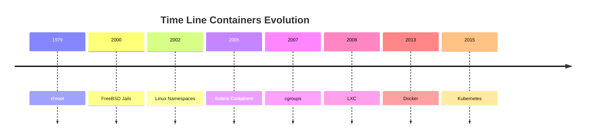
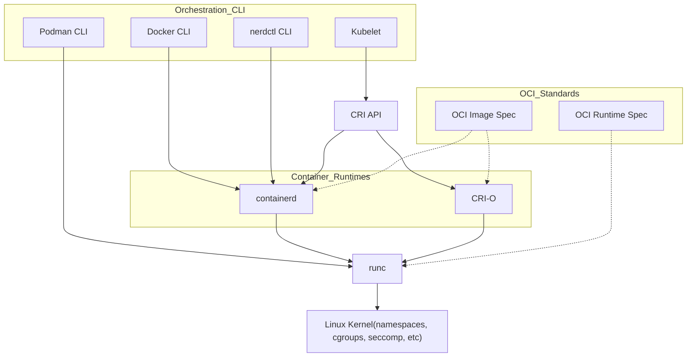

<h1><a name="readme-top"></a></h1>

[](https://github.com/marcossilvestrini/learning-lpic-3-305-300/actions/workflows/release.yml)[](https://github.com/marcossilvestrini/learning-lpic-3-305-300/actions/workflows/translate.yml)[](https://github.com/marcossilvestrini/learning-lpic-3-305-300/actions/workflows/generate-html.yml)[](https://github.com/marcossilvestrini/learning-lpic-3-305-300/actions/workflows/deploy-webpage.yml)[](https://github.com/marcossilvestrini/learning-lpic-3-305-300/actions/workflows/generate-docs.yml)[](https://github.com/marcossilvestrini/learning-lpic-3-305-300/actions/workflows/powershell.yml)[](https://github.com/marcossilvestrini/learning-lpic-3-305-300/actions/workflows/slack.yml)

* * *

[我的许可证][license-url][叉子][forks-url][观星者][stars-url][贡献者][contributors-url][问题][issues-url][LinkedIn][linkedin-url]

* * *

# 学习LPIC-3 305-300


<p align="center">
<strong>Explore the docs »</strong></a>
    <br />
    <a href="https://marcossilvestrini.github.io/learning-lpic-3-305-300/">Web Site</a>
    -
    <a href="https://github.com/marcossilvestrini/learning-lpic-3-305-300">Code Page</a>
    -
    <a href="https://skynet-8.gitbook.io/learning-lpic-3-305-300">Gitbook</a>
    -
    <a href="https://github.com/marcossilvestrini/learning-lpic-3-305-300/issues">Report Bug</a>
    -
    <a href="https://github.com/marcossilvestrini/learning-lpic-3-305-300/issues">Request Feature</a>
</p>

* * *

## 概括

<details>
  <summary><b>TABLE OF CONTENT</b></summary>
  <ol>
    <li>
      <a href="#about-the-project">About The Project</a>
    </li>
    <li>
      <a href="#getting-started">Getting Started</a>
      <ul>
        <li><a href="#prerequisites">Prerequisites</a></li>
        <li><a href="#installation">installation</a></li>
      </ul>
    </li>
    <li><a href="#usage">Usage</a></li>
    <li><a href="#roadmap">Roadmap</a></li>
    <li><a href="#freedoms">Four Essential Freedoms</a></li>
    <li>
      <a href="#topic-351">Topic 351: Full Virtualization</a>
      <ul>
        <li><a href="#topic-351.1">351.1 Virtualization Concepts and Theory </a></li>
        <li><a href="#topic-351.2">351.2 Xen</a></li>
        <li><a href="#topic-351.3">351.3 QEMU</a></li>
        <li><a href="#topic-351.4">351.4 Libvirt Virtual Machine</a></li>
        <li><a href="#topic-351.5">351.5 Virtual Machine Disk Image Management</a></li>
      </ul>
    </li>
    <li>
      <a href="#topic-352">Topic 352: Container Virtualization</a>
      <ul>
        <li><a href="#topic-352.1">352.1 Container Virtualization Concepts</a></li>
        <li><a href="#topic-352.2">352.2 LXC</a></li>
        <li><a href="#topic-352.3">352.3 Docker</a></li>
        <li><a href="#topic-352.4">352.4 Container Orchestration Platforms</a></li>
      </ul>
    </li>
    <li>
      <a href="#topic-353">Topic 353: VM Deployment and Provisioning</a>
      <ul>
        <li><a href="#topic-353.1">353.1 Cloud Management Tools</a></li>
        <li><a href="#topic-353.2">353.2 Packer</a></li>
        <li><a href="#topic-353.3">353.3 cloud-init</a></li>
        <li><a href="#topic-353.4">353.4 Vagrant</a></li>
      </ul>
    </li>
    <li><a href="#license">License</a></li>
    <li><a href="#contact">Contact</a></li>
    <li><a href="#acknowledgments">Acknowledgments</a></li>
  </ol>
</details><br>

* * *

<a name="about-the-project"></a>

## 关于项目

> 该项目旨在帮助学生或专业人员学习Gnulinux的主要概念
> 和免费软件
> Debian和RPM等一些Gnulinux发行版将被涵盖
> 某些软件包的安装和配置也将涵盖
> 通过这样做，您可以为整个社区提供一个从您的变化中受益的机会。
> 访问源代码是此的前提​​。
> 在本文中使用Vagrant进行UP机器并执行实验室和练习内容。
> 我已经在文件夹中出版了一个带有必要的vagrantfile
> 为您上传研究环境

* * *

<p align="right">(<a href="#readme-top">back to top</a>)</p>

<a name="getting-started"></a>

## 入门

要开始学习，请参见上面的文档。

<a name="prerequisites"></a>

### 先决条件

-   [git](https://git-scm.com/book/en/v2/Getting-Started-Installing-Git)
-   [VMware工作站](https://blogs.vmware.com/workstation/2024/05/vmware-workstation-pro-now-available-free-for-personal-use.html)
-   [Vagrant VMware实用程序](https://developer.hashicorp.com/vagrant/install/vmware)
-   [流浪汉](https://developer.hashicorp.com/vagrant/install)

<a name="installation"></a>

### 安装

克隆仓库

```sh
git clone https://github.com/marcossilvestrini/learning-lpic-3-305-300.git
cd learning-lpic-3-305-300
```

自定义模板_vagrantfile-topic-xxx_。该文件包含实验室的VMS配置。例子：

-   文件[VagrantFile-Topic-351](vagrant/Vagrantfile-topic-351)
    -   vm.clone_directory =“ &lt;your_driver_letter>：\\`<folder>`\\&lt;to_machine>\\＃{vm_name} -instance-1
        示例：vm.clone_directory =“ e：\\服务器\\VMware\\＃{vm_name} -instance-1
    -   vm.vmx[“孟加斯”"]= ""
    -   vm.vmx[“ numvcpus”"]= ""
    -   vm.vmx[“ cpuid"correspersocout”.]= ""

自定义文件中的网络配置[配置/网络](configs/network/).

* * *

<a name="usage"></a>

## 用法

使用此存储库来学习有关LPIC-3 305-300考试

### 上下

切换_vagrantfile-topic-xxx_模板并复制带有名称的新文件_Vagrantfile_

```sh
cd vagrant && vagrant up
cd vagrant && vagrant destroy -f
```

### 用于重新启动VM

```sh
cd vagrant && vagrant reload
```

**重要的：**_如果您无流量重新启动VM，则共享文件夹在引导后不安装。_

### 使用Powershell上下

如果您使用Windows平台，我将为上下VM创建一个PowerShell脚本。

```powershell
vagrant/up.ps1
vagrant/destroy.ps1
```

### 基础设施架构主题351


<p align="right">(<a href="#readme-top">back to top</a>)</p>

* * *

<a name="roadmap"></a>

## 路线图

-   [x] 创建存储库
-   [x] 创建用于配置实验室的脚本
-   [x] 创建有关主题351的示例
-   [x] 创建有关主题352的示例
-   [ ] 创建有关主题353的示例
-   [ ] 上传模拟ITEXAM

* * *

<a name="freedoms"></a>

## 四个基本自由

> 0.出于任何目的，按照您希望运行该程序的自由（自由0）。
> 1.研究程序的工作方式并更改它的自由，以便它确实如此
> 您希望的计算（自由1）。
> 访问源代码是此的前提​​。
> 2.重新分配副本的自由，以便您可以帮助他人（自由2）。
> 3\. freedom将修改后版本的副本分发给他人（Freedom 3）。

* * *

## 检查命令

```sh
type COMMAND
apropos COMMAND
whatis COMMAND --long
whereis COMMAND
COMMAND --help, --h
man COMMAND
```

<p align="right">(<a href="#readme-top">back to top</a>)</p>

* * *

<a name="topic-351"></a>

## 主题351：完整的虚拟化


* * *

<a name="topic-351.1"></a>

### 351.1虚拟化概念和理论

**重量：**6

**描述：**候选人应该了解并理解虚拟化的一般概念，理论和术语。这包括Xen，Qemu和Libvirt术语。

**关键知识领域：**

-   🖥️了解虚拟化术语
-   ⚖️了解虚拟化的利弊
-   🛠️了解虚拟机管理程序和虚拟机监视的各种变化
-   🔄了解迁移到虚拟机的主要方面
-   🚀了解主机系统之间迁移虚拟机的主要方面
-   📸了解虚拟机对虚拟机的特征和含义，例如快照，暂停，克隆和资源限制
-   🌐意识到ovirt，proxmox，systemd生产和虚拟箱
-   🔗意识开放vswitch

#### 351.1引用对象

```sh
Hypervisor
Hardware Virtual Machine (HVM)
Paravirtualization (PV)
Emulation and Simulation
CPU flags
/proc/cpuinfo
Migration (P2V, V2V)
```

#### 管理程序

##### 1型1型管理程序（裸金属管理程序）

###### 类型1定义

直接在主机的物理硬件上运行，提供了一个基本层来管理VM，而无需主机操作系统。

###### 1型特征

-   ⚡高性能和效率。
-   ⏱️降低潜伏期和开销。
-   🏢经常用于企业环境和数据中心。

###### 类型1个示例

-   VMware ESXI：企业设置中的强大而广泛使用的虚拟机管理程序。
-   Microsoft Hyper-V：与Windows Server集成，提供强大的性能和管理功能。
-   XEN：许多云服务提供商使用的开源管理程序。
-   KVM（基于内核的虚拟机）：集成到Linux内核中，为基于Linux的系统提供了高性能。

##### 2型操纵裤（托管管理程序）

###### 类型2定义

在常规操作系统之上运行，依靠主机OS进行资源管理和设备支持。

###### 2型特征

-   🛠️更容易设置和使用，尤其是在个人计算机上。
-   🔧在开发，测试和较小规模的部署方面更加灵活。
-   🐢由于主机OS的额外开销，通常比1型管理程序效率低。

###### 类型2个示例

-   VMware Workstation：一个强大的管理程序，用于在单个桌面上运行多个操作系统。
-   Oracle VirtualBox：以其灵活性和易用性而闻名的开源管理程序。
-   Parallels Desktop：供Mac用户与MacOS一起运行Windows和其他操作系统。
-   QEMU（快速模拟器）：一种开源仿真器和虚拟化器，通常与KVM结合使用。

##### 1型和类型2型管理程序之间的关键差异

-   部署环境：
    -   类型1个虚拟机管理程序通常在数据中心和企业环境中部署，因为它们与硬件和高性能的直接互动。
    -   2型管理程序更适合个人使用，开发，测试和小规模的虚拟化任务。
-   表现：
    -   1型操作系统通常提供更好的性能和较低的延迟，因为它们不依赖主机操作系统。
    -   型2型管理程序可能会由于在主机OS上运行的开销而遭受某些性能降解。
-   管理和易用性：
    -   类型1的管理程序需要更复杂的设置和管理，但为大规模部署提供了高级功能和可扩展性。
    -   类型2个虚拟机管理程序更易于安装和使用，使其非常适合单个用户和较小的项目。

##### 迁移类型

在用于创建和管理虚拟机的技术的情况下，P2V迁移和V2V迁移术语在虚拟化环境中很常见。
他们指的是不同类型平台之间迁移系统的过程。

##### P2V-物理到虚拟迁移

P2V迁移是指将物理服务器迁移到虚拟机的过程。换句话说，操作系统及其应用程序（在专用的物理硬件上运行）被“转换”并移至在Hypervisor上运行的虚拟机（例如VMware，Hyper-V，Hyper-V，KVM等）。

-   示例：您拥有运行Windows或Linux系统的物理服务器，并且要将其移至虚拟环境，例如云基础架构或内部虚拟化服务器。
    该过程涉及复制整个系统状态，包括操作系统，驱动程序和数据，以创建同等的虚拟机，该机器可以像在物理硬件上一样运行。

##### V2V-虚拟迁移

V2V迁移是指将虚拟计算机从一个管理程序迁移到另一个管理程序的过程。在这种情况下，您已经在虚拟化环境（例如VMware）中运行虚拟机，并且您想将其移动到另一个虚拟化环境（例如，转到Hyper-V或新的VMware服务器）。

-   示例：您在VMware虚拟化服务器上​​运行了一台虚拟机，但是您决定将其迁移到Hyper-V平台。在这种情况下，V2V迁移将虚拟机从一种格式或管理程序转换为另一种格式，以确保它可以继续正确运行。

#### HVM和寄生虫虚拟化

##### 硬件辅助虚拟化（HVM）

###### HVM定义

HVM利用现代CPU提供的硬件扩展名来虚拟化硬件，从而使VM的创建和管理具有最小的性能开销。

###### HVM关键特征

-   🖥️**硬件支持**：需要CPU支持虚拟化扩展，例如Intel VT-X或AMD-V。
-   🛠️**完整的虚拟化：**VM可以运行未修改的访客操作系统，因为该管理程序提供了完整的硬件环境模仿。
-   ⚡**表现：**通常，由于CPU上直接执行访客代码，通常会提供近乎本地的性能。
-   🔒**隔离：**由于每个VM都具有自己的专用硬件，因此提供了VM之间的强烈隔离。

###### HVM示例

VMware ESXI，Microsoft Hyper-V，KVM（基于内核的虚拟机）。

###### HVM优势

-   ✅**兼容性：**可以在没有修改的情况下运行任何操作系统。
-   ⚡**表现：**高性能由于硬件支持。
-   🔒**安全：**硬件提供的增强隔离和安全功能。

###### HVM缺点

-   🛠️**硬件依赖性：**需要特定的硬件功能，从而限制与旧系统的兼容性。
-   🔧**复杂：**可能涉及更复杂的配置和管理。

##### 寄生虫虚拟化

###### paraviralization定义

paraviralization涉及修改来宾操作系统以了解虚拟环境，从而使其与管理程序更有效地交互。

###### 寄生虫的关键特征

-   🛠️**来宾修改：**需要更改来宾操作系统，以使用HyperCalls直接与管理程序进行通信。
-   ⚡**表现：**比传统的完全虚拟化可以更有效，因为它减少了与模拟硬件相关的开销。
-   🔗**兼容性：**仅限于已修改用于寄生虫的操作系统。

###### paraviralization示例

Xen带有paraviralizatization的来宾，某些配置中的VMware工具以及一些KVM配置。

###### 寄生虫的优势

-   ⚡**效率：**减少了虚拟化硬件的开销，有可能为某些工作负载提供更好的性能。
-   ✅**资源利用：**由于来宾操作系统和管理程序之间的直接通信，更有效地利用了系统资源。

###### 寄生虫的缺点

-   🛠️**客座操作系统修改：**需要对来宾操作系统进行修改，从而将兼容性限制在支持的操作系统上。
-   🔧**复杂：**需要在客座操作系统中进行超级呼叫实现的额外复杂性。

##### 关键差异

###### 访客操作系统要求

-   **HVM：**可以运行未修改的客人操作系统。
-   **寄生虫：**需要修改来宾操作系统以与管理程序一起使用。

###### 表现

-   **HVM：**通常由于硬件辅助执行而提供近乎本地的性能。
-   **寄生虫：**可以通过减少硬件仿真的开销来提供有效的性能，但依赖于修改后的访客操作系统。

###### 硬件依赖性

-   **HVM：**需要特定的CPU功能（Intel VT-X，AMD-V）。
-   **寄生虫：**不需要特定的CPU功能，而需要修改的访客操作系统。

###### 隔离

-   **HVM：**使用硬件功能提供强大的隔离。
-   **寄生虫：**依靠基于软件的隔离，这可能不像基于硬件的隔离那样强大。

###### 复杂

-   **HVM：**通常，由于它支持未修饰的操作系统，因此通常更直接地部署。
-   **寄生虫：**需要对来宾操作系统进行其他设置和修改，从而提高复杂性。

#### numa（不一致的内存访问）

NUMA（非统一内存访问）是多处理器系统中使用的内存体系结构，可通过处理器优化内存访问。
在NUMA系统中，内存在处理器之间不均匀地分布，这意味着每个处理器对内存的一部分（其“本地存储器”）的访问速度要比物理更远的内存（称为“远程存储器”）并与其他处理器关联的内存更快。

##### NUMA体系结构的关键特征

1.  **本地和远程内存**：每个处理器都有自己的本地内存，它可以更快地访问。但是，尽管需要更长的时间，但它也可以访问其他处理器的内存。
2.  **区分潜伏期**：内存访问的延迟取决于处理器是访问其本地内存还是其他节点的内存。访问另一个节点的内存（远程）时，本地内存访问更快。
3.  **可伸缩性**：NUMA架构旨在提高许多处理器系统的可扩展性。随着添加更多处理器的添加，还会分发内存，避免在统一内存访问（UMA）体系结构中发生的瓶颈。

##### NUMA的优势

-   ⚡在大型系统中的性能更好：由于每个处理器都有本地内存，因此它可以更有效地工作，而无需与其他处理器竞争以获得内存访问。
-   📈可伸缩性：NUMA允许与UMA体系结构相比，具有许多处理器和大量内存的系统可以更有效地扩展。

##### 缺点

-   🛠️编程复杂性：程序员需要了解哪些内存区域是本地或远程区域，以优化使用本地内存以实现更好的性能。
-   🐢潜在的性能处罚：如果处理器经常访问遥控内存，则由于延迟较高而可能会遭受性能。
    该体系结构在高性能多处理器系统（例如服务器和超级计算机）中很常见，在该系统中，可扩展性和内存优化至关重要。

#### OpenSource解决方案

-   ovirt：<https://www.ovirt.org/>
-   🌐proxmox：<https://www.proxmox.com/en/proxmox-virtual-environment/overview>
-   🌐Oracle VirtualBox：<https://www.virtualbox.org/>
-   🌐开放vswitch：<https://www.openvswitch.org/>

#### 虚拟化类型

##### 硬件虚拟化（服务器虚拟化）

###### HV定义

摘要物理硬件以创建运行单独的操作系统和应用程序的虚拟机（VM）。

###### HV用例

数据中心，云计算，服务器整合。

###### HV示例

VMware ESXI，Microsoft Hyper-V，KVM。

##### 操作系统虚拟化（容器化）

###### 容器化定义

允许多个隔离的用户空间实例（容器）在单个OS内核上运行。

###### 容器化用例

微服务体系结构，开发和测试环境。

###### 容器化示例

Docker，Kubernetes，LXC。

##### 网络虚拟化

###### 网络虚拟化定义

将硬件和软件网络资源结合到一个基于软件的管理实体中。

###### 网络虚拟化用例

软件定义的网络（SDN），网络功能虚拟化（NFV）。

###### 网络虚拟化示例

VMware NSX，Cisco ACI，OpenStack Neutron。

##### 存储虚拟化

###### 存储虚拟化定义

从多个设备将物理存储池用于单个虚拟存储单元，该单元可以在中心进行管理。

###### 存储虚拟化定义用例

数据管理，存储优化，灾难恢复。

###### 存储虚拟化定义示例

IBM SAN音量控制器，VMware VSAN，NetApp ontap。

##### 桌面虚拟化

###### 桌面虚拟化定义

允许桌面操作系统在托管服务器上托管的虚拟机上运行。

###### 桌面虚拟化定义用例

虚拟桌面基础架构（VDI），远程工作解决方案。

###### 桌面虚拟化定义示例

Citrix虚拟应用程序和台式机，VMware Horizo​​n，Microsoft远程桌面服务。

##### 应用虚拟化

###### 应用虚拟化定义

将应用程序与基础硬件和操作系统分开，使它们可以在孤立的环境中运行。

###### 应用虚拟化定义用例

简化的应用程序部署，兼容性测试。

###### 应用虚拟化定义示例

VMware ThinApp，Microsoft App-V，Citrix Xenapp。

##### 数据虚拟化

###### 数据虚拟化定义

整合来自各种来源的数据而无需物理整合，提供了统一的观点进行分析和报告。

###### 数据虚拟化定义用例

商业智能，实时数据集成。

###### 数据虚拟化定义示例

Denodo，Red Hat Jboss数据虚拟化，IBM Infosphere。

##### 虚拟化的好处

-   ⚡资源效率：更好地利用物理资源。
-   💰节省成本：降低硬件和运营成本。
-   📈可伸缩性：根据需求易于扩展或向下扩展。
-   🔧灵活性：支持各种工作量和应用程序。
-   🔄灾难恢复：简化的备份和恢复过程。
-   🔒隔离：通过隔离环境改善了安全性。

#### 仿真

仿真涉及模拟与最初预期不同平台上硬件或软件的行为。

此过程允许为一个系统设计的软件可以在另一个可能具有不同体系结构或操作环境的系统上运行。

虽然仿真通过实现未修改的来宾操作系统或应用程序来提供多功能性，但它通常带有性能开销。

之所以出现此间接费用，是因为模拟系统需要将用于原始系统的指令解释和翻译为与主机系统兼容的指令。结果，仿真可以比本地执行慢，从而使资源密集型任务的效率降低。

尽管有这一缺点，但仿真对于运行传统软件，在不同平台上测试应用程序以及促进跨平台开发仍然有价值。

#### SystemD机场

SystemD生产的服务致力于管理SystemD生态系统中的虚拟机和容器。
 它提供了控制，监视和维护虚拟实例的基本功能，从而在Linux环境中提供了强大的集成和效率。

<p align="right">(<a href="#topic-351.1">back to sub Topic 351.1</a>)</p>
<p align="right">(<a href="#topic-351">back to Topic 351</a>)</p>
<p align="right">(<a href="#readme-top">back to top</a>)</p>

* * *

<a name="topic-351.2"></a>

### 351.2交替


**重量：**3

**描述：**候选人应能够安装，配置，维护，迁移和故障排除XEN安装。重点是Xen版本4.x。

**关键知识领域：**

-   了解XEN的体系结构，包括网络和存储
-   XEN节点和域的基本配置
-   XEN节点和域的基本管理
-   XEN安装的基本故障排除
-   贪婪的药丸
-   意识Xenstore
-   Xen引导参数的意识
-   意识到XM实用程序

#### 备用


XEN是一种开源类型1（裸机）机身，它允许多个操作系统在相同的物理硬件上同时运行。XEN在物理硬件和虚拟机（VMS）之间提供一层，从而启用有效的资源共享和隔离。

-   **建筑学：**XEN使用域0（DOM0）是具有直接硬件访问的特权域并管理管理程序的两层系统。其他称为域U（DOMU）的虚拟机，运行访客操作系统，并由DOM0管理。
-   **虚拟化类型：**XEN支持需要修改的访客操作系统和硬件辅助虚拟化（HVM）的Paravirtualization（PV），该虚拟化（HVM）使用硬件扩展（例如Intel VT-X或AMD-V）来运行未修改的来宾操作系统。
    XEN广泛用于云环境中，特别是由Amazon Web Services（AWS）和其他大型云提供商使用。

#### Xensource

Xensource是由剑桥大学XEN管理程序的原始开发商创立的公司，以商业化Xen。该公司提供了基于Xen的企业解决方案，并提供了其他工具和支持，以增强Xen的企业使用能力。

-   **Acquisition by Citrix**：2007年，Xensource被Citrix Systems，Inc。收购。Citrix使用Xen Technology作为其Citrix Xenserver产品的基础，该产品成为基于Xen的流行企业级虚拟化平台。
-   **过渡**：收购后，Xen项目继续作为开源项目，而Citrix则专注于Xenserver等商业产品，利用Xensource Technology。

#### Xen项目

XEN项目是指负责在其商业化之后开发和维护XEN管理程序的开源社区和倡议。XEN项目在Linux基金会下运作，重点是建立，改善，改善和支持Xen作为协作，社区驱动的努力。

-   **目标：**XEN项目旨在通过改善其性能，安全性和功能设置为广泛的用例，包括云计算，以安全性为中心的虚拟化（例如Qubes OS）和嵌入式系统来推动该管理程序。
-   **贡献者：**该项目包括来自各种组织的贡献者，包括主要的云提供商，硬件供应商和独立开发人员。
-   **药丸和Hedools：**XEN项目还包括XAPI（XENAPI）等工具，该工具用于管理XEN管理程序安装，以及用于系统管理和优化的其他各种实用程序。

#### Xenstore

Xen Store是Xen管理程序的关键组成部分。
从本质上讲，Xen Store是一个分布式键值数据库，用于在XEN管理程序和虚拟机（也称为域）之间进行通信和信息共享。

这是Xen Store的一些关键方面：

-   **跨域交流：**XEN存储启用域之间的通信，例如DOM0（控制硬件资源的特权域）和DOMUS（用户域，是VMS）。这是通过键值条目完成的，每个域都可以读取或写入信息。
-   **配置管理：**它用于存储和访问配置信息，例如虚拟设备，网络和引导参数。这有助于VM的动态管理和配置。
-   **事件和通知：**Xen Store还支持事件通知。当修改XEN存储中的特定键或值时，可以通知感兴趣的域以对这些更改做出反应。这对于监视和管理资源很有用。
-   简单的API：Xen Store提供了一个简单的API，用于读取和编写数据，使开发人员可以轻松地将其应用程序与Xen虚拟化系统集成在一起。

#### 丸

XAPI或XENAPI是用于管理XEN机床机及其虚拟机（VMS）的应用程序编程接口（API）。
XAPI是Xenserver（现称为Citrix Hypervisor）的关键组成部分，并提供了一种与Xen Hypervisor交互的标准化方法，以执行诸如创建，配置，监视和控制VM的操作。

这是XAPI的一些重要方面：

-   **VM管理：**XAPI允许管理员通过编程性创建，删除，启动和停止虚拟机。
-   **自动化：**使用XAPI，可以自动化虚拟资源的管理，包括网络，存储和计算，这对于大云环境至关重要。
-   **一体化：**XAPI可以与其他工具和脚本集成，以提供更有效和定制的XEN环境管理。
-   **访问控制：**XAPI还提供访问控制机制，以确保只有授权用户才能在虚拟环境中执行特定操作。

XAPI是可以控制和自动化XEN虚拟机程序的接口，使管理虚拟化环境变得更容易。

#### Xen摘要

-   **间作：**核心管理程序技术使虚拟机能够在物理硬件上运行。
-   **Xensource：**Xen商业化的公司后来被Citrix收购，导致Citrix Xenserver的发展。
-   **XEN项目：**在Linux基金会下继续开发和维护XEN管理程序的开源计划和社区。
-   **Xenstore：**XEN存储充当XEN管理程序和VM之间的通信和配置中介，简化了虚拟化环境的操作和管理。
-   **丸**是可以控制和自动化XEN虚拟机程序的接口，使管理虚拟化环境变得更加容易。

#### domain0（dom0）

domain0或dom0是XEN体系结构中的控制域。它管理其他域（Domus），并可以直接访问硬件。
DOM0运行设备驱动程序，允许缺乏直接硬件访问的Domus与设备通信。通常，它是操作系统（例如Linux）的完整实例，对于XEN Hyprovisor操作至关重要。

#### 域（房屋）

Domus是运行虚拟机的非特权域。
它们由DOM0管理，无法直接访问硬件。 Domus可以配置为运行不同的操作系统，并用于各种目的，例如应用程序服务器和开发环境。他们依靠DOM0进行硬件交互。

#### peewee-dom（paravardiyed domina）

PV-Domus使用一种称为paraviratualization的技术。在此模型中，对DOMU操作系统进行了修改，以意识到它在虚拟化的环境中运行，从而使其可以直接与操纵虚拟机直接通信以获得优化的性能。
与完全虚拟化相比，这会导致较低的开销和提高效率。

#### HVM-DOMU（硬件虚拟机域）

HVM-Domus是使用完整虚拟化的虚拟机，允许未修改的操作系统运行。 XEN管理程序为这些圆顶提供了硬件仿真，使他们能够运行任何支持基础硬件体系结构的操作系统。
尽管这具有更大的灵活性，但与PV-Domus相比，它可能导致更高的开销。

#### XEN网络

寄生网络设备

桥接

#### 351.2引用的对象

```sh
Domain0 (Dom0), DomainU (DomU)
PV-DomU, HVM-DomU
/etc/xen/
xl
xl.cfg 
xl.conf # Xen global configurations
xentop
oxenstored # Xenstore configurations
```

#### 351.2注释

```sh

# Xen Settings
/etc/xen/
/etc/xen/xl.conf - Main general configuration file for Xen
/etc/xen/oxenstored.conf - Xenstore configurations

# VM Configurations
/etc/xen/xlexample.pvlinux
/etc/xen/xlexample.hvm

# Service Configurations
/etc/default/xen
/etc/default/xendomains

# xen-tools configurations
/etc/xen-tools/
/usr/share/xen-tools/

# docs
xl(1)
xl.conf(5)
xlcpupool.cfg(5)
xl-disk-configuration(5)
xl-network-configuration(5)
xen-tscmode(7)

# initialized domains auto
/etc/default/xendomains
   XENDOMAINS_AUTO=/etc/xen/auto

/etc/xen/auto/


# set domain for up after xen reboot
## create folder auto
cd /etc/xen && mkdir -p auto && cd auto

# create simbolic link
ln -s /etc/xen/lpic3-pv-guest /etc/xen/auto/lpic3-pv-guest
```

#### 351.2重要命令

##### Xen-Create-image

```sh
# create a pv image
xen-create-image \
  --hostname=lpic3-pv-guest \
  --memory=1gb \
  --vcpus=2 \
  --lvm=vg_xen \
  --bridge=xenbr0 \
  --dhcp \
  --pygrub \
  --password=vagrant \
  --dist=bookworm
```

##### Xen-list-images

```sh
# list image
xen-list-image
```

##### Xen-Delete-image

```sh
# delete a pv image
xen-delete-image lpic3-pv-guest --lvm=vg_xen
```

##### Xenstore-LS

```sh
# list xenstore infos
xenstore-ls
```

##### XL

```sh
# view xen information
xl infos

# list Domains
xl list
xl list lpic3-hvm-guest
xl list lpic3-hvm-guest -l

# uptime Domains
xl uptime

# pause Domain
xl pause 2
xl pause lpic3-hvm-guest

# save state Domains
xl -v save lpic3-hvm-guest ~root/image-lpic3-hvm-guest.save

# restore Domain
xl restore /root/image-lpic3-hvm-guest.save

# get Domain name
xl domname 2

# view dmesg information
xl dmesg

# monitoring domain
xl top
xentop
xen top

# Limit mem Dom0
xl mem-set 0 2048

# Limit cpu (not permanent after boot)
xl vcpu-set 0 2

# create DomainU - virtual machine
xl create /etc/xen/lpic3-pv-guest.cfg

# create DomainU virtual machine and connect to guest
xl create -c /etc/xen/lpic3-pv-guest.cfg

##----------------------------------------------
# create DomainU virtual machine HVM

## create logical volume
lvcreate -l +20%FREE -n lpic3-hvm-guest-disk  vg_xen

## create a ssh tunel for vnc
ssh -l vagrant -L 5900:localhost:5900  192.168.0.130

## configure /etc/xen/lpic3-hvm-guest.cfg
## set boot for cdrom: boot = "d"

## create domain hvm
xl create /etc/xen/lpic3-hvm-guest.cfg

## open vcn conection in your vnc client with localhost
## for view install details

## after installation finished, destroy domain: xl destroy <id_or_name>

## set /etc/xen/lpic3-hvm-guest.cfg: boot for hard disc: boot = "c"

## create domain hvm
xl create /etc/xen/lpic3-hvm-guest.cfg

## access domain hvm
xl console <id_or_name>
##----------------------------------------------

# connect in domain guest
xl console <id>|<name> (press enter)
xl console 1
xl console lpic3-pv-guest

#How do I exit domU "xl console" session
#Press ctrl+] or if you're using Putty press ctrl+5.

# Poweroff domain
xl shutdown lpic3-pv-guest

# destroy domain
xl destroy lpic3-pv-guest

# reboot domain
xl reboot lpic3-pv-guest

# list block devices
xl block-list 1
xl block-list lpic3-pv-guest

# detach block devices
xl block-detach lpic3-hvm-guest hdc
xl block-detach 2 xvdc

# attach block devices

## hard disk devices
xl block-attach lpic3-hvm-guest-ubuntu 'phy:/dev/vg_xen/lpic3-hvm-guest-disk2,xvde,w'

## cdrom
xl block-attach lpic3-hvm-guest 'file:/home/vagrant/isos/ubuntu/seed.iso,xvdc:cdrom,r'
xl block-attach 2 'file:/home/vagrant/isos/ubuntu/seed.iso,xvdc:cdrom,r'

# insert and eject cdrom devices
xl cd-insert lpic3-hvm-guest-ubuntu xvdb  /home/vagrant/isos/ubuntu/ubuntu-24.04.1-live-server-amd64.iso
xl cd-eject lpic3-hvm-guest-ubuntu xvdb
```

#### 251.2笔记

##### vif

在Xen中，“ VIF”代表虚拟接口，用于为虚拟机（域）配置网络。

通过在域配置文件中指定“ VIF”指令，管理员可以定义网络接口，分配IP地址，设置VLAN，并为在XEN主机上运行的虚拟机配置其他网络参数。例如：vif =[“桥= Xenbr0”]，在这种情况下，它将VM的网络接口连接到名为“ XENBR0”的Xen桥。

````sh

<p align="right">(<a href="#topic-351.2">back to sub Topic 351.2</a>)</p>
<p align="right">(<a href="#topic-351">back to Topic 351</a>)</p>
<p align="right">(<a href="#readme-top">back to top</a>)</p>

---

<a name="topic-351.3"></a>

### 351.3 QEMU


**Weight:** 4

**Description:** Candidates should be able to install, configure, maintain, migrate and troubleshoot QEMU installations.

**Key Knowledge Areas:**

* Understand the architecture of QEMU, including KVM, networking and storage
* Start QEMU instances from the command line
* Manage snapshots using the QEMU monitor
* Install the QEMU Guest Agent and VirtIO device drivers
* Troubleshoot QEMU installations, including networking and storage
* Awareness of important QEMU configuration parameters

#### 351.3 Cited Objects

```sh
Kernel modules: kvm, kvm-intel and kvm-amd
/dev/kvm
QEMU monitor
qemu
qemu-system-x86_64
ip
brctl
tunctl
````

#### 351.3重要命令

##### 351.3其他命令

##### 检查KVM模块

```sh
# check if kvm is enabled
egrep -o '(vmx|svm)' /proc/cpuinfo
lscpu |grep Virtualization
lsmod|grep kvm
ls -l /dev/kvm
hostnamectl
systemd-detect-virt
```

```sh
# check if kvm is enabled
egrep -o '(vmx|svm)' /proc/cpuinfo
lscpu |grep Virtualization
lsmod|grep kvm
ls -l /dev/kvm

# check kernel infos
uname -a

# check root device
findmnt /

# mount a qcow2 image
## Example 1:
mkdir -p /mnt/qemu
guestmount -a os-images/Debian_12.0.0_VMM/Debian_12.0.0.qcow2 -i /mnt/qemu/

## Example 2:
sudo guestfish --rw -a os-images/Debian_12.0.0_VMM/Debian_12.0.0.qcow2
run
list-filesystems

# run commands in qcow2 images
## Example 1:
virt-customize -a  os-images/Debian_12.0.0_VMM/Debian_12.0.0.qcow2  --run-command 'echo hello >/root/hello.txt'
## Example 2:
sudo virt-customize -a os-images/Debian_12.0.0_VMM/Debian_12.0.0.qcow2 \
  --run-command 'echo -e "auto ens3\niface ens3 inet dhcp" > /etc/network/interfaces.d/ens3.cfg'

# generate mac 
printf 'DE:AD:BE:EF:%02X:%02X\n' $((RANDOM%256)) $((RANDOM%256))
```

##### IP

```sh
# list links
ip link show

# create bridge
ip link add br0 type bridge
```

##### brctl

```sh
# list links
ip link show

# create bridge
ip link add br0 type bridge
```

##### qemu-img

```sh
# create image
qemu-img create -f qcow2 vm-disk-debian-12.qcow2 20G

# convert vmdk to qcow2 image
qemu-img convert \
  -f vmdk \
  -O qcow2 os-images/Debian_12.0.0_VMM/Debian_12.0.0_VMM_LinuxVMImages.COM.vmdk os-images/Debian_12.0.0_VMM/Debian_12.0.0.qcow2 \
  -p \
  -m16

# check image
qemu-img info os-images/Debian_12.0.0_VMM/Debian_12.0.0.qcow2
```

##### QEMU-SYSTEM-X86_64

```sh
# create vm with ISO
qemu-system-x86_64 \
  -name lpic3-debian-12 \
  -enable-kvm -hda vm-disk-debian-12.qcow2 \
  -cdrom /home/vagrant/isos/debian/debian-12.8.0-amd64-DVD-1.iso  \
  -boot d \
  -m 2048 \
  -smp cpus=2 \
  -k pt-br

# create vm with ISO using vnc in no gui servers \ ssh connections

## create ssh tunel in host
 ssh -l vagrant -L 5902:localhost:5902  192.168.0.131

## create vm 
qemu-system-x86_64 \
  -name lpic3-debian-12 \
  -enable-kvm \
  -m 2048 \
  -smp cpus=2 \
  -k pt-br \
  -vnc :2 \
  -device qemu-xhci \
  -device usb-tablet \
  -device ide-cd,bus=ide.1,drive=cdrom,bootindex=1 \
  -drive id=cdrom,media=cdrom,if=none,file=/home/vagrant/isos/debian/debian-12.8.0-amd64-DVD-1.iso \
  -hda vm-disk-debian-12.qcow2 \
  -boot order=d \
  -vga std \
  -display none \
  -monitor stdio

# create vm with OS Image - qcow2

## create vm
qemu-system-x86_64 \
  -name lpic3-debian-12 \
  -enable-kvm \
  -m 2048 \
  -smp cpus=2 \
  -k pt-br \
  -vnc :2 \
  -hda os-images/Debian_12.0.0_VMM/Debian_12.0.0.qcow2

## create vm with custom kernel params
qemu-system-x86_64 \
  -name lpic3-debian-12 \
  -kernel /vmlinuz \
  -initrd /initrd.img \
  -append "root=/dev/mapper/debian--vg-root ro fastboot console=ttyS0" \
  -enable-kvm \
  -m 2048 \
  -smp cpus=2 \
  -k pt-br \
  -vnc :2 \
  -hda os-images/Debian_12.0.0_VMM/Debian_12.0.0.qcow2

## create vm with and attach disk
qemu-system-x86_64 \
  -name lpic3-debian-12 \
  -enable-kvm \
  -m 2048 \
  -smp cpus=2 \
  -vnc :2 \
  -hda os-images/Debian_12.0.0_VMM/Debian_12.0.0.qcow2 \
  -hdb vmdisk-debian12.qcow2 \
  -drive file=vmdisk-extra-debian12.qcow2,index=2,media=disk,if=ide \
  -netdev bridge,id=net0,br=qemubr0 \
  -device virtio-net-pci,netdev=net0
  
## create vm network netdev user
qemu-system-x86_64 \
  -name lpic3-debian-12 \
  -enable-kvm \
  -m 2048 \
  -smp cpus=2 \
  -vnc :2 \
  -hda os-images/Debian_12.0.0_VMM/Debian_12.0.0.qcow2 \
  -netdev user,id=mynet0,net=192.168.0.150/24,dhcpstart=192.168.0.155,hostfwd=tcp::2222-:22 \
  -device virtio-net-pci,netdev=mynet0

## create vm network netdev tap (Private Network)
ip link add br0 type bridge ; ifconfig br0 up
qemu-system-x86_64 \
  -name lpic3-debian-12 \
  -enable-kvm \
  -m 2048 \
  -smp cpus=2 \
  -vnc :2 \
  -hda os-images/Debian_12.0.0_VMM/Debian_12.0.0.qcow2 \
  -netdev tap,id=br0 \
  -device e1000,netdev=br0,mac=DE:AD:BE:EF:1A:24

## create vm with public bridge
#create a public bridge : https://www.linux-kvm.org/page/Networking

qemu-system-x86_64 \
  -name lpic3-debian-12 \
  -enable-kvm \
  -m 2048 \
  -smp cpus=2 \
  -hda os-images/Debian_12.0.0_VMM/Debian_12.0.0.qcow2 \
  -k pt-br \
  -vnc :2 \
  -device qemu-xhci \
  -device usb-tablet \
  -vga std \
  -display none \
  -netdev bridge,id=net0,br=qemubr0 \
  -device virtio-net-pci,netdev=net0

## get a ipv4 ip - open ssh in vm and:
dhcpclient ens4
```

#### QEMU监视器

在命令行中使用QEMU监视器**-Monitor Stdio**参数**QEMU-SYSTEM-X86_64**

```sh
qemu-system-x86_64 -monitor stdio
```

退出QEMU-MONITOR：

```sh
ctrl+alt+2
```

```sh
# Managment
info status # vm info
info cpus # cpu information
info network # network informations
stop # pause vm
cont # start vm in status pause
system_powerdown # poweroff vm
system_reset # restart monitor


# Blocks
info block # block info
boot_set d # force boot iso
change ide1-cd0  /home/vagrant/isos/debian/debian-12.8.0-amd64-DVD-1.iso  # attach cdrom
eject ide1-cd0 # detach cdrom

# Snapshots
info snapshots # list snapshots
savevm snapshot-01  # create snapshot
loadvm snapshot-01 # restore snapshot
delvm snapshot-01
```

#### 来宾经纪人

对于启用，请使用：

```sh
qemu-system-x86_x64
 -chardev socket,path=/tmp/qga.sock,server=on,wait=off,id=qga0 \
 -device virtio-serial \
 -device virtserialport,chardev=qga0,name=org.qemu.guest_agent.0
```

<p align="right">(<a href="#topic-351.3">back to sub Topic 351.3</a>)</p>
<p align="right">(<a href="#topic-351">back to Topic 351</a>)</p>
<p align="right">(<a href="#readme-top">back to top</a>)</p>

* * *

<a name="topic-351.4"></a>

### 351.4 libvirt虚拟机管理


**重量：**9

**描述：**候选人应能够使用Libvirt和相关工具来管理虚拟化主机和虚拟机（“ Libvirt域”）。

**关键知识领域：**

-   了解libvirt的建筑
-   管理libvirt连接和节点
-   创建和管理QEMU和XEN域，包括快照
-   管理和分析域的资源消耗
-   创建和管理存储池和卷
-   创建和管理虚拟网络
-   节点之间的迁移域
-   了解Libvirt如何与Xen和Qemu互动
-   了解Libvirt如何与DNSMASQ和RADVD等网络服务互动
-   了解libvirt xml配置文件
-   意识对virtlogd和virtlockd

#### 351.4引用对象

```sh
libvirtd
/etc/libvirt/
/var/lib/libvirt
/var/log/libvirt
virsh (including relevant subcommands) 
```

#### 351.4重要命令

##### Virsh

```sh
# using env variable for set virsh uri (local or remotly)
export LIBVIRT_DEFAULT_URI=qemu:///system
export LIBVIRT_DEFAULT_URI=xen+ssh://vagrant@192.168.0.130
export LIBVIRT_DEFAULT_URI='xen+ssh://vagrant@192.168.0.130?keyfile=/home/vagrant/.ssh/skynet-key-ecdsa'

# COMMONS

# get helps
virsh help
virsh help pool-create

# view version
virsh version

# view system info
sudo virsh sysinfo

# view node info
virsh nodeinfo

# hostname
virsh hostname

# check vcn allocated port
virsh vncdisplay <domain_id>
virsh vncdisplay <domain_name>
virsh vncdisplay rocky9-server01 

# HYPERVISIONER

# view libvirt hypervisioner connection
virsh uri

# list valid hypervisioners
virt-host-validate
virt-host-validate qemu

# test connetion uri(vm test)
virsh -c test:///default list

# connect remotly
virsh -c xen+ssh://vagrant@192.168.0.130
virsh -c xen+ssh://vagrant@192.168.0.130 list
virsh -c qemu+ssh://vagrant@192.168.0.130/system list

# connect remotly without enter password
virsh -c 'xen+ssh://vagrant@192.168.0.130?keyfile=/home/vagrant/.ssh/skynet-key-ecdsa'

# STORAGE

# list storage pools
virsh pool-list --details

# list all storage pool
virsh pool-list --all --details

# get a pool configuration
virsh pool-dumpxml default

# get pool info
virsh pool-info default

# create a storage pool
virsh pool-define-as --name default --type dir --target /var/lib/libvirt/images

# create a storage pool with dumpxml
virsh pool-create --overwrite --file configs/kvm/libvirt/pool.xml

# start storage pool
virsh pool-start default

# set storage pool for autostart
virsh pool-autostart default

# stop storage pool
virsh pool-destroy linux

# delete xml storage pool file
virsh pool-undefine linux

# edit storage pool
virsh pool-edit linux

# list volumes
virsh vol-list linux

# get volume infos
virsh vol-info Debian_12.0.0.qcow2 os-images
virsh vol-info --pool os-images Debian_12.0.0.qcow2 

# get volume xml
virsh vol-dumpxml rocky9-disk1 default

# create volume
virsh vol-create-as default --format qcow2 disk1 10G

# delete volume
virsh vol-delete  disk1 default

# DOMAINS \ INSTANCES \ VIRTUAL MACHINES

# list domain\instance\vm
virsh list
virsh list --all

# create domain\instance\vm
virsh create configs/kvm/libvirt/rocky9-server03.xml

# view domain\instance\vm info
virsh dominfo rocky9-server01

# view domain\instance\vm xml
virsh dumpxml rocky9-server01

# edit domain\instance\vm xml
virsh edit rocky9-server01

# stop domain\instance\vm
virsh shutdown rocky9-server01 # gracefully
virsh destroy 1
virsh destroy rocky9-server01

# suspend domain\instance\vm
virsh suspend rocky9-server01

# resume domain\instance\vm
virsh resume rocky9-server01

# start domain\instance\vm
virsh start rocky9-server01

# remove domain\instance\vm
virsh undefine rocky9-server01

# remove domain\instance\vm and storage volumes
virsh undefine rocky9-server01 --remove-all-storage

# save domain\instance\vm
virsh save rocky9-server01 rocky9-server01.qcow2

# restore domain\instance\vm
virsh restore rocky9-server01.qcow2

# list snapshots
virsh snapshot-list rocky9-server01

# create snapshot
virsh snapshot-create rocky9-server01

# restore snapshot
virsh snapshot-revert rocky9-server01 1748983520

# view snapshot xml
virsh snapshot-info rocky9-server01 1748983520

# dumpxml snapshot
virsh snapshot-dumpxml rocky9-server01 1748983520

# xml snapshot path
/var/lib/libvirt/qemu/snapshot/rocky9-server01/

# view snapshot info
virsh snapshot-info rocky9-server01 1748983671

# edit snapshot
virsh snapshot-edit rocky9-server01 1748983520

# delete snapshot
virsh snapshot-delete rocky9-server01 1748983520

# DEVICES

# list block devices
virsh domblklist rocky9-server01 --details

# add cdrom media 
virsh change-media rocky9-server01 sda /home/vagrant/isos/rocky/Rocky-9.5-x86_64-minimal.iso
virsh attach-disk rocky9-server01 /home/vagrant/isos/rocky/Rocky-9.5-x86_64-minimal.iso sda --type cdrom --mode readonly

# remove cdrom media
virsh change-media rocky9-server01 sda --eject

# add new disk
virsh attach-disk rocky9-server01  /var/lib/libvirt/images/rocky9-disk2  vdb --persistent

# remove disk
virsh detach-disk rocky9-server01 vdb --persistent

# RESOURCES (CPU and Memory)

# get cpu infos
virsh vcpuinfo rocky9-server01 --pretty
virsh dominfo rocky9-server01 | grep 'CPU'

# get vcpu count
virsh vcpucount rocky9-server01

# set vcpus maximum config
virsh setvcpus rocky9-server01 --count 4 --maximum --config
virsh shutdown rocky9-server01
virsh start rocky9-server01

# set vcpu current config
virsh setvcpus rocky9-server01 --count 4 --config

# set vcpu current live
virsh setvcpus rocky9-server01 --count 3 --current
virsh setvcpus rocky9-server01 --count 3 --live

# configure vcpu afinity config
virsh vcpupin rocky9-server01 0 7 --config
virsh vcpupin rocky9-server01 1 5-6 --config

# configure vcpu afinity current
virsh vcpupin rocky9-server01 0 7
virsh vcpupin rocky9-server01 1 5-6

# set maximum memory config
virsh setmaxmem rocky9-server01 3000000 --config
virsh shutdown rocky9-server01
virsh start rocky9-server01

# set current memory config
virsh setmem rocky9-server01 2500000 --current

# NETWORK

# get netwwork bridges
brctl show

# get iptables rules for libvirt
sudo iptables -L -n -t  nat

# list network
virsh net-list --all

# set default network
virsh net-define /etc/libvirt/qemu/networks/default.xml

# get network infos
virsh net-info default

# get xml network
virsh net-dumpxml default

# xml file
cat /etc/libvirt/qemu/networks/default.xml

# dhcp config
sudo cat /etc/libvirt/qemu/networks/default.xml | grep -A 10 dhcp
sudo cat /var/lib/libvirt/dnsmasq/default.conf

# get domain ipp address
virsh net-dhcp-leases default
virsh net-dhcp-leases default --mac 52\:54\:00\:89\:19\:86

# edit network
virsh net-edit default

# get domain network detais
virsh domiflist debian-server01

# path for network filter files
/etc/libvirt/nwfilter/

# list network filters
virsh nwfilter-list

# create network filter - block icmp traffic
virsh nwfilter-define block-icmp.xml
# virsh edit Debian-Server
    #  <interface type='network'>
    #        ...
    #        <filterref filter='block-icmp'/>
    #        ...
    # </interface>
# virsh destroy debian-server01
# virsh start debian-server01

# delete network filter
virsh nwfilter-undefine block-icmp

# get xml network filter
virsh nwfilter-dumpxml block-icmp
```

###### virt-install

```sh
# list os variants
virt-install --os-variant list
osinfo-query os

# create domain\instance\vm with iso file
virsh vol-create-as default --format qcow2 rocky9-disk1 20G
virt-install --name rocky9-server01 \
--vcpus 2 \
--cpu host \
--memory 2048 \
--disk vol=default/rocky9-disk1 \
--cdrom /home/vagrant/isos/rocky/Rocky-9.5-x86_64-minimal.iso \
--os-variant=rocky9 \
--graphics vnc,listen=0.0.0.0,port=5905

# create debian domain\instance\vm with qcow2 file
virt-install --name debian-server01 \
--vcpus 2 \
--ram 2048 \
--disk vol=os-images/Debian_12.0.0.qcow2 \
--import \
--osinfo detect=on \
--graphics vnc,listen=0.0.0.0,port=5906 \
--network network=default \
--noautoconsole

# create rocky9 domain\instance\vm with qcow2 file
virt-install --name rocky9-server02 \
--vcpus 2 \
--ram 2048 \
--disk path=os-images/RockyLinux_9.4_VMG/RockyLinux_9.4.qcow2,format=qcow2,bus=virtio \
--import \
--osinfo detect=on \
--graphics vnc,listen=0.0.0.0,port=5907 \
--network bridge=qemubr0,model=virtio \
--noautoconsole

# open domain\instance\vm gui console
virt-viewer debian-server01

# check metadata domain\instance\vm file (if uri is qemu:////system)
less /etc/libvirt/qemu/debian-server01.xml
```

<p align="right">(<a href="#topic-351.4">back to sub Topic 351.4</a>)</p>
<p align="right">(<a href="#topic-351">back to Topic 351</a>)</p>
<p align="right">(<a href="#readme-top">back to top</a>)</p>

* * *

<a name="topic-351.5"></a>

### 351.5虚拟机磁盘图像管理


**重量：**3

**描述：**候选人应该能够管理虚拟机磁盘图像。这包括在各种格式和虚拟机中转换磁盘图像，以及访问图像中存储的数据。

**关键知识领域：**

-   了解各种虚拟磁盘图像格式的功能，例如RAW Images，QCOW2和VMDK
-   使用QEMU-IMG管理虚拟机磁盘图像
-   使用libguestfish在虚拟机磁盘图像中包含的安装分区和访问文件
-   将物理磁盘内容复制到虚拟机磁盘图像
-   在各种虚拟机磁盘图像格式之间迁移磁盘内容
-   意识开放虚拟化格式（OVF）

#### 351.5引用的对象

```sh
qemu-img
guestfish (including relevant subcommands)
guestmount
guestumount
virt-cat
virt-copy-in
virt-copy-out
virt-diff
virt-inspector
virt-filesystems
virt-rescue
virt-df
virt-sparsify
virt-p2v
virt-p2v-make-disk
virt-v2v
```

#### 351.5重要命令

##### 351.5.1 qemu-img

```sh
# Display detailed information about a disk image
qemu-img info UbuntuServer_24.04.qcow2

# Create a new 22G raw disk image (default format is raw)
qemu-img create new-disk 22G

# Create a new 22G disk image in qcow2 format
qemu-img create -f qcow2 new-disk2 22G

# Convert a VDI image to raw format using 5 threads and show progress
qemu-img convert -f vdi -O raw Ubuntu-Server.vdk new-Ubuntu.raw -m5 -p

# Convert vmdk to qcow2 image
qemu-img convert \
-f vmdk \
-O qcow2 os-images/UbuntuServer_24.04_VM/UbuntuServer_24.04_VM_LinuxVMImages.COM.vmdk \
os-images/UbuntuServer_24.04_VM/UbuntuServer_24.04.qcow2 \
-p \
-m16

# Resize a raw image to 30G
qemu-img resize -f raw new-disk 30G

# Resize a qcow2 image to 15G(actual size 30Gdisk 30G)
qemu-img resize -f raw --shrink new-disk 15G

# Snapshots

# List all snapshots in the image
qemu-img snapshot -l new-disk2.qcow2

# Create a snapshot named SNAP1
qemu-img snapshot -c SNAP1 disk

# Apply a snapshot by ID or name
qemu-img snapshot -a 123456789 disk

# Delete the snapshot named SNAP1
qemu-img snapshot -d SNAP1 disk
```

##### 来宾鱼

```sh
# set enviroment variables for guestfish
export LIBGUESTFS_BACKEND_SETTINGS=force_tcg

# Launch guestfish with a disk image
guestfish -a UbuntuServer_24.04.qcow2
#run
#list-partitions

# Run the commands in a script file
guestfish -a UbuntuServer_24.04.qcow2 -m /dev/sda -i < script.ssh

# Interactively run commands
guestfish --rw -a UbuntuServer_24.04.qcow2 <<'EOF'
run
list-filesystems
EOF

# Copy a file from the guest image to the host
export LIBGUESTFS_BACKEND_SETTINGS=force_tcg
sudo guestfish --rw -a UbuntuServer_24.04.qcow2 -i <<'EOF'
copy-out /etc/hostname /tmp/
EOF

# Copy a file from the host into the guest image
echo "new-hostname" > /tmp/hostname
export LIBGUESTFS_BACKEND_SETTINGS=force_tcg
sudo guestfish --rw -a UbuntuServer_24.04.qcow2 -i <<'EOF'
copy-in /tmp/hostname /etc/
EOF

# View contents of a file in the guest image
guestfish --ro -a UbuntuServer_24.04.qcow2 -i <<'EOF'
cat /etc/hostname
EOF

# List files in the guest image
export LIBGUESTFS_BACKEND_SETTINGS=force_tcg
guestfish --rw -a UbuntuServer_24.04.qcow2 -i <<'EOF'
ls /home/ubuntu
EOF

# Edit a file in the guest image
export LIBGUESTFS_BACKEND_SETTINGS=force_tcg
guestfish --rw -a UbuntuServer_24.04.qcow2 -i <<'EOF'
edit /etc/hosts
EOF
```

###### 嘉宾蒙特

```sh
# Mount a disk image to a directory
guestmount -a UbuntuServer_24.04.qcow2 -m /dev/ubuntu-vg/ubuntu-lv /mnt/ubuntu
# domain
guestmount -d rocky9-server02 -m /dev/ubuntu-vg/ubuntu-lv /mnt/ubuntu 

# Mount a specific partition from a disk image
guestmount -a UbuntuServer_24.04.qcow2 -m /dev/sda2 /mnt/ubuntu
# domain
guestmount -d debian-server01 --ro -m  /dev/debian-vg/root /mnt/debian
```

###### Guestumount

```sh
# Umount a disk image to a directory
sudo guestunmount /mnt/ubuntu
```

##### virt-df

```sh
# Show free and used space on virtual machine filesystems
virt-df UbuntuServer_24.04.qcow2 -h
virt-df -d rocky9-server02 -h
```

##### virt-filesystems

```sh
# List filesystems, partitions, and logical volumes in a VM disk image (disk image)
virt-filesystems -a UbuntuServer_24.04.qcow2 --all --long -h

# List filesystems, partitions, and logical volumes in a VM disk image (domain)
virt-filesystems -d debian-server01 --all --long -h
```

##### Virt-Anspector

```sh
# Inspect and report on the operating system in a VM disk image
virt-inspector -a UbuntuServer_24.04.qcow2 #(disk)
virt-inspector -d debian-server01 #(domain) 
```

##### virt-cat

```sh
# Display the contents of a file inside a VM disk image
virt-cat -a UbuntuServer_24.04.qcow2 /etc/hosts
virt-cat -d debian-server01 /etc/hosts #(domain)
```

##### 维尔德

```sh
# Show differences between two VM disk images
virt-diff -a UbuntuServer_24.04.qcow2 -A Rocky-Linux.qcow2
```

##### virt-sparsify

```sh
# Make a VM disk image smaller by removing unused space
virt-sparsify UbuntuServer_24.04.qcow2 UbuntuServer_24.04-sparse.qcow2
```

##### 魔术

```sh
# Resize a VM disk image or its partitions
virt-filesystems -a UbuntuServer_24.04.qcow2 --all --long -h #(check size of partitions)
qemu-img create -f qcow2 UbuntuServer_24.04-expanded.qcow2 100G #(create new disk image with 100G)
virt-resize --expand /dev/ubuntu-vg/ubuntu-lv \
UbuntuServer_24.04.qcow2 UbuntuServer_24.04-expanded.qcow2

```

##### Virt-Copy-In

```sh
# Copy files from the host into a VM disk image

virt-copy-in -a UbuntuServer_24.04.qcow2 ~vagrant/test-virt-copy-in.txt /home/ubuntu
```

##### virt-copy-out

```sh
# Copy files from a VM disk image to the host
virt-copy-out -a UbuntuServer_24.04.qcow2 /home/ubuntu/.bashrc /tmp
```

##### virt-ls

```sh
# List files and directories inside a VM disk image
virt-ls -a UbuntuServer_24.04.qcow2 /home/ubuntu
```

##### virt-rescue

```sh
# Launch a rescue shell on a VM disk image for recovery
virt-rescue -a UbuntuServer_24.04.qcow2
```

##### virt-sysprep

```sh
# Prepare a VM disk image for cloning by removing system-specific data
virt-sysprep -a UbuntuServer_24.04.qcow2
```

##### virt-v2v

```sh
# Convert a VM from a foreign hypervisor to run on KVM
virt-v2v -i disk input-disk.img -o local -os /var/tmp
```

##### virt-p2v

```sh
# Convert a physical machine to use KVM
```

##### Virt-P2V-Make-Disk

```sh
# Create a bootable disk image for physical to virtual conversion
sudo virt-p2v-make-disk -o output.img
```

#### 351.5笔记

##### OVF：开放虚拟化格式

OVF：一种开放格式，该格式定义了用于在不同环境中包装和分发虚拟机的标准。

生成的软件包具有.ova扩展名，并包含以下文件：

-   .OVF：带有元数据定义虚拟机环境的XML文件
-   图像文件：.vmdk，.vhd，.vhdx，.qcow2，.raw
-   其他文件：元数据，快照，配置，哈希

<p align="right">(<a href="#topic-351.5">back to sub Topic 351.5</a>)</p>
<p align="right">(<a href="#topic-351">back to Topic 351</a>)</p>
<p align="right">(<a href="#readme-top">back to top</a>)</p>

* * *

<a name="topic-352"></a>

## 主题352：容器虚拟化

* * *

<a name="topic-352.1"></a>

### 352.1容器虚拟化概念




* * *

**重量：**7

**描述：**候选人应了解容器虚拟化的概念。这包括了解用于实现容器虚拟化的Linux组件以及使用标准Linux工具对这些组件进行故障排除。

**关键知识领域：**

-   了解系统和应用程序容器的概念
-   了解和分析内核名称空间
-   了解和分析对照组
-   了解和分析功能
-   了解seccomp，selinux和apparmor在容器虚拟化中的作用
-   了解LXC和Docker如何利用名称空间，CGROUP，功能，Seccomp和Mac
-   了解Runc的原理
-   了解CRI-O和Contarerd的原理
-   意识到OCI运行时和图像规格
-   对Kubernetes容器运行时接口（CRI）的意识
-   意识到Podman，Buildah和Scopeo
-   在Linux和其他免费操作系统（例如RKT，OpenVZ，SystemD-Nspawn或BSD监狱）中了解其他容器虚拟化方法的认识

* * *

#### 352.1引用对象

```sh
nsenter
unshare
ip (including relevant subcommands)
capsh
/sys/fs/cgroups
/proc/[0-9]+/ns
/proc/[0-9]+/status
```

* * *

#### 🧠了解容器


容器是一种轻巧的虚拟化技术，将应用程序及其所需的依赖项（代码，库，环境变量和配置文件）包装为孤立，便携式和可重复的单元。

> 简而言之：容器是一个独立的框，以相同的方式运行您的应用程序。

##### 💡什么是容器？

与虚拟机（VM）不同，容器不会虚拟化硬件。相反，它们虚拟化操作系统。容器与主机共享相同的Linux内核，但是每个Linux内核在完全隔离的用户空间中运行。

📌容器与虚拟机：

| 特征   | 容器         | 虚拟机           |
| ---- | ---------- | ------------- |
| OS内核 | 与主机共享      | 每个VM都有自己的操作系统 |
| 启动时间 | 快速（秒或更少）   | 慢（分钟）         |
| 图像大小 | 轻量级（MB）    | 重（GB）         |
| 资源效率 | 高的         | 降低            |
| 隔离机制 | 内核功能（名称空间） | 管理程序          |

##### 🔑容器的关键特征

🔹**轻的**：共享主机OS内核，减少开销并启用快速启动。

🔹**便携的**：在不同的环境（开发，分期，产品，云，本地）始终运行。

🔹**孤立**：使用名称空间进行过程，网络和文件系统隔离。

🔹**高效的**：比传统的VMS启用更高的密度和更好的资源利用。

🔹**可扩展**：非常适合微服务和云原生体系结构。

##### 🧱容器的类型

1.  系统容器

    -   设计为运行整个操作系统，类似于虚拟机。
    -   支持多个流程和系统服务（Init，Syslog）。
    -   遗产或整体应用的理想选择。
    -   示例：LXC，libvirt-lxc。
2.  申请容器

    -   设计用于运行一个过程。
    -   无状态，短暂和水平可扩展。
    -   广泛用于现代Devops和Kubernetes环境中。
    -   示例：Docker，Contanserd，Cri-O。

##### 🚀流行的集装箱运行时间

| 运行时        | 描述                            |
| ---------- | ----------------------------- |
| **Docker** | 用于建造和运行容器的最广泛采用的CLI/守护程序。     |
| **容器**     | 轻巧的运行时为Docker和Kubernetes提供动力。 |
| **批评它**    | OCI容器的Kubernetes-native运行时间。  |
| **LXC**    | 传统的Linux系统容器，更接近全操作。          |
| **RKT**    | 以安全为中心的运行时（已弃用）。              |

##### 🔐集装箱内部和安全元素

| 成分                     | 角色                      |
| ---------------------- | ----------------------- |
| **名称空间**               | 隔离进程，用户，安装座，网络。         |
| **cgroups**            | 控制和限制资源使用情况（CPU，内存，IO）。 |
| **功能**                 | 容器内部的细粒度特权控制。           |
| **seccomp**            | 限制使SYSCALL可以减少攻击表面。     |
| **Apparmor / selinux** | 内核级别的强制访问控制执法。          |

* * *

#### 🧠了解chroot-更改UNIX/Linux中的根目录


##### 什么是Chroot？

Chroot（更改根部）是类似Unix的操作系统上的系统调用和命令，该操作系统更改了当前运行过程及其子女的明显根目录（/）。这创造了一个孤立的环境，通常称为Chroot监狱。

##### 🧱目的和用例

-   🔒隔离安全申请（监狱）。
-   🧪创建测试环境而不会影响系统的其余部分。
-   🛠️系统恢复（例如，启动到livecd，将Chroot启动到安装的系统中）。
-   📦在受控环境中构建软件包。

##### 📁最低要求的结构

Chroot环境必须具有自己的基本文件和结构：

```sh
/mnt/myenv/
├── bin/
│   └── bash
├── etc/
├── lib/
├── lib64/
├── usr/
├── dev/
├── proc/
└── tmp/
```

使用LDD确定所需的库：

```sh
ldd /bin/bash
```

##### 🚨限制和安全考虑

-   Chroot不是安全边界，例如容器或VM。
-   监狱内的特权用户（根）可能会爆发。
-   没有隔离过程名称空间，设备或内核级资源的隔离。

对于更强的隔离，请考虑以下替代方案：

-   Linux容器（LXC，Docker）
-   虚拟机（KVM，QEMU）
-   内核名称空间和cgroups

##### 🧪用Debootstrap测试Chroot

```sh
# download debain files
sudo debootstrap stable ~vagrant/debian http://deb.debian.org/debian
sudo chroot ~vagrant/debian bash
```

##### ：🧪实验室Chroot

将此脚本用于实验：[chroot.sh](scripts/container/chroot.sh)

输出：


* * *

#### 🧠了解Linux名称空间


名称空间是核心Linux内核功能，可启用过程级别的隔离。它们创建了全球系统资源的单独“视图”，例如流程ID，网络，文件系统和用户 - ，以便每个流程组都认为它在自己的系统中运行。

> 简单的术语：命名空间欺骗一个过程以思考它拥有机器，即使它只是共享它。

这是隔离容器的基础。

##### 🔍名称空间隔离什么？

Each namespace type isolates a specific system resource. Together, they make up the sandbox that a container operates in:

| 名称空间           | 分离株...  | 现实世界示例           |
| -------------- | ------- | ---------------- |
| **pid**        | 流程ID    | 容器内的过程看到不同的PID空间 |
| **山**          | 文件系统安装点 | 每个容器都会看到自己的根文件系统 |
| **网络**         | 网络堆栈    | 容器具有孤立的IP，接口和路线  |
| **UTS**        | 主机名和域名  | 每个容器设置自己的主机名     |
| **IPC**        | 共享记忆和信号 | 防止容器之间的过程间通信     |
| **用户**         | 用户和组ID  | 在容器中启用假根（UID 0）  |
| **cgroup（v2）** | 对照组成员资格 | 与CPU和内存限制等资源控件联系 |

##### 🧪视觉类比


想象一个共享的办公大楼：

-   所有租户共享相同的基础（Linux内核）。
-   每个公司都有自己的办公室（命名空间）：不同的锁，家具，电话线和公司名称。
-   对于每个租户，感觉就像他们自己的建筑物。

这正是容器体验系统的方式 - 孤立但有效。

##### 🔧容器如何使用名称空间

当您运行一个容器（例如，使用Docker或Podman）时，运行时会创建一组新的名称空间：

```bash
docker run -it --rm alpine sh
```

此命令给出了该过程：

-   一个新的PID名称空间→它是容器内部的过程1。
-   一个新的网络名称空间→其自己的虚拟以太网。
-   安装名称空间→特定于容器的根文件系统。
-   其他名称空间取决于配置（用户，IPC等）

结果：轻巧，孤立的运行时环境，表现得像单独的系统。

##### ⚙️互补内核功能

名称空间从容器中隐藏资源。但是，为了控制他们可以使用多少以及可以做什么，我们需要其他机制：

###### 🔩cgroups（对照组）

CGROUP允许内核限制，优先级和监视过程组之间的资源使用情况。

| 资源           | 用例示例         |
| ------------ | ------------ |
| 中央处理器        | 限制每个容器的CPU时间 |
| 记忆           | 帽公羊的使用       |
| 磁盘I/O。       | 油门读/写操作      |
| Network (v2) | 带宽限制         |

🛡️通过阻止一个容器消耗所有系统资源来阻止“嘈杂的邻居”问题。

###### 🧱功能

传统Linux使用二进制特权模型：root（uid 0）可以做所有事情，其他所有人都受到限制。

| 能力                     | 允许...             |
| ---------------------- | ----------------- |
| `CAP_NET_BIND_SERVICE` | 与特权端口结合（例如80，443） |
| `CAP_SYS_ADMIN`        | 系统管理任务的强大全部       |
| `CAP_KILL`             | 将信号发送到任意过程        |

通过删除不必要的功能，容器只能以所需的方式运行 - 降低风险。

##### 🔐安全机制

与命名空间和cgroups结合使用，以锁定容器化的过程可以做的事情：

| 特征           | 描述                       |
| ------------ | ------------------------ |
| **seccomp**  | 白名单或块Linux系统调用（SYSCALLS） |
| **Apparmor** | 应用每个应用程序安全配置文件           |
| **Selinux**  | 通过紧密的系统政策强制执行强制性访问控制     |

##### 🧠初学者的摘要

> ✅名称空间隔离容器可以看到的东西
> ✅cgroups控制它可以使用的
> ✅功能和安全模块定义了它可以做什么

这些内核功能共同构成了容器隔离的技术骨干，可以在没有完整VM的情况下进行高密度，安全和有效的应用部署。

##### 🧪实验室名称空间

将此脚本用于实验：[namespace.sh](scripts/container/namespace.sh)

输出：


* * *

#### 🧩了解CGROUP（对照组）


##### 📌定义

对照组（CGROUPS）是2007年介绍的Linux内核功能，可让您限制过程组的资源使用（CPU，内存，磁盘I/O等）。

诸如Runc和Crun之类的低级容器运行时大量使用了CGroup，并由Docker，Podman和LXC等容器发动机借用来实施资源边界并提供容器之间的隔离。

命名空间隔离，Cgroups控制。

名称空间为进程（例如PID，网络或安装座）创建单独的环境，而CGroups限制并监视这些过程的资源使用率（CPU，内存，I/O）。

⚙️关键功能

| 特征       | 描述                         |
| -------- | -------------------------- |
| **资源限制** | 对一个组可以使用多少资源施加限制           |
| **优先级**  | 将更多的CPU/IO优先级分配给某些小组而不是其他组 |
| **会计**   | 跟踪每组资源的使用                  |
| **控制**   | 批量暂停，恢复或杀死过程               |
| **隔离**   | 防止群体之间的资源饥饿                |

##### 📦子系统（控制器）

Cgroups通过控制器运行，每个人都负责管理一种类型的资源：

| 子系统       | 描述           |
| --------- | ------------ |
| `cpu`     | 控制CPU调度      |
| `cpuacct` | 生成CPU用法报告    |
| `memory`  | 限制和帐户内存使用情况  |
| `blkio`   | 限制阻止设备I/O    |
| `devices` | 控制对设备的访问     |
| `freezer` | 暂停/恢复任务执行    |
| `net_cls` | 标签交通塑料的数据包   |
| `ns`      | 管理名称空间访问（稀有） |

##### 📂文件系统布局

通过/sys/fs/cgroup下的虚拟文件系统暴露了cgroups。

取决于版本：

-   **cgroups v1**：每个控制器的单独层次结构（例如，内存，CPU等）
-   **cgroups v2**：单个安装点下的统一层次结构

安装在下面：

```sh
/sys/fs/cgroup/
```

典型的cgroups v1层次结构：

```sh
/sys/fs/cgroup/
├── memory/
│   ├── mygroup/
│   │   ├── tasks
│   │   ├── memory.limit_in_bytes
├── cpu/
│   └── mygroup/
└── ...
```

在Cgroups V2中，所有资源均根据统一的层次结构进行管理：

```sh
/sys/fs/cgroup/
├── cgroup.procs
├── cgroup.controllers
├── memory.max
├── cpu.max
└── ...
```

##### 🧪常见用法（V1和V2示例）

V1  - 创建和分配内存限制：

```sh
# Mount memory controller (if needed)
mount -t cgroup -o memory none /sys/fs/cgroup/memory

# Create group
mkdir /sys/fs/cgroup/memory/mygroup

# Set memory limit (100 MB)
echo 104857600 | tee /sys/fs/cgroup/memory/mygroup/memory.limit_in_bytes

# Assign a process (e.g., current shell)
echo $$ | tee /sys/fs/cgroup/memory/mygroup/tasks
```

V2  - 统一层次结构：

```sh
# Create subgroup
mkdir /sys/fs/cgroup/mygroup

# Enable controllers
echo +memory +cpu > /sys/fs/cgroup/cgroup.subtree_control

# Move shell into group
echo $$ > /sys/fs/cgroup/mygroup/cgroup.procs

# Set limits
echo 104857600 > /sys/fs/cgroup/mygroup/memory.max
echo "50000 100000" > /sys/fs/cgroup/mygroup/cpu.max  # 50ms quota per 100ms period
```

🧭过程和小组检查

| 命令                      | 描述              |
| ----------------------- | --------------- |
| `cat /proc/self/cgroup` | 显示当前的CGroup会员资格 |
| `cat /proc/PID/cgroup`  | 另一个过程的群体        |
| `cat /proc/PID/status`  | 内存和cgroup信息     |
| `ps -o pid,cmd,cgroup`  | 显示过程对组映射        |

##### 📦在容器中使用

Docker，Podman和Containerd的容器发动机将资源控制委托给Cgroups（通过Runc或Crun），允许：

-   人均CPU和内存限制
-   对BLKIO和设备的细粒度控制
-   实时资源会计

Docker示例：

```sh
docker run --memory=256m --cpus=1 busybox
```

在幕后，这为容器过程创建了用于内存和CPU限制的CGroup规则。

##### 🧠概念摘要

| 概念       | 解释                                   |
| -------- | ------------------------------------ |
| **控制器**  | 模块喜欢`cpu`,`memory`,`blkio`等等。应用限制和规则 |
| **任务**   | 分配给对照组的PID（过程）                       |
| **等级制度** | cgroups是在亲子树中构成的                     |
| **代表团**  | SystemD和用户服务可能管理CGroup的子树            |

##### 🧪实验室cgroups

将此脚本用于实验：[cgroups.sh](scripts/container/cgroups.sh)

输出软件内存：


* * *

#### 🛡️理解功能

❓什么是Linux功能？

传统上，在Linux中，Root用户对系统无限制访问。引入了Linux功能，以将这些全功能特权分解为较小的离散权限，从而使过程可以执行特定的特权操作而无需完全访问。

这通过执行最少特权的原则来增强系统安全性。

| 🔐能力                   | 📋描述                      |
| ---------------------- | ------------------------- |
| `CAP_CHOWN`            | 更改文件所有者，无论权限如何            |
| `CAP_NET_BIND_SERVICE` | 与1024以下的端口结合（例如80，443）    |
| `CAP_SYS_TIME`         | 设置系统时钟                    |
| `CAP_SYS_ADMIN`        | ⚠️非常强大 - 包括坐骑，BPF等        |
| `CAP_NET_RAW`          | 使用原始插座（例如Ping，Traceroute） |
| `CAP_SYS_PTRACE`       | 追踪其他过程（调试）                |
| `CAP_KILL`             | 将信号发送到任何过程                |
| `CAP_DAC_OVERRIDE`     | 未经许可修改文件和目录               |
| `CAP_SETUID`           | 更改过程的用户ID（UID）            |
| `CAP_NET_ADMIN`        | 管理网络接口，路由等。               |

🔐一些Linux功能类型

| 能力类型             | 描述                  |
| ---------------- | ------------------- |
| **Capinhos（继承）** | 从父进程继承的功能。          |
| **Capprm（允许）**   | 允许该过程具有的功能。         |
| **Capeff（有效）**   | 该过程当前正在使用的功能。       |
| **CAPBND（边界）**   | 限制过程可以获得的最大有效能力集。   |
| **Capamb（环境）**   | 允许一个过程明确定义其自身的有效功能。 |

📦容器和豆荚的功能
容器通常不会以完整的根部运行，而是根据运行时默认收到有限的功能。

可以使用SecurityContext将功能添加或删除在Kubernetes中。

📄kubernetes示例：

```yaml
securityContext:
  capabilities:
    drop: ["ALL"]
    add: ["NET_BIND_SERVICE"]
```

🔐这确保容器以零特权开始，并仅收到所需的内容。

##### 🧪实验室功能

将此脚本用于实验：[capabilities.sh](scripts/container/capabilities.sh)

输出：


#### 🛡️seccomp（安全计算模式）

**这是什么？**

-   Linux内核功能用于限制一个过程可以使用的SYSCALLS（系统调用）。
-   通常用于容器（例如Docker），浏览器，沙盒等。

**它如何工作？**

-   一个过程启用了SecComp配置文件/过滤器。
-   内核块，日志或杀死该过程，如果它尝试禁止使用SYSCALLS。
-   过滤器以BPF（Berkeley数据包过滤器）格式编写。

**快速命令**

```sh
# Check support
docker info | grep Seccomp

# Disable for a container:
docker run --security-opt seccomp=unconfined ...

# Inspect running process:
grep Seccomp /proc/$$/status
```

**工具**

```sh
# for analyzing
seccomp-tools 

# Profiles
/etc/docker/seccomp.json
```

#### 🦺apparmor

**这是什么？**

-   强制性访问控制（MAC）系统，用于限制哪些特定程序可以访问。
-   配置文件是基于文本的，面向路径的，易于阅读和编辑的。

**它如何工作？**

-   每个二进制文件都可以具有定义其允许的文件，网络和功能的配置文件，即使是根！
-   易于在抱怨，执行和残疾模式之间切换。

**快速命令：**

```sh
#Status
aa-status

# Put a program in enforce mode
sudo aa-enforce /etc/apparmor.d/usr.bin.foo

# Profiles
location: /etc/apparmor.d/
```

**工具：**

AA-genprof，aa-logprof用于生成/更新配置文件

日志

```sh
/var/log/syslog (search for apparmor)
```

#### 🔒Selinux（安全增强Linux）

**这是什么？**

-   一个非常强大的MAC系统，用于控制对所有内容的访问：文件，过程，用户，端口，网络等。
-   使用标签（上下文）和详细政策。

**它如何工作？**

-   所有内容（过程，文件，端口等）都会获得安全上下文。
-   内核检查针对政策规则的所有操作。

**快速命令：**

```sh
#Status
sestatus

#Set to enforcing/permissive:
setenforce 1  # Enforcing
setenforce 0  # Permissive

#List security contexts:
ls -Z  # Files
ps -eZ # Processes
```

**工具：**

-   Audit2Allow，Semanage，CHCON（用于管理政策/标签）
-   logs：/var/log/audit/audit.log
-   政策：/etc/selinux/

#### 📋公共安全系统的摘要表

| 系统       | 重点         | 复杂  | 政策位置              | 典型用途               |
| -------- | ---------- | --- | ----------------- | ------------------ |
| seccomp  | 内核Syscalls | 中等的 | 每个程序（通过代码/配置）     | Docker，沙盒          |
| Apparmor | 每个访问       | 简单的 | /etc/apparmor.d/  | Ubuntu，快照，Suse     |
| Selinux  | 全系统MAC     | 先进的 | /etc/selinux/ +标签 | Rhel，Fedora，Centos |

#### 🗂️Linux容器隔离与安全比较

| 技术             | 目的 /它做什么                           | 主要差异                                    | 示例在容器中                                            |
| -------------- | ---------------------------------- | --------------------------------------- | ------------------------------------------------- |
| **chroot🏠**   | 更改过程的明显根目录。隔离文件系统。                 | 简单的文件系统隔离；做**不是**限制资源，特权或系统调用。          | Docker使用`chroot`内部用于构建最小图像，但不能用于强烈的隔离。            |
| **cgroups📊**  | 控制和限制资源使用率（CPU，内存，磁盘I/O等）每个过程。     | 内核功能；细粒度的资源控制，而不是隔离。                    | Docker和Kubernetes使用CGroups限制CPU/MEM每个容器/POD。      |
| **名称空间🌐**     | 隔离系统资源：PID，Mount，UTS，网络，用户，IPC，时间。 | 内核功能；提供不同种类的隔离。                         | 每个容器以自己的名称空间集（PID，Net，Mount等）运行。                  |
| **功能🛡️**      | 将根特权分为细粒单位（例如，网络\_管理员，系统\_行政）。     | 比全或无根/非根的颗粒状；可以丢弃或授予特定特权。               | Docker容器通常以降低的功能（降低危险）运行。                         |
| **seccomp🧱**  | 过滤/限制一个过程可以制造的SYSCALL（白名单/黑名单）。    | 非常专注：阻止内核Syscalls；无法阻止所有动作。             | Docker的默认配置文件阻止了危险的syscalls（例如，`ptrace`,`mount`). |
| **Apparmor🐧** | 强制性访问控制（MAC）框架：通过配置文件限制程序的文件/网络访问。 | 基于个人资料，比Selinux更容易管理；在某些情况下，细粒度较少。      | 基于Ubuntu的容器通常将Apparmor用于容器过程配置文件。                 |
| **Selinux🔒**  | 更复杂的MAC框架，基于标签，非常细粒度。可以限制用户，进程和文件。 | 比Apparmor更强大和复杂；在Fedora/Rhel/Centos上执行。 | 在带有RHEL的OpenShift/Kubernetes上，Selinux标签用于将POD分开。  |

概括

-   Chroot：基本隔离，没有资源/安全保证。
-   CGroups：资源控制，而不是隔离。
-   名称空间：隔离内核资源的“视图”。
-   功能：微调过程特权。
-   SECCOMP：限制系统呼叫表面。
-   Apparmor/selinux：即使是root（MAC），限制可以触摸的过程。

#### 🧩oci，runc，containd，cri，cri-o  - 它们在容器生态系统中的内容

##### 概述和角色

-   **OCI（开放容器倡议）🏛️**

    为建立开放标准的基础**容器图像**和**运行时**.

    _定义如何格式，存储图像以及如何启动/停止容器（运行时规范）。_
-   **⚙️Runc**

    一种通用，低水平的轻质CLI工具，可以根据OCI运行时规范运行容器。

    _将图像 +配置变成实际运行Linux容器的“引擎”。_
-   **容器🏋️**

    用于管理完整容器生命周期的核心容器运行时守护程序：**拉图像，管理存储，运行容器**（调用runc），网络插件等。

    _由Docker，Kubernetes，Nerdctl和其他工具用作其主要容器运行时后端。_
-   **CRI（容器运行时接口）🔌**

    Kubernetes特定的GRPC API，可将Kubernetes与容器运行时间连接起来。

    _不在kubernetes外部使用，但可以使K8与Containerd，Cri-O等交谈。_
-   **cri-o🥤**

    轻巧的，以库伯尼的为重点的运行时间**仅有的**运行OCI容器，使用引擎盖下的runc。

    _主要用于Kubernetes，但演示了如何构建针对开放标准的最小容器运行时。_

##### 🏷️比较表：OCI，Runc，Containerd，CRI，CRI-O

| 成分       | Emoji | 这是什么？         | 谁使用？                               | 示例用法                        |
| -------- | ----- | ------------- | ---------------------------------- | --------------------------- |
| **OCI**  | 🏛️   | 标准/规格         | Docker，Podman，Cri-O，Container，Runc | 确保图像/容器在工具上兼容               |
| **runc** | ⚙️    | 容器运行时（CLI）    | 集装箱，CRI-O，Docker，Podman            | 直接从捆绑包中运行容器（例如`runc run`)   |
| **容器**   | 🏋️   | 容器运行时守护程序     | Docker，Kubernetes，nerdctl          | 手柄拉图像，管理存储/网络，通过Runc启动容器    |
| **CRI**  | 🔌    | K8S运行时接口（API） | 仅Kubernetes                        | 让Kubelet与Containerd/Cri-O交谈 |
| **批评它**  | 🥤    | K8S的轻巧的容器运行时间 | Kubernetes，OpenShift               | 用作K8S容器引擎                   |

* * *

##### 🛠️实例（一般容器世界）

-   **建筑图像：**

    任何工具（Docker，Podman，buildah）都可以产生图像**OCI图像规格**因此，它们到处都是兼容。
-   **运行容器：**

    Podman和Docker最终都使用**runc**（通过容器或直接）创建容器。
-   **管理许多容器：**

    **容器**可以自己使用（通过`ctr`或者`nerdctl`）或作为Docker和Kubernetes的后端。
-   **插件运行时间：**

    由于**OCI**，您可以将RUNC交换为另一个符合OCI的运行时（例如用于VM的Kata容器，用于沙盒的Gvisor），而无需更改您的构建或管理图像的方式。

* * *

##### 🚢典型的堆栈

```plaintext
[User CLI / Orchestration]
           |
   [containerd / CRI-O]
           |
        [runc]
           |
[Linux Kernel: namespaces, cgroups, etc]
```

-   **Docker**：用户151→容器→runc
-   **Subman**：用户151→runc
-   **Kubernetes**：kubelet（CRI）→容器或CRI-O→runc

* * *

##### 🧠摘要

-   **OCI**=图像/runtimes的通用语言（标准/规格）
-   **runc**=创建和管理容器过程的实际工具
-   **容器**=管理图像，容器，生命周期的功能齐全的守护程序
-   **CRI**=仅对于kubernetes，使运行时间可插
-   **批评它**=以OCI标准和RUNC为基础的kubernetes上的轻巧运行时

##### 🧩图：容器生态系统



##### 🧪实验室runc

对于Runc Lab，您可以使用此脚本：[runc.sh](scripts/container/runc.sh)


##### 🧪实验室容器

对于Runc Containerd，您可以使用此脚本：[containerd.sh](scripts/container/container.sh)


* * *

#### 🚀Podman，Buildah，Skopeo，OpenVZ，Crun＆Kata容器 - 快速轨道

* * *

##### 🐳**Subman**

-   **这是什么？**与Docker CLI兼容的集装箱管理器，但是**无守**并可以运行**无根**.
-   **使用：**创建，运行，停止和检查容器和豆荚。
-   **亮点：**没有中央守护程序（用于多用户）与SystemD集成。
-   [更多信息](<>)

* * *

##### 📦**Buildah**

-   **这是什么？**工具**构建和操纵容器图像**（OCI/Docker）没有守护程序。
-   **使用：**在CI/CD管道或脚本上构建图像。
-   **亮点：**Podman在引擎盖下使用的轻巧，无根的支撑。
-   [更多信息](https://www.redhat.com/en/topics/containers/what-is-buildah)

* * *

##### 🔭**范围**

-   **这是什么？**实用程序**检查，复制和移动容器图像**在注册表之间**无需拉或跑步**他们。
-   **使用：**移动图像，检查签名和元数据。
-   **亮点：**没有守护程序，非常适合自动化和安全性。
-   [更多信息](<>)

* * *

##### 🏢**OpenVZ**

-   **这是什么？****基于容器的虚拟化**Linux的解决方案（预先约会的现代容器工具）。
-   **使用：**轻巧的VPS（虚拟私人服务器）共享相同的内核。
-   **亮点：**非常有效，但不如VM隔离（股内核）。
-   [更多信息](https://en.wikipedia.org/wiki/OpenVZ)

* * *

##### ⚡**克伦**

-   **这是什么？**用C编写的容器的超快速，最小的OCI运行时（不去）。
-   **使用：**执行最小开销的容器。
-   **亮点：**比Runc更快，更轻，在某些系统上，Podman的默认值。
-   [更多信息](https://www.redhat.com/sysadmin/introduction-crun)

* * *

##### 🛡️**单词容器**

-   **这是什么？**结合容器和VM的开源项目：每个容器均在轻量级的微VM中运行。
-   **使用：**敏感工作负载或多租户环境的强烈隔离。
-   **亮点：**VM级安全性，近乎使用者的性能。
-   [更多信息](https://katacontainers.io/)

* * *

##### 📊**比较表**

| 项目          | 类别     | 隔离           | 守护程序？ | 主要用途    | 无根 | 笔记            |
| ----------- | ------ | ------------ | ----- | ------- | -- | ------------- |
| **Subman**  | 编排     | 容器           | 不     | 管理容器    | 是的 | 类似码头的CLI      |
| **Buildah** | 建造     | N/A。         | 不     | 构建图像    | 是的 | 对于CI/CD，无容器运行 |
| **范围**      | 图像转移   | N/A。         | 不     | 移动/检查图像 | 是的 | 无容器执行         |
| **OpenVZ**  | 虚拟化    | 容器/VPS       | 是的    | 轻量级vps  | 不  | 内核分享，传统技术     |
| **克伦**      | OCI运行时 | 容器           | 不     | 快速容器运行时 | 是的 | 比runc快        |
| **单词容器**    | 运行时/VM | 每个容器的microVM | 不     | 强烈的隔离   | 是的 | VM级安全性        |

* * *

##### ☑️**快速回顾**

-   **Podman：**现代，无守高的码头工具。
-   **Buildah：**构建图像，不运行容器。
-   **Skopean：**移动/检查图像，从不运行它们。
-   **OpenVZ：**基于旧容器的VPS。
-   **残忍的：**超快，轻巧的OCI运行时。
-   **说：**具有VM级隔离的容器。

#### 352.1重要命令

##### 不共产

```sh
# create a new namespaces and run a command in it
unshare --mount --uts --ipc --user --pid --net  --map-root-user --mount-proc --fork chroot ~vagrant/debian bash
# mount /proc for test
#mount -t proc proc /proc
#ps -aux
#ip addr show
#umount /proc
```

##### LSN

```sh
# show all namespaces
lsns

# show only pid namespace
lsns -s <pid>
lsns -p 3669

ls -l /proc/<pid>/ns
ls -l /proc/3669/ns

ps -o pid,pidns,netns,ipcns,utsns,userns,args -p <PID>
ps -o pid,pidns,netns,ipcns,utsns,userns,args -p 3669
```

##### nsenter

```sh
# execute a command in namespace
sudo nsenter -t <PID> -n  ip link show
sudo nsenter -t 3669 -n ip link show
```

##### 252.1 IP

```sh
# create a new network namespace
sudo ip netns add lxc1

# list network list
ip netns list

# exec command in network namespace
sudo ip netns exec lxc1 ip addr show
```

##### 统计

```sh
# get cgroup version
stat -fc %T /sys/fs/cgroup
```

##### SystemCTL和SystemD

```sh
# get cgroups of system
systemctl status
systemd-cgls
```

##### cgcreate

```sh
cgcreate -g memory,cpu:lsf
```

##### CGClassify

```sh
cgclassify -g memory,cpu:lsf <PID>
```

##### PSCAP-列表过程功能

```sh
# List capabilities of all process
pscap
```

##### GetCap/usr/bin/tcpdump

```sh
getcap /usr/bin/tcpdump
```

##### setCap cap_net_raw = ep/usr/bin/tcpdump

```sh
# add capabilities to tcpdump
sudo setcap cap_net_raw=ep /usr/bin/tcpdump

# remove capabilities from tcpdump
sudo setcap -r /usr/bin/tcpdump
sudo setcap '' /usr/bin/tcpdump
```

##### 按过程检查功能

```sh
grep Cap /proc/<PID>/status
```

##### Capsh-能力外壳包装纸

```sh
# use grep Cap /proc/<PID>/statusfor get hexadecimal value(Example CApEff=0000000000002000)
capsh --decode=0000000000002000
```

##### Apparmor-将程序增强限制为有限的资源集

```sh
# check AppArmor status
sudo aa-status

#  unload all AppArmor profiles
aa-teardown

# loads AppArmor profiles into the kernel
aaparmor_parser
```

##### Selinux-安全增强Linux

```sh
# check SELinux status
sudo sestatus

# check SELinux mode
sudo getenforce 

# set SELinux to enforcing mode
sudo setenforce 1
```

##### runc

```sh
#create a spec file for runc
runc spec

# run a container using runc
sudo runc run mycontainer
```

* * *

<p align="right">(<a href="#topic-352.1">back to sub topic 352.1</a>)</p>
<p align="right">(<a href="#topic-352">back to topic 352</a>)</p>
<p align="right">(<a href="#readme-top">back to top</a>)</p>

* * *

<a name="topic-352.2"></a>

### 352.2 LXC

**重量：**6

**描述：**候选人应能够使用LXC和LXD使用系统容器。覆盖的LXC的版本为3.0或更高。

**关键知识领域：**

-   了解LXC和LXD的结构
-   基于现有图像使用LXD管理LXC容器，包括网络和存储
-   配置LXC容器属性
-   限制LXC容器资源使用
-   使用LXD配置文件
-   了解LXC图像
-   对传统LXC工具的意识

#### 352.2引用的对象

```sh
lxd
lxc (including relevant subcommands)
```

#### 352.2重要命令

##### foo

```sh
foo
```

<p align="right">(<a href="#topic-352.2">back to sub topic 352.2</a>)</p>
<p align="right">(<a href="#topic-352">back to topic 352</a>)</p>
<p align="right">(<a href="#readme-top">back to top</a>)</p>

* * *

<a name="topic-352.3"></a>

### 352.3 Docker

**重量：**9

**描述：**候选人应该能够管理Docker节点和Docker容器。这包括了解Docker的体系结构，并了解Docker如何与Node的Linux系统互动。

**关键知识领域：**

-   了解Docker的架构和组件
-   通过使用来自Docker注册表的图像来管理Docker容器
-   了解和管理Docker容器的图像和卷
-   了解和管理Docker容器的日志记录
-   了解和管理Docker的网络
-   使用Dockerfiles创建容器图像
-   使用注册表Docker Image运行Docker注册表

#### 352.3引用对象

```sh
dockerd
/etc/docker/daemon.json
/var/lib/docker/
docker
Dockerfile
```

#### 352.3重要命令

##### Docker

```sh
# Examples of docker
```

<p align="right">(<a href="#topic-352.3">back to sub topic 352.3</a>)</p>
<p align="right">(<a href="#topic-352">back to topic 352</a>)</p>
<p align="right">(<a href="#readme-top">back to top</a>)</p>

* * *

<a name="topic-352.4"></a>

### 352.4集装箱编排平台

**重量：**3

**描述：**候选人应该了解容器编排的重要性，以及Docker Swarm和Kubernetes提供的关键概念为实施集装箱编排提供的重要性。

**关键知识领域：**

-   了解集装箱编排的相关性
-   了解Docker组成和Docker群的关键概念
-   了解Kubernetes和Helm的关键概念
-   意识到Openshift，Rancher和Mesophere DC/OS

<p align="right">(<a href="#topic-352.4">back to sub topic 352.4</a>)</p>
<p align="right">(<a href="#topic-352">back to topic 352</a>)</p>
<p align="right">(<a href="#readme-top">back to top</a>)</p>

* * *

<a name="topic-353"></a>

## 主题353：VM部署和供应

* * *

<a name="topic-353.1"></a>

### 353.1云管理工具

**重量：**2

**描述：**候选人应了解公共云中的共同产品，并具有常见云管理工具的基本功能知识。

**关键知识领域：**

-   了解公共云中的共同产品
-   OpenStack的基本功能知识
-   Terraform的基本特征知识
-   意识到Cloudstack，Eucalyptus和Opennebula

#### 353.1引用对象

```sh
IaaS, PaaS, SaaS
OpenStack
Terraform
```

#### 353.1重要命令

##### foo

```sh
# examples
```

<p align="right">(<a href="#topic-353.1">back to sub topic 353.1</a>)</p>
<p align="right">(<a href="#topic-353">back to topic 353</a>)</p>
<p align="right">(<a href="#readme-top">back to top</a>)</p>

* * *

<a name="topic-353.2"></a>

### 353.2包装工

**重量：**2

**描述：**候选人应该能够使用Packer创建系统图像。这包括在各种公共和私有云环境中运行的包装器，以及为LXC/LXD构建容器图像。

**关键知识领域：**

-   了解包装工的功能和功能
-   创建和维护模板文件
-   使用不同的构建器从模板文件构建图像

#### 353.2引用的对象

```sh
packer
```

#### 353.2重要命令

##### 包装工

```sh
# examples
```

<p align="right">(<a href="#topic-353.2">back to sub topic 353.2</a>)</p>
<p align="right">(<a href="#topic 353">back to topic 353</a>)</p>
<p align="right">(<a href="#readme-top">back to top</a>)</p>

* * *

<a name="topic-353.3"></a>

### 353.3云

**重量：**3

**描述：**候选人应能够使用云机构来配置从标准化图像创建的虚拟机。这包括调整虚拟机以匹配其可用硬件资源，特别是磁盘空间和卷。
此外，候选人应该能够配置实例以允许安全的SSH登录并安装一组特定的软件包。
此外，候选人应该能够创建新的系统图像，并提供云基机的支持。

**关键知识领域：**

-   了解云内部的功能和概念，包括用户数据，初始化和配置云机构
-   使用Cloud-Init来创建，调整和安装文件系统，配置用户帐户，包括登录凭据，例如SSH键和从发行版的存储库中安装软件包
-   将云机构整合到系统图像中
-   使用Config Drive DataSource进行测试

#### 353.3引用的对象

```sh
cloud-init
user-data
/var/lib/cloud/
```

#### 353.3重要命令

##### foo

```sh
# examples
```

<p align="right">(<a href="#topic-353.3">back to sub topic 353.3</a>)</p>
<p align="right">(<a href="#topic 353">back to topic 353</a>)</p>
<p align="right">(<a href="#readme-top">back to top</a>)</p>

* * *

<a name="topic-353.4"></a>

### 353.4 Vagrant

**重量：**3

**描述：**候选人应该能够使用Vagrant来管理虚拟机，包括配置虚拟机。

**关键知识领域：**

-   了解流浪结构和概念，包括存储和网络
-   检索并使用Atlas的盒子
-   创建并运行VagrantFiles
-   访问Vagrant虚拟机
-   共享并同步流量虚拟机和主机系统
-   了解流量供应，即文件和外壳供应商
-   了解多机器设置

#### 353.4引用的对象

```sh
vagrant
Vagrantfile
```

#### 353.4重要命令

##### 流浪汉

```sh
# examples
```

<p align="right">(<a href="#topic-353.4">back to sub topic 353.4</a>)</p>
<p align="right">(<a href="#topic 353">back to topic 353</a>)</p>
<p align="right">(<a href="#readme-top">back to top</a>)</p>

* * *

## 贡献

贡献是使开源社区成为如此惊人的地方
学习，启发和创造。您所做的任何贡献是**非常感谢**.

如果您有建议可以使情况变得更好的建议，请分配回购和
创建拉动请求。您也可以简单地使用标签“增强”打开问题。
别忘了给项目一个明星！再次感谢！

1.  分叉项目
2.  创建您的功能分支（`git checkout -b feature/AmazingFeature`)
3.  提交您的更改（`git commit -m 'Add some AmazingFeature'`)
4.  推到分支（`git push origin feature/AmazingFeature`)
5.  打开拉请请求

* * *

## 执照

-   此项目已根据麻省理工学院许可证 \*请参阅许可证。

* * *

## 接触

Marcos Silvestrini-[marcos.silvestrini@gmail.com](mailto:marcos.silvestrini@gmail.com)[](https://twitter.com/mrsilvestrini)

项目链接：<https://github.com/marcossilvestrini/learning-lpic-3-305-300>

<p align="right">(<a href="#readme-top">back to top</a>)</p>

* * *

## 致谢

-   [理查德·史塔曼（Richard Stallman）'s](http://www.stallman.org/)
-   [gnu](<>)
    -   [Richard Stallman的GNU/Linux常见问题解答](https://www.gnu.org/gnu/gnu-linux-faq.html)
    -   [gnu](https://www.gnu.org/)
    -   [GNU操作系统](https://www.gnu.org/gnu/thegnuproject.html)
    -   [海湾合作委员会编译器](https://gcc.gnu.org/wiki/History)
    -   [gnu tar](https://www.gnu.org/software/tar/)
    -   [GNU制作](https://www.gnu.org/software/make/)
    -   [gnu emacs](https://en.wikipedia.org/wiki/Emacs)
    -   [GNU软件包](https://www.gnu.org/software/)
    -   [GNU/Linux收藏](https://directory.fsf.org/wiki/Collection:GNU/Linux)
    -   [GNU grub引导加载程序](https://www.gnu.org/software/grub/)
    -   [GNU Hurd](https://www.gnu.org/software/hurd/hurd/what_is_the_gnu_hurd.html)
-   [核心](<>)
    -   [核心](https://www.kernel.org/)
    -   [Linux内核人页](https://www.kernel.org/doc/man-pages/)
    -   [编译您的内核](https://wiki.linuxquestions.org/wiki/How_to_build_and_install_your_own_Linux_kernel)
-   [Linux标准基础](<>)
    -   [Linux标准基础](https://en.wikipedia.org/wiki/Linux_Standard_Base)
    -   [文件系统层次结构标准](https://en.wikipedia.org/wiki/Filesystem_Hierarchy_Standard)
    -   [文件层次结构](https://refspecs.linuxfoundation.org/FHS_3.0/fhs-3.0.pdf)
-   [免费软件](<>)
    -   [FSF](https://www.fsf.org)
    -   [免费软件目录](https://directory.fsf.org/wiki/Free_Software_Directory:Free_software_replacements)
-   [执照](<>)
    -   [免费软件](https://www.gnu.org/philosophy/free-sw.html)
    -   [copyleft](https://www.gnu.org/licenses/copyleft.en.html)
    -   [GPL](https://www.gnu.org/licenses/quick-guide-gplv3.html)
    -   [GNU较少的通用公共许可证](https://www.gnu.org/licenses/lgpl-3.0.html)
    -   [BSD](https://opensource.org/licenses/BSD-3-Clause)
    -   [开源计划](https://opensource.org/)
    -   [创意共享](https://creativecommons.org/)
    -   [许可证有限公司](https://en.wikipedia.org/wiki/Long-term_support)
-   [发行版](<>)
    -   [Debian免费软件指南](https://www.debian.org/social_contract#guidelines)
    -   [列表Linux分布](https://en.wikipedia.org/wiki/List_of_Linux_distributions)
    -   [Distrowatch](https://distrowatch.com/)
    -   [比较Linux分布](https://en.wikipedia.org/wiki/Comparison_of_Linux_distributions)
-   [桌面环境](<>)
    -   [x11 org](https://www.x.org/wiki/)
    -   [韦兰](https://wayland.freedesktop.org/)
    -   [gnu gnome](https://www.gnu.org/press/gnome-1.0.html)
    -   [侏儒](https://www.gnome.org/)
    -   [XFCE](https://xfce.org/)
    -   [在哪里等离子体](https://kde.org/plasma-desktop/)
    -   [和谐](https://en.wikipedia.org/wiki/Harmony_(toolkit))
-   [协议](<>)
    -   [http](<>)
        -   [W3Techs](https://w3techs.com/)
        -   [apache](https://www.apache.org/)
        -   [Apache指令][def]
        -   [HTTP状态代码](https://en.wikipedia.org/wiki/List_of_HTTP_status_codes)
        -   [Apache，Nginx和LightTPD的强密码](https://cipherlist.eu/)
        -   [SSL教程](https://www.golinuxcloud.com/blog/)
        -   [SSL配置Mozilla](https://ssl-config.mozilla.org/)
    -   [XRDP](https://bytexd.com/xrdp-centos/)
    -   [NTP](https://www.ntppool.org/en/)
-   [DNS](<>)
    -   [绑定](https://www.isc.org/bind/)
    -   [绑定日志记录](https://www.zytrax.com/books/dns/ch7/logging.html)
    -   [DNS记录类型列表](https://en.wikipedia.org/wiki/List_of_DNS_record_types)
    -   [DNS记录类型列表](https://en.wikipedia.org/wiki/List_of_DNS_record_types)
-   [软件包管理器](<>)
    -   [下载软件包](https://pkgs.org/)
    -   [安装软件包](https://installati.one/)
    -   [指南安装软件包](https://installati.one/)
-   [外壳脚本](<>)
    -   [伯恩再次壳](https://www.gnu.org/software/bash/manual/)
    -   [希邦](https://bash.cyberciti.biz/guide/Shebang)
    -   [环境变量](https://linuxize.com/post/how-to-set-and-list-environment-variables-in-linux/)
    -   [GNU球](https://man7.org/linux/man-pages/man7/glob.7.html)
    -   [球](https://linuxhint.com/bash_globbing_tutorial/)
    -   [引用](https://www.gnu.org/software/bash/manual/html_node/Quoting.html)
    -   [正则表达式](https://www.gnu.org/software/grep/manual/html_node/Regular-Expressions.html)
    -   [找不到命令](https://command-not-found.com/)
    -   [bash提示生成器](https://bash-prompt-generator.org/)
    -   [解释壳](https://explainshell.com/)
    -   [VIM教程](https://www.openvim.com/)
    -   [Linux壳脚本教程](https://bash.cyberciti.biz/guide/Main_Page)
    -   [命令示例](https://www.geeksforgeeks.org/)
-   [其他工具](<>)
    -   [Bugzila](https://bugzilla.kernel.org/)
    -   [Github徽章](https://github.com/alexandresanlim/Badges4-README.md-Profile)
-   [虚拟化定义](<>)
    -   [红帽](https://www.redhat.com/pt-br/topics/virtualization/what-is-virtualization/)
    -   [AWS](https://aws.amazon.com/pt/what-is/virtualization/)
    -   [IBM](https://www.ibm.com/topics/virtualization)
    -   [OpenSource.com](https://opensource.com/resources/virtualization)
-   [备用](<>)
    -   [Xenserver](https://www.xenserver.com/)
    -   [Wiki Xenproject](https://wiki.xenproject.org/wiki/Main_Page)
    -   [网络接口](https://wiki.xenproject.org/wiki/Xen_Networking#Virtual_Network_Interfaces)
    -   [XEN工具](https://xen-tools.org/software/)
    -   [LPI博客：XEN虚拟化和云计算＃01：简介](https://www.lpi.org/pt-br/blog/2020/10/01/xen-virtualization-and-cloud-computing-01-introduction/)
    -   [LPI博客：Xen虚拟化和云计算＃02：XEN如何完成工作](https://www.lpi.org/blog/2020/10/08/xen-virtualization-and-cloud-computing-02-how-xen-does-job/)
    -   [LPI博客：XEN虚拟化和云计算＃04：容器，OpenStack和其他相关平台](https://www.lpi.org/pt-br/blog/2020/10/22/xen-virtualization-and-cloud-computing-04-containers-openstack-and-other-related/)
    -   [XEN虚拟化和云计算＃05：XEN项目，Unikernels和Future](https://www.lpi.org/pt-br/blog/2020/10/29/xen-virtualization-and-cloud-computing-05-xen-project-unikernels-and-future/)
    -   [XEN项目初学者指南](https://wiki.xenproject.org/wiki/Xen_Project_Beginners_Guide#Installing_the_Xen_Project_Software)
    -   [疯狂的书](https://wiki.xenproject.org/wiki/Book/HelloXenProject/0-Contents)
-   [UNICERNEL](https://www.lpi.org/blog/2020/10/29/xen-virtualization-and-cloud-computing-05-xen-project-unikernels-and-future/)
    -   [独特的力量](https://github.com/unikraft/unikraft)
    -   [Mirageos](https://mirage.io/docs/hello-world)
    -   [坏的](https://galois.com/project/halvm/)
    -   [独特的](https://github.com/solo-io/unik/blob/master/docs/providers/virtualbox.md)
-   [KVM](<>)
    -   [军官文档](https://linux-kvm.org/page/Main_Page)
    -   [KVM（redhat的内核虚拟机）](https://www.redhat.com/pt-br/topics/virtualization/what-is-KVM)
    -   [KVM管理工具](https://www.linux-kvm.org/page/Management_Tools)
    -   [KVM网络](https://www.linux-kvm.org/page/Networking)
-   [Qemu](<>)
    -   [军官文档](https://www.qemu.org/)
    -   [下载图像OSBOXES](https://www.osboxes.org/)
    -   [下载图像linuximages](https://www.linuxvmimages.com/)
    -   [城市的](https://en.wikibooks.org/wiki/QEMU/Devices/Virtio)
    -   [来宾经纪人](https://wiki.qemu.org/Features/GuestAgent)
-   [libvirt](<>)
    -   [军官文档](https://libvirt.org/)
    -   [系统插座激活](https://libvirt.org/manpages/libvirtd.html#system-socket-activation)
    -   [连接](https://libvirt.org/uri.html)
    -   [贮存](https://libvirt.org/storage.html)
    -   [网络](https://wiki.libvirt.org/Networking.html)
    -   [虚拟网络](https://wiki.libvirt.org/VirtualNetworking.html)
    -   [Vortogd](https://libvirt.org/manpages/virtlogd.html)
    -   [virtlockd](https://libvirt.org/manpages/virtlockd.html)
    -   [Virt-Manager](https://virt-manager.org/)
-   [磁盘管理](<>)
    -   [磁盘图像](https://qemu-project.gitlab.io/qemu/system/images.html)
    -   [抄写](https://sempreupdate.com.br/linux/tutoriais/sistema-de-arquivos-copy-on-write-saiba-o-que-e-e-quais-as-vantagens-e-desvantagens/)
    -   [RAM X QCOW2](https://docs.redhat.com/en/documentation/red_hat_virtualization/4.3/html/technical_reference/qcow2)
    -   [libguestfs](https://libguestfs.org/)
-   [虚拟化和容器化](<>)
    -   [AWS DOC容器](https://aws.amazon.com/pt/containers/)
    -   [GCP DOC容器](https://cloud.google.com/learn/what-are-containers?hl=pt-br)
    -   [IBM DOC容器](https://www.ibm.com/br-pt/topics/containers)
    -   [红帽文档容器](https://www.redhat.com/en/topics/containers/whats-a-linux-container)
    -   [名称空间](https://manpages.ubuntu.com/manpages/noble/man7/namespaces.7.html)
    -   [最重要的名称空间](https://www.redhat.com/en/blog/7-linux-namespaces)
    -   [Cgroups类](https://docs.redhat.com/en/documentation/red_hat_enterprise_linux/6/html/resource_management_guide/ch01)
    -   [男人](https://manpages.ubuntu.com/manpages/noble/man7/cgroups.7.html)
    -   [功能文档](https://linux-audit.com/kernel/capabilities/linux-capabilities-101/)
    -   [人能力](https://manpages.ubuntu.com/manpages/noble/man7/capabilities.7.html)
    -   [Docker中的SecComp配置文件](https://docs.docker.com/engine/security/seccomp/)
    -   [Docker中的Apparmor个人资料](https://docs.docker.com/engine/security/apparmor/)
    -   [Selinux](https://pt.wikipedia.org/wiki/SELinux)
    -   [Apparmor Selinux比较](https://www.redhat.com/en/blog/apparmor-selinux-isolation)
    -   [runc](https://www.docker.com/blog/runc/)
    -   [runc github](https://github.com/opencontainers/runc)
    -   [OCI](https://opencontainers.org/about/overview/)
    -   [CRI](https://kubernetes.io/docs/concepts/architecture/cri/)
    -   [批评它](https://cri-o.io/)
    -   [容器](https://containerd.io/)
    -   [Subman](https://www.redhat.com/pt-br/topics/containers/what-is-podman)
    -   [范围](https://www.redhat.com/pt-br/topics/containers/what-is-skopeo)
    -   [Buildah](https://www.redhat.com/en/topics/containers/what-is-buildah)
    -   [OpenVZ](https://openvz.org/)
    -   [克伦](https://www.redhat.com/en/blog/introduction-crun)
    -   [说](https://katacontainers.io/)
-   [OpenStack文档](<>)
    -   [redhat](https://www.redhat.com/pt-br/topics/openstack)
-   [开放的VSWITCH](<>)
    -   [OVS Doc 4linux](https://blog.4linux.com.br/open-vswitch-o-que-e-o-que-come-onde-vive)
-   [LPIC-3 305-300考试](<>)
    -   [LPIC-3 305-300目标](https://www.lpi.org/our-certifications/exam-305-objectives/)
    -   [LPIC-3 305-300 Wiki](https://wiki.lpi.org/wiki/LPIC-305_Objectives_V3.0)
    -   [LPIC-3 305-300学习材料](https://cursos.linuxsemfronteiras.com.br/courses/preparatorio-para-certificacao-lpic-3-305/)
    -   [LPIC-3 305-300 ITEXAMS模拟考试](https://www.itexams.com/info/305-300)

<p align="right">(<a href="#readme-top">back to top</a>)</p>

* * *

<!-- MARKDOWN LINKS & IMAGES -->

<!-- https://www.markdownguide.org/basic-syntax/#reference-style-links -->

[contributors-shield]: https://img.shields.io/github/contributors/marcossilvestrini/learning-lpic-3-305-300.svg?style=for-the-badge

[contributors-url]: https://github.com/marcossilvestrini/learning-lpic-3-305-300/graphs/contributors

[forks-shield]: https://img.shields.io/github/forks/marcossilvestrini/learning-lpic-3-305-300.svg?style=for-the-badge

[forks-url]: https://github.com/marcossilvestrini/learning-lpic-3-305-300/network/members

[stars-shield]: https://img.shields.io/github/stars/marcossilvestrini/learning-lpic-3-305-300.svg?style=for-the-badge

[stars-url]: https://github.com/marcossilvestrini/learning-lpic-3-305-300/stargazers

[issues-shield]: https://img.shields.io/github/issues/marcossilvestrini/learning-lpic-3-305-300.svg?style=for-the-badge

[issues-url]: https://github.com/marcossilvestrini/learning-lpic-3-305-300/issues

[license-shield]: https://img.shields.io/github/license/marcossilvestrini/learning-lpic-3-305-300.svg?style=for-the-badge

[license-url]: https://github.com/marcossilvestrini/learning-lpic-3-305-300/blob/master/LICENSE

[linkedin-shield]: https://img.shields.io/badge/-LinkedIn-black.svg?style=for-the-badge&logo=linkedin&colorB=555

[linkedin-url]: https://linkedin.com/in/marcossilvestrini

[def]: https://httpd.apache.org/docs/2.4/mod/directives.html
