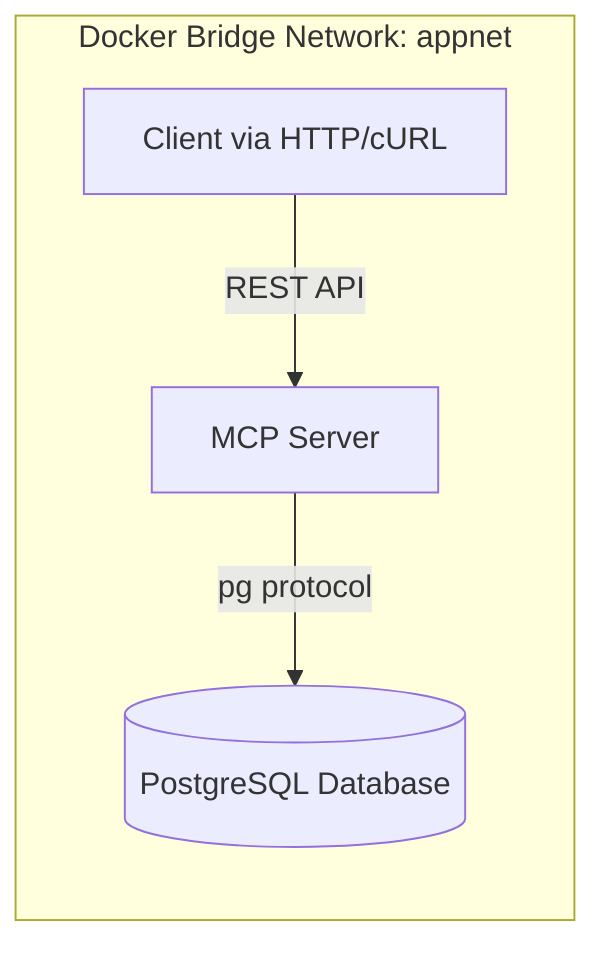

# PostgreSQL + MCP (Micro Control Plane) Lab

## Overview

This lab demonstrates an integration between PostgreSQL and a Micro Control Plane (MCP) built with Node.js and exposed through a REST API.

The environment runs fully containerized with Docker, delivering hands-on experience with:

* Multi-service Docker builds
* Container-to-container networking on a dedicated bridge network
* Automated database initialization and seed data injection
* A RESTful MCP API for query execution and data manipulation
* Health checks, observability, and controlled SQL execution

---

## Architecture



**Components:**

* **PostgreSQL** - hosts the `demo` schema with tables for users, products, and orders.
* **MCP Server** - provides REST endpoints to query and manipulate PostgreSQL data.
* **Makefile** - orchestrates Docker Compose operations and wraps common API calls.

---

## Project Structure

```text
app-mcp-postgres/
|-- docker-compose.yaml
|-- .env
|-- .env.example
|-- Makefile
|-- mcp/
|   |-- Dockerfile
|   |-- .dockerignore
|   |-- package.json
|   `-- src/
|       `-- server.js
`-- postgres/
    |-- Dockerfile
    `-- init/
        |-- 00_create_schema.sql
        `-- 01_seed_data.sql
```

---

## Environment Variables (`.env`)

```env
POSTGRES_USER=app
POSTGRES_PASSWORD=secret
POSTGRES_DB=appdb
POSTGRES_PORT=5432
MCP_PORT=8080
```

---

## Docker Compose Services

| Service   | Description                                                          | Key Ports |
| --------- | -------------------------------------------------------------------- | --------- |
| postgres  | PostgreSQL container seeded with the demo schema and data            | 5432      |
| mcp       | Node.js REST gateway for SQL query/exec (via `pg` driver)            | 8080      |

---

## Build & Run

```bash
make up
```

This builds and starts both containers, initializes the database, and exposes the MCP API on `http://localhost:8080`.

To verify container status:

```bash
make ps
```

View combined logs:

```bash
make logs
```

---

## Health Check

```bash
make mcp-health
```

Expected output:

```json
{
  "status": "ok",
  "db": "connected",
  "probe": true
}
```

---

## Querying via MCP

All SQL operations (read/write) are executed through the MCP, not directly via `psql`. Two REST endpoints are exposed:

| Endpoint | Method | Purpose                               | Restriction                       |
| -------- | ------ | ------------------------------------- | --------------------------------- |
| /query   | POST   | Executes SELECT statements            | Regex enforced via `MCP_QUERY_ALLOW` |
| /exec    | POST   | Executes INSERT / UPDATE / DELETE     | Regex enforced via `MCP_EXEC_ALLOW`  |

**Example: SELECT via `/query`**

```bash
make mcp-query
```

Equivalent `curl`:

```bash
curl -fsS -X POST http://localhost:8080/query \
  -H 'Content-Type: application/json' \
  -d '{"sql":"SELECT count(*) AS users FROM demo.users"}'
```

**Example: Bulk insert via `/exec`**

```bash
make mcp-bulk-users N=25
```

Equivalent `curl` (creating three demo users):

```bash
curl -fsS -X POST http://localhost:8080/exec \
  -H 'Content-Type: application/json' \
  --data-binary '{"sql":"INSERT INTO demo.users(full_name,email) SELECT CONCAT(''bulk user '', gs), CONCAT(''bulk-'', gs, ''-'', to_char(clock_timestamp(), ''yyyymmddhh24missms''), ''@example.com'') FROM generate_series(1, 3) AS gs","params":[]}'
```

**Example: Targeted delete via `/exec`**

```bash
make mcp-delete-one PATTERN='bulk-%'
make mcp-delete-n N=10 PATTERN='bulk-%'
```

Both targets default to the `bulk-%` pattern when `PATTERN` is omitted.

**Custom example: UPDATE via `/exec`**

```bash
curl -fsS -X POST http://localhost:8080/exec \
  -H 'Content-Type: application/json' \
  -d '{"sql":"UPDATE demo.users SET full_name = $1 WHERE email = $2","params":["Renamed User","user1@example.com"]}'
```

**Demo convenience endpoint**

The MCP also exposes `GET /demo/users` to return the 25 most recent users for quick inspections.

---

## Database Schema Overview

| Table              | Description                                 |
| ------------------ | ------------------------------------------- |
| `demo.users`       | Application users (name, email, created_at) |
| `demo.products`    | Product catalog with prices                 |
| `demo.orders`      | Orders associated with users                |
| `demo.order_items` | Line items linking orders and products      |

---

## Security Controls

| Mechanism                  | Description                                                                 |
| -------------------------- | --------------------------------------------------------------------------- |
| Regex SQL Whitelisting     | Controlled via `MCP_QUERY_ALLOW` and `MCP_EXEC_ALLOW` environment variables |
| Parameterised Statements   | `/exec` operations support positional parameters (`$1`, `$2`, ...)          |
| Least Privilege            | PostgreSQL user `app` with limited DML rights                               |
| Health & Isolation         | Dedicated Docker network (`appnet`) and container-level health checks       |

---

## Makefile Commands

| Command                                   | Description                                               |
| ----------------------------------------- | --------------------------------------------------------- |
| `make help`                               | Show all available commands and examples                  |
| `make up`                                 | Build and start all Docker containers                     |
| `make down`                               | Stop and remove all containers and volumes                |
| `make ps`                                 | List running containers                                   |
| `make logs`                               | Tail real-time logs from all services                     |
| `make mcp-health`                         | Check MCP `/health` endpoint status                       |
| `make mcp-query`                          | Execute demo `SELECT count(*) FROM demo.users` query      |
| `make mcp-bulk-users N=<int>`             | Insert `N` random users via MCP (default prefix `bulk`)   |
| `make mcp-delete-one PATTERN='bulk-%'`    | Delete the most recent user matching the pattern          |
| `make mcp-delete-n N=<int> PATTERN='bulk-%'` | Delete the `N` most recent users matching the pattern  |
| `make mcp-tables`                         | List all tables in schema `demo`                          |
| `make mcp-counts`                         | Show row count per table (`users`, `orders`, etc.)        |
| `make mcp-users`                          | Show the last 10 users                                    |
| `make mcp-orders`                         | Show the last 10 orders                                   |
| `make mcp-items`                          | Show the latest order items                               |
| `make mcp-show`                           | Run tables, counts, users, orders, and items sequentially |
| `make clean`                              | Remove unused Docker resources                            |
| `make rebuild`                            | Rebuild (down + up) all containers                        |

---

## Teardown

```bash
make down
```

Optionally clear dangling Docker artefacts:

```bash
make clean
```

---

## Author & Versioning

Author: Marcos Silvestrini  
Version: 1.0 (October 2025)  
License: MIT
