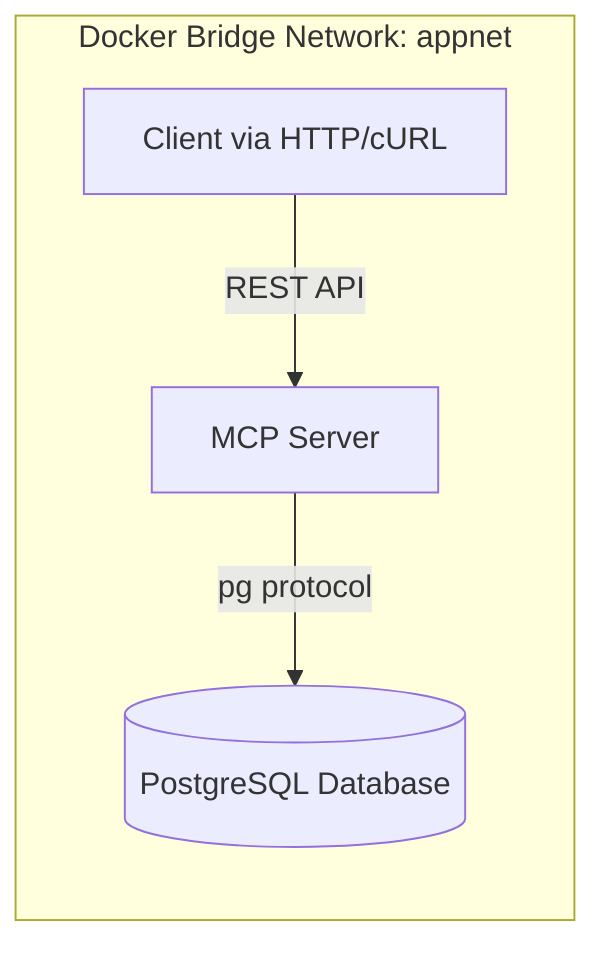

# 🧠 PostgreSQL + MCP (Micro Control Plane) Lab

## 📝 Overview

This lab demonstrates a **modern integration between PostgreSQL and a Micro Control Plane (MCP)** built with Node.js and exposed via a  **REST API** .

The environment runs  **fully containerized with Docker** , ensuring reproducibility, isolation, and hands-on experience with:

* Multi-service **Dockerfile** builds
* **Container-to-container networking** using bridge mode
* Automated **database initialization and seed data injection**
* A **RESTful MCP API** for query execution and data manipulation
* Implementation of  **healthchecks** ,  **observability** , and **controlled SQL execution**

---

## 🏗️ Architecture



**Components:**

* **PostgreSQL** – hosts the `demo` schema with tables for users, products, and orders.
* **MCP Server** – provides REST endpoints to query and manipulate PostgreSQL data.
* **Makefile** – provides operational targets for build, orchestration, and testing.

---

## 📂 Project Structure

```psql
app-mcp-postgres/
├─ docker-compose.yml
├─ .env
├─ Makefile
│
├─ postgres/
│  ├─ Dockerfile
│  └─ init/
│     ├─ 00_create_schema.sql
│     └─ 01_seed_data.sql
│
└─ mcp/
   ├─ Dockerfile
   ├─ package.json
   └─ src/
      └─ server.js

```

---

## ⚙️ Environment Variables (`.env`)

```env
POSTGRES_USER=app
POSTGRES_PASSWORD=secret
POSTGRES_DB=appdb
POSTGRES_PORT=5432
MCP_PORT=8080
```

---

## 🐳 Docker Compose Services

| Service            | Description                                             | Key Ports |
| ------------------ | ------------------------------------------------------- | --------- |
| **postgres** | PostgreSQL 16 container with schema + seed data         | 5432      |
| **mcp**      | Node.js REST gateway for SQL query/exec (via pg driver) | 8080      |

---

## 🧱 Build & Run

```bash
make up
```

This will build and start both containers, initialize the database, and expose the MCP API on http://localhost:8080.

To verify container status:

```bash
make ps
```

---

## 🧩 Health Check

```bash
make mcp-health
```

Expected output:

```json
{
  "status": "ok",
  "db": "connected",
  "probe": true
}
```

---

## 🔍 Querying via MCP

All SQL operations (read/write) are executed through the MCP, not directly via psql.
Two REST endpoints are exposed:

| Endpoint | Method | Purpose | Restriction |
| -------- | ------ | ------- | ----------- |
| /query   | POST   | Executes SELECT statements | Regex enforced via MCP_QUERY_ALLOW |
| /exec    | POST   | Executes INSERT / UPDATE / DELETE | Regex enforced via MCP_EXEC_ALLOW |

▶️ Example: SELECT via /query

```bash
make mcp-query
```

Equivalent to:

```bash
curl -fsS -X POST http://localhost:8080/query \
  -H 'Content-Type: application/json' \
  -d '{"sql":"SELECT count(*) AS users FROM demo.users"}'
```

🧮 Example: INSERT via /exec

```bash
make mcp-insert
```

Equivalent to:

```bash
curl -fsS -X POST http://localhost:8080/exec \
  -H 'Content-Type: application/json' \
  -d '{"sql":"INSERT INTO demo.users(full_name,email) VALUES($1,$2)","params":["New User","new.user@example.com"]}'
```

## 🧾 Example: UPDATE

```bash
make mcp-update
```

❌ Example: DELETE

```bash
make mcp-delete
```

---

📊 Database Schema Overview

| Table              | Description                                 |
| ------------------ | ------------------------------------------- |
| `demo.users`       | Application users (name, email, created_at) |
| `demo.products`    | Product catalog with prices                 |
| `demo.orders`      | Orders associated with users                |
| `demo.order_items` | Line items linking orders and products      |

---

## 🔐 Security Controls

| Mechanism                  | Description                                                                 |
| -------------------------- | --------------------------------------------------------------------------- |
| **Regex SQL Whitelisting** | Controlled via `MCP_QUERY_ALLOW` and `MCP_EXEC_ALLOW` environment variables |
| **Prepared Statements**    | All `/exec` operations require parameter binding (`$1`, `$2`, …)            |
| **Least Privilege**        | PostgreSQL user `app` with limited DML rights                               |
| **Health & Isolation**     | Dedicated Docker network (`appnet`) and container-level healthchecks        |

---

## 🧰 Makefile Commands

| Command                                   | Description                                               |
| ----------------------------------------- | --------------------------------------------------------- |
| `make help`                               | Show all available commands and examples                  |
| `make up`                                 | Build and start all Docker containers                     |
| `make down`                               | Stop and remove all containers and volumes                |
| `make ps`                                 | List running containers                                   |
| `make logs`                               | Tail real-time logs from all services                     |
| `make mcp-health`                         | Check MCP `/health` endpoint status                       |
| `make mcp-query`                          | Execute demo `SELECT count(*) FROM demo.users` query      |
| `make mcp-bulk-users N=100`               | Insert **N random users** via MCP (default prefix `bulk`) |
| `make mcp-delete-one PATTERN='bulk-%'`    | Delete **most recent user** matching pattern              |
| `make mcp-delete-n N=25 PATTERN='bulk-%'` | Delete **N most recent users** matching pattern           |
| `make mcp-tables`                         | List all tables in schema `demo`                          |
| `make mcp-counts`                         | Show **row count per table** (`users`, `orders`, etc.)    |
| `make mcp-users`                          | Show **last 10 users**                                    |
| `make mcp-orders`                         | Show **last**                                             |

---

## 🧼 Teardown

```bash
make down
```

---

🧑‍💻 Author & Versioning

Author: Marcos Silvestrini
Version: 1.0 (October 2025)
License: MIT
