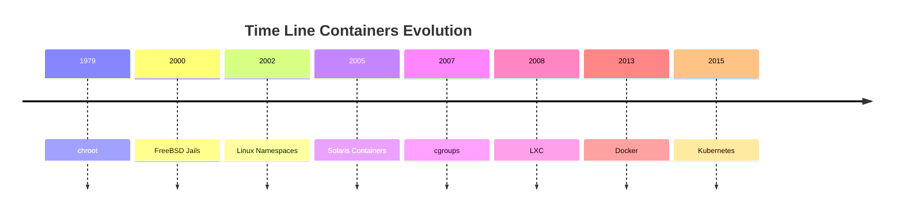
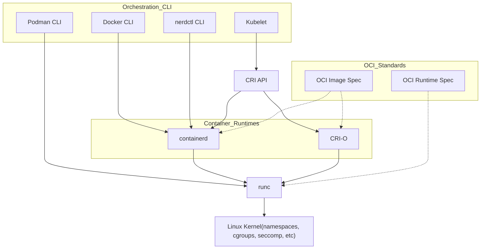

# Topic 352: Container Virtualization

---

<a name="topic-352.1"></a>

### 352.1  Container Virtualization Concepts




---

**Weight:** 7

**Description:** Candidates should understand the concept of container virtualization. This includes understanding the Linux components used to implement container virtualization as well as using standard Linux tools to troubleshoot these components.

**Key Knowledge Areas:**

* Understand the concepts of system and application container
* Understand and analyze kernel namespaces
* Understand and analyze control groups
* Understand and analyze capabilities
* Understand the role of seccomp, SELinux and AppArmor for container virtualization
* Understand how LXC and Docker leverage namespaces, cgroups, capabilities, seccomp and MAC
* Understand the principle of runc
* Understand the principle of CRI-O and containerd
* Awareness of the OCI runtime and image specifications
* Awareness of the Kubernetes Container Runtime Interface (CRI)
* Awareness of podman, buildah and skopeo
* Awareness of other container virtualization approaches in Linux and other free operating systems, such as rkt, OpenVZ, systemd-nspawn or BSD Jails

---

#### 352.1 Cited Objects

```sh
nsenter
unshare
ip (including relevant subcommands)
capsh
/sys/fs/cgroups
/proc/[0-9]+/ns
/proc/[0-9]+/status
```

---

#### 🧠 Understanding Containers


Containers are a lightweight virtualization technology that package applications along with their required dependencies — code, libraries, environment variables, and configuration files — into isolated, portable, and reproducible units.

> In simple terms: a container is a self-contained box that runs your application the same way, anywhere.

##### 💡 What Is a Container?

Unlike Virtual Machines (VMs), containers do not virtualize hardware. Instead, they virtualize the operating system. Containers share the same Linux kernel with the host, but each one operates in a fully isolated user space.

📌 Containers vs Virtual Machines:

| Feature             | Containers                   | Virtual Machines       |
| ------------------- | ---------------------------- | ---------------------- |
| OS Kernel           | Shared with host             | Each VM has its own OS |
| Startup time        | Fast (seconds or less)       | Slow (minutes)         |
| Image size          | Lightweight (MBs)            | Heavy (GBs)            |
| Resource efficiency | High                         | Lower                  |
| Isolation mechanism | Kernel features (namespaces) | Hypervisor             |

##### 🔑 Key Characteristics of Containers

🔹 **Lightweight**: Share the host OS kernel, reducing overhead and enabling fast startup.

🔹 **Portable**: Run consistently across different environments (dev, staging, prod, cloud, on-prem).

🔹 **Isolated**: Use namespaces for process, network, and filesystem isolation.

🔹 **Efficient**: Enable higher density and better resource utilization than traditional VMs.

🔹 **Scalable**: Perfect fit for microservices and cloud-native architecture.

##### 🧱 Types of Containers

1. System Containers

   * Designed to run the entire OS, Resemble virtual machines.
   * Support multiple processes and system services (init, syslog).
   * Ideal for legacy or monolithic applications.
   * Example: LXC, libvirt-lxc.
2. Application Containers

   * Designed to run a single process.
   * Stateless, ephemeral, and horizontally scalable.
   * Used widely in modern DevOps and Kubernetes environments.
   * Example: Docker, containerd, CRI-O.

##### 🚀 Popular Container Runtimes

| Runtime              | Description                                                         |
| -------------------- | ------------------------------------------------------------------- |
| **Docker**     | Most widely adopted CLI/daemon for building and running containers. |
| **containerd** | Lightweight runtime powering Docker and Kubernetes.                 |
| **CRI-O**      | Kubernetes-native runtime for OCI containers.                       |
| **LXC**        | Traditional Linux system containers, closer to full OS.             |
| **RKT**        | Security-focused runtime (deprecated).                              |

##### 🔐 Container Internals and Security Elements

| Component                    | Role                                                  |
| ---------------------------- | ----------------------------------------------------- |
| **Namespaces**         | Isolate processes, users, mounts, networks.           |
| **cgroups**            | Control and limit resource usage (CPU, memory, IO).   |
| **Capabilities**       | Fine-grained privilege control inside containers.     |
| **seccomp**            | Restricts allowed syscalls to reduce attack surface.  |
| **AppArmor / SELinux** | Mandatory Access Control enforcement at kernel level. |

---

#### 🧠 Understanding chroot - Change Root Directory in Unix/Linux


##### What is chroot?

chroot (short for change root) is a system call and command on Unix-like operating systems that changes the apparent root directory (/) for the current running process and its children. This creates an isolated environment, commonly referred to as a chroot jail.

##### 🧱 Purpose and Use Cases

* 🔒 Isolate applications for security (jailing).
* 🧪 Create testing environments without impacting the rest of the system.
* 🛠️ System recovery (e.g., boot into LiveCD and chroot into installed system).
* 📦 Building software packages in a controlled environment.

##### 📁 Minimum Required Structure

The chroot environment must have its own essential files and structure:

```sh
/mnt/myenv/
├── bin/
│   └── bash
├── etc/
├── lib/
├── lib64/
├── usr/
├── dev/
├── proc/
└── tmp/
```

Use ldd to identify required libraries:

```sh
ldd /bin/bash
```

##### 🚨 Limitations and Security Considerations

* chroot is not a security boundary like containers or VMs.
* A privileged user (root) inside the jail can potentially break out.
* No isolation of process namespaces, devices, or kernel-level resources.

For stronger isolation, consider alternatives like:

* Linux containers (LXC, Docker)
* Virtual machines (KVM, QEMU)
* Kernel namespaces and cgroups

##### 🧪 Test chroot with debootstrap

```sh
# download debain files
sudo debootstrap stable ~vagrant/debian http://deb.debian.org/debian
sudo chroot ~vagrant/debian bash
```

##### :🧪 Lab chroot

Use this script for lab: [chroot.sh](../scripts/container/chroot.sh)

[](https://asciinema.org/a/PWkjazgTXll9678Qy6LLOaKdN)

---

#### 🧠 Understanding Linux Namespaces


Namespaces are a core Linux kernel feature that enable process-level isolation. They create separate "views" of global system resources — such as process IDs, networking, filesystems, and users — so that each process group believes it is running in its own system.

> In simple terms: namespaces trick a process into thinking it owns the machine, even though it's just sharing it.

This is the foundation for container isolation.

##### 🔍 What Do Namespaces Isolate?

Each namespace type isolates a specific system resource. Together, they make up the sandbox that a container operates in:

| Namespace             | Isolates...                  | Real-world example                                      |
| --------------------- | ---------------------------- | ------------------------------------------------------- |
| **PID**         | Process IDs                  | Processes inside a container see a different PID space  |
| **Mount**       | Filesystem mount points      | Each container sees its own root filesystem             |
| **Network**     | Network stack                | Containers have isolated IPs, interfaces, and routes    |
| **UTS**         | Hostname and domain name     | Each container sets its own hostname                    |
| **IPC**         | Shared memory and semaphores | Prevents inter-process communication between containers |
| **User**        | User and group IDs           | Enables fake root (UID 0) inside the container          |
| **Cgroup (v2)** | Control group membership     | Ties into resource controls like CPU and memory limits  |

##### 🧪 Visual Analogy


Imagine a shared office building:

* All tenants share the same foundation (Linux kernel).
* Each company has its own office (namespace): different locks, furniture, phone lines, and company name.
* To each tenant, it feels like their own building.

That's exactly how containers experience the system — isolated, yet efficient.

##### 🔧 How Containers Use Namespaces

When you run a container (e.g., with Docker or Podman), the runtime creates a new set of namespaces:

```bash
docker run -it --rm alpine sh
```

This command gives the process:

* A new PID namespace → it's process 1 inside the container.
* A new network namespace → its own virtual Ethernet.
* A mount namespace → a container-specific root filesystem.
* Other namespaces depending on configuration (user, IPC, etc.)

The result: a lightweight, isolated runtime environment that behaves like a separate system.

##### ⚙️ Complementary Kernel Features

Namespaces hide resources from containers. But to control how much they can use and what they can do, we need additional mechanisms:

###### 🔩 Cgroups (Control Groups)

Cgroups allow the kernel to limit, prioritize, and monitor resource usage across process groups.

| Resource     | Use case examples              |
| ------------ | ------------------------------ |
| CPU          | Limit CPU time per container   |
| Memory       | Cap RAM usage                  |
| Disk I/O     | Throttle read/write operations |
| Network (v2) | Bandwidth restrictions         |

🛡️ Prevents the "noisy neighbor" problem by stopping one container from consuming all system resources.

###### 🧱 Capabilities

Traditional Linux uses a binary privilege model: root (UID 0) can do everything, everyone else is limited.

| Capability               | Allows...                                   |
| ------------------------ | ------------------------------------------- |
| `CAP_NET_BIND_SERVICE` | Binding to privileged ports (e.g. 80, 443)  |
| `CAP_SYS_ADMIN`        | A powerful catch-all for system admin tasks |
| `CAP_KILL`             | Sending signals to arbitrary processes      |

By dropping unnecessary capabilities, containers can run with only what they need — reducing risk.

##### 🔐 Security Mechanisms

Used in conjunction with namespaces and cgroups to lock down what a containerized process can do:

| Feature            | Description                                                 |
| ------------------ | ----------------------------------------------------------- |
| **seccomp**  | Whitelist or block Linux system calls (syscalls)            |
| **AppArmor** | Apply per-application security profiles                     |
| **SELinux**  | Enforce Mandatory Access Control with tight system policies |

##### 🧠 Summary for Beginners

> ✅ Namespaces isolate what a container can see
> ✅ Cgroups control what it can use
> ✅ Capabilities and security modules define what it can do

Together, these kernel features form the technical backbone of container isolation — enabling high-density, secure, and efficient application deployment without full VMs.

##### 🧪 Lab Namespaces

Use this script for lab: [namespace.sh](../scripts/container/namespace.sh)

[](https://asciinema.org/a/8H6iczCMO24VgjWqwCcXEKWBG)

---

#### 🧩 Understanding Cgroups (Control Groups)


##### 📌 Definition

Control Groups (cgroups) are a Linux kernel feature introduced in 2007 that allow you to limit, account for, and isolate the resource usage (CPU, memory, disk I/O, etc.) of groups of processes.

cgroups are heavily used by low-level container runtimes such as runc and crun, and leveraged by container engines like Docker, Podman, and LXC to enforce resource boundaries and provide isolation between containers.

Namespaces isolate, cgroups control.

Namespaces create separate environments for processes (like PID, network, or mounts), while cgroups limit and monitor resource usage (CPU, memory, I/O) for those processes.

⚙️ Key Capabilities

| Feature                     | Description                                              |
| --------------------------- | -------------------------------------------------------- |
| **Resource Limiting** | Impose limits on how much of a resource a group can use  |
| **Prioritization**    | Allocate more CPU/IO priority to some groups over others |
| **Accounting**        | Track usage of resources per group                       |
| **Control**           | Suspend, resume, or kill processes in bulk               |
| **Isolation**         | Prevent resource starvation between groups               |

##### 📦 Subsystems (Controllers)

cgroups operate through controllers, each responsible for managing one type of resource:

| Subsystem   | Description                         |
| ----------- | ----------------------------------- |
| `cpu`     | Controls CPU scheduling             |
| `cpuacct` | Generates CPU usage reports         |
| `memory`  | Limits and accounts memory usage    |
| `blkio`   | Limits block device I/O             |
| `devices` | Controls access to devices          |
| `freezer` | Suspends/resumes execution of tasks |
| `net_cls` | Tags packets for traffic shaping    |
| `ns`      | Manages namespace access (rare)     |

##### 📂 Filesystem Layout

cgroups are exposed through the virtual filesystem under /sys/fs/cgroup.

Depending on the version:

* **cgroups v1**: separate hierarchies for each controller (e.g., memory, cpu, etc.)
* **cgroups v2**: unified hierarchy under a single mount point

Mounted under:

```sh
/sys/fs/cgroup/
```

Typical cgroups v1 hierarchy:

```sh
/sys/fs/cgroup/
├── memory/
│   ├── mygroup/
│   │   ├── tasks
│   │   ├── memory.limit_in_bytes
├── cpu/
│   └── mygroup/
└── ...
```

In cgroups v2, all resources are managed under a unified hierarchy:

```sh
/sys/fs/cgroup/
├── cgroup.procs
├── cgroup.controllers
├── memory.max
├── cpu.max
└── ...
```

##### 🧪 Common Usage (v1 and v2 examples)

v1 – Create and assign memory limit:

```sh
# Mount memory controller (if needed)
mount -t cgroup -o memory none /sys/fs/cgroup/memory

# Create group
mkdir /sys/fs/cgroup/memory/mygroup

# Set memory limit (100 MB)
echo 104857600 | tee /sys/fs/cgroup/memory/mygroup/memory.limit_in_bytes

# Assign a process (e.g., current shell)
echo $$ | tee /sys/fs/cgroup/memory/mygroup/tasks
```

v2 – Unified hierarchy:

```sh
# Create subgroup
mkdir /sys/fs/cgroup/mygroup

# Enable controllers
echo +memory +cpu > /sys/fs/cgroup/cgroup.subtree_control

# Move shell into group
echo $$ > /sys/fs/cgroup/mygroup/cgroup.procs

# Set limits
echo 104857600 > /sys/fs/cgroup/mygroup/memory.max
echo "50000 100000" > /sys/fs/cgroup/mygroup/cpu.max  # 50ms quota per 100ms period
```

🧭 Process & Group Inspection

| Command                   | Description                     |
| ------------------------- | ------------------------------- |
| `cat /proc/self/cgroup` | Shows current cgroup membership |
| `cat /proc/PID/cgroup`  | cgroup of another process       |
| `cat /proc/PID/status`  | Memory and cgroup info          |
| `ps -o pid,cmd,cgroup`  | Show process-to-cgroup mapping  |

##### 📦 Usage in Containers

Container engines like Docker, Podman, and containerd delegate resource control to cgroups (via runc or crun), allowing:

* Per-container CPU and memory limits
* Fine-grained control over blkio and devices
* Real-time resource accounting

Docker example:

```sh
docker run --memory=256m --cpus=1 busybox
```

Behind the scenes, this creates cgroup rules for memory and CPU limits for the container process.

##### 🧠 Concepts Summary

| Concept               | Explanation                                                              |
| --------------------- | ------------------------------------------------------------------------ |
| **Controllers** | Modules like `cpu`, `memory`, `blkio`, etc. apply limits and rules |
| **Tasks**       | PIDs (processes) assigned to the control group                           |
| **Hierarchy**   | Cgroups are structured in a parent-child tree                            |
| **Delegation**  | Systemd and user services may manage subtrees of cgroups                 |

##### 🧪 Lab Cgroups

Use this script for lab: [cgroups.sh](../scripts/container/cgroups.sh)

[](https://asciinema.org/a/WbudWJpHKPzBWMh8CGRxCIpZf)

---

#### 🛡️ Understanding Capabilities

❓ What Are Linux Capabilities?

Traditionally in Linux, the root user has unrestricted access to the system. Linux capabilities were introduced to break down these all-powerful privileges into smaller, discrete permissions, allowing processes to perform specific privileged operations without requiring full root access.

This enhances system security by enforcing the principle of least privilege.

| 🔐 Capability            | 📋 Description                                      |
| ------------------------ | --------------------------------------------------- |
| `CAP_CHOWN`            | Change file owner regardless of permissions         |
| `CAP_NET_BIND_SERVICE` | Bind to ports below 1024 (e.g., 80, 443)            |
| `CAP_SYS_TIME`         | Set system clock                                    |
| `CAP_SYS_ADMIN`        | ⚠️ Very powerful – includes mount, BPF, and more |
| `CAP_NET_RAW`          | Use raw sockets (e.g., ping, traceroute)            |
| `CAP_SYS_PTRACE`       | Trace other processes (debugging)                   |
| `CAP_KILL`             | Send signals to any process                         |
| `CAP_DAC_OVERRIDE`     | Modify files and directories without permission     |
| `CAP_SETUID`           | Change user ID (UID) of the process                 |
| `CAP_NET_ADMIN`        | Manage network interfaces, routing, etc.            |

🔐 Some Linux Capabilities Types

| Capability Type              | Description                                                               |
| ---------------------------- | ------------------------------------------------------------------------- |
| **CapInh (Inherited)** | Capabilities inherited from the parent process.                           |
| **CapPrm (Permitted)** | Capabilities that the process is allowed to have.                         |
| **CapEff (Effective)** | Capabilities that the process is currently using.                         |
| **CapBnd (Bounding)**  | Restricts the maximum set of effective capabilities a process can obtain. |
| **CapAmb (Ambient)**   | Allows a process to explicitly define its own effective capabilities.     |

📦 Capabilities in Containers and Pods
Containers typically do not run as full root, but instead receive a limited set of capabilities by default depending on the runtime.

Capabilities can be added or dropped in Kubernetes using the securityContext.

📄 Kubernetes example:

```yaml
securityContext:
  capabilities:
    drop: ["ALL"]
    add: ["NET_BIND_SERVICE"]
```

🔐 This ensures the container starts with zero privileges and receives only what is needed.

##### 🧪 Lab Capabilities

Use this script for lab: [capabilities.sh](../scripts/container/capabilities.sh)

[](https://asciinema.org/a/kCiUGvY0YGA5Mdzbj1NSdfLAx)

#### 🛡️ Seccomp (Secure Computing Mode)

**What is it?**

* A Linux kernel feature for restricting which syscalls (system calls) a process can use.
* Commonly used in containers (like Docker), browsers, sandboxes, etc.

**How does it work?**

* A process enables a seccomp profile/filter.
* The kernel blocks, logs, or kills the process if it tries forbidden syscalls.
* Filters are written in BPF (Berkeley Packet Filter) format.

**Quick commands**

```sh
# Check support
docker info | grep Seccomp

# Disable for a container:
docker run --security-opt seccomp=unconfined ...

# Inspect running process:
grep Seccomp /proc/$$/status
```

**Tools**

```sh
# for analyzing
seccomp-tools 

# Profiles
/etc/docker/seccomp.json
```

#### 🦺AppArmor

**What is it?**

* A Mandatory Access Control (MAC) system for restricting what specific programs can access.
* Profiles are text-based, path-oriented, easy to read and edit.

**How does it work?**

* Each binary can have a profile that defines its allowed files, network, and capabilities—even as root!
* Easy to switch between complain, enforce, and disabled modes.

**Quick commands:**

```sh
#Status
aa-status

# Put a program in enforce mode
sudo aa-enforce /etc/apparmor.d/usr.bin.foo

# Profiles
location: /etc/apparmor.d/
```

**Tools:**

aa-genprof, aa-logprof for generating/updating profiles

Logs

```sh
/var/log/syslog (search for apparmor)
```

#### 🔒SELinux (Security-Enhanced Linux)

**What is it?**

* A very powerful MAC system for controlling access to everything: files, processes, users, ports, networks, and more.
* Uses labels (contexts) and detailed policies.

**How does it work?**

* Everything (process, file, port, etc.) gets a security context.
* Kernel checks every action against policy rules.

**Quick commands:**

```sh
#Status
sestatus

#Set to enforcing/permissive:
setenforce 1  # Enforcing
setenforce 0  # Permissive

#List security contexts:
ls -Z  # Files
ps -eZ # Processes
```

**Tools:**

* audit2allow, semanage, chcon (for managing policies/labels)
* Logs: /var/log/audit/audit.log
* Policies: /etc/selinux/

#### 📋 Summary Table for Common Security Systems

| System   | Focus              | Complexity | Policy Location               | Typical Use          |
| -------- | ------------------ | ---------- | ----------------------------- | -------------------- |
| Seccomp  | Kernel syscalls    | Medium     | Per-process (via code/config) | Docker, sandboxes    |
| AppArmor | Per-program access | Easy       | /etc/apparmor.d/              | Ubuntu, Snap, SUSE   |
| SELinux  | Full-system MAC    | Advanced   | /etc/selinux/ + labels        | RHEL, Fedora, CentOS |

#### 🗂️ Linux Container Isolation & Security Comparison

| Technology                  | Purpose / What It Does                                                                               | Main Differences                                                                                | Example in Containers                                                                        |
| --------------------------- | ---------------------------------------------------------------------------------------------------- | ----------------------------------------------------------------------------------------------- | -------------------------------------------------------------------------------------------- |
| **chroot 🏠**         | Changes the apparent root directory for a process. Isolates filesystem.                              | Simple filesystem isolation; does**not** restrict resources, privileges, or system calls. | Docker uses `chroot` internally for building minimal images, but not for strong isolation. |
| **cgroups 📊**        | Controls and limits resource usage (CPU, memory, disk I/O, etc.) per group of processes.             | Kernel feature; fine-grained resource control, not isolation.                                   | Docker and Kubernetes use cgroups to limit CPU/mem per container/pod.                        |
| **namespaces 🌐**     | Isolate system resources: PID, mount, UTS, network, user, IPC, time.                                 | Kernel feature; provides different kinds of isolation.                                          | Each container runs in its own set of namespaces (PID, net, mount, etc).                     |
| **capabilities 🛡️** | Split root privileges into fine-grained units (e.g., net\_admin, sys\_admin).                        | More granular than all-or-nothing root/non-root; can drop or grant specific privileges.         | Docker containers usually run with reduced capabilities (drop dangerous ones).               |
| **seccomp 🧱**        | Filter/restrict which syscalls a process can make (whitelisting/blacklisting).                       | Very focused: blocks kernel syscalls; cannot block all actions.                                 | Docker’s default profile blocks dangerous syscalls (e.g.,`ptrace`, `mount`).            |
| **AppArmor 🐧**       | Mandatory Access Control (MAC) framework: restricts programs' file/network access via profiles.      | Profile-based, easier to manage than SELinux; less fine-grained in some cases.                  | Ubuntu-based containers often use AppArmor for container process profiles.                   |
| **SELinux 🔒**        | More complex MAC framework, label-based, very fine-grained. Can confine users, processes, and files. | More powerful and complex than AppArmor; enforced on Fedora/RHEL/CentOS.                        | On OpenShift/Kubernetes with RHEL, SELinux labels are used to keep pods separate.            |

Summary

* chroot: Basic isolation, no resource/security guarantees.
* cgroups: Resource control, not isolation.
* namespaces: Isolate "views" of kernel resources.
* capabilities: Fine-tune process privileges.
* seccomp: Restrict system call surface.
* AppArmor/SELinux: Limit what processes can touch, even as root (MAC).

#### 🧩 OCI, runc, containerd, CRI, CRI-O — What They Are in the Container Ecosystem

##### Overview and Roles

* **OCI (Open Container Initiative) 🏛️**

  A foundation creating open standards for **container images** and  **runtimes** .

  *Defines how images are formatted, stored, and how containers are started/stopped (runtime spec).*
* **runc ⚙️**

  A universal, low-level, lightweight CLI tool that can run containers according to the OCI runtime specification.

  *“The engine” that turns an image + configuration into an actual running Linux container.*
* **containerd 🏋️**

  A core container runtime daemon for managing the complete container lifecycle: **pulling images, managing storage, running containers** (calls runc), networking plugins, etc.

  *Used by Docker, Kubernetes, nerdctl, and other tools as their main container runtime backend.*
* **CRI (Container Runtime Interface) 🔌**

  A Kubernetes-specific gRPC API to connect Kubernetes with container runtimes.

  *Not used outside Kubernetes, but enables K8s to talk to containerd, CRI-O, etc.*
* **CRI-O 🥤**

  A lightweight, Kubernetes-focused runtime that **only** runs OCI containers, using runc under the hood.

  *Mostly used in Kubernetes, but demonstrates how to build a minimal container runtime focused on open standards.*

##### 🏷️ Comparison Table: OCI, runc, containerd, CRI, CRI-O

| Component            | Emoji | What Is It?                           | Who Uses It?                            | Example Usage                                                                |
| -------------------- | ----- | ------------------------------------- | --------------------------------------- | ---------------------------------------------------------------------------- |
| **OCI**        | 🏛️  | Standards/specifications              | Docker, Podman, CRI-O, containerd, runc | Ensures images/containers are compatible across tools                        |
| **runc**       | ⚙️  | Container runtime (CLI)               | containerd, CRI-O, Docker, Podman       | Directly running a container from a bundle (e.g.`runc run`)                |
| **containerd** | 🏋️  | Container runtime daemon              | Docker, Kubernetes, nerdctl             | Handles pulling images, managing storage/network, starts containers via runc |
| **CRI**        | 🔌    | K8s runtime interface (API)           | Kubernetes only                         | Lets kubelet talk to containerd/CRI-O                                        |
| **CRI-O**      | 🥤    | Lightweight container runtime for K8s | Kubernetes, OpenShift                   | Used as K8s container engine                                                 |

---

##### 🛠️ Practical Examples (General Container World)

* **Building images:**

  Any tool (Docker, Podman, Buildah) can produce images following the **OCI Image Spec** so they’re compatible everywhere.
* **Running containers:**

  Both Podman and Docker ultimately use **runc** (via containerd or directly) to create containers.
* **Managing many containers:**

  **containerd** can be used on its own (via `ctr` or `nerdctl`) or as a backend for Docker and Kubernetes.
* **Plug-and-play runtimes:**

  Thanks to  **OCI** , you could swap runc for another OCI-compliant runtime (like Kata Containers for VMs, gVisor for sandboxing) without changing how you build or manage images.

---

##### 🚢 Typical Stack

```plaintext
[User CLI / Orchestration]
           |
   [containerd / CRI-O]
           |
        [runc]
           |
[Linux Kernel: namespaces, cgroups, etc]
```

* **Docker** : User CLI → containerd → runc
* **Podman** : User CLI → runc
* **Kubernetes** : kubelet (CRI) → containerd or CRI-O → runc

---

##### 🧠 Summary

* **OCI** = Common language for images/runtimes (standards/specs)
* **runc** = Actual tool that creates and manages container processes
* **containerd** = Full-featured daemon that manages images, containers, lifecycle
* **CRI** = Only for Kubernetes, to make runtimes pluggable
* **CRI-O** = Lightweight runtime focused on Kubernetes, built on OCI standards and runc

##### 🧩 Diagram: Container Ecosystem



##### 🧪 lab runc

For runc lab, you can use this script: [runc.sh](../scripts/container/runc.sh)

[](https://asciinema.org/a/UDVnhKSxPFRXDcwg0HYFkZdlX)

##### 🧪 lab containerd

For containerd, you can use this script: [containerd.sh](../scripts/container/container.sh)

[](https://asciinema.org/a/fCJsiwcL2ePneQX1aafITtoGM)

---

#### 🚀 Podman, Buildah, Skopeo, OpenVZ, crun & Kata Containers – Fast Track

---

##### 🐳 **Podman**

* **What is it?** A container manager compatible with Docker CLI, but **daemonless** and can run  **rootless** .
* **Use:** Create, run, stop, and inspect containers and pods.
* **Highlights:** No central daemon, safer for multi-user, integrates with systemd.
* [More info]()

---

##### 📦 **Buildah**

* **What is it?** Tool to **build and manipulate container images** (OCI/Docker) without a daemon.
* **Use:** Building images in CI/CD pipelines or scripting.
* **Highlights:** Lightweight, rootless support, used by Podman under the hood.
* [More info](https://www.redhat.com/en/topics/containers/what-is-buildah)

---

##### 🔭 **Skopeo**

* **What is it?** Utility to **inspect, copy, and move container images** between registries **without pulling or running** them.
* **Use:** Move images, check signatures and metadata.
* **Highlights:** No daemon, ideal for automation and security.
* [More info]()

---

##### 🏢 **OpenVZ**

* **What is it?** **Container-based virtualization** solution for Linux (pre-dating modern container tools).
* **Use:** Lightweight VPS (virtual private servers) sharing the same kernel.
* **Highlights:** Very efficient, but less isolated than VM (shares kernel).
* [More info](https://en.wikipedia.org/wiki/OpenVZ)

---

##### ⚡ **crun**

* **What is it?** Ultra-fast, minimal OCI runtime for containers, written in C (not Go).
* **Use:** Executes containers with minimal overhead.
* **Highlights:** Faster and lighter than runc, default for Podman on some systems.
* [More info](https://www.redhat.com/sysadmin/introduction-crun)

---

##### 🛡️ **Kata Containers**

* **What is it?** Open source project combining containers and VMs: each container runs in a lightweight micro-VM.
* **Use:** Strong isolation for sensitive workloads or multi-tenant environments.
* **Highlights:** VM-grade security, near-container performance.
* [More info](https://katacontainers.io/)

---

##### 📊 **Comparison Table**

| Project                   | Category       | Isolation             | Daemon? | Main Use               | Rootless | Notes                       |
| ------------------------- | -------------- | --------------------- | ------- | ---------------------- | -------- | --------------------------- |
| **Podman**          | Orchestration  | Container             | No      | Manage containers      | Yes      | Docker-like CLI             |
| **Buildah**         | Build          | N/A                   | No      | Build images           | Yes      | For CI/CD, no container run |
| **Skopeo**          | Image transfer | N/A                   | No      | Move/check images      | Yes      | No container execution      |
| **OpenVZ**          | Virtualization | Container/VPS         | Yes     | Lightweight VPS        | No       | Kernel shared, legacy tech  |
| **crun**            | OCI Runtime    | Container             | No      | Fast container runtime | Yes      | Faster than runc            |
| **Kata Containers** | Runtime/VM     | MicroVM per container | No      | Strong isolation       | Yes      | VM-level security           |

---

##### ☑️ **Quick Recap**

* **Podman:** Modern, daemonless Docker alternative.
* **Buildah:** Build images, doesn't run containers.
* **Skopeo:** Moves/inspects images, never runs them.
* **OpenVZ:** Legacy container-based VPS.
* **crun:** Super fast, lightweight OCI runtime.
* **Kata:** Containers with VM-level isolation.

#### 352.1 Important Commands

##### unshare

```sh
# create a new namespaces and run a command in it
unshare --mount --uts --ipc --user --pid --net  --map-root-user --mount-proc --fork chroot ~vagrant/debian bash
# mount /proc for test
#mount -t proc proc /proc
#ps -aux
#ip addr show
#umount /proc
```

##### lsns

```sh
# show all namespaces
lsns

# show only pid namespace
lsns -s <pid>
lsns -p 3669

ls -l /proc/<pid>/ns
ls -l /proc/3669/ns

ps -o pid,pidns,netns,ipcns,utsns,userns,args -p <PID>
ps -o pid,pidns,netns,ipcns,utsns,userns,args -p 3669
```

##### nsenter

```sh
# execute a command in namespace
sudo nsenter -t <PID> -n  ip link show
sudo nsenter -t 3669 -n ip link show
```

##### 252.1 ip

```sh
# create a new network namespace
sudo ip netns add lxc1

# list network list
ip netns list

# exec command in network namespace
sudo ip netns exec lxc1 ip addr show
```

##### stat

```sh
# get cgroup version
stat -fc %T /sys/fs/cgroup
```

##### systemctl and systemd

```sh
# get cgroups of system
systemctl status
systemd-cgls
```

##### cgcreate

```sh
cgcreate -g memory,cpu:lsf
```

##### cgclassify

```sh
cgclassify -g memory,cpu:lsf <PID>
```

##### pscap - List Process Capabilities

```sh
# List capabilities of all process
pscap
```

##### getcap /usr/bin/tcpdump

```sh
getcap /usr/bin/tcpdump
```

##### setcap cap_net_raw=ep /usr/bin/tcpdump

```sh
# add capabilities to tcpdump
sudo setcap cap_net_raw=ep /usr/bin/tcpdump

# remove capabilities from tcpdump
sudo setcap -r /usr/bin/tcpdump
sudo setcap '' /usr/bin/tcpdump
```

##### check capabilities by process

```sh
grep Cap /proc/<PID>/status
```

##### capsh - capability shell wrapper

```sh
# use grep Cap /proc/<PID>/statusfor get hexadecimal value(Example CApEff=0000000000002000)
capsh --decode=0000000000002000
```

##### AppArmor - kernel enhancement to confine programs to a limited set of resources

```sh
# check AppArmor status
sudo aa-status

#  unload all AppArmor profiles
aa-teardown

# loads AppArmor profiles into the kernel
aaparmor_parser
```

##### SELinux - Security-Enhanced Linux

```sh
# check SELinux status
sudo sestatus

# check SELinux mode
sudo getenforce 

# set SELinux to enforcing mode
sudo setenforce 1
```

##### runc

```sh
#create a spec file for runc
runc spec

# run a container using runc
sudo runc run mycontainer
```

---

<p align="right">(<a href="#topic-352.1">back to sub topic 352.1</a>)</p>
<p align="right">(<a href="#topic-352">back to topic 352</a>)</p>
<p align="right">(<a href="#readme-top">back to top</a>)</p>

---

<a name="topic-352.2"></a>

### 352.2 LXC

**Weight:** 6

**Description:** Candidates should be able to use system containers using LXC and LXD. The version of LXC covered is 3.0 or higher.

**Key Knowledge Areas:**

* Understand the architecture of LXC and LXD
* Manage LXC containers based on existing images using LXD, including networking and storage
* Configure LXC container properties
* Limit LXC container resource usage
* Use LXD profiles
* Understand LXC images
* Awareness of traditional LXC tools

#### 352.2 Cited Objects

```sh
lxd
lxc (including relevant subcommands)
/etc/lxc/
/etc/default/lxc
/var/log/lxc/
/usr/share/lxc/templates
```

#### 🧩 LXC & LXD – The Linux System Containers Suite

---

##### 📦 LXC (Linux Containers)

* **What is it?**

  The *core* userspace toolset for managing application and system containers on Linux. Think of LXC as **"chroot on steroids"** – it provides lightweight process isolation using kernel features (namespaces, cgroups, AppArmor, seccomp, etc).
* **Use:**

  * Run full Linux distributions as containers (not just single apps).
  * Useful for testing, legacy apps, or simulating servers.
* **Highlights:**

  * CLI-focused: `lxc-create`, `lxc-start`, `lxc-attach`, etc.
  * Fine-grained control over container resources.
  * No daemon – runs per-container processes.
* **Best for:**

  Linux experts who want total control and “bare-metal” feel for containers.

##### 🧪 lab LXC

For LXC lab, you can use this script: [lxc.sh](../scripts/container/lxc.sh)

[](https://asciinema.org/a/CpjDAXRnaKH5kExg9eWSBJGHI)

---

##### 🌐 LXD

* **What is it?**

  **LXD** is a *next-generation* container and VM manager,  **built on top of LXC** . It offers a powerful but user-friendly experience to manage containers and virtual machines via REST API, CLI, or even a Web UI.
* **Use:**

  * Manage system containers and virtual machines at scale.
  * Networked “container as a service” with easy orchestration.
* **Highlights:**

  * **REST API** : manage containers/VMs over the network.
  * **Images:** Instant deployment of many Linux distros.
  * **Snapshots, storage pools, clustering, live migration.**
  * Supports running unprivileged containers by default.
  * CLI: `lxc launch`, `lxc exec`, `lxc snapshot`, etc. *(Yes, same prefix as LXC, but different backend!)*
* **Best for:**

  DevOps, sysadmins, cloud-native setups, lab environments.

##### 🧪 lab LXD

For LXD lab, you can use this script: [lxd.sh](../scripts/container/lxd.sh)

---

##### 📊 LXC vs LXD Comparison Table

| Feature                 | 🏷️ LXC                              | 🌐 LXD                                |
| ----------------------- | ------------------------------------- | ------------------------------------- |
| **Type**          | Low-level userspace container manager | High-level manager (containers + VMs) |
| **Interface**     | CLI only                              | REST API, CLI, Web UI                 |
| **Daemon?**       | No (runs as processes)                | Yes (central daemon/service)          |
| **Orchestration** | Manual, scriptable                    | Built-in clustering & API             |
| **Images**        | Template-based                        | Full image repository, many OSes      |
| **Snapshots**     | Manual                                | Native, integrated                    |
| **VM support**    | No                                    | Yes (QEMU/KVM)                        |
| **Use-case**      | Fine-grained control, “bare-metal”  | Scalable, user-friendly, multi-host   |
| **Security**      | Can be unprivileged, but DIY          | Default unprivileged, more isolation  |
| **Best for**      | Linux pros, advanced scripting        | DevOps, cloud, teams, self-service    |

---

##### ☑️ Quick Recap

* **LXC** = The low-level building blocks. Power and flexibility for  *container purists* .
* **LXD** = Modern, API-driven, scalable platform on top of LXC for *easy* container and VM management (single node or clusters).

#### 352.2 Important Commands

##### lxc

```sh
####### Examples of lxc commands #####

# lxc configuration
/etc/default/lxc
/etc/default/lxc-net
/etc/lxc/default.conf
/usr/share/lxc/

# lxc container configuration
/var/lib/lxc/

# check lxc version
lxc-create --version

# list containers
sudo lxc-ls --fancy
sudo lxc-ls -f

# create a priveleged container
sudo lxc-create -n busybox -t busybox

# create a priveleged container with template
sudo lxc-create -n debian01 -t download
sudo lxc-create --name server2 --template download -- --dist alpine --release 3.19 --arch amd64

# get container info
sudo lxc-info -n debian01

# get container PID
sudo lxc-info -n debian01 -pH

# get container config
sudo lxc-checkconfig -n debian01

# start container
sudo lxc-start -n debian01

# stop container
sudo lxc-stop -n debian01

# connect to container
sudo lxc-attach -n debian01

# excute a command in container
sudo lxc-attach -n debian01 --  echo "Hello from"
sudo lxc-attach -n debian01 -- bash -c ls

# delete container
sudo lxc-destroy -n debian01

# delete container and snapshot
sudo lxc-destroy -n -s debian01

# rootfs of a container
sudo ls -l /var/lib/lxc/server1/rootfs

# modify rootfs of a container
sudo touch  /var/lib/lxc/server1/rootfs/tmp/test_toofs_file
sudo lxc-attach server1
ls /tmp

# get lxc namespaces
sudo lsns -p <LXC_CONTAINER_PID>
sudo lsns -p $(sudo lxc-info server2 -pH)
sudo lsns -p $(sudo lxc-info -n server1 | awk '/PID:/ { print $2 }')

# unprivileged container namespaces
lsns -p $(lxc-info -n ubuntu | awk '/PID:/ { print $2 }')

# get container resource 
sudo lxc-top

# create a container snapshot
sudo lxc-stop -k -n debian01
sudo lxc-snapshot -n debian01

# list snapshots
sudo lxc-snapshot -n debian01 -L

# restore snapshot
sudo lxc-stop -n debian01
sudo lxc-snapshot -n debian01 -r snap0

# delete snapshot
sudo lxc-snapshot -n debian01 -d snap0

# create a new container with snapshot
sudo lxc-snapshot -n debian01 -r snap0 -N debian02

# create container checkpoint (privileged container)
sudo lxc-checkpoint -n debian01 -s -D /home/vagrant/.config/lxc/checkpoints/debian01-checkpoint01.file 

# define memory container limits with cgroups
sudo lxc-cgroup -n debian01 memory.max 262144000 #(250 MB × 1.048.576 bytes = 262144000 bytes)

# define CPU cores of container  with cgroups
sudo lxc-cgroup -n debian01 cpuset.cpus 0-2

# get container cgroup limits
sudo cgget -g :lxc.payload.debian01 -a |grep memory.max
sudo cgget -g :lxc.payload.debian01 -a |grep cpuset

# set container cgroup limits in file
sudo vim /var/lib/lxc/debian01/config
# add the following lines
lxc.cgroup2.cpuset.cpus = "5-6"

######## create unprivileged container #######

## create directory for unprivileged container
mkdir -p /home/vagrant/.config/lxc

## copy default config
cp /etc/lxc/default.conf /home/vagrant/.config/lxc/

## get subordinate user and group IDs
cat /etc/subuid

## configure subordinate user and group IDs
vim /home/vagrant/.config/lxc/default.conf

## add the following lines
lxc.idmap = u 0 100000 65536
lxc.idmap = g 0 100000 65536

## configure lxc-usernet
sudo vim /etc/lxc/lxc-usernet

## add the following line
vagrant veth lxcbr0 10

## create unprivileged container
lxc-create -n unprivileged -t download -- -d ubuntu -r jammy -a amd64

## set permissions for unprivileged container
sudo setfacl -m u:100000:--x /home/vagrant
sudo setfacl -m u:100000:--x /home/vagrant/.config
sudo setfacl -m u:100000:--x /home/vagrant/.local
sudo setfacl -m u:100000:--x /home/vagrant/.local/share

## start unprivileged container
lxc-start -n unprivileged --logpriority=DEBUG --logfile=lxc.log

## check container status
lxc-ls -f

## unprivileged container files
ls .local/share/lxc/unprivileged/

```

<p align="right">(<a href="#topic-352.2">back to sub topic 352.2</a>)</p>
<p align="right">(<a href="#topic-352">back to topic 352</a>)</p>
<p align="right">(<a href="#readme-top">back to top</a>)</p>

---

<a name="topic-352.3"></a>

### 352.3 Docker

**Weight:** 9

**Description:** Candidate should be able to manage Docker nodes and Docker containers. This include understand the architecture of Docker as well as understanding how Docker interacts with the node’s Linux system.

**Key Knowledge Areas:**

* Understand the architecture and components of Docker
* Manage Docker containers by using images from a Docker registry
* Understand and manage images and volumes for Docker containers
* Understand and manage logging for Docker containers
* Understand and manage networking for Docker
* Use Dockerfiles to create container images
* Run a Docker registry using the registry Docker image

#### 352.3 Cited Objects

```sh
dockerd
/etc/docker/daemon.json
/var/lib/docker/
docker
Dockerfile
```

#### 352.3 Important Commands

##### docker

```sh
# Examples of docker
```

<p align="right">(<a href="#topic-352.3">back to sub topic 352.3</a>)</p>
<p align="right">(<a href="#topic-352">back to topic 352</a>)</p>
<p align="right">(<a href="#readme-top">back to top</a>)</p>

---

<a name="topic-352.4"></a>

### 352.4 Container Orchestration Platforms

**Weight:** 3

**Description:** Candidates should understand the importance of container orchestration and the key concepts Docker Swarm and Kubernetes provide to implement container orchestration.

**Key Knowledge Areas:**

* Understand the relevance of container orchestration
* Understand the key concepts of Docker Compose and Docker Swarm
* Understand the key concepts of Kubernetes and Helm
* Awareness of OpenShift, Rancher and Mesosphere DC/OS

<p align="right">(<a href="#topic-352.4">back to sub topic 352.4</a>)</p>
<p align="right">(<a href="#topic-352">back to topic 352</a>)</p>
<p align="right">(<a href="#readme-top">back to top</a>)</p>

---

<a name="topic-353"></a>

