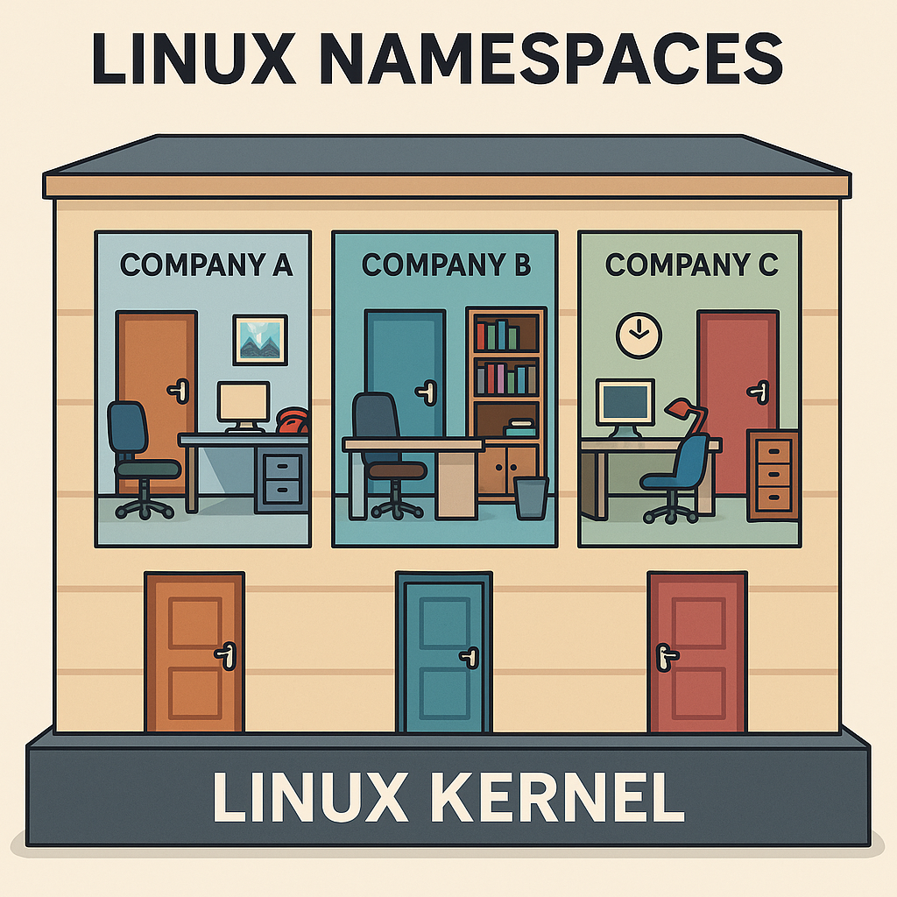

# 📦 Topic 352: container Virtualization

---

<a name="topic-352.1"></a>

### 🧠 352.1  container Virtualization Concepts


---

**Weight:** 7

**Description:** Candidates should understand the concept of container virtualization. This includes understanding the Linux components used to implement container virtualization as well as using standard Linux tools to troubleshoot these components.

**Key Knowledge Areas:**

* Understand the concepts of system and application container
* Understand and analyze kernel namespaces
* Understand and analyze control groups
* Understand and analyze capabilities
* Understand the role of seccomp, SELinux and AppArmor for container virtualization
* Understand how LXC and Docker leverage namespaces, cgroups, capabilities, seccomp and MAC
* Understand the principle of runc
* Understand the principle of CRI-O and containerd
* Awareness of the OCI runtime and image specifications
* Awareness of the Kubernetes container Runtime Interface (CRI)
* Awareness of podman, buildah and skopeo
* Awareness of other container virtualization approaches in Linux and other free operating systems, such as rkt, OpenVZ, systemd-nspawn or BSD Jails

---

#### 📋 352.1 Cited Objects

```sh
nsenter
unshare
ip (including relevant subcommands)
capsh
/sys/fs/cgroups
/proc/[0-9]+/ns
/proc/[0-9]+/status
```

---

#### 🧠 Understanding containers


containers are a lightweight virtualization technology that package applications along with their required dependencies — code, libraries, environment variables, and configuration files — into isolated, portable, and reproducible units.

> In simple terms: a container is a self-containerd box that runs your application the same way, anywhere.

##### 💡 What Is a container?

Unlike Virtual Machines (VMs), containers do not virtualize hardware. Instead, they virtualize the operating system. containers share the same Linux kernel with the host, but each one operates in a fully isolated user space.

📌 containers vs Virtual Machines:

| Feature             | containers                   | Virtual Machines       |
| ------------------- | ---------------------------- | ---------------------- |
| OS Kernel           | Shared with host             | Each VM has its own OS |
| Startup time        | Fast (seconds or less)       | Slow (minutes)         |
| Image size          | Lightweight (MBs)            | Heavy (GBs)            |
| Resource efficiency | High                         | Lower                  |
| Isolation mechanism | Kernel features (namespaces) | Hypervisor             |

##### 🔑 Key Characteristics of containers

🔹 **Lightweight**: Share the host OS kernel, reducing overhead and enabling fast startup.

🔹 **Portable**: Run consistently across different environments (dev, staging, prod, cloud, on-prem).

🔹 **Isolated**: Use namespaces for process, network, and filesystem isolation.

🔹 **Efficient**: Enable higher density and better resource utilization than traditional VMs.

🔹 **Scalable**: Perfect fit for microservices and cloud-native architecture.

##### 🧱 Types of containers

1. System containers

   * Designed to run the entire OS, Resemble virtual machines.
   * Support multiple processes and system services (init, syslog).
   * Ideal for legacy or monolithic applications.
   * Example: LXC, libvirt-lxc.
2. Application containers

   * Designed to run a single process.
   * Stateless, ephemeral, and horizontally scalable.
   * Used widely in modern DevOps and Kubernetes environments.
   * Example: Docker, containerd, CRI-O.

##### 🚀 Popular container Runtimes

| Runtime              | Description                                                         |
| -------------------- | ------------------------------------------------------------------- |
| **Docker**     | Most widely adopted CLI/daemon for building and running containers. |
| **containerd** | Lightweight runtime powering Docker and Kubernetes.                 |
| **CRI-O**      | Kubernetes-native runtime for OCI containers.                       |
| **LXC**        | Traditional Linux system containers, closer to full OS.             |
| **RKT**        | Security-focused runtime (deprecated).                              |

##### 🔐 container Internals and Security Elements

| Component                    | Role                                                  |
| ---------------------------- | ----------------------------------------------------- |
| **Namespaces**         | Isolate processes, users, mounts, networks.           |
| **cgroups**            | Control and limit resource usage (CPU, memory, IO).   |
| **Capabilities**       | Fine-grained privilege control inside containers.     |
| **seccomp**            | Restricts allowed syscalls to reduce attack surface.  |
| **AppArmor / SELinux** | Mandatory Access Control enforcement at kernel level. |

---

#### 🧠 Understanding chroot - Change Root Directory in Unix/Linux


##### What is chroot?

chroot (short for change root) is a system call and command on Unix-like operating systems that changes the apparent root directory (/) for the current running process and its children. This creates an isolated environment, commonly referred to as a chroot jail.

##### 🧱 Purpose and Use Cases

* 🔒 Isolate applications for security (jailing).
* 🧪 Create testing environments without impacting the rest of the system.
* 🛠️ System recovery (e.g., boot into LiveCD and chroot into installed system).
* 📦 Building software packages in a controlled environment.

##### 📁 Minimum Required Structure

The chroot environment must have its own essential files and structure:

```sh
/mnt/myenv/
├── bin/
│   └── bash
├── etc/
├── lib/
├── lib64/
├── usr/
├── dev/
├── proc/
└── tmp/
```

Use ldd to identify required libraries:

```sh
ldd /bin/bash
```

##### 🚨 Limitations and Security Considerations

* chroot is not a security boundary like containers or VMs.
* A privileged user (root) inside the jail can potentially break out.
* No isolation of process namespaces, devices, or kernel-level resources.

For stronger isolation, consider alternatives like:

* Linux containers (LXC, Docker)
* Virtual machines (KVM, QEMU)
* Kernel namespaces and cgroups

##### 🧪 Test chroot with debootstrap

```sh
# download debian files
sudo debootstrap stable ~vagrant/debian http://deb.debian.org/debian
sudo chroot ~vagrant/debian bash
```

##### :🧪 Lab chroot

Use this script for lab: [\chroot.sh](../scripts/container/chroot.sh)

[](https://asciinema.org/a/PWkjazgTXll9678Qy6LLOaKdN)

---

#### 🧠 Understanding Linux Namespaces


Namespaces are a core Linux kernel feature that enable process-level isolation. They create separate "views" of global system resources — such as process IDs, networking, filesystems, and users — so that each process group believes it is running in its own system.

> In simple terms: namespaces trick a process into thinking it owns the machine, even though it's just sharing it.

This is the foundation for container isolation.

##### 🔍 What Do Namespaces Isolate?

Each namespace type isolates a specific system resource. Together, they make up the sandbox that a container operates in:

| Namespace             | Isolates...                  | Real-world example                                      |
| --------------------- | ---------------------------- | ------------------------------------------------------- |
| **PID**         | Process IDs                  | Processes inside a container see a different PID space  |
| **Mount**       | Filesystem mount points      | Each container sees its own root filesystem             |
| **Network**     | Network stack                | containers have isolated IPs, interfaces, and routes    |
| **UTS**         | Hostname and domain name     | Each container sets its own hostname                    |
| **IPC**         | Shared memory and semaphores | Prevents inter-process communication between containers |
| **User**        | User and group IDs           | Enables fake root (UID 0) inside the container          |
| **Cgroup (v2)** | Control group membership     | Ties into resource controls like CPU and memory limits  |

##### 🧪 Visual Analogy



Imagine a shared office building:

* All tenants share the same foundation (Linux kernel).
* Each company has its own office (namespace): different locks, furniture, phone lines, and company name.
* To each tenant, it feels like their own building.

That's exactly how containers experience the system — isolated, yet efficient.

##### 🔧 How containers Use Namespaces

When you run a container (e.g., with Docker or Podman), the runtime creates a new set of namespaces:

```bash
docker run -it --rm alpine sh
```

This command gives the process:

* A new PID namespace → it's process 1 inside the container.
* A new network namespace → its own virtual Ethernet.
* A mount namespace → a container-specific root filesystem.
* Other namespaces depending on configuration (user, IPC, etc.)

The result: a lightweight, isolated runtime environment that behaves like a separate system.

##### ⚙️ Complementary Kernel Features

Namespaces hide resources from containers. But to control how much they can use and what they can do, we need additional mechanisms:

###### 🔩 Cgroups (Control Groups)

Cgroups allow the kernel to limit, prioritize, and monitor resource usage across process groups.

| Resource     | Use case examples              |
| ------------ | ------------------------------ |
| CPU          | Limit CPU time per container   |
| Memory       | Cap RAM usage                  |
| Disk I/O     | Throttle read/write operations |
| Network (v2) | Bandwidth restrictions         |

🛡️ Prevents the "noisy neighbor" problem by stopping one container from consuming all system resources.

###### 🧱 Capabilities

Traditional Linux uses a binary privilege model: root (UID 0) can do everything, everyone else is limited.

| Capability               | Allows...                                   |
| ------------------------ | ------------------------------------------- |
| `CAP_NET_BIND_SERVICE` | Binding to privileged ports (e.g. 80, 443)  |
| `CAP_SYS_ADMIN`        | A powerful catch-all for system admin tasks |
| `CAP_KILL`             | Sending signals to arbitrary processes      |

By dropping unnecessary capabilities, containers can run with only what they need — reducing risk.

##### 🔐 Security Mechanisms

Used in conjunction with namespaces and cgroups to lock down what a containerized process can do:

| Feature            | Description                                                 |
| ------------------ | ----------------------------------------------------------- |
| **seccomp**  | Whitelist or block Linux system calls (syscalls)            |
| **AppArmor** | Apply per-application security profiles                     |
| **SELinux**  | Enforce Mandatory Access Control with tight system policies |

##### 🧠 Summary for Beginners

> ✅ Namespaces isolate what a container can see
> ✅ Cgroups control what it can use
> ✅ Capabilities and security modules define what it can do

Together, these kernel features form the technical backbone of container isolation — enabling high-density, secure, and efficient application deployment without full VMs.

##### 🧪 Lab Namespaces

Use this script for lab: [\namespace.sh](../scripts/container/namespace.sh)

[](https://asciinema.org/a/8H6iczCMO24VgjWqwCcXEKWBG)

---

#### 🧩 Understanding Cgroups (Control Groups)


##### 📌 Definition

Control Groups (cgroups) are a Linux kernel feature introduced in 2007 that allow you to limit, account for, and isolate the resource usage (CPU, memory, disk I/O, etc.) of groups of processes.

cgroups are heavily used by low-level container runtimes such as runc and crun, and leveraged by container engines like Docker, Podman, and LXC to enforce resource boundaries and provide isolation between containers.

Namespaces isolate, cgroups control.

Namespaces create separate environments for processes (like PID, network, or mounts), while cgroups limit and monitor resource usage (CPU, memory, I/O) for those processes.

⚙️ Key Capabilities

| Feature                     | Description                                              |
| --------------------------- | -------------------------------------------------------- |
| **Resource Limiting** | Impose limits on how much of a resource a group can use  |
| **Prioritization**    | Allocate more CPU/IO priority to some groups over others |
| **Accounting**        | Track usage of resources per group                       |
| **Control**           | Suspend, resume, or kill processes in bulk               |
| **Isolation**         | Prevent resource starvation between groups               |

##### 📦 Subsystems (Controllers)

cgroups operate through controllers, each responsible for managing one type of resource:

| Subsystem   | Description                         |
| ----------- | ----------------------------------- |
| `cpu`     | Controls CPU scheduling             |
| `cpuacct` | Generates CPU usage reports         |
| `memory`  | Limits and accounts memory usage    |
| `blkio`   | Limits block device I/O             |
| `devices` | Controls access to devices          |
| `freezer` | Suspends/resumes execution of tasks |
| `net_cls` | Tags packets for traffic shaping    |
| `ns`      | Manages namespace access (rare)     |

##### 📂 Filesystem Layout

cgroups are exposed through the virtual filesystem under /sys/fs/cgroup.

Depending on the version:

* **cgroups v1**: separate hierarchies for each controller (e.g., memory, cpu, etc.)
* **cgroups v2**: unified hierarchy under a single mount point

Mounted under:

```sh
/sys/fs/cgroup/
```

Typical cgroups v1 hierarchy:

```sh
/sys/fs/cgroup/
├── memory/
│   ├── mygroup/
│   │   ├── tasks
│   │   ├── memory.limit_in_bytes
├── cpu/
│   └── mygroup/
└── ...
```

In cgroups v2, all resources are managed under a unified hierarchy:

```sh
/sys/fs/cgroup/
├── cgroup.procs
├── cgroup.controllers
├── memory.max
├── cpu.max
└── ...
```

##### 🧪 Common Usage (v1 and v2 examples)

v1 – Create and assign memory limit:

```sh
# Mount memory controller (if needed)
mount -t cgroup -o memory none /sys/fs/cgroup/memory

# Create group
mkdir /sys/fs/cgroup/memory/mygroup

# Set memory limit (100 MB)
echo 104857600 | tee /sys/fs/cgroup/memory/mygroup/memory.limit_in_bytes

# Assign a process (e.g., current shell)
echo $$ | tee /sys/fs/cgroup/memory/mygroup/tasks
```

v2 – Unified hierarchy:

```sh
# Create subgroup
mkdir /sys/fs/cgroup/mygroup

# Enable controllers
echo +memory +cpu > /sys/fs/cgroup/cgroup.subtree_control

# Move shell into group
echo $$ > /sys/fs/cgroup/mygroup/cgroup.procs

# Set limits
echo 104857600 > /sys/fs/cgroup/mygroup/memory.max
echo "50000 100000" > /sys/fs/cgroup/mygroup/cpu.max  # 50ms quota per 100ms period
```

🧭 Process & Group Inspection

| Command                   | Description                     |
| ------------------------- | ------------------------------- |
| `cat /proc/self/cgroup` | Shows current cgroup membership |
| `cat /proc/PID/cgroup`  | cgroup of another process       |
| `cat /proc/PID/status`  | Memory and cgroup info          |
| `ps -o pid,cmd,cgroup`  | Show process-to-cgroup mapping  |

##### 📦 Usage in containers

container engines like Docker, Podman, and containerd delegate resource control to cgroups (via runc or crun), allowing:

* Per-container CPU and memory limits
* Fine-grained control over blkio and devices
* Real-time resource accounting

Docker example:

```sh
docker run --memory=256m --cpus=1 busybox
```

Behind the scenes, this creates cgroup rules for memory and CPU limits for the container process.

##### 🧠 Concepts Summary

| Concept               | Explanation                                                              |
| --------------------- | ------------------------------------------------------------------------ |
| **Controllers** | Modules like `cpu`, `memory`, `blkio`, etc. apply limits and rules |
| **Tasks**       | PIDs (processes) assigned to the control group                           |
| **Hierarchy**   | Cgroups are structured in a parent-child tree                            |
| **Delegation**  | Systemd and user services may manage subtrees of cgroups                 |

##### 🧪 Lab Cgroups

Use this script for lab: [\cgroups.sh](../scripts/container/cgroups.sh)

[](https://asciinema.org/a/WbudWJpHKPzBWMh8CGRxCIpZf)

---

#### 🛡️ Understanding Capabilities

❓ What Are Linux Capabilities?

Traditionally in Linux, the root user has unrestricted access to the system. Linux capabilities were introduced to break down these all-powerful privileges into smaller, discrete permissions, allowing processes to perform specific privileged operations without requiring full root access.

This enhances system security by enforcing the principle of least privilege.

| 🔐 Capability            | 📋 Description                                      |
| ------------------------ | --------------------------------------------------- |
| `CAP_CHOWN`            | Change file owner regardless of permissions         |
| `CAP_NET_BIND_SERVICE` | Bind to ports below 1024 (e.g., 80, 443)            |
| `CAP_SYS_TIME`         | Set system clock                                    |
| `CAP_SYS_ADMIN`        | ⚠️ Very powerful – includes mount, BPF, and more |
| `CAP_NET_RAW`          | Use raw sockets (e.g., ping, traceroute)            |
| `CAP_SYS_PTRACE`       | Trace other processes (debugging)                   |
| `CAP_KILL`             | Send signals to any process                         |
| `CAP_DAC_OVERRIDE`     | Modify files and directories without permission     |
| `CAP_SETUID`           | Change user ID (UID) of the process                 |
| `CAP_NET_ADMIN`        | Manage network interfaces, routing, etc.            |

🔐 Some Linux Capabilities Types

| Capability Type              | Description                                                               |
| ---------------------------- | ------------------------------------------------------------------------- |
| **CapInh (Inherited)** | Capabilities inherited from the parent process.                           |
| **CapPrm (Permitted)** | Capabilities that the process is allowed to have.                         |
| **CapEff (Effective)** | Capabilities that the process is currently using.                         |
| **CapBnd (Bounding)**  | Restricts the maximum set of effective capabilities a process can obtain. |
| **CapAmb (Ambient)**   | Allows a process to explicitly define its own effective capabilities.     |

📦 Capabilities in containers and Pods
containers typically do not run as full root, but instead receive a limited set of capabilities by default depending on the runtime.

Capabilities can be added or dropped in Kubernetes using the securityContext.

📄 Kubernetes example:

```yaml
securityContext:
  capabilities:
    drop: ["ALL"]
    add: ["NET_BIND_SERVICE"]
```

🔐 This ensures the container starts with zero privileges and receives only what is needed.

##### 🧪 Lab Capabilities

Use this script for lab: [\capabilities.sh](../scripts/container/capabilities.sh)

[](https://asciinema.org/a/kCiUGvY0YGA5Mdzbj1NSdfLAx)

#### 🛡️ Seccomp (Secure Computing Mode)

**What is it?**

* A Linux kernel feature for restricting which syscalls (system calls) a process can use.
* Commonly used in containers (like Docker), browsers, sandboxes, etc.

**How does it work?**

* A process enables a seccomp profile/filter.
* The kernel blocks, logs, or kills the process if it tries forbidden syscalls.
* Filters are written in BPF (Berkeley Packet Filter) format.

**Quick commands**

```sh
# Check support
docker info | grep Seccomp

# Disable for a container:
docker run --security-opt seccomp=unconfined ...

# Inspect running process:
grep Seccomp /proc/$$/status
```

**Tools**

```sh
# for analyzing
seccomp-tools 

# Profiles
/etc/docker/seccomp.json
```

#### 🦺AppArmor

**What is it?**

* A Mandatory Access Control (MAC) system for restricting what specific programs can access.
* Profiles are text-based, path-oriented, easy to read and edit.

**How does it work?**

* Each binary can have a profile that defines its allowed files, network, and capabilities—even as root!
* Easy to switch between complain, enforce, and disabled modes.

**Quick commands:**

```sh
#Status
aa-status

# Put a program in enforce mode
sudo aa-enforce /etc/apparmor.d/usr.bin.foo

# Profiles
location: /etc/apparmor.d/
```

**Tools:**

aa-genprof, aa-logprof for generating/updating profiles

Logs

```sh
/var/log/syslog (search for apparmor)
```

#### 🔒SELinux (Security-Enhanced Linux)

**What is it?**

* A very powerful MAC system for controlling access to everything: files, processes, users, ports, networks, and more.
* Uses labels (contexts) and detailed policies.

**How does it work?**

* Everything (process, file, port, etc.) gets a security context.
* Kernel checks every action against policy rules.

**Quick commands:**

```sh
#Status
sestatus

#Set to enforcing/permissive:
setenforce 1  # Enforcing
setenforce 0  # Permissive

#List security contexts:
ls -Z  # Files
ps -eZ # Processes
```

**Tools:**

* audit2allow, semanage, chcon (for managing policies/labels)
* Logs: /var/log/audit/audit.log
* Policies: /etc/selinux/

#### 📋 Summary Table for Common Security Systems

| System   | Focus              | Complexity | Policy Location               | Typical Use          |
| -------- | ------------------ | ---------- | ----------------------------- | -------------------- |
| Seccomp  | Kernel syscalls    | Medium     | Per-process (via code/config) | Docker, sandboxes    |
| AppArmor | Per-program access | Easy       | /etc/apparmor.d/              | Ubuntu, Snap, SUSE   |
| SELinux  | Full-system MAC    | Advanced   | /etc/selinux/ + labels        | RHEL, Fedora, CentOS |

#### 🗂️ Linux container Isolation & Security Comparison

| Technology                  | Purpose / What It Does                                                                               | Main Differences                                                                                | Example in containers                                                                        |
| --------------------------- | ---------------------------------------------------------------------------------------------------- | ----------------------------------------------------------------------------------------------- | -------------------------------------------------------------------------------------------- |
| **chroot 🏠**         | Changes the apparent root directory for a process. Isolates filesystem.                              | Simple filesystem isolation; does**not** restrict resources, privileges, or system calls. | Docker uses `chroot` internally for building minimal images, but not for strong isolation. |
| **cgroups 📊**        | Controls and limits resource usage (CPU, memory, disk I/O, etc.) per group of processes.             | Kernel feature; fine-grained resource control, not isolation.                                   | Docker and Kubernetes use cgroups to limit CPU/mem per container/pod.                        |
| **namespaces 🌐**     | Isolate system resources: PID, mount, UTS, network, user, IPC, time.                                 | Kernel feature; provides different kinds of isolation.                                          | Each container runs in its own set of namespaces (PID, net, mount, etc).                     |
| **capabilities 🛡️** | Split root privileges into fine-grained units (e.g., net\_admin, sys\_admin).                        | More granular than all-or-nothing root/non-root; can drop or grant specific privileges.         | Docker containers usually run with reduced capabilities (drop dangerous ones).               |
| **seccomp 🧱**        | Filter/restrict which syscalls a process can make (whitelisting/blacklisting).                       | Very focused: blocks kernel syscalls; cannot block all actions.                                 | Docker’s default profile blocks dangerous syscalls (e.g.,`ptrace`, `mount`).            |
| **AppArmor 🐧**       | Mandatory Access Control (MAC) framework: restricts programs' file/network access via profiles.      | Profile-based, easier to manage than SELinux; less fine-grained in some cases.                  | Ubuntu-based containers often use AppArmor for container process profiles.                   |
| **SELinux 🔒**        | More complex MAC framework, label-based, very fine-grained. Can confine users, processes, and files. | More powerful and complex than AppArmor; enforced on Fedora/RHEL/CentOS.                        | On OpenShift/Kubernetes with RHEL, SELinux labels are used to keep pods separate.            |

Summary

* chroot: Basic isolation, no resource/security guarantees.
* cgroups: Resource control, not isolation.
* namespaces: Isolate "views" of kernel resources.
* capabilities: Fine-tune process privileges.
* seccomp: Restrict system call surface.
* AppArmor/SELinux: Limit what processes can touch, even as root (MAC).

#### 🧩 OCI, runc, containerd, CRI, CRI-O — What They Are in the container Ecosystem

##### Overview and Roles

* **OCI (Open container Initiative) 🏛️**

  A foundation creating open standards for **container images** and  **runtimes** .

  *Defines how images are formatted, stored, and how containers are started/stopped (runtime spec).*
* **runc ⚙️**

  A universal, low-level, lightweight CLI tool that can run containers according to the OCI runtime specification.

  *“The engine” that turns an image + configuration into an actual running Linux container.*
* **containerd 🏋️**

  A core container runtime daemon for managing the complete container lifecycle: **pulling images, managing storage, running containers** (calls runc), networking plugins, etc.

  *Used by Docker, Kubernetes, nerdctl, and other tools as their main container runtime backend.*
* **CRI (container Runtime Interface) 🔌**

  A Kubernetes-specific gRPC API to connect Kubernetes with container runtimes.

  *Not used outside Kubernetes, but enables K8s to talk to containerd, CRI-O, etc.*
* **CRI-O 🥤**

  A lightweight, Kubernetes-focused runtime that **only** runs OCI containers, using runc under the hood.

  *Mostly used in Kubernetes, but demonstrates how to build a minimal container runtime focused on open standards.*

##### 🏷️ Comparison Table: OCI, runc, containerd, CRI, CRI-O

| Component            | Emoji | What Is It?                           | Who Uses It?                            | Example Usage                                                                |
| -------------------- | ----- | ------------------------------------- | --------------------------------------- | ---------------------------------------------------------------------------- |
| **OCI**        | 🏛️  | Standards/specifications              | Docker, Podman, CRI-O, containerd, runc | Ensures images/containers are compatible across tools                        |
| **runc**       | ⚙️  | container runtime (CLI)               | containerd, CRI-O, Docker, Podman       | Directly running a container from a bundle (e.g.`runc run`)                |
| **containerd** | 🏋️  | container runtime daemon              | Docker, Kubernetes, nerdctl             | Handles pulling images, managing storage/network, starts containers via runc |
| **CRI**        | 🔌    | K8s runtime interface (API)           | Kubernetes only                         | Lets kubelet talk to containerd/CRI-O                                        |
| **CRI-O**      | 🥤    | Lightweight container runtime for K8s | Kubernetes, OpenShift                   | Used as K8s container engine                                                 |

---

##### 🛠️ Practical Examples (General container World)

* **Building images:**

  Any tool (Docker, Podman, Buildah) can produce images following the **OCI Image Spec** so they’re compatible everywhere.
* **Running containers:**

  Both Podman and Docker ultimately use **runc** (via containerd or directly) to create containers.
* **Managing many containers:**

  **containerd** can be used on its own (via `ctr` or `nerdctl`) or as a backend for Docker and Kubernetes.
* **Plug-and-play runtimes:**

  Thanks to  **OCI** , you could swap runc for another OCI-compliant runtime (like Kata containers for VMs, gVisor for sandboxing) without changing how you build or manage images.

---

##### 🚢 Typical Stack

```plaintext
[User CLI / Orchestration]
           |
   [containerd / CRI-O]
           |
        [runc]
           |
[Linux Kernel: namespaces, cgroups, etc]
```

* **Docker** : User CLI → containerd → runc
* **Podman** : User CLI → runc
* **Kubernetes** : kubelet (CRI) → containerd or CRI-O → runc

---

##### 🧠 Summary

* **OCI** = Common language for images/runtimes (standards/specs)
* **runc** = Actual tool that creates and manages container processes
* **containerd** = Full-featured daemon that manages images, containers, lifecycle
* **CRI** = Only for Kubernetes, to make runtimes pluggable
* **CRI-O** = Lightweight runtime focused on Kubernetes, built on OCI standards and runc

##### 🧩 Diagram: container Ecosystem


##### 🧪 lab runc

For runc lab, you can use this script: [\runc.sh](../scripts/container/runc.sh)

[](https://asciinema.org/a/UDVnhKSxPFRXDcwg0HYFkZdlX)

##### 🧪 lab containerd

For containerd, you can use this script: [\containerd.sh](../scripts/container/container.sh)

[](https://asciinema.org/a/fCJsiwcL2ePneQX1aafITtoGM)

---

#### 🚀 Podman, Buildah, Skopeo, OpenVZ, crun & Kata containers – Fast Track

---

##### 🐳 **Podman**

* **What is it?** A container manager compatible with Docker CLI, but **daemonless** and can run  **rootless** .
* **Use:** Create, run, stop, and inspect containers and pods.
* **Highlights:** No central daemon, safer for multi-user, integrates with systemd.
* [More info]()

---

##### 📦 **Buildah**

* **What is it?** Tool to **build and manipulate container images** (OCI/Docker) without a daemon.
* **Use:** Building images in CI/CD pipelines or scripting.
* **Highlights:** Lightweight, rootless support, used by Podman under the hood.
* [More info](https://www.redhat.com/en/topics/containers/what-is-buildah)

---

##### 🔭 **Skopeo**

* **What is it?** Utility to **inspect, copy, and move container images** between registries **without pulling or running** them.
* **Use:** Move images, check signatures and metadata.
* **Highlights:** No daemon, ideal for automation and security.
* [More info]()

---

##### 🏢 **OpenVZ**

* **What is it?** **container-based virtualization** solution for Linux (pre-dating modern container tools).
* **Use:** Lightweight VPS (virtual private servers) sharing the same kernel.
* **Highlights:** Very efficient, but less isolated than VM (shares kernel).
* [More info](https://en.wikipedia.org/wiki/OpenVZ)

---

##### ⚡ **crun**

* **What is it?** Ultra-fast, minimal OCI runtime for containers, written in C (not Go).
* **Use:** Executes containers with minimal overhead.
* **Highlights:** Faster and lighter than runc, default for Podman on some systems.
* [More info](https://www.redhat.com/sysadmin/introduction-crun)

---

##### 🛡️ **Kata containers**

* **What is it?** Open source project combining containers and VMs: each container runs in a lightweight micro-VM.
* **Use:** Strong isolation for sensitive workloads or multi-tenant environments.
* **Highlights:** VM-grade security, near-container performance.
* [More info](https://katacontainers.io/)

---

##### 📊 **Comparison Table**

| Project                   | Category       | Isolation             | Daemon? | Main Use               | Rootless | Notes                       |
| ------------------------- | -------------- | --------------------- | ------- | ---------------------- | -------- | --------------------------- |
| **Podman**          | Orchestration  | container             | No      | Manage containers      | Yes      | Docker-like CLI             |
| **Buildah**         | Build          | N/A                   | No      | Build images           | Yes      | For CI/CD, no container run |
| **Skopeo**          | Image transfer | N/A                   | No      | Move/check images      | Yes      | No container execution      |
| **OpenVZ**          | Virtualization | container/VPS         | Yes     | Lightweight VPS        | No       | Kernel shared, legacy tech  |
| **crun**            | OCI Runtime    | container             | No      | Fast container runtime | Yes      | Faster than runc            |
| **Kata containers** | Runtime/VM     | MicroVM per container | No      | Strong isolation       | Yes      | VM-level security           |

---

##### ☑️ **Quick Recap**

* **Podman:** Modern, daemonless Docker alternative.
* **Buildah:** Build images, doesn't run containers.
* **Skopeo:** Moves/inspects images, never runs them.
* **OpenVZ:** Legacy container-based VPS.
* **crun:** Super fast, lightweight OCI runtime.
* **Kata:** containers with VM-level isolation.

#### 🛠️ 352.1 Important Commands

##### 🔗 unshare

```sh
# create a new namespaces and run a command in it
unshare --mount --uts --ipc --user --pid --net  --map-root-user --mount-proc --fork chroot ~vagrant/debian bash
# mount /proc for test
#mount -t proc proc /proc
#ps -aux
#ip addr show
#umount /proc
```

##### 🔍 lsns

```sh
# show all namespaces
lsns

# show only pid namespace
lsns -p <pid>
lsns -p 3669

ls -l /proc/<pid>/ns
ls -l /proc/3669/ns

ps -o pid,pidns,netns,ipcns,utsns,userns,args -p <PID>
ps -o pid,pidns,netns,ipcns,utsns,userns,args -p 3669
```

##### 🚪 nsenter

```sh
# get PID docker container
# execute a command in namespace Network
sudo nsenter -t 3669 -n ip link show

# execute a command in namespace UTS
sudo nsenter -t 3669 -u hostname

# execute a command in namespace mount
nsenter -t 3669 -m ls

# execute a command in all namespaces
sudo nsenter -t 3669 -a ps
```

##### 🌐 252.1 ip

```sh
# create a new network namespace
sudo ip netns add lxc1

# list network list
ip netns list

# exec command in network namespace
sudo ip netns exec lxc1 ip addr show
```

##### 📊 stat

```sh
# get cgroup version
stat -fc %T /sys/fs/cgroup
```

##### 🛠️ systemctl and systemd

```sh
# get cgroups of system
systemctl status
systemd-cgls
```

##### 🏗️ cgcreate

```sh
cgcreate -g memory,cpu:lsf
```

##### 🏷️ cgclassify

```sh
cgclassify -g memory,cpu:lsf <PID>
```

##### 🛡️ pscap - List Process Capabilities

```sh
# List capabilities of all process
pscap
```

##### 🛡️ getcap /usr/bin/tcpdump

```sh
getcap /usr/bin/tcpdump
```

##### 🛡️ setcap cap_net_raw=ep /usr/bin/tcpdump

```sh
# add capabilities to tcpdump
sudo setcap cap_net_raw=ep /usr/bin/tcpdump

# remove capabilities from tcpdump
sudo setcap -r /usr/bin/tcpdump
sudo setcap '' /usr/bin/tcpdump
```

##### 🛡️ check capabilities by process

```sh
grep Cap /proc/<PID>/status
```

##### 🛡️ capsh - capability shell wrapper

```sh
# use grep Cap /proc/<PID>/statusfor get hexadecimal value(Example CApEff=0000000000002000)
capsh --decode=0000000000002000
```

##### 🦺 AppArmor - kernel enhancement to confine programs to a limited set of resources

```sh
# check AppArmor status
sudo aa-status

#  unload all AppArmor profiles
aa-teardown

# loads AppArmor profiles into the kernel
aaparmor_parser
```

##### 🔒 SELinux - Security-Enhanced Linux

```sh
# check SELinux status
sudo sestatus

# check SELinux mode
sudo getenforce 

# set SELinux to enforcing mode
sudo setenforce 1
```

##### ⚙️ runc

```sh
#create a spec file for runc
runc spec

# run a container using runc
sudo runc run mycontainer
```

---

<p align="right">(<a href="#topic-352.1">back to sub topic 352.1</a>)</p>
<p align="right">(<a href="#topic-352">back to topic 352</a>)</p>
<p align="right">(<a href="#readme-top">back to top</a>)</p>

---

<a name="topic-352.2"></a>

### 📦 352.2 LXC

**Weight:** 6

**Description:** Candidates should be able to use system containers using LXC and LXD. The version of LXC covered is 3.0 or higher.

**Key Knowledge Areas:**

* Understand the architecture of LXC and LXD
* Manage LXC containers based on existing images using LXD, including networking and storage
* Configure LXC container properties
* Limit LXC container resource usage
* Use LXD profiles
* Understand LXC images
* Awareness of traditional LXC tools

#### 📋 352.2 Cited Objects

```sh
lxd
lxc (including relevant subcommands)
/etc/lxc/
/etc/default/lxc
/var/log/lxc/
/usr/share/lxc/templates
```

#### 🧩 LXC & LXD – The Linux System containers Suite

---

##### 📦 LXC (Linux containers)

* **What is it?**

  The *core* userspace toolset for managing application and system containers on Linux. Think of LXC as **"chroot on steroids"** – it provides lightweight process isolation using kernel features (namespaces, cgroups, AppArmor, seccomp, etc).
* **Use:**

  * Run full Linux distributions as containers (not just single apps).
  * Useful for testing, legacy apps, or simulating servers.
* **Highlights:**

  * CLI-focused: `lxc-create`, `lxc-start`, `lxc-attach`, etc.
  * Fine-grained control over container resources.
  * No daemon – runs per-container processes.
* **Best for:**

  Linux experts who want total control and “bare-metal” feel for containers.

##### 🧪 lab LXC

For LXC lab, you can use this script: [\lxc.sh](../scripts/container/lxc.sh)

[](https://asciinema.org/a/CpjDAXRnaKH5kExg9eWSBJGHI)

---

##### 🌐 LXD

* **What is it?**

  **LXD** is a *next-generation* container and VM manager,  **built on top of LXC** . It offers a powerful but user-friendly experience to manage containers and virtual machines via REST API, CLI, or even a Web UI.
* **Use:**

  * Manage system containers and virtual machines at scale.
  * Networked “container as a service” with easy orchestration.
* **Highlights:**

  * **REST API** : manage containers/VMs over the network.
  * **Images:** Instant deployment of many Linux distros.
  * **Snapshots, storage pools, clustering, live migration.**
  * Supports running unprivileged containers by default.
  * CLI: `lxc launch`, `lxc exec`, `lxc snapshot`, etc. *(Yes, same prefix as LXC, but different backend!)*
* **Best for:**

  DevOps, sysadmins, cloud-native setups, lab environments.

##### 📝 **LXD Storage: Feature Table (per backend)**

| Feature                     | dir | zfs       | btrfs     | lvm/lvmthin  | ceph/cephfs          |
| --------------------------- | --- | --------- | --------- | ------------ | -------------------- |
| **Snapshots**         | ❌  | ✅        | ✅        | ✅           | ✅                   |
| **Thin Provisioning** | ❌  | ✅        | ✅        | ✅ (lvmthin) | ✅                   |
| **Resizing**          | ❌  | ✅        | ✅        | ✅           | ✅                   |
| **Quotas**            | ❌  | ✅        | ✅        | ✅ (lvmthin) | ✅                   |
| **Live Migration**    | ❌  | ✅        | ✅        | ✅           | ✅                   |
| **Deduplication**     | ❌  | ✅        | ❌        | ❌           | ✅ (Ceph)            |
| **Compression**       | ❌  | ✅        | ✅        | ❌           | ✅ (Ceph)            |
| **Encryption**        | ❌  | ✅        | ❌        | ✅ (LUKS)    | ✅                   |
| **Cluster/Remote**    | ❌  | ❌        | ❌        | ❌           | ✅                   |
| **Best Use Case**     | Dev | Labs/Prod | Labs/Prod | Labs/Prod    | Clusters, Enterprise |

##### 🔍 **Quick LXD Storage Summary**

* **Storage Pools:** Abstracts the backend—multiple pools, different drivers per pool.
* **Available Drivers:** dir, zfs, btrfs, lvm, lvmthin, ceph, cephfs (more via plugins).
* **Custom Volumes:** Create, mount, unmount for containers/VMs.
* **Snapshots & Clones:** Native, fast, supports backup/restore, copy-on-write migration.
* **Quotas & Resize:** Easy live management for pools, containers, or volumes.
* **Live Migration:** Move containers/VMs across hosts without downtime.
* **Security:** Built-in encryption (ZFS, LVM, Ceph), ACLs, backup/restore, etc.
* **Enterprise-ready:** Suits clustered and high-availability setups.

---

##### 📊 LXC vs LXD Comparison Table

| Feature                 | 🏷️ LXC                              | 🌐 LXD                                |
| ----------------------- | ------------------------------------- | ------------------------------------- |
| **Type**          | Low-level userspace container manager | High-level manager (containers + VMs) |
| **Interface**     | CLI only                              | REST API, CLI, Web UI                 |
| **Daemon?**       | No (runs as processes)                | Yes (central daemon/service)          |
| **Orchestration** | Manual, scriptable                    | Built-in clustering & API             |
| **Images**        | Template-based                        | Full image repository, many OSes      |
| **Snapshots**     | Manual                                | Native, integrated                    |
| **VM support**    | No                                    | Yes (QEMU/KVM)                        |
| **Use-case**      | Fine-grained control, “bare-metal”  | Scalable, user-friendly, multi-host   |
| **Security**      | Can be unprivileged, but DIY          | Default unprivileged, more isolation  |
| **Best for**      | Linux pros, advanced scripting        | DevOps, cloud, teams, self-service    |

---

##### ☑️ Quick Recap

* **LXC** = The low-level building blocks. Power and flexibility for  *container purists* .
* **LXD** = Modern, API-driven, scalable platform on top of LXC for *easy* container and VM management (single node or clusters).

##### 🗃️ LXC vs LXD - Storage Support (Summary)

| Feature                       | **LXC**                          | **LXD**                                                                                                                     |
| ----------------------------- | -------------------------------------- | --------------------------------------------------------------------------------------------------------------------------------- |
| **Storage Backends**    | Local filesystem (default only)        | **dir**(filesystem), **zfs** , **btrfs** , **lvm** , **ceph** , **cephfs** ,**lvmthin** |
| **Storage Pools**       | ❌ (just local paths, no native pools) | ✅ Multiple storage pools, each with different drivers                                                                            |
| **Snapshots**           | Manual/FS dependent                    | ✅ Native, fast, automatic, scheduled, consistent snapshots                                                                       |
| **Thin Provisioning**   | ❌ (not supported natively)            | ✅ Supported in ZFS, Btrfs, LVM thin, Ceph                                                                                        |
| **Quotas**              | ❌                                     | ✅ Supported per container/volume (in ZFS, Btrfs, Ceph, LVMthin)                                                                  |
| **Live Migration**      | Limited                                | ✅ Live storage migration between hosts, copy-on-write                                                                            |
| **Encryption**          | ❌                                     | ✅ (ZFS, LVM, Ceph)                                                                                                               |
| **Custom Volumes**      | ❌                                     | ✅ Create, attach/detach custom storage volumes for containers/VMs                                                                |
| **Remote Storage**      | ❌                                     | ✅ Ceph, CephFS, NFS, SMB support                                                                                                 |
| **Filesystem Features** | Host dependent                         | ZFS: dedup, compress, snapshots, send/receive, cache, quotas. LVM: thin, snapshots, etc.                                          |
| **Resizing**            | Manual (via host)                      | ✅ Volumes and pools can be resized live                                                                                          |
| **Storage Drivers**     | Basic/local only                       | Extensible plugins, multiple enterprise-ready drivers                                                                             |

##### 📊 Final Storage Comparison Table

|                             | **LXC**  | **LXD**                                          |
| --------------------------- | -------------- | ------------------------------------------------------ |
| **Storage Backend**   | Local only     | dir, zfs, btrfs, lvm, lvmthin, ceph, cephfs            |
| **Storage Pools**     | ❌             | ✅ Multiple, independent, hot-pluggable                |
| **Snapshots**         | Limited/manual | ✅ Fast, automatic, consistent                         |
| **Thin Provisioning** | ❌             | ✅ (ZFS, Btrfs, LVMthin, Ceph)                         |
| **Quotas**            | ❌             | ✅                                                     |
| **Resizing**          | Manual         | ✅                                                     |
| **Remote Storage**    | ❌             | ✅ (Ceph, NFS, SMB)                                    |
| **Custom Volumes**    | ❌             | ✅                                                     |
| **Cluster Ready**     | ❌             | ✅                                                     |
| **Enterprise**        | No             | Yes—HA, backup, migration, security, production ready |

##### 🌐 LXC vs LXD - Network Support (Summary)

| Feature                    | **LXC**                     | **LXD**                                                         |
| -------------------------- | --------------------------------- | --------------------------------------------------------------------- |
| **Network Types**    | bridge, veth, macvlan, phys, vlan | bridge, ovn, macvlan, sriov, physical, vlan, fan, tunnels             |
| **Managed Networks** | ❌ Manual (host config)           | ✅ Natively managed via API/CLI, easy to create and edit              |
| **Network API**      | ❌ CLI commands only              | ✅ REST API, CLI, integration with external tools                     |
| **Bridge Support**   | ✅ Manual                         | ✅ Automatic and advanced (L2, Open vSwitch, native bridge)           |
| **NAT & DHCP**       | ❌ Manual (iptables/dnsmasq)      | ✅ Integrated NAT, DHCP, DNS, per-network configurable                |
| **DNS**              | ❌ Manual                         | ✅ Integrated DNS, custom domains, systemd-resolved integration       |
| **IPv6**             | ✅ (manual, limited)              | ✅ Full support, auto, DHCPv6, NAT6, routing                          |
| **VLAN**             | ✅ (manual, host)                 | ✅ Native VLANs, easy configuration                                   |
| **SR-IOV**           | ❌                                | ✅ Native support                                                     |
| **Network ACLs**     | ❌                                | ✅ ACLs, forwards, zones, peerings, firewall rules                    |
| **Clustering**       | ❌                                | ✅ Replicated and managed networks in clusters                        |
| **Attach/Detach**    | Manual (host)                     | ✅ CLI/API, hotplug, easy for containers/VMs                          |
| **Security**         | Manual (host)                     | ✅ Isolation, firewall, ACL, firewalld integration, per-network rules |
| **Custom Routes**    | Manual                            | ✅ Custom routes support, multiple gateways                           |
| **Network Profiles** | ❌                                | ✅ Reusable network profiles                                          |
| **Monitoring**       | Manual                            | ✅ Status, IPAM, logs, detailed info via CLI/API                      |
| **Enterprise**       | No                                | Yes—multi-tenant, ACL, clustering, cloud integration                 |

##### 📊 Final Network Comparison Table

|                         | **LXC**      | **LXD**                                             |
| ----------------------- | ------------------ | --------------------------------------------------------- |
| **Network Types** | bridge, veth, vlan | bridge, ovn, macvlan, sriov, physical, vlan, fan, tunnels |
| **Managed**       | ❌                 | ✅                                                        |
| **NAT/DHCP/DNS**  | Manual             | ✅ Integrated                                             |
| **VLAN**          | Manual             | ✅                                                        |
| **SR-IOV**        | ❌                 | ✅                                                        |
| **API**           | ❌                 | ✅                                                        |
| **Clustering**    | ❌                 | ✅                                                        |
| **Security/ACL**  | Manual             | ✅                                                        |
| **Profiles**      | ❌                 | ✅                                                        |
| **Enterprise**    | No                 | Yes                                                       |

##### 🧪 lab LXD

For LXD lab, you can use this script: [\lxd.sh](../scripts/container/lxd.sh)

#### 🛠️ 352.2 Important Commands

##### 📦 lxc

```sh

# lxc configuration
/etc/default/lxc
/etc/default/lxc-net
/etc/lxc/default.conf
/usr/share/lxc/

# lxc container configuration
/var/lib/lxc/

# check lxc version
lxc-create --version

# list containers
sudo lxc-ls --fancy
sudo lxc-ls -f

# create a priveleged container
sudo lxc-create -n busybox -t busybox

# create a priveleged container with template
sudo lxc-create -n debian01 -t download
sudo lxc-create --name server2 --template download -- --dist alpine --release 3.19 --arch amd64

# get container info
sudo lxc-info -n debian01

# get container PID
sudo lxc-info -n debian01 -pH

# get container config
sudo lxc-checkconfig -n debian01

# start container
sudo lxc-start -n debian01

# stop container
sudo lxc-stop -n debian01

# connect to container
sudo lxc-attach -n debian01

# execute a command in container
sudo lxc-attach -n debian01 --  echo "Hello from"
sudo lxc-attach -n debian01 -- bash -c ls

# delete container
sudo lxc-destroy -n debian01

# delete container and snapshot
sudo lxc-destroy -n -s debian01

# rootfs of a container
sudo ls -l /var/lib/lxc/server1/rootfs

# modify rootfs of a container
sudo touch  /var/lib/lxc/server1/rootfs/tmp/test_roofs_file
sudo lxc-attach server1
ls /tmp

# get lxc namespaces
sudo lsns -p <LXC_container_PID>
sudo lsns -p $(sudo lxc-info server2 -pH)
sudo lsns -p $(sudo lxc-info -n server1 | awk '/PID:/ { print $2 }')

# unprivileged container namespaces
lsns -p $(lxc-info -n ubuntu | awk '/PID:/ { print $2 }')

# get container resource 
sudo lxc-top

# create a container snapshot
sudo lxc-stop -k -n debian01
sudo lxc-snapshot -n debian01

# list snapshots
sudo lxc-snapshot -n debian01 -L

# restore snapshot
sudo lxc-stop -n debian01
sudo lxc-snapshot -n debian01 -r snap0

# delete snapshot
sudo lxc-snapshot -n debian01 -d snap0

# create a new container with snapshot
sudo lxc-snapshot -n debian01 -r snap0 -N debian02

# create container checkpoint (privileged container)
sudo lxc-checkpoint -n debian01 -s -D /home/vagrant/.config/lxc/checkpoints/debian01-checkpoint01.file 

# define memory container limits with cgroups
sudo lxc-cgroup -n debian01 memory.max 262144000 #(250 MB × 1.048.576 bytes = 262144000 bytes)

# define CPU cores of container  with cgroups
sudo lxc-cgroup -n debian01 cpuset.cpus 0-2

# get container cgroup limits
sudo cgget -g :lxc.payload.debian01 -a |grep memory.max
sudo cgget -g :lxc.payload.debian01 -a |grep cpuset

# set container cgroup vcpus range in file
sudo vim /var/lib/lxc/debian01/config
# add the following lines
lxc.cgroup2.cpuset.cpus = "5-6"

######## create unprivileged container #######

## create directory for unprivileged container
mkdir -p /home/vagrant/.config/lxc

## copy default config
cp /etc/lxc/default.conf /home/vagrant/.config/lxc/

## get subordinate user and group IDs
cat /etc/subuid

## configure subordinate user and group IDs
vim /home/vagrant/.config/lxc/default.conf

## add the following lines
lxc.idmap = u 0 100000 65536
lxc.idmap = g 0 100000 65536

## configure lxc-usernet
sudo vim /etc/lxc/lxc-usernet

## add the following line
vagrant veth lxcbr0 10

## create unprivileged container
lxc-create -n unprivileged -t download -- -d ubuntu -r jammy -a amd64

## set permissions for unprivileged container
sudo setfacl -m u:100000:--x /home/vagrant
sudo setfacl -m u:100000:--x /home/vagrant/.config
sudo setfacl -m u:100000:--x /home/vagrant/.local
sudo setfacl -m u:100000:--x /home/vagrant/.local/share

## start unprivileged container
lxc-start -n unprivileged --logpriority=DEBUG --logfile=lxc.log

## check container status
lxc-ls -f

## unprivileged container files
ls .local/share/lxc/unprivileged/
```

##### 🌐 lxd

```sh
# lxd configuration files
/var/lib/lxd
/var/log/lxd

# initialize lxd
sudo lxd init
sudo lxd init --auto
sudo cat lxd-init.yaml | lxd init --preseed

# check lxd version
sudo lxd --version

# check lxd status
systemctl status lxd

#### LXD STORAGE MANAGEMENT ####

# lxd list storage
lxc storage list

# show lxd storage pools
lxc storage show default

# lxd storage info
lxc storage info default

# create a new storage pool dir
lxc storage create lpic3-dir dir 

# create a new storage pool lvm
lxc storage create lpic3-lvm lvm source=/dev/sdb1

# create a new storage pool btrfs
lxc storage create lpic3-btrfs btrfs
lxc storage create lpic3-btrfs btrfs size=10GB
lxc storage create lpic3-btrfs btrfs source=/dev/sdb2

# create a new storage pool zfs
lxc storage create lpic3-zfs zfs source=/dev/sdb3

# delete storage pool
lxc storage delete lpic3-btrfs

# edit storage pool
lxc storage edit lpic3-btrfs

# get storage pool properties
lxc storage  get lpic3-btrfs size

# set storage pool properties
lxc storage set lpic3-btrfs size 20GB

# list storage volumes
lxc storage volume list lpic3-btrfs

# create a new storage volume
lxc storage volume create lpic3-btrfs vol-lpic3-btrfs

# delete storage volume
lxc storage volume delete lpic3-btrfs vol-lpic3-btrfs

### Management lxd storage buckets ####

# create lxd bucket
lxc storage bucket create lpic3-btrfs bucket-lpic3-btrfs
lxc storage bucket create lpic3-zfs bucket-lpic3-zfs

# list lxd buckets
lxc storage bucket list lpic3-btrfs

# set lxd bucket properties
lxc storage bucket set lpic3-btrfs bucket-lpic3-btrfs size 10GB

# edit lxd bucket 
lxc storage bucket edit lpic3-btrfs bucket-lpic3-btrfs

# delete lxd bucket
lxc storage bucket delete lpic3-btrfs bucket-lpic3-btrfs

# show ldx storage bucket
lxc storage bucket show lpic3-btrfs bucket-lpic3-btrfs

# create storage bucket keys
lxc storage bucket key create lpic3-btrfs bucket-lpic3-btrfs key-bucket-lpic3-btrfs

# edit storage bucket keys
lxc storage bucket key edit lpic3-btrfs bucket-lpic3-btrfs key-bucket-lpic3-btrfs

# list storage bucket keys
lxc storage bucket key list lpic3-btrfs bucket-lpic3-btrfs

# show storage bucket keys
lxc storage bucket key show lpic3-btrfs bucket-lpic3-btrfs key-bucket-lpic3-btrfs

# delete storage bucket keys
lxc storage bucket key delete lpic3-btrfs bucket-lpic3-btrfs key-bucket-lpic3-btrfs

### LXD IMAGE MANAGEMENT ###

# list lxd repositories
lxc remote list

# add lxd remote repository
lxc remote add lpic3-images https://images.lxd.canonical.com --protocol=simplestreams

# remove lxd remote repository
lxc remote remove lpic3-images 

# list lxd images
lxc image list

# list lxd images from remote repository
lxc image list images:
lxc image list images: os=Ubuntu
lxc image list images: os=Ubuntu release=jammy
lxc image list images: os=Ubuntu release=jammy architecture=amd64
lxc image list images: architecture=amd64 type=container
lxc image list images: d kal

# download lxd image to local
lxc image copy images:centos/9-Stream local: --alias centos-9

# export lxd remote image
lxc image export aed8a3749942  ./lxd-images/centos-9

# export lxd remote image
lxc image export images:f8fadb0d1b28 ./lxd-images/alma-9

# remove lxd image
lxc image delete centos-9

# mount lxd rootfs
mkdir -p /mnt/lxd-rootfs/centos-9
sudo mount lxd-images/centos-9/aed8a374994230243aaa82e979ac7d23f379e511556d35af051b1638662d47ae.squashfs  /mnt/lxd-rootfs/centos-9/
ls /mnt/lxd-rootfs/centos-9/

### LXD INSTANCES MANAGEMENT ###

# create a new container from image
lxc launch images:ubuntu/jammy ubuntu-lxd
lxc launch images:debian/12 debian12lxc
lxc launch images:fedora/41 fedora41
lxc launch images:opensuse/15.6 opensuse15

# create a new container from image with storage pool
lxc launch images:alpine/3.19 alpine --storage lpic3-lvm
lxc launch images:kali kali --storage lpic3-zfs

# create a new container from image local
lxc launch 757b2a721e9d kali-local-image

# create new vm
lxc launch --vm  images:debian/13 debian13 --storage lpic3-zfs
lxc launch --vm  images:e44d713a71b6 rocky9 --storage lpic3-btrfs

# list container\instances
lxc list

# stop container\instance
lxc stop alpine

# start container\instance
lxc start alpine

# delete container\instance
lxc delete alpine --force

# show container\instance
lxc info alpine

# show container\instance config
lxc config show alpine

# edit container\instance config
lxc config edit alpine

# view container\instance config
lxc config get alpine boot.autostart

# set container\instance config
lxc config set alpine boot.autostart=false

# set limit for container\instance
lxc config set alpine limits.cpu 2
lxc config set alpine limits.memory 10%

# unset limit for container\instance
lxc config unset alpine limits.cpu  
lxc config unset alpine limits.memory

# execute command in container\instance
lxc --exec alpine -- /bin/bash
lxc exec alpine -- uname -a || dhclient
lxc exec alpine -- sh -c "echo 'Hello from Alpine'"

# lxd copy file to container\instance
lxc file push /etc/hosts alpine/etc/hosts

# lxd edit file in container\instance
lxc file edit alpine/etc/hosts

# download file from container\instance
lxc file pull alpine/etc/hosts /tmp/alpine-hosts

### LXD NETWORK MANAGEMENT ###

# list networks
lxc network list

# show network details
lxc network show lxdbr0

# create a new network
lxc network create lxdbr1

# delete a network
lxc network delete lxdbr0

# show network details
lxc network show lxdbr0

# set ipv4.dhcp.ranges
lxc network set lxdbr0 ipv4.dhcp.ranges=10.119.220.100-10.119.220.200

# attach a network to a container
lxc network attach lxdbr0 alpine

# detach a network from a container
lxc network detach lxdbr0 alpine

### LXD SNAPSHOT MANAGEMENT ###

# snapshot files
/var/lib/lxd/snapshots/
/var/snap/lxd/common/lxd/snapshots

# create a snapshot
lxc snapshot debian12

# create a snapshot
lxc snapshot debian12 nome-snapshot

# restore a snapshot
lxc restore debian12 nome-snapshot

# delete a snapshot
lxc delete debian12/snap0

# show snapshot info
lxc info debian12

# copy a snapshot
lxc copy debian12/snap0 debian12-2

### LXD PROFILES MANAGEMENT ###

# list profiles
lxc profile list

# show profile details
lxc profile show default

# copy profile
lxc profile copy default production

# edit profile
lxc profile edit production

#set environment variables
lxc profile set production environment.EDITOR vim

# unset memory limit
lxc profile unset production limits.memory

# set boot autostart
lxc profile set production boot.autostart true

# add profile to container
lxc profile add debian12 production

# remove profile from container
lxc profile remove debian12 production

# launch container with profile
lxc launch 1u1u1u1u1u1 rockylinux9-2 -p production
```

<p align="right">(<a href="#topic-352.2">back to sub topic 352.2</a>)</p>
<p align="right">(<a href="#topic-352">back to topic 352</a>)</p>
<p align="right">(<a href="#readme-top">back to top</a>)</p>

---

<a name="topic-352.3"></a>

### 🐳 352.3 Docker


**Weight:** 9

**Description:** Candidate should be able to manage Docker nodes and Docker containers. This include understand the architecture of Docker as well as understanding how Docker interacts with the node’s Linux system.

**Key Knowledge Areas:**

* Understand the architecture and components of Docker
* Manage Docker containers by using images from a Docker registry
* Understand and manage images and volumes for Docker containers
* Understand and manage logging for Docker containers
* Understand and manage networking for Docker
* Use Dockerfiles to create container images
* Run a Docker registry using the registry Docker image

#### 📋 352.3 Cited Objects

```sh
dockerd
/etc/docker/daemon.json
/var/lib/docker/
docker
Dockerfile
```

#### 📖 Definition

Docker is an **open-source container platform** that allows developers and operators to package applications and their dependencies into  **containers** .

These containers ensure  **consistency across environments** , speed up deployments, and reduce infrastructure complexity.

---

#### 🔑 Key Concepts

* 📦 **container** → Lightweight, isolated runtime sharing the host kernel.
* 🖼️ **Image** → Read-only template containing the app and dependencies.
* ⚙️ **Docker Engine (dockerd)** → Daemon managing containers, images, and volumes.
* ⌨️ **Docker CLI** → Command-line tool (`docker`) communicating with the daemon.
* ☁️ **Docker Hub** → Default registry for storing and distributing images.

---

#### 🚀 Advantages

* ⚡ **Lightweight & Fast** → Much faster than virtual machines.
* 🌍 **Portability** → Runs anywhere Docker is supported.
* 🛠️ **Rich Ecosystem** → Compose, Swarm, Hub, Desktop UI, registries.
* 🔄 **DevOps Friendly** → CI/CD integration and IaC alignment.

---

#### 📑 Docker Registries

* ☁️ **Docker Hub** → Default, public registry.
* 🏢 **Private Registries** → Harbor, Artifactory, GitHub container Registry.
* 🔒 Use `docker login` to authenticate, push, and pull images.

---

#### Docker Images


* Concept: immutable package with app, dependencies, and metadata.
* Layers and cache: each Dockerfile instruction becomes a reusable layer
* Builds and pulls share layers.
* Naming: `registry/namespace/repo:tag` (e.g., `docker.io/library/nginx:1.27`).
* Digest: use `@sha256:...` to pin exact content (good for production).
* Image vs container: image is read-only; container is an instance with an ephemeral write layer.
* Basic commands: `docker image ls`, `docker pull`, `docker run`, `docker inspect`, `docker history`, `docker tag`, `docker push`, `docker rmi`, `docker image prune -a`, `docker save`/`docker load`.
* Best practices: minimal base (alpine/distroless), multi-stage builds, pin versions/tags, run as non-root `USER`.

##### Docker Image Layers

In this example, I demonstrate a docker image layers.

In the first image we have a base image of alpine and add one layer.

```dockerfile
# syntax=docker/dockerfile:1
FROM alpine
RUN apk add --no-cache bash
```

The second image I have a my-base-image:1.0 and add two layers, generating a new image with name acme/my-final-image:1.0.

```dockerfile
# syntax=docker/dockerfile:1
FROM acme/my-base-image:1.0
COPY . /app
RUN chmod +x /app/hello.sh
CMD /app/hello.sh
```


##### Docker image Copy-on-Write (CoW)

In this example, I demonstrate a docker image Copy-on-Write (CoW).

Create a 5 containers from the same image.

```sh
docker run -dit --name my_container_1 acme/my-final-image:1.0 bash \
  && docker run -dit --name my_container_2 acme/my-final-image:1.0 bash \
  && docker run -dit --name my_container_3 acme/my-final-image:1.0 bash \
  && docker run -dit --name my_container_4 acme/my-final-image:1.0 bash \
  && docker run -dit --name my_container_5 acme/my-final-image:1.0 bash
```

See the size of the containers.

```sh
docker ps --size --format "table {{.ID}}\t{{.Image}}\t{{.Names}}\t{{.Size}}"
```

To demonstrate this, run the following command to write the word 'hello' to a file on the container's writable layer in containers my_container_1, my_container_2, and my_container_3:

```sh
for i in {1..3}; do docker exec my_container_$i sh -c 'printf hello > /out.txt'; done
```

Check the size of the containers again.

```sh
docker ps --size --format "table {{.ID}}\t{{.Image}}\t{{.Names}}\t{{.Size}}"
```


##### 🐳 Dockerfile Image Instructions and Layers

**📊 Table: Instruction vs. Layer Generation**

| Instruction     | Creates a Filesystem Layer? | Notes                                                                              |
| --------------- | --------------------------- | ---------------------------------------------------------------------------------- |
| `FROM`        | ❌ No                       | Sets the base image; underlying layers come from it.                               |
| `RUN`         | ✅ Yes                      | Executes filesystem changes; adds content that persists.                           |
| `COPY`        | ✅ Yes                      | Adds files from build context into the image filesystem.                           |
| `ADD`         | ✅ Yes                      | Similar to COPY, with additional features (URLs, tar extraction).                  |
| `LABEL`       | ❌ No                       | Only adds metadata; doesn’t change filesystem content.                            |
| `ENV`         | ❌ No                       | Defines environment variables; stored as metadata.                                 |
| `ARG`         | ❌ No                       | Build-time only; does not affect final image unless used later.                    |
| `WORKDIR`     | ❌ No                       | Changes working directory; metadata only.                                          |
| `USER`        | ❌ No                       | Sets the user; metadata only.                                                      |
| `EXPOSE`      | ❌ No                       | Declares exposed port(s); metadata only.                                           |
| `ENTRYPOINT`  | ❌ No                       | Defines how container starts; metadata configuration.                              |
| `CMD`         | ❌ No                       | Default command or args; metadata only.                                            |
| `VOLUME`      | ✅ Yes / Partial            | Declares mount points; metadata + volumes in runtime; has filesystem implications. |
| `HEALTHCHECK` | ❌ No                       | Defines health check config; stored as metadata.                                   |
| `STOPSIGNAL`  | ❌ No                       | Defines signal to stop container; metadata only.                                   |
| `SHELL`       | ❌ No                       | Changes shell for later `RUN`; metadata only.                                    |
| `ONBUILD`     | ❌ No                       | Triggers for future builds; metadata only.                                         |

**🔎 Key Insights**

* Most Dockerfile instructions **create a new image layer** — even metadata changes (`CMD`, `EXPOSE`, etc.) are stored as part of the final image configuration.
* **Heavyweight layers** come from instructions that **modify the filesystem** (`RUN`, `COPY`, `ADD`).
* **Lightweight/metadata layers** come from instructions like `ENV`, `CMD`, `LABEL`.
* **`ARG` is special** : it exists only at build-time and is discarded in the final image unless used in other instructions.
* To minimize image size:
  * Combine multiple `RUN` commands into one.
  * Use `.dockerignore` to avoid copying unnecessary files.
  * Order instructions to maximize Docker’s  **build cache efficiency** .

---

#### 🐳 Dockerfile

##### 🔎 What is a Dockerfile?

A **Dockerfile** is a **declarative text file** that contains a sequence of **build instructions** for constructing a Docker image. 

Each instruction specifies how to configure the image: what base to use, which files to copy, what commands to run, what environment to set, and how the resulting container should behave at runtime.

It is essentially the **recipe** for building immutable, reproducible container images.

🧩 Key Characteristics

* **Declarative** : Instead of running manual steps, you declare the desired state of the image.
* **Layered** : Each instruction can produce an image layer, which allows caching, reusability, and efficient distribution.
* **Portable** : Dockerfiles ensure consistency across environments (development, staging, production).
* **Composable** : With multi-stage builds, you can chain multiple `FROM` statements to optimize for smaller, production-ready images.

##### 🛠️ Core Instructions

Some of the most common instructions include:

* `FROM`: specifies the base image.
* `RUN`: executes commands to install or configure software.
* `COPY` / `ADD`: moves files from the build context into the image.
* `ENV`, `WORKDIR`, `USER`: sets environment variables, directories, and execution context.
* `CMD` / `ENTRYPOINT`: defines default commands or processes when the container starts.
* `EXPOSE`, `VOLUME`, `HEALTHCHECK`: configure networking, persistent storage, and monitoring.

##### 🚀 Why It Matters

* **Reproducibility** : Same Dockerfile → same image → same behavior everywhere.
* **Automation** : Enables CI/CD pipelines to build, test, and deploy containers automatically.
* **Optimization** : Properly structured Dockerfiles minimize image size and speed up builds.
* **Compliance** : Standardized images with fixed Dockerfiles simplify auditing, patching, and governance.

✅ In short:

A **Dockerfile** is the **blueprint** for Docker images — the foundation of containerized application delivery.

**Dockerfile example**

```dockerfile
# syntax=docker/dockerfile:1
FROM nginx:latest
COPY ./html /usr/share/nginx/html
EXPOSE 80
CMD ["nginx", "-g", "daemon off;"]
```

---

#### 🧩 Docker Compose

##### 📘 Docker Compose Command Reference

Docker Compose is a tool for defining and managing multi-container Docker applications using a YAML file (`docker-compose.yml`). 

Below is a structured table of the main commands and their purposes.

**📊 Table: Docker Compose Commands**

| Command                                 | Purpose                                                                               | Example                                                                    |
| --------------------------------------- | ------------------------------------------------------------------------------------- | -------------------------------------------------------------------------- |
| ▶️**`docker compose up`**           | Build, (re)create, start, and attach to containers defined in `docker-compose.yml`. | `docker compose up -d`                                                   |
| ⏹️**`docker compose down`**         | Stop and remove containers, networks, volumes, and images created by `up`.          | `docker compose down --volumes`                                          |
| 🔄**`docker compose restart`**  | Restart running services.                                                             | `docker compose restart web`                                             |
| 🟢**`docker compose start`**    | Start existing containers without recreating them.                                    | `docker compose start db`                                                |
| 🔴**`docker compose stop`**     | Stop running containers without removing them.                                        | `docker compose stop db`                                                 |
| 🧹**`docker compose rm`**       | Remove stopped service containers.                                                    | `docker compose rm -f`                                                   |
| 🏗️**`docker compose build`**        | Build or rebuild service images.                                                      | `docker compose build web`                                               |
| 📥**`docker compose pull`**     | Pull service images from a registry.                                                  | `docker compose pull redis`                                              |
| 📤**`docker compose push`**     | Push service images to a registry.                                                    | `docker compose push api`                                                |
| 📄**`docker compose config`**   | Validate and view the Compose file.                                                   | `docker compose config`                                                  |
| 📋**`docker compose ps`**       | List containers managed by Compose.                                                   | `docker compose ps`                                                      |
| 📊**`docker compose top`**      | Display running processes of containers.                                              | `docker compose top`                                                     |
| 📜**`docker compose logs`**     | View output logs from services.                                                       | `docker compose logs -f api`                                             |
| 🔍**`docker compose exec`**     | Run a command in a running service container.                                         | `docker compose exec db psql -U postgres`                                |
| 🐚**`docker compose run`**      | Run one-off commands in a new container.                                              | `docker compose run web sh`                                              |
| 🔧**`docker compose override`** | Use `-f`to specify multiple Compose files (overrides).                              | `docker compose -f docker-compose.yml -f docker-compose.override.yml up` |
| 🌐**Networking**                  | Networks are auto-created; can be declared explicitly in YAML.                        | `docker network ls`                                                      |
| 📦**Volumes**                     | Manage persistent data; can be declared in YAML and used across services.             | `docker volume ls`                                                       |

##### 🔑 Key Notes

* **`up` vs `start`** : `up` builds/recreates containers, `start` only runs existing ones.
* **`run` vs `exec`** : `run` launches a *new* container, `exec` runs inside an existing one.
* **Config validation** : Always run `docker compose config` to check for syntax errors.
* **Detach mode** : Use `-d` to run services in background.

##### **📄 `docker-compose.yml`**

```yaml
version: "3.9"  # Compose file format

services:
  web:
    image: nginx:latest
    container_name: my-nginx
    ports:
      - "8080:80"             # host:container
    volumes:
      - ./html:/usr/share/nginx/html:ro
    networks:
      - app-network

  api:
    build:
      context: ./api          # build from Dockerfile in ./api
      dockerfile: Dockerfile
    container_name: my-api
    environment:
      - NODE_ENV=production
      - API_KEY=${API_KEY}    # read from .env file
    depends_on:
      - db
    ports:
      - "3000:3000"
    networks:
      - app-network

  db:
    image: postgres:15
    container_name: my-postgres
    restart: always
    environment:
      POSTGRES_USER: admin
      POSTGRES_PASSWORD: secret
      POSTGRES_DB: appdb
    volumes:
      - db-data:/var/lib/postgresql/data
    networks:
      - app-network

volumes:
  db-data:

networks:
  app-network:
    driver: bridge

```

**🔎 Explanation**

* **`services`** : Defines containers (`web`, `api`, `db`) that make up the app.
* **`ports`** : Maps host ports to container ports (`8080:80`).
* **`volumes`** :
* Named volume (`db-data`) for persistent DB data.
* Bind mount (`./html:/usr/share/nginx/html`) to serve static content.
* **`build`** : Allows building a custom image from a Dockerfile.
* **`depends_on`** : Ensures service startup order (`api` waits for `db`).
* **`networks`** : Defines an isolated virtual network for communication.

**🚀 Usage**

Start in detached mode

```sh
docker compose up -d
docker compose logs -f api
docker compose down -v
```

#### Docker + containerd + shim + runc Architecture


##### 🔹 Main Components

* **Docker CLI / Docker Daemon (`dockerd`)**

  The `docker` command communicates with the Docker daemon, which orchestrates container lifecycle, images, networks, and volumes.
* **containerd**

  A high-level container runtime that manages the entire container lifecycle: pulling images, managing storage, networking, and execution.
* **containerd-shim**

  * Acts as the *parent process* of each container once `runc` has done its job.
  * Keeps **stdin/stdout/stderr** streams open, even if Docker or containerd restarts (so `docker logs` / `kubectl logs` still work).
  * Collects the container exit code and reports it back to the manager.
  * Prevents containers from becoming orphans if the daemon crashes or is restarted.
* **runc**

  A low-level runtime (OCI-compliant) that creates containers using Linux namespaces and cgroups.

  After launching the container, `runc` exits, and `containerd-shim` takes over as the parent process.

---

##### 🔹 Execution Flow

1. **User** runs `docker run ...` → the **Docker Daemon** is called.
2. **Docker Daemon** delegates to  **containerd** .
3. **containerd** spawns  **runc** , which sets up the container.
4. Once the container starts,  **runc exits** .
5. **containerd-shim** remains as the  **container’s parent process** , handling logging and exit codes.

---

##### 🔹 Benefits of the Shim Layer

* **Resilience** → Containers continue running even if `dockerd` or `containerd` crash or restart.
* **Logging** → Maintains container log streams for `docker logs` or `kubectl logs`.
* **Isolation** → Each container has its own shim, simplifying lifecycle management.
* **Standards Compliance** → Works with the  **OCI runtime spec** , ensuring compatibility.

#### ⚖️ Docker vs. containerd

| 🔹 Feature / Component | 🐳 Docker (dockerd)                 | 🐋 containerd                      |
| ---------------------- | ----------------------------------- | ---------------------------------- |
| Scope                  | Full platform (build, CLI, UI, Hub) | Core container runtime only        |
| API                    | High-level Docker API               | Low-level CRI/runtime API          |
| Built upon             | Uses containerd internally          | Standalone runtime                 |
| Features               | Build, Compose, Swarm, Hub, Desktop | Image lifecycle, pull/run, runtime |
| Use Cases              | Dev workflows, local testing        | Kubernetes, production runtimes    |
| Footprint              | Heavier, more tooling               | Lightweight, efficient             |
| Ecosystem              | Rich developer tools                | CNCF project, Kubernetes default   |

#### Docker Storage

##### 🧱 Core Concepts

| 🔍 Focus | Details |
| --- | --- |
| Union FS | Read-only image layers + the container's writable layer form a union filesystem; removing the container drops ephemeral changes. |
| Data Root | Storage drivers persist data under `/var/lib/docker/<driver>/`; inspect the active driver via `docker info --format "{{.Driver}}"`. |
| Persistence | Move stateful data to **volumes** (persistent), **bind mounts** (host path), or **tmpfs mounts** (in-memory, ephemeral) to survive container recreation or optimize performance. |

##### ⚙️ Storage Drivers

| Driver | When to use | Notes |
| --- | --- | --- |
| overlay2 | Default on modern Linux kernels. | Fast copy-on-write; backing filesystem must support `d_type`. |
| fuse-overlayfs | Rootless or user-namespace deployments. | Adds a thin FUSE layer; enables non-root workflows. |
| btrfs / zfs | Need native snapshots, quotas, compression. | Provision dedicated pools and use platform tooling for management. |
| devicemapper (direct-lvm) / aufs | Legacy setups only. | Maintenance mode; plan migrations to overlay2. |
| windowsfilter | Windows container images. | Use LCOW/WSL 2 to expose overlay2 for Linux workloads on Windows hosts. |

##### 🧭 Selecting the Driver

* Confirm kernel modules (`modprobe overlay`) and filesystem prerequisites before switching drivers.
* Match driver features to workloads: many small layers favor `overlay2`; filesystem-level snapshots may justify `btrfs` or `zfs`.
* Stick to provider defaults on Docker Desktop, EKS, GKE, etc., to stay within support boundaries.
* Keep `/var/lib/docker` on reliable, low-latency storage—copy-on-write drivers amplify slow disks.

For testing volume drivers use script: [\docker-storage-driver.sh](../scripts/docker/docker-storage-driver.sh).

##### 📦 Docker Storage Types

**Volumes:**

* Managed by Docker, located outside the container's writable layer (`/var/lib/docker/volumes`).
* Persist after container removal, can be shared between containers.
* Used for data that must survive the container lifecycle.
* Examples:
  * Create volume: `docker volume create data`
  * Use volume: `docker run -v data:/app/data ...`

**Bind Mounts:**

* Mount a host directory/file directly into the container.
* Useful for development, code sync, or accessing existing host data.
* Less portable (absolute paths, host permissions).
* Examples:
  * `docker run -v /home/user/app:/app ...`
  * `docker run --mount type=bind,source=/data,target=/app/data ...`

**Tmpfs Mounts:**

* In-memory mount (RAM), does not persist after container stops or restarts.
* Ideal for temporary data, caches, or sensitive information.
* Nothing is written to disk, maximum performance.
* Examples:
  * `docker run --mount type=tmpfs,target=/tmp/cache ...`
  * `docker run --tmpfs /tmp/cache ...`

**Quick summary:**

| Type       | Persistence | Location | Portability | Typical use         |
|------------|-------------|----------|-------------|---------------------|
| Volume     | Yes         | Docker   | High        | App data, databases |
| Bind mount | Optional    | Host     | Low         | Dev, integration    |
| Tmpfs      | No          | RAM      | High        | Cache, ephemeral    |

##### 🛠️ Storage Types Usage examples

```sh
# Persistent volume
docker run -d --name pg -v pgdata:/var/lib/postgresql/data postgres:16

# Bind mount
docker run -d -v /home/user/html:/usr/share/nginx/html nginx:latest

# Tmpfs mount
docker run -d --mount type=tmpfs,target=/tmp nginx:latest
docker run -d --tmpfs /tmp nginx:latest
```

##### ✅ Docker Storage Best practices

* Prefer volumes for persistent and backup data.
* Use tmpfs for sensitive or temporary data.
* Document volumes and mounts in Compose/Stack files.
* Monitor disk usage with `docker system df` and clean up orphaned volumes.
* Always check the [official Docker Storage documentation](https://docs.docker.com/storage/) and [storage drivers](https://docs.docker.com/storage/storagedriver/select-storage-driver/).

For testing storage volumes use script: [\docker-storage-volumes.sh](../scripts/docker/docker-storage-volumes.sh).

#### Docker Networking

##### 🌐 Core Concepts

| 🔍 Focus | Details |
| --- | --- |
| User-defined networks | Create isolated topologies (`docker network create`) and attach/detach containers on demand with `docker network connect` or the `--network` flag. |
| Network stack sharing | By default each container gets its own namespace; `--network container:<id>` reuses another container's stack but disables flags like `--publish`, `--dns`, and `--hostname`. |
| Embedded DNS | Docker injects an internal DNS server per network; container names and `--network-alias` entries resolve automatically and fall back to the host resolver for external lookups. |
| Gateway priority | When a container joins multiple networks, Docker selects the default route via the highest `--gw-priority`; override IPs with `--ip` / `--ip6` for deterministic addressing. |

##### 🚍 Default Drivers

| Driver | Use when | Highlights |
| --- | --- | --- |
| bridge | Standalone workloads on a single host need simple east-west traffic. | Default `bridge` network ships with Docker; create user-defined bridges for DNS, isolation, and per-project scoping. |
| host | You need native host networking with zero isolation. | Shares the host stack; no port mapping needed; ideal for high-throughput or port-dynamic workloads. |
| overlay | Services must span multiple Docker hosts or Swarm nodes. | VXLAN-backed; requires the Swarm control plane (or external KV store) to coordinate networks across engines. |
| macvlan | Containers must appear as physical devices on the LAN. | Assigns unique MAC/IP pairs from the parent interface; great for legacy integrations or strict VLAN segmentation. |
| ipvlan | Underlay restricts MAC addresses but permits L3 routing. | Provides per-container IPv4/IPv6 without extra MACs; supports L2 (`ipvlan -l2`) and L3 modes with VLAN tagging. |
| none | Full isolation is required. | Removes the network stack entirely; manual namespace wiring only (not supported for Swarm services). |
| Plugins | Built-in drivers fall short of SDN or vendor needs. | Install third-party network plugins from the Docker ecosystem to integrate with specialized fabrics. |

##### 🕹️ Working with Networks

* Scope infrastructure with user-defined bridges for app components, overlays for distributed stacks, or L2-style macvlan/ipvlan for direct LAN presence.
* Combine frontend/backend networks per container; set `--internal` on a bridge to block egress while still allowing service-to-service traffic.
* Inspect connectivity with `docker network ls`, `docker network inspect`, and `docker exec <ctr> ip addr` to validate namespace wiring.
* Clean up unused networks regularly with `docker network prune` to avoid stale subnets and orphaned config.

##### 🚦 Published Ports & Access

* Bridge networks keep ports private unless you publish them with `-p` / `--publish`; include `127.0.0.1:` (or `[::1]:` for IPv6) to restrict exposure to the host only.
* Port publishing is not required for container-to-container access on the same user-defined bridge—DNS and the internal IP suffice.
* Overlay and macvlan drivers bypass the userland proxy; plan upstream firewalls or routing accordingly.

##### 🔐 Addressing & DNS

* IPv4 is enabled by default on new networks; add `--ipv6` to provision dual-stack ranges and use `--ip` / `--ip6` to pin addresses.
* Each join operation can supply extra identities via `--alias`; Docker advertises them through the embedded DNS service.
* Override resolvers per container using `--dns`, `--dns-search`, or `--dns-option`, or import extra hosts with `--add-host`.
* Containers inherit a curated `/etc/hosts`; host-level entries are not synced automatically.

##### 🛠️ Docker Network Usage examples

```sh
# Create dedicated frontend and backend bridges
docker network create --driver bridge frontend_net
docker network create --driver bridge --internal backend_net

# Launch services with deterministic addressing and aliases
docker run -d --name api \
  --network backend_net --ip 10.18.0.10 \
  --network-alias api.internal \
  ghcr.io/example/api:latest

docker run -d --name web \
  --network frontend_net \
  --network backend_net --alias web-backend \
  -p 443:8443 \
  ghcr.io/example/web:latest

# Attach a troubleshooting container temporarily
docker run -it --rm \
  --network container:web \
  alpine:latest sh
```

##### ✅ Docker Network Best practices

* Model network boundaries early; document which containers share bridges, overlays, or macvlan segments.
* Use `--internal` or firewalls to block unintended egress, and prefer network-level isolation over ad-hoc port publishing.
* When mixing drivers, verify default routes (`ip route`) to ensure the correct gateway won the `--gw-priority`.
* Monitor subnet allocation conflicts when multiple hosts create networks; explicitly set `--subnet` / `--gateway` for predictable CIDRs.
* Cross-check the official docs for updates: [Networking overview](https://docs.docker.com/network/) and [Network drivers](https://docs.docker.com/engine/network/drivers/).

For testing docker network use script: [\docker-network.sh](../scripts/docker/docker-network.sh).

#### 🛠️ 352.3 Important Commands

##### 🐳 docker

```sh
############ FILES ############
/var/lib/docker
/etc/docker/daemon.json

############ DAEMON ############
# get version
docker --version

# docker infos
docker info

############ MANAGE IMAGES ############
# pull image from docker hub
docker pull nginx:latest

# list images
docker image ls
docker images
docker images -a
docker images --format "{{.Repository}}: {{.Tag}} {{.Size}}"

# docker image inspect
docker image inspect nginx:latest
docker inspect nginx:latest
docker inspect --format '{{.Id}}' nginx:latest
docker image inspect --format "{{json .RootFS.Layers}}" acme/my-base-image:1.0

# remove image
docker image rm nginx:latest
docker rmi nginx:latest
docker rmi -f nginx:latest
docker image prune -a

# docker history
docker history nginx:latest

# docker push image to registry
docker push acme/my-final-image:1.0

# create image from dockerfile
docker build -t acme/my-base-image:1.0 .
docker build -t acme/my-final-image:1.0 -f Dockerfile.final .
docker build -t acme/my-final-image:1.0 --build-arg BASE_IMAGE=acme/my-base-image:1.0 .

# create a new tag for an image
docker tag nginx:latest acme/nginx:1.1

# send image to tar file
docker save -o nginx-latest.tar nginx:latest

# load image from tar file
docker load -i nginx-latest.tar


############ MANAGE CONTAINERS ############

# list containers running
docker container ls
docker ps

# list all containers
docker container ls -a
docker ps -a

# list containers id
docker container ls -q

# list last created container
docker container ls -l

# list containers with size
docker ps -s
docker ps --size --format "table {{.ID}}\t{{.Image}}\t{{.Names}}\t{{.Size}}"

# create container
docker container run hello-world

# create container as daemon
docker container run -d --name my-nginx -p 8080:80 nginx:latest

# create container and run interactively
docker container run -it ubuntu bash

# docker container port
docker container port my-nginx

# create container and expose port 80 to host port 8080
docker container run -d --name my-nginx -p 8080:80 nginx:latest

# create container and publish all exposed ports to random ports
docker container run -d --name my-nginx -P nginx:latest

# create container and expose tcp port 8080 and udp port 8080 to host
docker container run -d --name my-nginx -p 8080:80/tcp -p 8080:80/udp nginx:latest

# create a container and expose port 8888
docker container run -d --name my-nginx -p 9082:80 --expose 8888 nginx:latest

# create a container and define hostname, dns
docker container run -dit --name ubuntu --dns=8.8.8.8 --dns=1.1.1.1 --hostname ubuntu ubuntu

# create container in detached mode
docker container run -d -it --name alpine alpine

# pause container
docker container pause <container_id|name>

# unpause container
docker container unpause <container_id|name>

# stop container
docker container stop <container_id|name>

# start container
docker container start <container_id|name>

# remove container
docker container rm <container_id|name>

# remove container force
docker container rm -f <container_id|name>

# prune all stopped containers
docker container prune

# remove all containers
docker container rm -f $(docker container ps -a -q)

# inspect container
docker container inspect <container_id|name>

# get PID of container
docker container inspect --format '{{.State.Pid}}' <container_id|name>

# get ID of container
docker container inspect --format '{{.Id}}' <container_id|name>
docker container inspect --format '{{.Id}}' <container_id|name>

# execute command in container
docker container exec -it <container_id|name> bash
docker container exec -it <container_id|name> ls /
docker container exec -it <container_id|name> sh -c "echo 'Hello from container'"

# copy file to container
docker container cp /etc/hosts <container_id|name>:/etc/hosts

# copy file from container
docker container cp <container_id|name>:/etc/hosts /tmp/container-hosts

############ MANAGE STORAGE #############

# Docker Storage Files
/var/lib/docker/overlay/
/var/lib/docker/containers/
/var/lib/docker/volumes/

# list volumes
docker volume ls

# create volume
docker volume create my-volume

# inspect volume
docker volume inspect my-volume

# remove volume
docker volume rm my-volume

# prune all unused volumes
docker volume prune

# create container with bind mount
docker container run -d --name my-nginx -p 8080:80 --mount type=bind,source=/home/vagrant/html,target=/usr/share/nginx/html nginx:latest
docker container run -d --name my-nginx -p 8080:80 --volume /home/vagrant/html:/usr/share/nginx/html nginx:latest
docker container run -d --name my-nginx -p 8080:80 -v /home/vagrant/html:/usr/share/nginx/html nginx:latest
docker container run -d --name my-nginx -p 8080:80 -v /home/vagrant/html:/usr/share/nginx/html:ro nginx:latest

# create container with volume
docker container run -d --name my-nginx -p 8080:80 --mount type=volume,source=my-volume,target=/usr/share/nginx/html nginx:latest
docker container run -d --name my-nginx -p 8080:80 --volume my-volume:/usr/share/nginx/html nginx:latest

# create a container with volume-from another container
docker container run -d --name my-nginx2 -p 8086:80 --volumes-from my-nginx1 nginx:latest

# create container with tmpfs mount
docker container run -d --name my-nginx -p 8080:80 --mount type=tmpfs,target=/usr/share/nginx/html nginx:latest
docker container run -d --name my-nginx -p 8080:80 --tmpfs /usr/share/nginx/html nginx:latest

# remove volume
docker volume rm my-volume

# remove volumes not used by any containers
docker volume prune

# remove all volumes
docker volume rm $(docker volume ls -q)

########### MANAGE LOGS ############

# view container logs
docker container logs <container_id|name>

# follow container logs
docker container logs -f <container_id|name>

# docker system events
docker system events --since "2h"
docker system events --since "20h" --filter 'container=<container_id|name>'
docker system events --since "20h" --filter type=container  --filter 'event=start' --filter 'event=stop'

# docker stats
docker container stats
docker container stats <container_id|name>

# docker top
docker container top <container_id|name>

########### DOCKER NETWORKING ###########

# list networks
docker network ls

# inspect network
docker network inspect bridge
docker network inspect --format '{{json .Containers}}' bridge | jq

# create network
docker network create my-bridge

# create network with specific driver
docker network create --driver bridge my-bridge

# create network with specific subnet
docker network create --subnet 192.168.1.0/24 my-bridge

# remove network
docker network rm my-bridge

# prune all unused networks
docker network prune

# connect container to network
docker network connect my-bridge <container_id|name>

# create a network and define: subnet,gateway,bridge name
docker network create \
  --driver bridge \
  --subnet 192.168.3.0/24 \
  --gateway 192.168.3.1 \
  --opt "com.docker.network.bridge.name"="br-mybridge" \
  my-bridge3

# create a container and connect it to a specific network
docker container run -d --name my-nginx --network my-bridge3 -p

# disconnect container from network
docker network disconnect my-bridge <container_id|name>

# create a network with specific options
docker network create \
  --driver bridge \
  --opt com.docker.network.bridge.enable_icc=false \
  --opt com.docker.network.bridge.enable_ip_masquerade=true \
  --opt com.docker.network.bridge.host_binding_ipv4="192.168.1.1" \
  my-bridge

############ OTHERS COMMANDS ############

# inspect namespaces
ls -l /proc/<PID>/ns
sudo lsns -p <PID>
ps -o pid,ppid,cmd,netns,mntns,pidns,utsns <PID>

# inspect cgroups
lscgroup | grep <PID> # cgroup v1
cat /proc/<PID>/cgroup # cgroup v2
ls -l /sys/fs/cgroup/system.slice/docker-<FULL_ID_CONTAINER>.scope
cat /sys/fs/cgroup/system.slice/docker-<FULL_ID_CONTAINER>.scope/cgroup.procs
```

<p align="right">(<a href="#topic-352.3">back to sub topic 352.3</a>)</p>
<p align="right">(<a href="#topic-352">back to topic 352</a>)</p>
<p align="right">(<a href="#readme-top">back to top</a>)</p>

---

<a name="topic-352.4"></a>

### 🗂️ 352.4 container Orchestration Platforms

**Weight:** 3

**Description:** Candidates should understand the importance of container orchestration and the key concepts Docker Swarm and Kubernetes provide to implement container orchestration.

**Key Knowledge Areas:**

* Understand the relevance of container orchestration
* Understand the key concepts of Docker Compose and Docker Swarm
* Understand the key concepts of Kubernetes and Helm
* Awareness of OpenShift, Rancher and Mesosphere DC/OS

<p align="right">(<a href="#topic-352.4">back to sub topic 352.4</a>)</p>
<p align="right">(<a href="#topic-352">back to topic 352</a>)</p>
<p align="right">(<a href="#readme-top">back to top</a>)</p>

---

<a name="topic-353"></a>

