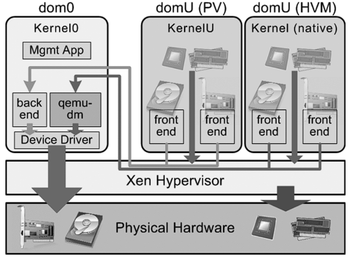
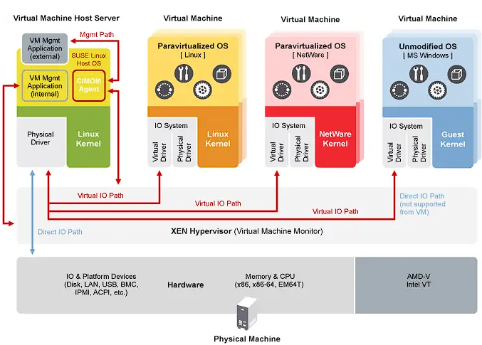

# 🖥️ Topic 351: Full Virtualization


---

<a name="topic-351.1"></a>

### 🧠 351.1 Virtualization Concepts and Theory

**Weight:** 6

**Description:** Candidates should know and understand the general concepts, theory and terminology of virtualization. This includes Xen, QEMU and libvirt terminology.

**Key Knowledge Areas:**

* 🖥️ Understand virtualization terminology
* ⚖️ Understand the pros and cons of virtualization
* 🛠️ Understand the various variations of Hypervisors and Virtual Machine Monitors
* 🔄 Understand the major aspects of migrating physical to virtual machines
* 🚀 Understand the major aspects of migrating virtual machines between host systems
* 📸 Understand the features and implications of virtualization for a virtual machine, such as snapshotting, pausing, cloning and resource limits
* 🌐 Awareness of oVirt, Proxmox, systemd-machined and VirtualBox
* 🔗 Awareness of Open vSwitch

#### 📋 351.1 Cited Objects

```sh
Hypervisor
Hardware Virtual Machine (HVM)
Paravirtualization (PV)
Emulation and Simulation
CPU flags
/proc/cpuinfo
Migration (P2V, V2V)
```

#### 🖥️ Hypervisors

##### 🏢 Type 1 Hypervisor (Bare-Metal Hypervisor)

###### 📄 Type 1 Definition

Runs directly on the host's physical hardware, providing a base layer to manage VMs without the need for a host operating system.

###### 📝 Type 1 Characteristics

* ⚡ High performance and efficiency.
* ⏱️ Lower latency and overhead.
* 🏢 Often used in enterprise environments and data centers.

###### 💡 Type 1 Examples

* VMware ESXi: A robust and widely used hypervisor in enterprise settings.
* Microsoft Hyper-V: Integrated with Windows Server, offering strong performance and management features.
* Xen: An open-source hypervisor used by many cloud service providers.
* KVM (Kernel-based Virtual Machine): Integrated into the Linux kernel, providing high performance for Linux-based systems.

##### 🏠 Type 2 Hypervisor (Hosted Hypervisor)

###### 📄 Type 2 Definition

Runs on top of a conventional operating system, relying on the host OS for resource management and device support.

###### 📝 Type 2 Characteristics

* 🛠️ Easier to set up and use, especially on personal computers.
* 🔧 More flexible for development, testing, and smaller-scale deployments.
* 🐢 Typically less efficient than Type 1 hypervisors due to additional overhead from the host OS.

###### 💡 Type 2 Examples

* VMware Workstation: A powerful hypervisor for running multiple operating systems on a single desktop.
* Oracle VirtualBox: An open-source hypervisor known for its flexibility and ease of use.
* Parallels Desktop: Designed for Mac users to run Windows and other operating systems alongside macOS.
* QEMU (Quick EMUlator): An open-source emulator and virtualizer, often used in conjunction with KVM.

##### ⚖️ Key Differences Between Type 1 and Type 2 Hypervisors

* Deployment Environment:
  * Type 1 hypervisors are commonly deployed in data centers and enterprise environments due to their direct interaction with hardware and high performance.
  * Type 2 hypervisors are more suitable for personal use, development, testing, and small-scale virtualization tasks.
* Performance:
  * Type 1 hypervisors generally offer better performance and lower latency because they do not rely on a host OS.
  * Type 2 hypervisors may experience some performance degradation due to the overhead of running on top of a host OS.
* Management and Ease of Use:
  * Type 1 hypervisors require more complex setup and management but provide advanced features and scalability for large-scale deployments.
  * Type 2 hypervisors are easier to install and use, making them ideal for individual users and smaller projects.

##### 🔄 Migration Types

In the context of hypervisors, which are technologies used to create and manage virtual machines, the terms P2V migration and V2V migration are common in virtualization environments.
They refer to processes of migrating systems between different types of platforms.

##### 🖥️➡️🖥️ P2V - Physical to Virtual Migration

P2V migration refers to the process of migrating a physical server to a virtual machine.In other words, an operating system and its applications, running on dedicated physical hardware, are "converted" and moved to a virtual machine that runs on a hypervisor (such as VMware, Hyper-V, KVM, etc.).

* Example: You have a physical server running a Windows or Linux system, and you want to move it to a virtual environment, like a cloud infrastructure or an internal virtualization server.
  The process involves copying the entire system state, including the operating system, drivers, and data, to create an equivalent virtual machine that can run as if it were on the physical hardware.

##### 🖥️🔁🖥️ V2V  - Virtual to Virtual Migration

V2V migration refers to the process of migrating a virtual machine from one hypervisor to another.In this case, you already have a virtual machine running in a virtualized environment (like VMware), and you want to move it to another virtualized environment (for example, to Hyper-V or to a new VMware server).

* Example: You have a virtual machine running on a VMware virtualization server, but you decide to migrate it to a Hyper-V platform. In this case, the V2V migration converts the virtual machine from one format or hypervisor to another, ensuring it can continue running correctly.

#### 🧩 HVM and Paravirtualization

##### ⚙️ Hardware-assisted Virtualization (HVM)

###### 📄 HVM Definition

HVM leverages hardware extensions provided by modern CPUs to virtualize hardware, enabling the creation and management of VMs with minimal performance overhead.

###### 📝 HVM Key Characteristics

* 🖥️ **Hardware Support**: Requires CPU support for virtualization extensions such as Intel VT-x or AMD-V.
* 🛠️ **Full Virtualization:** VMs can run unmodified guest operating systems, as the hypervisor provides a complete emulation of the hardware environment.
* ⚡ **Performance:** Typically offers near-native performance because of direct execution of guest code on the CPU.
* 🔒 **Isolation:** Provides strong isolation between VMs since each VM operates as if it has its own dedicated hardware.

###### 💡 HVM Examples

VMware ESXi, Microsoft Hyper-V, KVM (Kernel-based Virtual Machine).

###### ✅ HVM Advantages

* ✅ **Compatibility:** Can run any operating system without modification.
* ⚡ **Performance:** High performance due to hardware support.
* 🔒 **Security:** Enhanced isolation and security features provided by hardware.

###### ❌ HVM Disadvantages

* 🛠️ **Hardware Dependency:** Requires specific hardware features, limiting compatibility with older systems.
* 🔧 **Complexity:** May involve more complex configuration and management.

##### 🧩 Paravirtualization

###### 📄 Paravirtualization Definition

Paravirtualization involves modifying the guest operating system to be aware of the virtual environment, allowing it to interact more efficiently with the hypervisor.

###### 📝 Paravirtualization Key Characteristics

* 🛠️ **Guest Modification:** Requires changes to the guest operating system to communicate directly with the hypervisor using hypercalls.
* ⚡ **Performance:** Can be more efficient than traditional full virtualization because it reduces the overhead associated with emulating hardware.
* 🔗 **Compatibility:** Limited to operating systems that have been modified for paravirtualization.

###### 💡 Paravirtualization Examples

Xen with paravirtualized guests, VMware tools in certain configurations, and some KVM configurations.

###### ✅ Paravirtualization Advantages

* ⚡ **Efficiency:** Reduces the overhead of virtualizing hardware, potentially offering better performance for certain workloads.
* ✅ **Resource Utilization:** More efficient use of system resources due to direct communication between the guest OS and hypervisor.

###### ❌ Paravirtualization Disadvantages

* 🛠️ **Guest OS Modification:** Requires modifications to the guest OS, limiting compatibility to supported operating systems.
* 🔧 **Complexity:** Requires additional complexity in the guest OS for hypercall implementations.

##### ⚖️ Key Differences

###### 🖥️ Guest OS Requirements

* **HVM:** Can run unmodified guest operating systems.
* **Paravirtualization:** Requires guest operating systems to be modified to work with the hypervisor.

###### ⚡ Performance

* **HVM:** Typically provides near-native performance due to hardware-assisted execution.
* **Paravirtualization:** Can offer efficient performance by reducing the overhead of hardware emulation, but relies on modified guest OS.

###### 🧰 Hardware Dependency

* **HVM:** Requires specific CPU features (Intel VT-x, AMD-V).
* **Paravirtualization:** Does not require specific CPU features but needs modified guest OS.

###### 🔒 Isolation

* **HVM:** Provides strong isolation using hardware features.
* **Paravirtualization:** Relies on software-based isolation, which may not be as robust as hardware-based isolation.

###### 🧩 Complexity

* **HVM:** Generally more straightforward to deploy since it supports unmodified OS.
* **Paravirtualization:** Requires additional setup and modifications to the guest OS, increasing complexity.

#### 🧠 NUMA (Non-Uniform Memory Access)

NUMA (Non-Uniform Memory Access) is a memory architecture used in multiprocessor systems to optimize memory access by processors.
In a NUMA system, memory is distributed unevenly among processors, meaning that each processor has faster access to a portion of memory (its "local memory") than to memory that is physically further away (referred to as "remote memory") and associated with other processors.

##### 📝 Key Features of NUMA Architecture

1. **Local and Remote Memory**: Each processor has its own local memory, which it can access more quickly. However, it can also access the memory of other processors, although this takes longer.
2. **Differentiated Latency**: The latency of memory access varies depending on whether the processor is accessing its local memory or the memory of another node. Local memory access is faster, while accessing another node’s memory (remote) is slower.
3. **Scalability**: NUMA architecture is designed to improve scalability in systems with many processors. As more processors are added, memory is also distributed, avoiding the bottleneck that would occur in a uniform memory access (UMA) architecture.

##### ✅ Advantages of NUMA

* ⚡ Better Performance in Large Systems: Since each processor has local memory, it can work more efficiently without competing as much with other processors for memory access.
* 📈 Scalability: NUMA allows systems with many processors and large amounts of memory to scale more effectively compared to a UMA architecture.

##### ❌ Disadvantages

* 🛠️ Programming Complexity: Programmers need to be aware of which regions of memory are local or remote, optimizing the use of local memory to achieve better performance.
* 🐢 Potential Performance Penalties: If a processor frequently accesses remote memory, performance may suffer due to higher latency.
  This architecture is common in high-performance multiprocessor systems, such as servers and supercomputers, where scalability and memory optimization are critical.

#### 🆓 Opensource Solutions

* 🌐 oVirt: [https://www.ovirt.org/](https://www.ovirt.org/)
* 🌐 Proxmox: [https://www.proxmox.com/en/proxmox-virtual-environment/overview](https://www.proxmox.com/en/proxmox-virtual-environment/overview)
* 🌐 Oracle VirtualBox: [https://www.virtualbox.org/](https://www.virtualbox.org/)
* 🌐 Open vSwitch: [https://www.openvswitch.org/](https://www.openvswitch.org/)

#### 🗂️ Types of Virtualization

##### 🖥️ Hardware Virtualization (Server Virtualization)

###### 📄 HV Definition

Abstracts physical hardware to create virtual machines (VMs) that run separate operating systems and applications.

###### 🛠️ HV Use Cases

Data centers, cloud computing, server consolidation.

###### 💡 HV Examples

VMware ESXi, Microsoft Hyper-V, KVM.

##### 📦 Operating System Virtualization (containerization)

###### 📄 containerization Definition

Allows multiple isolated user-space instances (containers) to run on a single OS kernel.

###### 🛠️ containerization Use Cases

Microservices architecture, development and testing environments.

###### 💡 containerization Examples

Docker, Kubernetes, LXC.

##### 🌐 Network Virtualization

###### 📄 Network Virtualization Definition

Combines hardware and software network resources into a single, software-based administrative entity.

###### 🛠️ Network Virtualization Use Cases

Software-defined networking (SDN), network function virtualization (NFV).

###### 💡 Network Virtualization Examples

VMware NSX, Cisco ACI, OpenStack Neutron.

##### 💾 Storage Virtualization

###### 📄 Storage Virtualization Definition

Pools physical storage from multiple devices into a single virtual storage unit that can be managed centrally.

###### 🛠️ Storage Virtualization Use Cases

Data management, storage optimization, disaster recovery.

###### 💡 Storage Virtualization Examples

IBM SAN Volume Controller, VMware vSAN, NetApp ONTAP.

##### 🖥️ Desktop Virtualization

###### 📄 Desktop Virtualization Definition

Allows a desktop operating system to run on a virtual machine hosted on a server.

###### 🛠️ Desktop Virtualization Use Cases

Virtual desktop infrastructure (VDI), remote work solutions.

###### 💡 Desktop Virtualization Examples

Citrix Virtual Apps and Desktops, VMware Horizon, Microsoft Remote Desktop Services.

##### 📱 Application Virtualization

###### 📄 Application Virtualization Definition

Separates applications from the underlying hardware and operating system, allowing them to run in isolated environments.

###### 🛠️ Application Virtualization Use Cases

Simplified application deployment, compatibility testing.

###### 💡 Application Virtualization Examples

VMware ThinApp, Microsoft App-V, Citrix XenApp.

##### 🗃️ Data Virtualization

###### 📄 Data Virtualization Definition

Integrates data from various sources without physically consolidating it, providing a unified view for analysis and reporting.

###### 🛠️ Data Virtualization Use Cases

Business intelligence, real-time data integration.

###### 💡 Data Virtualization Examples

Denodo, Red Hat JBoss Data Virtualization, IBM InfoSphere.

##### 🌟 Benefits of Virtualization

* ⚡ Resource Efficiency: Better utilization of physical resources.
* 💰 Cost Savings: Reduced hardware and operational costs.
* 📈 Scalability: Easy to scale up or down according to demand.
* 🔧 Flexibility: Supports a variety of workloads and applications.
* 🔄 Disaster Recovery: Simplified backup and recovery processes.
* 🔒 Isolation: Improved security through isolation of environments.

#### Emulation

Emulation involves simulating the behavior of hardware or software on a different platform than originally intended.

This process allows software designed for one system to run on another system that may have different architecture or operating environment.

While emulation provides versatility by enabling the execution of unmodified guest operating systems or applications, it often comes with performance overhead.

This overhead arises because the emulated system needs to interpret and translate instructions meant for the original system into instructions compatible with the host system. As a result, emulation can be slower than native execution, making it less efficient for resource-intensive tasks.

Despite this drawback, emulation remains valuable for running legacy software, testing applications across different platforms, and facilitating cross-platform development.

#### systemd-machined

 The systemd-machined service is dedicated to managing virtual machines and containers within the systemd ecosystem.
 It provides essential functionalities for controlling, monitoring, and maintaining virtual instances, offering robust integration and efficiency within Linux environments.

<p align="right">(<a href="#topic-351.1">back to sub Topic 351.1</a>)</p>
<p align="right">(<a href="#topic-351">back to Topic 351</a>)</p>
<p align="right">(<a href="#readme-top">back to top</a>)</p>

---

<a name="topic-351.2"></a>

### 🐧 351.2 Xen





**Weight:** 3

**Description:** Candidates should be able to install, configure, maintain, migrate and troubleshoot Xen installations. The focus is on Xen version 4.x.

**Key Knowledge Areas:**

* Understand architecture of Xen, including networking and storage
* Basic configuration of Xen nodes and domains
* Basic management of Xen nodes and domains
* Basic troubleshooting of Xen installations
* Awareness of XAPI
* Awareness of XenStore
* Awareness of Xen Boot Parameters
* Awareness of the xm utility

#### 🐧 Xen


Xen is an open-source type-1 (bare-metal) hypervisor, which allows multiple operating systems to run concurrently on the same physical hardware.Xen provides a layer between the physical hardware and virtual machines (VMs), enabling efficient resource sharing and isolation.

* **Architecture:** Xen operates with a two-tier system where Domain 0 (Dom0) is the privileged domain with direct hardware access and manages the hypervisor. Other virtual machines, called Domain U (DomU), run guest operating systems and are managed by Dom0.
* **Types of Virtualization:** Xen supports both paravirtualization (PV), which requires modified guest OS, and hardware-assisted virtualization (HVM), which uses hardware extensions (e.g., Intel VT-x or AMD-V) to run unmodified guest operating systems.
  Xen is widely used in cloud environments, notably by Amazon Web Services (AWS) and other large-scale cloud providers.

#### 🏢 XenSource

XenSource was the company founded by the original developers of the Xen hypervisor at the University of Cambridge to commercialize Xen.The company provided enterprise solutions based on Xen and offered additional tools and support to enhance Xen’s capabilities for enterprise use.

* **Acquisition by Citrix**: In 2007, XenSource was acquired by Citrix Systems, Inc. Citrix used Xen technology as the foundation for its Citrix XenServer product, which became a popular enterprise-grade virtualization platform based on Xen.
* **Transition**: After the acquisition, the Xen project continued as an open-source project, while Citrix focused on commercial offerings like XenServer, leveraging XenSource technology.

#### 🌍 Xen Project

Xen Project refers to the open-source community and initiative responsible for developing and maintaining the Xen hypervisor after its commercialization.The Xen Project operates under the Linux Foundation, with a focus on building, improving, and supporting Xen as a collaborative, community-driven effort.

* **Goals:** The Xen Project aims to advance the hypervisor by improving its performance, security, and feature set for a wide range of use cases, including cloud computing, security-focused virtualization (e.g., Qubes OS), and embedded systems.
* **Contributors:** The project includes contributors from various organizations, including major cloud providers, hardware vendors, and independent developers.
* **XAPI and XenTools:** The Xen Project also includes tools such as XAPI (XenAPI), which is used for managing Xen hypervisor installations, and various other utilities for system management and optimization.

#### 🗄️ XenStore

Xen Store is a critical component of the Xen Hypervisor.
Essentially, Xen Store is a distributed key-value database used for communication and information sharing between the Xen hypervisor and the virtual machines (also known as domains) it manages.

Here are some key aspects of Xen Store:

* **Inter-Domain Communication:** Xen Store enables communication between domains, such as Dom0 (the privileged domain that controls hardware resources) and DomUs (user domains, which are the VMs). This is done through key-value entries, where each domain can read or write information.
* **Configuration Management:** It is used to store and access configuration information, such as virtual devices, networking, and boot parameters. This facilitates the dynamic management and configuration of VMs.
* **Events and Notifications:** Xen Store also supports event notifications. When a particular key or value in the Xen Store is modified, interested domains can be notified to react to these changes. This is useful for monitoring and managing resources.
* Simple API: Xen Store provides a simple API for reading and writing data, making it easy for developers to integrate their applications with the Xen virtualization system.

#### 🔗 XAPI

XAPI, or XenAPI, is the application programming interface (API) used to manage the Xen Hypervisor and its virtual machines (VMs).
XAPI is a key component of XenServer (now known as Citrix Hypervisor) and provides a standardized way to interact with the Xen hypervisor to perform operations such as creating, configuring, monitoring, and controlling VMs.

Here are some important aspects of XAPI:

* **VM Management:** XAPI allows administrators to programmatically create, delete, start, and stop virtual machines.
* **Automation:** With XAPI, it's possible to automate the management of virtual resources, including networking, storage, and computing, which is crucial for large cloud environments.
* **Integration:** XAPI can be integrated with other tools and scripts to provide more efficient and customized administration of the Xen environment.
* **Access Control:** XAPI also provides access control mechanisms to ensure that only authorized users can perform specific operations in the virtual environment.

XAPI is the interface that enables control and automation of the Xen Hypervisor, making it easier to manage virtualized environments.

#### 📝 Xen Summary

* **Xen:** The core hypervisor technology enabling virtual machines to run on physical hardware.
* **XenSource:** The company that commercialized Xen, later acquired by Citrix, leading to the development of Citrix XenServer.
* **Xen Project:** The open-source initiative and community that continues to develop and maintain the Xen hypervisor under the Linux Foundation.
* **XenStore:**  Xen Store acts as a communication and configuration intermediary between the Xen hypervisor and the VMs, streamlining the operation and management of virtualized environments.
* **XAPI** is the interface that enables control and automation of the Xen Hypervisor, making it easier to manage virtualized environments.

#### 🖥️ Domain0 (Dom0)

Domain0, or Dom0, is the control domain in a Xen architecture. It manages other domains (DomUs) and has direct access to hardware.
Dom0 runs device drivers, allowing DomUs, which lack direct hardware access, to communicate with devices. Typically, it is a full instance of an operating system, like Linux, and is essential for Xen hypervisor operation.

#### 💻 DomainU (DomU)

DomUs are non-privileged domains that run virtual machines.
They are managed by Dom0 and do not have direct access to hardware. DomUs can be configured to run different operating systems and are used for various purposes, such as application servers and development environments. They rely on Dom0 for hardware interaction.

#### 🧩 PV-DomU (Paravirtualized DomainU)

PV-DomUs use a technique called paravirtualization. In this model, the DomU operating system is modified to be aware that it runs in a virtualized environment, allowing it to communicate directly with the hypervisor for optimized performance.
This results in lower overhead and better efficiency compared to full virtualization.

#### ⚙️ HVM-DomU (Hardware Virtual Machine DomainU)

HVM-DomUs are virtual machines that utilize full virtualization, allowing unmodified operating systems to run. The Xen hypervisor provides hardware emulation for these DomUs, enabling them to run any operating system that supports the underlying hardware architecture.
While this offers greater flexibility, it can result in higher overhead compared to PV-DomUs.

#### 🌐 Xen Network

Paravirtualized Network Devices


Bridging


#### 📋 351.2 Cited Objects

```sh
Domain0 (Dom0), DomainU (DomU)
PV-DomU, HVM-DomU
/etc/xen/
xl
xl.cfg 
xl.conf # Xen global configurations
xentop
oxenstored # Xenstore configurations
```

#### 📝 351.2 Notes

```sh

# Xen Settings
/etc/xen/
/etc/xen/xl.conf - Main general configuration file for Xen
/etc/xen/oxenstored.conf - Xenstore configurations

# VM Configurations
/etc/xen/xlexample.pvlinux
/etc/xen/xlexample.hvm

# Service Configurations
/etc/default/xen
/etc/default/xendomains

# xen-tools configurations
/etc/xen-tools/
/usr/share/xen-tools/

# docs
xl(1)
xl.conf(5)
xlcpupool.cfg(5)
xl-disk-configuration(5)
xl-network-configuration(5)
xen-tscmode(7)

# initialized domains auto
/etc/default/xendomains
   XENDOMAINS_AUTO=/etc/xen/auto

/etc/xen/auto/


# set domain for up after xen reboot
## create folder auto
cd /etc/xen && mkdir -p auto && cd auto

# create symbolic link
ln -s /etc/xen/lpic3-pv-guest /etc/xen/auto/lpic3-pv-guest
```

#### 💻 351.2 Important Commands

##### 🏗️ xen-create-image

```sh
# create a pv image
xen-create-image \
  --hostname=lpic3-pv-guest \
  --memory=1gb \
  --vcpus=2 \
  --lvm=vg_xen \
  --bridge=xenbr0 \
  --dhcp \
  --pygrub \
  --password=vagrant \
  --dist=bookworm
```

##### 📄 xen-list-images

```sh
# list image
xen-list-image
```

##### ❌ xen-delete-image

```sh
# delete a pv image
xen-delete-image lpic3-pv-guest --lvm=vg_xen
```

##### 🗄️ xenstore-ls

```sh
# list xenstore infos
xenstore-ls
```

##### ⚙️ xl

```sh
# view xen information
xl infos

# list Domains
xl list
xl list lpic3-hvm-guest
xl list lpic3-hvm-guest -l

# uptime Domains
xl uptime

# pause Domain
xl pause 2
xl pause lpic3-hvm-guest

# save state Domains
xl -v save lpic3-hvm-guest ~root/image-lpic3-hvm-guest.save

# restore Domain
xl restore /root/image-lpic3-hvm-guest.save

# get Domain name
xl domname 2

# view dmesg information
xl dmesg

# monitoring domain
xl top
xentop
xen top

# Limit mem Dom0
xl mem-set 0 2048

# Limit cpu (not permanent after boot)
xl vcpu-set 0 2

# create DomainU - virtual machine
xl create /etc/xen/lpic3-pv-guest.cfg

# create DomainU virtual machine and connect to guest
xl create -c /etc/xen/lpic3-pv-guest.cfg

##----------------------------------------------
# create DomainU virtual machine HVM

## create logical volume
lvcreate -l +20%FREE -n lpic3-hvm-guest-disk  vg_xen

## create a ssh tunel for vnc
ssh -l vagrant -L 5900:localhost:5900  192.168.0.130

## configure /etc/xen/lpic3-hvm-guest.cfg
## set boot for cdrom: boot = "d"

## create domain hvm
xl create /etc/xen/lpic3-hvm-guest.cfg

## open vcn connection in your vnc client with localhost
## for view install details

## after installation finished, destroy domain: xl destroy <id_or_name>

## set /etc/xen/lpic3-hvm-guest.cfg: boot for hard disc: boot = "c"

## create domain hvm
xl create /etc/xen/lpic3-hvm-guest.cfg

## access domain hvm
xl console <id_or_name>
##----------------------------------------------

# connect in domain guest
xl console <id>|<name> (press enter)
xl console 1
xl console lpic3-pv-guest

#How do I exit domU "xl console" session
#Press ctrl+] or if you're using Putty press ctrl+5.

# Poweroff domain
xl shutdown lpic3-pv-guest

# destroy domain
xl destroy lpic3-pv-guest

# reboot domain
xl reboot lpic3-pv-guest

# list block devices
xl block-list 1
xl block-list lpic3-pv-guest

# detach block devices
xl block-detach lpic3-hvm-guest hdc
xl block-detach 2 xvdc

# attach block devices

## hard disk devices
xl block-attach lpic3-hvm-guest-ubuntu 'phy:/dev/vg_xen/lpic3-hvm-guest-disk2,xvde,w'

## cdrom
xl block-attach lpic3-hvm-guest 'file:/home/vagrant/isos/ubuntu/seed.iso,xvdc:cdrom,r'
xl block-attach 2 'file:/home/vagrant/isos/ubuntu/seed.iso,xvdc:cdrom,r'

# insert and eject cdrom devices
xl cd-insert lpic3-hvm-guest-ubuntu xvdb  /home/vagrant/isos/ubuntu/ubuntu-24.04.1-live-server-amd64.iso
xl cd-eject lpic3-hvm-guest-ubuntu xvdb
```

#### 251.2 Notes

##### vif

In Xen, “vif” stands for Virtual Interface and is used to configure networking for virtual machines (domains).

By specifying “vif” directives in the domain configuration files, administrators can define network interfaces, assign IP addresses, set up VLANs, and configure other networking parameters for virtual machines running on Xen hosts. For example: vif = [‘bridge=xenbr0’], in this case, it connects the VM’s network interface to the Xen bridge named “xenbr0”.

<p align="right">(<a href="#topic-351.2">back to sub Topic 351.2</a>)</p>
<p align="right">(<a href="#topic-351">back to Topic 351</a>)</p>
<p align="right">(<a href="#readme-top">back to top</a>)</p>

---

<a name="topic-351.3"></a>

### 🖥️ 351.3 QEMU


**Weight:** 4

**Description:** Candidates should be able to install, configure, maintain, migrate and troubleshoot QEMU installations.

**Key Knowledge Areas:**

* Understand the architecture of QEMU, including KVM, networking and storage
* Start QEMU instances from the command line
* Manage snapshots using the QEMU monitor
* Install the QEMU Guest Agent and VirtIO device drivers
* Troubleshoot QEMU installations, including networking and storage
* Awareness of important QEMU configuration parameters

#### 📋 351.3 Cited Objects

```sh
Kernel modules: kvm, kvm-intel and kvm-amd
/dev/kvm
QEMU monitor
qemu
qemu-system-x86_64
ip
brctl
tunctl
```

#### 🛠️ 351.3 Important Commands

##### 📝 351.3 Others Commands

##### 🧪 check kvm module

```sh
# check if kvm is enabled
egrep -o '(vmx|svm)' /proc/cpuinfo
lscpu |grep Virtualization
lsmod|grep kvm
ls -l /dev/kvm
hostnamectl
systemd-detect-virt
```

```sh
# check if kvm is enabled
egrep -o '(vmx|svm)' /proc/cpuinfo
lscpu |grep Virtualization
lsmod|grep kvm
ls -l /dev/kvm

# check kernel infos
uname -a

# check root device
findmnt /

# mount a qcow2 image
## Example 1:
mkdir -p /mnt/qemu
guestmount -a os-images/Debian_12.0.0_VMM/Debian_12.0.0.qcow2 -i /mnt/qemu/

## Example 2:
sudo guestfish --rw -a os-images/Debian_12.0.0_VMM/Debian_12.0.0.qcow2
run
list-filesystems

# run commands in qcow2 images
## Example 1:
virt-customize -a  os-images/Debian_12.0.0_VMM/Debian_12.0.0.qcow2  --run-command 'echo hello >/root/hello.txt'
## Example 2:
sudo virt-customize -a os-images/Debian_12.0.0_VMM/Debian_12.0.0.qcow2 \
  --run-command 'echo -e "auto ens3\niface ens3 inet dhcp" > /etc/network/interfaces.d/ens3.cfg'

# generate mac 
printf 'DE:AD:BE:EF:%02X:%02X\n' $((RANDOM%256)) $((RANDOM%256))
```

##### 🌐 ip

```sh
# list links
ip link show

# create bridge
ip link add br0 type bridge
```

##### 🌉 brctl

```sh
# list links
ip link show

# create bridge
ip link add br0 type bridge
```

##### 💾 qemu-img

```sh
# create image
qemu-img create -f qcow2 vm-disk-debian-12.qcow2 20G

# convert vmdk to qcow2 image
qemu-img convert \
  -f vmdk \
  -O qcow2 os-images/Debian_12.0.0_VMM/Debian_12.0.0_VMM_LinuxVMImages.COM.vmdk os-images/Debian_12.0.0_VMM/Debian_12.0.0.qcow2 \
  -p \
  -m16

# check image
qemu-img info os-images/Debian_12.0.0_VMM/Debian_12.0.0.qcow2
```

##### 🖥️ qemu-system-x86_64

```sh
# create vm with ISO
qemu-system-x86_64 \
  -name lpic3-debian-12 \
  -enable-kvm -hda vm-disk-debian-12.qcow2 \
  -cdrom /home/vagrant/isos/debian/debian-12.8.0-amd64-DVD-1.iso  \
  -boot d \
  -m 2048 \
  -smp cpus=2 \
  -k pt-br

# create vm with ISO using vnc in no gui servers \ ssh connections

## create ssh tunel in host
 ssh -l vagrant -L 5902:localhost:5902  192.168.0.131

## create vm 
qemu-system-x86_64 \
  -name lpic3-debian-12 \
  -enable-kvm \
  -m 2048 \
  -smp cpus=2 \
  -k pt-br \
  -vnc :2 \
  -device qemu-xhci \
  -device usb-tablet \
  -device ide-cd,bus=ide.1,drive=cdrom,bootindex=1 \
  -drive id=cdrom,media=cdrom,if=none,file=/home/vagrant/isos/debian/debian-12.8.0-amd64-DVD-1.iso \
  -hda vm-disk-debian-12.qcow2 \
  -boot order=d \
  -vga std \
  -display none \
  -monitor stdio

# create vm with OS Image - qcow2

## create vm
qemu-system-x86_64 \
  -name lpic3-debian-12 \
  -enable-kvm \
  -m 2048 \
  -smp cpus=2 \
  -k pt-br \
  -vnc :2 \
  -hda os-images/Debian_12.0.0_VMM/Debian_12.0.0.qcow2

## create vm with custom kernel params
qemu-system-x86_64 \
  -name lpic3-debian-12 \
  -kernel /vmlinuz \
  -initrd /initrd.img \
  -append "root=/dev/mapper/debian--vg-root ro fastboot console=ttyS0" \
  -enable-kvm \
  -m 2048 \
  -smp cpus=2 \
  -k pt-br \
  -vnc :2 \
  -hda os-images/Debian_12.0.0_VMM/Debian_12.0.0.qcow2

## create vm with and attach disk
qemu-system-x86_64 \
  -name lpic3-debian-12 \
  -enable-kvm \
  -m 2048 \
  -smp cpus=2 \
  -vnc :2 \
  -hda os-images/Debian_12.0.0_VMM/Debian_12.0.0.qcow2 \
  -hdb vmdisk-debian12.qcow2 \
  -drive file=vmdisk-extra-debian12.qcow2,index=2,media=disk,if=ide \
  -netdev bridge,id=net0,br=qemubr0 \
  -device virtio-net-pci,netdev=net0
  
## create vm network netdev user
qemu-system-x86_64 \
  -name lpic3-debian-12 \
  -enable-kvm \
  -m 2048 \
  -smp cpus=2 \
  -vnc :2 \
  -hda os-images/Debian_12.0.0_VMM/Debian_12.0.0.qcow2 \
  -netdev user,id=mynet0,net=192.168.0.150/24,dhcpstart=192.168.0.155,hostfwd=tcp::2222-:22 \
  -device virtio-net-pci,netdev=mynet0

## create vm network netdev tap (Private Network)
ip link add br0 type bridge ; ifconfig br0 up
qemu-system-x86_64 \
  -name lpic3-debian-12 \
  -enable-kvm \
  -m 2048 \
  -smp cpus=2 \
  -vnc :2 \
  -hda os-images/Debian_12.0.0_VMM/Debian_12.0.0.qcow2 \
  -netdev tap,id=br0 \
  -device e1000,netdev=br0,mac=DE:AD:BE:EF:1A:24

## create vm with public bridge
#create a public bridge : https://www.linux-kvm.org/page/Networking

qemu-system-x86_64 \
  -name lpic3-debian-12 \
  -enable-kvm \
  -m 2048 \
  -smp cpus=2 \
  -hda os-images/Debian_12.0.0_VMM/Debian_12.0.0.qcow2 \
  -k pt-br \
  -vnc :2 \
  -device qemu-xhci \
  -device usb-tablet \
  -vga std \
  -display none \
  -netdev bridge,id=net0,br=qemubr0 \
  -device virtio-net-pci,netdev=net0

## get a ipv4 ip - open ssh in vm and:
dhcpclient ens4
```

#### 🖥️ QEMU Monitor

For initiate QEMU monitor in commandline use **-monitor stdio** param in **qemu-system-x86_64**

```sh
qemu-system-x86_64 -monitor stdio
```

Exit qemu-monitor:

```sh
ctrl+alt+2
```

```sh
# Management
info status # vm info
info cpus # cpu information
info network # network informations
stop # pause vm
cont # start vm in status pause
system_powerdown # poweroff vm
system_reset # restart monitor


# Blocks
info block # block info
boot_set d # force boot iso
change ide1-cd0  /home/vagrant/isos/debian/debian-12.8.0-amd64-DVD-1.iso  # attach cdrom
eject ide1-cd0 # detach cdrom

# Snapshots
info snapshots # list snapshots
savevm snapshot-01  # create snapshot
loadvm snapshot-01 # restore snapshot
delvm snapshot-01
```

#### 🤖 Guest Agent

For enable, use:

```sh
qemu-system-x86_x64
 -chardev socket,path=/tmp/qga.sock,server=on,wait=off,id=qga0 \
 -device virtio-serial \
 -device virtserialport,chardev=qga0,name=org.qemu.guest_agent.0
```

<p align="right">(<a href="#topic-351.3">back to sub Topic 351.3</a>)</p>
<p align="right">(<a href="#topic-351">back to Topic 351</a>)</p>
<p align="right">(<a href="#readme-top">back to top</a>)</p>

---

<a name="topic-351.4"></a>

### 🏢 351.4 Libvirt Virtual Machine Management


**Weight:** 9

**Description:** Candidates should be able to manage virtualization hosts and virtual machines (‘libvirt domains’) using libvirt and related tools.

**Key Knowledge Areas:**

* Understand the architecture of libvirt
* Manage libvirt connections and nodes
* Create and manage QEMU and Xen domains, including snapshots
* Manage and analyze resource consumption of domains
* Create and manage storage pools and volumes
* Create and manage virtual networks
* Migrate domains between nodes
* Understand how libvirt interacts with Xen and QEMU
* Understand how libvirt interacts with network services such as dnsmasq and radvd
* Understand libvirt XML configuration files
* Awareness of virtlogd and virtlockd

#### 📋 351.4 Cited Objects

```sh
libvirtd
/etc/libvirt/
/var/lib/libvirt
/var/log/libvirt
virsh (including relevant subcommands) 
```

#### 🛠️ 351.4 Important Commands

##### 🖥️ virsh

```sh
# using env variable for set virsh uri (local or remotely)
export LIBVIRT_DEFAULT_URI=qemu:///system
export LIBVIRT_DEFAULT_URI=xen+ssh://vagrant@192.168.0.130
export LIBVIRT_DEFAULT_URI='xen+ssh://vagrant@192.168.0.130?keyfile=/home/vagrant/.ssh/skynet-key-ecdsa'

# COMMONS

# get helps
virsh help
virsh help pool-create

# view version
virsh version

# view system info
sudo virsh sysinfo

# view node info
virsh nodeinfo

# hostname
virsh hostname

# check vcn allocated port
virsh vncdisplay <domain_id>
virsh vncdisplay <domain_name>
virsh vncdisplay rocky9-server01 

# HYPERVISORS

# view libvirt hypervisor connection
virsh uri

# list valid hypervisors
virt-host-validate
virt-host-validate qemu

# test connection uri(vm test)
virsh -c test:///default list

# connect remotely
virsh -c xen+ssh://vagrant@192.168.0.130
virsh -c xen+ssh://vagrant@192.168.0.130 list
virsh -c qemu+ssh://vagrant@192.168.0.130/system list

# connect remotely without enter password
virsh -c 'xen+ssh://vagrant@192.168.0.130?keyfile=/home/vagrant/.ssh/skynet-key-ecdsa'

# STORAGE

# list storage pools
virsh pool-list --details

# list all storage pool
virsh pool-list --all --details

# get a pool configuration
virsh pool-dumpxml default

# get pool info
virsh pool-info default

# create a storage pool
virsh pool-define-as --name default --type dir --target /var/lib/libvirt/images

# create a storage pool with dumpxml
virsh pool-create --overwrite --file configs/kvm/libvirt/pool.xml

# start storage pool
virsh pool-start default

# set storage pool for autostart
virsh pool-autostart default

# stop storage pool
virsh pool-destroy linux

# delete xml storage pool file
virsh pool-undefine linux

# edit storage pool
virsh pool-edit linux

# list volumes
virsh vol-list linux

# get volume infos
virsh vol-info Debian_12.0.0.qcow2 os-images
virsh vol-info --pool os-images Debian_12.0.0.qcow2 

# get volume xml
virsh vol-dumpxml rocky9-disk1 default

# create volume
virsh vol-create-as default --format qcow2 disk1 10G

# delete volume
virsh vol-delete  disk1 default

# DOMAINS \ INSTANCES \ VIRTUAL MACHINES

# list domain\instance\vm
virsh list
virsh list --all

# create domain\instance\vm
virsh create configs/kvm/libvirt/rocky9-server03.xml

# view domain\instance\vm info
virsh dominfo rocky9-server01

# view domain\instance\vm xml
virsh dumpxml rocky9-server01

# edit domain\instance\vm xml
virsh edit rocky9-server01

# stop domain\instance\vm
virsh shutdown rocky9-server01 # gracefully
virsh destroy 1
virsh destroy rocky9-server01

# suspend domain\instance\vm
virsh suspend rocky9-server01

# resume domain\instance\vm
virsh resume rocky9-server01

# start domain\instance\vm
virsh start rocky9-server01

# remove domain\instance\vm
virsh undefine rocky9-server01

# remove domain\instance\vm and storage volumes
virsh undefine rocky9-server01 --remove-all-storage

# save domain\instance\vm
virsh save rocky9-server01 rocky9-server01.qcow2

# restore domain\instance\vm
virsh restore rocky9-server01.qcow2

# list snapshots
virsh snapshot-list rocky9-server01

# create snapshot
virsh snapshot-create rocky9-server01

# restore snapshot
virsh snapshot-revert rocky9-server01 1748983520

# view snapshot xml
virsh snapshot-info rocky9-server01 1748983520

# dumpxml snapshot
virsh snapshot-dumpxml rocky9-server01 1748983520

# xml snapshot path
/var/lib/libvirt/qemu/snapshot/rocky9-server01/

# view snapshot info
virsh snapshot-info rocky9-server01 1748983671

# edit snapshot
virsh snapshot-edit rocky9-server01 1748983520

# delete snapshot
virsh snapshot-delete rocky9-server01 1748983520

# DEVICES

# list block devices
virsh domblklist rocky9-server01 --details

# add cdrom media 
virsh change-media rocky9-server01 sda /home/vagrant/isos/rocky/Rocky-9.5-x86_64-minimal.iso
virsh attach-disk rocky9-server01 /home/vagrant/isos/rocky/Rocky-9.5-x86_64-minimal.iso sda --type cdrom --mode readonly

# remove cdrom media
virsh change-media rocky9-server01 sda --eject

# add new disk
virsh attach-disk rocky9-server01  /var/lib/libvirt/images/rocky9-disk2  vdb --persistent

# remove disk
virsh detach-disk rocky9-server01 vdb --persistent

# RESOURCES (CPU and Memory)

# get cpu infos
virsh vcpuinfo rocky9-server01 --pretty
virsh dominfo rocky9-server01 | grep 'CPU'

# get vcpu count
virsh vcpucount rocky9-server01

# set vcpus maximum config
virsh setvcpus rocky9-server01 --count 4 --maximum --config
virsh shutdown rocky9-server01
virsh start rocky9-server01

# set vcpu current config
virsh setvcpus rocky9-server01 --count 4 --config

# set vcpu current live
virsh setvcpus rocky9-server01 --count 3 --current
virsh setvcpus rocky9-server01 --count 3 --live

# configure vcpu affinity config
virsh vcpupin rocky9-server01 0 7 --config
virsh vcpupin rocky9-server01 1 5-6 --config

# configure vcpu affinity current
virsh vcpupin rocky9-server01 0 7
virsh vcpupin rocky9-server01 1 5-6

# set maximum memory config
virsh setmaxmem rocky9-server01 3000000 --config
virsh shutdown rocky9-server01
virsh start rocky9-server01

# set current memory config
virsh setmem rocky9-server01 2500000 --current

# NETWORK

# get netwwork bridges
brctl show

# get iptables rules for libvirt
sudo iptables -L -n -t  nat

# list network
virsh net-list --all

# set default network
virsh net-define /etc/libvirt/qemu/networks/default.xml

# get network infos
virsh net-info default

# get xml network
virsh net-dumpxml default

# xml file
cat /etc/libvirt/qemu/networks/default.xml

# dhcp config
sudo cat /etc/libvirt/qemu/networks/default.xml | grep -A 10 dhcp
sudo cat /var/lib/libvirt/dnsmasq/default.conf

# get domain ipp address
virsh net-dhcp-leases default
virsh net-dhcp-leases default --mac 52\:54\:00\:89\:19\:86

# edit network
virsh net-edit default

# get domain network details
virsh domiflist debian-server01

# path for network filter files
/etc/libvirt/nwfilter/

# list network filters
virsh nwfilter-list

# create network filter - block icmp traffic
virsh nwfilter-define block-icmp.xml
# virsh edit Debian-Server
    #  <interface type='network'>
    #        ...
    #        <filterref filter='block-icmp'/>
    #        ...
    # </interface>
# virsh destroy debian-server01
# virsh start debian-server01

# delete network filter
virsh nwfilter-undefine block-icmp

# get xml network filter
virsh nwfilter-dumpxml block-icmp
```

###### 🏗️ virt-install

```sh
# list os variants
virt-install --os-variant list
osinfo-query os

# create domain\instance\vm with iso file
virsh vol-create-as default --format qcow2 rocky9-disk1 20G
virt-install --name rocky9-server01 \
--vcpus 2 \
--cpu host \
--memory 2048 \
--disk vol=default/rocky9-disk1 \
--cdrom /home/vagrant/isos/rocky/Rocky-9.5-x86_64-minimal.iso \
--os-variant=rocky9 \
--graphics vnc,listen=0.0.0.0,port=5905

# create debian domain\instance\vm with qcow2 file
virt-install --name debian-server01 \
--vcpus 2 \
--ram 2048 \
--disk vol=os-images/Debian_12.0.0.qcow2 \
--import \
--osinfo detect=on \
--graphics vnc,listen=0.0.0.0,port=5906 \
--network network=default \
--noautoconsole

# create rocky9 domain\instance\vm with qcow2 file
virt-install --name rocky9-server02 \
--vcpus 2 \
--ram 2048 \
--disk path=os-images/RockyLinux_9.4_VMG/RockyLinux_9.4.qcow2,format=qcow2,bus=virtio \
--import \
--osinfo detect=on \
--graphics vnc,listen=0.0.0.0,port=5907 \
--network bridge=qemubr0,model=virtio \
--noautoconsole

# open domain\instance\vm gui console
virt-viewer debian-server01

# check metadata domain\instance\vm file (if uri is qemu:////system)
less /etc/libvirt/qemu/debian-server01.xml
```

<p align="right">(<a href="#topic-351.4">back to sub Topic 351.4</a>)</p>
<p align="right">(<a href="#topic-351">back to Topic 351</a>)</p>
<p align="right">(<a href="#readme-top">back to top</a>)</p>

---

<a name="topic-351.5"></a>

### 💾 351.5 Virtual Machine Disk Image Management


**Weight:** 3

**Description:** Candidates should be able to manage virtual machines disk images. This includes converting disk images between various formats and hypervisors and accessing data stored within an image.

**Key Knowledge Areas:**

* Understand features of various virtual disk image formats, such as raw images, qcow2 and VMDK
* Manage virtual machine disk images using qemu-img
* Mount partitions and access files containerd in virtual machine disk images using libguestfish
* Copy physical disk content to a virtual machine disk image
* Migrate disk content between various virtual machine disk image formats
* Awareness of Open Virtualization Format (OVF)

#### 📋 351.5 Cited Objects

```sh
qemu-img
guestfish (including relevant subcommands)
guestmount
guestumount
virt-cat
virt-copy-in
virt-copy-out
virt-diff
virt-inspector
virt-filesystems
virt-rescue
virt-df
virt-sparsify
virt-p2v
virt-p2v-make-disk
virt-v2v
```

#### 🛠️ 351.5 Important Commands

##### 💾 351.5.1 qemu-img

```sh
# Display detailed information about a disk image
qemu-img info UbuntuServer_24.04.qcow2

# Create a new 22G raw disk image (default format is raw)
qemu-img create new-disk 22G

# Create a new 22G disk image in qcow2 format
qemu-img create -f qcow2 new-disk2 22G

# Convert a VDI image to raw format using 5 threads and show progress
qemu-img convert -f vdi -O raw Ubuntu-Server.vdk new-Ubuntu.raw -m5 -p

# Convert vmdk to qcow2 image
qemu-img convert \
-f vmdk \
-O qcow2 os-images/UbuntuServer_24.04_VM/UbuntuServer_24.04_VM_LinuxVMImages.COM.vmdk \
os-images/UbuntuServer_24.04_VM/UbuntuServer_24.04.qcow2 \
-p \
-m16

# Resize a raw image to 30G
qemu-img resize -f raw new-disk 30G

# Resize a qcow2 image to 15G(actual size 30Gdisk 30G)
qemu-img resize -f raw --shrink new-disk 15G

# Snapshots

# List all snapshots in the image
qemu-img snapshot -l new-disk2.qcow2

# Create a snapshot named SNAP1
qemu-img snapshot -c SNAP1 disk

# Apply a snapshot by ID or name
qemu-img snapshot -a 123456789 disk

# Delete the snapshot named SNAP1
qemu-img snapshot -d SNAP1 disk
```

##### 🐟 guestfish

```sh
# set environment variables for guestfish
export LIBGUESTFS_BACKEND_SETTINGS=force_tcg

# Launch guestfish with a disk image
guestfish -a UbuntuServer_24.04.qcow2
#run
#list-partitions

# Run the commands in a script file
guestfish -a UbuntuServer_24.04.qcow2 -m /dev/sda -i < script.ssh

# Interactively run commands
guestfish --rw -a UbuntuServer_24.04.qcow2 <<'EOF'
run
list-filesystems
EOF

# Copy a file from the guest image to the host
export LIBGUESTFS_BACKEND_SETTINGS=force_tcg
sudo guestfish --rw -a UbuntuServer_24.04.qcow2 -i <<'EOF'
copy-out /etc/hostname /tmp/
EOF

# Copy a file from the host into the guest image
echo "new-hostname" > /tmp/hostname
export LIBGUESTFS_BACKEND_SETTINGS=force_tcg
sudo guestfish --rw -a UbuntuServer_24.04.qcow2 -i <<'EOF'
copy-in /tmp/hostname /etc/
EOF

# View contents of a file in the guest image
guestfish --ro -a UbuntuServer_24.04.qcow2 -i <<'EOF'
cat /etc/hostname
EOF

# List files in the guest image
export LIBGUESTFS_BACKEND_SETTINGS=force_tcg
guestfish --rw -a UbuntuServer_24.04.qcow2 -i <<'EOF'
ls /home/ubuntu
EOF

# Edit a file in the guest image
export LIBGUESTFS_BACKEND_SETTINGS=force_tcg
guestfish --rw -a UbuntuServer_24.04.qcow2 -i <<'EOF'
edit /etc/hosts
EOF
```

###### 🗂️ guestmount

```sh
# Mount a disk image to a directory
guestmount -a UbuntuServer_24.04.qcow2 -m /dev/ubuntu-vg/ubuntu-lv /mnt/ubuntu
# domain
guestmount -d rocky9-server02 -m /dev/ubuntu-vg/ubuntu-lv /mnt/ubuntu 

# Mount a specific partition from a disk image
guestmount -a UbuntuServer_24.04.qcow2 -m /dev/sda2 /mnt/ubuntu
# domain
guestmount -d debian-server01 --ro -m  /dev/debian-vg/root /mnt/debian
```

###### 🗑️ guestumount

```sh
# Umount a disk image to a directory
sudo guestunmount /mnt/ubuntu
```

##### 📊 virt-df

```sh
# Show free and used space on virtual machine filesystems
virt-df UbuntuServer_24.04.qcow2 -h
virt-df -d rocky9-server02 -h
```

##### 🗃️ virt-filesystems

```sh
# List filesystems, partitions, and logical volumes in a VM disk image (disk image)
virt-filesystems -a UbuntuServer_24.04.qcow2 --all --long -h

# List filesystems, partitions, and logical volumes in a VM disk image (domain)
virt-filesystems -d debian-server01 --all --long -h
```

##### 🔍 virt-inspector

```sh
# Inspect and report on the operating system in a VM disk image
virt-inspector -a UbuntuServer_24.04.qcow2 #(disk)
virt-inspector -d debian-server01 #(domain) 
```

##### 🐱 virt-cat

```sh
# Display the contents of a file inside a VM disk image
virt-cat -a UbuntuServer_24.04.qcow2 /etc/hosts
virt-cat -d debian-server01 /etc/hosts #(domain)
```

##### 🔀 virt-diff

```sh
# Show differences between two VM disk images
virt-diff -a UbuntuServer_24.04.qcow2 -A Rocky-Linux.qcow2
```

##### 🧹 virt-sparsify

```sh
# Make a VM disk image smaller by removing unused space
virt-sparsify UbuntuServer_24.04.qcow2 UbuntuServer_24.04-sparse.qcow2
```

##### 📏 virt-resize

```sh
# Resize a VM disk image or its partitions
virt-filesystems -a UbuntuServer_24.04.qcow2 --all --long -h #(check size of partitions)
qemu-img create -f qcow2 UbuntuServer_24.04-expanded.qcow2 100G #(create new disk image with 100G)
virt-resize --expand /dev/ubuntu-vg/ubuntu-lv \
UbuntuServer_24.04.qcow2 UbuntuServer_24.04-expanded.qcow2

```

##### 📥 virt-copy-in

```sh
# Copy files from the host into a VM disk image

virt-copy-in -a UbuntuServer_24.04.qcow2 ~vagrant/test-virt-copy-in.txt /home/ubuntu
```

##### 📤 virt-copy-out

```sh
# Copy files from a VM disk image to the host
virt-copy-out -a UbuntuServer_24.04.qcow2 /home/ubuntu/.bashrc /tmp
```

##### 📋 virt-ls

```sh
# List files and directories inside a VM disk image
virt-ls -a UbuntuServer_24.04.qcow2 /home/ubuntu
```

##### 🚑 virt-rescue

```sh
# Launch a rescue shell on a VM disk image for recovery
virt-rescue -a UbuntuServer_24.04.qcow2
```

##### 🧰 virt-sysprep

```sh
# Prepare a VM disk image for cloning by removing system-specific data
virt-sysprep -a UbuntuServer_24.04.qcow2
```

##### 🔄 virt-v2v

```sh
# Convert a VM from a foreign hypervisor to run on KVM
virt-v2v -i disk input-disk.img -o local -os /var/tmp
```

##### 🔄 virt-p2v

```sh
# Convert a physical machine to use KVM
```

##### 💽 virt-p2v-make-disk

```sh
# Create a bootable disk image for physical to virtual conversion
sudo virt-p2v-make-disk -o output.img
```

#### 📝 351.5 Notes

##### 📦 OVF: Open Virtualization Format

OVF: An open format that defines a standard for packaging and distributing virtual machines across different environments.

The generated package has the .ova extension and contains the following files:

* .ovf: XML file with metadata defining the virtual machine environment
* Image files: .vmdk, .vhd, .vhdx, .qcow2, .raw
* Additional files: metadata, snapshots, configuration, hash

<p align="right">(<a href="#topic-351.5">back to sub Topic 351.5</a>)</p>
<p align="right">(<a href="#topic-351">back to Topic 351</a>)</p>
<p align="right">(<a href="#readme-top">back to top</a>)</p>

---

<a name="topic-352"></a>

